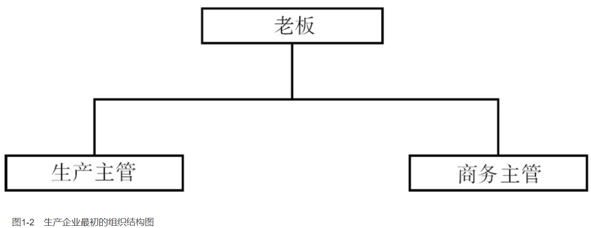
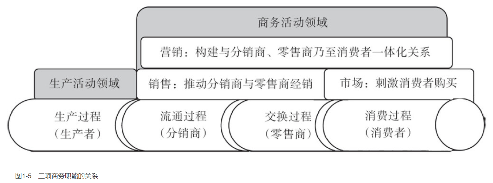

    作者: 包政
    出版社: 机械工业出版社
    出版年: 2015-7-6
    页数: 195
    定价: CNY 49.00
    装帧: 平装
    丛书: 包子堂系列丛书
    ISBN: 9787111500322

[豆瓣链接](https://book.douban.com/subject/26579684/)

- [总序](#总序)
  - [深度分销走到尽头](#深度分销走到尽头)
  - [生产企业面临的挑战](#生产企业面临的挑战)
  - [商业企业面临的麻烦](#商业企业面临的麻烦)
- [营销是一项商务职能](#营销是一项商务职能)
  - [营销与企业命脉相联系](#营销与企业命脉相联系)
  - [营销在企业组织中的位置](#营销在企业组织中的位置)
    - [营销是一项商务职能](#营销是一项商务职能-1)
    - [商务领域的三项职能](#商务领域的三项职能)
    - [商务领域的内在职能结构](#商务领域的内在职能结构)
    - [商务领域的外在表现方式](#商务领域的外在表现方式)
    - [商务活动方式的演变](#商务活动方式的演变)
- [营销的两种协调方式](#营销的两种协调方式)
  - [供求一体化的两种手段](#供求一体化的两种手段)
- [福特的大量销售方式](#福特的大量销售方式)
  - [大量生产方式的问世](#大量生产方式的问世)
  - [大量销售方式的必要](#大量销售方式的必要)
    - [大量生产方式的缺陷](#大量生产方式的缺陷)
    - [规模报酬递减的威胁](#规模报酬递减的威胁)
    - [大量销售方式的特征](#大量销售方式的特征)
    - [大量销售方式的有效性](#大量销售方式的有效性)

# 总序
## 深度分销走到尽头
波特有很多思想，集中体现在两本书中：一本叫《竞争战略》，一本叫《竞争优势》。其中谈到一体化战略，前向一体化，或后向一体化。前向一体化就是向下游走，后向一体化就是往上游走。

德鲁克有一个观点，企业必须集中配置资源在两个领域：或`技术领域`，或`市场领域`。据此可以推断，前向一体化的目的，是为了谋求市场扎根，后向一体化的目的，是为了谋求技术扎根。

像华为这样的公司，是`后向一体化`的典型代表，全力以赴向上游走，不惜一切代价，持续抢占关键资源，尤其是人才资源。就是不把钱放在银行，而是去获取具有影响力和支配力的关键资源。日本的三井财团，通过下属旗舰公司三井物产，实施资源的抢占，从能源矿产资源到人才资源，一切能够整合进价值链的关键资源它都要抓在手里，以形成企业的影响力，最后成为产业价值链的组织者。

除此以外，大部分生产制造企业，几乎都是`前向一体化`的。先是采用大量销售方式，后来转向深度分销方式。即不断整合渠道以及渠道终端门店的力量，展开市场的争夺战。

前向一体化的企业必须继续往前走，从供应链走向需求链，走进消费者的生活方式，谋求市场的最终扎根。

`深度分销`不是最终的商务活动方式，它的有效性在于资金利润率，这是厂商之间对立统一的基础。一旦边际利润趋向于零乃至负值的时候，深度分销方式也就走到了尽头，必须转向社区商务方式。

换言之，生产制造企业如果通过持续地提高产销量，就能获取规模经济上的好处，厂商之间就可以达到对立统一，携起手来，与对手展开竞争，用一条价值链打败另一条价值链。在我国台湾地区把深度分销方式称为`策略联盟`，或称`厂商合谋`。当所有企业都降低重心，唱着网络为王、决胜终端的歌谣，走上深度分销方式的时候，渠道网络的优势将丧失殆尽。接下来，就是降价促销，在释放产能、消化库存的过程中，成为现金流量依赖型企业。所有企业都深陷在竞争的旋涡之中，听天由命，难以自拔。

## 生产企业面临的挑战
第一个挑战是，产销矛盾加剧厂商矛盾。矛盾的主要方面是生产方式能不能改变，不能像丰田公司那样，从备货式生产方式，转向订单式生产方式。换言之，生产制造系统不能有效地控制存货以及存货偏差。相反，在现金流量压力下，持续地扩大产能和产量，迫使销售系统加大降价促销的力度，把过量生产的产品推销出去，甚至把工业库存转移到商业库存。

第二个挑战是，供求关系逆转，商家倒逼供应链。降价促销的结果，一定是供求关系逆转。生产的原则是效率，消费的原则是效用。生产企业不能改变生产方式，进而不能依靠性能来提高产品的性价比，那么最终的结果一定是产品效用递减，供求关系逆转，消费者主导市场以及主权意识强化。

所有的企业都做一个梦：其他企业能够在现金流量上倒下，倒下以后市场份额就归我了。所有企业都这样思考问题，最后导致的结果就是所有的企业都不挣钱，只要现金流量。

有了现金流，生产企业就可以通过别的方式挣到钱，比如，进入股市和房市，导致两市虚高。

## 商业企业面临的麻烦
**消费者主导市场的实质**是什么？

1. 是要求供应者提供信用，以便实现“产品—货币”的转换。一般而言，在上述销售的图式中，货币的信用是由国家提供的，而产品的信用必须由供应者提供。
1. 要求供应者跟进消费者在生活上的追求，以便在生活方式、生活品质、生活理念乃至生活态度上，持续获得良好的体验，获得美满的感觉。这两点，对处在产业价值链下游的商家来说，是满足不了的，即便借助于互联网或移动互联网手段，也是满足不了的。必须借助于产业价值链的力量，这意味着必须重构新型的厂商关系，使整条产业价值链或供应链协同起来去为消费者做贡献。

# 营销是一项商务职能
## 营销与企业命脉相联系
所谓`“销售”（Sales）`，简单说，就是实现“产品”向“货币”的转换。用学术一些的话说，“销售”是企业的一项专业职能，以实现“产品—货币”的转换。

所谓`“营销”（Marketing）`，就是构建“企业—客户”的关系，用学术一些的话说，“营销”是企业商务活动领域中的一项专业职能，也是企业维持再生产循环的一项核心职能，以构建“企业—客户”之间的关系。

## 营销在企业组织中的位置
### 营销是一项商务职能
生产企业一开始就有两个基本活动领域，一是`生产活动领域（Production）`，二是`商务活动领域（Business）`。生产活动领域覆盖`“生产过程”`，商务活动领域覆盖`“交换过程”`（见图1-1）。

营销则是商务活动领域的一项商务职能，并在商务活动领域发挥作用。

生产活动领域的性质是，实现“原辅料—产品”的转换，经济学把这称为“产品价值的创造”，企业界把这称为`“生产”`。商务活动领域的性质是，实现“产品—货币”的转换，经济学把这称为“产品价值的转换”，企业界把这称为`“销售”`。

与此相对应，生产企业的组织结构，最初也分为两个部门，一个是生产部门，另一个是商务部门（见图1-2）。大约在1900年以后，商务部门的称谓逐渐统一为销售部门。后来，有了研发部门，生产企业的基本部门结构有三个部门，即研发部门、生产部门和销售部门，简称“研产销”。现如今，规模大一些的企业，并床叠屋，架起来三大中心，即`研发中心`、`生产中心`和`销售中心`。

随着工业化历史的进程，尤其是企业规模的扩张，以及货币的媒介作用，有了“流通过程”，企业再生产过程循环不再是“生产过程—交换过程—消费过程”，而是“生产过程—流通过程—交换过程—消费过程”。与此对应，企业商务活动领域必然进一步延伸，把商务活动的触角延伸到流通过程、交换过程，乃至消费过程，确保产品顺利进入消费过程，确保企业再生产过程循环（见图1-3）。

在中国，分销与零售，被称作流通渠道以及渠道终端；分销商有各种派生的称谓，诸如代理商、经销商、贸易商、批发商及其一级商、二级商和零批兼营商，等等。零售商也有很多称谓，从大卖场到士多店，不胜枚举。

### 商务领域的三项职能
在企业商务活动领域中，最初只有“营销与销售”两项职能。营销职能从事的活动是，构建“企业—客户”关系，构建供求一体化关系；销售职能从事的活动是，实现“产品—货币”的转换。

随着产销规模的扩大，以及商业流通体系的形成，企业商务活动领域的触角开始延伸，销售职能开始分化，有了“市场”（Market）的职能。从此，企业商务活动领域有了三项职能，即营销（Marketing）、销售（Sales）与市场（Market）。

只有通过影响消费者产生需求（有的买），才能激发分销商及其零售商的销售热情（有的卖）（见图1-4）。

营销职能就是“开路”，开通从分销商、零售商到消费者的道路。销售和市场职能就是“开车”，推动产品顺利通过各个路段进入消费过程（见图1-5）。

### 商务领域的内在职能结构
商务职能部门做贡献的对象，一定是分销商、零售商和消费者。销售职能部门与市场职能部门，应该明确分工。前者对分销商及其零售商负责，努力为分销商及其零售商做贡献；后者对消费者负责，努力为消费者做贡献。两个职能部门应该在专业化分工的基础上，齐心协力形成一个整体，在实现“产品—货币”转换的层面上，共同为分销商、零售商以及消费者做贡献。营销职能部门则在另一个层面上，在构建“企业—客户”关系层面上，为分销商、零售商乃至消费者做贡献。由此形成商务职能部门的基本组织结构（见图1-6）。

### 商务领域的外在表现方式
商务活动领域的内在职能结构，称为“商务职能结构”，商务活动领域的外在表现形态，称为“商务活动方式”。在大量生产方式问世之后，商务活动领域大体呈现出三种基本活动方式，即`大量销售方`式、`深度分销方式`和`社区商务方式`。迄今为止，公认的生产活动方式是两种，一种是`福特生产方式`（又称“大量生产方式”），另一种是`丰田生产方式`（又称“精益生产方式”）。

### 商务活动方式的演变

第一，大量销售方式的产生。大量生产方式是在“供求分离”情况下发生的，企业并没有建立“供求一体化”的关系体系，或者说，并没有建立自己的目标消费群以及足够大的市场容量，反之，消费者也没有准备好要接纳某个企业滚滚而来的标准化商品。因此，对大量生产方式的企业而言，没有别的选择，只能依靠规模化生产的优势，展开规模化销售；依靠规模化销售，释放规模化生产的潜力。如此循环往复，形成产销联动，所谓“更大的规模、更低的成本、更低的售价，以及更强的促销”。依靠产销联动，量产量销，打击对手，夺取市场，刺激消费，扩大容量，维持企业再生产的循环。

**在大量销售方式下，销售职能处于主导地位，市场职能处于辅助地位；而营销职能基本上被销售职能取代**。

第二，深度分销方式的兴起。深度分销方式的实践很早，可以追溯到100多年前。1903年，美孚依靠自己的商务实践，创造了深度分销方式。在中国，最早的深度分销方式，出现在1989年的花果山与三得利的合资企业。大体的做法就是“降低销售重心”，把商务活动的触角延伸出去，通过经销商延伸到零售门店，以此来提高销售效率，扩大销售数量。1998年，随着TCL的迅速崛起，才有了`“深度分销方式”`的称谓。宝洁公司把这称为`“分销一体化系统”`（Integrated Distribution System，IDS），台湾人称之为“厂商策略联盟”，可口可乐公司称之为“独特的业务发展模式”，其中包括“储运101（RSC101）项目”。

深度分销方式的特点，就是把分销商和零售商组织起来，形成一体化关系体系，包括利益关系和分工关系。进而，在“争夺市场”的整体策略引导下，共同推动企业的产品进入消费领域，包括依靠零售门店的主动性和创造性，强化对消费者的推介、导购和展示，等等。说白了，就是厂家和商家联手，做大产销规模，共享规模经济的好处。生产企业就可以借助于分销商的合作意愿，把商务活动的触角延伸到零售门店乃至最终消费者，打通分销到零售的全过程，是谓“深度分销”。可以说，**企业之争，不只是“产品”，更重要的是“关系”。谁拥有网络化的厂商一体化关系，谁就能够提高产销效率和产销规模，并能阻断竞争对手的产品顺利进入消费领域**。

第三，社区商务方式的趋势。当一个行当所有企业都纷纷转向深度分销方式的时候，谁都无竞争优势可言。维持再生产循环，主要靠降价、促销、拼资源。要想摆脱困境，摆脱恶性竞争的漩涡，就必须顺应供求关系逆转的趋势，进一步把商务活动的触角延伸到消费领域。在那里，与消费者或用户结成一体化关系，谋求“市场扎根”或“扎根于市场”。打通企业再生产的全过程，即“生产—流通—交换—消费”。

**对B2B的企业来说，就是走进用户的价值链；对B2C的企业来说，就是走进消费过程，走进消费者的生活方式**。

# 营销的两种协调方式
## 供求一体化的两种手段

应该指出，斯密讨论的是社会再生产的组织问题；钱德勒讨论的是企业再生产的组织问题。斯密强调用看不见的手，把社会再生产过程组织起来，形成供求一体化状态，钱德勒强调用看得见的手，把企业再生产过程组织起来。

# 福特的大量销售方式
## 大量生产方式的问世
规模化竞争的直接后果，就是增强了企业对资本投入量的依赖，强化了资本及其资本所有者的地位和作用。资本也就成为稀缺资源，谁能获取资本、获取资本所有者的支持，谁就能够打开挣钱的通道。反之，投资规模不足，达不到关键规模，就无法建立低成本优势，甚至会丧失参与竞争的资格。

## 大量销售方式的必要
### 大量生产方式的缺陷
大量生产方式一旦问世，其内在的缺陷就会显现出来，即不断再生产出过量的或过剩的标准化产品，同时引发企业之间规模化扩张的恶性竞争，不断地破坏供求之间的平衡，甚至威胁到一个社会的正常运行。

### 规模报酬递减的威胁
从企业自身的角度说，采用大量生产方式后，一旦失去降价能力或者失去市场控制能力和地位，就会即刻陷入困境，出现规模不经济的现象。换言之，产品销售会变得更为困难或受阻，为了维持再生产的循环以及减免存货风险，不得不“降价促销”。

### 大量销售方式的特征
大量生产企业的生存法则及其内在逻辑是，持续扩大规模、降低成本、降低售价、提高产品性价比。由此决定了大量销售方式的本质特征，这就是依靠持续降价促销，刺激消费，打击对手，扩大市场份额，使市场需求持续发生在本企业产品上，使规模经济的效应发挥出来，使规模化连续生产的效能发挥出来。

这不同于传统的生产活动方式，强调坚守本行，精于一道，依靠专业化的能力，提高产品差异化程度，提高产品的性价比。也不同于小生产条件下的商务活动方式，强调以营销为基础，努力构建与深化“企业—顾客”的联系，努力建立信誉或商誉，为自己的产品提供信誉，为销售奠定基础。

### 大量销售方式的有效性
在大量销售方式下，老板以及销售总部总经理，主要负责大客户的开拓与维护；同时，制定政策和策略，以年度购销协议的方式，构建分销以及零售网络体系（见图3-3）。

