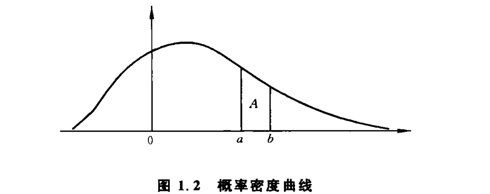

        作者:  陈希孺 
        出版社: 清华大学出版社
        出版年: 2000-5
        页数: 192
        定价: 15.00元
        装帧: 平装
        丛书: 院士科普书系第一辑
        ISBN: 9787302036623

[豆瓣链接](https://book.douban.com/subject/1032716/)

- [概率——机会大小的度量](#%e6%a6%82%e7%8e%87%e6%9c%ba%e4%bc%9a%e5%a4%a7%e5%b0%8f%e7%9a%84%e5%ba%a6%e9%87%8f)
  - [古典概率——比率](#%e5%8f%a4%e5%85%b8%e6%a6%82%e7%8e%87%e6%af%94%e7%8e%87)
  - [大数定律](#%e5%a4%a7%e6%95%b0%e5%ae%9a%e5%be%8b)
  - [统计概率——频率](#%e7%bb%9f%e8%ae%a1%e6%a6%82%e7%8e%87%e9%a2%91%e7%8e%87)
  - [主观概率](#%e4%b8%bb%e8%a7%82%e6%a6%82%e7%8e%87)
  - [概率分布](#%e6%a6%82%e7%8e%87%e5%88%86%e5%b8%83)
  - [期望与方差](#%e6%9c%9f%e6%9c%9b%e4%b8%8e%e6%96%b9%e5%b7%ae)
    - [期望及其意义](#%e6%9c%9f%e6%9c%9b%e5%8f%8a%e5%85%b6%e6%84%8f%e4%b9%89)
    - [切比雪夫大数定律](#%e5%88%87%e6%af%94%e9%9b%aa%e5%a4%ab%e5%a4%a7%e6%95%b0%e5%ae%9a%e5%be%8b)
    - [标准差的误差估计](#%e6%a0%87%e5%87%86%e5%b7%ae%e7%9a%84%e8%af%af%e5%b7%ae%e4%bc%b0%e8%ae%a1)
    - [正态分布标准差](#%e6%ad%a3%e6%80%81%e5%88%86%e5%b8%83%e6%a0%87%e5%87%86%e5%b7%ae)
- [统计学——收集和分析数据的学问](#%e7%bb%9f%e8%ae%a1%e5%ad%a6%e6%94%b6%e9%9b%86%e5%92%8c%e5%88%86%e6%9e%90%e6%95%b0%e6%8d%ae%e7%9a%84%e5%ad%a6%e9%97%ae)
  - [什么是统计学](#%e4%bb%80%e4%b9%88%e6%98%af%e7%bb%9f%e8%ae%a1%e5%ad%a6)
  - [从部分推整体：归纳与演绎](#%e4%bb%8e%e9%83%a8%e5%88%86%e6%8e%a8%e6%95%b4%e4%bd%93%e5%bd%92%e7%ba%b3%e4%b8%8e%e6%bc%94%e7%bb%8e)
  - [统计规律与因果关系](#%e7%bb%9f%e8%ae%a1%e8%a7%84%e5%be%8b%e4%b8%8e%e5%9b%a0%e6%9e%9c%e5%85%b3%e7%b3%bb)
- [抽样调查](#%e6%8a%bd%e6%a0%b7%e8%b0%83%e6%9f%a5)
  - [简短的历史](#%e7%ae%80%e7%9f%ad%e7%9a%84%e5%8e%86%e5%8f%b2)
  - [抽样的方法](#%e6%8a%bd%e6%a0%b7%e7%9a%84%e6%96%b9%e6%b3%95)
  - [数据的分析（区间估计与点估计）](#%e6%95%b0%e6%8d%ae%e7%9a%84%e5%88%86%e6%9e%90%e5%8c%ba%e9%97%b4%e4%bc%b0%e8%ae%a1%e4%b8%8e%e7%82%b9%e4%bc%b0%e8%ae%a1)
- [通过试验收集数据](#%e9%80%9a%e8%bf%87%e8%af%95%e9%aa%8c%e6%94%b6%e9%9b%86%e6%95%b0%e6%8d%ae)
  - [试验需要设计](#%e8%af%95%e9%aa%8c%e9%9c%80%e8%a6%81%e8%ae%be%e8%ae%a1)
  - [双盲试验](#%e5%8f%8c%e7%9b%b2%e8%af%95%e9%aa%8c)
  - [单因素试验](#%e5%8d%95%e5%9b%a0%e7%b4%a0%e8%af%95%e9%aa%8c)
  - [多因素试验](#%e5%a4%9a%e5%9b%a0%e7%b4%a0%e8%af%95%e9%aa%8c)
- [数据的统计分析——机会限度的认识](#%e6%95%b0%e6%8d%ae%e7%9a%84%e7%bb%9f%e8%ae%a1%e5%88%86%e6%9e%90%e6%9c%ba%e4%bc%9a%e9%99%90%e5%ba%a6%e7%9a%84%e8%ae%a4%e8%af%86)
  - [显著性检验](#%e6%98%be%e8%91%97%e6%80%a7%e6%a3%80%e9%aa%8c)
  - [拟合优度检验](#%e6%8b%9f%e5%90%88%e4%bc%98%e5%ba%a6%e6%a3%80%e9%aa%8c)
  - [相关与相关系数](#%e7%9b%b8%e5%85%b3%e4%b8%8e%e7%9b%b8%e5%85%b3%e7%b3%bb%e6%95%b0)
  - [回归方程](#%e5%9b%9e%e5%bd%92%e6%96%b9%e7%a8%8b)

## 概率——机会大小的度量
机遇、机会、偶然性（随机即随机会而定的意思），在本书讨论的范围内，有同一的意义，指的是一种在事前没有确实的把握，只能在事后见分晓的情况。

机遇或偶然性之所以存在，是由于人类的知识的局限性。

我们讨论只涉及关于偶然性的这样一个方面：虽说由于偶然性的作用，世上的万事万物呈现出一种无序、不可预测以至纷乱的形态，但在这纷乱中，仍有一定的规律性可寻。

本书的主题就是“机遇的数量化”。

### 古典概率——比率
一般，有n个相异的物件，从其中取出r个进行排列，不同的做法有多少种？用P(n,r)记这个数目，有公式：

P(n,r)=n·(n-1)·(n-2)···(n-r+1)  (1)

它利用下述的一般原则：如果办一件事要依次序经过r个环节，而完成第1个环节有n1种不同的办法，完成第2个环节有n2种不同的办法，依次类推，直到完成第r个环节有nr种不同的方法，则办成这件事的不同方法，总共有n1·n2···nr种。

把上述一般原则用于P（n，r）的计算问题。先把“从n物件中取r个去排列”这件事分解成r个环节去办。设物件自左至右排列。先从n物件取1个排在最左边，不同的做法有n种。次一环节是从剩下的n-1个物件中，取1个排在（自左数起）第2位。因只剩下n-1个物件，完成这一环节的不同做法只有n-1。下面再依次取排在第3、第4…到第r位的物件，方法有n-2,n-3,…,n-r+1种。因而不同的排法总数，安上述一般原则，应是n,n-1,…到n-r+1这r个数连乘。

当r=n，按（1）式有：

P(n,n)=n·(n-1)···3·2·1

即最初n个正整数连乘，其结果称为n的“阶乘”，记为n！。

组合数：从n个相异物件中取r个组合，其不同做法的总数C(n,r):

C(n,r)=P(n,r)/r!=n·(n-1)···(n-r+1)/r! (2)

每一个由r物件构成的组合，可以通过将这r物件任意排列，其数目按刚才的论证为r！。因此，排列数P（n，r）应为组合数C（n，r）的r!倍。

基于试验结果的等可能性，用公式P(A) = M / N规定的概率，叫做`“古典概率”`。

### 大数定律
说到底，从现实世界的角度看，大数定律是人类观察到的一个经验规律。伯努利大数定律（及其他形形色色的大数定律）的意义，在于对这样一个经验规律给了一个理论上的解释。

### 统计概率——频率
设观察了n次而事件A出现了m次，m/n称为事件A的`频率`。我们相信，当n愈来愈大时，频率m/n随有些摆动，但幅度愈来愈小而最终会“趋近”于某一介于0与1之间的值p，就把这个p定义为事件A的`概率`。用这种方式定义的概率叫做“统计概率”，因为它是通过“统计”（即进行观察）去定义概率的。

在古典概率的场合，事件概率有一个不依赖于概率的定义——它根本不用诉诸试验，这样才有一个频率与概率是否接近的问题，其研究导致伯努利大数定律。在统计定义的场合这是一个悖论：你如不从承认大数定律出发，概率就无法定义，因而谈不上频率与概率接近的问题。但如你承认大数定律，以便可以定义概率，那大数定律就是你的前提，而不是一个再需要证明的论断了。

在平面几何中，像“过两点有一条且只有一条直线”、“过直线外一点有一条且只有一条与此直线平行的直线”等，就是作为不加证明而接受的公理。在1933年，前苏联数学家柯尔莫哥洛夫把这种公理化的思想用到概率上。从几条简单的公理出发，推导出其他内容。

### 主观概率
这种基于主观判断定出的概率，叫做`“主观概率”`。主观概率是认识主体根据其所掌握的知识、信息和证据，而对某种情况出现可能性大小所做的数量判断。

### 概率分布
概率分布中 **“分布”一词的意思是：它指明全部概率是1是如何分布到（分配到）随机变量x的各个可能值的。**

对于连续型的随机变量，我们不采取逐一列举其概率的办法，而是设法定出如图1.2那样一条曲线，称为`概率密度曲线`。此曲线位于一条横轴的上方，它与横轴一起所谓成的面积为1，而变量落在指定的两个数a和b之间的概率，就是图中用字母A标出的那一块条形的面积。



### 期望与方差
#### 期望及其意义
一般，如果随机变量x能够取的值是 $a_1,a_2,\cdots,a_r$，取这些值的概率为 $p_1,p_2,\cdots,p_r$，则把

$E(x)=a_1p_1+a_2p_2+...+a_rp_r\ (4)$

称为x的`期望`。如果对x做大量次数的观察，则由于偶然性的影响，x的各次取值将呈现出一个很纷乱的状态，但其中有规律性在，即随着观察次数的增加，其平均取值的波动愈来愈小，最后稳定到一个值，此值即x的期望。从这个解释可以看出：**期望的意义要在大量重复观察中才能体现出来。**

#### 切比雪夫大数定律
“关于期望值的大数定律”：对一个随机变量进行多次观察，其各次取值的平均愈来愈接近它的期望值。这个定律最初是由俄国数学家切比雪夫在19世纪中叶首先提出，故常称为`切比雪夫大数定律`。到20世纪30年代，苏联数学家柯尔莫哥洛夫给了这个定律以一个更完备的形式，称为`柯尔莫哥洛夫大数定律`。

#### 标准差的误差估计
设有一个很大的群体，其个体的某项指标x（如人的身高）在全群体中的平均值a未知，通过从该群体中抽得的若干个体的数值 $x_1,x_2,\cdots,x_n$ （如抽出的n个人的身高）去估计它，从大数定律可知，$x_1,x_2,\cdots,x_n$ 的算术平均：

$\bar{x}=\frac{x_1+x_2+\cdots+x_n}{n}\ (7)$

是一个合用的估计。当抽取观察的个体数n增加时，估计的误差会下降，理论上可以证明，总得讲 **误差随$\sqrt{n}$成比例下降。** 例如，$\sqrt{16}=4,\sqrt{144}=12$。因此按上述规律，若甲的观察数为16而乙的观察数为144，则总得讲，甲所作估计的误差将是乙所作估计的误差的3倍。

这个规律的确切解释用到标准差。如上所述，x的标准差σ(x)，反映x与其均值a偏离的程度，这是一个综合性的指标。如果对x观察n次得$x_1,x_2,\cdots,x_n$，而按（7）式计算其算术平均$\bar{x}$，则可以证明：$\bar{x}$的标准差$\sigma(\bar{x})$缩减到原来的$\sqrt{n}$分之一：

$\sigma(\bar{x})=\frac{\sigma(x)}{\sqrt{n}}$

#### 正态分布标准差
正态分布依赖两个参数μ和σ。μ就是分布的均值。σ的值决定了曲线的陡峭程度：σ愈小，曲线愈陡峭，而这又意味着分布的集中度高。σ就是分布的标准差。正态分布用$N(\mu,\sigma^2)$来记。

在正态分布的情况下，用n个观察值的算术平均$\bar{x}$去估计期望μ，其所产生的误差与标准差σ和n的关系，有一个简单的描述，那就是，“$\bar{x}$与μ的差距不超过$c \cdot \frac{\sigma}{\sqrt{n}}$”的概率，即：

$P_c=P(-c \cdot \frac{\sigma}{\sqrt{n}} \le \bar{x}-\mu \le c \cdot \frac{\sigma}{\sqrt{n}})\ (8)$

用$P_c$这么大的概率保证：虽然$\bar{x}$不大可能恰好等于要估计的μ，但它与μ的差距很可能不会超过$c \cdot \frac{\sigma}{\sqrt{n}}$。（8）式中的$P_c$的值依赖于c，可以从专门制备的“正态分布表”上查到。例如：

$p_{1.6449}=0.90,  p_{1.9600}=0.95,  p_{2.5758}=0.99$

公式（8）在实用上有多方面的用途，举一个例子，在应用上有时我们会面临如何决定n的问题。n定得太小，则用$\bar{x}$去估计μ可能产生过大的误差。反之，若n定得太大，则会造成不必要的浪费。如何确定n，要根据对估计的质量的要求。比如说，要求以0.95的概率保证$\bar{x}$与μ的差距不超过0.5，因为$p_{1.96}=0.95$,按（8）式，这等于要求：

$(1.96)\frac{\sigma}{\sqrt{n}}=0.5$

或

$n=\frac{(1.96\sigma^2)}{(0.5)^2}=(15.3664) \cdot \sigma^2$

如果此数不是整数，则以其邻近而大于它的整数取代之。例如算出的结果为17.3565，则用18取代。这个解法要求已知σ的值。

观察次数n与用$\bar{x}$去估计μ的误差之间的关系——平方根比律，在历史上首先是由法国概率论学者棣莫弗在1733年发现的。

这个规律反映了一种“报酬递减”的性质：随着观察次数的加大，每再增加一次观察的收益（体现在用$\bar{x}$估计μ的误差的下降上）减少：观察400次而做出的估计所产生的误差，较之观察100次而做出的估计所产生的误差，只缩小了一半。换句话说，后300次观察（在前100次观察的基础上）的效益，与前100次观察同。这告诉我们：一味追求加大观察次数是无益的。

## 统计学——收集和分析数据的学问
### 什么是统计学
用实证的方法研究问题，都要涉及收集数据以及对数据进行整理和分析，统计学就是研究做这些事情的方法和理论的学问。

统计学是有关收集和分析带随机性误差的数据的科学和艺术。分析着重在数理化，而随机性的数量化，是通过概率表现出来，由此可以看出统计学与概率论的密切关系。大体上，二者的关系是：概率论是统计学的理论和方法的依据，而统计学可视为概率论的一种应用。

### 从部分推整体：归纳与演绎
统计方法是一种归纳性质的方法，统计推断是一种归纳推理。

### 统计规律与因果关系
“统计规律”这个提法的启示是：教人看问题不可绝对化，因而有思想方法上的教育意义。习惯于从统计规律看问题的人在思想上不拘执一端：他既认识到一种事物从总的方面看有其一定的规律在，也承认存在例外的个案。

从反面讲，也可以说统计规律这种东西的出现，反映了人类认识上的局限性，反映了人类对偶然性的作用无力完全掌握，也反映了人类在这种局限性的约束下认识自然的一种努力，即在偶然性造成的纷乱无序的状态下，尽量从中找出一些虽不完善，但具有规律性的品格的东西。

其次，统计方法只是从事物的外在数量表现上去研究问题，通过对数据的分析，揭示可能有某种规律性的东西存在，而不涉及事物的质的规定性。换句话说，统计分析的结果可以告诉你，从观察和试验资料来看事情是怎样的，而不能告诉你为什么为这样。

应当指出的是：统计规律未必蕴含因果关系，这一点，是统计方法的本性而非缺陷。寻找因果关系是各类专门学科的任务。

## 抽样调查
### 简短的历史
随机抽样归结到一个基点：要求群体中的每一个体有同等机会（概率）被抽出，这样，哪一个体进入样本，纯由机会确定。

每一项抽样调查，都应附有对所有抽样方法的仔细陈述。若没有这样的陈述，研究的结论的可靠性和精度就无从评估。

### 抽样的方法
这种将样本的选定委之于机会的抽样，叫做随机抽样。随机抽样方法把调查对象的选定委之于机会，目的是为了避免调查者主观上的偏向性。

### 数据的分析（区间估计与点估计）
以下几个问题及研究处理方法是典型的：

1. 总体分布
2. 总体平均值
3. 总体方差
4. 总体均值的估计：样本均值
5. 总体方差的估计：样本方差

$\tilde{\Delta}^2=\frac{N-1}{(n-1)N}\sum_{i=1}^n(x_i-\bar{x})^2\ (13)$

其中N是总体所含个体数。$\tilde{\Delta}^2$是修正的样本方差，它是$\sigma^2$的无偏估计。

作为抽样的目的，主要是为估计总体平均值a，其所以估计总体方差$\sigma^2$，在很多情况下，是为了由此评估用样本均值$\bar{x}$估计a的精度如何。

a的值界于$\bar{x}-h\frac{\tilde{\Delta}}{\sqrt{n}}$与$\bar{x}+h\frac{\tilde{\Delta}}{\sqrt{n}}$之间（14）

其中$\tilde{\Delta}$由（13）式算出，n为样本量。h是一个选定的大于0的数。从（14）看出：1）$\tilde{\Delta}$愈小，此界限愈窄，表明以$\bar{x}$估计a的误差小。$\tilde{\Delta}^2$是作为总体方差σ2的估计。权且认为$\tilde{\Delta}$大体上为σ，σ愈大，总体中各个值的指标散布也大，在这种情况下，总体均值a就难得估准，反映在（14）式中，a的误差界限就大一些；2）$\sqrt{n}$在分母，故n愈大，（14）式规定的界限愈窄。

h取得愈大，由（14）定的界愈宽。它真能成立的可能性就更大。正如估计人的年龄，估计他在30 ~ 31岁之间，成立的可能性不大，若估计他在10 ~ 80之间，则可能性大多了。由此可见，a的选择面临一个“可靠性”与“准确性”的矛盾问题：把事情说得太确切，不留余地，可靠性就低；说得稀松一些，留有余地，可靠性就搞。在应用上选择a时是在这二者之间做出适当的折衷，看哪个因素更要紧一些。在统计学上比较常用：

```
h=2.5758,相应于可靠度99%；
h=1.9600,相应于可靠度95%；
h=1.6449,相应于可靠度90%。
```

像（14）这样的断语，称为a的`“区间估计”`，相应地，像“用$\bar{x}$估计a”称为a的“点估计”。

## 通过试验收集数据
### 试验需要设计
干扰一个试验结果的有：（1）混入的系统性因素。（2）随机性的误差。前者是指那种显著的，可以造成重大错误的因素，例如病人的情况不同可能对疗效的估计产生重大错误。又如要通过试验验证，一种工业产品的新配方（或新工艺），是否真能改善产品的性能。但新旧两种配方的试验分在两个工厂做，而这两个工厂的设备条件和工人素质都有差异，后者作为系统性因素混入试验结果，使我们无法做出可信的结论。随机性因素的影响是不可能完全消除的，只能采取一些办法加以抑制。

### 双盲试验
比如某厂试验了一种新药，要通过临床试验鉴定其疗效如何。首先，要预备一种表面上看与药物完全一样，但不含任何疗效成分的安慰剂。其次，要设对照组，即准备服用安慰剂的一组病人。受试的病人编入治疗组或对照组按随机的方式决定，以免由于偏向而将条件好的病人多分入某一组。第三，参加试验的病人并不知道他分在哪一组，给药的医生以及评估疗效的医生也不知道谁分在哪一组，以及谁吃了药还是安慰剂。这样，无论是病人自己还是参加试验的医生，都处在盲目的状态中，不致因心理作用或态度上的偏向而干扰试验结果。

### 单因素试验
试验有一定的目标。例如，一个农业试验的目标，可以是为了比较3个小麦品种的优劣。3个小麦品种是我们要比较的对象。我们把“品种”称为问题中的一个`“因素”`或`“因子”`，本试验要比较的对象只有品种一个因素，在统计学上称为“单因素试验”，如果试验的目的还包括比较几种肥料的优劣，则是一个2因素试验。

3个小麦品种，是这个因素的一个`水平`，故总共有3个水平。

设计试验的下一步骤，是要确定每个水平的“`重复度`”，就是准备拿每个水平做多少次试验。

### 多因素试验
多因素试验是指在同一个试验中，影响目标值的因素有2个或2个以上，且这些因素的作用都在试验考察的范围内。一个简单的例子，设有两个种子品种A和B，两个播种量a和b，按复合试验，有4个组合要做试验：

Aa，Ab，Ba，Bb

每一个可能的组合，例如Ab，称为一个“处理”。本试验共有2个因素，每因素各有2水平，处理总数是所有可能的组合数，即

处理总数=各因素的水平数的乘积（2 x 2 = 4）

## 数据的统计分析——机会限度的认识
### 显著性检验
“女士品茶”：一种饮料由牛奶（milk）和茶（tea）混合而成，调制时可以先倒茶后倒牛奶（TM），也可以先倒牛奶后倒茶（MT）。有一位女士说她能分辨（鉴别）此二者。费歇尔设计了一个试验来检验该女士的说法是否确实。试验的布置是：准备8杯看上去一样的饮料，其中TM和MT各4杯，把这一点告诉该女士（但不指出哪4杯是TM），然后让她品尝这8杯饮料，指出哪4杯是TM。根据她的回答来估量她是否确有分辨TM和MT的能力。

从8杯中挑出4杯的不同挑法有：$C(8,4)=\frac{8 \cdot 7 \cdot 6 \cdot 5}{1 \cdot 2 \cdot 3 \cdot 4}=70$

其中只有一种是全部条对，其可能性（概率）只有1/70。因此，在“该女士4杯全部挑对”这个试验结果出现时，只有两种可能的解释：

1. 该女士对TM和MT并无鉴别能力，所得结果纯属偶然。
2. 该女士对TM和MT有一定的鉴别力。

按上面的计算，若坚持第一种解释，则我们就得承认：发生了一件其概率只有1/70的事情。由于1/70相当小，这看上去不大可信，因而我们摒弃这一解释而接受第二种解释。结论：试验结果支持“该女士对TM和MT有一定鉴别力”的说法。

费歇尔的推理中包含以下几个要点：

1. 问题是要辨明试验结果是否支持某种效应（例如，能分辨TM和MT）。
2. 把“效应不存在”作为一个“假设”（假设该女士对TM和MT无鉴别力）。
3. 找一个显示试验结果与假设之间的偏差的量，在“假设正确”的前提下，计算出现这么大偏差的概率p。
4. 如果p小到某个程度，以至认为发生概率那么小的事件为不可信，则认为数据没有给假设以足够的支持，或反过来说，数据支持“效应存在”的说法。反之，若p并非足够小，则数据没有给予“否定假设”以足够的支持。

费歇尔把这种性质的推理叫做“`显著性检验`”。显著程度是用概率来表示，概率愈小，显著性愈高，肯定效应存在的理由就愈充足。

一般指定阈值为0.05或0.01，称其为“`显著性水平`”。

### 拟合优度检验
有一随机变量x，根据某种理论，其分布表应为：

(3):

x的取值 | a1 | a2 | ... ak
-----|----|----|-------
事故概率 | p1 | p2 | ... pk

为检验这是否正确，对x进行n次观察，发现其取a1,a2,…,ak等值的次数分别为n1,n2,…,nk。问这一结果与分布表（3）拟合的程度如何。

皮尔逊处理这个问题的想法是：找一个反映数据与假设的偏差的量D，D愈小，数据与假设之间的拟合就愈好。按一定的方法把D值转换成一个概率p（D）。p（D）的意思可以确切地解释为：即使假设正确，但由于观察结果受到偶然性的影响，数据与假设之间也会呈现一定的偏差。偏差大到或超过D这样的限度的概率，就是p（D）。p（D）愈大，就表明发现像D这么大的偏差不算稀奇，而我们就认为观察数据与假设拟合得比较好。如果p（D）很小，就表明：所发现的偏差，仅从观察结果受到偶然影响这方面去解释就比较牵强。因此，把概率p（D）称为（数据与假设之间的）拟合优度。如果要求一个黑白分明的判定，则可以定下一个阈值，例如0.05，0.01之类，当p（D）小于此阈值时，就否定假设。这与费歇尔的显著性检验一样，此阈值也就是检验的水平。

设一共观察了n次，因为X取a1为值的概率为p1，平均讲在n次观察中X应有np1次值a1，而真实观察的取a1的次数为n1，对每个值a1，a2，…,ak依次类推，算出D：

$D=\frac{(n_1-np_1)^2}{np_1}+=\frac{(n_2-np_2)^2}{np_2}+...+=\frac{(n_k-np_k)^2}{np_k}\ (4)$

称为`皮尔逊统计量`。

表5.1 对应于阈值0.05和0.01的D值

阈值\k | 2 | 3 | 4 | 5 | 6 | 7 | 8 | 9
-----|---|---|---|---|---|---|---|--
0.05 | 3.841 | 5.991 | 7.815 | 9.488 | 11.070 | 12.592 | 14.067 | 15.507
0.01 | 6.635 | 9.210 | 11.341 | 13.277 | 15.086 | 16.812 | 18.475 | 20.090

表中所列的，就是相应于某个k（k就是（3）中的那个k）和阈值的D值。若由数据算出的D值超过表中的值，则认为观察数据与假设的偏差，已大到不能仅用偶然性去解释的地步，而决定否定原假设。若D不超过表中的值，则认为偏差尚未大到不可用偶然性去解释的程度，而维持这个假设。

用皮尔逊的方法来处理前面的例子。在工厂事故的例中，k=3，n1=6，n2=3，n3=6，n=n1+n2+n3=15，p1=p2=p3=1/3，代入（4）得D值为：

$D=\frac{(6-5)^2+(3-5)^2+(6-5)^2}{5}=\frac{6}{5}=1.2$

此值小于表5.1中k=3所对应的D值。因此，在0.05的水平上，数据没有给“各班次发生事故的机会有差异”这个说法以足够的支持。

### 相关与相关系数
以X，Y记一对变量，对它们进行了n次观察，结果为（x1，y1），（x2，y2），…，（xn，yn）。

$\Delta_x=\sqrt{\sum_{i=1}^n(x_i-\bar{x})^2}\ (5)$

$x_1'=(x_1-\bar{x})/\Delta_x,$

$x_2'=(x_2-\bar{x})/\Delta_x,$

$\cdots$

$x_n'=(x_n-\bar{x})/\Delta_x,$

$y_1'=(y_1-\bar{y})/\Delta_y,$

$y_2'=(y_2-\bar{y})/\Delta_y,$

$\cdots$

$y_n'=(y_n-\bar{y})/\Delta_y.$

$\Delta_y=\sqrt{\sum_{i=1}^n(y_i-\bar{y})^2}\ (6)$

$r=x_1'y_1'+x_2'y_2'+...+x_n'y_n'\ (7)$

r就是`相关系数`。以上讲的是有了样本如何计算相关系数。因r是由样本计算所得，故常称为“样本相关系数”。但样本只是总体的一部分，它受到偶然性的影响，故样本相关系数r中包含了偶然的成分。

总体相关系数𝞺（理论相关系数）才确切反映相关的程度。r仅是𝞺的一个估计。它的误差与样本量n有关：n愈大，误差愈小。

表5.2 相关系数的0.05界限值

样本量 | 10 | 20 | 30 | 40 | 50 | 60 | 70 | 80 | 90 | 100
----|----|----|----|----|----|----|----|----|----|----
界限值 | 0.63 | 0.42 | 0.35 | 0.30 | 0.27 | 0.25 | 0.23 | 0.22 | 0.21 | 0.19

例如，你抽的样本有10个，则算出的样本相关系数绝对值|r|必须大于0.63，才能否定𝞺=0的假设。而如果样本量为100，则|r|只须大于0.19就行。

### 回归方程
对于x，y的回归方程式，x，y之间无严格的关系，这方程也不是对群体中任一个样本都对，而是在平均意义上，或者说，它用一个简练的形式总括了x，y之间的复杂关系的大趋势。