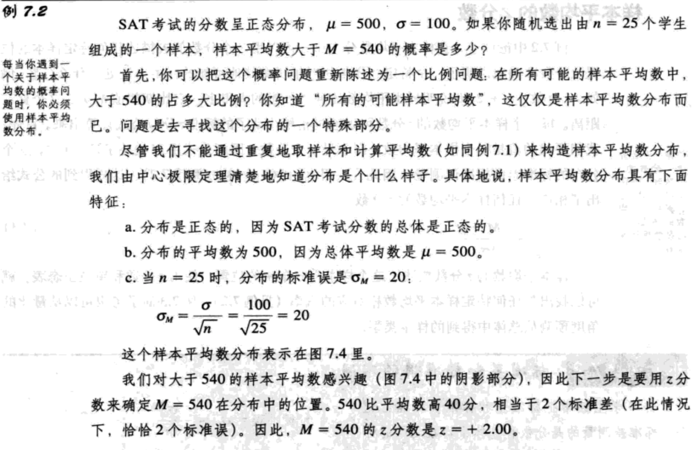
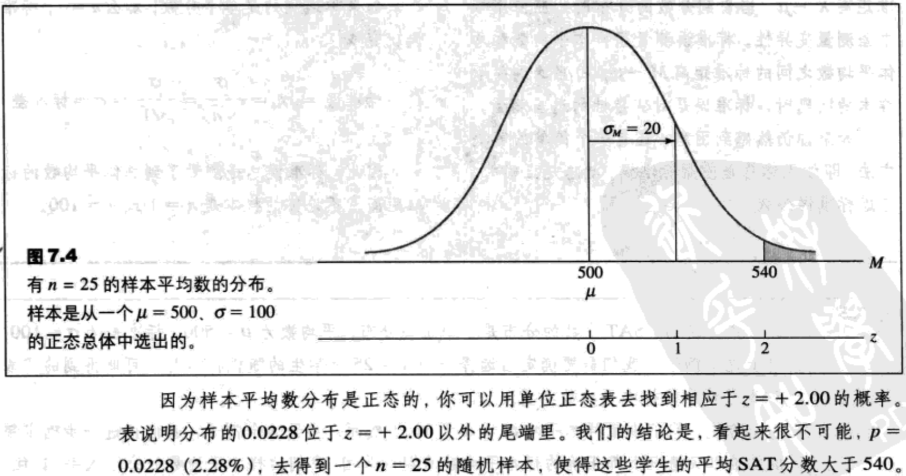
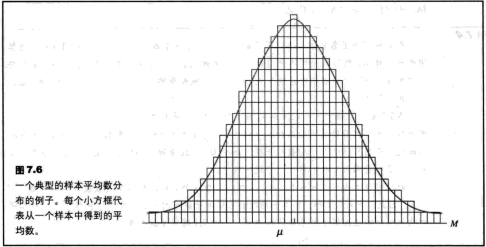
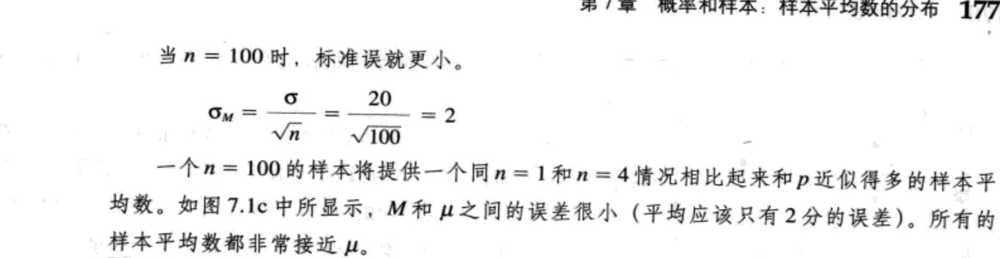

- [概率和样本：样本平均数的分布](#%e6%a6%82%e7%8e%87%e5%92%8c%e6%a0%b7%e6%9c%ac%e6%a0%b7%e6%9c%ac%e5%b9%b3%e5%9d%87%e6%95%b0%e7%9a%84%e5%88%86%e5%b8%83)
  - [概述](#%e6%a6%82%e8%bf%b0)
  - [样本平均数的分布](#%e6%a0%b7%e6%9c%ac%e5%b9%b3%e5%9d%87%e6%95%b0%e7%9a%84%e5%88%86%e5%b8%83)
    - [中心极限定理](#%e4%b8%ad%e5%bf%83%e6%9e%81%e9%99%90%e5%ae%9a%e7%90%86)
    - [标准误](#%e6%a0%87%e5%87%86%e8%af%af)
  - [概率及样本平均数的分布](#%e6%a6%82%e7%8e%87%e5%8f%8a%e6%a0%b7%e6%9c%ac%e5%b9%b3%e5%9d%87%e6%95%b0%e7%9a%84%e5%88%86%e5%b8%83)
  - [标准误的进一步讨论](#%e6%a0%87%e5%87%86%e8%af%af%e7%9a%84%e8%bf%9b%e4%b8%80%e6%ad%a5%e8%ae%a8%e8%ae%ba)

## 概率和样本：样本平均数的分布
### 概述
`样本误差`是样本数据和它对应着的总体参数之间的差异，或者说误差的数量。

### 样本平均数的分布
`样本平均数的分布`是在一个总体中所有可能的固定大小（n）的随机样本平均数的集合。

`取样分布`是一组统计数据的分布，这组统计数据是由从一个总体中取出所有可能的固定大小的样本得到的。

#### 中心极限定理
`中心极限定理`：对于任意平均数为μ、标准差为σ的总体，样本大小为n的样本平均数分布具有平均数$\mu$，标准误$\sigma/\sqrt{n}$，并且当n趋于无穷时，分布趋于正态。

样本平均数分布的平均数等于μ（总体平均数），它被称为M的`期望值`。

#### 标准误
样本平均数分布的标准差被称为`M的标准误`。标准误估计了由于随机性所造成的M和μ之间的标准差量。

M的标准误=$\sigma_M$=M和μ之间的标准距离。

`大数定律`指出，样本大小（n）越大，样本平均数同总体平均数的可能性越大。

标准误=$\sigma_M=\frac{\sigma}{\sqrt{n}}\ (7.1)$

注意到公式满足标准误的所有要求。具体地说：
1. 当样本大小（n）增大，标准误减小（大样本更精确）；
2. 当样本只含一个分数时（n=1），标准误就是标准差（$\sigma/\sqrt{n}=\sigma$）。

标准误公式可以写成（$\sigma$为总体标准差，$\sigma^2$为总体方差）：

标准误=$\sigma_M=\frac{\sigma}{\sqrt{n}}=\sqrt{\frac{\sigma^2}{n}}\ (7.2)$

### 概率及样本平均数的分布

相应于任何样本平均数的z分数：

$z=\frac{M-\mu}{\sigma_M}\ (7.3)$

**标准差测量的是分数和总体平均数之间的标准距离X-μ，当看到分数的分布时，应使用标准差测量变异性。标准误测量了样本平均数和总体平均数之间的标准距离M-μ**。每当遇到关于样本的问题时，标准误是对变异性的适当测量。

### 标准误的进一步讨论

1. `取样误差`。取样误差的一般概念是一个单一样本一般不能完全精确的代表它的总体。更具体来说，在从样本计算出的统计量与总体参数之间总是存在着一些差异（或误差）。如图7.6所示，注意，单个的样本平均数并不总是等于总体平均数。事实上，50%的样本平均数将会比μ小（分布的整个左侧）。同样，50%的样本平均数将大于真实的总体平均数。大体上，将会有一些差异或取样误差，存在于样本平均数和它对应的总体平均数之间。
2. `标准误`。如图7.6所示，大部分的样本平均数相对地靠近总体平均数（在分布中心的那些）。这些样本相当精确地代表了总体。另一方面，一些样本的平均数位于分布的尾端。相对离总体平均数较远。这些极端样本平均数不能精确地代表总体。对于每个单一的样本，你能测量在样本平均数和总体平均数之间的误差（或距离）。对于一些样本，误差相对较小，但是对于另外一些样本，错误将会相对较大。标准误提供了一个测量样本平均数和总体平均数之间的“平均”或标准距离的方法。

(勘误：注意，**标准误随着样本的增大而减小**。)
