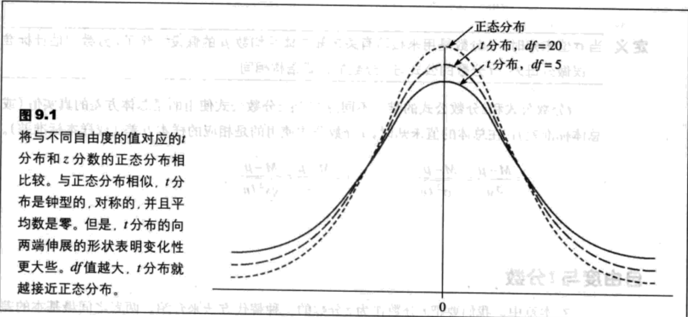
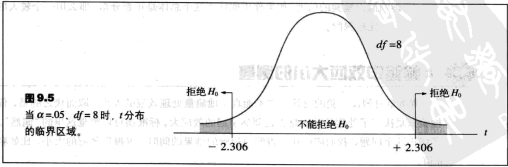
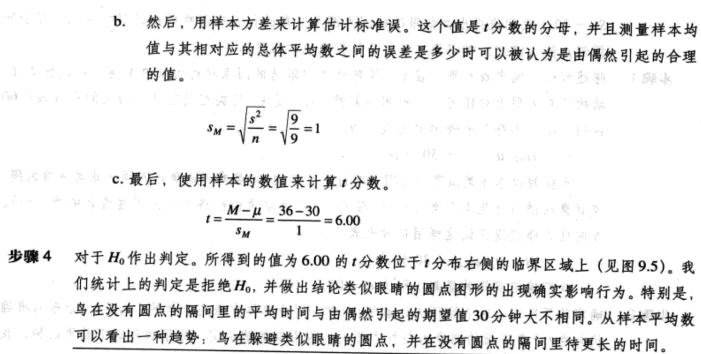
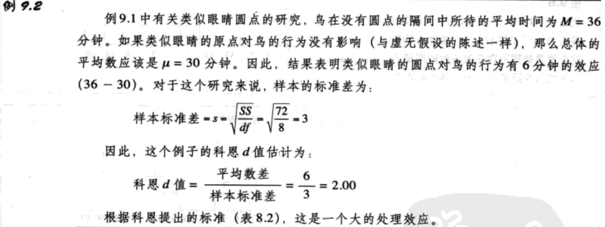
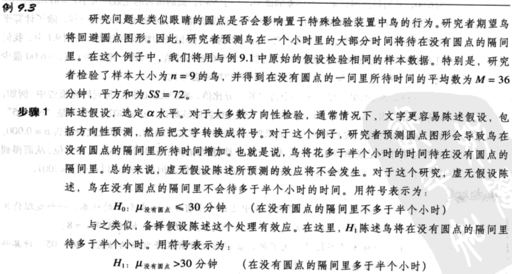
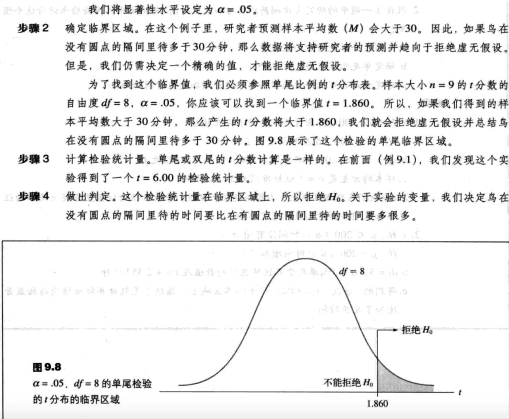

- [t分数](#t%e5%88%86%e6%95%b0)
  - [t分数——代替z分数的一种方法](#t%e5%88%86%e6%95%b0%e4%bb%a3%e6%9b%bfz%e5%88%86%e6%95%b0%e7%9a%84%e4%b8%80%e7%a7%8d%e6%96%b9%e6%b3%95)
    - [自由度](#%e8%87%aa%e7%94%b1%e5%ba%a6)
  - [假设检验和t分数](#%e5%81%87%e8%ae%be%e6%a3%80%e9%aa%8c%e5%92%8ct%e5%88%86%e6%95%b0)
    - [过程与步骤](#%e8%bf%87%e7%a8%8b%e4%b8%8e%e6%ad%a5%e9%aa%a4)
    - [假设检验的例子](#%e5%81%87%e8%ae%be%e6%a3%80%e9%aa%8c%e7%9a%84%e4%be%8b%e5%ad%90)
    - [有关t检验的假设](#%e6%9c%89%e5%85%b3t%e6%a3%80%e9%aa%8c%e7%9a%84%e5%81%87%e8%ae%be)
  - [t检验中效应大小的测量](#t%e6%a3%80%e9%aa%8c%e4%b8%ad%e6%95%88%e5%ba%94%e5%a4%a7%e5%b0%8f%e7%9a%84%e6%b5%8b%e9%87%8f)
    - [估算科恩d值](#%e4%bc%b0%e7%ae%97%e7%a7%91%e6%81%a9d%e5%80%bc)
    - [$r^2$值](#r2%e5%80%bc)
  - [方向性假设与单尾检验](#%e6%96%b9%e5%90%91%e6%80%a7%e5%81%87%e8%ae%be%e4%b8%8e%e5%8d%95%e5%b0%be%e6%a3%80%e9%aa%8c)

## t分数
### t分数——代替z分数的一种方法
大多数情况下，总体的标准差是未知的。在这种情况下，就不能计算标准误，也就不能计算假设检验的z分数。这里介绍一种新方法，叫做`t分数`。

样本方差=$s^2=\frac{SS}{n-1}=\frac{SS}{df}$

样本标准差=$s=\sqrt{\frac{SS}{n-1}}=\sqrt{\frac{SS}{df}}$

标准误=$\sigma_M=\frac{\sigma}{\sqrt{n}}=\sqrt{\frac{\sigma^2}{n}}$

估计标准误=$s_M=\frac{s}{\sqrt{n}}\ (9.1)$

注意，M的估计标准误的符号是$s_M$，而不是$\sigma_M$。这表明，估计值只是从样本数据得来的，而不是从真正的总体参数得来的。

当σ值未知时，估计标准误（$s_M$）被用作对实际标准误$\sigma_M$的估计值。估计标准误是从样本方差或是样本标准差计算出来的。他提供了一个从样本平均数M到其总体平均数μ之间的标准距离的估计。

$t=\frac{M-\mu}{s_M}\ (9.2)$

当σ值未知时，`t分数`是用来检验有关未知总体平均数μ的假设。除了t分数用估计标准误做分母外，t分数的公式与z分数的公式结构相同。

#### 自由度
`自由度`是指在样本中有多少个分数是独立的，并可以自由地变化。因为样本平均数限制了一个样本分数的值，这个样本的自由度是n-1。

自由度=df=n-1 （9.3）

一个样本的df值越大，$s^2$就能越好地代表$\sigma^2$，t分数也就更加接近z分数。显然，样本分数个数越多，样本就能更好地代表总体。因此，自由度与s2联系在一起，同时描述了t代表z的程度。

### 假设检验和t分数
t = 样本平均数（从数据中算出）- 总体平均数（从$H_0$的假设得出） / 估计标准误（从样本数据中算出）

#### 过程与步骤
1. 陈述假设，确定$\alpha$水平。虚无假设了陈述处理不存在效应；总体平均数没有变化。备择假设陈述处理存在效应。这两个假设的陈述都包含未知的总体参数$\mu$。
2. 确定临界区域的位置。t分布的准确形状与随自由度变化而变化的临界t值。确定df值对于在t分布中找到临界区域是必要的。临界区域可以通过参考t分布表来确定。
3. 收集样本数据，计算检验统计量。当$\sigma^2$未知时，检验统计量就是t分数（公式9.2）。
4. 对虚无假设做出判定。当我们在步骤3中得到的t分数落在临界区域里（超过了临界t值），于是$H_0$被拒绝。我们可以得出，存在处理效应。但是，如果得到的t值没有落在临界区域上，那么，我们就不能拒绝$H_0$，于是得出结论，在我们的研究中没有有关处理效应存在的证据。

#### 假设检验的例子

#### 有关t检验的假设
对于t分数的假设检验必需的两个基本的假定为：
1. 样本中的数值必须包含互相独立的观察。
2. 样本来自的总体必须是正态分布。

### t检验中效应大小的测量
#### 估算科恩d值
首次介绍科恩d值时，公式：科恩d值=平均数差 / 标准差

估计科恩d值的公式变成：估计的科恩d值=平均数差 / 样本标准差 （9.4）

#### $r^2$值
$r^2=\frac{t^2}{t^2+df}\ (9.5)$

从例9.1的假设检验中我们得出当df=8时，t=6.00。这些数值产生：

$r^2=\frac{6^2}{6^2+8}=0.8182$（或81.82%）

注意，这个值与直接计算由处理引起的变异性的百分比是相同的。

解释$r^2$ 除了发展科恩d值来测量效应大小，科恩（1981）还提出评估由$r^2$测量的处理效应大小的标准。实际上，这些标准是建议用来测量相关大小的r，但是，很容易就被扩展应用带$r^2$。用来解释的$r^2$标准列在了表9.3中。

根据这些标准，例9.1、9.2中的数据展示了非常大的效应$r^2=.8182$

表9.3 科恩（1988）提出的用来解释$r^2$值得标准

$r^2$值 | 效应
-----| ----
0.01<$r^2$<0.09 | 小效应
0.09<$r^2$<0.25 | 中等效应
$r^2$>0.25 | 大效应

### 方向性假设与单尾检验

