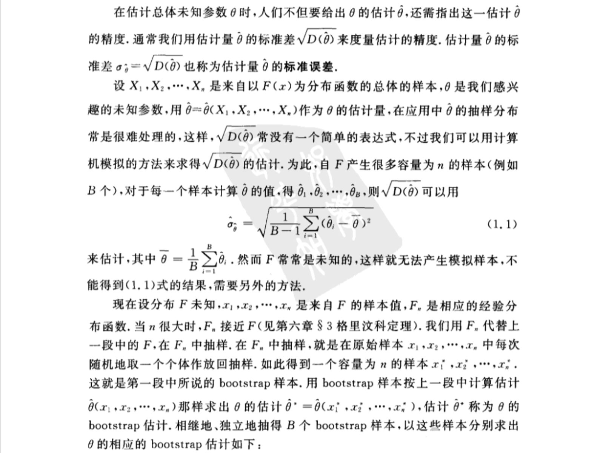
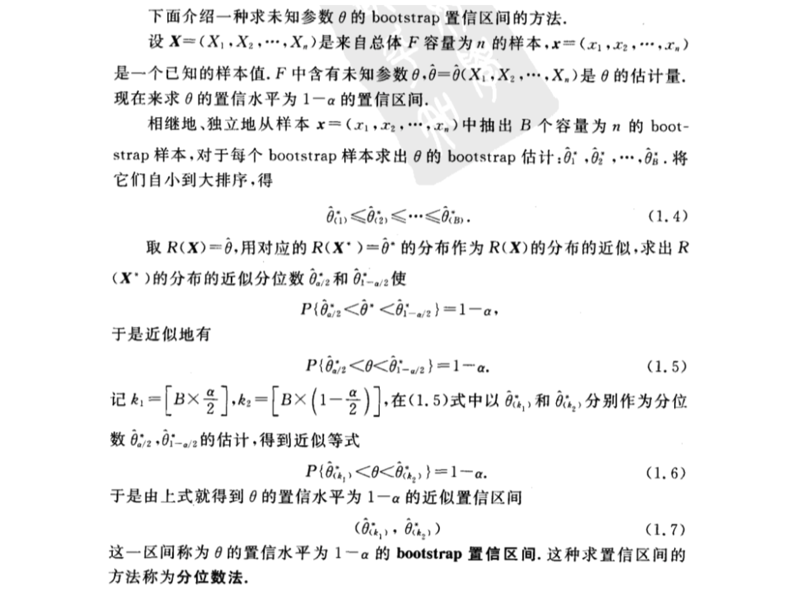
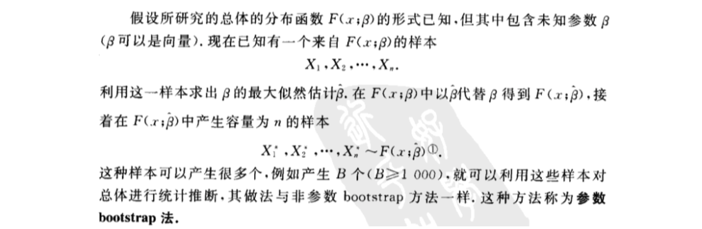

- [第十章 bootstrap方法](#%e7%ac%ac%e5%8d%81%e7%ab%a0-bootstrap%e6%96%b9%e6%b3%95)
  - [1 非参数bootstrap方法](#1-%e9%9d%9e%e5%8f%82%e6%95%b0bootstrap%e6%96%b9%e6%b3%95)
    - [（一）估计量的标准误差的bootstrap估计](#%e4%b8%80%e4%bc%b0%e8%ae%a1%e9%87%8f%e7%9a%84%e6%a0%87%e5%87%86%e8%af%af%e5%b7%ae%e7%9a%84bootstrap%e4%bc%b0%e8%ae%a1)
    - [（二）估计量的均方误差及偏差的bootstrap估计](#%e4%ba%8c%e4%bc%b0%e8%ae%a1%e9%87%8f%e7%9a%84%e5%9d%87%e6%96%b9%e8%af%af%e5%b7%ae%e5%8f%8a%e5%81%8f%e5%b7%ae%e7%9a%84bootstrap%e4%bc%b0%e8%ae%a1)
    - [（三）bootstrap的置信区间](#%e4%b8%89bootstrap%e7%9a%84%e7%bd%ae%e4%bf%a1%e5%8c%ba%e9%97%b4)
    - [（四）bootstrap-t法求均值μ的bootstrap置信区间](#%e5%9b%9bbootstrap-t%e6%b3%95%e6%b1%82%e5%9d%87%e5%80%bc%ce%bc%e7%9a%84bootstrap%e7%bd%ae%e4%bf%a1%e5%8c%ba%e9%97%b4)
  - [2 参数bootstrap方法](#2-%e5%8f%82%e6%95%b0bootstrap%e6%96%b9%e6%b3%95)

# 第十章 bootstrap方法
## 1 非参数bootstrap方法

### （一）估计量的标准误差的bootstrap估计

### （二）估计量的均方误差及偏差的bootstrap估计

### （三）bootstrap的置信区间

### （四）bootstrap-t法求均值μ的bootstrap置信区间

## 2 参数bootstrap方法

