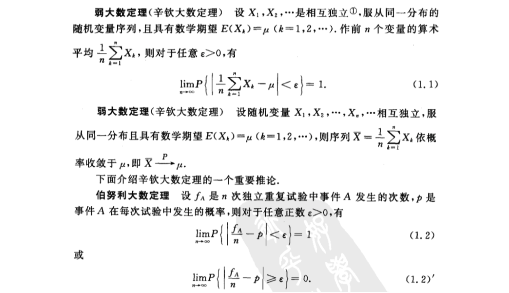
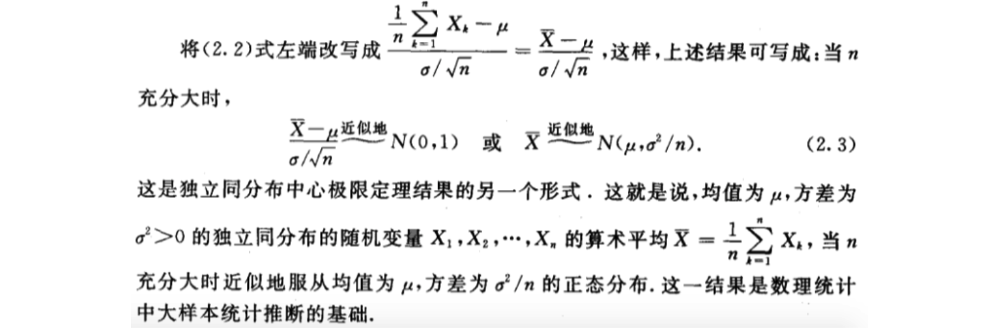
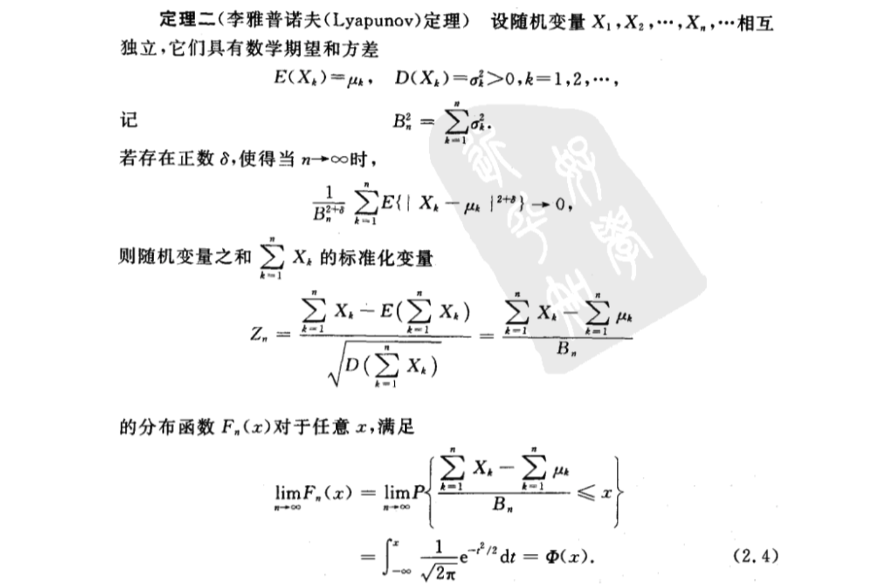
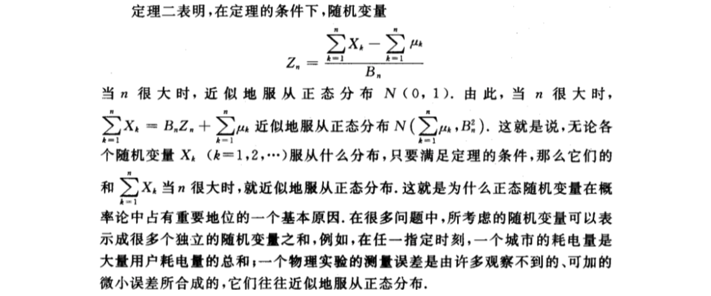

- [第五章 大数定律及中心极限定理](#%e7%ac%ac%e4%ba%94%e7%ab%a0-%e5%a4%a7%e6%95%b0%e5%ae%9a%e5%be%8b%e5%8f%8a%e4%b8%ad%e5%bf%83%e6%9e%81%e9%99%90%e5%ae%9a%e7%90%86)
  - [1 大数定律](#1-%e5%a4%a7%e6%95%b0%e5%ae%9a%e5%be%8b)
  - [2 中心极限定理](#2-%e4%b8%ad%e5%bf%83%e6%9e%81%e9%99%90%e5%ae%9a%e7%90%86)
    - [独立同分布的中心极限定理](#%e7%8b%ac%e7%ab%8b%e5%90%8c%e5%88%86%e5%b8%83%e7%9a%84%e4%b8%ad%e5%bf%83%e6%9e%81%e9%99%90%e5%ae%9a%e7%90%86)
    - [李雅普诺夫（Lyapunov）定理](#%e6%9d%8e%e9%9b%85%e6%99%ae%e8%af%ba%e5%a4%ablyapunov%e5%ae%9a%e7%90%86)
    - [棣莫弗-拉普拉斯定理](#%e6%a3%a3%e8%8e%ab%e5%bc%97-%e6%8b%89%e6%99%ae%e6%8b%89%e6%96%af%e5%ae%9a%e7%90%86)

# 第五章 大数定律及中心极限定理
## 1 大数定律

## 2 中心极限定理
### 独立同分布的中心极限定理

### 李雅普诺夫（Lyapunov）定理

### 棣莫弗-拉普拉斯定理

