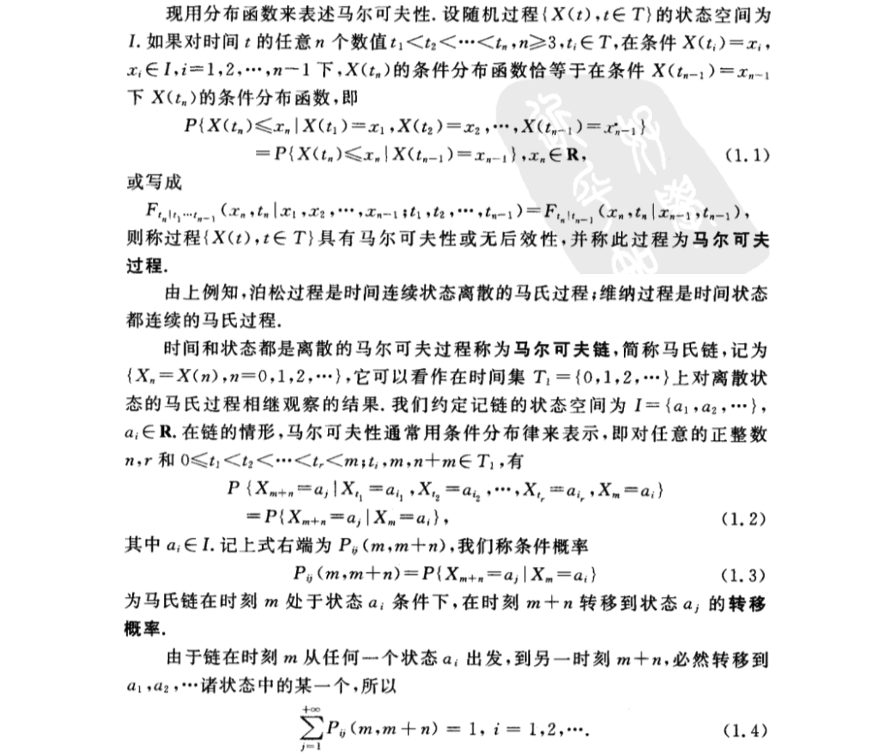
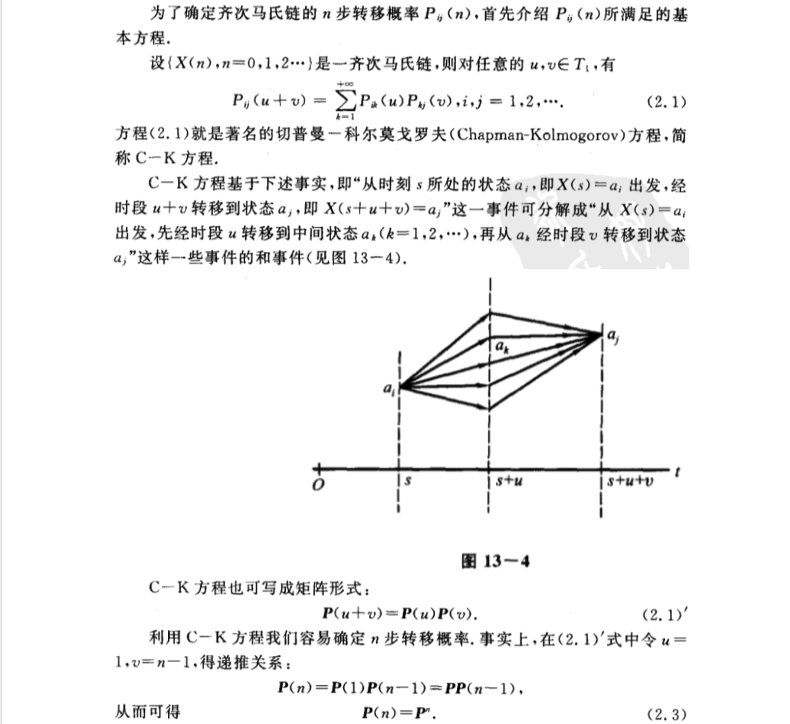
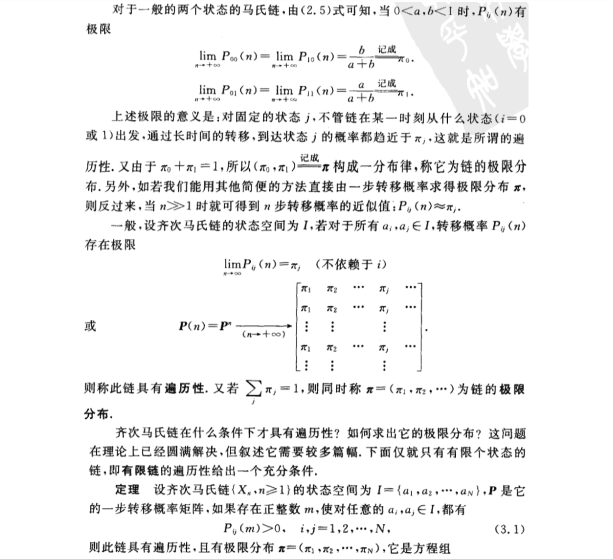
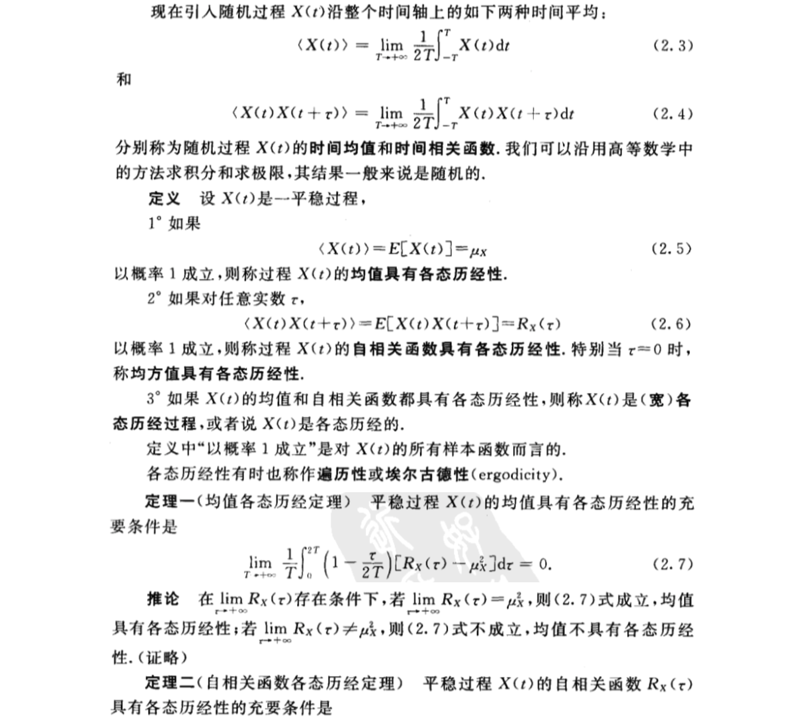
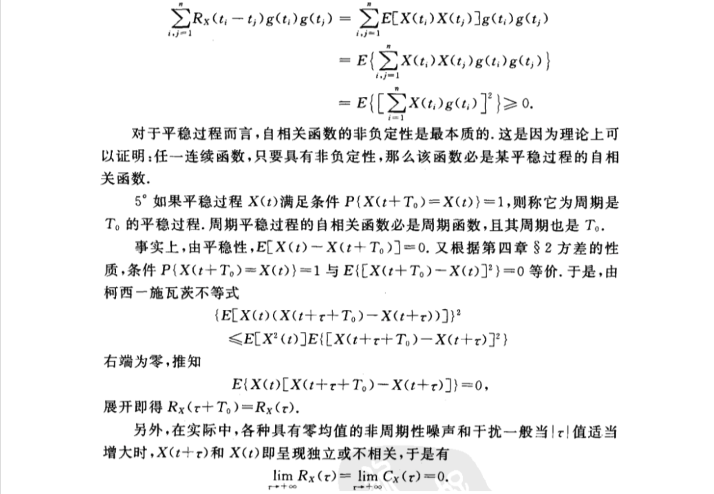
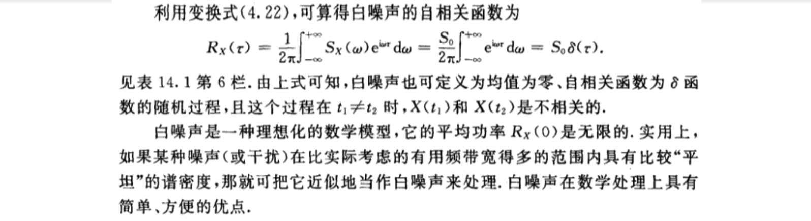

- [第十三章 马尔可夫链](#%e7%ac%ac%e5%8d%81%e4%b8%89%e7%ab%a0-%e9%a9%ac%e5%b0%94%e5%8f%af%e5%a4%ab%e9%93%be)
  - [1 马尔可夫过程及其概率分布](#1-%e9%a9%ac%e5%b0%94%e5%8f%af%e5%a4%ab%e8%bf%87%e7%a8%8b%e5%8f%8a%e5%85%b6%e6%a6%82%e7%8e%87%e5%88%86%e5%b8%83)
  - [2 多步转移概率的确定](#2-%e5%a4%9a%e6%ad%a5%e8%bd%ac%e7%a7%bb%e6%a6%82%e7%8e%87%e7%9a%84%e7%a1%ae%e5%ae%9a)
  - [3 遍历性](#3-%e9%81%8d%e5%8e%86%e6%80%a7)
- [第十四章 平稳随机过程](#%e7%ac%ac%e5%8d%81%e5%9b%9b%e7%ab%a0-%e5%b9%b3%e7%a8%b3%e9%9a%8f%e6%9c%ba%e8%bf%87%e7%a8%8b)
  - [1 平稳随机过程的概念](#1-%e5%b9%b3%e7%a8%b3%e9%9a%8f%e6%9c%ba%e8%bf%87%e7%a8%8b%e7%9a%84%e6%a6%82%e5%bf%b5)
  - [2 各态历经性](#2-%e5%90%84%e6%80%81%e5%8e%86%e7%bb%8f%e6%80%a7)
  - [3 相关函数的性质](#3-%e7%9b%b8%e5%85%b3%e5%87%bd%e6%95%b0%e7%9a%84%e6%80%a7%e8%b4%a8)
  - [4 平稳随机过程的功率谱密度](#4-%e5%b9%b3%e7%a8%b3%e9%9a%8f%e6%9c%ba%e8%bf%87%e7%a8%8b%e7%9a%84%e5%8a%9f%e7%8e%87%e8%b0%b1%e5%af%86%e5%ba%a6)
    - [（一）平稳过程的功率谱密度](#%e4%b8%80%e5%b9%b3%e7%a8%b3%e8%bf%87%e7%a8%8b%e7%9a%84%e5%8a%9f%e7%8e%87%e8%b0%b1%e5%af%86%e5%ba%a6)
    - [（二）谱密度的性质](#%e4%ba%8c%e8%b0%b1%e5%af%86%e5%ba%a6%e7%9a%84%e6%80%a7%e8%b4%a8)
    - [（三）互谱密度及其性质](#%e4%b8%89%e4%ba%92%e8%b0%b1%e5%af%86%e5%ba%a6%e5%8f%8a%e5%85%b6%e6%80%a7%e8%b4%a8)

# 第十三章 马尔可夫链
## 1 马尔可夫过程及其概率分布

## 2 多步转移概率的确定

## 3 遍历性

# 第十四章 平稳随机过程
## 1 平稳随机过程的概念

## 2 各态历经性

## 3 相关函数的性质

## 4 平稳随机过程的功率谱密度
### （一）平稳过程的功率谱密度

### （二）谱密度的性质

### （三）互谱密度及其性质

