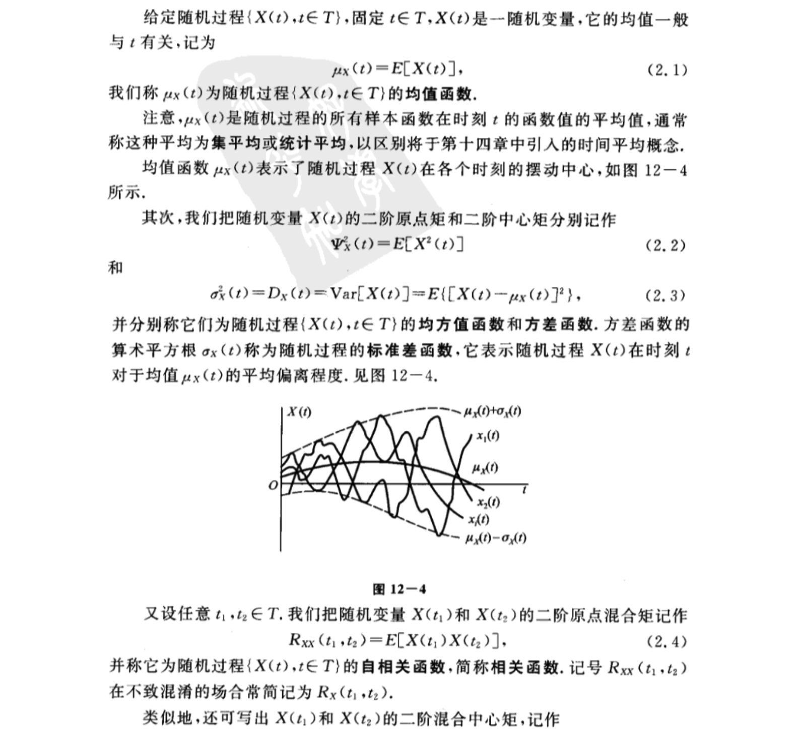
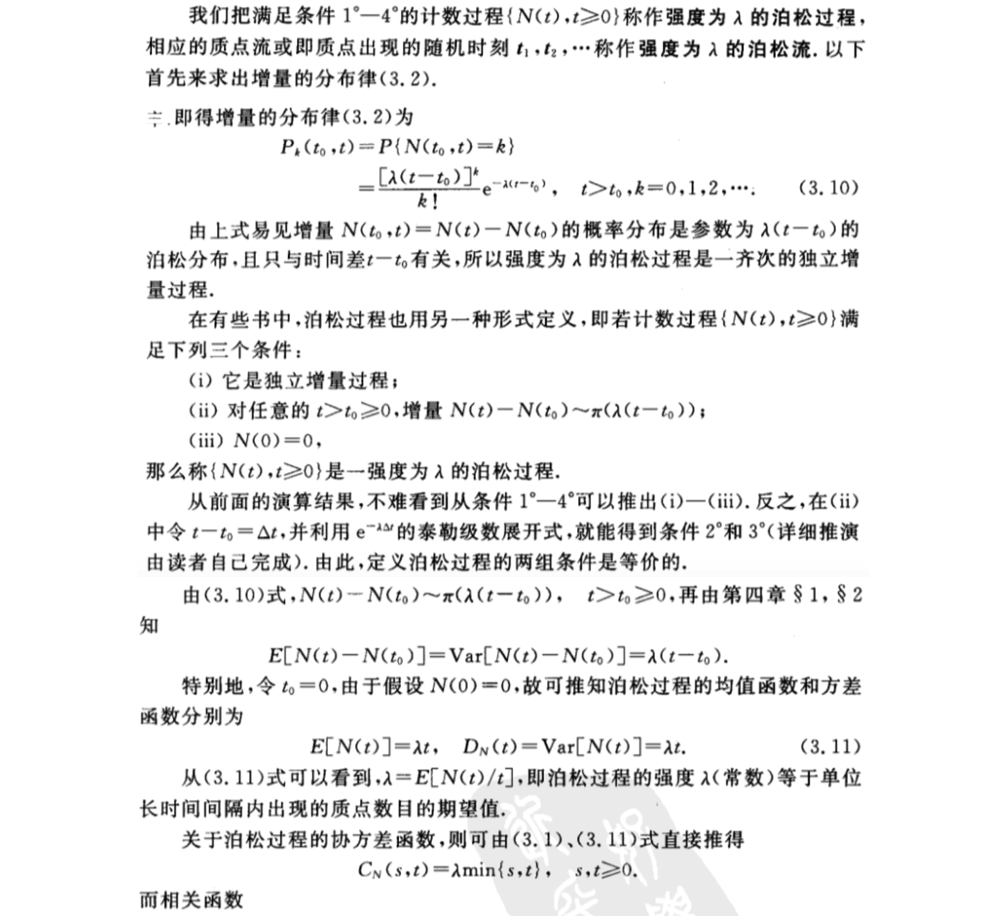
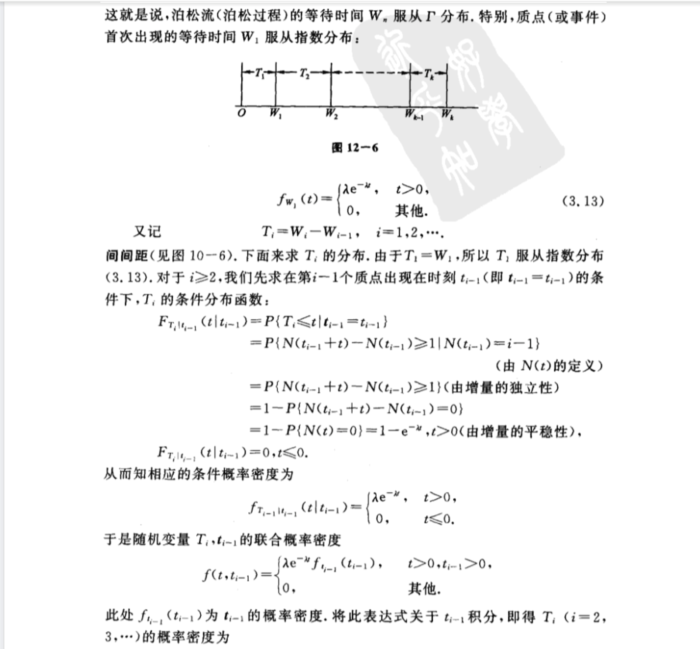

- [第十二章 随机过程及其统计描述](#%e7%ac%ac%e5%8d%81%e4%ba%8c%e7%ab%a0-%e9%9a%8f%e6%9c%ba%e8%bf%87%e7%a8%8b%e5%8f%8a%e5%85%b6%e7%bb%9f%e8%ae%a1%e6%8f%8f%e8%bf%b0)
  - [1 随机过程的概念](#1-%e9%9a%8f%e6%9c%ba%e8%bf%87%e7%a8%8b%e7%9a%84%e6%a6%82%e5%bf%b5)
  - [2 随机过程的统计描述](#2-%e9%9a%8f%e6%9c%ba%e8%bf%87%e7%a8%8b%e7%9a%84%e7%bb%9f%e8%ae%a1%e6%8f%8f%e8%bf%b0)
    - [（一）随机过程的分布函数族](#%e4%b8%80%e9%9a%8f%e6%9c%ba%e8%bf%87%e7%a8%8b%e7%9a%84%e5%88%86%e5%b8%83%e5%87%bd%e6%95%b0%e6%97%8f)
    - [（二）随机过程的数字特征](#%e4%ba%8c%e9%9a%8f%e6%9c%ba%e8%bf%87%e7%a8%8b%e7%9a%84%e6%95%b0%e5%ad%97%e7%89%b9%e5%be%81)
    - [（三）二维随机过程的分布函数和数字特征](#%e4%b8%89%e4%ba%8c%e7%bb%b4%e9%9a%8f%e6%9c%ba%e8%bf%87%e7%a8%8b%e7%9a%84%e5%88%86%e5%b8%83%e5%87%bd%e6%95%b0%e5%92%8c%e6%95%b0%e5%ad%97%e7%89%b9%e5%be%81)
  - [3 泊松过程及维纳过程](#3-%e6%b3%8a%e6%9d%be%e8%bf%87%e7%a8%8b%e5%8f%8a%e7%bb%b4%e7%ba%b3%e8%bf%87%e7%a8%8b)
    - [（一）泊松过程](#%e4%b8%80%e6%b3%8a%e6%9d%be%e8%bf%87%e7%a8%8b)
    - [（二）维纳过程](#%e4%ba%8c%e7%bb%b4%e7%ba%b3%e8%bf%87%e7%a8%8b)

# 第十二章 随机过程及其统计描述
## 1 随机过程的概念

## 2 随机过程的统计描述
### （一）随机过程的分布函数族

### （二）随机过程的数字特征

### （三）二维随机过程的分布函数和数字特征

## 3 泊松过程及维纳过程

### （一）泊松过程

### （二）维纳过程

