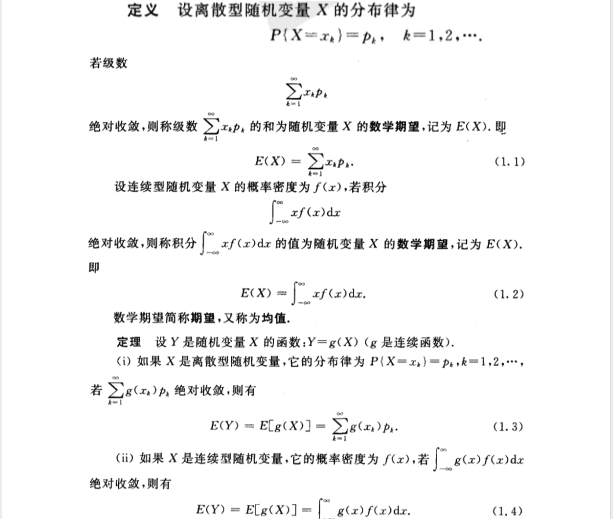
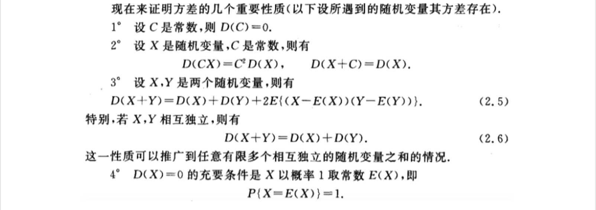
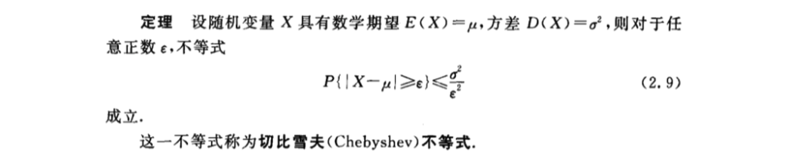
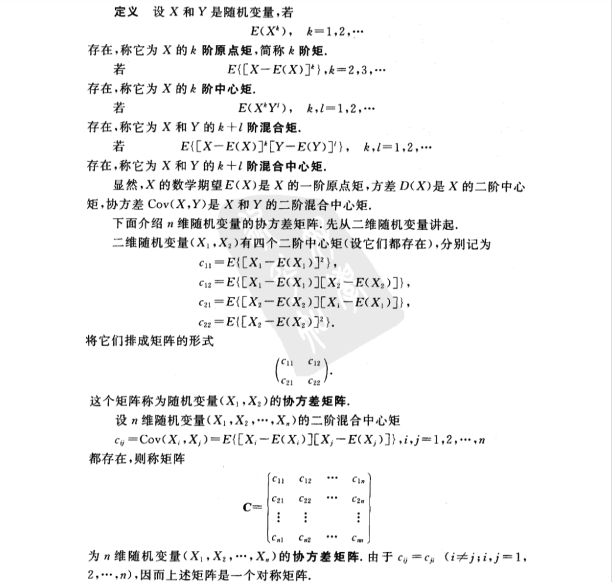

- [第四章 随机变量的数字特征](#%e7%ac%ac%e5%9b%9b%e7%ab%a0-%e9%9a%8f%e6%9c%ba%e5%8f%98%e9%87%8f%e7%9a%84%e6%95%b0%e5%ad%97%e7%89%b9%e5%be%81)
  - [1 数学期望](#1-%e6%95%b0%e5%ad%a6%e6%9c%9f%e6%9c%9b)
    - [数学期望的性质](#%e6%95%b0%e5%ad%a6%e6%9c%9f%e6%9c%9b%e7%9a%84%e6%80%a7%e8%b4%a8)
  - [2 方差](#2-%e6%96%b9%e5%b7%ae)
    - [方差的性质](#%e6%96%b9%e5%b7%ae%e7%9a%84%e6%80%a7%e8%b4%a8)
    - [切比雪夫不等式](#%e5%88%87%e6%af%94%e9%9b%aa%e5%a4%ab%e4%b8%8d%e7%ad%89%e5%bc%8f)
  - [3 协方差与相关系数](#3-%e5%8d%8f%e6%96%b9%e5%b7%ae%e4%b8%8e%e7%9b%b8%e5%85%b3%e7%b3%bb%e6%95%b0)
  - [4 矩、协方差矩阵](#4-%e7%9f%a9%e5%8d%8f%e6%96%b9%e5%b7%ae%e7%9f%a9%e9%98%b5)
    - [多维正态分布](#%e5%a4%9a%e7%bb%b4%e6%ad%a3%e6%80%81%e5%88%86%e5%b8%83)

# 第四章 随机变量的数字特征
## 1 数学期望

### 数学期望的性质

## 2 方差

### 方差的性质

### 切比雪夫不等式

## 3 协方差与相关系数

## 4 矩、协方差矩阵

### 多维正态分布

