    作者: (美)Steven Bird Ewan Klein Edward Loper 
    出版社: 人民邮电出版社
    原作名: Natural Language Processing With Python
    译者: 张旭 / 崔阳 / 刘海平 
    出版年: 2014-6-25
    页数: 508
    定价: 89.00
    装帧: 平装
    ISBN: 9787115333681

[豆瓣链接](https://book.douban.com/subject/25916599/)

- [NLTK入门](#nltk%e5%85%a5%e9%97%a8)
  - [搜索文本](#%e6%90%9c%e7%b4%a2%e6%96%87%e6%9c%ac)
  - [计数词汇](#%e8%ae%a1%e6%95%b0%e8%af%8d%e6%b1%87)
  - [将文本当作词链表](#%e5%b0%86%e6%96%87%e6%9c%ac%e5%bd%93%e4%bd%9c%e8%af%8d%e9%93%be%e8%a1%a8)
    - [索引列表](#%e7%b4%a2%e5%bc%95%e5%88%97%e8%a1%a8)
  - [简单的统计](#%e7%ae%80%e5%8d%95%e7%9a%84%e7%bb%9f%e8%ae%a1)
    - [频率分布](#%e9%a2%91%e7%8e%87%e5%88%86%e5%b8%83)
    - [词语搭配和双连词](#%e8%af%8d%e8%af%ad%e6%90%ad%e9%85%8d%e5%92%8c%e5%8f%8c%e8%bf%9e%e8%af%8d)
    - [计算其他东西](#%e8%ae%a1%e7%ae%97%e5%85%b6%e4%bb%96%e4%b8%9c%e8%a5%bf)
- [获取文本语料库](#%e8%8e%b7%e5%8f%96%e6%96%87%e6%9c%ac%e8%af%ad%e6%96%99%e5%ba%93)
  - [古腾堡语料库](#%e5%8f%a4%e8%85%be%e5%a0%a1%e8%af%ad%e6%96%99%e5%ba%93)
  - [网络和聊天文本](#%e7%bd%91%e7%bb%9c%e5%92%8c%e8%81%8a%e5%a4%a9%e6%96%87%e6%9c%ac)
  - [布朗语料库](#%e5%b8%83%e6%9c%97%e8%af%ad%e6%96%99%e5%ba%93)
  - [路透社语料库](#%e8%b7%af%e9%80%8f%e7%a4%be%e8%af%ad%e6%96%99%e5%ba%93)
  - [就职演说语料库](#%e5%b0%b1%e8%81%8c%e6%bc%94%e8%af%b4%e8%af%ad%e6%96%99%e5%ba%93)
  - [其他语言的语料库](#%e5%85%b6%e4%bb%96%e8%af%ad%e8%a8%80%e7%9a%84%e8%af%ad%e6%96%99%e5%ba%93)
  - [文本语料库的结构](#%e6%96%87%e6%9c%ac%e8%af%ad%e6%96%99%e5%ba%93%e7%9a%84%e7%bb%93%e6%9e%84)
  - [载入你自己的语料库](#%e8%bd%bd%e5%85%a5%e4%bd%a0%e8%87%aa%e5%b7%b1%e7%9a%84%e8%af%ad%e6%96%99%e5%ba%93)
- [条件频率分布](#%e6%9d%a1%e4%bb%b6%e9%a2%91%e7%8e%87%e5%88%86%e5%b8%83)
  - [条件与事件](#%e6%9d%a1%e4%bb%b6%e4%b8%8e%e4%ba%8b%e4%bb%b6)
  - [按文体计数词汇](#%e6%8c%89%e6%96%87%e4%bd%93%e8%ae%a1%e6%95%b0%e8%af%8d%e6%b1%87)
  - [绘制分布图和分布表](#%e7%bb%98%e5%88%b6%e5%88%86%e5%b8%83%e5%9b%be%e5%92%8c%e5%88%86%e5%b8%83%e8%a1%a8)
  - [使用Bigrams生成随机文本](#%e4%bd%bf%e7%94%a8bigrams%e7%94%9f%e6%88%90%e9%9a%8f%e6%9c%ba%e6%96%87%e6%9c%ac)
- [词典资源](#%e8%af%8d%e5%85%b8%e8%b5%84%e6%ba%90)
  - [词汇列表语料库](#%e8%af%8d%e6%b1%87%e5%88%97%e8%a1%a8%e8%af%ad%e6%96%99%e5%ba%93)
  - [发音的词典](#%e5%8f%91%e9%9f%b3%e7%9a%84%e8%af%8d%e5%85%b8)
  - [比较词表](#%e6%af%94%e8%be%83%e8%af%8d%e8%a1%a8)
  - [词汇工具：Toolbox](#%e8%af%8d%e6%b1%87%e5%b7%a5%e5%85%b7toolbox)
  - [WordNet](#wordnet)
    - [意义与同义词](#%e6%84%8f%e4%b9%89%e4%b8%8e%e5%90%8c%e4%b9%89%e8%af%8d)
    - [WordNet的层次结构](#wordnet%e7%9a%84%e5%b1%82%e6%ac%a1%e7%bb%93%e6%9e%84)
    - [更多的词汇关系](#%e6%9b%b4%e5%a4%9a%e7%9a%84%e8%af%8d%e6%b1%87%e5%85%b3%e7%b3%bb)
    - [语义相似度](#%e8%af%ad%e4%b9%89%e7%9b%b8%e4%bc%bc%e5%ba%a6)
- [处理原始文本](#%e5%a4%84%e7%90%86%e5%8e%9f%e5%a7%8b%e6%96%87%e6%9c%ac)
  - [从网络和硬盘访问文本](#%e4%bb%8e%e7%bd%91%e7%bb%9c%e5%92%8c%e7%a1%ac%e7%9b%98%e8%ae%bf%e9%97%ae%e6%96%87%e6%9c%ac)
    - [电子书](#%e7%94%b5%e5%ad%90%e4%b9%a6)
    - [处理HTML](#%e5%a4%84%e7%90%86html)
    - [处理RSS订阅](#%e5%a4%84%e7%90%86rss%e8%ae%a2%e9%98%85)
    - [读取本地文件](#%e8%af%bb%e5%8f%96%e6%9c%ac%e5%9c%b0%e6%96%87%e4%bb%b6)
    - [NLP流程](#nlp%e6%b5%81%e7%a8%8b)
  - [使用正则表达式](#%e4%bd%bf%e7%94%a8%e6%ad%a3%e5%88%99%e8%a1%a8%e8%be%be%e5%bc%8f)
    - [提取字符块](#%e6%8f%90%e5%8f%96%e5%ad%97%e7%ac%a6%e5%9d%97)
    - [查找词干](#%e6%9f%a5%e6%89%be%e8%af%8d%e5%b9%b2)
    - [搜索已分词文本](#%e6%90%9c%e7%b4%a2%e5%b7%b2%e5%88%86%e8%af%8d%e6%96%87%e6%9c%ac)
  - [规范化(Normalizing)文本](#%e8%a7%84%e8%8c%83%e5%8c%96normalizing%e6%96%87%e6%9c%ac)
    - [词干提取器(Stemmers)](#%e8%af%8d%e5%b9%b2%e6%8f%90%e5%8f%96%e5%99%a8stemmers)
    - [词形归并(Lemmatization)](#%e8%af%8d%e5%bd%a2%e5%bd%92%e5%b9%b6lemmatization)
    - [分割(Segmentation)](#%e5%88%86%e5%89%b2segmentation)
- [分类和标注词汇](#%e5%88%86%e7%b1%bb%e5%92%8c%e6%a0%87%e6%b3%a8%e8%af%8d%e6%b1%87)
  - [使用词性标注器](#%e4%bd%bf%e7%94%a8%e8%af%8d%e6%80%a7%e6%a0%87%e6%b3%a8%e5%99%a8)
  - [标注语料库](#%e6%a0%87%e6%b3%a8%e8%af%ad%e6%96%99%e5%ba%93)
    - [读取已标注的语料库](#%e8%af%bb%e5%8f%96%e5%b7%b2%e6%a0%87%e6%b3%a8%e7%9a%84%e8%af%ad%e6%96%99%e5%ba%93)
    - [简化的词性标记集](#%e7%ae%80%e5%8c%96%e7%9a%84%e8%af%8d%e6%80%a7%e6%a0%87%e8%ae%b0%e9%9b%86)
    - [名词](#%e5%90%8d%e8%af%8d)
    - [动词](#%e5%8a%a8%e8%af%8d)
    - [未简化的标记](#%e6%9c%aa%e7%ae%80%e5%8c%96%e7%9a%84%e6%a0%87%e8%ae%b0)
    - [探索已标注的语料库](#%e6%8e%a2%e7%b4%a2%e5%b7%b2%e6%a0%87%e6%b3%a8%e7%9a%84%e8%af%ad%e6%96%99%e5%ba%93)
  - [自动标注](#%e8%87%aa%e5%8a%a8%e6%a0%87%e6%b3%a8)
    - [默认标注器](#%e9%bb%98%e8%ae%a4%e6%a0%87%e6%b3%a8%e5%99%a8)
    - [正则表达式标注器](#%e6%ad%a3%e5%88%99%e8%a1%a8%e8%be%be%e5%bc%8f%e6%a0%87%e6%b3%a8%e5%99%a8)
    - [查询标注器](#%e6%9f%a5%e8%af%a2%e6%a0%87%e6%b3%a8%e5%99%a8)
  - [N-gram标注](#n-gram%e6%a0%87%e6%b3%a8)
    - [一元标注器(Unigram Tagging)](#%e4%b8%80%e5%85%83%e6%a0%87%e6%b3%a8%e5%99%a8unigram-tagging)
    - [分离训练和测试数据](#%e5%88%86%e7%a6%bb%e8%ae%ad%e7%bb%83%e5%92%8c%e6%b5%8b%e8%af%95%e6%95%b0%e6%8d%ae)
    - [一般的N-gram的标注](#%e4%b8%80%e8%88%ac%e7%9a%84n-gram%e7%9a%84%e6%a0%87%e6%b3%a8)
    - [组合标注器](#%e7%bb%84%e5%90%88%e6%a0%87%e6%b3%a8%e5%99%a8)
    - [标注生词](#%e6%a0%87%e6%b3%a8%e7%94%9f%e8%af%8d)
    - [存储标注器](#%e5%ad%98%e5%82%a8%e6%a0%87%e6%b3%a8%e5%99%a8)
    - [性能限制](#%e6%80%a7%e8%83%bd%e9%99%90%e5%88%b6)
    - [跨句子边界标注](#%e8%b7%a8%e5%8f%a5%e5%ad%90%e8%be%b9%e7%95%8c%e6%a0%87%e6%b3%a8)
  - [基于转换的标注(Transformation-Based Tagging)](#%e5%9f%ba%e4%ba%8e%e8%bd%ac%e6%8d%a2%e7%9a%84%e6%a0%87%e6%b3%a8transformation-based-tagging)
  - [如何确定一个词的分类](#%e5%a6%82%e4%bd%95%e7%a1%ae%e5%ae%9a%e4%b8%80%e4%b8%aa%e8%af%8d%e7%9a%84%e5%88%86%e7%b1%bb)
    - [形态学(Morphological)线索](#%e5%bd%a2%e6%80%81%e5%ad%a6morphological%e7%ba%bf%e7%b4%a2)
    - [句法(Syntactic)线索](#%e5%8f%a5%e6%b3%95syntactic%e7%ba%bf%e7%b4%a2)
    - [语义(Semantic)线索](#%e8%af%ad%e4%b9%89semantic%e7%ba%bf%e7%b4%a2)
    - [新词](#%e6%96%b0%e8%af%8d)
    - [词性标注集中的形态学(Morphology in Part-of-Speech Tagsets)](#%e8%af%8d%e6%80%a7%e6%a0%87%e6%b3%a8%e9%9b%86%e4%b8%ad%e7%9a%84%e5%bd%a2%e6%80%81%e5%ad%a6morphology-in-part-of-speech-tagsets)
- [分类文本性别鉴定](#%e5%88%86%e7%b1%bb%e6%96%87%e6%9c%ac%e6%80%a7%e5%88%ab%e9%89%b4%e5%ae%9a)
- [分类文本电影评论正负面评价](#%e5%88%86%e7%b1%bb%e6%96%87%e6%9c%ac%e7%94%b5%e5%bd%b1%e8%af%84%e8%ae%ba%e6%ad%a3%e8%b4%9f%e9%9d%a2%e8%af%84%e4%bb%b7)
- [分类文本词性标](#%e5%88%86%e7%b1%bb%e6%96%87%e6%9c%ac%e8%af%8d%e6%80%a7%e6%a0%87)
  - [探索上下文语境](#%e6%8e%a2%e7%b4%a2%e4%b8%8a%e4%b8%8b%e6%96%87%e8%af%ad%e5%a2%83)
  - [序列分类](#%e5%ba%8f%e5%88%97%e5%88%86%e7%b1%bb)
  - [其他序列分类方法](#%e5%85%b6%e4%bb%96%e5%ba%8f%e5%88%97%e5%88%86%e7%b1%bb%e6%96%b9%e6%b3%95)
- [分类文本句子分割](#%e5%88%86%e7%b1%bb%e6%96%87%e6%9c%ac%e5%8f%a5%e5%ad%90%e5%88%86%e5%89%b2)
- [识别对话行为类型](#%e8%af%86%e5%88%ab%e5%af%b9%e8%af%9d%e8%a1%8c%e4%b8%ba%e7%b1%bb%e5%9e%8b)
- [识别文字蕴含](#%e8%af%86%e5%88%ab%e6%96%87%e5%ad%97%e8%95%b4%e5%90%ab)
- [决策树](#%e5%86%b3%e7%ad%96%e6%a0%91)
  - [熵(Entropy)和信息增益(Information Gain)](#%e7%86%b5entropy%e5%92%8c%e4%bf%a1%e6%81%af%e5%a2%9e%e7%9b%8ainformation-gain)
- [朴素贝叶斯分类器](#%e6%9c%b4%e7%b4%a0%e8%b4%9d%e5%8f%b6%e6%96%af%e5%88%86%e7%b1%bb%e5%99%a8)
  - [潜在概率模型](#%e6%bd%9c%e5%9c%a8%e6%a6%82%e7%8e%87%e6%a8%a1%e5%9e%8b)
  - [零计数和平滑](#%e9%9b%b6%e8%ae%a1%e6%95%b0%e5%92%8c%e5%b9%b3%e6%bb%91)
  - [非二元特征](#%e9%9d%9e%e4%ba%8c%e5%85%83%e7%89%b9%e5%be%81)
  - [双重计数的原因](#%e5%8f%8c%e9%87%8d%e8%ae%a1%e6%95%b0%e7%9a%84%e5%8e%9f%e5%9b%a0)
- [最大熵分类器](#%e6%9c%80%e5%a4%a7%e7%86%b5%e5%88%86%e7%b1%bb%e5%99%a8)
  - [最大熵模型](#%e6%9c%80%e5%a4%a7%e7%86%b5%e6%a8%a1%e5%9e%8b)
  - [熵的最大化](#%e7%86%b5%e7%9a%84%e6%9c%80%e5%a4%a7%e5%8c%96)
- [从文本提取信息](#%e4%bb%8e%e6%96%87%e6%9c%ac%e6%8f%90%e5%8f%96%e4%bf%a1%e6%81%af)
  - [信息提取](#%e4%bf%a1%e6%81%af%e6%8f%90%e5%8f%96)
    - [信息提取结构](#%e4%bf%a1%e6%81%af%e6%8f%90%e5%8f%96%e7%bb%93%e6%9e%84)
  - [分块(Chunking)](#%e5%88%86%e5%9d%97chunking)
    - [名词短语分块](#%e5%90%8d%e8%af%8d%e7%9f%ad%e8%af%ad%e5%88%86%e5%9d%97)
    - [用正则表达式分块](#%e7%94%a8%e6%ad%a3%e5%88%99%e8%a1%a8%e8%be%be%e5%bc%8f%e5%88%86%e5%9d%97)
    - [探索文本语料库](#%e6%8e%a2%e7%b4%a2%e6%96%87%e6%9c%ac%e8%af%ad%e6%96%99%e5%ba%93)
    - [缝隙(Chinking)](#%e7%bc%9d%e9%9a%99chinking)
    - [分块的表示：标记与树状图](#%e5%88%86%e5%9d%97%e7%9a%84%e8%a1%a8%e7%a4%ba%e6%a0%87%e8%ae%b0%e4%b8%8e%e6%a0%91%e7%8a%b6%e5%9b%be)
  - [开发和评估分块器](#%e5%bc%80%e5%8f%91%e5%92%8c%e8%af%84%e4%bc%b0%e5%88%86%e5%9d%97%e5%99%a8)
    - [读取IOB格式与CoNLL2000分块语料库](#%e8%af%bb%e5%8f%96iob%e6%a0%bc%e5%bc%8f%e4%b8%8econll2000%e5%88%86%e5%9d%97%e8%af%ad%e6%96%99%e5%ba%93)
    - [简单评估和基准](#%e7%ae%80%e5%8d%95%e8%af%84%e4%bc%b0%e5%92%8c%e5%9f%ba%e5%87%86)
    - [训练基于分类器的分块器](#%e8%ae%ad%e7%bb%83%e5%9f%ba%e4%ba%8e%e5%88%86%e7%b1%bb%e5%99%a8%e7%9a%84%e5%88%86%e5%9d%97%e5%99%a8)
  - [语言结构中的递归](#%e8%af%ad%e8%a8%80%e7%bb%93%e6%9e%84%e4%b8%ad%e7%9a%84%e9%80%92%e5%bd%92)
    - [用级联分块器构建嵌套结构](#%e7%94%a8%e7%ba%a7%e8%81%94%e5%88%86%e5%9d%97%e5%99%a8%e6%9e%84%e5%bb%ba%e5%b5%8c%e5%a5%97%e7%bb%93%e6%9e%84)
    - [树状图](#%e6%a0%91%e7%8a%b6%e5%9b%be)
  - [命名实体识别(Named Entity Recognition)](#%e5%91%bd%e5%90%8d%e5%ae%9e%e4%bd%93%e8%af%86%e5%88%abnamed-entity-recognition)
  - [关系抽取(Relation Extraction)](#%e5%85%b3%e7%b3%bb%e6%8a%bd%e5%8f%96relation-extraction)
- [分析句子结构](#%e5%88%86%e6%9e%90%e5%8f%a5%e5%ad%90%e7%bb%93%e6%9e%84)
  - [文法(Syntax)的用途](#%e6%96%87%e6%b3%95syntax%e7%9a%84%e7%94%a8%e9%80%94)
  - [上下文无关文法](#%e4%b8%8a%e4%b8%8b%e6%96%87%e6%97%a0%e5%85%b3%e6%96%87%e6%b3%95)
  - [上下文无关文法分析(Parsing with Context-Free Grammar)](#%e4%b8%8a%e4%b8%8b%e6%96%87%e6%97%a0%e5%85%b3%e6%96%87%e6%b3%95%e5%88%86%e6%9e%90parsing-with-context-free-grammar)
    - [递归下降解析器(Recursive Descent Parsing)](#%e9%80%92%e5%bd%92%e4%b8%8b%e9%99%8d%e8%a7%a3%e6%9e%90%e5%99%a8recursive-descent-parsing)
    - [移进-规约分析(Shift-Reduce Parsing)](#%e7%a7%bb%e8%bf%9b-%e8%a7%84%e7%ba%a6%e5%88%86%e6%9e%90shift-reduce-parsing)
    - [依存关系(Dependencies)和依存文法(Dependency Grammar)](#%e4%be%9d%e5%ad%98%e5%85%b3%e7%b3%bbdependencies%e5%92%8c%e4%be%9d%e5%ad%98%e6%96%87%e6%b3%95dependency-grammar)

# NLTK入门
从NLTK的book模块中加载所有的条目

```py
%matplotlib inline
from nltk.book import *

*** Introductory Examples for the NLTK Book ***
Loading text1, ..., text9 and sent1, ..., sent9
Type the name of the text or sentence to view it.
Type: 'texts()' or 'sents()' to list the materials.
text1: Moby Dick by Herman Melville 1851
text2: Sense and Sensibility by Jane Austen 1811
text3: The Book of Genesis
text4: Inaugural Address Corpus
text5: Chat Corpus
text6: Monty Python and the Holy Grail
text7: Wall Street Journal
text8: Personals Corpus
text9: The Man Who Was Thursday by G . K . Chesterton 1908
```

## 搜索文本
显示指定单词的出现情况，同时显示一些上下文。

```py
text1.concordance("monstrous")

Displaying 11 of 11 matches:
ong the former , one was of a most monstrous size . ... This came towards us , 
ON OF THE PSALMS . " Touching that monstrous bulk of the whale or ork we have r
ll over with a heathenish array of monstrous clubs and spears . Some were thick
d as you gazed , and wondered what monstrous cannibal and savage could ever hav
that has survived the flood ; most monstrous and most mountainous ! That Himmal
they might scout at Moby Dick as a monstrous fable , or still worse and more de
th of Radney .'" CHAPTER 55 Of the Monstrous Pictures of Whales . I shall ere l
ing Scenes . In connexion with the monstrous pictures of whales , I am strongly
ere to enter upon those still more monstrous stories of them which are to be fo
ght have been rummaged out of this monstrous cabinet there is no telling . But 
of Whale - Bones ; for Whales of a monstrous size are oftentimes cast up dead u
```

还有哪些词出现在相似的上下文中？

```py
text1.similar("monstrous")

imperial subtly impalpable pitiable curious abundant perilous
trustworthy untoward singular lamentable few determined maddens
horrible tyrannical lazy mystifying christian exasperate
```

研究共用两个或两个以上词汇的上下文。

```py
text2.common_contexts(["monstrous", "very"])

a_pretty is_pretty a_lucky am_glad be_glad
```

判断词在文本中的位置：dispersion plot。每一列代表一个单词，每一行代表整个文本。

```py
text4.dispersion_plot(["citizens", "democracy", "freedom", "duties", "America"])
```

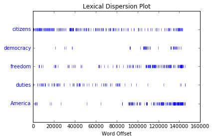

Figure 1-2. Lexical dispersion plot for words in U.S. Presidential Inaugural Addresses: This can be used to investigate changes in language use over time.

## 计数词汇
以文本中出现的单词和标点符号为单位算出文本从头到尾的长度。

```py
len(text3)
44764
```

《创世纪》有44764个单词和标点符号，也称作“token”。token是表示一组字符序列的术语。

有多少不同的单词？

```py
sorted(set(text3))[:10]
[u'!', u"'", u'(', u')', u',', u',)', u'.', u'.)', u':', u';']

len(set(text3))
2789
```

对文本词汇丰富度进行测量。

```py
from __future__ import division
len(text3) / len(set(text3))

16.050197203298673
```

计数一个单词在文本中出现的次数，再计算一个特定词在文本中占据的百分比。

```py
text3.count("smote")
5

100 * text4.count('a') / len(text4)
1.4643016433938312
```

做成函数：

```py
def lexical_diversity(text):
    return len(text) / len(set(text))

def percentage(count, total):
    return 100 * count / total
```

## 将文本当作词链表
### 索引列表
文本中这个索引处——例如文本中第173个词。

```py
text4[173]
u'awaken'
```

从大文本种任意抽取语言片段，术语叫做`slicing`。

```py
text5[16715:16735]
[u'U86',
 u'thats',
 u'why',
 u'something',
 u'like',
 u'gamefly',
 u'is',
 u'so',
 u'good',
 u'because',
 u'you',
 u'can',
 u'actually',
 u'play',
 u'a',
 u'full',
 u'game',
 u'without',
 u'buying',
 u'it']

text6[1600:1625]
[u'We',
 u"'",
 u're',
 u'an',
 u'anarcho',
 u'-',
 u'syndicalist',
 u'commune',
 u'.',
 u'We',
 u'take',
 u'it',
 u'in',
 u'turns',
 u'to',
 u'act',
 u'as',
 u'a',
 u'sort',
 u'of',
 u'executive',
 u'officer',
 u'for',
 u'the',
 u'week']
```

## 简单的统计
### 频率分布
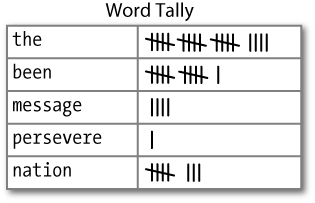

图1-3中的表被称为frequency distribution，显示的是每一个词项在文本中出现的频率。

```py
fdist1 = FreqDist(text1)
len(fdist1)
19317

vocabulary1 = fdist1.keys()
vocabulary1[:50]
[u'funereal',
 u'unscientific',
 u'divinely',
 u'foul',
 u'four',
 u'gag',
 u'prefix',
 u'woods',
 u'clotted',
 u'Duck',
 u'hanging',
 u'plaudits',
 u'woody',
 u'Until',
 u'marching',
 u'disobeying',
 u'canes',
 u'granting',
 u'advantage',
 u'Westers',
 u'insertion',
 u'DRYDEN',
 u'formless',
 u'Untried',
 u'superficially',
 u'Western',
 u'portentous',
 u'beacon',
 u'meadows',
 u'sinking',
 u'Ding',
 u'Spurn',
 u'treasuries',
 u'churned',
 u'oceans',
 u'powders',
 u'tinkerings',
 u'tantalizing',
 u'yellow',
 u'bolting',
 u'uncertain',
 u'stabbed',
 u'bringing',
 u'elevations',
 u'ferreting',
 u'believers',
 u'wooded',
 u'songster',
 u'uttering',
 u'scholar']

fdist1['whale']
906

fdist1.plot(50, cumulative=True)
```

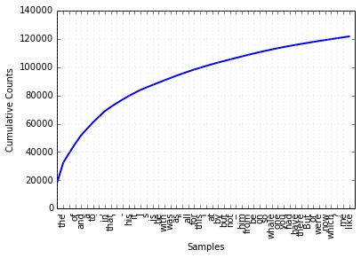

Figure 1-4. Cumulative frequency plot for the 50 most frequently used words in Moby Dick, which account for nearly half of the tokens.

whale出现超过900次。产生关于这些词汇的累积频率图，使用fdist1.plot(50, cumulative=True)产生图1-4。这50个词占了这本书的将近一半。

如果高频词对我们没有帮助，那么只出现一次的词（所谓的hapaxes）如何？

```py
fdist1.hapaxes()[:10]
[u'funereal',
 u'unscientific',
 u'prefix',
 u'plaudits',
 u'woody',
 u'disobeying',
 u'Westers',
 u'DRYDEN',
 u'Untried',
 u'superficially']
```

所有长度超过7个字符并且出现次数超过7次的词。

```py
fdist5 = FreqDist(text5)
sorted([w for w in set(text5) if len(w) > 7 and fdist5[w] > 7])
[u'#14-19teens',
 u'#talkcity_adults',
 u'((((((((((',
 u'........',
 u'Question',
 u'actually',
 u'anything',
 u'computer',
 u'cute.-ass',
 u'everyone',
 u'football',
 u'innocent',
 u'listening',
 u'remember',
 u'seriously',
 u'something',
 u'together',
 u'tomorrow',
 u'watching']
```

### 词语搭配和双连词
collocation是不经常在一起出现的词序列。要获取搭配，首先从提取文本词汇中的词对也就是bigrams开始。

```py
from nltk import bigrams
bigrams(['more', 'is', 'said', 'than', 'done'])
list(bigrams(['more', 'is', 'said', 'than', 'done']))
[('more', 'is'), ('is', 'said'), ('said', 'than'), ('than', 'done')]
```

collocation基本上是频繁的bigrams。找出出现频率比预期更频繁的bigrams:

```py
text4.collocations()
United States; fellow citizens; four years; years ago; Federal
Government; General Government; American people; Vice President; Old
World; Almighty God; Fellow citizens; Chief Magistrate; Chief Justice;
God bless; every citizen; Indian tribes; public debt; one another;
foreign nations; political parties
```

### 计算其他东西
查看文本中词长的分布：

```py
[len(w) for w in text1][:10]
[1, 4, 4, 2, 6, 8, 4, 1, 9, 1]

fdist = FreqDist([len(w) for w in text1])
fdist
FreqDist({1: 47933,
          2: 38513,
          3: 50223,
          4: 42345,
          5: 26597,
          6: 17111,
          7: 14399,
          8: 9966,
          9: 6428,
          10: 3528,
          11: 1873,
          12: 1053,
          13: 567,
          14: 177,
          15: 70,
          16: 22,
          17: 12,
          18: 1,
          20: 1})

fdist.keys()
[1, 2, 3, 4, 5, 6, 7, 8, 9, 10, 11, 12, 13, 14, 15, 16, 17, 18, 20]
```

最频繁词的长度是3，长度为3的词有50000多个（约占书中全部词汇的20%）。

Table 1-2. Functions defined for NLTK’s frequency distributions

| Example | Description  |
 | ------- | -----------  |
 | fdist = FreqDist(samples) | Create a frequency distribution containing the given samples  |
 | fdist.inc(sample) | Increment the count for this sample  |
 | fdist['monstrous'] | Count of the number of times a given sample occurred  |
 | fdist.freq('monstrous') | Frequency of a given sample  |
 | fdist.N() | Total number of samples  |
 | fdist.keys() | The samples sorted in order of decreasing frequency  |
 | for sample in fdist: | Iterate over the samples, in order of decreasing frequency  |
 | fdist.max() | Sample with the greatest count  |
 | fdist.tabulate() | Tabulate the frequency distribution  |
 | fdist.plot() | Graphical plot of the frequency distribution  |
 | fdist.plot(cumulative=True) | Cumulative plot of the frequency distribution  |
 | fdist1 < fdist2 | Test if samples in fdist1 occur less frequently than in fdist2 |

# 获取文本语料库
## 古腾堡语料库
代表既定的文学。这个语料库中的文件标识符。

```py
%matplotlib inline
import nltk
from nltk.corpus import gutenberg
gutenberg.fileids()

[u'austen-emma.txt',
 u'austen-persuasion.txt',
 u'austen-sense.txt',
 u'bible-kjv.txt',
 u'blake-poems.txt',
 u'bryant-stories.txt',
 u'burgess-busterbrown.txt',
 u'carroll-alice.txt',
 u'chesterton-ball.txt',
 u'chesterton-brown.txt',
 u'chesterton-thursday.txt',
 u'edgeworth-parents.txt',
 u'melville-moby_dick.txt',
 u'milton-paradise.txt',
 u'shakespeare-caesar.txt',
 u'shakespeare-hamlet.txt',
 u'shakespeare-macbeth.txt',
 u'whitman-leaves.txt']
```

找出emma包含多少个词。

```py
emma = gutenberg.words('austen-emma.txt')
len(emma)
192427
```

统计每个文本的3个统计量：平均词长、平均句子长度和文本中每个词出现的平均次数（词汇多样性得分）。

```py
for fileid in gutenberg.fileids():
    num_chars = len(gutenberg.raw(fileid))
    num_words = len(gutenberg.words(fileid))
    num_sents = len(gutenberg.sents(fileid))
    num_vocab = len(set([w.lower() for w in gutenberg.words(fileid)]))
    print int(num_chars/num_words), int(num_words/num_sents), int(num_words/num_vocab), fileid
4 24 26 austen-emma.txt
4 26 16 austen-persuasion.txt
4 28 22 austen-sense.txt
4 33 79 bible-kjv.txt
4 19 5 blake-poems.txt
4 19 14 bryant-stories.txt
4 17 12 burgess-busterbrown.txt
4 20 12 carroll-alice.txt
4 20 11 chesterton-ball.txt
4 22 11 chesterton-brown.txt
4 18 10 chesterton-thursday.txt
4 20 24 edgeworth-parents.txt
4 25 15 melville-moby_dick.txt
4 52 10 milton-paradise.txt
4 11 8 shakespeare-caesar.txt
4 12 7 shakespeare-hamlet.txt
4 12 6 shakespeare-macbeth.txt
4 36 12 whitman-leaves.txt
```

sents()函数把文本划分成句子，其中每一个句子是一个词链表。

```py
macbeth_sentences = gutenberg.sents('shakespeare-macbeth.txt')
macbeth_sentences
[[u'[', u'The', u'Tragedie', u'of', u'Macbeth', u'by', u'William', u'Shakespeare', u'1603', u']'], [u'Actus', u'Primus', u'.'], ...]

macbeth_sentences[1037]
[u'Good',
 u'night',
 u',',
 u'and',
 u'better',
 u'health',
 u'Attend',
 u'his',
 u'Maiesty']

longest_len = max([len(s) for s in macbeth_sentences])
longest_len
158

[s for s in macbeth_sentences if len(s) == longest_len][0][:10]
[u'Doubtfull',
 u'it',
 u'stood',
 u',',
 u'As',
 u'two',
 u'spent',
 u'Swimmers',
 u',',
 u'that']
```

## 网络和聊天文本
非正式的语言。

```py
from nltk.corpus import webtext
for fileid in webtext.fileids():
    print fileid, webtext.raw(fileid)[:65], '...'
firefox.txt Cookie Manager: "Don't allow sites that set removed cookies to se ...
grail.txt SCENE 1: [wind] [clop clop clop] 
KING ARTHUR: Whoa there!  [clop ...
overheard.txt White guy: So, do you have any plans for this evening?
Asian girl ...
pirates.txt PIRATES OF THE CARRIBEAN: DEAD MAN'S CHEST, by Ted Elliott & Terr ...
singles.txt 25 SEXY MALE, seeks attrac older single lady, for discreet encoun ...
wine.txt Lovely delicate, fragrant Rhone wine. Polished leather and strawb ...
```

即时消息聊天会话语料库：

```py
from nltk.corpus import nps_chat
chatroom = nps_chat.posts('10-19-20s_706posts.xml')
chatroom[123]
[u'i',
 u'do',
 u"n't",
 u'want',
 u'hot',
 u'pics',
 u'of',
 u'a',
 u'female',
 u',',
 u'I',
 u'can',
 u'look',
 u'in',
 u'a',
 u'mirror',
 u'.']
```

## 布朗语料库
包含500个不同来源的文本，按照文体分类，如新闻、社论等。

```py
from nltk.corpus import brown
brown.categories()
[u'adventure',
 u'belles_lettres',
 u'editorial',
 u'fiction',
 u'government',
 u'hobbies',
 u'humor',
 u'learned',
 u'lore',
 u'mystery',
 u'news',
 u'religion',
 u'reviews',
 u'romance',
 u'science_fiction']

brown.words(categories='news')
[u'The', u'Fulton', u'County', u'Grand', u'Jury', ...]

brown.words(fileids=['cg22'])
[u'Does', u'our', u'society', u'have', u'a', ...]

brown.sents(categories=['news', 'editorial', 'reviews'])
[[u'The', u'Fulton', u'County', u'Grand', u'Jury', u'said', u'Friday', u'an', u'investigation', u'of', u"Atlanta's", u'recent', u'primary', u'election', u'produced', u'``', u'no', u'evidence', u"''", u'that', u'any', u'irregularities', u'took', u'place', u'.'], [u'The', u'jury', u'further', u'said', u'in', u'term-end', u'presentments', u'that', u'the', u'City', u'Executive', u'Committee', u',', u'which', u'had', u'over-all', u'charge', u'of', u'the', u'election', u',', u'``', u'deserves', u'the', u'praise', u'and', u'thanks', u'of', u'the', u'City', u'of', u'Atlanta', u"''", u'for', u'the', u'manner', u'in', u'which', u'the', u'election', u'was', u'conducted', u'.'], ...]
```

布朗语料库是一个研究文体之间的系统性差异（又叫做stylistics文体学的语言学研究）的资源。第一步：对特定文体进行计数。

```py
from nltk.corpus import brown
news_text = brown.words(categories='news')
fdist = nltk.FreqDist([w.lower() for w in news_text])
modals = ['can', 'could', 'may', 'might', 'must', 'will']
for m in modals:
    print m + ':', fdist[m],
can: 94 could: 87 may: 93 might: 38 must: 53 will: 389
```

统计每一个感兴趣的文体。

```py
cfd = nltk.ConditionalFreqDist(
    (genre, word)
    for genre in brown.categories()
    for word in brown.words(categories=genre))
genres = ['news', 'religion', 'hobbies', 'science_fiction', 'romance', 'humor']
modals = ['can', 'could', 'may', 'might', 'must', 'will']
cfd.tabulate(conditions=genres, samples=modals)

                  can could   may might  must  will 
           news    93    86    66    38    50   389 
       religion    82    59    78    12    54    71 
        hobbies   268    58   131    22    83   264 
science_fiction    16    49     4    12     8    16 
        romance    74   193    11    51    45    43 
          humor    16    30     8     8     9    13 
```

观察发现新闻文体中最常见的情态动词是will，而言情文体中最常见的情态动词是could。

## 路透社语料库
路透社语料库包含10788个新闻文档，共计130万字。这些文档分成90个主题，按照“训练”和“测试”分为两组。

```py
from nltk.corpus import reuters
reuters.fileids()[:10]
['test/14826',
 'test/14828',
 'test/14829',
 'test/14832',
 'test/14833',
 'test/14839',
 'test/14840',
 'test/14841',
 'test/14842',
 'test/14843']

reuters.categories()
[u'acq',
 u'alum',
 u'barley',
 u'bop',
 u'carcass',
 u'castor-oil',
 u'cocoa',
 u'coconut',
 u'coconut-oil',
 u'coffee',
 u'copper',
 u'copra-cake',
 u'corn',
 u'cotton',
 u'cotton-oil',
 u'cpi',
 u'cpu',
 u'crude',
 u'dfl',
 u'dlr',
 u'dmk',
 u'earn',
 u'fuel',
 u'gas',
 u'gnp',
 u'gold',
 u'grain',
 u'groundnut',
 u'groundnut-oil',
 u'heat',
 u'hog',
 u'housing',
 u'income',
 u'instal-debt',
 u'interest',
 u'ipi',
 u'iron-steel',
 u'jet',
 u'jobs',
 u'l-cattle',
 u'lead',
 u'lei',
 u'lin-oil',
 u'livestock',
 u'lumber',
 u'meal-feed',
 u'money-fx',
 u'money-supply',
 u'naphtha',
 u'nat-gas',
 u'nickel',
 u'nkr',
 u'nzdlr',
 u'oat',
 u'oilseed',
 u'orange',
 u'palladium',
 u'palm-oil',
 u'palmkernel',
 u'pet-chem',
 u'platinum',
 u'potato',
 u'propane',
 u'rand',
 u'rape-oil',
 u'rapeseed',
 u'reserves',
 u'retail',
 u'rice',
 u'rubber',
 u'rye',
 u'ship',
 u'silver',
 u'sorghum',
 u'soy-meal',
 u'soy-oil',
 u'soybean',
 u'strategic-metal',
 u'sugar',
 u'sun-meal',
 u'sun-oil',
 u'sunseed',
 u'tea',
 u'tin',
 u'trade',
 u'veg-oil',
 u'wheat',
 u'wpi',
 u'yen',
 u'zinc']
```

与布朗语料库不同，路透社语料库的类别时候互相重叠的，因为新闻报道往往涉及多个主题。

```py
reuters.categories('training/9865')
[u'barley', u'corn', u'grain', u'wheat']

reuters.categories(['training/9865', 'training/9880'])
[u'barley', u'corn', u'grain', u'money-fx', u'wheat']

reuters.fileids('barley')
[u'test/15618',
 u'test/15649',
 u'test/15676',
 u'test/15728',
 u'test/15871',
 u'test/15875',
 u'test/15952',
 u'test/17767',
 u'test/17769',
 u'test/18024',
 u'test/18263',
 u'test/18908',
 u'test/19275',
 u'test/19668',
 u'training/10175',
 u'training/1067',
 u'training/11208',
 u'training/11316',
 u'training/11885',
 u'training/12428',
 u'training/13099',
 u'training/13744',
 u'training/13795',
 u'training/13852',
 u'training/13856',
 u'training/1652',
 u'training/1970',
 u'training/2044',
 u'training/2171',
 u'training/2172',
 u'training/2191',
 u'training/2217',
 u'training/2232',
 u'training/3132',
 u'training/3324',
 u'training/395',
 u'training/4280',
 u'training/4296',
 u'training/5',
 u'training/501',
 u'training/5467',
 u'training/5610',
 u'training/5640',
 u'training/6626',
 u'training/7205',
 u'training/7579',
 u'training/8213',
 u'training/8257',
 u'training/8759',
 u'training/9865',
 u'training/9958']

reuters.fileids(['barley', 'corn'])[:10]
[u'test/14832',
 u'test/14858',
 u'test/15033',
 u'test/15043',
 u'test/15106',
 u'test/15287',
 u'test/15341',
 u'test/15618',
 u'test/15648',
 u'test/15649']

reuters.words('training/9865')[:14]
[u'FRENCH',
 u'FREE',
 u'MARKET',
 u'CEREAL',
 u'EXPORT',
 u'BIDS',
 u'DETAILED',
 u'French',
 u'operators',
 u'have',
 u'requested',
 u'licences',
 u'to',
 u'export']

reuters.words(['training/9865', 'training/9880'])
[u'FRENCH', u'FREE', u'MARKET', u'CEREAL', u'EXPORT', ...]

reuters.words(categories='barley')
[u'FRENCH', u'FREE', u'MARKET', u'CEREAL', u'EXPORT', ...]

reuters.words(categories=['barley', 'corn'])
[u'THAI', u'TRADE', u'DEFICIT', u'WIDENS', u'IN', ...]
```

## 就职演说语料库
语料库实际上是55个文本的集合，每个文本都是一个总统的演说。这个集合的一个显著特性是时间维度。

```py
from nltk.corpus import inaugural
inaugural.fileids()
[u'1789-Washington.txt',
 u'1793-Washington.txt',
 u'1797-Adams.txt',
 u'1801-Jefferson.txt',
 u'1805-Jefferson.txt',
 u'1809-Madison.txt',
 u'1813-Madison.txt',
 u'1817-Monroe.txt',
 u'1821-Monroe.txt',
 u'1825-Adams.txt',
 u'1829-Jackson.txt',
 u'1833-Jackson.txt',
 u'1837-VanBuren.txt',
 u'1841-Harrison.txt',
 u'1845-Polk.txt',
 u'1849-Taylor.txt',
 u'1853-Pierce.txt',
 u'1857-Buchanan.txt',
 u'1861-Lincoln.txt',
 u'1865-Lincoln.txt',
 u'1869-Grant.txt',
 u'1873-Grant.txt',
 u'1877-Hayes.txt',
 u'1881-Garfield.txt',
 u'1885-Cleveland.txt',
 u'1889-Harrison.txt',
 u'1893-Cleveland.txt',
 u'1897-McKinley.txt',
 u'1901-McKinley.txt',
 u'1905-Roosevelt.txt',
 u'1909-Taft.txt',
 u'1913-Wilson.txt',
 u'1917-Wilson.txt',
 u'1921-Harding.txt',
 u'1925-Coolidge.txt',
 u'1929-Hoover.txt',
 u'1933-Roosevelt.txt',
 u'1937-Roosevelt.txt',
 u'1941-Roosevelt.txt',
 u'1945-Roosevelt.txt',
 u'1949-Truman.txt',
 u'1953-Eisenhower.txt',
 u'1957-Eisenhower.txt',
 u'1961-Kennedy.txt',
 u'1965-Johnson.txt',
 u'1969-Nixon.txt',
 u'1973-Nixon.txt',
 u'1977-Carter.txt',
 u'1981-Reagan.txt',
 u'1985-Reagan.txt',
 u'1989-Bush.txt',
 u'1993-Clinton.txt',
 u'1997-Clinton.txt',
 u'2001-Bush.txt',
 u'2005-Bush.txt',
 u'2009-Obama.txt']

[fileid[:4] for fileid in inaugural.fileids()]
[u'1789',
 u'1793',
 u'1797',
 u'1801',
 u'1805',
 u'1809',
 u'1813',
 u'1817',
 u'1821',
 u'1825',
 u'1829',
 u'1833',
 u'1837',
 u'1841',
 u'1845',
 u'1849',
 u'1853',
 u'1857',
 u'1861',
 u'1865',
 u'1869',
 u'1873',
 u'1877',
 u'1881',
 u'1885',
 u'1889',
 u'1893',
 u'1897',
 u'1901',
 u'1905',
 u'1909',
 u'1913',
 u'1917',
 u'1921',
 u'1925',
 u'1929',
 u'1933',
 u'1937',
 u'1941',
 u'1945',
 u'1949',
 u'1953',
 u'1957',
 u'1961',
 u'1965',
 u'1969',
 u'1973',
 u'1977',
 u'1981',
 u'1985',
 u'1989',
 u'1993',
 u'1997',
 u'2001',
 u'2005',
 u'2009']

cfd = nltk.ConditionalFreqDist(
    (target, fileid[:4])
    for fileid in inaugural.fileids()
    for w in inaugural.words(fileid)
    for target in ['america', 'citizen'] if w.lower().startswith(target))
cfd.plot()
```

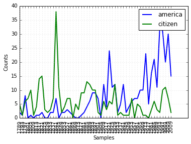

Figure 2-1. Plot of a conditional frequency distribution: All words in the Inaugural Address Corpus that begin with america or citizen are counted; separate counts are kept for each address; these are plotted so that trends in usage over time can be observed; counts are not normalized for document length.

## 其他语言的语料库
多国语言的语料库。

```py
nltk.corpus.cess_esp.words()
[u'El', u'grupo', u'estatal', ...]

nltk.corpus.floresta.words()
[u'Um', u'revivalismo', u'refrescante', u'O', ...]

nltk.corpus.indian.words('hindi.pos')
[u'\u092a\u0942\u0930\u094d\u0923', u'\u092a\u094d\u0930\u0924\u093f\u092c\u0902\u0927', ...]

nltk.corpus.udhr.fileids()[:10]
[u'Abkhaz-Cyrillic+Abkh',
 u'Abkhaz-UTF8',
 u'Achehnese-Latin1',
 u'Achuar-Shiwiar-Latin1',
 u'Adja-UTF8',
 u'Afaan_Oromo_Oromiffa-Latin1',
 u'Afrikaans-Latin1',
 u'Aguaruna-Latin1',
 u'Akuapem_Twi-UTF8',
 u'Albanian_Shqip-Latin1']

nltk.corpus.udhr.words('Javanese-Latin1')[11:]
[u'Saben', u'umat', u'manungsa', u'lair', u'kanthi', ...]
```

udhr包含有超过300种语言的世界人权宣言。利用条件频率分布研究udhr语料库中不同语言版本中之长的差异。

```py
from nltk.corpus import udhr
languages = ['Chickasaw', 'English', 'German_Deutsch',
             'Greenlandic_Inuktikut', 'Hungarian_Magyar', 'Ibibio_Efik']
cfd = nltk.ConditionalFreqDist(
    (lang, len(word))
    for lang in languages
    for word in udhr.words(lang + '-Latin1'))
cfd.plot(cumulative=True)
```

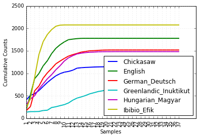

Figure 2-2. Cumulative word length distributions: Six translations of the Universal Declaration of Human Rights are processed; this graph shows that words having five or fewer letters account for about 80% of Ibibio text, 60% of German text, and 25% of Inuktitut text.

## 文本语料库的结构
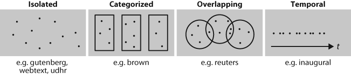

Figure 2-3. Common structures for text corpora: The simplest kind of corpus is a collection of isolated texts with no particular organization; some corpora are structured into categories, such as genre (Brown Corpus); some categorizations overlap, such as topic categories (Reuters Corpus); other corpora represent language use over time (Inaugural Address Corpus).

Table 2-3. Basic corpus functionality defined in NLTK: More documentation can be found using help(nltk.corpus.reader) and by reading the online Corpus HOWTO at http://www.nltk.org/howto.

| Example | Description |
|------- | ----------- |
|fileids() | The files of the corpus |
|fileids([categories]) | The files of the corpus corresponding to these categories |
|categories() | The categories of the corpus |
|categories([fileids]) | The categories of the corpus corresponding to these files |
|raw() | The raw content of the corpus |
|raw(fileids=[f1,f2,f3]) | The raw content of the specified files |
|raw(categories=[c1,c2]) | The raw content of the specified categories |
|words() | The words of the whole corpus |
|words(fileids=[f1,f2,f3]) | The words of the specified fileids |
|words(categories=[c1,c2]) | The words of the specified categories |
|sents() | The sentences of the specified categories |
|sents(fileids=[f1,f2,f3]) | The sentences of the specified fileids |
|sents(categories=[c1,c2]) | The sentences of the specified categories |
|abspath(fileid) | The location of the given file on disk |
|encoding(fileid) | The encoding of the file (if known) |
|open(fileid) | Open a stream for reading the given corpus file |
|root() | The path to the root of locally installed corpus |
|readme() | The contents of the README file of the corpus |

## 载入你自己的语料库
txt文件载入。

```py
from nltk.corpus import PlaintextCorpusReader
corpus_root = '/usr/share/dict'
wordlists = PlaintextCorpusReader(corpus_root, '.*')
wordlists.fileids()
['README', 'connectives', 'propernames', 'web2', 'web2a', 'words']

wordlists.words('connectives')
[u'the', u'of', u'and', u'to', u'a', u'in', u'that', ...]
```

载入宾州树库的副本。

```py
from nltk.corpus import BracketParseCorpusReader
corpus_root = r"C:\corpora\penntreebank\parsed\mrg\wsj"
file_pattern = r".*/wsj_.*\.mrg"
ptb = BracketParseCorpusReader(corpus_root, file_pattern)
ptb.fileids()
['00/wsj_0001.mrg', '00/wsj_0002.mrg', '00/wsj_0003.mrg', '00/wsj_0004.mrg', ...]

len(ptb.sents())
49208

ptb.sents(fileids='20/wsj_2013.mrg')[19]
['The', '55-year-old', 'Mr.', 'Noriega', 'is', "n't", 'as', 'smooth', 'as', 'the',
'shah', 'of', 'Iran', ',', 'as', 'well-born', 'as', 'Nicaragua', "'s", 'Anastasio',
'Somoza', ',', 'as', 'imperial', 'as', 'Ferdinand', 'Marcos', 'of', 'the', 'Philippines',
'or', 'as', 'bloody', 'as', 'Haiti', "'s", 'Baby', Doc', 'Duvalier', '.']
```

# 条件频率分布
conditional frequency distribution 是频率分布的集合，每个频率分布有一个不同的“条件”。这个条件通常是文本的类别。

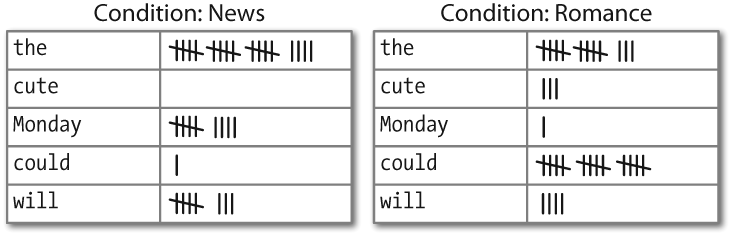

Figure 2-4. Counting words appearing in a text collection (a conditional frequency distribution).

## 条件与事件
条件频率分布需要给每个事件关联一个条件。每对的形式是：（条件，事件）。如果我们按文体处理整个布朗语料库，将有15个条件（一个文体一个条件）和1161192个事件（一个词一个事件）。

## 按文体计数词汇
只看两个文体：新闻和言情。对于每个文体，遍历文体中的每个词以产生与词的配对。

```py
%matplotlib inline
from nltk.corpus import brown

genre_word = [(genre, word)
              for genre in ['news', 'romance']
              for word in brown.words(categories=genre)]
len(genre_word)
170576

import nltk

cfd = nltk.ConditionalFreqDist(genre_word)
len(cfd)
2

cfd.conditions()
['romance', 'news']
```

访问这两个条件，它们每一个都只有一个频率分布。

```py
list(cfd['romance'])[:10]
[u'raining',
 u'belligerence',
 u'yellow',
 u'factory',
 u'four',
 u'Does',
 u'railing',
 u'ringlets',
 u'self-pity',
 u'attracted']

cfd['romance']['could']
193
```

## 绘制分布图和分布表
在plot()和tabulate()方法中，可以使用conditions=参数来指定显示哪些条件。如果忽略，所有条件都会显示出来。同样，可以使用sample=参数来限制要显示的样本。

例如为两种语言和长度少于10个字符的词汇绘制累计频率数据表。

```py
from nltk.corpus import udhr
languages = ['Chickasaw', 'English', 'German_Deutsch',
             'Greenlandic_Inuktikut', 'Hungarian_Magyar', 'Ibibio_Efik']
cfd = nltk.ConditionalFreqDist(
    (lang, len(word))
    for lang in languages
    for word in udhr.words(lang + '-Latin1'))
cfd.tabulate(conditions=['English', 'German_Deutsch'],
             samples=range(10), cumulative=True)

                  0    1    2    3    4    5    6    7    8    9 
       English    0  185  525  883  997 1166 1283 1440 1558 1638 
German_Deutsch    0  171  263  614  717  894 1013 1110 1213 1275 
```

## 使用Bigrams生成随机文本
bigrams()函数能接受一个词汇链表，并建立起一个连续的词对链表。

```py
sent = ['In', 'the', 'beginning', 'God', 'created', 'the', 'heaven',
        'and', 'the', 'earth', '.']
for pair in nltk.bigrams(sent):
    print pair
('In', 'the')
('the', 'beginning')
('beginning', 'God')
('God', 'created')
('created', 'the')
('the', 'heaven')
('heaven', 'and')
('and', 'the')
('the', 'earth')
('earth', '.')
```

产生随机文本：此程序获得了《创世纪》文本中所有的双连词，然后构造一个条件频率分布来记录哪些词汇最有可能会跟在给定词的后面。例如：living后面最可能的词是creature。generate_model()函数使用这些数据和种子词来产生随机文本。

```py
def generate_model(cfdist, word, num=15):
    for i in range(num):
        print word,
        word = cfdist[word].max()

text = nltk.corpus.genesis.words('english-kjv.txt')
bigrams = nltk.bigrams(text)
cfd = nltk.ConditionalFreqDist(bigrams)
cfd['living']
FreqDist({u',': 1,
          u'.': 1,
          u'creature': 7,
          u'soul': 1,
          u'substance': 2,
          u'thing': 4})

generate_model(cfd, 'living')
living creature that he said , and the land of the land of the land
```

Table 2-4. NLTK’s conditional frequency distributions: Commonly used methods and idioms for defining, accessing, and visualizing a conditional frequency distribution of counters

| Example | Description |
| ------- | ----------- |
| cfdist = ConditionalFreqDist(pairs) | Create a conditional frequency distribution from a list of pairs |
| cfdist.conditions() | Alphabetically sorted list of conditions |
| cfdist[condition] | The frequency distribution for this condition |
| cfdist[condition][sample] | Frequency for the given sample for this condition |
| cfdist.tabulate() | Tabulate the conditional frequency distribution |
| cfdist.tabulate(samples, conditions) | Tabulation limited to the specified samples and conditions |
| cfdist.plot() | Graphical plot of the conditional frequency distribution |
| cfdist.plot(samples, conditions) | Graphical plot limited to the specified samples and conditions |
| cfdist1 < cfdist2 | Test if samples in cfdist1 occur less frequently than in cfdist2 |\n"

# 词典资源
词典(Lexical)或词典资源是一个词和/或短语及其相关信息的集合，例如：词性(part-of-speech)和词意(sense)定义等相关信息。

图2-5中描述了词汇相关的标准术语。词项(lexical entry)包括词目(headword)（也叫词条(lemma)）及其他附加信息，例如：词性和词意定义。两个含义不同但拼写相同的分词被称为同音异义词(homonyms)。

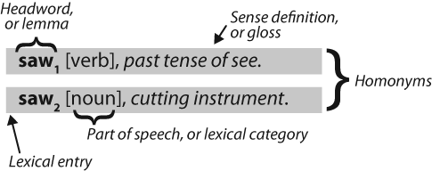

Figure 2-5. Lexicon terminology: Lexical entries for two lemmas having the same spelling (homonyms), providing part-of-speech and gloss information.

## 词汇列表语料库
过滤文本：此程序计算文本的词汇表，然后删除所有在现有的词汇列表中出现的元素，只留下罕见的或拼写错误的词汇。

```py
%matplotlib inline
import nltk

def unusual_words(text):
    text_vocab = set(w.lower() for w in text if w.isalpha())
    english_vocab = set(w.lower() for w in nltk.corpus.words.words())
    unusual = text_vocab.difference(english_vocab)
    return sorted(unusual)

unusual_words(nltk.corpus.gutenberg.words('austen-sense.txt'))[:30]
[u'abbeyland',
 u'abhorred',
 u'abilities',
 u'abounded',
 u'abridgement',
 u'abused',
 u'abuses',
 u'accents',
 u'accepting',
 u'accommodations',
 u'accompanied',
 u'accounted',
 u'accounts',
 u'accustomary',
 u'aches',
 u'acknowledging',
 u'acknowledgment',
 u'acknowledgments',
 u'acquaintances',
 u'acquiesced',
 u'acquitted',
 u'acquitting',
 u'acted',
 u'actions',
 u'adapted',
 u'adding',
 u'additions',
 u'addressed',
 u'addresses',
 u'addressing']

unusual_words(nltk.corpus.nps_chat.words())[:30]
[u'aaaaaaaaaaaaaaaaa',
 u'aaahhhh',
 u'abortions',
 u'abou',
 u'abourted',
 u'abs',
 u'ack',
 u'acros',
 u'actualy',
 u'adams',
 u'adds',
 u'adduser',
 u'adjusts',
 u'adoted',
 u'adreniline',
 u'ads',
 u'adults',
 u'afe',
 u'affairs',
 u'affari',
 u'affects',
 u'afk',
 u'agaibn',
 u'ages',
 u'aggravated',
 u'agurlwithbigguns',
 u'ahah',
 u'ahahah',
 u'ahahh',
 u'ahahha']
```

停用词(stopwords)语料库：

```py
from nltk.corpus import stopwords
stopwords.words('english')[:30]
[u'i',
 u'me',
 u'my',
 u'myself',
 u'we',
 u'our',
 u'ours',
 u'ourselves',
 u'you',
 u'your',
 u'yours',
 u'yourself',
 u'yourselves',
 u'he',
 u'him',
 u'his',
 u'himself',
 u'she',
 u'her',
 u'hers',
 u'herself',
 u'it',
 u'its',
 u'itself',
 u'they',
 u'them',
 u'their',
 u'theirs',
 u'themselves',
 u'what']
```

定义一个函数来计算文本中不包含在停用词表中的词所占的比例。

```py
from __future__ import division

def content_fraction(text):
    stopwords = nltk.corpus.stopwords.words('english')
    content = [w for w in text if w.lower() not in stopwords]
    return len(content) / len(text)
content_fraction(nltk.corpus.reuters.words())
0.735240435097661
```

在停用词的帮助下，筛选掉文本中三分之一的词。

词谜。检查必须出现的字母（2）和长度限制（1）（这里只查找6个或6个以上字母的词）。利用FreqDist比较法（3）检查候选词中的每个字母出现的频率是否小于或等于其相应在词谜中出现的频率。

```py
puzzle_letters = nltk.FreqDist('egivrvonl')
obligatory = 'r'
wordlist = nltk.corpus.words.words()
[w for w in wordlist if len(w) >= 6 #1
                        and obligatory in w #2
                        and nltk.FreqDist(w) <= puzzle_letters] #3
[u'glover',
 u'gorlin',
 u'govern',
 u'grovel',
 u'ignore',
 u'involver',
 u'lienor',
 u'linger',
 u'longer',
 u'lovering',
 u'noiler',
 u'overling',
 u'region',
 u'renvoi',
 u'revolving',
 u'ringle',
 u'roving',
 u'violer',
 u'virole']
```

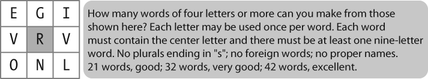

Figure 2-6. A word puzzle: A grid of randomly chosen letters with rules for creating words out of the letters; this puzzle is known as “Target.”

名字语料库。基于名字尾字母的男性/女性统计。

```py
names = nltk.corpus.names
names.fileids()
[u'female.txt', u'male.txt']

male_names = names.words('male.txt')
female_names = names.words('female.txt')
[w for w in male_names if w in female_names][:30cfd = nltk.ConditionalFreqDist()]
[u'Abbey',
 u'Abbie',
 u'Abby',
 u'Addie',
 u'Adrian',
 u'Adrien',
 u'Ajay',
 u'Alex',
 u'Alexis',
 u'Alfie',
 u'Ali',
 u'Alix',
 u'Allie',
 u'Allyn',
 u'Andie',
 u'Andrea',
 u'Andy',
 u'Angel',
 u'Angie',
 u'Ariel',
 u'Ashley',
 u'Aubrey',
 u'Augustine',
 u'Austin',
 u'Averil',
 u'Barrie',
 u'Barry',
 u'Beau',
 u'Bennie',
 u'Benny']

cfd = nltk.ConditionalFreqDist(
    (fileid, name[-1])
    for fileid in names.fileids()
    for name in names.words(fileid))
cfd.plot()
```

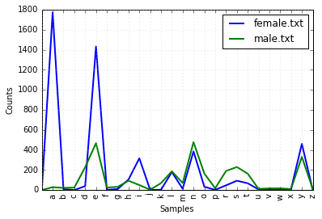

Figure 2-7. Conditional frequency distribution: This plot shows the number of female and male names ending with each letter of the alphabet; most names ending with a, e, or i are female; names ending in h and l are equally likely to be male or female; names ending in k, o, r, s, and t are likely to be male.

## 发音的词典
美国英语的CMU发音词典。

```py
entries = nltk.corpus.cmudict.entries()
len(entries)
133737

for entry in entries[39943:39951]:
    print entry
(u'explorer', [u'IH0', u'K', u'S', u'P', u'L', u'AO1', u'R', u'ER0'])
(u'explorers', [u'IH0', u'K', u'S', u'P', u'L', u'AO1', u'R', u'ER0', u'Z'])
(u'explores', [u'IH0', u'K', u'S', u'P', u'L', u'AO1', u'R', u'Z'])
(u'exploring', [u'IH0', u'K', u'S', u'P', u'L', u'AO1', u'R', u'IH0', u'NG'])
(u'explosion', [u'IH0', u'K', u'S', u'P', u'L', u'OW1', u'ZH', u'AH0', u'N'])
(u'explosions', [u'IH0', u'K', u'S', u'P', u'L', u'OW1', u'ZH', u'AH0', u'N', u'Z'])
(u'explosive', [u'IH0', u'K', u'S', u'P', u'L', u'OW1', u'S', u'IH0', u'V'])
(u'explosively', [u'EH2', u'K', u'S', u'P', u'L', u'OW1', u'S', u'IH0', u'V', u'L', u'IY0'])
```

对任意一个词，词典资源都有语音的代码——不同的声音有着不同的标签——称作音素(phones)。

扫描词典中发音包含三个音素的条目。

```py
for word, pron in entries:
    if len(pron) == 3:
        ph1, ph2, ph3 = pron
        if ph1 == 'P' and ph3 == 'T':
            print word, ph2,
pait EY1 pat AE1 pate EY1 patt AE1 peart ER1 peat IY1 peet IY1 peete IY1 pert ER1 pet EH1 pete IY1 pett EH1 piet IY1 piette IY1 pit IH1 pitt IH1 pot AA1 pote OW1 pott AA1 pout AW1 puett UW1 purt ER1 put UH1 putt AH1
```

找到所有发音结尾与nicks相似的词汇。通过此方法也可以找到押韵的词。

```py
syllable = ['N', 'IH0', 'K', 'S']
[word for word, pron in entries if pron[-4:] == syllable]
[u"atlantic's",
 u'audiotronics',
 u'avionics',
 u'beatniks',
 u'calisthenics',
 u'centronics',
 u'chamonix',
 u'chetniks',
 u"clinic's",
 u'clinics',
 u'conics',
 u'conics',
 u'cryogenics',
 u'cynics',
 u'diasonics',
 u"dominic's",
 u'ebonics',
 u'electronics',
 u"electronics'",
 u"endotronics'",
 u'endotronics',
 u'enix',
 u'environics',
 u'ethnics',
 u'eugenics',
 u'fibronics',
 u'flextronics',
 u'harmonics',
 u'hispanics',
 u'histrionics',
 u'identics',
 u'ionics',
 u'kibbutzniks',
 u'lasersonics',
 u'lumonics',
 u'mannix',
 u'mechanics',
 u"mechanics'",
 u'microelectronics',
 u'minix',
 u'minnix',
 u'mnemonics',
 u'mnemonics',
 u'molonicks',
 u'mullenix',
 u'mullenix',
 u'mullinix',
 u'mulnix',
 u"munich's",
 u'nucleonics',
 u'onyx',
 u'organics',
 u"panic's",
 u'panics',
 u'penix',
 u'pennix',
 u'personics',
 u'phenix',
 u"philharmonic's",
 u'phoenix',
 u'phonics',
 u'photronics',
 u'pinnix',
 u'plantronics',
 u'pyrotechnics',
 u'refuseniks',
 u"resnick's",
 u'respironics',
 u'sconnix',
 u'siliconix',
 u'skolniks',
 u'sonics',
 u'sputniks',
 u'technics',
 u'tectonics',
 u'tektronix',
 u'telectronics',
 u'telephonics',
 u'tonics',
 u'unix',
 u"vinick's",
 u"vinnick's",
 u'vitronics']
```

音素包含数字表示主重音（1）、次重音（2）和无重音（0）。定义一个函数来提取重音数字，然后扫描词典，找到具有特定重音模式的词汇。

```py
def stress(pron):
    return [char for phone in pron for char in phone if char.isdigit()]

[w for w, pron in entries if stress(pron) == ['0', '1', '0', '2', '0']][:30]
[u'abbreviated',
 u'abbreviated',
 u'abbreviating',
 u'accelerated',
 u'accelerating',
 u'accelerator',
 u'accelerators',
 u'accentuated',
 u'accentuating',
 u'accommodated',
 u'accommodating',
 u'accommodative',
 u'accumulated',
 u'accumulating',
 u'accumulative',
 u'accumulator',
 u'accumulators',
 u'accusatory',
 u'adenovirus',
 u'adjudicated',
 u'adjudicating',
 u'administrating',
 u'administrative',
 u'administrator',
 u"administrators'",
 u"administrator's",
 u'administrators',
 u'adulterated',
 u'adventurism',
 u'adventurism']
```

## 比较词表
表格词典的另外一个例子是comparative wordlist。NLTK中包含了所谓的Swadesh wordlists，包括几种语言的约200个常用词的列表。

```py
from nltk.corpus import swadesh
swadesh.fileids()
[u'be',
 u'bg',
 u'bs',
 u'ca',
 u'cs',
 u'cu',
 u'de',
 u'en',
 u'es',
 u'fr',
 u'hr',
 u'it',
 u'la',
 u'mk',
 u'nl',
 u'pl',
 u'pt',
 u'ro',
 u'ru',
 u'sk',
 u'sl',
 u'sr',
 u'sw',
 u'uk']

swadesh.words('en')[:30]
[u'I',
 u'you (singular), thou',
 u'he',
 u'we',
 u'you (plural)',
 u'they',
 u'this',
 u'that',
 u'here',
 u'there',
 u'who',
 u'what',
 u'where',
 u'when',
 u'how',
 u'not',
 u'all',
 u'many',
 u'some',
 u'few',
 u'other',
 u'one',
 u'two',
 u'three',
 u'four',
 u'five',
 u'big',
 u'long',
 u'wide',
 u'thick']

fr2en = swadesh.entries(['fr', 'en'])
fr2en[:30]
[(u'je', u'I'),
 (u'tu, vous', u'you (singular), thou'),
 (u'il', u'he'),
 (u'nous', u'we'),
 (u'vous', u'you (plural)'),
 (u'ils, elles', u'they'),
 (u'ceci', u'this'),
 (u'cela', u'that'),
 (u'ici', u'here'),
 (u'l\xe0', u'there'),
 (u'qui', u'who'),
 (u'quoi', u'what'),
 (u'o\xf9', u'where'),
 (u'quand', u'when'),
 (u'comment', u'how'),
 (u'ne...pas', u'not'),
 (u'tout', u'all'),
 (u'plusieurs', u'many'),
 (u'quelques', u'some'),
 (u'peu', u'few'),
 (u'autre', u'other'),
 (u'un', u'one'),
 (u'deux', u'two'),
 (u'trois', u'three'),
 (u'quatre', u'four'),
 (u'cinq', u'five'),
 (u'grand', u'big'),
 (u'long', u'long'),
 (u'large', u'wide'),
 (u'\xe9pais', u'thick')]

translate = dict(fr2en)
translate['chien']
u'dog'

translate['jeter']
u'throw'

de2en = swadesh.entries(['de', 'en'])    # German-English
es2en = swadesh.entries(['es', 'en'])    # Spanish-English
translate.update(dict(de2en))
translate.update(dict(es2en))
translate['Hund']
u'dog'

translate['perro']
u'dog'
```

比较德语族和拉丁语族的不同。

```py
languages = ['en', 'de', 'nl', 'es', 'fr', 'pt', 'la']
for i in [139, 140, 141, 142]:
    print swadesh.entries(languages)[i]
(u'say', u'sagen', u'zeggen', u'decir', u'dire', u'dizer', u'dicere')
(u'sing', u'singen', u'zingen', u'cantar', u'chanter', u'cantar', u'canere')
(u'play', u'spielen', u'spelen', u'jugar', u'jouer', u'jogar, brincar', u'ludere')
(u'float', u'schweben', u'zweven', u'flotar', u'flotter', u'flutuar, boiar', u'fluctuare')
```

## 词汇工具：Toolbox
目前最流行的语言学家用来管理数据的工具是Toolbox。Toolbox文件由一些条目的集合组成，其中每个条目由一个或多个字段组成。

下面是Rotokas语的词典。只看第一个条目，词kaa，意思是“窒息”。

```py
from nltk.corpus import toolbox
toolbox.entries('rotokas.dic')[1][:30]
(u'kaa',
 [(u'ps', u'V'),
  (u'pt', u'B'),
  (u'ge', u'strangle'),
  (u'tkp', u'pasim nek'),
  (u'arg', u'O'),
  (u'vx', u'2'),
  (u'dt', u'07/Oct/2006'),
  (u'ex', u'Rera rauroro rera kaarevoi.'),
  (u'xp', u'Em i holim pas em na nekim em.'),
  (u'xe', u'He is holding him and strangling him.'),
  (u'ex', u'Iroiro-ia oirato okoearo kaaivoi uvare rirovira kaureoparoveira.'),
  (u'xp', u'Ol i pasim nek bilong man long rop bikos em i save bikhet tumas.'),
  (u'xe',
   u"They strangled the man's neck with rope because he was very stubborn and arrogant."),
  (u'ex',
   u'Oirato okoearo kaaivoi iroiro-ia. Uva viapau uvuiparoi ra vovouparo uva kopiiroi.'),
  (u'xp',
   u'Ol i pasim nek bilong man long rop. Olsem na em i no pulim win olsem na em i dai.'),
  (u'xe',
   u"They strangled the man's neck with a rope. And he couldn't breathe and he died.")])
```

条目包括一系列“属性-值”对，如('ps', 'V')，表示词性是'V'（动词），('ge', 'gag')表示英文注释是'gag'。

## WordNet
WordNet是面向语义的英语词典。

汉语开放词网:[Chinese Open WordNet](http://openkg.cn/dataset/wordnet)

- OpenKG收集和整理国内国外重要的开放知识库和知识图谱项目，并组织整理相关的中文资料免费对外开放。
- 汉语开放词网是受 Princeton WordNet 和 Global WordNet Grid 启发由 NTU Computational Linguistics Lab 构建的，含有42315 synsets，79812 senses， 61536 unique words

### 意义与同义词
```
Benz is credited with the invention of the motorcar.
Benz is credited with the invention of the automobile.
```

motorcar和automobile是synonyms。

```py
from nltk.corpus import wordnet as wn
wn.synsets('motorcar')
[Synset('car.n.01')]
```

motorcar只有一个可能的含义，它被定义为car.n.01，car的第一个名词意义car.n.01被称为synset或"synonym set"，即意义相同的词（或“词条”）的集合。

```py
wn.synset('car.n.01').lemma_names()
[u'car', u'auto', u'automobile', u'machine', u'motorcar']
```

同义词集也有一些一般的定义和例句。

```py
wn.synset('car.n.01').definition()
u'a motor vehicle with four wheels; usually propelled by an internal combustion engine'

wn.synset('car.n.01').examples()
[u'he needs a car to get to work']
```

为了消除同义词集歧义，将这些词标注为car.n.01.automobile、car.n.01.motocar等。这种同义词集和词的配对叫做lemma。可以得到指定同义词集的所有lemma（1），查找特定的lemma（2），得到一个词条所对应的同义词集（3），也可以得到一个词条的“名字”（4）。

```py
wn.synset('car.n.01').lemmas() #1
[Lemma('car.n.01.car'),
 Lemma('car.n.01.auto'),
 Lemma('car.n.01.automobile'),
 Lemma('car.n.01.machine'),
 Lemma('car.n.01.motorcar')]

wn.lemma('car.n.01.automobile') #2
Lemma('car.n.01.automobile')

wn.lemma('car.n.01.automobile').synset() #3
Synset('car.n.01')

wn.lemma('car.n.01.automobile').name() #4
u'automobile'
```

词car共有5个同义词集。

```py
wn.synsets('car')
[Synset('car.n.01'),
 Synset('car.n.02'),
 Synset('car.n.03'),
 Synset('car.n.04'),
 Synset('cable_car.n.01')]

for synset in wn.synsets('car'):
    print synset.lemma_names()
[u'car', u'auto', u'automobile', u'machine', u'motorcar']
[u'car', u'railcar', u'railway_car', u'railroad_car']
[u'car', u'gondola']
[u'car', u'elevator_car']
[u'cable_car', u'car']
```

访问所有包含词car的lemmas：

```py
wn.lemmas('car')
[Lemma('car.n.01.car'),
 Lemma('car.n.02.car'),
 Lemma('car.n.03.car'),
 Lemma('car.n.04.car'),
 Lemma('cable_car.n.01.car')]
```

### WordNet的层次结构
一些概念综合性很强，如实体、状态、事件：这些被称为unique beginners。

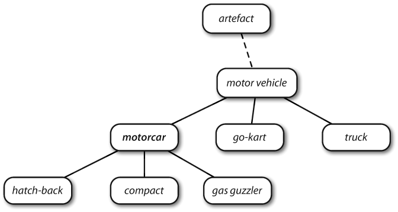

Figure 2-8. Fragment of WordNet concept hierarchy: Nodes correspond to synsets; edges indicate the hypernym/hyponym relation, i.e., the relation between superordinate and subordinate concepts.

WordNet使我们能容易驾驭各种概念。例如：motorcar，可以看到更加具体（直接）的概念——hyponyms。

```py
motorcar = wn.synset('car.n.01')
types_of_motorcar = motorcar.hyponyms()
types_of_motorcar[26]
Synset('stanley_steamer.n.01')

sorted([lemma.name() for synset in types_of_motorcar for lemma in synset.lemmas()])
[u'Model_T',
 u'S.U.V.',
 u'SUV',
 u'Stanley_Steamer',
 u'ambulance',
 u'beach_waggon',
 u'beach_wagon',
 u'bus',
 u'cab',
 u'compact',
 u'compact_car',
 u'convertible',
 u'coupe',
 u'cruiser',
 u'electric',
 u'electric_automobile',
 u'electric_car',
 u'estate_car',
 u'gas_guzzler',
 u'hack',
 u'hardtop',
 u'hatchback',
 u'heap',
 u'horseless_carriage',
 u'hot-rod',
 u'hot_rod',
 u'jalopy',
 u'jeep',
 u'landrover',
 u'limo',
 u'limousine',
 u'loaner',
 u'minicar',
 u'minivan',
 u'pace_car',
 u'patrol_car',
 u'phaeton',
 u'police_car',
 u'police_cruiser',
 u'prowl_car',
 u'race_car',
 u'racer',
 u'racing_car',
 u'roadster',
 u'runabout',
 u'saloon',
 u'secondhand_car',
 u'sedan',
 u'sport_car',
 u'sport_utility',
 u'sport_utility_vehicle',
 u'sports_car',
 u'squad_car',
 u'station_waggon',
 u'station_wagon',
 u'stock_car',
 u'subcompact',
 u'subcompact_car',
 u'taxi',
 u'taxicab',
 u'tourer',
 u'touring_car',
 u'two-seater',
 u'used-car',
 u'waggon',
 u'wagon']
```

通过访问hypernyms来操纵层次结构。

```py
motorcar.hypernyms()
[Synset('motor_vehicle.n.01')]

paths = motorcar.hypernym_paths()
len(paths)
2

[synset.name() for synset in paths[0]]
[u'entity.n.01',
 u'physical_entity.n.01',
 u'object.n.01',
 u'whole.n.02',
 u'artifact.n.01',
 u'instrumentality.n.03',
 u'container.n.01',
 u'wheeled_vehicle.n.01',
 u'self-propelled_vehicle.n.01',
 u'motor_vehicle.n.01',
 u'car.n.01']

[synset.name() for synset in paths[1]]
[u'entity.n.01',
 u'physical_entity.n.01',
 u'object.n.01',
 u'whole.n.02',
 u'artifact.n.01',
 u'instrumentality.n.03',
 u'conveyance.n.03',
 u'vehicle.n.01',
 u'wheeled_vehicle.n.01',
 u'self-propelled_vehicle.n.01',
 u'motor_vehicle.n.01',
 u'car.n.01']
```

得到一个最笼统的hypernyms同义词集。

```py
motorcar.root_hypernyms()
[Synset('entity.n.01')]
```

### 更多的词汇关系
Hypernyms 和 hyponyms 被称为词汇关系(lexical relations)。这两者的关系为上下定位“is-a”层次。一棵树可以分成树干、树冠等部分，这些都是part_meronyms()。一棵树的实质是由心材和边材组成的，即substance_meronyms()。树木的集合形成了一个森林，即member_holonyms()。

```py
wn.synset('tree.n.01').part_meronyms()
[Synset('burl.n.02'),
 Synset('crown.n.07'),
 Synset('limb.n.02'),
 Synset('stump.n.01'),
 Synset('trunk.n.01')]

wn.synset('tree.n.01').substance_meronyms()
[Synset('heartwood.n.01'), Synset('sapwood.n.01')]

wn.synset('tree.n.01').member_holonyms()
[Synset('forest.n.01')]
```

mint.n.04是mint.n.02的一部分，同时也是组成mint.n.05的材料。

```py
for synset in wn.synsets('mint', wn.NOUN):
    print synset.name() + ':', synset.definition()
batch.n.02: (often followed by `of') a large number or amount or extent
mint.n.02: any north temperate plant of the genus Mentha with aromatic leaves and small mauve flowers
mint.n.03: any member of the mint family of plants
mint.n.04: the leaves of a mint plant used fresh or candied
mint.n.05: a candy that is flavored with a mint oil
mint.n.06: a plant where money is coined by authority of the government

wn.synset('mint.n.04').part_holonyms()
[Synset('mint.n.02')]

wn.synset('mint.n.04').substance_holonyms()
[Synset('mint.n.05')]
```

走路蕴含(entails)着抬脚。

```py
wn.synset('walk.v.01').entailments()
[Synset('step.v.01')]

wn.synset('eat.v.01').entailments()
[Synset('chew.v.01'), Synset('swallow.v.01')]

wn.synset('tease.v.03').entailments()
[Synset('arouse.v.07'), Synset('disappoint.v.01')]
```

词条之间反义词(antonymy)关系。

```py
wn.lemma('supply.n.02.supply').antonyms()
[Lemma('demand.n.02.demand')]

wn.lemma('rush.v.01.rush').antonyms()
[Lemma('linger.v.04.linger')]

wn.lemma('horizontal.a.01.horizontal').antonyms()
[Lemma('inclined.a.02.inclined'), Lemma('vertical.a.01.vertical')]

wn.lemma('staccato.r.01.staccato').antonyms()
[Lemma('legato.r.01.legato')]
```

### 语义相似度
如果两个同义词集共用一个特定的hypernym——在hypernym层次结构中处于较低层——它们一定有密切的联系。

```py
right = wn.synset('right_whale.n.01')
orca = wn.synset('orca.n.01')
minke = wn.synset('minke_whale.n.01')
tortoise = wn.synset('tortoise.n.01')
novel = wn.synset('novel.n.01')
right.lowest_common_hypernyms(minke)
[Synset('baleen_whale.n.01')]

right.lowest_common_hypernyms(orca)
[Synset('whale.n.02')]

right.lowest_common_hypernyms(tortoise)
[Synset('vertebrate.n.01')]

right.lowest_common_hypernyms(novel)
[Synset('entity.n.01')]
```

鲸鱼是非常具体的（须鲸更是如此），脊椎动物是更具一般化，而实体完全是抽象的。可以通过查找每个同义词集的深度来量化这个普遍性概念。

```py
wn.synset('baleen_whale.n.01').min_depth()
14

wn.synset('whale.n.02').min_depth()
13

wn.synset('vertebrate.n.01').min_depth()
8

wn.synset('entity.n.01').min_depth()
0
```

path_similarity基于hypernym层次结构概念中相互关联的最短路径下，在0~1范围内的相似度（两者之间没有路径返回-1）。同义词集与自身比较将返回1。

```py
right.path_similarity(minke)
0.25

right.path_similarity(orca)
0.16666666666666666

right.path_similarity(tortoise)
0.07692307692307693

right.path_similarity(novel)
0.043478260869565216
```

# 处理原始文本
## 从网络和硬盘访问文本
### 电子书
在http://www.gutenberg.org/catalog/ 上浏览25000本免费在线书籍的目录，获得ASCII码文本文件的URL。

编号2554的文本是《罪与罚》的英文翻译，按照如下方式访问。

```py
from urllib import urlopen
url = "http://www.gutenberg.org/files/2554/2554-0.txt"
raw = urlopen(url).read().decode('utf-8')
type(raw)
unicode

len(raw)
1176965

raw[:75]
u'\ufeffThe Project Gutenberg EBook of Crime and Punishment, by Fyodor Dostoevsky\r'
```

`分词(tokenization)`：用于产生词汇和标点符号的链表。

```py
import nltk

tokens = nltk.word_tokenize(raw)
type(tokens)
list

len(tokens)
244759

tokens[:10]
[u'\ufeffThe',
 u'Project',
 u'Gutenberg',
 u'EBook',
 u'of',
 u'Crime',
 u'and',
 u'Punishment',
 u',',
 u'by']
```

slicing和collocation。

```py
text = nltk.Text(tokens)
type(text)
nltk.text.Text

text[1020:1060]
[u'in',
 u'S.',
 u'Place',
 u'and',
 u'walked',
 u'slowly',
 u',',
 u'as',
 u'though',
 u'in',
 u'hesitation',
 u',',
 u'towards',
 u'K.',
 u'bridge',
 u'.',
 u'He',
 u'had',
 u'successfully',
 u'avoided',
 u'meeting',
 u'his',
 u'landlady',
 u'on',
 u'the',
 u'staircase',
 u'.',
 u'His',
 u'garret',
 u'was',
 u'under',
 u'the',
 u'roof',
 u'of',
 u'a',
 u'high',
 u',',
 u'five-storied',
 u'house',
 u'and']

text.collocations()
Katerina Ivanovna; Pyotr Petrovitch; Pulcheria Alexandrovna; Avdotya
Romanovna; Rodion Romanovitch; Marfa Petrovna; Sofya Semyonovna;
Project Gutenberg-tm; old woman; Porfiry Petrovitch; great deal;
Amalia Ivanovna; don’t know; Nikodim Fomitch; young man; Andrey
Semyonovitch; Hay Market; Dmitri Prokofitch; Ilya Petrovitch; Katerina
Ivanovna’s
```

### 处理HTML
NLTK提供辅助函数nltk.clean_html()将HTML字符串作为参数，返回原始文本。然后可以对原始文本进行分词。

```py
url = "http://news.bbc.co.uk/2/hi/health/2284783.stm"
html = urlopen(url).read()
html[:60]
'<!doctype html public "-//W3C//DTD HTML 4.0 Transitional//EN'

from bs4 import BeautifulSoup

raw = BeautifulSoup(html, "lxml")
tokens = nltk.word_tokenize(raw.get_text())
tokens[:30]
[u'BBC',
 u'NEWS',
 u'|',
 u'Health',
 u'|',
 u'Blondes',
 u"'to",
 u'die',
 u'out',
 u'in',
 u'200',
 u"years'",
 u'NEWS',
 u'SPORT',
 u'WEATHER',
 u'WORLD',
 u'SERVICE',
 u'A-Z',
 u'INDEX',
 u'SEARCH',
 u'You',
 u'are',
 u'in',
 u':',
 u'Health',
 u'News',
 u'Front',
 u'Page',
 u'Africa',
 u'Americas']

tokens = tokens[96:399]
text = nltk.Text(tokens)
text.concordance('gene')
Displaying 5 of 5 matches:
hey say too few people now carry the gene for blondes to last beyond the next 
blonde hair is caused by a recessive gene . In order for a child to have blond
 have blonde hair , it must have the gene on both sides of the family in the g
ere is a disadvantage of having that gene or by chance . They do n't disappear
des would disappear is if having the gene was a disadvantage and I do not thin
```

### 处理RSS订阅
```py
# pip install feedparser
import feedparser
llog = feedparser.parse("http://languagelog.ldc.upenn.edu/nll/?feed=atom")
llog['feed']['title']
u'Language Log'

len(llog.entries)
13

post = llog.entries[2]
post.title
u'Is there a practical limit to how much can fit in Unicode?'

content = post.content[0].value
content[:70]
u'<p>A lengthy, important article by Michael Erard recently appeared in '

nltk.word_tokenize(BeautifulSoup(content, "lxml").get_text())[:30]
[u'A',
 u'lengthy',
 u',',
 u'important',
 u'article',
 u'by',
 u'Michael',
 u'Erard',
 u'recently',
 u'appeared',
 u'in',
 u'the',
 u'New',
 u'York',
 u'Times',
 u'Magazine',
 u':',
 u"''",
 u'How',
 u'the',
 u'Appetite',
 u'for',
 u'Emojis',
 u'Complicates',
 u'the',
 u'Effort',
 u'to',
 u'Standardize',
 u'the',
 u'World\u2019s']

nltk.word_tokenize(BeautifulSoup(llog.entries[2].content[0].value, "lxml").get_text())[:30]
[u'A',
 u'lengthy',
 u',',
 u'important',
 u'article',
 u'by',
 u'Michael',
 u'Erard',
 u'recently',
 u'appeared',
 u'in',
 u'the',
 u'New',
 u'York',
 u'Times',
 u'Magazine',
 u':',
 u"''",
 u'How',
 u'the',
 u'Appetite',
 u'for',
 u'Emojis',
 u'Complicates',
 u'the',
 u'Effort',
 u'to',
 u'Standardize',
 u'the',
 u'World\u2019s']
```

### 读取本地文件
```py
f = open('document.txt')
raw = f.read()
```

使用for循环一次读文件中的一行。

```py
f = open('document.txt', 'rU')
for line in f:
  print line.strip()
Time flies like an arrow.
Fruit flies like a banana.
```

### NLP流程
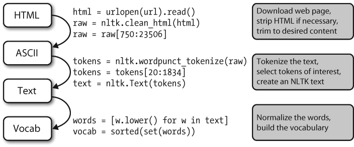

Figure 3-1. The processing pipeline: We open a URL and read its HTML content, remove the markup and select a slice of characters; this is then tokenized and optionally converted into an nltk.Text object; we can also lowercase all the words and extract the vocabulary.

## 使用正则表达式
“+”和“*”符号有时被称为Kleene closures，或者closures。

Table 3-3. Basic regular expression metacharacters, including wildcards, ranges, and closures

| Operator | Behavior |
| -------- | -------- |
| . | Wildcard, matches any character |
| ^abc | Matches some pattern abc at the start of a string |
| abc$ | Matches some pattern abc at the end of a string |
| [abc] | Matches one of a set of characters |
| [A-Z0-9] | Matches one of a range of characters |
| `ed\\|ing\\|s` | Matches one of the specified strings (disjunction) |
| * | Zero or more of previous item, e.g., a*, [a-z]* (also known as `Kleene Closure`) |
| + | One or more of previous item, e.g., a+, [a-z]+ |
| ? | Zero or one of the previous item (i.e., optional), e.g., a?, [a-z]? |
| {n} | Exactly n repeats where n is a non-negative integer |
| {n,} | At least n repeats |
| {,n} | No more than n repeats |
| {m,n} | At least m and no more than n repeats |
| `a(b\\|c)+` | Parentheses that indicate the scope of the operators |

### 提取字符块
通过re。findall()方法找出所有（无重叠的）匹配的指定正则表达式。找出一个词中的所有元音并计数。

```py
import re

word = 'supercalifragilisticexpialidocious'
re.findall(r'[aeiou]', word)
['u',
 'e',
 'a',
 'i',
 'a',
 'i',
 'i',
 'i',
 'e',
 'i',
 'a',
 'i',
 'o',
 'i',
 'o',
 'u']

len(re.findall(r'[aeiou]', word))
16
```

找出文本中两个或两个以上的元音序列，并确定它们的相对频率。

```py
wsj = sorted(set(nltk.corpus.treebank.words()))
fd = nltk.FreqDist(vs for word in wsj
                   for vs in re.findall(r'[aeiou]{2,}', word)
fd.items()
[(u'aa', 3),
 (u'eo', 39),
 (u'ei', 86),
 (u'ee', 217),
 (u'ea', 476),
 (u'oui', 6),
 (u'ao', 6),
 (u'eu', 18),
 (u'au', 106),
 (u'io', 549),
 (u'ia', 253),
 (u'ae', 11),
 (u'ie', 331),
 (u'iao', 1),
 (u'iai', 1),
 (u'uou', 5),
 (u'ieu', 3),
 (u'ai', 261),
 (u'aii', 1),
 (u'uee', 4),
 (u'aiia', 1),
 (u'eea', 1),
 (u'ueui', 1),
 (u'uie', 3),
 (u'iu', 14),
 (u'iou', 27),
 (u'ooi', 1),
 (u'eei', 2),
 (u'oei', 1),
 (u'eau', 10),
 (u'ioa', 1),
 (u'oo', 174),
 (u'oi', 65),
 (u'uu', 1),
 (u'aia', 1),
 (u'oe', 15),
 (u'oa', 59),
 (u'uo', 8),
 (u'ui', 95),
 (u'eou', 5),
 (u'ue', 105),
 (u'ou', 329),
 (u'ua', 109)]
```

匹配词首元音序列，词尾元音序列和所有的辅音；其他的被忽略。

```py
regexp = r'^[AEIOUaeiou]+|[AEIOUaeiou]+$|[^AEIOUaeiou]'
def compress(word):
    pieces = re.findall(regexp, word)
    return ''.join(pieces)

english_udhr = nltk.corpus.udhr.words('English-Latin1')
print nltk.tokenwrap(compress(w) for w in english_udhr[:75])
Unvrsl Dclrtn of Hmn Rghts Prmble Whrs rcgntn of the inhrnt dgnty and
of the eql and inlnble rghts of all mmbrs of the hmn fmly is the fndtn
of frdm , jstce and pce in the wrld , Whrs dsrgrd and cntmpt fr hmn
rghts hve rsltd in brbrs acts whch hve outrgd the cnscnce of mnknd ,
and the advnt of a wrld in whch hmn bngs shll enjy frdm of spch and
```

从罗托卡特语词汇中提取所有辅音-元音序列，如ka和si。因为每部分都是成对的，它可以用来初始化条件频率分布。

```py
rotokas_words = nltk.corpus.toolbox.words('rotokas.dic')
cvs = [cv for w in rotokas_words for cv in re.findall(r'[ptksvr][aeiou]', w)]
cfd = nltk.ConditionalFreqDist(cvs)
cfd.tabulate()
    a   e   i   o   u 
k 418 148  94 420 173 
p  83  31 105  34  51 
r 187  63  84  89  79 
s   0   0 100   2   1 
t  47   8   0 148  37 
v  93  27 105  48  49
```

考查s和t行，发现它们是部分“互补分布”的，这个证据表明它们不是这种语言中的不同因素。

找到包含给定辅音-元音对应的单词列表。例如：cv_index['su']的词汇。

```py
cv_word_pairs = [(cv, w) for w in rotokas_words
                 for cv in re.findall(r'[ptksvr][aeiou]', w)]
cv_index = nltk.Index(cv_word_pairs)
cv_index['su']
[u'kasuari']

cv_index['po']
[u'kaapo',
 u'kaapopato',
 u'kaipori',
 u'kaiporipie',
 u'kaiporivira',
 u'kapo',
 u'kapoa',
 u'kapokao',
 u'kapokapo',
 u'kapokapo',
 u'kapokapoa',
 u'kapokapoa',
 u'kapokapora',
 u'kapokapora',
 u'kapokaporo',
 u'kapokaporo',
 u'kapokari',
 u'kapokarito',
 u'kapokoa',
 u'kapoo',
 u'kapooto',
 u'kapoovira',
 u'kapopaa',
 u'kaporo',
 u'kaporo',
 u'kaporopa',
 u'kaporoto',
 u'kapoto',
 u'karokaropo',
 u'karopo',
 u'kepo',
 u'kepoi',
 u'keposi',
 u'kepoto']
```

### 查找词干
定义一个函数来获取词干(`stems`)。

```py
def stem(word):
    regexp = r'^(.*?)(ing|ly|ed|ious|ies|ive|es|s|ment)?$'
    stem, suffix = re.findall(regexp, word)[0]
    return stem

raw = """DENNIS: Listen, strange women lying in ponds distributing swords
... is no basis for a system of government.  Supreme executive power derives from
... a mandate from the masses, not from some farcical aquatic ceremony."""

tokens = nltk.word_tokenize(raw)
[stem(t) for t in tokens]
['DENNIS',
 ':',
 'Listen',
 ',',
 'strange',
 'women',
 'ly',
 'in',
 'pond',
 'distribut',
 'sword',
 '...',
 'i',
 'no',
 'basi',
 'for',
 'a',
 'system',
 'of',
 'govern',
 '.',
 'Supreme',
 'execut',
 'power',
 'deriv',
 'from',
 '...',
 'a',
 'mandate',
 'from',
 'the',
 'mass',
 ',',
 'not',
 'from',
 'some',
 'farcical',
 'aquatic',
 'ceremony',
 '.']
```

### 搜索已分词文本
可以使用一种特殊的正则表达式搜索一个文本中多个词（这里的文本是一个tokens列表）。例如：`“<a> <man>”`找出文本中所有“a man”的实例。尖括号用于标记tokens的边界，尖括号之间的空格可以忽略（这只对NLTK中的findall()方法处理文本有效）。

```py
from nltk.corpus import gutenberg, nps_chat

moby = nltk.Text(gutenberg.words('melville-moby_dick.txt'))
moby.findall(r"<a> (<.*>) <man>")
monied; nervous; dangerous; white; white; white; pious; queer; good;
mature; white; Cape; great; wise; wise; butterless; white; fiendish;
pale; furious; better; certain; complete; dismasted; younger; brave;
brave; brave; brave

chat = nltk.Text(nps_chat.words())
chat.findall(r"<.*> <.*> <bro>")
you rule bro; telling you bro; u twizted bro

chat.findall(r"<l.*>{3,}")
lol lol lol; lmao lol lol; lol lol lol; la la la la la; la la la; la
la la; lovely lol lol love; lol lol lol.; la la la; la la la
```

在大型文本语料库中搜索“x and other ys”形式的表达式时发现hypernyms：

```py
from nltk.corpus import brown
hobbies_learned = nltk.Text(brown.words(categories=['hobbies', 'learned']))
hobbies_learned.findall(r"<\w*> <and> <other> <\w*s>")
speed and other activities; water and other liquids; tomb and other
landmarks; Statues and other monuments; pearls and other jewels;
charts and other items; roads and other features; figures and other
objects; military and other areas; demands and other factors;
abstracts and other compilations; iron and other metals
```

## 规范化(Normalizing)文本
```py
raw = """DENNIS: Listen, strange women lying in ponds distributing swords
... is no basis for a system of government.  Supreme executive power derives from
... a mandate from the masses, not from some farcical aquatic ceremony."""
tokens = nltk.word_tokenize(raw)
tokens
['DENNIS',
 ':',
 'Listen',
 ',',
 'strange',
 'women',
 'lying',
 'in',
 'ponds',
 'distributing',
 'swords',
 'is',
 'no',
 'basis',
 'for',
 'a',
 'system',
 'of',
 'government',
 '.',
 'Supreme',
 'executive',
 'power',
 'derives',
 'from',
 'a',
 'mandate',
 'from',
 'the',
 'masses',
 ',',
 'not',
 'from',
 'some',
 'farcical',
 'aquatic',
 'ceremony',
 '.']
```

### 词干提取器(Stemmers)
下面的例子表明Porter词干提取器正确处理了词lying（将它映射为lie），但Lancaster提取器并没有处理好。

```py
porter = nltk.PorterStemmer()
lancaster = nltk.LancasterStemmer()
[porter.stem(t) for t in tokens]
[u'DENNI',
 u':',
 u'Listen',
 u',',
 u'strang',
 u'women',
 u'lie',
 u'in',
 u'pond',
 u'distribut',
 u'sword',
 u'is',
 u'no',
 u'basi',
 u'for',
 u'a',
 u'system',
 u'of',
 u'govern',
 u'.',
 u'Suprem',
 u'execut',
 u'power',
 u'deriv',
 u'from',
 u'a',
 u'mandat',
 u'from',
 u'the',
 u'mass',
 u',',
 u'not',
 u'from',
 u'some',
 u'farcic',
 u'aquat',
 u'ceremoni',
 u'.']

[lancaster.stem(t) for t in tokens]
['den',
 ':',
 'list',
 ',',
 'strange',
 'wom',
 'lying',
 'in',
 'pond',
 'distribut',
 'sword',
 'is',
 'no',
 'bas',
 'for',
 'a',
 'system',
 'of',
 'govern',
 '.',
 'suprem',
 'execut',
 'pow',
 'der',
 'from',
 'a',
 'mand',
 'from',
 'the',
 'mass',
 ',',
 'not',
 'from',
 'som',
 'farc',
 'aqu',
 'ceremony',
 '.']
```

使用词干提取器索引文本。

```py
class IndexedText(object):

    def __init__(self, stemmer, text):
        self._text = text
        self._stemmer = stemmer
        self._index = nltk.Index((self._stem(word), i)
                                 for (i, word) in enumerate(text))

    def concordance(self, word, width=40):
        key = self._stem(word)
        wc = width/4                # words of context
        for i in self._index[key]:
            lcontext = ' '.join(self._text[i-wc:i])
            rcontext = ' '.join(self._text[i:i+wc])
            ldisplay = '%*s'  % (width, lcontext[-width:])
            rdisplay = '%-*s' % (width, rcontext[:width])
            print ldisplay, rdisplay

    def _stem(self, word):
        return self._stemmer.stem(word).lower()

porter = nltk.PorterStemmer()
grail = nltk.corpus.webtext.words('grail.txt')
text = IndexedText(porter, grail)
text.concordance('lie')
r king ! DENNIS : Listen , strange women lying in ponds distributing swords is no
 beat a very brave retreat . ROBIN : All lies ! MINSTREL : [ singing ] Bravest of
       Nay . Nay . Come . Come . You may lie here . Oh , but you are wounded !   
doctors immediately ! No , no , please ! Lie down . [ clap clap ] PIGLET : Well  
ere is much danger , for beyond the cave lies the Gorge of Eternal Peril , which 
   you . Oh ... TIM : To the north there lies a cave -- the cave of Caerbannog --
h it and lived ! Bones of full fifty men lie strewn about its lair . So , brave k
not stop our fight ' til each one of you lies dead , and the Holy Grail returns t
```

### 词形归并(Lemmatization)
WordNet词形归并器删除词缀产生的词，都是它的字典中的词。

```py
wnl = nltk.WordNetLemmatizer()
[wnl.lemmatize(t) for t in tokens]
['DENNIS',
 ':',
 'Listen',
 ',',
 'strange',
 u'woman',
 'lying',
 'in',
 u'pond',
 'distributing',
 u'sword',
 'is',
 'no',
 'basis',
 'for',
 'a',
 'system',
 'of',
 'government',
 '.',
 'Supreme',
 'executive',
 'power',
 'derives',
 'from',
 'a',
 'mandate',
 'from',
 'the',
 u'mass',
 ',',
 'not',
 'from',
 'some',
 'farcical',
 'aquatic',
 'ceremony',
 '.']
```

### 分割(Segmentation)
`Tokenizatio`n is an instance of a more general problem of `segmentation`.

找到一种方法来分开文本内容与分词标志。可以给每个字符标注一个布尔值来指示这个字符后面是否有一个分词标志。

考虑下面例子，单词的边界已被去除。

```py
text = "doyouseethekittyseethedoggydoyoulikethekittylikethedoggy"
seg1 = "0000000000000001000000000010000000000000000100000000000"
seg2 = "0100100100100001001001000010100100010010000100010010000"
```

从分词表示字符串seg1和seg2中重建文本分词。seg1和seg2表示假设的一些儿童讲话的初始和最终分词。函数segment()可以使用它们重现分词的文本。

```py
def segment(text, segs):
    words = []
    last = 0
    for i in range(len(segs)):
        if segs[i] == '1':
            words.append(text[last:i+1])
            last = i+1
    words.append(text[last:])
    return words

segment(text, seg1)
['doyouseethekitty', 'seethedoggy', 'doyoulikethekitty', 'likethedoggy']

segment(text, seg2)
['do',
 'you',
 'see',
 'the',
 'kitty',
 'see',
 'the',
 'doggy',
 'do',
 'you',
 'like',
 'the',
 'kitty',
 'like',
 'the',
 'doggy']
```

现在分词的任务变成了一个搜索问题：找到将文本字符串正确分割成词汇的字位串。假定学习者接收词，并将它们存储在一个内部词典中。给定一个合适的词典是能够由词典中词的序列来重构源文本的。

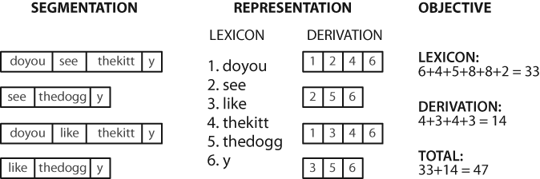

Figure 3-6. Calculation of objective function: Given a hypothetical segmentation of the source text (on the left), derive a lexicon and a derivation table that permit the source text to be reconstructed, then total up the number of characters used by each lexical item (including a boundary marker) and each derivation, to serve as a score of the quality of the segmentation; smaller values of the score indicate a better segmentation.

计算存储词典和重构源文本的成本

```py
def evaluate(text, segs):
    words = segment(text, segs)
    text_size = len(words)
    lexicon_size = len(' '.join(list(set(words))))
    return text_size + lexicon_size

text = "doyouseethekittyseethedoggydoyoulikethekittylikethedoggy"
seg1 = "0000000000000001000000000010000000000000000100000000000"
seg2 = "0100100100100001001001000010100100010010000100010010000"
seg3 = "0000100100000011001000000110000100010000001100010000001"
segment(text, seg3)
['doyou',
 'see',
 'thekitt',
 'y',
 'see',
 'thedogg',
 'y',
 'doyou',
 'like',
 'thekitt',
 'y',
 'like',
 'thedogg',
 'y']

evaluate(text, seg3)
46

evaluate(text, seg2)
47

evaluate(text, seg1)
63
```

使用模拟退火算法

```py
from random import randint

def flip(segs, pos):
    return segs[:pos] + str(1-int(segs[pos])) + segs[pos+1:]

def flip_n(segs, n):
    for i in range(n):
        segs = flip(segs, randint(0,len(segs)-1))
    return segs

def anneal(text, segs, iterations, cooling_rate):
    temperature = float(len(segs))
    while temperature > 0.5:
        best_segs, best = segs, evaluate(text, segs)
        for i in range(iterations):
            guess = flip_n(segs, int(round(temperature)))
            score = evaluate(text, guess)
            if score < best:
                best, best_segs = score, guess
        score, segs = best, best_segs
        temperature = temperature / cooling_rate
        print evaluate(text, segs), segment(text, segs)
    print
    return segs

text = "doyouseethekittyseethedoggydoyoulikethekittylikethedoggy"
seg1 = "0000000000000001000000000010000000000000000100000000000"
anneal(text, seg1, 5000, 1.2)
63 ['doyouseethekitty', 'seethedoggy', 'doyoulikethekitty', 'likethedoggy']
63 ['doyouseethekitty', 'seethedoggy', 'doyoulikethekitty', 'likethedoggy']
63 ['doyouseethekitty', 'seethedoggy', 'doyoulikethekitty', 'likethedoggy']
63 ['doyouseethekitty', 'seethedoggy', 'doyoulikethekitty', 'likethedoggy']
63 ['doyouseethekitty', 'seethedoggy', 'doyoulikethekitty', 'likethedoggy']
63 ['doyouseethekitty', 'seethedoggy', 'doyoulikethekitty', 'likethedoggy']
63 ['doyouseethekitty', 'seethedoggy', 'doyoulikethekitty', 'likethedoggy']
63 ['doyouseethekitty', 'seethedoggy', 'doyoulikethekitty', 'likethedoggy']
63 ['doyouseethekitty', 'seethedoggy', 'doyoulikethekitty', 'likethedoggy']
59 ['d', 'oyou', 'see', 'thekitty', 'see', 'thedoggy', 'do', 'y', 'o', 'ulike', 'thekitty', 'like', 'thedoggy']
57 ['doyou', 'see', 'thekitty', 'see', 'thedoggy', 'doyo', 'ul', 'i', 'ke', 'thekitty', 'like', 'thedoggy']
56 ['do', 'you', 'see', 'thekitty', 'see', 'thedoggy', 'do', 'youl', 'i', 'ke', 'thekitty', 'like', 'thedoggy']
55 ['do', 'you', 'see', 'thekitty', 'see', 'thedoggy', 'do', 'youl', 'i', 'ke', 'thekitty', 'l', 'i', 'ke', 'thedoggy']
54 ['do', 'you', 'see', 'thekitty', 'see', 'thedoggy', 'do', 'you', 'like', 'thekitty', 'l', 'i', 'ke', 'thedoggy']
52 ['do', 'yousee', 'thekitty', 'see', 'thedoggy', 'doyou', 'like', 'thekitty', 'like', 'thedoggy']
42 ['doyou', 'see', 'thekitty', 'see', 'thedoggy', 'doyou', 'like', 'thekitty', 'like', 'thedoggy']
42 ['doyou', 'see', 'thekitty', 'see', 'thedoggy', 'doyou', 'like', 'thekitty', 'like', 'thedoggy']
42 ['doyou', 'see', 'thekitty', 'see', 'thedoggy', 'doyou', 'like', 'thekitty', 'like', 'thedoggy']
42 ['doyou', 'see', 'thekitty', 'see', 'thedoggy', 'doyou', 'like', 'thekitty', 'like', 'thedoggy']
42 ['doyou', 'see', 'thekitty', 'see', 'thedoggy', 'doyou', 'like', 'thekitty', 'like', 'thedoggy']
42 ['doyou', 'see', 'thekitty', 'see', 'thedoggy', 'doyou', 'like', 'thekitty', 'like', 'thedoggy']
42 ['doyou', 'see', 'thekitty', 'see', 'thedoggy', 'doyou', 'like', 'thekitty', 'like', 'thedoggy']
42 ['doyou', 'see', 'thekitty', 'see', 'thedoggy', 'doyou', 'like', 'thekitty', 'like', 'thedoggy']
42 ['doyou', 'see', 'thekitty', 'see', 'thedoggy', 'doyou', 'like', 'thekitty', 'like', 'thedoggy']
42 ['doyou', 'see', 'thekitty', 'see', 'thedoggy', 'doyou', 'like', 'thekitty', 'like', 'thedoggy']
42 ['doyou', 'see', 'thekitty', 'see', 'thedoggy', 'doyou', 'like', 'thekitty', 'like', 'thedoggy']

'0000100100000001001000000010000100010000000100010000000'
```

# 分类和标注词汇
## 使用词性标注器
词性标注器(part-of-speech tagger 或 `POS` tagger)处理一个词序列，为每个词附加一个词性标记。

```py
import nltk

text = nltk.word_tokenize("And now for something completely different")
nltk.pos_tag(text)

[('And', 'CC'),
 ('now', 'RB'),
 ('for', 'IN'),
 ('something', 'NN'),
 ('completely', 'RB'),
 ('different', 'JJ')]
```

text.similar()方法为词w找出所有上下文$w_1ww_2$，然后找出所有出现在相同上下文中的词w'，即$w_1w'w_2$。

```py
text = nltk.Text(word.lower() for word in nltk.corpus.brown.words())
text.similar('woman')
man time day year car moment world family house country child boy
state job way war girl place word work

text.similar('bought')
made said put done seen had found left given heard brought got been
was set told took in felt that

text.similar('over')
in on to of and for with from at by that into as up out down through
is all about

text.similar('the')
a his this their its her an that our any all one these my in your no
some other and
```

## 标注语料库
按照NLTK的约定，已标注的标识符使用一个由标识符和标记组成的元组来表示。

```py
tagged_token = nltk.tag.str2tuple('fly/NN')
tagged_token
('fly', 'NN')

tagged_token[0]
'fly'

tagged_token[1]
'NN'
```

从一个字符串构造一个已标注的标识符的链表。

```py
sent = '''
... The/AT grand/JJ jury/NN commented/VBD on/IN a/AT number/NN of/IN
... other/AP topics/NNS ,/, AMONG/IN them/PPO the/AT Atlanta/NP and/CC
... Fulton/NP-tl County/NN-tl purchasing/VBG departments/NNS which/WDT it/PPS
... said/VBD ``/`` ARE/BER well/QL operated/VBN and/CC follow/VB generally/RB
... accepted/VBN practices/NNS which/WDT inure/VB to/IN the/AT best/JJT
... interest/NN of/IN both/ABX governments/NNS ''/'' ./.
... '''

[nltk.tag.str2tuple(t) for t in sent.split()]
[('The', 'AT'),
 ('grand', 'JJ'),
 ('jury', 'NN'),
 ('commented', 'VBD'),
 ('on', 'IN'),
 ('a', 'AT'),
 ('number', 'NN'),
 ('of', 'IN'),
 ('other', 'AP'),
 ('topics', 'NNS'),
 (',', ','),
 ('AMONG', 'IN'),
 ('them', 'PPO'),
 ('the', 'AT'),
 ('Atlanta', 'NP'),
 ('and', 'CC'),
 ('Fulton', 'NP-TL'),
 ('County', 'NN-TL'),
 ('purchasing', 'VBG'),
 ('departments', 'NNS'),
 ('which', 'WDT'),
 ('it', 'PPS'),
 ('said', 'VBD'),
 ('``', '``'),
 ('ARE', 'BER'),
 ('well', 'QL'),
 ('operated', 'VBN'),
 ('and', 'CC'),
 ('follow', 'VB'),
 ('generally', 'RB'),
 ('accepted', 'VBN'),
 ('practices', 'NNS'),
 ('which', 'WDT'),
 ('inure', 'VB'),
 ('to', 'IN'),
 ('the', 'AT'),
 ('best', 'JJT'),
 ('interest', 'NN'),
 ('of', 'IN'),
 ('both', 'ABX'),
 ('governments', 'NNS'),
 ("''", "''"),
 ('.', '.')]
```

### 读取已标注的语料库
只要语料库包含已标注的文本，NLTK的语料库接口都将有一个tagged_words()方法。

```py
nltk.corpus.nps_chat.tagged_words()
[(u'now', 'RB'), (u'im', 'PRP'), (u'left', 'VBD'), ...]

nltk.corpus.conll2000.tagged_words()
[(u'Confidence', u'NN'), (u'in', u'IN'), ...]

nltk.corpus.treebank.tagged_words()
[(u'Pierre', u'NNP'), (u'Vinken', u'NNP'), ...]
```

使用内置映射到简化的标记集。

```py
nltk.corpus.brown.tagged_words(tagset='universal')
[(u'The', u'DET'), (u'Fulton', u'NOUN'), ...]

nltk.corpus.treebank.tagged_words(tagset='universal')
[(u'Pierre', u'NOUN'), (u'Vinken', u'NOUN'), ...]
```

中文、印地语、葡萄牙语、西班牙语、荷兰语等这些通常含有非ASCII文本，当输出较大的结构如列表时，Python总是以十六进制显示。

```py
nltk.corpus.sinica_treebank.tagged_words()
[(u'\u4e00', u'Neu'), (u'\u53cb\u60c5', u'Nad'), ...]

nltk.corpus.indian.tagged_words()
[(u'\u09ae\u09b9\u09bf\u09b7\u09c7\u09b0', u'NN'), (u'\u09b8\u09a8\u09cd\u09a4\u09be\u09a8', u'NN'), ...]

nltk.corpus.mac_morpho.tagged_words()
[(u'Jersei', u'N'), (u'atinge', u'V'), ...]

nltk.corpus.conll2002.tagged_words()
[(u'Sao', u'NC'), (u'Paulo', u'VMI'), (u'(', u'Fpa'), ...]

nltk.corpus.cess_cat.tagged_words()
[(u'El', u'da0ms0'), (u'Tribunal_Suprem', u'np0000o'), ...]
```

### 简化的词性标记集
Table 5-1. Simplified part-of-speech tagset

| Tag | Meaning | Examples |
| --- | ------- | -------- |
| ADJ | adjective | new, good, high, special, big, local|
| ADP | adposition | on, of, at, with, by, into, under|
| ADV | adverb | really, already, still, early, now|
| CONJ | conjunction | and, or, but, if, while, although|
| DET | determiner, article | the, a, some, most, every, no, which|
| NOUN | noun | year, home, costs, time, Africa|
| NUM | numeral | twenty-four, fourth, 1991, 14:24|
| PRT | particle | at, on, out, over per, that, up, with|
| PRON | pronoun | he, their, her, its, my, I, us|
| VERB | verb | is, say, told, given, playing, would|
| . | punctuation | marks\t. , ; !|
| X | other | ersatz, esprit, dunno, gr8, univeristy|

### 名词
检查一些已标注的文本，看看哪些词类出现在名词前，频率最高的在最前面。

```py
from nltk.corpus import brown

brown_news_tagged = nltk.corpus.brown.tagged_words(categories='news', tagset='universal')

word_tag_pairs = nltk.bigrams(brown_news_tagged)
list(nltk.FreqDist(a[1] for (a, b) in word_tag_pairs if b[1] == 'NOUN'))
[u'ADV',
 u'NOUN',
 u'ADP',
 u'PRON',
 u'DET',
 u'.',
 u'PRT',
 u'VERB',
 u'X',
 u'NUM',
 u'CONJ',
 u'ADJ']
```

名词出现在限定词和形容词之后。

### 动词
新闻中最常见的动词是什么。

```py
wsj = nltk.corpus.treebank.tagged_words()
word_tag_fd = nltk.FreqDist(wsj)
[word + "/" + tag for (word, tag) in word_tag_fd if tag.startswith('V')][:30]
[u'attributes/VBZ',
 u'negotiated/VBN',
 u'failed/VBD',
 u'printed/VBN',
 u'sticking/VBG',
 u'close/VB',
 u'filed/VBN',
 u'teaches/VBZ',
 u'chooses/VBZ',
 u'suffer/VBP',
 u'agree/VBP',
 u'buy/VBP',
 u'called/VBN',
 u'underline/VB',
 u'controlling/VBG',
 u'exhausted/VBN',
 u'declaring/VBG',
 u'staid/VBN',
 u'stretching/VBG',
 u'packaging/VBG',
 u'study/VBP',
 u'mount/VB',
 u'sparing/VBG',
 u'guaranteed/VBN',
 u'confined/VBN',
 u'gives/VBZ',
 u'provoke/VB',
 u'frustrating/VBG',
 u'oversee/VB',
 u'suing/VBG']
```

由于词汇和标记是成对的，我们可以把词作为条件，标记作为事件，使用条件-事件对的链表初始化一个条件频率分布。这样我们可以看到一个给定词的标记的频率顺序表。

```py
cfd1 = nltk.ConditionalFreqDist(wsj)
cfd1['yield'].keys()
[u'VB', u'NN']

cfd1['cut'].keys()
[u'VB', u'VBN', u'NN', u'VBD']
```

颠倒配对顺序。

```py
cfd2 = nltk.ConditionalFreqDist((tag, word) for (word, tag) in wsj)
cfd2['VBN'].keys()[:30]
[u'limited',
 u'reorganized',
 u'managed',
 u'switched',
 u'caused',
 u'founded',
 u'assembled',
 u'concerned',
 u'contained',
 u'Rekindled',
 u'automated',
 u'bribed',
 u'voted',
 u'issued',
 u'cluttered',
 u'disapproved',
 u'sent',
 u'returned',
 u'synchronized',
 u'puzzled',
 u'desired',
 u'engineered',
 u'headlined',
 u'centralized',
 u'advised',
 u'stabbed',
 u'continued',
 u'perceived',
 u'presented',
 u'prolonged']
```

要弄清VBD(过去式)和VBN(过去分词)之间的区别，让我们找到可以同是VBD和VBN的词汇，看看它们周围的文字的情况。

```py
[w for w in cfd1.conditions() if 'VBD' in cfd1[w] and 'VBN' in cfd1[w]][:30]
[u'contributed',
 u'reported',
 u'brought',
 u'plunged',
 u'welcomed',
 u'assured',
 u'threatened',
 u'needed',
 u'nominated',
 u'rolled',
 u'asked',
 u'worked',
 u'climbed',
 u'damaged',
 u'had',
 u'imposed',
 u'raised',
 u'resulted',
 u'invested',
 u'bribed',
 u'solved',
 u'studied',
 u'opposed',
 u'believed',
 u'allowed',
 u'fueled',
 u'matched',
 u'surged',
 u'turned',
 u'printed']

idx1 = wsj.index(('kicked', 'VBD'))
wsj[idx1-4:idx1+1]
[(u'While', u'IN'),
 (u'program', u'NN'),
 (u'trades', u'NNS'),
 (u'swiftly', u'RB'),
 (u'kicked', u'VBD')]

idx2 = wsj.index(('kicked', 'VBN'))
wsj[idx2-4:idx2+1]
[(u'head', u'NN'),
 (u'of', u'IN'),
 (u'state', u'NN'),
 (u'has', u'VBZ'),
 (u'kicked', u'VBN')]
```

### 未简化的标记
找出最频繁的名词标记的程序

```py
def findtags(tag_prefix, tagged_text):
    cfd = nltk.ConditionalFreqDist((tag, word) for (word, tag) in tagged_text
                                  if tag.startswith(tag_prefix))
    return dict((tag, cfd[tag].keys()[:5]) for tag in cfd.conditions())

tagdict = findtags('NN', nltk.corpus.brown.tagged_words(categories='news'))

or tag in sorted(tagdict):
    print tag, tagdict[tag]
NN [u'inning', u'pardon', u'sunbonnet', u'temperament', u'hitch']
NN$ [u"junior's", u"player's", u"wife's", u"layman's", u"coach's"]
NN$-HL [u"Golf's", u"Navy's"]
NN$-TL [u"House's", u"Art's", u"University's", u"U.'s", u"Department's"]
NN-HL [u'son', u'help', u'show', u'lack', u'rest']
NN-NC [u'eva', u'ova', u'aya']
NN-TL [u'Communisn', u'Communism', u'Secretary-General', u'Monthly', u'Self']
NN-TL-HL [u'City', u'Commissioner', u'Grove', u'House', u'Oak']
NNS [u'wetlands', u'hats', u'facilities', u'woods', u'$12.50']
NNS$ [u"steelmakers'", u"taxpayers'", u"teammates'", u"bishops'", u"owners'"]
NNS$-HL [u"Dealers'", u"Idols'"]
NNS$-TL [u"Officers'", u"States'", u"Bombers'", u"Falcons'", u"Princes'"]
NNS-HL [u'years', u'idols', u'Creations', u'thanks', u'centers']
NNS-TL [u'Gables', u'Broncos', u'Hills', u'Workers', u'Ministers']
```

### 探索已标注的语料库
观察跟在often后面的词汇。

```py
brown_learned_text = brown.words(categories='learned')
sorted(set(b for (a, b) in nltk.bigrams(brown_learned_text) if a == 'often'))
[u',',
 u'.',
 u'accomplished',
 u'analytically',
 u'appear',
 u'apt',
 u'associated',
 u'assuming',
 u'became',
 u'become',
 u'been',
 u'began',
 u'call',
 u'called',
 u'carefully',
 u'chose',
 u'classified',
 u'colorful',
 u'composed',
 u'contain',
 u'differed',
 u'difficult',
 u'encountered',
 u'enough',
 u'equate',
 u'extremely',
 u'found',
 u'happens',
 u'have',
 u'ignored',
u'in',
 u'involved',
 u'more',
 u'needed',
 u'nightly',
 u'observed',
 u'of',
 u'on',
 u'out',
 u'quite',
 u'represent',
 u'responsible',
 u'revamped',
 u'seclude',
 u'set',
 u'shortened',
 u'sing',
 u'sounded',
 u'stated',
 u'still',
 u'sung',
 u'supported',
 u'than',
 u'to',
 u'when',
 u'work']
```

查看跟随词的词性标记。

```py
brown_lrnd_tagged = brown.tagged_words(categories='learned')
tags = [b[1] for (a, b) in nltk.bigrams(brown_lrnd_tagged) if a[0] == 'often']
fd = nltk.FreqDist(tags)
fd.tabulate()

VBN  VB VBD  JJ  IN  RB   ,  CS  QL WRB  TO VBG BEN  HV QLP  AP  RP   . VBZ 
 15  10   8   5   4   3   3   3   3   1   1   1   1   1   1   1   1   1   1 
```

often后面最高频率的词性是动词。名词从来没有在这个位置出现（在特定的语料中）。

使用POS标记寻找三词短语。

```py
from nltk.corpus import brown
def process(sentence):
    for (w1,t1), (w2,t2), (w3,t3) in nltk.trigrams(sentence):
        if (t1.startswith('V') and t2 == 'TO' and t3.startswith('V')):
            print w1, w2, w3

for tagged_sent in brown.tagged_sents()[:300]:
    process(tagged_sent)
combined to achieve
continue to place
serve to protect
wanted to wait
allowed to place
expected to become
expected to approve
expected to make
intends to make
seek to set
like to see
designed to provide
get to hear
expects to tell
expected to give
prefer to pay
required to obtain
permitted to teach
designed to reduce
Asked to elaborate
got to go
raised to pay
scheduled to go
cut to meet
needed to meet
```

各自的上下文可以帮助我们弄清楚标记之间的区别。

```py
brown_news_tagged = brown.tagged_words(categories='news')
data = nltk.ConditionalFreqDist((word.lower(), tag)
                                for (word, tag) in brown_news_tagged)
for word in data.conditions():
    if len(data[word]) > 3:
        tags = data[word].keys()
        print word, ' '.join(tags)
second OD-TL OD RB NN QL
place NP VB NN-TL NN
fair JJ-HL JJ-TL NN-TL NN JJ
best VB JJT NP-TL RBT JJT-HL
right RB JJ NN QL
for CS IN-TL IN-HL RB IN
ballet FW-NN NN-TL NN FW-NN-TL
red NP NN-TL JJ-TL JJ
open VB NN NN-TL RB JJ
act NN-HL VB NN-TL NN
as CS CS-HL QL IN
to TO-TL IN-TL TO IN-HL TO-HL IN NPS
past AP JJ NN IN
more AP RBR AP-HL QL
major NP NN-TL NN JJ
plan NN-HL VB NN-TL NN
gold NN-TL JJ-TL NN JJ
set VB VBN-HL VBN NN VBD
read NP VB VBN VBD
by IN-HL IN-TL RB IN
high JJ-HL RB JJ-TL NN JJ
lay NP VB JJ VBD
green NP JJ-TL NN JJ
post NP VB NN-TL NN
brown NP NN JJ NP-TL
cost NN-HL VB NN VBD
congolese NP JJ-TL NPS JJ
last AP VB AP-HL NN AP-TL
increase NN-HL VB VB-HL NN
that CS DT WPO QL WPS
only AP JJ RB QL
3 CD-HL CD OD OD-TL CD-TL
a FW-IN AT-HL AT NN AT-TL
help NN-HL VB VB-HL NN
held VBN-HL VBD-HL VBN VBD
issue NN-HL VB VB-HL NN
st. NP NP-HL NN-TL NP-TL
close VB RB JJ NN
grant NP VB VB-HL NN
march NP NP-HL NN-TL VB NN
police NNS-HL NNS NN NNS-TL
home NN NN-HL NN-TL NP NR NR-HL
force VB NN-TL NN FW-NN-TL
even VB JJ QL RB
met NP NP-HL VBN VBD
better JJR-TL VB QL RBR JJR
near RB-HL QL JJ RB IN
in IN-TL IN-HL RP IN
left NR VBN JJ VBD
down RP NP-TL RP-HL IN
round VB NN-TL JJ NN
french NP JJ-HL JJ-TL NPS JJ
first RB-HL OD-TL OD RB OD-HL
little NP AP JJ-TL QL JJ
reading NN-HL NP VBG NN
field NP VB NN-TL NN
good JJ-HL RB JJ-TL NN JJ
house VB NN NN-HL NN-TL NP-TL-HL NP NN-TL-HL
most AP RBT QL QL-TL
fine RB JJ-TL JJ NN
point NN-HL VB NN-TL NN
cut NN-HL VB VBN NN VBD
back RB-HL VB RB-TL NN RB
chief NN-TL JJS NN JJS-TL
beat VB NN-TL-HL NN VBD
swim NP VB NP-HL NN
general NN-TL JJ-TL NN JJ
like CS VB VB-HL JJ IN
works VBZ NNS-HL NNS NNS-TL
must MD MD-HL NN MD-TL
end NN-HL VB NN-TL NN
report NN-TL VB VB-HL NN
mother NN-HL VB NN-TL NN
no AT-HL AT RB AT-TL
cook NP VB NN NP-TL
white NP NN-TL JJ-TL NN JJ
case NP NN-HL NP-TL NN
on IN-TL RP IN-HL IN
hill NN-HL NP NN-TL NN
hit NN-HL VB VBN NN VBD
out PP$ RP RP-HL IN
present VB NN RB JJ
half NN RB ABN QL
```

## 自动标注
```py
from nltk.corpus import brown
brown_tagged_sents = brown.tagged_sents(categories='news')
brown_sents = brown.sents(categories='news')
```

### 默认标注器
用最有可能的标记标注每个词。

```py
tags = [tag for (word, tag) in brown.tagged_words(categories='news')]
nltk.FreqDist(tags).max()
u'NN'

raw = 'I do not like green eggs and ham, I do not like them Sam I am!'
tokens = nltk.word_tokenize(raw)
default_tagger = nltk.DefaultTagger('NN')
default_tagger.tag(tokens)
[('I', 'NN'),
 ('do', 'NN'),
 ('not', 'NN'),
 ('like', 'NN'),
 ('green', 'NN'),
 ('eggs', 'NN'),
 ('and', 'NN'),
 ('ham', 'NN'),
 (',', 'NN'),
 ('I', 'NN'),
 ('do', 'NN'),
 ('not', 'NN'),
 ('like', 'NN'),
 ('them', 'NN'),
 ('Sam', 'NN'),
 ('I', 'NN'),
 ('am', 'NN'),
 ('!', 'NN')]
```

正确率只有八分之一。

```py
default_tagger.evaluate(brown_tagged_sents)
0.13089484257215028
```

### 正则表达式标注器
```py
patterns = [
    (r'.*ing$', 'VBG'),               # gerunds
    (r'.*ed$', 'VBD'),                # simple past
    (r'.*es$', 'VBZ'),                # 3rd singular present
    (r'.*ould$', 'MD'),               # modals
    (r'.*\'s$', 'NN$'),               # possessive nouns
    (r'.*s$', 'NNS'),                 # plural nouns
    (r'^-?[0-9]+(.[0-9]+)?$', 'CD'),  # cardinal numbers
    (r'.*', 'NN')                     # nouns (default)
]
```

约五分之一的正确率。

```py
regexp_tagger = nltk.RegexpTagger(patterns)
regexp_tagger.tag(brown_sents[3])
[(u'``', 'NN'),
 (u'Only', 'NN'),
 (u'a', 'NN'),
 (u'relative', 'NN'),
 (u'handful', 'NN'),
 (u'of', 'NN'),
 (u'such', 'NN'),
 (u'reports', 'NNS'),
 (u'was', 'NNS'),
 (u'received', 'VBD'),
 (u"''", 'NN'),
 (u',', 'NN'),
 (u'the', 'NN'),
 (u'jury', 'NN'),
 (u'said', 'NN'),
 (u',', 'NN'),
 (u'``', 'NN'),
 (u'considering', 'VBG'),
 (u'the', 'NN'),
 (u'widespread', 'NN'),
 (u'interest', 'NN'),
 (u'in', 'NN'),
 (u'the', 'NN'),
 (u'election', 'NN'),
 (u',', 'NN'),
 (u'the', 'NN'),
 (u'number', 'NN'),
 (u'of', 'NN'),
 (u'voters', 'NNS'),
 (u'and', 'NN'),
 (u'the', 'NN'),
 (u'size', 'NN'),
 (u'of', 'NN'),
 (u'this', 'NNS'),
 (u'city', 'NN'),
 (u"''", 'NN'),
 (u'.', 'NN')]

regexp_tagger.evaluate(brown_tagged_sents)
0.20326391789486245
```

### 查询标注器
找出100个最频繁的词，存储它们最有可能的标记。然后使用这个信息作为“查找标注器”(NLTK UnigramTagger)的模型。

```py
fd = nltk.FreqDist(brown.words(categories='news'))
cfd = nltk.ConditionalFreqDist(brown.tagged_words(categories='news'))
most_freq_words = fd.keys()[:100]
likely_tags = dict((word, cfd[word].max()) for word in most_freq_words)
baseline_tagger = nltk.UnigramTagger(model=likely_tags)
baseline_tagger.evaluate(brown_tagged_sents)
0.005171350717027666
```

正确率近一半。看看它在一些未标注文本上如何运行。

```py
sent = brown.sents(categories='news')[3]
baseline_tagger.tag(sent)
[(u'``', None),
 (u'Only', None),
 (u'a', None),
 (u'relative', None),
 (u'handful', None),
 (u'of', None),
 (u'such', None),
 (u'reports', u'NNS'),
 (u'was', None),
 (u'received', None),
 (u"''", None),
 (u',', None),
 (u'the', None),
 (u'jury', None),
 (u'said', None),
 (u',', None),
 (u'``', None),
 (u'considering', None),
 (u'the', None),
 (u'widespread', None),
 (u'interest', None),
 (u'in', None),
 (u'the', None),
 (u'election', None),
 (u',', None),
 (u'the', None),
 (u'number', None),
 (u'of', None),
 (u'voters', None),
 (u'and', None),
 (u'the', None),
 (u'size', None),
 (u'of', None),
 (u'this', None),
 (u'city', None),
 (u"''", None),
 (u'.', None)]
```

许多词被分配了None标签，因为它们不在100个最频繁的词之中。在这些情况下分配默认标记NN。换句话说，我们要先使用查找表，如果不能指定标记就使用默认标注器，这个过程叫做`backoff`。

```py
baseline_tagger = nltk.UnigramTagger(model=likely_tags,
                                     backoff=nltk.DefaultTagger('NN'))
```

查找标注器的性能，使用不同大小的模型。

```py
def performance(cfd, wordlist):
    lt = dict((word, cfd[word].max()) for word in wordlist)
    baseline_tagger = nltk.UnigramTagger(model=lt, backoff=nltk.DefaultTagger('NN'))
    return baseline_tagger.evaluate(brown.tagged_sents(categories='news'))

def display():
    import pylab
    words_by_freq = list(nltk.FreqDist(brown.words(categories='news')))
    cfd = nltk.ConditionalFreqDist(brown.tagged_words(categories='news'))
    sizes = 2 ** pylab.arange(15)
    perfs = [performance(cfd, words_by_freq[:size]) for size in sizes]
    pylab.plot(sizes, perfs, '-bo')
    pylab.title('Lookup Tagger Performance with Varying Model Size')
    pylab.xlabel('Model Size')
    pylab.ylabel('Performance')
    pylab.show()

display()
```

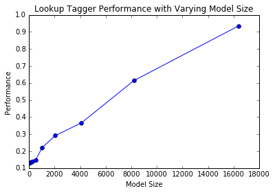

Figure 5-4. Lookup tagger

## N-gram标注
### 一元标注器(Unigram Tagging)
一元标注器利用一种简单的统计算法，对每个标识符分配最有可能的标记。建议一元标注器，称为训练(training)。下面例子中，“训练”一个一元标注器，用它来标注一个句子，然后进行评估。

```py
from nltk.corpus import brown
brown_tagged_sents = brown.tagged_sents(categories='news')
brown_sents = brown.sents(categories='news')
unigram_tagger = nltk.UnigramTagger(brown_tagged_sents)
unigram_tagger.tag(brown_sents[2007])
[(u'Various', u'JJ'),
 (u'of', u'IN'),
 (u'the', u'AT'),
 (u'apartments', u'NNS'),
 (u'are', u'BER'),
 (u'of', u'IN'),
 (u'the', u'AT'),
 (u'terrace', u'NN'),
 (u'type', u'NN'),
 (u',', u','),
 (u'being', u'BEG'),
 (u'on', u'IN'),
 (u'the', u'AT'),
 (u'ground', u'NN'),
 (u'floor', u'NN'),
 (u'so', u'QL'),
 (u'that', u'CS'),
 (u'entrance', u'NN'),
 (u'is', u'BEZ'),
 (u'direct', u'JJ'),
 (u'.', u'.')]

unigram_tagger.evaluate(brown_tagged_sents)
0.9349006503968017
```

### 分离训练和测试数据
```py
size = int(len(brown_tagged_sents) * 0.9)
size
4160

train_sents = brown_tagged_sents[:size]
test_sents = brown_tagged_sents[size:]
unigram_tagger = nltk.UnigramTagger(train_sents)
unigram_tagger.evaluate(test_sents)
0.8120203329014253
```

### 一般的N-gram的标注
A 1-gram tagger is another term for a unigram tagger: i.e., the context used to tag a token is just the text of the token itself. 2-gram taggers are also called bigram taggers, and 3-gram taggers are called trigram taggers.

bigram标注器，首先训练它，然后用它来标注未标注的句子。

```py
bigram_tagger = nltk.BigramTagger(train_sents)
bigram_tagger.tag(brown_sents[2007])
[(u'Various', u'JJ'),
 (u'of', u'IN'),
 (u'the', u'AT'),
 (u'apartments', u'NNS'),
 (u'are', u'BER'),
 (u'of', u'IN'),
 (u'the', u'AT'),
 (u'terrace', u'NN'),
 (u'type', u'NN'),
 (u',', u','),
 (u'being', u'BEG'),
 (u'on', u'IN'),
 (u'the', u'AT'),
 (u'ground', u'NN'),
 (u'floor', u'NN'),
 (u'so', u'CS'),
 (u'that', u'CS'),
 (u'entrance', u'NN'),
 (u'is', u'BEZ'),
 (u'direct', u'JJ'),
 (u'.', u'.')]

unseen_sent = brown_sents[4203]
bigram_tagger.tag(unseen_sent)
[(u'The', u'AT'),
 (u'population', u'NN'),
 (u'of', u'IN'),
 (u'the', u'AT'),
 (u'Congo', u'NP'),
 (u'is', u'BEZ'),
 (u'13.5', None),
 (u'million', None),
 (u',', None),
 (u'divided', None),
 (u'into', None),
 (u'at', None),
 (u'least', None),
 (u'seven', None),
 (u'major', None),
 (u'``', None),
 (u'culture', None),
 (u'clusters', None),
 (u"''", None),
 (u'and', None),
 (u'innumerable', None),
 (u'tribes', None),
 (u'speaking', None),
 (u'400', None),
 (u'separate', None),
 (u'dialects', None),
 (u'.', None)]

bigram_tagger.evaluate(test_sents)
0.10276088906608193
```

它的准确度非常低。

### 组合标注器

- 尝试使用bigram标注器标注标识符。
- 如果bigram标注器无法找到标记，尝试unigram标注器。
- 如果unigram标注器也无法找到标记，使用默认标注器。

```py
t0 = nltk.DefaultTagger('NN')
t1 = nltk.UnigramTagger(train_sents, backoff=t0)
t2 = nltk.BigramTagger(train_sents, backoff=t1)
t2.evaluate(test_sents)
0.844911791089405
```

### 标注生词
标注生词的方法是回退(backoff)到正则表达式标注器或默认标注器。

### 存储标注器
```py
from cPickle import dump
output = open('t2.pkl', 'wb')
dump(t2, output, -1)
output.close()

from cPickle import load
input = open('t2.pkl', 'rb')
tagger = load(input)
input.close()

text = """The board's action shows what free enterprise
 is up against in our complex maze of regulatory laws ."""
tokens = text.split()
tagger.tag(tokens)
[('The', 'AT'), ("board's", 'NN$'), ('action', 'NN'), ('shows', 'NNS'),
('what', 'WDT'), ('free', 'JJ'), ('enterprise', 'NN'), ('is', 'BEZ'),
('up', 'RP'), ('against', 'IN'), ('in', 'IN'), ('our', 'PP$'), ('complex', 'JJ'),
('maze', 'NN'), ('of', 'IN'), ('regulatory', 'NN'), ('laws', 'NNS'), ('.', '.')]
```

### 性能限制
参考trigram标注器。它遇到多少词性歧义的情况？

```py
from __future__ import division

cfd = nltk.ConditionalFreqDist(
    ((x[1], y[1], z[0]), z[1])
    for sent in brown_tagged_sents
    for x, y, z in nltk.trigrams(sent))
ambiguous_contexts = [c for c in cfd.conditions() if len(cfd[c]) > 1]
sum(cfd[c].N() for c in ambiguous_contexts) / cfd.N()
0.049297702068029296
```

1/20的trigrams是歧义的。给定当前单词及其前两个标记，根据训练数据，在5%的情况中，可能有一个以上的标记合理地分配给当前词。

一种便捷查看标注错误的方法是`混淆矩阵(confusion matrix)`，它利用图表表示期望的标记(黄金标准)与实际由标注器产生的标记。

```py
test_tags = [tag for sent in brown.sents(categories='editorial')
             for (word, tag) in t2.tag(sent)]
gold_tags = [tag for (word, tag) in brown.tagged_words(categories='editorial')]
# print nltk.ConfusionMatrix(gold_tags, test_tags)
```

### 跨句子边界标注
使用已标注句子的链表来训练、运行和评估标注器。

句子层面的N-gram标注。

```py
brown_tagged_sents = brown.tagged_sents(categories='news')
brown_sents = brown.sents(categories='news')

size = int(len(brown_tagged_sents) * 0.9)
train_sents = brown_tagged_sents[:size]
test_sents = brown_tagged_sents[size:]

t0 = nltk.DefaultTagger('NN')
t1 = nltk.UnigramTagger(train_sents, backoff=t0)
t2 = nltk.BigramTagger(train_sents, backoff=t1)
t2.evaluate(test_sents)
0.844911791089405
```

## 基于转换的标注(Transformation-Based Tagging)
Brill标注是一种基于转换的学习。一般的想法是：猜测每个词的标记，然后返回和修复错误的。在这种方式中，Brill标注器陆续将一个不良标注的文本转换成一个好的。与n-gram标注一样，需要监督整个过程。

Brill标注器的另一个特性：规则是语言学可解释的。

Brill标注器演示：标注器有一个“X->Y如果前面的词是Z”的形式的模板集合。这些模板中的变量是创建“规则”的特定词和标记的实例。得分规则是纠正错误例子的数目减去误报的数目。

```py
from nltk.tbl import demo as brill_tagger
brill_tagger.demo()
Loading tagged data from treebank... 
Read testing data (200 sents/5251 wds)
Read training data (800 sents/19933 wds)
Read baseline data (800 sents/19933 wds) [reused the training set]
Trained baseline tagger
    Accuracy on test set: 0.8345
Training tbl tagger...
TBL train (fast) (seqs: 800; tokens: 19933; tpls: 24; min score: 3; min acc: None)
Finding initial useful rules...
    Found 12960 useful rules.

           B      |
   S   F   r   O  |        Score = Fixed - Broken
   c   i   o   t  |  R     Fixed = num tags changed incorrect -> correct
   o   x   k   h  |  u     Broken = num tags changed correct -> incorrect
   r   e   e   e  |  l     Other = num tags changed incorrect -> incorrect
   e   d   n   r  |  e
------------------+-------------------------------------------------------
  23  23   0   0  | POS->VBZ if Pos:PRP@[-2,-1]
  16  17   1   0  | NN->VB if Pos:-NONE-@[-2] & Pos:TO@[-1]
  15  16   1   0  | VBN->VBD if Pos:PRP@[-1]
  12  12   0   0  | VBP->VB if Pos:MD@[-2,-1]
  10  10   0   0  | VB->VBP if Pos:PRP@[-1]
   9   9   0   1  | VB->NN if Pos:DT@[-1]
   9   9   0   0  | VBD->VBN if Pos:VBD@[-1]
   9  15   6   0  | IN->WDT if Pos:NNS@[-1] & Pos:-NONE-@[1]
   7   7   0   1  | VB->VBP if Pos:NNS@[-1]
   7   7   0   0  | VBP->VB if Pos:TO@[-1]
   7   8   1   0  | IN->RB if Word:as@[2]
   6   6   0   0  | NN->VB if Pos:MD@[-1]
   6   7   1   0  | VBD->VBN if Pos:VBZ@[-1]
   6   6   0   0  | WDT->IN if Pos:VBG@[2]
   6   6   0   0  | IN->WDT if Pos:-NONE-@[1] & Pos:VBZ@[2]
   5   5   0   0  | POS->VBZ if Pos:-NONE-@[-1]
   5   7   2   3  | RP->RB if Pos:CD@[1,2]
   5   5   0   1  | IN->WDT if Pos:-NONE-@[1] & Pos:VBD@[2]
   4   5   1   3  | VB->NN if Pos:NN@[-1]
   4   4   0   0  | POS->VBZ if Pos:``@[-2]
   4   4   0   0  | VBD->VBN if Pos:VBP@[-2,-1]
   4   4   0   0  | VBP->VB if Pos:VBD@[-2,-1]
   4   4   0   0  | NN->VBP if Pos:NNS@[-2] & Pos:RB@[-1]
   4   5   1   0  | VBN->VBD if Pos:NNP@[-2] & Pos:NNP@[-1]
   4   4   0   0  | IN->WDT if Pos:-NONE-@[1] & Pos:MD@[2]
   4   4   0   0  | JJS->RBS if Word:most@[0] & Word:the@[-1] & Pos:DT@[-1]
   3   3   0   1  | VB->NN if Pos:JJ@[-1]
   3   3   0   0  | VB->NN if Pos:POS@[-1]
   3   3   0   0  | VBD->VBN if Pos:VBN@[-1]
   3   4   1   0  | VBN->VB if Pos:TO@[-1]
   3   4   1   1  | IN->RB if Pos:.@[1]
   3   3   0   0  | PRP$->PRP if Pos:TO@[1]
   3   3   0   0  | RP->RB if Pos:DT@[-2,-1]
   3   3   0   1  | VBD->VBN if Pos:VB@[-2,-1]
   3   3   0   0  | NN->VBP if Pos:NNS@[-1] & Pos:DT@[1]
   3   3   0   0  | RB->JJ if Pos:DT@[-1] & Pos:NN@[1]
   3   3   0   0  | VBP->VB if Word:n't@[-2,-1]
Trained tbl tagger in 7.09 seconds
    Accuracy on test set: 0.8551
Tagging the test data
```

## 如何确定一个词的分类
### 形态学(Morphological)线索
一个词的内部结构有助于为这个词分类。举例来说：-ness是一个后缀，与形容词结合产生名词，如happy->happiness,ill->illness。所以，如果遇到一个以-ness结尾的词，很可能是一个名词。同样的，-ment是与一些动词结合产生名词的后缀，如govern->government和establish->establishment。

英语动词也可以是形态复杂的。例如：一个动词的现在分词以-ing结尾，表示正在进行的还没有结束的行动（如：falling、eating）。-ing后缀也出现在从动词派生的名词中，如：the falling of the leaves（这被称为动名词）。

### 句法(Syntactic)线索
另一个线索是一个词可能出现的典型的上下文语境。例如：假设已经确定了名词类，那么，英语形容词的句法标准是它可以出现在一个名词前，或紧跟在词be或very后。

### 语义(Semantic)线索
最后一个线索是词的意思。例如：名词众所周知的一个定义是根据语义的：“一个人、地方或事物的名称。”

### 新词
名词被称为开放类(open class)。介词被认为是封闭类(closed class)。

### 词性标注集中的形态学(Morphology in Part-of-Speech Tagsets)
普通标记集经常会“捕捉”一些构词(morphosyntactic)信息，即一种词借助句法角色获得的形态标记信息。

# 分类文本性别鉴定
使用naive Bayes classifier：

```py
def gender_features(word):
    return {'last_letter': word[-1]}

gender_features('Shrek')
{'last_letter': 'k'}

import nltk
from nltk.corpus import names
import random
names = ([(name, 'male') for name in names.words('male.txt')] +
         [(name, 'female') for name in names.words('female.txt')])
random.shuffle(names)
featuresets = [(gender_features(n), g) for (n,g) in names]
len(featuresets)
7944

featuresets[0]
({'last_letter': u'e'}, 'female')

train_set, test_set = featuresets[500:], featuresets[:500]
classifier = nltk.NaiveBayesClassifier.train(train_set)
classifier.classify(gender_features('Neo'))
'male'

classifier.classify(gender_features('Trinity'))
'female'

nltk.classify.accuracy(classifier, test_set)
0.784

classifier.show_most_informative_features(5)
Most Informative Features
             last_letter = u'a'           female : male   =     35.8 : 1.0
             last_letter = u'k'             male : female =     31.2 : 1.0
             last_letter = u'f'             male : female =     14.6 : 1.0
             last_letter = u'v'             male : female =     11.2 : 1.0
             last_letter = u'p'             male : female =     11.2 : 1.0
```

此列表显示训练集以a结尾的名字中女性是男性的38倍，而以k结尾的名字中男性是女性的31倍。这些比率是`似然比(likelihood ratios)`。

在处理大型语料库时，构建包含所有实例特征的单独链表会占用大量的内存。在这种情况下，使用函数nltk.classify.apply_features，返回一个像链表但不会在内存存储所有特征集的对象。

```py
from nltk.classify import apply_features
train_set = apply_features(gender_features, names[500:])
test_set = apply_features(gender_features, names[:500])
```

特征提取器过拟合性别特征。这个特征提取器返回的特征集中包括大量的指定特征，从而导致相对较小的名字语料库产生了过拟合。

```py
def gender_features2(name):
    features = {}
    features["firstletter"] = name[0].lower()
    features["lastletter"] = name[-1].lower()
    for letter in 'abcdefghijklmnopqrstuvwxyz':
        features["count(%s)" % letter] = name.lower().count(letter)
        features["has(%s)" % letter] = (letter in name.lower())
    return features

gender_features2('John')
{'count(a)': 0,
 'count(b)': 0,
 'count(c)': 0,
 'count(d)': 0,
 'count(e)': 0,
 'count(f)': 0,
 'count(g)': 0,
 'count(h)': 1,
 'count(i)': 0,
 'count(j)': 1,
 'count(k)': 0,
 'count(l)': 0,
 'count(m)': 0,
 'count(n)': 1,
 'count(o)': 1,
 'count(p)': 0,
 'count(q)': 0,
 'count(r)': 0,
 'count(s)': 0,
 'count(t)': 0,
 'count(u)': 0,
 'count(v)': 0,
 'count(w)': 0,
 'count(x)': 0,
 'count(y)': 0,
 'count(z)': 0,
 'firstletter': 'j',
 'has(a)': False,
 'has(b)': False,
 'has(c)': False,
 'has(d)': False,
 'has(e)': False,
 'has(f)': False,
 'has(g)': False,
 'has(h)': True,
 'has(i)': False,
 'has(j)': True,
 'has(k)': False,
 'has(l)': False,
 'has(m)': False,
 'has(n)': True,
 'has(o)': True,
 'has(p)': False,
 'has(q)': False,
 'has(r)': False,
 'has(s)': False,
 'has(t)': False,
 'has(u)': False,
 'has(v)': False,
 'has(w)': False,
 'has(x)': False,
 'has(y)': False,
 'has(z)': False,
 'lastletter': 'n'}

featuresets = [(gender_features2(n), g) for (n,g) in names]
train_set, test_set = featuresets[500:], featuresets[:500]
classifier = nltk.NaiveBayesClassifier.train(train_set)
nltk.classify.accuracy(classifier, test_set)
0.792
```

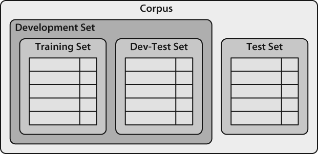

```py
train_names = names[1500:]
devtest_names = names[500:1500]
test_names = names[:500]

train_set = [(gender_features(n), g) for (n,g) in train_names]
devtest_set = [(gender_features(n), g) for (n,g) in devtest_names]
test_set = [(gender_features(n), g) for (n,g) in test_names]
classifier = nltk.NaiveBayesClassifier.train(train_set)
nltk.classify.accuracy(classifier, devtest_set)
0.774

errors = []
for (name, tag) in devtest_names:
    guess = classifier.classify(gender_features(name))
    if guess != tag:
        errors.append((tag, guess, name))
len(errors)
226
```

下例中已建立的名字分类器在开发测试语料上产生约100个错误。

```py
for (tag, guess, name) in sorted(errors[:100]): # doctest: +ELLIPSIS +NORMALIZE_WHITESPACE
    print 'correct=%-8s guess=%-8s name=%-30s' % (tag, guess, name)
correct=female   guess=male     name=Ailyn                         
correct=female   guess=male     name=Beatriz                       
correct=female   guess=male     name=Bess                          
correct=female   guess=male     name=Blair                         
correct=female   guess=male     name=Brynn                         
correct=female   guess=male     name=Cat                           
correct=female   guess=male     name=Chad                          
correct=female   guess=male     name=Charmain                      
correct=female   guess=male     name=Christen                      
correct=female   guess=male     name=Darb                          
correct=female   guess=male     name=Diahann                       
correct=female   guess=male     name=Dorian                        
correct=female   guess=male     name=Dorit                         
correct=female   guess=male     name=Elyn                          
correct=female   guess=male     name=Emlyn                         
correct=female   guess=male     name=Eran                          
correct=female   guess=male     name=Ethelind                      
correct=female   guess=male     name=Farrand                       
correct=female   guess=male     name=Fleur                         
correct=female   guess=male     name=Flo                           
correct=female   guess=male     name=Flor                          
correct=female   guess=male     name=Fred                          
correct=female   guess=male     name=Gwendolyn                     
correct=female   guess=male     name=Hannis                        
correct=female   guess=male     name=Imojean                       
correct=female   guess=male     name=Janeen                        
correct=female   guess=male     name=Joellyn                       
correct=female   guess=male     name=Jourdan                       
correct=female   guess=male     name=Kerstin                       
correct=female   guess=male     name=Kipp                          
correct=female   guess=male     name=Kirstin  
correct=female   guess=male     name=Lilian                        
correct=female   guess=male     name=Linet                         
correct=female   guess=male     name=Lois                          
correct=female   guess=male     name=Madlin                        
correct=female   guess=male     name=Rosario                       
correct=female   guess=male     name=Roslyn                        
correct=female   guess=male     name=Roz                           
correct=female   guess=male     name=Sheilakathryn                 
correct=female   guess=male     name=Stoddard                      
correct=female   guess=male     name=Tiff                          
correct=female   guess=male     name=Winifred                      
correct=female   guess=male     name=Yehudit                       
correct=male     guess=female   name=Ajai                          
correct=male     guess=female   name=Al                            
correct=male     guess=female   name=Alaa                          
correct=male     guess=female   name=Ansell                        
correct=male     guess=female   name=Antone                        
correct=male     guess=female   name=Archy                         
correct=male     guess=female   name=Bjorne                        
correct=male     guess=female   name=Brinkley                      
correct=male     guess=female   name=Butch                         
correct=male     guess=female   name=Carleigh                      
correct=male     guess=female   name=Chrissy                       
correct=male     guess=female   name=Claude                        
correct=male     guess=female   name=Dana                          
correct=male     guess=female   name=Danny                         
correct=male     guess=female   name=Darrell                       
correct=male     guess=female   name=Ely                           
correct=male     guess=female   name=Emile                         
correct=male     guess=female   name=Felipe                        
correct=male     guess=female   name=Gerome                        
correct=male     guess=female   name=Gregory   
correct=male     guess=female   name=Hartley                       
correct=male     guess=female   name=Jean-Pierre                   
correct=male     guess=female   name=Jeramie                       
correct=male     guess=female   name=Jerrome                       
correct=male     guess=female   name=Karel                         
correct=male     guess=female   name=Kendal                        
correct=male     guess=female   name=Kirby                         
correct=male     guess=female   name=Lawerence                     
correct=male     guess=female   name=Lee                           
correct=male     guess=female   name=Louie                         
correct=male     guess=female   name=Micky                         
correct=male     guess=female   name=Moishe                        
correct=male     guess=female   name=Moshe                         
correct=male     guess=female   name=Murdoch                       
correct=male     guess=female   name=Nate                          
correct=male     guess=female   name=Nikki                         
correct=male     guess=female   name=Pascal                        
correct=male     guess=female   name=Quill                         
correct=male     guess=female   name=Rodolph                       
correct=male     guess=female   name=Royal                         
correct=male     guess=female   name=Shelby                        
correct=male     guess=female   name=Simone                        
correct=male     guess=female   name=Skippie                       
correct=male     guess=female   name=Terrel                        
correct=male     guess=female   name=Thorny                        
correct=male     guess=female   name=Timmie                        
correct=male     guess=female   name=Timothee                      
correct=male     guess=female   name=Tony                          
correct=male     guess=female   name=Torry                         
correct=male     guess=female   name=Troy    
correct=male     guess=female   name=Tull                          
correct=male     guess=female   name=Uriah                         
correct=male     guess=female   name=Valentine                     
correct=male     guess=female   name=Vinnie                        
correct=male     guess=female   name=Walsh                         
correct=male     guess=female   name=Yancy                         
correct=male     guess=female   name=Yardley 
```

浏览这个错误列表，它明确指出某些多字母后缀也可以指示名字性别。例如：以yn结尾的名字大多以女性为主，尽管事实上，以n结尾的名字往往是男性；以ch结尾的名字通常是男性，尽管以h结尾的名字倾向于是女性。因此，调整特征提取器使其包含两个字母后缀的特征。

```py
def gender_features(word):
    return {'suffix1': word[-1:], 'suffix2': word[-2:]}
```

使用新的特征提取器重建分类器，看到测试集上的性能提高3个百分点。

```py
train_set = [(gender_features(n), g) for (n,g) in train_names]
devtest_set = [(gender_features(n), g) for (n,g) in devtest_names]
classifier = nltk.NaiveBayesClassifier.train(train_set)
nltk.classify.accuracy(classifier, devtest_set)
0.798
```

# 分类文本电影评论正负面评价
下面的例子，选择电影评论语料库，将每个评论归类为正面或负面。

```py
from nltk.corpus import movie_reviews
import random

documents = [(list(movie_reviews.words(fileid)), category)
             for category in movie_reviews.categories()
             for fileid in movie_reviews.fileids(category)]
random.shuffle(documents)
```

构建整个语料库中前2000个最频繁词的链表。然后，定义一个特征提取器，检查这些词是否在一个给定的文档中。

```py
import nltk

all_words = nltk.FreqDist(w.lower() for w in movie_reviews.words())
word_features = all_words.keys()[:2000]

def document_features(document):
    document_words = set(document)
    features = {}
    for word in word_features:
        features['contains(%s)' % word] = (word in document_words)
    return features

document_features(movie_reviews.words('pos/cv957_8737.txt'))
{'contains(waste)': False, 'contains(lot)': False, ...}
```

训练和测试分类器以进行文档分类。同时，可以使用show_most_informative_features()来找出哪些特征是分类器发现的并且是最有信息量的。

```py
featuresets = [(document_features(d), c) for (d,c) in documents]
len(featuresets)
2000

featuresets[0][1]
u'pos'

featuresets[0][0].keys()[:30]  # Value is True or False
[u'contains(corporate)',
 u'contains(barred)',
 u'contains(batmans)',
 u'contains(menacing)',
 u'contains(rags)',
 u'contains(inquires)',
 u'contains(nosebleeding)',
 u'contains(playhouse)',
 u'contains(peculiarities)',
 u'contains(kilgore)',
 u'contains(tarnish)',
 u'contains(sand)',
 u'contains(busting)',
 u'contains(wedge)',
 u'contains(smelling)',
 u'contains(tulip)',
 u'contains(singled)',
 u'contains(wahlberg)',
 u'contains(needed)',
 u'contains(lydia)',
 u'contains(rick)',
 u'contains(cambodia)',
 u'contains(outfielders)',
 u'contains(jovivich)',
 u'contains(pinon)',
 u'contains(fix)',
 u'contains(marla)',
 u'contains(resources)',
 u'contains(nomi)',
 u'contains(irs)']

featuresets[1][1]
u'neg'

train_set, test_set = featuresets[100:], featuresets[:100]
classifier = nltk.NaiveBayesClassifier.train(train_set)
nltk.classify.accuracy(classifier, test_set)
0.65

classifier.show_most_informative_features(5)
Most Informative Features
           contains(ugh) = True              neg : pos    =      9.7 : 1.0
    contains(mediocrity) = True              neg : pos    =      7.7 : 1.0
          contains(sans) = True              neg : pos    =      7.7 : 1.0
     contains(dismissed) = True              pos : neg    =      7.0 : 1.0
         contains(wires) = True              neg : pos    =      6.4 : 1.0
```

提到ugh的评论中负面大约是正面的9倍，提到wires的评论中正面是负面6倍。

# 分类文本词性标
词性标注(Part-of-Speech Tagging):训练一个分类器来算出哪个后缀最有信息量。首先，让我们找出最常见的后缀。

```py
import nltk
from nltk.corpus import brown

suffix_fdist = nltk.FreqDist()
for word in brown.words():
    word = word.lower()
    suffix_fdist[word[-1:]] += 1
    suffix_fdist[word[-2:]] += 1
    suffix_fdist[word[-3:]] += 1

common_suffixes = suffix_fdist.keys()[:100]
common_suffixes
[u'vre',
 u'g/l',
 u'mny',
 u'.32',
 u"k's",
 u'cwt',
 u'cth',
 u'*yt',
 u'ajk',
 u'pce',
 u"y'n",
 u'sch',
 u'.e.',
 u'cm.',
 u'xts',
 u'aud',
 u'rek',
 u'aui',
 u'/3%',
 u'oeb',
 u'pth',
 u'aum',
 u'aul',
 u'xty',
 u'aun',
 u'sce',
 u'aus',
 u'aur',
 u'aut',
 u'343',
 u'-ho',
 u'aux',
 u'$40',
 u'348',
 u'yms',
 u'$45',
 u'xth',
 u'mns',
 u'sca',
 u'hce',
 u'.k.',
 u'*yr',
 u'606',
 u'fur',
 u'nw.',
 u'ala',
 u'lbs',
 u'aix',
 u'upi',
 u'29%',
 u'fha',
 u'upa',
 u'nmr',
 u'298',
 u'upy',
 u'297',
 u'upt',
 u'ups',
 u'290',
 u'bl',
 u'27%',
 u'*yp',
 u'ab/',
 u'270',
 u'271',
 u'ucy',
 u'273',
 u'274',
 u'275',
 u'276',
 u'3a',
 u'7th',
 u'air',
 u'ptu',
 u'nen',
 u'ghn',
 u'nel',
 u'zur',
 u'nek',
 u'oze',
 u'nei',
 u'ned',
 u'nee',
 u'kus',
 u'nec',
 u'kup',
 u'jac',
 u'ain',
 u'nez',
 u'ak.',
 u'nex',
 u'ney',
 u'new',
 u'net',
 u'neu',
 u'ner',
 u'nes',
 u'mee',
 u'med',
 u'meg']
```

定义一个特征提取函数，检查给定单词的后缀。

```py
def pos_features(word):
    features = {}
    for suffix in common_suffixes:
        features['endswith(%s)' % suffix] = word.lower().endswith(suffix)
    return features
```

定义特征提取器，用它来训练新的“[决策树](https://www.safaribooksonline.com/library/view/natural-language-processing/9780596803346/ch06s04.html)”的分类器。

```py
tagged_words = brown.tagged_words(categories='news')
featuresets = [(pos_features(n), g) for (n,g) in tagged_words]
size = int(len(featuresets) * 0.1)
train_set, test_set = featuresets[size:], featuresets[:size]
classifier = nltk.DecisionTreeClassifier.train(train_set)
nltk.classify.accuracy(classifier, test_set)
0.14639482844356042

classifier.classify(pos_features('cats'))
u'NN'
```

决策树模型的优点是容易解释。可以指示NLTK将它们以伪代码形式输出。

```py
print classifier.pseudocode(depth=4)
if endswith(,) == True: return ','
if endswith(,) == False:
  if endswith(the) == True: return 'AT'
  if endswith(the) == False:
    if endswith(s) == True:
      if endswith(is) == True: return 'BEZ'
      if endswith(is) == False: return 'VBZ'
    if endswith(s) == False:
      if endswith(.) == True: return '.'
      if endswith(.) == False: return 'NN'
```

## 探索上下文语境
语境特征往往提供关于正确标记的强大线索——例如：标注词fly时，如果知道它前面的词是“a”，能够确定它是名词，而不是动词。

```py
def pos_features(sentence, i):
    features = {"suffix(1)": sentence[i][-1:],
                "suffix(2)": sentence[i][-2:],
                "suffix(3)": sentence[i][-3:]}
    if i == 0:
        features["prev-word"] = "<START>"
    else:
        features["prev-word"] = sentence[i-1]
    return features

pos_features(brown.sents()[0], 8)
{'prev-word': u'an',
 'suffix(1)': u'n',
 'suffix(2)': u'on',
 'suffix(3)': u'ion'}

tagged_sents = brown.tagged_sents(categories='news')
featuresets = []
for tagged_sent in tagged_sents:
    untagged_sent = nltk.tag.untag(tagged_sent)
    for i, (word, tag) in enumerate(tagged_sent):
        featuresets.append((pos_features(untagged_sent, i), tag))

size = int(len(featuresets) * 0.1)
train_set, test_set = featuresets[size:], featuresets[:size]
classifier = nltk.NaiveBayesClassifier.train(train_set)
nltk.classify.accuracy(classifier, test_set)
0.7891596220785678
```

## 序列分类
为了获取相关分类任务之间的依赖关系，我们可以使用joint classifier模型，为一些相关的输入选择适当的标签。在词性标注的例子中，可以使用各种不同的sequence classifier模型为给定的句子中的所有词选择词性标签。

一种称为consecutive classification或greedy sequence classification的序列分类器策略，为第一个输入找到最有可能的类标签，然后在此基础上找到下一个输入的最佳的标签。这个过程可以不断重复直到所有的输入都被贴上标签。

使用连续分类器进行词性标注。

```py
def pos_features(sentence, i, history):
    features = {"suffix(1)": sentence[i][-1:],
                "suffix(2)": sentence[i][-2:],
                "suffix(3)": sentence[i][-3:]}
    if i == 0:
        features["prev-word"] = "<START>"
        features["prev-tag"] = "<START>"
    else:
        features["prev-word"] = sentence[i-1]
        features["prev-tag"] = history[i-1]
    return features

class ConsecutivePosTagger(nltk.TaggerI):
    def __init__(self, train_sents):
        train_set = []
        for tagged_sent in train_sents:
            untagged_sent = nltk.tag.untag(tagged_sent)
            history = []
            for i, (word, tag) in enumerate(tagged_sent):
                featureset = pos_features(untagged_sent, i, history)
                train_set.append( (featureset, tag) )
                history.append(tag)
        self.classifier = nltk.NaiveBayesClassifier.train(train_set)
    def tag(self, sentence):
        history = []
        for i, word in enumerate(sentence):
            featureset = pos_features(sentence, i, history)
            tag = self.classifier.classify(featureset)
            history.append(tag)
        return zip(sentence, history)

tagged_sents = brown.tagged_sents(categories='news')
size = int(len(tagged_sents) * 0.1)
train_sents, test_sents = tagged_sents[size:], tagged_sents[:size]
tagger = ConsecutivePosTagger(train_sents)
tagger.evaluate(test_sents)
0.7980528511821975
```

## 其他序列分类方法
这种方法的缺点是一旦做出决定便无法更改。例如：如果决定将一个词标注为名词，但后来发现应该是动词，那也没有办法修复我们的错误了。解决这个问题的方法是采取转型策略(transformational strategy)。转型联合分类(Transformational joint classifiers)的工作原理是为输入的标签创建一个初始值，然后反复提炼该值，尝试修复相关输入之间的不一致。Brill标注器，是使用这种策略的。

另一种方案是为词性标记所有可能的序列打分，选择总得得分最高的序列。隐马尔可夫模型(Hidden Markov Models)采取了这种方法。隐马尔可夫模型类似于连续分类器，不光考虑输入也考虑已预测标记的历史。然而，不是简单地找出一个给定词的单个最好标签，而是为标记产生一个概率分布。然后将这些概率结合起来计算标记序列的概率得分，最后选择最高概率的标记序列。不过，可能的标签序列数量相当大。给定拥有30个标签的标记集，大约有600万亿(30^10)种方式来标记一个10个词的句子。为了避免单独考虑所有这些可能的序列，隐马尔可夫模型要求特征提取器只考虑最近的标记来有效地找出最有可能的标记序列。特别是，对每个连续的词索引i，当前的及以前的每个可能的标记都将计算得分。这种基础的方法被两个更先进的模型所采用，它们被称为最大熵隐马尔可夫模型(Maximum Entropy Markov Models)和线性链条件随机场模型(Linear-Chain Conditional Random Field Models)。

# 分类文本句子分割
获得一些已被分割成句子的数据，将它转换成一种适合提取特征的形式。

```py
import nltk

sents = nltk.corpus.treebank_raw.sents()
tokens = []
boundaries = set()
offset = 0
for sent in nltk.corpus.treebank_raw.sents():
    tokens.extend(sent)
    offset += len(sent)
    boundaries.add(offset-1)
```

tokens是单独句子标识符的合并链表，boundaries是一个包含所有句子-边界标识符索引的集合。下一步，需要指定用于决定标点是否表示句子边界的数据特征。

```py
def punct_features(tokens, i):
    return {'next-word-capitalized': tokens[i+1][0].isupper(),
            'prevword': tokens[i-1].lower(),
            'punct': tokens[i],
            'prev-word-is-one-char': len(tokens[i-1]) == 1}
```

基于这个特征提取器，可以通过选择所有的标点符号创建一个加标签的特征集链表，然后标注它们是否是边界标识符。

```py
featuresets = [(punct_features(tokens, i), (i in boundaries))
               for i in range(1, len(tokens)-1)
               if tokens[i] in '.?!']

len(featuresets)
5948

featuresets[:10]
[({'next-word-capitalized': False,
   'prev-word-is-one-char': False,
   'prevword': u'nov',
   'punct': u'.'},
  False),
 ({'next-word-capitalized': True,
   'prev-word-is-one-char': False,
   'prevword': u'29',
   'punct': u'.'},
  True),
 ({'next-word-capitalized': True,
   'prev-word-is-one-char': False,
   'prevword': u'mr',
   'punct': u'.'},
  False),
 ({'next-word-capitalized': True,
   'prev-word-is-one-char': True,
   'prevword': u'n',
   'punct': u'.'},
  False),
 ({'next-word-capitalized': False,
   'prev-word-is-one-char': False,
   'prevword': u'group',
   'punct': u'.'},
  True),
 ({'next-word-capitalized': True,
   'prev-word-is-one-char': True,
   'prevword': u'.',
   'punct': u'.'},
  False),
 ({'next-word-capitalized': False,
   'prev-word-is-one-char': False,
   'prevword': u'conglomerate',
   'punct': u'.'},
  True),
({'next-word-capitalized': True,
   'prev-word-is-one-char': True,
   'prevword': u'.',
   'punct': u'.'},
  False),
 ({'next-word-capitalized': True,
   'prev-word-is-one-char': False,
   'prevword': u'reported',
   'punct': u'.'},
  True),
 ({'next-word-capitalized': True,
   'prev-word-is-one-char': False,
   'prevword': u'said',
   'punct': u'.'},
  True)]
```

训练和评估一个标点符号分类器。

```py
size = int(len(featuresets) * 0.1)
train_set, test_set = featuresets[size:], featuresets[:size]
classifier = nltk.NaiveBayesClassifier.train(train_set)
nltk.classify.accuracy(classifier, test_set)
0.936026936026936
```

使用分类器断句。

```py
def segment_sentences(words):
    start = 0
    sents = []
    for i, word in enumerate(words):
        if word in '.?!' and classifier.classify(punct_features(words, i)) == True:
            sents.append(words[start:i+1])
            start = i+1
    if start < len(words):
        sents.append(words[start:])
    return sents
```

# 识别对话行为类型
NPS聊天语料库，提取基本的消息数据。

```py
import nltk
posts = nltk.corpus.nps_chat.xml_posts()[:10000]
```

定义一个简单的特征提取器，用于检查帖子包含什么词。

```py
def dialogue_act_features(post):
    features = {}
    for word in nltk.word_tokenize(post):
        features['contains(%s)' % word.lower()] = True
    return features
```

通过把特征提取器应用到每个帖子中（使用post.get('class')获取该帖子的对话行为类型）以构造训练和测试数据，并创建一个新的分类器。

```py
featuresets = [(dialogue_act_features(post.text), post.get('class'))
               for post in posts]
len(featuresets)
10000

featuresets[:10]
[({'contains(gay)': True,
   'contains(im)': True,
   'contains(left)': True,
   'contains(name)': True,
   'contains(now)': True,
   'contains(this)': True,
   'contains(with)': True},
  'Statement'),
 ({'contains(:)': True, 'contains(p)': True}, 'Emotion'),
 ({'contains(part)': True}, 'System'),
 ({'contains(everyone)': True, 'contains(hey)': True}, 'Greet'),
 ({'contains(ah)': True, 'contains(well)': True}, 'Statement'),
 ({'contains(:10-19-20suser7)': True, 'contains(nick)': True}, 'System'),
 ({'contains(.)': True,
   'contains(10-19-20suser7)': True,
   'contains(a)': True,
   'contains(gay)': True,
   'contains(is)': True,
   'contains(name)': True},
  'Accept'),
 ({'contains(.)': True,
   'contains(.action)': True,
   'contains(10-19-20suser121)': True,
   'contains(a)': True,
   'contains(clap)': True,
   'contains(gives)': True,
   'contains(golf)': True},
  'System'),
 ({'contains())': True, 'contains(:)': True}, 'Emotion'),
 ({'contains(join)': True}, 'System')]

size = int(len(featuresets) * 0.1)
train_set, test_set = featuresets[size:], featuresets[:size]
classifier = nltk.NaiveBayesClassifier.train(train_set)
nltk.classify.accuracy(classifier, test_set)
0.668
```

# 识别文字蕴含
识别文字蕴含（`Recognizing textual entailment`,`RTE`）是判断文本T内的一个给定片段是否继承着另一个叫做“假设”的文本，下面是挑战赛3开发数据集中的文本/假设对的两个例子。标签True表示保留蕴含，False表示没保留蕴含。

```
Challenge 3, Pair 34 (True)

T: Parviz Davudi was representing Iran at a meeting of the Shanghai Co-operation Organisation (SCO), the fledgling association that binds Russia, China and four former Soviet republics of central Asia together to fight terrorism.

H: China is a member of SCO.

Challenge 3, Pair 81 (False)

T: According to NC Articles of Organization, the members of LLC company are H. Nelson Beavers, III, H. Chester Beavers and Jennie Beavers Stewart.

H: Jennie Beavers Stewart is a share-holder of Carolina Analytical Laboratory.
```

文字和假设之间的关系并不一定是逻辑蕴涵，而是人们是否会得出结论：文本提供的合理证明假设是真实的。

在下面RTE特征探测器中，我们让词（即词类型）作为信息的代理，计数词重叠的程度和假设中有而文本中没有的词的程度（由hyp_extra()方法获取）。不是所有的词都是同样重要的——提到的命名实体，如人、组织和地点的名词，可能会更为重要，这促使我们分别为words和nes（命名实体）提取不同的信息。此外，一些高频虚词作为“停用词”被过滤掉。

“认识文字蕴含”的特征提取器。RTEFeatureExtractor类建立了一个在文本和假设中都有的并已经除去了一些停用词后的词汇包，然后计算重叠性和差异性。

```py
def rte_features(rtepair):
    extractor = nltk.RTEFeatureExtractor(rtepair)
    features = {}
    features['word_overlap'] = len(extractor.overlap('word'))
    features['word_hyp_extra'] = len(extractor.hyp_extra('word'))
    features['ne_overlap'] = len(extractor.overlap('ne'))
    features['ne_hyp_extra'] = len(extractor.hyp_extra('ne'))
    return features
```

检查前面显示的文本/假设对34的一些属性。

```py
rtepair = nltk.corpus.rte.pairs(['rte3_dev.xml'])[33]
extractor = nltk.RTEFeatureExtractor(rtepair)
print extractor.text_words
set(['Russia', 'Organisation', 'Shanghai', 'Asia', 'four', 'at',
'operation', 'SCO', ...])
print extractor.hyp_words
set(['member', 'SCO', 'China'])
print extractor.overlap('word')
set([])
print extractor.overlap('ne')
set(['SCO', 'China'])
print extractor.hyp_extra('word')
set(['member'])
```

# 决策树


Figure 6-4. Decision Tree model for the name gender task. Note that tree diagrams are conventionally drawn “upside down,” with the root at the top, and the leaves at the bottom.

## 熵(Entropy)和信息增益(Information Gain)
当利用给定的特征分割输入值时，信息增益能衡量输入值的有序程度。要衡量原始输入值集合如何无序，要计算它们的标签的熵，如果输入值的标签非常不同，熵就高；如果输入值的标签都相同，熵就低。特别地，熵被定义为每个标签的概率乘以该标签的log概率的总和。

$H=\sum_{l \in labels} P(l) \times log_2P(l)$

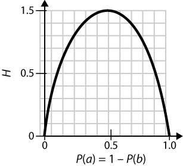

Figure 6-5. The entropy of labels in the name gender prediction task, as a function of the percentage of names in a given set that are male.

计算标签链表的熵

```py
import math
def entropy(labels):
    freqdist = nltk.FreqDist(labels)
    probs = [freqdist.freq(l) for l in nltk.FreqDist(labels)]
    return -1 * sum([p * math.log(p,2) for p in probs])

entropy(['male', 'male', 'male', 'male'])
-0.0

entropy(['male', 'female', 'male', 'male'])
0.8112781244591328

entropy(['female', 'male', 'female', 'male'])
1.0

entropy(['female', 'female', 'male', 'female'])
0.8112781244591328

entropy(['female', 'female', 'female', 'female'])
-0.0
```

信息增益等于原来的熵减去新减少的熵。信息增益越高，将输入值分为相关组的决策树桩性能越好，于是可以通过选择具有最高信息增益的决策树桩来建立决策树。

# 朴素贝叶斯分类器


Figure 6-6. An abstract illustration of the procedure used by the naive Bayes classifier to choose the topic for a document. In the training corpus, most documents are automotive, so the classifier starts out at a point closer to the “automotive” label. But it then considers the effect of each feature. In this example, the input document contains the word dark, which is a weak indicator for murder mysteries, but it also contains the word football, which is a strong indicator for sports documents. After every feature has made its contribution, the classifier checks which label it is closest to, and assigns that label to the input.

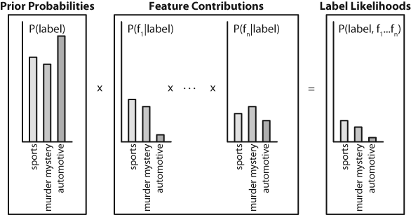

Figure 6-7. Calculating label likelihoods with naive Bayes. Naive Bayes begins by calculating the prior probability of each label, based on how frequently each label occurs in the training data. Every feature then contributes to the likelihood estimate for each label, by multiplying it by the probability that input values with that label will have that feature. The resulting likelihood score can be thought of as an estimate of the probability that a randomly selected value from the training set would have both the given label and the set of features, assuming that the feature probabilities are all independent.

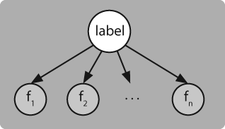

Figure 6-8. A Bayesian Network Graph illustrating the generative process that is assumed by the naive Bayes classifier. To generate a labeled input, the model first chooses a label for the input, and then it generates each of the input’s features based on that label. Every feature is assumed to be entirely independent of every other feature, given the label.

## 潜在概率模型
它为输入选择最有可能的标签，基于下面的假设：每个输入值是通过首先为该输入值选择类标签，然后产生每个特征的方式产生的，每个特征与其他特征完全独立。

基于这个假设，我们可以计算表达式P(label|features)，即一个具有特定标签（假定具有特定的特征集）的输入概率。要为新输入选择标签，可以简单地选择能使P（l|features)最大的标签l。

首先，注意到P(label|features)等于具有特定标签和特定特征集的输入的概率除以具有特定特征集的输入的概率。

$(2) P(label|features)=\frac{P(features,label)}{P(features)}$

接下来，注意到P(features)对每个标签都是相同的。因此，如果我们只是对寻找最有可能的标签感兴趣，只需计算P(features,label)就够了，我们称之为似然(likelihood)标签。

如果我们想生成每个标签的概率估计，而不是只选择最有可能的标签，那么计算P(features)的最简单的方法是仅仅计算P(features,label)在所有标签上的总和。

$(3) P(features)=\sum_{label \in labels}P(features,label)$

似然标签可以展开为标签的概率乘以给定标签特征的概率。

$(4) P(features,label)=P(label) \times P(features|label)$

由于特征都是独立的（给定标签），可以分离每个独立特征的概率。

$(5) P(features,label)=P(label) \times \prod_{f \in features}P(f|label)$

P(label)是一个给定标签的先验概率，每个P(f|label)是单个特征对标签可能性的贡献。

## 零计数和平滑
计算P(f|label)最简单的方法，特征f对标签label的标签似然性的贡献，是取得具有给定特征和给定标签的训练实例百分比。

$(6) P(f|label)=\frac{count(f,label)}{count(label)}$

当count(f)变小时这个估计变得不可靠。因此，建立朴素贝叶斯模型时，采用平滑(smoothing)技术，用于计算P(f|label)，在给定标签的特征的概率的基础上。例如：给定标签的特征概率的期望似然估计(Expected Likelihood Estimation)基本上会给每个count(f,label)值增加0.5，Heldout估计(Heldout Estimation)使用heldout语料库计算特征频率与特征概率之间的关系。nltk.probability模块提供了多种平滑模块技术支持。

## 非二元特征
标签值特征（例如颜色）可以转化为二元（红色、非红色）。数字特征可以通过装箱(binning)转换为二元特征。

另一种方法是通过回归方法来模拟数字特征的概率。

## 双重计数的原因
双重计数问题出现的原因是在训练过程中特征的贡献被分开计算，但当使用分类器为新输入选择标签时，这些特征的贡献被组合在一起了。因此，解决方案是考虑在训练中特征的贡献之间可能的相互作用。

我们可以重写用于计算标签似然性的方程，分离出每个功能（或标签）所作出的贡献。

$(7) P(features, label)=w[label] \times \prod_{f \in features}w[f,label]$

这里，w[label]是一个给定标签的“初始分数”，w[f,label]是给定特征对一个标签的似然性所作的贡献。我们称这些值w[label]和w[f,label]为模型的参数(parameters)或权重(weights)。使用朴素贝叶斯算法，我们单独设置这些参数。

$(8) w[label]=P(label)$

$(9) w[f,label]=P(f|label)$

# 最大熵分类器
没有使用概率设置模型的参数，而是使用搜索技术找出一组能最大限度地提高分类器性能的参数。特别的，它查出能使训练语料的整体似然性(total likelihood)最大的参数组。其定义如下

$(10) P(features)=\sum_{x \in corpus}P(label(x)|features(x))$

其中P(label|features)，即特征为features的输入且类标签为label的概率，被定义为：

$(11) P(label|features)=\frac{P(label, features)}{\sum_{label}P(label, features)}$

最大熵分类器采用迭代优化(iterative optimization)技术选择模型参数，该技术利用随机值初始化模型的参数，然后反复优化这些参数，使它们更接近最优解。

## 最大熵模型
每个接收它自身参数的标签和特征的组合被称为联合特征(joint-feature)。联合特征是加标签值的属性，而（简单）特征是未加标签值的属性。

每个标签定义的联合特征对应于w[label]，每个（简单）特征和标签组合定义的联合特征对应于w[f,label]。给定一个最大熵模型的联合特征，分配到给定输入标签的得分仅仅是适用于该输入和标签的联合特征与参数之间的简单乘积。

$(12) P(input, label)=\prod_{joint-features(input,label)}w[joint-feature]$

## 熵的最大化
假设从10个可能词意列表（标签从A-J）中为一个给定的词找出正确词意。首先，我们没有被告知其他任何关于词或词意的信息。我们可以为10种词意选择的概率分布很多，例如：

| - | A |  B | C | D | E | F | G | H | I | J |
| - | - |  - | - | - | - | - | - | - | - | - |
| (i) | 10% | 10% | 10% | 10% | 10% | 10% | 10% | 10% | 10% | 10% |
| (ii) | 5% | 15% | 0% | 30% | 0% | 8% | 12% | 0% | 6% | 24% |
| (iii) | 0% | 100% | 0% | 0% | 0% | 0% | 0% | 0% | 0% | 0% |

虽然这些分布都有可能是正确的，但我们最可能会选择的是分布（i），因为没有任何更多的信息，也没有理由相信任何词的词意比其他的更有可能。

如果是一个单独的标签则熵较低，但如果标签的分布比较均匀则熵较高。`最大熵原理(Maximum Entropy principle)`是指在已知的分布下，我们会选择熵最高的分布。

接下来，假设被告知词意A出现的次数占55%。还有许多分布适合于这条信息，例如：

| - | A |  B | C | D | E | F | G | H | I | J |
| - | - |  - | - | - | - | - | - | - | - | - |
| (iv) | 55% | 45% | 0% | 0% | 0% | 0% | 0% | 0% | 0% | 0% |
| (v) | 55% | 5% | 5% | 5% | 5% | 5% | 5% | 5% | 5% | 5% |
| (vi) | 55% | 3% | 1% | 2% | 9% | 5% | 0% | 25% | 0% | 0% |

最后，假设被告知词up出现在附近上下文中的次数占10%，当它出现在这个上下文中时有80%的可能使用词意A或C。

| - | - | A |  B | C | D | E | F | G | H | I | J |
| - | - | - |  - | - | - | - | - | - | - | - | - |
| (vii) | +up | 5.1% | 0.25% | 2.9% | 0.25% | 0.25% | 0.25% | 0.25% | 0.25% | 0.25% | 0.25% |
| - | -up | 49.9% | 4.46% | 4.46% | 4.46% | 4.46% | 4.46% | 4.46% | 4.46% | 4.46% | 4.46% |

特别地，这个分布与我们所知道的一致：如果我们将A列的概率加起来，是55%，如果我们将第1行的概率加起来，是10%；如果我们将+up行词意A和C的概率加起来，是8%（或+up情况的80%）。此外，其余的概率好像是“均匀分布”的。

我们将自己限制在已知的分布上。其中，我们选择最高熵的分布。特别地，对于每个联合特征，最大熵模型计算该特征的“经验频率”——即它出现在训练集中的频率。然后，搜索能使熵最大的分布，同时预测每个联合特征正确的概率。

# 从文本提取信息
## 信息提取
### 信息提取结构
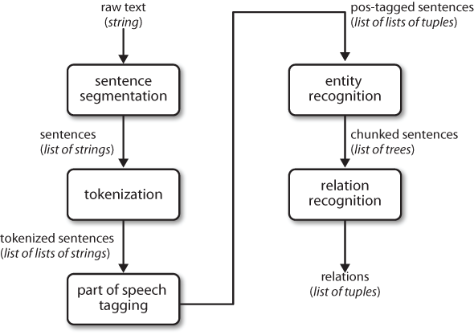

Figure 7-1. Simple pipeline architecture for an information extraction system. This system takes the raw text of a document as its input, and generates a list of (entity, relation, entity) tuples as its output. For example, given a document that indicates that the company Georgia-Pacific is located in Atlanta, it might generate the tuple ([ORG: 'Georgia-Pacific'] 'in' [LOC: 'Atlanta']).

要执行前面3个任务，需要定义一个函数，简单地连接NLTK中默认的句子分割器，分词器和词性标注器。

```py
def ie_preprocess(document):
  sentences = nltk.sent_tokenize(document)
  sentences = [nltk.word_tokenize(sent) for sent in sentences]
  sentences = [nltk.pos_tag(sent) for sent in sentences]
```

## 分块(Chunking)
用于实体识别的基本技术是`分块(chunking)`，分割和标注如图7-2所示的多标识符序列。小框显示词级标识符和词性标注，同时，大框显示较高级别的程序分块。较大的框叫做组`块(chunk)`。

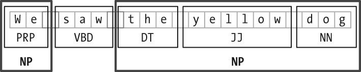

Figure 7-2. Segmentation and labeling at both the Token and Chunk levels.

### 名词短语分块
名词短语分块(noun phrase chunking)或NP-分块(NP-chunking)，寻找单独名词短语对应的块。下面文本，其中的NP-分块用方括号标记。

```
[ The/DT market/NN ] for/IN [ system-management/NN software/NN ] for/IN [ Digital/NNP ] [ ’s/POS hardware/NN ] is/VBZ fragmented/JJ enough/RB that/IN [ a/DT giant/NN ] such/JJ as/IN [ Computer/NNP Associates/NNPS ] should/MD do/VB well/RB there/RB ./.
```

NP-分块信息最有用的来源之一是词性标注。

```py
sentence = [("the", "DT"), ("little", "JJ"), ("yellow", "JJ"), # 已经标注词性的例句
... ("dog", "NN"), ("barked", "VBD"), ("at", "IN"),  ("the", "DT"), ("cat", "NN")]

grammar = "NP: {<DT>?<JJ>*<NN>}" # 正则表达式定义一个语法：NP-分块由可选的且后面跟着任意数目形容词(JJ)的限定词(DJ)和名词(NN)组成

cp = nltk.RegexpParser(grammar) # 使用此语法创建组块分析器
result = cp.parse(sentence) # 测试例句
print result # 输出
(S
  (NP the/DT little/JJ yellow/JJ dog/NN)
  barked/VBD
  at/IN
  (NP the/DT cat/NN))
result.draw()
```


### 用正则表达式分块
下例由2个规则组成的简单的分块语法。

```py
grammar = r"""
  NP: {<DT|PP\$>?<JJ>*<NN>}   # chunk determiner/possessive, adjectives and nouns
      {<NNP>+}                # chunk sequences of proper nouns
"""

cp = nltk.RegexpParser(grammar)
sentence = [("Rapunzel", "NNP"), ("let", "VBD"), ("down", "RP"), 1
                 ("her", "PP$"), ("long", "JJ"), ("golden", "JJ"), ("hair", "NN")]

print cp.parse(sentence) 1
(S
  (NP Rapunzel/NNP)
  let/VBD
  down/RP
  (NP her/PP$ long/JJ golden/JJ hair/NN))
```

### 探索文本语料库
使用分块器可以更轻松地完成这项工作：

```py
cp = nltk.RegexpParser('CHUNK: {<V.*> <TO> <V.*>}')
brown = nltk.corpus.brown
for sent in brown.tagged_sents():
    tree = cp.parse(sent)
    for subtree in tree.subtrees():
        if subtree.node == 'CHUNK': print subtree

(CHUNK combined/VBN to/TO achieve/VB)
(CHUNK continue/VB to/TO place/VB)
(CHUNK serve/VB to/TO protect/VB)
(CHUNK wanted/VBD to/TO wait/VB)
(CHUNK allowed/VBN to/TO place/VB)
(CHUNK expected/VBN to/TO become/VB)
...
(CHUNK seems/VBZ to/TO overtake/VB)
(CHUNK want/VB to/TO buy/VB)
```

### 缝隙(Chinking)
有时可以定义我们想从块中排除什么。可以为不包括在大块中的标识符序列定义一个缝隙(Chinking)。在下面的例子中，barker/VBD at/IN是一个缝隙。

```
[ the/DT little/JJ yellow/JJ dog/NN ] barked/VBD at/IN [ the/DT cat/NN ]
```

简单的加缝器：

```py
grammar = r"""
  NP:
    {<.*>+}          # Chunk everything
    }<VBD|IN>+{      # Chink sequences of VBD and IN
  """
sentence = [("the", "DT"), ("little", "JJ"), ("yellow", "JJ"),
       ("dog", "NN"), ("barked", "VBD"), ("at", "IN"),  ("the", "DT"), ("cat", "NN")]

cp = nltk.RegexpParser(grammar)
print cp.parse(sentence)

(S
  (NP the/DT little/JJ yellow/JJ dog/NN)
  barked/VBD
  at/IN
  (NP the/DT cat/NN))
```

### 分块的表示：标记与树状图
作为标注和分析之间的中间状态，块结构可以使用标记或树状图来表示。使用最广泛的表示是IOB标记。每个标识符被用3个特殊的块标签之一标注，I(inside),O(outside)或B(begin)。

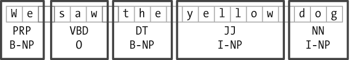

Figure 7-3. Tag representation of chunk structures.

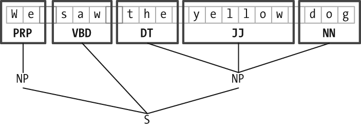

Figure 7-4. Tree representation of chunk structures.

## 开发和评估分块器
### 读取IOB格式与CoNLL2000分块语料库
```py
text = '''
... he PRP B-NP
... accepted VBD B-VP
... the DT B-NP
... position NN I-NP
... of IN B-PP
... vice NN B-NP
... chairman NN I-NP
... of IN B-PP
... Carlyle NNP B-NP
... Group NNP I-NP
... , , O
... a DT B-NP
... merchant NN I-NP
... banking NN I-NP
... concern NN I-NP
... . . O
... '''
nltk.chunk.conllstr2tree(text, chunk_types=['NP']).draw()
```

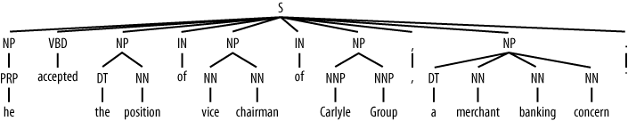

读取语料库“训练”部分的100个句子的例子。

```py
from nltk.corpus import conll2000
print conll2000.chunked_sents('train.txt')[99]
(S
  (PP Over/IN)
  (NP a/DT cup/NN)
  (PP of/IN)
  (NP coffee/NN)
  ,/,
  (NP Mr./NNP Stone/NNP)
  (VP told/VBD)
  (NP his/PRP$ story/NN)
  ./.)
```

语料库包含3种分块类型：NP分块，VP分块(has already delivered)和PP分块(because of)。选择NP分块：

```py
print conll2000.chunked_sents('train.txt', chunk_types=['NP'])[99]
(S
  Over/IN
  (NP a/DT cup/NN)
  of/IN
  (NP coffee/NN)
  ,/,
  (NP Mr./NNP Stone/NNP)
  told/VBD
  (NP his/PRP$ story/NN)
  ./.)
```

### 简单评估和基准
以不创建任何块的块分析器cp建立一个baseline。

```py
from nltk.corpus import conll2000
cp = nltk.RegexpParser("")
test_sents = conll2000.chunked_sents('test.txt', chunk_types=['NP'])

print cp.evaluate(test_sents)
ChunkParse score:
    IOB Accuracy:  43.4%
    Precision:      0.0%
    Recall:         0.0%
    F-Measure:      0.0%
```

查找以名词短语标记的特征字母（如CD、DT和JJ）开头的标记。

```py
grammar = r"NP: {<[CDJNP].*>+}"
cp = nltk.RegexpParser(grammar)
print cp.evaluate(test_sents)
ChunkParse score:
    IOB Accuracy:  87.7%
    Precision:     70.6%
    Recall:        67.8%
    F-Measure:     69.2%
```

使用unigram标注器对名词短语分块。

```py
class UnigramChunker(nltk.ChunkParserI):
    def __init__(self, train_sents):
        train_data = [[(t,c) for w,t,c in nltk.chunk.tree2conlltags(sent)]
                      for sent in train_sents]
        self.tagger = nltk.UnigramTagger(train_data)

    def parse(self, sentence):
        pos_tags = [pos for (word,pos) in sentence]
        tagged_pos_tags = self.tagger.tag(pos_tags)
        chunktags = [chunktag for (pos, chunktag) in tagged_pos_tags]
        conlltags = [(word, pos, chunktag) for ((word,pos),chunktag)
                     in zip(sentence, chunktags)]
        return nltk.chunk.conlltags2tree(conlltags)

test_sents = conll2000.chunked_sents('test.txt', chunk_types=['NP'])
train_sents = conll2000.chunked_sents('train.txt', chunk_types=['NP'])
unigram_chunker = UnigramChunker(train_sents)
print unigram_chunker.evaluate(test_sents)
ChunkParse score:
    IOB Accuracy:  92.9%
    Precision:     79.9%
    Recall:        86.8%
    F-Measure:     83.2%

postags = sorted(set(pos for sent in train_sents
...                      for (word,pos) in sent.leaves()))
print unigram_chunker.tagger.tag(postags)
[('#', 'B-NP'), ('$', 'B-NP'), ("''", 'O'), ('(', 'O'), (')', 'O'),
 (',', 'O'), ('.', 'O'), (':', 'O'), ('CC', 'O'), ('CD', 'I-NP'),
 ('DT', 'B-NP'), ('EX', 'B-NP'), ('FW', 'I-NP'), ('IN', 'O'),
 ('JJ', 'I-NP'), ('JJR', 'B-NP'), ('JJS', 'I-NP'), ('MD', 'O'),
 ('NN', 'I-NP'), ('NNP', 'I-NP'), ('NNPS', 'I-NP'), ('NNS', 'I-NP'),
 ('PDT', 'B-NP'), ('POS', 'B-NP'), ('PRP', 'B-NP'), ('PRP$', 'B-NP'),
 ('RB', 'O'), ('RBR', 'O'), ('RBS', 'B-NP'), ('RP', 'O'), ('SYM', 'O'),
 ('TO', 'O'), ('UH', 'O'), ('VB', 'O'), ('VBD', 'O'), ('VBG', 'O'),
 ('VBN', 'O'), ('VBP', 'O'), ('VBZ', 'O'), ('WDT', 'B-NP'),
 ('WP', 'B-NP'), ('WP$', 'B-NP'), ('WRB', 'O'), ('``', 'O')]
```

unigram分块器建立完成后，可以很容易建立bigram分块器：

```py
bigram_chunker = BigramChunker(train_sents)
print bigram_chunker.evaluate(test_sents)
ChunkParse score:
    IOB Accuracy:  93.3%
    Precision:     82.3%
    Recall:        86.8%
    F-Measure:     84.5%
```

### 训练基于分类器的分块器
```py
class ConsecutiveNPChunkTagger(nltk.TaggerI):

    def __init__(self, train_sents):
        train_set = []
        for tagged_sent in train_sents:
            untagged_sent = nltk.tag.untag(tagged_sent)
            history = []
            for i, (word, tag) in enumerate(tagged_sent):
                featureset = npchunk_features(untagged_sent, i, history)
                train_set.append( (featureset, tag) )
                history.append(tag)
        self.classifier = nltk.MaxentClassifier.train(
            train_set, algorithm='megam', trace=0)

    def tag(self, sentence):
        history = []
        for i, word in enumerate(sentence):
            featureset = npchunk_features(sentence, i, history)
            tag = self.classifier.classify(featureset)
            history.append(tag)
        return zip(sentence, history)

class ConsecutiveNPChunker(nltk.ChunkParserI):
    def __init__(self, train_sents):
        tagged_sents = [[((w,t),c) for (w,t,c) in
                         nltk.chunk.tree2conlltags(sent)]
                        for sent in train_sents]
        self.tagger = ConsecutiveNPChunkTagger(tagged_sents)

    def parse(self, sentence):
        tagged_sents = self.tagger.tag(sentence)
        conlltags = [(w,t,c) for ((w,t),c) in tagged_sents]
        return nltk.chunk.conlltags2tree(conlltags)

def npchunk_features(sentence, i, history):
    word, pos = sentence[i]
    return {"pos": pos}

chunker = ConsecutiveNPChunker(train_sents)
print chunker.evaluate(test_sents)
ChunkParse score:
    IOB Accuracy:  92.9%
    Precision:     79.9%
    Recall:        86.7%
    F-Measure:     83.2%
```

添加特征：前面词的词性标记。添加此特征允许分类器模拟相邻标记之间的相互作用。

```py
def npchunk_features(sentence, i, history):
    word, pos = sentence[i]
    if i == 0:
        prevword, prevpos = "<START>", "<START>"
    else:
        prevword, prevpos = sentence[i-1]
    return {"pos": pos, "prevpos": prevpos}

chunker = ConsecutiveNPChunker(train_sents)
print chunker.evaluate(test_sents)
ChunkParse score:
    IOB Accuracy:  93.6%
    Precision:     81.9%
    Recall:        87.1%
    F-Measure:     84.4%
```

为当前词增加特征：

```py
def npchunk_features(sentence, i, history):
    word, pos = sentence[i]
    if i == 0:
        prevword, prevpos = "<START>", "<START>"
    else:
        prevword, prevpos = sentence[i-1]
    return {"pos": pos, "word": word, "prevpos": prevpos}
chunker = ConsecutiveNPChunker(train_sents)
print chunker.evaluate(test_sents)
ChunkParse score:
    IOB Accuracy:  94.2%
    Precision:     83.4%
    Recall:        88.6%
    F-Measure:     85.9%
```

增加更多特征：预取特征、配对功能和复杂的语境特征、tags-since-dt用其创建一个字符串，描述自最近限定词以来遇到的所有词性标记。

```py
def npchunk_features(sentence, i, history):
    word, pos = sentence[i]
    if i == 0:
        prevword, prevpos = "<START>", "<START>"
    else:
        prevword, prevpos = sentence[i-1]
    if i == len(sentence)-1:
        nextword, nextpos = "<END>", "<END>"
    else:
        nextword, nextpos = sentence[i+1]
    return {"pos": pos,
            "word": word,
            "prevpos": prevpos,
            "nextpos": nextpos, # 预取特征
            "prevpos+pos": "%s+%s" % (prevpos, pos),  # 配对功能
            "pos+nextpos": "%s+%s" % (pos, nextpos),
            "tags-since-dt": tags_since_dt(sentence, i)}  # 语境特征

def tags_since_dt(sentence, i):
    tags = set()
    for word, pos in sentence[:i]:
        if pos == 'DT':
            tags = set()
        else:
            tags.add(pos)
    return '+'.join(sorted(tags))

chunker = ConsecutiveNPChunker(train_sents)
print chunker.evaluate(test_sents)
ChunkParse score:
    IOB Accuracy:  95.9%
    Precision:     88.3%
    Recall:        90.7%
    F-Measure:     89.5%
```

## 语言结构中的递归
### 用级联分块器构建嵌套结构
创建一个包含递归规则的多级的分块语法，就可以建立任意深度的分块结构。下例展示了名词短语、介词短语、动词短语和句子的模式。这是一个四级分块语法器，可以用来创建深度最多为4的结构。

```py
grammar = r"""
  NP: {<DT|JJ|NN.*>+}          # Chunk sequences of DT, JJ, NN
  PP: {<IN><NP>}               # Chunk prepositions followed by NP
  VP: {<VB.*><NP|PP|CLAUSE>+$} # Chunk verbs and their arguments
  CLAUSE: {<NP><VP>}           # Chunk NP, VP
  """
cp = nltk.RegexpParser(grammar)
sentence = [("Mary", "NN"), ("saw", "VBD"), ("the", "DT"), ("cat", "NN"),
    ("sit", "VB"), ("on", "IN"), ("the", "DT"), ("mat", "NN")]

print cp.parse(sentence)
(S
  (NP Mary/NN)
  saw/VBD
  (CLAUSE
    (NP the/DT cat/NN)
    (VP sit/VB (PP on/IN (NP the/DT mat/NN)))))
```

### 树状图
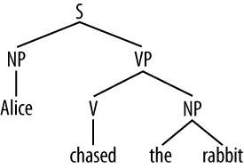

## 命名实体识别(Named Entity Recognition)
Table 7-3. Commonly used types of named entity

|NE type | Examples |
|------- | -------- |
|ORGANIZATION | Georgia-Pacific Corp., WHO |
|PERSON | Eddy Bonte, President Obama |
|LOCATION | Murray River, Mount Everest |
|DATE | June, 2008-06-29 |
|TIME | two fifty a m, 1:30 p.m. |
|MONEY | 175 million Canadian Dollars, GBP 10.40 |
|PERCENT | twenty pct, 18.75 % |
|FACILITY | Washington Monument, Stonehenge |
|GPE | South East Asia, Midlothian |

命名实体识别(named entity recognition, `NER`)系统的目标是识别所有文字提及的命名实体。这可以分解成两个子任务：确定NE的边界和确定其类型。

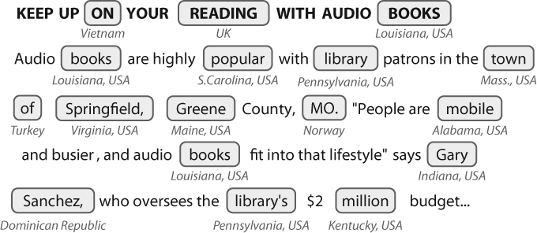

Figure 7-5. Location detection by simple lookup for a news story: Looking up every word in a gazetteer is error-prone; case distinctions may help, but these are not always present.

NLTK提供了一个已经训练好的可以识别命名实体的分类器（如果设置参数binary=True，那个命名实体只被标注为NE；否则，分类器会添加类型标签，如PERSON、ORGANIZATION和GPE）：

```py
sent = nltk.corpus.treebank.tagged_sents()[22]
print nltk.ne_chunk(sent, binary=True)
(S
  The/DT
  (NE U.S./NNP)
  is/VBZ
  one/CD
  ...
  according/VBG
  to/TO
  (NE Brooke/NNP T./NNP Mossman/NNP)
  ...)

print nltk.ne_chunk(sent)
(S
  The/DT
  (GPE U.S./NNP)
  is/VBZ
  one/CD
  ...
  according/VBG
  to/TO
  (PERSON Brooke/NNP T./NNP Mossman/NNP)
  ...)
```

## 关系抽取(Relation Extraction)
通常会寻找指定类型的命名实体之间的关系。方法之一是首选寻找所有（X，a，Y）形式三元组，其中X和Y是指定类型的命名实体，a表示X和Y之间关系的字符串。然后使用正则表达式从a的实体中抽出正在查找的关系。

```py
IN = re.compile(r'.*\bin\b(?!\b.+ing)')
for doc in nltk.corpus.ieer.parsed_docs('NYT_19980315'):
    for rel in nltk.sem.extract_rels('ORG', 'LOC', doc,
                                     corpus='ieer', pattern = IN):
        print nltk.sem.show_raw_rtuple(rel)

[ORG: 'WHYY'] 'in' [LOC: 'Philadelphia']
[ORG: 'McGlashan &AMP; Sarrail'] 'firm in' [LOC: 'San Mateo']
[ORG: 'Freedom Forum'] 'in' [LOC: 'Arlington']
[ORG: 'Brookings Institution'] ', the research group in' [LOC: 'Washington']
[ORG: 'Idealab'] ', a self-described business incubator based in' [LOC: 'Los Angeles']
[ORG: 'Open Text'] ', based in' [LOC: 'Waterloo']
[ORG: 'WGBH'] 'in' [LOC: 'Boston']
[ORG: 'Bastille Opera'] 'in' [LOC: 'Paris']
[ORG: 'Omnicom'] 'in' [LOC: 'New York']
[ORG: 'DDB Needham'] 'in' [LOC: 'New York']
[ORG: 'Kaplan Thaler Group'] 'in' [LOC: 'New York']
[ORG: 'BBDO South'] 'in' [LOC: 'Atlanta']
[ORG: 'Georgia-Pacific'] 'in' [LOC: 'Atlanta']
```

false positives : [ORG: House Transportation Committee] , secured the most money in the [LOC: New York]

# 分析句子结构
## 文法(Syntax)的用途
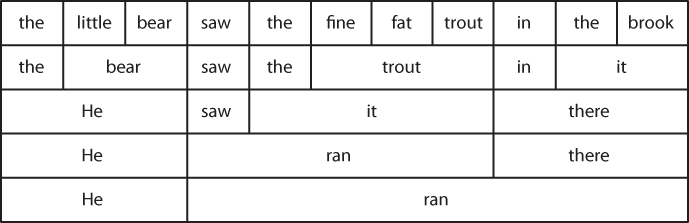

Figure 8-1. Substitution of word sequences: Working from the top row, we can replace particular sequences of words (e.g., the brook) with individual words (e.g., it); repeating this process, we arrive at a grammatical two-word sentence.

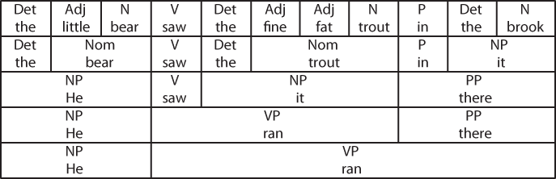

Figure 8-2. Substitution of word sequences plus grammatical categories: This diagram reproduces Figure 8-1 along with grammatical categories corresponding to noun phrases (NP), verb phrases (VP), prepositional phrases (PP), and nominals (Nom).

如果现在将最上面的词汇分离，增加一个S节点，再把图翻转，最终我们得到一个标准的短语结构树，如下所示。


## 上下文无关文法
一个简单的上下文无关文法(context-free grammar,`CFG`)的例子

```py
grammar1 = nltk.parse_cfg("""
  S -> NP VP
  VP -> V NP | V NP PP
  PP -> P NP
  V -> "saw" | "ate" | "walked"
  NP -> "John" | "Mary" | "Bob" | Det N | Det N PP
  Det -> "a" | "an" | "the" | "my"
  N -> "man" | "dog" | "cat" | "telescope" | "park"
  P -> "in" | "on" | "by" | "with"
  """)
sent = "Mary saw Bob".split()
rd_parser = nltk.RecursiveDescentParser(grammar1)
for tree in rd_parser.nbest_parse(sent):
    print tree
(S (NP Mary) (VP (V saw) (NP Bob)))
```

Table 8-1. Syntactic categories

| Symbol | Meaning | Example |
| ------ | ------- | ------- |
| S  | sentence | the man walked |
| NP | noun phrase | a dog |
| VP | verb phrase | saw a park |
| PP | prepositional phrase | with a telescope |
| Det | determner | the |
| N | noun | dog |
| V | verb | walked |
| P | preposition | in |

The dog saw a man in the park 得到两棵树。

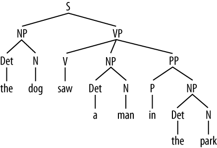

## 上下文无关文法分析(Parsing with Context-Free Grammar)
### 递归下降解析器(Recursive Descent Parsing)
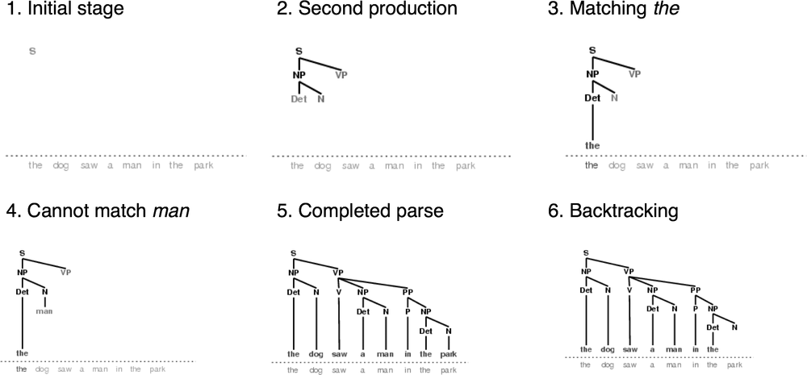

Figure 8-4. Six stages of a recursive descent parser: The parser begins with a tree consisting of the node S; at each stage it consults the grammar to find a production that can be used to enlarge the tree; when a lexical production is encountered, its word is compared against the input; after a complete parse has been found, the parser backtracks to look for more parses.

### 移进-规约分析(Shift-Reduce Parsing)
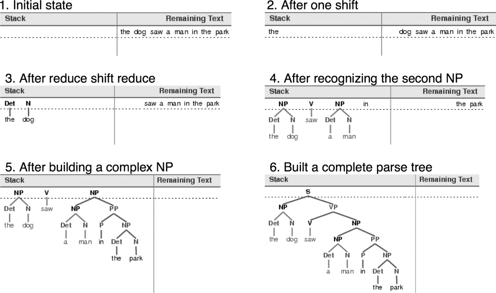

Figure 8-5. Six stages of a shift-reduce parser: The parser begins by shifting the first input word onto its stack; once the top items on the stack match the righthand side of a grammar production, they can be replaced with the lefthand side of that production; the parser succeeds once all input is consumed and one S item remains on the stack.

### 依存关系(Dependencies)和依存文法(Dependency Grammar)
短语结构文法是关于词和词序列如何结合形成句子成分的。一种独特且互补的方式，依存文法(dependency grammar)，集中关注的是词与其他词之间的关系。依存关系是一个中心词(head)与其从属(dependents)之间的二元非对称关系。一个句子的中心词通常是动词，所有其他词要么依赖于中心词，要么通过依赖路径与它相关联。

依存关系图是一个投影(projective)，若所有的词都按线性顺序书写，则用边连接这些词且保证边不交叉。

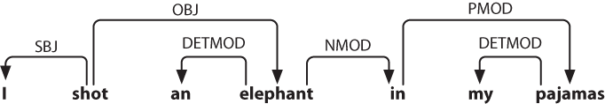

Figure 8-8. Dependency structure: Arrows point from heads to their dependents; labels indicate the grammatical function of the dependent as subject, object, or modifier.
