    作者:  曹天元 
    出版社: 北京联合出版公司
    副标题: 量子物理史话
    出版年: 2013-8-1
    页数: 381
    定价: 45.00元
    装帧: 精装
    ISBN: 9787550217454

[豆瓣链接](https://book.douban.com/subject/25742211/)

- [第一章 黄金时代](#%e7%ac%ac%e4%b8%80%e7%ab%a0-%e9%bb%84%e9%87%91%e6%97%b6%e4%bb%a3)
- [第二章 乌云](#%e7%ac%ac%e4%ba%8c%e7%ab%a0-%e4%b9%8c%e4%ba%91)
- [第三章 火流星](#%e7%ac%ac%e4%b8%89%e7%ab%a0-%e7%81%ab%e6%b5%81%e6%98%9f)
- [第四章 白云深处](#%e7%ac%ac%e5%9b%9b%e7%ab%a0-%e7%99%bd%e4%ba%91%e6%b7%b1%e5%a4%84)
- [第五章 曙光](#%e7%ac%ac%e4%ba%94%e7%ab%a0-%e6%9b%99%e5%85%89)
- [第六章 殊途同归](#%e7%ac%ac%e5%85%ad%e7%ab%a0-%e6%ae%8a%e9%80%94%e5%90%8c%e5%bd%92)
- [第七章 不确定性](#%e7%ac%ac%e4%b8%83%e7%ab%a0-%e4%b8%8d%e7%a1%ae%e5%ae%9a%e6%80%a7)
- [第九章 测量问题](#%e7%ac%ac%e4%b9%9d%e7%ab%a0-%e6%b5%8b%e9%87%8f%e9%97%ae%e9%a2%98)
- [第十章 不等式](#%e7%ac%ac%e5%8d%81%e7%ab%a0-%e4%b8%8d%e7%ad%89%e5%bc%8f)
- [第十一章 上帝的判决](#%e7%ac%ac%e5%8d%81%e4%b8%80%e7%ab%a0-%e4%b8%8a%e5%b8%9d%e7%9a%84%e5%88%a4%e5%86%b3)
- [第十二章 新探险](#%e7%ac%ac%e5%8d%81%e4%ba%8c%e7%ab%a0-%e6%96%b0%e6%8e%a2%e9%99%a9)

## 第一章 黄金时代
1887年，赫兹的实验证实了电磁波的存在，也证实了**光其实是电磁波的一种，两者具有共同的波的特性。**

对光成像的正确认识直到公元1000年左右才被著名的伊斯兰科学家阿尔·哈桑（al-Haytham，也拼作Alhazen）所最终归纳成型：原来我们之所以能够看到物体，只是由于光从物体上反射进我们眼睛里的结果。

亚里士多德在《论天》一书里阐述了他对天体的认识。他认为日月星辰围绕着地球运转，但其组成却不同于地上的四大元素水火气土。天上的事物应该是完美无缺的，它们只能由一种更为纯洁的元素所构成，这就是亚里士多德所谓的“`第五元素`”——`以太`（希腊文的αηθηρ）。

波义耳(Robert Boyle，中学里学过波马定律的朋友一定还记得这个叫你头痛的爱尔兰人)在1663年提出的一个理论：他认为我们看到的各种颜色，其实并不是物体本身的属性，而是光照上去才产生的效果。

在1807年，杨总结出版了他的《自然哲学讲义》，里面综合整理了他在光学方面的工作，并第一次描述了他那个名扬四海的实验：`光的双缝干涉`。

杨的实验手段极其简单：把一支蜡烛放在一张开了一个小孔的纸前面，这样就形成了一个点光源（从一个点发出的光源）。现在在纸后面再放一张纸，不同的是第二张纸上开了两道平行的狭缝。从小孔中射出的光穿过两道狭缝投到屏幕上，就会形成一系列明、暗交替的条纹，这就是现在众人皆知的干涉条纹。

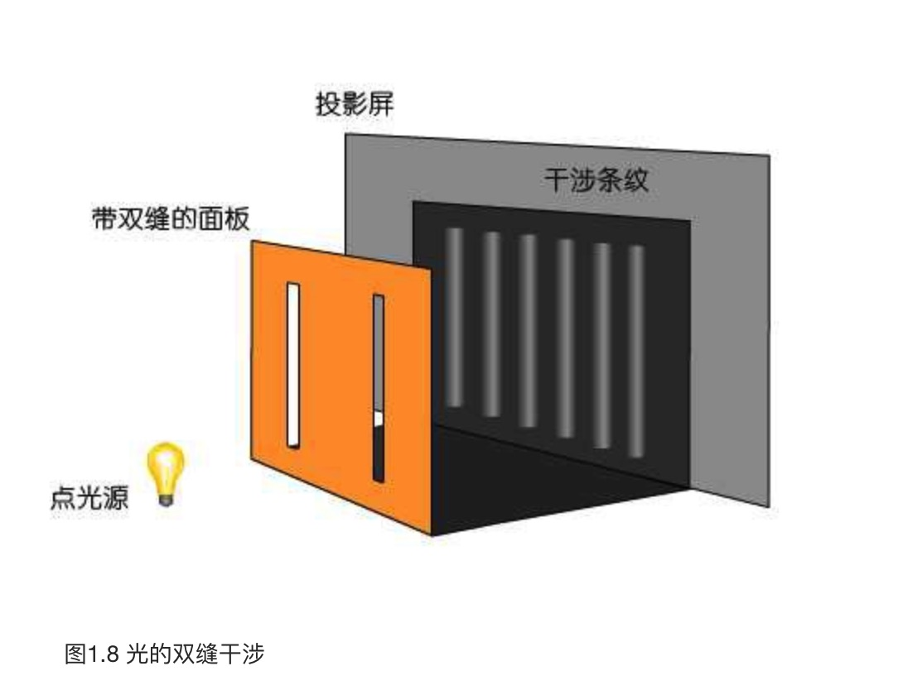

菲涅尔理论的这个胜利成了第二次波粒战争的决定性事件。圆盘阴影正中的亮点（后来被相当误导性地称作“泊松亮斑”）。他革命性地假设光是一种横波（也就是类似水波那样，振子作相对传播方向垂直运动的波），而不像从胡克以来所一直认为的那样，是一种纵波（类似弹簧波，振子作相对传播方向水平运动的波）。1821年，菲涅尔发表了题为《关于偏振光线的相互作用》的论文，用横波理论成功地解释了偏振现象，攻克了战役中一个最难以征服的据点。

然而不幸的微粒军团终于在1819年的莫斯科严冬之后，又于1850年迎来了它的滑铁卢。这一年的5月6日，傅科（Jean-Bernard-Léon Foucault，他后来以“傅科摆”实验而闻名）向法国科学院提交了他关于光速测量实验的报告。在准确地得出光在真空中的速度之后，他也进行了水中光速的测量，发现这个值小于真空中的速度，只有前者的3/4。这一结果彻底宣判了微粒说的死刑，波动论终于在100多年后革命成功，推翻了微粒王朝，登上了物理学统治地位的宝座。在胜利者盛大的加冕典礼中，第二次波粒战争随着微粒的战败而尘埃落定。

伟大的麦克斯韦于1856，1861和1865年发表了三篇关于电磁理论的论文，麦克斯韦的理论预言，光其实只是电磁波的一种。这个预言是怎样由赫兹在1887年用实验予以了证实。

## 第二章 乌云
一个物体之所以看上去是白色的，那是因为它反射所有频率的光波；反之，如果看上去是黑色的，那是因为它吸收了所有频率的光波的缘故。物理上定义的“黑体”，指的是那些可以吸收全部外来辐射的物体。

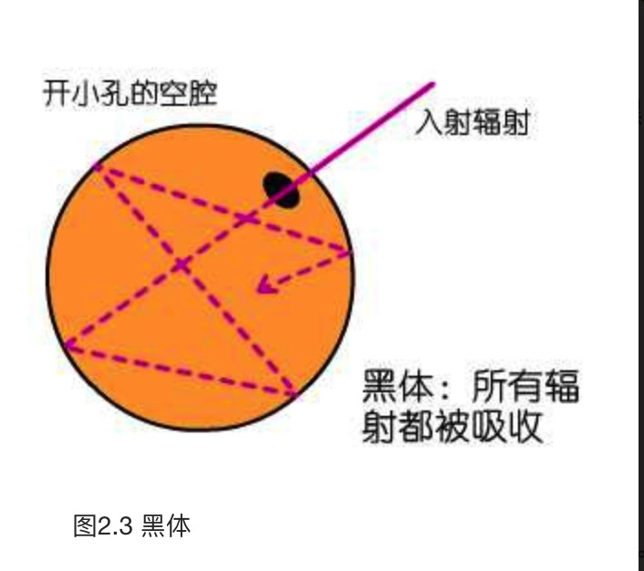

维恩从经典热力学的思想出发，假设黑体辐射是由一些服从麦克斯韦速率分布的分子发射出来的，然后通过精密的演绎，他终于在1894年提出了他的`辐射能量分布定律公式`：

$\rho=b\lambda^{-5}e^{-\frac{a}{\lambda T}}$

其中ρ表示能量分布的函数，λ是波长，T是绝对温度，a,b是常数。这就是著名的`维恩分布公式`。

维恩在帝国技术研究所（PTR）的同事很快就做出了另外一个实验。卢梅尔（Otto Richard Lummer）和普林舍姆（Ernst Pringsheim）于1899年报告，当把黑体加热到1000多K的高温时，测到的短波长范围内的曲线和维恩公式符合得很好，但在长波方面，实验和理论出现了偏差。很快，PTR的另两位成员鲁本斯（Heinrich Rubens）和库尔班（Ferdinand Kurlbaum）扩大了波长的测量范围，再次肯定了这个偏差，并得出结论：能量密度在长波范围内应该和绝对温度成正比，而不是维恩所预言的那样，当波长趋向无穷大时，能量密度和温度无关。

维恩定律在长波内的失效引起了英国物理学家瑞利（还记得上次我们闲话里的那位苦苦探究氮气重量，并最终发现了惰性气体的爵士吗？）的注意，他试图修改公式以适应ρ和T在高温长波下成正比这一实验结论。瑞利的做法是抛弃玻尔兹曼的分子运动假设，简单地从经典的麦克斯韦理论出发，最终他得出了自己的公式。后来，另一位物理学家金斯（J.H.Jeans）计算出了公式里的常数，最后他们得到的公式形式如下：

$\rho=\frac{8\pi v^2}{c^3}k T$

这就是我们今天所说的`瑞利-金斯（Rayleigh-Jeans）公式`，其中μ是频率，k是玻尔兹曼常数，c是光速。

具有讽刺意义的是，它在长波方面虽然符合了实验数据，但在短波方面的失败却是显而易见的。当波长λ趋于0，也就是频率υ趋向无穷大时，我们从上面的公式可以明显地看出：能量将无限制地呈指数式增长。这样一来，黑体在它的短波，也就是高频段就将释放出无穷大的能量来！

在黑体问题上，如果我们从粒子的角度出发去推导，就得到适用于短波的维恩公式。如果从经典的电磁波的角度去推导，就得到适用于长波的瑞利-金斯公式。

`普朗克黑体公式`：

$\rho=\frac{c_1\lambda^{-5}}{e^{\frac{c_2}{\lambda T}}-1}$

其中$c_1$和$c_2$为两个常数

**必须假定，能量在发射和吸收的时候，不是连续不断，而是分成一份一份的。** 正是这个假定，推翻了自牛顿以来200多年，曾经被认为是坚固不可摧毁的经典世界。

1900年12月14日，他宣读了那篇名留青史的《黑体光谱中的能量分布》的论文，其中改变历史的是这段话：

>为了找出N个振子具有总能量Un的可能性，我们必须假设Un是不可连续分割的，它只能是一些相同部件的有限总和……

这个基本单位，普朗克把它称作“能量子”（Energieelement），但随后很快，在另一篇论文里，他就改称为“`量子`”（Elementarquantum），英语就是quantum。这个字来自拉丁文quantus，本来的意思就是“多少”，“量”。量子就是能量的最小单位，就是能量里的一美分，一切能量的传输，都只能以这个量为单位来进行。它可以传输一个量子，两个量子，任意整数个量子，但却不能传输1又1/2个量子。

那么，这个最小单位究竟是多少呢？从普朗克的方程里可以容易地推算出答案：它等于一个常数乘以特定辐射的频率。用一个简明的公式来表示：

$E=hv$

其中E是单个量子的能量，ν是频率。那个h就是神秘的量子常数，以它的发现者命名，称为“`普朗克常数`”。它约等于$6.55×10^{-27}$尔格·秒，换算成焦耳，就是$6.626×10^{-34}$焦耳·秒。

1900年12月14日这个日子，这一天就是量子的诞辰。

## 第三章 火流星
当光照射到金属上的时候，会从它的表面打出电子来。人们给它取了一个名字，叫做`“光电效应”（The Photoelectric Effect）`。

人们不久便知道了两个基本的事实：首先，对于某种特定的金属来说，光是否能够从它的表面打击出电子来，这只和光的频率有关。频率高的光线（比如紫外线）便能够打出能量较高的电子，而频率低的光（比如红光、黄光）则一个电子也打不出来。其次，能否打击出电子，这和光的强度无关。再弱的紫外线也能够打击出金属表面的电子，而再强的红光也无法做到这一点。增加光线的强度，能够做到的只是增加打击出电子的数量。

总而言之，对于特定的金属，能不能打出电子，由光的频率说了算。而打出多少电子，则由光的强度说了算。

光电效应和电磁理论的不协调之处：

电磁理论认为，光作为一种波动，它的强度代表了它的能量，增强光的强度应该能够打击出更高能量的电子。但实验表明，增加光的强度只能打击出更多数量的电子，而不能增加电子的能量。要打击出更高能量的电子，则必须提高照射光线的频率。

爱因斯坦突然灵光一闪：E=hν，提高频率，不正是提高单个量子的能量吗？而更高能量的量子，不正好能够打击出更高能量的电子吗？另一方面，提高光的强度，只是增加量子的数量罢了，所以相应的结果自然是打击出更多数量的电子！

组成光的能量的这种最小的基本单位，爱因斯坦后来把它们叫做“光量子”（light quanta）。一直到了1926年，美国物理学家刘易斯（G.N.Lewis）才把它换成了今天常用的名词，叫做`“光子”（photon）`。

爱因斯坦推导出的方程：

$\frac{1}{2}mv^2=hv-P$

$\frac{1}{2}mv^{2}$是激发出电子的最大动能，P是激发出电子所需要的最小能量。

这里面关键的假设就是：光以量子的形式吸收能量，没有连续性，不能累积。一个光量子激发出一个对应的电子。于是实验揭示出来的效应的瞬时性难题也迎刃而解：量子作用本来就是瞬时作用，没有积累的说法。

回顾光谱学的发展，当时的人们已经知道，任何元素在被加热时都会释放出含有特定波长的光线，比如我们从中学的焰色实验中知道，钠盐放射出明亮的黄光，钾盐则呈紫色，锂是红色，铜是绿色……等等。将这些光线通过分光镜投射到屏幕上，便得到光谱线。各种元素在光谱里一览无余：钠主要表现为一对黄线，锂产生一条明亮的红线和一条较暗的橙线，钾则是一条紫线。总而言之，任何元素都产生特定的唯一谱线。

但是，这些谱线呈现什么规律以及为什么会有这些规律，却是一个大难题。拿氢原子的谱线来说吧，这是最简单的原子谱线了。它就呈现为一组线段，每一条线都代表了一个特定的波长。比如在可见光区间内，氢原子的光谱线依次为：656，484，434，410，397，388，383，380……纳米。这些数据无疑不是杂乱无章的，1885年，瑞士的一位数学教师巴尔末（Johann Balmer）发现了其中的规律，并总结了一个公式来表示这些波长之间的关系，这就是著名的`巴尔末公式`。

$\hat{v}=R(\frac{1}{2^2}-\frac{1}{n^2})$

其中的R是一个常数，称为里德伯（Rydberg）常数。n是大于2的正整数（3，4，5……等等）。

我们来看一下巴尔末公式，这里面用到了一个变量n，那是大于2的任何正整数。n可以等于3，可以等于4，但不能等于3.5，这无疑是一种量子化的表述。玻尔深呼了一口气，他的大脑在急速地运转，原子只能放射出波长符合某种量子规律的辐射，这说明了什么呢？我们再回忆一下从普朗克引出的那个经典量子公式：E=hν。频率（波长）是能量的量度，原子只释放特定波长的辐射，说明在原子内部，它只能以特定的量吸收或发射能量。

一个大胆的想法在玻尔的脑中浮现出来：原子内部只能释放特定量的能量，说明电子只能在特定的“势能位置”之间转换。也就是说，电子只能按照某些“确定的”轨道运行，这些轨道，必须符合一定的势能条件，从而使得电子在这些轨道间跃迁时，只能释放出符合巴耳末公式的能量来。

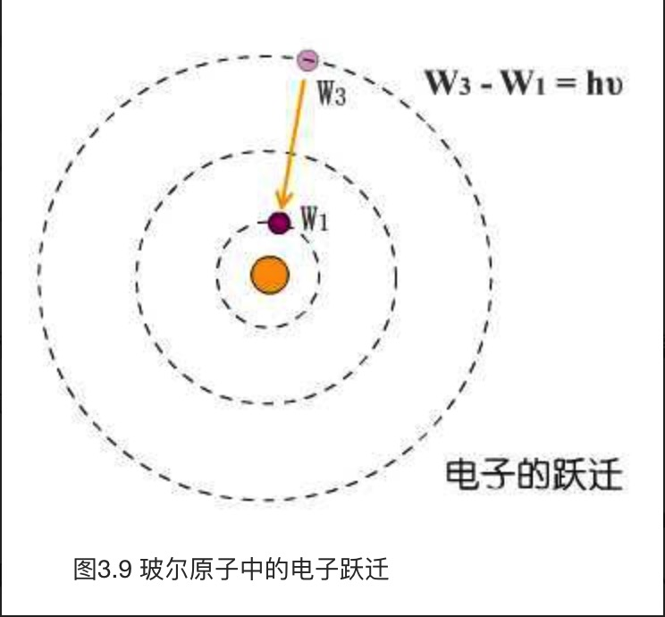

## 第四章 白云深处
回顾一下玻尔模型的一些基本特点。

首先，玻尔假设，电子在围绕原子核运转时，只能处于一些“特定的”能量状态中。这些能量状态是不连续的，称为定态。你可以有E1，可以有E2，但是不能取E1和E2之间的任何数值。正如我们已经描述过的那样，电子只能处于这些定态中，两个定态之间没有缓冲地带，那里是电子的禁区，电子无法出现在那里。玻尔规定：当电子处在某个定态的时候，它就是稳定的，不会放射出任何形式的辐射而失去能量。这样，就不会出现崩溃问题了。

玻尔也允许电子在不同的能量态之间转换，或者说，跃迁。电子从能量高的E2状态跃迁到E1状态，就放射出E2-E1的能量来，这些能量以辐射的方式释放，根据我们的基本公式，我们知道这辐射的频率为ν，从而使得E_2-E_1=hv。反过来，当电子吸收了能量，它也可以从能量低的状态攀升到一个能量较高的状态，其关系还是符合我们的公式。

根据玻尔模型，人们不久就发现，一个原子的化学性质，主要取决于它最外层的电子数量，并由此表现出有规律的周期性来，这就为周期表的存在提供了最好的理论依据。但是人们也曾经十分疑惑，那就是对于拥有众多电子的重元素来说，为什么它的一些电子能够长期地占据外层的电子轨道，而不会失去能量落到靠近原子核的低层轨道上去。这个疑问由年轻的泡利在1925年做出了解答：他发现，没有两个电子能够享有同样的状态，而一层轨道所能够包容的不同状态，其数目是有限的，也就是说，一个轨道有着一定的容量。当电子填满了一个轨道后，其他电子便无法再加入到这个轨道中来。

不幸住在高处的电子虽然入不敷出，却没有办法，因为楼下的便宜房间都住满了人，没法搬进去。叫苦不迭的他们把泡利那蛮横的规定称作`“不相容原理”（Exclusion Priciple）`。

德布罗意想到了爱因斯坦和他的相对论。他开始这样地推论：根据爱因斯坦那著名的方程，如果电子有质量m，那么它一定有一个内禀的能量$E=mc^{2}$。好，让我们再次回忆那个我说过很有用的量子基本方程，E=hν，也就是说，对应这个能量，电子一定会具有一个内禀的频率。这个频率的计算很简单，因为$mc^{2}=E=hv$，所以$v=mc^{2}/h$。

好。电子有一个内在频率。那么频率是什么呢？它是某种振动的周期。那么我们又得出结论，电子内部有某些东西在振动。是什么东西在振动呢？德布罗意借助相对论，开始了他的运算，结果发现……当电子以速度$v_0$前进时，必定伴随着一个速度为$c^{2}=v_0$的波……

电子在前进时，本身总是伴随着一个波。细心的读者可能要发出疑问，因为他们发现这个波的速度$c^{2}=v_0$将比光速还快上许多，但是这不是一个问题。德布罗意证明，这种波不能携带实际的能量和信息，因此并不违反相对论。

德布罗意把这种波称为“相波”（phase wave），后人为了纪念他，也称其为“德布罗意波”。计算这个波的波长是容易的，就简单地把上面得出的速度除以它的频率，那么我们就得到：$\lambda=(c^{2}/v_0)/(mc^{2}/h)=h/mv_0$。这个叫做`德布罗意波长公式`。

玻色把光看成是不可区分的粒子的集合，从这个简单的假设出发，他一手推导出了普朗克的黑体公式！爱因斯坦亲自把这篇重要的论文翻译成德文发表，他随即又进一步完善玻色的思想，发展出了后来在量子力学中具有举足轻重地位的`玻色-爱因斯坦统计方法`。服从这种统计的粒子（比如光子）称为“玻色子”（boson），它们不服从泡利不相容原理，这使得我们可以预言，它们在低温下将表现得非常不同，形成著名的`玻色-爱因斯坦凝聚现象`。

## 第五章 曙光
波恩和约尔当甚至把p×q和q×p之间的差值也算了出来，结果是这样的：

$pq-qp=\frac{h}{2\pi i}I$

h是我们已经熟悉的普朗克常数，i是虚数的单位，代表-1的平方根，而I叫做单位矩阵，相当于矩阵运算中的1。波恩和约尔当奠定了一种新的力学——`矩阵力学`的基础。

不过有一个例外，就是泡利，他一直对自旋深恶痛绝。在他看来，原本电子已经在数学当中被表达得很充分了——现在可好，什么形状、轨道、大小、旋转……种种经验性的概念又幽灵般地回来了。原子系统比任何时候都像个太阳系，本来只有公转，现在连自转都有了。他始终按照自己的路子走，决不向任何力学模型低头。事实上，在某种意义上泡利是对的，`电子的自旋`并不能想象成传统行星的那种自转，它具有1/2的量子数，也就是说，它要转两圈才露出同一个面孔，这里面的意义只能由数学来把握。

## 第六章 殊途同归
从经典力学的哈密顿-雅可比方程出发，利用变分法和德布罗意公式，最后求出了一个非相对论的波动方程，用希腊字母ψ来代表波的函数，最终形式是这样的：

$\Delta\Psi+\frac{8\pi^2m}{h^2}(E-V)\Psi=0$

这便是名震整部20世纪物理史的`薛定谔波动方程`。

三角▽叫做“拉普拉斯算符”，代表了某种微分运算。h是我们熟知的普朗克常数。E是体系总能量，V是势能，在原子里也就是$-\frac{e^{2}}{r}$。在边界条件确定的情况下求解这个方程，我们可以算出E的解来。

现在，我们能够非常形象地理解为什么电子只能在某些特定的能级上运行了。电子有着一个内在的波动频率。

就像电子轨道那样，那么这种“轨道”的大小显然也只能是某些特定值。如果一个波长20厘米，轨道的周长也就只能是20厘米的整数倍，不然就无法头尾互相衔接了。

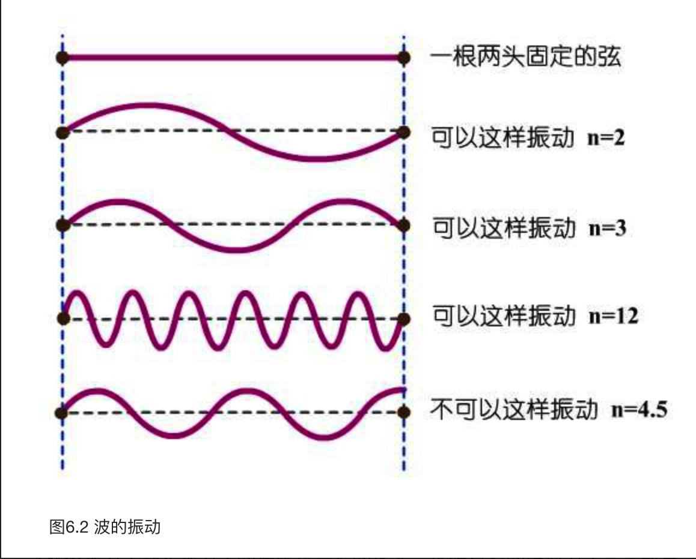

从数学上来说，这个函数叫做“本征函数”（Eigenfunction），求出的分立的解叫做“本征值”（Eigenvalue）。所以薛定谔的论文叫做《量子化是本征值问题》，从1926年1月起到6月，他一连发了四篇以此为题的论文，从而彻底地建立了另一种全新的力学体系——`波动力学`。

回顾一下量子论在发展过程中所经历的两条迥异的道路是饶有趣味的。第一种办法的思路是直接从观测到的原子谱线出发，引入矩阵的数学工具，用这种奇异的方块去建立起整个新力学的大厦来。它强调观测到的分立性，跳跃性，同时又坚持以数学为唯一导向，不为日常生活的直观经验所迷惑。但是，如果追究根本的话，它所强调的光谱线及其非连续性的一面，始终可以看到微粒势力那隐约的身影。这个理论的核心人物自然是海森堡，波恩，约尔当，而他们背后的精神力量，那位幕后的“教皇”，则无疑是哥本哈根的那位伟大的尼尔斯·玻尔。

而沿着另一条道路前进的人们在组织上显然松散许多。大致说来，这是以德布罗意的理论为切入点，以薛定谔为主将的一个派别。而在波动力学的创建过程中起到关键的指导作用的爱因斯坦，则是他们背后的精神领袖。但是这个理论的政治观点也是很明确的：它强调电子作为波的连续性一面，以波动方程来描述它的行为。它热情地拥抱直观的解释，试图恢复经典力学那种形象化的优良传统，有一种强烈的复古倾向，但革命情绪不如对手那样高涨。打个不太恰当的比方，矩阵方面提倡彻底的激进的改革，摒弃旧理论的直观性，以数学为唯一基础，是革命的左派。而波动方面相对保守，它强调继承性和古典观念，重视理论的形象化和物理意义，是革命的右派。

薛定谔，泡利，约尔当都各自证明了，两种力学在数学上来说是完全等价的！

骰子，这才是薛定谔波函数ψ的解释，它代表的是一种随机，一种概率，而决不是薛定谔本人所理解的，是电子电荷在空间中的实际分布。波恩争辩道，ψ,或者更准确一点，**ψ的平方，代表了电子在某个地点出现的“概率”。**

## 第七章 不确定性
你怎么能"看到"一个小球的位置呢？总得有某个光子从光源出发，撞到这个球身上，然后反弹到你的眼睛里吧？关键是，一个经典小球是个庞然大物，光子撞到它就像蚂蚁撞到大象，对它的影响小得可以忽略不计，绝不会影响它的速度。正因为如此，我们大可以测量了它的位置之后，再从容地测量它的速度，其误差微不足道。

“但是，我们现在在谈论电子！它是如此地小而轻，以致于光子对它的撞击决不能忽略不计了。测量一个电子的位置？好，我们派遣一个光子去执行这个任务，它回来怎么报告呢？是的，我接触到了这个电子，但是它给我狠狠撞了一下后，飞到不知什么地方去了，它现在的速度我可什么都说不上来。看，为了测量它的位置，我们剧烈地改变了它的速度，也就是动量。我们没法同时既准确地知道一个电子的位置，同时又准确地了解它的动量。”

海森堡飞也似地跑回研究所，埋头一阵苦算，最后他得出了一个公式：

$\Delta p \times \Delta q > \frac{h}{4\pi}$

△p和△q分别是测量p和测量q的误差，h是普朗克常数。海森堡发现，测量p和测量q的误差，它们的乘积必定要大于某个常数。如果我们把p测量得非常精确，也就是说△p非常小，那么相应地，△q必定会变得非常大，也就是说我们关于q的知识就要变得非常模糊和不确定。反过来，假如我们把位置q测得非常精确，p就变得摇摆不定，误差急剧增大。

假如我们把p测量得100％地准确，也就是说△p=0，那么△q就要变得无穷大。这就是说，假如我们了解了一个电子动量p的全部信息，那么我们就同时失去了它位置q的所有信息，我们一点都不知道，它究竟身在何方，不管我们怎么安排实验都没法做得更好。

海森堡的这一原理于1927年3月23日在《物理学杂志》上发表，被称作Uncertainty Principle。当它最初被翻译成中文的时候，被十分可爱地译成了`“测不准原理”`，不过现在大多数都改为更加具有普遍意义的`“不确定性原理”`。

海森堡很快又发现了另一对类似的仇敌，它们是能量E和时间t。只要能量E测量得越准确，时刻t就愈加模糊；反过来，时间t测量得愈准确，能量E就开始大规模地起伏不定。而且，它们之间的关系遵守类似的不确定性规则：

$\Delta E \times \Delta t > h$

一方面双缝实验和麦氏理论毫不含糊地揭示出光的波动性，另一方面光电效应，康普顿效应又同样清晰地表明它是粒子。就电子来说，玻尔的跃迁，原子里的光谱，海森堡的矩阵都强调了它不连续的一面，似乎粒子性占了上风，但薛定谔的方程却又大肆渲染它的连续性，甚至把波动的标签都贴到了它脸上。

毫无疑问，一个电子必须由粒子和波两种角度去作出诠释，任何单方面的描述都是不完全的。

一旦观察方式确定了，电子就要选择一种表现形式，它得作为一个波或者粒子出现，而不能再暧昧地混杂在一起。

波和粒子在同一时刻是互斥的，但它们却在一个更高的层次上统一在一起，作为电子的两面被纳入一个整体概念中。这就是`玻尔的“互补原理”（Complementary Principle）`，它连同`波恩的概率解释`，`海森堡的不确定性`，三者共同构成了量子论“哥本哈根解释”的核心，至今仍然深刻地影响着我们对于整个宇宙的终极认识。

量子世界的这种奇妙结合，就是大名鼎鼎的`“波粒二象性”`。

重温一下波和粒子在双缝前遇到的困境：电子选择左边的狭缝，还是右边的狭缝呢？现在我们知道，假如我们采用任其自然的观测方式，让它不受干扰地在空间中传播，这时候，电子波动的一面就占了上风。它于是以某种方式同时穿过了两道狭缝，自身与自身发生干涉，其波函数ψ按照严格的干涉图形花样发展。但是，当它撞上感应屏的一刹那，观测方式发生了变化！电子突然和某种实物产生了交互作用——我们现在在试图探测电子的实际位置了！于是突然间，粒子性接管了一切，这个电子凝聚成一点，按照ψ的概率随机地出现在屏幕的某个地方。

同时具有p和q的电子是不存在的！p和q也像波和微粒一样，在不确定原理和互补原理的统治下以一种此长彼消的方式生存。对于一些测量手段来说，电子呈现出一个准确的p，对于另一些测量手段来说，电子呈现出准确的q。我们能够测量到的电子才是唯一的实在，这后面不存在一个“客观”的，或者“实际上”的电子！

换言之，**不存在一个客观的，绝对的世界。唯一存在的，就是我们能够观测到的世界**。物理学的全部意义，不在于它能够揭示出自然“是什么”，而在于它能够明确，关于自然我们能“说什么”。没有一个脱离于观测而存在的“绝对自然”，只有我们和那些复杂的测量关系，熙熙攘攘纵横交错，构成了这个令人心醉的宇宙的全部。测量是新物理学的核心，测量行为创造了整个世界。

哥本哈根解释的基本内容，全都围绕着三大核心原理而展开。我们在前面已经说到，**首先，不确定性原理限制了我们对微观事物认识的极限，而这个极限也就是具有物理意义的一切。其次，因为存在着观测者对于被观测物的不可避免的扰动，现在主体和客体世界必须被理解成一个不可分割的整体。没有一个孤立地存在于客观世界的“事物”（being），事实上一个纯粹的客观世界是没有的，任何事物都只有结合一个特定的观测手段，才谈得上具体意义。对象所表现出的形态，很大程度上取决于我们的观察方法。对同一个对象来说，这些表现形态可能是互相排斥的，但必须被同时用于这个对象的描述中，也就是互补原理。**

**最后，因为我们的观测给事物带来各种原则上不可预测的扰动，量子世界的本质是“随机性”。传统观念中的严格因果关系在量子世界是不存在的，必须以一种统计性的解释来取而代之，波函数ψ就是一种统计，它的平方代表了粒子在某处出现的概率。当我们说“电子出现在x处”时，我们并不知道这个事件的“原因”是什么，它是一个完全随机的过程，没有因果关系。**

一个电子以奇特的分身术穿过双缝，它的波函数自身与自身发生了干涉，在空间中严格地，确定地发展。在这个阶段，因为没有进行观测，说电子在什么地方是没有什么意义的，只有它的概率在空间中展开。物理学家们常常摆弄玄虚说：“电子无处不在，而又无处在”，指的就是这个意思。然而在那以后，当我们把一块感光屏放在它面前以测量它的位置的时候，事情突然发生了变化！电子突然按照波函数的概率分布而随机地作出了一个选择，并以一个小点的形式出现在了某处。这时候，电子确定地存在于某点，自然这个点的概率变成了100％，而别的地方的概率都变成了0。也就是说，它的波函数突然从空间中收缩，聚集到了这一个点上面，在这个点出现了强度为1的高峰。而其他地方的波函数都瞬间降为0。

波函数这种奇迹般的变化，在哥本哈根派的口中被称之为`“坍缩”（collapse）`，每当我们试图测量电子的位置，它那原本按照薛定谔方程演变的波函数ψ便立刻按照那个时候的概率分布坍缩（我们记得ψ的平方就是概率），所有的可能全都在瞬间集中到某一点上。而一个实实在在的电子便大摇大摆地出现在那里，供我们观赏。

## 第九章 测量问题
每当我们一观测时，系统的波函数就坍缩了，按概率跳出来一个实际的结果，如果不观测，那它就按照方程严格发展。

这两种过程是如何转换的？是什么触动了波函数这种剧烈的变化？是“观测”吗？但是，我们这样讲的时候，用的语言是日常的，暧昧的，模棱两可的。我们一直理所当然地用使用“观测”这个词语，却没有给它下一个精确的定义。什么样的行为算是一次“观测”？

冯诺伊曼敏锐地指出，我们用于测量目标的那些仪器本身也是由不确定的粒子所组成的，它们自己也拥有自己的波函数。当我们用仪器去“观测”的时候，这只会把仪器本身也卷入到这个模糊叠加态中间去。

因为这台仪器本身也有自己的波函数，如果我们不“观测”这台仪器本身，它的波函数便也陷入一种模糊的叠加态中！诺伊曼的数学模型显示，当仪器测量电子后，电子的波函数坍缩了不假，但左/右的叠加只是被转移到了仪器那里而已。现在是我们的仪器处于指针指向左还是右的叠加状态了！假如我们再用仪器B去测量那台仪器A，好，现在A的波函数又坍缩了，它的状态变成确定，可是B又陷入模糊不定中……总而言之，当我们用仪器去测量仪器，这整个链条的最后一台仪器总是处在不确定状态中，这叫做`“无限后退”（infinite regression）。`

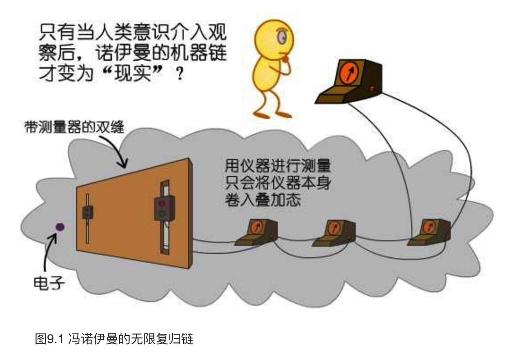

“维格纳的朋友”是他所想象的某个熟人，当薛定谔的猫在箱子里默默地等待命运的判决之时，这位朋友戴着一个防毒面具也同样呆在箱子里观察这只猫。维格纳本人则退到房间外面不去观测箱子里到底发生了什么。现在，对于维格纳来说，他对房间里的情况一无所知，他是不是可以假定箱子里处于一个（活猫/高兴的朋友）+（死猫/悲伤的朋友）的混合态呢？可是，当他事后询问那位朋友的时候，后者肯定会否认这一种叠加状态。维格纳总结道，当朋友的意识被包含在整个系统中的时候，叠加态就不适用了。即使他本人在门外，箱子里的波函数还是因为朋友的观测而不断地被触动，因此只有活猫或者死猫两个纯态的可能。

维格纳论证说，意识可以作用于外部世界，使波函数坍缩是不足为奇的。

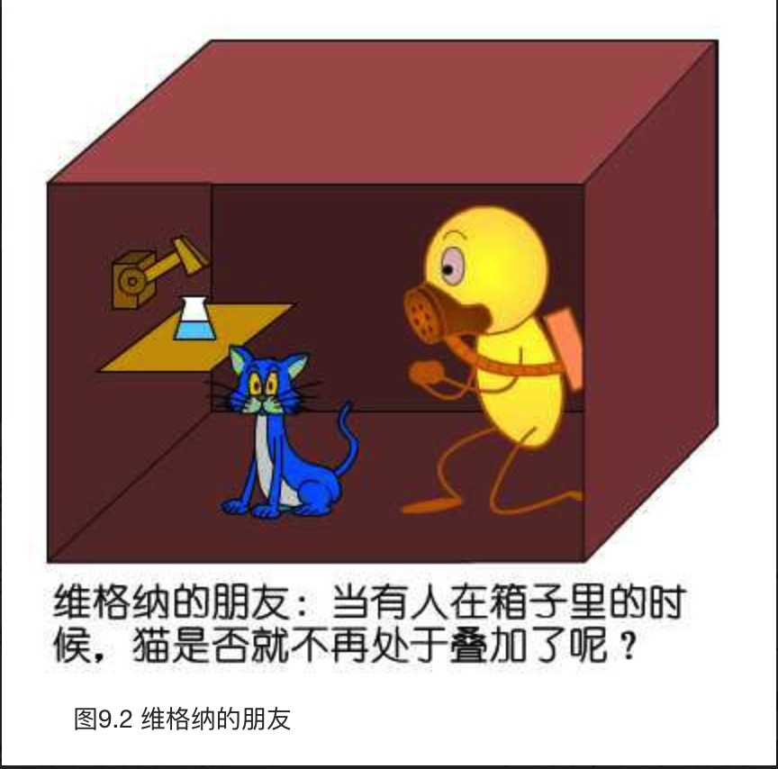

1979年是爱因斯坦诞辰100周年，在他生前工作的普林斯顿召开了一次纪念他的讨论会。在会上，爱因斯坦的同事，也是玻尔的密切合作者之一约翰·惠勒（John Wheeler）提出了一个相当令人吃惊的构想，也就是所谓的`“延迟实验”（delayed choice experiment）`。

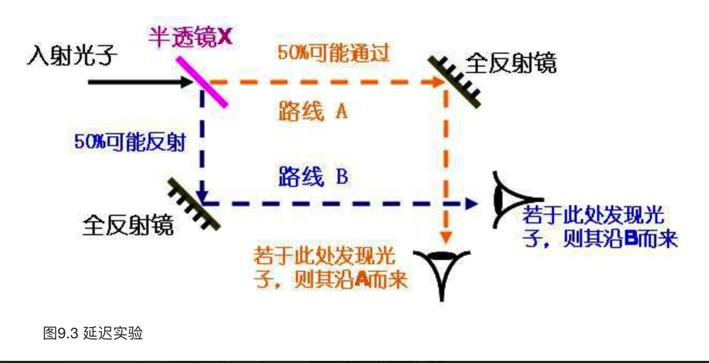

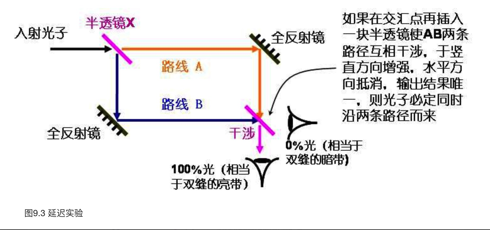

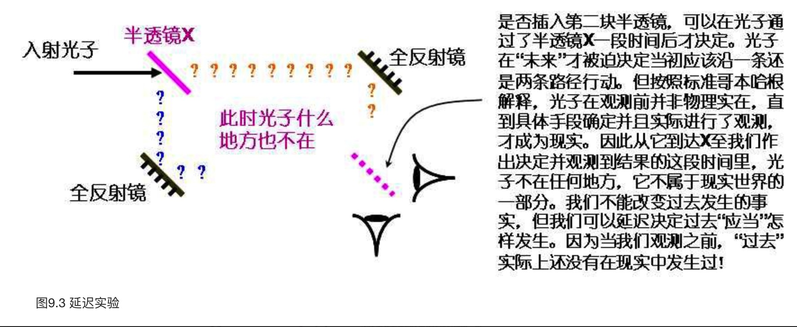

光子在通过第一块透镜到我们插入第二块透镜这之间“到底”在哪里，是个什么，是一个无意义的问题，我们没有权利去谈论它，它不是一个“客观真实”！

这说明，宇宙的历史，可以在它实际发生后才被决定究竟是怎样发生的！在薛定谔的猫实验里，如果我们也能设计某种延迟实验，我们就能在实验结束后再来决定猫是死是活！比如说，原子在1点钟要么衰变毒死猫，要么就断开装置使猫存活。但如果有某个延迟装置能够让我们在2点钟来“延迟决定”原子衰变与否，我们就可以在2点钟这个“未来”去实际决定猫在1点钟的死活！

这样一来，宇宙本身由一个有意识的观测者创造出来也不是什么不可能的事情。虽然宇宙的行为在道理上讲已经演化了几百亿年，但某种“延迟”使得它直到被一个高级生物所观察才成为确定。我们的观测行为本身参予了宇宙的创造过程！这就是所谓的`“参予性宇宙”模型（The Participatory Universe）`。

我们问：为什么宇宙恰好以这样一个不快也不慢的速度膨胀？`人择原理`的回答是：宇宙必须以这样一个速度膨胀，不然就没有“你”来问这个问题了。

参予性宇宙是增强的人择原理，它不仅表明我们的存在影响了宇宙的性质，更甚，我们的存在创造了宇宙和它的历史本身！可以想象这样一种情形：各种宇宙常数首先是一个不确定的叠加，只有被观测者观察后才变成确定。但这样一来它们又必须保持在某些精确的范围内，以便创造一个好的环境，令观测者有可能在宇宙中存在并观察它们！这似乎是一个逻辑循环：我们选择了宇宙，宇宙又创造了我们。这件怪事叫做“自指”或者“自激活”（self-exciting），意识的存在反过来又创造了它自身的过去！

电子即使在观测后仍然处在左/右的叠加，但是，我们的世界也只不过是叠加的一部分！当电子穿过双缝后，处于叠加态的不仅仅是电子，还包括我们整个的世界！也就是说，当电子经过双缝后，出现了两个叠加在一起的世界，在其中的一个世界里电子穿过了左边的狭缝，而在另一个里，电子则通过了右边！

波函数无需“坍缩”，去随机选择左还是右，事实上两种可能都发生了！只不过它表现为整个世界的叠加：生活在一个世界中的人们发现在他们那里电子通过了左边的狭缝，而在另一个世界中，人们观察到的电子则在右边！量子过程造成了“两个世界”！这就是量子论的`“多世界解释”（Many Worlds Interpretation，简称MWI）`。

多世界理论有时也称为`“平行宇宙”（Parallel Universes）理论`。

让我们回头来看一个量子过程，比如那个经典的双缝困境吧。正如我们已经反复提到的那样，如果我们不去观测电子究竟通过了哪条缝，它就应该同时通过两条缝而产生干涉。此时它的波函数是一个线性叠加，且严格按照薛定谔方程演化。也就是说，|ψ>可以表示为：

$|\psi \ge a | pass\ left > + b|pass\ right >$

如果我们不去干扰这个系统，则其按薛定谔波动方程严格地发展。为了表述方便，我们按照彭罗斯的话，把这称为`“U过程”`，它是一个确定的、严格的、经典的、可逆（时间对称）的过程。但值得一提的是，薛定谔方程是“线性”的，也就是说，只要|左>和|右>都是可能的解，则a|左>+b|右>也必定满足方程！不管U过程如何发展，系统始终会保持在线性叠加的状态。

只有当我们去观测电子的实际行为时，电子才被迫表现为一个粒子，选择某一条狭缝穿过。拿哥本哈根派的话来说，电子的波函数“坍缩”了，最终我们只剩下|左>或者|右>中的一个态独领风骚。这个过程像是一个奇迹，它完全按照概率随机地发生，也不再可逆，正如你不能让实际已经发生的事情回到许多概率的不确定叠加中去。还是按照彭罗斯的称呼，我们把这叫做`“R过程”`，其实就是所谓的`坍缩`。如何解释R过程的发生，这就是困扰我们的难题。哥本哈根派认为“观测者”引发了这一过程，个别极端的则扯上“意识”，那么，MWI又有何高见呢？

它的说法可能让你大吃一惊：根本就没有所谓的“坍缩”，R过程实际上从未发生过！从开天辟地以来，在任何时刻，任何孤立系统的波函数都严格地按照薛定谔方程以U过程演化！如果系统处在叠加态，它必定永远按照叠加态演化！

让我们来小心地看看埃弗莱特的假定：“任何孤立系统都必须严格地按照薛定谔方程演化”。所谓孤立系统指的是与外界完全隔绝的系统，既没有能量也没有物质交流，这是个理想状态，在现实中很难做到，所以几乎是不可能的。

MWI的关键在于：虽然宇宙只有一个波函数，但这个极为复杂的波函数却包含了许许多多互不干涉的“子世界”。宇宙的整体态矢量实际上是许许多多子矢量的叠加和，每一个子矢量都是在某个“子世界”中的投影，代表了薛定谔方程一个可能的解，但这些“子世界”却都是互相垂直正交，彼此不能干涉的！

我们假想一种没有维度的“质点人”。

我们的宇宙也是如此。“真实的，完全的”宇宙态矢量存在于一个非常高维（可能是无限维）的希尔伯特空间中，但这个高维的空间却由许许多多低维的“世界”所构成（正如我们的三维空间可以看成由许多二维平面构成一样），每个“世界”都只能感受到那个“真实”的矢量在其中的投影。因此在每个“世界”感觉到的宇宙都是不同的。但实际上，宇宙波函数是按照薛定谔方程演化的叠加态。

但还剩下一个问题：如果说每一种量子态代表一个“世界”，为什么我们感觉不到别的“世界”呢？而相当稀奇的是，未经观测的电子却似乎有特异功能，可以感觉来自“别的世界”的信息。比如不受观察的电子必定同时感受到了“左缝世界”和“右缝世界”的信息，不然如何产生干涉呢？这其实还是老问题：为什么我们一“观察”，量子层次上的叠加态就土崩瓦解，绝不会带到宏观世界中来？

非常妙的解释是：这牵涉到我们所描述“世界”的维数，或者说自由度的数量。在上面的例子中，我们举了A和B分别生活在x轴和y轴上的例子。因为x轴和y轴互相垂直，所以A世界在B世界上根本没有投影，也就是说，B完全无法感觉到A所生活的那个世界究竟是怎样的。但是，这是一个非常极端的例子，事实上如果我们在二维平面上随便取两条直线作为“两个世界”，则它们很有可能并不互相垂直。态矢量在这两个世界上的投影在很大程度上仍然是彼此“相干”（coherent）的，B仍然能够在很大程度上感受到A世界的观测结果，反之亦然。

**MWI的关键在于：虽然宇宙只有一个波函数，但这个极为复杂的波函数却包含了许许多多互不干涉的“子世界”。宇宙的整体态矢量实际上是许许多多子矢量的叠加和，每一个子矢量都是在某个“子世界”中的投影，代表了薛定谔方程一个可能的解，但这些“子世界”却都是互相垂直正交，彼此不能干涉的！**

但还剩下一个问题：如果说每一种量子态代表一个“世界”，为什么我们感觉不到别的“世界”呢？

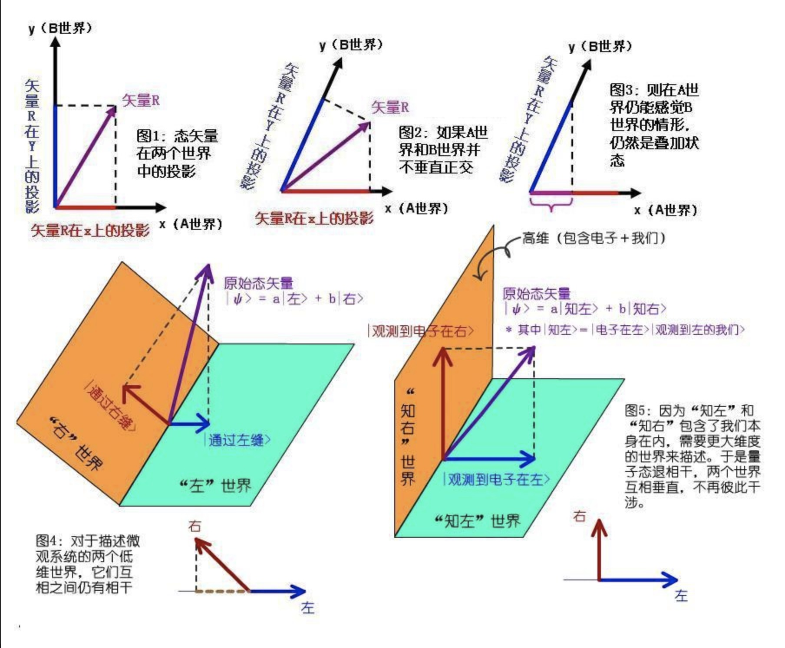

在双缝实验中，假如我们不考虑测量仪器或者我们自己的态矢量，不考虑任何环境的影响，单单考虑电子本身的态矢量的话，那么所涉及的变量是相对较少的，也就是说，单纯描述电子行为的“世界”是一个较低维的空间。我们在前面已经讨论过了，在双缝实验中，必定存在着两个“世界”：左世界和右世界。宇宙态矢量分别在这两个世界上投影为|通过左缝>和|通过右缝>两个量子态。但因为这两个世界维数较低，所以它们互相并不是完全垂直的，每个世界都还能清晰地“感觉”到另外一个世界的投影。这两个世界仍然彼此“相干”着！因此电子能够同时感觉到双缝而自我干涉。

当电子层次上的量子态叠加被仪器或者任何宏观事物放大，它们就不可避免地与环境发生干涉作用。其结果就是，我们所用于描述该态的“世界”的维数也就迅速增加，这直接导致了原本相干的两个投影变成基本垂直而互不干涉。这个过程叫做“离析”或者`“退相干”（decoherence）`，量子叠加态在宏观层面上的瓦解，正是退相干的直接后果。

## 第十章 不等式
MWI的一个副产品是，它重新回到了经典理论的决定论中去。因为就薛定谔方程本身来说，它是决定性的，也就是说，给定了某个时刻t的状态，我们就可以从正反两个方向推演，得出系统在任意时刻的状态。从这个意义上来说，时间的“流逝”不过是种错觉！另外，既然不存在“坍缩”或者R过程，只有确定的U过程，“随机性”便不再因人而异地胡搅蛮缠。从这个意义上说，上帝又不掷骰子了，他老人家站在一个高高在上的角度，鸟瞰整个宇宙的波函数，则一切仍然尽在把握：宇宙整体上还是严格地按照确定的薛定谔方程演化。

令人毛骨悚然和啼笑皆非的`“量子自杀”`实验在80年代末由Hans Moravec，Bruno Marchal等人提出，这实际上也是薛定谔猫的一个真人版。大家知道在猫实验里，如果原子衰变，猫就被毒死，反之则存活。对此，哥本哈根派的解释是：在我们没有观测它之前，猫是“又死又活”的，而观测后猫的波函数发生坍缩，猫要么死要么活。MWI则声称：每次实验必定同时产生一只活猫和一只死猫，只不过它们存在于两个平行的世界中。

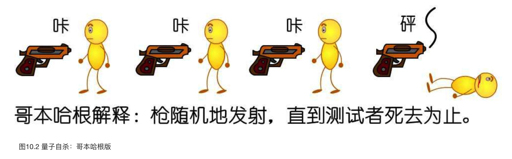

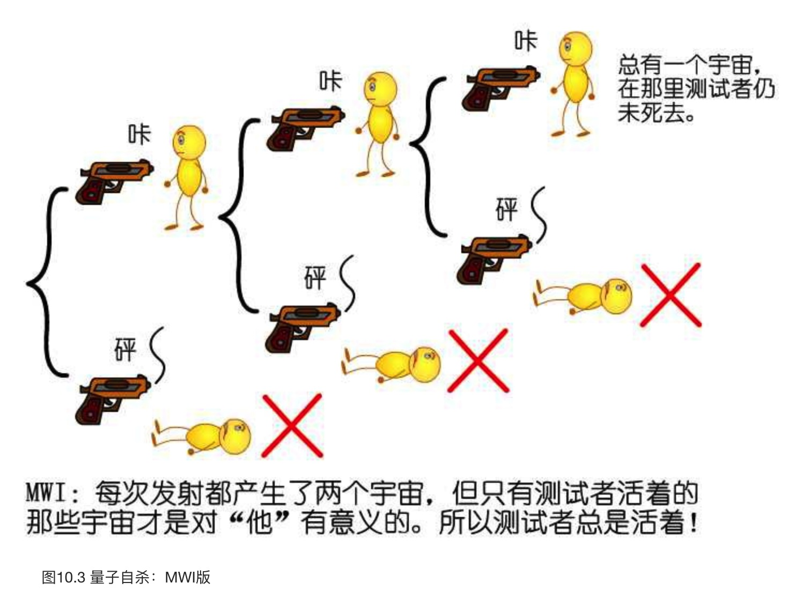

这就是从量子自杀思想实验推出的怪论，美其名曰`“量子永生”（quantum immortality）`。只要从主观视角来看，不但一个人永远无法完成自杀，事实上他一旦开始存在，就永远不会消失！总存在着一些量子效应，使得一个人不会衰老，而按照MWI，这些非常低的概率总是对应于某个实际的世界！如果多宇宙理论是正确的，那么我们得到的推论是：一旦一个“意识”开始存在，从它自身的角度来看，它就必定永生！（天哪，我们怎么又扯到了“意识”！）

这是最强版本的人择原理，也称为`“最终人择原理”`。

德义奇证明，量子计算机无法实现超越算法的任务，也就是说，它无法比普通的图灵机做得更多。从某种确定的意义上来说，量子计算机也是一种图灵机。但尽管如此，它和传统的机器不同，它的内态是不确定的，它同时可以执行多个指向下一阶段的操作。如果把传统的计算机称为决定性的图灵机（Deterministic Turing Machine, DTM），量子计算机则是非决定性的图灵机（NDTM）。德义奇同时证明，它将具有比传统的计算机大得多的效率。

玻姆的隐变量理论是德布罗意导波的一个增强版，只不过他把所谓的“导波”换成了“量子势”（quantum potential）的概念。在他的描述中，电子或者光子始终是一个实实在在的粒子，不论我们是否观察它，它都具有确定的位置和动量。但是，一个电子除了具有通常的一些性质，比如电磁势之外，还具有所谓的“量子势”。这其实就是一种类似波动的东西，它按照薛定谔方程发展，在电子的周围扩散开去。但是，量子势所产生的效应和它的强度无关，而只和它的形状有关，这使它可以一直延伸到宇宙的尽头，而不发生衰减。

在玻姆理论里，我们必须把电子想象成这样一种东西：它本质上是一个经典的粒子，但以它为中心发散出一种势场，这种势弥漫在整个宇宙中，使它每时每刻都对周围的环境了如指掌。当一个电子向一个双缝进发时，它的量子势会在它到达之前便感应到双缝的存在，从而指导它按照标准的干涉模式行动。如果我们试图关闭一条狭缝，无处不在的量子势便会感应到这一变化，从而引导电子改变它的行为模式。特别地，如果你试图去测量一个电子的具体位置的话，你的测量仪器将首先与它的量子势发生作用，这将使电子本身发生微妙的变化，这种变化是不可预测的，因为主宰它们的是一些“隐变量”，你无法直接探测到它们。

## 第十一章 上帝的判决
`“贝尔不等式”（Bell’s inequality）`:

$|P_{xz}-P_{zy}| \le 1 + P_{xy}$

Pxy代表了A粒子在x方向上为＋，而同时B粒子在y方向上亦为＋这两个事件的相关性。相关性是一种合作程度的体现（不管是双方出奇地一致还是出奇地不一致都意味着合作程度很高），而合作则需要双方都了解对方的情况，这样才能够有效地协调。在隐变量理论中，我们对于两个粒子的描述是符合常识的：无论观察与否，两个粒子始终存在于客观现实之内，它们的状态从分裂的一霎那起就都是确定无疑的。假如我们禁止宇宙中有超越光速的信号传播，那么理论上当我们同时观察两个粒子的时候，它们之间无法交换任何信息，它们所能达到的最大协作程度仅仅限于经典世界所给出的极限。这个极限，也就是我们用经典方法推导出来的贝尔不等式。

**如果世界的本质是经典的，具体地说，如果我们的世界同时满足：1.定域的，也就是没有超光速信号的传播。2.实在的，也就是说，存在着一个独立于我们观察的外部世界。那么我们任意取3个方向观测A和B的自旋，它们所表现出来的协作程度必定要受限贝尔不等式之内。** 也就是说，假如上帝是爱因斯坦所想象的那个不掷骰子的慈祥的“老头子”，那么贝尔不等式就是他给这个宇宙所定下的神圣的束缚。

但是，量子论的预言就不同了！贝尔证明，在量子论中，只要我们把x和y之间的夹角θ取得足够小，则贝尔不等式是可以被突破的！

量子世界的Bonnie&Clyde，即使他们相隔万里，仍然合作无间，按照哥本哈根解释，这是因为在具体地回答问题前，两个人根本不存在于“实在”之中，而是合为一体，按照波函数弥漫。用薛定谔发明的术语来说，在观测之前，两个人（粒子）处在一种“纠缠”（entanglement）的状态，他们是一个整体，具有一种“不可分离性”（inseparability）！

总而言之，如果世界是经典的，那么在EPR中贝尔不等式就必须得到满足，反之则可以突破。

爱因斯坦输了！实验结果和量子论的预言完全符合，而相对爱因斯坦的预测却偏离了5个标准方差——这已经足够决定一切。

定域的隐变量理论是不存在的！

换句话说，**我们的世界不可能如同爱因斯坦所梦想的那样，既是定域的（没有超光速信号的传播），又是实在的（存在一个客观独立的世界，可以为隐变量所确定地描述）**。定域实在性（local realism）从我们的宇宙中被实验排除了出去，现在我们必须作出艰难的选择：要么放弃定域性，要么放弃实在性。

**如果我们放弃实在性，那就回到量子论的老路上来，承认在我们观测之前，两个粒子不存在于“客观实在”之内**。它们不具有通常意义上的物理属性（如自旋），只有当观测了以后，这种属性才变得有意义。在EPR实验中，不到最后关头，我们的两个处于纠缠态的粒子都必须被看成一个不可分割的整体，那时在现实中只有“一个粒子”（当然是叠加着的），而没有“两个粒子”。所谓两个粒子，只有当观测后才成为实实在在的东西（波函数坍缩了）。当然，在做出了这样一个令人痛心的让步后，我们还是可以按照自己的口味不同来选择：**究竟是更进一步，彻底打垮决定论，也就是保留哥本哈根解释；还是在一个高层次的角度上，保留决定论，也即采纳多宇宙解释！**

这些开拓者的名字刻在路口的纪念碑上：Ghirardi，Rimini和Weber，下面是落成日期：1986年7月。为了纪念这些先行者，我们顺理成章地把这条道路以他们的首字母命名，称为GRW大道。

GRW的主要假定是，任何系统，不管是微观还是宏观的，都不可能在严格的意义上孤立，也就是和外界毫不相干。它们总是和环境发生着种种交流，为一些随机（stochastic）的过程所影响，这些随机的物理过程——不管它们实质上到底是什么——会随机地造成某些微观系统，比如一个电子的位置，从一个弥漫的叠加状态变为在空间中比较精确的定域（实际上就是哥本哈根口中的“坍缩”），尽管对于单个粒子来说，这种过程发生的可能性是如此之低——按照他们原本的估计，平均要等上$10^{16}$秒，也就是近10亿年才会发生一次。所以从整体上看，微观系统基本上处于叠加状态是不假的，但这种定域过程的确偶尔发生，我们把这称为一个`“自发的定域过程”`（spontaneous localization）。GRW有时候也称为“自发定域理论”。

Ghirardi等人把薛定谔方程换成了所谓的密度矩阵方程，他们发现，因为整个系统中的粒子实际上都是互相纠缠在一起的，少数几个粒子的自发定域会非常迅速地影响到整个体系，就像推倒了一块骨牌然后造成了大规模的多米诺效应。最后的结果是，整个宏观系统会在极短的时间里完成一次整体上的自发定域。

如果真的是这样，那么当决定薛定谔猫的生死的那一刻来临时，它的确经历了死/活的叠加！只不过这种叠加只维持了非常短，非常短的时间，然后马上“自发地”精确化，变成了日常意义上的，单纯的非死即活。

## 第十二章 新探险
换句话说，“通过左缝”和“通过右缝”这两种历史不是独立自主的，而是互相纠缠在一起，它们之间有干涉项。当我们计算“电子通过左缝或者通过右缝”这样一种情况的时候，我们得到的并非一个传统的概率，干脆地说，这样一个“联合历史”是没有概率的！

魔术的秘密在这里：当我们不关心一场比赛的具体比分，而只关心其胜负关系的时候，我们实际上忽略了许多信息。比如说，当我们讨论一种历史是“胜，胜，平，负，胜，负……”，而不是具体的比分的时候，我们实际上构建了一种“粗略的”历史。在每一轮联赛中，我们观察到的态Ak都包含了无数种更加精细的态。例如当我们说第二轮球队“胜”的时候，其中包括了1:0，2:1，2:0，3:1……所有可以归纳为“胜”的具体赛果。在术语中，我们把每一种具体的可能比分称为`“精粒历史”（fine-grained history）`，而把类似“胜”，“负”这样的历史称为`“粗粒历史”（coarse-grained history）`。

当我们计算“胜”和“平”之间的关系时，我们实际上计算了所有包含在它们之中的“精粒历史”之间的关系！如果我们把“胜”和“平”放到矩阵中去计算，我们的确也会得到干涉项如（胜，平），但这个干涉项是什么呢？它是所有组成两种粗粒历史的精粒历史的干涉之和！也就是说，它包括了“1:0和0:0之间的干涉”，“1:0和1:1之间的干涉”，“2:0和1:1之间的干涉”……等等。总之，每一对可能的干涉都被计算在内了，我们惊奇地发现，所有这些干涉加在一起，正好抵消了个干净。当最后的结果出来时，“胜”和“平”之间的干涉项即使没有完全消失，也已经变得小到足以忽略不计。“胜”和“平”两种粗粒历史不再相干，它们“退相干”了！

在量子力学中，我们具体可以采用所谓的`“路径积分”（path integral）`的办法，构造出一个“退相干函数”来计算所有的这些历史。

按照`退相干历史（DH）`的解释，假如我们把宇宙的历史分得足够精细，那么实际上每时每刻都有许许多多的精粒历史在“同时发生”（相干）。比如没有观测时，电子显然就同时经历着“通过左缝”和“通过右缝”两种历史。但一般来说，我们对于过分精细的历史没有兴趣，我们只关心我们所能观测到的粗粒历史的情况。因为互相脱散（退相干）的缘故，这些历史之间失去了联系，只有一种能够被我们感觉到。

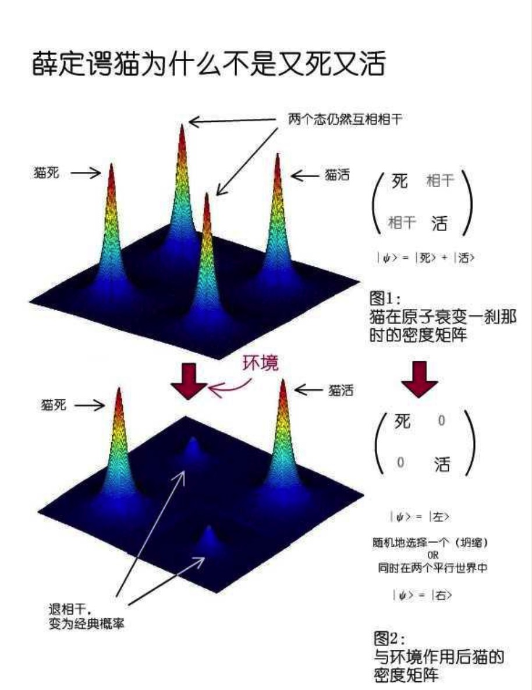

如果DH解释是正确的，那么我们每时每刻其实都经历着多重的历史，世界上的每一个粒子，事实上都处在所有可能历史的叠加中！但一旦涉及到宏观物体，我们所能够观察和描述的则无非是一些粗粒化的历史，当细节被抹去时，这些历史便互相退相干，永久地失去了联系。比方说如果最终猫还活着，那么“猫死”这个分支就从历史树上被排除了，按照奥卡姆剃刀，我们不妨说这些历史已经不存在于宇宙之中。

DH的本意是推翻教科书上的哥本哈根解释，把观测者从理论中赶出去，还物理世界以一个客观实在的解释。也就是说，所有的物理属性都是超越于你我的观察之外独立存在的，它不因为任何主观事物而改变。但现在DH似乎是哑巴吃黄连——有苦说不出。“1:0的历史究竟是否为真”这样一个物理描述，看来的确要取决于历史族的选择，而不是“客观存在”的！这似乎和玻尔他们是殊途同归：宇宙中没有纯粹的客观的物理属性，所有的属性都只能和具体的观察手段连起来讲！

但DH的支持者辩护说，任何理性的逻辑推理（reasoning），都只能用在同一个退相干家族中，而不能跨家族使用。比如当我们在“胜，平，负”这样一族历史中得到了“1:0的精粒历史发生了”这样一个结论后，我们绝不能把它带到另一族历史（比如“没进球，进1球，进2球，进2球以上”）中去，并与其相互比较。他们把这总结成所谓的`“同族原则”（single family rule）`，并宣称这是量子论中最重要的原则。
