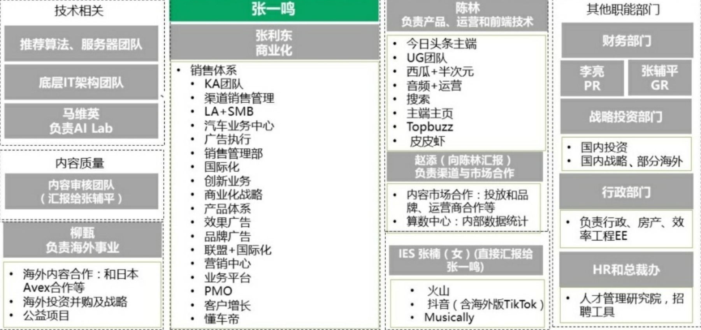
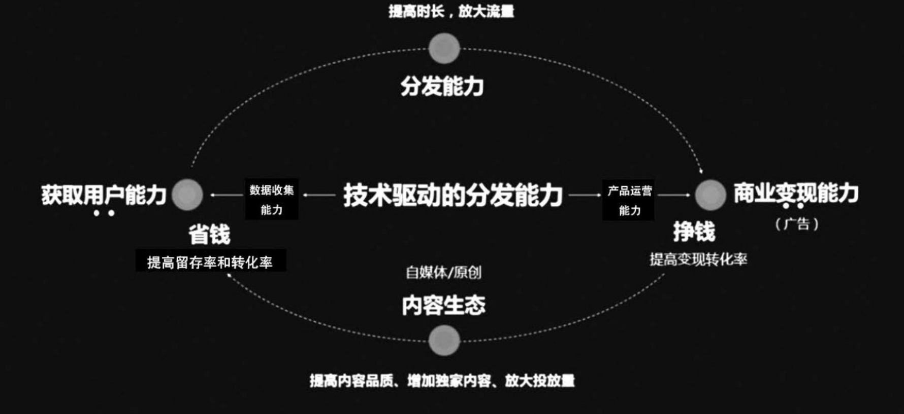
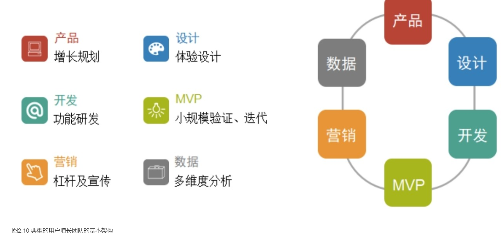
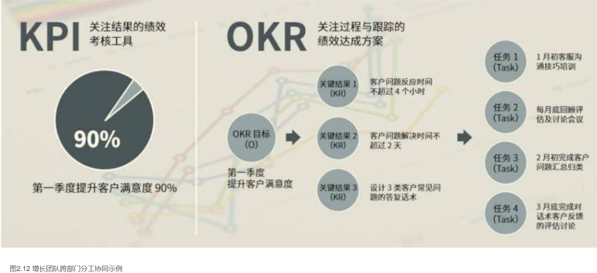
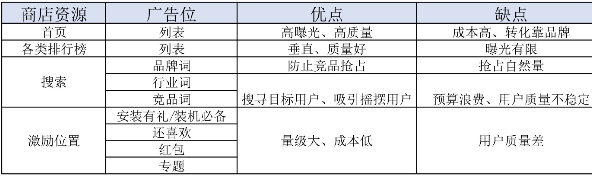
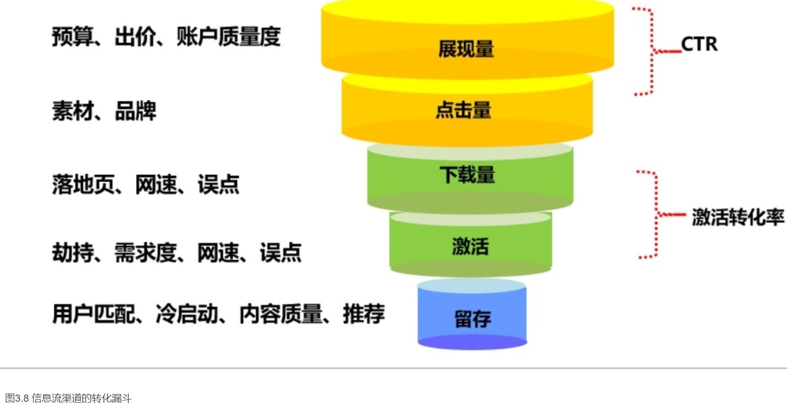
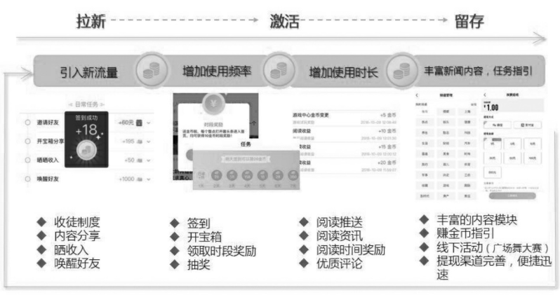
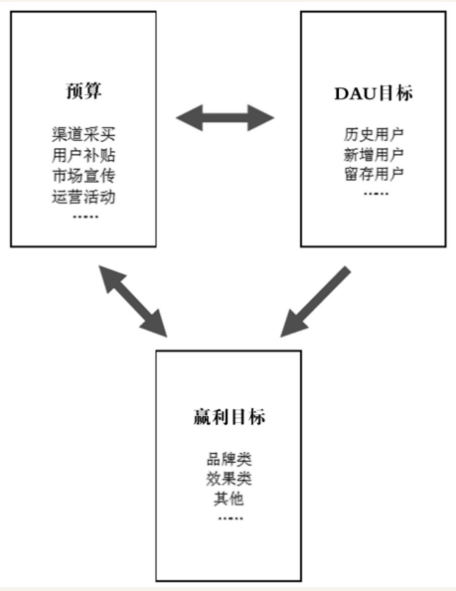
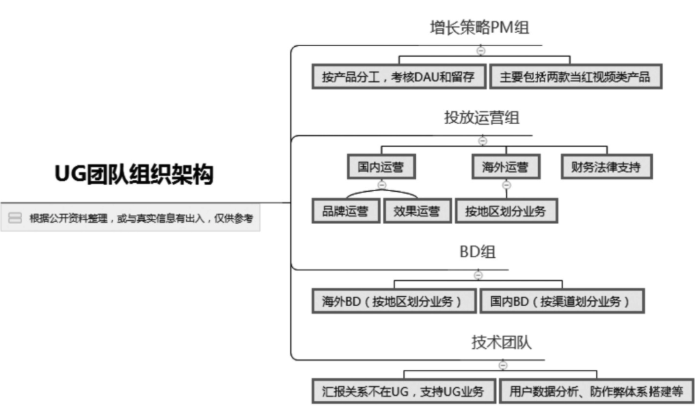
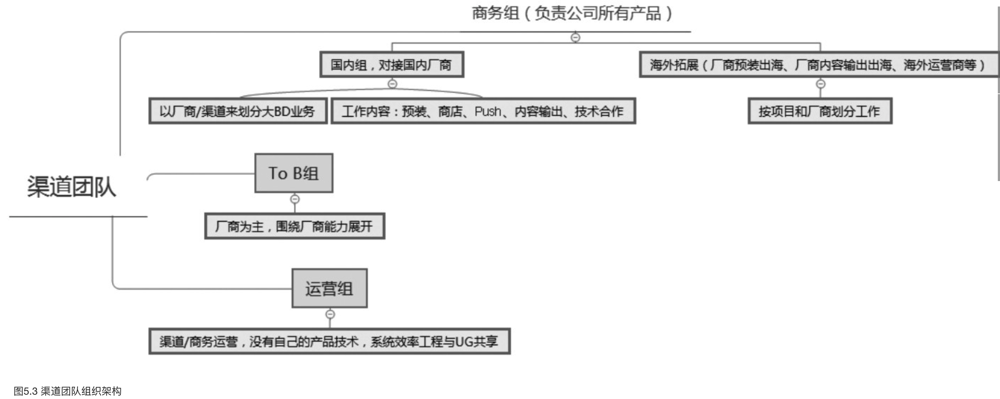

    作者: 岳建雄 主编
    出版社: 电子工业出版社
    副标题: 移动互联网商业模式下的用户增长
    出版年: 2019-5
    页数: 292
    定价: 69元
    装帧: 平装-胶订
    ISBN: 9787121361913

[豆瓣链接](https://book.douban.com/subject/33417653/)

- [自序](#自序)
- [第1章 不增长就出局，用户增长时代来临](#第1章-不增长就出局用户增长时代来临)
  - [1.1 用户增长概念的本土化，如何理解 AARRR漏斗模型](#11-用户增长概念的本土化如何理解-aarrr漏斗模型)
    - [1.1.1 从字节跳动公司的案例说起](#111-从字节跳动公司的案例说起)
    - [1.1.2 从运营、产品、技术、市场、渠道对用户增长的理解到AARRR漏斗模型](#112-从运营产品技术市场渠道对用户增长的理解到aarrr漏斗模型)
- [第2章 移动互联网产品的本质与用户增长团队的搭建](#第2章-移动互联网产品的本质与用户增长团队的搭建)
  - [2.1 移动互联网产品的本质与信息流战争](#21-移动互联网产品的本质与信息流战争)
    - [2.1.1 移动互联网产品商业模式分析](#211-移动互联网产品商业模式分析)
      - [1.用户获取](#1用户获取)
      - [2.商业变现](#2商业变现)
      - [3.内容生态](#3内容生态)
      - [4.内容分发](#4内容分发)
    - [2.1.2 信息流战争](#212-信息流战争)
      - [1.社交流与推荐流的内核不同](#1社交流与推荐流的内核不同)
      - [2.社交流与推荐流的内容特点不同](#2社交流与推荐流的内容特点不同)
      - [3.移动互联网生态将从开放分享走进垄断与封闭](#3移动互联网生态将从开放分享走进垄断与封闭)
      - [4.社交流与推荐流就是硬币的两面](#4社交流与推荐流就是硬币的两面)
  - [2.2 如何理解用户增长的模块和角色划分](#22-如何理解用户增长的模块和角色划分)
    - [2.2.1 你是否真正认识产品经理](#221-你是否真正认识产品经理)
    - [2.2.2 你是否真正认识运营经理](#222-你是否真正认识运营经理)
      - [1.流量运营](#1流量运营)
      - [2.用户运营](#2用户运营)
      - [3.活动运营](#3活动运营)
      - [4.内容运营](#4内容运营)
    - [2.2.3 用户增长经理与渠道经理的区别和联系](#223-用户增长经理与渠道经理的区别和联系)
  - [2.3 打破“筒仓效应”，搭建高效运转的用户增长团队](#23-打破筒仓效应搭建高效运转的用户增长团队)
    - [用户增长团队常见的人员构成是怎样的？](#用户增长团队常见的人员构成是怎样的)
    - [如果目前是筒仓结构，如何快速组建增长团队？](#如果目前是筒仓结构如何快速组建增长团队)
- [第3章 两种流量获取模型下的用户增长方法](#第3章-两种流量获取模型下的用户增长方法)
  - [3.1 采购型流量的获取方式与用户增长](#31-采购型流量的获取方式与用户增长)
    - [3.1.1 应用商店下载与用户增长](#311-应用商店下载与用户增长)
      - [1.CPD，按下载量付费](#1cpd按下载量付费)
      - [2.CPT，按时长计费投放广告](#2cpt按时长计费投放广告)
      - [3.CPM，按曝光计费投放广告](#3cpm按曝光计费投放广告)
        - [3.1.2 SEM、CPC与用户增长](#312-semcpc与用户增长)
        - [3.1.3 厂商及方案预装与用户增长](#313-厂商及方案预装与用户增长)
        - [3.1.4 网盟与CPA](#314-网盟与cpa)
        - [3.1.5 浏览器、WAP流量与用户增长](#315-浏览器wap流量与用户增长)
  - [3.2 分散型流量的获取与用户增长](#32-分散型流量的获取与用户增长)
    - [3.2.1 如何通过社交裂变实现低成本引流](#321-如何通过社交裂变实现低成本引流)
    - [3.2.2 通过活动商城提升产品运营能力](#322-通过活动商城提升产品运营能力)
    - [3.2.3 如何用金币系统建立良好的用户生态体系](#323-如何用金币系统建立良好的用户生态体系)
    - [3.2.4 网赚模式大行其道下的收徒拉新策略](#324-网赚模式大行其道下的收徒拉新策略)
    - [3.2.5 使用一元夺宝模式精准获取用户](#325-使用一元夺宝模式精准获取用户)
- [第4章 数据驱动的用户获取能力](#第4章-数据驱动的用户获取能力)
  - [4.1 用户运营过程中的数据分析指标](#41-用户运营过程中的数据分析指标)
    - [4.1.1 用户留存率](#411-用户留存率)
    - [4.1.2 用户行为指标](#412-用户行为指标)
      - [1.黏性指标：打开次数](#1黏性指标打开次数)
      - [2.活跃指标：使用时长](#2活跃指标使用时长)
      - [3.产出指标：人均曝光和点击](#3产出指标人均曝光和点击)
    - [4.1.3 活动运营数据分析指标](#413-活动运营数据分析指标)
  - [4.2 用户增长过程中的几种数据模型](#42-用户增长过程中的几种数据模型)
    - [4.2.1 财务模型](#421-财务模型)
    - [4.2.2 增长模型](#422-增长模型)
    - [4.2.3 数据波动分析的参考数据项](#423-数据波动分析的参考数据项)
      - [1.找问题人群—端龄](#1找问题人群端龄)
      - [2.找问题位置](#2找问题位置)
    - [4.2.4 数据报表](#424-数据报表)
- [第5章 通过产品分析确定用户增长策略](#第5章-通过产品分析确定用户增长策略)
  - [5.1 字节跳动公司是如何做用户增长的](#51-字节跳动公司是如何做用户增长的)
    - [5.1.1 搭建一个独立的战斗力强悍的用户增长团队](#511-搭建一个独立的战斗力强悍的用户增长团队)
    - [5.1.2 掌握有效的用户增长工作方法](#512-掌握有效的用户增长工作方法)
    - [5.1.3 要学会砸钱，也要舍得砸钱](#513-要学会砸钱也要舍得砸钱)
- [第6章 在产品生命周期内的用户获取能力](#第6章-在产品生命周期内的用户获取能力)

# 自序
由于电信运营商大量对终端智能手机的补贴，中国移动互联网在2012年迎来了3G手机大量普及与移动互联网用户大爆发的一年。

我也发现在那个时间窗口，手机预装是最快、最有效的一个渠道，而且不花钱。很快我通过各种办法，克服了各种困难，通过竞标进入中国电信的预算名单，把搜狐新闻客户端装进了当时中国电信定制的绝大多数安卓智能手机里，超过1亿台的手机预装早期是不用钱或者用很少的钱的，用钱的平均价格也很低，安装0.4元/台，激活1.5元/个，搜狐新闻客户端也在2013年年初成为当时中国第一个用户量过亿、DAU过千万的新闻客户端。

在负责全部业务后，我发现获取用户只是产品的一个环节，一个产品要成功，涉及的用户增长环节非常多。拉新进来以后还有很多环节与用户增长相关，如产品体验好坏会影响用户留存，手机的厂商适配、Push与进程、用户漏斗与链路优化、渠道来源与冷启动、活动引导、召回、商业变现能力等都会影响用户的留存与增长。这些涉及每一个环节的每一个项目相关人员，有产品经理、运营经理、渠道经理、算法推荐工程师、应用开发工程师等，非常复杂，把用户增长与留存这个 KPI 单独下发给任何一个部门，都无法独立完成目标并为结果负责。2013年下半年，搜狐新闻客户端的DAU最高到1800多万，每天新增30多万。然后随着用户对产品要求的提高，竞品对渠道增长的重视及对产品与内容差异化的提升，我们的用户留存开始下降，DAU 在新增无法持续的情况下也开始下滑。由于当时还没有开始大规模地商业化变现，手机厂商把预装价格从原来的0.4元/台涨到0.6～0.8元/台的时候，不敢全力跟进，一度我也非常困惑，用户如何增长呢？这个困惑一直延续到2014年6月份，由于用户开始不再增长，提高用户留存也缺少办法，部门员工流失大量增加，我也开始萌生离意。

那时张一鸣非常有激情，表示他要在2014年年底将用户数做到3000万，当时今日头条的DAU只有1000万出头，半年左右做到3000万我觉得几乎是天方夜谭。搜狐新闻客户端当时的 DAU 最高时也没超过 2000 万，然后就一直没有突破。我问他有什么好办法，他说**今日头条本质上就是浏览器，UC与QQ浏览器的用户多，今日头条就是浏览器的2.0，移动互联网的用户未来不需要浏览器，他可以从浏览器那切走一部分用户，另外他开始重视手机厂商的预装**。

在用户推荐留存与精准度上，张一鸣当时提到，通过 A/B 测试发现，获取用户通讯录可以大幅提升算法的精准度，因获取用户通讯录对用户的骚扰而导致用户的流失率只增加 1%左右，但我很惊讶的是，今日头条系列产品直到 2016年年底才在微头条上线后开始大规模向用户要通讯录。后来我想了想，猜测张一鸣克制这么长时间的原因如下：

1. 当时今日头条只有 1000 万 DAU 的用户规模，就算取到了通讯录，对用户也没有太多好处，因为用户的大部分好友不在这里，发挥不了协同效应，容易让用户反感。
1. 用户当时只有资讯浏览需求，没有需要用户通讯录的场景。而当用户规模达到近亿的时候，微头条上线了，这时候协同与场景都有了，要通讯录就变得自然很多。而且今日头条取到通讯录后把社交关系又同步给了“字节系”的其他产品，如抖音、西瓜、火山、皮皮虾等，这也是“字节系”产品迅速增长的一个秘密。

关于竞争对手，在聊的过程中我问到谁是他的最大竞争对手，他当时表示最害怕的是百度，认为最好的算法人才在百度，百度也最有实力来做信息流业务。但当时百度因为搜索业务上的强大，并没有意识到信息流业务后来可能 OTT （Over The Top，过顶传球，意思是通过另一种方式超越）搜索。2015年今日头条开始建立头条号自媒体生态平台，从百度挖来算法核心人才，还挖来了新浪的副总编辑赵添做头条号的整体运营，也引入了包括搜狐在内的一些传统门户的人负责内容的采购与运营。这个内容生态平台的成功不仅解决了今日头条内容版权的问题，也拉开了今日头条与各传统门户的距离，因为从有头条号自媒体生态平台开始，今日头条不仅在技术算法上比传统门户更先进，且在内容质量与内容生态数量上也远远超过了除微信外的其他内容平台。由于内容质量与类型的增加，用户留存得到提升，用户群也不断扩大。

当2017年百度真正意识到信息流的重要性时，字节跳动公司已经长大，并且趋势不可逆转，在2018年抖音爆发后，字节跳动公司的估值达到750亿美元，超过百度。

百度后来对其僵化的组织进行了重大的调整，成立了信息流部门，李彦宏亲自带头，放在向海龙的大搜索部门下面，大搜索可以提供强大的变现能力与手机百度入口，由沈抖统一负责技术、产品和运营，开始重视用户增长与内容，在预装与市场投放上大力砸钱，开始重建百家号内容生态体系，很快百度花了一年多的时间就把信息流业务做了起来，DAU 也达到了 1.6 亿。不仅如此，百度还发力短视频领域，开始做好看视频与全民小视频，赞助2019年的春晚，大做送红包集卡活动，也迎来了百度用户增长的一个回春。在收入上2018年超过了1000亿元，是字节跳动公司的 2 倍，这说明百度仍然拥有超强的商业变现能力。2019 年的春晚红包大战，百度完成了一次对字节跳动公司的逆袭，百度App的用户数峰值超过3亿，好看视频超过3000万，就连全民小视频也摸高到1000万后回落，而今日头条与西瓜视频的用户数这期间稍有回落。很多人可能不知道，为了准备这次春晚活动，百度下足了决心，除了发红包的9个亿，还增加了3万台服务器，单是增加服务器的投入就超过了红包的投入。可以看出，在错过时间窗口后获取用户的代价是非常大的。

无论是创业还是做产品，本质上都是商业行为，是商业行为就要关注用户需求与用户投入产生的回报。**本质上就是如何更低成本地获取用户，更高效率地实现商业变现，并在获取用户成本与商业变现之间取到一个好的ROI（投资回报率），这个ROI的模型应该做到，用户量越大，成本还能比较稳定，而变现能力却能越来越高，ROI一直保持良性的平衡可持续性，这就是用户增长的本质**。

理解这个道理之后，会发现做什么产品都比较简单了，结果好坏就跟产品的行业赛道、时间窗口、执行人的能力、公司所拥有的资源相关了。无论用户增长做好做坏，你能知道是什么原因，该不该继续花钱，该用什么方式去发展用户，知道盯着数据做运营。

# 第1章 不增长就出局，用户增长时代来临
## 1.1 用户增长概念的本土化，如何理解 AARRR漏斗模型
增长黑客之父Qualaroo创始人兼首席执行官Seam Ellis在提出`增长黑客`（Growth Hacker）的概念时给出的一个定义：

>A growth hacker is a person whose true north is growth.

### 1.1.1 从字节跳动公司的案例说起
字节跳动公司最强的能力不只是算法，更核心的是它的产品运营能力和商业变现能力。字节跳动公司的组织架构图，如图1.1所示。

图1.1 字节跳动公司的组织架构图

字节跳动公司真正与业务相关的有三个团队：以算法为核心的技术团队、强大的商业化变现团队、互联网无敌的用户增长团队（产品运营与UG）。

如果说阿里巴巴打造了一个使命愿景驱动的优秀组织，那么字节跳动公司正在创造一个数据智能驱动的同样优秀的组织。字节跳动公司的前台 App 挺多，后台OP 系统也挺多，除部分 PM、工程和运营人员是强产品线相关的，其他大量研发、数据和业务中台人员都是高度复用的。据说，搞数据和算法的工程师有好几百，搞内容审核和标注的人有一万多，搞销售和执行信息流广告的人有一万多。一个聪明的 CEO，指挥一堆科学家做机器人，然后机器人指挥一堆手按规则和流程干活，这些活再输入给机器，机器再每天给几亿用户提供资讯服务，每天给几百万商家提供广告服务，精确、高效，多好。

字节跳动公司其实也是一个 App 工厂，工厂里做研发的人占比并不大，但研发是核心竞争力，工厂里的工人和销售往往很多，这里说的研发就是算法与产品人员，工人就是内容审核与标注人员，销售就是广告商业化团队。这不就是典型的工厂模式吗？

我们还能从这张架构图里清晰地看到，站在 C 位的是商业化与用户增长团队（包括产品、运营和 UG），技术与其他职能部门则被作为基础支撑列在两边。

我们再来看看字节跳动公司的产品运营体系，除了今日头条主端、社交互动社区类产品、西瓜视频、音频、搜索、海外产品等很多产品部门，还独立设有一个叫UG的部门。UG就是`User Growth`，UG部门就是做用户增长的部门。

这个部门目前的规模有200多人，负责“头条系”所有产品线的用户增长，可见其重要性。实际上，字节跳动公司还有一个渠道部门，负责预装、手机厂商与应用商店的投放，它不属于用户增长部门，这个部门与技术部门一起划入基础支撑部门，是可预知的市场渠道部门，其实也是一个用户采购部门。

字节跳动公司的UG部门大概就是领了除渠道部门之外的用户增长任务。具体工作可分为以下几个部分。

- 第一，做分享回流。互联网公司最有效的拉新手段，除了在预装、投放上进行大量“烧钱”，便是社交分享回流。无论是发放红包还是分享内容，都是为了提升拉新、Deeplink拉活的效率。
- 第二，做活动。比如曾刷屏的百万红包、集卡分钱等各种拉新与培育用户忠诚度的活动。相比活动运营佼佼者趣头条，今日头条玩得更好。很多人可能不知道，今日头条在主版之外还有一个极速版，它的用户数已经全面超过风头正盛的趣头条，而它的主要玩法、任务系统与趣头条非常相似，主要用于区分主线人群和渠道。
- 第三，通过技术来投放各个非手机厂商与应用商店渠道。比如海外的Facebook、Google Play，通过技术手段可降低获客成本。今日头条的技术投放策略很典型，早期百度还允许今日头条投放时，今日头条在百度做了拓词的投放。一般我们在百度进行渠道投放时，只知道投放相关的关键字，这种常规操作的结果是量少、多家竞价、转化效果不佳，而且成本非常高。而今日头条创新性地利用每天百度新产生的大量没有人竞价的关键词进行拓词，通过技术手段自动生成聚合这些关键字的落地页，然后在百度进行投放。这样做的好处是量大而且价格便宜，落地页聚合的内容本身比百度的还好，用户转化效果自然就非常理想了，大大降低了渠道投放的成本。
-  第四，提高“头条系”各个应用之间的资源共享使用效率。这些分散的应用在用户对象与场景上有一定的互补性，它们之间共享数据、用户画像、互推，可相互导量与拉活。比如内涵段子被强行关闭之后，大量用户跑到抖音。字节跳动公司仅利用几个月时间便做出了皮皮虾，又将这部分用户召回，抖音又利用广告余量把乐于评论段子的用户洗出来，重新引导到皮皮虾上，皮皮虾的用户量迅速增长起来。

### 1.1.2 从运营、产品、技术、市场、渠道对用户增长的理解到AARRR漏斗模型
AARRR是Acquisition、Activation、Retention、Revenue、Refer 5个单词的缩写，分别对应一款移动产品（应用）生命周期中的5个重要环节。

1. 用户获取（Acquisition）
2. 提高活跃度（Activation）
3. 提高留存率（Retention）
4. 获取收入（Revenue）
5. 传播推荐（Referral）

# 第2章 移动互联网产品的本质与用户增长团队的搭建
## 2.1 移动互联网产品的本质与信息流战争
### 2.1.1 移动互联网产品商业模式分析
一张信息流形式的移动互联网产品商业模式图，如图2.1所示。

图2.1 信息流形式的移动互联网产品商业模式图

一款信息流形式的移动互联网产品基本上由4个模块组成：用户获取、商业变现、内容生态、内容分发。

#### 1.用户获取
2013年至2014年，本书主编还在搜狐负责搜狐移动新媒体业务。当时手机厂商的预装价格，按安装量计算，一个用户的成本是0.4～0.6元；按激活量计算会更贵，一个用户的成本达到1.5～2元。

单个用户的成本为5～10元，如果要激活一个用户，则要到20～50元，按30日留存成本算，单个用户的获取成本在百元以上。

如果一个产品本身的变现能力较差，`LTV`（Life Time Value，生命周期总价值）做不到20元以上，它是没办法大规模、可持续地去各种渠道买到用户的，即便“砸锅卖铁”买到了用户，但ROI为负，短期内产品也无法赢利，这是极为致命的。

#### 2.商业变现
商业变现的方式无所谓好坏，主要看是否适合产品提供的服务场景和平台用户的属性。但商业变现需要遵循一个原则，即按最高变现效率来提供相应的商业变现路径。

我们可以按照这个原则，对目前主流移动互联网产品的商业变现方式进行一个简单的归类。

- 社交产品一般以游戏与广告为主。
- 信息流产品主要依赖广告。
- 短视频产品则是直播与广告两种形式相结合。
- 工具型产品由于“用完即走”的缘故，变现能力稍差。如墨迹天气、WiFi万能钥匙等产品，一般都会想办法在App内增加内容与消费场景，增加用户停留时长来增强变现能力。所以，用户在使用这些工具型产品时，看到有信息流的资讯内容就不足为奇了。
- 长视频平台则以广告与会员付费为主。
- 社区类产品往往因附带用户属性和用户账号，也能在电商、游戏方面获得不错的变现，像抖音、快手、微博等平台的带货能力就相当强悍，而小红书、马蜂窝则从“社区+电商（服务类电商）”上另辟蹊径，打造自己的商业变现模式。
- 还有不少互联网公司做小额贷款，比如阿里巴巴小额贷款、360 借条等。这就好比在小卖部门口摆放了一台彩票机，引导进店消费者购买必需品之后顺手买一张彩票，想尽办法提高产品的单用户变现能力。

移动互联网产品的一个趋势是用户的消费时长到了一定值，即到达一个临界点，很难再获得增长。在总用户时间或者“国民总时间”没有发生大的变化时，用户的消费时长中“块状时间”的占比越来越小，而碎片时间的占比越来越大，这也可以解释微博、短视频（如抖音）等产品为何能够快速崛起，因为用户大量的时间消费主动或被动地碎片化了。在这种情况下，适合以“块状时间”消费的内容大都转向了一次性或包月内容付费的方式，而适合以“碎片时间”消费的内容则转向了以点击与曝光为主的广告、电商、游戏等变现方式。

#### 3.内容生态
内容生态就是平台提供给用户消费的内容，形式上有PGC（Professionally Generated Content，专业生产内容）与UGC（User Generated Content，用户原创内容）之分。PGC 基本上就是机构媒体与自媒体原创加工的内容，如微信公众平台、今日头条头条号、一点号、凤凰网大风号，以及知乎、小红书、马蜂窝等平台就是比较好的PGC平台；而UGC一般来自普通用户，更加碎片与鲜活，像抖音、快手、微信朋友圈、微博都是比较成功的UGC平台。

UGC 平台有一个共同特点，首先平台本身必须是一个好的工具型产品，可低门槛地提供比较好的功能供普通用户创作内容使用。其次，平台要有一个良好的机制可以从海量的UGC内容中筛选出优质的内容供用户消费。如果只是工具而缺乏较强的分发能力和筛选优质内容的机制，平台也无法发展起来。

我（本书主编）曾受邀参加过一次华为手机新品发布会，在发布会现场遇到今日头条（字节跳动）公司的创始人张一鸣。在聊天过程中谈及我在搜狐的工作经历，他问了一个问题。从时间上看，搜狐新闻客户端比今日头条更早搭建了自媒体平台（如图2.4 所示），但搜狐并未因此而占得先机，最后还是头条号做起来了；同时，搜狐新闻客户端也比今日头条更早地在Tab（即标签页）里内置了短视频内容，但短视频也是今日头条真正做起来了。这是为什么？

后来，我仔细思考了一下，找到了答案。搜狐新闻客户端最早开始做自媒体平台但没有成功，因为没有想清楚一件事，那就是自媒体内容在产品内的流量分配机制与利益分配机制应该如何设定。结果就是今天的局面，搜狐新闻客户端虽然最早花了很多的人力物力做了自媒体平台，但也只是给今日头条做了嫁衣。而短视频业务，本质上只是图文内容的二次元升级，也是一种信息流。图文内容生态没做起来，短视频也是做不起来的。再加上当时长视频更被看好的大环境，搜狐新闻客户端的主要流量入口都被划给了搜狐视频，短视频失去流量支持，就失去了成长的土壤。除此之外，为了商业变现，还在短视频前面加上只适用于长视频的贴片广告，分发效率也就生生被打了折。正是因为在信息流和短视频上缺乏优秀的分发与运营机制，才导致搜狐新闻客户端从当初的移动资讯 App 领头羊位置跌落，被今日头条反超，成为落后的追赶者。

#### 4.内容分发
在实际运作中，内容平台会根据自身的特点去追求效率最高的分发方式，比如人工分发（传统编辑）、机器算法分发、社交分发等。这种筛选是综合的，是多种分发方式的组合，而不是简单地采用其中一种。在多种分发方式并行的情况下，平台也会有意识地根据实际情况调整分发方式的权重。原因也很容易理解，分发在信息与用户之间起着极其重要的纽带作用，分发效率是最重要的衡量指标，特别是当平台有海量的内容和千万级、上亿级的用户体量时，信息与用户之间的有效匹配具有更重要的价值。

### 2.1.2 信息流战争
信息流有社交流与推荐流之分，两条流相互补充，交叉渗透，但不会相互替代，占有的都是用户的碎片时间。

可以给`信息流`下一个简单的定义：为了满足以某种形式持续地自动更新的需求而提供的标准信息出口，有信息、更新、可订阅三个特点。其中，可订阅在社交流中还可以沉淀用户关系进而形成入口，而在推荐流中只能增强内容的推荐权重并不能沉淀用户关系，也很难形成入口。

#### 1.社交流与推荐流的内核不同
社交流主要是以朋友圈、微博等社交关系的相互关注为中心、按时间维度排序的FEED流，内容以用户原创的图片、视频（即生产方式为UGC模式）及分享的文章（图文、视频、直播）为主。信息相对发散，通过社交关系约束信息的水化、泛化。信息的水化与关系链的强弱相关，关系链越弱越需加强信息的过滤和干预，这样才能保证信息流的品质。

推荐流主要以机器算法为核心，综合信息与人的相关度、重要性、时效性通过机器来分发（头部偶有人工干预），内容多以PGC模式生产的图文、短视频、直播为主，也会穿插着一些来源于UGC模式的图片、段子、短视频。信息相对收敛，通过算法引擎来筛选推荐信息的品质。内容源与算法的精准度决定信息的质量。

#### 2.社交流与推荐流的内容特点不同
社交流的内容较为鲜活、碎片和发散，强调个人动态与私人价值判断，用户会有较多的互动性功能，如赞与评论。社交流再分类筛选可得朋友圈热文、微博热门榜单，从信息获取效率看，显然推荐流比社交流更好一些，但从趣味性看，社交流更好一些。社交流对平台的价值主要是组织信息，在广告的商业价值分配上更偏用户一些，自媒体在社交平台上的变现更有保障，关系与流量可以有一定的沉甸，单信息流的广告价值给平台分配得更少一些。社交流的商业价值更多的是人的价值、平台的综合入口价值，在金融、游戏方面有巨大的商业价值。

推荐流的内容一般为公众热点，多以时政新闻为切入点，强调媒体价值判断、内容更丰富、更有品质（大都经过人工精加工）、相对更收敛。更强调内容的品质与实用性，如分享、收藏、相关。推荐流为了增加分发的精准度，会加入地理位置、关注订阅、信息的兴趣分类。

推荐流与社交流不一样，平台拥有对信息流的绝对分发权，拥有100%信息流的广告分发权益，且信息流往往占了用户80%的停留时长。所以任何一个平台，如果按自媒体文章的内容阅读量来分广告收益，哪怕100%都给自媒体，自媒体的收益都非常有限，在商业价值上与社交平台的8∶2原则是反相关的。信息流还能让原来的广告变成原生内容推荐给用户，在广告品质与分发精准度足够好的情况下，广告即内容，广告在信息流中拥有100%的曝光率及与内容近似的点击转化率，价值巨大。

过去两年，移动互联网最大的变化之一就是手机浏览器也由链接网站向链接信息转型，包括百度App、UC浏览器、QQ手机浏览器及手机厂商内置的浏览器等。它们由单纯的工具导航转型为信息流分发，以提升用户体验为由头，通过直接转码聚合网站内容，变向让独立的网站变为平台的入驻自媒体平台，开始建立自己的信息流闭环。其核心打算是收割流量，进行商业变现，在增加变现能力的同时提升市场竞争力。

目前，H5 的流量主要集中在微信社交平台与百度搜索及浏览器上，随着百度与各大浏览器的转型，社交平台微博也已先行一步，转码和本地化分享到微博的图文内容和视频，未来H5的流量将走向枯竭。

#### 3.移动互联网生态将从开放分享走进垄断与封闭
无论是社交流还是推荐流，在封闭的趋势下必须建立自媒体平台才有持续的竞争力，这也是解决内容源问题的重要手段。自媒体平台的首要任务是成为一个创作平台，要具备为用户提供创作工具的基本产品能力，没有原生创作能力的自媒体平台最终都要走向衰亡。

而自媒体平台的核心竞争力在于分发与变现，没有足够的流量与有效的分发机制的自媒体平台对创作者缺少吸引力，没有变现能力的自媒体平台（偏社交自媒体平台的以自己变现为主，推荐流平台靠分成）生产不出源源不断的高品质内容。有优质内容创作能力的自媒体最终可能“逃离”或者谋求转型，去追逐版权与收益更有保障的短视频业务，还有一部分会流向付费的内容平台。在这个过程中，图文领域专业编辑生产的内容仍然会有较大的价值，全面驱赶编辑的门户与新闻客户端将走向衰弱，也将在与对手的竞争中，因流量不足导致媒体影响力衰减，进而失去市场竞争力。

从内容形态看，无论是社交流还是推荐流，用户消费内容的形式都逐步从图文升级到短视频。短视频与长视频、直播看似同一种内容形态，但消费场景与变现方式完全不同：短视频是图文的二次元升级，直播是长视频的二次元升级。短视频是碎片时间消费场景，已经慢慢变成信息流内重要的内容形态，快手、秒拍、今日头条等短视频产品用户增长迅速，时长占比也越来越高。长视频是块状时间占用场景，未来块状时间的占比会越来越低，相应产品的门槛会越来越高。

两种场景的升级不仅在内容形态上，更在用户对内容的时间投入与互动参与上。短视频内容的赞和踩，长视频加入弹幕，直播在弹幕的基础上加入互动打赏，都加强了用户的互动，本质上就是给内容加入了社交的元素。音频是伴随场景，伴随也是块状时间场景。长视频与直播可以无缝随机切换为音频。长视频也可以组织在一起成为在线直播流。

#### 4.社交流与推荐流就是硬币的两面
社交流与推荐流对一个人来说，相当于硬币的两面：一个对外，社交流的信息往往带着装清高和炫耀，还有功利和售卖；另一个对内，推荐流往往带着焦虑和消遣，还有求知和不为人知的阴暗需求，如果没有一定的人工干预，那么低俗化、性爱化、猎奇化将泛滥成灾。两种流之间会相互渗透融合，但它们之间永远有一堵墙，很难逾越，今日头条的社交化道路，与百度的社交化一样，很难成功，最多只是泛社区化。

推荐流下的图文内容价值是被剥削的，同时也符合“二八定律”，任何一个推荐流下的所有内容只能分到不到20%的平台广告价值。无论是头条号还是一点号，对自媒体的吸引力都不会超过微信公众号，依附于推荐流的媒体平台也产生不了几家能挣钱的自媒体。所以，付费内容、订阅内容是有可能改变图文内容分发格局的，成为一个新的商业机会，优质内容的生产路径也会随之改变。

自媒体内容形式升级为短视频后，生产的门槛提高了，但如果短视频的变现方式与图文没有根本的改变，短视频较高的成本会拖跨信息分发平台。短视频时代对今日头条与百度的挑战才开始，因为这意味着在降低赢利能力的情况下，大幅增加成本投入来获取用户时间，但这也是决定谁最终将是老大的胜负场。

信息流的本质是一次商业价值的再次分配，信息流瓜分的是以百度为中心的搜索广告收入。这样我们就能够理解为什么现在百度的日子会这么艰难了，因为微信、微博在社交流上占领了用户，而在推荐分发信息流的争夺上，原来应该是搜索的下流生态的今日头条与各新闻客户端越过（OTT）了搜索，通过信息流分走了大量的时间和眼球。

现在作为搜索的上流生态的浏览器又要跳出来断掉搜索的核心枢纽价值，与今日头条、新闻客户端一样加入信息流的分发队伍。可以预见，随着百度回归信息流的分发，转战信息流，360与搜狗也将加入信息流的战争，但对这两家搜索时代活得不错的公司来说，信息流给它们的时间与机会真的不多了。

商业广告下的信息流战争，最本质上是对用户时长的争夺，流量与内容源就是产品各自竞争建立的门槛，这两者都要大量烧钱，而产品烧钱的效率由用户获取效率、内容分发效率、商业变现效率交叉影响，它们决定这场战争最终谁成为胜利者。

## 2.2 如何理解用户增长的模块和角色划分
### 2.2.1 你是否真正认识产品经理
我们试着借鉴手机游戏《王者荣耀》中英雄的段位来进行诠释，把产品经理分为几个段位：
- 青铜段位—功能型产品，主要工作以画产品原型图、写 PRD，兼职不专业的项目管理为主，连这些都不会的话，想装产品经理都很难，基本技能就不多解释，移动互联网早期的产品经理以这个段位为主。
- 白银段位—运营型产品，主要为某个功能的运营指标来考虑功能迭代，除青铜段位的技能外，需要具备较强的数据分析能力和运营思维，数据的提升是产品经理的核心工作。
- 黄金段位—商业化产品，通俗来说就是如何让流量赚钱及赚更多的钱，需要具备一定的商业思维，虽然从战略层面来看产品的变现方式早已确定，但是里面的环节非常多，需要产品思维来不断完善和优化，对产品经理的要求是思路需要更开阔。
- 铂金段位—用户增长型产品，这是近几年来最热门的产品方向，现阶段移动互联网的用户红利已经消失殆尽，每获取一个用户都是在抢，单个用户的获取成本越来越高，产品经理的主要职责是通过产品的手段低成本获客和保活。
- 星耀段位 产品负责人，具体的产品负责人，具备将一个产品从0做到1的能力，也可以是从1到200，带领执行团队把产品战略、策略及操作细节落地。
- 最强王者 产品掌门人，顾名思义，需要从市场、数据及公司战略层面为整个产品定下基调，并把握整个产品的发展方向，这种大神级别的产品经理本书不多做评论，在移动互联网行业，这种段位的玩家肯定不会像《王者荣耀》中一样满大街都是。

### 2.2.2 你是否真正认识运营经理
我们以时下依然火热的移动互联网媒体行业的运营经理的工作职责来说，一名合格的运营经理至少需要具备以下4方面的条件。
- 敏锐的数据处理能力。以数据为导向，快速发现产品和运营过程中存在的问题并为下一阶段的工作提供支撑。
- 良好的沟通能力和执行能力。运营需要和产品、技术、设计、数据分析等各个工种进行密切的配合，有效调动各方面资源用以实现数据目标，包括流量、拉新和用户维护等。
- 极强的策划和构想能力。能够独立或者带领团队策划出优秀的运营活动方案。
- 优秀的文案写作能力。不仅需要把工作目标拆解并文字化，还需要利用优秀文案吸引用户，并传递营销或品牌传播诉求。

总的来说，运营工作的核心无外乎四大类：流量运营、用户运营、内容运营和活动运营。

#### 1.流量运营
流量可以说是运营工作最核心的指标，流量运营也是运营经理最主要的工作职责。我们知道，流量对一个网站或者产品的重要性不言而喻，运营经理需要通过推广、置换、活动等各种手段来提升网站或产品的流量，这是其赖以存在的基础。运营经理需要重点关注PV、UV、转化率等关键数据，把日常工作细化到每一个数据项目中，分析每个渠道的流量增减情况，快速查漏补缺，并对下一阶段的工作做出预判和提出方案。

#### 2.用户运营
对于一款有了流量、用户的网站或产品来说，运营经理的工作除了要继续拉进新用户，还需要思考如何持续有效地提高用户的活跃度与留存率。在这个过程中，为了提高效率，进行用户分层分级，精准画像，找到其中的种子用户和有价值的用户，就是用户运营需要做的事情。

在这个过程中，运营经理需要依据用户需求，制定完善的运营方案或者活动机制，以提高用户的活跃度、留存率等数据。比如ZAKER新闻App上的签到功能，除了常规的签到得积分（ZAKER称之为“守护力”），还设置了进阶机制，刺激用户更多地参与其中，提高该产品的打开率、增加用户停留时长。具体来说，用户运营就是要实现吸引新用户、留住老用户、刺激用户活跃、唤醒沉默用户等工作目标。

#### 3.活动运营
活动运营很好理解，就是设定一定的数据目标，通过独立策划活动、联合资源活动，进而带动某一项或者某阶段数据指标的快速提升。相较于其他运营方式，活动对互联网产品短期数据的带动十分明显。这也决定了活动运营是用户增长团队中必不可少的重要岗位。

在实际工作中，活动运营承担着很多职能，可以为产品功能探路，比如拼多多重新带火的拼团，消费者通过拼单、团购享受低价，大受欢迎。很快拼团已经成为京东、苏宁易购等电商平台的固定功能模块了。

活动运营还可以为营销传播提供跳板，最典型的案例莫过于2018年“双11”前夕，国庆购物热潮期间，支付宝联合200多家全球合作商家在微博发起“祝你成为中国锦鲤”活动，几乎创造了企业微博社会化营销的“吉尼斯纪录”：单条微博阅读量超过2亿，周转发量超过310万，涨粉200多万，互动总量超过420万。支付宝靠一张购物清单就击穿微博生态，收获了几十亿的阅读量及更大范围的社会影响。“锦鲤”一词入选相关机构评选的2018年度词汇。

#### 4.内容运营
内容运营应该是运营经理必备的技能，不管是文案、文章、图片、音视频还是其他内容形式，都需要有不同程度的掌握。并能够通过原创、二次加工、编辑让内容更加有价值。

一般说来，内容在呈现形式上主要有三大类：
- UGC：User Generated Content，用户生产内容。
- PGC：Professionally Generated Content，专业生产内容。
- OGC：Occupationally Generated Content，职业生产内容。
在此基础上，还衍生出PUGC（Professional User Generated Content，专业用户生产内容或专家生产内容），指在移动互联网音视频行业中，将UGC和PGC相结合的内容生产模式。UGC和PGC两种模式的区别主要在于内容生产者有无专业的背景或知识积累，也可以通俗地理解为草根与精英的区别。而OGC以职业为前提，创作内容属于职务行为。

### 2.2.3 用户增长经理与渠道经理的区别和联系
从岗位职责上看，什么是渠道经理？顾名思义，其主要工作就是拓展业务渠道，主要工种为商务BD。根据业务场景的不同，渠道可以分为线上渠道和线下渠道。

移动应用渠道经理负责的线上业务工作包括但不限于：应用商店投放、信息流维护、渠道换量、SEO、SEM、ASO 等。线下业务工作包括但不限于：线下刷机渠道维护、线下预装渠道维护等。他们的主要工作职责就是寻找业务合作伙伴，与合作伙伴进行商务洽谈、签约，分类型、分区域搭建渠道网络、管理渠道和维护渠道关系等。

什么是用户增长经理？从岗位名称看就能知道其主要工作目标是用户增长。一般由产品经理担任，有的公司也由运营经理或者渠道经理担任，这主要取决于产品所处的行业阶段、业务主要驱动力及主要的用户获取路径。比如一款社交产品，在初期打磨时，用户增长经理的工作会主要交给渠道经理来做，进行流量采购、置换，想尽一切办法为产品获得一批原始用户，而运营经理和产品经理则需要考虑如何把这批用户留下来。

那么，不同的人担任用户增长经理驱动用户增长有什么不同的表现？

- 渠道经理担任用户增长经理的情况：在行业的流量红利期，用户增长经理多数由渠道经理担任。既然在流量红利期，产品还可能只是一个需要市场验证的雏形，这时候需要迅速获取一定规模的用户小规模验证产品的业务逻辑是否可行。甚至在之后大规模获取用户的阶段也会由渠道经理来负责用户增长，在增长黑客、病毒营销、社交裂变等概念提出及普及之前，通过渠道获取用户是可以迅速规模化获取用户的主要路径，所以渠道经理就担任了用户增长经理的角色。本质是付费购买用户。
- 产品经理担任用户增长经理的情况：在流量红利期过去之后，尤其对于强用户体验的产品，比如工具类、社交类等多数产品会由产品经理来担任用户增长经理。因为产品经理更熟悉业务的核心价值，能够有效衔接各个部门，制定一系列有效的产品策略，通过线上、线下的团队进行多渠道推广，快速、高效地获取用户。本质是创新和运营获取用户。
- 运营经理担任用户增长经理的情况：如果一个产品的经费有限（多出现在产品初创期或者成熟期），会出现运营经理来担任用户增长经理的情况。初创期和成熟期有一个共同特点，即阶段性付费获取用户手段失效。一个是没有预算，另一个是有预算花不出去（此阶段一般用户的LTV＜CAC，且公司战略严格需要执行用户的 LTV＜CAC），只能靠运营创新手段来刺激用户增长，包括增长极客的策略实践。

渠道经理和用户增长经理到底有什么区别和联系？

二者既有相互协作的部分，也有相互独立的部分。渠道部门的职责是铺设用户获取管道或产品分销渠道，为用户增长或销量增长的策略执行和落地做铺垫。用户增长部门明确针对用户的增长，包括用户多项行为数据指标的增长，一般不涉及销量的增长，只有电商等付费行业或者存在付费业务时才有可能在制定用户增长计划的同时结合销量增长等KPI。

渠道经理主要和企业（广告公司、代理商公司等）进行对接，通过面向企业或团体的服务合作，达成具体的工作指标，并考核工作质量。比如，用户增长部门的渠道经理的主要工作职责就是批量导入用户，并考核渠道导入用户的效率和质量；供应商的渠道经理的主要工作职责就是寻找更多高效的产品分销渠道，并考核销量，同时需要具备对流量“纯度”（指流量的真假和“掺水”情况）的甄别能力。

用户增长经理主要面向用户，围绕产品的核心价值结合用户行为的数据指标制定一系列面向市场的用户获取解决方案，并考核用户获取效率和质量，多数用户增长经理比较推崇增长黑客或增长极客的用户增长方法，这就需要在增长创新和传播效率上深耕。在电商行业还会考虑首单成本、ROI、复购成本等。

## 2.3 打破“筒仓效应”，搭建高效运转的用户增长团队
索尼选择将公司划分成许多各自独立的部门，企图借由各部门的权责区分，提升运营效率。这项改革让各部门就像“内部的新公司”，拥有各自的管理高层、自负盈亏，部门间不清楚彼此在做什么，就像一座座高耸又封闭的“谷仓”，仅专注于部门盈亏而非公司整体利益，最终导致企业走向衰败，这被《金融时报》形容为`“谷仓效应”`。

后来，“谷仓效应”也被称作`“筒仓效应”`，在管理学上用以概括企业内部因缺少沟通，部门间各自为政，只有垂直的指挥系统，没有水平的协同机制的现象。

### 用户增长团队常见的人员构成是怎样的？
典型的用户增长团队的基本架构如图2.10所示。

多数公司没有单独设立增长VP（副总裁），一般由COO或者CMO担任。也有公司取消了 CMO，改为CGO（首席增长官），比如可口可乐公司。越来越多的公司开始把首席增长官（CGO）变成驱动公司业务增长的核心。

增长VP将分管业务分拆成多个业务线，每个业务线都是一个独立的项目小组，除了产品经理、研发工程师、设计师，还要增补数据分析专家。高效的用户增长团队一定是数据驱动用户增长的，那么数据的分析深度、分析宽度及数据获取的准确度等都将直接影响产品经理的决策和效果评估。以往的扁平化组织结构一般对于数据的支撑来自对核心数据指标的关注，数据的颗粒度比较大。而针对分支业务线单独增补的数据专家，可以针对当前负责的业务线，有针对性地提出数据获取需求、数据统计需求、数据挖掘需求、数据分析需求、数据趋势预测需求等多项数据延伸需求，从更细的颗粒度全面考量和评估用户增长路径。

### 如果目前是筒仓结构，如何快速组建增长团队？
即使目前团队结构是筒仓结构，多数部门内部对于业务线也存在分工，首先需要做的是，将各个部门负责同一个业务线的组员进行小组“整合”，强化跨部门之间的业务交流和工作输出。其次是KPI协同，在KPI的制定上建议保持方向性一致，然后根据自有职能岗位进行拆解，或者采用OKR的方法，如图2.12所示。

# 第3章 两种流量获取模型下的用户增长方法
所有移动互联网产品的本质都是一种商业模式。这种商业模式更现实的基础是流量生意，这也是移动互联网赖以存在的基础，流量能带来注意力，注意力可以提升影响力，而影响力可以通过各种渠道变现，这就是大家常说的`“注意力经济”`，实质是`流量经济`。

流量可以分为两类：`采购型流量`和`分散型流量`。下面将进一步阐述这两种流量获取模型下的用户增长方法，也就是行业内说的：内拉新与外拉新。
- 内拉新是指通过社交裂变拉新的方法，这方面趣头条玩得出神入化。它的核心在于用户增长里的运营，由运营负责出方案，定位为人的“大脑”；由产品负责PRD，定位为人的“手”；由运营指挥产品，双方配合。关注拉新、短留存、长留存、促活、召回等几个重要环节，数据驱动，产品与运营实时监控效果。
- 外拉新就是渠道买量，通过采购的方式在各应用商店与信息流投入广告来获取用户。

## 3.1 采购型流量的获取方式与用户增长
### 3.1.1 应用商店下载与用户增长
移动互联网时代，按手机操作系统划分，目前最主流的应用商店有两家：

`App Store`和`安卓应用商店`。其中，由于政策限制，国内手机市场上的安卓应用商店主要指Google Play外的第三方应用商店，比如小米应用商店、华为应用商店和豌豆荚应用商店等。

我们可以把应用商店的推广分为两类：`自然增量`和`付费增量`。

自然增量很容易理解，绝大多数应用商店都有自己的开发者后台。这个后台一般承载着应用程序的上下架、更新迭代、用户维护等。大量用户会通过自然搜索来下载应用程序，这基于该应用程序的市场品牌及其他形式的导流。

另外，在开发者后台还有一个推广后台，开发者独立使用或与平台方共同使用，并通过付费形式做推广，获取自然增量外的额外曝光，增加目标用户外的摇摆用户，这部分就是付费增量。

`ASO` 即 App Store Optimization，应用商店优化，职责是提升App在应用商店或应用市场排行榜和搜索结果中的排名，利用应用商店的搜索规则和排名规则，自然增强曝光，让应用更容易被用户搜索到或看到，增大用户下载应用的概率。这类似PC网站针对搜索引擎的优化，也就是`SEO`（Search Engine Optimization）。

可以采用这几种方式进行结算。
- CPA（Cost Per Action）：按想要的鱼的数量付费，买5条草鱼付5条草鱼的钱。
- CPC（Cost Per Click）：按起竿次数付费，不管钓起来鱼没有，起一次竿付一次钱。
- CPD（Cost Per Download）：按钓起来鱼的数量付费，钓起来几条鱼给几条鱼的钱。
- CPT（Cost Per Time）：按时间付费，付一个位置的钱后随便钓，不管钓上鱼来没有、钓上来多少条鱼。
- CPM（Cost Per Mille）：带你去鱼密集的地方钓，根据想要的密集程度付费。
- CPS（Cost Per Sales）：他出场地你钓鱼，钓起来的鱼俩人分。

#### 1.CPD，按下载量付费
在CPD模式下，用户增长团队需要注意几个投放关键词，即盯出价、盯转化、实时调控成本、避免无用消耗。

如图3.2所示是应用商店资源位和广告位的优缺点对比，我们可以依据这些特征来有机地组合投放方式，以控制投放成本。

图3.2 应用商店资源位和广告位的优缺点对比

用户搜索关键词大致可以归纳为三类：
- 行业词，比如新闻、社交、工具等。
- 品牌词，比如凤凰、腾讯等。
- 竞品词，比如今日头条在投放时，呈现搜狐新闻客户端、腾讯新闻客户端等竞品词。

#### 2.CPT，按时长计费投放广告
这是拼预算、拼品牌投入的一种投放方式，可以根据自身要求选择投放时间为一天、一周、一个月不等，更倾向于品牌广告。在相同曝光量的情况下，品牌的吸量（吸引流量）程度、广告的质量程度决定最终转化情况。一般配合“大事件”和关键时间节点使用，扩大品牌曝光量。

#### 3.CPM，按曝光计费投放广告
CPM一般指千人成本，它有一个基本的计算公式：

    CPM=（花费/曝光量）×1000

##### 3.1.2 SEM、CPC与用户增长
SEM（Search Engine Marketing），即利用搜索引擎向目标用户传递广告，可认为是搜索引擎营销，主要针对用户的搜索习惯进行优化推广。SEM与SEO类似，但又有很大区别，最简单的一个区分标准是SEM的范围比SEO更广。

在SEM模式下，用户增长团队也需要注意两个关键点，即投放关键词的选取、落地页的制作，二者相辅相成促进用户点击。以百度为例，SEM大概有以下几类。
- 自然收录，可通过SEO进行关键词的优化，提升收入和搜索排名。
- 品牌专区，向媒体询价，涉及专属品牌专区，按CPT方式付费。
- 关键词SEM，长尾词，根据用户搜索匹配特定落地页，吸引用户点击下载。

CPC 即按点击计费投放广告，多见于信息流、原生广告，可支持多维度的定向选择，一般建议在投放前期不做限制，先铺量，待数据稳定后再根据后端转化情况、留存率等进行定向调节，从而降低成本、提升质量。同时，针对此类投放还可选择应用直达（Deeplink）等，便于已安装未激活用户转化，提升从点击到安装的激活转化率，降低成本，还能达到提高留存率的效果。

CPC模式投放的关键是素材。在这里素材的CTR（Click Through Rate，点击通过率）决定获取的用户量，素材契合度决定获取用户的质量。

在CPC模式下，用户增长团队要十分了解信息流渠道的转化漏斗（如图3.8所示），做好每个环节的监控，才能更有效地获取用户。

##### 3.1.3 厂商及方案预装与用户增长
手机预装软件一般是手机在出厂时自带的软件，这主要出现在智能手机时代，比如安卓手机会预装手机浏览器、应用商店等，比如小米手机预装有“小米全家桶”，iPhone也会预装自家的Safari浏览器、邮件、备忘录等。同时，第三方刷机渠道也可以把一些软件预装到手机中。

在预装行业，最主要的结算方式是CPA。这个与网盟渠道CPA计费方式（见下一节）还有点不同，在预装行业不同的场景里因“A”的不同可以演变为CPI、CPA（可以区别标记为CPAa）。
- CPI（Cost Per Install）：每次安装成本。
- CPAa（Cost Per Active）：每次激活成本 按场景不同，可以是每次进入App成本、每次注册成本、每次播放视频成本、每次购买成本等。

##### 3.1.4 网盟与CPA
CPA 是一种按广告投放实际效果计价的广告方式，目前主要可按下载、激活、留存、注册、付费等计算，广告主可以根据自身要求进行投放。

这种形式的投放关键是反作弊。网盟市场鱼龙混杂，黑产成熟，想在此领域低价获取流量需要强大的反作弊能力，辨别用户质量。

我们从数据服务商个推处获得了一张黑产现状介绍图。可以看到，目前主要的作弊手段有手机卡商与接码平台、群控系统、改机工具、扫码平台等，从下载到注册，一应俱全。

##### 3.1.5 浏览器、WAP流量与用户增长
浏览器受移动互联网的冲击不言而喻，过去的入口价值正在发生变形，从功能到服务，从工具到内容，都在不断变化。广告的形式也在不断变化，从只有搜索和名站，到增加宫格，再到整体浏览器内容信息流化，用内容无限下拉实现广告收益最大化。

主流浏览器主要包括厂商浏览器，类似华为、小米、OPPO、VIVO、魅族、金立等浏览器；还有第三方浏览器，类似360浏览器、QQ浏览器、UC浏览器、2345浏览器等。这类浏览器的流量主要的售卖类型是固定位置按天（CPT）售卖，也有部分浏览器按点击（CPC）售卖或按收益分成（CPS）售卖。

我们常说的WAP流量主要有两种。
- 一种是，一些有能力的网站为使用手机浏览网站的用户定制专属UI界面，提高用户体验，我们暂且称其为有效WAP流量。比如常见的小说、图片、动漫、新闻资讯类网站都会使用HTML 5来兼容手机浏览器的访问。这类流量相对比较有价值，页面访问深度也不错。
- 另一种是，一些更加专注于PC流量的网站，当用户使用手机浏览其网站时，用户看到的还是PC版的网站UI，因为站长专注于PC用户体验，更注意的是内容本身，而手机用户只是其附加流量，我们暂且称其为附加WAP流量，比如常见的电影网站。

投放这种网站的形式大致有几种：按固定位置采买（CPT）、按曝光采买（CPM）、按PV或者UV采买，以及通过JS的方式输出内容给网站按点击（CPC）采买。无论使用何种采买方式，最终考核到产品的都是激活成本及留存指标。因此前期都需要通过测试，看从曝光到点击，到下载，再到激活安装注册，每一步的漏斗有多大，沉淀到最后的实际用户有多少。再回头优化各个环节，提高转化率，最终达到以最低成本获取最多真实用户的目的。

## 3.2 分散型流量的获取与用户增长
分散型流量更多是采用社交平台或者拼多多去中心化的方式获取的，不再是传统的直接付费购买，可降低流量获取成本。最典型的就是网赚模式的趣头条App的流量获取方式，它把平台的广告收入和流量获取规模绑定，去掉平台中间商，采用收徒拉新这种分层营销的方式迅速获取大量用户。

### 3.2.1 如何通过社交裂变实现低成本引流
通常，通过社交裂变完成“流量变现”（这里是指从微信获取流量，让其中的用户变成自家产品的用户）需要具备几个必要条件：核心功能爆点、病毒式传播、转化路径清晰、传播渠道合适。

### 3.2.2 通过活动商城提升产品运营能力
产品运营工作的展开，除了结合应用程序本身的基础功能和用户分层画像制定针对性策略，还需要采用实际有效的运营工具来刺激用户，并获得用户增长。在这些运营工具中，活动商城的建立和打磨能极大地提升产品的运营能力。

电商类应用的活动商城与产品本身结合得非常紧密，如常规的积分兑换+现金换购、限时包邮等业务，将活动商城与产品的售卖合二为一，既提升了用户的实际体验、增加了使用动力，又提高了自身商品售卖的GMV（成交总额）。代表性的应用如拼多多，它利用社交渠道的流量通过组团砍价的形式引导用户进入对应的活动商城，购买运营团队精心筛选出的商品。分享商品邀请好友砍价一方面能提高产品本身的曝光度，另一方面还能确保商品有较高的成交量。

如今，金币商城基本成为各应用程序的标配，运用好金币商城能有效地增加用户停留时长、提升新用户增长等数据指标。

### 3.2.3 如何用金币系统建立良好的用户生态体系
趣头条某个版本的金币商城，采用“金币+现金”模式吸引用户，让用户在不断产生赚到便宜的错觉中持续使用趣头条，不断地浏览金币商城，保持活跃以求获得更多金币，大大降低了用户获取成本。

### 3.2.4 网赚模式大行其道下的收徒拉新策略
图3.22是媒体绘制的趣头条用户增长策略，可以明显地看到金币在整个增长模型中的核心作用。

### 3.2.5 使用一元夺宝模式精准获取用户
以小搏大的赌徒心理是社会中普遍存在的一种心理状态，用户增长专家经常利用这种心理，诱惑用户付出微弱的代价获得激励，间接达到分享拉新、精准获取用户的目的。一元夺宝便是这种模式中典型的例子。

一元夺宝是网易首创的，网易夺宝平台将极具吸引力的奖品分成等价的若干份，用户每支付一元钱，就可以获得一组固定编码的获奖资格，购买者可以购买一份或者多份。在所有份数售罄之后再进行抽奖，抽中的幸运者可获得这个奖品，而其他购买者所持有的抽奖编码将无效，他们投入的购买资金也不予退回。

# 第4章 数据驱动的用户获取能力
## 4.1 用户运营过程中的数据分析指标
一般来说，用户增长团队中的运营经理的核心任务主要有两点：流量引入与流量维系。再对具体工作进行简单的切分，可以归纳为三类：内容运营、用户运营、活动运营。

用户运营的主要目标是提升产品的用户活跃、留存、消费等数据，依据用户需求，制定相应的运营方案，刺激用户产生价值。该项工作需要根据不同生命周期的用户活跃数据指标，制定不同的留存策略。换言之，用户运营最终要落实到运营收益上，这是整项工作的落脚点。

如果我们把用户运营进行拆解，可以分为几个阶段：

    寻找种子用户→挖掘核心用户→吸引更多用户→实现用户自运营→挖掘用户价值（包括付费或消费广告等各种可创收行为）

### 4.1.1 用户留存率
用户留存率是所有产品运营工作中必须关注的核心指标。留存用户对应的概念就是流失用户，留存用户可能是那些无意中接触并使用该产品后，发现这个产品满足了自己的需求就停留下来且不断使用，直接或者间接持续带来价值的用户。

一般都用产品的用户留存率来衡量用户增长的效率和结果。常用指标包括次日留存率、3日留存率、7日留存率、15日留存率和30日留存率。

有一个计算公式，可以测算用户留存率，即：第1天的新增用户中在往后的第N天依然在使用的用户数/第1天的新增用户数其中的N对应的就是留存率指标中代表天数的2、3、7、15或30。

在这个公式里，我们设定用户留存率为 UR，第一天新增用户数为 NU，往后第N天依然在使用的用户数为SNU那么可以得到一个更直观的公式：

    UR=(SNU/NU)×100%

注：SNU对应的是留存率指标中2、3、7、15或30天依然在使用的用户数。
在这几个数据指标中，每一个数据的意义都有所不同：

- 关注产品的次日留存率，可于第一时间发现产品新版本的品质变动，冷启动内容对用户的吸引力，以及产品的黏性。通常可采用新手引导设计和新用户转化路径来分析用户的流失原因，通过不断地修改和调整来减少用户流失，提高次日留存率。
- 3日留存率可用来观察和判断渠道的优劣，以便筛选渠道和调整投放。
- 7日留存率则可反映出用户完成一个完整体验周期后的去留情况，判断用户的忠诚度。

### 4.1.2 用户行为指标
本着简单又全面的原则，可将用户行为数据分为黏性、活跃、产出三类。

- 黏性：主要关注用户在一段时间内持续访问的情况，是一种持续状态，所以可将“访问频率”“访问间隔时间”归在黏性中。
- 活跃：考察的是用户访问的参与度，一般对用户的每次访问取平均值，可将“平均停留时间”“平均访问页面数”用来衡量活跃指标。
- 产出：用来衡量用户创造的直接价值，例如新闻类产品主要体现在广告曝光、广告点击、广告转化等方面。

#### 1.黏性指标：打开次数
此前，有一家国外的数据研究机构发布了一份报告，数据显示，人们平均每天按压、滑动和点击手机的次数为2617次，普通用户手机屏幕的亮起时间为2.42小时，重度用户则为3.75小时，这组数据足以说明手机在用户生活中的重要地位，也反映了用户对手机产品的忠诚度。

#### 2.活跃指标：使用时长
对于内容产品而言，图文（新闻资讯）、音视频（短视频）等是当下最主要的内容呈现形式。在内容平台上，像新闻客户端，常用的手段是通过内容的个性化推荐，不断加强算法积累，实现千人千面，用户越喜欢的内容会得到更多的推荐机会，进而吸引用户停留，增加使用时长。

#### 3.产出指标：人均曝光和点击
产出指标在不同形态的产品上有不同的含义。在电商行业，产出指标就是订单，是客单价，也是复购率。对新闻资讯类产品来讲，产出指标就是广告的曝光量，以及广告的点击量和后续的转化量。

### 4.1.3 活动运营数据分析指标
活动运营就是利用运营手段，结合各种热点事件，以活动的形式推送给用户，最终促进用户转化，实现增长指标的提升。活动运营需要有很清晰的目标，它取决于产品的定位，可以是增加新用户，也可以是增加销售额，还可以是增强用户对产品的依赖。

## 4.2 用户增长过程中的几种数据模型
### 4.2.1 财务模型
如图4.11所示为某新闻App在广告变现过程中搭建的财务模型，从中可以看出，一套完整的财务模型的基本构成要素如下。

- 预算：包括渠道采买、用户补贴、市场宣传、运营活动等方面所需要的费用。
- DAU目标：历史用户、新增用户、留存用户等数据目标。
- 赢利目标：品牌类、效果类等的赢利情况。

某新闻App还有一套从渠道费用到广告收入模型，如图4.12所示。从流程上看，每个部门的业务独立但又互相关联，共同促进整体目标的完成。
- 渠道部：关注渠道推广费、新增用户和DAU三个数据指标。在分渠道大类下核算激活单价和留存率，在实际月份产生的效率指标下，预测未来月份的指标，对新增用户和品牌广告进行业务预计。
- 产品运营部：最核心的数据就是分页面UV、PV及总库存，综合考虑PV、UV的比值及Ad load（广告量，推动收入增长的重要因素）。
- 广告部：重点关注品牌曝光和品牌广告，系统广告和第三方 DSP 广告（Demand-Side Platform，需求方平台）组成的总广告，在售卖率和ECPM （Effective Cost Per Mille，每一千次展示可以获得的广告收入）两项指标的管控下，最终推动收入增长。

熟悉两个数据：

- DAU：Daily Active User，即日活跃用户数（下称日活）。
- MAU：Monthly Active User，即月活跃用户数（下称月活）。

>DAU=每日启动应用的独立设备数
=直接打开+推送打开+第三方打开的去重设备数（想办法让用户打开）=月活用户/使用频次（增加频率）=当日新增+新增×留存（N-1）

1. DAU/MAU，即日活与月活比
   1. 它代表的是用户黏性，该数值越高，用户黏性就越高。对黏性的简单理解：假设一款App的月活用户为1000万，单日活跃用户也有1000万，说明在这个月用户每天都打开该产品，产品的用户黏性相当高。
1. 新增与流失的关系
   1. 实现真正的增长必须“入”＞“出”，“入”则抓两手，新增和老用户召回，“出”则找漏斗提升留存率。

### 4.2.2 增长模型
1. 新增用户量
2. 用户留存
3. 预算

### 4.2.3 数据波动分析的参考数据项
#### 1.找问题人群—端龄
`端龄`：用于分析DAU用户时间的构成，分析不同平台的用户黏性，针对用户特点对产品或渠道进行调整。

端龄构成走势图：用来源时间对用户进行划分，通过走势图可以很清晰地看出影响每日数据的是哪部分用户，是渠道推广的问题还是产品体验的问题，还是内容质量问题。可找到波动最大的部分用户提取出来进行专项分析。

#### 2.找问题位置
可能涉及内容/算法（曝光、点击CTR数据、用户反馈）、Push能力（到达率、打开率、各厂商SDK情况、手机厂商Push政策等）、活动运营（用户参与度、活动效果反馈、用户评论、社交传播、羊毛党、作弊刷量等）、用户新增（新增量级、质量、渠道构成、应用商店评论等）、用户留存（流失节点、产品体验、市场口碑、被动刷量等）。

### 4.2.4 数据报表
- 数据后台：用于该门户网站内部数据监控和分析，包含各个业务线的详细数据展示，包括但不限于内容、推送、产品、渠道等精细化、定制化、日常化的数据计算支撑，主要用于内部数据分析。
- 渠道后台：用于渠道推广，主要做预算监控、成本核算、配返的记录、外部查看数据、生成结算等，可自由分配角色和渠道权限，主要用于外部渠道数据交流，包括以下功能。
- 商业后台：供广告与推广部门使用，主要用于预测收益、记录预算花费、分析推广效果、计算ROI。

# 第5章 通过产品分析确定用户增长策略
## 5.1 字节跳动公司是如何做用户增长的
### 5.1.1 搭建一个独立的战斗力强悍的用户增长团队
本书前面提到过单独建立一个用户增长团队的必要性，这里再简单总结一下。

1. 产品、运营、技术、市场团队的 KPI 可能都是用户量，但每个部门的工作内容都不会直接带动增长，并且是割裂的。
1. 以产品或者业务线划分的工作模式，会导致“筒仓效应”，需要用户增长团队作为项目组优化协作，解决效率问题。
1. 移动互联网红利期已过，单打独斗的新产品要大获成功几乎没有可能，大公司单纯的赛马机制相互消耗，有弊无利。“App 工厂”中脱颖而出的明星产品，更需要有公司层面的用户增长团队协同。

用户增长团队叫UG，即User Growth。分为增长策略PM组、投放运营组、BD组和技术团队四个“小分队”，如图5.2所示（这个架构图信息可能与实际情况有些出入，仅供参考）。

其中：
- 增长策略PM组按产品进行分工，主要考核指标为DAU和留存。两个主要产品都有自己的海外运营团队，工作侧重点为内容和品牌宣传，用户增长则倚重 Facebook、Google、猎豹海外及海外运营商等新增渠道。我们猜测该组的主要工作职责以用户的内裂变为主，就是从拉新开始的冷启动、活动、分享、召回、ROI、链路优化等，提升端内用户忠诚度相关指标。
- 投放运营组规模比较大，分为国内运营、海外运营及财务法律支持三个业务模块。主要工作任务是针对商务拉新提供运营支持，并对投放平台、数据进行管理，进行日常投放数据结算等。这些工作属于外裂变环节，目标就是从外面更多地低成本采量，针对采量渠道配合算法做冷启动、群体画像、留存优化等。
- BD组也分为海外BD和国内BD。海外BD按照地区进行划分，各管一片；国内 BD 则按渠道划分，每人负责一部分渠道。主要负责浏览器信息流（厂商、广点通、猎豹等）、SEM搜索（百度、神马）、生态内容合作（超级App、WiFi等）、系统通道、产品技术合作、社交渠道回流及各类渠道拉活等。BD一般负责签合同选合作伙伴，与运营相互配合与监督。
- 技术团队其实是系统效率部门，汇报关系不在 UG 团队，只是支撑 UG业务。主要工作是进行用户数据分析（从进入、留存到流失的用户数据漏斗）、针对拉活进行用户定向（定位高、中、低频用户及效率）、防作弊体系搭建和不断完善LTV模型及内部产品、商业数据打通，以及H5、Deeplink等其他技术支持。

该公司还有一个独立的渠道团队，渠道团队的工作职责仅限于终端厂商合作，业务方向偏传统，我们可以通过一个架构图来具体了解，如图5.3所示。

渠道团队分为三个小组：商务组、ToB组及运营组。
- 商务组的业务并没有按产品线划分，而是以厂商和渠道来确定 BD 的工作方向，分为国内组和海外拓展两个小团队。国内组主要负责该公司所有产品的预装、商店、Push、内容输出及技术合作等工作。而海外拓展组按项目和厂商划分工作内容，主要负责厂商预装出海、厂商内容输出出海及海外运营商等工作。
- ToB组规模较小，主要以厂商为主，围绕厂商能力展开。目前正在设法组建自己的产品技术团队，试图与UG团队抗衡。
- 运营组主要负责公司产品的渠道和商务运营，没有自己的产品技术，系统效率工程如数据、开发、LTV、拉活模型、防作弊等技术与UG团队共享。目前主要负责针对商务拉新拉活的运营相关支持、平台/数据管理和日常数据结算、内部财务审计流程等工作。

### 5.1.2 掌握有效的用户增长工作方法
- 强大的数据监控系统：即花大价钱买数据，尽可能监控市面上所有产品的数据情况。在很早的时候，字节跳动公司就开始分析百度，并有计划地采购了大量新词。这些新词价格低、热度高，最终的ROI极高。同时，尽可能全面地收集市场上的关键数据，并且做细致的清洗。用户增长团队前负责人张楠认为，市面上可能只有5%的数据真正值得分析。
- 完善增长引擎：重视引擎基建工作，轻松应付不同领域的上千组 A/B 测试。进行颗粒度极细的实验，比如从500人到1000人的小范围层级递进。有接近实时的日志处理、分布式数据管理，多维度的交叉分析工具。举个简单的例子，今日头条的头条号提供了“双标题”功能，这其实就是A/B测试的一种实一种实践。
- 细节优化：比如对于一个引导用户下载的页面，增长团队通过不同的策略进行了实验。
- 算法冷启策略优化：很多人以为推荐算法只是针对端内的用户行为做提升，字节跳动公司还在对内对外的资源投放与搜索时，充分利用用户信息的强弱样式做不同的算法冷启策略，以提升用户冷启后的点击与留存率。强样式看是否能拿到搜索的关键词，弱样式有KEYWORD、Query、GID（用户群体画像）等，服务端拿到信息后，可以选择使用何种信息插入冷启动推荐策略。同时会根据实体词、功能词、品牌词的特征使用不同的策略，如SEM带来更多收益的可能是品牌词与功能词，而实体词等有主观意愿的经验词在冷启动策略里会有更高的收益。可以看出其在用户增长的每一个环节与细节上会与新用户的冷启动与推荐策略紧密结合，对词性等细节做较为严格的区分，这些都保证了字节跳动公司在外购买流量后能保持较高的用户留存率。
- 重视工具：不到万不得已不要自己开发工具，用市面上最好的工具。美国有上千家做工具的公司，一定要了解各种工具的优缺点，选择最合适的。国内成熟的工具较少，诸葛IO、Growing IO、AppAdhoc是做得比较早的，优势是速度快，不用翻墙。字节跳动公司增长团队前负责人张楠介绍过，他曾花了一两个月，把市面上几乎所有的工具都用了一遍，随后花了一个月部署，再花几天熟练应用，然后每个实验只要一个 PM 就可以做了。

### 5.1.3 要学会砸钱，也要舍得砸钱
用户增长是产品的一个基本商业理念，要追踪每个用户的实时ROI与LTV，以最低成本获取用户，以最高效率追求变现，追求最好的ROI，然后定 ROI 两端可调节的杠杆，比如用户的生命周期、留存率、获取用户的渠道成本、单用户单日的APU值变现、用户时长、ECPM等。假设某App的单DAU单日的APU值为0.6元，平均一个用户生命周期是38天，每天的保活成本为0.2元，获取用户成本是8.3元，我们就能算出它的单用户毛ROI为143%（收益=38×0.6=22.8元，成本=8.3+0.2×38=15.9元，收益/成本=143%），那么这就是一个可持续有收益的产品，完全可以大力投钱。而人均用户的获取成本、生命周期、广告库存时长、ECPM、人员成本等都是相关的关键指标与杠杆。

# 第6章 在产品生命周期内的用户获取能力

