    作者:  张亮 
    出版社: 中信出版社
    出版年: 2015-11-1
    页数: 334
    定价: 49.00元
    装帧: 精装
    ISBN: 9787508655659

[豆瓣链接](https://book.douban.com/subject/26682111/)

- [第二章 运营是个筐](#%e7%ac%ac%e4%ba%8c%e7%ab%a0-%e8%bf%90%e8%90%a5%e6%98%af%e4%b8%aa%e7%ad%90)
  - [内容运营](#%e5%86%85%e5%ae%b9%e8%bf%90%e8%90%a5)
  - [用户运营](#%e7%94%a8%e6%88%b7%e8%bf%90%e8%90%a5)
  - [活动运营](#%e6%b4%bb%e5%8a%a8%e8%bf%90%e8%90%a5)
- [第三章 揭开内容运营的面纱](#%e7%ac%ac%e4%b8%89%e7%ab%a0-%e6%8f%ad%e5%bc%80%e5%86%85%e5%ae%b9%e8%bf%90%e8%90%a5%e7%9a%84%e9%9d%a2%e7%ba%b1)
  - [内容运营的初期事项](#%e5%86%85%e5%ae%b9%e8%bf%90%e8%90%a5%e7%9a%84%e5%88%9d%e6%9c%9f%e4%ba%8b%e9%a1%b9)
    - [内容供应链——将内容视为你的商品](#%e5%86%85%e5%ae%b9%e4%be%9b%e5%ba%94%e9%93%be%e5%b0%86%e5%86%85%e5%ae%b9%e8%a7%86%e4%b8%ba%e4%bd%a0%e7%9a%84%e5%95%86%e5%93%81)
    - [内容初始化——构建网站与产品的价值观](#%e5%86%85%e5%ae%b9%e5%88%9d%e5%a7%8b%e5%8c%96%e6%9e%84%e5%bb%ba%e7%bd%91%e7%ab%99%e4%b8%8e%e4%ba%a7%e5%93%81%e7%9a%84%e4%bb%b7%e5%80%bc%e8%a7%82)
  - [持续运营中的内容运营——以知乎为例](#%e6%8c%81%e7%bb%ad%e8%bf%90%e8%90%a5%e4%b8%ad%e7%9a%84%e5%86%85%e5%ae%b9%e8%bf%90%e8%90%a5%e4%bb%a5%e7%9f%a5%e4%b9%8e%e4%b8%ba%e4%be%8b)
    - [推送渠道](#%e6%8e%a8%e9%80%81%e6%b8%a0%e9%81%93)
    - [写一个好文案](#%e5%86%99%e4%b8%80%e4%b8%aa%e5%a5%bd%e6%96%87%e6%a1%88)
      - [贴近受众的心理。](#%e8%b4%b4%e8%bf%91%e5%8f%97%e4%bc%97%e7%9a%84%e5%bf%83%e7%90%86)
      - [选一个好位置。](#%e9%80%89%e4%b8%80%e4%b8%aa%e5%a5%bd%e4%bd%8d%e7%bd%ae)
      - [简单有趣，朗朗上口。](#%e7%ae%80%e5%8d%95%e6%9c%89%e8%b6%a3%e6%9c%97%e6%9c%97%e4%b8%8a%e5%8f%a3)
      - [符合场景。](#%e7%ac%a6%e5%90%88%e5%9c%ba%e6%99%af)
    - [内容的推荐与整合](#%e5%86%85%e5%ae%b9%e7%9a%84%e6%8e%a8%e8%8d%90%e4%b8%8e%e6%95%b4%e5%90%88)
    - [自运营的路径与机制选择](#%e8%87%aa%e8%bf%90%e8%90%a5%e7%9a%84%e8%b7%af%e5%be%84%e4%b8%8e%e6%9c%ba%e5%88%b6%e9%80%89%e6%8b%a9)
  - [公共平台的内容运营](#%e5%85%ac%e5%85%b1%e5%b9%b3%e5%8f%b0%e7%9a%84%e5%86%85%e5%ae%b9%e8%bf%90%e8%90%a5)
    - [公共平台内容运营的步骤](#%e5%85%ac%e5%85%b1%e5%b9%b3%e5%8f%b0%e5%86%85%e5%ae%b9%e8%bf%90%e8%90%a5%e7%9a%84%e6%ad%a5%e9%aa%a4)
  - [内容运营的核心](#%e5%86%85%e5%ae%b9%e8%bf%90%e8%90%a5%e7%9a%84%e6%a0%b8%e5%bf%83)
- [第四章 做一个有趣的活动](#%e7%ac%ac%e5%9b%9b%e7%ab%a0-%e5%81%9a%e4%b8%80%e4%b8%aa%e6%9c%89%e8%b6%a3%e7%9a%84%e6%b4%bb%e5%8a%a8)
  - [活动设计与成本预算](#%e6%b4%bb%e5%8a%a8%e8%ae%be%e8%ae%a1%e4%b8%8e%e6%88%90%e6%9c%ac%e9%a2%84%e7%ae%97)
    - [活动规则的设计准则](#%e6%b4%bb%e5%8a%a8%e8%a7%84%e5%88%99%e7%9a%84%e8%ae%be%e8%ae%a1%e5%87%86%e5%88%99)
    - [如何写活动策划](#%e5%a6%82%e4%bd%95%e5%86%99%e6%b4%bb%e5%8a%a8%e7%ad%96%e5%88%92)
    - [活动风险管控与应急预案](#%e6%b4%bb%e5%8a%a8%e9%a3%8e%e9%99%a9%e7%ae%a1%e6%8e%a7%e4%b8%8e%e5%ba%94%e6%80%a5%e9%a2%84%e6%a1%88)
    - [活动数据监测与应对策略](#%e6%b4%bb%e5%8a%a8%e6%95%b0%e6%8d%ae%e7%9b%91%e6%b5%8b%e4%b8%8e%e5%ba%94%e5%af%b9%e7%ad%96%e7%95%a5)
- [第五章 用户运营比想象得更难](#%e7%ac%ac%e4%ba%94%e7%ab%a0-%e7%94%a8%e6%88%b7%e8%bf%90%e8%90%a5%e6%af%94%e6%83%b3%e8%b1%a1%e5%be%97%e6%9b%b4%e9%9a%be)
  - [你了解你的用户吗？](#%e4%bd%a0%e4%ba%86%e8%a7%a3%e4%bd%a0%e7%9a%84%e7%94%a8%e6%88%b7%e5%90%97)
    - [通过数据窥探用户](#%e9%80%9a%e8%bf%87%e6%95%b0%e6%8d%ae%e7%aa%a5%e6%8e%a2%e7%94%a8%e6%88%b7)
    - [详情页转化率](#%e8%af%a6%e6%83%85%e9%a1%b5%e8%bd%ac%e5%8c%96%e7%8e%87)
  - [用户运营的工作内容](#%e7%94%a8%e6%88%b7%e8%bf%90%e8%90%a5%e7%9a%84%e5%b7%a5%e4%bd%9c%e5%86%85%e5%ae%b9)
    - [开源](#%e5%bc%80%e6%ba%90)
    - [节流](#%e8%8a%82%e6%b5%81)
    - [促活跃](#%e4%bf%83%e6%b4%bb%e8%b7%83)
    - [转付费](#%e8%bd%ac%e4%bb%98%e8%b4%b9)
    - [关联指标](#%e5%85%b3%e8%81%94%e6%8c%87%e6%a0%87)
    - [定义流失用户的衡量标准](#%e5%ae%9a%e4%b9%89%e6%b5%81%e5%a4%b1%e7%94%a8%e6%88%b7%e7%9a%84%e8%a1%a1%e9%87%8f%e6%a0%87%e5%87%86)
    - [建立流失预警机制](#%e5%bb%ba%e7%ab%8b%e6%b5%81%e5%a4%b1%e9%a2%84%e8%ad%a6%e6%9c%ba%e5%88%b6)
    - [流失预警](#%e6%b5%81%e5%a4%b1%e9%a2%84%e8%ad%a6)
- [第六章 关于数据的一二三](#%e7%ac%ac%e5%85%ad%e7%ab%a0-%e5%85%b3%e4%ba%8e%e6%95%b0%e6%8d%ae%e7%9a%84%e4%b8%80%e4%ba%8c%e4%b8%89)
  - [谈论数据的基础](#%e8%b0%88%e8%ae%ba%e6%95%b0%e6%8d%ae%e7%9a%84%e5%9f%ba%e7%a1%80)
    - [数据的定义](#%e6%95%b0%e6%8d%ae%e7%9a%84%e5%ae%9a%e4%b9%89)
  - [运营的核心数据](#%e8%bf%90%e8%90%a5%e7%9a%84%e6%a0%b8%e5%bf%83%e6%95%b0%e6%8d%ae)
- [第七章 当运营遇上产品](#%e7%ac%ac%e4%b8%83%e7%ab%a0-%e5%bd%93%e8%bf%90%e8%90%a5%e9%81%87%e4%b8%8a%e4%ba%a7%e5%93%81)
  - [所以运营切入产品最好的节点是：产品设计之前。](#%e6%89%80%e4%bb%a5%e8%bf%90%e8%90%a5%e5%88%87%e5%85%a5%e4%ba%a7%e5%93%81%e6%9c%80%e5%a5%bd%e7%9a%84%e8%8a%82%e7%82%b9%e6%98%af%e4%ba%a7%e5%93%81%e8%ae%be%e8%ae%a1%e4%b9%8b%e5%89%8d)
    - [运营工具设计](#%e8%bf%90%e8%90%a5%e5%b7%a5%e5%85%b7%e8%ae%be%e8%ae%a1)

## 第二章 运营是个筐
从整个运营工作的实际经验出发，我认为，运营的核心任务归结起来无非两点：流量建设，用户运营。

第一，流量建设。

流量建设是要通过各种推广、扩散、营销、活动，提升网站的流量指标，我们通常所说的PV、UV、转化率、SEO都在这个环节。

一个产品能够长久运营下去的关键因素之一，如图2–3所示。

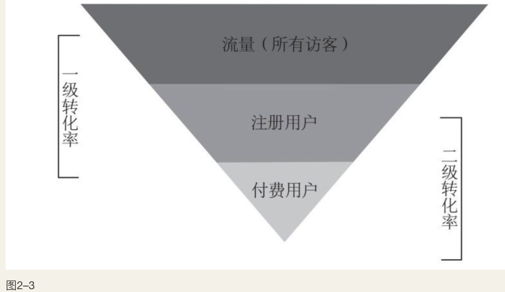

第二，用户维系。

有了流量和用户之后，运营的大部分工作就在于如何持续有效地推动用户的活跃与留存，并从中发现有价值甚至高价值的用户，这些用户会持续地为网站（产品）带来价值、产生收益，让网站（产品）可以存活下去，并且活得有质量。

简单地划分一下，运营工作会涉及哪些层面呢？我个人通常将其分为三类：内容运营、用户运营、活动运营。而这三类的总和，即我们常说的“产品运营”。

### 内容运营
首先要解决的问题是，什么是内容？

我认为，网站（产品）中可供用户消费并且延长用户停留时间、促进用户转化的展示均可称之为“内容”。

内容运营是指通过创造、编辑、组织、呈现网站或产品的内容，从而提高互联网产品的内容价值，制造出对用户的黏着、活跃产生一定的促进作用的内容。

内容运营的工作究竟包含哪些内容，如图2–4所示。

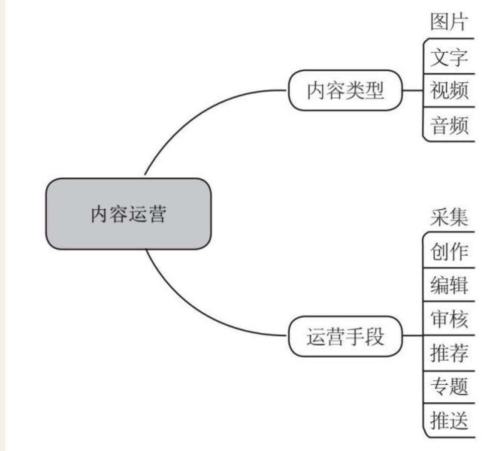

图2–4

内容运营工作至少包括五个部分：

- 创作内容(采集或者原创，包括各种内容类型）
- 编辑审核
- 推荐和专题制作
- 找到需要这些内容的人，并且想办法呈现给他们·根据数据和用户反馈，进行内容调整与优化

内容运营包含这么多工作，那么其核心是什么？

- 持续制作、编辑及推荐对用户有价值的内容，保证用户可以在产品中获取这些信息
- 根据KPI的设计，降低或者提高用户获取内容的成本
- 协助网站（产品）获利

### 用户运营
什么是用户？

我认为，所有使用网站及产品的自然人，都是用户。

用户运营是指：以网站（产品）的用户的活跃、留存、付费为目标，依据用户的需求，制定运营方案甚至是运营机制。目前，用户运营已经发展到针对不同类型的用户采取有针对性的运营策略的阶段。

用一张图来表示，用户数量与运营阶段的关系可能是这样一条曲线，如图2–5。

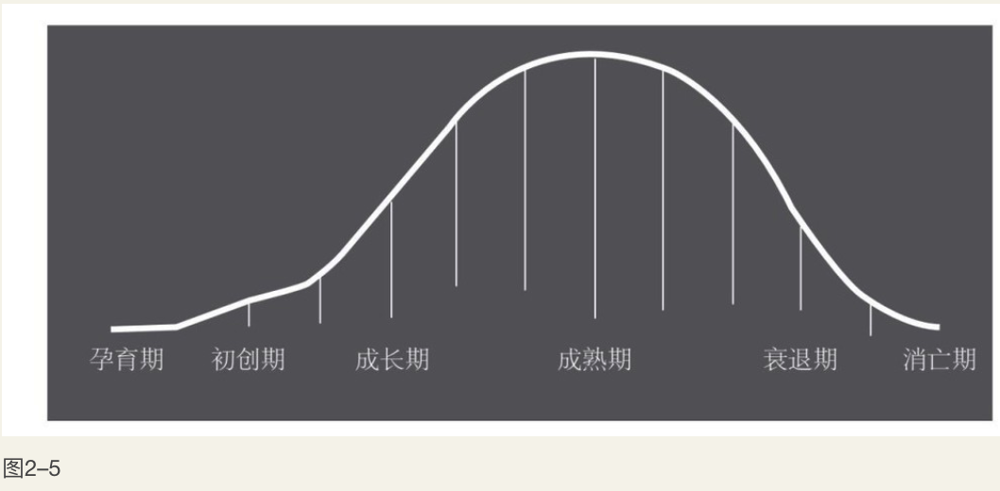

用户运营首先要做的事情，就是掌握用户结构。

你的用户是男性多还是女性多，他们分布在哪个年龄段，集中在哪些省份，他们受教育程度如何，兴趣点有哪些。这些数据中，是否可以产生用户类型……这些都是做基础用户分析的指针，而对基础用户的分析会决定运营人员应当采用何种运营策略、使用何种运营工具、发布哪些运营活动和内容。

用户运营要做的另一件事情，就是了解用户的规模以及增长或衰退情况，并进行适当的用户分级，了解新用户有多少、老用户有多少、每日增长规模有多少、用户都处于怎样的生命周期。明确了这一点，你才能了解你的网站（产品）处于什么样的阶段，你的用户处于什么样的阶段，然后你才能了解对用户进行运营的目标所在，从而选择合适的运营方式。

如果你从事的是一个社区或者交易平台的用户运营，那么你还需要熟悉用户的兴趣习惯，你的用户喜欢创作UGC（用户原创内容，社区型网站或产品的互动、回复、发表等；交易型网站或产品的成交、评论等；门户网站或产品的发言、评论、回复等）还是喜欢交易，是喜欢韩庚还是喜欢“长腿欧巴（哥哥）”，是习惯打折还是可以进行忠诚度管理。

最后，你还要熟练掌握网站的用户行为数据分析，据此你会懂得用户为什么来、为什么走、为什么留下来、为什么活跃。对新用户的增长、已有用户的活跃和留存、活跃用户的促使付费转化、流失用户的挽回都有对应的措施，运营人员才能达到所谓“想得出办法、干得出事情、负得起责任”这样基本的用户运营职责要求。

用户运营的核心内容是什么？

用户运营的核心是开源（拉动新用户）、节流（防止用户流失与流失用户挽回）、维持（已有用户的留存）、刺激（促进用户活跃甚至向付费用户转化）。

最后，如果你还具备从用户需求出发反向提出产品优化建议的能力，那么用户运营工作将不再是一个难题。

### 活动运营
什么是活动运营？我的理解是，活动运营是通过开展独立活动、联合活动，拉动某一个或多个指标的短期提升的运营工作。

活动运营人员的日常工作是什么？当然是策划活动。但是策划活动是一个非常笼统的概念，它具体包含如下内容。

- 活动文案撰写
    - 文案得写，哪怕开始时写得惨不忍睹，但写得多了，你自然知道什么样的文案用户看得懂，进而也就知道什么样的活动可以吸引你的用户。
- 活动流程设计
    - 活动流程需要设计，哪怕开始时你设计的流程无比简单。做得多了，你自然也会悟出什么样的活动流程是自然的、妥帖的、用户乐于去执行的。
- 活动规则制定
    - 你还需要制定活动规则，你会从中了解用户喜欢什么样的规则，比如，发奖应当让用户直接领取，还是通过推送告知用户。你会懂得规则如何设计能让用户最快明白，几步操作是用户的极限。
- 活动成本预估
    - 活动成本预估是指了解拉动一个指标的单人成本，活动会不会被刷，风险在哪里，如何控制？一个活动必然有需要付出的成本，成本高了运营的压力太大，成本低了用户不愿意参与，活动设计得再漂亮也是白搭。
- 活动预期收益
    - 付出当然会有收获，活动预期收益是指你的活动是为了拉动哪个或哪些指标，将为网站（产品）带来怎样的收益，收益不仅仅是收入，还有用户活跃度、留存率，减少流失等指标，这些内容是设计活动的目标。
- 活动效果统计
    - 活动开始后，你需要明确地让自己和领导知道：活动效果好不好；如果不好，如何改进，能不能在活动中通过调整文案、入口来改善活动的效果。如果某一类活动的效果不好，那么以后就不要进行同样的活动设计，如果某一类活动的效果很好，运营人员应该加以总结形成活动机制，让它持续地贡献效益。
- 活动改进措施
    - 这一点通常会在活动报告中体现，但活动上线之前，你就要预备一些可能会在活动中启用的措施，促进活动效果的提升。

## 第三章 揭开内容运营的面纱
### 内容运营的初期事项
内容运营涉及的事情很多，并且非常细节化，它至少包含了以下内容：

- 内容的采集与创造。
- 内容的呈现与管理。
- 内容的扩散与传导。
- 内容的效果与评估。

#### 内容供应链——将内容视为你的商品
“供应链”的意思是：产品生产和流通过程中所涉及的原材料供应商、生产商、分销商、零售商以及最终消费者等成员通过与上游、下游成员的连接（linkage）组成的网络结构。

一张典型的供应链流程划分图，如图3–1所示。

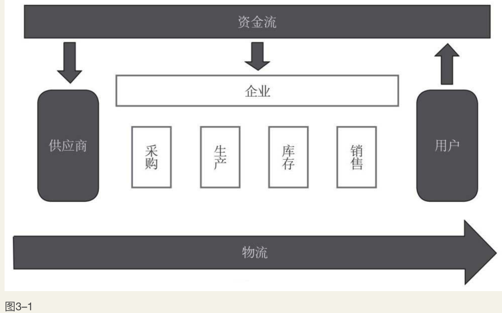

一张典型的网站内容的流转流程图，如图3–2所示。

经过这样对比，“供应链”和“内容”似乎确有关系。内容运营初期，运营人员必须解决以下几点：

- 网站（产品）上有哪些内容（定位）
- 这些内容从哪里来，由谁提供（来源）
- 这些内容给谁看，要达到什么样的目标（受众）
- 这些内容要如何组织与呈现（展现机制）
- 这些内容如何做筛选，什么是好的内容（内容标准化）

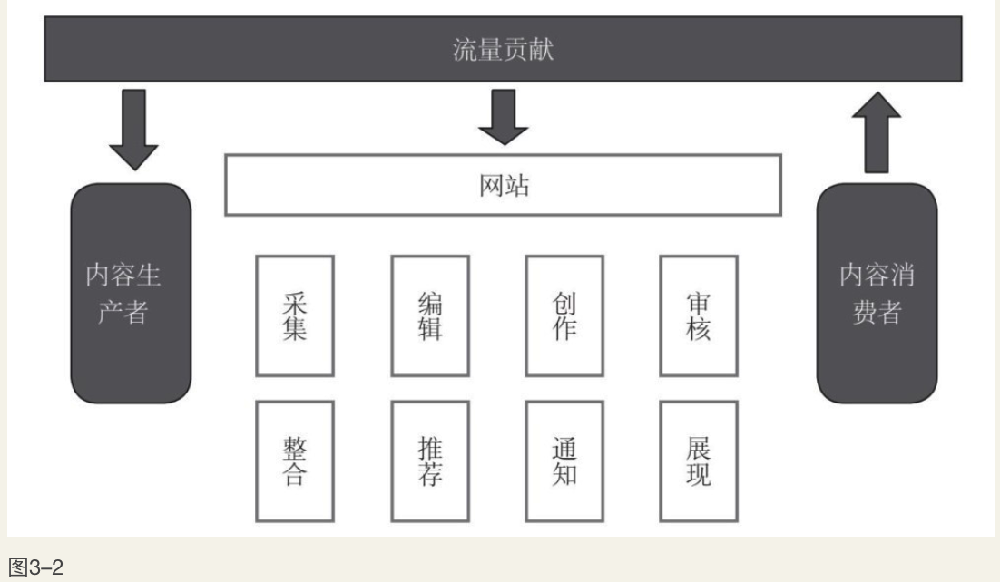

在内容运营的初期，我们对运营工作的排序应当是：

- 内容消费者定位（网站定位+受众定位+运营目标）。
- 内容来源确认（采集或者寻找内容生产者）。
- 内容标准的确立（有哪些内容、如何展现内容、评判内容质量的标准）。

#### 内容初始化——构建网站与产品的价值观
“内容初始化”的定义了：内容初始化就是在已构建好的内容框架下，在用户进入之前填充一些内容，这些内容是内容运营初期网站或（产品）的核心部分，代表着网站（产品）的价值观。

对于这一定义下的内容初始化，我们发现其中有几个依赖项需要在内容初始化之前解决。

1. 确立好内容供应链的架构，即通过系统去解决内容从哪里来、到哪里去的流程问题。
2. 确立好内容面对的初始用户群（关于初始用户或者称为“种子用户”，我们会在后面具体讨论）。
3. 明确第一阶段用内容解决的问题，并进行内容准备。
4. 关键路径的梳理与初始内容的准备。

### 持续运营中的内容运营——以知乎为例
当一个网站（产品）进入正式运营阶段，就需要建立一些标准，具体包括：

- 内容质量的甄别。
- 好内容的露出与呈现方式。
- 持续的推送与推荐机制的建立。
- 实现“自运营”的路径与机制选择。

#### 推送渠道
推送（也称为消息、通知），是很多运营人员都会用的手段，如果我们划分通知或者推送的渠道，可能会包含但不限于以下类型。

渠道的选择上，运营人员需要考虑如下两方面因素：

1. 优先考虑渠道是否覆盖推送对象。如果之前用户根本不看邮箱的EDM（电子邮件营销），那么通过这个渠道推送用户消息，就是无意义的；如果用户对手机应用上的小红点有强迫症，那么你就应该更多地使用这种渠道和方式推送通知或消息。
2. 推送内容的时效性。确定了推送对象，就要考虑推送的内容的时效性如何，如果是非常紧急的推送，那么就要尽可能地利用用户最常使用的渠道去告知，比如，如果站内发生了拖库，用户信息可能被泄露，你通知用户更改密码就要用最直接的方式，如用户短信推送、网站弹窗浮窗等等；如果你的消息没有这么强的时效性，你就可以选择更柔和的推送渠道，如发封邮件、提供登录提醒、发送站短等。

渠道选择也有依据，譬如下面几个。

- 历史推送数据。它主要包括使用过什么样的渠道，各个渠道的到达率与转化率如何。
- 竞品选择的渠道。如果没有历史数据，就需要预估，此时比较具有参考价值的，是竞品的渠道选择。
- 用户兴趣点所涉及的渠道。如果没有历史数据，也没有掌握竞品的情况甚至没有竞品，那么可能就需要根据用户的行为去猜测用户可能会在哪些渠道上接受信息，比如搜索引擎，属于几乎人人都会去接触的；比如电商网站用户经常会去导购平台、返利平台。

#### 写一个好文案
##### 贴近受众的心理。
你的文案需要考虑受众的心理感受，要么迎合良性感受，要么打击不良感受，要么二者兼顾。所以要弄清楚你的受众是谁

“上前一小步，文明一大步”强调的是人人都想成为别人眼中的文明人，可是，上厕所这件事不会达到被人评价“文明”的效果。除非你随地大小便。而第二个文案则抓住了男人的心态，利用强烈的心理暗示可以解决很多问题。

##### 选一个好位置。
贴在抬头就能看到的地方，醒目、直接，受众一般不会被其他部分干扰，譬如，在刚才的文案上，如果你再贴个美女图之类的，估计就很少有人看得到了。比如之前流行的段子：

##### 简单有趣，朗朗上口。
朗朗上口代表着易于传播，当社交平台的力量被放大的时候，用朗朗上口的文案，更容易帮我们带来内容的传播，从而带来更多的用户。譬如说：Nike（耐克）的广告语：Just do it！（想做就做！）可谓人尽皆知。

##### 符合场景。
知乎用户徐慧琳曾经总结过好文案的特征：称呼亲切、内容简单、落款严肃、充满诱惑。

比如，网上曾经盛传的一个截图：

怎么样才能在日常运营工作中写出好文案呢？

第一，了解受众。

不管是做活动还是日常运营，你都需要了解你的文案是给谁看的。如图3–9，杜蕾斯的营销广告。

图3–9 资料来源：杜蕾斯新浪官方微博

第二，了解产品和活动。

不管文案给谁看，你都要明白这些人需要什么，而你能够提供什么。

第三，准确表达。

不管是活动规则，还是产品介绍，也不管你用多少笔墨，你要准确地告诉受众，你的文案在表达什么。一个活动运营的文案，要说清楚活动规则；一个产品介绍的文案，要说清楚产品功能、产品特点。

如图3–10，亚马逊请用户评价已购商品的邮件推送。

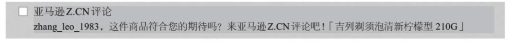

图3–10 资料来源：亚马逊推送的邮件

如图3–11，用一个Slogan（广告语）“甜过初恋”说明产品特性。

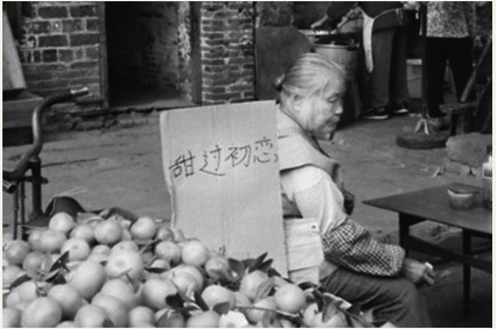

图3–11 资料来源：2010年早报网网友拍摄的照片

第四，画龙点睛。

做活动文案要突出用户做了大量行为之后能够获得什么，价值何在；做产品文案要突出产品最独特或者最有优势的那个方面。如图3–12，One一个的产品文案。

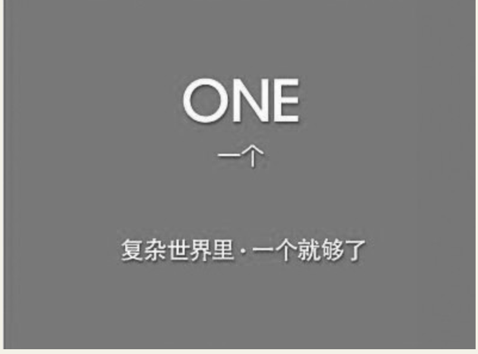

图3–12 资料来源：One一个的产品文案

第五，勤加练习。

推送效果如何判定的说明。

通常，用户从收到推送到完成转化的路径是这样的，如图3–13（按照一般情况作图，如果有遗漏在所难免）。

在用户的路径中，各个环节应该都有统计数据，关键看网站（产品）在这方面有没有考量和设计，如果没有，那么就要增加。

这一类统计数据的表现结构一般来说呈漏斗状，如图3–14。

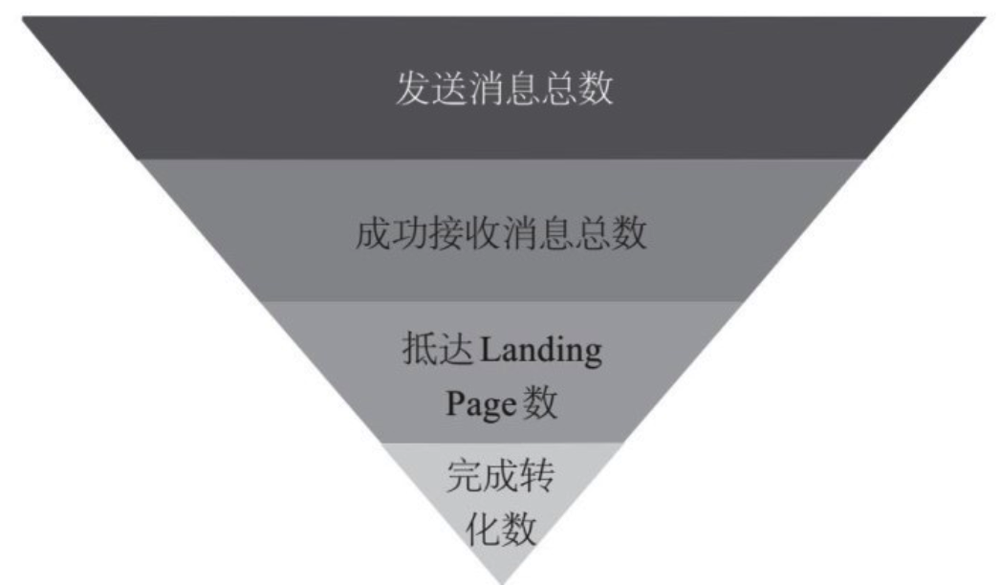

图3–14

各级数据中，都有对应的转化率。所以，你需要了解的是，漏斗的每个环节的转化率分别是多少，要比照渠道、内容、用户选型去分析。分析的目标就是形成结论，主要包含如下几点。

- 渠道的质量分析，比如哪个/哪些渠道效果好，哪些渠道效果不佳。
- 通过各渠道发出的推送成功到达用户的数量。
- 用户对待推送的态度如何，有多少用户打开、阅读了推送的内容。
- 在接收、查看推送的用户中，有多少人进入网站（产品）中对应的Landing Page（着陆页）。
- 最后，有多少用户完成了我们期望的转化。
- 对待这些数据，我们有哪些经验和教训，以后应当如何保持、改进、提高，这些应落实到具体措施中，下一次再进行尝试。

在整个推送过程中，我们需要注意一点：避免用户打扰。

#### 内容的推荐与整合
当网站（产品）的内容逐渐充实，内容运营人员的日常工作会从生产内容转变为内容推荐与整合。所谓内容推荐，就是让优质的内容更多地呈现给用户。所谓内容整合，就是让同类的内容产生集合。

知乎的内容推荐机制分为几个部分。

1. 关注话题与关注对象的Timeline，用户主动关注的对象和话题下的内容更新，会以Timeline的形式呈现给关注者；
2. 对于网站上大量的优质内容，用户可以主动通过“发现”、“话题”等功能去寻找。
   1. 话题动态推荐新近发生的有关关注话题的动态，如图3–15。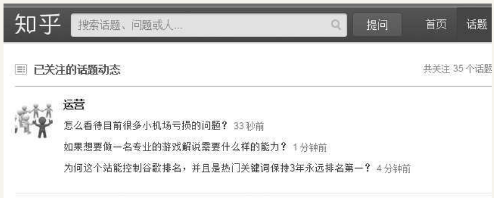
   2. 热门内容通过发现进行推荐（编辑推荐+热度），如图3–16。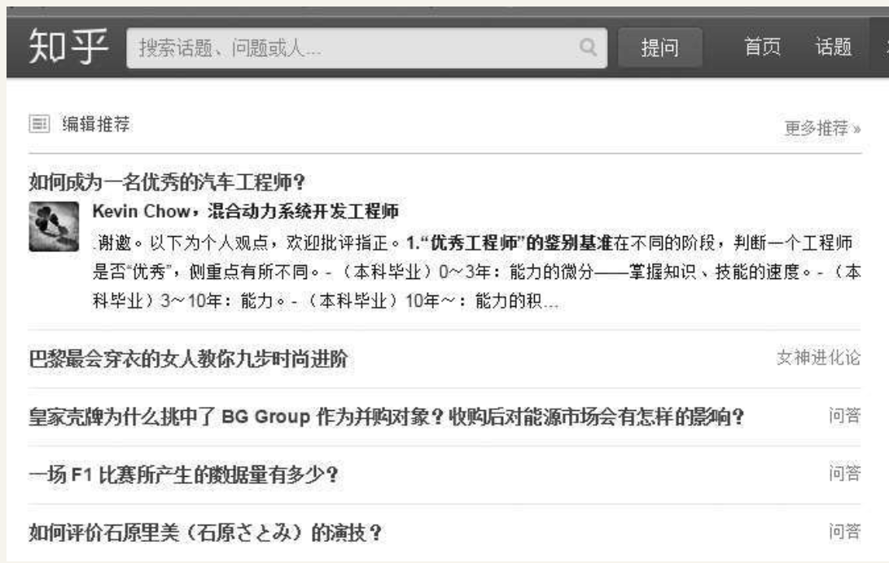
3. 对于新近进入的成员的优质内容，通过“首场秀”进行推荐。
4. 对于一些推荐阅读的内容，通过“每周精选”呈现给用户，如图3–17。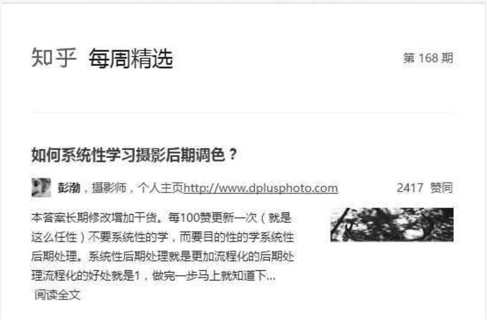
5. 知乎官微及个人自媒体等新媒体转发（这不仅仅是推荐，也是推送），如图3–18。
6. 知乎的XXXX年的总结（严格来说，这一点并非内容推荐机制）。这一点主要是为了用户进行自我宣传，从而吸引潜在用户的关注，如图3–19。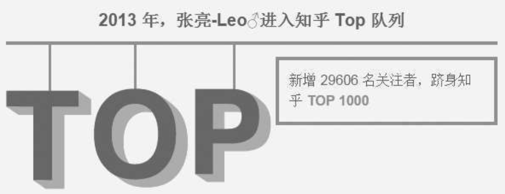

知乎的内容整合通过如下几种形态展现。

1. 知乎日报。每日整合更新的全站内容，分门别类提供用户查看，如图3–20。
2. 知乎圆桌。通过整合同一话题下的热门回答和优质回答者，进行更深层次的内容运营，如图3–21。
3. 知乎周刊。与日报不同的一种形态，主要以电子书的形式做内容聚合，如图3–22。
4. 内容出版与发行。对优质内容和优质用户通过出版物的形式做内容整合与推荐，如图3–23。

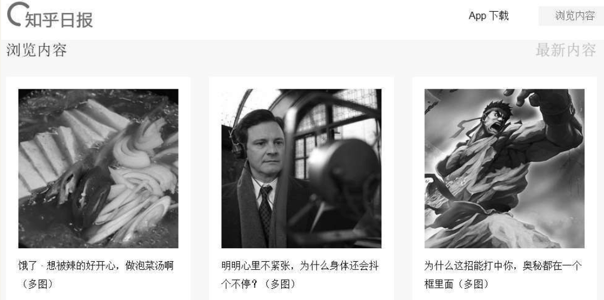

图3–20

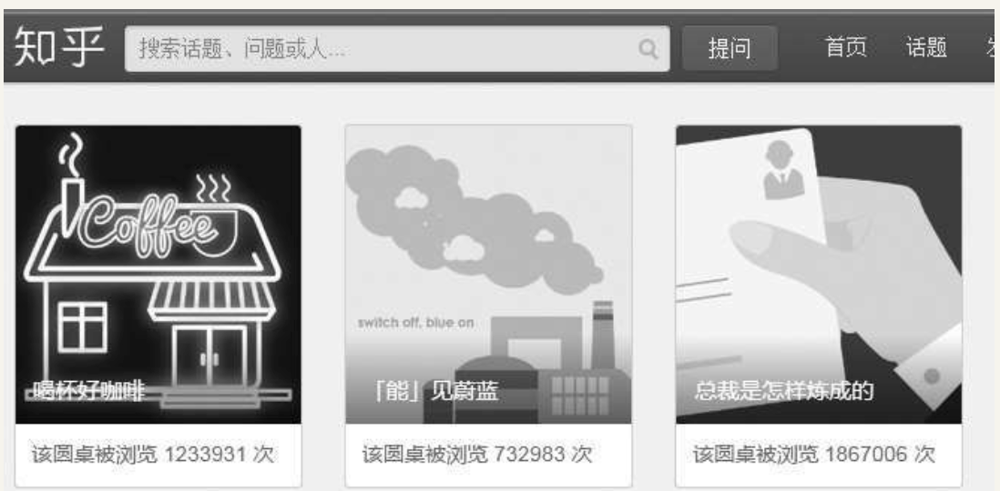

图3–21

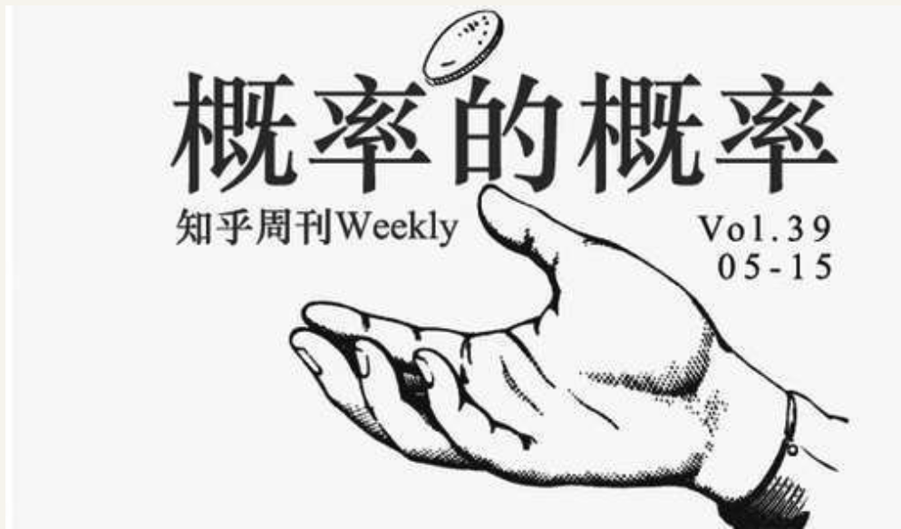

图3–22

图3–23

#### 自运营的路径与机制选择
所谓“自运营”，是指建立一些机制和规则，用户通过遵守这些机制，利用这些规则，使得网站的日常运营不再过多地依赖运营人员的引导，实现用户自主运营。

### 公共平台的内容运营
#### 公共平台内容运营的步骤
- 先定位
    - 根据品牌自身的特点、受众、调性来定义公共平台所要进行运营的内容的特色、受众和调性。
    - 这个定位，实际上包含两层意思：第一层意思是面向受众群的定位。你要清楚哪些受众群体会喜欢你的内容。第二层意思是面向内容的定位。对于这样的受众群体，你应该通过什么类型的内容进行长期的运营。
- 培养用户的习惯
    - 很多公共平台运营人员关心的问题之一，是内容什么时候发布最好。
    - 其实我的经验是，不管是早晨通勤时间发布，中午休息时间发布，还是晚上休闲时间发布，这个时间点都不重要。重要的是，要在固定的时间发布内容。如果内容发布的时间固定，长期关注内容的用户会养成定时查看的习惯。
- 坚持长期的内容运营方针
- 与内容消费者保持互动
- 坚持原创

### 内容运营的核心
内容供应链的建立必然涉及三方：网站（产品）、内容生产者及内容消费者。

## 第四章 做一个有趣的活动
活动运营，顾名思义是通过组织活动在短期内快速提升相关指标的运营手段。我们拆分一下这句话中的关键字：

- 短期：在一个较短的时间内开展活动。
- 快速：用简单直接的方式在较短时间内达成结果。
- 提升指标：目的明确，提升活动对应指标，达成KPI。

具体来说，一个完整的活动运营流程可能会涉及如下步骤：

- 策划：活动的设计阶段，会定义明确的活动时间、对象、方式、目标、预算等。
- 开发：活动需要由设计人员设计界面，请开发人员开发实现功能。
- 测试：一个活动开发完成后，需要测试以确认功能是否可用与易用。
- 宣传：找到可以触达用户的渠道，协调资源来做活动露出。这个阶段几乎是和开发、测试同时进行的，而且为了活动效果，在上线之前就会做一些预热。
- 上线：终于到了上线时间，活动就会在线上进行展示，让用户参与活动。
- 指标监控：活动上线后，需要监测相应的指标，根据指标反映的问题进行适当的调整。
- 奖励发放：活动结束后（当然，也可以是活动进行中），对符合奖励条件的用户发放奖励。
- 效果评估：活动结束后，评估活动效果，总结经验教训，以备下次活动参考借鉴。

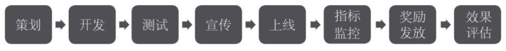

在整个活动运营过程中，有四件事情非常重要，可以称之为“核心”，它们分别是：

- 活动设计与成本预算。
- 活动风险管控与应急预案。
- 活动数据监测与应对策略。
- 活动效果判定与总结。

### 活动设计与成本预算
说到这里，针对活动运营的成本预算管控，我们在活动设计上可以做什么呢？我的观点如下：

1. 先看能不能借势，再看能不能借力。可以借势的活动用抽奖的方式进行，可以借力的活动用合作分摊成本。
2. 如果势、力皆无，那么就要拿出数据说服老板，要么降低活动预期，要么增加活动预算。
3. 如果说服不了老板，那么，尽你的最大努力，来设计一个吸引人的活动吧。

#### 活动规则的设计准则
活动规则的设计准则就一句话：流程简单少思考，文案清晰无歧义。

#### 如何写活动策划
一个标准的活动策划可能包含但不限于以下内容：
1. 活动主题：活动文案的一部分，让用户看得懂，明白活动是什么主题，是否对他有吸引力。
2. 活动对象：明确活动针对的群体，让用户看得懂，让自己抓得住，让领导认可。
3. 活动时间：活动的开始时间、结束时间，奖励的发放时间、领取时间。
4. 活动描述：活动文案的一部分，让用户看过之后明白要不要参与，怎么参与。
5. 规则详情：活动文案的一部分，让用户看得懂，让开发人员看得懂，一部分内容是在前端展示给用户看的，另一部分内容是让开发人员知道活动如何实现。
6. 投放渠道：让市场人员或者你自己看得懂，要有投放时间、投放渠道的选择、预算。
7. 风险控制：让开发人员看得懂你的风险环节是什么，有无对应的措施来解决。
8. 监测指标：涵盖大多数相关指标，包括投放渠道的监控、用户参与情况的监控、奖励发放的监控等。监测这些指标可以帮助你在查看数据的时候找到问题，并且启发你去解决这些问题。
9. 成本预估：一个活动需要多少钱，单人成本是多少。成本预估不一定非常准确，但是必须要树立这个意识。有一些活动是不花钱的，但是如果要花钱，你要明白一个活动的容量有多大，对指标的帮助是什么，为了这些利益，你需要多少成本支持。
10. 效果评估：有成本就有收益，你的活动目的对网站（产品）的哪些指标是有帮助的，以及如何体现，你需要考虑，并让领导认可。
11. FAQ（常见问题解答）：可以另外准备一个文档，提供给客服或者相关人员，帮助解决用户在参与活动中遇到的问题。FAQ要详细、标准。如果活动规模大，仅有FAQ还不够，你需要提前准备客服的培训文件，并积极与客服人员沟通。

活动策划的文本通常会分为两个部分：一部分作为前端展示，除了让用户看得明白如何参与活动，更要能够推动用户主动参与；另一部分是作为与开发人员的约定，活动如何设计、如何实现，需要和开发人员沟通，必要的时候，你需要另外做一个文档，将流程、需求罗列清楚，并且和开发人员保持沟通。

活动策划文档的目的，是为了让活动做得有理有据。做活动的理由、耗费运营成本的代价、上线后可能带来的预期收益都是必须体现在活动策划中的。

通常，一个活动要经历如下环节，如图4–8。

图4–8

活动效果的报告可长可短，但通常要包含以下内容：

1. 活动概述：简单概述活动主题、对象、时间、内容。
2. 活动效果统计：对活动结束后的活动效果进行描述。
3. 宣传效果统计：对各个投放渠道的效果进行统计，并且掌握每个渠道带来的流量、转化率的相关数据。
4. 反思与总结：活动效果、宣传效果带来了哪些经验和教训，下次应该怎么调整，如何提高。

#### 活动风险管控与应急预案
首先，我们来看一下线上的活动流程中有哪些环节，如图4–9。

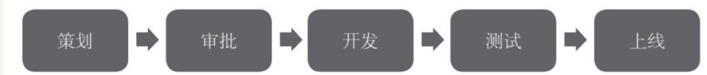

图4–9

每一个阶段都涉及不同的人员，并存在不同的风险，我们用一张思维导图来具体说明，见图4–10。

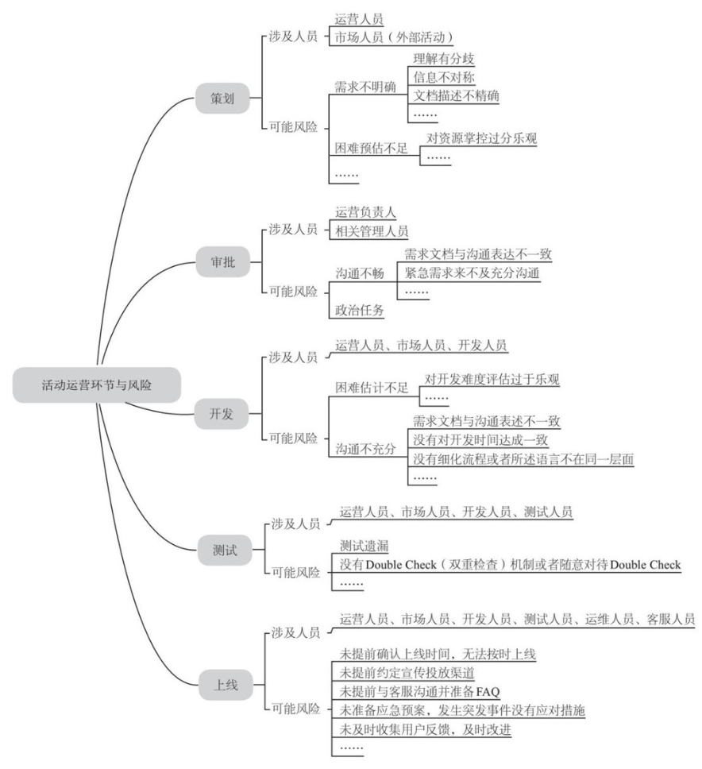

图4–10

#### 活动数据监测与应对策略
图4–11仅仅是粗略地告诉我们哪些数据需要统计，而监控意味着这些数据需要被实时监测，发现问题需要报警。那么，监控数据的目的就是发现问题并解决问题。监控数据，就是为了发现引流的过程中是否有问题、用户参与活动的流程中是否有问题、财务控制是否有问题。

如果引流有问题，首先要确认问题集中在哪些渠道，如果找到了有问题的渠道，接下来的解决办法通常是三步走：

1. 更换素材与文案，持续监测效果，如果无效，进行第二步。
2. 更换投放时间及覆盖范围，持续监测效果，如果无效，进行第三步。
3. 下架或更换渠道。

如果用户流程有问题，怎么办？解决方案同样是三步走：

1. 更改页面活动流程描述，或更具体，或更简明。
2. 推送消息或通知，引导用户再次操作。
3. 尽快迭代，简化或优化流程。更新活动后再从第一步开始循环进行。

如果财务控制有问题，怎么办？这个相对来说比较简单：

一种选择是，提前结束这次活动，并立刻上线新活动进行接力，使用新的活动预算，对用户进行补偿。另一种选择是继续该活动，同时抓紧申请增加活动预算。

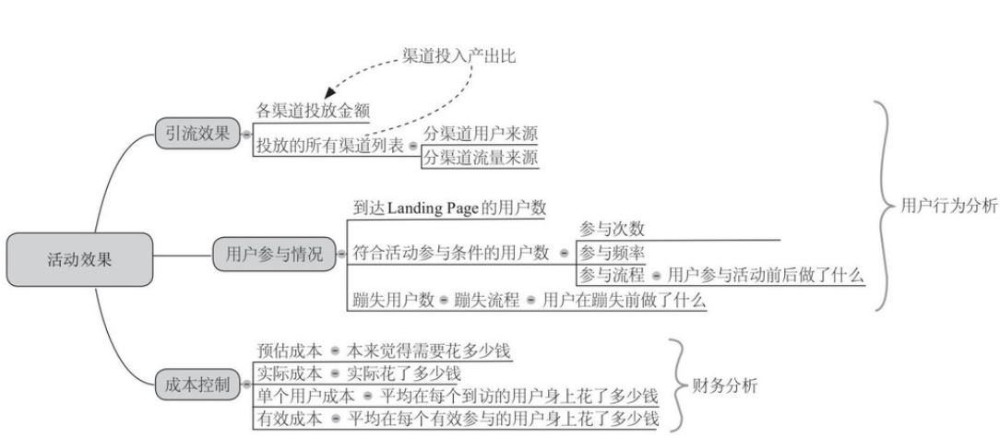

图4–11

## 第五章 用户运营比想象得更难
### 你了解你的用户吗？
#### 通过数据窥探用户
通常，在图5–2所示的每一个环节中，用户基本都会做以下几件事。

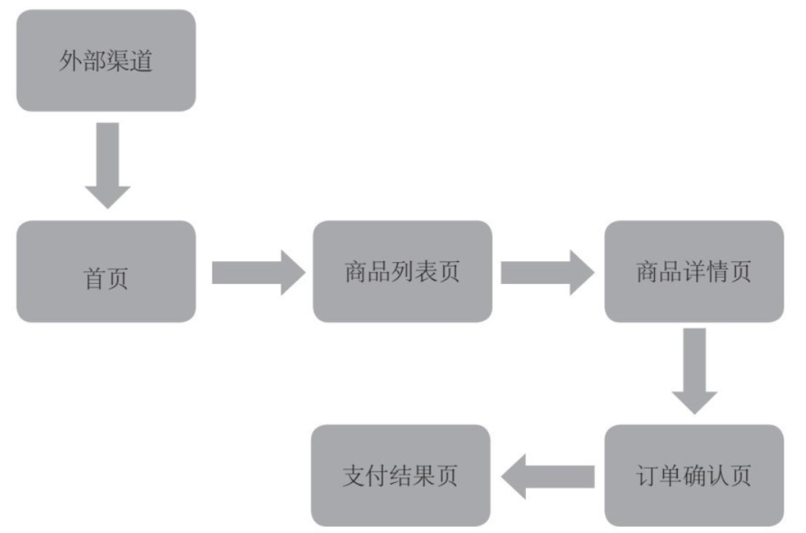

图5–2

- 浏览：用户会在网站内随意逛逛，对应的数据指标是停留时长。>关联指标是点击、注册、登录。
- 点击：用户会在页面上随意点击，包括网页上的广告、按钮、图片、链接。
- 注册：用户可能会点击首页上的注册按钮或者注册链接，进行注册。
- 登录：用户可能会点击首页上的登录按钮或者登录链接进行登录。
- 蹦失：请注意这个词的定义，蹦失不等于跳出，蹦失是用户直接离开页面或者关闭浏览器。跳出是离开这个页面，在正常流程中，用户也会跳出，不一定是蹦失。
- 操作：用户可能点击进入查看商品的列表，也可能点击查看商品的详细介绍，还有可能决定下单、付费。

#### 详情页转化率
转化率有几个层面的不同定义：

- 列表页转化率=最终下单用户数/商品列表页到达用户数
- 详情页转化率=最终下单用户数/商品详情页到达用户数
- 支付转化率（支付成功率）=支付成功的用户/最终下单用户数

### 用户运营的工作内容
#### 开源
开源，主要是指用户规模的扩大，通常落脚点在访客量和注册用户数，但主要是注册用户数，因此开源的主要工作有两类。

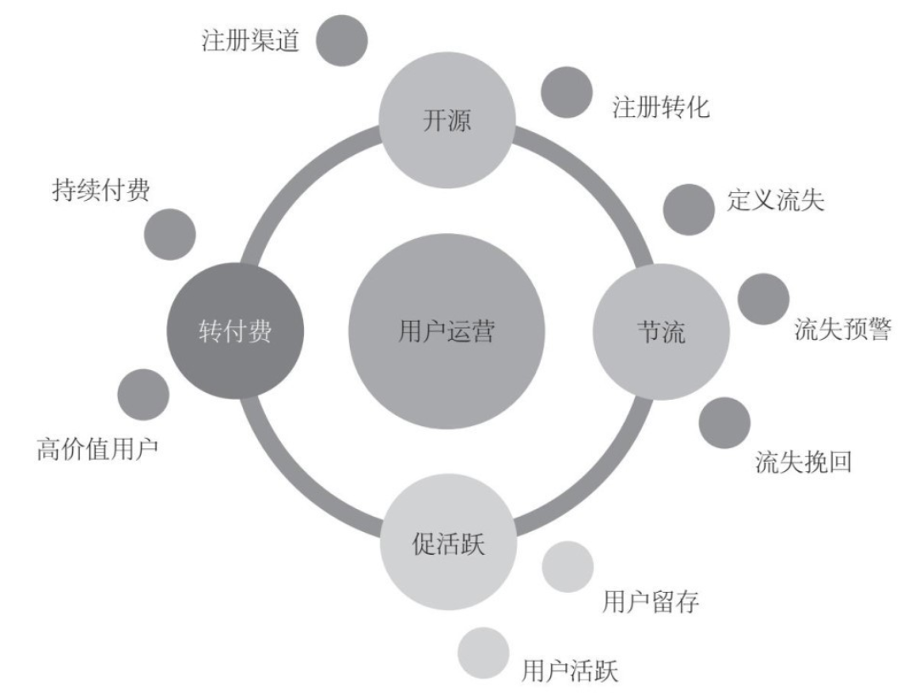

1. 注册渠道的挑选与打开。
    - 注册渠道的选择决定用户进入网站（产品）的入口；注册方式的选择决定用户进入的门槛。如今，开源的方式有很多，如图5–8。
    - 其中，常见的方式有四种。第一种方式通常出现在对第三方登录没有要求的自体账号建设中。第二种相对来说非常少见，因为过分依赖第三方登录，如果第三方终止合作，用户也就流失了。第三种和第四种最常见，事实上，最后两种是第二种的变体，用以建立自体账号，同时避免第三方合作终止导致的后果。
2. 提升注册转化率。
    - 用户完成注册只是第一步，最重要的运营工作是，如何将一个注册用户转化为一个对网站（产品）有认知的有效用户。

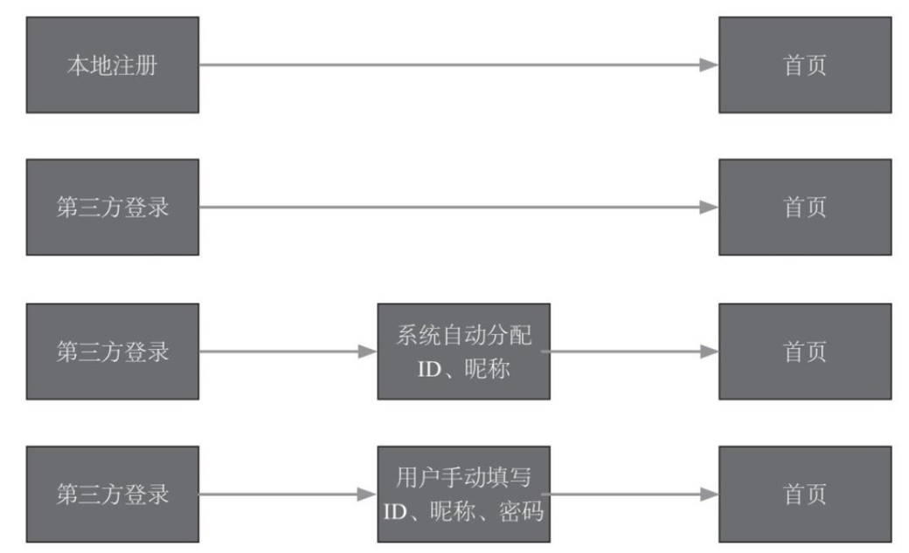

图5–8

#### 节流
节流，主要是指保持用户规模，通常落脚点在沉默用户或流失用户，因此节流的主要工作包括3种。

1. 定义用户沉默或流失的标准。
    - 用户在多长时间没有登录网站（产品）就意味着流失，这是需要明确定义的。譬如，有些游戏的标准是用户90天或者180天内没有登录过游戏，就视为流失。
2. 建立流失预警机制。
    - 弄清楚用户是在什么情况下流失的，通过运营数据建立模型，并制定相关的运营策略，当用户行为符合流失模型定义时发出警告，敦促运营人员进行针对性地调整，预防流失的发生。
3. 对已流失的用户进行挽回。
    - 用户如果已经流失了，如何让他们回到网站（产品）中，这需要开展活动。但挽回用户非常困难。

#### 促活跃
促活跃，主要是指提升用户使用网站（产品）的频次，通常落脚点在用户留存率和用户活跃率，因此促活跃的主要工作包括3种。

1. 定义用户留存与用户活跃的标准。
    - 用户的留存是否等于用户每天都来网站或者每天都使用产品？如果不是，那么根据网站（产品）的特点，应该如何确定用户留存行为和活跃行为的标准？这些都是运营要解决的定义问题。
2. 提升用户留存率。
    - 用户不会无缘无故地留存下来，产品或者运营人员需要做一些促进用户留存的工作。如果用户留存的比例过低，运营人员需要想办法提高留存的数据，这就涉及具体的工作内容。
3. 提升用户活跃度（用户行为、产品使用频次等）。
    - 用户留下来了，不意味着用户就是活跃的，有一些行为可以衡量出用户是否活跃，这些行为是什么，如何促进这些行为的发生，这是运营人员要做的功课。

#### 转付费
转付费，主要是指抓住高价值用户（或称核心用户）的需求，让他们为网站（产品）付费，并且持续付费，通常落脚点在付费用户数（根据形态的不同，定义未必是一致的，但在此默认一致），转付费的主要工作包括两种。

1. 通过一系列行为让未付费的活跃用户付费。
    - 促进用户从活跃向付费的转化，是以用户付费为盈利方式的网站（产品）的重要工作内容。
2. 通过机制让已付费的用户持续付费。
    - 付费用户对网站（产品）有极高的依赖，如何通过运营手段，让他们认为值得为网站（产品）的功能付费甚至是持续付费，是一件困难但必须要考虑的事情。

#### 关联指标
在用户运营工作的相关数据中，对应注册用户行为，有几项关联指标。

- 注册来源
    - 用户是从哪个渠道来的？是外部投放的广告落地到了某个Landing Page，引导用户完成了注册，还是用户直接在网站（产品）上完成了注册？这些来源需要标记并了解清楚，用来判断渠道的质量。
- 注册转化率
    - 注册转化率是指，从进入注册流程到完成注册流程的注册成功用户数，占所有到达注册页面的用户数的比例。这个数据涉及注册流程是否有优化空间，以及如何优化。
- 蹦失页面
    - 蹦失页面是指没有完成注册流程的用户跳出注册流程的页面或者步骤。这个数据涉及后续流失用户的分析，必须关注。

在用户运营的不同阶段，围绕注册数据，关联指标的重要程度是不同的。

在用户运营的初期，为了低成本获取外部用户，注册来源的质量是最重要的指标。而判断注册来源的质量，就要考虑注册转化的成功率，并参考蹦失页面，来确认用户为什么会放弃注册转化，判断是否可以优化注册引导流程。

在用户运营的中期，需要新用户的稳定进入，就需要密切关注注册转化率指标与蹦失页面指标，适时调整，并考虑采用配套活动推送用户的注册引导行为。

在用户运营的后期，需要关注用户的留存及活跃度，此时就不需要刻意关注注册的相关指标，反而需要注意用户的留存度指标和活跃指标，以及流失用户的模型建立及预警机制。

#### 定义流失用户的衡量标准
在运营工作中，我们通常会看到如下事实：

- 流失行为是一个长期的持续的行为（留存也是，并不是说用户用了多长时间就是留存，而是在一个相对较长的时间内，用户一直在持续使用，哪怕频率是1个月使用1次）。
- 定义流失需要首先建立用户行为模型，从而确认对于网站（产品）来说，到底用户多长时间不使用就是流失。

#### 建立流失预警机制
流失预警的前提是，对用户行为数据和产品节奏保持长期有效的监测，因为运营人员需要了解以下信息，甚至更多信息，才能对流失预警做出判断：

- 在流失前，用户进行了哪些类似的行为。
- 这些用户是否集中于某一渠道。
- 这些用户的性别属性、地域属性、年龄层次、兴趣特征是否类似。
- 在发生流失的时间点，产品做了哪些动作，是否发布了新版本，是否更改了某些核心功能。

第4点其实有点尴尬，因为这种情况出现的几率并不少，但却不一定是用户的错，也不是运营的错，而是产品改得让用户有些茫然。

所以，这里有一些建议给产品经理和相关的运营人员：

1. 产品在做改版设计时，一定要充分调研用户和听取运营人员的意见。运营人员也一定要拿出数据来佐证产品的改版设计是否合理，是否会影响已有用户的活跃和留存。
2. 对于大改版，一定要慎之又慎，灰度测试必不可少，同时该坚持的原则一定要坚持，改版一定不要仅凭感觉。改版之前，一定要和运营同学讨论一下新版本的引导学习流程的设计。运营人员也要充分加入到讨论中，做好各种预案及策略，在出现问题时，可以有效地缓解甚至解决，避免带来预料之外的麻烦。
3. 运营人员要密切掌握用户的使用反馈，及时解决各种可能的运营风险。

#### 流失预警
最早开始做流失预警的，可能是通信运营商。做法很简单：明确定义；变量选取、多次建模；指导业务。

互联网的用户运营，也需要这样的方法来建立流失模型。我们需要做如下几点。

- 明确用户流失标准。譬如，网络游戏里常用的90天无登录、180天无登录。
- 选取用于建模的指标。譬如：用户的属性（性别、区域、年龄、有无注册等）、用户的行为（活跃的频率、活跃时对应的操作等）、其他指标（从活跃到流失经历的时间、对应的版本与功能等）。
- 建立模型，并不断地调试，剔除无意义的干扰项。
- 从数据库中把符合模型的用户筛选出来。
- 设计活动、话术，直接与用户沟通，尝试延长其在产品中的生命周期。

## 第六章 关于数据的一二三
### 谈论数据的基础
#### 数据的定义
图6–1仅仅简单地展示了部分通用的运营数据，其中三个数据类型是所有运营人员都需要了解的：渠道数据、成本数据、收益数据。

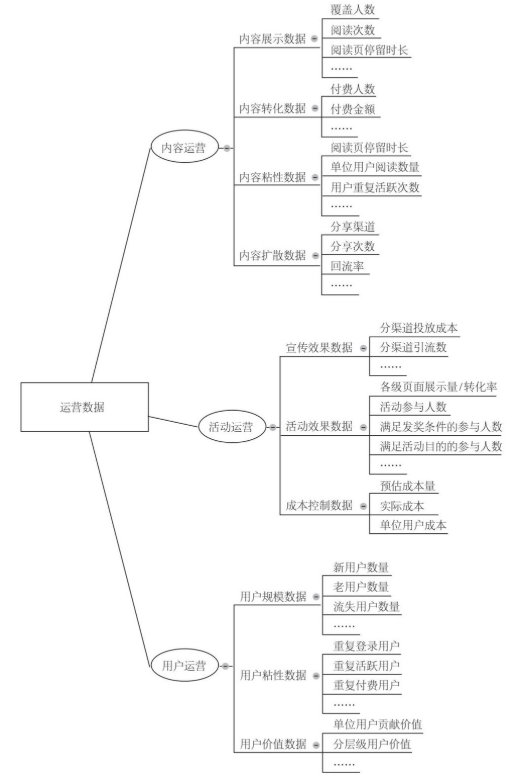

图6–1

流量包含了好几个指标，最关键的有以下一些：
- UV（Unique Visitors）：独立访客数
    - 独立访客数和独立IP是两个概念。独立IP要求访问者的IP地址各不相同，而独立访客数则未必。比如，在同一台电脑上，你注册了一个新用户，你哥哥注册了另一个新用户。此时，网站的后台会记录1个独立IP，但同时会记录2个UV。而如果在同一台电脑上，你和你哥哥都没有注册，只是浏览，那么后台会记录1个独立IP及1个UV。当然，在同一天内，不管一个独立IP下的独立访客访问多少次，后台都只记录1次。
- PV（Page Views）：页面访问量
    - 每一个用户，每打开一个页面，就是一个PV。
- RV（Repeat Visitors）：重复访客
    - 比如，昨天小明浏览了我的微信公众号，今天他又来了。小明就是一个RV。
- TP（Time On Page）：页面停留时间
    - 比如，王大壮最喜欢看新闻，所以他每天看XO站的新闻频道10分钟；李小勇最喜欢看美女，所以他每天看XO站的美女频道30分钟。这就是TP。

### 运营的核心数据
- 内容运营的核心数据
- 内容的展示数据
    - 内容的展示数据是最基础的数据，它的意义和价值在于：提供给内容运营者一个直观而基础的数据，用来展示内容被点击、查阅的情况，从而分析内容是否为网站（产品）提供了相应的帮助，如：内容覆盖人数、内容是否符合用户兴趣等。
    - 内容的展示数据可能包括但不限于：
        - 内容的点击次数；
        - 内容页面的蹦失率；
        - 内容页面的停留时长。
    - 以一篇文章为例，这篇文章的链接被点击了100次，其中，50次点击停留的平均时长为20秒，10次是点击后直接关闭网页，另外40次点击停留的平均时长是3秒。通过这些数据，我们可以了解到，这篇文章的质量可能是不错的。接下来要做的事情是，10次直接关闭网页和40次平均3秒的停留时长背后的用户还看了哪些文章，他们的行为是怎样的。
- 内容的转化数据
    - 内容的转化数据，是相对展示数据而言更深层的数据，它往往用于判断内容是否能够促进用户的转化，比如能否利用内容让用户从活跃转向付费。
    - 我们以一本网络小说为例，从免费阅读转向付费阅读，数据表现出来的该作品的“吸金”能力，就是内容的转化数据。从一定层面上说，这是衡量内容能否带来高质量“粉丝”的一个依据。
    - 内容转化数据可能包括但不限于：
        - 内容中付费链接的点击次数、付费成功次数；
        - 内容页面广告的点击次数、广告的停留时间、二次转化成功率。
- 内容的黏性数据
    - 黏性数据和展示数据相关，但二者有一些区别。考虑展示数据时，如果进一步分析用户重复阅读的次数，那么结合每次阅读的停留时间，就可以得到黏性数据。
    - 对于黏性数据，其实完全可以采用会员管理系统里的RFM客户关系管理模型来进行分析，获得内容或者用户的黏性值和分布，从而指导日后的内容运营工作。RFM模型在本章节中不做展开，有兴趣的读者可以使用百度搜索或进入MBA智库百科去查阅相关词条。
- 内容的扩散与分享数据
    - 内容的扩散数据或称“分享”数据，是社会化浪潮中一个新增可监测的数据。
    - 内容的分享频次和分享后带来的流量统计，可以说明内容对某类用户的价值和作用情况，这对需要通过分享带来用户的网站（产品），以及需要引爆热点和病毒传播的运营有着重大的意义和价值。
- 活动运营核心数据
    - 案例1：某网站开展了一个分享邀请的活动。活动主旨是让老用户带来新用户，可以通过社会化渠道、邮件、复制链接进行分享，新用户通过各个渠道的邀请链接进入活动注册页面完成注册，并进入网站，补填用户资料并完成一次登录，即认为有效。完成有效邀请的老用户和完成注册的受邀请新用户，均可以获赠一件小礼品。
    - 对于此类活动，有几个数据是关键点，比如：
        - 分享渠道的质量——用来判断下次活动主推哪些分享渠道。
        - 受邀请用户的注册成功率——用来进行发奖和判断活动质量。
        - 进行分享的老用户的参与度——用来进行用户分级，判断活动规则对老用户的吸引力，以后如果开展类似活动，应当选择怎样的用户选型。
    - 那么核心数据就会包括：
        - 各分享渠道的分享次数、分享链接的点击次数、各渠道注册–成功的转化率
        - 总的注册–成功转化率、用户注册的蹦失节点、用户注册完成后引导过程的蹦失节点。
        - 参与活动的老用户的总数、分享渠道按照使用次数的分布、使用了2个或2个以上分享渠道的老用户的日常行为表现（如活动前后一个月的行为表现）等。
    - 案例2：某电商网站开展母婴用品折扣活动，希望在活动期间带来2倍于日常销量的销量增长。
    - 此类活动也有几个关键数据：
        - 广告投放渠道的质量——用于判断目标用户的媒体触点，是未来类似活动的主要投放渠道的筛选凭证。
        - 单品销量的增长情况——用于判断目标用户对什么样的产品更感兴趣。
        - 总体销量目标的完成度——用于判断活动是否达到预期。
        - 各关键节点的转化率——活动页面商品的点击次数–进入页面的流量、浏览–放入购物车/下单的转化率、购物车–付费的成功率、支付成功率。
    - 那么核心数据就会包括：
        - 分渠道的广告展示统计——展示次数、点击次数、landing page蹦失率。
        - 用户兴趣点分布——页面商品点击次数、单品浏览量、下单量、使用购物车的用户数和商品进入购物车的次数。
        - 订单转化率——浏览–下单的转化率、购物车–下单的转化率。
        - 支付成功率——成功完成支付的订单数/提交的订单数。
- 用户运营核心数据
- 用户注册数据
    - 注册用户的规模、增长速度——现在有多少用户，未来何时会有多少用户；
    - 渠道质量——注册渠道有哪些，渠道的注册转化率如何；
    - 注册流程质量——完成注册的用户数、注册流程中用户蹦失节点统计。
    - 注册用户行为跟踪——完成注册后当时用户的行为统计。
- 用户留存数据
    - 留存用户的规模，从注册到留存的转化率——已有注册用户中，多少注册用户会留下来，能否提升转化率，让更多的用户留存。
    - 用户登录的时间、频率——留存的用户使用产品的习惯是登录后使用吗？如果是的话，他们都是什么时候登录，几天登录一次？
    - 用户使用网站（产品）服务的时间、时长、频率等——每次用户使用产品，会停留多长时间，使用核心功能还是辅助功能，使用功能的频率是怎样的。
- 用户活跃数据
    - 活跃用户的规模、增长速度，从注册到活跃的转化率——留下来的用户是活跃的用户，那么活跃的定义是什么，有多少用户符合这个定义，活跃用户的增长速度。
    - 活跃用户的行为统计——活跃用户使用产品的哪些功能，他们每次使用产品的路径是不变的吗？对于新的功能，他们是如何使用的？
    - 用户使用网站（产品）服务的频率、内容、行为——用户对网站（产品）的功能的使用情况，包括频率等；他们对内容的接受情况。
- 用户付费数据
    - 付费用户规模、增长速度、注册到付费/活跃到付费的转化率——这决定了产品的盈利能力，收入增长的速度和宽度。
    - 付费金额、频率等——简单来说，用户在此花多少钱，多久花一次钱？
    - 付费用户的日常行为跟踪——了解用户不花钱的时候的一些行为。
- 用户流失数据
    - 流失用户的规模、速度——用户流失了多少？每天流失的速度是10个还是10万个？这决定了产品的生命周期还能延续多久。
    - 流失用户的日常行为跟踪——他们在流失之前做了什么？
    - 用户流失的原因分析——为什么用户做了这些动作之后就会流失？
    - 流失用户挽回策略和效果分析等——能够挽回这些用户吗？什么样的动作对挽回他们有帮助？这些动作可以长期做吗？

## 第七章 当运营遇上产品
### 所以运营切入产品最好的节点是：产品设计之前。
#### 运营工具设计
- 内容方面的需求整理
    - 内容管理后台的需求整理
        - 运营人员需要怎样的后台，是一个简单的编辑器，还是一个能够做复杂操作的专属后台？需求方是运营，产品方要协助实现功能，让运营人员有工具可以做对应操作。
    - 内容来源渠道的整理
        - 日常的内容从哪里来，是自己原创还是转载，用户是否会参与内容的建设？所有的内容来源渠道都需要整理，并且在运营人员的掌握之中。
    - 内容质量与效果评价标准的整理
        - 什么样的内容是好的内容？好内容有什么评价标准，是否可以标准化？对于UGC产品，这一点会决定未来内容的发展方向，以及用户是否会喜欢内容。
- 活动方面的需求整理
    - 活动类型、活动时间节点的梳理
        - 一般情况下，多久做一次活动，活动是否可以模块化？最近一次活动什么时候做？活动会采用什么样的方式，需要产品人员与开发人员提供哪些支持？
    - 活动后台的需求整理
        - 活动需要后台吗？如果需要，后台需要哪些功能才能够支持运营工作？
    - 活动目标的梳理
        - 活动目的是什么，与产品有关系吗？活动如何体现对产品的支持？
- 运营数据的需求整理
    - 基础运营数据的需求整理
        - 日常运营工作中，需要哪些基础运营数据，是通用的还是个性化的，是否需要特别开发？
    - 核心运营数据的需求整理
        - 哪些数据是核心数据？什么时候以何种方式提供？数据来自一个特定的后台，还是定时发送的邮件？
    - 关键运营数据的需求整理
        - 哪些数据是关键数据？它们对于产品的价值是什么，对于运营的价值在哪里？数据以何种方式提供，是后台还是邮件？
