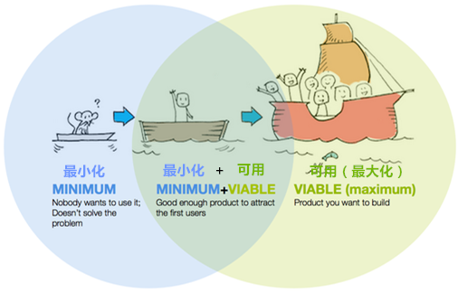

# 你真的了解MVP（最小化可用产品）么？

http://blog.sanjieke.cn/apparticle/1085056.html

MVP（Minimum Viable Product 最小化可用产品）:用最快、最简明的方式建立一个可用的产品原型，这个原型要表达出你的产品最终想要的效果，然后通过迭代来完善细节。

MVP就是边验证边学习，它应该完全以用户问题为中心，而不是以解决方案为中心。

Eric Ries在《精益创业》的理论中提出:

>“所谓最小化可用产品，是让开发团队用最小的代价实现一个产品，以此最大程度上了解和验证对用户问题的解决程度。”

如你所见，“开发MVP-通过用户验证”是创造好产品的第一步。接下来就是用“构建-测量-学习”的方式，在限量测试或者正式运营中，对产品进行循环迭代。
