[豆瓣链接](https://book.douban.com/subject/26697007/)

    作者: 后显慧
    出版社: 机械工业出版社
    出版年: 2016-1-1
    页数: 325
    定价: 69.00
    装帧: 平装
    ISBN: 9787111525820

- [第2章　三圈定位：产品经理能力模型](#%E7%AC%AC2%E7%AB%A0-%E4%B8%89%E5%9C%88%E5%AE%9A%E4%BD%8D%E4%BA%A7%E5%93%81%E7%BB%8F%E7%90%86%E8%83%BD%E5%8A%9B%E6%A8%A1%E5%9E%8B)
  - [第3节　三圈能力模型：产品经理需要软硬结合的能力](#%E7%AC%AC3%E8%8A%82-%E4%B8%89%E5%9C%88%E8%83%BD%E5%8A%9B%E6%A8%A1%E5%9E%8B%E4%BA%A7%E5%93%81%E7%BB%8F%E7%90%86%E9%9C%80%E8%A6%81%E8%BD%AF%E7%A1%AC%E7%BB%93%E5%90%88%E7%9A%84%E8%83%BD%E5%8A%9B)
  - [第4节　用户体验：处女座的优势地位](#%E7%AC%AC4%E8%8A%82-%E7%94%A8%E6%88%B7%E4%BD%93%E9%AA%8C%E5%A4%84%E5%A5%B3%E5%BA%A7%E7%9A%84%E4%BC%98%E5%8A%BF%E5%9C%B0%E4%BD%8D)
  - [第5节　技术能力：产品的技能和工程师的思维](#%E7%AC%AC5%E8%8A%82-%E6%8A%80%E6%9C%AF%E8%83%BD%E5%8A%9B%E4%BA%A7%E5%93%81%E7%9A%84%E6%8A%80%E8%83%BD%E5%92%8C%E5%B7%A5%E7%A8%8B%E5%B8%88%E7%9A%84%E6%80%9D%E7%BB%B4)
  - [第6节　商业思维](#%E7%AC%AC6%E8%8A%82-%E5%95%86%E4%B8%9A%E6%80%9D%E7%BB%B4)
- [第3章　小白产品经理看产品：什么是互联网产品](#%E7%AC%AC3%E7%AB%A0-%E5%B0%8F%E7%99%BD%E4%BA%A7%E5%93%81%E7%BB%8F%E7%90%86%E7%9C%8B%E4%BA%A7%E5%93%81%E4%BB%80%E4%B9%88%E6%98%AF%E4%BA%92%E8%81%94%E7%BD%91%E4%BA%A7%E5%93%81)
  - [第1节　产品经理面试的第一道题：你用哪些产品](#%E7%AC%AC1%E8%8A%82-%E4%BA%A7%E5%93%81%E7%BB%8F%E7%90%86%E9%9D%A2%E8%AF%95%E7%9A%84%E7%AC%AC%E4%B8%80%E9%81%93%E9%A2%98%E4%BD%A0%E7%94%A8%E5%93%AA%E4%BA%9B%E4%BA%A7%E5%93%81)
  - [第2节　什么是好产品，好看还是好用](#%E7%AC%AC2%E8%8A%82-%E4%BB%80%E4%B9%88%E6%98%AF%E5%A5%BD%E4%BA%A7%E5%93%81%E5%A5%BD%E7%9C%8B%E8%BF%98%E6%98%AF%E5%A5%BD%E7%94%A8)
  - [第3节　什么是互联网产品：黑盒子模型](#%E7%AC%AC3%E8%8A%82-%E4%BB%80%E4%B9%88%E6%98%AF%E4%BA%92%E8%81%94%E7%BD%91%E4%BA%A7%E5%93%81%E9%BB%91%E7%9B%92%E5%AD%90%E6%A8%A1%E5%9E%8B)
  - [第4节　像庖丁解牛一样去观察产品](#%E7%AC%AC4%E8%8A%82-%E5%83%8F%E5%BA%96%E4%B8%81%E8%A7%A3%E7%89%9B%E4%B8%80%E6%A0%B7%E5%8E%BB%E8%A7%82%E5%AF%9F%E4%BA%A7%E5%93%81)
  - [第5节　学会用App Store的版本还原产品](#%E7%AC%AC5%E8%8A%82-%E5%AD%A6%E4%BC%9A%E7%94%A8app-store%E7%9A%84%E7%89%88%E6%9C%AC%E8%BF%98%E5%8E%9F%E4%BA%A7%E5%93%81)
- [第4章　理想产品经理的诞生：为自己做产品，以自己为中心](#%E7%AC%AC4%E7%AB%A0-%E7%90%86%E6%83%B3%E4%BA%A7%E5%93%81%E7%BB%8F%E7%90%86%E7%9A%84%E8%AF%9E%E7%94%9F%E4%B8%BA%E8%87%AA%E5%B7%B1%E5%81%9A%E4%BA%A7%E5%93%81%E4%BB%A5%E8%87%AA%E5%B7%B1%E4%B8%BA%E4%B8%AD%E5%BF%83)
- [第5章　一年级产品经理：执行力驱动，产品感培养](#%E7%AC%AC5%E7%AB%A0-%E4%B8%80%E5%B9%B4%E7%BA%A7%E4%BA%A7%E5%93%81%E7%BB%8F%E7%90%86%E6%89%A7%E8%A1%8C%E5%8A%9B%E9%A9%B1%E5%8A%A8%E4%BA%A7%E5%93%81%E6%84%9F%E5%9F%B9%E5%85%BB)
  - [第1节　解决问题，而不是制造问题](#%E7%AC%AC1%E8%8A%82-%E8%A7%A3%E5%86%B3%E9%97%AE%E9%A2%98%E8%80%8C%E4%B8%8D%E6%98%AF%E5%88%B6%E9%80%A0%E9%97%AE%E9%A2%98)
  - [第2节　创意没有价值，执行力才有](#%E7%AC%AC2%E8%8A%82-%E5%88%9B%E6%84%8F%E6%B2%A1%E6%9C%89%E4%BB%B7%E5%80%BC%E6%89%A7%E8%A1%8C%E5%8A%9B%E6%89%8D%E6%9C%89)
  - [第3节　忘记改变世界，先改变自己](#%E7%AC%AC3%E8%8A%82-%E5%BF%98%E8%AE%B0%E6%94%B9%E5%8F%98%E4%B8%96%E7%95%8C%E5%85%88%E6%94%B9%E5%8F%98%E8%87%AA%E5%B7%B1)
  - [第4节　为自己做一个书架：Knowledge Map](#%E7%AC%AC4%E8%8A%82-%E4%B8%BA%E8%87%AA%E5%B7%B1%E5%81%9A%E4%B8%80%E4%B8%AA%E4%B9%A6%E6%9E%B6knowledge-map)
  - [第5节　培养产品感觉和职业人格](#%E7%AC%AC5%E8%8A%82-%E5%9F%B9%E5%85%BB%E4%BA%A7%E5%93%81%E6%84%9F%E8%A7%89%E5%92%8C%E8%81%8C%E4%B8%9A%E4%BA%BA%E6%A0%BC)
- [第6章　二年级产品经理：用户价值驱动，沟通能力培养](#%E7%AC%AC6%E7%AB%A0-%E4%BA%8C%E5%B9%B4%E7%BA%A7%E4%BA%A7%E5%93%81%E7%BB%8F%E7%90%86%E7%94%A8%E6%88%B7%E4%BB%B7%E5%80%BC%E9%A9%B1%E5%8A%A8%E6%B2%9F%E9%80%9A%E8%83%BD%E5%8A%9B%E5%9F%B9%E5%85%BB)
  - [第1节　学会定义流程和产品](#%E7%AC%AC1%E8%8A%82-%E5%AD%A6%E4%BC%9A%E5%AE%9A%E4%B9%89%E6%B5%81%E7%A8%8B%E5%92%8C%E4%BA%A7%E5%93%81)
  - [第2节　代言人：你和用户是一国的](#%E7%AC%AC2%E8%8A%82-%E4%BB%A3%E8%A8%80%E4%BA%BA%E4%BD%A0%E5%92%8C%E7%94%A8%E6%88%B7%E6%98%AF%E4%B8%80%E5%9B%BD%E7%9A%84)
  - [第3节　翻译官：把用户需求翻译成产品需求](#%E7%AC%AC3%E8%8A%82-%E7%BF%BB%E8%AF%91%E5%AE%98%E6%8A%8A%E7%94%A8%E6%88%B7%E9%9C%80%E6%B1%82%E7%BF%BB%E8%AF%91%E6%88%90%E4%BA%A7%E5%93%81%E9%9C%80%E6%B1%82)
  - [第4节　管理需求：沟通能力和信任的关键要素](#%E7%AC%AC4%E8%8A%82-%E7%AE%A1%E7%90%86%E9%9C%80%E6%B1%82%E6%B2%9F%E9%80%9A%E8%83%BD%E5%8A%9B%E5%92%8C%E4%BF%A1%E4%BB%BB%E7%9A%84%E5%85%B3%E9%94%AE%E8%A6%81%E7%B4%A0)
- [第7章　三年级产品经理：运营与规划](#%E7%AC%AC7%E7%AB%A0-%E4%B8%89%E5%B9%B4%E7%BA%A7%E4%BA%A7%E5%93%81%E7%BB%8F%E7%90%86%E8%BF%90%E8%90%A5%E4%B8%8E%E8%A7%84%E5%88%92)
  - [第1节　需求：从被动接受到主动发现](#%E7%AC%AC1%E8%8A%82-%E9%9C%80%E6%B1%82%E4%BB%8E%E8%A2%AB%E5%8A%A8%E6%8E%A5%E5%8F%97%E5%88%B0%E4%B8%BB%E5%8A%A8%E5%8F%91%E7%8E%B0)
  - [第2节　产品价值：微笑带来商业价值](#%E7%AC%AC2%E8%8A%82-%E4%BA%A7%E5%93%81%E4%BB%B7%E5%80%BC%E5%BE%AE%E7%AC%91%E5%B8%A6%E6%9D%A5%E5%95%86%E4%B8%9A%E4%BB%B7%E5%80%BC)
  - [第3节　产品经理与运营：产品生命周期内的合作](#%E7%AC%AC3%E8%8A%82-%E4%BA%A7%E5%93%81%E7%BB%8F%E7%90%86%E4%B8%8E%E8%BF%90%E8%90%A5%E4%BA%A7%E5%93%81%E7%94%9F%E5%91%BD%E5%91%A8%E6%9C%9F%E5%86%85%E7%9A%84%E5%90%88%E4%BD%9C)
  - [第4节　竞争分析、行业蓝图与产品规划](#%E7%AC%AC4%E8%8A%82-%E7%AB%9E%E4%BA%89%E5%88%86%E6%9E%90%E8%A1%8C%E4%B8%9A%E8%93%9D%E5%9B%BE%E4%B8%8E%E4%BA%A7%E5%93%81%E8%A7%84%E5%88%92)
  - [第5节　BAT和行业的产品生态认知](#%E7%AC%AC5%E8%8A%82-bat%E5%92%8C%E8%A1%8C%E4%B8%9A%E7%9A%84%E4%BA%A7%E5%93%81%E7%94%9F%E6%80%81%E8%AE%A4%E7%9F%A5)
  - [第6节　产品是渠道：沟通用户并提供服务](#%E7%AC%AC6%E8%8A%82-%E4%BA%A7%E5%93%81%E6%98%AF%E6%B8%A0%E9%81%93%E6%B2%9F%E9%80%9A%E7%94%A8%E6%88%B7%E5%B9%B6%E6%8F%90%E4%BE%9B%E6%9C%8D%E5%8A%A1)
- [第8章　产品设计与迭代视角做产品](#%E7%AC%AC8%E7%AB%A0-%E4%BA%A7%E5%93%81%E8%AE%BE%E8%AE%A1%E4%B8%8E%E8%BF%AD%E4%BB%A3%E8%A7%86%E8%A7%92%E5%81%9A%E4%BA%A7%E5%93%81)
  - [第1节　再看看那些2000年以来的互联网产品](#%E7%AC%AC1%E8%8A%82-%E5%86%8D%E7%9C%8B%E7%9C%8B%E9%82%A3%E4%BA%9B2000%E5%B9%B4%E4%BB%A5%E6%9D%A5%E7%9A%84%E4%BA%92%E8%81%94%E7%BD%91%E4%BA%A7%E5%93%81)
  - [第2节　0到1是本质变化](#%E7%AC%AC2%E8%8A%82-0%E5%88%B01%E6%98%AF%E6%9C%AC%E8%B4%A8%E5%8F%98%E5%8C%96)
  - [第3节　符合产品生命周期的产品设计逻辑](#%E7%AC%AC3%E8%8A%82-%E7%AC%A6%E5%90%88%E4%BA%A7%E5%93%81%E7%94%9F%E5%91%BD%E5%91%A8%E6%9C%9F%E7%9A%84%E4%BA%A7%E5%93%81%E8%AE%BE%E8%AE%A1%E9%80%BB%E8%BE%91)
  - [第4节　符合迭代和灰度的产品设计逻辑](#%E7%AC%AC4%E8%8A%82-%E7%AC%A6%E5%90%88%E8%BF%AD%E4%BB%A3%E5%92%8C%E7%81%B0%E5%BA%A6%E7%9A%84%E4%BA%A7%E5%93%81%E8%AE%BE%E8%AE%A1%E9%80%BB%E8%BE%91)
  - [第5节　符合用户心理曲线的产品设计逻辑](#%E7%AC%AC5%E8%8A%82-%E7%AC%A6%E5%90%88%E7%94%A8%E6%88%B7%E5%BF%83%E7%90%86%E6%9B%B2%E7%BA%BF%E7%9A%84%E4%BA%A7%E5%93%81%E8%AE%BE%E8%AE%A1%E9%80%BB%E8%BE%91)
  - [第6节　通过迭代释放需求](#%E7%AC%AC6%E8%8A%82-%E9%80%9A%E8%BF%87%E8%BF%AD%E4%BB%A3%E9%87%8A%E6%94%BE%E9%9C%80%E6%B1%82)
  - [第7节　迭代与MVP模式](#%E7%AC%AC7%E8%8A%82-%E8%BF%AD%E4%BB%A3%E4%B8%8Emvp%E6%A8%A1%E5%BC%8F)
- [第9章　运营视角看产品](#%E7%AC%AC9%E7%AB%A0-%E8%BF%90%E8%90%A5%E8%A7%86%E8%A7%92%E7%9C%8B%E4%BA%A7%E5%93%81)
  - [第1节　大运营和小运营](#%E7%AC%AC1%E8%8A%82-%E5%A4%A7%E8%BF%90%E8%90%A5%E5%92%8C%E5%B0%8F%E8%BF%90%E8%90%A5)
  - [第2节　产品运营的核心价值](#%E7%AC%AC2%E8%8A%82-%E4%BA%A7%E5%93%81%E8%BF%90%E8%90%A5%E7%9A%84%E6%A0%B8%E5%BF%83%E4%BB%B7%E5%80%BC)
  - [第3节　恋爱式运营：在合适的时间遇到对的人](#%E7%AC%AC3%E8%8A%82-%E6%81%8B%E7%88%B1%E5%BC%8F%E8%BF%90%E8%90%A5%E5%9C%A8%E5%90%88%E9%80%82%E7%9A%84%E6%97%B6%E9%97%B4%E9%81%87%E5%88%B0%E5%AF%B9%E7%9A%84%E4%BA%BA)
  - [第4节　产品生命周期影响运营节奏](#%E7%AC%AC4%E8%8A%82-%E4%BA%A7%E5%93%81%E7%94%9F%E5%91%BD%E5%91%A8%E6%9C%9F%E5%BD%B1%E5%93%8D%E8%BF%90%E8%90%A5%E8%8A%82%E5%A5%8F)
  - [第5节　收入是自然而然的结果](#%E7%AC%AC5%E8%8A%82-%E6%94%B6%E5%85%A5%E6%98%AF%E8%87%AA%E7%84%B6%E8%80%8C%E7%84%B6%E7%9A%84%E7%BB%93%E6%9E%9C)
  - [第6节　参与感：新运营的口碑驱动](#%E7%AC%AC6%E8%8A%82-%E5%8F%82%E4%B8%8E%E6%84%9F%E6%96%B0%E8%BF%90%E8%90%A5%E7%9A%84%E5%8F%A3%E7%A2%91%E9%A9%B1%E5%8A%A8)
  - [第7节　互联网的核武器：数据与转化率](#%E7%AC%AC7%E8%8A%82-%E4%BA%92%E8%81%94%E7%BD%91%E7%9A%84%E6%A0%B8%E6%AD%A6%E5%99%A8%E6%95%B0%E6%8D%AE%E4%B8%8E%E8%BD%AC%E5%8C%96%E7%8E%87)
  - [第8节　别让运营为产品吹的牛埋单](#%E7%AC%AC8%E8%8A%82-%E5%88%AB%E8%AE%A9%E8%BF%90%E8%90%A5%E4%B8%BA%E4%BA%A7%E5%93%81%E5%90%B9%E7%9A%84%E7%89%9B%E5%9F%8B%E5%8D%95)
- [第10章　操盘与人性视角悟产品](#%E7%AC%AC10%E7%AB%A0-%E6%93%8D%E7%9B%98%E4%B8%8E%E4%BA%BA%E6%80%A7%E8%A7%86%E8%A7%92%E6%82%9F%E4%BA%A7%E5%93%81)
  - [第1节　产品操盘手：超越产品经理视角](#%E7%AC%AC1%E8%8A%82-%E4%BA%A7%E5%93%81%E6%93%8D%E7%9B%98%E6%89%8B%E8%B6%85%E8%B6%8A%E4%BA%A7%E5%93%81%E7%BB%8F%E7%90%86%E8%A7%86%E8%A7%92)
  - [第2节　乌合之众的产品观念](#%E7%AC%AC2%E8%8A%82-%E4%B9%8C%E5%90%88%E4%B9%8B%E4%BC%97%E7%9A%84%E4%BA%A7%E5%93%81%E8%A7%82%E5%BF%B5)
  - [第3节　贪婪与懒惰：17岁的“科技红颜”](#%E7%AC%AC3%E8%8A%82-%E8%B4%AA%E5%A9%AA%E4%B8%8E%E6%87%92%E6%83%B017%E5%B2%81%E7%9A%84%E7%A7%91%E6%8A%80%E7%BA%A2%E9%A2%9C)
  - [第4节　为什么苹果的产品与众不同](#%E7%AC%AC4%E8%8A%82-%E4%B8%BA%E4%BB%80%E4%B9%88%E8%8B%B9%E6%9E%9C%E7%9A%84%E4%BA%A7%E5%93%81%E4%B8%8E%E4%BC%97%E4%B8%8D%E5%90%8C)
  - [第5节　制造“哇”点：极致的产品，用细节打动用户](#%E7%AC%AC5%E8%8A%82-%E5%88%B6%E9%80%A0%E5%93%87%E7%82%B9%E6%9E%81%E8%87%B4%E7%9A%84%E4%BA%A7%E5%93%81%E7%94%A8%E7%BB%86%E8%8A%82%E6%89%93%E5%8A%A8%E7%94%A8%E6%88%B7)
  - [第6节　少点一下就是革命](#%E7%AC%AC6%E8%8A%82-%E5%B0%91%E7%82%B9%E4%B8%80%E4%B8%8B%E5%B0%B1%E6%98%AF%E9%9D%A9%E5%91%BD)
  - [第7节　客服是不是很重要](#%E7%AC%AC7%E8%8A%82-%E5%AE%A2%E6%9C%8D%E6%98%AF%E4%B8%8D%E6%98%AF%E5%BE%88%E9%87%8D%E8%A6%81)
  - [第8节　博弈与拍卖：最简单的运营机制](#%E7%AC%AC8%E8%8A%82-%E5%8D%9A%E5%BC%88%E4%B8%8E%E6%8B%8D%E5%8D%96%E6%9C%80%E7%AE%80%E5%8D%95%E7%9A%84%E8%BF%90%E8%90%A5%E6%9C%BA%E5%88%B6)
  - [第9节　产品要性感，而不是赤裸裸](#%E7%AC%AC9%E8%8A%82-%E4%BA%A7%E5%93%81%E8%A6%81%E6%80%A7%E6%84%9F%E8%80%8C%E4%B8%8D%E6%98%AF%E8%B5%A4%E8%A3%B8%E8%A3%B8)
  - [第10节　为98%的用户设计产品](#%E7%AC%AC10%E8%8A%82-%E4%B8%BA98%E7%9A%84%E7%94%A8%E6%88%B7%E8%AE%BE%E8%AE%A1%E4%BA%A7%E5%93%81)

# 第2章　三圈定位：产品经理能力模型
## 第3节　三圈能力模型：产品经理需要软硬结合的能力
一般来说，我们把产品经理的能力分为**用户体验**、**技术能力**和**商业思维**3个方面。

## 第4节　用户体验：处女座的优势地位
如何培养产品经理的用户体验能力呢？我一般建议三个维度：**场景**、**需求**和**动机**。当你在讨论一个产品的需求、用户痛点和体验的时候，一定要还原到场景里面，看看用户当时的需求，并且了解他彼时的动机，来看你的产品是否满足用户需求。

## 第5节　技术能力：产品的技能和工程师的思维
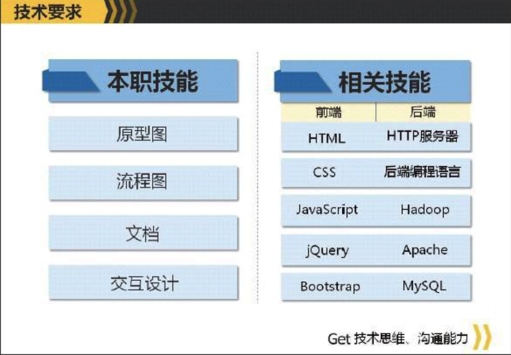

不懂技术的产品经理，沟通起来总会跌跌撞撞，还觉得全世界都与他为敌。

## 第6节　商业思维
商业思维比产品思维可能涵盖的更多，需要全面看行业、格局、生态，并且通过产品打出自己的一个空间。

# 第3章　小白产品经理看产品：什么是互联网产品
## 第1节　产品经理面试的第一道题：你用哪些产品
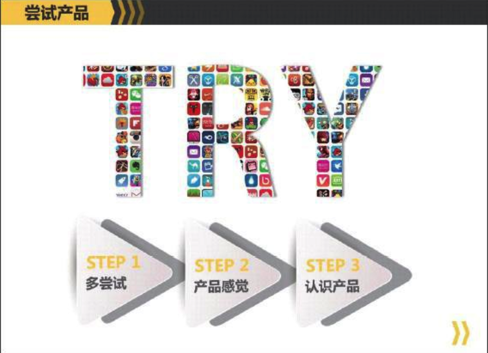

广泛的体验产品，是从一个小白用户转化为职业产品经理的重要一步。

## 第2节　什么是好产品，好看还是好用
我们真正在反思一个产品的时候，往往会发现，先要让它好用，然后再让它尽可能地好看。

## 第3节　什么是互联网产品：黑盒子模型
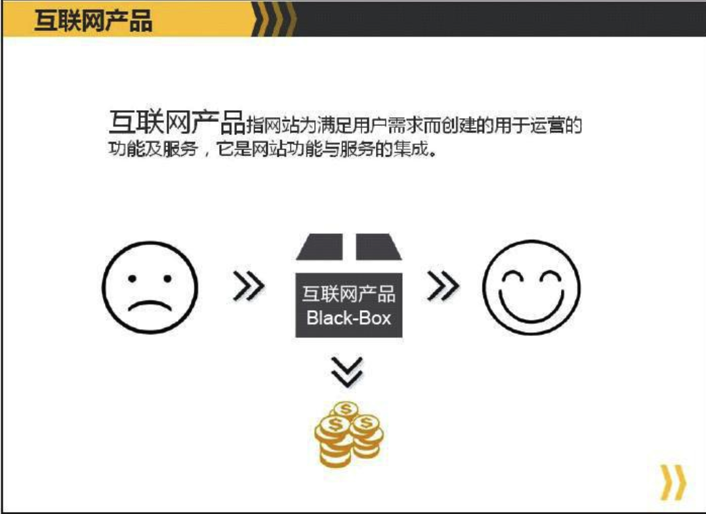

互联网产品就是**黑盒子（Black-Box）**。

互联网产品是一种能够带来用户微笑价值和可能带来商业价值的黑盒子。这个黑盒子因为不同的行业和语境，内部结构也不一样，但最基本的结构是T模型。T的上面横向是信息架构，纵向是业务流程。

也就是说，互联网产品是一个通过信息架构和业务流程组成的黑盒子，它首先能够带来用户微笑，然后能够带来商业价值。

- 推论一：互联网产品的第一价值是微笑价值，然后才可能带来商业价值。
- 推论二：传统行业的产品，比如房地产，就是反向进行的，用户从微笑变成哭，然后带来商业价值。
- 推论三：不管什么行业，黑盒子里面的基本结构都是T模型组成的，而横向的信息架构一共有3种类型，纵向的业务流程应该也是呈现“泳道状”的。

## 第4节　像庖丁解牛一样去观察产品
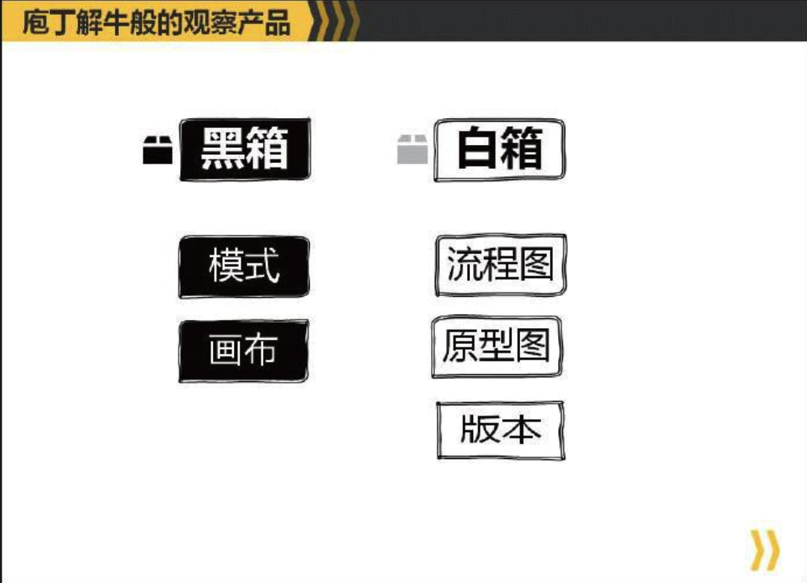

观察产品和认识产品，有两个阶段，第一个阶段，远远看，看外观；第二个阶段，细细看，像庖丁解牛一样剖析它的结构。

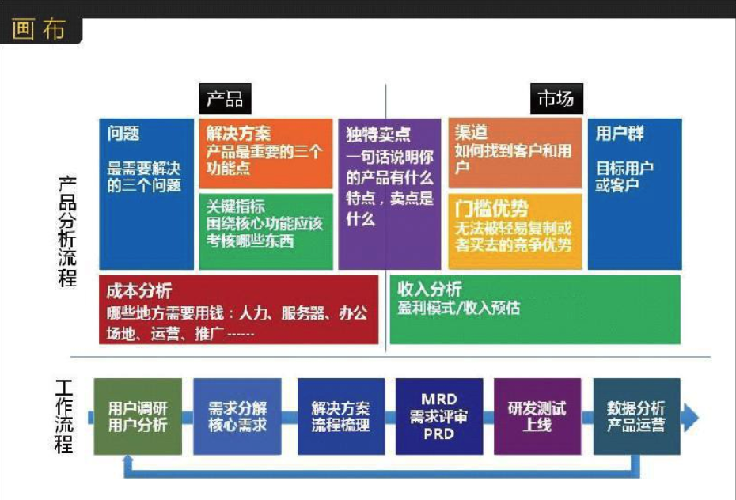

画布分析法

## 第5节　学会用App Store的版本还原产品
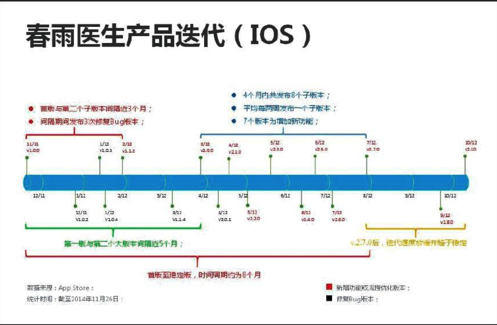

版本还原是一种重要的产品认识方法。

可以看出一些常规的规律。
1. 大型版本早期要更加扎实和简单，这样可以容纳不同的小版本试错和功能迭代，不断测试用户需求。
2. 大版本的更新不应该太频繁。如果太频繁，则小版本没法充分释放，用户需求也没法充分测试。而且，如果大版本更迭频繁，那一定是整体思路没有想清楚，不断在底层设计上“调头”。
3. 小版本要快速发布，不断测试用户需求，不应该对小版本功能的定位太过纠结，要知道，小版本的需求可以不断更迭，最快的一周就可以更新。这个时候，重要的是不断更新需求、排出优先级，控制节奏。

# 第4章　理想产品经理的诞生：为自己做产品，以自己为中心
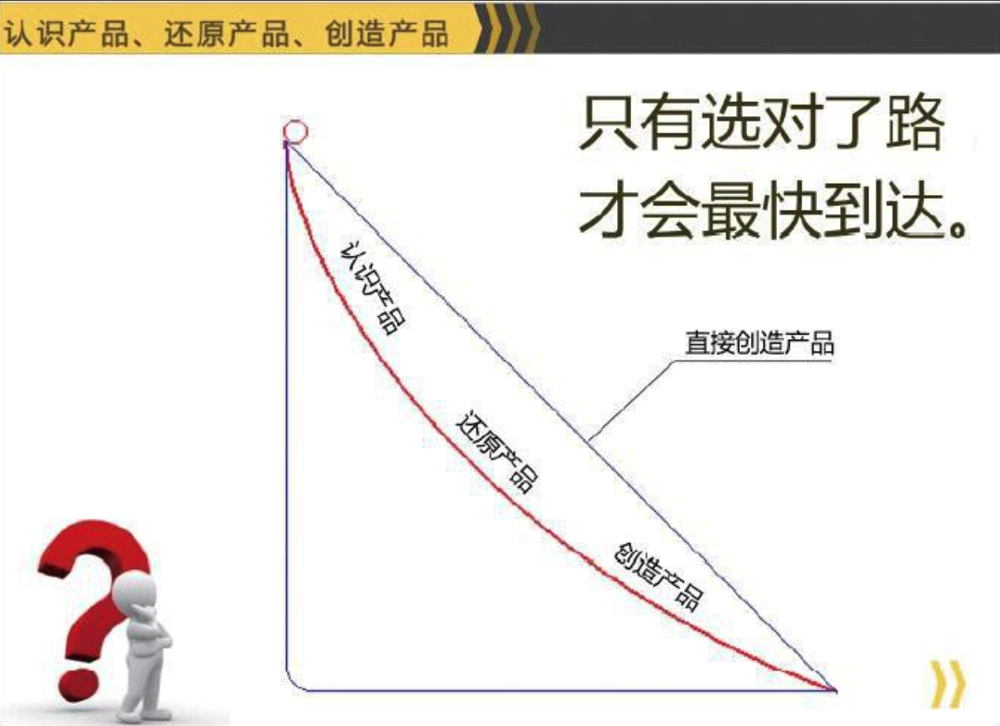

创造性地提出了一套产品经理的学习路径。这条路径就是：认识产品（Recognize）、还原产品（Analysis）和创造产品（Creative）的RAC模型。

我们希望通过RAC模型达到下面的目标：

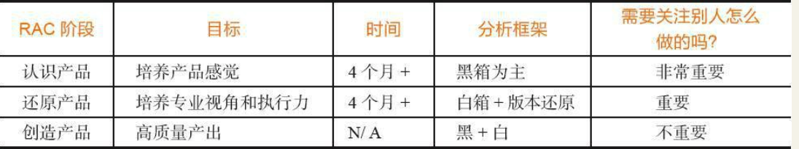

# 第5章　一年级产品经理：执行力驱动，产品感培养
## 第1节　解决问题，而不是制造问题
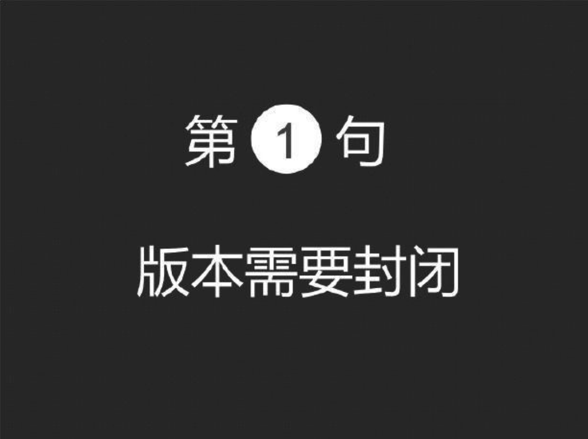

怎么去定义一个版本呢？这是很多理想产品经理比较疑惑的一个问题。基本上有3个逻辑。
1. 版本大小的定义，需求或者功能本身的评估。一般情况下，我对大版本如V1.0-V2.0版本的定义，是全新功能的增加，并且平行于主体功能或者在主体功能上进行延展。中版本如V1.2-V1.2版本的定义是对现有功能点的提升、改进和优化。而小版本如V1.2.2-V1.2.3版本则是对现有功能中某些分支和细节功能的Bug修复、文案修复、功能增删等。这是需求本身的属性。
2. 版本需求列表的定义，首先要看功能上的耦合程度。如某一个功能的上线，必须依附另一功能；或者某一子功能的上线，会牵扯到父功能的升级。那么，这几个功能就应该放到一个版本里面，并且根据上面（1）的逻辑，定义版本的基本。其次，还要看时间上的优先级。我们知道每个版本的需求解决量不应该太多，越多的版本需要的时间越多，失败风险越大，所以我们应该通过小版本快速迭代方式来做。因此需要在不同需求中，确定需求的优先级。通过优先级高低来判断版本中需要解决的合理的需求点。
3. 版本需要封闭。为什么版本需要封闭呢？非常简单，没有封闭的版本是永远无法完成的版本。版本需求不断增加，开发时间不断拉长，失败风险也不断增加。根据国外的研究结果，超过9个月的版本成功比例呈极大下降趋势，如下图所示。

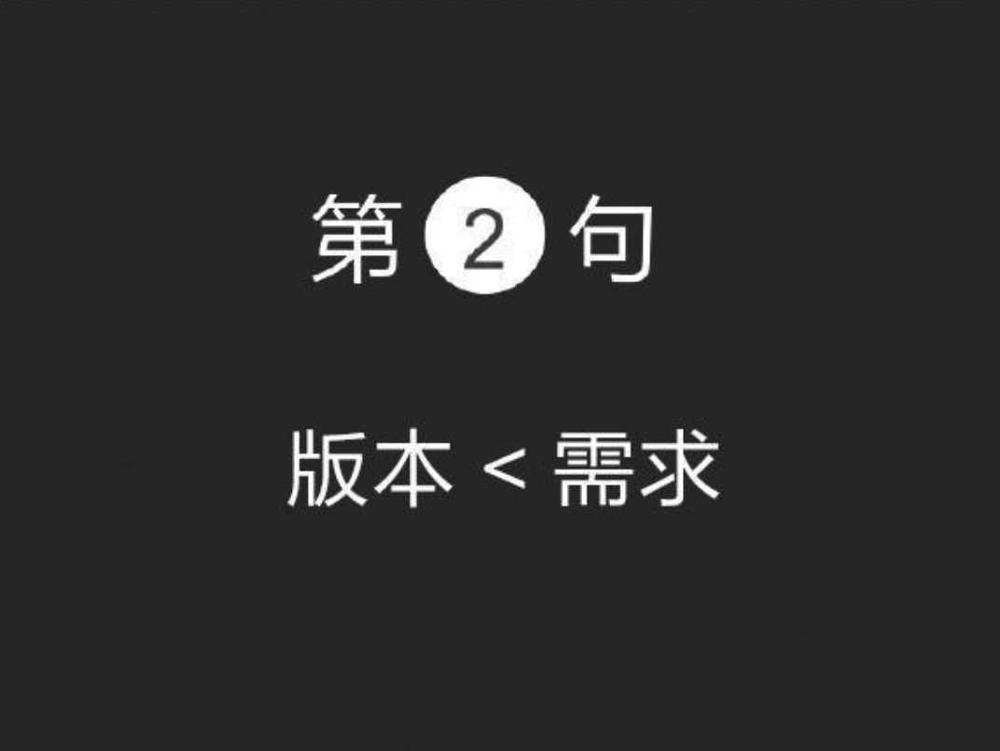

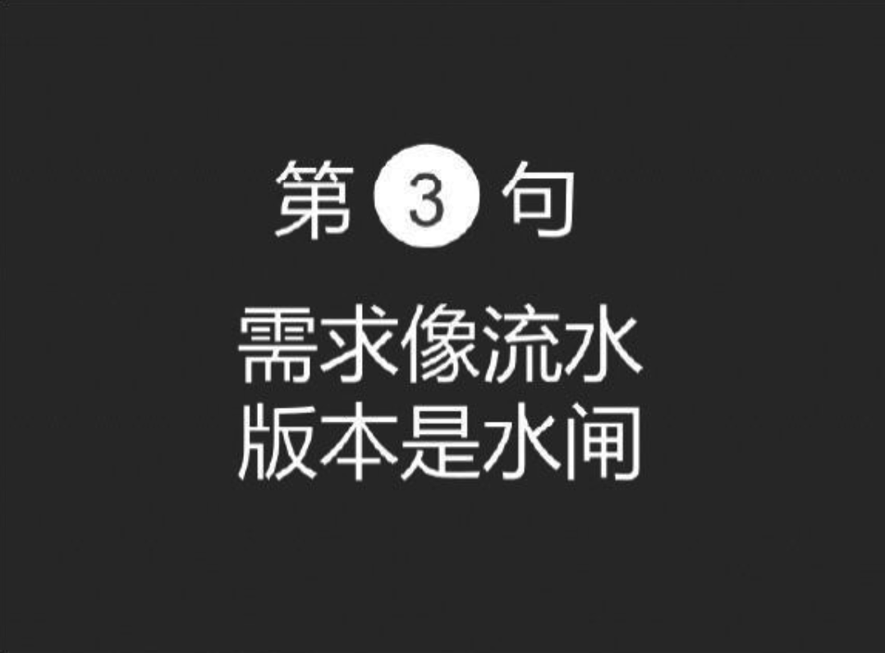

管理版本的人一定要知道，版本小于需求，一定是需求的子集。不要把版本做成一个大口径的垃圾桶，什么都可以往里丢。

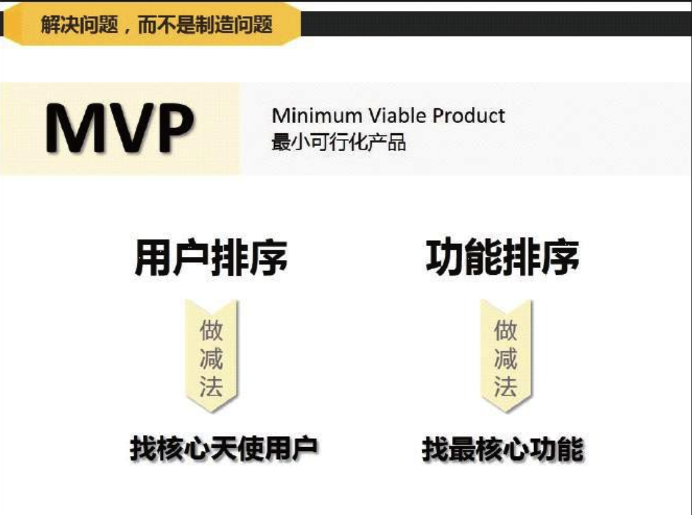

用户排序：理论上每款产品都会面临很多类型的用户。我们是要都给他们做产品吗？显然不是，我们需要给这些用户做优先级的排序，梳理用户类型，不断做减法，找到其中的核心天使用户，这些用户是我们非常典型的用户，他们对产品来说基本没有运营的成本。他们的需求一般来说是典型而具体的。这类天使用户（也可以叫种子用户）是我们早期产品应该关注的。

功能排序：在早期的产品版本里面，你可能很难切中最核心的功能，但你也一样要通过功能排序，梳理最重要和典型的功能，做减法，在最小范围内完成一款可用的产品，并把这款产品拿到用户面前，让用户使用。不要纠结到底应该上哪些功能，而应该先完成产品的基本形态，满足一两个用户的典型场景需求就可以了。千万注意，这个时候你可能还找不到最核心的功能，但不应放弃努力，更不能放弃MVP产品的推出。

## 第2节　创意没有价值，执行力才有
产品经理不需要想法，需要的是逻辑能力和执行力！

## 第3节　忘记改变世界，先改变自己
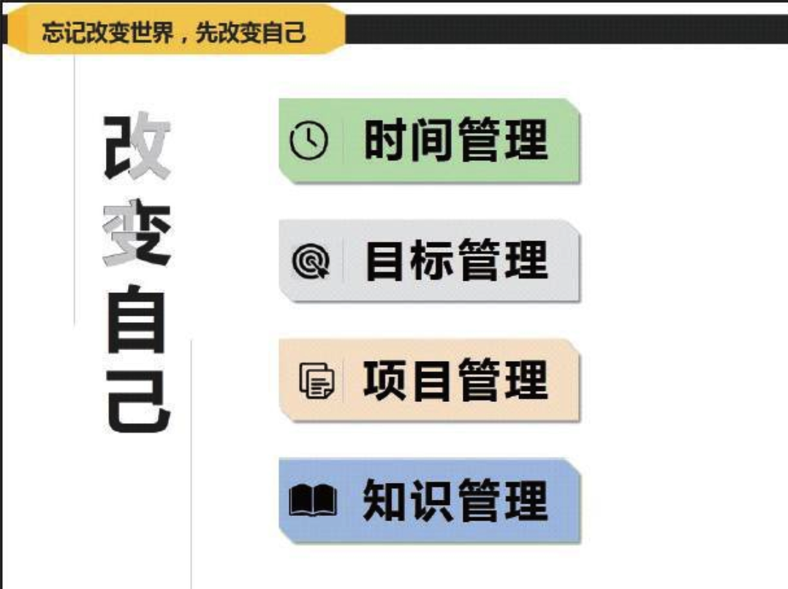

如果想改变世界，先改变自己。先让自己强大起来。你至少要在时间管理、目标管理、项目管理和知识管理4个方面做好基础打造工作。

## 第4节　为自己做一个书架：Knowledge Map
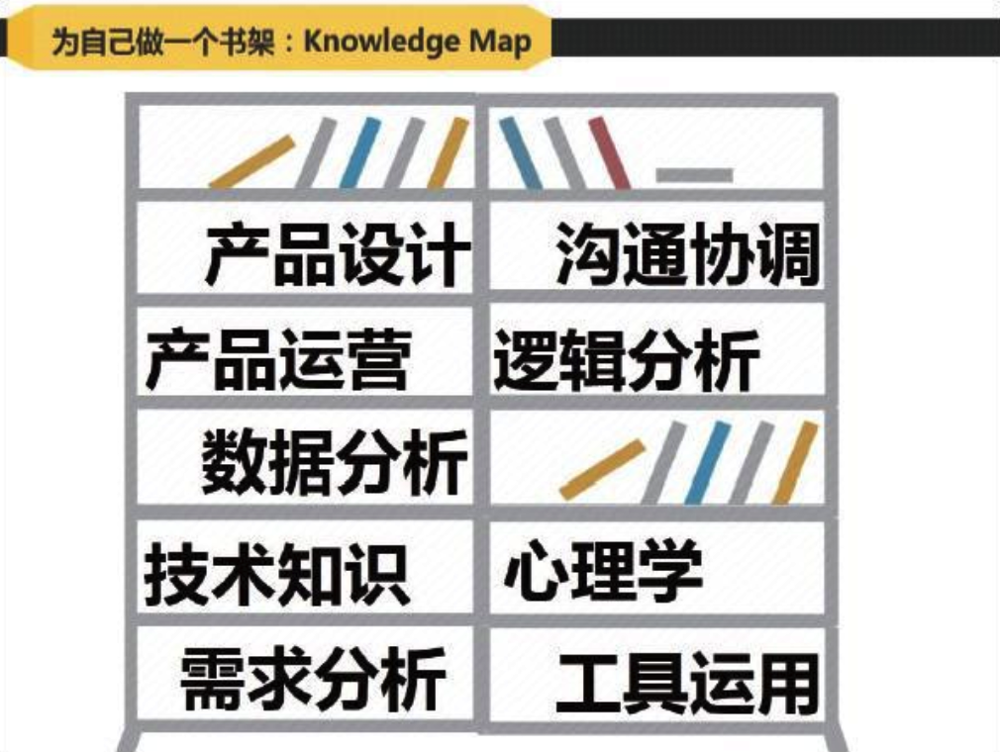

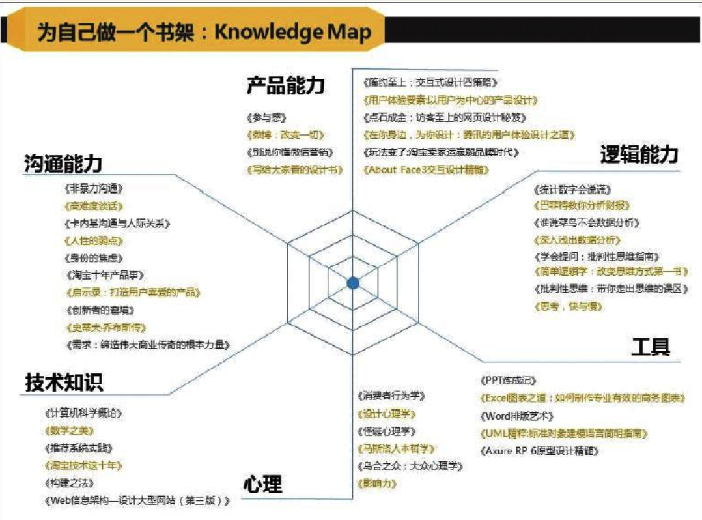

我们为大家准备了一个阅读雷达。在这个阅读雷达里面，我们提供了4个维度的阅读计划，大家可以由中心到两边地去阅读，把自己的雷达面积拓展得越来越宽。

## 第5节　培养产品感觉和职业人格
作为一个用户，你可以有自己的喜好。但作为职业的产品经理，你应该什么产品都用，不能有什么禁忌。

# 第6章　二年级产品经理：用户价值驱动，沟通能力培养
## 第1节　学会定义流程和产品
二年级产品经理应该非常了解流程对于流程有着“令人发指”的严格。将用户场景流程化，其实就是将用户故事产品化的过程。

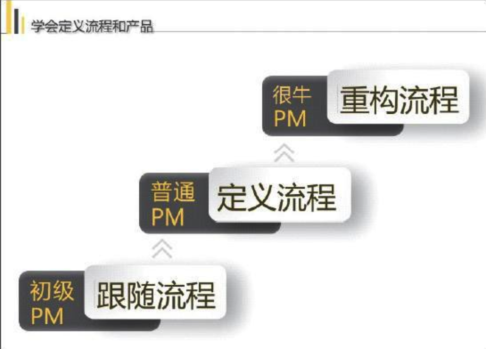

很牛的产品经理可以重构流程，将原有业务流程优化或者打散了重新布局，并形成类似游泳池里的泳道一样的“泳道图”，将相关联的流程联系起来。

普通的产品经理则是定义流程，也就是我上面所说的，把业务场景、用户需求通过流程和功能的方式定义出来。

而初级的产品经理则需要学会跟随流程（follow the flow）。

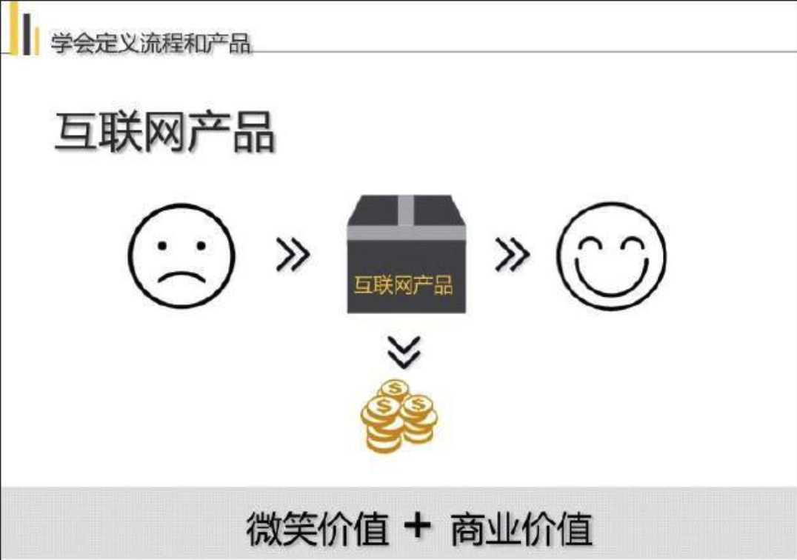

我在看了很多产品之后发现，其实互联网产品是通过T模型定义的，横向是信息架构，纵向是业务流程。整体来看，用户通过信息架构引导进入业务流程，在业务流程中完成所谓的“需求”。

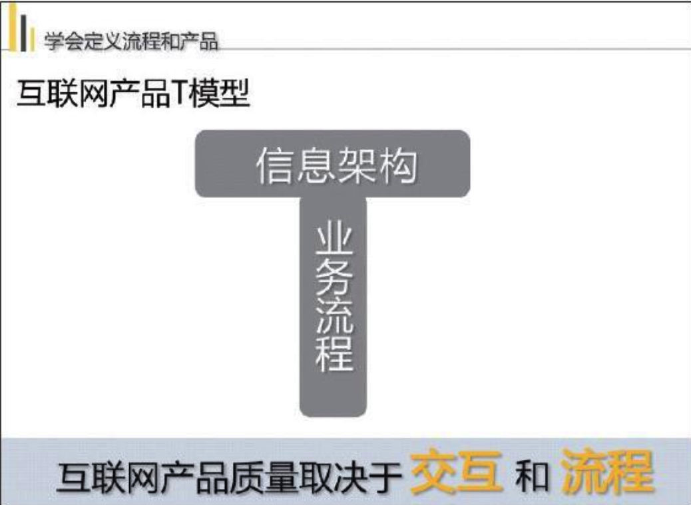

为了更好地分析这个框架，我进一步提出了横向的信息架构，目前一共是3类：以YAHOO为代表的“类目陈列”，以Google为代表的“搜索直达”，以Facebook为代表的“数据订阅推送”。我们可以看到，目前所有网站的信息架构都是在以上3个模式里面选择了其中的一个、两个或者3个。

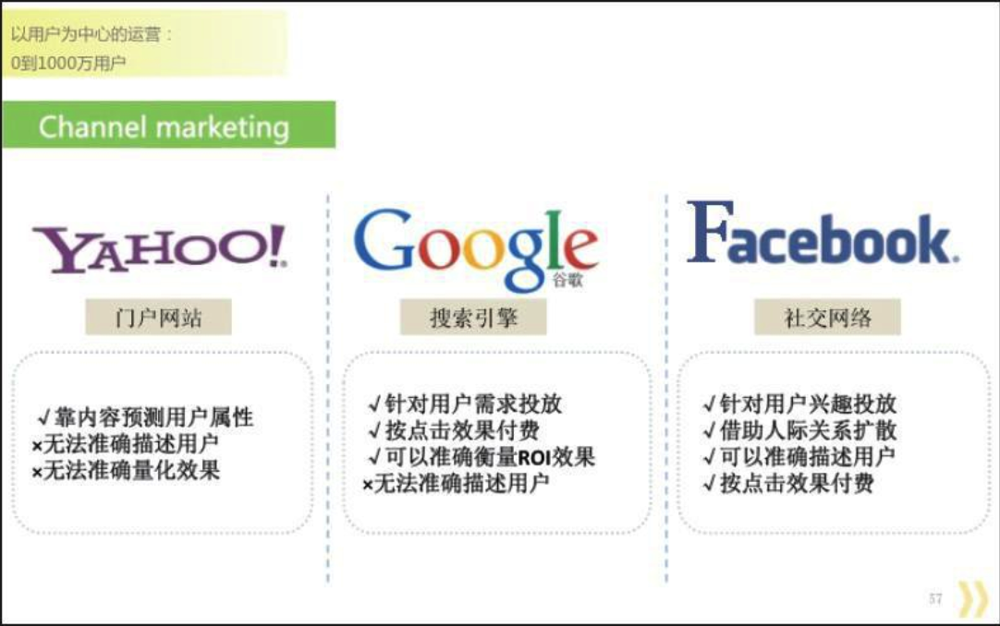

而业务流程则是我们之前说的，代表了业务通过某个路径或者动线推进，以完成用户在这个场景下的“任务”。

需要提示的是，不同的场景有不同的流程，而这些流程往往是交织在一起形成了“泳道图”，比如：
1. 用户在前台下单，有前台下单的流程。
2. 客服在后台确认订单，有客服流程。
3. 仓储在仓库备货，有仓储流程。
4. 物流在派送货物，有物流流程。

这些流程有时有先后顺序，有时则交叉行进，我们把它们放在一起称为“泳道图”。

## 第2节　代言人：你和用户是一国的
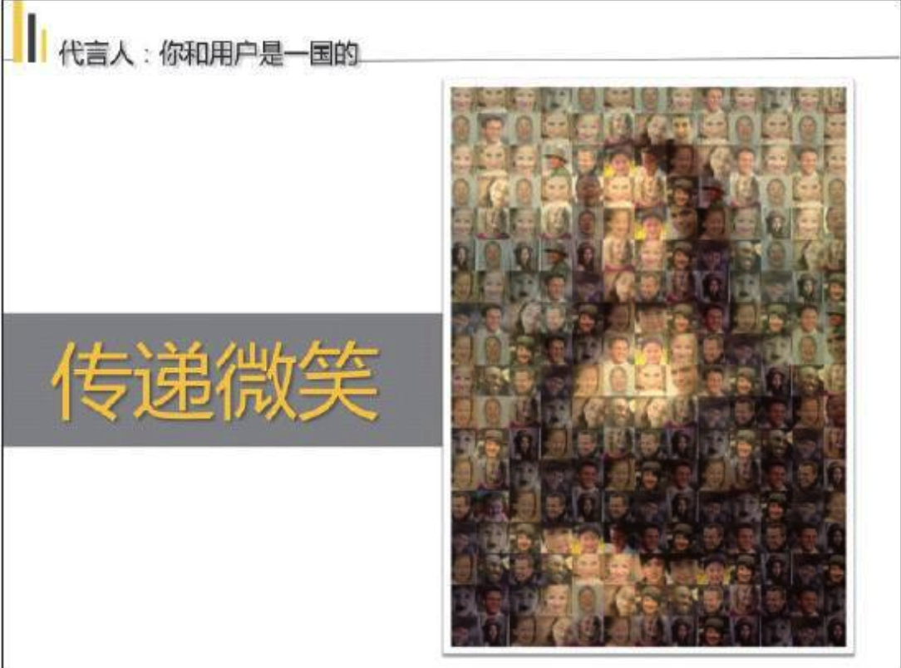

鉴于我们对产品的黑盒子定义，我认为互联网产品的第一价值是微笑价值，那么产品经理则应该是代言用户的微笑价值，产品经理必须是用户在产品决策上的代言人！

## 第3节　翻译官：把用户需求翻译成产品需求
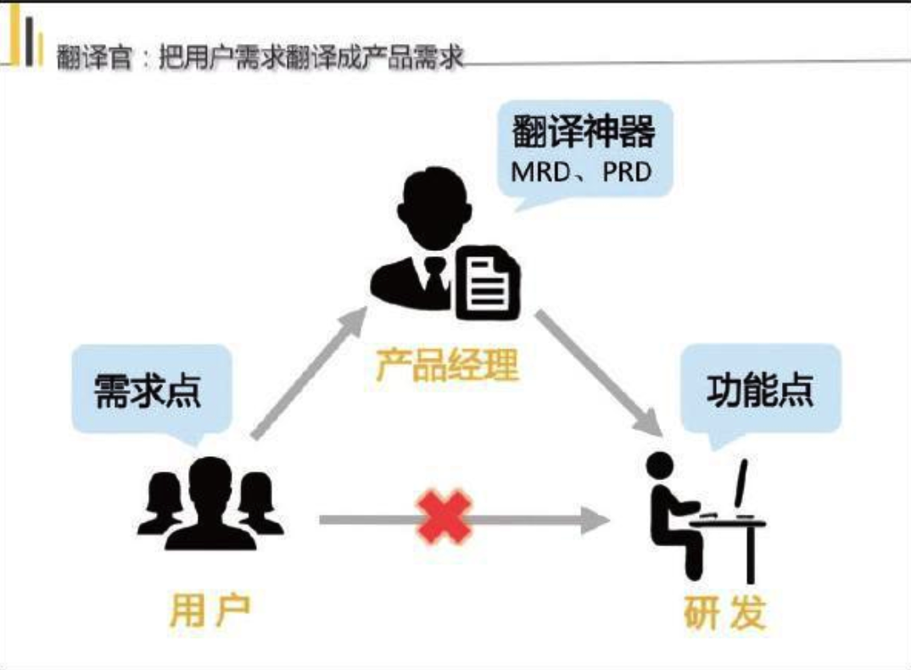

如果说获取用户需求是产品经理的第一个素质，那么翻译需求的能力就是产品经理第二个重要素质。这个素质，包括讲故事的能力、抽象能力、逻辑能力和文档写作能力。
1. 讲故事的能力。就是把用户的需求场景化，具体地讲出用户的需求，而不是泛泛地提出一些标签或者概念。好的需求都是具体的需求。你不能说用户有安全的需求、生理的需求、发展的需求、社交的需求和自我实现的需求。我们说这样的故事不性感，性感的故事应该是场景化、人物化和故事化的。
2. 抽象能力。我们经常看到很多人滔滔不绝地讲故事，讲故事的能力很强，但无法从里面抽象出核心的需求点，就像滴滴出行产品的核心需求，有人说在一线城市上下班的时候打车难，但更核心的是出租车效率低以及车辆供给不足，所以产品的需求应该转移到怎样帮助司机提升运营效率这个问题上。基于此才会设计出好产品。
3. 逻辑能力。归纳和推论的能力是产品经理在做需求翻译时候的一个重要能力，比如三节课，我们希望构建一个学习社区，基于这个需求，我们需要把用户关系打通，那我们就要分析用户是轻社交还是重社交，是熟关系还是生关系，不同的定位会决定我们是用直接彼此认识还是通过某个渠道彼此认识的方式。最后，我们用了基于某个作业彼此发现的产品设计逻辑。
4. 文档写作能力。我们戏称产品经理要有4大文档做伴，所以写作文档的能力也很重要。不管是MRD、PRD，还是原型和流程，都需要我们把嘴上能说清楚的东西通过静态的文字和图片表达出来。

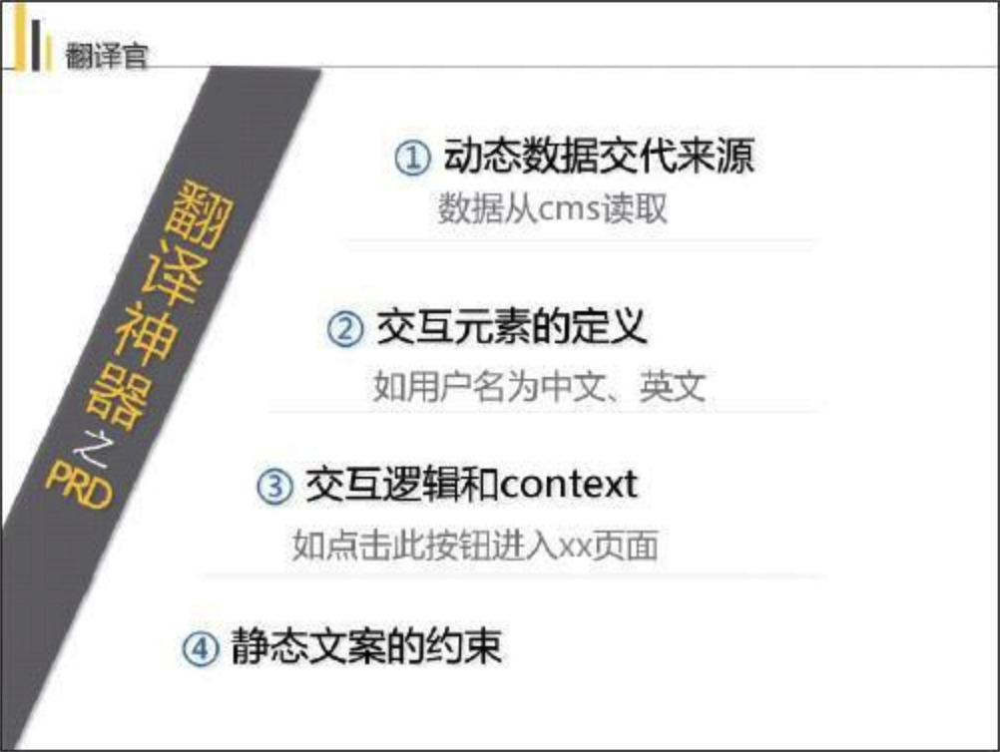

但不论什么样的格式，PRD还是有几个原则要把握，因为没有这几个原则，开发是没法执行这个文档的。
1. 动态数据的来源和去向要交代清楚。这个接口的数据从哪儿来？怎么展示？展示其中的哪些字段？这个产品设计要求，必须写清楚。来自后端数据库或者是API等对开发的接口要求是不一样的。
2. 交互元素要定义。一般交互方式不用特别说明，但其中的一些交互元素要定义清楚，所谓交互元素是指用户在交互过程中涉及的元素，比如用户要填写的内容、用户要点击的内容、用户要浏览的内容等，这些都是交互元素，要定义清楚。比如用户注册账号的时候，用户名是什么样的，是不是有特别要求。
3. 交互逻辑和上下文关系要交代清楚。交互逻辑是指点击、输入反馈、交互结果等元素要有明确定义。比如点击“完成注册”按钮判断是否合法，合法则显示“恭喜你注册成功”，不合法则提示“您没有按照要求填写信息”，并用红色字体提示你哪些字段不合法。
4. 静态文案的约束。因为我们在画线框图的时候，都是随机画的一些文案，而真实开发的时候，前端是要写死这些内容的，所以最好把静态文案在PRD写死，写确定，这样后期出设计图和上线的时候就不用再次修改了。不要小看这个事情，它常常能让你节省3个环节的返工时间。

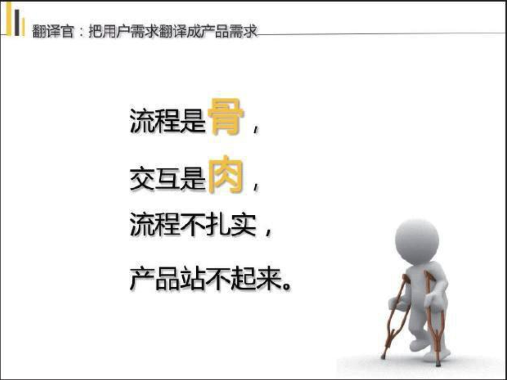

我们再来说说流程。流程图有很多可以讲的，我希望先在认知和理解层面建立基础。

第一个重要的理念是，流程是骨，交互是肉，肉可多可少，可美可丑，但骨不能歪，不能断。

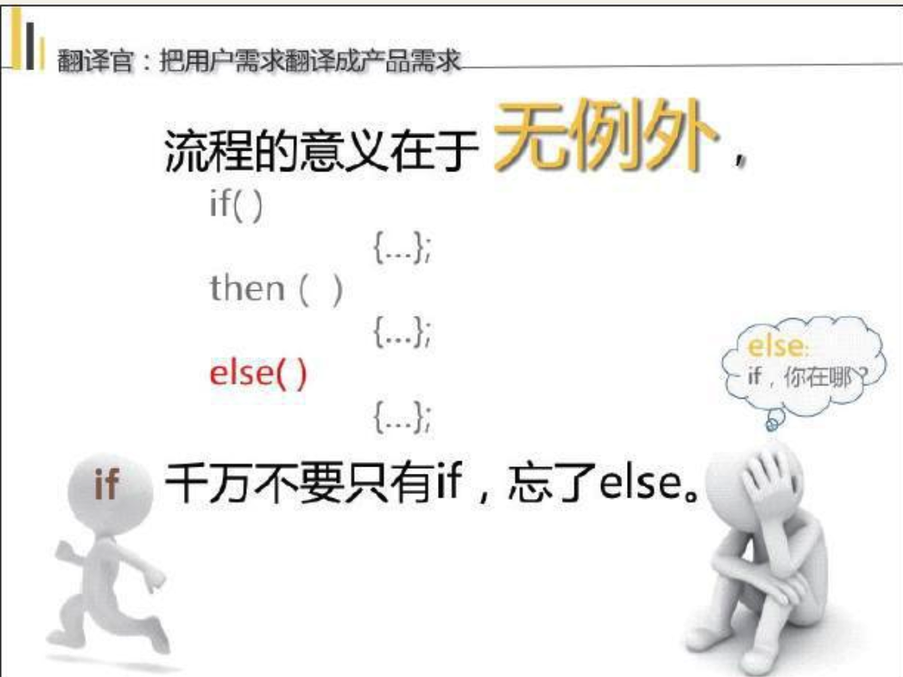

第二个重要的理念是，流程的意义在于“无例外”。很多Bug的产生，是因为主流程和支流程在制止例外的时候出现缝隙，导致用户进入某个“很少出现的场景”里面。

## 第4节　管理需求：沟通能力和信任的关键要素
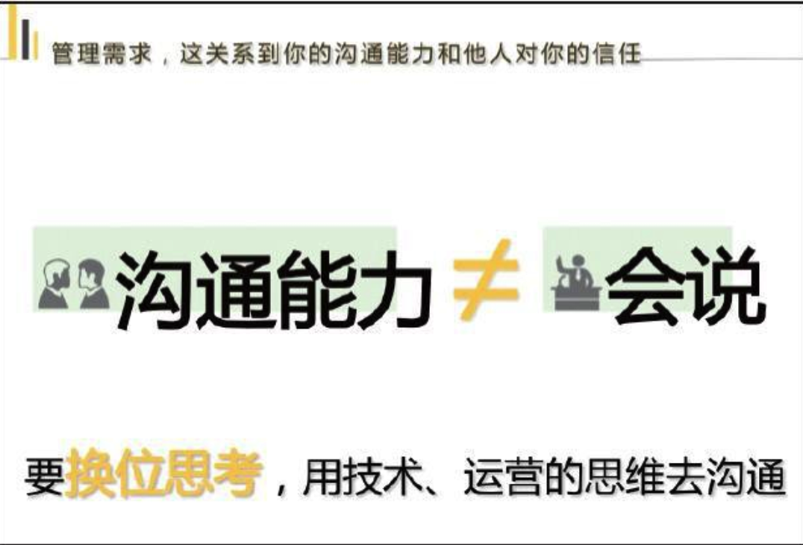

管理需求，我们往往只看到它是一种工作能力和效率，但事实上，对产品经理来说，也会影响你的“人品”。一个不能保护研发、不能管理需求的产品经理是“不被需要的产品经理”，不管你能力多强、效率多高，都是不被需要的。

除了从沟通方面去管理需求，我们也要控制产品的节奏，了解从故事到开发的不同。

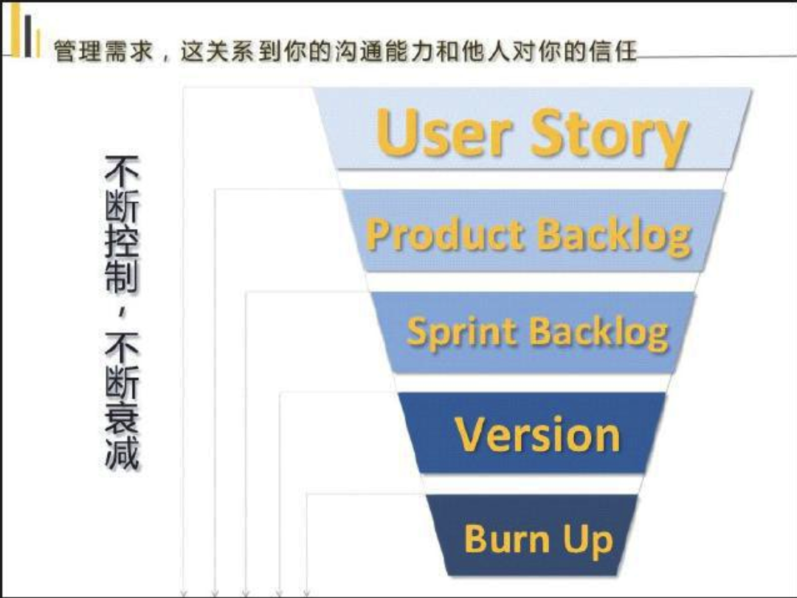

我们引用一张敏捷的图来解释，对于技术来说，产品经理就是一个说故事的人，满嘴的故事，是不是靠谱不知道。所以他们希望你说得具体点儿（User Story），把故事落实到产品的需求点（Product Backlog），然后在这些需求点里面排出优先级（Sprint Backlog），然后排出版本（Version），他们做开发和不断燃烧（Burn Up）。

这一个过程产品经理一定要了解，因为这就是一般的技术思考的过程。

而产品经理保护技术的一个方法，就是用他们的思维节奏和做事路径去抵挡外部的大量需求。

# 第7章　三年级产品经理：运营与规划
三年级的产品经理必须具备产品的运营和规划的视角，想问题的角度从某个具体的产品、功能、需求、流程向更加广泛的用户、市场、未来、竞争者和合作者的角度去考虑了。

## 第1节　需求：从被动接受到主动发现
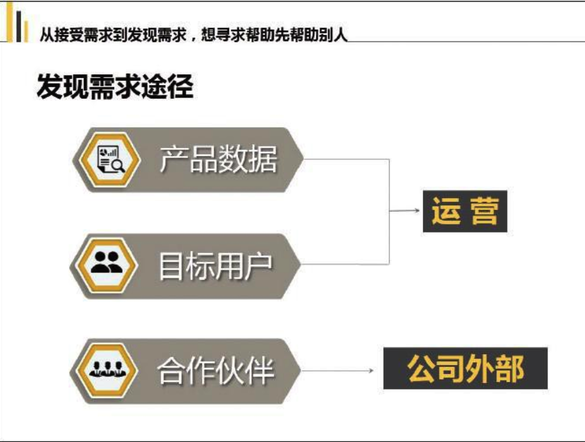

一般来说，需求从哪里发现呢？我们说来自两个方面：产品内和产品外。
1. 产品内。主要是产品的用户和数据。我们提出“向迭代要数据，向数据要迭代”就是这个道理，希望通过迭代的数据，来获取下一个版本的方向。我们要从现有的产品运行数据、活跃数据和交易数据中读出我们可以改善的空间，发现用户潜在的需求。同时，也可以通过用户提交的反馈、核心用户的访谈来发掘用户的潜在需求。
2. 产品外。一般情况下，公司内外部的合作伙伴、老板等都是我们外部需求的来源方，但外部需求代表的是需要被验证的需求，而非必然存在的需求。

内部需求是已经被验证了的，在优先级上高于产品外部需求。外部需求是潜在需要验证的需求，需要根据真实场景排出优先级去试验。所以一般来说，新版本的功能优先级应该是先内后外。

## 第2节　产品价值：微笑带来商业价值
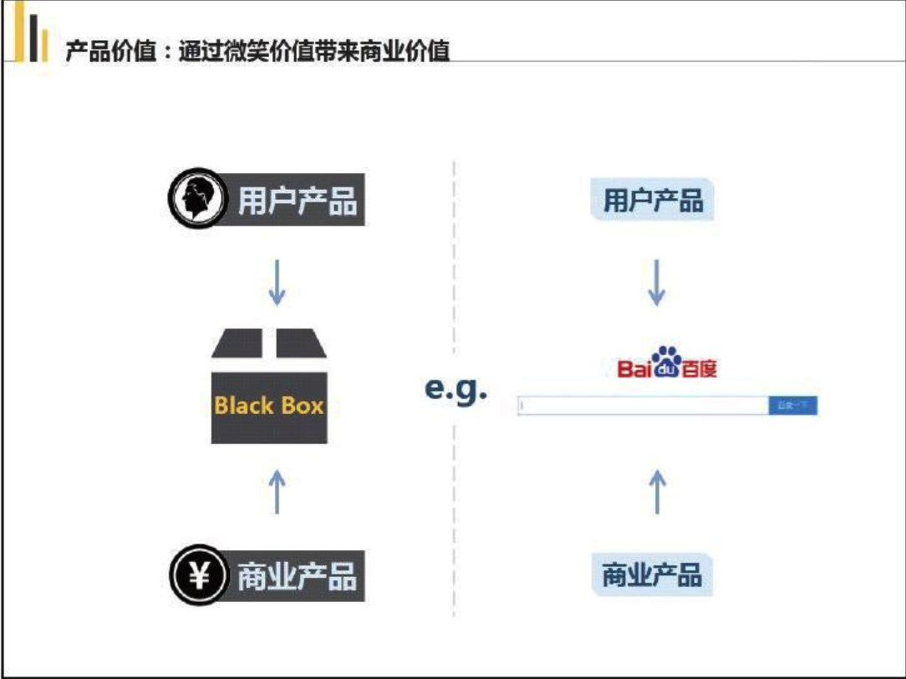

互联网产品就像一个硬币的两面，一面是用户产品，一面是商业产品，需要不断调整它们的关系。

产品经理应该知道，好产品需要好运营，产品和运营是相互依赖的关系。运营的核心是让微笑价值最大化，运营也是产品自我实现的方式。

说到商业价值，我总结了3种变现模式：面向用户收费的to C，面向企业的to B，以及B和C交易平台收取佣金的B to C模式。第一种的代表公司是腾讯，第二种的代表公司是百度，第三种的代表公司是阿里。

面向用户赚钱的公司，需要产品用户体验好；面向企业赚钱的公司，需要技术能力高；面向平台去收取佣金的公司，需要运营能力强。这些基因造就了腾讯重视产品，百度重视技术，阿里重视运营。

## 第3节　产品经理与运营：产品生命周期内的合作
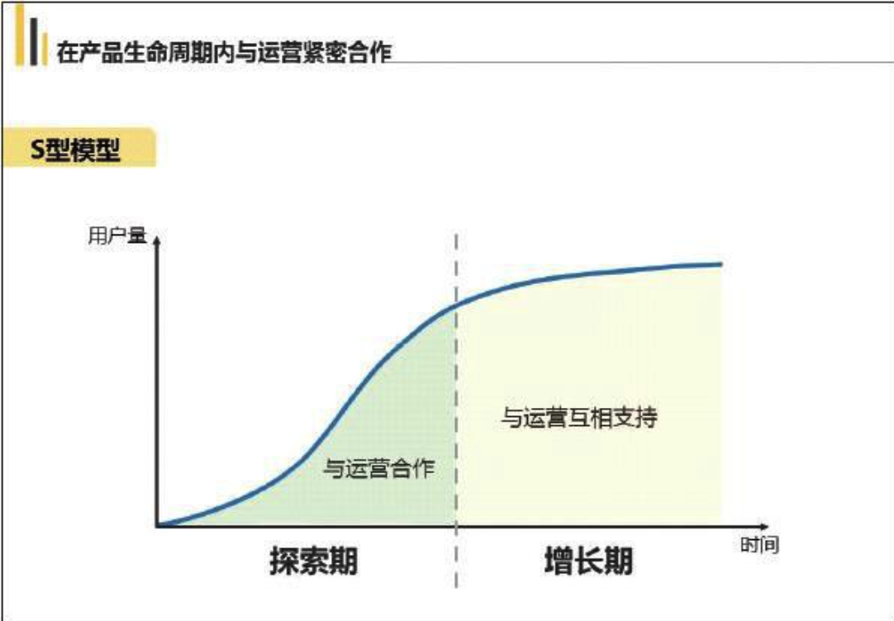

我们把产品生命周期曲线简单地分为探索期和增长期，在探索期的时候，产品与运营是密切合作的，产品为运营提供“弹药”，运营为产品提供“靶子”，产品和运营协同推动产品的探索和定位，如果这个阶段产品和运营是分离的，那么产品的探索时间会被拉得很长。在增长期的时候，产品和运营要相互支持，产品的迭代和长期规划能够为运营带来更多的空间，而运营的努力将为产品带来更多的可能性和方向，甚至能够带来更多的周边机会和新产品的孵化机会。

## 第4节　竞争分析、行业蓝图与产品规划
三年级产品经理应该更加关注横向和纵向的产品变化。所谓横向的变化，是指竞争对手的产品、行业的格局和蓝图；所谓纵向的变化，是指产品的前世今生、未来规划。

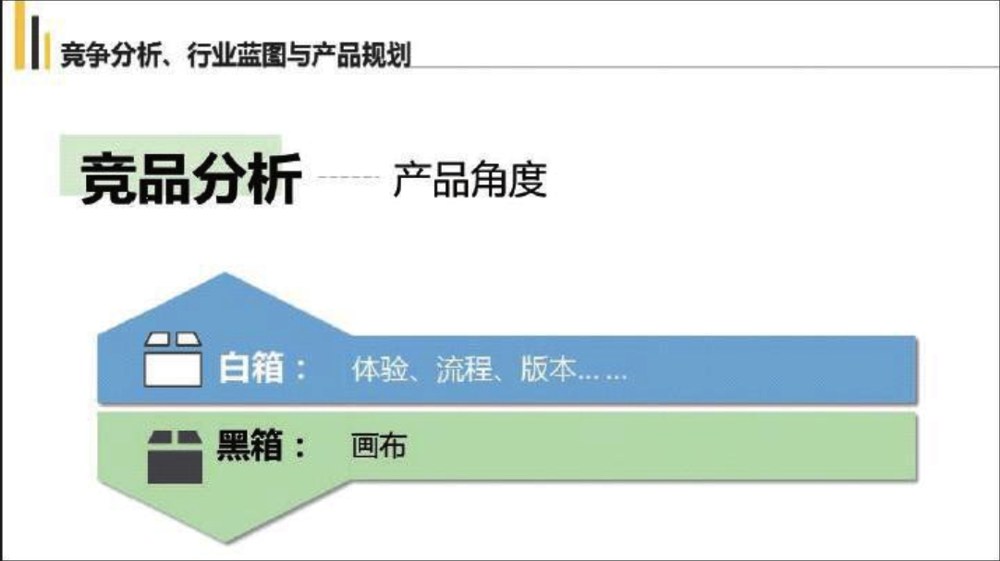

所谓**竞品分析**，我个人理解有两个方面：其一是竞争分析，其二是产品分析。竞争分析，我们后面会提到SWOT模型、瘦狗金牛模型等，是来分析自己的产品在竞争格局中属于什么位置，有什么优势和劣势。产品分析，则是分析自己的产品和对手产品在某些层面（如体验、需求、运营、资源整合）的解剖分析。

而产品规划则是对产品未来的方向、若干时间后的产品路线、技术路线进行评估，找到未来的机会和突破点。其核心是产品在横向和纵向的延续发展的可能性分析，利用现有资源和能够整合的资源，延续产品的生命周期或者重新拉起一条S曲线。

黑箱分析：我们把产品当作一个黑箱子，不管产品的设计细节和逻辑，而是从产品设计的出发点来做还原。

白箱分析：把产品还原到白箱模型，拆开产品，解剖产品，来查看它内在机理。这种分析主要是看3方面——产品的交互原型、产品使用流程、产品版本迭代过程。

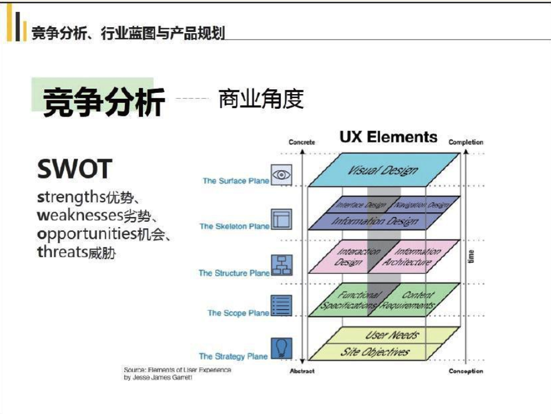

竞争分析，我们可以参考SWOT分析法和“用户体验的要素”法。

**SWOT分析**其实是一种盘点，对自己的思路进行盘点，对自己公司的资源进行判断，对谁是敌人、谁是朋友的竞争格局进行分析，要回答我们的优势是什么、劣势是什么、机会是什么、现在和潜在的机会是什么。其实很多方法都是相同的，在我们上面提到的黑箱还原和分析中，也需要回答我们的产品在竞品对照下的优势和劣势是什么。不同的是，SWOT分析可能更加偏向整体的竞争优势，尤其是公司和行业层面的竞争优势。

而用户体验要素的分析法则把产品分为5个层次，分别为表现层、框架层、结构层、范围层和战略层。表现层是指视觉体验；框架层是指页面设计，也是我们说的原型；结构层是指交互设计和信息架构；范围层是指我们对产品范围的定义，通常是PRD和内容需求；战略层通常是指产品的整体目标、用户需求和在行业中的机会。

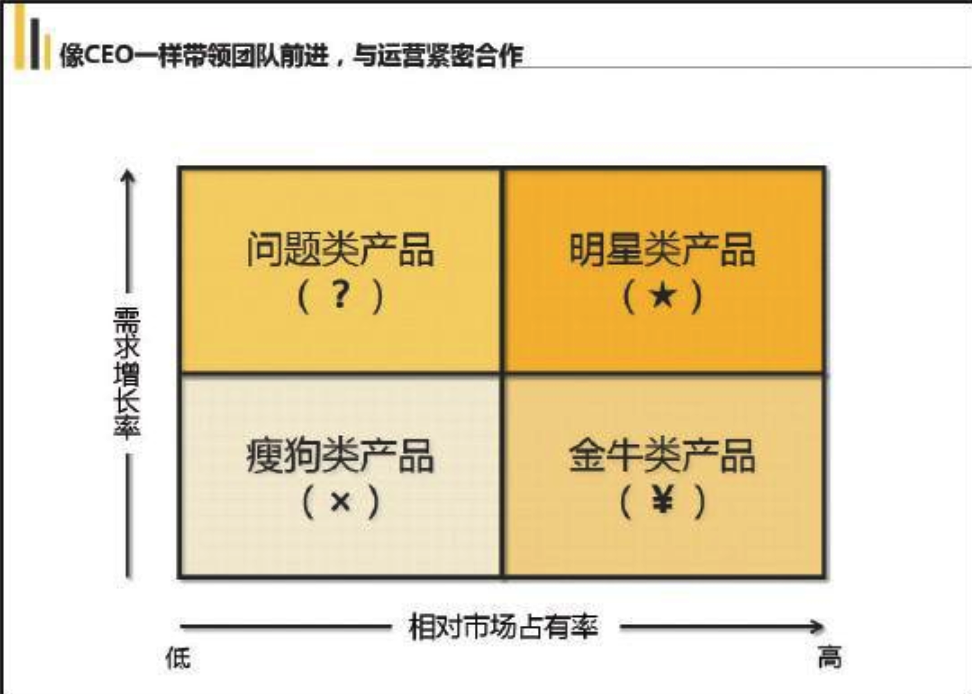

我们通常把产品放到一个金牛瘦狗的分析模型中进行分析，这个模型有一个名字叫“**波士顿矩阵**”。在这个模型中，我们根据需求增长和相对市场占有率来把产品放到4个象限中。

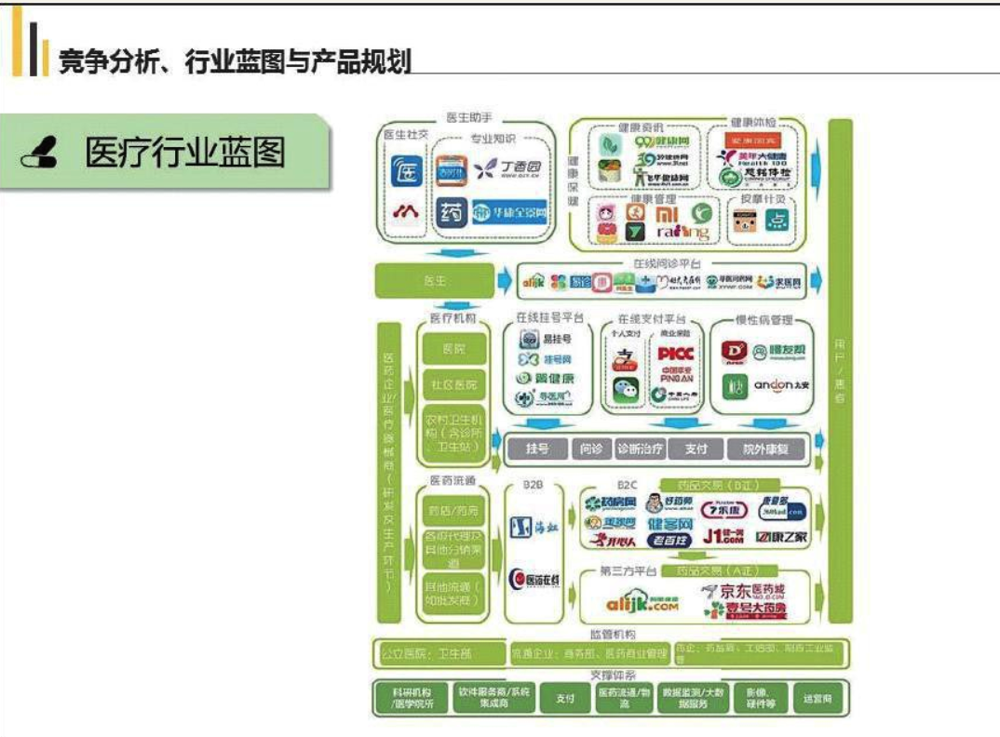

我们以医疗行业为例，这样的分析其实在BAT都有相关的行业分析专家在进行分析，但我希望在3年以上的产品经理中也有这样的思维和见识。

行业分析有几个点，我个人概括为：
1. 玩家（Player）。这个行业中有哪些玩家？他们各自是什么角色？代表着什么样的利益诉求？所具有的资源和需求是什么？
2. 商业流程（Flow）。是指商业生态的上下游关系，比如患者看病、挂号、就诊、买药等流程中涉及的是哪些玩家，他们之间谁是上游谁是下游，谁和谁是平行关系，等等。
3. 核心（Core）。在一个商业蓝图中一定有一个或者多个核心资源或者角色。我们需要找到这个“牵一发而动全身”的敏感点，然后通过这个敏感点来调动各方资源，或者避免与它发生直接冲突。
4. 机会（Opportunity）。在这个生态蓝图中是否还有可以进入的机会，如果有，在哪个位置？这个机会所带来的角色的上下游是谁，竞争者是谁？这个机会的规模多大？对自己公司来说是财务的机会还是战略的机会？
5. 成本（Cost）。你要进入这个领域的成本是什么？需要哪些资源，投入多少现金？当你投入这么多成本后，你的产出是多少，能否回报你的成本？也就是你的投入产出比是否是正的。

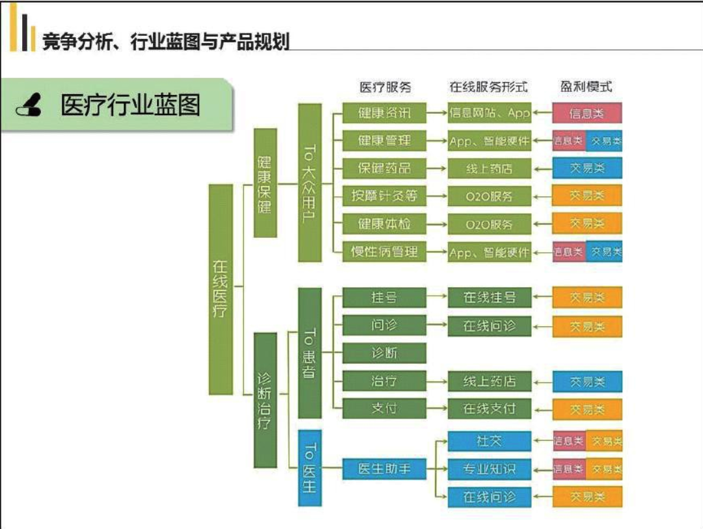

我们也希望把行业规划和产业蓝图落实到产品上，所以我们也需要通过一些产品化的翻译，让这些看起来宏大的事变得具体一些。一般情况下，我们会这么做：
1. 做出不同角色的价值点和功能说明。将不同角色所承担的服务和价值具象化，并且分类解决，以发现它们所承担的具体职责是什么。
2. 根据这些角色的价值和功能点，确定我方切入的角色和功能点。这个角色和功能点是梗概，不是具体的。我们希望在这里描述一个自己产品在行业中的故事（Story），把这个故事讲清楚。
3. 确定这个故事的主要功能，并版本化，列出优先级。
4. 确定开发节奏和第一期功能点。在此基础上确定后面第二期的规划。

## 第5节　BAT和行业的产品生态认知
三年级以上的产品经理需要深刻了解头顶上BAT公司的战略和战术变化，只有这样才可以不断站在风口上，获取BAT的红利。

中国互联网经过15年，用户基本形成了在网上找“信息”“人”和“商品”的习惯，这3个寻找的平台就是百度、腾讯和阿里巴巴。那么，随着手机的兴起，用户有更多现实场景，除了寻找，还要找到解决方案和服务。所以3家都看到了这个机会，开始切入服务之中。

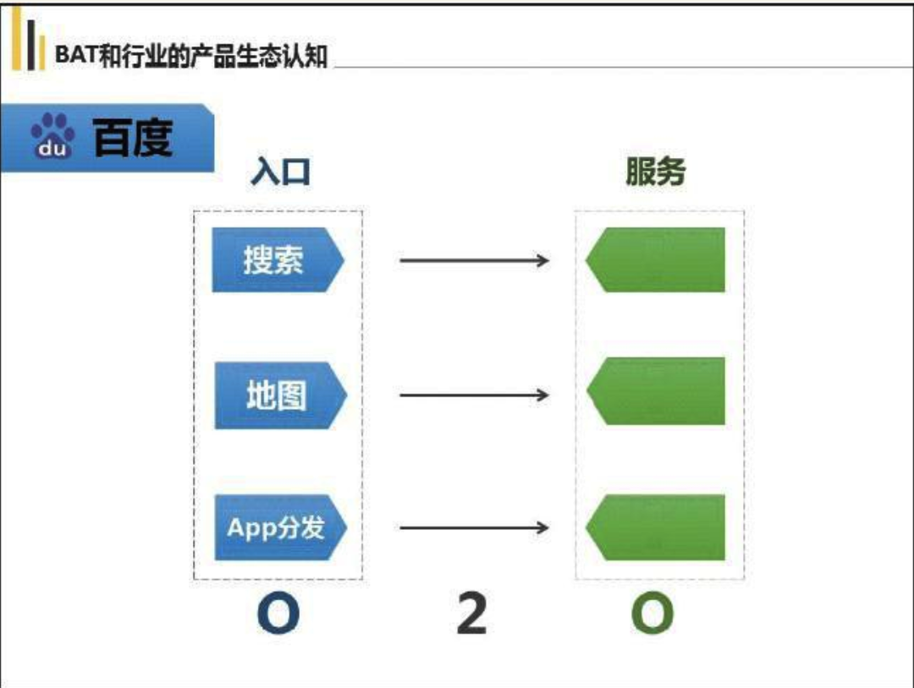

以百度为例，我们通过搜索、地图、手机助手的APP分发，来切入服务里面，并且投资收购了糯米，做了百度外卖。这些投资和并购，为的不是流量，为的是后端的商家资源和服务资源。

腾讯通过微信把商家拉入服务号中，建立了通过微信直达服务的一种方法，包括WiFi、支付、企业号等，让商家在微信上做生意。并且也投资了大众点评、58同城等线下服务比较有优势的企业。

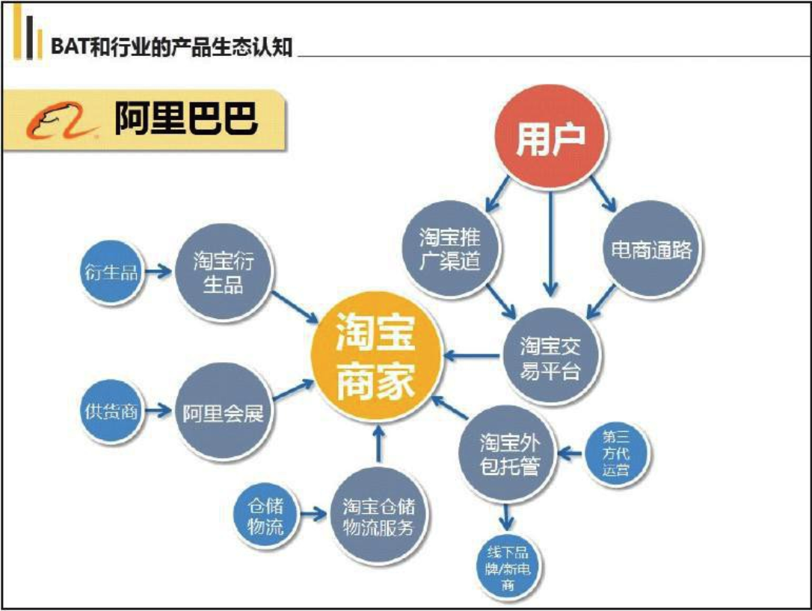

但阿里在早期的投资和产品规划中还是以促成交易为主要布局逻辑。为了让淘宝卖家更好地做生意，阿里投资并购了一堆公司。但阿里生来不是流量的入口，它对流量有很大的需求，所以不断地投资流量入口，如UC浏览器、新浪微博甚至蘑菇街这样的公司。

在移动互联网时代，阿里的布局显然要弱很多，主要是现有商家都是线上卖家，没有很好地把线下商户拉进来，因此一方面通过支付宝强力推进商户支付，但这遇到了微信的很大抵抗；另一方面，重新注资了“口碑”网，让这个“在土里埋了一半”的产品又开始走到前台，这也是为了拿到更多的商户资源。

所以阿里在做的很多事情，都是希望把流量和线下服务打通，这其实是O2O的第一步，从线上到线下，然后再从线下到线上，一个完美闭环，亮瞎了多少人的眼。

腾讯是在这个领域布局最为稳妥的公司，像其他香港公司一样，腾讯的风格也是务实又灵活。从即时通讯（IM）开始，连接了Web端服务，然后通过Web端服务加强了IM的地位。

我在很多场合讲过，其实腾讯和百度有一个共同特点，就是“入口为服务导流，服务又反过来加强了入口的地位”。

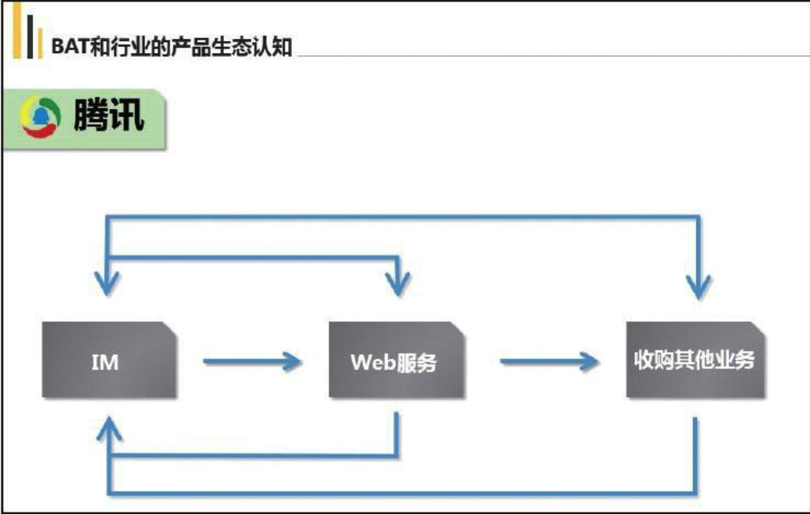

QQ开始的时候把服务导入了游戏、音乐、视频等，而后来我们发现类似QQ游戏这样的服务又反过来加强了QQ的即时通信霸主地位。如今这一策略在微信中再次使用，更为重要的是，这次的入口和服务的互动不仅限于自家产品，还把大众点评、京东、滴滴出行等都纳入其中，打开了服务大生态。

从BAT来看，大家的战略都是“入口”战略，而入口不仅仅是占据流量，更是有丰富的服务和商家提供的内容加强入口的地位。要知道流量有一天会转移，但如果形成闭环和生态，就很难超越了。

## 第6节　产品是渠道：沟通用户并提供服务
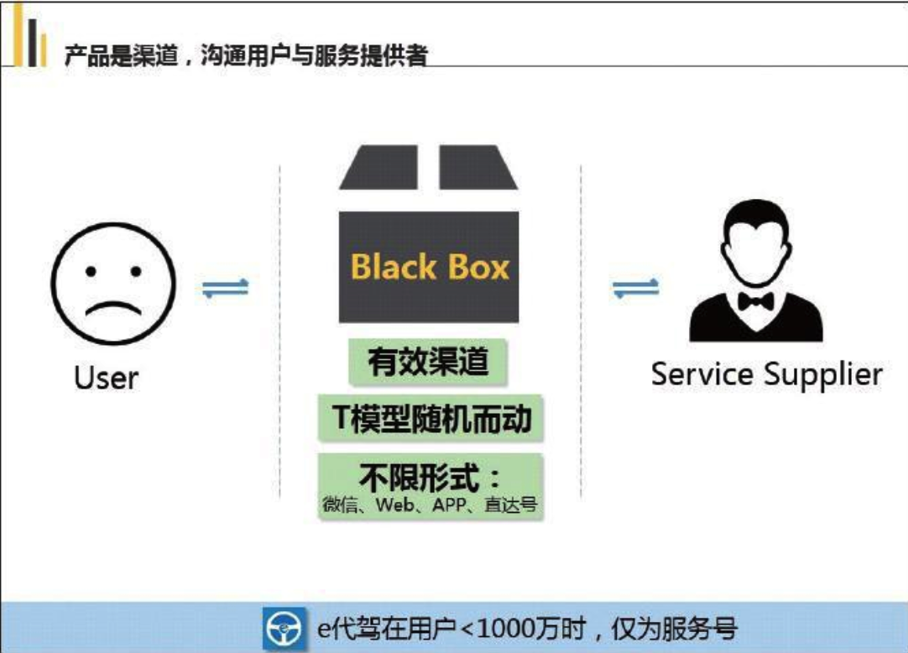

我的一个判断是，如果你非要依靠某个APP来提供某种服务，那你的门槛有可能很低。

在大部分情况下，O2O产品都是通过微信服务号开始了它们的产品生涯。比如e代驾，在早期就是典型的通过微信来撮合交易，还有功夫熊、e袋洗、e保养等。

然后当用户规模达到一定程度，并且用户频次提升到一个高度后，才开始做APP。

# 第8章　产品设计与迭代视角做产品
## 第1节　再看看那些2000年以来的互联网产品
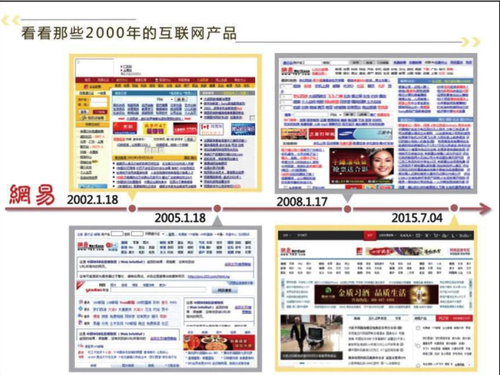

把主要内容突显出来，让用户在最短时间内找到自己喜欢的内容就好。这就是网易首页产品设计的解释逻辑。

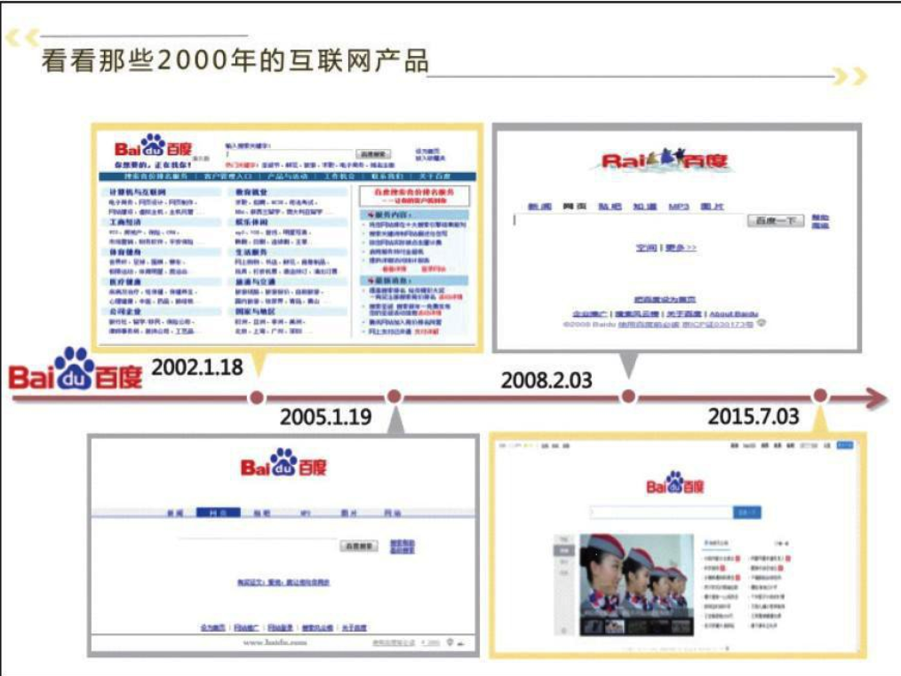

百度的搜索就更加简单，而越简单其实是越需要技术和产品保证的，于是在搜索结果上开始了长足的探索，把分类导航这类“不那么聪明”的事情留给了58同城、赶集和hao123这样的网站。

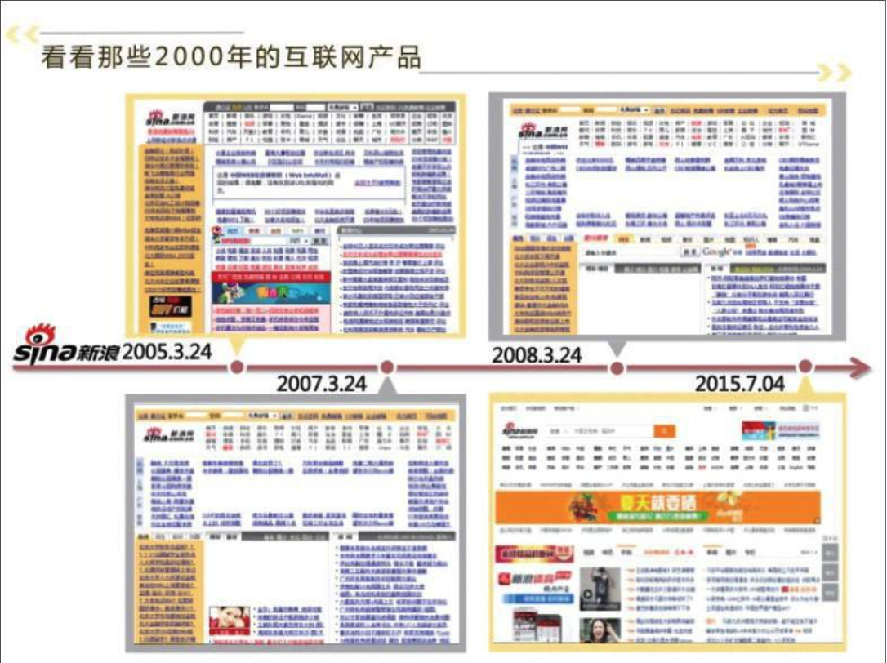

从总体上说，新浪首页的发展坚持了网易等老牌门户的内容，优化、精简以满足用户在短时间内获得更多精选内容，也融合了自己产品发展过程中的探索和新产品的实验。

## 第2节　0到1是本质变化
互联网从来不谋求从0到N的改变，我们只追求从0到1的改变。而我们认为，从0到1的改变是本质的。

0到1的蜕变和破壳是产品出生必须有的“阵痛”，没有这样的“阵痛”，后期的发展是危险的。而0到N的节奏常常没有这样的“阵痛”。就像我认识的一些人，他们一开始做的产品进展速度很快，并没有太多纠结，但事实上做了半年以后才发现，做的都是垃圾，需要重新开始讨论最早期的问题，诸如用户是谁、需求是什么、他们在这样的场景下如何选择等。

## 第3节　符合产品生命周期的产品设计逻辑
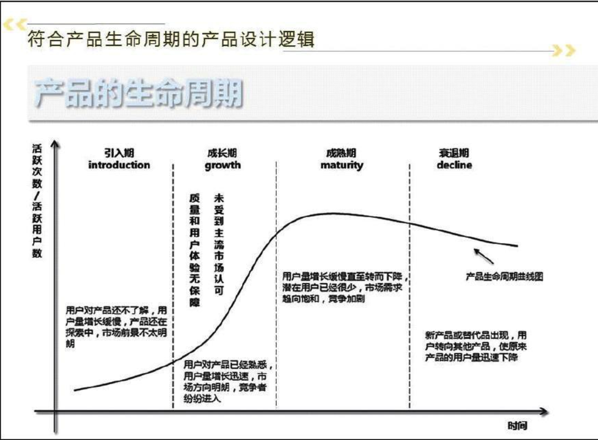

我们先来回顾一下产品生命周期曲线（PLC）。它把产品分为引入、成长、成熟和衰退4个阶段。PLC曲线之所以神奇，在于它是一个产品用户增长模型，同时可以用来还原现在很多产品的设计和开发规律，这一点我们在后面会用来解释微信的增长。

我在这4个阶段的基础上，简约地把PLC曲线理解为0—1阶段（引入期）和1—N阶段（成长、成熟和衰退期），这种分法能让我更好地理解产品的设计和运营过程。

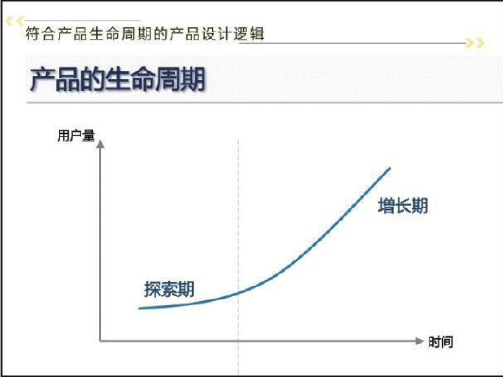

为了更好地理解，我们把0—1阶段命名为“探索期”，将1—N阶段命名为“增长期”。

探索期。顾名思义，就是要探索产品的定位和用户的需求。在这个阶段，探索是唯一的目标，用户增长这件事，先放放吧。有很多老板希望在探索的同时也要求带来用户量增长。为什么我们之前章节提出说让KPI让位于KOR呢？因为在这个阶段，用户数量是不重要的，重要的是阶段性的探索实验和项目。如果你在这个阶段就追求用户量增长，那探索这件事一定会变味。

增长期。当产品定位探索成功了，增长似乎是一件水到渠成的事情。因为如果产品定位成功了，用户对产品的黏性和口碑会带来一部分产品的自发增长。

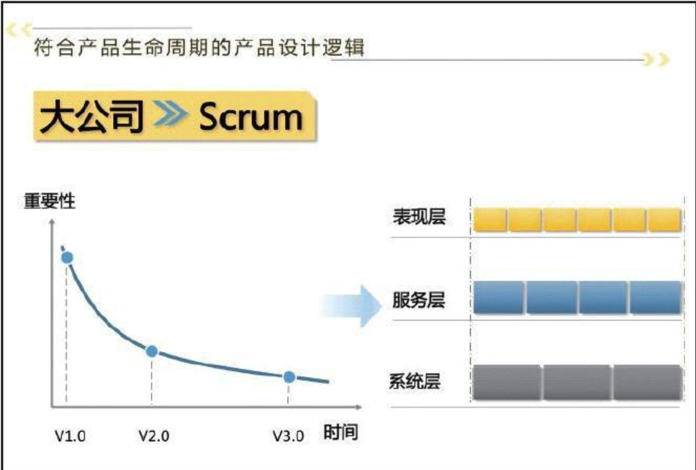

大公司一般把重要的事情先做，在产品架构上，系统和服务层打得牢牢的，牢不可摧。然后在上面加表现层，称其为C/S架构。

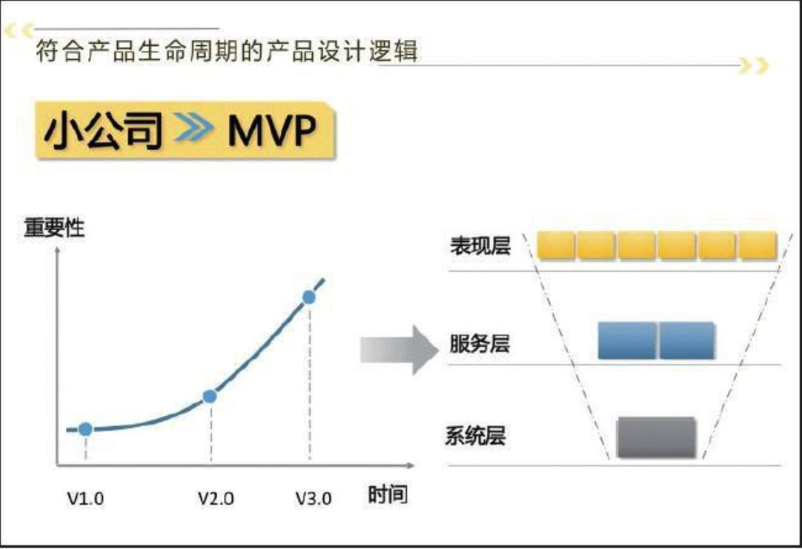

小公司我们推崇之前提到的“MVP”模式。这种最小可行性产品的设计和架构逻辑，能够很好地支持不断改变的业务和表现层需求。把不重要但比较快速的东西先做了，然后不断地增加复杂的模块，底层架构要么托管在阿里云这样的第三方，要么先保证能跑起来，到实在不够用了再升级。

## 第4节　符合迭代和灰度的产品设计逻辑
迭代和灰度，是探索期需要遵循的原则。

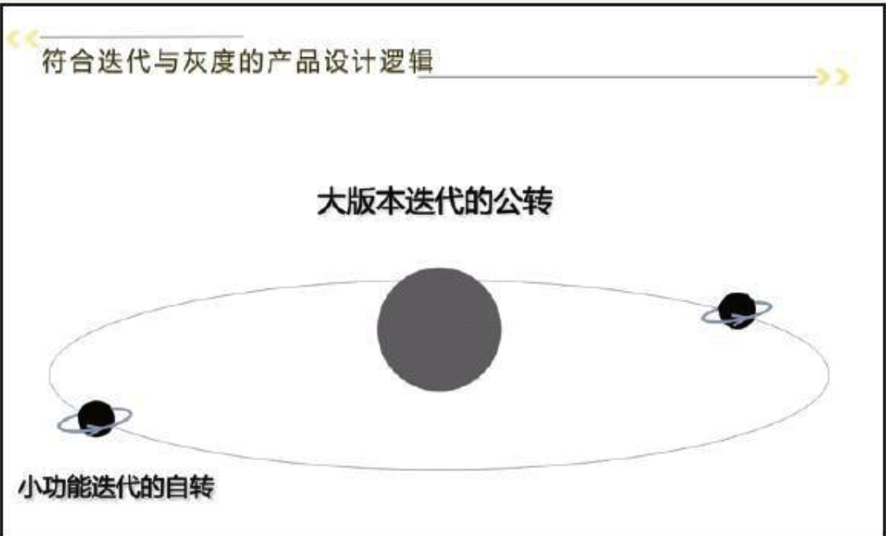

我们把产品分为大版本和小功能两个模块。如果说大版本迭代就像地球围绕太阳公转一样，那么小功能迭代就像地球自转一样。这两件事其实都是同时存在的。

而产品的灰度，其实就是这两种迭代在不同的用户群体中逐步发布的过程。

举个例子，微信的卡包功能，在某个大版本里直接上线的可能性不大，而是先在某些用户群里发布，比如20%的用户可能看到，随着某个版本放出去。经过1个月的数据收集和反馈，卡包这个功能进行了迭代（自转），然后又随着某个大版本推送给了20%的用户（都是随机或者圈定好的用户），又获得1个月的用户反馈。这样重复几次，发现这个功能基本上达到了全量发布的条件，那就跟随某个版本全量发布了。

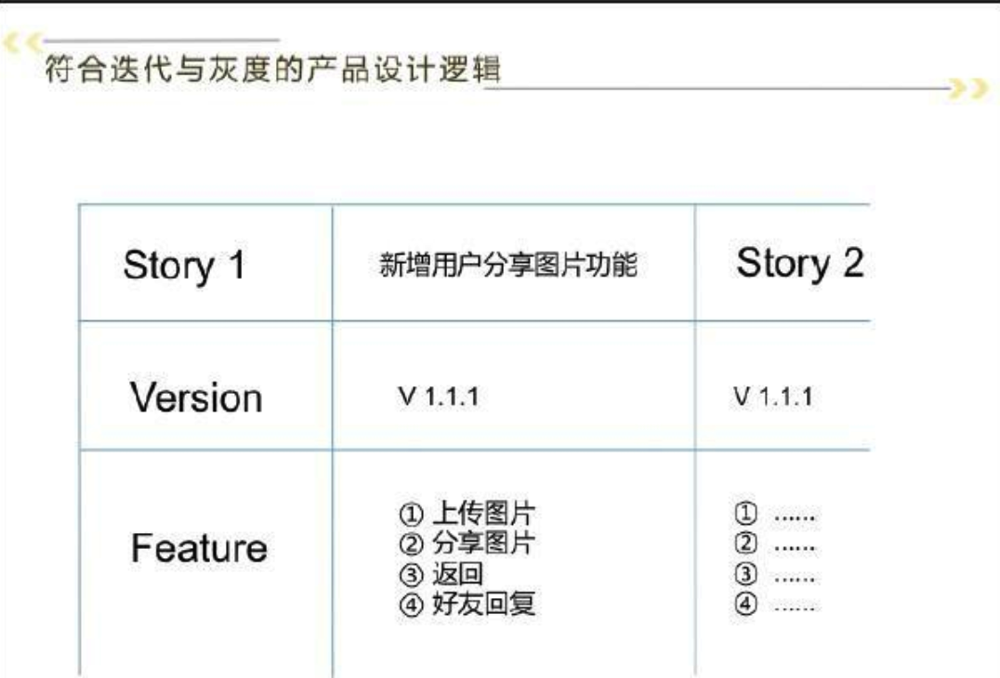

我们比较推荐用敏捷的方式来做产品迭代的设计。它的做法是先有场景和故事，通过故事拆解出功能点，最后归入某个版本。

一般情况下，产品经理收集需求和确定功能点，排序出优先级，管理其中的变更项，跟踪开发进度，验证是否完成开发，实现这些功能。

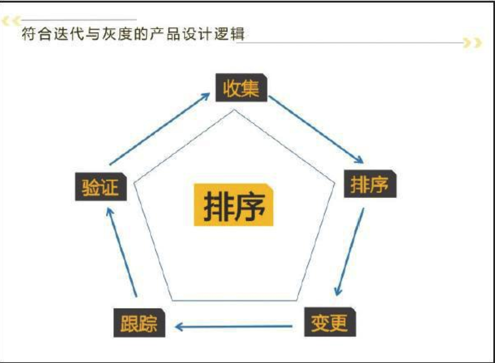

其中需要提出的是，收集需求需要封闭。如果收集的需求不封闭，我们面临的困难将是无休止的。

跟踪和验证是我们保证进度和质量的例行工作，而好的产品经理在这两点上做得会格外让人放心，其秘诀可能是他们把产品当自己的作品一样对待吧。

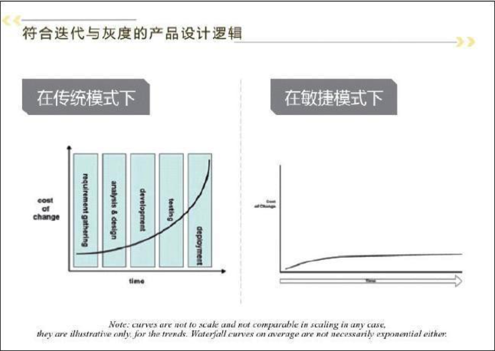

改变的风险，在传统的开发模式下非常高。由于它们之间都是串行开发，所以一旦某个模块更改需求，其他模块都要做相应的调整，而这种调整的复杂性就很高了，我们采用项目管理的一些数据来看，其实随着开发模块的增加，更改带来的风险也在急剧增加。

而在我们提倡的MVP和灰度迭代模式下就要好很多了。因为是并行开发并且系统间的耦合性相对不大，所以其风险是非常稳定的，主要风险来自其自身的变化。

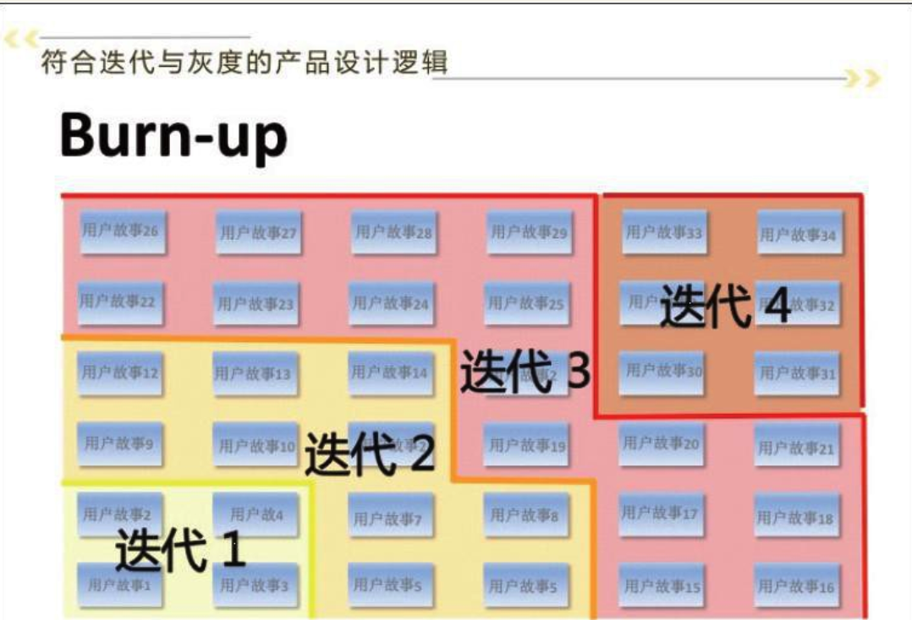

让我们再用一种图形来表示灰度，这种图形在敏捷开发中叫燃尽图（Burn-up）。我希望这张图很形像地表现出很多功能在一张纸上，我们在左下角点火，随着燃烧的进行，这些功能都被燃尽。

对于产品经理来说，燃尽的是一个个用户故事。对于开发来说，煅烧的是一堆堆功能点。

## 第5节　符合用户心理曲线的产品设计逻辑
很多产品都在尝试根据用户的心理做一些产品的发布，其实本质都是希望产品的节奏和用户的节奏产生某种意义上的“共鸣”或“共振”。

## 第6节　通过迭代释放需求
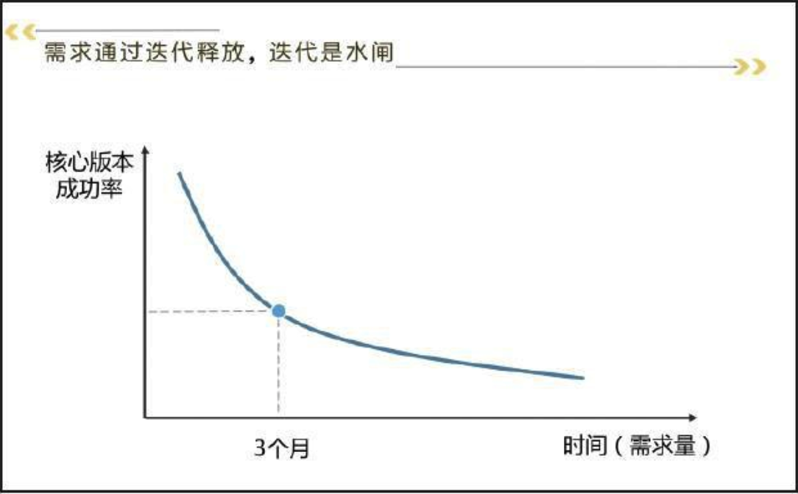

如果一个产品的核心版本的开发时间超过3个月，那么它的成功率将急速下降。

## 第7节　迭代与MVP模式
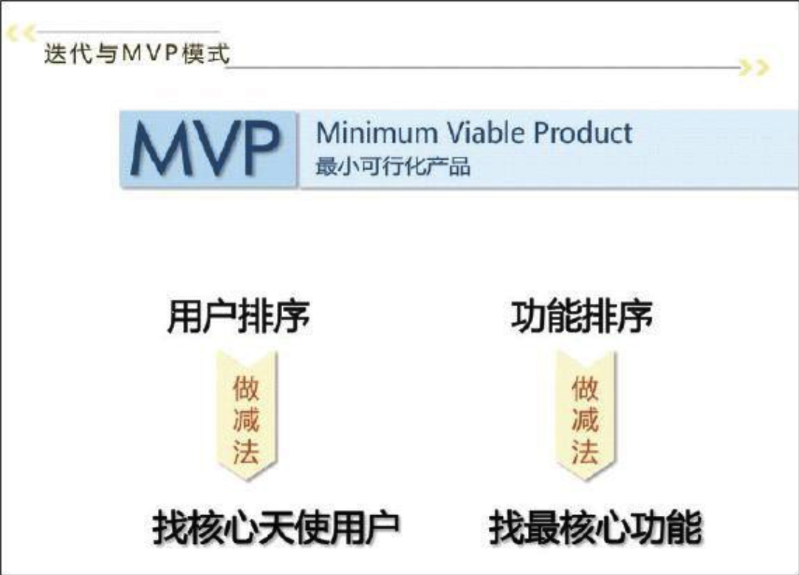

我个人理解，MVP的模式主要是在讲述用户故事上做简单化处理。给用户讲一个最能理解的故事，然后把这些故事的主要功能提炼出来进行开发，在开发完后交给用户使用。

基于MVP的迭代应该是最好的一种迭代方式。故事脉络清晰，功能点燃烧层次分明，容错和纠错成本最低，但最大的问题是产品决策者能否耐得住寂寞。

只有迅速实现，天使用户才会感觉到你们产品的温度，才会更加用心给你提意见，不要等到黄花菜都凉了，大家都忘了这件事，你又拿出来说，是不是差别就太大了？

所以MVP是最小可行化产品：最小能保证速度，能够在最小版本内快速开发迭代。可视化保证的是用户能感知到，是做给用户的产品，而不是非功能性产品。

要让用户感受到产品的快速变化。

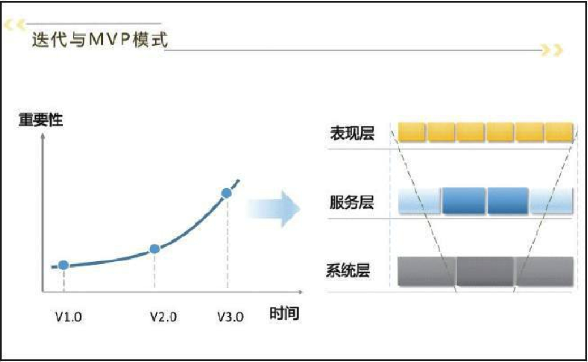

在MVP模式下可以按照上图所示，把重要性低、可行性高的产品先做起来，快速让用户看到变化。当你的用户看到你一直在改变，他们会跟着你一起开心，并且知道这是一个在为自己做产品的团队。

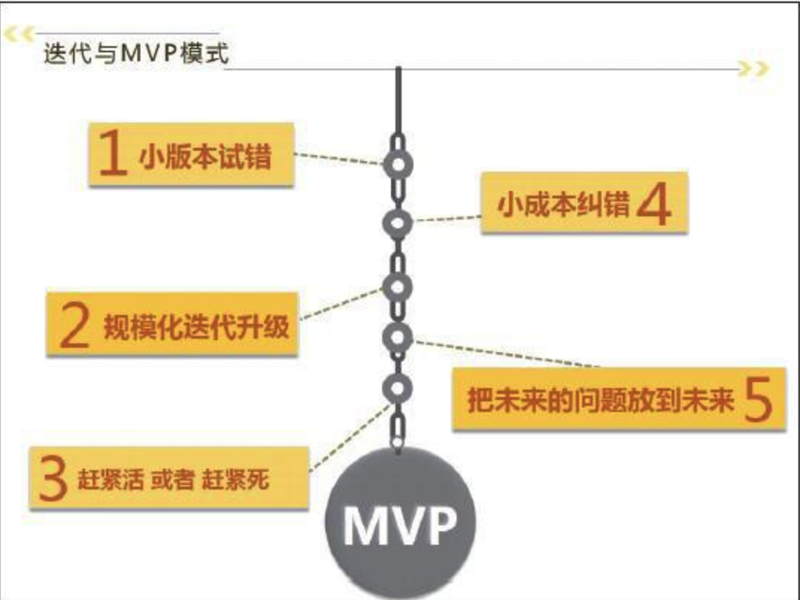

如果非要列一下MVP的优劣，我觉得有几个问题要说一下。
1. 小版本试错。我们一直都在说小版本试错，那MVP其实就是小版本试错的方法，而且能够面对面地感知用户需求和体验，给产品更加直观的反馈。
2. 规模化迭代升级。MVP可以在找到合适的产品定位后规模化快速升级，符合生命周期曲线的探索期和增长期。
3. 让产品快速成长，或者快速死亡。快速死亡也是一种很好的事情，能让时间成本降到最低。千万不要半死不活地撑着。
4. 纠错成本低，因为每一次迭代都相对独立，每一个模块都可以单独迭代。
5. 未来的问题未来解决，用未来的方法和资源解决。你今天预料未来的问题是不现实的。

# 第9章　运营视角看产品
## 第1节　大运营和小运营

大运营更加偏整体，小运营更加偏具体。

小运营一般我们都把目标聚焦在3个核心环节或者叫指标上。它们是拉新、促活和留存，如下图所示。

这个小运营的指标其实描述的是一个产品的质量和黏住用户的能力。

## 第2节　产品运营的核心价值

我们认为产品的第一价值是微笑价值，那么产品运营的核心是什么呢？是微笑价值最大化。

所以运营应该紧密围绕产品的微笑价值展开，让你的产品卖点更加突出。

## 第3节　恋爱式运营：在合适的时间遇到对的人

如果想抓住这些“用户”的心，你一定要在对的时间遇到对的人。放到运营中，就是要在合适的场景、正确的动机下，满足用户的需求。

运营就像讲故事，必须几个要素齐全，才能成为一个好故事，这些要素就是场景、动机和需求。

## 第4节　产品生命周期影响运营节奏

与其他生命周期曲线的4个阶段不一样，我首先把产品生命周期分为两个阶段：探索期和增长期，这个时间由增长曲线的爬坡斜率而定。

在斜率小于1的时候，处于产品的投入产出不均衡的时候，说明产品还在探索当中，用户还没形成规模化增长，这个时候的运营就需要寻找种子用户、探索产品方向、快速迭代并且快速尝试，单一用户的成本可以不计较，通过运营获得种子用户和体验反馈比什么都重要。

当斜率大于1的时候，产品的生命周期进入增长期，这个时候需要我们规模化地去做一些事情，让用户能够快速地增长，在运营上要扩展用户需求，提供更多用户的细分画像，满足不同阶段用户的需求。在ROI可以承受的情况下做到加大投入，增加市场占有率。

那么，我们有一个问题要提出来了，这个斜率从小于1到等于1再到大于1的突破点在哪儿呢？

我的回答是：不知道。我们需要去试，我们经常把上述这个突破点称为“第一爆发点”。微信的第一爆发点我们事后复盘发现是“摇一摇”。我不知道某款产品的“第一爆发点”在哪儿，但我们从学习的角度可以通过运营和产品版本复盘（还原产品）的方式来寻找这个爆发点。

“第二爆发点”是斜率从1到大于1的点。这个爆发点我们也需要去复盘还原，我们发现微信的第二爆发点是“红包”。

第一爆发点和第二爆发点哪个更重要呢？我觉得第一爆发点更重要。第一爆发点来自在特定人群中的急速扩张和传播，第二爆发点是在全民或者横向用户中的大传播。很多产品只有第一爆发点，没有第二爆发点。

所以寻求第一爆发点很重要。当然不同阶段都有不同的点，我们用4个点来完整描述不同阶段的用户和运营方法，如下图所示。

我们认为，在第一个爆发点出现前，我们需要找到一波创新者，这些创新者就是传播的种子。我经常说，一个愿意尝试新鲜事物、喜欢冒险的人，在冒险成功后是不会吝啬于把他的体验分享给别人的。所以这一点大家大可不用担心，只要你找到早期的创新者和采纳者，你的服务和产品足够让他们产生良好体验，他们会主动帮你传播的。这时候就是我们提到的，要寻找产品的种子用户、培养该产品的氛围和文化、确定产品的定位，做足价值传播的“尖叫点”。

之后的节奏就是通过规模化运营来影响早期大众和晚期大众。

对于运营来说，用户细分的一个生产力就是“运营手段的针对性使用”。

首先，对于创新者和早期采纳者，我们需要采用“教育用户”的运营方法。这种运营方法简单地说就是“让用户无法拒绝地使用你的服务”，教育用户使用你的产品。比如滴滴出行，教育的是哪些用户呢？打车者还是出租车司机呢？答案是司机。因为打车者的需求是广泛存在的，只有撬动司机的积极性才可能提供打车服务。那么怎么去教育司机呢？当然不是给他们上课，而是当面和他们说，我们称为“地推”。司机说我们没有智能手机，如果你这时候离开，就违背了“用无法拒绝的服务来教育用户”的原则。你应该如何做呢？送他一台手机。事实上，滴滴出行也是这么做的。有了手机，司机也不一定安装APP啊，怎么办？如果强制他们安装也违背了“让用户无法拒绝”的原则，他们的做法是安装APP给10元话费。以此类推，用打开APP奖励、抢单奖励、累积抢单达到指标奖励等方法，不断地通过“让用户无法拒绝的方式”来教育用户。

我们的总结是：好的运营应该做到，如果用户拒绝了你的服务，“他就是个傻子”。好的运营启动是让用户“在运营活动面前，不能成为傻子”。

其次，就是通过社交化传播和渠道拓展的方式来做早期大众和晚期大众。这时候竞争者出现，好的产品就脱颖而出了。好产品往往不是多好看的产品，而是细节上有决定性制胜能力的产品。比如打车软件，其他功能都很好，如果地图出了问题，对司机的效率将是极大打击。所以先踏踏实实地把体现最核心价值的产品功能点做好，再说其他未来的想法，否则你根本没有机会走到未来。

最后，通过引爆点来撬动整个市场。用滴滴出行来说，就是打车红包的营销，一下子把所有的用户卷入到分享出行的活动中。

## 第5节　收入是自然而然的结果

这是一个常见的公式，收入和用户总量、付费率、ARPU值是成正比的。如果我们把左侧看成商业价值，右侧就是“微笑价值”的集合，因为用户总量增加、付费率提高和客单价提升，其实都和用户的“微笑”分不开。

所以，如果想提高收入，就在用户总量、付费率和客单价上下功夫。每个模块的工作都是详细和具体的，需要根据不同产品和行业来提出相对应的方案。
- 比如用户总量的提升，需要为产品找到合适的定位，通过一些重要功能的迭代带来用户“规模化”增长，我们在很多的版本复原中其实也找出了这些重要的功能点。
- 付费率的提升可能就需要数量流程、增加运营活动、会员制运营、买赠满减策略等运营活动。
- 客单价的提升则需要用户细分运营、拓展品类等方法来做。

总之，收入是可以拆分和拆解的，但其内部可能的逻辑应该是增加用户的“微笑价值”来提升商业变现能力。

## 第6节　参与感：新运营的口碑驱动

其实大部分软件和硬件产品都是这样交付的，比如格力空调、创维电视，在一个版本之后要持续升级是不可能的，即使有设计缺陷或者bug，也只能用新款来取代。

但互联网产品是不一样的，它们要持续交付。持续交付的意思就是迭代速度很快，用户不断地获得新的交付产品（PC端交付在服务器，每次访问官网URL就完成最新交付，移动客户端只要在应用商店更新版本即可完成交付），其体验是持续不间断地改善的。我们有时候叫这样的现象为“云端交付”。而云端交付可能是互联网产品会胜过软件的一个原因吧。

因为持续交付，所以需要运营。我们很少看到软件产品有专人运营。这是因为它的一次性交付是很难运营的，而互联网产品的持续交付要求运营能力很强，不断从上一个版本中获得下一版本的需求，并且要把最新的版本和功能推荐给它的用户。

某种意义上讲，运营是一种服务的交付方式。

所以，从软件产品到互联网产品，运营是被逐步发现的过程。因为交付方式的改变，必须运营，也因为运营的出现，交付方式更加及时准确。

经过我的不完全整理，我们觉得早期（积累0~10万用户）的运营，主要应注意以下几点。
1. 以终为始。将一次活动的结束作为下一次活动的开始。比如滴滴出行的红包。滴滴出行最早期是通过“本单结算时随机减免”的方式在做，后来变成了用户打车之后发送一个红包的方式，获得下次打车的代金券，这就变成了以终为始的运营，可以说是一举三得：其一，减少了成本，虽然红包满天飞，但事实上结算的成本并没那么多；其二，让用户帮助自己传播品牌和服务，而且拉动了用户下次的消费；其三，冠名后还找到了一个变现的方法，可以赚钱了。
2. 由内向外。原来的运营是拉用户，准确地说是拉新用户。往往把运营的重点放到还没有进入产品中的用户上，而对已经进来的用户就不怎么关注了。现在的运营，更多的是把现有的用户服务好，让用户的口碑说话。我们说“好产品自己会说话”，就是这个道理。小米的大部分运营用在了已经使用产品的用户身上，让其他用户主动加入。
3. 价值正向。每次运营都让用户产生价值正向传播的欲望。举个例子，我早期用e代驾找了一个代驾，第二天收到一个客服的电话，告诉我他们帮我确认了昨晚的订单，算错了价格，要退给我20元到账户。我觉得他们很贴心，帮我把关了，当然我也认为这的确是他们算错了。后来我偶尔几次也是同样地方代驾回来，发现价格一样。所以我猜测这是一个运营手段，让客服作为运营的一种渠道，把代金券换了一个名目发给我了，但我的感觉完全是不一样的。让我觉得他们在做保护喝醉的司机的事情，我还帮他们传播了几次。
4. 社交传播。社交传播必须用，原因是要用到用户关系链的时候，社交网站是最好的。如果你的口碑够好、运营价值感充足，那就一定可以通过社交来推动整体的扩散。这个不用多说，要说的是怎么才能做好。我觉得价值正向传播是最重要的。

## 第7节　互联网的核武器：数据与转化率
我们一直倡导一个理念：向数据要迭代，向迭代要数据。

下一个版本的需求来自上一版本的运营数据，也就是用户的直接反馈。这一版本的运营数据也要求下一版本做出相应的调整。

## 第8节　别让运营为产品吹的牛埋单

实际的产品和想象中的产品的差距，其实就是运营的鸿沟。如何避免这个鸿沟呢？做减法，让你规划的产品版本更小，更接近现实的产品。

所以我总结了几点供参考。
1. 什么都有就等于什么都没有。运营的时候不要怕告诉用户没有什么，在说没有什么的时候，其实是在突出我们有的东西是最专注和专业的。
2. 有，但用户不知道也等于没有。你想告诉用户什么，你就让他看到什么。比如发语音信息的功能，对微信来说是一个亮点，运营的时候就可以放大。其实手机QQ在那个时间也是有语音通话功能的，但用户需要点击一下才能看到，运营的时候说我们也有，这就很难解释了。所以一定要把你想告诉用户的东西直白地告诉他，不要绕弯路。
3. 有，但不符合逻辑或者场景，也是不对的。比如某个产品，是给用户提供一站式查询的平台，能查询药品说明书、医院地址、医生信息、医疗保险，最后还有社保信息查询。这样看起来就非常的不符合逻辑，前几个都是在场景里的，后面一个看似有关系，其实没有关系，在产品运营的时候也很难把故事讲到一起来。

# 第10章　操盘与人性视角悟产品
产品经理一共有4个阶段：用户、理想用户、职业产品经理、用户。也就是说，产品经理是从用户到理想用户、职业产品经理（职业用户），再回归到用户。而最后的回归，常常不是技能的回归，而是常识和场景的回归。

## 第1节　产品操盘手：超越产品经理视角

游戏是有脚本的，虽然玩家在玩的过程中有很多变量，但总体的游戏路线是确定的。产品也是一样，虽然有成功有失败，但总体上都是在产品生命周期曲线的指引下前进的（没有上线的产品除外）。如何在生命周期的规律下操盘成功，我觉得还是一件很玄妙、很有乐趣的事情。

微信把中国的产品设计和运营能力提升到一个新的高度。所以我们需要对它的操盘进行复盘。复盘一个产品通常有3个维度：原型重现、流程重现和版本重现。于是我们找到了微信的所有版本，并且找到每个版本的用户量数值，把它们放到一个图标中，我们可以很清楚地发现：
1. 1亿用户以前的版本密度很高，1亿用户以后的版本密度变低。这代表什么？代表了在1亿用户以前，微信的产品团队在不断地快速迭代，以希望获得用户的需求，确定产品的定位。
2. 我们发现在相似的时间点，不同操作系统的手机，其版本是不一样的。这说明什么？微信把不同的操作系统当作不同的用户群体，在做分人群的版本测试。微信向来有这样的做法，在同一时期，安卓手机和苹果手机用的微信可能功能有很细微的区别。我就看到过微信在某些版本里“附近人”出现了不分男女选项的情况。最明显的例子就是打飞机的游戏，从苹果手机开始，一周后安卓手机开始升级。为什么要根据不同的操作系统去测试用户需求呢？我的理解是在2011年左右，安卓、塞班、苹果和黑莓手机代表了不同用户。

开心网和足记也是曾经有过一段辉煌的，只是操盘者没有准备得足够好：当产品一夜之间爆发之后，并没有后续的产品功能和迭代计划支持，导致用户在很短的生命周期内没有留存下来。

产品生命周期有其自然规律，操盘者首先应该尊重这个自然规律。

那操盘者如何更加快速地推进迭代呢？我们在之前的架构知识里曾经提到过，有两种架构方法，一种较为重，一种更加轻。更加轻的我们姑且叫“MVP”开发模式，它将重要的功能往后放，先把简单又有点儿价值的功能开发出来，在技术架构方面更加轻地做架构，主要资源投向表现层，服务层少一些，系统层非必要不增加。

很多创业团队不再使用那个成熟公司的考核概念，而采用了新的“KOR”标准。KOR是Key Objective Results的简写，意为核心的客观结果。简单来说就是不以收入、用户量、转化率、ROI为考核指标，而是用阶段性完成的客观成果为主要指标。

## 第2节　乌合之众的产品观念

《乌合之众》里说道，群体有一些共同的特点，特别是在决策和选择上有很多的弊端。作者提出，群体的个性消失了，智力抹平了，甚至人格品质都是很普通的。

对于产品经理来说，了解你的用户很重要，让用户做决策也很重要，但不能让群体做决策。无论是公司的群体还是用户群体。我常常发现，但凡是群体做决策的产品，一定是非常平庸且“四不像”的产品，因为大家的观点融合之后，基本就没有个性和灵魂了。所以如果是集体决策的产品，其性感层度也被抹平了。

“听所有人的意见，看用户的数据，自己做决定”。这样的产品经理可能更有魅力，他的产品也可能更性感。

## 第3节　贪婪与懒惰：17岁的“科技红颜”

她们代表着时尚：她们敢于尝试新鲜事物，从来没有羁绊，她们凑成一团之后反而更加勇敢，相互鼓励。

她们的转移成本很低：她们不需要为家庭、为丈夫孩子负责，她们只要为自己负责，所以不喜欢的东西随时可以丢弃，喜欢的可以毫无保留地去接受。

## 第4节　为什么苹果的产品与众不同

苹果的产品哲学是赞美生活，谷歌的产品哲学是赞美科技。

## 第5节　制造“哇”点：极致的产品，用细节打动用户

如果你想让用户尖叫，你最好让那些生活中本来就让人惊讶的用户先进来。让一般的用户体验极客式用户的感受，让一般的用户看到极客式用户的状态，这可能是制造一些“哇”点的方法。

## 第6节　少点一下就是革命

更简单不是产品做得简单，而是用户用得简单。要想用户用得简单，产品背后的逻辑反而更复杂。

## 第7节　客服是不是很重要

客服可以做运营，某些时候客服是产品的化身，化身为一种渠道，让服务提供者与用户对话。所以我们往往将对客服的评价等同于这家公司好不好或者这款产品好不好。因为在全民消费体验提升的今天，我们无论消费什么都包含体验部分。

## 第8节　博弈与拍卖：最简单的运营机制
对于产品经理来说，用户场景、需求和动机确定了，找到真实生活中的痛点还不算很难，但如果要让产品经理去找人性的痛点，恐怕会花了很大力气却得不到。因为这必须得有很深的产品经验和生活常识。

事实上，百度的商业产品有很多机制和策略在里面，我的同事曾经写过一本这样的书，介绍其机制和策略。然而，简约来看，其实它就是做了一个黑箱拍卖机制，将博弈和拍卖结合起来，形成了客户之间的黑箱竞争，而这种竞争可以让优势资源最大化，并且引入广告展示模型CTR之后，就比较好地平衡了用户需求和出价高低的问题。

## 第9节　产品要性感，而不是赤裸裸
性感的产品是让人有欲望去“探索”的产品，是让我开心的产品，是在某个时刻打中我某根神经的产品。

## 第10节　为98%的用户设计产品

我曾经提出过一个观点，2%的用户是不可理解的，2%的用户是不可思议的。最重要的是，我们都可能在某种场景下成为这2%的用户之一。

早期产品和中期产品都不应该纠结于这2%的用户。有太多产品投入大量资源去解决这2%的用户需求，导致了其他98%的用户承受额外的成本。有些不可避免，有些其实可以果断解决。

总结起来可能就这么几句话。
1. 没有门槛的产品经理，要求还是很高的。虽然谁都可以做产品经理，但不是谁都可以做得很好，而且“混事”和很好之间，差了好多个太平洋。从软和硬两种素质上提升自己，让自己思考方式更加产品化是最重要的，而不是一些工具的使用。
2. 在本书中，我提出了学习产品的“最速曲线”，对于小白产品经理和一年级产品经理来说都是很有帮助的，在这个训练方法下，已经有几千人获得了提升。我们可以先认识产品、还原产品，再去创造产品，而不是相反。
3. 产品和运营是互证的，即产品和运营是相互验证的，需要一起探索产品定位和用户需求，我们坚持两者不分家。
4. 好产品是迭代的结果，也是运营的结果，这是互联网产品的本质要求，也是特性之一。只有坚持迭代和持续运营，才能有美好的结果，一上线就要看到效果的产品负责人是不遵循规律的人。所以产品经理要懂运营，运营经理也要懂产品。
5. 了解乌合之众，站在上帝身边，从生活常识入手，解决明确而简单的问题。不要虚构需求，“强奸”用户的意志，否则只能是失败。

