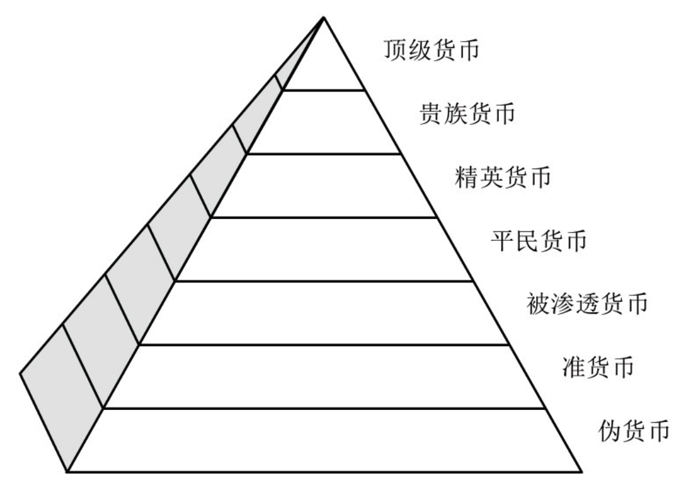

    作者: [美]本杰明·J.科恩
    出版社: 中信出版集团股份有限公司
    副标题: 从货币读懂未来世界格局
    出版年: 2017-10-1
    页数: 324
    定价: 65
    装帧: 精装
    ISBN: 9787508679112

[豆瓣链接](https://book.douban.com/subject/27155227/)

- [第一章 国际货币](#%e7%ac%ac%e4%b8%80%e7%ab%a0-%e5%9b%bd%e9%99%85%e8%b4%a7%e5%b8%81)
  - [动机](#%e5%8a%a8%e6%9c%ba)
  - [选择](#%e9%80%89%e6%8b%a9)
  - [货币金字塔](#%e8%b4%a7%e5%b8%81%e9%87%91%e5%ad%97%e5%a1%94)
  - [收益与成本](#%e6%94%b6%e7%9b%8a%e4%b8%8e%e6%88%90%e6%9c%ac)
    - [交易成本](#%e4%ba%a4%e6%98%93%e6%88%90%e6%9c%ac)
    - [铸币税](#%e9%93%b8%e5%b8%81%e7%a8%8e)
    - [宏观经济弹性](#%e5%ae%8f%e8%a7%82%e7%bb%8f%e6%b5%8e%e5%bc%b9%e6%80%a7)
    - [杠杆作用](#%e6%9d%a0%e6%9d%86%e4%bd%9c%e7%94%a8)
    - [声誉](#%e5%a3%b0%e8%aa%89)
    - [升值](#%e5%8d%87%e5%80%bc)
    - [外部约束](#%e5%a4%96%e9%83%a8%e7%ba%a6%e6%9d%9f)
    - [政策责任](#%e6%94%bf%e7%ad%96%e8%b4%a3%e4%bb%bb)
  - [误置具体性](#%e8%af%af%e7%bd%ae%e5%85%b7%e4%bd%93%e6%80%a7)
- [第二章 国力分析](#%e7%ac%ac%e4%ba%8c%e7%ab%a0-%e5%9b%bd%e5%8a%9b%e5%88%86%e6%9e%90)
  - [含义](#%e5%90%ab%e4%b9%89)
  - [来源](#%e6%9d%a5%e6%ba%90)
  - [运用](#%e8%bf%90%e7%94%a8)
  - [界限](#%e7%95%8c%e9%99%90)
- [第三章 货币实力](#%e7%ac%ac%e4%b8%89%e7%ab%a0-%e8%b4%a7%e5%b8%81%e5%ae%9e%e5%8a%9b)
  - [调整成本](#%e8%b0%83%e6%95%b4%e6%88%90%e6%9c%ac)
    - [国际收支平衡表](#%e5%9b%bd%e9%99%85%e6%94%b6%e6%94%af%e5%b9%b3%e8%a1%a1%e8%a1%a8)
    - [自主权和影响力](#%e8%87%aa%e4%b8%bb%e6%9d%83%e5%92%8c%e5%bd%b1%e5%93%8d%e5%8a%9b)
    - [货币实力的两只手](#%e8%b4%a7%e5%b8%81%e5%ae%9e%e5%8a%9b%e7%9a%84%e4%b8%a4%e5%8f%aa%e6%89%8b)

## 第一章 国际货币
### 动机
货币的三种职能（交易媒介、计价单位、价值储藏）在两个分析层面（私人市场和官方政策）展开，就得到六种货币职能。以上分类如表1.1所示。

表1.1 国际货币职能

分析层面/功能 | 交易媒介 | 计价单位 | 价值储藏
--------|------|------|-----
私人 | 外汇买卖，贸易结算 | 贸易计价 | 投资
官方 | 干预 | 锚 | 储备

用某研究成果中的话来说：“在一个分散化的汇兑市场上，通过间接汇兑而不是各种货币的直接汇兑，即某种大家普遍接受的交易媒介，就不必诉诸‘需求的两两配对’。”使用某种单一货币的交易量越大，搜集信息和货币之间转换的成本就越小。货币理论家把这种收益称作货币的“网络外部性”，简单说来就是货币的网络价值。

### 选择
通常来说，争夺市场份额，正是货币国际化进程的本质。因此典型的情况是，一种货币要想获得国际地位，就必须具有竞争力。

就经济因素而言，对货币的需求大体上主要由三方面性质决定：

1. 至少在货币走出国界的初始阶段，人们普遍对该货币的未来价值具有信心。换言之，该货币需要具备可靠的连续记录，表明它拥有较低的通货膨胀率和较小的通胀波动。较高和波动较大的通胀率，会增加人们获取信息与进行价格计算的成本。如果人们无法对一种货币的购买力形成比较有把握的预测，那么在跨境交易中就不大愿意使用它。
2. 该货币应当具备汇兑便利和本金确定的性质，即应具有高度的交易流动性且能够对资产价值进行合理的预期。实现这两点的关键在于，需要有一套高度发达的金融市场体系，并且对外国充分开放。金融市场体系一定不能因高昂的交易成本，或各种正式与非正式的进入障碍而运行不畅；同时又必须具备较高水平的深度、广度和恢复能力——对一个有效的金融部门来说，这三点是最根本的特征。所谓深度（depth），是指金融市场有能力保持相对较大的市价盘，而不至于对个别资产价格造成重大冲击。所谓广度（breadth），是指交易量和充分的市场竞争能够确保卖出方（ask）与买入方（bid）的价差较小。而恢复能力（resilience），是指市场价格有能力从异常的大卖盘或大买盘中迅速恢复过来。对几乎所有的（就算不是全部）金融债权来说，二级市场必须是完全可操作的。
3. 该货币必须能够支撑起一个广泛的交易网络，因为最能促进人们对该货币接受程度的，无过于预期其他人也会接受它。从历史上来看，这一因素通常意味着经济体的绝对规模很大，并且高度融入世界市场体系。经济体的规模越大，其货币的使用者自然也就越多；如果货币发行国同时也是一个主要的贸易国，那么其货币的网络外部性就会进一步增强。

就政治因素而言，国内和国际两方面的因素都要考虑。从国内方面来说，货币发行国的政治稳定和有效治理似乎是最重要的。对于货币的潜在使用者来说，如果其背后没有对财产权的充分保护和对法治原则的真正尊重，那么该货币就不太可能具有吸引力。同样，如果货币发行国的政治体制不能有效地进行政策管理，那么其货币也很难具有吸引力。

从国际方面来说，英镑和美元的历史经验表明，安全性问题或许也是相当重要的因素。在私人层面，军力强大的国家可以为紧张不安的投资者提供一个安全的“避风港”。强大的国防能够保证投资环境更加安全。在官方层面，各国政府对不同货币的偏好，可能会受到更广泛的对外政策关系的影响，例如传统的庇护（patron-client）关系，非正式的安全保障关系，正式的军事同盟关系，等等。在19世纪，英镑地位的上升与强大的大英帝国——日不落帝国——的出现同步，这只是纯粹的时间巧合吗？当今，世界上绝大多数大量持有美元的国家（中国和俄罗斯除外），与美国都是正式或非正式的同盟关系，这也是偶然的吗？货币发行国在国外展现国力的能力越强，友邦和盟国就越有可能放心地使用该国货币。

### 货币金字塔
近半个世纪以前，著名的英国学者苏珊·斯特兰奇第一次对世界上使用最广泛的货币进行了系统的分类。斯特兰奇将货币分为四种类型：中性货币、顶级货币、宗主国货币以及协商货币。中性货币（neutral currencies）是指纯粹通过经济因素（价值稳定、网络外部性等）来吸引市场参与者的货币。除了经济因素之外，如果货币发行国还能在相关的组织和发行区域中发挥主导力量，那么这种货币就可以称为顶级货币（top currencies）。宗主国货币（master currencies）源于正式的依附性关系——例如殖民地关系，并且依赖于一定程度的强制。相比之下，协商货币（negotiated currencies）则更多地依靠劝说，并且通过外交谈判或非正式的谅解来推动或维持货币在国外的使用。

世界货币的等级制特征（见图1.1）。货币金字塔的顶部尖细，这一位置被一种或少数几种占支配地位的货币所占据，塔身向下越来越宽，表示货币的竞争力逐级递减。位于金字塔顶端的货币，包括了斯特兰奇定义的四种货币类型。

七种货币类型如下：

顶级货币。我们同意斯特兰奇的用法，使用同样的标签表示同样的含义，这一高贵的等级只留给世界上最受尊崇的货币——在绝大多数类型（即便不是全部类型）的跨境交易使用中占据主导地位，并且几乎在全世界范围内通用，并不局限于特定的地理区域。在现代，可以说只有两种货币真正达到了这一高贵的地位：第一次世界大战之前的英国英镑和第二次世界大战之后的美国美元。

贵族货币（Patrician Currency）。位于顶级之下的货币，也用于多种途径的跨境交易活动，不过，虽然其使用范围并不小，但仍未占据主导地位；换言之，这些货币用途虽广，但仍未达到在世界范围内通用的程度。从历史上来看，这一类货币当中，有些类似于斯特兰奇分类中的中性货币，仅因其经济属性而具有吸引力；有些则更接近于她所谓的宗主国货币和协商货币。当前，贵族货币中显然包括欧元，在大多数跨境交易用途中，欧元的使用仅次于美元。近年来，其他唯一重要的贵族货币是日本的日元，虽然其受欢迎的程度最近有所下降。很多观察家都预料，中国的人民币将很快跨入贵族货币的行列。

精英货币（Elite Currency）。这一类货币对于一定程度的国际交易来说，具有充分的吸引力，但是其分量不足以在国界之外发挥直接的影响力。这一层级是更加外围的国际性货币，并且种类不少。这一类型的货币或许对应于斯特兰奇所谓的中性货币。当前，精英货币的名单中应当包括英国英镑（遗憾的是，英镑再也不是顶级货币，甚至连贵族货币都算不上），以及瑞士法郎、澳大利亚元和加拿大元。因其固有的经济属性，所有这些货币在一定程度上都在全球货币和金融市场上使用。此外，在南太平洋地区和非洲南部，澳大利亚元和南非兰特分别发挥着汇率锚和储备货币的重要作用。

平民货币（Plebeian Currency）。精英货币再下一层，就是平民货币，这一类货币更为普通，在国际上的使用极为有限。这些货币的发行国主要是体量较小的工业化国家（如挪威和瑞典），中等收入的新兴经济体（如新加坡、韩国和中国台湾），以及较富裕的石油出口国（如科威特、沙特阿拉伯和阿拉伯联合酋长国）。在国内，平民货币多少还能保持它在传统货币功能方面的垄断地位，但在国外却几乎没什么影响力（就像古罗马时期的平民或普通百姓）。除了用于一定数量的贸易计价之外，这一类货币很少用于跨境交易活动。

被渗透货币（Permeated Currency）。这一类型的货币，即使在其国内，竞争力也受到实实在在的抑制，抑制途径是经济学家所谓的“货币替代”——作为本国货币的替代，本国居民更加偏爱使用某种流行的外国货币。虽然名义上货币的领域与发行国政府的控制范围一致，但外国货币仍会替代本国货币，尤其是作为价值储藏的途径，于是进一步凸显了本国货币的弱势地位，被渗透货币面临着来自外国货币的侵蚀。从现有的迹象来看，当前被渗透货币的分布其实非常广泛，涵盖了许多发展中国家，特别是拉丁美洲和东南亚地区的经济体。

准货币（Quasi-Currency）。再下面一层的货币，同样会被外国货币所替代，并且不仅作为价值储藏的手段被替代，而且在很大程度上其计价单位和交易媒介的功能也被替代。因此，准货币虽然在名义上能够保持其法定的流通领域，但在实际的大多数用途中人们都拒绝使用它。准货币的使用领域更多的是法律意义上的，而不是实际意义上的。现有的证据表明，世界上许多脆弱的经济体，其货币的确类似于这种低劣层级的准货币。

伪货币（Pseudo-Currency）。货币金字塔的最下面一层，只是名义上的货币，即伪货币。伪货币最明显的例子是诸如巴拿马银币（balboa）这样的代用货币，在伪货币的国家，往往以更强势的外国货币如美元作为法定货币。有时候，伪货币以及许多小规模的被渗透货币和准货币，被人们轻蔑地斥为“垃圾货币”。

### 收益与成本
表1.2 国际货币的收益与风险

收益 | 风险
---|---
降低交易成本 | 货币升值
国际铸币税 | 外部约束
宏观经济弹性 | 政策责任
政治杠杆作用（硬实力） |
声誉效应（软实力） |

#### 交易成本
与其他可能的途径相比，银行的业务能够以更低的成本进行扩展，因此将获得更大的收益。

货币发行国的非金融企业同样能够获益，至少有以下两条途径：

1. 货币国际化能够提高它们以本币在海外开展业务的能力，由此降低汇率风险。
2. 本国企业通往国际金融市场的道路更加宽广，因此与在国内进行借款相比，本国的优秀企业能够以更低的成本进行更大规模的借款。

#### 铸币税
从技术上的定义来看，`铸币税`是指货币的名义价值高出其生产成本的部分，因此当外国人通过可贸易商品、服务的贸易交换，或通过对外资产投资的途径获得和持有本国货币时，就会产生国际层面的铸币税。

这种收益包括两部分。

1. 来自外国对本国现金的囤积，即对本国银行券和硬币的囤积。因为中央银行对其现金负债并不支付任何利息，所以外国持有本国银行券和硬币，就相当于货币发行国获得了一笔无息贷款。
2. 由于外国持有的、以本国货币标价的金融债权的不断上升，即对金融资产有效需求的不断增长，实际上降低了借贷的成本（与金融资产未以本国货币标价时相比）。事实上，这就相当于产生了一笔利息补贴。经济理论表明，人们出于流动性的考虑，更加愿意持有这些金融资产。这一收益通常被称为“流动性溢价”。而从政治学的角度来看，则进一步增强了人们持有这些资产的动力，即对投资安全的需要，于是又进一步产生了“安全性溢价”，有时也被称作“安全税”。

收益的第二部分还可以通过另一种方法估算出来，即计算货币发行国海外资产（较高的）回报与对外负债（较低的）成本之间的差额。研究表明，就美国整体来说，因外国持有美元金融债权而带来的额外收益每年高达300个基点（即3%），甚至更高。这一收益相当于美国GDP的1%~3%，这一点不容忽视。
宏

#### 宏观经济弹性
货币的跨境使用，也能够放松国外支付失衡的约束，从而增强政策的自主性。一国货币购买外国商品和服务的能力越强，该国政府维持其对内对外的公共政策目标就越容易。也就是说，外部市场规则因而放松了。

#### 杠杆作用
国际性货币对外国的影响，是第四条潜在的获益途径。当外国开始通过本国货币发挥各种国际性作用时，某种程度的依赖就产生了。这种依赖给货币发行国带来了某种地位，使得发行国可以通过对关键金融资源的进入控制，发挥杠杆作用。其他国家对某种货币的依赖性越强，货币发行国施压或控制的潜能就越强。

#### 声誉
最后，在象征性层面，一种货币在国际上广为使用，便能够提升发行国在全球事务中的总体声誉。

#### 升值
外国对本币需求不断上升，就可能导致汇率升值。对于居家过日子的普通消费者来说，本币升值是一件好事，因为货币购买力上升了。但对于生产者来说，本币升值带来的影响显然是负面的，因为这会损害出口产品的竞争力，同时也不利于本国产品与进口产品展开竞争。无论是产品销售还是就业，都会受到不利的影响。

#### 外部约束
更为严重的是，随着对外流动性负债的持续积累，国内政策的自主性可能会受到限制。要想说服外国人继续持有这些积累起来的财产，可能就不得不提高利率，这样一来就减少甚至完全消除了铸币税收入，并且对国内政策形成了约束。最后，本国货币的杠杆作用和声誉也会受到不利影响。

#### 政策责任
与中央银行面临市场驱动下的压力不同，国际货币发行国可能会发现，只要条件允许，人们就会期望它出面协调系统性的需求或包容货币体系的各种脆弱之处。作为国际货币发行国，其货币政策可能不得不进行调整以遏制经济危机，又或者，它可能不得不为了拯救那些陷入困境中的经济体，而为其提供补贴贷款。

有的资料将这种状态称作货币领导者“过度的责任”——实际上，这正是货币国际化所带来的“嚣张的特权”的另一面。

### 误置具体性
原则上讲，对任何一种国际性货币进行系统的成本收益分析，都应该考虑到上述五种收益和三种主要的风险。然而，在现实当中往往并非如此。实际上，许多现有的研究文献可能都犯了哲学家怀特海（Alfred North Whitehead）所谓的“误置具体性谬误”（Fallacy of Misplaced Concreteness）——犯了混淆抽象和具体的根本性错误。这个问题长时间地困扰着主流经济学。半个多世纪以前，著名经济学家弗里兹·马赫卢普（Fritz Machlup）就强调了这一点，他严厉地指责同行“从具体的数据资料跨越到有用的虚构模型的过程中，普遍存在着错误”。

## 第二章 国力分析
### 含义
实力通常被理解为掌控结果的能力，正如人们趣谈外交的定义时所说的“让别人按你的意思办事”。从这种意义上讲，某个国家如果能够有效地对他国进行施压或强制，简言之，如果它能够发挥杠杆作用或使他国顺从己意，那么它就是有实力的。

`影响力`并非是实力可能具备的唯一含义。实力还有第二个重要的含义。其第二个含义与分类词典中关于实力的定义相一致，意为一种行动能力（power一词追溯到其拉丁文词根，便是potere，意为“能够”）。在国际关系和国际政治经济学领域，这涉及政策的独立性，或某些人所谓的“政策空间”。某个国家如果能够单方面采取行动，即能够隔离于外来压力并且化解他国的影响，从而运作自由，那么它同样也是有实力的。从这一意义上来讲，实力并非意味着对他人施加影响，而是意味着不允许他人来影响你——他人允许你按照自己的意思办事。在这种语境下，实力的同义词是`自主权（autonomy）`。

### 来源
其一是受早期现实主义理论的启发，可称为`要素实力（elements-of-power）`思路或`资源实力（power-as-resources）`思路，也就是把实力等同于某一类看得见、摸得着的资源。这种观点认为，实力的根源就在于一国拥有的各种具体财产或占有物，例如领土、人口、武装力量或自然资源。其二是较新的思路，即`关系实力（relational power）`思路或`社会实力（social power）`思路，这与国际关系中的自由主义理论更为接近。这种观点认为，实力相当于某种类型的诱因，来源于国与国之间的关系结构。

### 运用
从哈罗德·拉斯韦尔（Harold Lasswell）和鲍德温的经典著作来看，标准的国际关系理论给出了四种广义的治国能力：

1. 公共外交，即对信息的把控；
2. 正式外交，即陈述和谈判；
3. 国家经济能力，即对可动用的商品、服务和货币的管理；
4. 国家军事能力，即实际使用或威胁使用暴力、武器以及武力。

### 界限
随着时间的推移，对实力的运用很可能成为实力自身更大的障碍，从而使得杠杆作用日益衰微，甚至可能导致影响力的净损失。这正是朱利奥·迦拉罗蒂（Guilio Gallarotti）提出的所谓`“实力诅咒”`的含义，即一国实力在积累一定时间之后，实际上很可能会削弱它对各种后果及其他国家行为的控制力。

## 第三章 货币实力
在有关货币事务的情境下，实力皆与`自主权`相关。首先，国家面临的核心问题是如何分配调整外部失衡的成本。货币实力的最终源泉，在于避免收支调整成本的能力——维持本国的政策空间，尽可能避免国外的约束。

我将调整成本分为两种形式——`持续性调整成本`和`过渡性调整成本`。相应地，每种成本对应一种特殊形式的货币能力，分别为延迟调整能力和转移调整能力。转移调整能力来源于国民经济的结构特征。相比之下，延迟调整能力更多地来源于财务变量，尤其是中央银行的储备金和对外借款能力。货币国际化，是对外借款能力提升的重要标志。

### 调整成本
#### 国际收支平衡表
调整是国与国之间货币关系的一个自然组成部分。在任何给定的一段时间，一国会经历货币的流入和流出。

- 一方面，收入来源于销售出口货物（商品交易）和提供服务（“无形商品”），或者来源于各种形式的资本流入；
- 另一方面，支出用于进口商品和服务，或者各种形式的资本流出。国际收支平衡表总括了资金流入和流出，记录了一国居民和世界其他国家居民之间所有的货币性交易。

按此定义，每一个国家都有一张国际收支平衡表。

国际货币从何而来？基本上，我们可以通过两种方式支付债务：负储蓄或者借款。负储蓄意味着减少累积的外国资产（债权），例如将海外资产变卖，或者动用本国中央银行的外汇储备金。借款意味着通过各种渠道安排某些种类的借款，增加对外负债（债务）。不论通过负储蓄还是借款，一国国际收支差额（即净值）只会更加恶化。因此，必须增加海外收入，或减少对外支出。这就是所谓的`调整`。

原则上，我们可以通过三种政策工具实现调整。这些政策工具可以简称为3D工具——`货币贬值（devaluation）`、`通货紧缩（deflation）`和`直接调控（direct control）`。

- 货币贬值（或币值下降）指的是降低本国货币汇率，降低出口商品和进口竞争型商品相对于国外商品和服务的价格，从而可以改善贸易平衡。
- 通货紧缩（也称为内部贬值或财政紧缩）指的是降低国内总支出水平，由此减少商品进口量。我们可以通过货币政策（中央银行调控货币供给量和利率水平）或财政政策（政府控制其支出和收入）以实现通货紧缩。对价格上涨加以限制可能还会提高该国的成本竞争力。
- 直接调控指的是运用可用的政策工具限制进口量（通过关税和非关税壁垒）或资本外流量（通过资本控制和汇率限制）。

对于顺差国家而言，可以选择的政策工具相同，只是做法相反。外部收支盈余可以增加国际资产，或用于偿还对外债务，促进一国国际收支平衡；或者我们可以通过提高汇率（升值）、扩大内需、减少贸易和资本管制来消除收支盈余。汇率升值会提高国内商品和服务的相对价格，减少贸易顺差。扩大内需会增加进口商品购买量，价格上升还有可能降低一国的成本竞争力。减少直接管制可能增加商品进口和海外投资支出。

#### 自主权和影响力
`经济关系`指的是各国之间的交易关联和网络，它创立了相互依赖的关系网。在经济关系领域里，自主权在货币事务这方面表现得最为突出。在货币事务领域中，每个国家都不可避免地通过国际收支平衡表紧密联系在一起。

过度的不平衡自然会迫使各国相互之间进行调整，以使得国际收支平衡表重回平衡状态。但是，没有哪个国家愿意为了恢复收支平衡，而对关键的国内政策目标做出妥协。如果可以选择的话，所有国家都更希望是他国做出必要的牺牲。因此，在货币事务领域中，一国国力的基础就是避免由收支失衡引起调整成本的能力。

#### 货币实力的两只手
具体而言，我区分了两种不同形式的调整成本，一种是持续性的，另一种是过渡性的。相应地，每种调整成本对应着一种特殊形式的货币实力。我将上述两种形式称为货币实力的“两只手”。对这两只手做区分意味着货币实力在本质上具有双重性。一方面，各国有延迟能力；另一方面，各国有转移能力。一个强有力的国家对这两种能力都偏爱有加。

`持续性调整成本`可以定义为，在所有改变都发生之后达成的新的国际收支平衡的成本。延迟能力是通过推迟调整过程以避免持续性调整成本的能力。

相比之下，`过渡性调整成本`可以定义为做出改变本身的成本。若不能推迟调整过程，就通过转移能力将成本尽可能多地分流给其他国家，尽量避免调整的过渡性成本。

