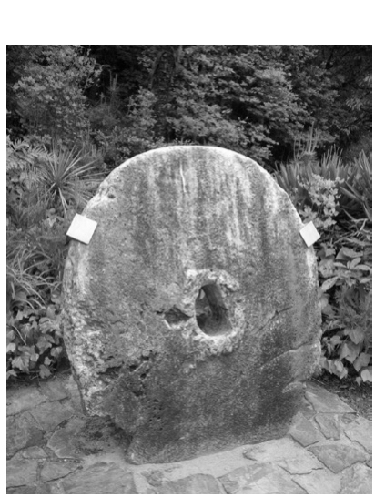

    作者: 尼尔·梅塔 / 阿迪蒂亚·阿加什 / 帕斯·底特律
    出版社: 电子工业出版社
    副标题: 货币革命进行时
    译者: AI人工智能翻译组
    出版年: 2020-9-7
    页数: 264
    定价: 69.00元
    装帧: 平装
    ISBN: 9787121393747

[豆瓣链接](https://book.douban.com/subject/35217239/)

- [比特币和区块链](#比特币和区块链)
  - [纸币的弊端](#纸币的弊端)
    - [由中间人调度的货币](#由中间人调度的货币)
    - [无形性](#无形性)
  - [雅浦岛石币](#雅浦岛石币)
    - [无形的](#无形的)
    - [无中间人的](#无中间人的)
  - [比特币的区块链](#比特币的区块链)

# 比特币和区块链
2008年万圣节，一位自称中本聪的计算机科学家发表了《比特币白皮书》。比特币是一种加密数字货币，人们无须通过银行、信用卡或其他金融机构就可以进行兑换。

## 纸币的弊端
### 由中间人调度的货币
人类发明了由类似银行或地方长官等受信任的机构调度的货币。银行账户、银行贷款、信用卡、支票等都属于这一类。通过信任中央机构或中间人，你可以解决大部分实物货币存在的问题。
- 把钱存入银行一定比把钱放在家里安全。
- 可以进行快速的在线支付，此时付款就像让你存钱的银行和收款方存钱的银行更新你们的账户余额一样简单（你们的存款余额只是某个数据库里的数字）。
- 当一个受信任的权威机构能精确地追踪每个人有多少钱时，伪造货币就变得很困难了。（因为没有关于每个人有多少现金的中央记录，所以识别假币的唯一方法就是你自己能区分假币和真币。）
- 如果你相信中间人能保管你的钱，你就不需要随身携带它们了。

由中间人调度的货币必须通过中间人，这导致这一类货币具有以下几个缺点。
1. 当你的钱通过中间人流转时，你必须遵守他们的规则，这通常意味着你必须支付费用。当你用信用卡付款时，商家并不会收到全款，因为它们必须向信用卡组织支付费用。维萨信用卡、万事达信用卡、发现卡的费率一般为1.5%～2.5%，运通卡的费率为2.5%～3.5%。
1. 只有获得使用权限，才能使用由中间人调度的货币。这意味着世界上20亿没有银行账户的人不能进行任何涉及银行账户的交易，拥有不良信用或无信用的人不能使用信用卡。
1. 在你把钱委托给中间人的同时也把你的个人数据委托给了它们。银行擅长保管你的钱，但是金融机构在保障数据安全方面表现不佳

### 无形性
我们真正需要的货币是无形的。由中间人调度的货币通过引入中间人为货币的无形性提供了可能：如果你委托机构为自己管理和转移资金，你就不需要持有实物货币了。

## 雅浦岛石币
雅浦岛上的流通货币是一种被称为“雅浦岛石币”的巨型石环。这种石头币很大：有些直径达3米，与卡车的重量差不多。

部落居民无法拖着这些巨大的石币来进行交易。他们会一起记住每块石币由谁拥有，并且在心里记下关于每块石币的交易记录。例如，如果酋长的女儿从木匠那里买了一艘船，她会告知部落居民，她拥有的那块石币（如海滩上的那块）现在归木匠了。部落居民再相互告知：酋长女儿在海滩上的那块石币现在归木匠所有。

_雅浦岛上的一种传统的货币形式——雅浦岛石币。_

_来源：维基媒体_

如果木匠之后想把那块石币给别人，部落居民会同意，因为每个人的心理记录都表示，那块石币现在属于他。简单来说，如果大多数村民认同某人拥有一块石币，那么他就可以花掉它。

### 无形的
雅浦岛石币这种货币系统最令人印象深刻的部分是，所有的经济活动都可以在石币完全不移动的情况下发生。

### 无中间人的
雅浦岛石币这种货币系统是民主的。如果大多数人认同你拥有某块石币，那你就的确拥有它。不像由中间人调度的货币系统那样——将你的钱委托给某个人或机构，雅浦岛石币被委托给了整个部落的居民。

从雅浦岛石币这种货币系统汲取的经验是，无形的货币体系要求信任。只有当你相信某物或某个人会准确记录你的钱时，你才会放弃对你的钱的实际控制。雅浦岛石币的创新之处在于，你意识到你可以信任系统，而不是中间人。在雅浦岛上，值得信赖的系统就是雅浦岛部落居民共享的交易心理记录。通过信任一个由一群遵循共享规则的人构建的共享的、共识驱动的系统，而不是一个人或一个实体，你可以得到不需要中间人的无形的货币。

## 比特币的区块链

