    作者: 尼尔·梅塔 / 阿迪蒂亚·阿加什 / 帕斯·底特律
    出版社: 电子工业出版社
    副标题: 货币革命进行时
    译者: AI人工智能翻译组
    出版年: 2020-9-7
    页数: 264
    定价: 69.00元
    装帧: 平装
    ISBN: 9787121393747

[豆瓣链接](https://book.douban.com/subject/35217239/)

- [比特币和区块链](#比特币和区块链)
  - [纸币的弊端](#纸币的弊端)
  - [雅浦岛石币](#雅浦岛石币)
  - [挖矿](#挖矿)
  - [区块和链](#区块和链)
  - [分支和欺诈](#分支和欺诈)
  - [随机值游戏](#随机值游戏)
  - [凭证](#凭证)
- [比特币经济学](#比特币经济学)
  - [价值9千万美元的比萨](#价值9千万美元的比萨)
  - [比特币的供应](#比特币的供应)
  - [比特币的需求](#比特币的需求)
  - [通货膨胀的因素](#通货膨胀的因素)
  - [通货紧缩](#通货紧缩)
  - [进行投资或持有货币](#进行投资或持有货币)
- [比特币的失策](#比特币的失策)
  - [扩容的问题](#扩容的问题)
  - [Mt.Gox事件](#mtgox事件)
  - [中心化](#中心化)
- [山寨币](#山寨币)
  - [比特币的分叉](#比特币的分叉)
  - [以太坊](#以太坊)
  - [Brave \& BAT](#brave--bat)
  - [稳定币](#稳定币)
  - [币安](#币安)
  - [门罗币](#门罗币)
- [公有区块链](#公有区块链)
  - [线上投票](#线上投票)
  - [不朽的互联网](#不朽的互联网)
  - [在区块链上能获得Hooters奖励吗](#在区块链上能获得hooters奖励吗)
  - [区块链上的商标](#区块链上的商标)
  - [去中心化的网站](#去中心化的网站)
- [商业上的区块链](#商业上的区块链)
  - [沃尔玛和食源性疾病的预防](#沃尔玛和食源性疾病的预防)
  - [股票和区块](#股票和区块)
  - [Xbox和游戏版税](#xbox和游戏版税)
- [加密数字货币的政策](#加密数字货币的政策)
  - [委内瑞拉的国有加密数字货币](#委内瑞拉的国有加密数字货币)
  - [ICO和诈骗](#ico和诈骗)
  - [ICO监管](#ico监管)
- [接下来会怎样](#接下来会怎样)

# 比特币和区块链
2008年万圣节，一位自称中本聪的计算机科学家发表了《比特币白皮书》。比特币是一种加密数字货币，人们无须通过银行、信用卡或其他金融机构就可以进行兑换。

## 纸币的弊端
**由中间人调度的货币**

人类发明了由类似银行或地方长官等受信任的机构调度的货币。银行账户、银行贷款、信用卡、支票等都属于这一类。通过信任中央机构或中间人，你可以解决大部分实物货币存在的问题。
- 把钱存入银行一定比把钱放在家里安全。
- 可以进行快速的在线支付，此时付款就像让你存钱的银行和收款方存钱的银行更新你们的账户余额一样简单（你们的存款余额只是某个数据库里的数字）。
- 当一个受信任的权威机构能精确地追踪每个人有多少钱时，伪造货币就变得很困难了。（因为没有关于每个人有多少现金的中央记录，所以识别假币的唯一方法就是你自己能区分假币和真币。）
- 如果你相信中间人能保管你的钱，你就不需要随身携带它们了。

由中间人调度的货币必须通过中间人，这导致这一类货币具有以下几个缺点。
1. 当你的钱通过中间人流转时，你必须遵守他们的规则，这通常意味着你必须支付费用。当你用信用卡付款时，商家并不会收到全款，因为它们必须向信用卡组织支付费用。维萨信用卡、万事达信用卡、发现卡的费率一般为1.5%～2.5%，运通卡的费率为2.5%～3.5%。
2. 只有获得使用权限，才能使用由中间人调度的货币。这意味着世界上20亿没有银行账户的人不能进行任何涉及银行账户的交易，拥有不良信用或无信用的人不能使用信用卡。
3. 在你把钱委托给中间人的同时也把你的个人数据委托给了它们。银行擅长保管你的钱，但是金融机构在保障数据安全方面表现不佳

**无形性**

我们真正需要的货币是无形的。由中间人调度的货币通过引入中间人为货币的无形性提供了可能：如果你委托机构为自己管理和转移资金，你就不需要持有实物货币了。

## 雅浦岛石币
雅浦岛上的流通货币是一种被称为“雅浦岛石币”的巨型石环。这种石头币很大：有些直径达3米，与卡车的重量差不多。

部落居民无法拖着这些巨大的石币来进行交易。他们会一起记住每块石币由谁拥有，并且在心里记下关于每块石币的交易记录。例如，如果酋长的女儿从木匠那里买了一艘船，她会告知部落居民，她拥有的那块石币（如海滩上的那块）现在归木匠了。部落居民再相互告知：酋长女儿在海滩上的那块石币现在归木匠所有。

_雅浦岛上的一种传统的货币形式——雅浦岛石币。_

_来源：维基媒体_

如果木匠之后想把那块石币给别人，部落居民会同意，因为每个人的心理记录都表示，那块石币现在属于他。简单来说，如果大多数村民认同某人拥有一块石币，那么他就可以花掉它。

**无形的**

雅浦岛石币这种货币系统最令人印象深刻的部分是，所有的经济活动都可以在石币完全不移动的情况下发生。

**无中间人的**

雅浦岛石币这种货币系统是民主的。如果大多数人认同你拥有某块石币，那你就的确拥有它。不像由中间人调度的货币系统那样——将你的钱委托给某个人或机构，雅浦岛石币被委托给了整个部落的居民。

从雅浦岛石币这种货币系统汲取的经验是，无形的货币体系要求信任。只有当你相信某物或某个人会准确记录你的钱时，你才会放弃对你的钱的实际控制。雅浦岛石币的创新之处在于，你意识到你可以信任系统，而不是中间人。在雅浦岛上，值得信赖的系统就是雅浦岛部落居民共享的交易心理记录。通过信任一个由一群遵循共享规则的人构建的共享的、共识驱动的系统，而不是一个人或一个实体，你可以得到不需要中间人的无形的货币。

## 挖矿
所有比特币用户都可以使用他们的计算机来验证挂起的交易，并且只将有效的交易添加到区块链上。为了提高效率，交易被分成区块，每个区块有几千笔交易。

**激励**

因为比特币自认为是“数字”黄金，验证者投入工作来挖取全新的货币，这个验证过程被称为“挖矿”，而验证者被称为“矿工”。（你在用计算机挖矿，而不是用镐和铲子，但它们的商业模式大致相同。）

## 区块和链
比特币的区块链以线性“链”的方式存储区块，每个区块在数学上都指向前一个区块。

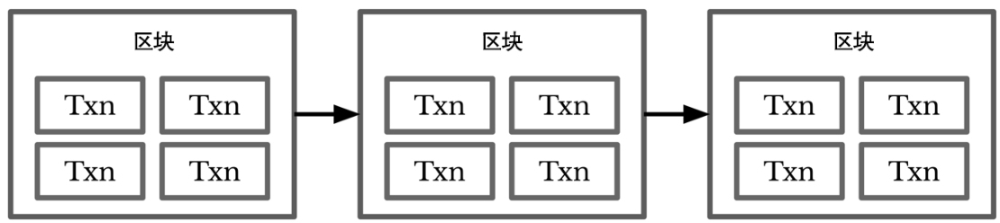

_区块链以线性“链”的方式存储区块。“Txn”是比特币交易的缩写。_

**哈希**

在比特币中，每个区块都有一个相关的哈希。每个区块的哈希部分基于它的前一个区块的哈希。通过这种方式，每个区块都指向它的前一个区块。所以，如果你有一个无序的区块列表和与它们相关的哈希表，你可以很容易地对区块进行排序。

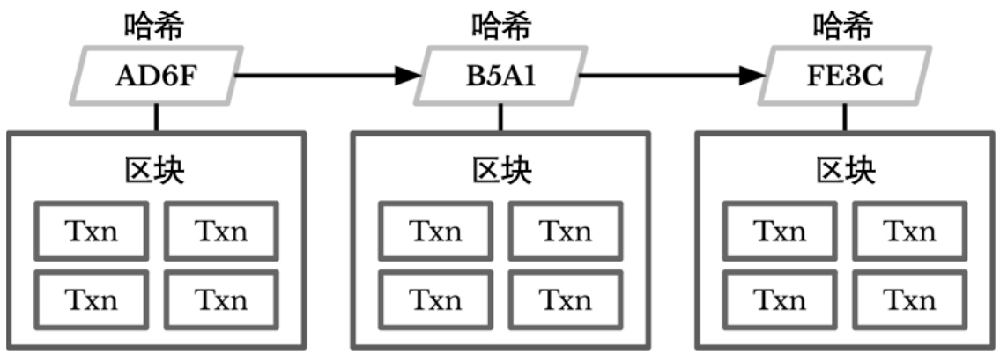

_区块由它们的哈希连接在一起。每个哈希都是根据前一个区块的哈希计算得到的。_

## 分支和欺诈
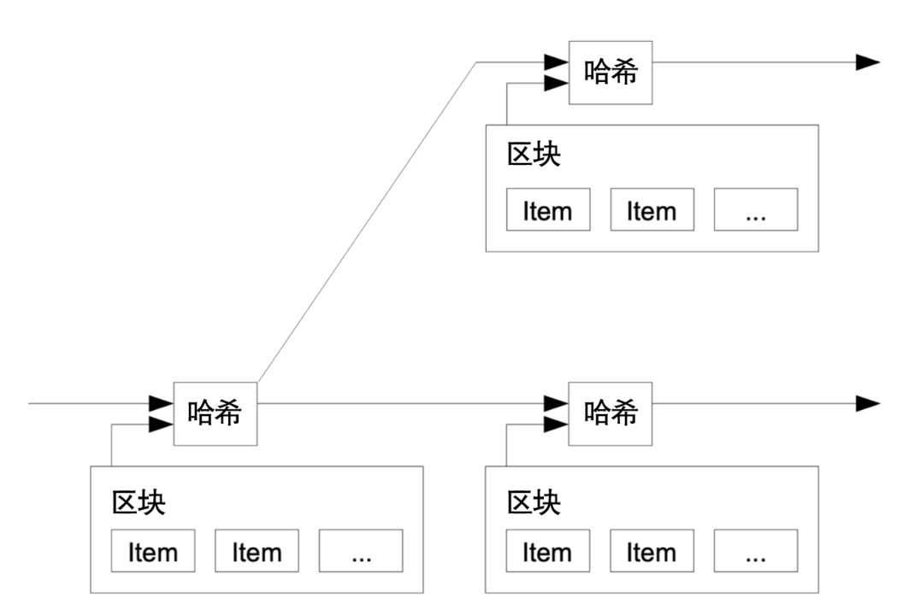

_多个区块可以将任何给定的区块作为它们的前一个区块，因此区块链确实可以分支。_

**区块树**

当两个矿工同时挖出一个区块时，区块树有时会产生一个新的分支。这种情况很少见，但确实会发生。当这种情况发生时，两笔交易会从最近的交易中分离出来，一个新的区块分支就诞生了。

**最长链原则**

为了保证线性的正式历史，比特币使用了名为“最长链原则”的经验法则。这条法则指出，拥有最多区块的“区块树”的分支就是正式的区块链。最长链决定了你有多少钱、过去发生过什么交易等。如果某件事不在最长链上，它就不会发生。

在比特币用户的计算机上运行的比特币软件，只向在最长链上添加一个区块的矿工支付报酬，从而贯彻最长链原则。这通常足以使矿工们保持秩序。（不过，它有一个副作用。如果两个矿工同时开采出一个区块，就会产生两个分支，但只有一个分支会胜出，成为最长链。另一个分支成为“孤儿”并被抛弃，而在挖掘出该分支底部区块的不幸矿工将得不到任何钱。这种“孤儿”事件一天会发生好几次。）

**挖矿劫持**

如果一个不正当的矿工创造了一个新分支，并且能比其他矿工更快地挖掘区块，从而使他的分支比合法的分支更长，不正当的矿工的分支将成为最长链，所以它将成为正式的区块链。

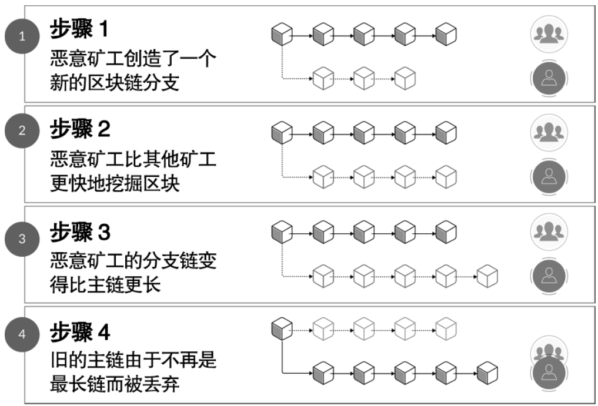

_攻击者如何通过比其他人更快地挖掘区块来劫持区块链。_

设想一下，不正当的矿工用比特币购买了数千美元的商品，并把交易放在区块链上。然后，他执行攻击，建立一个比正式区块链更长的新链。他支付给商家的交易数据将被丢弃，因为这些交易数据所在的区块不在最长链上。这就好像他一开始就没有付款一样。所以，他最终得到了所有的商品，但从来没有为它付钱！

## 随机值游戏
如何阻止这样的攻击？让攻击者很难比诚实的矿工更快地挖出区块是个办法。为此，中本聪的设计是，挖出一个区块需要花费非常多的时间。

没有被纳入区块链的交易被搁置在交易池等待审核和确认。交易池也被称为内存池。如果你想要挖掘一个区块，你就要从中选择几千条交易，验证它们，然后才能挖掘出你的区块。

在完成上述操作后，你所要做的就是为你的区块生成一个哈希，之后就可以把这个区块放在区块链上，并且得到你的奖励。

但是生成哈希并不是一件容易做到的事。哈希函数需要三个输入：前一个区块的哈希、交易和一个你选择的被称为`随机值（nonce）`的特殊数字。

问题是，输入不同的随机值将输出不同的哈希值，而只有当哈希以正确数量的“0”开头时，你才被允许将区块添加到区块链中。所以，如果你选择的随机值不能产生正确的哈希，你就必须一次又一次地尝试。

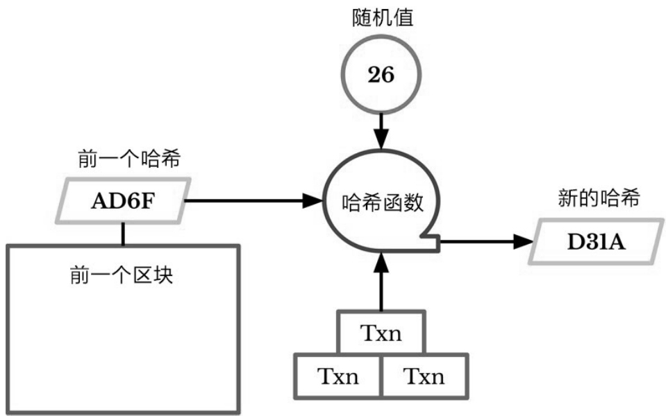

_哈希函数使用3个输入来生成一个区块的哈希。_

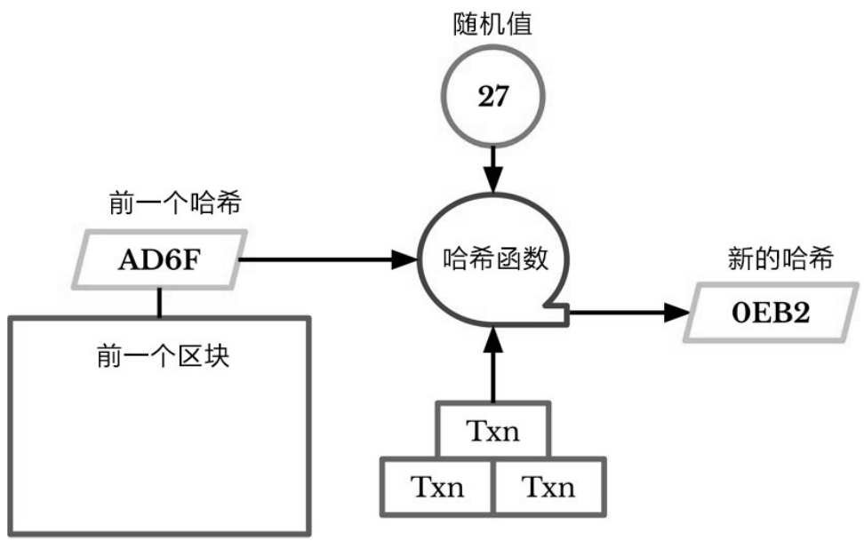

_改变随机值会输出一个完全不同哈希。_

**猜测和检验**

计算机运行的哈希函数往往是所谓的单向函数，即在给定输入的情况下很容易计算得到输出，但在给定输出的情况下，猜测输入几乎是不可能的。

这意味着“破解”哈希函数的唯一方法是猜测所有的输出。所谓“破解”哈希函数就是根据输出计算出输入。强行破解计算机的哈希函数是非常困难的。破解比特币的SHA-256哈希函数将花费数百万年的时间，成本极有可能达到数百万美元甚至数十亿美元。

你不能试图逆向找到正确的随机值。所以挖掘一个区块的唯一方法就是一遍又一遍地猜，直到你猜中。

**矿机**

出于一些显而易见的原因，专业的矿工不会使用笔记本电脑来挖矿。他们购买的是功能强大的计算机，这种计算机配备有专用的`计算机芯片（ASIC）`，这种芯片针对比特币的哈希算法进行了高度优化。用来挖矿的ASIC能以惊人的速度猜测随机值，但它们不能做其他事情。

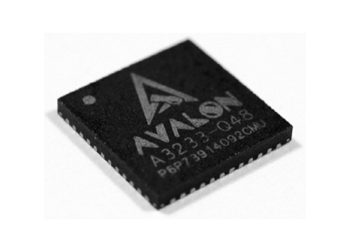

_一个专门运行比特币哈希算法的ASIC。来源：维基媒体_

一台售价2000美元的中型的、配备ASIC芯片的挖矿计算机每秒可以输出大约56万亿个哈希，这意味着它每秒可以尝试输入56万亿个随机值。但是由于很难猜测出正确的随机值，所以即使有这么强大的硬件，成功挖掘一个区块也需要大约38年的时间。

**工作证明**

回想一下前面的恶意的矿工想开挖一条比合法区块链长得多的诈骗链的例子。要做到这一点，他的挖矿速度需要比其他所有诚实的矿工的速度总和还快，所以他需要控制世界上超过50%的哈希能力。这种攻击被称为51%攻击。51%攻击是可能实现的，但它的代价也是高昂的，这个恶意的矿工需要购买所有这些配备了ASIC的超级计算机。而且，除非这个恶意的矿工能够控制51%的哈希能力，否则他就没有机会篡改区块链。

简而言之，要挖掘比特币，你就必须投入大量的工作和资金。因为工作量庞大，比特币挖掘系统被称为工作证明。赢家是那些为挖矿付出最多努力的人。

## 凭证
**去中心化的账户**

`私钥`是一个只有你才应该知道的长且完全随机的字符串。它通常是52位的由字母和数字组成的字符串。这种编码方式被称为Base58。私钥在比特币中扮演着密码的角色。

可以用私钥运行一个被称为椭圆曲线数字签名算法的单向函数来生成一个被称为`公钥的中间数字（intermediary number）`。

然后运行比特币挖矿中著名的SHA-256和RIPEMD-160这两个单向函数，并且进行更多的数学调整，以获得一个压缩版本的公钥。这个`公钥`被称为`比特币地址`。比特币地址是一串由字母和数字组成的26～35位字符串，也是由Base58这种编码方式生成的。比特币地址是比特币最接近用户名的东西：它是公开的，能用来识别你的身份。

**交易签名**

一旦有了私钥和地址，你就可以开始发送和接收比特币了。为了证明你是一笔交易的发送方，你可以使用自己的私钥在交易上创建一个“标记”，从而对交易进行数字“签名”。任何人都可以使用你的公钥（当然可以，因为它对所有人是可见的）来确认应用标记的人是你，但是没有人可以根据标记反向推出你的私钥。

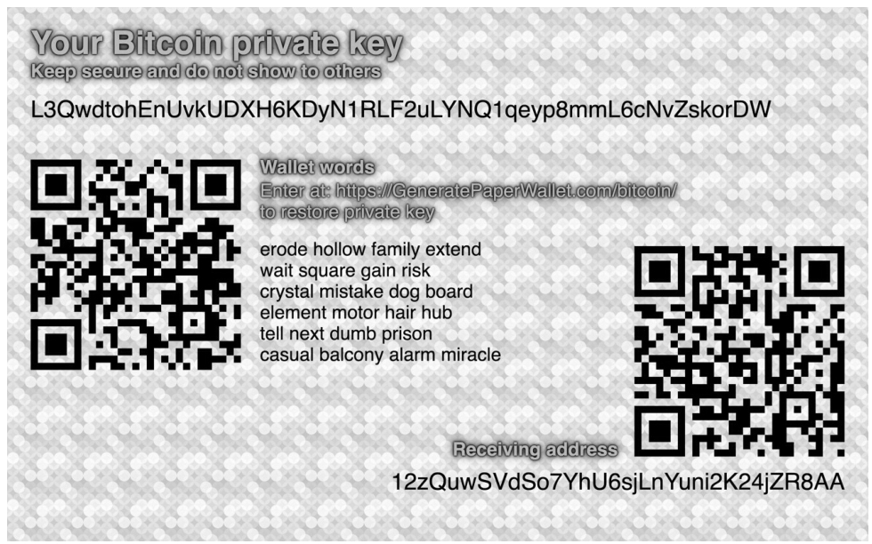

_我们生成了一个随机的私钥和地址。不要把钱发送到这个地址，因为任何有这个私钥的人都可以获得里面的钱。这张图片叫作纸钱包。你可以打印出你的私钥，这样就可以把它保存在一个安全的地方了。_

# 比特币经济学
## 价值9千万美元的比萨
**拉兹洛的交易**

2010年3月，第一家比特币交易所成立。你可以在这个网站上将比特币兑换成美元，也可以将美元兑换成比特币。在这家比特币交易所成立时，比特币对美元的汇率是，1枚比特币可以兑换0.3美分。

同年5月，美国佛罗里达州一名叫拉兹洛·汉尼什的男子在一个比特币论坛上发帖，只要有人给他送比萨，他就给那个人1万枚比特币（当时价值41美元，1枚比特币可以兑换0.4美分）。他的条件很灵活：“你可以自己做比萨，或者在外卖店帮我订比萨。”但是他也很坚持：“我不想吃鱼或诸如此类的奇怪的东西。”

**主体间性**

历史学家尤瓦尔·赫拉利所说的`主体间性`：你之所以认为这件事有价值，是因为你知道别人也认为它有价值。农贸市场的农民之所以会很乐意你用20美元从他那里买他自制的果酱，是因为他知道他可以用这20美元从别人那里买杂货、农具或其他他需要的东西。

## 比特币的供应
经济价值源自稀缺性，而稀缺性源自供应的有限性。因此，维持比特币价值的一种方式是限制比特币的供应量：比特币的流通数量被人为设定了上限，而且其供应量的增长速度每天都在减慢。

**放缓的奖励**

比特币软件会通过设定哈希值的前导零的数量来自动调整挖矿的难度，平均每10分钟挖出一个区块，由此每10分钟就会产生一批新比特币。

但问题是，区块奖励总是在减少。比特币软件每4年将区块奖励减半。2008年，最初的区块奖励为每个区块奖励50枚比特币。2012年，区块奖励减半至25枚比特币。2016年又减了一半，降至12枚比特币。等到2020年5月，区块奖励的比特币数量下降至6.25枚。

如果根据区块奖励每4年减半进行计算，你会发现，在2140年进行第33次减半后，区块奖励将正式归零。届时，总共被挖出来的比特币共有2100万枚，而比特币的供应量将永远不会再增加。

**丢失的比特币**

有趣的是，比特币的供应量实际上会随着时间的推移而减少。比特币所具有的高度去中心化的体系意味着，如果你丢失了自己的私钥，就无法找回你的比特币。

## 比特币的需求
**易用性理论**

我们认为，拉动比特币需求的现实因素还有两个。一个因素是比特币的投资门槛越来越低。在2010年代中期，持有比特币的主要方式是在电脑上运行笨拙的软件，找一个合法的比特币交易平台，在某些情况下，为了买一些比特币还要进行手续烦琐的跨境银行支付。当时的比特币投资只适合真正专注于比特币的人。

但是现在，任何人都可以投资比特币。你可以在一些网站上用借记卡购买比特币，可以用某些App购买和发送比特币。一些流行的股票交易App也提供比特币的买卖服务。你甚至可以通过富达或德美利证券等证券经纪人购买比特币的ETF。降低比特币投资的准入门槛，这又消除了比特币需求的一个上限。

**投机理论**

另一个因素是纯粹的旧猜测（plain old speculation）——在我们看来也是影响力更强的因素。大多数比特币的用户都是希望赚钱的投机者。与股票市场相比，比特币的价格波动较大，监管相对不足，而且投资门槛的降低使其成为一种令人兴奋的、相对容易投机的投资工具，这对于年轻人来说尤其如此。

随着时间的推移，比特币供应量的增长速度会越来越慢，需求对比特币价格的影响也会越来越大。如果需求的上升趋势能持续下去，比特币将继续升值。但如果需求消失，比特币的价格体系将崩溃。

将持续的低供应和反复无常的需求结合起来，你就能了解比特币的价格变化历史：剧烈波动，但长期来看仍保持增长趋势。

## 通货膨胀的因素
**通货膨胀的定义**

如果你仔细研究通货膨胀的定义，你会发现它给比特币带来了一个问题。通货膨胀是根据多年来实物商品（如装满一辆购物车的商品）价格的变化来计算的。比特币的问题在于，你无法真正用比特币购买实物商品。即便有少数商店允许你用比特币购买实物商品，如床垫，但你通常不会直接用比特币付款。相反，你的比特币会自动转换成美元（或当地货币），商家最终收到的也是美元（或当地货币）。

因此，除了借助其他货币，你无法用比特币买到很多东西。你可以用一“篮子”货币来衡量通货膨胀。例如，你可以统计每年购买100美元、100欧元和1万日元所需的比特币数量。问题在于，由于外汇市场的波动和通货膨胀，这些货币的价值也总在变化。

因此，如果兑换一“篮子”货币的比特币价格发生了变化，你无法判断是比特币还是一“篮子”货币造成了这种价格变化。（与此同时，我们衡量通货膨胀率的实物商品的价值是固定的。一盒麦片的价值在十年前和今天是一样的。）简而言之，用一“篮子”货币对比特币汇率的变化来衡量通货膨胀不是好方法。

## 通货紧缩
**减少供应**

其实，通货紧缩对比特币的投资者来说是个好消息。比特币的供应量减少了，他们持有的比特币就显得稀有，因此更有价值。但显而易见，通货紧缩对经济来说是不健康的。在通货紧缩的经济环境中，随着时间的推移，钱会变得更有价值，所以你有足够的动机去囤积它，而很少有动机去投资或消费。

**通货膨胀的效益**

通货紧缩使人们储蓄，不进行消费和投资。与此同时，维持小幅且稳定的通货膨胀率能促使人们投资，因为他们意识到如果不进行投资或理财，自己的钱就会贬值。适当的通货膨胀有助于维持经济的健康增长。

如果人们囤积现金（或比特币）而不是努力发展业务，经济就会陷入停滞。因此，虽然在比特币的世界里，通货紧缩对投资者来说可能是一件好事，因为他们只要持有比特币就能看到潜在的巨额回报，但这会为比特币成为国家（或世界）货币奠定糟糕的基础。

## 进行投资或持有货币
**稳定和增长**

使投资变得有效率的东西与使货币变得有效率的东西是不同的。谷歌的股票是十分理想的投资产品，但你不会希望它成为美国唯一的法定货币，因为商业交易将因此变得困难许多。（消费者不会买任何东西，既然用同样数量的股票在几个月后能买到更多东西，现在为什么要消费呢？商家则会犹豫是否接受股票，因为他们担心它的价值会崩溃，他们会因此赔钱。）

另一方面，美元是非常稳定的，这使得它成为商业交易和经济运行的重要基础。你可以相信，你花费或赚到的美元不会大幅升值或贬值。但投资者不会把美元作为他们投资策略的核心，因为美元没有利润可赚，而且，通货膨胀实际上慢慢地吞噬了美元的价值。

换句话说，好的货币的价值具有稳定性，而好的投资产品的价值具有增长性。当然，稳定性和增长性是相互排斥的。一种金融工具不可能在保持稳定的同时还保持增长。

**比特币——彻头彻尾的投资**

比特币是一种奇怪的金融工具。它既是一种货币，也是一种投资产品。你可以使用比特币在网上买卖东西，也可以购买并持有比特币，以期能够盈利。

金融工具不可能同时是增值的货币和增值的投资产品。在两者间必须做出选择。从技术上讲，比特币是一种货币，但它表现得更像是一种投资产品。

如果你看看比特币的价格变化，很明显，比特币选择成为一种投资产品。比特币币值的不稳定性是出了名的：它可以在一个星期内下跌或飙升20%。在2017年12月的一个特别疯狂的日子里，一枚比特币的价格从早上的1.5万美元涨到了午餐时间的逾1.9万美元，到下午晚些时候，回落至约1.6万美元。比特币币值的增长仍然是不可预测的，但是到目前为止，从长远来看，它增长得非常快。

# 比特币的失策
## 扩容的问题
**交易费用和延误**

首先，需要考虑的是交易费用。请记住，矿工对一个区块内的每笔交易都要收费。每笔交易在纳入区块前都要指定其可以支付的交易费用，然后才能进入所有未被确认的交易的内存池。矿工可以选择纳入下一个区块的交易。你能想象到，他们会选择支付交易费用最高的交易。

**交易阻塞**

交易费用的问题更多地出现在交易阻塞的时候。当人们进行交易的速度远远快于矿工将交易打包成区块的速度时（请记住，区块只能每10分钟制作一次），需求的增加将推高平均交易费用。

以2017年12月的情况为例。比特币长达一年的涨势在这个月达到顶点：一枚比特币的币值从2017年1月的不到1000美元飙升至2017年12月的逾1.9万美元。在这个月，试图买卖比特币的人持续增多，交易的数量达到了前所未有的高度，这导致交易的平均费用飙升（一度超过55美元）。

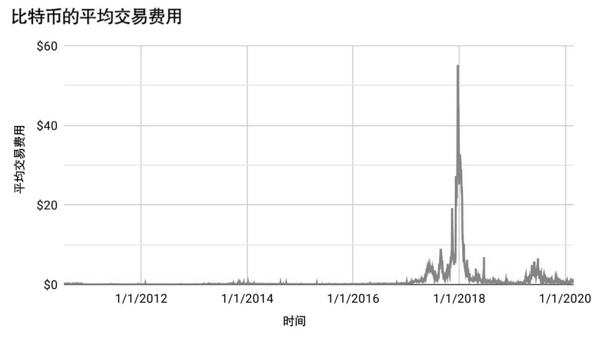

_比特币的交易费用通常不到1美元，但在需求旺盛的时候会飙升——平均交易费用一度超过55美元。数据来源：Bitinfocharts.com_

**根本问题**
即使在最好的情况下，比特币也不适合小额支付。据早期著名的比特币开发者迈克·赫恩估计，比特币系统每秒只能处理大约3笔交易。最新数据显示，比特币系统每秒只能处理3.5～4笔交易。

但是，维萨的系统每秒可以处理更多笔交易。对此，我们很难说出一个确切的数字。摩根士丹利表示，维萨和万事达每秒可以处理5000笔交易。维萨曾经吹嘘，称其系统每秒可以处理11000笔交易。而有一些白皮书显示，维萨每秒最多可处理45000笔交易。无论哪个数据是真实的，维萨处理的交易数量远远超过比特币。

## Mt.Gox事件
Mt.Gox于2010年在东京成立，它允许世界各地的人们将美元、日元等政府发行的法定货币兑换成比特币，反之亦然。Mt.Gox实际上是在2009年为卡牌游戏《万智牌》（Magic：The Gathering
）交换卡牌而诞生的。“Mt.Gox”这个名字源自“Magic：The Gathering
OnlineExchange”。Mt.Gox很快转向了比特币。Mt.Gox发展迅速，到2013年，全球超过70%的比特币交易都通过该平台进行。

**盗窃**

Mt.Gox早在2011年就遇到了麻烦，但是大多数用户并不知道。Mt.Gox将用户的账户余额存储在特定的钱包中（钱包只是针对私钥和地址对的术语）。2011年，不知真实身份是黑客还是Mt.Gox的流氓雇员的一名攻击者从Mt.Gox的服务器上复制了一个名为“wallet.dat”的文件；这个文件里存有Mt.Gox钱包的私钥。

在接下来的几年里，有Mt.Gox私钥的小偷慢慢挪走了Mt.Gox钱包里的比特币。Mt.Gox完全不知道失窃事件。

目前，还不清楚小偷从Mt.Gox偷了多少枚比特币。有20万枚比特币后来被找到，但有大约60万枚仍下落不明。

**其他选择**

比特币社区已经开发了避免此类黑客攻击事件再次发生的技术。在这类技术中，最引人注目的是`冷钱包`，它将私钥存储在一个不连接互联网的平台上，可以防止网络攻击或任何此类漏洞。

冷钱包有两种常见的形式。第一种是`纸钱包`，即私钥和地址被印刷在一张纸上（这张纸应被放在一个安全的地方）。这和把写有你的银行卡密码的便利贴放在书房里没什么两样：用起来不方便，也容易放错地方，但这能确保黑客的攻击不会得手。

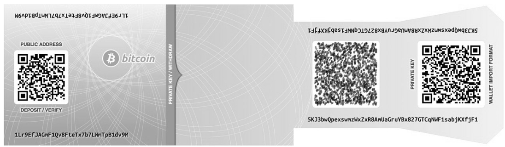

_上图为纸钱包的一个示例。最左边的代码是地址，最右边的代码是私钥。你也可以通过扫描二维码来更便捷地输入私钥和地址。来源：BitcoinPaperWallet_

第二种是`硬件钱包`，即将私钥存在一个优盘上。硬件钱包是安全的，因为你的私钥存在优盘里。请永远不要丢掉这个优盘。交易时你需要用私钥进行签名，利用硬件钱包，你可以在（联网的）计算机没有存储你的私钥的情况下交易。

更重要的是，一些硬件钱包还需要你按下一个物理按钮来批准交易。因此攻击者不可能拿走你的钱，除非他们能得到你的硬件钱包。在科技领域，用实物来补充数字登录的策略已经变得相当普遍。如果你曾经使用过双因素身份验证，例如用你的手机批准登录，那么你对这种方法不会陌生。

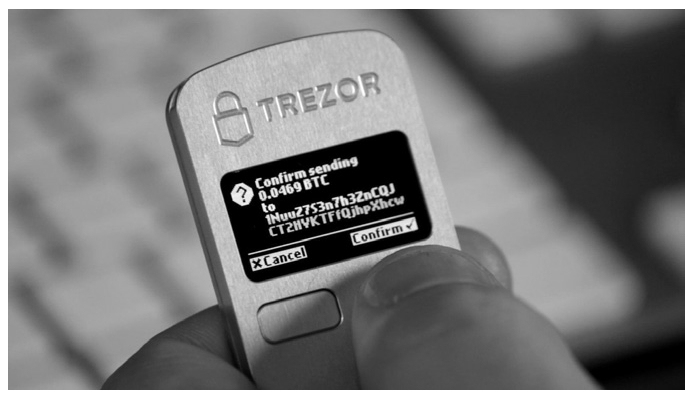

_上图为硬件钱包的一个示例。私钥被存在这个小设备上，它通过USB端口插入计算机。需要使用物理按钮来批准交易。来源：维基媒体_

## 中心化
**一些节点**

比特币的区块链是巨大的：在撰写本书时，它的容量已经超过了250GB，并且每年还要增加50GB。比特币的区块链太大了，很多笔记本电脑已经无法存储了。

出于这个原因，大多数比特币用户不会将完整的区块链存储在他们的设备上。相反，他们只在设备上存储部分的区块链，这些存储部分区块链的设备就是所谓的轻量级节点。他们依靠其他人运行的完整节点或存储了整条区块链的计算机，来验证交易并确保新的区块被添加到了区块链上。这样做的风险是，使用轻量级节点的用户不能百分之百确定他们获得的所有交易都是合法的；他们必须信任完整节点的所有者。

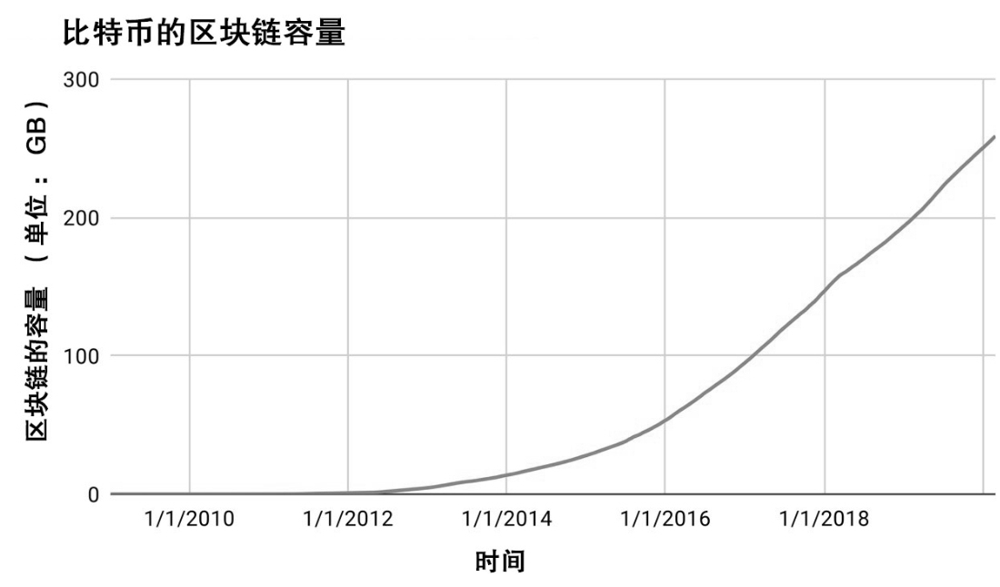

_随着交易数量的增多，比特币的区块链容量稳步增加。数据来源：Blockchain.com_

问题是，维护一个完整节点是没有报酬的，但完整节点对比特币的运行至关重要，因为它们是唯一存储正式区块链的节点。专家表示，由于缺乏金钱激励，而且维护完整节点的难度越来越大，这意味着一般的比特币用户不会再维护完整节点。相反，完整节点将由矿池公司、像比特大陆这样的ASIC制造商、云挖矿公司等几家盈利颇丰的大公司维护。

很难确切知道是谁在运行这些节点，但已经很清楚的是，尽管人们对比特币的兴趣日益浓厚，但完整节点的数量没有继续增加。在撰写本书时，比特币完整节点的数量还维持在过去两年的1万多个。

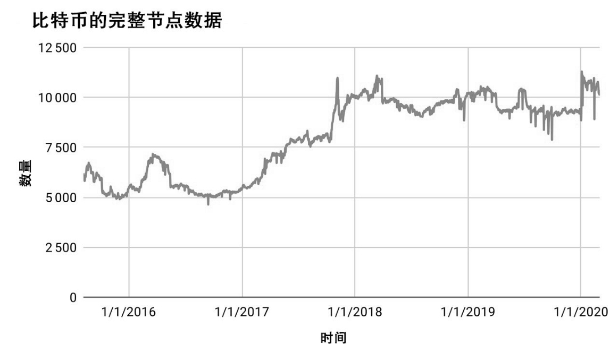

_自2018年以来，比特币完整节点（存储整条区块链的计算机）的总数一直变化不大。数据来源：CoinDance_

如果这些专家的数据是正确的，那么一些强大的实体将真正控制区块链的未来，从而控制比特币的未来。

**相同的软件**

比特币中心化的第二个例子体现在完整节点所运行的软件上，即所谓的比特币客户端。在撰写本书时，比特币客户端Bitcoin Core在97.5%的完整节点，即10605个节点中的10341个上运行。排名第二的比特币客户端Bitcore只在111个完整节点上运行。

事情并不一直是这样的，其他比特币客户端在过去也有一定的竞争力。2015年，Bitcoin XT在超过1000个完整节点上运行，占当时所有完整节点的15%以上。Bitcoin Classic的运行量在2016年达到峰值，它在超过2000个完整节点上运行，占比达30%。在撰写本书时，只有2个完整节点在运行Bitcoin XT，3个完整节点在运行Bitcoin Classic。自从2018年年初比特币客户端比特币无限（Bitcoin Unlimited）倒闭以来，Bitcoin Core就没有遇到过任何激烈的竞争。

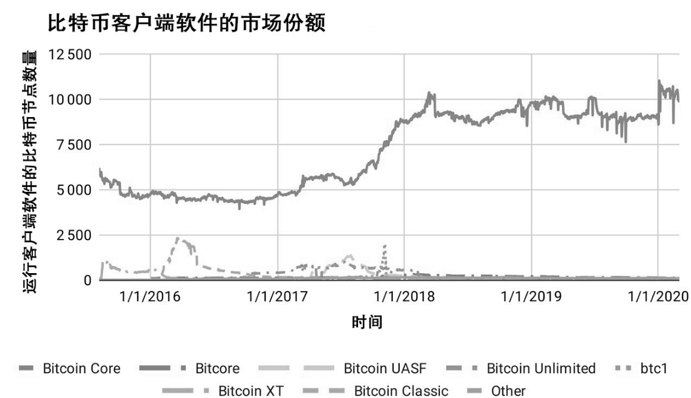

_在过去，比特币客户端软件的市场竞争相当激烈，但Bitcoin Core很快就击败了竞争对手。数据来源：CoinDance_

令人不安的是，Bitcoin Core背后的团队主要由一家名为Blockstream的区块链公司资助。更令人不安的是，Blockstream公司雇用了大量的Bitcoin Core团队的核心成员。

这让所有支持去中心化的人感到担忧：比特币的核心软件主要由一小群人拥有和维护，而这群人受雇于同一家公司。可以想象，由Blockstream公司引发利益冲突和“用户难以操作”的可能性很高。

**一些矿池**

哈希能力集中到了少数几个矿池手中。而最顶尖的矿池总是处于竞争关系。一些矿池会出现，一些矿池会倒闭，但是，我们发现，最顶尖的15家矿池挖出了大约95%的比特币区块。另外，前5大矿池控制了60%～75%的哈希能力。

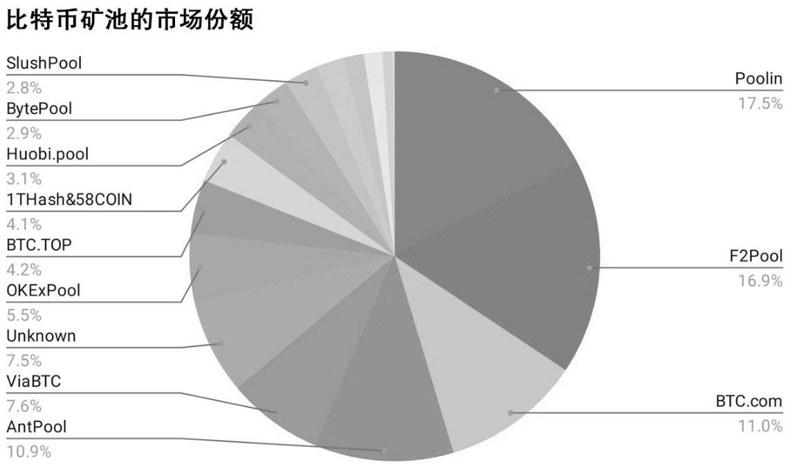

_在撰写本书时，排名前4的矿池控制了约56%的哈希能力，这意味着它们挖出了56%的区块。数据来源：Blockchain.com_

在某些情况下，一些实力雄厚的矿池可以控制整个比特币网络的大部分或接近大部分的哈希能力。2014年，现已不存在的矿池GHash.io控制了比特币网络总哈希能力的55%，而比特大陆的矿池（BTC.com和蚂蚁矿池）曾经拥有比特币网络总哈希能力的42%。

这些事实之所以令人担忧，不仅因为垄断企业通常存在的问题，还因为51%攻击的威胁。

**中国的管控**

中心化的另一个惊人之处在于，大多数顶级矿池都位于中国。在撰写本书时，中国的矿池控制着比特币网络80%的哈希能力，从而挖出了全球80%的比特币，这一数字与历史估计相符。

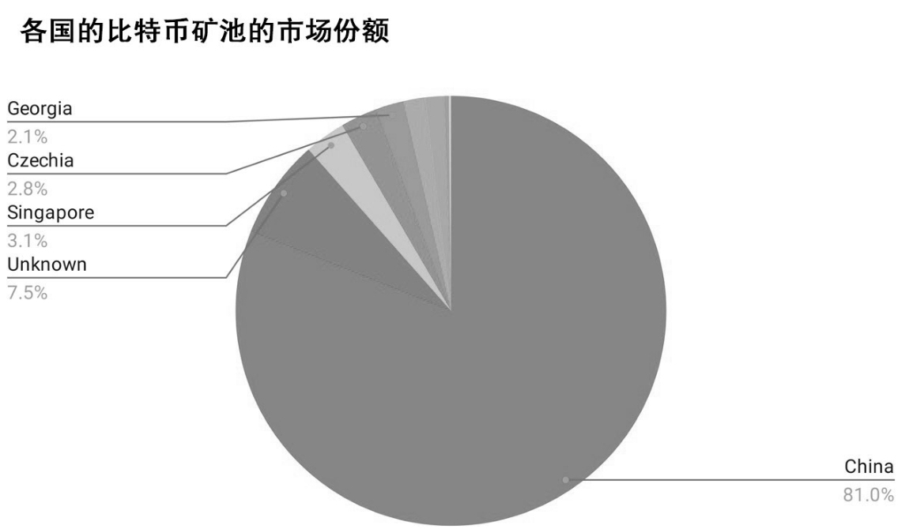

_最热门的矿池大多是中国的：币印矿池（Poolin）、鱼池（F2Pool）、BTC.com、蚂蚁矿池、ViaBTC、BTC.TOP、1Thash & 58COIN、OKExPool、百特矿池（BytePool）和WAYI.CN。其他国家几乎没有矿池。数据来源：Blockchain.com_

# 山寨币
## 比特币的分叉
2016年，比特币的早期开发者、谷歌前工程师迈克·赫恩称比特币是一次失败的尝试，因为它存在很多缺陷。
- 低容量。大约每秒钟只能完成3笔交易。
- 难以预测的交易费用和等待时间，特别是在交易量大的时期。
- 少数矿工（主要来自中国的矿工）掌握着非同寻常的控制权，在赫恩看来，他们拒绝做出一些能让比特币变得更受欢迎的改变，因为这会损害到他们的采矿利润。
- 比特币社区在所有事情上都无法达成一致，包括增加区块容量这个大众修正案。而这个改变将使比特币能够以更少的费用和更短的等待时间来处理更多的交易。
- 在比特币社区，有关增加区块容量的争论，引发了对出现在官方比特币板块、论坛和网站中的反对意见的广泛审查。

**比特币现金**

因此，他决定采取饮鸩止渴的方法，在2017年对比特币进行一次硬分叉，把比特币一分为二。

他将自己的新的加密数字货币命名为`比特币现金（Bitcoin Cash）`，与比特币共享2017年前的区块链，因此过去所有的比特币交易，都被写入了比特币现金的官方发展史册。但是所有在硬分叉后挖掘的比特币区块都不会成为比特币现金区块链的一部分，而所有在硬分叉后开采的比特币现金区块也不会成为比特币区块链的组成部分。

赫恩对比特币无法扩容的事实感到沮丧，所以比特币现金区块容量在比特币区块容量的基础上增加了8倍，并且可以随着时间的推移自主选择是否做进一步的扩容。这样做的结果是，比特币现金的较大区块将被主流的比特币软件拒绝，而比特币现金也会拒绝较小的比特币区块，这使得两个区块链不兼容。（像这样的向后不兼容的变更被称为`硬分叉`，而向后兼容的变更被称为`软分叉`。）

每当有分叉发生，所有持有比特币的用户都会拥有相同数量的比特币和比特币现金。只要钱包软件支持比特币现金支付的人都可以通过这种分叉免费获得双倍的比特币。尽管（也许是分叉的结果）每枚比特币现金的价值一直都是0.03～0.25枚比特币。

**分叉后的再分叉**

在2018年，比特币现金本身又有了硬分叉。由当时颇有争议的克雷格·莱特带领一小群开发者，用比特币现金创建了比特币SV。莱特认为，比特币现金与中本聪对比特币的最初设想相去甚远，而比特币SV事实上是更接近中本聪在其具有开创性的白皮书中提出的比特币概念的一种加密数字货币。

很少的矿工选择放弃比特币现金，很少的交易所选择卖出比特币SV。因此，人们普遍认为比特币SV是这场小型“战争”中的输家。

## 以太坊
**智能合约**

`智能合约`可以遵循规则并相应地按照指令转移金钱、数据和其他资产。

**DApp**

你可以将智能合约整合在一起，制造出一种更复杂的基于以太坊的App，即所谓的去中心化App，或者可以称其为`DApp`。

**谜恋猫**

视第一个登上头条的以太坊DApp，它也可能是有史以来最受欢迎的DApp：一款名为谜恋猫（CryptoKitties）的虚拟养猫游戏。

在谜恋猫的软件上，你可以用以太币买卖猫，还可以让你的两只猫繁殖出一只继承了父母双方某些特征的小猫。2017年，谜恋猫开始变得非常受欢迎。曾经有一段时间，在以太坊的全部交易中，有15%是关于谜恋猫的智能合约。

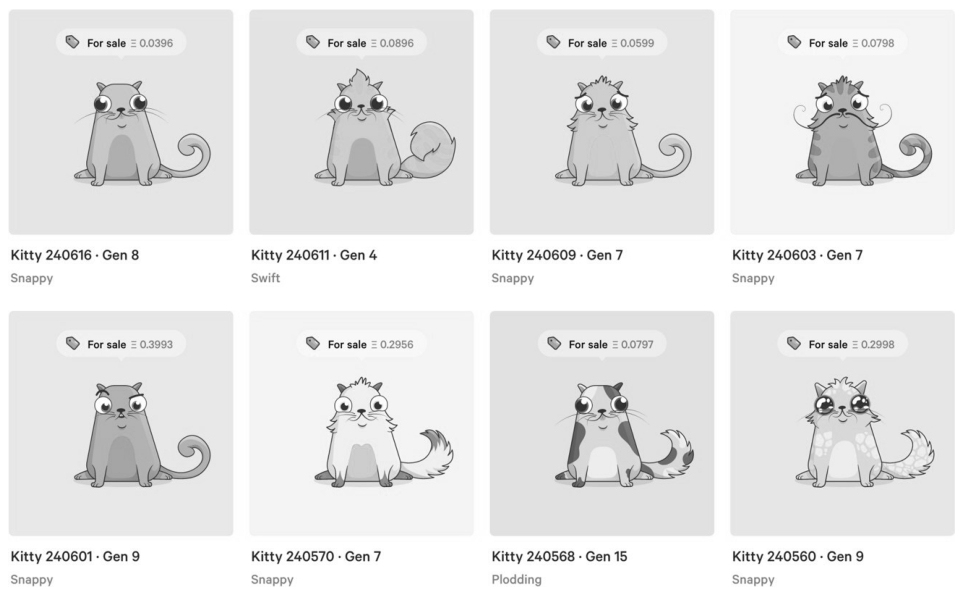

_待出售的谜恋猫。在撰写本书时，每只谜恋猫的价格为15～100美元。来源：格雷格·麦克马伦_

是对于“谜恋猫”这款游戏来说，你的虚拟物品的所有权是存储在以太坊区块链上的，所以只要以太坊区块链还存活着（也就是说，只要有人在某处运行以太坊软件），你就会一直“拥有”这只猫。“谜恋猫”游戏的所有者不能把你的猫从你身边带走，至关重要的一点是，如果有人要对谜恋猫进行分叉，你可以把自己之前拥有的所有的猫都导入这个新的App中。

## Brave & BAT
以太坊的ERC-20代币非常强大。实际上，你可以使用这些代币创建一个全新的加密数字货币。

这些代币式加密数字货币的运转与普通的加密数字货币（有自己的区块链）非常相似，只是这类代币不能通过挖掘来生成，它们通常是由其他机构或算法模型分发的。

代币式加密数字货币中最有名的代币之一是注意力币（简称BAT）。BAT是由Mozilla（很受欢迎的Firefox浏览器背后的非营利组织）的联合创始人布兰登·艾奇在2017年创建的。它与艾奇在2015年开发的专注于隐私保护的Brave浏览器是一同发展起来的。

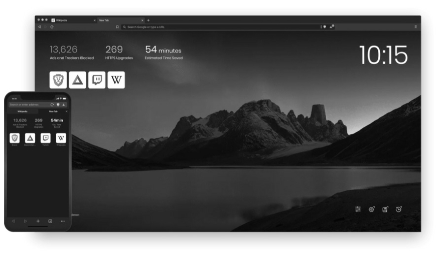

_Brave浏览器专注于隐私保护，为用户免费提供注意力币以观看广告。来源：Brave_

艾奇创建BAT的原因是，他对在线广告的呈现方式感到不满意：不断弹出的广告消耗了用户的电池和移动数据流量；用户的浏览行为伴随着一系列的跟踪器；谷歌和脸书占据了市场份额的绝大部分；广告定位技术依然很差。他将这种令人不满意的问题归咎于谷歌和脸书这样的中间人和广告交易平台。

艾奇的想法是削减中间人，让广告商直接付钱给提供广告发布位的组织（或提供广告展示位的一方，如《纽约时报》）和用户。由于主流的网络浏览器不支持内置的加密数字货币支付功能，所以艾奇决定在Brave浏览器中加入这种功能。

支付的基础是“关注”。根据用户对广告的关注程度，Brave浏览器的用户会得到相应的BAT；而根据Brave浏览器的用户对广告发布者投放在该平台上的广告的关注程度，广告发布者也会得到相应的BAT作为奖励。（请注意，你无法挖掘BAT，而需要依靠Brave提供。）

正如你现在所期望的那样，该支付系统是基于智能合约的。当广告客户创建了一个广告时，它会向智能合约支付价值几美分的BAT。当Brave浏览器的用户观看了该广告时，智能合约就会被“解锁”，并且里面的钱就会被支付出去：一部分给用户，一部分给广告的发布者，还有一部分给Brave。艾奇和其公司的人员认为，这个系统与现行的大多数广告系统相比，可以减少欺诈的发生，改进了给广告商和发布者的数据，并且能更好地保护用户隐私。

## 稳定币
**寻求稳定**

阻碍比特币成为一个通用的支付系统的三个主要因素是费用、等待时间和波动性。前两个因素所对应的问题通过各种技术升级——记住SegWit和Lightning——或者只是改变挖矿的规则就能很容易地修复。比特币现金旨在通过增加区块的大小来实现这一点。另一种名为莱特币（简称LTC）的山寨币提供了与比特币非常相似的功能，但交易速度更快（挖掘区块的时间只需要2.5分钟而不是10分钟），交易费用也更低（在撰写本书时，莱特币的交易费用是比特币的1/20左右）。所以费用和等待时间都是可以解决的问题。

比特币的波动性是一个更根本的问题：在稳定性与增长性之间需要保持一种平衡，只要加密数字货币专注于增长，那它就不会有稳定性的特征。而如果没有稳定性，你将面临的价格波动会是非常大的——请记得比特币的价格是如何在一天的时间内暴涨或暴跌10%的。

**固定汇率**

稳定币明确地将其重点放在保持稳定性上。这种加密数字货币与美元或欧元等法定货币保持固定汇率。最有名的稳定币叫`泰达币`，每个泰达币（也被称为USDT，意为以美元价值为准）的价格是1美元。还有以日元、欧元和人民币等其他币种的价值为准的泰达币。

实行固定汇率制的困难之处在于，实行固定汇率的货币发行局必须有足够多的较强势的法定货币，即参考货币，储备在自己的货币发行局中。

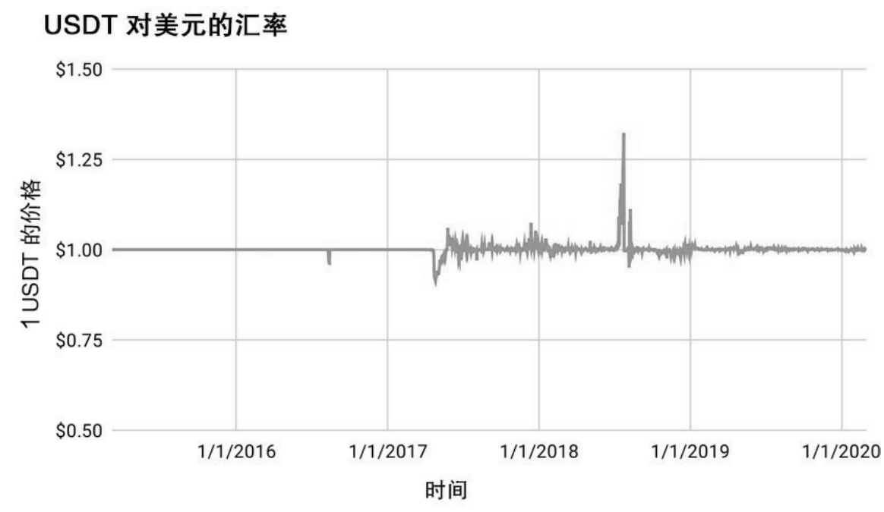

_除了2018年有一次反常的事件，USDT的价格一直非常稳定。数据来源：CoinGecko_

在2018年前后，有市场分析人员开始怀疑Tether并不是100%由法定货币支撑的，这意味着该公司可能并不是真的做到了为每个流通中的USDT都保持1美元的储备金。（这实施起来是一项非常艰巨的任务。在撰写本书时，流通中的USDT有45亿个，所以Tether必须在银行拥有45亿美元才能达到100%由法定货币支撑。）2018年，Tether曾试图通过一家外部的律师事务所给出的证明材料来打破这些已存在的市场恐慌，并且证实Tether的确是100%由美元支撑的。

但是在2019年，Tether承认了许多人长期以来一直存在的猜想，即USDT不是100%由法定货币支撑的。在2019年3月，该公司悄悄地更改了其网站信息，宣称USDT是100%由现金、现金等价物（短期存款、债券）和一种组成模糊的“储备金”混合支撑的。该公司的法务人员说，流通中的USDT的美元和现金等价物的支撑率仅为74%，这也就意味着另外26%的支撑是来自那些组成模糊的“储备金”的。

**Dai**

Tether有一种去中心化的替代品——Dai，是一种由叫MakerDAO的组织创造的稳定币。

加密数字货币Dai（从技术上讲，属于ERC-20代币）的交易价格为每枚Dai币1美元，但与USDT不同的是，MakerDAO不持有任何的储备金，也没有自己的货币发行局。MakerDAO建立了一个智能的经济系统，它能自动地使Dai币的交易价格维持在每枚1美元左右。

你可以通过使用一种包含`债务抵押债券头寸`（简称`CDP`）的智能合约来获得Dai币。你向智能合约发送一些以太坊代币（同样，它们也叫以太币），然后就可以从智能合约那里借一些Dai币。想要拿回你的以太币，你就要把你的Dai币和一小笔利息返还到智能合约。换句话说，你通过将以太币作为抵押品来借Dai币，这笔贷款就是CDP。

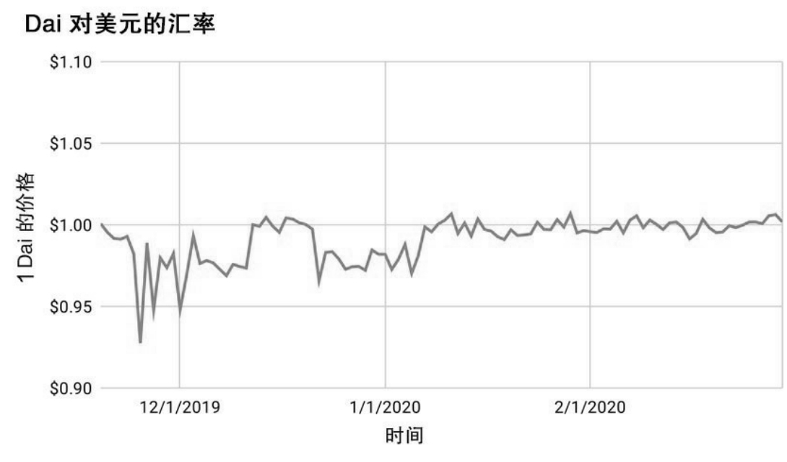

_Dai几乎与USDT一样稳定，但是在它的汇率变化趋势中没有出现比较极端的峰值。数据来源：CoinGecko_

为了让1 Dai币的价格维持在1美元，该经济系统——被称为目标利率反馈机制——在Dai币价格过高时会降低你需要提供的抵押品数量，而在价格过低时增加你需要提供的抵押品数量。所以，如果1 Dai币的价格上涨到1.05美元，人们就会创造出一堆便宜的Dai币，导致大量Dai币充斥整个市场，这将迫使Dai币的价格回落。如果1 Dai币的价格下降到0.95美元，人们就会返还Dai币来赎回他们的抵押品，以获取中间的利润，从而使市场上流通的Dai币数量下降，这将迫使其价格回升。

因此，Dai币的固定汇率制的运作方式很像一个货币发行局：当汇率过高或过低时，套利者就会赚钱，但在这样做的过程中，他们会将汇率推回到固定汇率制的基准水平。但由于Dai币的固定汇率制是通过智能合约而非公司来维持的，因此它是去中心化的。

Dai币只是这个系统的一部分，MakerDAO还运行着另一种称为MKR的加密数字货币。与Dai币一样，MKR币从技术实施的角度来讲也属于ERC-20代币。MKR币的价格是自由浮动的（不稳定），并且你只能用MKR币来支付贷款（CDP）的利息费用。所以，从理论上来讲，用Dai币的人越多，市场对MKR币的需求也就越大，MKR币的价格也就会越高。因此，投资MKR币意味着押注Dai币在市场上将会越来越受欢迎。

## 币安
中国的加密数字货币交易所——币安——成立于2017年，它已迅速成为全球最受欢迎的加密数字货币交易中心之一，每天可以支持12亿笔交易。

币安还运营着一款名为`BNB`的加密数字货币。如果你使用BNB付款，币安将为你的支付提供交易费用折扣。在BNB投资，就相当于押注币安在市场上会越来越受欢迎。

**纵横天下**

币安并不满足于只运行一家风行全球的加密数字货币交易所。它还运营着一个叫作Launchpad的风险投资部门。该部门允许初创的加密数字货币公司通过向币安用户出售其独特的加密数字货币来筹集资金，且BNB是唯一可接受的付款方式。这些通过加密数字货币进行筹集资金的环节被称为`“首次币发行”`（简称`ICO`），即首次公开募股（简称IPO）的加密数字货币版本。

币安还运营着一个属于自己的区块链平台，名为Binance Chain，该平台允许初创的加密数字货币公司创建和发行自己的加密数字货币。Binance Chain是Binance DEX的运营基础，Binance DEX是一种去中心化的加密数字货币交易所（与币安运营的常规的中心化交易所不同）。猜猜看，你可以用哪种流行的加密数字货币在DEX上购买较小众的加密数字货币？没错，它就是BNB。

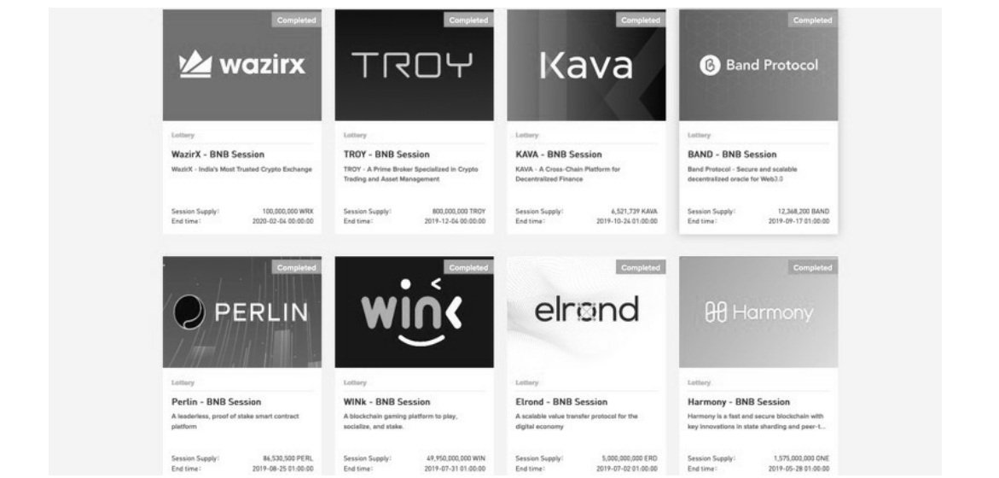

_在众多初创的加密数字货币公司中，有一些会在币安的Launchpad平台上寻求资金支持。其中包括印度的加密数字货币交易所、“跨区块链”金融平台和区块链博彩平台。来源：Binance_

## 门罗币
普通人可能无法将你与你的地址相匹配，但是你使用的加密数字货币交易所肯定可以，因此，任何能够对交易所施加控制的政府也都可以。2017年，美国国税局迫使Coinbase交出购买或出售过大量比特币的人的姓名和比特币地址。有了这些信息，美国国税局就可以识别并追查逃税者。在这种情况下，这可能是一件好事，但令人担忧的是，政府可以如此轻易地打破“匿名性”。

**隐私币**

门罗币通常被称为隐私币，它使用一种叫作“CryptoNote”的技术来为每笔交易的发送者和接收者的身份进行保密。

CryptoNote通过两种主要技术实现了这一目标。首先，每笔交易都有多个潜在的发送者。这种技术被称为环签名，它可以掩盖真正发送者的身份。其次，使用隐身地址来模糊接收者的身份，即每个接收者都会自动获得本次交易的一次性地址，只有拥有隐身地址的人才能最先看到该交易的发生。

因此，虽然所有门罗币的支付信息的确都存储在区块链中，但是公众无法查看任何交易的发送者或接收者究竟是谁。也不存在关联交易的方法，所以，当你把钱支付给某人后，你无法知道对方是否或在何时花了这笔钱。（而这两种情况在比特币的交易中都是可行的。）

**加密劫持**

也许，门罗币最著名的，也最阴险的用途就是利用网页浏览器进行挖矿。你可以在网页浏览器上运行一段JavaScript代码——类似于让Spotify和谷歌Docs这样的网站具有交互性的代码——来挖掘门罗币。

这在技术上是可以实现的，因为门罗币的挖矿算法具有ASIC免疫。比特币的挖矿算法只关心一台矿机每秒能处理多少万亿个哈希，而门罗币的挖矿算法要求计算机在挖矿时使用大量内存（简称RAM）。请注意，ASIC擅长重复运行简单的计算，不需要普通计算机同时运行多个应用程序、选项卡和游戏所需的大量RAM。

因此，一台普通的计算机，只要配有像样的CPU和GPU，就应该能够很好地挖掘门罗币，而用ASIC矿机来挖门罗币可能效果非常糟糕。（当然，这是一个脆弱的系统——挖矿公司曾经发明了特殊的ASIC来破解门罗币的挖矿算法，迫使门罗币对其算法进行紧急调整，从而引发了一场“军备竞赛”，但不管怎样，门罗币的确比比特币具有更强的ASIC免疫能力。）

而且，由于门罗币的挖矿算法非常容易在普通计算机上运行，所以即使普通计算机中的网页浏览器也可以挖掘门罗币。因此，在2017年，一家名为CoveHive的初创公司开始允许网站所有者在其网站上嵌入一小段可以用来挖掘门罗币的代码（用JavaScript编写）。访客在使用浏览器访问嵌入了挖矿代码的网页时会自动挖掘门罗币，并且将其发送给网站的所有者。

从理论上讲，这是一个很有意思的想法：网站所有者可以从网站上获利，而不必依赖恼人的、无孔不入的广告来赚钱。游戏软件也可以通过向其用户提供虚拟商品（如额外的复活机会或金币）来获得额外的收入来源。（用户需要让浏览器帮助游戏的开发者挖矿。）

问题在于，CoveHive并没有被用来帮助创建新的网络商业模式。相反，它被一些试图以不道德的方式赚钱的卑鄙人物所利用。2017年，风靡一时的数字盗版网站“The Pirate Bay”开始在访客不知情的情况下在他们的浏览器上运行CoveHive，也不给访客任何的回报。这其实并不是一个无害的小把戏，因为所有的挖矿活动都会使运行网页浏览器的计算机发热，使计算机的散热风扇开足马力，从而耗尽访客计算机的电池（对于笔记本电脑来说）。

这种将访客的浏览器劫持给一个可疑的运营商来挖掘加密数字货币的非法操作被称为“加密劫持”，它迅速发展成互联网的一大祸害。加密劫持也是非常有利可图的，据估计，一个网站运营商通过加密劫持，每月能赚取超过30万美元。

黑客也利用了加密劫持技术。2017年，有黑客入侵了“Showtime”网站，并且悄悄安装了一个加密劫持的小程序，这样黑客就可以从“Showtime”网站数百万访客的浏览行为中获得门罗币。

你可以看到为什么加密加持者喜欢门罗币：它很容易通过浏览器进行挖掘；它是完全匿名的，因此骗子们可以不留任何痕迹就实现目标。这说明了加密数字货币的一个基本矛盾：任何旨在提高隐私性和匿名性的事情——通常都是好事情——最终对犯罪分子的帮助比对任何普通人都大。

# 公有区块链
## 线上投票
**区块链和选举**

利用区块链投票的想法是依赖代币的，代币是可以在区块链上跟踪其流动方向的数字资产。

在使用区块链投票时，政府将向所有有资格投票的人发放投票代币。每个选民都可以把自己的代币发送到一个代表他们想要投票的候选人的地址。每个投票代币的“支付”表示一个支持投票，并且存储在区块链上。因此，由于所有选票都公开地存储在区块链上，所以就有了一个可靠的书面记录，任何人都可以通过清点选票来验证谁赢得了选举，从而消除了在计票过程中出现错误和腐败的可能性。

**挑战**

区块链投票的主要挑战是，首先需要决定谁可以获得投票代币。这可能涉及人们在网络上的身份认证问题，但这种身份认证存在很多隐患：社会安全号码实际上是美国人唯一的身份标识，如果你知道了某人的出生日期，就很容易猜到这个号码，这大大降低了个人身份信息的安全性。登记选民的名单也很容易被黑客攻击及破解。另外，你必须依靠政府提供的信息来决定谁拥有投票权，这与权力下放的目标背道而驰，也会为腐败的政府继续左右选举提供便利。

爱沙尼亚设法通过向公民提供与智能手机绑定的电子身份证或移动ID成功地解决了选民的身份验证问题；爱沙尼亚人可以在网站上输入自己的ID号码来证明他们的身份。有94%的爱沙尼亚人都拥有这种安全的数字ID，这使得线上投票成为可能。虽然这种方法在人口不足150万的爱沙尼亚效果很好，但是在人口较多的国家，这种方法可能并不适用，因为在人口规模较大时相关信息的匹配及收集可能存在很大的困难。

另一个比较严峻的挑战是保持匿名性。由于所有投票信息都公开存储在区块链上，任何人都可以看到哪个以太坊地址为哪个候选人投出了支持票。而政府必须将选民的真实身份与以太坊地址相匹配才能发送投票代币。这就意味着，政府及拥有相关专业技术的黑客可以通过这一线索找到选民的以太坊地址，从而确定每个选民所支持的候选人。

解决匿名性问题的一种可能的方法是同态加密，它允许你对每个人的投票过程进行加密（这样你就无法知道选民的支持票投给了哪位候选人），但仍然可以统计票数并弄清楚最终是谁赢得了竞选。

## 不朽的互联网
**缓慢的、脆弱的、健忘的**

一项研究发现，**网络链接的半衰期只有7年，即如果你把一本书、一个文档或一个网页链接到另一个网页上，有50%的可能性，该链接将在7年后失效（它无法链接到目标页面了）**。你可以很轻松地引用荷马在2000年前写的《奥德赛》，你知道人们总是能够找到你所说的那本书。但是，期望一个网络链接能够存在10年是一个冒险的选择。

**星际文件系统**

`星际文件系统`（简称`IPFS`）的区块链项目发起人认为，互联网的这种现状是可以改变的。IPFS提出了一种全新的互联网模式。在IPFS中，页面内容不仅存放在中央服务器上，而且在全球的任何角落的个人都可以保留一份副本。

所有IPFS用户的计算机上都有一个文件夹，可以在其中存储文件或网页。这些文件的唯一痕迹（称为哈希值）存储在区块链中。任何想要该文件的用户只需要查看区块链，就可以了解谁拥有具有该哈希值的文件。一旦找到对应的用户，他们就可以从那个用户的IPFS文件夹中复制文件。存在的问题是，如果你从其他用户的计算机上获取了文件，那么你也要在自己的计算机上存储一份该文件的副本。即使原始文件被删除，副本将仍然存在。

此外，在每次更改文件时，相应的更改也会更新到区块链上。所有拥有该文件的旧副本的人都可以保留原有的文件，同时该文件的新版副本可以独立地通过网络进行传播。这也意味着，任何人都可以看到更改后的文件的旧版副本（有点像Word文档中的“跟踪更改”功能），从而确保内容确实是永久有效的。即使有人更改了一个网页的内容（例如，删除一些他们想隐藏的信息），旧版副本仍然存在——这在现有的互联网上是不可能实现的，因为你只能从服务器上获得最新版本的网页内容。

所有人都可以注册并成为IPFS的用户，并且开始存储文件和访问网络上其他人的文件。IPFS的发起人希望，IPFS有一天能取代当前的互联网，并成为“更快、更安全、更开放”的替代方案。当我们对降低链接失效的可能性感到兴奋的同时，我们也注意到，像这样一个防审查的分布式文件共享系统将会使数字盗版变得更加容易。

**爱彼迎式的共享硬盘**

值得注意的是，人们可能不太愿意将陌生人的文件存储在自己的硬盘上。

其原理是，任何想访问他人IPFS文件夹中文件的人都需要向存储文件的人支付一个文件币（Filecoin）。你可以通过自己托管文件或从市场上购买文件来获得文件币。FileCoin项目鼓励人们发展良好的公民意识——你访问别人的文件越多，你自己应该托管的文件也就越多，并且让拥有额外存储空间的人通过赚取和出售文件币来赚钱。在这方面，它就像硬盘版的Airbnb（你可以通过出租空房来赚钱）。

## 在区块链上能获得Hooters奖励吗
2018年，北卡罗来纳州一家名为Chanticleer的公司宣布，它将与一家名为Mobivity的区块链公司合作，推出一项基于区块链的奖励计划。Chanticleer拥有几家特许经营餐厅，其中包括Hooters。任何在Chanticleer餐厅用餐的人都可以获得存储在区块链上的虚拟货币，他们可以在Chanticleer旗下的其他餐厅用虚拟货币兑换餐食，或者将虚拟货币作为礼物送给其他顾客。Mobivity公司的CEO自豪地宣布：“吃汉堡现在是挖掘加密数字货币的一种方式！”Chanticleer的股票价格在这次发言后上涨了41%。

**过犹不及**

为应用程序添加区块链是需要支付费用的。如果基于以太坊来构建，则每笔交易的费用为5～10美分。而区块链本身要占用大量的计算机空间。在写作本书时，以太坊区块链的容量超过了200GB，并且它的增长速度在短时间内也不会放缓。而且，不管你用什么区块链，区块链的交易速度都很慢。典型的中心化MySQL数据库每秒处理的交易数是以太坊的6万倍！（以太坊在单位时间内处理交易的数量是比特币的5倍。）

因此，只有在必要时使用区块链才是有意义的。在我们看来，区块链的最大卖点是去中心化、去信任、透明和防篡改。而Chanticleer基于区块链的奖励系统完全体现不出区块链的这些优点。

- 去中心化意味着你不需要依赖中间人，中间人是单点故障的发生原因，并带来了费用和限制。Chanticleer的问题是，奖励积分只能在Chanticleer的餐厅使用——因此，如果Chanticleer停业，你所有的奖励积分将变得毫无意义。这个系统是中心化的，即以Chanticleer为整个系统的中心。区块链可以使去中心化成为可能，但前提是允许系统去中心化。除非Chanticleer允许用户在所有餐厅、任何地点都可以使用奖励积分，否则系统将是中心化的，区块链也就不会带来任何升值。
- 区块链使去信任成为可能。人不必信任其他人，系统也能正常工作。以比特币为例，你不必相信银行或政府就可以进行支付；你只需要相信比特币软件会正常运作即可。但在本例中，不管有区块链还是没有区块链，你都必须相信Chanticleer会兑现你的奖励积分。如果Chanticleer不兑现，那你拿到的只是一堆没有任何用途的代币。这是去信任的反例，Chanticleer的整个奖励计划都没有使用区块链的这个优点。（对于Mobivity的CEO所宣称的，他的计划可以“将传统的消费者奖励转化为消费者可以控制的东西”，如果你不得不寄希望于餐厅会接受奖励积分的兑换，那么你实际上就无法控制自己手里的奖励积分。）
- 因为区块链使得过去的每笔交易都是公开的、不可改变的（或不可变的），因此区块链是非常透明的。所有用比特币进行的非法交易（理论上）都能被所有人发现，当联邦调查局想摧毁丝路市场的时候，你会发现这一点是很有用的。然而，我们认为没有人会关心你是否在周六去Hooters兑换了鸡翅的奖励积分——这个奖励计划提供的透明度并不是很有价值。
- 最后，类似交易处理记录这样的机制使得区块链基本上实现了防篡改，这对于安全性来说是非常有用的。然而，我们认为没有人想窃取北卡罗来纳州餐厅的汉堡奖励积分，所以区块链的这个优点用在奖励计划上有些浪费。

## 区块链上的商标
2016年，总部位于伦敦的某组织注意到，音乐家们在给自己乐队的名字注册商标时遇到了麻烦，同名乐队为了谁先注册而争吵不休。因此，该组织成立了一家名为BandNameVault的初创公司，该公司允许任何乐队以15美元的价格在区块链上注册自己的名字。

当组建一个乐队后，你可以在区块链上的交易处理中心注册你想到的乐队名称。如果有人试图给其他乐队起一个和你的乐队一样的名字，你就向他展示你的交易记录，以表明你已经注册了该名称。

但是，在更严格的审查程序中，BandNameVault的交易记录就不会被作为证据采用了。你可以在区块链上注册乐队的名字，但是任凭你磨破嘴皮，这在法律上都是没有任何意义的。你可以起诉一个新乐队使用了你乐队的名字，并且指出区块链交易记录可以作为证据，但是法院不会承认该初创公司的区块链交易记录是有效证据。能说明你乐队的名字已经注册的唯一方法是，提早在USPTO这样的政府机构注册商标。

## 去中心化的网站
当你在浏览器的地址栏中输入一个网页地址（如“google.com/maps”）时，浏览器实际上并不知道该怎么处理。相反，它会参考叫作域名服务（简称DNS）的巨大地址簿，以将域名（地址的基础部分，如在google.com/maps中的google.com）转换成一系列被称为IP地址的数字。然后，浏览器就知道如何根据IP地址来获取相应的网页内容了。

这里的问题是，DNS是非常中心化的。通常，你的互联网服务提供商（简称ISP），如Verizon或Comcast公司，都会为你提供DNS。如果ISP决定删除某个网站的域名与IP地址匹配的条目，那么你将无法访问该网站。如果你不喜欢ISP提供的DNS，谷歌也提供了免费的DNS，但是可供用户选择的DNS清单依然不多。

2011年，美国议员提出了一项名为《禁止网络盗版法案》（简称SOPA）的议案，目的是通过司法程序强制美国所有的互联网服务提供商删除侵权网站的DNS条目来打击盗版行为。如果这项议案能够通过并实施的话，这些网站仍然存在，但美国人不可能通过正常的途径访问到它们。

虽然SOPA没有被通过，但是互联网激进主义者对互联网审查变得如此容易而感到震惊。一个国家可以强制为数不多的ISP从其DNS中删除某个网站，从而禁止任何人看到它们。这一切都由于DNS是中心化的，ISP一般又是单点故障的源头，而单点故障会使审查变得更容易。

**去中心化的DNS**

在DNS中心化的困扰下，一个由区块链的爱好者组成的团队创建了一种名为Namecoin的山寨币。任何人都可以将其网站的IP地址注册到Namecoin区块链中，它的功能类似一个DNS。任何人都可以在自己的计算机上运行Namecoin软件，并且查询所有在该软件上注册了IP地址的网站，而不用担心ISP是否拦截了什么。

由于区块链是去中心化的和点对点的，因此没有任何可被审查严格的政府攻击的单点故障。而且由于区块链是如此安全，因此政府也不能试图从这个去中心化的DNS中删除某一个条目。

这是一个好主意，但它遇到了“先有鸡还是先有蛋”的困惑。网站的所有者不会费心在Namecoin上注册他们网站的IP地址，除非他们知道人们会使用Namecoin，并且通过其来访问他们的网站。另外，除非消费者知道他们最想访问的网站在Namecoin注册了IP地址，否则他们也不会下载Namecoin软件。最致命的问题是，根据Namecoin的早期支持者迈克尔·迪恩的说法，消费者根本不在意Namecoin为他们解决的有关审查制度方面的问题。因此，去中心化的DNS系统从未取得成功。

**去中心化的网站注册**

后来，Namecoin有了一个更加雄心勃勃的设想，即取代同样中心化的网站注册流程。当你建立一个网站时，你需要从域名注册商那里购买域名；每个域名的后缀（.com、.org、.de、.jp等）都是由不同的注册商管理的。但是每个注册商最终都是由一个名为ICANN的公司管理的，这意味着，从理论上来讲，ICANN可以删除任何网站的域名，从而使其下线。

所以，Namecoin引入了.bit，一个新的去中心化的域名后缀。任何人都可以在Namecoin的区块链上注册一个.bit网站，任何运行Namecoin软件的人都可以访问所有的.bit网站。

问题是，除非你运行了Namecoin的软件，否则你无法访问.bit网站。这也意味着“先有鸡还是先有蛋”的问题已经完全解决了。另外，Namecoin软件的安装过程非常烦琐，需要进行大量的配置，而且建立一个网站也有很多不必要的复杂程序。

不出所料，.bit的域名后缀也没有取得成功。迈克尔·迪恩说：“迄今为止，只有大约30个真正的.bit域名被创建出来，它们都是以‘传统’域名结尾的网站的镜像，显示的是来自不同域名的相同网页。”（所以，Namecoin网站上没有新内容。）事实上，只有5000人安装了该软件来浏览.bit网站。

与此同时，由于.bit网站的注册成本非常低，所以有成千上万个网站域名被抢注，很多人希望将一些受欢迎的名字（作为网站域名）抢注，希望在以后能出售获利。想象一下，以5美元的价格购买facebook.bit或disney.bit，如果.bit网站一旦成功，就有可能以500万美元的价格卖出。可以这样说，.bit网站目前主要被用于实现不正当的目的。

最终的结果是，Namecoin失败了。

Namecoin失败的主要原因是它低估了人们的惰性。Namecoin的解决方案可能比当前的系统更加去中心化，在技术上也更加完善，但是建立这样的双边市场（一边是消费者，一边是网站所有者）是非常困难的，特别是在.bit网站很难使用的情况下。

事实证明，Namecoin几乎没有认真考虑过这些关于人的问题；它似乎只专注于开发一款更酷、技术更强大的产品，而没有考虑如何让人们真正地使用产品。

# 商业上的区块链
## 沃尔玛和食源性疾病的预防
2018年，有关被大肠杆菌污染的长叶莴苣的疫情报道在整个美国引起了一片哗然，此次疫情中，有超过200人生病，5人死亡。这是“美国农产品行业有史以来爆发的涉及范围最广、最致命的疫情”。

追踪到某种商品的来源可能需要一周以上的时间。美国有关当局花了3个多月的时间才追查到某问题农场，该农场使用了亚利桑那州尤马市一条运河的水。即使在源头被确定后，也没有人能真正地确定他们买到的莴苣是否被污染了，因为很难知道买到的莴苣来自哪个农场。

此后不久，沃尔玛宣布将对其供应链进行改革，开始要求每家销售绿叶蔬菜的公司将产品相关信息供应链放在区块链上。每家公司将在沃尔玛旗下的、由沃尔玛与IBM共同开发的区块链上记录产品的每次物流。每次物流都将作为一个交易在这个被称为IBM Food Trust的区块链上进行记录。每笔交易都要对元数据进行编码，如产品的批号、时间和日期，以及产品的产地和目的地等。

**它如何运作**

沃尔玛本可以在公有区块链上构建并实施此解决方案，例如，通过创建以太坊DApp来实现。但这会带来很高的费用：任何人都可以看到沃尔玛供应链的所有交易（尽管你可以在交易中对自己的数据进行加密以保持它们的私密性），而且对于每笔交易，你都需要支付5～10美分的费用，你不能设定区块链的规则，也不能设置访问交易的权限。对于那些希望将整个业务系统整合到一个全新系统中的企业来说，这样做的风险和成本都太高了。

相反，像IBM Food Trust这样的私有区块链属于定制的区块链，只存储沃尔玛的供应链交易，并且只能由特定的人查看相关的交易记录。因为沃尔玛和IBM拥有这个私有区块链，他们不需要第三方的矿工，并且可以设置细化的访问控制或许可，从而准确地确定每个人在什么时候可以访问哪些信息。

同时，私有区块链保留了公有区块链的许多优势，如去中心化（许多计算机仍然会保留区块链的副本文件）、防篡改（POW功能保留，使攻击者难以伪造区块），以及透明性（每个人都可以获取他们需要的信息，而不必在不同的公司找人了解情况）。

**结果**

沃尔玛新建立的绿叶蔬菜供应链在提高效率方面的改进是惊人的。现在，供应链流程已经数字化，数据也以标准化的格式进行存储（通用区块链可以使数据以特定的结构呈现），所有内容都集中存在一个地方。沃尔玛现在可以在2.2秒内追踪某个农产品从种植的农场发货到其放置在沃尔玛货架上的整个流程。与传统的溯源流程相比，这一追踪流程的速度提升了十万倍。更重要的是，沃尔玛可以确切地知道在整个物流过程中，每个步骤涉及的人员及其位置。这可以帮助沃尔玛立即识别并从货架上撤走受污染的食品，还可以帮助当局更快地找到并关闭生产受污染食品的农场。该解决方案还可以帮助相关人员了解在供应链上货物物流的速度在哪个环节变慢，以及食品在哪里产生了损耗。

简而言之，该解决方案提供了一个强有力的方法来解决食源性疾病、食品损耗和供应链效率低下等问题。这是一个非常具有突破性的一步。

那么，为什么要用区块链呢？在这个案例中，沃尔玛有效地利用了区块链的优势：

- 当企业需要保证数据安全时，区块链的去中心化是非常有用的。如果沃尔玛将所有供应链的数据都保存在一台计算机上的一个数据库中，那么它将成为黑客和勒索软件攻击的目标。勒索软件的开发者会对有价值的文件进行加密，并且以此向文件的拥有者索要赎金（否则文件的拥有者将永远无法恢复或使用所需要的文件）。单一的、中心化的信息来源也非常容易受到自然灾害、停电及其他各种外界因素的干扰。由于许多不同的参与方都会保留自己的区块链副本，所以区块链的解决方案出现这些安全问题的可能性要小得多。
- 区块链的透明性对内部审计和外部审计来说会方便很多。任何符合条件的人都能立即查看食物从农场到饭桌的物流路径，而在此之前，做同样的事可能需要找许多公司，并且需要每个公司打开其账簿进行一一核对。由于私有区块链的访问控制，部分数据可以向美国FDA等外部审计机构甚至公众开放，但同时能保证其他数据的私密性。
- 区块链的防篡改性对于保存供应链信息这样的商业机密来说是至关重要的。这些信息一旦遭到黑客攻击或发生错误，就有可能导致沃尔玛遭受数百万美元的损失，甚至会危及顾客的生命。
- 正如我们在前面提到的那样，将所有数据保存在一条区块链上会强制所有数据采用相同的标准化格式，这使得数据的处理工作比之前那种跨多个数据库的数据要容易得多。

## 股票和区块
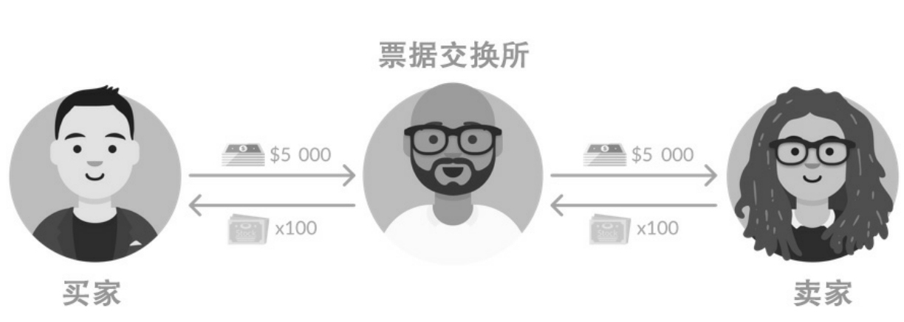

_票据交换所为买卖双方牵线搭桥，保护双方免受风险。在这个例子中，票据交换所促成价值5000美元的100股股票成交。_

票据交换所也承担交易的风险，即使一方退出交易，它也要确保交易顺利进行。如果你以5000美元的价格卖出100股股票，但随机选择的买家违约，你仍将得到5000美元，这笔钱由票据交换所支付。

票据交换所还要确保买卖双方的财务状况良好，处理好所有的法律法规等相关事宜，并且将数据发送给买卖双方。总体来说，票据交换所负责所有的繁杂工作并承担风险，这样任何人都可以通过轻轻点击鼠标来买卖股票，因为他们知道一切都会天衣无缝地进行。

票据交换所是中间人，处在买卖双方之间。因此，为了提高效率和降低成本，股票市场通常采用基于软件的票据交换所，即自动票据交换所（简称ACH）。

到2017年，澳大利亚证券交易所（简称ASX）的ACH软件已经老化，于是ASX决定尝试运用区块链技术。这是一种自然而然的发展趋势，因为票据交换所的运作方式类似于智能合约：它们从买方那里拿钱，从卖方那里拿股票，再进行一些核查，一旦双方的信息都得到核实，就会进行资产互换。（如果把一个普通ACH的复杂逻辑变成一份智能合约，就能在效率和透明性方面取得重大成就。）

ASX基于区块链的ACH的细节还没有公开，但我们可以设想，它的实现逻辑与我们刚才所说的应该是非常类似的。所有资金和股票都表示为代币，所有股票销售都表示为区块链交易。所有的交易都是由智能合约来协调的，智能合约接收来自买方的代币，并且存储来自卖方的代币，然后进行一些核查，最后进行资产交换。

智能合约的优势在这里是非常明显的。智能合约是可预测的——就像机器一样，它每次的运行方式几乎完全相同，它的所有操作都可靠地存储在区块链中。与此同时，ASX之前的解决方案相对杂乱（非区块链的解决方案在精确度和跟踪性方面更弱）和缓慢。一位市场策略师预测，由于这些原因，区块链解决方案可能能够从降低费用、增加透明度和减少官僚作风等方面为ASX节省数千万美元的开支。

ASX并不是全球唯一一个有这些需求的机构。世界上有大量的证券交易所和票据交换所，其中许多机构可以像ASX那样从区块链中获益。一份报告指出，证券交易行业可以利用区块链结算节省200亿美元。

但ASX在区块链的运用方面出现了一些问题。这项技术似乎太新了，以致ASX的解决方案花了两年的时间才开发完成，其发布时间甚至比预计的推迟了6个月。这也是走在技术最前沿必须付出的代价。对于一些金融机构（通常为风险规避型的组织）来说，这可能是难以接受的。

另一个问题是，法律制度还没有跟上区块链的发展速度，这对金融等监管严格的行业来说是一个值得注意问题。当前的金融法律法规没有任何关于加密代币、分布式账本和智能合约的规定和概念，而且这些工具的操作方式经常与当前的法律法规相冲突。例如，法院可以否决其认为“不合理”的合同，即当一方拥有更多的议价权或经济权利时，合同就是不公平的。但是智能合约是自动执行的，一旦它开始执行，就不能被改变或取消（事实上，这是引起诉讼的原因之一）。因此，一方面，法律需要改变，以找到新的方法来阻止不公平的智能合约；另一方面，任何开始使用智能合约而不是常规的合同的人，都需要找到一种方法来保持其智能合约的合规性。

## Xbox和游戏版税
如果你要发布一款Xbox游戏，你可能需要与一小群外部承包商合作：音乐家、特效工作室、角色设计师，等等。你需要与这些承包商签订复杂的版税合同并设定规则，例如，“如果游戏在某评论网站上获得至少Z星的评价，我们将在第一次获得Y万美元的销售额后支付给音乐家总收入的X%”。一款经典的游戏可能有数百个这样的合同，就算只是简单的合同也会有好几页的标准和公式。

管理这些合同的复杂条款在后期会是一场噩梦，需要庞大的会计团队传真大量的文件，筛选大量的Excel电子表格，还要费力气去处理没完没了的电子邮件。如果预期的付款与实际付款不相符，会计人员就必须经过耗时又非常容易出错的核对过程，他们需要从一堆文件中找出每份相关的文件，并且通读，找出差异再进行修正。对于Xbox的发行商来说，可能需要45天才能支付所有的版税——对于快速发展的游戏世界来说，这种缓慢的速度是难以想象的。

在解决这个问题之前，还需要应对另一个问题：版税支付要求会计人员根据复杂的规则手工计算版税，而进行这些计算所需要的所有数据分散存储在许多不同的数据源中。

Xbox想将版税计算自动化，并且将所有数据集中到一个地方。因此，Xbox决定建立一个基于区块链的版税结算系统。

Xbox把所有复杂的版税合同变成了智能合约，把所有复杂的法律术语变成了精确的数学公式。就像我们刚刚讲到的版税合同中显示的规则——“如果游戏在某评论网站上获得至少Z星的评价，我们将在第一次获得Y万美元的销售额后支付给音乐家总收入的X%”——将变成一个智能合约，并根据销售额和评价星数等信息输入数据计算出适当的版税。

最终，Xbox将版税结算的时间从45天缩短为几分钟，让发行商实时了解情况，并且随时调整合约内容。相应的Xbox财务团队的工作量也下降了70%，并且将新发行商的版税结算时间从几天减少到了15分钟。简而言之，这个区块链解决方案对于Xbox、发行商和承包商来说是一个三赢的选择。

**云区块链和大数据**

Xbox向微软公司的云计算部门Azure寻求支持，并且使用了Azure的区块链服务。Xbox使用了Azure写好的区块链代码，在Azure的超级计算机上存储区块，并且借用了Azure的安全性和可靠性。这样一来，Xbox就不需要重新创建区块链系统，省掉了运行区块链所带来的管理成本和维护费用。

更重要的是，将所有数据存储在区块链中会迫使数据采用单一的结构化格式。以前，当数据分散在无数的文件和文件夹中，想要对比分析它们几乎是不可能的，仅仅查找和清理数据就需要很长时间。（任何尝试过在三个不同的Excel表格之间交叉引用数据的人都知道，将所有的数据都保存为相同的格式会更好处理。）既然数据是单一格式的，那么发行商就可以很容易地将其纳入数据分析和可视化软件中，从而了解其音乐付费是如何随着时间的推移而增长的，以及他们可以在哪些方面削减成本。另外，有了大量的这种结构化的数据，机器学习就变得容易多了。

# 加密数字货币的政策
## 委内瑞拉的国有加密数字货币
2018年，委内瑞拉正处于政治和经济危机之中，年通胀率高达60000%——这意味着物价每个月都会上涨一倍多，这几乎摧毁了整个储蓄和商业环境。一个面包在12月31日的价格是当年1月1日的6000倍。与此同时，尼古拉斯·马杜罗总统的政府正在受到国际制裁的打击，因此委内瑞拉从困境中走出来的难度越来越大。

2017年12月，马杜罗宣布创建一种名为“Petro”的加密数字货币，并且表示将以委内瑞拉的石油和矿产储备为背书。他承诺将1个Petro币与1桶石油的价值挂钩，并且以委内瑞拉农村地区阿亚库乔的石油储备为背书。

2018年8月，马杜罗在加密数字货币方面的政策力度加大，宣布发行一种名为“主权玻利瓦尔”（Sovereign Bolivar）的新纸币，1元主权玻利瓦尔价值10万元玻利瓦尔旧币。主权玻利瓦尔也将与Petro挂钩。根据马杜罗的说法，3600元主权玻利瓦尔可以兑换1个Petro币。

**骗局**

问题是，Petro是一个骗局。首先，Petro并不是由石油支撑的，因为你不能将其兑换成石油。委内瑞拉人只能按照由石油价格确定的兑换比率来购买Petro。当委内瑞拉以60%的折扣预售Petro币的时候，你就可能怀疑其是否真的可以完全与石油挂钩。需要提及的是阿亚库乔地区（按照当局的说法，该地区有支持Petro的石油储备）没有与石油开采相关的活动，并且该地区所有的石油钻机都已经废弃了。

在预售时期，Petro就受到了质疑。其白皮书中有太多的细节没有被详细说明，而且存在严重自相矛盾的地方，甚至连它将使用哪个区块链平台的决定都前后不一致：它有时提到Petro将基于以太坊建立加密数字货币，并且使用ERC-20代币；它有时又提到Petro将使用以太坊的竞争平台NEM。马杜罗说，他通过预售Petro筹集了数十亿美元，但经济学教授史蒂夫·汉克认为这种说法是非常可笑的，而且从未经过证实。

**规避制裁**

那么，马杜罗为什么要推出这种明显具有欺诈性的加密数字货币呢？这很可能是绕过美国主导的制裁的一种方式。在宣布发行Petro时，委内瑞拉政府负债1400亿美元，但国际制裁使得外国人无法在委内瑞拉合法投资。马杜罗可能意识到，由于加密数字货币具有不可追踪性，人们可以用它在委内瑞拉投资，也不会引起制裁国家的注意。Petro计划筹资60亿美元，与委内瑞拉的负债相比这只是一个小数目，但也并非微不足道。

当然，这次融资是失败的。正如《华盛顿邮报》所言：“这只是加拉加斯（委内瑞拉首都）试图绕过其他国家对其制裁，同时从为数不多的比自己更愚蠢的人那里筹集资金的一种方式。”

这个案例告诉我们，政府与加密数字货币的关系是双向的：加密数字货币可能违反一个国家的金融法，但它们也可以帮助国家规避不利于该国的国际金融法。事实上，其他受到制裁的国家，包括俄罗斯、土耳其和伊朗，也在考虑通过由国家机构发行的加密数字货币来筹集资金。

令人不安的是，一些没有底线的政府可以利用加密数字货币来规避国际法和条约。同样，这种功能也融入了加密数字货币：任何人都可以轻松地将钱转移到任何地方，而且加密技术会“故意”让追踪付款变得困难。

## ICO和诈骗
**证券型代币和实用型代币**

ICO有两种主要的类型：提供`证券型代币`的ICO和提供`实用型代币`的ICO。证券型代币的作用和股票差不多：初创公司给你这些代币（可以在区块链上追踪），你就能获得投票权，有时还能得到分红。就像股票一样，如果投资者认为公司在未来会成长，那么对证券型代币的需求就会上升，代币的价格也会随之上涨。

实用型代币是唯一的，它是你购买用于支付初创公司服务费用的代币。（如果初创公司有属于自己的加密数字货币，它会出售加密数字货币，而不是代币。）例如，FileCoin（我们之前讨论过的去中心化文件存储App）在其ICO中提供了FIL代币，你可以用它来支付其他用户为你存储文件的费用。在ICO中，以太坊出售以太币，这是你用来支付运营DApp的货币。随着这种服务越来越受欢迎，对代币的需求就会增加，因此代币的价格就会上涨。那么，当你参与初创公司发行的实用型代币的ICO时，你在赌该公司所提供的服务会变得更受欢迎。另外，你还能以更便宜的价格预购该服务，如果你打算大规模使用该服务的话，就可以节省很多钱。

**好的、坏的，还有欺诈的**

发起ICO非常简单：你只需要一份白皮书来描述你的创业想法并介绍一些基本信息。目前，尚没有法规约束，任何人在任何地方都可以通过购买代币来支持你的想法。不管ICO提供的是证券型代币还是实用型代币，它们都提供了一种更便宜、更快速且没有繁文缛节的资金筹集方式。

ICO还允许普通投资者在初创公司的创建早期进行投资，使它们像众筹网站Kickstarter上的项目一样开放和便利。与之相比，传统公司的普通投资者只能在IPO之后进场。

当你投资ICO时，除了仔细查阅白皮书，你通常没什么可做的。你相信公司会兑现它在白皮书中所做的承诺，因为只有这样，你购买的代币才会增值。但公司往往不能兑现其承诺，更糟糕的是，没有什么能阻止一个欺诈性的公司取走其通过ICO筹集的资金，这些诈骗公司甚至在没有开发产品的情况下就开始运营。如果一家公司通过白皮书筹集资金，但是在没有做出任何东西前就消失了，这就是所谓的“退出骗局”。

数以百计的ICO被证明属于退出骗局。有一家臭名昭著的公司叫作LoopX，它是一家加密数字货币投资初创公司，它提供了一个模糊的“投资平台”，可以每周为投资者提供“保证的利润”。（是的，你没有看错。）但该公司于2018年2月无端消失了，它的网站和社交媒体都从互联网上彻底消失了。这起涉案金额达450万美元的诈骗案是2018年ICO领域发生的第五起重大诈骗案，而且在发生时，2018年才过去了不到两个月。

在加密数字货币界，BitConnect呈现了最著名的高收益投资骗局。BitConnect是一个投资平台，它承诺每天为投资者提供1%的回报，并且向投资者保证每个月提供40%的总回报。这就意味着，今天投资1000美元，这些钱在3年时间内就可以变成5000万美元。

这个商业模式很快就被标记为可疑的，但是这并没有阻止BitConnect的发展和增值。2016年，在ICO上市后其市值为60亿美元。整个2017年，该公司进行了一次积极的营销活动，吹嘘它为投资者带来了“利润”，但实际上BitConnect并没有进行任何投资——投资者获得的“回报”只是新投资者投入的资金！这是教科书上对金字塔骗局的定义。

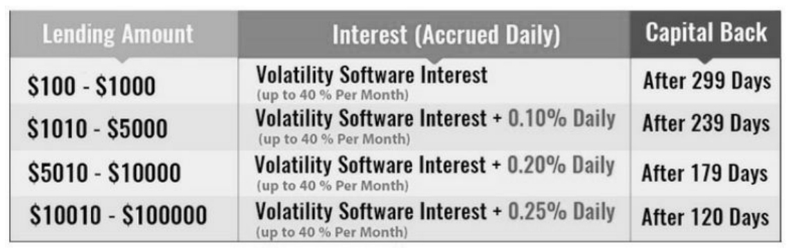

_一个关于BitConnect的表格在网络上流传，承诺每月给投资者几乎不可能实现的40%的回报。来源：TotalCrypto_

2018年1月，该公司突然毫无征兆地关闭。BitConnect的加密数字货币的币值暴跌96%。许多投资者把毕生积蓄投入了BitConnect，而他们所投入的钱都付之东流了。与此同时，BitConnect的所有者在公司倒闭前就卖掉了自己持有的所有BitConnect的加密数字货币，并且获得了巨额的资金，然后他们就立刻消失了。

如果BitConnect是一家传统的公司，它可能永远不会有机会进行IPO，因为该公司所有的欺诈迹象很快就会被监管机构和审计机构发现。但如果没有任何人去关心其是否真的在按照承诺运行，BitConnect可能能够一直蓬勃发展下去。

## ICO监管
ICO之所以能够长时间避开审查，是因为加密数字货币和代币没有被当作证券对待。`美国证券交易委员会`（简称`SEC`）严格监管证券的销售。股票被归为有价证券，这就是IPO要面临如此多的来自SEC的监管的原因。

**证券**

当谈到ICO监管时，最大的问题是，加密数字货币和代币是有价证券吗？如果是，那么ICO可以，也应该像IPO一样被监管。

SEC有一项被称为`“豪威测试”`的长期测试，用来检查一项资产是否可归为一种证券。该测试表明，如果一个人将他的钱投资于一个普通的企业，并且仅仅从发起人或第三方的努力中获得了预期的利润，那么该投资就可归为证券。

基本上，如果你投资一家公司，希望它能给你带来利润，那你就相当于买了这家公司的证券。这是股票的定义，所以股票显然归为有价证券。

那么ICO可归为有价证券吗？请记住，ICO的两种代币类型：证券型代币和实用型代币。证券型代币绝对是有价证券——就像它的名字提到的那样。证券型代币与股票一样，你购买的代币会随着公司的发展而增值，因此它显然可以像股票一样受到监管。

实用型代币的情况更为复杂。回想一下，你购买实用型代币的原因可能有两个：在服务变得昂贵之前预先付费购买它，或者因为你希望随着服务变得更受欢迎而以更高的价格出售代币赚取利润。在第一种情况下，实用型代币不是证券，因为你不期望获得利润，只是想省钱；在第二种情况下，实用型代币的运作机制与证券型代币或股票非常相似，即你正在对公司进行投资，希望它能够实现增长，以便你能够获利。所以，在这种情况下，实用型代币是一种证券。

那么，从法律上讲，应该把实用型代币划分到哪里呢？区块链方面的律师马尔科·桑托利说，预售代币是有价证券，因为它主要用于投资（就像你在IPO中购买的股票也用于投资一样）。但他认为，在发行之后，实用型代币并不是有价证券，因为你购买它主要为了使用服务，而不是作为一种投资。我们认为，在发行之后，人们仍然将实用型代币作为一种投资。例如，尽管以太币是一种实用型代币，因为你使用它来运行以太坊DApp，而且以太币的使用历史已有多年，但是人们仍然使用它进行投资和投机。

所以，我们认为这两种类型的ICO代币都属于有价证券，因为人们总是将它们用于投资。因此，它们应该像股票一样受到监管。

**证券交易委员会的制裁**

SEC得出了类似的结论，并且在2017年宣布，ICO代币属于证券，将开始受到类似的监管。美国将禁止ICO，希望获得美国投资者投资的加密数字货币初创公司必须进行`证券型代币发行`（简称`STO`），它类似ICO，但受到与IPO类似的监管。一般来说，对加密数字货币的监管与股票类似。

有几种方法可以让加密数字货币的初创企业获得STO的批准：
- 向SEC正式申请注册。这需要与IPO一样的严格审查，因此难度很大，成本也很高。加密数字货币的初创公司在ICO上市时的规模通常远远小于普通初创公司在IPO时的规模，因此对于大多数加密数字货币的初创公司来说，这种选择是不适合的。大多数加密数字货币的初创公司寻求一种豁免，以允许他们在不向SEC登记的情况下合法地进行STO。
- 使用被称为D 506（c）条例（或称Reg D）进行豁免。Reg D规定，如果你只出售代币给经过许可的投资者，就不必向SEC提交申请。经过许可的投资者指的是那些拥有足够的财富和知识的投资者或公司，SEC认为其有能力处理高风险的加密数字货币投资。收入超过20万美元、净资产超过100万美元、成为注册经纪人或投资顾问，或者有其他专业或教育经验能证明他们知道自己在做什么的人，就可以成为经过许可的投资者。Reg D非常容易使用，想进行ICO的公司只需要说，“只针对美国的经过许可的投资者”，就可以立即进行符合Reg D的STO。因此，这可能是最受欢迎的豁免方式。
- 使用被称为众筹监管条例或Reg CF的豁免。这可以让所有投资者（经过许可或未经过许可的）参与，但是通过这种方式，一家初创公司每年只能筹集大约100万美元的资金。所以，由于融资上限过低，这种豁免方式不是很有用。
- 使用Reg A+。它允许任何人参与投资，类似Reg CF，但是有5000万美元的融资上限。然而，这种发行必须得到SEC的批准，其审批是相当严格和困难的。Reg A+通常被认为比Reg D更好，但是更难通过审批，所以它是为规模较大的加密数字货币的初创公司而保留的。

在美国申请STO的主要方法，不同的方法各有优势：

方法 | 需要SEC批准吗？ 投资者的限制 | 筹款上限
---|------------------|-----
在SEC注册 | 是的，并需要增加审查 | 无限制 | 无限制
Reg CF | 不需要 | 无限制 | 100万美元
Reg D | 不需要 | 仅限经过许可的投资者 | 无
Reg A+ | 是的 | 无限制 | 5 000万芙元

交易所也需要为STO做额外的工作。出售STO代币或加密数字货币的交易所必须了解你的客户（简称KYC）并对买家进行反洗钱（简称AML）检查，以确保购买代币的是真人，而不是机器人，而且这些人不是犯罪分子。这是一项非常耗时且成本高昂的工作（对于交易所来说），但是大牌交易所已经实施了。（顺便说一下，当你在Coinbase或其他交易平台上开设账户时，必须上传护照或驾驶执照的图片。这就是一种KYC和AML检查的方式。）

# 接下来会怎样

