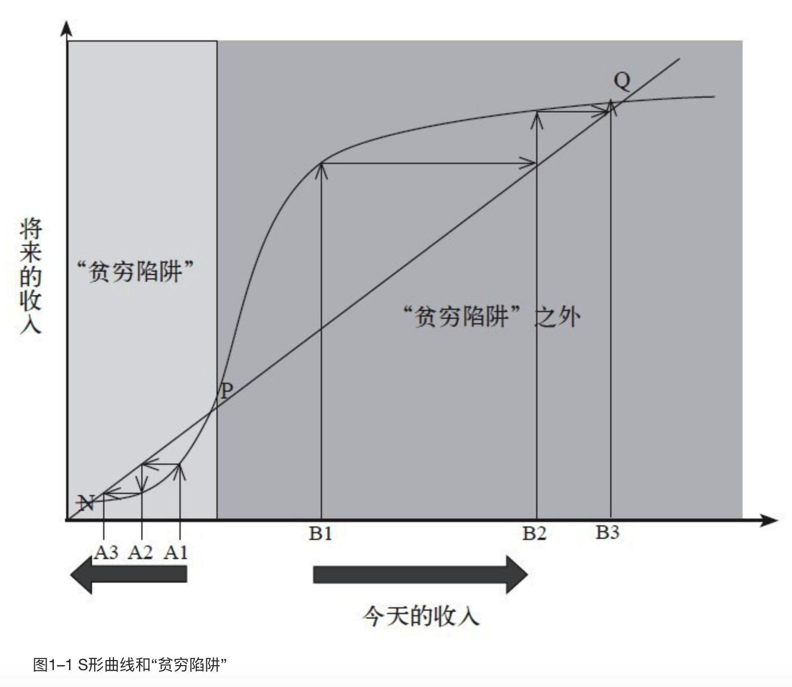
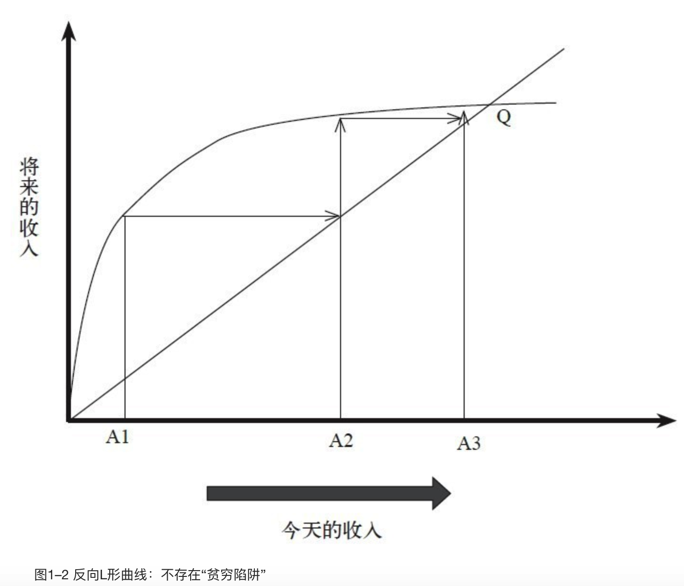

    作者: 阿比吉特•班纳吉 (Abhijit V.Banerjee) / 埃斯特•迪弗洛 (Esther Duflo)
    出版社: 中信出版社
    副标题: 我们为什么摆脱不了贫穷
    原作名: Poor Economics: A Radical Rethinking of the Way to Fight Global Poverty
    译者: 景芳
    出版年: 2013-4-1
    页数: 256
    定价: 58.00元
    装帧: 精装
    ISBN: 9787508638492

[豆瓣链接](https://book.douban.com/subject/21966353/)

- [前言](#前言)
  - [第一章 再好好想想](#第一章-再好好想想)
    - [被困于“贫穷陷阱”](#被困于贫穷陷阱)
- [第一部分 生活案例](#第一部分-生活案例)
  - [第二章 饥饿人口已达到10亿？](#第二章-饥饿人口已达到10亿)
    - [饥饿人口真的已达到了10亿？](#饥饿人口真的已达到了10亿)

# 前言
我们所关注的焦点是世界上最贫穷的人，就全球穷人最多的50个国家来说，其平均贫穷线为每人每天16印度卢比。各国政府将生活费低于这一水平的人定位为贫穷状态。根据当前的汇率标准，16卢比相当于36美分，但由于大多数发展中国家的物价水平较低，如果穷人以美国的物价水平来购物，他们就需要花更多的钱——99美分。因此，要想知道穷人是怎样生活的，你就要想象如何在迈阿密或莫德斯托每天只靠99美分生活。要用这点钱购买你一天所需（除了住房），这并不容易。比如，在印度，99美分只能买15根小香蕉，或是3磅劣质大米。你能靠这点吃的活下去吗？不过，2005年，全球有8.65亿人口（占世界总人口的13%）都是这样生活的。

## 第一章 再好好想想
贫穷会导致令人难以容忍的人才浪费。贫穷并不仅仅意味着缺钱，它会使人丧失挖掘自身潜力的能力。一个来自非洲的贫穷小女孩即使很聪明，可能最多也只能上几年学。她很可能由于营养不足而无法成长为世界顶级运动员，而且即使她有什么做生意的好想法，也没有启动资金。

### 被困于“贫穷陷阱”
对于那些相信“贫穷陷阱”的人来说，整个世界就像图1–1表现的那样，你今天的收入会影响将来的收入，这个将来可能是明天、下个月，也可能是下一代；你今天有多少钱决定着你能吃多少，有多少钱用来买药、支付你孩子的教育费、为自家田地买来化肥或更好的种子，所有这些都决定着你明天会有多少钱。

我们暂且选用英文字母“S”为其命名，称之为`“S形曲线”`。

这条S形曲线就是“贫穷陷阱”的来源。从对角线上来看，今天的收入等于明天的收入。对于处于“贫穷陷阱”地带的穷人来说，将来的收入低于今天的收入：曲线低于对角线。这就意味着，随着时间的流逝，这一地带的人会变得越来越穷，最终在n点陷入贫穷。从A1点开始的箭头代表一条可能的轨道：由A1到A2，再到A3，如此顺延下去。对于那些起点在“贫穷陷阱”地带以外的人来说，明天的收入会高于今天的收入：至少从某种程度上来说，他们会变得越来越富。以B1为起点、顺着B2、B3延伸的箭头代表着这一盛势。

图1–2有点儿像图1–1的右半部分，但它的左端没那么平坦。这条曲线一开始上升得很快，然后慢慢放缓。此图表明，世界上不存在“贫穷陷阱”，因为最穷的人也能挣到比他们原来的收入更多的钱，他们会变得越来越富，直到他们的收入停止增长为止（以A1为起点、顺着A2、A3延伸的箭头描绘了这条可能的轨道）。这里所体现的收入或许不是很高，但此图却暗示着，我们几乎没有必要帮助穷人了。在这个世界上，一次性的施舍（如给某人足够的收入，让她或他以A2、而不是今天的A1为起点）并不能永久地提高一个人的收入，最多也只能让他们前进得更快一些，并不能改变他们最终前进的方向。

# 第一部分 生活案例
## 第二章 饥饿人口已达到10亿？
帕克·索林住在印尼万隆省的一个小村庄，他曾向我们解释过这种“贫穷陷阱”的形成过程。

帕克的父母过去有一小块地，但他们要养活13个孩子，还要盖很多房子，供他们自己和孩子们居住。因此，他们已经没有可以用来耕作的土地了。帕克·索林一直在做临时农工，在地里干一天活儿能挣1万印度尼西亚盾（购买力平价2美元）。然而，由于化肥、燃料价格上涨，农民们被迫节省开支。据帕克·索林说，当地农民决定不削减工资，但也不再雇用更多人手。于是，帕克·索林大部分时间都处于失业状态：在2008年我们见到他之前的两个月里，他一份农活儿也没找到。如果年轻人遇到这种状况，他们通常可以转行去当建筑工人。不过，帕克解释说，大多数体力活儿他都干不了，而那些技术含量高的工作，他又缺乏经验，对于年过四十的他来说，重新学门手艺又为时已晚，没有人会雇用他的。

为了生存，帕克一家（他和妻子及三个孩子）不得不做出一些常人难以想象的事情。他的妻子动身前往80英里之外的雅加达，通过朋友介绍，到别人家里当佣人，可她挣的钱仍不够养活三个孩子。他们的长子尽管只有12岁，学习成绩也不错，却不得不辍学到建筑工地上当学徒。另外两个年纪较小的孩子，不得不送到孩子的爷爷奶奶那里，跟他们一起生活。而帕克自己的生活来源是，每周从政府领到的9磅救济大米，还有他自己在湖畔捕的鱼（他不会游泳）。他的弟弟偶尔也会救济救济他。就在我们跟他谈话前的一周，有四天他每天只吃两顿饭，剩下的三天每天只吃一顿。

帕克的情况似乎让他别无选择，他把自己的问题归结为粮食问题，或者更确切点儿说，是缺粮问题。他认为，拥有土地的农夫之所以决定辞退工人，而不是降低工资，原因在于他们认定，在粮食涨价的情况下，降低工资会让工人吃不饱饭，降低他们在田间地头的工作效率。这正是自己找不到活儿干的原因。显然，他愿意找活儿干，但由于吃不饱，他整个人都虚弱无力，沮丧之情随之而来，这也在一点点削弱他的意志，使他不再去想该如何解决自己的问题。

从帕克的经历来看，“贫穷陷阱”的概念基于人们能否获取足够的营养。

### 饥饿人口真的已达到了10亿？
在印度的马哈拉施特拉邦，1983年时（距离印度近期的发展还很遥远——大多数家庭每人每天的生活费用不足99美分），即使对于最贫穷的群体来说，，每增加1%的总体花费中，有67%都花费在食物上。就这一事例中最贫穷的人（每人每天约挣50美分）和最富有的人（每人每天约挣3美元）来说，二者之间并无太大区别。在马哈拉施特拉邦的例子中，全球收入与食品消费之间的关系非常具有代表性：即使对于十分贫穷的人来说，食物花费的上涨也远远低于原来的预算。

食品消费的“质量飞跃”。在中国的两个地区，他们随机选定了一些贫穷家庭，然后给予他们大量的主食价格补贴（一个地区是面条，另一个地区是大米）。我们通常认为，当某物的价格下降时，人们便会买得更多。然而，情况恰恰相反。即使大米或小麦的价格便宜了，那些得到补贴的家庭购买的这两种粮食反而减少了，而虾和肉的消费却提升了。令人惊讶的是，对于那些得到补贴的人来说，尽管他们的购买力增强了，但其自身的能量吸收并没有提高，而且可能还会有所降低。从另一方面来看，这些人所摄入的营养含量也没有得到任何提高。一种可能的解释就是，主食占家庭预算的很大一部分，因而补贴使他们变得更富有：如果主食的消费与贫穷的状态有关（比如说，因为主食价格便宜，但不那么好吃），那么富有的感觉可能会促使他们买更少的主食。这再次表明，至少对于这些非常贫穷的城市家庭来说，他们并不是优先选择获取更多的能量，而是获取味道更好的能量。

