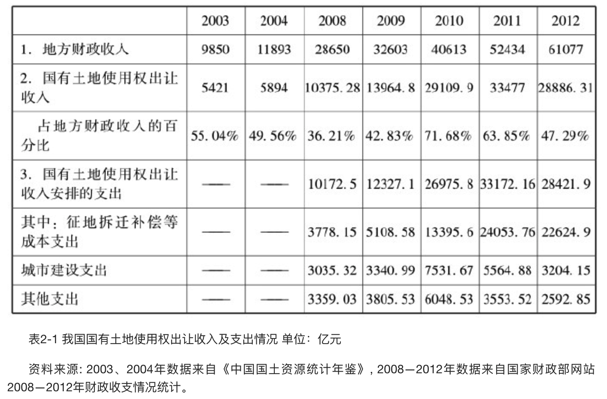

    作者: 华生 
    出版社: 东方出版社
    出版年: 2013-11-1
    页数: 373
    定价: CNY 55.00
    装帧: 平装
    ISBN: 9787506069267

[豆瓣链接](https://book.douban.com/subject/25766497/)

- [第一章](#%e7%ac%ac%e4%b8%80%e7%ab%a0)
  - [第一节 老三农问题和土地问题的历史演变](#%e7%ac%ac%e4%b8%80%e8%8a%82-%e8%80%81%e4%b8%89%e5%86%9c%e9%97%ae%e9%a2%98%e5%92%8c%e5%9c%9f%e5%9c%b0%e9%97%ae%e9%a2%98%e7%9a%84%e5%8e%86%e5%8f%b2%e6%bc%94%e5%8f%98)
    - [一、改革前农村土地产权：集体所有与国家控制](#%e4%b8%80%e6%94%b9%e9%9d%a9%e5%89%8d%e5%86%9c%e6%9d%91%e5%9c%9f%e5%9c%b0%e4%ba%a7%e6%9d%83%e9%9b%86%e4%bd%93%e6%89%80%e6%9c%89%e4%b8%8e%e5%9b%bd%e5%ae%b6%e6%8e%a7%e5%88%b6)
    - [二、改革后农村土地产权：从大包干到永佃权](#%e4%ba%8c%e6%94%b9%e9%9d%a9%e5%90%8e%e5%86%9c%e6%9d%91%e5%9c%9f%e5%9c%b0%e4%ba%a7%e6%9d%83%e4%bb%8e%e5%a4%a7%e5%8c%85%e5%b9%b2%e5%88%b0%e6%b0%b8%e4%bd%83%e6%9d%83)
    - [三、改革后老三农问题的核心：税赋问题](#%e4%b8%89%e6%94%b9%e9%9d%a9%e5%90%8e%e8%80%81%e4%b8%89%e5%86%9c%e9%97%ae%e9%a2%98%e7%9a%84%e6%a0%b8%e5%bf%83%e7%a8%8e%e8%b5%8b%e9%97%ae%e9%a2%98)
    - [四、两大改革成果：实现耕者有其田和免除税赋](#%e5%9b%9b%e4%b8%a4%e5%a4%a7%e6%94%b9%e9%9d%a9%e6%88%90%e6%9e%9c%e5%ae%9e%e7%8e%b0%e8%80%95%e8%80%85%e6%9c%89%e5%85%b6%e7%94%b0%e5%92%8c%e5%85%8d%e9%99%a4%e7%a8%8e%e8%b5%8b)
  - [第二节 在城市化转型中出现的新三农问题](#%e7%ac%ac%e4%ba%8c%e8%8a%82-%e5%9c%a8%e5%9f%8e%e5%b8%82%e5%8c%96%e8%bd%ac%e5%9e%8b%e4%b8%ad%e5%87%ba%e7%8e%b0%e7%9a%84%e6%96%b0%e4%b8%89%e5%86%9c%e9%97%ae%e9%a2%98)
    - [一、新三农问题之一：农用地的流转和规模经营](#%e4%b8%80%e6%96%b0%e4%b8%89%e5%86%9c%e9%97%ae%e9%a2%98%e4%b9%8b%e4%b8%80%e5%86%9c%e7%94%a8%e5%9c%b0%e7%9a%84%e6%b5%81%e8%bd%ac%e5%92%8c%e8%a7%84%e6%a8%a1%e7%bb%8f%e8%90%a5)
    - [二、新三农问题之二：农村土地的非农开发使用](#%e4%ba%8c%e6%96%b0%e4%b8%89%e5%86%9c%e9%97%ae%e9%a2%98%e4%b9%8b%e4%ba%8c%e5%86%9c%e6%9d%91%e5%9c%9f%e5%9c%b0%e7%9a%84%e9%9d%9e%e5%86%9c%e5%bc%80%e5%8f%91%e4%bd%bf%e7%94%a8)
    - [三、新三农问题之三：农民离乡进城务工](#%e4%b8%89%e6%96%b0%e4%b8%89%e5%86%9c%e9%97%ae%e9%a2%98%e4%b9%8b%e4%b8%89%e5%86%9c%e6%b0%91%e7%a6%bb%e4%b9%a1%e8%bf%9b%e5%9f%8e%e5%8a%a1%e5%b7%a5)
    - [四、新三农问题的难点和症结：土地非农开发使用](#%e5%9b%9b%e6%96%b0%e4%b8%89%e5%86%9c%e9%97%ae%e9%a2%98%e7%9a%84%e9%9a%be%e7%82%b9%e5%92%8c%e7%97%87%e7%bb%93%e5%9c%9f%e5%9c%b0%e9%9d%9e%e5%86%9c%e5%bc%80%e5%8f%91%e4%bd%bf%e7%94%a8)
- [第二章](#%e7%ac%ac%e4%ba%8c%e7%ab%a0)
  - [第一节 土地财政的异化](#%e7%ac%ac%e4%b8%80%e8%8a%82-%e5%9c%9f%e5%9c%b0%e8%b4%a2%e6%94%bf%e7%9a%84%e5%bc%82%e5%8c%96)
    - [一、中国式土地财政从何而来](#%e4%b8%80%e4%b8%ad%e5%9b%bd%e5%bc%8f%e5%9c%9f%e5%9c%b0%e8%b4%a2%e6%94%bf%e4%bb%8e%e4%bd%95%e8%80%8c%e6%9d%a5)
    - [二、对中国式土地财政的两种相反观点](#%e4%ba%8c%e5%af%b9%e4%b8%ad%e5%9b%bd%e5%bc%8f%e5%9c%9f%e5%9c%b0%e8%b4%a2%e6%94%bf%e7%9a%84%e4%b8%a4%e7%a7%8d%e7%9b%b8%e5%8f%8d%e8%a7%82%e7%82%b9)
    - [三、什么是中国式土地财政的真正问题](#%e4%b8%89%e4%bb%80%e4%b9%88%e6%98%af%e4%b8%ad%e5%9b%bd%e5%bc%8f%e5%9c%9f%e5%9c%b0%e8%b4%a2%e6%94%bf%e7%9a%84%e7%9c%9f%e6%ad%a3%e9%97%ae%e9%a2%98)
  - [第二节 土地所有权之争的背后](#%e7%ac%ac%e4%ba%8c%e8%8a%82-%e5%9c%9f%e5%9c%b0%e6%89%80%e6%9c%89%e6%9d%83%e4%b9%8b%e4%ba%89%e7%9a%84%e8%83%8c%e5%90%8e)
    - [一、农村土地集体所有制的存废之争](#%e4%b8%80%e5%86%9c%e6%9d%91%e5%9c%9f%e5%9c%b0%e9%9b%86%e4%bd%93%e6%89%80%e6%9c%89%e5%88%b6%e7%9a%84%e5%ad%98%e5%ba%9f%e4%b9%8b%e4%ba%89)
  - [第三节 土地开发权与所有权的分离](#%e7%ac%ac%e4%b8%89%e8%8a%82-%e5%9c%9f%e5%9c%b0%e5%bc%80%e5%8f%91%e6%9d%83%e4%b8%8e%e6%89%80%e6%9c%89%e6%9d%83%e7%9a%84%e5%88%86%e7%a6%bb)
    - [一、关于农民是否应拥有土地开发权的两种观点](#%e4%b8%80%e5%85%b3%e4%ba%8e%e5%86%9c%e6%b0%91%e6%98%af%e5%90%a6%e5%ba%94%e6%8b%a5%e6%9c%89%e5%9c%9f%e5%9c%b0%e5%bc%80%e5%8f%91%e6%9d%83%e7%9a%84%e4%b8%a4%e7%a7%8d%e8%a7%82%e7%82%b9)
    - [二、土地开发权是解开土地迷局的总钥匙](#%e4%ba%8c%e5%9c%9f%e5%9c%b0%e5%bc%80%e5%8f%91%e6%9d%83%e6%98%af%e8%a7%a3%e5%bc%80%e5%9c%9f%e5%9c%b0%e8%bf%b7%e5%b1%80%e7%9a%84%e6%80%bb%e9%92%a5%e5%8c%99)
- [第三章](#%e7%ac%ac%e4%b8%89%e7%ab%a0)
  - [第一节 历史沿革](#%e7%ac%ac%e4%b8%80%e8%8a%82-%e5%8e%86%e5%8f%b2%e6%b2%bf%e9%9d%a9)
    - [三、《土地管理法》对土地开发权的规定及其效果](#%e4%b8%89%e5%9c%9f%e5%9c%b0%e7%ae%a1%e7%90%86%e6%b3%95%e5%af%b9%e5%9c%9f%e5%9c%b0%e5%bc%80%e5%8f%91%e6%9d%83%e7%9a%84%e8%a7%84%e5%ae%9a%e5%8f%8a%e5%85%b6%e6%95%88%e6%9e%9c)
  - [第二节 现状：乱象不可持续,改革不可避免](#%e7%ac%ac%e4%ba%8c%e8%8a%82-%e7%8e%b0%e7%8a%b6%e4%b9%b1%e8%b1%a1%e4%b8%8d%e5%8f%af%e6%8c%81%e7%bb%ad%e6%94%b9%e9%9d%a9%e4%b8%8d%e5%8f%af%e9%81%bf%e5%85%8d)
- [第四章](#%e7%ac%ac%e5%9b%9b%e7%ab%a0)
  - [第二节 土地制度改革的学界主流思路](#%e7%ac%ac%e4%ba%8c%e8%8a%82-%e5%9c%9f%e5%9c%b0%e5%88%b6%e5%ba%a6%e6%94%b9%e9%9d%a9%e7%9a%84%e5%ad%a6%e7%95%8c%e4%b8%bb%e6%b5%81%e6%80%9d%e8%b7%af)
- [第五章](#%e7%ac%ac%e4%ba%94%e7%ab%a0)
  - [第一节 小产权房问题剖析](#%e7%ac%ac%e4%b8%80%e8%8a%82-%e5%b0%8f%e4%ba%a7%e6%9d%83%e6%88%bf%e9%97%ae%e9%a2%98%e5%89%96%e6%9e%90)
    - [一、小产权房定义：违规建设的不合法商品房](#%e4%b8%80%e5%b0%8f%e4%ba%a7%e6%9d%83%e6%88%bf%e5%ae%9a%e4%b9%89%e8%bf%9d%e8%a7%84%e5%bb%ba%e8%ae%be%e7%9a%84%e4%b8%8d%e5%90%88%e6%b3%95%e5%95%86%e5%93%81%e6%88%bf)
    - [二、小产权房成因：政府规划不明及法治缺位](#%e4%ba%8c%e5%b0%8f%e4%ba%a7%e6%9d%83%e6%88%bf%e6%88%90%e5%9b%a0%e6%94%bf%e5%ba%9c%e8%a7%84%e5%88%92%e4%b8%8d%e6%98%8e%e5%8f%8a%e6%b3%95%e6%b2%bb%e7%bc%ba%e4%bd%8d)
    - [三、小产权房合法化：正当性及可行性探讨](#%e4%b8%89%e5%b0%8f%e4%ba%a7%e6%9d%83%e6%88%bf%e5%90%88%e6%b3%95%e5%8c%96%e6%ad%a3%e5%bd%93%e6%80%a7%e5%8f%8a%e5%8f%af%e8%a1%8c%e6%80%a7%e6%8e%a2%e8%ae%a8)
    - [四、小产权房核心问题：农民有无自主城市化的权利？](#%e5%9b%9b%e5%b0%8f%e4%ba%a7%e6%9d%83%e6%88%bf%e6%a0%b8%e5%bf%83%e9%97%ae%e9%a2%98%e5%86%9c%e6%b0%91%e6%9c%89%e6%97%a0%e8%87%aa%e4%b8%bb%e5%9f%8e%e5%b8%82%e5%8c%96%e7%9a%84%e6%9d%83%e5%88%a9)
  - [第二节 保障房的弯路和歧义](#%e7%ac%ac%e4%ba%8c%e8%8a%82-%e4%bf%9d%e9%9a%9c%e6%88%bf%e7%9a%84%e5%bc%af%e8%b7%af%e5%92%8c%e6%ad%a7%e4%b9%89)
    - [一、保障房建设的曲折历程一：从福利房到经济适用房](#%e4%b8%80%e4%bf%9d%e9%9a%9c%e6%88%bf%e5%bb%ba%e8%ae%be%e7%9a%84%e6%9b%b2%e6%8a%98%e5%8e%86%e7%a8%8b%e4%b8%80%e4%bb%8e%e7%a6%8f%e5%88%a9%e6%88%bf%e5%88%b0%e7%bb%8f%e6%b5%8e%e9%80%82%e7%94%a8%e6%88%bf)
    - [二、保障房建设的曲折历程二：从廉租房到棚户区改造](#%e4%ba%8c%e4%bf%9d%e9%9a%9c%e6%88%bf%e5%bb%ba%e8%ae%be%e7%9a%84%e6%9b%b2%e6%8a%98%e5%8e%86%e7%a8%8b%e4%ba%8c%e4%bb%8e%e5%bb%89%e7%a7%9f%e6%88%bf%e5%88%b0%e6%a3%9a%e6%88%b7%e5%8c%ba%e6%94%b9%e9%80%a0)
    - [三、保障房建设的弯路和三大教训](#%e4%b8%89%e4%bf%9d%e9%9a%9c%e6%88%bf%e5%bb%ba%e8%ae%be%e7%9a%84%e5%bc%af%e8%b7%af%e5%92%8c%e4%b8%89%e5%a4%a7%e6%95%99%e8%ae%ad)
- [第六章](#%e7%ac%ac%e5%85%ad%e7%ab%a0)
  - [第一节 城乡建设用地增减挂钩的由来、发展与政策效应](#%e7%ac%ac%e4%b8%80%e8%8a%82-%e5%9f%8e%e4%b9%a1%e5%bb%ba%e8%ae%be%e7%94%a8%e5%9c%b0%e5%a2%9e%e5%87%8f%e6%8c%82%e9%92%a9%e7%9a%84%e7%94%b1%e6%9d%a5%e5%8f%91%e5%b1%95%e4%b8%8e%e6%94%bf%e7%ad%96%e6%95%88%e5%ba%94)
    - [一、增减挂钩的政策出台：初衷为保护耕地](#%e4%b8%80%e5%a2%9e%e5%87%8f%e6%8c%82%e9%92%a9%e7%9a%84%e6%94%bf%e7%ad%96%e5%87%ba%e5%8f%b0%e5%88%9d%e8%a1%b7%e4%b8%ba%e4%bf%9d%e6%8a%a4%e8%80%95%e5%9c%b0)
    - [二、增减挂钩的政策效果：缓解中央和地方用地矛盾](#%e4%ba%8c%e5%a2%9e%e5%87%8f%e6%8c%82%e9%92%a9%e7%9a%84%e6%94%bf%e7%ad%96%e6%95%88%e6%9e%9c%e7%bc%93%e8%a7%a3%e4%b8%ad%e5%a4%ae%e5%92%8c%e5%9c%b0%e6%96%b9%e7%94%a8%e5%9c%b0%e7%9f%9b%e7%9b%be)
    - [三、增减挂钩的政策偏差：并未以农民市民化为本](#%e4%b8%89%e5%a2%9e%e5%87%8f%e6%8c%82%e9%92%a9%e7%9a%84%e6%94%bf%e7%ad%96%e5%81%8f%e5%b7%ae%e5%b9%b6%e6%9c%aa%e4%bb%a5%e5%86%9c%e6%b0%91%e5%b8%82%e6%b0%91%e5%8c%96%e4%b8%ba%e6%9c%ac)
  - [第二节 地票试验的重大突破与致命缺陷](#%e7%ac%ac%e4%ba%8c%e8%8a%82-%e5%9c%b0%e7%a5%a8%e8%af%95%e9%aa%8c%e7%9a%84%e9%87%8d%e5%a4%a7%e7%aa%81%e7%a0%b4%e4%b8%8e%e8%87%b4%e5%91%bd%e7%bc%ba%e9%99%b7)
    - [四、经验总结：地票失败源于增减挂钩内在缺陷](#%e5%9b%9b%e7%bb%8f%e9%aa%8c%e6%80%bb%e7%bb%93%e5%9c%b0%e7%a5%a8%e5%a4%b1%e8%b4%a5%e6%ba%90%e4%ba%8e%e5%a2%9e%e5%87%8f%e6%8c%82%e9%92%a9%e5%86%85%e5%9c%a8%e7%bc%ba%e9%99%b7)
- [第七章](#%e7%ac%ac%e4%b8%83%e7%ab%a0)
  - [第一节 土地开发权分离的经济学探讨](#%e7%ac%ac%e4%b8%80%e8%8a%82-%e5%9c%9f%e5%9c%b0%e5%bc%80%e5%8f%91%e6%9d%83%e5%88%86%e7%a6%bb%e7%9a%84%e7%bb%8f%e6%b5%8e%e5%ad%a6%e6%8e%a2%e8%ae%a8)
    - [一、经济学解释：土地的位置垄断与外部性导致市场失灵](#%e4%b8%80%e7%bb%8f%e6%b5%8e%e5%ad%a6%e8%a7%a3%e9%87%8a%e5%9c%9f%e5%9c%b0%e7%9a%84%e4%bd%8d%e7%bd%ae%e5%9e%84%e6%96%ad%e4%b8%8e%e5%a4%96%e9%83%a8%e6%80%a7%e5%af%bc%e8%87%b4%e5%b8%82%e5%9c%ba%e5%a4%b1%e7%81%b5)
    - [二、哈耶克观点：私人产权原则在土地问题上的例外](#%e4%ba%8c%e5%93%88%e8%80%b6%e5%85%8b%e8%a7%82%e7%82%b9%e7%a7%81%e4%ba%ba%e4%ba%a7%e6%9d%83%e5%8e%9f%e5%88%99%e5%9c%a8%e5%9c%9f%e5%9c%b0%e9%97%ae%e9%a2%98%e4%b8%8a%e7%9a%84%e4%be%8b%e5%a4%96)
  - [第三节 土地开发权在不同权利主体间的分配](#%e7%ac%ac%e4%b8%89%e8%8a%82-%e5%9c%9f%e5%9c%b0%e5%bc%80%e5%8f%91%e6%9d%83%e5%9c%a8%e4%b8%8d%e5%90%8c%e6%9d%83%e5%88%a9%e4%b8%bb%e4%bd%93%e9%97%b4%e7%9a%84%e5%88%86%e9%85%8d)
    - [一、经验考察：美国的开发权转移](#%e4%b8%80%e7%bb%8f%e9%aa%8c%e8%80%83%e5%af%9f%e7%be%8e%e5%9b%bd%e7%9a%84%e5%bc%80%e5%8f%91%e6%9d%83%e8%bd%ac%e7%a7%bb)
    - [二、开发权分配：规划权归政府,收益权社会分享](#%e4%ba%8c%e5%bc%80%e5%8f%91%e6%9d%83%e5%88%86%e9%85%8d%e8%a7%84%e5%88%92%e6%9d%83%e5%bd%92%e6%94%bf%e5%ba%9c%e6%94%b6%e7%9b%8a%e6%9d%83%e7%a4%be%e4%bc%9a%e5%88%86%e4%ba%ab)
- [第八章](#%e7%ac%ac%e5%85%ab%e7%ab%a0)
  - [第一节 法律原则一：“公共使用”原则](#%e7%ac%ac%e4%b8%80%e8%8a%82-%e6%b3%95%e5%be%8b%e5%8e%9f%e5%88%99%e4%b8%80%e5%85%ac%e5%85%b1%e4%bd%bf%e7%94%a8%e5%8e%9f%e5%88%99)
    - [一、“公共使用”原则由严到宽的法律演变](#%e4%b8%80%e5%85%ac%e5%85%b1%e4%bd%bf%e7%94%a8%e5%8e%9f%e5%88%99%e7%94%b1%e4%b8%a5%e5%88%b0%e5%ae%bd%e7%9a%84%e6%b3%95%e5%be%8b%e6%bc%94%e5%8f%98)
    - [二、标志性判例一：伯尔曼v.帕克](#%e4%ba%8c%e6%a0%87%e5%bf%97%e6%80%a7%e5%88%a4%e4%be%8b%e4%b8%80%e4%bc%af%e5%b0%94%e6%9b%bcv%e5%b8%95%e5%85%8b)
    - [三、标志性判例二：夏威夷房屋管理局v.米德基夫](#%e4%b8%89%e6%a0%87%e5%bf%97%e6%80%a7%e5%88%a4%e4%be%8b%e4%ba%8c%e5%a4%8f%e5%a8%81%e5%a4%b7%e6%88%bf%e5%b1%8b%e7%ae%a1%e7%90%86%e5%b1%80v%e7%b1%b3%e5%be%b7%e5%9f%ba%e5%a4%ab)
  - [第二节 法律原则二：“公正补偿”原则](#%e7%ac%ac%e4%ba%8c%e8%8a%82-%e6%b3%95%e5%be%8b%e5%8e%9f%e5%88%99%e4%ba%8c%e5%85%ac%e6%ad%a3%e8%a1%a5%e5%81%bf%e5%8e%9f%e5%88%99)
    - [一、市场价值不是土地投入成本或征地转用后价值](#%e4%b8%80%e5%b8%82%e5%9c%ba%e4%bb%b7%e5%80%bc%e4%b8%8d%e6%98%af%e5%9c%9f%e5%9c%b0%e6%8a%95%e5%85%a5%e6%88%90%e6%9c%ac%e6%88%96%e5%be%81%e5%9c%b0%e8%bd%ac%e7%94%a8%e5%90%8e%e4%bb%b7%e5%80%bc)
    - [二、市场价值不包括替代设施补偿或间接损失补偿](#%e4%ba%8c%e5%b8%82%e5%9c%ba%e4%bb%b7%e5%80%bc%e4%b8%8d%e5%8c%85%e6%8b%ac%e6%9b%bf%e4%bb%a3%e8%ae%be%e6%96%bd%e8%a1%a5%e5%81%bf%e6%88%96%e9%97%b4%e6%8e%a5%e6%8d%9f%e5%a4%b1%e8%a1%a5%e5%81%bf)
    - [三、补偿标准按征收前市场价值计算的法理依据](#%e4%b8%89%e8%a1%a5%e5%81%bf%e6%a0%87%e5%87%86%e6%8c%89%e5%be%81%e6%94%b6%e5%89%8d%e5%b8%82%e5%9c%ba%e4%bb%b7%e5%80%bc%e8%ae%a1%e7%ae%97%e7%9a%84%e6%b3%95%e7%90%86%e4%be%9d%e6%8d%ae)
- [第九章](#%e7%ac%ac%e4%b9%9d%e7%ab%a0)
  - [第一节 制度设计的指导思想和目标](#%e7%ac%ac%e4%b8%80%e8%8a%82-%e5%88%b6%e5%ba%a6%e8%ae%be%e8%ae%a1%e7%9a%84%e6%8c%87%e5%af%bc%e6%80%9d%e6%83%b3%e5%92%8c%e7%9b%ae%e6%a0%87)
    - [一、指导思想：土地增值应用于城市化主体即农民工](#%e4%b8%80%e6%8c%87%e5%af%bc%e6%80%9d%e6%83%b3%e5%9c%9f%e5%9c%b0%e5%a2%9e%e5%80%bc%e5%ba%94%e7%94%a8%e4%ba%8e%e5%9f%8e%e5%b8%82%e5%8c%96%e4%b8%bb%e4%bd%93%e5%8d%b3%e5%86%9c%e6%b0%91%e5%b7%a5)
    - [二、改革目标：让人的城市化与土地城市化同步推进](#%e4%ba%8c%e6%94%b9%e9%9d%a9%e7%9b%ae%e6%a0%87%e8%ae%a9%e4%ba%ba%e7%9a%84%e5%9f%8e%e5%b8%82%e5%8c%96%e4%b8%8e%e5%9c%9f%e5%9c%b0%e5%9f%8e%e5%b8%82%e5%8c%96%e5%90%8c%e6%ad%a5%e6%8e%a8%e8%bf%9b)
  - [第二节 新型城镇化制度框架](#%e7%ac%ac%e4%ba%8c%e8%8a%82-%e6%96%b0%e5%9e%8b%e5%9f%8e%e9%95%87%e5%8c%96%e5%88%b6%e5%ba%a6%e6%a1%86%e6%9e%b6)
    - [一、改变用地指标分配机制,实现土地与户籍联动改革](#%e4%b8%80%e6%94%b9%e5%8f%98%e7%94%a8%e5%9c%b0%e6%8c%87%e6%a0%87%e5%88%86%e9%85%8d%e6%9c%ba%e5%88%b6%e5%ae%9e%e7%8e%b0%e5%9c%9f%e5%9c%b0%e4%b8%8e%e6%88%b7%e7%b1%8d%e8%81%94%e5%8a%a8%e6%94%b9%e9%9d%a9)
    - [二、调整既得利益结构,土地增值收益回归城市化主体](#%e4%ba%8c%e8%b0%83%e6%95%b4%e6%97%a2%e5%be%97%e5%88%a9%e7%9b%8a%e7%bb%93%e6%9e%84%e5%9c%9f%e5%9c%b0%e5%a2%9e%e5%80%bc%e6%94%b6%e7%9b%8a%e5%9b%9e%e5%bd%92%e5%9f%8e%e5%b8%82%e5%8c%96%e4%b8%bb%e4%bd%93)
      - [(一)以征地财务平衡替代卖地牟利财政](#%e4%b8%80%e4%bb%a5%e5%be%81%e5%9c%b0%e8%b4%a2%e5%8a%a1%e5%b9%b3%e8%a1%a1%e6%9b%bf%e4%bb%a3%e5%8d%96%e5%9c%b0%e7%89%9f%e5%88%a9%e8%b4%a2%e6%94%bf)
      - [(二)规范失地农民的利益补偿](#%e4%ba%8c%e8%a7%84%e8%8c%83%e5%a4%b1%e5%9c%b0%e5%86%9c%e6%b0%91%e7%9a%84%e5%88%a9%e7%9b%8a%e8%a1%a5%e5%81%bf)
      - [(三)改革房地产开发模式](#%e4%b8%89%e6%94%b9%e9%9d%a9%e6%88%bf%e5%9c%b0%e4%ba%a7%e5%bc%80%e5%8f%91%e6%a8%a1%e5%bc%8f)
      - [(四)调节居民房地产收入](#%e5%9b%9b%e8%b0%83%e8%8a%82%e5%b1%85%e6%b0%91%e6%88%bf%e5%9c%b0%e4%ba%a7%e6%94%b6%e5%85%a5)
    - [三、改变体制换粮断奶,将地方政府拔出卖地财政陷阱](#%e4%b8%89%e6%94%b9%e5%8f%98%e4%bd%93%e5%88%b6%e6%8d%a2%e7%b2%ae%e6%96%ad%e5%a5%b6%e5%b0%86%e5%9c%b0%e6%96%b9%e6%94%bf%e5%ba%9c%e6%8b%94%e5%87%ba%e5%8d%96%e5%9c%b0%e8%b4%a2%e6%94%bf%e9%99%b7%e9%98%b1)
    - [四、城市规模布局和特大城市的发展模式](#%e5%9b%9b%e5%9f%8e%e5%b8%82%e8%a7%84%e6%a8%a1%e5%b8%83%e5%b1%80%e5%92%8c%e7%89%b9%e5%a4%a7%e5%9f%8e%e5%b8%82%e7%9a%84%e5%8f%91%e5%b1%95%e6%a8%a1%e5%bc%8f)
      - [(一)经济手段](#%e4%b8%80%e7%bb%8f%e6%b5%8e%e6%89%8b%e6%ae%b5)
      - [(二)规划手段](#%e4%ba%8c%e8%a7%84%e5%88%92%e6%89%8b%e6%ae%b5)
    - [五、人口城市化和市民化的进度规划](#%e4%ba%94%e4%ba%ba%e5%8f%a3%e5%9f%8e%e5%b8%82%e5%8c%96%e5%92%8c%e5%b8%82%e6%b0%91%e5%8c%96%e7%9a%84%e8%bf%9b%e5%ba%a6%e8%a7%84%e5%88%92)
    - [六、城镇化引领和推动农业现代化的制度安排](#%e5%85%ad%e5%9f%8e%e9%95%87%e5%8c%96%e5%bc%95%e9%a2%86%e5%92%8c%e6%8e%a8%e5%8a%a8%e5%86%9c%e4%b8%9a%e7%8e%b0%e4%bb%a3%e5%8c%96%e7%9a%84%e5%88%b6%e5%ba%a6%e5%ae%89%e6%8e%92)
    - [七、城镇化转型中的集体土地所有制问题](#%e4%b8%83%e5%9f%8e%e9%95%87%e5%8c%96%e8%bd%ac%e5%9e%8b%e4%b8%ad%e7%9a%84%e9%9b%86%e4%bd%93%e5%9c%9f%e5%9c%b0%e6%89%80%e6%9c%89%e5%88%b6%e9%97%ae%e9%a2%98)

## 第一章
农民、农业、农村长期以来被称为中国的三农问题。

### 第一节 老三农问题和土地问题的历史演变
#### 一、改革前农村土地产权：集体所有与国家控制
改革前即20世纪70年代末中国农村真实的经济和土地产权结构,是形式上多层集体所有、生产队占有和个人使用少量自留地、宅基地,实质上由国家控制,即准国家所有。

计划经济时代的三农问题就集中表现在国家对农产品的收购价格上。通过所谓工农业产品剪刀差,即低价收购农产品来为国民经济提供积累,从而导致了农民贫困和农村落后,这是这个时期三农问题的突出标志。

#### 二、改革后农村土地产权：从大包干到永佃权
作为农村最大改革政策的农村家庭联产承包责任制,其实并没有真正搞过什么联产承包,而是直截了当的土地承包,俗称大包干。这就是把原来形式上三级集体所有和实际上生产队经营土地的使用权和收益权,重新直接分到每个农户。农民对这种大包干最真切的通俗理解,就是所谓“交了国家的,留了集体的,剩下全是自己的”。这个种养殖自由、在缴纳税赋之后剩余权归己的制度安排,充分揭示了这种承包权的经济本质其实就是一种租佃权。随着农村改革的深入,农户的土地承包权即租佃权逐步稳定。

《农村土地承包法》在颁布时已明确规定,在30年的土地承包期内,作为发包方的集体不得收回承包土地。而承包期尚未满,中央政府又宣布土地承包“长久不变”,并再修改相关配套法律。近年来推行的对农民宅基地使用权和准备对农民农地的承包经营权进行确权颁证,显然会进一步强化已分得土地的农民的财产权利。因此,从经济本质看,这种由政府决定给予、不得随意收回和不随人口变动而长久不变的土地使用权和收益权,已经在事实上变为当年参加了初分土地农民的一种永佃权,而其后出生和迁徙来的农民已经丧失了对土地的权利。

从这个意义上说,增人不增地、减人不减地的新法令,实际上已经不声不响地废除了承包土地的集体所有制,取消了本来村庄内每个农民都享有的集体成员权利,而将承包土地变为当年参加分配的那部分农民可以继承的私人财产权利。

#### 三、改革后老三农问题的核心：税赋问题
这项旨在减税和减轻农民负担的改革,由于涉及问题众多,包括国家财政的负担能力,税种税率的法律设置和实施中的变通,中央与地方以及地方政府与农村基层政权之间财力与事权的划分,粮食等农产品购销体制改革,政府众多关联部门特别是基层政权的精兵简政和反腐倡廉等,前后经历了十多年和两代政府的接力努力,最终在2006年以全国免征农业税和免去农民的一切税费为标志,画上了最后的句号。

国家还在历史上首次真正开始反哺农业,即对农民实行从种子到种粮等一系列直接补贴到田到户的措施。

#### 四、两大改革成果：实现耕者有其田和免除税赋
第一,实现了耕者有其田。这是通过全国范围内均分土地的家庭承包即土地使用和收益权的公平分配和长久不变做到的。这在一定意义上仅仅是对建国之初土地改革的回归。

第二,解决了农民的税费负担。中国在2006年以农业税和其他所有向农民收取税费的完全取消,主要靠的还是国家工业化和城市化的发展,使国家财政可以不再依赖农业和农民来提供税费来源,果断砍掉农民所有的税费租负担。

### 第二节 在城市化转型中出现的新三农问题
由工业化和城市化引发的新三农问题,即**农地流转**、**农民离乡务工**和**农地非农用**这三个新焦点。

#### 一、新三农问题之一：农用地的流转和规模经营
现在农地使用中唯一意义重大的争论,是究竟应该保护家庭经营还是应该鼓励资本下乡、公司化经营的问题。虽然在农村养殖业和若干经济作物的经营中,公司化经营显示了优势,但在主要农产品的种植中,公司化运作的成效并未得到可信证明。从人均可耕地与我国相近的日本、韩国来看,随着农村人口向城市逐步迁移,专业农户、少量小规模家庭农场以及在此基础上的农协组织将成为农业的主要生产经营模式。很显然,在大多数农民还没有从农村移居出去之前,任何外力推动的公司化都是有害无益的。随着农村人口减少、农民种植耕地规模的扩大,专业农户和少量家庭小农场会逐步成为农业生产经营的主流。到那时候,现在定义模糊的农地多层集体所有,不用被废除就会自然消亡。

#### 二、新三农问题之二：农村土地的非农开发使用
在各方面的呼吁推动下,十七届三中全会已经提出要改革农村集体建设用地使用权出让和转让办法,除集体公益事业建设用地和宅基地之外,农村集体建设用地经过确权发证,可以采用出让、流转等各种方式,有偿使用和流转,而且将本着“初次分配基于产权,二次分配政府参与”的原则,研究建立集体建设用地有偿使用、有关税费征缴和分配办法。

新的思路拟首次允许农村集体建设用地可以不经过国家征用直接进入市场。但其受益者首先是不能清楚界定的农村集体经济组织,如果这个集体建设用地的来源界定不清,转让收益又变成合法化和数额巨大,肯定还会引起新的矛盾和争论。更重要的是,占农村建设用地主体部分的农民宅基地向本村村民以外的人(主要是市民)转让和进入市场,现行法规并不允许,解决问题的思路也还完全不清楚。

#### 三、新三农问题之三：农民离乡进城务工
尽管农民工问题近年来引起了普遍的社会关注,人们对农民工的欠薪、就业和劳动条件表示了关切、援助和同情,但是迄今在制度层面上并未就此作出任何重大调整或改变,农民工问题其实也不是学界和舆论界真正持续关注的焦点。农民工不管已经在城市就业了多少年,他们仍然被视作为短期流动来的农民,被排除在城市的住房、教育、医疗、社会保障和社区服务的网络之外。近年来情况开始有所改变,但作为承载所有这些公共福利的歧视性户籍制度仍无改变。

#### 四、新三农问题的难点和症结：土地非农开发使用
在上述新三农的三个焦点问题中,其中农用地的流转和规模经营,实际正在积极发展并受到政府推动；而农民工进城受阻,务工不能落户的户籍垄断与歧视,大家在解决问题的方向上并无分歧,但掌控着资源、维稳第一的政府和受城市居民主导的舆论,还没有拿出真正改变目前城乡隔绝、身份歧视的现状的可行办法。唯有农地的非农使用,由于直接牵动着市民、农民、资本、政府几方利益,成为争论和利益冲突的焦点。这样,我们看到,在农地的非农使用上,目前在实践中出现了在一个法治国家中不可思议的混乱景象。

## 第二章
### 第一节 土地财政的异化
#### 一、中国式土地财政从何而来
在1998年国家启动住房商品化改革以后,土地增值的空间开始显现。只是当时开始主导的还是土地开发市场化,即房地产开发商各显神通拿地。那时开发商只要一手搞定城市有可能出让土地的工厂单位或城郊的农村集体,一手公关城市规划部门取得许可,然后支付国家规定的少量土地出让金,就可以拿到开发土地。正是由于这其中的关系拿地、官商勾结、囤地暴富严重到了相当程度,有关政府部门才几经酝酿,排除了相当阻力,最后在2004年国家出台了开发土地出让一律要由政府收储,实行土地招、拍、挂的政策。

土地拍卖的收益,自然进了地方政府的腰包,从而形成了和政府正常的收入即税收财政并列且日益膨胀的土地财政(见表2-1,土地出让占财政收入的比重变化)。但是,这个所谓的土地财政收入,其实几乎只是拍卖商住用地的结果,而不包括工业用地。因此,中国所谓土地财政的实质是房地产财政。

#### 二、对中国式土地财政的两种相反观点
1. 土地财政是中国特色工业化、城市化发展道路的核心和基础。土地财政通过出让城市土地使用权,对基础设施建设融资,开辟了一条以土地为信用基础,积累城市化原始资本的独特道路。土地财政的本质不是收入而是融资。中国之所以能走这条道路,是因为计划经济时代建立的城市土地国有化和农村土地集体化,为政府垄断土地一级市场创造了条件。土地财政的作用,就是通过拍卖土地的市场机制,将这笔隐匿的财富,转化为启动中国城市化的巨大资本。
2. 现在媒体上和学术界占压倒性的舆论则是另一种对土地财政的严厉批评和完全否定的观点。综合起来看,对土地财政的批评,主要是说地方政府垄断了土地的一级市场开发权,因而侵犯了农民的财产权利,阻碍了市场机制发挥土地供求平衡的调节作用。暗含的解决办法是打破政府的土地垄断,开放土地一级市场。

#### 三、什么是中国式土地财政的真正问题
其实中国房地产财政的真正问题,是它与东亚模式中政府中立、财务平衡、土地增值收益优先用于移居者安居不同,中国的土地收益成为政府可以随意支配的小金库,卖地收入成了不受约束的天上掉馅饼、多多益善,而且支出也完全忽略农民工等移居者这个城市化主体的需要。**这种卖地牟利的财政必然扭曲了政府在市场经济中的功能和作用,从而极大地推升了城市化的成本**。政府本来是公共利益的服务者和守望者,但倒卖土地的房地产财政却扭曲了政府角色,使之成为似乎一手低价买进、一手高价卖出农民土地的生意人,从而丧失了政府执法的公正性和中立性。

### 第二节 土地所有权之争的背后
#### 一、农村土地集体所有制的存废之争
显然,从形式上看,主张维持土地集体所有、主张土地国有和土地私有的不同观点似乎是完全对立的。但从实质上考察,其实他们在主张确权、强化和尊重农民家庭的土地财产权方面并无大的分别,只是出于不同角度或者基于策略上的考虑,提出了不同的土地所有制形式,但基础都是给农户确权、保障农户实质性的土地占有权利。就主张把土地权利真正落到农户而言,他们的观点在本质上大同小异。由此可见,如果仅仅从土地所有权的名称去提出和争论问题,虽然好像争得很热闹,但恐怕并未真正抓住问题的症结。

### 第三节 土地开发权与所有权的分离
#### 一、关于农民是否应拥有土地开发权的两种观点
主张土地私有的许多人对土地开发的观点是鲜明的。他们认为,农地农用的市场价值很低,农地私有的一个关键就是农民自己要拥有土地开发权和收益权。如果农民自己不能决定土地的用途和开发,土地资本化和第三次土地改革就失去吸引力,土地私有也就在很大程度上失去了意义。主张土地集体所有或国有的部分人也持有相同的观点,认为农民的土地应当与城市土地同地同权,农村集体土地不必经过政府批准或征用就可以开发并进入市场流通,和城市国有土地具有同等法律地位。

而不那么激进的多数人认为,土地的国家用途管制和规划管制还是需要的,因此,无论农村土地采取集体、国有或私有形式,农民肯定都不能自行随意改变土地用途和规划。但是,在符合城镇规划的情况下,城郊农民应当有权自己开发土地。国家征地应当严格限制为公益事业。所有非公益用地,农民或者可以在符合规划的情况下自行开发,或者由开发商与农民进行市场化谈判。当国家必须征地时,也应按土地的市场价值补偿。这一观点现在应当说已经成为相当普遍的共识,也为政府所部分接受,是国家土地管理法修改考虑的一个重要方向。

显然,第一种观点即允许所有农民自行改变土地用途搞开发的主张,不管听起来如何义正词严,但实际上完全脱离了当今世界的现实。因为即便在这些主张者求学的西方市场经济国家里,拥有私有土地的农民或农场主也没有这个权利和自由。其道理也很简单,土地是特殊商品,其开发利用具有极大的地理垄断性和环境外部性。除非国将不国,世界上没有任何一个国家会允许居民随意改变土地用途搞开发建设。

#### 二、土地开发权是解开土地迷局的总钥匙
城市化转型的中国面临的真正问题,与其说是土地所有权的形式,不如说是土地开发权的归属和分配。如果土地所有者并不自然拥有自己土地的开发权,那么土地开发权归谁所有？

## 第三章
### 第一节 历史沿革
#### 三、《土地管理法》对土地开发权的规定及其效果
1986年6月颁布的《土地管理法》建立了以对建设用地审批管理为核心的用地管理制度体系,其本质就是对独立于土地所有权的土地开发权的管理和分配。《土地管理法》提出了要制订土地利用的总体规划,规定各级政府设立统一的土地管理机构,对建设用地实行统一的分级限额审批,并对国家建设用地和乡(镇)村建设用地实行了不同的审批通道,将后者的审批权赋予了县乡政府,要求农民的宅基地面积不得超过当地省、市、自治区规定标准(但当时并无建筑率和容积率的限制)。

深圳市于1987年12月1日首次公开拍卖了一宗开发土地出让50年的使用权,拉开了土地所有权与使用权分离、将土地使用权作为财产拍卖转让的大幕。1988年《宪法》修改,增加了“土地使用权可以依法转让”的规定。同年《土地管理法》修订,明确了“国家实行国有土地有偿使用制度”,“国有和集体所有的土地使用权可以依法转让”,“土地使用权转让的具体办法,由国务院另行规定”。

1986年《土地管理法》显然不可能遏制建设用地的扩张和耕地的流失。因此,1998年修订的《土地管理法》,从保护耕地、限制农地的非农转用出发,推出了一系列新的规定,明确“国家实行土地用途管制制度。国家编制土地利用总体规划,规定土地用途,将土地分为农用地、建设用地和未利用地。严格限制农地转为建设用地,控制建设用地总量,对耕地实行特殊保护”。

应当看到, 1998年修订的《土地管理法》所实行的土地用途管制和规划管理,并没有能遏制住非农建设用地的迅猛扩张。各地以化整为零、先租后征、先征地改变用途再申请等待指标等种种违法违规用地现象层出不穷。

### 第二节 现状：乱象不可持续,改革不可避免
形成了今天这样的状况：最初是为了治理土地开发中的腐败混乱局面而引进的土地招拍挂制度,变成了地方政府土地财政膨胀的契机。各地政府纷纷把不断征收农民土地整理拍卖取得财政收入作为主要的生财之道。地方政府靠储备土地抵押取得的银行贷款、靠拍卖土地筹集资金扩展城市搞建设成为中国特色的土地财政发展模式。由于有限的商住土地的拍卖收入承担了城市化乃至政府方方面面的用钱需要,这部分土地的价格也就被畸形地不断推高。

## 第四章
### 第二节 土地制度改革的学界主流思路
学界的主流观点是要严格界定土地的公益性使用从而大大缩小征地范围,并明确提出经营性建设用地在符合规划的前提下,由用地主体去和农民谈判,政府不应介入或干预。由于学界一般并不赞同目前的土地财政和集体经济模式,故这个观点在逻辑上是可以自洽的。

## 第五章
### 第一节 小产权房问题剖析
#### 一、小产权房定义：违规建设的不合法商品房
现在一般所说的小产权房是指农民在农村集体土地上建造并对外出售的住房。由于1998年《土地管理法》修改删去了允许城市居民经县级人民政府规定可有偿使用农村土地建住宅的第41条,从1999年起国家多次下文明令禁止非本集体经济组织的成员购买农民宅基地和住宅,故这类在农村集体土地上对外出售的住宅因不能取得土地使用证和房产证,从而被称为小产权房。

农村的小产权房也分为几种情况,一是建在农民宅基地之上的,在农村旧村改造时,由于新村建设往往按照地方政府统一规定的标准面积建房,故在靠近城镇的农村节省出来的宅基地往往被有组织地建房出售。二是建在农村集体建设用地上,主要是原乡镇企业用地的住宅。三是建在原未纳入使用的未利用地上。四是干脆就是占用农田甚至基本农田建造的。

#### 二、小产权房成因：政府规划不明及法治缺位
由于小产权房的建造一般都不是农户个人行为,而是由乡村干部操刀,半明半暗地利用旧村改造、新农村建设现在又借城镇化的新社区等名义规模建设,很多是与开发商合作或干脆由自己亲属出面做开发商倒腾村里土地,其中贪污受贿、中饱私囊的情况特别严重。

再加上过去农民一般经济能力有限,故长时期以来政府并没有对乡村建筑进行明确的规划管理和法律治理。

政府的不承认又不处理的态度,是小产权房僵局和波浪式扩展的根本原因。

#### 三、小产权房合法化：正当性及可行性探讨
- 其一,小产权房的吸引力主要在于其廉价,这是肯定的。但说这是由于政府垄断土地一级开发市场造成的,则不符合历史事实。因为各地的小产权房至少从20世纪90年代就已经产生,而政府垄断土地一级开发、进行土地招拍挂则是2004年以后的事情。所以,小产权房廉价最初还是源于其用地免交土地出让金、城市建设配套费等相关税费,又搭了城市交通能源等基础设施建设的便车,因而土地和建设成本大幅降低,有巨大的成本差异,城乡结合部乡村地区的政府治理能力又薄弱,自然就会成为一部分人的商机。这和商品走私的道理是相同的。
- 其二,小产权房是否能够帮助中低收入者在一定程度上解决住宅问题,这个回答也是肯定的。在保障性住房缺失的情况下,小产权房的确解决了大量外来人口的栖身问题。
  - 一是小产权房能解决栖身未必能解决安居。小产权房一般源自违规建造和偷建抢建,因而多数建造质量差、环境堪忧、过道拥挤、安全隐患多、基础设施条件恶劣,很多是严重违反消防规定的“握手楼”,挤在这样的城中村或城郊村中,流动打工或上学暂时栖身可以,真正安居乐业、抚养后代显然多数不具备条件。
  - 二是小产权房之所以廉价,在很大程度上就是因为其不合法,不能销售和转做他用。
- 其三,是关于符合规划的小产权房可以放行的建议,初看上去似乎有道理,但实际上无法操作。一方面是因为建在农地、未利用土地、农村公益用地和宅地上的小产权房往往连成一片,另一方面因为所谓规划也是人制订的,并没某地一定要干什么的客观标准。

#### 四、小产权房核心问题：农民有无自主城市化的权利？
还有人认为,解决小产权房问题的根本解决之道就是承认农民有权自主参与城市化的权利,如果过去的合法了,今后也放开了,这样就不存在禁而不止的难题。但这样,我们就有一个农民能在什么土地上自主开发的问题。农村土地无非几类：农村公共公益用地、农业用地、乡镇企业建设用地、农民宅基地。

- 首先是农村公共公益用地。城市中的公共公益用地也不能入市,农村的公益用地就够放开入市、赚取利差？这一块显然不行。
- 其次是农业用地,农用地入市只能是仅限于农业使用的市场流转。我国现已鼓励农用地在不改变用途的情况下流转。
- 再来看农村的乡镇企业经营建设用地,先不说如我们前面讲到各地的占用严重不均,这类土地论性质是工业用地,入市只能入工业用地的市。
- 最后一块是农民的宅基地,这一块的财产权利厘清和法律修改之后,倒确实是用途相同,可以进入住宅市场的。但住宅用地并不意味着可以随意盖房,必须服从规划管理。

### 第二节 保障房的弯路和歧义
#### 一、保障房建设的曲折历程一：从福利房到经济适用房
经济适用房从房改开始设计时的多层次住房供应体系的主体,到迅速被边缘化,有着历史和制度的多重原因。

由于经济适用房按规定使用划拨用地,又要进行一系列税费减免,这对于后来逐步走上土地财政的地方政府就成为一种不必要的负担。

#### 二、保障房建设的曲折历程二：从廉租房到棚户区改造
突然增加的住宅用地总量和保障房建设扩张也带来了一系列的问题。如实际用地远远赶不上计划用地量(2012年只占三分之二左右),一些房价急剧上升的热点城市主城区的土地供应量有限,而在郊区大量增加住宅建设又要先行解决交通等基础设施配套,后者往往不是短期内能做到的。三四线城镇的房地产大跃进又开始带来供过于求、房价泡沫破灭的问题。其保障房的建设就产生了更多的问题。

这种可以利用原居住民土地就地进行的大规模棚户区改造,由于有城区土地可利用,对何谓“棚户区”并没有明确定义,2013年以来新一届政府又强调推动,各地已将其与旧城区改造基本混为一体,借棚户区改造之名从事旧城改造的房地产开发。这样棚户区改造究竟是保障房还是商品房的界限更加模糊混乱,留下了造成新一轮社会不公的隐患。

#### 三、保障房建设的弯路和三大教训
归结起来看,我国迄今为止的保障房建设走过的弯路可以主要归结为以下三个方面的问题：

- 首先是保障对象的封闭和歧视性。与世界其他国家一般将保障房设为一种国民的普惠权利,保障对象为本地就业或居住的无房户和缺房户不同,我们从一开始就把保障房的对象设定为户籍人口,很多地方规定还必须是已经拥有了3年或5年以上的城镇户籍人口。这就把真正缺房无房的我国城市化的主体即包括农民工在内的外来务工人员及其家属完全排斥在保障房对象之外。由于我国城镇户籍人口自己拥有住房的比例本来就很高(达到80%以上,在世界上也属于高端水平),这样我国的保障房从一开始就不是具有真正基本保障而是具有改善性住房的内涵,这也是最初的经济适用房上来就走偏方向的根本原因。
- 第二是保障标准过高,分配严重不公。由于排除了城市化主体的外来人口,住房保障标准就不可避免地会大幅抬高。其实保障房顾名思义,就是只满足最基本的需要。保障标准从低从严,各类非保障对象就自然不会去动那个邪念。
- 第三是保障房系统运行的敞开缺口。我国的公共租赁房过去建设的数量不多,由于财政压力和管理成本高等约束,其数量和比例均受到一定限制。但我国出售的各类保障房,禁售年限过短(一般5年以下),上市后不限制交易对象,这样既使保障房房源不断快速流失,也使受到公共财政补贴的保障房轻易变为一部分人的不当得利。

## 第六章
城乡建设用地增减挂钩是近年来政府推动土地制度改革的一项主要尝试。这种建设用地增减挂钩实际上就是在建设用地总量平衡下土地开发权的转移的一种形式。这主要是将农村集体建设用地,其中主要是农民宅基地等村庄用地复垦为农田后,将此指标转移使用到城市房地产建设用地上去。

### 第一节 城乡建设用地增减挂钩的由来、发展与政策效应
#### 一、增减挂钩的政策出台：初衷为保护耕地
城乡建设用地增减挂钩,是一种建设用地总量不变条件下的结构调整,其目的显然还是从保护耕地、控制建设用地总量出发的。

鉴于在挂钩实践中,各地出现了追求增加城镇建设用地指标,擅自开展增减挂钩试点和扩大试点范围、突破周转指标、违背农民意愿强拆强建等问题,2010年中共中央一号文件中提出城乡建设用地挂钩要严格限定在试点范围内,周转指标纳入年度土地利用计划统一管理,确保城乡建设用地总规模不突破。

但是很显然,在城乡建设用地增减挂钩的强大利益刺激和导向下,上述良好的愿望和要求不能不显得软弱无力。

#### 二、增减挂钩的政策效果：缓解中央和地方用地矛盾
由于土地的非农使用有大得多的经济价值和GDP产出,各级地方政府为了抓发展促增长必然希望建设用地指标多多益善。中央政府既希望各地保增长,又要保护耕地、控制建设用地的扩张,只能在平衡建设用地总量增长和各地国民经济发展需要的情况下切块下达行政控制用地指标。

从积极的方面看,城乡建设用地增减挂钩,打破了过去城乡建设用地的隔绝和屏障,使得过去不能流转的农村集体建设用地也可以通过指标转移转化为城镇建设用地,这样给城乡统一的建设用地市场提供了通道和桥梁。

#### 三、增减挂钩的政策偏差：并未以农民市民化为本
我们看到这种挂钩被严格限制在本市县范围内,而不容许跨地更不用说跨省挂钩,因此它对于我国以外地就业为主体的进城农民工几乎毫无帮助。

### 第二节 地票试验的重大突破与致命缺陷
#### 四、经验总结：地票失败源于增减挂钩内在缺陷
我国的城乡建设用地指标增减挂钩只是国家每年大量行政分配城市建设用地指标的一个边际补充,城市建设用地指标分配并不取决于少量的乡村建设用地指标的转移。这个每年按国家计划层层分解的建设用地指标才是土地开发权分配的真正主体。离开了这个绝对主体的土地开发权分配,我们当然根本不可能回答城市化转型的主题即农民变市民的各种挑战。

## 第七章
### 第一节 土地开发权分离的经济学探讨
#### 一、经济学解释：土地的位置垄断与外部性导致市场失灵
因为工业化引起人们城市集聚的土地非农开发,正好集中体现了基于私人产权的市场经济的两个失败：垄断和外部性。土地开发的三个市场黄金定律是位置、位置、还是位置,而城区土地的地理垄断性限制了竞争性的供给。同时更为重要的是,城市化开发中土地的价值不取决于其自然属性如肥沃程度,甚至也不取决于某块土地本身的地理位置和开发投入,而是取决于土地的政府规划、周围的基础设施、交通状况、人口资源等等环境外部性。同理,一块土地的开发方式和程度(如用途、开发密度、建筑高度等)又会进一步对周边土地产生很强的外部性。这种垄断和外部性的叠加,可以认为是现代土地所有权与土地开发权普遍分离的经济学原因。

诚然,按照科斯在“论社会成本问题”一文中的意见,即使存在外部性,如果交易成本为零,那么,“政府无须介入,无论起始财产权为何方所有,只要交易可以自由协商,最后都会使资源配置达到最优”。但是,由于交易成本的存在,科斯也指出：“当外部负效果使得受影响团体有很多时,交易成本可能变得很大,以至于无法通过协商有效地解决外部性问题时,应当透过政府部门以规定方式行之。”

#### 二、哈耶克观点：私人产权原则在土地问题上的例外
哈耶克认为,文明与城市生活密不可分,“城市生活的紧密近邻关系使得任何作为简单的产权划分基础的假设失效。在这些情况下,认为无论所有者如何使用自己的财产,都只是他自己的事,不关他人的事。———这种看法只是在有限程度内适用。经济学家们所称的‘近邻效应’,也就是说,一个人使用自己的财产对他人财产的效应,具有越来越大的重要意义。事实上,在一个城市里,几乎任何一件财产的可用性部分取决于财产所有者的直接近邻如何使用自身的财产,部分取决于市政部门的公共服务,没有这些服务,各单个所有者就几乎不可能有效地利用土地。”

“实际主要的困难来自于大多数城市规划措施会提高一些房地产的价值,又降低另一些房地产的价值这一事实。如果这些措施会发挥有益的作用,那么收益之和必须大于损失之和。如果应当实现有效的损益平衡,那么因一项措施引起的所有损益均有必要归口规划当局管理,它必须有能力承担责任,收缴房地产所有人的房地产增值(即使实施那些引起增值的措施违背了某些所有人的意愿),而对那些房地产价值受损的人提供补偿。这是可实现的,不需要授予当局任意处置权和可不控制的权力,只需赋予它仅以公平市场价充公不动产的权利。这一般足以使得当局不仅有能力收缴因它的措施带来的所有的房地产增值,而且有能力买空那些因为该措施减少了他们的房地产价值而反对这项措施的人的房地产。”

哈耶克的解决办法是对城市规划造成的土地财产权的改变和价值转移,进行基于市场价值的再分配。

### 第三节 土地开发权在不同权利主体间的分配
#### 一、经验考察：美国的开发权转移
在土地开发权部分私有的情况下,美国政府及非盈利组织通过向农民购买土地开发权(Purchase of Development Rights, PDR)的办法,实现农地保持、环境保护和其他规划目标。土地开发权价格等于土地农业使用价值和非农使用市场价值的差额。

拥有大片土地的农场主并不需要在自己的农场使用开发权去建自己用不着的住所,农场主往往自愿出售自己所有土地上的土地开发权,这样出售完开发权的土地就变为永久农用地或农业资源保育地(PACE)。除此之外,美国几乎所有州还实行优惠评税制度(Preferential Tax Assessment),即在课征农场主的财产税和遗产税时,对农场中的农业用地按照农地的使用价值课税而对宅地和其他非农地则按土地的公允市场价值来课税,这样也推动农户出售或放弃多余的土地开发权。

#### 二、开发权分配：规划权归政府,收益权社会分享
简而言之,政府掌控的规划权力使其在土地开发权分配中成为切蛋糕的人,但是,切蛋糕的人不能自己优先或随意拿蛋糕,而怎样切蛋糕,又要受到社会的监督和相关的制约。

## 第八章
### 第一节 法律原则一：“公共使用”原则
根据美国宪法第五修正案的征收条款(Taking Clause),征用私产必须是为了公共使用而且必须支付公正补偿(nor shall private property be taken for public use, without just compensation ),同时还必须遵循必要的法律程序(due process of law)。

#### 一、“公共使用”原则由严到宽的法律演变
一个有意思的现象是,虽然美国最高法院一直不愿意让立法机构更不用说各个州自己去定义什么是公共使用,但自己也从来没有像其他宪法用语那样,对`“公共使用”`(Public Use)作出司法解释,而是给自己留下了宽松定义的空间。

#### 二、标志性判例一：伯尔曼v.帕克
被广泛认为具有标志性的判例是1954年美国最高法院对伯尔曼v.帕克(Berman v.Parker)案的裁决。在此案中最高法院对宪法第五修正案征收条款的 **“公共使用”作出了等同“公共目的”** (Public Purpose)的司法解释(The court ruled that private property could be taken for a public purpose with just compensation)。

#### 三、标志性判例二：夏威夷房屋管理局v.米德基夫
在1984年Hawaii Housing Authority v. Midkiff一案中,夏威夷地方当局以土地所有权高度集中在少数人手中扭曲了供给,形成土地的寡头卖主垄断现象,造成地价膨胀、影响公共福利为由征收土地,并将房地产所有权从出租方征用并转让给承租方,以减少土地所有权的集中。最高法院就援引上述1954年的判例,裁决夏威夷当局打破土地垄断,**纠正市场失败符合公共使用的原则**,认为征收私人财产为解决社会问题而非为某个或某些特定的人服务,属于政府警察权的范畴。最高法院认为：“重新分配所有权人可以全权处理的不动产以纠正州立法机构确认是由土地寡头卖主垄断所导致的市场中的不足,是对征用权的合理行使。(Redistribution of fees simple to correct deficiencies in the market determined by the state legislature to be attributable to land oligopoly is a rational exercise of the eminent domain power. )”

### 第二节 法律原则二：“公正补偿”原则
如果说美国最高法院对征收财产的“公共使用”从未给出过明确的司法解释,那么其对`“公正补偿”`(Just Compensation)的解释则是明确和一贯的,那就是其市场价值。美国最高法院所认定的市场价值,是指在买卖双方都知晓某一财产的各种用途和特殊性的情况下,不受到任何外部压力的市场环境中成交的价格。在这个价格中市场当然也会考虑进这个财产最有利情况下的潜在价值,包括用途改变的可能性等。

#### 一、市场价值不是土地投入成本或征地转用后价值
1934年,在Olson. v. United States一案中,最高法院在判词中指出,“为了公共使用而对私人财产的征收必须支付充分和完全等额的回报。**这个等额就是该财产在征收时该财产的自由市场价值。这个市场价值与财产拥有者购买时支付过的价格无关**。它可以比财产拥有者自己在该财产上投入得多或少。公共既不能因为他赚钱而将这部分充公,也不能因为他赔了就去承担他的损失。(It may be more or less than the owner’s investment. He may have acquired the property for less than its worth, or he may have paid a speculative and exorbitant price. Its value may have changed substantially while held by him. The return yielded may have been greater or less than interest, taxes, and other carrying charges. The public may not by any means confiscate the benefits, or be required to bear the burden, of the owner’s bargain. )”

#### 二、市场价值不包括替代设施补偿或间接损失补偿
在1984年美国最高法院判决联邦政府征收一个市政垃圾掩埋厂土地的案件中,最高法院否决了市政当局要求按照他们自己重建一个更好的垃圾掩埋厂的花费进行高额补偿的要求,指出**公正补偿的标准对于私人或地方公共体的财产都是相同的**,裁断当能够找到被征收财产的市场价值时(如本案),只能按这块被征收土地及其附属财产的市场价值去补偿。

#### 三、补偿标准按征收前市场价值计算的法理依据
从表面上看,用被征收财产的市场价值而不考虑征收后的用途去补偿,似乎有些不近情理。实际上这在一定意义上恰好体现了法治与人治的区别。因为被征收财产原先的市场价值是一个可以采集的和评估的客观信息,而土地征用后的用途和增值分配就充满了主观人为因素。

## 第九章
### 第一节 制度设计的指导思想和目标
#### 一、指导思想：土地增值应用于城市化主体即农民工
各级政府作为社会的正式代表和管理者,**不应在此过程中占有任何商业利益,这样才能具有社会公信力**,扮演好独立仲裁者的角色,妥善处理好城市化进程中复杂的利益分配和关系调整；被动城市化的城郊农民,作为城市化内容的一部分,他们既不应当受到权力和利益侵害,公平合理地得到失地转业的充分补偿,也不应当因为身外之物享受过度的特权；城市的开发和建筑商,是城市化的重要力量,他们的增值服务应当受到鼓励、支持和回报,但不应获取非分的土地收益而抬高城市化成本；各类城市居民都不应因占有非自住的房地产资源而挤占他人的生存居住空间。

在一定意义上可以说,新型城市化就是要调节以上4个集团过去的不当土地收益,使之回馈城市化的主体。这就需要进行土地、户籍和财税社保等制度的相应改革和调整。

#### 二、改革目标：让人的城市化与土地城市化同步推进
构成传统城镇化道路的几个核心机制,如以房地产财政为杠杆的城市扩张和升级美化运动,以建设用地指标无偿行政分配为重要支撑的经济增长体制,以及见地不见人的城乡建设用地指标增减挂钩机制等,今天人们普遍还是难以割舍,甚至有些还被误认为是救世偏方。

从长期来看,适应新型城镇化的土地和户籍等制度改革的目标应当是**公民的自由迁徙权和在社会公平公正原则的调节下城乡居民平等地拥有、处置土地及附着物财产的权利**。也就是说,不仅进城农民和其他移居者应当享有城市市民的平等权利,城市市民也有下乡置业、生活和发展的平等权利。

### 第二节 新型城镇化制度框架
#### 一、改变用地指标分配机制,实现土地与户籍联动改革
土地指标与户籍人口增加挂钩的实质,就是将户籍制度改革与土地制度改革联动起来。因为所谓只有土地城市化而没有人口城市化和市民化,就是户籍制度改革滞后脱节的结果。

#### 二、调整既得利益结构,土地增值收益回归城市化主体
##### (一)以征地财务平衡替代卖地牟利财政
政府谋求土地净收益的房地产财政扭曲了政府行为,降低了政府作为社会代表的公信力和行政管理权威。特别是地方政府普遍利用土地拍卖收入给自己建起了豪华的楼堂馆所和自己可以随便花钱的小金库,这样由于自己吃了土地的食嘴软,花了土地的钱手软,难免对其他近水楼台也捞一把的既得利益者迁就退让,从而导致整个土地增值收益分配的紊乱和社会不公。

财务平衡是成功实现现代化城市化转型的东亚国家和地区(包括新城区开发和老城区扩大)城市土地开发的成功模式。其本质内容就是将征地全过程的成本和利益分配公开化透明化。一块土地的征收拆迁补偿成本,加上该地块本身的整理和基础设施建设费用构成土地的基本地价,政府用市场化原则公开拍卖该地块中规划的商业用地及部分高档住宅用地的数量,不是随意和多多益善,而是以弥补土地一级开发、收支平衡为限。任何单位、包括工业用地和政府机构本身占用土地必须支付基础地价。基础地价即不包含任何盈利的全成本地价。根据日本、韩国和我国台湾地区的经验,只有经严格限定和公示的真正公益用地成本才能摊入基础地价。

##### (二)规范失地农民的利益补偿
总起来说,对失地农民应贯彻国际上通行的公正补偿原则,不仅要考虑征地给他们带来的当前经济损失,还要考虑征地对他们的长期经济影响。对远郊区农民,主要应通过征地人员安置或购买流转农田作为替地的办法,保证农民在征地后的农田经营规模不降低,长期经济来源不受负面影响。对城郊和城中村的农民,原则上应取消现行一次性巨额现金补偿办法,而采取农民宅基地换住宅,农地换部分公租房的办法,使农民在丧失土地后既有城市住宅,又有公租房收入作为长期经济来源。在有条件的地方,也可采取减步退地的办法,使农民保留原宅基地和由农地面积折价而来的部分建设用地。农民保留的已改变用途的土地,可按规划自建自用住房和开发运营。这样可以大幅度降低征地和城市化建设的成本。

##### (三)改革房地产开发模式
1. 改革首先可以探索的方向是开发模式的多样化,打破开发商对房地产开发的垄断。一是上述老城区住宅的更新改造打破垄断,允许业主单位或个人在减步退地的基础上自主更新开发,二是鼓励合作建房。
2. 改革的另一个主要方向是改变现行房地产开发购地和预售模式。现行开发模式下政府和开发商都靠土地融资,而这二者都不是土地的最终使用和消费者,因而极容易诱发土地泡沫和金融风险。同时,地方政府与开发商相互依赖,政府希望开发商多拿地以实现土地收入,开发商往往大量囤地、分期开发的后期楼盘价格常常是前期的好几倍,尽享土地增值收益。在地方政府改行财务平衡的土地开发方式以后,应废止开发商一次拿地、多期滚动开发模式,改为分期拿地、一次开发,消灭开发商囤地现象。
   1. 要借鉴东亚经验,实行地价公示、房地分离。现在房地产开发商普遍埋怨主要是地价推高房价,房价中大部分是土地出让金和相关税费,声言房地产并非暴利行业,就是在土地上赚点钱也承担了地价波动的风险和金融成本。既然如此,那就完全可以实行公开透明的房地分离模式,把土地成本与开发商建房成本相分离。实行房地分离的新模式,开发商须将取得土地的地价款按建筑面积均摊,购房者拥有独立的土地使用权证和房产证,从而使土地和房屋的价格分别透明化。对所有普通商品房开发,采取定地价、竞房价的方式招标出让土地,分离开发商与土地价值变动的利益链。
   2. 为进一步推动开发商回归房屋建造商,还可以实行开发商中标后不必交纳土地出让金的新制度,要求开发商在中标取得土地开发权后的数月内即出图纸并开始预售,只收取房屋对应的土地款。开发商将收到的土地款同时全额转移支付给土地出让方。这样开发商对于土地款来说只是过路财神,即土地收益全额原价归土地出让方。由于房地分离,而且开发商在中标开发与房屋预售之间时间相隔很短,这样过去由于各种原因开发商长期囤地后获取土地增值暴利的情况就不复存在。
3. 改变税收调节机制,堵住开发商、工业企业等各类企业靠土地增值坐享其成的路子。
   1. 对开发商而言,在我国现行房地合一模式下,虽然政府当时设计了高额累进的土地增值税以调节开发商可能的土地升值暴利,但是,由于土地增值税与工业企业的增值税已完全不同,不仅可以抵扣购进的土地等成本,而且可以抵扣包括办公费用等一切支出,从而使这个土地增值已经完全名不符实。开发商又普遍用不结束工期的办法拖延,致使土地增值税在长时期中根本未真正征缴。近年来为调控楼市,国家税务总局先后出台了几个规定,督促和规范土地增值税的清算。但由于各地政府担心影响与开发商的关系进而影响土地出让收入,土地增值税至今也只是开始按销售额的百分之几预征,真正按土地增值税清算的情况仍然很少。这种按销售额预征其实是以销售税代替征收累进土地增值税的做法,实际上已使土地增值税蜕变为一种营业税。
   2. 因此实行房地分离的新体制之后,定地价、竞房价开发的普通商品房可全面停征土地增值税。同时借鉴日本经验,土地款部分免征房屋的销售税和营业税,房地分离高度透明,房地产开发也就可一并纳入营业税改一般增值税的扩围范畴。

##### (四)调节居民房地产收入
第一,从房屋买卖的所得入手,首先是要废止阴阳合同,即二手房交易中现在普遍存在的以假合同逃税的现象。

其实解决阴阳合同即虚假合同的问题并不复杂,只需将交易合同在交易大厅公示,允许其他人包括保障房机构价高者得,所谓阴阳合同自然立即消失。

第二,合同真实了,这时关键就在于要有合理的税种税率设置。现行居民房屋交易环节,不区分自住房与非自住房,重交易税轻所得税,这和我国在城市化高速发展阶段扶持保护自住房需求,限制投资投机类住房需求的总体指导方针严重脱节。因此,按照鼓励自住、限制投资投机方针的精神,我国应显著降低人们自住房交易的营业税率和印花税率等交易税,对自住房交易所得给予一个较大的豁免额,以方便居民调剂和改善自住房。反之,对非自住房的交易所得,则应从严征收所得税。

我国现行房屋交易所得统一实行的是按20%的分离所得征税,但国家税务总局2006年7月18日的通知[国税发(2006)108号]又非常奇怪地规定对不提供原购进成本的所得,可改按交易额1%~3%征收(国际上税务征管的一般做法是对不提供原始购买凭证的,通常不是从宽而是要大大从严,以保证税收征管的严肃性,如韩国在长期中实现的就是,对未登记财产的交易征收75%的所得税)。由于我国这些年房屋价格早已涨了数倍,大量房改房更是成本接近于零。因此人们自然几乎全部选择这个1%的交易税率。再加上按交易额征税极易全额转嫁给买方(实际上我国现行房屋交易不言自明的市场规则就是买方付税),这个变通征税规定实际上是对房屋交易所得全面放行。显然,一方面对劳动等辛勤所得征边际税率为45%的个人所得税,另一方面对房屋这样的财产所得近乎全部免税,这是在随快速城市化进程房价不断攀升的背景下,一部分富裕居民疯狂囤房的重要原因。

第三,在房屋交易所得环节对非自住房需求进行了精准控制之后,现在争论很大歧义甚多的房产税的压力就减轻了。

财产税不同于在交易发生处征收扣除的商品、收入等税收,是要从并无交易的人们住所征税,因而对征管能力要求很高,这也是发展中国家往往是以最好征的商品类税收为主的原因。中国既是发展中国家又处于经济、社会、政治体制转型的敏感时期,腐败严重和社会贫富两极化分使官民关系紧张,仇府仇官情绪普遍,这时如照搬西方普遍开征不动产保有税,很容易产生矛盾摩擦,阻力和风险都极大。故而现今即便在主张积极推进房产税扩围的人之中,也很少有人主张对居民普遍开征。然而从改革和过渡的方向也好,从遏制和挤压目前普遍和严重的囤房现象也好,从边际调控开始征收房产调节税,可以说已经是刻不容缓。

现阶段被称为房产税的税种,其本质是房产调节税,即仅调节部分居民的过多房产占有和消费。因此,它的征收对象是一部分占有高档和大面积住宅的居民。本着这个精神实质,房产税在全国推广,就既不能有居民身份歧视,如歧视外来移居就业者；也不能有房产类别优待,如它的征收对象就不能只是居民已经支付了相对最高代价的商品房,而必须包括各类福利房、自建房,否则就会造成新的更大的不公平。

第四,在财政税收调节系统完善的情况下,现在最棘手的小产权问题也就可以破题。解决可以不拆除的小产权房原则上可以遵循两条线索：一是对建造、出售小产权房的农民或集体要相应扣减其今后土地转为城镇建设用地的比例、指标或其他土地征收补偿额度,使违规使用土地建造小产权房者付出代价并占不到便宜,这样才能真正警示其他可能的后来效仿者。二是对购买小产权房的居民或单位,要由财政税务机关认定其购买价与当时当地商品房价格的差额,购买者在补足差额后转为商品房,并以此补齐的价格作为今后出售时的成本,纳入征税体系。这样既保护了购房者的正当权益,也使购房者和滥用土地建小产权房者无暴利可图,从而以儆效尤。

#### 三、改变体制换粮断奶,将地方政府拔出卖地财政陷阱
现在地方政府深陷土地财政泥潭,负债累累,不卖地、不靠质押土地融资,不仅搞不了城市建设和发展,还会还不了债、付不了利息,濒临破产。在这种情况下,地方政府只能寄望于房价上升、地价上涨,以便自己能还债松套,同时靠土地融资上项目改面貌出政绩,对上对下能有交待。中央政府为了保增长或稳增长,也难免投鼠忌器。这是我国基于房地产泡沫堆积的债务和金融危机不断加深的根源。

需要对地方政府的债务开展全面清理,进行长痛不如短痛的手术,终结卖地财政的毒瘾,消除地方债务风险累积的金融隐患。对清理出来的历史欠债和利息负担,采取综合治理的办法。

一是政府已经掌握的土地储备可以全面清理算账用于偿还。二是既成城区中的工业用地集约使用以及向商住用途转换减步,政府可以收回部分土地拍卖。三是准备征收的住宅房产调节税、商业地产从价征收土地税,以后逐步扩大的不动产税可以补充一部分长期资金来源。四是对地方与上一级甚至中央财政的收入分享比例进行适当调整,增加部分来源或中央对地方财政的一次性补助。五是如同当年剥离四大国有银行的坏账一样,在以上清理核算基础上,给地方政府核定和批准地方债发债权,花钱买机制,用公开透明的地方债全面替代现行不规范和弊病极大的卖地财政。地方债发行要通过同级人大审议批准,并对每任行政首长做好离任审计交结,明确政府的负债盘子和明晰责任。这样通过地方财政的体制机制转换,来实现财政体制规范化的目标。

#### 四、城市规模布局和特大城市的发展模式
京沪广深等特大型城市由于资源约束或规模过大被规划为限制发展,因而一方面采取严格措施限制户籍人口增加(如北京近年严格控制每年进京户籍指标在20万人左右),一方面又因为城市的地位和重要性,大量投资、资源和项目集中投放。大机关大总部林立,名牌高校和医院等优质资源集中,城市基础设施投入不断升级且服务价格低廉,就业机会多、文化生活丰富,这样又促使市场化调节的人口更迅速向这些城市集聚(如北京常住人口每年增加50万)。可以设想,这些城市如放松户籍控制还会进一步刺激人口的进一步集聚和迅速膨胀。因此,怎样在继续保持和改善城市现有居民生活质量的同时,又不致引起人口更大规模的集聚压力,就是新型城市化制度设计中一个重大挑战。

##### (一)经济手段
从经济手段来说,全面限制特大型城市工业投资项目建设,而重点发展创新型和创意型的科研文化产业,肯定是一个有效办法。

##### (二)规划手段
我国大城市摊大饼式的城市扩张方式集中将一块有限土地硬化和扩大板结化,还不断增加对水、空气、排污吸纳的单位供给强度要求,因而很容易迅速将资源对人口的承载能力推向极限,从而又产生了所谓最大容纳人口的资源限制问题。

我国迄今为止依靠强制性的户籍管理和土地管理制度,遏制了大规模贫民窟的产生。

发展都市圈或城市群,关键在于一要有合理的规划和严格的法治去截断大都市主城区的扩张,在城乡结合部划出禁止发展的绿化带和保护区。二要有便捷的交通特别是安全便捷的轨道交通,将主城区与各圈的功能区相连,否则就不是圈和群,而只是各自独立的一盘散沙。这种便捷的交通使得大量人口可以在主城区之外居住乃至就业,从而既降低主城区的住宅和房价压力,同时又使大批上班族有能够负担得起的居所。

#### 五、人口城市化和市民化的进度规划
从实施步骤上看,由于实行建设用地指标与新增户籍人口挂钩的新体制,各地政府需要根据自己的外来就业人员数量比例、经济社会发展规划、建设用地需求与财政负担能力,制订不同的农民工及外来就业人员落户的门槛和标准,有序实现外来就业人口的市民化。

#### 六、城镇化引领和推动农业现代化的制度安排
中国现在农业人口人均只有0.13公顷可耕地,欧洲是大约人均10公顷,为我们的七八十倍,美国大约是人均30多公顷,是我们的200多倍。因此,中国靠8亿多人口陷在乡村的小农经济显然既不可能发展农业机械化、规模化,也不可能实现今天人们对农产品安全所要求的标准化和全过程监控。

既要推动农业的规模经营,促进土地的流转和集中,又不能行政驱动、资本逐利,强迫农民拆房并村上楼,这里的关键是要建立进城农民能顺畅转移落户和自愿放弃农村小块土地和宅基地的机制。这就要逐步改变我国8亿多农村人口大部分处于兼业身份的状况。

如果随着城镇化进程,每年确保至少有2500万~3000万农民能在就业城镇完全安家落户,这样在今后20年总共就可减少5~6亿农村户籍人口。

#### 七、城镇化转型中的集体土地所有制问题
农村集体土地从乡村用地转为城镇用地,可行的改革思路无非是两条。一是如果以后土地可以私有(这其实在农业现代化与城市化之后也并非洪水猛兽,只是对现在住宅用地实际上私人家庭占有的法律承认),土地所有制就实现了多元化包括宅地的私有化,即如大多数市场经济国家一样,土地既有相当大量的国有,也有法人所有和私人所有。二是与现行法规更衔接的办法,就是农地转市地后一律变为国有,但对农民原有的宅地如同城市居民占用的宅地一样,变为土地国有,使用权归这些转为市民的农民。农民住房也成为现在俗称的大商品房。对农用地部分,除国家征收以外,也留下少量的部分折转为国有建设用地,使用权归农民。这样就既解决了农民的安居又解决了农民市区化以后的生计来源问题。