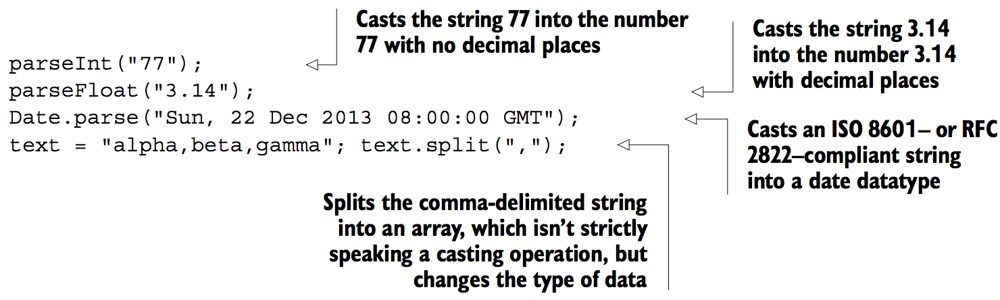
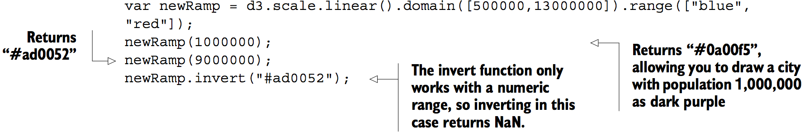
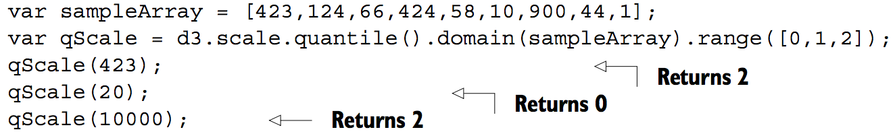

# 2.Information visualization data flow
## Working with data
### Loading data
```js
d3.csv("cities.csv",function(error,data) {console.log(error,data)});
d3.csv("cities.csv",function(d) {console.log(d)});
```

File contents of tweets.json:
```json
{
"tweets": [
{"user": "Al", "content": "I really love seafood.",
   "timestamp": " Mon Dec 23 2013 21:30 GMT-0800 (PST)",
   "retweets": ["Raj","Pris","Roy"], "favorites": ["Sam"]},
{"user": "Al", "content": "I take that back, this doesn't taste so good.",
   "timestamp": "Mon Dec 23 2013 21:55 GMT-0800 (PST)",
   "retweets": ["Roy"], "favorites": []},
{"user": "Al",
   "content": "From now on, I'm only eating cheese sandwiches.",
   "timestamp": "Mon Dec 23 2013 22:22 GMT-0800 (PST)",
   "retweets": [],"favorites": ["Roy","Sam"]},
{"user": "Roy", "content": "Great workout!",
   "timestamp": " Mon Dec 23 2013 7:20 GMT-0800 (PST)",
   "retweets": [],"favorites": []},
{"user": "Roy", "content": "Spectacular oatmeal!",
   "timestamp": " Mon Dec 23 2013 7:23 GMT-0800 (PST)",
   "retweets": [],"favorites": []},
{"user": "Roy", "content": "Amazing traffic!",
   "timestamp": " Mon Dec 23 2013 7:47  GMT-0800 (PST)",
   "retweets": [],"favorites": []},
{"user": "Roy", "content": "Just got a ticket for texting and driving!",
   "timestamp": " Mon Dec 23 2013 8:05 GMT-0800 (PST)",
   "retweets": [],"favorites": ["Sam", "Sally", "Pris"]},
{"user": "Pris", "content": "Going to have some boiled eggs.",
   "timestamp": " Mon Dec 23 2013 18:23 GMT-0800 (PST)",
   "retweets": [],"favorites": ["Sally"]},
{"user": "Pris", "content": "Maybe practice some gymnastics.",
   "timestamp": " Mon Dec 23 2013 19:47  GMT-0800 (PST)",
   "retweets": [],"favorites": ["Sally"]},
{"user": "Sam", "content": "@Roy Let's get lunch",
   "timestamp": " Mon Dec 23 2013 11:05 GMT-0800 (PST)",
   "retweets": ["Pris"], "favorites": ["Sally", "Pris"]}
] }
```

```js
d3.json("tweets.json",function(data) {console.log(data)}); //Prints “Object {tweets: Array[10]}” in the console
```

You can nest the functions operating on the data in the data-loading function:

```js
d3.csv("somefiles.csv", function(data) {doSomethingWithData(data)});
```

### Transforming data
#### CASTING: CHANGING DATATYPES



#### SCALES AND SCALING




#### BINNING: CATEGORIZING DATA



[Fig_01_27.html][7]

```html
```


