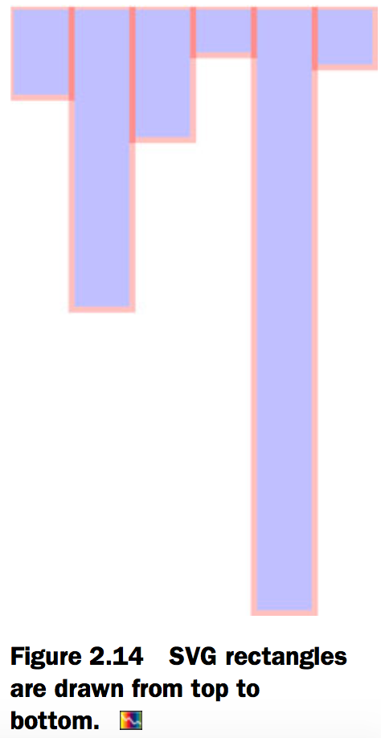
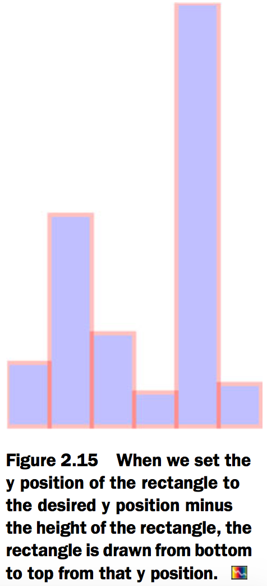
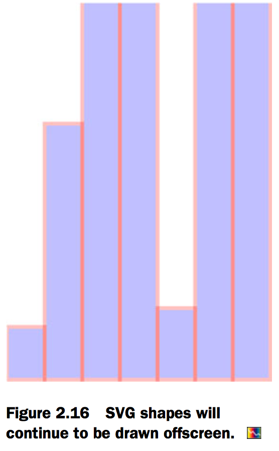
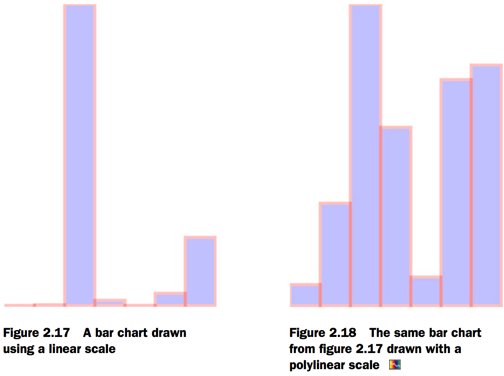
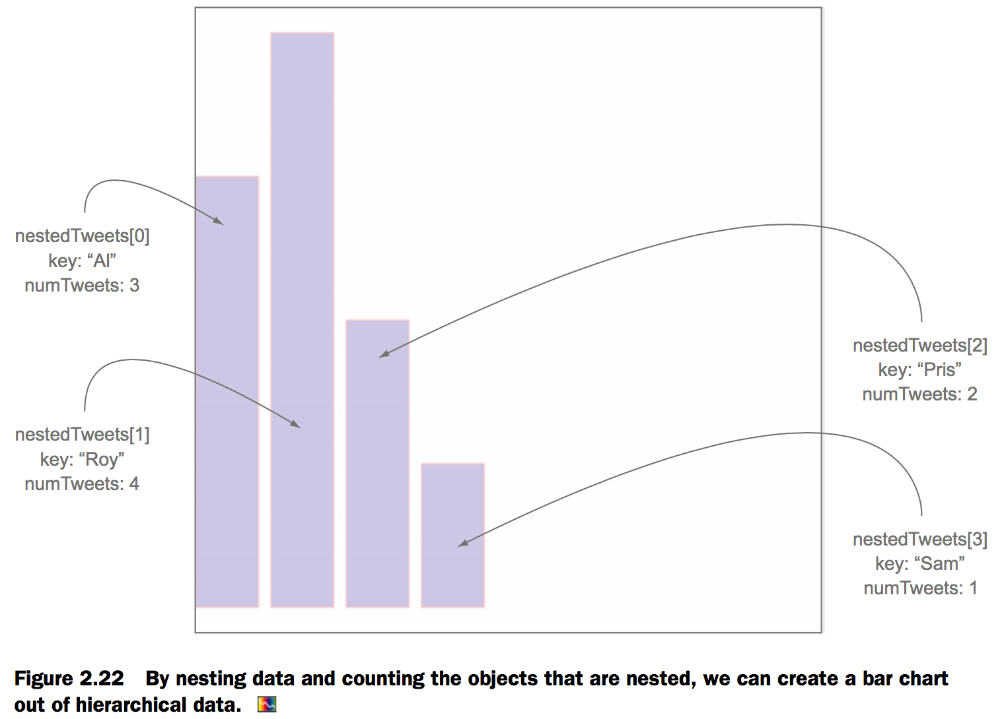
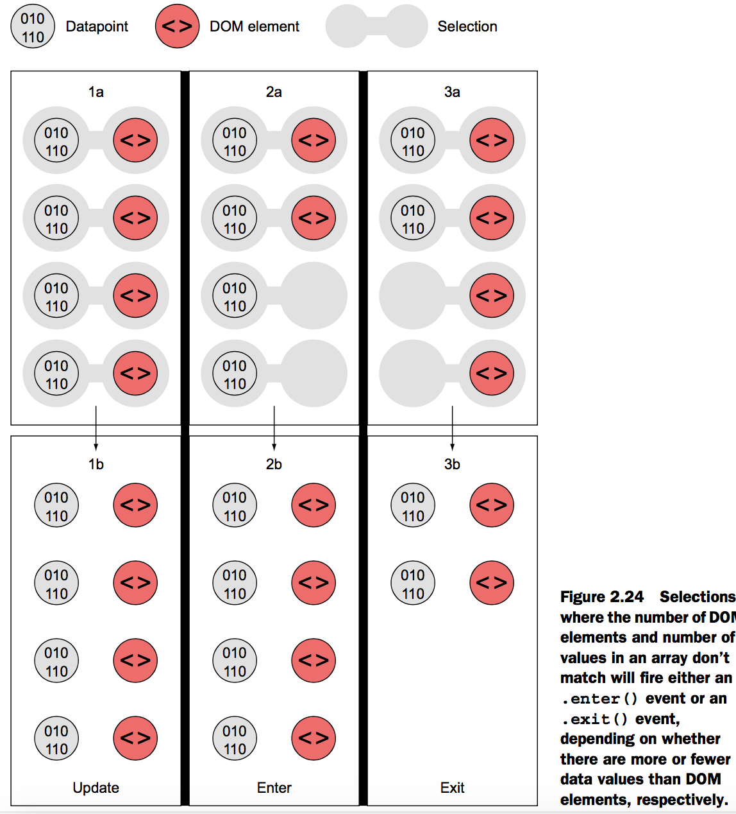
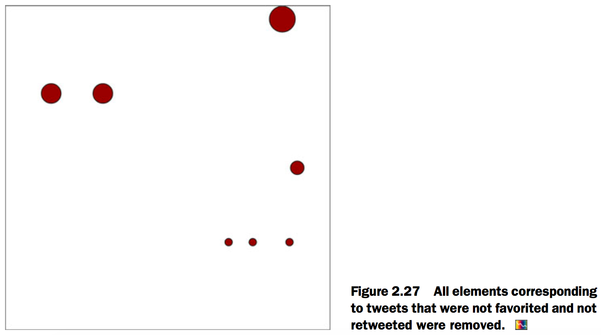

# 2.Information visualization data flow
## Working with data
### Loading data
```js
d3.csv("cities.csv",function(error,data) {console.log(error,data)});
d3.csv("cities.csv",function(d) {console.log(d)});
```

File contents of tweets.json:
```json
{
"tweets": [
{"user": "Al", "content": "I really love seafood.",
   "timestamp": " Mon Dec 23 2013 21:30 GMT-0800 (PST)",
   "retweets": ["Raj","Pris","Roy"], "favorites": ["Sam"]},
{"user": "Al", "content": "I take that back, this doesn't taste so good.",
   "timestamp": "Mon Dec 23 2013 21:55 GMT-0800 (PST)",
   "retweets": ["Roy"], "favorites": []},
{"user": "Al",
   "content": "From now on, I'm only eating cheese sandwiches.",
   "timestamp": "Mon Dec 23 2013 22:22 GMT-0800 (PST)",
   "retweets": [],"favorites": ["Roy","Sam"]},
{"user": "Roy", "content": "Great workout!",
   "timestamp": " Mon Dec 23 2013 7:20 GMT-0800 (PST)",
   "retweets": [],"favorites": []},
{"user": "Roy", "content": "Spectacular oatmeal!",
   "timestamp": " Mon Dec 23 2013 7:23 GMT-0800 (PST)",
   "retweets": [],"favorites": []},
{"user": "Roy", "content": "Amazing traffic!",
   "timestamp": " Mon Dec 23 2013 7:47  GMT-0800 (PST)",
   "retweets": [],"favorites": []},
{"user": "Roy", "content": "Just got a ticket for texting and driving!",
   "timestamp": " Mon Dec 23 2013 8:05 GMT-0800 (PST)",
   "retweets": [],"favorites": ["Sam", "Sally", "Pris"]},
{"user": "Pris", "content": "Going to have some boiled eggs.",
   "timestamp": " Mon Dec 23 2013 18:23 GMT-0800 (PST)",
   "retweets": [],"favorites": ["Sally"]},
{"user": "Pris", "content": "Maybe practice some gymnastics.",
   "timestamp": " Mon Dec 23 2013 19:47  GMT-0800 (PST)",
   "retweets": [],"favorites": ["Sally"]},
{"user": "Sam", "content": "@Roy Let's get lunch",
   "timestamp": " Mon Dec 23 2013 11:05 GMT-0800 (PST)",
   "retweets": ["Pris"], "favorites": ["Sally", "Pris"]}
] }
```

```js
d3.json("tweets.json",function(data) {console.log(data)}); //Prints “Object {tweets: Array[10]}” in the console
```

You can nest the functions operating on the data in the data-loading function:

```js
d3.csv("somefiles.csv", function(data) {doSomethingWithData(data)});
```

### Transforming data
#### CASTING: CHANGING DATATYPES


#### SCALES AND SCALING


#### BINNING: CATEGORIZING DATA


#### NESTING
```js
d3.json("tweets.json",function(data) {
  var tweetData = data.tweets;
  var nestedTweets = d3.nest()
    .key(function(el) {return el.user})
    .entries(tweetData);
});
```

### Measuring data
```js
d3.min(testArray, function (el) {return el}); //Returns the minimum value in the array, 1
d3.max(testArray, function (el) {return el}); //Returns the maximum value in the array, 10000
d3.mean(testArray, function (el) {return el});//Returns the average of values in the array, 1701.8333333333335

d3.csv("cities.csv", function(data) {
d3.min(data, function (el) {return +el.population});//Returns the minimum value of the population attribute of each object in the array,500000
d3.max(data, function (el) {return +el.population });//Returns the maximum value of the population attribute of each object in the array,1300000
d3.mean(data, function (el) {return +el.population });//Returns the average value of the population attribute of each object in the array, 6856250
});

d3.extent(data, function (el) {return +el.population});//Returns[500000, 1300000]
```

## Data-binding
### Selections and binding
[Fig_02_11.html][1]

```html
<html>
<head>
  <title>D3 in Action Chapter 2 - Example 1</title>
  <meta charset="utf-8" />
<script src="d3.v3.min.js" type="text/JavaScript"></script>
</head>
<style>
</style>
<body>
<div>
</div>
</body>

<footer>
<script>
d3.csv("cities.csv",function(error,data) {dataViz(data)});
function dataViz(incomingData) {
d3.select("body").selectAll("div.cities")
.data(incomingData)
.enter()
.append("div")
.attr("class","cities")
.html(function(d,i) {return d.label})
}

</script>
</footer>
</html>
```

- D3.SELECTALL():The first part of any selection is d3.select() or d3.selectAll() with a CSS identifier that corresponds to a part of the DOM. Often no elements match the identifier, which is referred to as an `empty selection`, because you want to create new elements on the page using the .enter() function.
- .DATA():Here you associate an array with the DOM elements you selected.
- .ENTER() AND .EXIT():you trigger the .enter() function, which allows you to define behavior to perform for every value that doesn’t have a corresponding DOM element in the selection. In our case, .enter() fires four times, because no DOM elements correspond to "div.cities" and our incomingData array contains eight values. When there are fewer data elements, then .exit() behavior is triggered, and when there are equal data values and DOM elements in a selection, then neither .exit() nor .enter() is fired.
- .APPEND() AND .INSERT():The .append() function allows you to add more elements and define which elements to add.The .insert() function is a sister function to .append(), but .insert() gives you control over where in the DOM you add the new element.
- .ATTR():In our example, each of our four new <div> elements will be cre- ated with class="cities". Remember that even though our selection referenced "div.cities", we still have to manually declare that we’re creating <div> elements and also manually set their class to "cities".
- .HTML():For traditional DOM elements, you set the content with a .html() function.


### Accessing data with inline functions
[Fig_02_12.html][2]

```html
<html>
<head>
  <title>D3 in Action Chapter 2 - Example 2</title>
  <meta charset="utf-8" />
<script src="d3.v3.min.js" type="text/JavaScript"></script>
</head>
<style>
  svg {
    height: 500px;
    width: 500px;
    border: 1px solid gray;
  }
</style>
<body>

<div>
  <svg>
  </svg>
</div>
</body>

<footer>
<script>
d3.select("svg")
.selectAll("rect")
.data([15, 50, 22, 8, 100, 10])
.enter()
.append("rect")
.attr("width", 10)
.attr("height", function(d) {return d})
</script>
</footer>
</html>

```


[Fig_02_13.html][3]

```html
<html>
<head>
  <title>D3 in Action Chapter 2 - Example 2</title>
  <meta charset="utf-8" />
<script src="d3.v3.min.js" type="text/JavaScript"></script>
</head>
<style>
  svg {
    height: 500px;
    width: 500px;
    border: 1px solid gray;
  }
</style>
<body>

<div>
  <svg>
  </svg>
</div>
</body>
<footer>
<script>
d3.select("svg")
.selectAll("rect")
.data([15, 50, 22, 8, 100, 10])
.enter()
.append("rect")
.attr("width", 10)
.attr("height", function(d) {return d})
.style("fill", "blue")
.style("stroke", "red")
.style("stroke-width", "1px")
.style("opacity", .25)
</script>
</footer>
</html>
```


[Fig_02_14.html][4]

```html
<html>
<head>
  <title>D3 in Action Chapter 2 - Example 4</title>
  <meta charset="utf-8" />
<script src="d3.v3.min.js" type="text/JavaScript"></script>
</head>
<style>
  svg {
    height: 500px;
    width: 500px;
    border: 1px solid gray;
  }
</style>
<body>

<div>
  <svg>
  </svg>
</div>
</body>
<footer>
<script>
d3.select("svg")
.selectAll("rect")
.data([15, 50, 22, 8, 100, 10])
.enter()
.append("rect")
.attr("width", 10)
.attr("height", function(d) {return d})
.style("fill", "blue")
.style("stroke", "red")
.style("stroke-width", "1px")
.style("opacity", .25)
.attr("x", function(d,i) {return i * 10}) //指定不同的x
</script>
</footer>
</html>
```



[Fig_02_15.html][5]

```html
<html>
<head>
  <title>D3 in Action Chapter 2 - Example 5</title>
  <meta charset="utf-8" />
<script src="d3.v3.min.js" type="text/JavaScript"></script>
</head>
<style>
  svg {
    height: 500px;
    width: 500px;
    border: 1px solid gray;
  }
</style>
<body>

<div>
  <svg>
  </svg>
</div>
</body>

<footer>
<script>
d3.select("svg")
.selectAll("rect")
.data([15, 50, 22, 8, 100, 10])
.enter()
.append("rect")
.attr("width", 10)
.attr("height", function(d) {return d})
.style("fill", "blue")
.style("stroke", "red")
.style("stroke-width", "1px")
.style("opacity", .25)
.attr("x", function(d,i) {return i * 10})
.attr("y", function(d) {return 100 - d})
</script>
</footer>
</html>
```



### Integrating scales
[Fig_02_16.html][6]

```html
<html>
<head>
  <title>D3 in Action Chapter 2 - Example 6</title>
  <meta charset="utf-8" />
<script src="d3.v3.min.js" type="text/JavaScript"></script>
</head>
<style>
  svg {
    height: 500px;
    width: 500px;
    border: 1px solid gray;
  }
</style>
<body>

<div>
  <svg>
  </svg>
</div>
</body>
<footer>
<script>
d3.select("svg")
.selectAll("rect")
.data([14, 68, 24500, 430, 19, 1000, 5555])
.enter()
.append("rect")
.attr("width", 10)
.attr("height", function(d) {return d})
.style("fill", "blue")
.style("stroke", "red")
.style("stroke-width", "1px")
.style("opacity", .25)
.attr("x", function(d,i) {return i * 10})
.attr("y", function(d) {return 100 - d})
</script>
</footer>
</html>

```



[Fig_02_17.html][7]

```html
<html>
<head>
  <title>D3 in Action Chapter 2 - Example 7</title>
  <meta charset="utf-8" />
<script src="d3.v3.min.js" type="text/JavaScript"></script>
</head>
<style>
  svg {
    height: 500px;
    width: 500px;
    border: 1px solid gray;
  }
</style>
<body>

<div>
  <svg>
  </svg>
</div>
</body>
  <footer>

<script>
  var yScale = d3.scale.linear().domain([0,24500]).range([0,100]);

d3.select("svg")
.selectAll("rect")
.data([14, 68, 24500, 430, 19, 1000, 5555])
.enter()
.append("rect")
.attr("width", 10)
.attr("height", function(d) {return yScale(d)})
.style("fill", "blue")
.style("stroke", "red")
.style("stroke-width", "1px")
.style("opacity", .25)
.attr("x", function(d,i) {return i * 10})
.attr("y", function(d) {return 100 - yScale(d)});

</script>
  </footer>

</html>

```

[Fig_02_18.html][8]

```html
<html>
<head>
  <title>D3 in Action Chapter 2 - Example 7</title>
  <meta charset="utf-8" />
<script src="d3.v3.min.js" type="text/JavaScript"></script>
</head>
<style>
  svg {
    height: 500px;
    width: 500px;
    border: 1px solid gray;
  }
</style>
<body>

<div>
  <svg>
  </svg>
</div>
</body>
  <footer>

<script>
  var yScale = d3.scale.linear().domain([0,100,1000,24500]).range([0,50,75,100]);

d3.select("svg")
.selectAll("rect")
.data([14, 68, 24500, 430, 19, 1000, 5555])
.enter()
.append("rect")
.attr("width", 10)
.attr("height", function(d) {return yScale(d)})
.style("fill", "blue")
.style("stroke", "red")
.style("stroke-width", "1px")
.style("opacity", .25)
.attr("x", function(d,i) {return i * 10})
.attr("y", function(d) {return 100 - yScale(d)});

</script>
  </footer>

</html>
```



## Data presentation style, attributes, and content
### Visualization from loaded data
A bar chart based on the cities.csv data is straightforward, requiring only a scale based on the maximum population value, which we can determine using d3.max(), as shown in the following listing.

[Fig_02_21.html][9]

```html
<html>
<head>
  <title>D3 in Action Chapter 2 - Example 9</title>
  <meta charset="utf-8" />
<script src="d3.v3.min.js" type="text/JavaScript"></script>
</head>
<style>
  svg {
    height: 500px;
    width: 500px;
    border: 1px solid gray;
  }
</style>
<body>

<div>
  <svg>
  </svg>
</div>
</body>
<footer>
<script>
d3.csv("cities.csv",function(error,data) {dataViz(data)});
function dataViz(incomingData) {
maxPopulation = d3.max(incomingData,
function(el) {return parseInt(el.population)}
);
var yScale = d3.scale.linear().domain([0,maxPopulation]).range([0,460]);

d3.select("svg")
.selectAll("rect")
.data(incomingData)
.enter()
.append("rect")
.attr("width", 50)
.attr("height", function(d) {return yScale(parseInt(d.population))})
.attr("x", function(d,i) {return i * 60})
.attr("y", function(d) {return 480 - yScale(parseInt(d.population))})
.style("fill", "blue")
.style("stroke", "red")
.style("stroke-width", "1px")
.style("opacity", .25)
}
</script>
</footer>
</html>
```


We use d3.nest() to gather the tweets under the person making them, and then use the length of that array to create a bar chart of the number of tweets (shown annotated in figure 2.22).

[Fig_02_22.html][10]

```html
<html>
<head>
  <title>D3 in Action Chapter 2 - Example 10</title>
  <meta charset="utf-8" />
<script src="d3.v3.min.js" type="text/JavaScript"></script>
</head>
<style>
  svg {
    height: 500px;
    width: 500px;
    border: 1px solid gray;
  }
</style>
<body>

<div>
  <svg>
  </svg>
</div>
</body>
  <footer>

<script>

	d3.json("tweets.json", function(error, data) {
		dataViz(data.tweets)
	});
	function dataViz(incomingData) {
		var nestedTweets = d3.nest().key(function(el) {
			return el.user;
		}).entries(incomingData);
		nestedTweets.forEach(function(el) {
			el.numTweets = el.values.length;
		})
		var maxTweets = d3.max(nestedTweets, function(el) {
			return el.numTweets;
		});
		var yScale = d3.scale.linear().domain([ 0, maxTweets ]).range([ 0, 500 ]);
		d3.select("svg").selectAll("rect").data(nestedTweets).enter().append("rect").attr("width", 50).attr("height", function(d) {
			return yScale(d.numTweets);
		}).attr("x", function(d, i) {
			return i * 60;
		}).attr("y", function(d) {
			return 500 - yScale(d.numTweets);
		}).style("fill", "blue").style("stroke", "red").style("stroke-width", "1px").style("opacity", .25);
	}
</script>
  </footer>

</html>
```



### Setting channels
The technical term for how a shape visually expresses data is `channel`, and depending on the data you’re working with, different channels are better suited to express data graphically.

This time, instead of a bar chart, we’ll create a scatterplot, and instead of using array position to place it along the x-axis, let’s use time, because there’s good evidence that tweets made at certain times are more likely to be favorited or retweeted. We’ll place each tweet along the y-axis using a scale based on the maxi- mum impact factor of our set of tweets.

[Fig_02_23.html][11]

```html
<html>
<head>
  <title>D3 in Action Chapter 2 - Example 11</title>
  <meta charset="utf-8" />
<script src="d3.v3.min.js" type="text/JavaScript"></script>
</head>
<style>
  svg {
    height: 500px;
    width: 500px;
    border: 1px solid gray;
  }
</style>
<body>

<div>
  <svg>
  </svg>
</div>
</body>
<footer>
<script>
d3.json("tweets.json",function(error,data) {dataViz(data.tweets)});

function dataViz(incomingData) {

incomingData.forEach(function (el) {
el.impact = el.favorites.length + el.retweets.length
el.tweetTime = new Date(el.timestamp);
})

var maxImpact = d3.max(incomingData, function(el) {return el.impact});
var startEnd = d3.extent(incomingData, function(el) {return el.tweetTime});
var timeRamp = d3.time.scale().domain(startEnd).range([20,480]);
var yScale = d3.scale.linear().domain([0,maxImpact]).range([0,460]);
var radiusScale = d3.scale.linear().domain([0,maxImpact]).range([1,20]);
var colorScale = d3.scale.linear().domain([0,maxImpact]).range(["white","#990000"]);

d3.select("svg")
.selectAll("circle")
.data(incomingData)
.enter()
.append("circle")
.attr("r", function(d) {return radiusScale(d.impact)})
.attr("cx", function(d,i) {return timeRamp(d.tweetTime)})
.attr("cy", function(d) {return 480 - yScale(d.impact)})
.style("fill", function(d) {return colorScale(d.impact)})
.style("stroke", "black")
.style("stroke-width", "1px")
}
</script>
</footer>
</html>

```


### Enter, update, and exit


For example, let’s say we want to show a bar chart based on our newly measured impact score, and we want the bars on the bar chart to have labels. We need to append `<g>` elements, and not shapes, to the `<svg>` canvas in our initial selection. Because the data is bound to these elements, we can use the same syntax when we add child elements. Because we’re using `<g>` elements, we need to set the position using the transform attribute. We add child elements to the .append() function, and we need to declare it as a variable tweetG. This allows tweetG to stand in for d3.select("svg").selectAll("g") so we don’t have to retype it throughout the example. The following listing uses all the same scales to determine size and position as the previous example.

[Fig_02_25.html][12]

```html
<html>
<head>
  <title>D3 in Action Chapter 2 - Example 12</title>
  <meta charset="utf-8" />
<script src="d3.v3.min.js" type="text/JavaScript"></script>
</head>
<style>
  svg {
    height: 500px;
    width: 500px;
    border: 1px solid gray;
  }
</style>
<body>

<div>
  <svg>
  </svg>
</div>
</body>
<footer>
<script>
d3.json("tweets.json",function(error,data) {dataViz(data.tweets)});

function dataViz(incomingData) {

incomingData.forEach(function (el) {
el.impact = el.favorites.length + el.retweets.length
el.tweetTime = new Date(el.timestamp);
})

var maxImpact = d3.max(incomingData, function(el) {return el.impact});
var startEnd = d3.extent(incomingData, function(el) {return el.tweetTime});
var timeRamp = d3.time.scale().domain(startEnd).range([20,480]);
var yScale = d3.scale.linear().domain([0,maxImpact]).range([0,460]);
var radiusScale = d3.scale.linear().domain([0,maxImpact]).range([1,20]);
var colorScale = d3.scale.linear().domain([0,maxImpact]).range(["white","#990000"]);

d3.select("svg")
.selectAll("circle")
.data(incomingData)
.enter()
.append("circle")
.attr("r", function(d) {return radiusScale(d.impact)})
.attr("cx", function(d,i) {return timeRamp(d.tweetTime)})
.attr("cy", function(d) {return 480 - yScale(d.impact)})
.style("fill", function(d) {return colorScale(d.impact)})
.style("stroke", "black")
.style("stroke-width", "1px");

var tweetG = d3.select("svg")
.selectAll("g")
.data(incomingData)
.enter()
.append("g")
.attr("transform", function(d) {
return "translate(" +
timeRamp(d.tweetTime) + "," + (480 - yScale(d.impact))
+ ")"
})

tweetG.append("circle")
.attr("r", function(d) {return radiusScale(d.impact)})
.style("fill", "#990000")
.style("stroke", "black")
.style("stroke-width", "1px")

tweetG.append("text")
.text(function(d) {return d.user + "-" + d.tweetTime.getHours()});

}
</script>
</footer>
</html>
```


[Fig_02_27.html][13]

```html
<html>
<head>
  <title>D3 in Action Chapter 2 - Example 13</title>
  <meta charset="utf-8" />
<script src="d3.v3.min.js" type="text/JavaScript"></script>
</head>
<style>
  svg {
    height: 500px;
    width: 500px;
    border: 1px solid gray;
  }
</style>
<body>

<div>
  <svg>
  </svg>
</div>
</body>
<footer>
<script>
d3.json("tweets.json",function(error,data) {dataViz(data.tweets)});

function dataViz(incomingData) {

incomingData.forEach(function (el) {
el.impact = el.favorites.length + el.retweets.length
el.tweetTime = new Date(el.timestamp);
})

var maxImpact = d3.max(incomingData, function(el) {return el.impact});
var startEnd = d3.extent(incomingData, function(el) {return el.tweetTime});
var timeRamp = d3.time.scale().domain(startEnd).range([50,450]);
var yScale = d3.scale.linear().domain([0,maxImpact]).range([0,460]);
var radiusScale = d3.scale.linear().domain([0,maxImpact]).range([1,20]);

d3.select("svg")
.selectAll("circle")
.data(incomingData, function(d) {return JSON.stringify(d)})
.enter()
.append("circle")
.attr("r", function(d) {return radiusScale(d.impact)})
.attr("cx", function(d,i) {return timeRamp(d.tweetTime)})
.attr("cy", function(d) {return 480 - yScale(d.impact)})
.style("fill", "#990000")
.style("stroke", "black")
.style("stroke-width", "1px");

var filteredData = incomingData.filter(
function(el) {return el.impact > 0}
);

d3.selectAll("circle")
.data(filteredData, function(d) {return JSON.stringify(d)})
.exit()
.remove();
}
</script>
</footer>
</html>
```

- The key requires a string or number, so if you pass a JSON object without using JSON.stringify, it treats all objects as "[object object]" and only returns one unique value.
- The visual results are the same as our earlier scatterplot with the same settings, but now if we filter the array we used for the data, and bind that to the selection, we can get to the state shown in figure 2.27 by defining some useful .exit() behavior.



[1]: Fig_02_11.html
[2]: Fig_02_12.html
[3]: Fig_02_13.html
[4]: Fig_02_14.html
[5]: Fig_02_15.html
[6]: Fig_02_16.html
[7]: Fig_02_17.html
[8]: Fig_02_18.html
[9]: Fig_02_21.html
[10]: Fig_02_22.html
[11]: Fig_02_23.html
[12]: Fig_02_25.html
[13]: Fig_02_27.html
