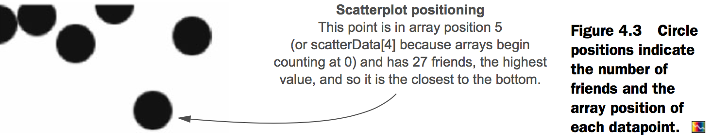
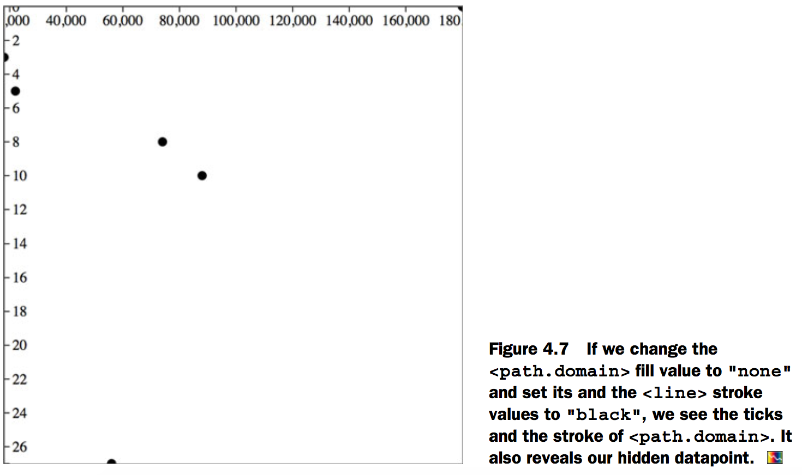
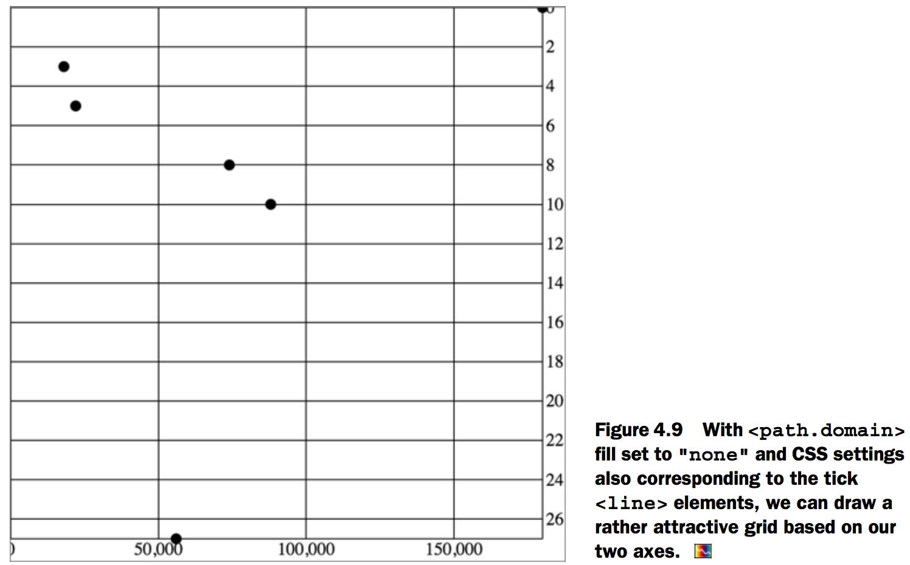
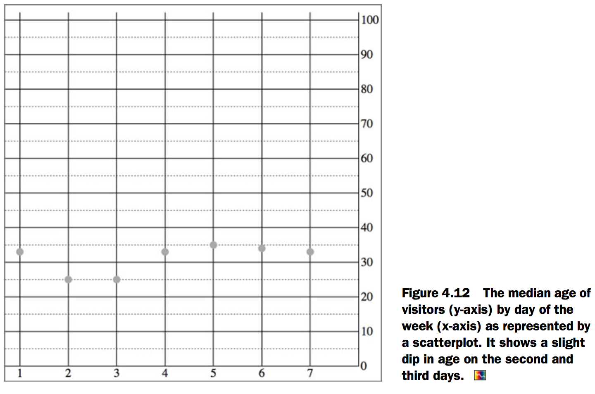
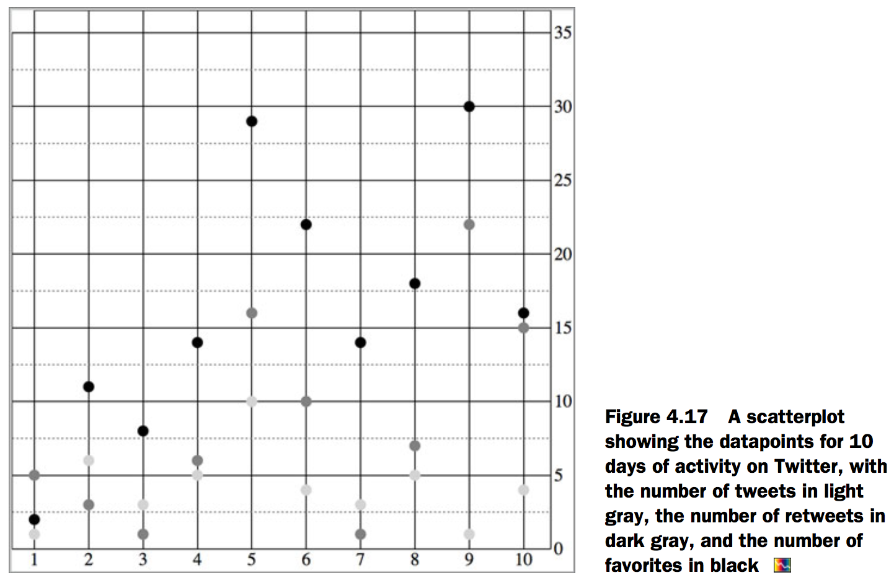
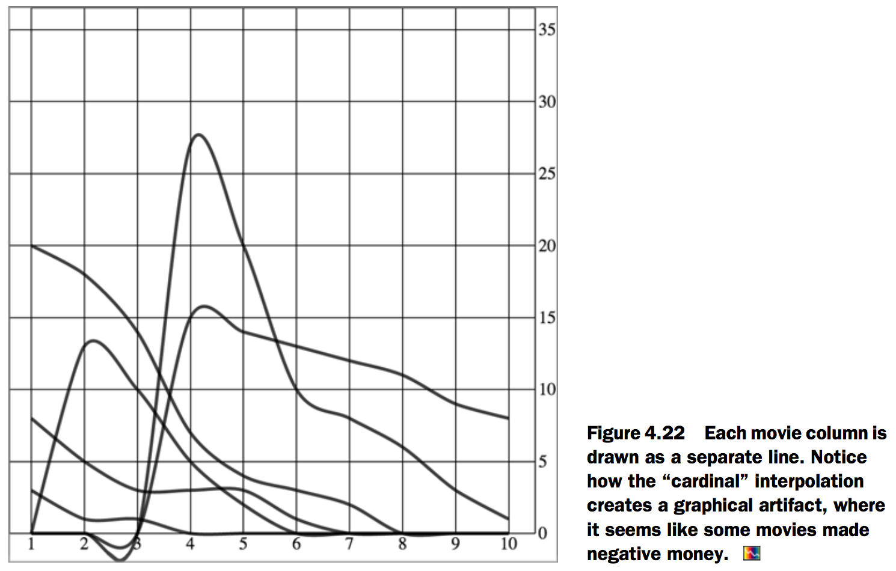
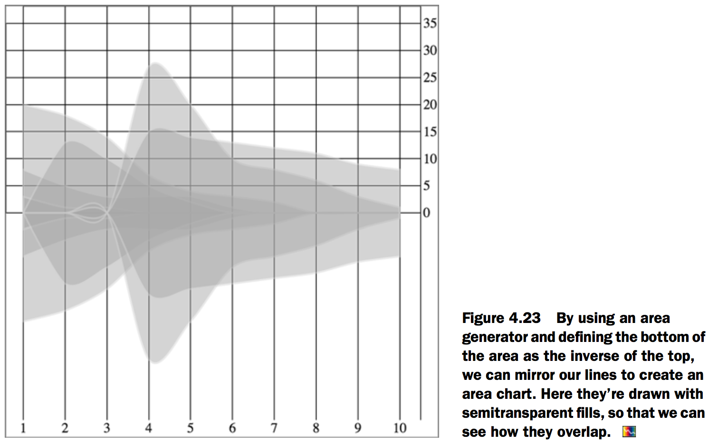
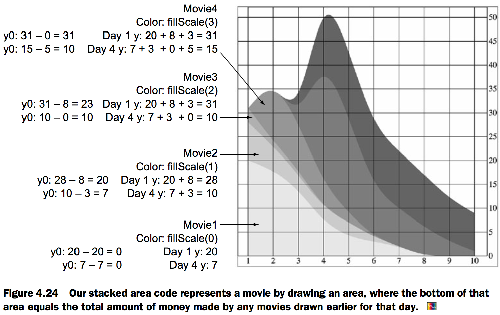
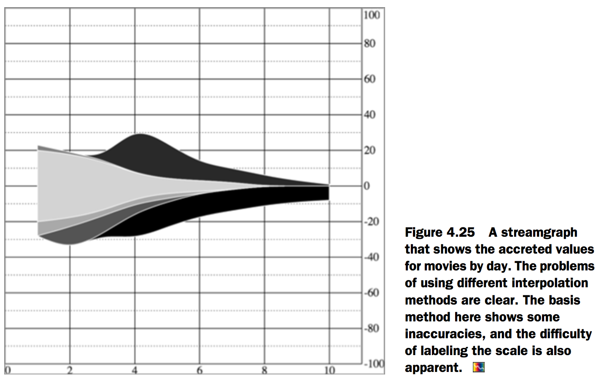

# 4.Chart components
## Creating an axis
### Plotting data
[Fig_04_03.html][1]

```html
<html>
<head>
  <title>D3 in Action Chapter 4 - Example 1</title>
  <meta charset="utf-8" />
<script src="d3.v3.min.js" type="text/JavaScript"></script>
<script src="colorbrewer.js" type="text/JavaScript"></script>
</head>
<style>
  svg {
    height: 500px;
    width: 500px;
    border: 1px solid gray;
  }

</style>
<body>

<div id="viz">
  <svg>
  </svg>
</div>
<div id="controls" />
</body>
  <footer>

<script>
var scatterData = [{friends: 5, salary: 22000}, {friends: 3, salary: 18000}, {friends: 10, salary: 88000}, {friends: 0, salary: 180000}, {friends: 27, salary: 56000}, {friends: 8, salary: 74000}]

d3.select("svg")
.selectAll("circle")
.data(scatterData)
.enter()
.append("circle")
.attr("r", 5)
.attr("cx", function(d,i) {return i * 10})
.attr("cy", function(d) {return d.friends});

</script>
  </footer>

</html>
```



Next, we need to build scales to make this fit better on our SVG canvas:

[Fig_04_04.html][2]

```html
<html>
<head>
  <title>D3 in Action Chapter 4 - Example 2</title>
  <meta charset="utf-8" />
<script src="d3.v3.min.js" type="text/JavaScript"></script>
<script src="colorbrewer.js" type="text/JavaScript"></script>
</head>
<style>
  svg {
    height: 500px;
    width: 500px;
    border: 1px solid gray;
  }

</style>
<body>

<div id="viz">
  <svg>
  </svg>
</div>
<div id="controls" />
</body>
  <footer>

<script>
var scatterData = [{friends: 5, salary: 22000}, {friends: 3, salary: 18000}, {friends: 10, salary: 88000}, {friends: 0, salary: 180000}, {friends: 27, salary: 56000}, {friends: 8, salary: 74000}]

xExtent = d3.extent(scatterData, function(d) {return d.salary});
yExtent = d3.extent(scatterData, function(d) {return d.friends});
xScale = d3.scale.linear().domain(xExtent).range([0,500]);
yScale = d3.scale.linear().domain(yExtent).range([0,500]);

d3.select("svg")
.selectAll("circle")
.data(scatterData)
.enter()
.append("circle")
.attr("r", 5)
.attr("cx", function(d) {return xScale(d.salary)})
.attr("cy", function(d) {return yScale(d.friends)})

</script>
</footer>
</html>
```


we can draw the axis via a selection’s .call() method from a selection on a `<g>` element where we want these graphical elements to be drawn.

[Fig_04_05.html][3]

```html
<html>
<head>
  <title>D3 in Action Chapter 4 - Example 3</title>
  <meta charset="utf-8" />
<script src="d3.v3.min.js" type="text/JavaScript"></script>
<script src="colorbrewer.js" type="text/JavaScript"></script>
</head>
<style>
  svg {
    height: 500px;
    width: 500px;
    border: 1px solid gray;
  }

</style>
<body>

<div id="viz">
  <svg>
  </svg>
</div>
<div id="controls" />
</body>
  <footer>

<script>
var scatterData = [{friends: 5, salary: 22000}, {friends: 3, salary: 18000}, {friends: 10, salary: 88000}, {friends: 0, salary: 180000}, {friends: 27, salary: 56000}, {friends: 8, salary: 74000}]

xExtent = d3.extent(scatterData, function(d) {return d.salary});
yExtent = d3.extent(scatterData, function(d) {return d.friends});
xScale = d3.scale.linear().domain(xExtent).range([0,500]);
yScale = d3.scale.linear().domain(yExtent).range([0,500]);

d3.select("svg")
.selectAll("circle")
.data(scatterData)
.enter()
.append("circle")
.attr("r", 5)
.attr("cx", function(d) {return xScale(d.salary)})
.attr("cy", function(d) {return yScale(d.friends)})

yAxis = d3.svg.axis().scale(yScale).orient("right");
d3.select("svg").append("g").attr("id", "yAxisG").call(yAxis);
xAxis = d3.svg.axis().scale(xScale).orient("bottom");
d3.select("svg").append("g").attr("id", "xAxisG").call(xAxis);

</script>
</footer>
</html>
```


### Styling axes
[Fig_04_07.html][4]

```html
<html>
<head>
  <title>D3 in Action Chapter 4 - Example 4</title>
  <meta charset="utf-8" />
<script src="d3.v3.min.js" type="text/JavaScript"></script>
<script src="colorbrewer.js" type="text/JavaScript"></script>
</head>
<style>
  svg {
    height: 500px;
    width: 500px;
    border: 1px solid gray;
  }

</style>
<body>

<div id="viz">
  <svg>
  </svg>
</div>
<div id="controls" />
</body>
  <footer>

<script>
var scatterData = [{friends: 5, salary: 22000}, {friends: 3, salary: 18000}, {friends: 10, salary: 88000}, {friends: 0, salary: 180000}, {friends: 27, salary: 56000}, {friends: 8, salary: 74000}]

xExtent = d3.extent(scatterData, function(d) {return d.salary});
yExtent = d3.extent(scatterData, function(d) {return d.friends});
xScale = d3.scale.linear().domain(xExtent).range([0,500]);
yScale = d3.scale.linear().domain(yExtent).range([0,500]);

d3.select("svg")
.selectAll("circle")
.data(scatterData)
.enter()
.append("circle")
.attr("r", 5)
.attr("cx", function(d) {return xScale(d.salary)})
.attr("cy", function(d) {return yScale(d.friends)})

yAxis = d3.svg.axis().scale(yScale).orient("right");
d3.select("svg").append("g").attr("id", "yAxisG").call(yAxis);
xAxis = d3.svg.axis().scale(xScale).orient("bottom");
d3.select("svg").append("g").attr("id", "xAxisG").call(xAxis);

d3.selectAll("path.domain").style("fill", "none").style("stroke", "black");
d3.selectAll("line").style("stroke", "black");

</script>
  </footer>

</html>
```




[Fig_04_09.html][5]

```html
<html>
<head>
  <title>D3 in Action Chapter 4 - Example 5</title>
  <meta charset="utf-8" />
<script src="d3.v3.min.js" type="text/JavaScript"></script>
<script src="colorbrewer.js" type="text/JavaScript"></script>
</head>
<style>
  svg {
    height: 500px;
    width: 500px;
    border: 1px solid gray;
  }
line {
  shape-rendering: crispEdges;
  stroke: #000000;
  }

line.minor  {
  stroke: #777777;
  stroke-dasharray: 2,2;
}

path.domain {
  fill: none;
  stroke: black;
}

</style>
<body>

<div id="viz">
  <svg>
  </svg>
</div>
<div id="controls" />
</body>
  <footer>

<script>
var scatterData = [{friends: 5, salary: 22000}, {friends: 3, salary: 18000}, {friends: 10, salary: 88000}, {friends: 0, salary: 180000}, {friends: 27, salary: 56000}, {friends: 8, salary: 74000}]

xScale = d3.scale.linear().domain([0,180000]).range([0,480]);
yScale = d3.scale.linear().domain([0,27]).range([0,480]);

xAxis = d3.svg.axis().scale(xScale).orient("bottom").tickSize(480).ticks(4);
d3.select("svg").append("g").attr("id", "xAxisG").call(xAxis);

yAxis = d3.svg.axis().scale(yScale).orient("right").ticks(10).tickSize(480).tickSubdivide(10);

d3.select("svg").append("g").attr("id", "yAxisG").call(yAxis);

d3.select("svg").selectAll("circle").data(scatterData).enter().append("circle").attr("r", 5)
.attr("cx", function(d) {return xScale(d.salary)}).attr("cy", function(d) {return yScale(d.friends)})
</script>
</footer>
</html>
```



## Complex graphical objects
[Fig_04_12.html][6]

```html

```




[Fig_04_14.html][7]

```html

```


[Fig_04_16.html][8]

```html

```


[Fig_04_17.html][9]

```html

```




[Fig_04_19.html][10]

```html

```


[Fig_04_20.html][11]

```html

```


[Fig_04_22.html][12]

```html

```




[Fig_04_23.html][13]

```html

```




[Fig_04_24.html][14]

```html

```




[Fig_04_25.html][15]

```html

```



[1]: Fig_04_03.html
[2]: Fig_04_04.html
[3]: Fig_04_05.html
[4]: Fig_04_07.html
[5]: Fig_04_09.html
[6]: Fig_04_12.html
[7]: Fig_04_14.html
[8]: Fig_04_16.html
[9]: Fig_04_17.html
[10]: Fig_04_19.html
[11]: Fig_04_20.html
[12]: Fig_04_22.html
[13]: Fig_04_23.html
[14]: Fig_04_24.html
[15]: Fig_04_25.html
