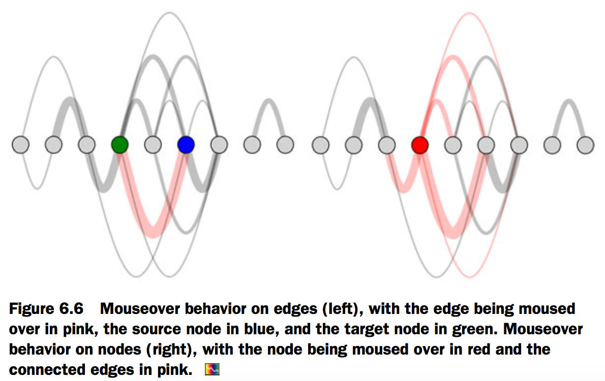
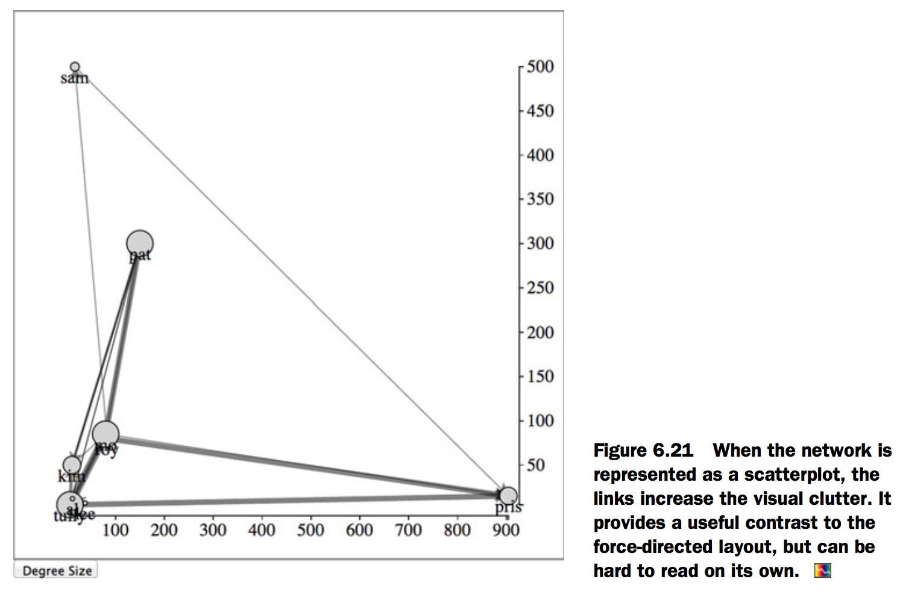

# 6.Network visualization
## Static network diagrams

[Fig_06_04.html][1]

```html
<html>
<head>
  <title>D3 in Action Chapter 6 - Example 1</title>
  <meta charset="utf-8" />
<script src="d3.v3.min.js" type="text/JavaScript"></script>
<script src="colorbrewer.js" type="text/JavaScript"></script>
<script src="queue.js" type="text/JavaScript"></script>
</head>
<style>
  svg {
    height: 500px;
    width: 500px;
    border: 1px solid gray;
  }

</style>
<body>

<div id="viz">
  <svg>
  </svg>
</div>
<div id="controls" />
</body>
  <footer>

<script>
    queue()//We need to load two datasets before we can get started, and queue lets us move the asynchronous loaders into a synchronous format.
    .defer(d3.csv, "nodelist.csv")
    .defer(d3.csv, "edgelist.csv")
    .await(function(error, file1, file2) { createAdjacencyMatrix(file1, file2); });

    function createAdjacencyMatrix(nodes,edges) {
      var edgeHash = {};//A hash allows us to test if a source-target pair has a link.
      for (x in edges) {
        var id = edges[x].source + "-" + edges[x].target;
        edgeHash[id] = edges[x];
      }
      matrix = [];
      //create all possible edges
      for (a in nodes) {
        for (b in nodes) {//Creates all possible source-target connections
          var grid = {id: nodes[a].id + "-" + nodes[b].id, x: b, y: a, weight: 0};//Sets the xy coordinates based on the source-target array positions
          if (edgeHash[grid.id]) {
            grid.weight = edgeHash[grid.id].weight;//If there’s a corresponding edge in our edge list, give it that weight.
          }
          matrix.push(grid);
        }
      }

      d3.select("svg")
      .append("g")
      .attr("transform", "translate(50,50)")
      .attr("id", "adjacencyG")
      .selectAll("rect")
      .data(matrix)
      .enter()
      .append("rect")
      .attr("width", 25)
      .attr("height", 25)
      .attr("x", function (d) {return d.x * 25})
      .attr("y", function (d) {return d.y * 25})
      .style("stroke", "black")
      .style("stroke-width", "1px")
      .style("fill", "red")
      .style("fill-opacity", function (d) {return d.weight * .2})
      .on("mouseover", gridOver)

      var scaleSize = nodes.length * 25;
      var nameScale = d3.scale.ordinal()
      .domain(nodes.map(function (el) {return el.id}))//Creates an ordinal scale from the node IDs
      .rangePoints([0,scaleSize],1);//Used for ordinal values

      xAxis = d3.svg.axis().scale(nameScale).orient("top").tickSize(4); //Both axes use the same scale.
      yAxis = d3.svg.axis().scale(nameScale).orient("left").tickSize(4);
      d3.select("#adjacencyG").append("g").call(xAxis).selectAll("text").style("text-anchor", "end").attr("transform", "translate(-10,-10) rotate(90)");//Rotates the text on the y-axis
      d3.select("#adjacencyG").append("g").call(yAxis);

      function gridOver(d,i) {
        d3.selectAll("rect").style("stroke-width", function (p) {return p.x == d.x || p.y == d.y ? "3px" : "1px"})
      }
    }
</script>
</footer>
</html>
```


## Force-directed layout
[Fig_06_06.html][2]

```html
<html>
<head>
  <title>D3 in Action Chapter 6 - Example 2</title>
  <meta charset="utf-8" />
<script src="d3.v3.min.js" type="text/JavaScript"></script>
<script src="colorbrewer.js" type="text/JavaScript"></script>
<script src="queue.js" type="text/JavaScript"></script>
</head>
<style>
  svg {
    height: 500px;
    width: 500px;
    border: 1px solid gray;
  }

</style>
<body>

<div id="viz">
  <svg>
  </svg>
</div>
<div id="controls" />
</body>
  <footer>

<script>
    queue()
    .defer(d3.csv, "nodelist.csv")
    .defer(d3.csv, "edgelist.csv")
    .await(function(error, file1, file2) { createArcDiagram(file1, file2); });
    function createArcDiagram(nodes,edges) {

      var nodeHash = {};
      for (x in nodes) {
        nodeHash[nodes[x].id] = nodes[x];
        nodes[x].x = parseInt(x) * 40;
      }
      for (x in edges) {
        edges[x].weight = parseInt(edges[x].weight);
        edges[x].source = nodeHash[edges[x].source];
        edges[x].target = nodeHash[edges[x].target];
      }

      linkScale = d3.scale.linear().domain(d3.extent(edges, function (d) {return d.weight})).range([5,10])

      var arcG = d3.select("svg").append("g").attr("id", "arcG").attr("transform", "translate(50,250)");

      arcG.selectAll("path")
      .data(edges)
      .enter()
      .append("path")
      .style("stroke", "black")
      .style("stroke-width", function(d) {return d.weight * 2})
      .style("opacity", .25)
      .style("fill", "none")
      .attr("d", arc)
      .on("mouseover", edgeOver)

      arcG.selectAll("circle")
      .data(nodes)
      .enter()
      .append("circle")
      .attr("r", 10)
      .style("fill", "lightgray")
      .style("stroke", "black")
      .style("stroke-width", "1px")
      .attr("cx", function (d) {return d.x})
      .on("mouseover", nodeOver)

      function arc(d,i) {
        var draw = d3.svg.line().interpolate("basis");
        var midX = (d.source.x + d.target.x) / 2;
        var midY = (d.source.x - d.target.x) * 2;
        return draw([[d.source.x,0],[midX,midY],[d.target.x,0]])
      }

      function shapedEdge(d,i) {
        var draw = d3.svg.line().interpolate("basis");
        var sw = linkScale(d.weight)
        var midX = (d.source.x + d.target.x) / 2;
        var midY = d.source.x - d.target.x - sw;
        var midY2 = d.source.x - d.target.x + sw;
        return draw([[d.source.x,0],[midX,midY],[d.target.x + (sw*1.5),0],[d.target.x - (sw*1.5),0],[midX,midY2],[d.source.x,0]])
      }

      function nodeOver(d,i) {
        d3.selectAll("circle").style("fill", function (p) {return p == d ? "red" : "lightgray"})
        d3.selectAll("path").style("stroke", function (p) {return p.source == d || p.target == d ? "red" : "black"})
      }

      function edgeOver(d) {
        d3.selectAll("path").style("stroke", function(p) {return p == d ? "red" : "black"})
        d3.selectAll("circle").style("fill", function(p) {return p == d.source ? "blue" : p == d.target ? "green" : "lightgray"})}
    }
</script>
</footer>
</html>
```



[Fig_06_08.html][3]

```html
<html>
<head>
  <title>D3 in Action Chapter 6 - Example 3</title>
  <meta charset="utf-8" />
<script src="d3.v3.min.js" type="text/JavaScript"></script>
<script src="colorbrewer.js" type="text/JavaScript"></script>
<script src="queue.js" type="text/JavaScript"></script>
</head>
<style>
  svg {
    height: 500px;
    width: 500px;
    border: 1px solid gray;
  }

</style>
<body>

<div id="viz">
  <svg>
  </svg>
</div>
<div id="controls" />
</body>
  <footer>

<script>
       var marker = d3.select("svg").append('defs')
            .append('marker')
            .attr("id", "Triangle")
            .attr("refX", 12)
            .attr("refY", 6)
            .attr("markerUnits", 'userSpaceOnUse')
            .attr("markerWidth", 12)
            .attr("markerHeight", 18)
            .attr("orient", 'auto')
            .append('path')
            .attr("d", 'M 0 0 12 6 0 12 3 6');

    queue()
    .defer(d3.csv, "nodelist.csv")
    .defer(d3.csv, "edgelist.csv")
    .await(function(error, file1, file2) { createForceLayout(file1, file2); });

    function createForceLayout(nodes,edges) {
      var nodeHash = {};
      for (x in nodes) {
        nodeHash[nodes[x].id] = nodes[x];
      }
      for (x in edges) {
        edges[x].weight = parseInt(edges[x].weight);
        edges[x].source = nodeHash[edges[x].source];
        edges[x].target = nodeHash[edges[x].target];
      }

//      chargeScale = d3.scale.linear().domain(d3.extent(nodes, function(d) {return d.followers})).range([-500,-2000])
//      nodeSize = d3.scale.linear().domain(d3.extent(nodes, function(d) {return d.followers})).range([5,20])
      var weightScale = d3.scale.linear().domain(d3.extent(edges, function(d) {return d.weight})).range([.1,1])
      force = d3.layout.force()
//      .charge(-1000)
      .charge(function (d) {return d.weight * -500})
      .gravity(.3)
//      .linkDistance(50)
//      .linkStrength(function (d) {return weightScale(d.weight)})
      .size([500,500]).nodes(nodes)
      .links(edges).on("tick", forceTick);

      d3.select("svg").selectAll("line.link").data(edges, function (d) {return d.source.id + "-" + d.target.id}).enter()
      .append("line")
      .attr("class", "link")
      .style("stroke", "black")
      .style("opacity", .5)
      .style("stroke-width", function(d) {return d.weight});

      var nodeEnter = d3.select("svg").selectAll("g.node").data(nodes, function (d) {return d.id}).enter()
      .append("g")
      .attr("class", "node")
      .call(force.drag())
      .on("click", fixNode);

      function fixNode(d) {
        d3.select(this).select("circle").style("stroke-width", 4);
        d.fixed = true;
      }

      nodeEnter.append("circle")
      .attr("r", 5)
      .style("fill", "lightgray")
      .style("stroke", "black")
      .style("stroke-width", "1px");

      nodeEnter.append("text")
      .style("text-anchor", "middle")
      .attr("y", 15)
      .text(function(d) {return d.id})
d3.selectAll("line").attr("marker-end", "url(#Triangle)");
      force.start();

      function forceTick() {
      d3.selectAll("line.link")
      .attr("x1", function (d) {return d.source.x})
      .attr("x2", function (d) {return d.target.x})
      .attr("y1", function (d) {return d.source.y})
      .attr("y2", function (d) {return d.target.y});

      d3.selectAll("g.node")
      .attr("transform", function (d) {return "translate("+d.x+","+d.y+")"})
      }
    }
</script>
  </footer>

</html>
```


[Fig_06_21.html][4]

```html
<html>
<head>
  <title>D3 in Action Chapter 6 - Example 4</title>
  <meta charset="utf-8" />
<script src="d3.v3.min.js" type="text/JavaScript"></script>
<script src="colorbrewer.js" type="text/JavaScript"></script>
<script src="queue.js" type="text/JavaScript"></script>
</head>
<style>
  svg {
    height: 500px;
    width: 500px;
    border: 1px solid gray;
  }

</style>
<body>

<div id="viz">
  <svg>
  </svg>
</div>
<div id="controls" />
</body>
  <footer>

<script>
       var marker = d3.select("svg").append('defs')
            .append('marker')
            .attr("id", "Triangle")
            .attr("refX", 12)
            .attr("refY", 6)
            .attr("markerUnits", 'userSpaceOnUse')
            .attr("markerWidth", 12)
            .attr("markerHeight", 18)
            .attr("orient", 'auto')
            .append('path')
            .attr("d", 'M 0 0 12 6 0 12 3 6');

    queue()
    .defer(d3.csv, "nodelist.csv")
    .defer(d3.csv, "edgelist.csv")
    .await(function(error, file1, file2) { createForceLayout(file1, file2); });

    function createForceLayout(nodes,edges) {
      var nodeHash = {};
      for (x in nodes) {
        nodeHash[nodes[x].id] = nodes[x];
      }
      for (x in edges) {
        edges[x].weight = parseInt(edges[x].weight);
        edges[x].source = nodeHash[edges[x].source];
        edges[x].target = nodeHash[edges[x].target];
      }

//      chargeScale = d3.scale.linear().domain(d3.extent(nodes, function(d) {return d.followers})).range([-500,-2000])
//      nodeSize = d3.scale.linear().domain(d3.extent(nodes, function(d) {return d.followers})).range([5,20])
      var weightScale = d3.scale.linear().domain(d3.extent(edges, function(d) {return d.weight})).range([.1,1])
      force = d3.layout.force()
//      .charge(-1000)
      .charge(function (d) {return d.weight * -500})
      .gravity(.3)
//      .linkDistance(50)
//      .linkStrength(function (d) {return weightScale(d.weight)})
      .size([500,500]).nodes(nodes)
      .links(edges).on("tick", forceTick);

      d3.select("svg").selectAll("line.link").data(edges, function (d) {return d.source.id + "-" + d.target.id}).enter()
      .append("line")
      .attr("class", "link")
      .style("stroke", "black")
      .style("opacity", .5)
      .style("stroke-width", function(d) {return d.weight});

      var nodeEnter = d3.select("svg").selectAll("g.node").data(nodes, function (d) {return d.id}).enter()
      .append("g")
      .attr("class", "node")
      .call(force.drag())
      .on("click", fixNode);

      function fixNode(d) {
        d3.select(this).select("circle").style("stroke-width", 4);
        d.fixed = true;
      }

      nodeEnter.append("circle")
      .attr("r", 5)
      .style("fill", "lightgray")
      .style("stroke", "black")
      .style("stroke-width", "1px");

      nodeEnter.append("text")
      .style("text-anchor", "middle")
      .attr("y", 15)
      .text(function(d) {return d.id})
d3.selectAll("line").attr("marker-end", "url(#Triangle)");
      force.start();

      function forceTick() {
      d3.selectAll("line.link")
      .attr("x1", function (d) {return d.source.x})
      .attr("x2", function (d) {return d.target.x})
      .attr("y1", function (d) {return d.source.y})
      .attr("y2", function (d) {return d.target.y});

      d3.selectAll("g.node")
      .attr("transform", function (d) {return "translate("+d.x+","+d.y+")"})
      }
    }

   d3.select("#controls").append("button").on("click", sizeByDegree).html("Degree Size");
   d3.select("#controls").append("button").on("click", addEdge).html("Add Edge");
   d3.select("#controls").append("button").on("click", addNodesAndEdges).html("Add Nodes & Edges");
   d3.select("#controls").append("button").on("click", filterNetwork).html("Filter Network");
   d3.select("#controls").append("button").on("click", moveNodes).html("Scatterplot");

        function sizeByDegree() {
      force.stop();
      d3.selectAll("circle")
      .attr("r", function(d) {return d.weight * 2})
      }

    function filterNetwork() {
      force.stop()
      originalNodes = force.nodes();
      originalLinks = force.links();
      influentialNodes = originalNodes.filter(function (d) {return d.followers > 20});
      influentialLinks = originalLinks.filter(function (d) {return influentialNodes.indexOf(d.source) > -1 && influentialNodes.indexOf(d.target) > -1});

      d3.selectAll("g.node")
      .data(influentialNodes, function (d) {return d.id})
      .exit()
      .transition()
      .duration(12000)
      .style("opacity", 0)
      .remove();

      d3.selectAll("line.link")
      .data(influentialLinks, function (d) {return d.source.id + "-" + d.target.id})
      .exit()
      .transition()
      .duration(9000)
      .style("opacity", 0)
      .remove();

      force
      .nodes(influentialNodes)
      .links(influentialLinks)

      force.start()

    }

  function addEdge() {
    force.stop();
    var oldEdges = force.links();
    var nodes = force.nodes();
    newEdge = {source: nodes[0], target: nodes[8], weight: 5};
    oldEdges.push(newEdge);
    force.links(oldEdges);
    d3.select("svg").selectAll("line.link")
    .data(oldEdges, function(d) {return d.source.id + "-" + d.target.id})
    .enter()
    .insert("line", "g.node")
    .attr("class", "link")
    .style("stroke", "red")
    .style("stroke-width", 5)
    .attr("marker-end", "url(#Triangle)");

    force.start();
  }

    function addNodesAndEdges() {
    force.stop();
    var oldEdges = force.links();
    var oldNodes = force.nodes();
    newNode1 = {id: "raj", followers: 100, following: 67};
    newNode2 = {id: "wu", followers: 50, following: 33};
    newEdge1 = {source: oldNodes[0], target: newNode1, weight: 5};
    newEdge2 = {source: oldNodes[0], target: newNode2, weight: 5};
    oldEdges.push(newEdge1,newEdge2);
    oldNodes.push(newNode1,newNode2);
    force.links(oldEdges).nodes(oldNodes);

    d3.select("svg").selectAll("line.link")
    .data(oldEdges, function(d) {return d.source.id + "-" + d.target.id})
    .enter()
    .insert("line", "g.node")
    .attr("class", "link")
    .style("stroke", "red")
    .style("stroke-width", 5)
    .attr("marker-end", "url(#Triangle)");

      var nodeEnter = d3.select("svg").selectAll("g.node").data(oldNodes, function (d) {return d.id}).enter()
      .append("g")
      .attr("class", "node")
      .call(force.drag())

      nodeEnter.append("circle")
      .attr("r", 5)
      .style("fill", "red")
      .style("stroke", "darkred")
      .style("stroke-width", "2px");

      nodeEnter.append("text")
      .style("text-anchor", "middle")
      .attr("y", 15)
      .text(function(d) {return d.id})

      force.start();
  }

  function moveNodes() {
    var xExtent = d3.extent(force.nodes(), function(d) {return parseInt(d.followers)})
    var yExtent = d3.extent(force.nodes(), function(d) {return parseInt(d.following)})
    var xScale = d3.scale.linear().domain(xExtent).range([50,450])
    var yScale = d3.scale.linear().domain(yExtent).range([450,50])

    force.stop();
    d3.selectAll("g.node")
    .transition()
    .duration(1000)
    .attr("transform", function(d) {return "translate("+ xScale(d.followers) +","+yScale(d.following) +")"})

    d3.selectAll("line.link")
    .transition()
    .duration(1000)
    .attr("x1", function(d) {return xScale(d.source.followers)})
    .attr("y1", function(d) {return yScale(d.source.following)})
    .attr("x2", function(d) {return xScale(d.target.followers)})
    .attr("y2", function(d) {return yScale(d.target.following)})

    xAxis = d3.svg.axis().scale(xScale).orient("bottom").tickSize(4);
    yAxis = d3.svg.axis().scale(yScale).orient("right").tickSize(4);
    d3.select("svg").append("g").attr("transform", "translate(0,460)").call(xAxis);
    d3.select("svg").append("g").attr("transform", "translate(460,0)").call(yAxis);

    d3.selectAll("g.node").each(function(d){
      d.x = xScale(d.followers);
      d.px = xScale(d.followers);
      d.y = yScale(d.following);
      d.py = yScale(d.following);
    })

   }
</script>
  </footer>

</html>
```



[1]: Fig_06_04.html
[2]: Fig_06_06.html
[3]: Fig_06_08.html
[4]: Fig_06_21.html
