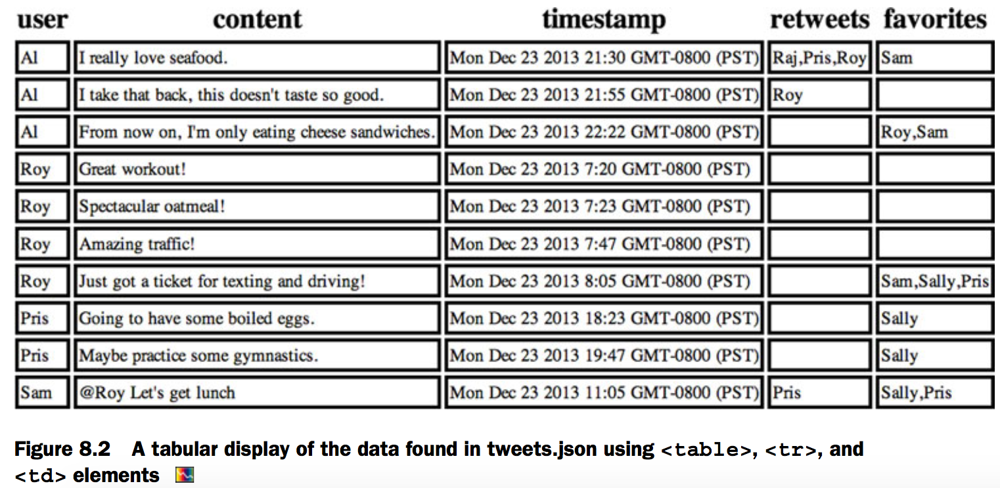
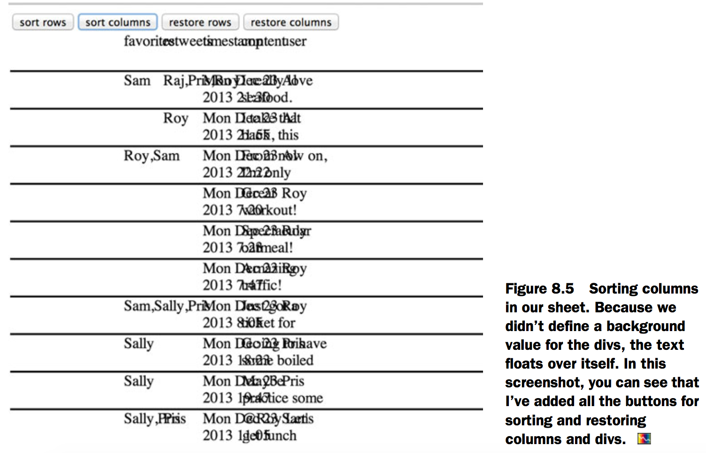
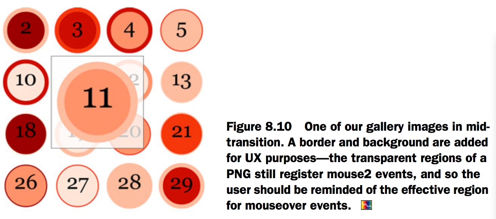
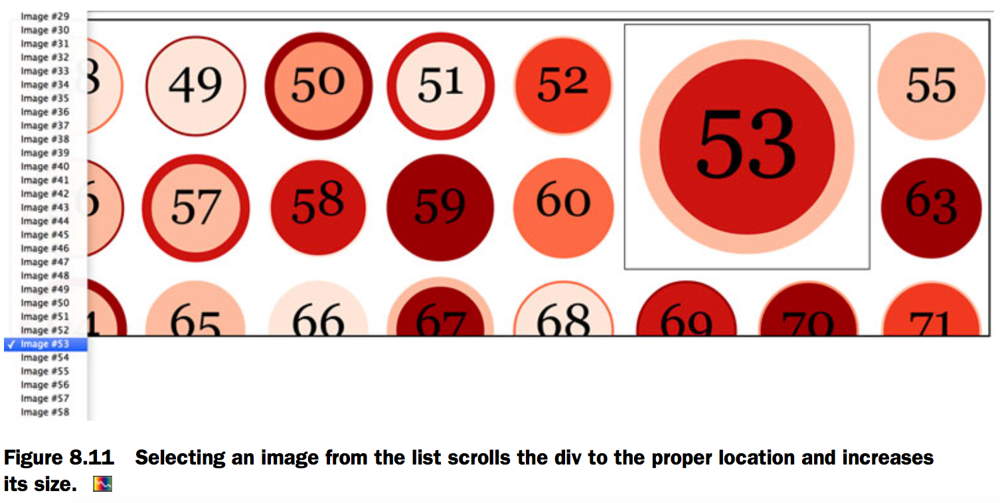

# 8.Traditional DOM manipulation with D3


[Fig_08_02.html][1]

```html

```




[Fig_08_03.html][2]

```html

```


[Fig_08_04.html][3]

```html

```


[Fig_08_05.html][4]

```html

```




[Fig_08_06.html][5]

```html

```


[Fig_08_08.html][6]

```html

```


[Fig_08_09.html][7]

```html

```


[Fig_08_10.html][8]

```html

```



[Fig_08_11.html][9]

```html

```



[1]: Fig_08_02.html
[2]: Fig_08_03.html
[3]: Fig_08_04.html
[4]: Fig_08_05.html
[5]: Fig_08_06.html
[6]: Fig_08_08.html
[7]: Fig_08_09.html
[8]: Fig_08_10.html
[9]: Fig_08_11.html
