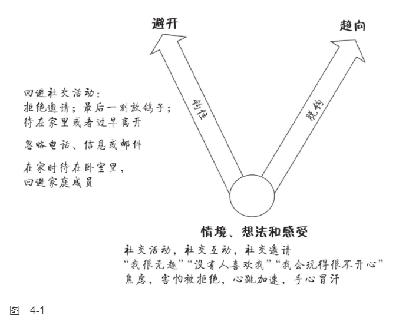
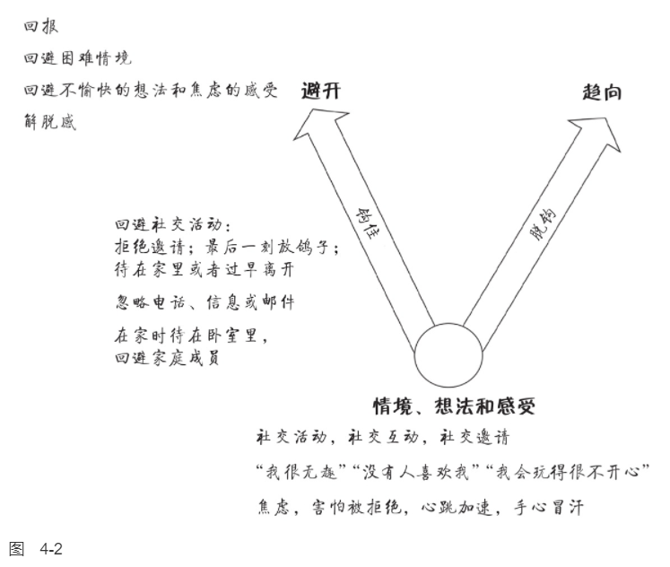
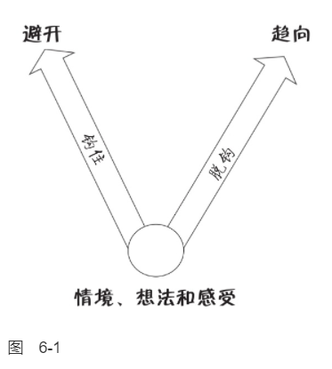
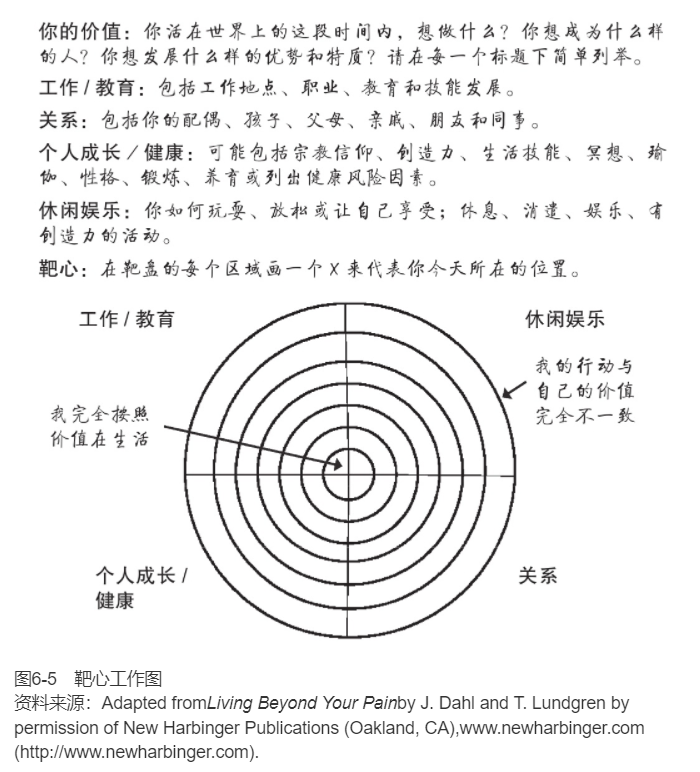

    作者: [澳]路斯·哈里斯
    出版社: 机械工业出版社
    副标题: 接纳承诺疗法简明实操手册(原书第2版）
    原作名: ACT Made Simple
    译者: 王静 / 曹慧
    出版年: 2022-7
    页数: 436
    ISBN: 9787111708575

[豆瓣链接](https://book.douban.com/subject/36009539/)

- [ACT是什么](#act是什么)
  - [人类的挑战](#人类的挑战)
    - [ACT的六个核心治疗过程](#act的六个核心治疗过程)
    - [ACT灵活三角](#act灵活三角)
    - [选择点](#选择点)
    - [选择点、灵活六边形和灵活三角](#选择点灵活六边形和灵活三角)
  - [被钩住](#被钩住)
    - [语言和头脑](#语言和头脑)
    - [认知融合](#认知融合)
    - [有关认知融合与认知解离的简单概括](#有关认知融合与认知解离的简单概括)
    - [有效性](#有效性)
    - [想法和感受不是问题](#想法和感受不是问题)
    - [融合的六大基本类型](#融合的六大基本类型)
    - [经验性回避](#经验性回避)
    - [关于接纳和回避的一个非常重要的观点](#关于接纳和回避的一个非常重要的观点)
    - [融合如何引发经验性回避](#融合如何引发经验性回避)
    - [心理僵化的六大核心病理过程](#心理僵化的六大核心病理过程)
  - [“正念”以及其他含混不清的词](#正念以及其他含混不清的词)
  - [来做ACT极客吧](#来做act极客吧)
- [启动ACT](#启动act)
  - [问题是什么](#问题是什么)
    - [从ACT的视角看问题](#从act的视角看问题)
    - [建立治疗的行为目标](#建立治疗的行为目标)
  - [我从哪里开始](#我从哪里开始)
- [基本要义](#基本要义)
  - [创造性无望是什么](#创造性无望是什么)
  - [放弃挣扎](#放弃挣扎)
  - [抛锚](#抛锚)
  - [注意那个想法](#注意那个想法)
    - [建立联结](#建立联结)
  - [深入认知解离](#深入认知解离)

# ACT是什么
## 人类的挑战
>ACT是一种创造性地运用价值和正念技术帮助人们建立丰富而有意义的生活的行为疗法。它基于六个核心过程：价值、承诺行动和四个正念过程，即认知解离、接纳、以己为景、接触当下。我们可以把它们重组为三个更大的过程：活在当下、开放和做重要的事。从技术角度讲，ACT的目的是帮助人们发展心理灵活性：一种专注并投入我们正在做的事情，对我们的想法和感受开放并为之腾出空间，从而在我们的价值引领下有效行动的能力。

在生活中我们每个人都不得不面对的重大挑战是：
1. 生活不易。
2. 完整的人生必然伴随着各种各样的情绪，苦乐参半。
3. 正常的人类头脑会自动放大心理痛苦。

`ACT`（acceptance and commitment therapy）旨在通过以下方式让人们最大程度地发挥潜力来过上丰富且有意义的生活：
- 帮助我们澄清什么是对我们真正重要和有意义的，即澄清我们的价值，并利用这个认知来引导、激励和驱动我们去做那些丰富生活和提高生活品质的事情。
- 教会我们心理技术（“正念”技术），使我们能够有效地处理痛苦的想法和感受，全情投入到当下我们正在做的任何事情中，并欣赏和品味我们生活中充实的方方面面。

### ACT的六个核心治疗过程
ACT中的六个核心治疗过程是接触当下、认知解离、接纳、以己为景、价值和承诺行动。
1. `接触当下（此时此地）`。接触当下意味着灵活地把注意力放到我们正在经历的这一时刻：根据什么是最有用的，来缩小、扩大、转移或维持你的关注点。接触当下应该包括有意识地关注我们周围的物质世界或我们内部的心理世界，或同时关注两者，与我们的体验相联结，并全情投入其中。
1. `认知解离（看见你的想法）`。解离意味着学会“退后一步”并从我们的想法、意象和记忆中脱离或分开。完整的学术名词是认知解离，但通常我们简称为解离。我们退后一步去观察自己的想法，而不是卷入其中。我们看见自己的想法本来的样子，只不过是文字或图片而已。我们只需轻轻地拿着而无须紧紧地攥住它们。我们允许它们引导我们，但不让它们支配我们。
1. `接纳（开放）`。接纳意味着开放，为不想要的个人体验腾出空间：想法、感受、情绪、记忆、欲望、表象、冲动和感觉。我们不是与之抗争，或抗拒、逃避它们，而是对它们开放并为它们腾出空间。我们允许它们在我们的内心自由流动，按照它们自己的安排，想来即来，想在即在，想走即走（只要这有助于我们有效地行动并改善我们的生活）。
1. `以己为景（观察性自我）`。用日常语言来说，头脑中有两个截然不同的部分：一部分是思考，另一部分是观察。当我们谈到“头脑”时，我们通常指的是思考部分——产生思想、信念、记忆、评价、幻想、计划等。我们通常指的不是“观察部分”：我们的那个部分会觉察任何时刻下我们想的、感受的、感觉的或者做的任何事。在ACT中，它的专业术语叫作：“以己为景。”
1. `价值（知道什么是重要的）`。你在生活中想要主张什么？你想怎么度过你在这个星球上生存的短暂时光？你想如何对待自己、他人以及你周围的世界？价值是身体或心理活动的理想品质。换言之，它们描述了我们希望在持续发展的基础上如何表现。我们经常把价值比作指南针，因为它们给我们指引方向，指引我们的人生旅程。
1. `承诺行动（为所当为）`。承诺行动意味着要在我们的价值指导下采取有效行动。它包括身体活动（我们用身体做什么）和心理活动（我们在内心世界做什么）。

如图1-1所示，称之为“ACT灵活六边形”（ACT hexaflex）。

### ACT灵活三角
这六个核心过程可以合并成我所说的灵活三角，灵活三角由三个功能单元组成，如图1-2所示。
1. `以己为景`（也称为`观察性自我`）和`接触当下`都涉及灵活地将注意力分配和投入到当下的体验中去（换言之，“活在当下”）。
1. `认知解离`和`接纳`是指与我们的想法和感受分开，看见它们的真实面目，并为它们腾出空间，允许它们按照自己的节奏自由来去（换言之，“开放”）。
1. `价值`和`承诺行动`包括发起并坚持能够提高生活品质的行动（换言之，“做重要的事”）。

因此，我们可以把心理灵活性描述为“活在当下、开放和做重要的事”的能力。

### 选择点
`选择点`是一个工具，它可以快速地描述问题，确定痛苦的来源，并形成处理问题与痛苦的ACT方案。我们可以在治疗的任意阶段引入它，也可以将它用于许多不同的目的。我通常是在新来访者的首次治疗的中段，作为知情同意（见第5章）的一部分来第一次介绍它。通常，它会这样进行：

治疗师：你同意我花点时间来画点东西吗？就是能帮助我们有效合作的路线图。（治疗师拿出一支笔和一张纸。）这样，你和我，以及这个星球上的任何其他人，我们总是在做一些事情。我们吃、喝、走、说、睡、玩……总是在做事情。即使我们只是盯着墙看，那也是在做事情，对吧？我们所做的一些事情是极为有用的，它们帮助我们趋向更好的生活。所以我称之为`“趋向”（towards moves）`。趋向主要是指那些如果我们在这里的合作成功的话，那你会想要开始做或更多去做的事情。

治疗师在说的同时，画了一个箭头（见图1-3），并写上“趋向”。

治疗师继续说：所以当我们趋向时，这意味着我们正在有效地行动，像我们想成为的人那样行动，去做那些可能使生活更有意义和更圆满的事情。问题是，这不是我们全部的行为。我们还会做效果相反的其他事情：它们会让我们远离我们真正想要的生活。所以我喜欢把这类行为叫作`“避开行为”（away moves）`，当我们避开时，意味着我们在无效地行动，不像我们想成为的人那样行动，做的事情从长期来看往往会让生活更糟。所以基本上，如果我们在这里的合作成功的话，“避开行为”是你将停止或少做的事情。

治疗师一边说，一边画了第二个箭头（见图1-4），然后写上“避开”。

治疗师继续说：这适用于我们所有人，是不是？一天下来，我们都会做出趋向和避开的选择，而且总是在时刻切换。而当生活不太艰难，当事情进展尚可，当我们得到了生活中想要的东西时，做出趋向的选择就会容易很多。但正如你所知的那样，生活中大部分时候都不是这样的。生活很艰难，很多时候我们得不到想要的。所以一天下来，我们总会遭遇各种困难情境，而令人痛苦的想法和感受都会出现。

在图1-5的底部，治疗师写上“情境、想法和感受”。（注：在本书中，“想法和感受”一词被用作想法、感受、情绪、记忆、欲望、冲动、图像和感觉等的简写。所有的个人经验都可以在选择点上被提及或写下来。）

治疗师继续说：问题是，我们中绝大多数人的惯常反应是当这些令人痛苦的想法和感受出现时，我们倾向于被它们“钩住”。它们在某种程度上把我们钩住，让我们卷进去，摆布我们，并且拖着我们到处走。

治疗师在“避开”箭头旁边写上“被钩住”（见图1-6）。

治疗师继续说：所以每个人或多或少都会做一些这样的事情，这很正常。没有人是完美的。但如果这类事情经常发生，就会产生很大的问题。事实上，几乎每一个我们所知道的心理问题——焦虑、抑郁、成瘾，凡是你能想出来的都可以归结为一个基本的过程：我们被痛苦的想法和感受钩住，并且开始避开。

然而，有时我们能够从这些痛苦的想法和感受中脱钩，转而采取趋向行为。我们在这类事情上做得越好……呃，生活就越美好。

在说这些的时候，治疗师在“趋向”箭头旁边写上“脱钩”（见图1-7）。

继续说：所以当我们处于这些充满挑战的情况下，这些痛苦的想法和感受出现时，对我们来说，这里就有一个选择机会：我们将如何应对？我们越是被钩住，就越有可能采取避开行为；但我们越能脱钩，就越容易采取趋向行为。

治疗师继续说：所以如果我们想做好这个（指着“趋向”箭头），我们就需要做两件事：学习一些脱钩技术，以及弄清楚我们想采取什么样的趋向行动。一旦这一切就绪，我们就有更多的选择来应对生活给我们带来的所有困难。这基本上就是这种疗法的全部：学习如何与这些东西脱钩（指着“想法和感受”），减少这些事情（指着“避开”），帮助你更好地做这些事情（指着“趋向”）。

现在，我只想标示出三个要点：
1. 选择点包括外显行为和内隐行为。在ACT中，我们把行为定义为“一个完整个体所做的任何事情”。这包括`外显行为`，如吃、喝、走、说话、观看《权力的游戏》等。外显行为基本上是指身体行为：你用胳膊、腿、手和脚采取的行动；面部表情；你所说、唱、喊或嘟囔的一切；你如何走路、吃、喝、呼吸；你的身体姿势等。然而，“行为”一词也指`内隐行为`，这基本上是指心理行为，如思考、专注、表征、正念、想象和回忆。例如，内隐的避开行为可能包括思维反刍、担忧、注意力分散、不投入、强迫思维，而内隐的趋向行为可能包括认知解离、接纳、重新集中注意力、投入、制定策略和做计划。
2. 要由来访者自己定义什么是避开行为。在治疗早期，来访者可能会将自我妨碍或自我毁灭行为视为一种趋向。例如，一个酒精或赌博成瘾的来访者最初可能会将饮酒和赌博归类为趋向。如果这样，我们也不要和来访者争论这个问题。我们只需要花点时间澄清一下：“我能不能确定一下我们对这些术语的理解是一样的？避开行为是那些如果我们在这里的合作成功了，你想停止或减少的行为，而如果我们在这里的合作成功了，你想开始做或多做的就是趋向行为。”如果来访者仍然将自我妨碍的行为标记为“趋向行为”，那么我们认可这一点，并将其写在趋向箭头旁边。为什么？因为这是来访者的生活掠影——他当下的所见所感，而不是治疗师该如何看待。我们的目标是了解来访者的世界观，了解来访者的自我觉察水平：来访者认为什么是问题，什么不是。在以后的治疗中，一旦来访者有了更高水平的心理灵活性，我们就可以回到这种行为上并重新评估：“你第一次来见我时，你把赌博归为一种趋向行为，现在你还这样认为吗？”通常，随着治疗的推进和来访者心理灵活性的发展，他会改变主意，将自我妨碍的行为归类为避开行为，特别是当他意识到它正在妨碍其他重要的生活目标时。
3. 任何行为都可以是“趋向行为”或“避开行为”，这取决于语境。当我主要是为了避免去健身房或为了拖延一些其他重要的工作而看电视时，或者当我为了逃避无聊或焦虑而不走心地吃了一块巧克力时，我会把它们归类为“避开行为”。但当我把电视作为一种有意识的、价值引导的选择来丰富我的生活时（例如追《行尸走肉》的最新一集），或者作为与朋友庆祝活动的一部分，我用心地吃巧克力，品味其滋味时，我会把它们归类为“趋向行为”。

### 选择点、灵活六边形和灵活三角
灵活六边形和灵活三角进程如何对应到选择点上（见图1-8）。
- `脱钩技术`是指ACT中的四个正念核心过程：认知解离、接纳、以己为景和接触当下。我们可以利用这些过程的任意组合让自己从痛苦的想法和感受中解脱出来，减少它们对外显行为和内隐行为的影响和冲击。
- `“趋向”`指的是身体上的和心理上的由价值引领的承诺行动。
- `“钩住”`指的是认知融合和经验性回避这两个核心过程，ACT认为这两个过程是造成我们大部分心理痛苦的罪魁祸首。认知融合基本上意味着我们被我们的认知“支配”。经验性回避是一种持续的挣扎，以回避或摆脱我们不想要的想法和感受。

## 被钩住
>ACT模型是建立在有效性这一核心概念之上的：你正在做的事情会让你的生活更丰富、更充实吗？ACT的主要病理过程是认知融合，分为六大类：过去、未来、自我概念、理由、规则和评判。融合会产生很多问题，其中最常见的一种是经验性回避，因此，当我们在选择点中使用“被钩住”这个词时，它既指融合又指经验性回避。
>
>核心病理过程包括认知融合、经验性回避、僵化的注意、远离价值、无效行动、与自我概念融合，这些过程在所有人类身上都会或多或少地存在，这就是ACT适用于所有人的原因。

### 语言和头脑
人类语言是一种高度复杂的符号系统，包括文字、图像、声音、面部表情和身体姿势。人类的语言应用分为外显和内隐两大领域。外显语言的表现方式包括讲话、交谈、比画、姿势、书写、绘画、雕刻、唱歌、跳舞等。而内隐语言包括思考、想象、做白日梦、计划、表征、分析、担忧、幻想等。

“头脑”一词指的是一组极其复杂的交互式认知过程，包括分析、比较、评估、计划、记忆、表征等。所有这些复杂的过程都依赖于一套我们称之为人类语言的复杂符号系统。因此，在ACT中，当我们使用“头脑”这个词时，我们将其用作“人类语言”的隐喻。

### 认知融合
`认知融合`，通常简称为融合，基本意思是我们的认知在以一种自我挫败的或有问题的方式支配我们的行为（外显的和内隐的）。换句话说，我们的认知会对我们的行为和意识产生负面影响。

只有来访者在治疗前已经知道这个术语，我才直接用“融合”这个词。大多数情况下，我会用“被钩住了”——一个涵盖了融合和经验性回避的有用术语。我们可以谈论我们的想法和感受如何“钩住”我们：它们钩住了我们的注意力，困住我们，摆布我们，拉着我们偏离轨道。

认知融合主要表现在两个方面：
1. 我们的认知以有问题的方式支配身体行为。
2. 我们的认知以有问题的方式支配意识。

ACT中的一个普遍共识是，只有当这一心理过程导致了问题行为或自我挫败的行为时，才应该使用“融合”一词。

例如，如果我“迷失于自己的想法中”会提升生活品质，例如在度假时躺在沙滩上做白日梦，或者为了重要的演讲于适当的时间在心里进行排练，我们称之为“全神贯注”而不是融合。

### 有关认知融合与认知解离的简单概括
当我们与一种认知融合时，它就像：
- 我们必须遵守、屈从或遵循的某些东西；
- 我们需要避免或摆脱的一种威胁；
- 极为重要的必须占据我们所有注意力的某些事情。

当我们认知解离时，我们可以看到它本来的样子：一组“我们头脑中”的文字或图像。我们可以认识到它：
- 不是我们必须遵守、屈从或遵循的某些东西；
- 绝对不是对我们的一种威胁；
- 可能重要也可能不重要——我们可以选择对它分配多少注意力。

### 有效性
整个ACT模型依赖于一个关键概念：`有效性（workability）`。请将有效性这个词刻入你的大脑皮层，因为它是我们所做的每一次干预的基础。为了明确有效性，我们会问这个问题：“从长远来看，你现在的行为能否给你想要的生活？”如果答案是肯定的，那么我们说这是“有效的”，那就无须改变。如果答案是否定的，那么我们说它“无效”，此时，我们需要考虑更有效的替代方案。

当我们使用有效性的基本框架时，我们永远不需要将来访者的行为评价为“好”或“坏”、“正确”或“错误”；相反，我们可以不带评判地、充满关怀地问：“这是否会带给你想要的生活（对于带给你想要的生活，这是否有效）？”同样，我们也绝不需要把想法视为非理性的、功能失调的或消极的，也不需要去争论它们是真是假。相反，我们仅需要提出如下问题：
- 从长远来看，如果你让那个信念/想法/规则贯穿你的生活/决定你做什么/指导你的行动，它是否有效？
- 如果你被这些想法卷进去/钩住，这有助于你做想做的事吗？
- 如果跟着这些想法走，这会帮助你成为你想成为的人吗？

### 想法和感受不是问题
想法和感受本身不是问题，只有当我们以僵化、不灵活的方式，比如融合和回避，来回应它们时，它们才会带来有问题的结果。

在融合和（过度）经验回避的语境下，想法和感受很容易走极端或使生活扭曲。但是，如果我们灵活地用认知解离、接纳、以己为景和灵活注意来回应它们，那么在这个正念的新语境中，同样的想法和感受会带来不同的结果。当然，它们可能仍然是痛苦的或不愉快的，但它们不再具有损害幸福或生活质量的功能。

### 融合的六大基本类型
临床上有六大类融合需要探寻：与过去、未来、自我概念、理由、规则和评价的融合。

`与过去融合`。这一类是指所有基于过去的认知类型，包括：
- 思维反刍、后悔和沉浸在痛苦的记忆中（例如，关于失败、伤害和丧失）。
- 对过去事件的抱怨和不满。
- 理想化过去：在XYZ发生之前，我的生活曾经很美好。

`与未来融合`。这一类是指所有基于未来的认知类型，包括：
- 担忧、灾难化。
- 假设最坏结果、绝望感。
- 对失败、被拒绝、伤害、丧失等的预期。

`与自我概念融合`。这一类是指所有关于自我描述和自我评价的认知类型，包括：
- 消极的自我评判：我坏、不可爱、一文不值、肮脏、残缺、一无是处、支离破碎。
- 积极的自我评判：我总是对的，我比你好。
- 过度认同一个标签：我是边缘人，我抑郁了，我是酒鬼。

`与理由融合`。人类极为擅长“找理由”：关于我们为什么不能改变、不会改变甚至不应该改变的理由随时会浮现出来。这一类包括所有诸如此类的理由。我不能做X（重要行动），因为……
- 我实在太Y（Y = 抑郁、累、焦虑等）。
- Z可能发生（Z = 糟糕的结果，如失败、被拒绝、让自己看起来像个傻瓜等）。
- 这毫无意义，太难了，太可怕了。
- 我是B（B = 边缘人、害羞的、废物或其他自我概念）。
- C说我不应该（C = 父母、宗教、法律、文化信仰、工作场所要求等）。

`与规则融合`。这一类包括所有我认同的“规则”，是关于我、他人或世界应该是怎样的。规则通常可以通过诸如“应该”“不得不”“必须”“应当”“对”“错”“公平”或“不公平”这样的词来识别。并且它们常常给出限制条件，例如“直到……之前不能……”“不应该……除非……”“绝对不能……因为……”“为了……必须这样”“不能容忍，或不予准许”。下面是一些例子：
- 我绝对不能犯错误。
- 她先改变，我才改变。
- 当我有这种感觉时，我不能去上班。

`与评判融合`。这一类是指任何类型的评判或评估，无论是积极的还是消极的，包括对以下方面的评判：
- 过去和未来。
- 自我和他人。
- 我们自己的想法和感受。
- 我们的身体、行为、生活。
- 世界、地方、人、物、事以及几乎任何东西。
这六种融合类型相互重叠，很容易交织成一种这样的复杂叙事：因为坏事发生在我身上（过去），我受到了伤害（自我概念、评判），这意味着我不能做X（找理由），否则我就永远无法拥有Y（未来）。

### 经验性回避
让我们来考虑一下经验性回避是如何增加痛苦的。成瘾就是一个明显的例子。许多成瘾状况是为了回避或摆脱不想要的想法和感受，如无聊、孤独、焦虑、内疚、愤怒和悲伤。在短期内，赌博、毒品、酒精和香烟可能会帮助人们暂时回避或摆脱这些感受，但随着时间的推移，它反而会产生巨大的痛苦和折磨。

从长远来看，我们花在摆脱不想要的个人体验上的时间和精力越多，我们在心理上遭受的痛苦可能就越大。

### 关于接纳和回避的一个非常重要的观点
在ACT中，我们并不主张在任何情况下都接纳所有的想法和感受，这不仅十分僵化，并且完全没有必要。ACT在以下两种情况下提倡经验性接纳：
1. 当对想法和感受的回避受到限制或不可能时。
2. 当对想法和感受的回避是可能的，但长期来看，使用的方法会使生活更糟时。
如果经验性回避是可能的，并且回避有助于你按照价值生活，那就去做吧。

### 融合如何引发经验性回避
如果经验性回避变得过度，那么很大程度上是因为与两类想法的融合：评判和规则。我们的头脑把痛苦的想法和感受评价成“坏的”，并为之形成规则“我必须摆脱它们”！这通常比我们有意识的思考速度更快。一旦痛苦的想法和感受出现，我们就立刻开始试图回避或摆脱它们。（因此，将过度的经验性回避视为与这条规则（这些想法和感受是糟糕的，所以我必须摆脱）融合的副产品，可能会对你有帮助。）

综上所述，融合是ACT中最重要的病理过程，经验性回避是融合可能引起的诸多问题之一。所以，如果你曾经在做个案概念化时试图确定“这是融合还是回避”，那么答案通常是：两者都是！例如，一位来访者可能既会因为渴望而回避焦虑（经验性回避），又会因为与“我需要啤酒”的融合而饮酒。

这两个过程之间的重叠就是我使用术语“钩住”来指代融合和回避的原因。为了证实这一点，我经常提到两种不同的被钩住模式：自动化模式和回避性模式。

`自动化模式（automatic mode）`是指在一种融合的状态下，我们自动地服从我们的想法和感受，我们做认知让我们去做的任何事情。我们与愤怒的认知融合，我们就咄咄逼人。我们与焦虑的认知融合，我们就畏首畏尾。我们与我们的欲望和渴望的认知元素融合，我们就去做它们急于让我们做的任何事情，比如吸毒、吸烟、暴饮暴食等。

`回避性模式（avoidance mode）`是指在一种融合的状态下，我们尽一切可能回避或摆脱不想要的想法和感受。支配我们行为的是努力回避或摆脱这些痛苦的内心体验。换句话说，就是经验性回避。

### 心理僵化的六大核心病理过程
如图2-3所示，ACT的核心病理过程是：融合、经验性回避、不灵活的注意、远离价值、无效的行动以及与自我概念的融合。

`融合`意味着我们的想法支配着我们的身体行为和意识，并且达到了一种有问题的程度。例如，在抑郁的状态下，来访者可能会融合各种无用的想法：我很差劲，我不值得更好的，我无法改变，我将会一直如此，生活很糟糕，这一切太难了，治疗没用，这一切永远都不会有起色，当我有这种感觉时我就无法起床，我太累了以致什么都做不了。他们也常常与那些痛苦记忆融合在一起：拒绝、失望、失败或虐待。（与某一记忆的极度融合（到了那种好像这件事此时此刻真的正在发生的程度），通常被称为“闪回”。）在临床抑郁症中，融合常常表现为担忧、思维反刍、试图弄明白“我为什么会这样”，或者持续的负面评论：这个聚会糟透了；我宁愿躺在床上；留在这里究竟有什么意义，他们都那么开心；没人真的想要我待在这里。

`经验性回避`，持续地企图摆脱、回避或逃离不想要的个人体验，如想法、感受和记忆，是接纳的反面。抑郁的来访者通常很努力地回避或摆脱痛苦的情绪和感受，如焦虑、悲伤、疲劳、愤怒、内疚、孤独、困倦等。让我们举一个常见的社交退缩的例子。你的来访者正打算去参加她最好的朋友的生日派对，但随着时间的临近，她融合了诸如此类的想法，比如我很无趣，我是个累赘，我跟别人没什么可聊的，我不会享受到乐趣，我太累了，或者我不想被打扰，再加上最近那些不顺利的社交活动中的痛苦回忆。她感到焦虑，而且随着时间的推移，这种感觉变得越来越强烈，直到她完全被恐惧吞噬。所以她打电话给她的朋友，说她生病了，不能去了。在那一刻，她松了一口气：所有那些痛苦的想法和感受顿时烟消云散了。当然，这种解脱不会持续太久。过了一会儿，她又开始自怨自艾了：看啊，我真是个废物！甚至不能去参加我最好朋友的派对。但那短暂的解脱感，从恐惧中暂时的逃离，正在被高度强化。这加剧了她未来社交退缩的可能。

融合和回避是齐头并进的。我们的来访者融合了各种痛苦的认知（如思维反刍、担忧、自我批评或失败和失望的记忆），同时试图回避或摆脱它们（如通过药物、酒精、香烟、电视或睡觉）。

接触当下，或灵活注意，指与你的内外两个世界都进行充分的、有意识的接触，并基于有用与否来缩小、扩大、转移或维持你的关注点的能力。与之相反，`僵化的注意`指的是这种能力的不同形式的缺失，特别是“三D”开头的“三不”：不专注（Distractibility）、不投入（Disengagement）和不联结（Disconnection）。

- `不专注`是指难以将注意力持续集中在手头的任务或活动上，注意力很容易转移到其他无关的刺激上。在任何任务或活动中，我们越是分心，我们的表现就越差，满意度也就越低。
- `不投入`是指当我们意识上缺乏兴趣或并没有沉浸在自己的体验中时的各种各样的情况：走过场，做事情心不在焉，自动化，在一种无聊的、不感兴趣的或神情恍惚的状态中。
- `不联结`这个术语是我用来描述一种与我们自己的想法和感受缺乏有意识的联系的状态。如果我们不能注意自己在想什么或者我们的感受是什么，那么我们就缺乏自我觉察，因此以适合的方式来改变我们的行为就会难上加难，我们就容易情绪失调和进行冲动的、反应性的或无意识的行为。

`远离价值`：当我们的行为越来越受到融合和经验性回避的驱使时，我们的价值往往会被丢失、被忽视或被遗忘。如果我们不清楚自己的价值，或者无法与之接触，我们就不能用它们为我们的行动进行有效引导。例如，抑郁的来访者经常会与他们的价值失去联结，这些价值包括：关爱、联结、奉献，富有成效和乐于助人，自我关爱，玩耍，亲密，可靠，等等。

在ACT中，我们的目标是使行为越来越多地受到价值的引领，而不是被融合或回避控制。

术语`“无效行动”`（或“避开”）描述了拉着我们远离正念的、有价值的生活的行为模式。这些行为包括冲动的、反应性的或自动化的行为（与正念的、深思熟虑的或有目的的行为相反）；由融合或经验性回避（而不是价值）持续激发的行为；或当需要有效行动时却不作为或拖延。抑郁症（以及许多其他障碍）患者中无效行动的常见例子包括：嗑药或过度饮酒；社交退缩；停止以前感到愉悦的活动；睡觉、看电视或沉迷游戏以及企图自杀。

我们都有一则关于我是谁的故事。这个故事是复杂的和多层次的。它包括客观事实（如姓名、年龄、性别、婚姻状况、职业）、对我们的身份角色的描述和评估、我们的长处和短处、我们的好恶、我们的希望、我们的梦想和抱负。如果我们轻松地对待这个故事，那么它就可以帮助我们定义我们是谁，以及生活中我们想要什么。

但当我们`与我们的自我概念融合`时，似乎所有这些有关自我描述的想法就成了“我是谁”的本质内容。我们就会失去这样的能力：退后一步，看到这些自我概念无非是一种复杂的认知结构，一幅由丰富的文字和图像织成的锦缎罢了。

抑郁症来访者通常会融合一种非常消极的自我概念：我不好、一文不值、无可救药、不讨人喜欢等。然而，你也有可能融合的是“积极的”元素，例如，我是一个坚强的人，我本不应该这样反应的，我是一个好人，为什么这会发生在我身上。

## “正念”以及其他含混不清的词
`正念`是一套致力于有效生活的心理技术，包括在开放、好奇、友善和灵活的心态下保持专注。
1. 正念指的是一整套技术的组合，它涵盖了以下所有内容：从接纳痛苦的感觉到品味愉悦的体验，从温柔地观察你的想法到在崩溃的情绪中稳定自己。（正如你在阅读第1章时所知道的，在ACT中“正念”一词是指认知解离、接纳、接触当下和以己为景四个心理过程的任意组合，以及任何或所有能够用以支持和加强这些过程的技能、方法、实践、工具和技术。）
2. 正念是一个注意力集中的过程，而不是一个思考的过程。它让你关注自己的体验，而不是陷在你的想法中。
3. 正念涉及一种特殊的态度——一种开放和好奇的态度。即使你这一刻的经历是困难的、痛苦的或不愉快的，你也可以对它开放，对它充满好奇，而不是逃避或与之对抗。
4. 正念涉及注意力的灵活性——有意识地拓宽、缩小、维持或重新定向你的注意力的能力。这样你就可以根据需要来关注你在此时此地体验到的不同方面。
5. 正念的关注点包括友善的品质。不是科学家解剖老鼠时那种冷酷无情的临床关注，而是像慈爱的父母给予孩子的温暖、体贴的关注。

你会发现，每一个单独的正念练习，从一个10秒的ACT技术到一个10天的止语冥想静修，都有一个基本的操作：`“观察X”`。

“观察”一词的常见替代词包括“察看”“注意”“专注于”“觉察到”或“把你的觉察带入”。我们所观察的“X”可以是此时此地的任何事物：一个想法或一点感受、一种感觉、欲望或记忆；我们的身体姿势；我们的行为；我们能看到、听到、触摸、品尝或闻到的任何东西。X可能是从窗户看到的风景、爱人脸上的表情、洗热水澡的感觉、巧克力的味道、系鞋带的动作、肺部的运动或者房间内听到的声音。

有时，我们可能想拓宽我们的注意范围，例如，如果我们在乡村散步，我们就想将所有的风景、声音和气味都尽收于心。其他一些时候，我们可能想缩小注意力范围：如果我们在倾盆大雨中开车，我们就希望全神贯注于道路上，而不是与乘客聊天或者环顾四周来欣赏风景。有时，我们可能想把注意力引向想法、感受和感觉所在的内在世界；另一些时候，我们想把注意力引向我们身边的外在世界；还有很多时候，我们想把注意力同时引向两个世界，即根据环境的要求，把注意力从一个事物自由地转移到另一个事物上。这种能力在学术上被称为“灵活注意”。

“冥想”和“正念”澄清一下：它们不是一件事，两者不一样。首先，正念并不一定是指正式的冥想练习，例如观呼吸或身体扫描。当然，有时候它就是这个意思，但它也指一个更广范围内的正念技术、工具和练习，这与正式的冥想几乎没有，甚至是根本没有相似之处。

我们还要记住，冥想本身有许多不同类型的风格和实操方式，其中一些与正式的正念冥想也是极其不同的。例如，在某些类型的冥想中，目标是“从头脑中清空所有的念头”。这与正念冥想恰恰相反，在正念冥想中，你并不期望“头脑将被清空”，反之，你会对不断出现的各种念头持开放态度并对其感兴趣。

很多人把正念和佛教或冥想混为一谈，还有人把它与积极思考、放松或转移注意力相混淆，或者把它看作摆脱不想要的想法和感受的一种方法。正如我们已经探讨过的，正念（至少在ACT里的正念）与以上几种说法毫无关系。所以贯穿本书，我都将鼓励你用其他的词来代替：“脱钩”“投入”“抛锚”“专注于任务”“扩展”等。我会鼓励你和来访者澄清你到底在教授什么样的技术（也就是说，不要只是含糊其词地称之为“正念”），以及它可能如何帮助他们解决问题。

## 来做ACT极客吧
`功能语境主义`是奠定ACT模型基础的科学哲学。它是要考察在不同的语境中行为是如何发挥功能的，因此而得名。当我们问“这个行为的功能是什么”时，我们的意思是：“在这种情境中，这个行为会有什么影响？它会实现什么结果？”为了澄清这一点，让我们想象现在有五个不同的人，分别处于五种不同的情境中，每个人都在用一把锋利的刀来割自己的手臂。现在看看你是否可以为此行为设想出五种可能的功能。

以下是某些可能的功能：
- 引起注意
- 自我惩罚
- 缓解压力
- 从痛苦的情绪中转移出来
- 身体艺术创作
- 让你在“完全麻木”时能有所感觉
- 企图自杀

注意在所有这些情境下，行为方式都是相同的——用刀割手臂，但是行为的功能或行为在此情境下的效果，是不同的。现在，让我们假设你的朋友正陷入沉思，而你想要引起他的注意。想出可以达到这种效果的五种不同的行为方式。

以下是一些想法：
- 向他挥手
- 喊：“嗨，有人吗？”
- 把一杯水浇到他头上
- 大声地敲家具
- 说：“请注意一下我好吗？”

在这个例子中，你能看到很多不同的行为方式都具有同样的功能：在这种情境中，它们的效果都是引起注意。在功能语境主义中，我们对于一个行为的功能（它起到的效果）的兴趣，要比对这个行为本身形式的兴趣多得多。例如，当我们运用选择点时，我们就是在不断地分析来访者在他的生活语境中所表现的行为的功能（对于“语境”的意思，我们很快就会进行更多的说明）。我们会询问，它的功能是趋向还是避开。这让我们可以从一种毫不评判的视角来看待来访者的行为，而不是去评估它是好是坏、是对是错、是积极还是消极，我们只是从有效性的角度去看它。谨记：如果你行为的功能，是有效地帮助你过上你想要的生活，那么它就是有效的；如果它的功能相反，那么它就是无效的。

所有的行为都发生在一个语境当中。专业术语`“语境”`的意思是所有能够影响我们正在分析的行为的东西。这可能包括：
  -情绪、感受、心情
- 认知事件（想法、信念、态度、假设、计划）
- 认知过程（注意、记忆）
- 人际因素（还有谁在场，你与他们曾经的关系）
- 社会和文化事件（公共假期、传统庆典和仪式）
- 物理环境（地点、家具陈设、天气、时间、温度、味道）
- 基因和遗传外因素
- 生理状态，如干渴、饥饿和疲劳
- 药品、酒精和食物的使用
- 身体健康或疾病
- 社会和文化状态（社会阶层、地位和等级，同辈团体）
- 发展史和学习经历，包括依恋类型

我们可以方便地把任何语境分成两大影响类别：`前因`和`后果`。

`前因`是触发问题行为的因素，也就是说，问题行为是紧接着它们发生的，它们给问题行为的出现做出了提示。临床上，我们主要聚焦的前因是情境、想法和感受。正如下图所阐述的那样，当运用选择点时，前情永远放在底部。在这个例子中，任何形式的社交退缩都是避开。如图4-1所示，这类行为会有很多可能的前情。

通俗来讲，我们可以说我们的每一个行为都有回报（带来某种利益或收获）和代价（某种不利的结果）。

如果假以时日，一种行为的代价是导致这种行为减少或者停止，那么我们的专业术语称之为`惩罚性后果（punishing consequences）`。例如，如果来访者取消了一场社交活动，但是余下的夜晚时光他感到无比孤独和痛苦，因此他开始不那么频繁地取消社交活动，那么从技术上说就是一种惩罚性后果。

如果假以时日，一种行为的回报是导致这种行为持续或者增加，那么我们的专业术语称之为`强化性后果（reinforcing consequences）`。例如，如果来访者取消了一场社交活动，并且这么做让他有了巨大的解脱感，因此他开始更多地取消社交活动，那么这就是一种强化性后果。

在选择点上把代价和回报都包含进去，通常很有用。例如，在接下来的图4-2中，为了帮助来访者理解为什么他会一直有问题行为（如，是什么强化了它），治疗师在图上方加入了回报。

用这种方式标注出一种行为的前情和后果，通常是非常有用的，特别是当一位来访者说“我不知道为什么会一直这么做”时。这种标注的专业术语是`功能分析（functional analysis）`，更好玩的叫法是功能定点（function spotting）。当我们带着来访者一起经历这个过程时，能帮助他快速觉察，并将一些有价值的领悟带入他的行为中：是什么触发了它（前因）以及什么让它一直持续（强化性后果）。

与此同时，这种方式还为临床干预提供了一个完美的跳板。例如，在上面的图中，我们很容易就能识别出要用认知解离来应对的想法，要用接纳来应对的感受，以及要用由价值引导的问题解决、目标设定、行动计划（如果来访者在社交领域表现极差，那么还将会包括社交技术的训练）来应对的有挑战的情境。

# 启动ACT
## 问题是什么
>本章的重中之重就是尽快建立行为目标，哪怕只是在知情同意阶段提到的模糊的一般性目标。特别是当来访者带着一堆情绪目标出现时，这显得尤为重要。这可能会花些时间，但是它会让你在剩下的治疗过程中轻松很多。

### 从ACT的视角看问题

图的底部和左边概括了几乎所有临床问题和精神障碍的最主要特性：
1. 来访者正在处理一些困难的情境（包括各种各样的健康、关系、经济、法律、医疗、家庭、生活方式和职业问题），并且正在体验各种各样痛苦的想法和感受。（记住：“想法和感受”是所有个人体验的简称，包括情绪、记忆、欲望、冲动和身体感觉。）
2. 当来访者不能对自己的想法和感受灵活回应，带着融合或回避（被“钩住”），长远来看，与价值不一致的自我挫败的行为方式会让他的生活越来越糟（“避开”）。

图的右边提醒我们，我们希望ACT带给我们的是正念的（“脱钩”）和基于价值（“趋向”）的生活。换句话说，我们想发展“脱钩技术”（认知解离、接纳、以己为景、灵活注意），并且采取由价值引导的承诺行动（“趋向”）来创造尽可能丰富、充实和有意义的生活。

有两个关键的问题可以帮助我们从ACT的角度迅速地把任何争议和问题进行概念化。
1. 来访者想转入什么价值方向？
2. 是什么阻碍了来访者转入价值方向？

在这里，我们先来澄清价值：来访者想如何成长和发展？他想培养什么样的个人优势和特质？他想如何表现？他想如何对待自己？他想建立什么样的关系？在那些人际关系中，他想如何对待他人？在生活中，他想主张什么？面对这个充满危机或挑战的环境，他想主张什么？对他来说，生活中哪个领域最为重要？目前与他的价值一致的目标是什么？

这个问题指的是心理障碍：在面对生活挑战时，是什么阻止了来访者的有效行动？心理障碍包括第2章中涵盖的心理僵化的六个过程中的任何一个或全部：认知融合、经验性回避、僵化注意、远离价值、无效行动以及与自我概念融合。

如果我们想快速地对来访者在不同生活领域中的价值有所了解，那么最便捷的方式就是查看`“靶心图”`。它共包括四个领域：工作／教育、个人成长／健康、关系以及休闲娱乐。当来访者第一次填写这个表格时，你很可能对他的价值、渴望、要求、需求和目标有一些综合的了解：为进一步的探索开一个好头。

`“问题分析表”`将来访者的痛苦拆分成四个关键部分：与想法融合、与感受融合、经验性回避和无效行动。

表6-1　问题分析表

|  |   |
| -- | -- |
**钩住你的想法**：你正沉面于或者深陷于哪些与这个问题有关的记忆、担忧、恐惧、自我批评或其他的无用想法中？哪些想法会钩住你、摆布你或让你脱离自已的生活？ |  **榨干生命的行动**：你现在在做的哪些事情从长远来看会让你的生活更糟糕：让你被卡住；浪费你的时间和金钱；榨干你的能量；束缚你的生活；对你的健康、工作或关系有消极的影响；维持或加剧你现在正在面对的问题？|
**钩住你的感受**:哪些情绪、感受、渴望、冲动或感觉会钩住你、摆布你或把你拉入自我挫败的行动中？ |  **回避有挑战的情境**：你正在回避或远离什么样的情境、活动、人或地方？你放弃、从中退缩或退出了哪些情境、活动、人或地方？到目前为止，你一直在“推迟”什么？

### 建立治疗的行为目标
概括而言，有三种目标：

    行为目标=我想做什么
    情绪目标=我想感觉怎样
    结果目标=我想得到或拥有什么

在我们设置ACT的治疗目标时，我们必须注意这个关键差别：

    情绪目标=我想感觉怎样
    行为目标=我想做什么

常见的`情绪目标`包括“从抑郁（或其他精神健康障碍）中康复”“不再感觉那么焦虑”“提高自我价值感”“建立自尊”“解决发生的问题”“找回过去的我”“感到快乐”“感觉良好”“不再感觉这么糟”“更自信”“不再怀疑自己”“感到更平静”“降低焦虑感”“不再那么愤怒”。

这些目标基本上都可以归纳为：

    摆脱我不想要的想法和感受，我想感觉良好！

当然，来访者带着情绪目标，是完全正常的，也是意料之中的。我们都想感觉良好，没人喜欢感觉糟糕。然而，不幸的是，如果我们认可了这样的目标，那就永远没有办法应用ACT了。为什么不行呢？因为情绪目标会强化经验性回避的策略：持续地尝试回避和摆脱不想要的想法和感受。在ACT中，我们着眼于积极地逐渐减少经验性回避，并且让来访者开放地面对一个完全不同的策略：经验性接纳（还可以叫作“愿意”）。所以如果我们认可了情绪目标，我们就不能应用ACT了。

将情绪目标重构成行为目标：

    “学习一项新技术”是一个行为目标。

对于很多来访者来说，我们认可的前期行为目标之一就是“学习新技术来更有效地处理痛苦的想法和感受”。

情绪目标1号
>来访者：我不想做任何改变。我就是想停止这样的感受。我就是想摆脱这些想法／感受／情绪／记忆。
>
>行为目标重构
>
>治疗师：那么看上去，我们的一大部分工作都将是：学习新的技术来更有效地处理这些痛苦的想法／感受／情绪／记忆。

情绪目标2号
>来访者：我只是想感受良好（或快乐、自信、平静、有爱，等等。）
>
>行为目标重构
>
>治疗师：看来你没有感受到你想感受的。你能告诉我，你脑海中出现的是什么样的痛苦的想法和感受吗？（治疗师收集这个信息。）我们现在要做的大部分工作是：学习新的技术来更有效地处理这些痛苦的想法和感受。

情绪目标3号
>来访者：（回答前面重构的问题）我不想处理它们。我只是想摆脱它们！
>
>行为目标重构
>
>治疗师：当然你会有这样的想法。谁不是这么想的呢？它们真的很令人痛苦和难受，而且对你的生活有极其严重的负面影响。那么我们做些工作来尽快改善这种状况吧。你还有其他想通过我们的工作解决的问题吗？

有时候，来访者带来的看上去是行为目标，可实际上只是`伪装的情绪目标`。对于成瘾和冲动行为，这种情况尤其普遍，而且通常它是这种形式：“我想停止这样做。”如果我们透过表层深挖下去，就会发现隐藏的策略是这样的：“摆脱引发这种行为的想法和感受（或欲望、知觉、冲动、强迫、退缩症状），因为只有它们消失了，我才能停止这样做。”这类治疗听上去会是下面这样。

伪装的情绪目标
>来访者：我想停止……（喝酒、抽烟、赌博、暴食、对孩子大吼大叫，等等。）
>
>行为目标重构
>
>治疗师：当然。所以我们的部分工作就是要辨别出引发这种行为的想法和感受（或记忆、欲望、冲动、痴迷、强迫等），并且学习新的技术来更有效地处理它们，这样这些想法和感受就不能再摆布你或者拖你的后腿，逼你去做这些事情了。另一部分工作就是要去探索，如果不做这些，那么你会去做什么。这样，如果你再次进入类似的情境中，你就可以选择去做一些不同的、更有效的事情了。

正如我们一直在讨论的那样，来访者的目标通常是停止某一特定的感受或行为。例如，“我想停止吸毒”“我不想再拖延我的研究了”“我不想再有任何的恐慌发作了”或“我不想再感到抑郁了”。在ACT中，这些目标被称为`“死人”目标（Lindsley, 1968）`。一个死人目标指的是死人比活人做得更好的任何事情。例如，死人永远不会吸毒，不会拖延，不会恐慌发作，也永远不会感到抑郁。

在ACT中，我们想确立的是“活人”目标——活人可以比死人做得更好的事情。为了从死人目标转向活人目标，你可以问以下这些简单的问题。
- “假设你期望的目标实现了，你会做哪些不同的事情？你会开始做什么，或者你会多做些什么？你和朋友或家人在一起时，你会有怎样不同的表现？”
- “如果你不再吸毒，那你会做哪些不同的事情来替代它？”
- “如果你不对孩子大吼大叫，你将会如何与他们互动？”
- “如果你不再感觉抑郁或恐慌发作，那么你在生活中会做哪些不同的事情呢？”

两个能把情绪目标和死人目标转化成行为目标的有用问题是：`魔法棒问题`和`7天纪录片问题`。

`魔法棒问题`：这是一个切入经验性回避的非常好的问题。（注意“对你来说不再是个问题”，这和说“一切都消失了”是完全不一样的。）

治疗师：假设我这里有一根魔法棒。我挥舞这根魔法棒，那些让你一直纠结的想法和感受，对你来说都不再是问题了，就好像鸭子甩掉背上的水那样简单。接下来你将做些什么不同的事情呢？你将开始做些什么，或可能会多做些什么？对待他人，你的表现会有什么不同？在工作中、在家里、在周末，你将会做些什么不同的事情呢？

`7天纪录片问题`：这是一个帮助来访者把他在生活中所要做出的改变更具体化的好问题。

治疗师：假设我们让摄制组跟踪拍摄你一周，拍摄下你做的每一件事，然后编辑成一个纪录片。然后，假设我们治疗结束后，未来某一个时间点还要做这件事。在新的纪录片中，我们看到或听到的哪些东西可以说明我们的治疗是有效的？我们会看到你做什么或者听到你说什么？我们将会看到你对待他人的方式、对待自己的方式、对待自己身体的方式，以及支配时间的方式有哪些不同？

`结果目标`的公式：

    结果目标=我想得到或拥有什么

我们对自己的行为都有很强的控制力，尤其是对我们的外显行为（我们说的和做的）。我们对于自己行为的结果却一点都控制不了，对于我们能否得到我们期待的结果，永远没有任何保证。所以，让我们尽可能快速地把这些结果目标转化成行为目标吧。

结果目标1号
>来访者：我想找到一个伴侣或找到一份更好的工作。
>
>行为目标重构
>
>治疗师：那么我们现在的部分工作就是让你改变做事情的方式，去说或者做一些更有可能增加你找到一个伴侣或一份更好的工作机会的事情。

结果目标2号
>来访者：我想让我的孩子听我的话或我丈夫不再喝酒。
>
>行为目标重构
>
>治疗师：那么我们现在的部分工作就是让你改变做事情的方式，去说或者做一些更有可能有效影响你的孩子或丈夫行为的事情。

结果目标3号
>来访者：我想治愈这种疾病或伤痛。
>
>行为目标重构
>
>治疗师：那么，我们现在有两部分重要的工作：一部分是尽你所能去做所有改善你健康状况的事情，从配合你的医疗团队到照顾自己的饮食和锻炼。另外一部分是考虑到你的疾病或伤痛强加给你的所有困难，尽可能地去做任何能把自己的生活调整到最好状态的事情。

## 我从哪里开始
一般来说，第一次治疗之后，ACT治疗程序会倾向于遵循两条路线中的一条，这两条路线是由以下两个问题引出的。

1. 来访者想转入什么样的价值方向？如果要选择这条路线，接下来的步骤（不一定是这个顺序）通常是：
- 价值澄清
- 目标确定
- 行动计划
- 问题解决
- 技术训练
- 暴露

从选择点方面来说，当我们选择这条路线时，我们聚焦于澄清和对趋向行为的计划。

2. 是什么阻碍了来访者转入价值方向？如果要选择这条路线，接下来的步骤（常常是这个顺序，但不是必须按这个顺序）通常是：
- 将僵化注意导向接触当下
- 将融合导向认知解离
- 将经验性回避导向接纳
- 将自我批评、自我憎恨和自我忽略导向自我慈悲

用选择点的语言来说，上面所有的都是脱钩技术，选出来以匹配来访者特定的避开行为。

在每次治疗中，基于我们对来访者当时需求的评估，ACT灵活三角（图1-2）都是我们很想使用的非常有用的一个直观图形。
- 如果来访者被压垮、离解或极度融合，我们从顶部的活在当下开始：着陆和抛锚。
- 如果我们想帮助来访者开始行动，我们就转移到灵活三角的右边：做重要的事（价值和承诺行动）。我们澄清价值，确定目标，创造行动方案，教授技术。
- 如果来访者被深深卡住，无法动弹，被融合和经验性回避所麻痹，我们就转移到灵活三角的左边：开放（认知解离和接纳）。
- 如果我们在左边或右边（或两边）遇到障碍，我们就回到中心点：活在当下（稳定、抛锚）。
- 如果来访者已经在做重要的事，我们就回到活在当下：我们帮助来访者全情投入到他的经历中，聚焦于他正在做的事情。如果他正在做的事有潜在的乐趣，我们就帮助他学会去欣赏和品味。

当你进入体验性工作时，要围绕ACT灵活三角中描述的三个首要内容：活在当下、开放、做重要的事。
- 想要来访者开始行动：在价值和承诺行动部分做工作（趋向）
- 当来访者被卡住时：在认知解离和接纳方面做工作（脱钩技术）
- 如果你觉得两方面都行不通：在回到活在当下和抛锚方面做工作（更多的脱钩技术）

# 基本要义
## 创造性无望是什么
`创造性无望（creative hopelessness，CH）`
>**通俗表述**：创造性无望是一个过程，在这个过程中，人们意识到，努力去回避或摆脱不想要的想法和感受往往会使生活变得更糟而不是更好。这会导致人们对回避自己痛苦的想法和感受这一惯用方式产生一种绝望感。这种绝望中会浮现出一种创造性的态度，要去寻求新的、不同的方式来应对想法和感受。
>
>**目标**：提高来访者对情绪控制计划（见下文）以及过度经验性回避所付出代价的觉察，使其有意识地认识并承认在这一方面钻牛角尖是无效的。
>
>**同义词**：直面情绪控制计划。
>
>**方法**：我们看看来访者在回避或摆脱不想要的想法和感受时都做了什么，检验这些做法在短期及长期内的效果如何，揭示采取这些策略会付出的所有代价，并探讨它们究竟是会让生活得以改善还是更为恶化。
>
>**何时使用**：当我们知道或怀疑来访者过度地经验性回避，强烈依赖情绪控制计划时：我必须感觉良好；我必须摆脱这些不想要的想法和感受。

在ACT模型中，创造性无望是当我们确实知道或相当确信以下这样的事实时会引入的办法，这个事实就是来访者正紧紧抓住情绪控制计划不放手：我必须控制我的感觉。我必须摆脱那些不想要的、不愉快的、痛苦的想法、感受、情绪和记忆，用美好的、愉快的、令人向往的来取而代之。

适度的经验性回避为什么是没有问题的。但是，当来访者把它当作救命稻草绝望地抓住不放时，经验性回避程度就会提高，而且几乎总是会带来问题。（记住：高度经验性回避与抑郁、焦虑、长期的无力感、工作表现差、创伤后应激障碍、成瘾以及许多其他精神障碍出现的风险直接相关。）

创造性无望之所以得名，是因为我们的目的是在你的情绪控制计划中创造出一种绝望感（这不是让你对你的未来、你自己以及你的生活绝望）。我们的目的是破坏这一手段，这样我们就可以帮助来访者对一种新的手段，即接纳的手段保持开放。

创造性无望很少会是一次性的干预，它通常需要你在一次又一次的治疗回合中去不断回顾。但通常每回顾一次，这个过程就会变得更快且更容易。

`情绪控制策略（emotional control strategies，ECS）`是我们为努力摆脱不想要的想法和感受而首先去做的任何事情：经验性回避主导下的外显行为和内隐行为。情绪控制策略可能包括任何行为，从锻炼、祈祷、冥想到酗酒、吸毒和自杀尝试。（如果锻炼、祈祷和冥想主要是由价值驱动的，那么我们不会称之为情绪控制策略。只有当这些活动的主要目的是回避或摆脱不想要的感受时，我们才会称之为情绪控制策略。）

创造性无望是基于有效性的干预。我们要求来访者仔细地、长时间地、诚实地、专注地察看他的所有情绪控制策略，并看看为此他需要付出什么代价。我们希望他能正视这一现实：他的情绪控制策略通常在短期内起效，会让他感受好一点；但是长远来看，对于让他的生活丰富、充实并有意义，并无效果。

创造性无望有许多不同的操作方法，但它们都可以归结为以下问题。
1. 你曾经尝试过哪些方法？
2. 这些方法的效果如何？
3. 这些方法让你付出了什么代价？
4. 在你身上浮现出了什么？
5. 你愿意尝试新方法吗？

问题1：你曾经尝试过哪些方法

创造性无望干预的第一个问题是：“到目前为止，你做过哪些事情来回避和摆脱那些不想要的想法和感受？”我们通常需要提示来访者去回忆，所以我用首字母缩写DOTS帮助我记住这些回避要点：

- `D=转移注意力（Distraction）`：“你有没有试过从这些感受上转移注意力？你试过哪些方法？看电视？听音乐？出去溜达？让自己忙起来？玩电脑游戏？你有没有试过其他方法来转移你的注意力？”
- `O=临阵脱逃（Opting out）`：“你有没有试过退出、放弃或者远离那些容易引发这些不舒服的想法和感受的场合、活动或人？你放弃或退出了什么样的活动？”
- `T=思考性策略（Thinking Strategies）`：“你是如何试图通过思考来摆脱痛苦的？”与你的来访者一起回顾一些常见的思考性策略：“你有没有试着去想那些比你更惨的人？积极地思考？挑战你的想法或是和你自己辩论？把想法强行挤出你的脑袋？将其最小化？谴责你自己？告诉自己要振作起来或者咬牙坚持？”
- `S=物质滥用和其他策略（Substances and other strategies）`“为了摆脱痛苦，你往自己身体里塞过什么东西？毒品？酒精？处方药？阿司匹林？扑热息痛？咖啡？茶？香烟？百事可乐？比萨？冰激凌？双层巧克力提姆塔？之后我们将探讨的是：“你有没有用过其他的策略来逃避这些感受？你咨询过医生或治疗师吗？读过自助手册吗？尝试过运动、瑜伽、冥想或者改变饮食这类方法吗？自残？自杀？冒险或是做危险的事？找碴打架或是吵架？让自己持续忙碌？规划假期？做家务？祈祷？自责？放弃？咬紧牙关强迫自己继续忍受？扪心自问，我为什么会这样？”

问题2：这些方法的效果如何

在创造性无望干预中，我们要探讨的第二个问题是：“从长远来看，它的效果如何？”我们要确认大部分的情绪控制策略在短期内都能减轻来访者的痛苦，然后我们要富有同情心并不失尊重地问他们：“从长远来看，它们效果如何？这些想法和感受是永久地消失了，还是又回来了？”

这个问题的目的是帮助来访者按点连线：他一直在努力，很努力、非常努力地试图摆脱这种痛苦，他找了无数方法希望在短期内有效，但从长远来看，痛苦会不断地回来！

问题3：这些方法让你付出了什么代价
- 转移注意力的代价：适度而灵活地使用转移注意力这一策略时，几乎完全不是问题，甚至有时会对你很有帮助。但是过度转移注意力的代价是什么呢？我们想问来访者，“你花了多少时间来转移自己的注意力？”“看上去有多少时间是合理安排了，又有多少时间被浪费了呢？”“你花了多少钱在上面？”“这些事情会损害你的健康、工作或人际关系吗？”
- 临阵脱逃的代价：对大多数人来说，最大的代价就是错失良机。我们越是回避重要且有意义的人、地点、情境、活动和事件，我们的生活范围就越小，我们错过的就越多。
- 思考性策略的最大代价之一是一整天一整天地沉浸在思考中，从而错失生命中的美好，不能投入，用自动导航模式做事，或者迷失在“分析瘫痪”中。对大多数来访者来说，另一个代价是浪费时间：所有的时间都花在自己的头脑里，而没有投入到生活中。
- 在健康、工作、福利、财务和人际关系上过度地物质滥用，所付出的代价通常是最容易被来访者识别的。“咬紧牙关，咽下痛苦，强迫自己去做”的代价是不满和耗竭。

问题4：在你身上浮现出了什么

许多来访者会有一种情绪反应，通常是悲伤、愤怒、焦虑或内疚的组合，无论它是什么，我们希望能够对此进行正常化和确认。同时，来访者常常会有一种解脱感，因为我们正在确认他们的体验：他们一直在使用所有这些情绪控制策略，也得到了短期内的解脱，但从长远来看，这是行不通的。

有时候，来访者会与消极的自我评价融合（例如，“我真是个废物”）。

问题5：你愿意尝试新方法吗

## 放弃挣扎
>放弃挣扎的那些隐喻为正式明确地进入接纳部分的工作提供了一个很好的切入点，它们也为创造性无望与愿意之间提供了一座有用的桥梁。

愿意的第一步就是放弃挣扎：停止抗争与逃避我们自己的想法和感受。这一阶段的治疗中主要有两种干预措施。
1. 把挣扎命名为问题；
2. 击破情绪控制的幻想。

挣扎才是问题，而不是解决办法，当一个来访者被试图控制自己感觉的策略钩住时，他会待在一个痛苦不断增加的恶性循环中。

如果我们的目标是给人们赋能，我们就需要帮助他们专注于他们能够控制的事情（见表9-1）。这就是为什么在ACT中，我们帮助人们：
1. 区分可控和不可控的事情到底有什么不同；
2. 不再努力去控制无法控制的东西；
3. 积极地将控制用在他们能控制的东西上（如果这样做有用的话）。

表9-1澄清了这些差异：

掌控之外    |    掌控之内（可能地）
-- | --
我绝大多数的情绪和感受    |    我如何应对我的情绪和感受
我绝大多数的想法    |    我如何应对我的想法
我绝大多数的感觉    |    我如何应对我的感觉
回忆    |    我如何应对我的回忆
我是否得到了我想要的结果    |    为了增加获得我想要的东西的机会，我说了什么或做了什么
我在做手头的事情时感受有多好    |    我在做手头的事情时专注和投入的程度如何
其他人说什么和做什么    |    我说什么或做什么来影响他人
其他人如何评价或看待我    |    我是否表现得像我想成为的那种人一样
未来会发生什么    |    我说任么或做任么来影响未来
过去发生了什么    |    我如何应对关于过去的想法
痛苦的丧失    |    在面对丧失时的自我慈悲
生活是否给了我想要的东西    |    不管生活是否给了我所想要的东西，引领我生活和行动的价值都一直存在
生活中大多数艰难的事情（例如工作问题、疾病、伤痛、所爱的人带来的折磨、自然灾害、经济危机、全球变暖等）    |    在面对生活中的这些困难事件时引领我生活和行动的价值，以及我的自我慈悲程度

放弃挣扎的第一种干预方式是帮助来访者认识到与痛苦的想法和感受苦苦抗争才是问题所在，想法或感受本身并不是问题。

有关放弃挣扎的隐喻：**与怪兽拔河的隐喻**

>治疗师：想象一下你和一只巨大的焦虑怪兽在进行一场拔河比赛。（你可以根据来访者的问题改变怪兽的名字，例如抑郁怪兽。）你拉着绳子的一端，而怪兽拉着另一端。在你们之间有一个巨大的无底洞，你用尽全力向后拉，但是怪兽还是不断地把你拉得离洞口越来越近。在这种情况下，你能采取的最好的办法是什么？
>
>来访者：更用力地拉。
>
>治疗师：嗯，这是本能反应，但是你越用力，怪兽就越用力。你就被困住了。你必须做的究竟是什么呢？
>
>来访者：放开绳子？
>
>治疗师：对，就是这样。当你放开绳子时，怪兽仍然在那里，但是你不会困在与它的苦苦抗争中了。现在可以做些更有用的事情了。

有大量的其他隐喻可以用来说明挣扎本身就是问题所在。你基本上可以用任何方式，只要能传递以下信息：在困境中，你越是遵循自然本能去反应，情况就会越糟。

## 抛锚
>抛锚练习都遵循了重复的三步结构：
>- A——承认你的内心体验
>- C——回到你的身体中来
>- E——融入世界
>
>围绕着这一结构，你可以即兴发挥出数百种不同的练习版本。这种练习会将你转出自动化模式，帮助你与痛苦的想法和感受“脱钩”或为它们腾出空间，提升你的觉察能力，并让你能够有意识地控制自己的行动。这些都让抛锚成了一项非常有用的技术，用于：
>1. “回路切断”，切断你的冲动性、强迫性、攻击性、成瘾性或自我伤害行为的回路；
>2. 打断你的焦虑或思维反刍等认知过程；
>3. 有效地应对令人崩溃的情绪、极端融合和离解症状。

有关抛锚的练习都遵循一个循环往复的三步走结构，你可以用缩写ACE来记住这三步。
- A——`承认你的内心体验（Acknowledge your inner experience）`。在这里，我们的目的仅仅是确认所有的想法、感受、情绪、记忆、感觉和欲望的存在。通常，用语言（无声或大声地）把这些内容表达出来是一种有用的方法，例如，“这是悲伤”“我注意到了痛苦的回忆”“我现在有一种愤怒的感觉”。
- `C——回到你的身体中来（Come back into your body）`。在这里，我们的目的是重新获得自我控制的感觉，在痛苦的想法和感受出现时，把注意力集中在你最有控制力的地方：你的身体行动上。移动，伸展，改变姿势，坐直，站起来，走路，改变你的呼吸，挺直你的脊柱，把你的脚用力踩到地板上，等等。这些能够帮助人们迅速恢复对身体的控制：为任何有效的身体行动迈出了重大的第一步。
- `E——融入世界（Engage with the world）`。在这里，我们的目的是扩展你的觉察：注意你在哪里，你在做什么，你能看到、听到、触摸、品尝或闻到什么。这不是为了转移你对想法与感受的关注，而是为了让你注意到除了这些之外还有什么。

以下是三种典型的适用于抛锚的状况。
1. 来访者想学习一种简单的正念技术时（它可以作为接纳、认知解离、接触当下或以己为景的基础）。
2. 当来访者处于过度融合状态，不能投入或参与到咨询中来时。
3. 当来访者被情绪压垮，有冲动或强迫行为，或者有离解障碍症状时。

**在“天气好时”抛锚**：在这一整天中，只要你意识到自己开始“漂离”，就是说你已经陷入了你的想法和感受中，不能真正专注或投入你正在做的事情，那就抛锚。做一个我们在这里练习过的10秒钟版本的练习：确认任何正在吸引你注意力的想法和感受，然后回到你的身体并掌控身体，观察你周围的世界——你在哪里，你在做什么。接着，把你的注意力重新集中在需要它的地方，这样你就可以做你真正需要做的事情。

抛锚的第一步是承认想法和感受的存在，确认这些想法和感受是极度痛苦的、有所不适的、相对中性的、非常愉悦的，抑或只是一种麻木的感觉。

在这之后，接下来的两步就可以说是没有限制了。为了帮助来访者重新控制自己的身体，你可以邀请他运用正念的方式来喝一杯水，站起来并在房间里走来走去，吃零食，舒展身体，改变姿势，转动拇指，点点头，抓住一个物体（如一本书、一支笔、一种装饰品）并用手指探索表面，触摸他身下的椅子，轻轻地把手放在他的胸口上（这可以转换成一个美好的自我慈悲练习，我们将在第18章中看到它），用舌头舔牙齿，等等。

为了帮助他与这个世界建立联系，你可以让他去观察他能听到、看到、摸到、尝到和闻到的任何东西，他在如何呼吸，如何坐着，他的泪水含在眼中或淌过脸颊的感觉，迎面而来的空气，他脊柱的直立感，他的身体姿势，空调的声音，等等。

**要有创造力**。随心所欲地即兴发挥，只要你能一次又一次地回到承认现在的想法和感受上去。这为什么如此重要？因为我们希望来访者了解到，即使是对最痛苦的想法与感受，他也能够灵活地应对。

## 注意那个想法
>为认知解离“铺平道路”需要5个基本步骤：
>1. 找出“是什么钩住了你”（识别来访者正在融合的认知内容）；
>2. 建立联结（将融合与问题行为联系起来）；
>3. 提供一种新技术（提供认知解离作为上述问题的解决方法）；
>4. 正常化和确认令人痛苦的想法；
>5. 引入一个隐喻来概括融合的问题和认知解离的益处。

`认知解离`
>**通俗表述**：融合意味着你的认知支配你的行为。它们支配着你的行动（外显行为）或你的注意力（内隐行为），抑或两者兼而有之。而认知解离则意味着灵活地回应你的认知，这样，它们就只能影响，但无法支配你的行为。
>
>**目标**：了解认知的真正本质，它们只不过是词语和图片的组合。基于有效性而不是表面效果（即根据这些认知的有用性程度，而不是它们有多么正确或错误，有多么积极或消极），来更灵活地回应认知。
>
>**同义词**：去文字化（deliteralization）（这个词现在很少使用了）；拉开距离（distancing）。
>
>**方法**：带着以下心态关注我们的认知。
>- 好奇心：在词语和图片的组合背后，看到其真正的本质。
>- 开放性：探索它们是否有帮助。
>- 灵活性：如果我们的认知有帮助，那就让它们来引导我们；如果没有帮助，那就顺其自然吧。
>
>**何时使用**：认知支配我们行为（内隐的和外显的）的程度已经到了妨碍我们有效的、基于价值的生活时。

当我们积极开启认知解离工作时，我们需要知道的第一件事是：**是什么钩住了你**

在所有治疗的任意时间点上，我们都可以提出如下问题：
- “你的头脑现在正在告诉你什么？”
- “你的头脑必须对此发表的意见是什么？”
- “你能注意到你现在正在想什么吗？”
- “如果我现在能听到你的头脑在说什么，那我会听到什么呢？”

### 建立联结
我们希望帮助来访者在认知融合与认知融合改变他们行为的方式之间“建立联结”。换句话说，我们想明确那些有问题的认知在支配行为时到底发生了什么：这导致（外显和内隐）行为上有哪些有问题的改变？

在融合和外显行为（行动）之间建立联结的提问可以包括：
- 当你被那些想法钩住时，后面会发生什么？（你会做什么或停止做什么？你的行为是如何改变的？你有什么不同的看法和做法吗？）
- 如果一个摄制组一周7天、一天24小时都在跟拍你，而我后来有机会看到这个视频的脚本，我会看到或听到你在做的什么事说明这些想法已经钩住你了？
- 当这些想法摆布你、耍弄你、左右你、操纵你时，你会有一些什么不同的表现？你开始做什么、停止做什么、多做什么或少做什么？
- 当你陷入、纠结于、迷失在这些想法里时，接下来会发生什么？你会做什么？你会停止做什么或者推迟做什么？
- 当你遵从这些想法行动，让这些想法来指挥你说什么和做什么时，你倾向于做什么？在视频里，看上去或听起来会是什么样子？
- 当你被这些想法钩住时，你和你的伴侣/孩子/朋友/父母/雇主/员工/同事有什么不同？你会说和做哪些不同的事？

通常内隐行为的变化更难识别，所以我们经常需要问“引导性问题”，比如：
当你被这些想法和感受钩住时……
- 你与谁（或什么）切断了联系/分离了/脱开了关系？
- 很难专注于什么（或谁）？
- 很难与谁共度时光/在一起？
- 在哪些重要的事情上，你往往会做得很差或者很容易分心？

请再次阅读这份逐字稿并注意治疗师是如何：
1. 简要地总结融合的主要内容（“是什么钩住了你？”）
2. 明确融合与问题行为之间的关系（“建立联结”）
3. 为学习一项特定的技术提供可能性，以作为融合的解药（从未使用“正念”这一概念）

**“穴居人头脑”隐喻**

>治疗师：嗯，这和人类头脑的进化方式有关系。你看，我们的原始人祖先生活在一个危机四伏的世界里，长着锋利牙齿的大型动物潜伏在每一个角落里。所以在那时候，你的大脑必须时刻对危险保持警惕，以防任何有可能伤害你的事情发生：小心！那个洞里可能有头熊，这个灌木丛里可能有只狼，远处那个人是朋友还是敌人？如果你是一个穴居人，而你的头脑不能很好地完成这项工作的话，你很快就会死掉。这就是我们从祖先那里继承而来的东西，我们这现代的头脑基本上就是一个“不要受伤害呀”的报警机器。它总是因为任何可能伤害你的事情而试图向你发出警报：你会发胖，你会搞砸考试，他可能会拒绝你。这很正常。每个人的头脑都会这样做。这只是我们的大脑在努力完成它的首要任务：保护我们，让我们活着。

我们正在用这个隐喻来传递一个强有力的信息：“你的头脑并没有功能失调，它只是在做所有人类头脑都会做的事情。我们的头脑进化的就是评判和评估、沉湎于过去、担心未来、发现问题、把我们和其他人比较。你的头脑没有缺陷，它只是在尽自己的职责。”

**把手比作想法和感受——扩展版**

这个练习主要是关于融合和认知解离的一个隐喻。如果我们能针对每一位独特的来访者量身定制，那么它的力量就会强大得多。所以我们可以将“所有你关心的人”替换为“你的丈夫迈克尔和你十几岁的女儿莎拉”，诸如此类。

>治疗师：（与来访者并排坐在一起，两个人都面对着房间）想象一下，在你面前的（指着房间里的东西和远处的墙壁）是你内心深处真正看重的一切，是让你的生活有意义的一切（或在过去曾经如此）；所有你爱的人、地方和活动；所有你最喜欢的食物、饮料、音乐、书籍和电影；所有你喜欢做的事情；所有你关心并且想与之共度时光的人。

但不止这些，那里还有你今天需要处理的生活中的所有问题和挑战，比如……（治疗师根据来访者的经历给出一些例子，比如“你与儿子的冲突”“你的财务问题”“你的健康问题”“你的诉讼案”“你在找的工作”“你的癌症化疗”等。）

此外，还有所有你需要做的能让你的生活正常进行的日常事务：购物、烹饪、清洁、驾驶、退税，等等。

现在，请模仿我来做这个练习。让我们把自己的手想象成我们的想法和感受，这样把它们放在一起。（治疗师双手并拢，手掌向上，像一本摊开的书一样。来访者也这样做。）现在，让我们看看当我们被自己的想法钩住时会发生什么。（治疗师慢慢地将双手举向自己的脸，直到双手遮住他的眼睛。来访者模仿他。在开展下一部分练习时，两人都已经把手放在眼睛上。）

现在，注意三件事。
1. 你现在正在错过多少东西？对于你在意的人和物，你已经断开了多少联结，多么不能投入？如果你爱的人就在你面前，你与她断开了多少联结？如果那边的屏幕上正在播放你最喜欢的电影，你又会错过多少精彩剧情呢？
2. 请注意把注意力集中在你需要做的事情上是多么困难。如果现在有一项重要的任务摆在你面前，专注于任务的难度有多大？如果你面前有一个需要你解决的问题，或是一个需要你应对的挑战，全神贯注的难度又有多大？
3. 请你注意，如果这样去采取行动、去做那些能让你的生活正常进行的事情是多么困难，比如……（治疗师根据来访者的经历给出了一些例子，比如“做晚餐”“开车”“抱孩子”“在电脑上打字”“拥抱你爱的人”。）所以当我们被钩住时，生活是多么艰难。我们错失美好，我们断开联结，难以专注，也难以去做那些让生活维持下去的事情。

现在，让我们看看当我们与自己的想法和感受脱钩时会发生什么。（治疗师慢慢地把他的手从脸上向下移，直到手掌落到膝盖上。来访者模仿他做同样的事情。）现在你看这个房间时视野如何？投入和联结是否容易多了？如果你最喜欢的人现在就在你面前，你与之的联结多了多少？如果有一项任务需要你去完成，或者有一个问题需要你去解决，那么像这样专注是否容易得多？现在晃动你的手臂和手掌。（治疗师轻轻地摇晃手臂和手掌，来访者模仿。）现在要采取行动，如开车、抱孩子、做晚餐、在电脑上打字、拥抱你爱的人等，是否更加容易？（治疗师边说边模拟这些活动，来访者通常不会跟着做这一部分，这没关系。）

现在请你注意这些东西（治疗师指着自己的手，并再一次平放在他的膝盖上）并没有消失。我们还没有砍掉它们，没有摆脱它们，它们还在这里。所以如果它们能派上用场的话，我们就利用它们。你看，即使是真正令我们痛苦的想法和感受，也常会包含一些对我们有帮助的、有用的信息，即使它只是把我们引向我们需要解决的问题，或我们需要改变的行为，或者只是提醒我们要对自己好一点。并且，如果它们对我们真的没什么用，我们就让它们待在那里好了。

## 深入认知解离
