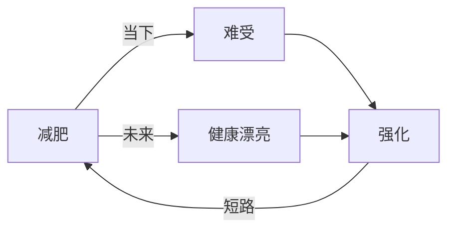

    作者: [美]罗伯特·L.莱希(Robert L. Leahy)
    出版社: 人民邮电出版社
    原作名: Beat the Blues Before They Beat You
    译者: 张淼
    出版年: 2019-6
    页数: 248
    定价: 59
    装帧: 平装
    ISBN: 9787115513458

[豆瓣链接](https://book.douban.com/subject/34633778/)

- [什么是抑郁](#什么是抑郁)
  - [抑郁症是一种现代流行病](#抑郁症是一种现代流行病)
  - [抑郁症的剖析](#抑郁症的剖析)
    - [不同种类的抑郁症](#不同种类的抑郁症)
    - [抑郁症的成因](#抑郁症的成因)
    - [抑郁症的后果](#抑郁症的后果)
- [抑郁者的思维](#抑郁者的思维)
- [“做什么都没有用”：如何战胜你的绝望](#做什么都没有用如何战胜你的绝望)
  - [绝望和抑郁症](#绝望和抑郁症)
    - [你感到绝望的理由是什么](#你感到绝望的理由是什么)
    - [你的绝望是自我满足的预言吗](#你的绝望是自我满足的预言吗)
  - [克服你的绝望](#克服你的绝望)
    - [你需要改变什么来让自己的感觉好一些](#你需要改变什么来让自己的感觉好一些)
    - [什么不是令人绝望的](#什么不是令人绝望的)
    - [你曾经这样做过吗](#你曾经这样做过吗)
  - [当下你是绝望的吗](#当下你是绝望的吗)
- [“我是个失败者”：如何应对你的自我批评](#我是个失败者如何应对你的自我批评)
  - [自我批评和抑郁症](#自我批评和抑郁症)
  - [设定你的标准](#设定你的标准)
    - [设定可实现的目标](#设定可实现的目标)
    - [用自我奖励代替自我批评](#用自我奖励代替自我批评)
    - [进行自我修正](#进行自我修正)
    - [运用双重标准技巧](#运用双重标准技巧)
    - [评估你的评价](#评估你的评价)
    - [观察和接受](#观察和接受)
  - [一本新的规则之书](#一本新的规则之书)
    - [你的思维是如何被扭曲的](#你的思维是如何被扭曲的)
    - [你对自己的核心信念是什么](#你对自己的核心信念是什么)
    - [从一个连续的角度看待自己](#从一个连续的角度看待自己)
    - [不要个人化地解读自己遇到的事情](#不要个人化地解读自己遇到的事情)
    - [运用学习曲线](#运用学习曲线)
- [“我忍受不了犯错”：如何才能感觉自己“已经足够好了”](#我忍受不了犯错如何才能感觉自己已经足够好了)
  - [完美主义和抑郁症](#完美主义和抑郁症)
    - [你是哪种完美主义者](#你是哪种完美主义者)
  - [让“足够好”成为真的足够好](#让足够好成为真的足够好)
- [“我什么事情也做不了”：如何激发你的动力](#我什么事情也做不了如何激发你的动力)
  - [动力的迷思](#动力的迷思)
    - [愿意去做你不想做的事](#愿意去做你不想做的事)
    - [有益的不适感](#有益的不适感)
    - [“我不必做这件事”](#我不必做这件事)
  - [你想成为哪种人](#你想成为哪种人)
    - [有目标地制订计划](#有目标地制订计划)
    - [不抑郁的时候你会做些什么](#不抑郁的时候你会做些什么)
    - [计划和预测你的快乐和效能感](#计划和预测你的快乐和效能感)
  - [权衡得失](#权衡得失)
- [“我就是做不了决定”：如何克服你的优柔寡断](#我就是做不了决定如何克服你的优柔寡断)
  - [你做决定的基础是什么](#你做决定的基础是什么)
    - [心怀目标做出决定](#心怀目标做出决定)
    - [重新权衡](#重新权衡)
  - [没有完美的决定](#没有完美的决定)
    - [不要把确定性当作目标](#不要把确定性当作目标)
    - [多少信息才算足够](#多少信息才算足够)
    - [接受疑问，但仍然要行动](#接受疑问但仍然要行动)
    - [把决定视作实验](#把决定视作实验)
    - [愿意承受一些损失](#愿意承受一些损失)
    - [不要因为追求肯定而使自己受挫](#不要因为追求肯定而使自己受挫)
  - [考量代价](#考量代价)
    - [评估犹豫不决的机会成本](#评估犹豫不决的机会成本)
    - [拒绝沉没成本](#拒绝沉没成本)
    - [缩减成本的方法](#缩减成本的方法)
- [“我一直翻来覆去地想……”：如何克服你的反刍思维](#我一直翻来覆去地想如何克服你的反刍思维)
  - [反刍和抑郁症](#反刍和抑郁症)
    - [反刍对你而言具有什么意义](#反刍对你而言具有什么意义)

# 什么是抑郁
## 抑郁症是一种现代流行病
每年，美国大约有11%的人会患上抑郁症，有19%的人会在一生中的某个时刻受抑郁症之苦，这意味着抑郁症基本上会影响6000万美国人。在我认识的人中，没有一个人不受抑郁症的影响，无论是自己患有抑郁症，还是某个亲近的人患有抑郁症。几乎可以肯定的是，你周围的某个人，可能是你的家人、好朋友、同事，会在某个时刻成为抑郁症的受害者。

为什么我们会前所未有地抑郁？心理学家简·腾格（Jean Twenge）发现，在过去的50年，抑郁症患病率的上升与个人主义的兴起以及缺乏社会联系有关。在19世纪，几乎没有人独居。但是，如今大约有26%的人一个人住。在后面的章节中，我们将会更仔细地探究孤独和人际关系问题是如何影响抑郁症的。历史和文化趋势也对抑郁症有影响。不断更替的流行趋势可能让你感觉自己落伍了，电视上持续报道的坏消息可能会让你变得悲观，而且基于信任构建起来的社区的减少可能会让你持有愤世嫉俗的观点。腾格曾在她的书中介绍了不现实的过度期待和自恋，并把这些趋势与焦虑和抑郁症的患病率上升联系在了一起。

我们的社群感越来越薄弱。在20世纪50年代，美国的工薪阶层会一起去打保龄球，他们常会以自己身着的队服为傲。现在，人们大多都独自一人去打保龄球，如果这项运动还流行的话。人们着了迷一般坐在电视机前，看着其他人在无穷无尽的真人秀中过着“真实的生活”。我们和其他人的联系减少了，这也与焦虑和抑郁症的患病率上升有关。我们一直从这个社区搬到那个社区，从这份工作换到那份工作，成年之后无法和儿时的朋友保持联系，而且公民组织（工会、家长—教师团体、社团、教堂、志愿者组织）的减少让我们更加孤立，进而使我们感觉越来越孤独和抑郁。

我们变得越来越专注于自我，越来越少地与他人联系。

## 抑郁症的剖析
抑郁症不仅仅包含一两个症状，它是由一系列不同的想法、感觉、行为和体验构成的。如果我们给予的诊断结果是“重度抑郁症”，这意味着你的抑郁状态（悲伤、对一切活动不感兴趣）已经持续了两周，而且你至少有以下症状中的四种：
- 感觉自己毫无价值或内疚
- 难以集中精神或做出决定
- 疲劳或精神不振
- 失眠或嗜睡（睡眠过多）
- 没有食欲、体重减轻或增加
- 情绪激动或活动迟缓
- 出现死亡或自杀的念头

### 不同种类的抑郁症
抑郁的表现方式有很多。你可能像我们刚刚描述的那样患有`重度抑郁症`，或者你可能患有持续大约两年时间但程度较轻的抑郁症，我们称之为`“情绪障碍”`。你也可能同时患有情绪障碍和重度抑郁症，这样你就会被诊断为`“双重抑郁症”`。

你需要记住`双相障碍`（过去我们称之为`“躁狂抑郁症”`）的诊断标准和症状。患有双相障碍的人时而情绪低落，时而狂躁，处于狂躁状态时他们会感觉兴高采烈，拥有过高的自尊和充沛的精神。他们说话时语速很快，思绪混乱，他们可能显得极其愚蠢，而且似乎不需要很多睡眠。他们可能会冒不必要的风险，或是性欲异常强烈。拥有上述狂躁症状中的几种，但不是很严重的人的病症被称为“轻度躁狂”。

### 抑郁症的成因
研究者提出，有1/3至2/3的抑郁症成因与你的遗传基因密切相关。具体来说，抑郁症与你的脑化学因素有关。血清素、去甲肾上腺素和其他化学物质水平的不同可能会使你更容易患上抑郁症。即便如此，一些其他的因素——从你被抚养的方式到长大后的经历——可能会使你抑郁发作的风险更高。例如，你的父母不仅传递给你更容易患上抑郁症的基因，他们可能还用导致你感觉无助或自责的方式与你进行沟通，使你更容易患上抑郁症。

### 抑郁症的后果
研究者发现，患有重度抑郁症的人每周的生产性工作时间会减少5.6个小时。以我们在前文中提到的卡伦为例。有时候她无法起床去工作；工作的时候，她常常会坐在电脑前反刍自己的人生有多么糟糕；她会耽误本应该完成的工作。这只会让她感觉更糟糕，因为她担心自己会被解雇。

抑郁症患者更有可能养成不健康的生活方式，包括吸烟、不运动和不健康的饮食。“我会吃冰淇淋和饼干来让自己感觉好一点，”卡伦告诉我，“但是，吃完之后我会感觉很糟糕，因为我知道自己已经失控了。”对于一些患有抑郁症的人来说，这种不健康的生活方式会使他们更容易患上心血管疾病。抑郁也会让他们更容易患上阿尔茨海默病和中风，甚至会影响艾滋病的病情，而且，患抑郁症的老年人寿命更短。

抑郁症给个体带来的最不幸也是最不必要的后果就是自杀。抑郁症患者自杀的可能性比普通人高30倍。

# 抑郁者的思维
抑郁症有属于其自身的思维方式。当你抑郁的时候，你会简化地思考（如“什么都不管用”），你不认可自己做的任何事情（如“我什么事情也做不好”），而且你会用最消极的词汇给自己贴标签（如“失败者”“羞耻”“丢脸”）。你会设定自己永远也达不到的苛刻标准。你可能会认为自己需要得到每个人的认可，擅长做每件事情，或者在尝试做一件事情之前就要确定它会进展得顺利。你的思维方式让你陷入自我批评、犹豫不决和惯性中，形成了一种固化。

# “做什么都没有用”：如何战胜你的绝望
## 绝望和抑郁症
虽然绝望令人很痛苦，但它只是一个症状，它是抑郁症的一部分，而不是你对现实的准确反应。

你可能会认为一切毫无希望，这是因为你感觉抑郁。我们把这称为“情绪推理”。你基于自己的情绪，而不是事实，对未来进行预测。我们不知道未来会是什么样子。想象一下，如果某人说：“现在我感到快乐，所以我绝对相信，在接下来的人生里我也会是快乐的。实际上，我会快乐到狂喜。我会成为世界上最快乐的那个人。”和我一样，你会认为这个人太乐观了。人生有起有落。因此，他会有一些难过，甚至是可怕的经历。这是每个人都会遇到的情况。

### 你感到绝望的理由是什么
你可能认为自己有充分的理由感到绝望。如果我问你：“为什么你觉得未来是黯淡的？”你可能会立刻用一长串痛苦的原因来回答我：“做什么对我都不管用”“世上再也没有好男人（女人）了”“我太老了（不够吸引人、不够富有、不够有趣、是个大负担、老弱病残）”“我比不上别人”“我被诅咒了”以及“我再也没有机会了”。给自己一点时间，想一想你认为未来如此黯淡的理由并写下来，接下来我们会逐一检查它们。

让我们看看你的个人缺点清单，这份清单让你认为没有人会想和你谈恋爱。你可能认为自己得长得像安吉丽娜·朱莉（Angelina Jolie）或布拉德·皮特（Brad Pitt）一样才能找到一个情投意合的人，但是，你错了。我们给你一项任务：去市政厅，走进人们领结婚证的房间，问问你自己，里面的人都是电影明星吗？似乎并不是，或者走进美国的任何一家购物中心，看看周围带着孩子和伴侣享受生活的人，然后问问自己，这些人是完美的吗？你对自己的看法可能被消极地扭曲了，但即使它们是真的，也有许多人愿意去爱一个不完美的人。你只需要给他们一个机会，然后同样愿意去爱一个不完美的人。

或者，想一想你的那个观点：你永远不会变得富有或有名。第一，你并不知道那是不是真的。第二，更重要的是，金钱和名利与幸福没有必然的关联。你可以一直困在这个想法里，即除非你拥有钱和名声，否则你永远不会快乐。但是，这个世界上有许多非常快乐的人，他们不富有，也没有名气，而且有许多富有且有名气的人过着痛苦的生活。你只要浏览《人物》（People）或任何一本八卦杂志，或是数一数富有而有名的人中有多少人离婚了，就会明白我的观点是正确的。

### 你的绝望是自我满足的预言吗
现在，你可能真的相信一切都是令人绝望的，并且你做什么肯定都无济于事。但是，坚信这种信念的结果是什么呢？绝望是一种自我满足的预言，因为你不去尝试做任何可能让你感觉好一些的事情，一旦某件事令你沮丧，你就不再付出努力，而且你无法坚持长期做积极的事情，因此就很难发现这么做会有什么效果。你指望着绝望，所以你不愿意投入任何时间和精力，或者采取任何行动来让情况变得不同。你已经把未来建立在绝望之上，所以你的绝望也会成真。

但是，如果你做了如下两件事情，结果会如何呢？第一，如果你决定怀疑你的绝望，会如何？第二，如果你决定采取行动克服你的绝望，会如何？会发生什么？让我们试试看。怀疑你的绝望仅仅意味着承认你不可能准确预测你的未来。你不能确定自己永远不会快乐。你不能确定自己永远不会拥有你想要的那种亲密关系、让你感觉很棒的工作、高自尊或美好的人生。你可能是抑郁的，但你不是预言家。你对绝望的看法是否也有可能是错的呢？我要你只是心怀一点疑问，承认你对未来将会多糟的看法可能是错的。这个小小的疑问可能是你跨出的一大步，它能够开启你通向未来的新大门。

现在，如果你感觉没那么绝望了，你会做些什么不一样的事情？你会更积极或开朗，制订计划，或是尝试参加一些新的活动吗？如果你决定像做一个实验那样去做，与绝望反道而行，会如何？

让我们想象一下，你对找到让自己的人生更完整的亲密关系感到绝望。试着做一个实验，让自己相信这不是不可能的。告诉自己，你最终一定会找到那种亲密关系。现在你会做什么？我们在第1章提到的卡伦决定尝试做这个实验。她对自己说：“如果我相信我最终会找到某个人，现在我也许能更享受我的生活。我可能会更多地走出家门，参加课程，学一些新东西。我会获得更多的机会。”

## 克服你的绝望
### 你需要改变什么来让自己的感觉好一些
你可能感觉被困住了，而且对未来感到绝望，因为你真的需要改变你生活中的一些事情。安迪就是一个明显的例子。他感到绝望的部分原因是他没有工作，与朋友失去了联络，而且他没有制订计划。所以，应对绝望的第一步就是问一问自己：“我想要处于什么状态？”或者“我想要生活中发生什么？”安迪告诉我，他想感觉自己更有用，他想走出家门，想再次拥有朋友，而且他想获得一份工作。他也想拥有属于自己的钱，那样他就不需要从父母那寻求经济支持。这些似乎都是很好的目标。但是，为了从A点到达B点，他需要做出一些改变。

如果我要从我家开车到一个从未去过的地方，我会用MapQues规划我的路线。我会输入自己所在的位置和我想去的地方。你也可以这样规划你的生活。在友情、亲密关系、健康、适应性、金钱、工作、休闲、精神生活、学习和效能感方面，你处于什么样的状态？你最终想拥有什么样的状态？

作为治疗的一部分，我和安迪主要关注朋友这一方面。他和朋友们失去了联系。从某些方面看，这可能是一件好事，因为他的几位老朋友是酒鬼和药物滥用者。他有机会把自己的精力集中在更能为他带来回报和力量的朋友身上，这些朋友可能会对他产生积极的影响。此外，或许他可以制定一个目标，交一些新朋友。但是，我们得看看建立友谊的过程中涉及什么。我们识别出了安迪在这个领域存在两个问题：他不回朋友的电话；当他和朋友见面时，他只会抱怨。所以，第一步是打电话给朋友，为中断联系道歉，然后制订一些计划。第二步是停止抱怨，集中注意力描述一些他正在做的积极的事情，并且更好地聆听这些他想要与之成为朋友的人的心声。

安迪更深入地意识到，他得改变把自己的问题归咎在他人身上的习惯。那样做不仅不能解决问题，反而会让别人疏远他，而且让他感到更生气。生气和责怪是无助的一种表现，而且这种无助感可能会导致你对任何事情感到绝望。最好和别人分担责任，那样你就不会对改变感到绝望。人们在生气和责怪他人时做不好任何事情。没有人是用责怪和生气建立起一家成功的公司或一段幸福的婚姻的。责怪自己也不会让事情好转。安迪最终意识到，责怪他人或自己，问题还是一样存在，而且他发现，实际上自己有能力改变一直以来让自己感到绝望的一些事情。

### 什么不是令人绝望的
有些人说：“一切都是令人绝望的。”这是抑郁的表现。但是，这个世界上的所有事情怎么可能都是令人绝望的呢？即使你的亲密关系是令你绝望的，你也会穿戴整齐、吃午餐、工作和见你的朋友。所以，绝望的感觉是普遍存在的，绝望的人会觉得好像什么事情都不对劲，但是这是一种曲解和夸张。如果你辨认出了生活中不令人感到绝望的事情，你就可以对未来重燃希望，然后重新规划要把精力放在什么事情上。

让我们以贝蒂（Betty）为例，她正在经历第二次离婚。她对与丈夫卡尔（Carl）和解感到绝望，也对自己的余生感到绝望。她一直在反刍着：“如果我们能复合，我就可以再次快乐起来。”但是，那似乎是不可能的。和卡尔复合真的令她感到绝望，但是，她会因此认为自己的整个人生都是绝望的。

我让贝蒂想一想她和卡尔结婚前的生活是什么样的，她曾经在做哪些事情的时候感觉很享受？我和她一起制作了一份清单，列出了许多能带给她快乐的事情，包括和朋友见面、工作、学习、听音乐、旅行、锻炼、养宠物、探索城市、远足、参加帆船运动和认识新朋友。然后我问她，如果在和卡尔结婚之前她可以享受自己的生活，那么现在没有了卡尔，她为什么就不能享受自己的生活呢？所以，我们按照她的清单制订了一个对抗绝望的计划，为每天、每周、每月以及下一年制定具体的目标。

第一天，贝蒂制定了目标清单，然后打电话给一位朋友，把计划中的活动提上了日程。第一周，她重新走进健身俱乐部，制订晚餐计划，并且更加专注于工作。她的长期计划包括旅行、参加一些课程（她想丰富自己在商业方面的知识），以及认识一些新朋友。贝蒂不再关注真正令她感到绝望的事情，即和卡尔的婚姻和使她产生的悲伤的感觉，她开始集中精力实现不令她感到绝望的目标。她的情绪开始缓解，她开始对自己感觉更好。尽管贝蒂依然有一些抑郁症的症状，但是她的绝望感已经减轻了。“我意识到，通过每天做些什么，我逐渐能取得一点点进步，”她说道，“我有目标了，而且这给我带来了希望。”

### 你曾经这样做过吗
另一种正确对待绝望的情绪的方法是，承认你曾经对一切事物感到绝望，而且你是错的。回顾你的人生，问问自己是否曾经有过如下这些想法。
- 我永远克服不了抑郁症。
- 我永远不会再快乐起来。
- 我永远不会拥有另一段亲密关系。
- 我会一直孤独下去。
- 我永远不会取得成功。

现在，请回顾你的人生，检验这些事实。假设五年前你对自己说过，你永远不会再快乐起来。在那之后你有没有微笑或大笑过呢？

在之前的人生中，贝蒂有过一些绝望的想法和一些绝望的阶段。五年前，她尝试过自杀，住院过两次，而且离过婚，这给她带来了非常严重的后果。但是，事实是，她在第一次离婚后抑郁了一段时间，然后她克服了抑郁，在遇到了卡尔后坠入爱河并再次结婚。有一段时间她生活得很幸福，在工作上她也取得了一些成就。所以，她在渡过绝望时期之后变得更积极了。

你可能会觉得生活毫无希望，因为你认为现在自己所面对的障碍太多了，难以跨越。但是，所有人都在人生的某个时刻克服过困难。你可能只关注目前的情况有多么糟糕，以及未来会有多么糟糕，但是你在过去曾经克服过的那些障碍呢？

想一想，而且在想的时候，请记住绝望可能是暂时的。过去你对绝望的判断是错的，这次你可能也错了。在你尝试过之前，我们不知道这次的情况是否是令你感到绝望的。

## 当下你是绝望的吗
绝望总是关于未来：“我永远也不会快乐”“我永远也不会拥有我想要的那种亲密关系”或是“我会一直是个失败者”。你在预测未来，所以，从定义上来说，你没有活在当下。

现在，你需要回答的一个问题是：“当下你是绝望的吗？”

你在当下觉知到了什么？可能你正坐在房间里，读到这一段文字，而且是独自一人。但是，当你读这一页的内容时，我和你正把注意力集中于你此刻所想的内容和体验到的一切。所以，让我们看看，我们可以在当下做些什么。首先，把注意力集中在你的呼吸上，留意到它像空气一样流进、流出。让自己退后一步，就像从远处观察你的呼吸一样。不要试着控制它，不要评判它，不要试着让它变得更缓慢或更深入、更好或更坏，只是观察自己吸气、呼气。现在，保持这样呼吸几分钟。当其他想法进入你的大脑时，让它们就这样消失，然后让自己的注意力慢慢重新回到呼吸上。

现在，我想让你拿出一些很好闻的东西，如一个橙子、一个松果或一瓶香水。如果你拿的是橙子，那么把皮削掉，然后闻一闻这个橙子。请留意橙子的微妙香气。可能你从来没有像这样花时间闻一个橙子的气味。这种味道会让你在吃这个橙子的时候更加享受吗？如果你拿的是松果，那么用你的指尖触摸它，触摸每一条纹路。它上面有汁液吗？如果你选择了香水，那么在你的手腕或脖子上喷一些。现在，轻轻地闻一闻它的味道。试着去留意不同层次的香气，和香气一起留在当下，留意香气是如何出现又消失的。

现在，把这些东西放在一边。我们将尝试一些别的东西。

我希望你闭上眼睛，想象月光下的森林。地上有积雪，雪花还在慢慢飘落，一次一片。你留意到，每片雪花都慢慢地飘落，它们一边非常轻柔地飘落，一边抚摸着夜色，最后落在了积雪上。雪花飘落时，你可以感受到冰凉的空气和雪花。你留意到缓慢落到地上的雪花的形状。

现在，想象自己是飘落的雪花。你是飘落的雪花，不断地重复想象这个过程。你是夜色中一片飘落的雪花。你是飘落的雪花，一次一小片，不停地飘落。你在夜色中飘落，月光洒下，周围寂静、平和。你和雪花一直在飘落，接连不断。

停留在此刻。寂静、轻柔、自然，在雪花周围的月光中。保持平静。

如果你能够做这三项练习：观察你的呼吸、闻香味，以及在想象中看着雪花飘落，你就已经摆脱了绝望，进入了当下，已经完全活在此时此刻。

当下没有绝望。此时此刻不是未来，它是现在，此时，此刻。在这个时刻，你就是你。一个又一个时刻，一片又一片雪花，一次又一次呼吸。重复，然后回归。留在此刻，放手，然后另一个时刻来临了。

然后，你重获新生。

当你活在当下的时候（体验、聆听、感受、品尝、感觉），你会认识到，自己现在就可以找到一种让自己感觉活在当下的事物。活着就是有意识。活着就是完全觉知。放下你的评判，放下控制的需要，放下未来，就留在当下。当下没有绝望，而且也没有希望，只有你当下的体验。

# “我是个失败者”：如何应对你的自我批评
## 自我批评和抑郁症
对许多人来说，自我批评是抑郁症的一个核心特征。它的具体表现是责怪自己（“都是我的错”），给自己贴标签（“我不敢相信我有多么愚蠢”），讨厌自己（“有时候我都受不了我自己”），怀疑自己（“我就是无法做出正确的决定”），以及忽视自己的优点（“任何人都可以做那件事，那不难”），而且当你自我批评时，最小的错误或最不起眼的缺点都会使你自我厌恶。如果你打翻了一杯咖啡，你就是个笨蛋。

自我批评的问题是，它和抑郁症的许多其他症状有关系。例如，你在反刍时可能会关注一些自我批评的想法，关注你做错的某件事或你身上的某个问题。看看下面这份清单，对你来说，自我批评是否和以下内容有关。
- 反刍：我一直翻来覆去地想我是怎么把事情搞砸的。
- 不公平的比较：我一直把自己和表现更好的人作比较，而且我不够优秀。
- 无法享受活动：当我做某件事情的时候，我无法享受过程，因为我常常会想自己做得有多么糟糕。
- 犹豫不决：我做不了决定，因为我对自己没有信心。
- 害怕后悔：我无法做出改变，因为如果达不到理想的目标，我会感到后悔。
- 无助：我做任何事情都很难，因为我认为我做任何事情都无法改变我的生活。
- 孤立：我在人群中的时候很难受，因为我感觉自己没什么能给别人的。
- 害怕亲密：我害怕与他人建立亲密的关系，因为一旦人们了解了真实的我，他们就会拒绝我。
- 悲伤：我很难过、灰心，因为我的自我感觉并不好。

## 设定你的标准
### 设定可实现的目标
当你设定目标时，它应该是你可以每天实现的。你会感知到每天都有成功的机会。例如，当我想到截稿日期时，我会对自己说，写一个小时吧。这对我来说是一个可以实现的目标。我不会说，今天写出一本书的内容吧，因为那根本就不现实。

### 用自我奖励代替自我批评
当你感觉很好的时候，对自己说一些积极的话语并不难，如“做得很好”或是“我很高兴自己努力了”。但是，当你抑郁的时候，这种自我奖励的行为可能不会出现，你只会自我批评。所以，当你实现了某个目标时，请努力对自己说一些积极的话。制作一份自我鼓励的话语清单，这样当你需要的时候，你就可以随时脱口而出。例如：“我真棒。”“我努力过了。”“我正在取得进步。”“我做成了某件事。”“我正在向着目标前进。”“我比之前做得好。”“我付出了很大努力，这让我感觉很棒。”

### 进行自我修正
诚实对待自己的错误。例如，汤姆意识到，认为自己可以一辈子在银行工作是错误的想法。与把自己孤立在公寓里，满脑子羞耻的想法，反刍着自己“是一个失败者”相比，他可以采取积极的行动，计划如何寻找另一份工作。我们通过讨论发现他可以联系几个人，让他们知道他正在找工作。他可以给一些招聘企业投简历。他可以打电话给朋友，与朋友一起吃午餐，探讨未来的规划。他可以做些什么来修正自我批评赖以生存的消极和孤立。

与其批评自己，不如问一问自己如下这些问题。
- 有没有更好的做这件事的方式？
- 我可以学到什么？
- 谁在这方面做得更好，我要如何向他学习？

### 运用双重标准技巧
试着聆听自己的心声，想象自己严厉地批评别人的状况。你会像对待自己那样严厉地对待别人吗？在运用双重标准技巧时，你需要用给自己设定的苛刻标准对待别人，或是像对待别人一样宽容地对待自己。

### 评估你的评价
我们常常会通过将自己和别人作比较来评估自己，而且如果我们容易患上抑郁症，我们会将自己和比我们表现好的人作比较。我们会用完美的标准来评估自己。

但是，为什么我们要评估自己呢？

让我们想象一下，我完全处于当下，假设我正在观察一只蝴蝶。我在欣赏它那多彩翅膀的美，而且我喜欢看着它在百合花上飞舞。我正在当下欣赏蝴蝶的一切。我把全部注意力集中在这只蝴蝶上。在当下，我没有评估自己，也没有将这只蝴蝶和其他蝴蝶作比较。我正在观察、放手、欣赏，只处于当下，我感觉很棒。

想象我坐在椅子上，我决定尝试一下正念呼吸。在练习过程中，我只是观察我的呼吸——吸气、呼气。我感觉空气进入了我的胸腔，然后被吐了出去。但是，我很快留意到我在评估自己做得怎么样：“我呼吸得太快了吗？我做得对吗？”现在，我甚至在评估我的呼吸。这种自我评估真是永无休止。

所以，我可以再次尝试呼吸练习，然后留意可能干扰简单的呼吸和观察的任何想法。当我留意到评估的想法出现时，我可以观察这种想法，然后决定让它就这样消失。我可以想象这个想法随着一股气流飘走了。它可能会回来，然后再次消失。当另一个想法出现时，它乘着空气进来，然后又乘着空气离开。我不需要回答这些想法，只是看着它们进来，然后离开。当我的评估想法在我的脑海里游荡时，我感觉更放松了。它们最终会烟消云散。

### 观察和接受
如果你走到外面，看着天空，你可能会观察到一些云朵轻柔、缓慢地在远处漂浮着。然后，请后退一步，观察它们，留意它们的形状和运动轨迹，留意它们是如何随着风以不同的速度飘浮的。一些云彩颜色较深，一些云彩颜色较浅，一些云彩体积较大。想象自己正在试着给这些云彩上色，所以此刻你正在尝试观察颜色深浅不一的云彩。

现在，想象自己成了云彩的一部分，比空气还轻。此刻，你已经成为一朵云，并且正在和其他的云一起飘浮在空中。你从地球上空看到自己——一朵云。你和其他云朵一起轻柔、缓慢地飘浮着，穿过地球的大气层，你想象自己变成了从早到晚飘来飘去的云朵的一部分。

你可以安静地闭上眼睛几分钟，想象飘浮的云朵、地球，以及这种思绪的出现和消失。

你刚刚练习了正念觉知，只关注和云朵在一起时的感觉，处于当下。你不需要评估自己或云朵。你不需要控制任何事情。你只是观察此刻它们的情形，而且你接受它们当下的样子。

你每天都可以做这项练习，只要你留意到你在评估自己，就可以这么做。

现在，你可以把注意力转向观察和接纳这些评估。

你需要观察和接纳什么呢？

一开始，你可以观察到自己有一个消极的想法。此刻，想法就在那里。不要试着摆脱这个想法，或对它感到生气，你可以说：“又见到你了。”你可以欢迎这个想法，你可以邀请这个想法和你一起散步。

让我们想象你的消极想法与你同行的情况。

你走在路上，消极想法正在喋喋不休地批评你，你可以决定接受它们存在的事实。你甚至可以让它们和你一起观察。你可以说：“让我们看看，在我们面前的人行道上有些什么。”你留意到，你走在人行道上，有一位母亲推着一辆婴儿车。婴儿穿着一件淡蓝色的衣服。当你看着车上的婴儿的时候，他的母亲朝你微笑。你观察到她似乎很快乐。

你的消极想法可能依然和你在一起，但是当下你正走在人行道上，观察和接受着面前的一切。

可能你感觉自己的状态不佳，可能你认为自己在工作中没有发挥出最好的水平；可能你确定你的生活可以更好。不要因为事情不如你所愿就批评自己，你需要接受现实。有时事情并不会朝着我们期望的方向发展，但是情况也许会朝积极的方向发展。但是，你发现现在你有了一个选择：我可以批评自己，也可以观察并接受现实。

如果你接受自己的现状，你最终可能会有所好转。但是，如果你一味地批评自己、讨厌自己，你就会阻碍自己前进。不要用任何标准来衡量自己，而是对自己说：“我就是我。”

## 一本新的规则之书
许多人对自己应该是什么样的以及应该如何思考设定了一些规则。这些规则之书可能让我们担心、后悔、自我批评、焦虑和抑郁。看看表4-1中的适应不良规则之书是否和你的那本一样。

如果你用自我肯定的规则（让你对自己感觉更好的规则）代替自我批评的规则，会如何？让我们来看一看如下几个规则。

- 如果我犯了一个错，我意识到这是因为我是一个普通人。
- 我可以从错误中吸取教训。
- 我应该像对待别人一样对待自己。
- 我应该认可自己所做的任何积极的事情。

如果你遵守这些新规则，你认为自己会发生什么样的变化？花一点时间想一想自己正在运用什么规则，以及它们正在对你产生什么样的影响。

表4-1 适应不良规则之书

- 我尝试去做的任何事情都应该成功。
- 如果无法取得成功，我就是个失败者。
- 如果我失败了，那么我就是没有价值的（我是不讨人喜欢的，我不值得活下去）。
- 失败是不能容忍和不可接受的。
- 我应该得到每个人的认可。
- 如果我不被认可，我就是不讨人喜欢的（丑陋、毫无价值、绝望、抓独）。
- 在我尝试做任何事情之前，我应该有十足的把握。
- 如果我没有把握，结果就会很糟糕。
- 无论何时我都不应该焦虑（抑郁、自私、困惑、不确定、因伴侣而感到不高兴）。
- 我应该时刻防范任何引起焦虑的事物。
- 如果我放松，一些糟糕的事情就会发生。
- 如果我犯了个错，我就应该批评自己。
- 我应该时刻用最高的标准要求自己。
- 除非我把事情处理得非常完美，否则我就不应该表扬自已。
- 我应该反复思索自已犯下的错误，那样我就可以避免重复犯错。
- 如果人们发现我非常焦虑，他们就会小瞧我（拒绝我、羞我）。
- 我的性生活（感觉、行为、亲密关系等）应该始终是愉悦的和惬意的。

### 你的思维是如何被扭曲的
这些扭曲的想法称为“消极自动想法”，因为它们和感到抑郁或焦虑有关，而且它们会不受控制地出现在你的头脑里。我们可以把这些想法分成几类，我们在第2章中提到过。那些和自我批评最直接相关的是忽视积极的事（认为好事情没有价值的倾向）、灰色眼镜（关注消极的方面，看不到积极的方面）、非黑即白思维（你要不就是0，要不就是100%，没有处于中间的可能）、贴标签（根据有限的信息给自己贴标签），以及以偏概全（你抓住一件偶然发生的事情，然后把它与你的生活的方方面面都关联起来）。

### 你对自己的核心信念是什么
每个人都对自己持有一种核心或重要的信念。当你抑郁的时候，你的核心信念会过分消极。这种信念可能是你没有魅力、乏味、无能、无助、不讨人喜欢，或者你拥有其他一些不受欢迎的特质。你的核心信念就像一个阴影滤镜，你透过这个滤镜看这个世界，而且你的核心信念会导致你产生某些扭曲的思维，这些思维会支持你的消极态度。

除了你的核心信念和消极的扭曲思维外，你也拥有一套苛刻的、消极的规则，我们在前文中（适应不良规则之书）探讨过这一点。你的消极核心信念、扭曲的思维以及适应不良的规则之书一起支持和强化你对自己的消极态度。

看看图4-1，注意你的核心信念、消极扭曲的想法，以及适应不良的规则三者之间的关系。你立刻就能清晰地看出你的抑郁症是如何被你的信念系统强化的，你的抑郁症又是如何强化这些信念的，实际上这是一个恶性循环。同样，我们可以通过改变你的任何层面的信念来打破这个循环，但是，最重要的层面就是你的核心信念。

### 从一个连续的角度看待自己
当我们贬低自己时，我们通常在用非常高的标准来评判自己。我们认为，除非我们是完美的，否则我们就是失败者。

你不需要是完美的，也可以成为一个足够好的人。一个有帮助的方法是，想象自己处于0到100分之间。现在，没有人是100分。你处于0到100之间的某个点。如果你给自己的成就、财富、外貌、性格、价值观、善良或接纳他人的程度打分，而且你认为普通人是50分，那么你分别会得多少分？

### 不要个人化地解读自己遇到的事情
我们都倾向于认为自己是宇宙的中心。所以，当你批评自己的时候，你在想：“我做了这件事，所以是我的错。”就好像结果完全取决于你做了某件事，或者没做成某件事一样。汤姆就是一个很好的例子，他认为丢了工作完全是因为自己，就好像银行裁员是因为自己不够好一样。实际上，这根本不取决于汤姆，银行裁员是许多其他因素导致的，而这些因素都和他无关。

### 运用学习曲线
表4-2介绍了一些常见的自我批评的扭曲思维，还有一些更符合现实思维的例子，能帮助你更恰当地对待内心的“批评家”。

表4-2 纠正批评家

扭曲的思维 | 更现实的思维
------|-------
忽视你的成就：任何人都可以做那件事 | 真的吗？但是，不是每个人都会取得与你相同的成就。如果你在意消极的事，你也应该重视你取得的成就，那才公平。难道你不认可别人所取得的成就吗
非黑即白思维：我什么事情也做不对 | 任何事情吗？当然，你做对过很多事。你不需做到完美，也可以认可自己已所取得的成就
灰色眼镜：看看我做得有多糟糕 | 可能你没做好这件事，但是，你很擅长做其他事情，而且你确实从中吸取了一些教训
贴标签：只有失败者才会像我做得这么糟糕 | 我们都会犯错，这意味着，在你看来，我们都是失败者。聪明、成功、有价值的人犯过很多错误。你问问周围你崇拜的那些成功人士是否会犯错。我打赌你会发现，他们也犯过错。不同之处是，他们会从错误中学习，而你在忙着批评自己
以偏概全：我总是把事情搞砸 | 你再一次陷入了极端思维。你可能犯了错，也可能没犯错，但是，这并不意味着你总是会把事情搞砸。难道你没取得过任何成就吗？你最好的朋友会对你说些什么

# “我忍受不了犯错”：如何才能感觉自己“已经足够好了”
## 完美主义和抑郁症
当你抑郁的时候，你会把错误归咎于自己。你认为，如果你犯了一个错，那就完全是你的错，不该责怪别人。你认为，你应该预知未来，而且你认为，一个错误不仅是你在前进道路上的麻烦或波折，而且是一场灾难。当你犯错时，你会给自己贴上最严厉的标签：“我是个白痴。我很蠢。我做不好任何事情。”

你对犯错的担心，以及自我批评、反刍和之后的悔恨，让你很痛苦。担心会让你变得犹豫不决、与世隔绝，让你不敢冒险，你又怎么可能会去尝试新东西呢？由于担心自己可能会犯错，你被困在了恐惧当中。

我们的目标不是消除错误，而是学习承认错误，接受错误，甚至利用错误来成长。如果你在犯错后继续前进，那么你就能自己做决定并且从经验中不断学习和进步。优秀的决策者懂得，错误是“游戏”的一个组成部分，而且他们能很快接受错误，减少损失，然后继续做下一个决定。他们说：“要玩这个游戏，你就得付出代价。”

### 你是哪种完美主义者
有些完美主义是有适应性的。例如，你可以为自己设定高标准，非常努力地工作，并且从成就中获得满足感。`适应性完美主义`可以帮助你坚持不懈，帮助你以自己所做的事为傲，并且帮助你实现有价值的目标。如果你拥有这种健康、积极的完美主义，你就不需要批评自己或强迫自己实现不可能达到的目标。

当你的标准高得不切实际时，你的完美主义就变成了非适应性的，你会过分担心自己得到消极的评价，而且你无法从自己所做的事情中获得满足感。当你是`非适应性完美主义`者时，你会关注自己的“缺点”，在头脑中将其放大，以至于最终变得让你完全无法忍受。这种完美主义会让你焦虑、担心、抑郁，而且它甚至会引发拖延症，因为你不认为自己可以把某项工作做好。

我们把这两种完美主义称为`“社会完美主义”`和`“个人完美主义”`。个人完美主义反映了你如何评价自己，你对自己的过高标准、你的怀疑、对错误的关注程度，以及强迫性地需要确保事情是有条理的。你的“社会完美主义”关注的是你眼中其他人为你设定的标准（你的父母可能会怎么想，你的朋友可能会怎么说），以及你对任何批评的担忧。你尽力做到完美，以避免其他人批评你。当然，你可能同时具有个人完美主义和社会完美主义，这种情况更糟糕，因为你将无处可逃。

完美主义还有第三个维度，即你对其他人应该如何表现所设定的标准。你会评判其他人，忍受不了他们犯错，而且常常对其他人感到失望和生气。所以，如果你的同事或伴侣不按照他们“应该”遵守的标准行事，你就会非常生气。这会引发更多的争吵和不满，而且让你更抑郁。

## 让“足够好”成为真的足够好
“成功的不完美”意味着，你已经放弃了100%的标准，而且你愿意设定更低的标准，可能是90%或80%，可能你愿意满足于仅仅比上一次做得更好，可能你甚至愿意满足于尝试付出努力。

成功的不完美的关键是拥有合理的高标准，推动自己取得进步，认可自己的努力和进步，并且坚持下去。成功的不完美比绝对完美主义的效果更好。它是更好的，它几乎是“最好的”。

现在，问问你自己：今天我可以做哪些不完美但是能让我进步的事情？

# “我什么事情也做不了”：如何激发你的动力
当你抑郁的时候，你很难行动起来。你会等待自己产生动力，但那个时刻似乎永远也不会出现。你就像是一只冬眠的熊，你需要保存能量，坐在你的“洞穴”里，等待环境变得好一些。你想到自己可以做的一些事情，但是，这些事情似乎都无法令你感到兴奋。你想着，做任何事都太麻烦了，做不了任何事情的感觉会导致你越发远离朋友和活动，而这种状态会让有意义的体验变得更少。你会开始感觉更无助，就像自己根本什么事情也做不了一样。最终，你会开始批评自己，因为你什么事情也不做。这会让你更抑郁。这是一个恶性循环。

## 动力的迷思
“让我们想象一下，如果你不再等待动力出现，情况会如何？假设你决定去健身俱乐部锻炼身体，虽然你还是没有动力。你只是做了个决定，然后真的这么做了，会发生什么？”

珍妮弗看着我说：“我可能会感觉好一些，因为我真的在做一些事情来帮助自己。”

“是的，或许这么做会让你产生完全不同的感受。即使你没有动力，即使你感觉疲惫、气馁或无聊，你也可以做一些事情。”

“你是对的，”她承认道，“有时候我并没有动力，但我还是会去健身俱乐部。”
“或许，动力晚些时候会出现。在做了一些别的事情后，或许你会更有兴趣做一些事，又或许行动可以创造动力。你留意到这一点了吗？”

“我猜是的，”珍妮弗说，“有时锻炼完身体后，我发现我会更有精力去做别的事情。”

“让我们换个角度想象一下，如果你今天决定做一些自己没有动力去做的事情。你可以制作一份清单，在上面列出曾经让你感觉更好，即使你没有动力也会去做的事情。你不应该等自己想做这些事情的时刻来临，而应该主动地做一些事情。让我们看看，在你做这些事情一周以后，你的整体动力水平会如何。你每天都做一些自己没有动力去做的事情。”

### 愿意去做你不想做的事
你可以这样想。你是如何让自己愿意去做你不想做的事情的？因为你认为这件事足够重要，所以你需要去做。你不知道自己是否会取得成功，即使你很累、感觉头痛或没有准备好，你还是做了，你选择去做这件事。

当你做了你不想做的事情的时候，会发生什么？你取得了进步，你感觉自己获得了力量。你意识到，缺乏精力和动力不能阻止你去做需要完成的事情。你依靠自律做了自己不想做的事情。

想一想做某件事对你来说是有益的，但是你真的不想去做。问问你自己，你是否愿意去做这件事？

在下面的空白处完成这个句子：“我愿意……”

    _____________________________________
    _____________________________________
    _____________________________________

### 有益的不适感
我们若想在生活的各个方面取得进步，就要忍受一定的不适感。减肥需要锻炼，建立更好的亲密关系可能需要耐心和忍受挫折，做决定需要忍受不确定性引起的不适感。面对恐惧可能意味着你需要忍受焦虑。产生不适感是不可避免的。刚才我们了解到，做自己不想做的事情很重要，现在你可以更注重锻炼自己忍受不适感的能力。我把这种不适视为`“有益的不适感”`。

有益的不适感是什么？它是为了让你实现自己的目标，去做会让你不舒服的事情的能力。把不适感想成实现目标的手段及一种工具。

以下是一些简单的练习，你可以借助这些练习来培养你对不适感的忍耐力。
1. 回顾不适感的历史：有哪些事情是令你不舒服的，但你最终还是做了？
2. 把不适感和自豪感联系在一起：你曾经对哪些事情感到骄傲？当时是否有一些不适感？
3. 给自己一些不适感：记录你做过的令你不舒服的事情。看看不适感是否和你完成的这些事情有关。
4. 明白不适感是暂时的：所有的不适感都是暂时的。它不会毁了你，实际上，它会让你更强大。

你可以把自己的不适感当成一项投资，以此敦促自己去做需要完成的事情，那样你就可以得到自己真正想要的东西。

练习适应不适感就像是锻炼精神肌肉，这叫作`“自律”`。

不适感是暂时的，而自豪感是永久的。

### “我不必做这件事”
你“不必”做某件事的想法是阻碍你进步的另一个障碍。例如，在和恋人分手后，你可能会想：“我不必经历这种事，我不必孤身一人。这种事情确实让人很难承受，而且往往不公平。有时候，一些最糟糕的事情会发生在最优秀的人身上，而且，当你意识到现在你必须做更多的事情来处理你的痛苦感受的时候，你可能会感觉更加不公平。

看待这种情况的一种方法是意识到你没有选择。你的选择只有：（1）做些什么让情况有所好转；（2）什么都不做。你遇到的事情可能是不公平的，甚至可能是令人痛苦的。但是，这件可怕的事情在今天之前已经发生了。今天，你可以问问自己，是否可以做些什么来帮助自己应对这种不公平且可怕的经历。

我们常会发现自己会做出明智的选择，去做我们“不应该”做的事情。为什么我们会这么做？

因为，这对我们有利。这样做可以让我们活得更好。

## 你想成为哪种人
当我们在生活中遇到一个危机时，我们倾向于集中注意力从我们现在的糟糕感觉中解脱出来。这是很自然的。但是，你也可以把自己的抑郁看作一个重获新生的机会。你想成为等待事情发生的人，还是主导事情发展方向的人？等待感觉变得好一些意味着你是被动的。做需要去做的事情意味着你可以完成更多事情。你想成为哪种人？一个“等待者”，还是一个“行动者”？

在努力成为你想成为的那种人的过程中，你需要知道自己的目标是什么。珍妮弗认识到，她想做一个善良、慷慨、诚实的人。但是，她也意识到，自己需要养成自律的习惯，使自己能在情绪消极的时候采取行动，去完成很难完成的事情。

你想成为一个能主动完成事情、不拖延，能够处理困难的事情，即使在自己并不情愿的时候也会去解决问题的人吗？还是你想成为一个等待动力出现，只愿意做轻松、令人感到舒服的事情的人呢？你想成为一个设定目标，然后可以在很长一段时间里坚持做艰难的事情，实现自己的目标的人吗？还是你想成为一个只要感到沮丧就放弃的人呢？

这都由你来决定。

请完成以下的句子：“我想成为……的人。”

    _____________________________________
    _____________________________________
    _____________________________________

### 有目标地制订计划
请记住，你需要时刻想到你的目标，当你分配精力和时间时，需要参考这些目标。把这些目标分解成每天、每周以及更长期（下个月，甚至明年）的目标是个好主意。珍妮弗每天的目标是：在醒来后的十分钟内起床、洗澡、吃早饭、去健身俱乐部（一周三次），并且准时上班。她每周的目标包括：和朋友见面、回复漏接的电话，以及每周去看一场电影或去一次博物馆。长期目标包括她想参加一个电影课程、和一个朋友去度假，以及出门约会几次。

你可以在下面的空白处写下自己的一些目标。尽量具体一些，因为“每周去健身俱乐部两次”要比“保持身材”这样的模糊表述更管用。

列出你想在明天实现的一些目标：

    _____________________________________
    _____________________________________
    _____________________________________

列出你想在下周实现的一些目标：

    _____________________________________
    _____________________________________
    _____________________________________

列出你想在明年实现的一些目标：

    _____________________________________
    _____________________________________
    _____________________________________

### 不抑郁的时候你会做些什么
摆脱抑郁症的一种方法是，去做你在不抑郁的时候会做的那些事。表现得就好像你不抑郁一样，也许可以使你摆脱抑郁症。珍妮弗知道自己在不抑郁的时候很活跃，她会去健身俱乐部，按时起床，完成更多工作任务，不会坐在办公桌前分心浏览一些毫无意义的网站，经常和朋友见面，外出参加文化活动。

当你不那么抑郁的时候，你会更多地做哪些事？写下一些可能成为你菜单中的“菜品”的一些想法。

    _____________________________________
    _____________________________________
    _____________________________________

### 计划和预测你的快乐和效能感
当你抑郁的时候，你的悲观情绪会让你认为无论做什么都是浪费时间，你不会从中获得任何快乐，而且你不会有效能感或感觉自己有能力。但是，发现生活中潜藏着哪些惊喜的唯一方法就是进行一场实验，测试你的悲观情绪。你可以用表6-1预测你期望从自己计划的一项活动中获得的快乐和效能感。然后，当活动结束后，回顾并记录你的真正体验。这就很像我们在第2章里做过的练习，你需要记录自己的快乐和效能感，来了解自己是如何对不同的活动做出反应的。但区别是，你将做出预测，然后和真正的结果进行比较。

这种自助练习是非常有益的，原因有几点：它能帮助你提前做好计划，那样你就有了可以期待的事情；它能帮助你意识到，有一些活动是与不愉快的事情和低效能感有关的，如坐在家里看电视可能是没有益处的；而且它还能帮你认识到，有一些活动（如和朋友见面、锻炼、外出、给朋友打电话）是有益的，这可以让你产生效能感。你可以把这些活动加入你的回报菜单中，然后开始安排自己做这些事情。最重要的是，你会知道你的消极预测（“做这些是浪费时间”）是否准确。

使用表6-1的方法是：填写接下来的一周的每个小时你计划做的事情，以及你认为自己将体验到多少快乐（P），就像你在第2章中所做的那样，0代表一点也不快乐，10代表你可以想象到的最快乐的状态，并用相同的衡量标准确定并写下你预期会感受到的效能感。例如，如果你预测周一早上8点锻炼身体会带给你的快乐程度是3，效能感是4，那么在周一早上8点对应的格子里写上“锻炼，P3，E4”。然后，在你锻炼完之后，在同一个格子里写上你实际体验到的快乐程度和效能感。

表6-1 每周活动日程

时间 | 星期一 | 星期二 | 星期三 | 星期四 | 星期五 | 星期六 | 星期日
---|-----|-----|-----|-----|-----|-----|----
早上6点
7点
8点
9点
10点
11点
中午12点
下午1点
2点
3点
4点
5点
6点
7点
8点
9点
10点
11点
12点
凌晨1点到6点

## 权衡得失
如果你愿意做出与你的目标和你想成为的那种人相关的选择，而且如果你愿意做自己不想做的事情，那么你就准备好了验证在你真正做了一些事情之后看看会发生什么。你需要问自己的第一个问题是，“做这件事的代价是什么，益处是什么”；第二个问题是，“在获益之前，我愿意坚持多久”。

让我们先来看看做某件事的代价和益处。以锻炼为例。锻炼30分钟的代价是什么？你可能会感到疲劳、流汗，甚至有些不舒服。但你也不能躺在那里看电视，或在电脑上搜索一些没意义的内容。你已经说服自己，这些是令人愉快的打发时间的事。好的，现在想一想锻炼的益处：你可能因为采取了行动而感觉更好，锻炼可以让你不再关注自己的消极思维，锻炼完之后你可能会感觉更有活力，而且在锻炼时你的大脑可能会分泌内啡肽，你可能会从中获益。现在，想一想长期锻炼的益处有哪些？如果你每周锻炼五天，或者连续锻炼六个月，会怎么样？益处会是什么？你随即就会发现，通过反复地做积极的事，回报会越来越多。

用表6-2来分析一件你正考虑要去做的事情的代价和益处。

表6-2 得失分析

代价 | 益处
---|---

你也可以考虑另一个选择，那就是什么也不做。什么也不做的代价和益处是什么？代价是你可能会缺乏效能感，而且你做不成任何事情，你会保持抑郁的状态。益处是你不会“浪费”你的时间和精力。

# “我就是做不了决定”：如何克服你的优柔寡断
当你抑郁的时候，你常常会认为自己做出的任何决定都可能让事态变得更糟糕。你主要关注消极的一面，你感觉如果出现了坏的结果，你将无法面对，而且你知道，当事情进展不顺利的时候，你常常会责怪自己。结果就是，在做决定之前，你会需要越来越多的信息，这让你挪不动脚步。或者，你可能会在做任何事情之前从别人那里寻求认可。你会被困在做出改变的利与弊的比较中，你常常会耽搁、拖延、回避，或只是站在原地，而且当你无法决定要采取什么行动或到底是否要采取行动的时候，你会感到无助，你相信自己永远无法实现自己的目标，这会让你感到绝望，进而让你的病情加重。

## 你做决定的基础是什么
无论是否抑郁，我们都常常基于一时的感觉来做出决定。温迪似乎是根据自己现在的感受，或者在接下来的10分钟内可能产生的感受来做出决定的。如果她去健身俱乐部，而且试着决定要做什么锻炼项目，她会想：“踩椭圆机我可能会觉得很累。”或者，当她想着要给一位朋友打电话时，她会想：“和珍妮（Jenny）通话可能会让我觉得不舒服。”有时候我也是这样。今天是星期日，我在早上6点45分起床。我计划今天早上要写一点东西，但是我感觉懒洋洋的。我想继续睡觉，又想看新闻，还想上网看一些没意义的信息。我想：“噢，写有关犹豫不决的内容会令人不太愉快。”现在是星期天的早晨，难道我不该休息一下吗？讽刺的是，我很难做出决定，不过，这种情况只持续了大约10分钟。

我的长期目标和价值观念包括，写完本书并出版，将这些年来我收获的知识分享给你，这样你就可以自己运用这些知识。我决定花几个小时写作，而不是无所事事和逃避。我的长期目标（写完本书）和价值观念（有效和富有成效）比我当下的感觉（继续睡觉）更重要。

### 心怀目标做出决定
**当你感到犹豫不决时，可以问问自己，你想实现的长期目标是什么**？你是否在试着与他人建立亲密关系，在工作中更有效率，恢复身材，完成更多事情？那么，你就需要基于这些目标做出决定。你的价值观念是什么，你想要感到富有成效、自律、可靠和尽责吗？那么，你就需要用能够让你形成这些性格优势的方式来做决定。

如果你是根据价值观做出决定的，那么你的决定常常会更明确。努力形成自制力和耐力可以帮助你起床，而不是赖在床上；去健身俱乐部，而不是坐在沙发上；吃健康的食物，而不是用垃圾食品安慰自己；完成工作任务，而不是分心做别的事情；当一个可靠的朋友，而不是孤立自己；去做为了拥有良好的亲密关系所需要做的事情，并且选择继续前进，而不是一直陷在犹豫不决中。

请将你想要在人生中遵循的价值观写下来。这些价值观念可能包括勇敢、自律、诚实、善良、慷慨、耐心、友善，以及其他性格特征。关注人生中的价值观念和美德会为日常活动赋予意义，并且帮助你做出决定。所以，如果你想形成自律的美德，那么你就需要每天做一些需要延迟满足的事情，并且做一些自己很难完成的事情。如果你想践行友善的美德，那么就请联系你的朋友，夸奖他们，支持他们，向他们表达感激之情。

你的价值观可以引导你的人生，帮助你做出决定，同样，你想实现的重要目标也可以促使你做到这一点。例如，你的目标可能是，控制预算，拓展人际关系，化解和朋友、家人之间的冲突，让你的精神生活更加丰富，以及打扫你的公寓或房子。目标和价值观有关，但是，前者更具体。正如我们在第6章中探讨过的，制作一份短期和长期目标清单是有帮助的。请尽可能把它们分解成每天、每周、每月、每年的目标。当你需要做一个决定时，想一想这个决定将如何帮助你或阻碍你实现某个目标。

### 重新权衡
你是不是由于当下感觉良好就做了一些决定？如果是这样，我猜你会做出目光短浅的决定，而这些决定将在未来让你付出非常大的代价。如果你想在此时此刻感觉更好，那么你就会拖延去做一些事情，或是只完成无关紧要的事情。好的决定基于良好的目标和价值观，这些目标和价值观会长期指引着你的行动和你的人生。如果你的目光非常短浅，只关注接下来的几分钟或几个小时，那么你将无法实现更远大的目标。

让我们以拥有更好的身材为例。你会怎么做？你会不会因为在接下来的45分钟里，运动的代价（不舒服）比益处（体重减轻）更大而决定不做运动？如果你去健身俱乐部锻炼45分钟，你的体重可能不会减轻，而且你可能会感觉不舒服。因此，在接下来的45分钟里，锻炼的代价比益处更大。但是，如果你在接下来的3个月里坚持锻炼，那么你认为情况将会如何？长期的益处会是什么？你可能会获得更好的身材，这可能会对你的抑郁症产生积极的影响。

我常常对我的患者说：“你是想在接下来的5分钟里感觉更好，还是想在接下来的5年里感觉更好？”如果你想在接下来的5分钟里感觉更好，那么你可能会决定避免让自己感到不舒服、吃得过多、不锻炼、拒绝新挑战、拖延完成艰巨的任务，以及酗酒。但是，**人生不仅仅是关于接下来的5分钟的。如果你想在接下来的5年里感觉更好，那么你可能会做出非常不同的决定。你需要决定去做现在对你来说很难完成的事情，那样未来你才会好过一些**。

## 没有完美的决定
### 不要把确定性当作目标
我意识到，我不需要完美的确定性或完美的结果。我只需要保持开放的态度，给自己一点时间。然后，我的惊恐平息了下来。但是，我的疑问还在。实际上，就像很多开设私人诊所的治疗师一样，到了夏天，当就诊患者的数量减少时，我会有许多疑问。然后我读了一本弗洛伊德的传记。现在我是一名弗洛伊德的崇拜者，他的人生和他做出的贡献太令人神往了，而且他的传记中有一些内容真的帮助了我。据说，每年夏天，当他去度假，离开患者时，他都会担心失去自己的诊所。心存疑问，不完美，接受不确定，这些经历都是生活的一部分。在一个不确定的世界不存在任何完全确定的事。

### 多少信息才算足够
你要知道什么时候信息已经足够了。心理学家用来应对过度搜索倾向的一个概念是“满足”，它是指“这种选择是否满足最低的要求”。看看你周围的其他人做出了什么样的选择，也是找出最低要求到底是什么的一种方法。通过关注“满足”而非“完美”，你可以设定合理的目标，并且用“足够好”的标准来实现它们，就像我们在第5章里探讨过的那样。例如，温迪想拥有最美的外表，所以她会花很多时间打扮自己，在去上班之前试穿每一件衣服，试戴每一件首饰。我们决定试着做一个为期一周的“满意实验”，目标是打扮得“足够好，但可能不是最好的”。这对温迪来说很难，她说，因为她担心如果自己只以“满意”为目标，她会感觉自己不够时髦、没有魅力和极其普通。但是，不管怎样，她还是尝试这样做了。有几个早晨，她还是花了很长的时间，但是有几个早晨，她只是以满意为目标。这对她来说是一个突破。“我不需要是最好的，”她意识到，“我不需要找到最完美的服饰。我只需要和其他人一样好就足够了。”她只需要穿得和别人一样好看，她不需要做到完美。没有人需要做到完美。

你可能也想为搜集信息设定一个时间限制。有一个人非常担心他的资金状况，他会熬夜到凌晨两点，只为了搜集更多关于股票和投资的信息。结果是第二天他因睡眠不足而变得更加焦虑和抑郁，而且他搜索的信息几乎都带有偏见，他似乎在寻找事情会变得糟糕的理由。在你开始搜索之前设定时间限制可以帮助你摆脱对信息的过度关注。例如，对于温迪来说，出门前的打扮时间限制是5分钟，而不是“花尽可能多的时间”。

正如我在前文中提过的，问一问对大部分人来说多少信息是足够的，或者理性的人会怎么做，可能会有帮助。例如，一位女士需要做活体组织检查，她在考虑选择哪位医生，她拥有一份名单，其中包括几位声誉很高的执业医生。她一边说：“但是，我不确定哪一位是最好的。”一边反复看着名单上的名字。我问她，一个理性的人会怎么做——大部分人会对什么样的做法感到满意。她认为，大部分人会对这些医生中的任何一位感到满意，但是，她一直以来都试着获得尽可能多的信息。这种心理策略的问题是，搜集信息的过程是没有尽头的。她会不断地获得更多的信息。但是，搜集更多的信息只会增加这位女士的疑问并让她更难以做出决定。我们决定设定一个时间限制，接受不完美的信息，像一个理性的人那样前进。顺便说一句，这位女士的活体组织检查的结果是阴性的。

### 接受疑问，但仍然要行动
你可能认为，你做不了决定是因为你有疑虑。“我不能在社区中心当志愿者，因为我不确定一切是否会顺利。”你说道，或是“我不能给我的朋友打电话，因为我不确定他们接到我的电话是否会感到高兴。”你坐在那里仔细考虑，想着：“这可能行不通，所以我会等待，直到我找到一项完全没有疑问的活动为止。”你认为，你需要遵守的规则是逃避疑虑。

但是，在做人生中的重要决定时我们都会存在疑虑。例如，玛丽亚真的喜欢拉里，但是，又对他存有一些疑虑。拉里没有钱。但从积极的一面来看，他温暖、体贴、有趣、聪明，而且他爱玛丽亚。“但是，我还是有疑虑。”玛丽亚坚持说。
“但是，玛丽亚，”我问她，“你有没有对某个人是完全信任的？”

“没有。”她说，她不得不承认这一点。

或许，我们在评估复杂的亲密关系的时候心存疑虑是不可避免的。我们有疑虑是因为人们拥有复杂的性格，而且有时候我们自己甚至会想要某个人拥有矛盾的性格。你可能会希望某人拥有果断但不霸道的特质。你可能会希望某人有魅力，但又不希望他太迷人，以防其他人会和他打情骂俏。

现在，假设你心里想的是：“是的，但是我还是有疑虑！”那么你有两个选择。你可以等到自己没有疑虑，或是带着你的疑虑和你一起继续前进，就像邀请你的消极想法和你一起散步一样。让我们假设你在想：“即使我有这些疑虑，我可能也会继续前进。”

### 把决定视作实验
让我们做一个有关锻炼的实验。不久前我在想，我需要通过活动一下身体来使自己放松。所以，我决定尝试做一个实验：如果我一边看早间新闻节目，一边在跑步机上跑25分钟，会感觉如何。（我想向你保证，我已经完成了写作的目标，所以，我可以让自己放松一下。）我做了这个实验，而且我很高兴地告诉你，我感觉更好了。但是，如果我感觉更糟糕了，会如何？如果我因为浪费了25分钟的工作时间，而感觉更疲惫、更暴躁，或更气馁，会如何？我会获得一条信息，即星期天上午9点15分，在跑步机上跑步让我感觉很糟糕。我会把这条信息输入我的信息库，信息库里有其他时候我在跑步机上跑步的情况。我会把这条信息和其他的信息做比较。事实是，当我在跑步机上跑步时，我几乎总是会感觉很好。反复的实验证明了这一点。

### 愿意承受一些损失
当你担心做出错误的决定时，你可能会认为你永远也无法弥补自己所犯的错误。在你看来，错误是无法避免的，也是不可改变的。你无法承受任何损失。

当你仔细思考的时候，你会发现自己担心的“损失”真的是无关紧要的，而且你会很轻易地认识到，自己实际上可以承受这些损失。你可能在考虑到底要不要去锻炼，你会想：“我可能真的会感觉很累。”但那又怎样呢？如果你很累，到底会发生什么呢？难道你的体力永远不会恢复了吗？

### 不要因为追求肯定而使自己受挫
有时候，我们通过从别人那里得到肯定，来应对我们的犹豫不决。这个策略可能很有用：你可能会获得更多信息，你的朋友可能会肯定你的观点，那样你会感觉自己被理解了，而且你可能能够整理你的想法，更理性地看待一切。但是，有时候寻求肯定可能会导致你过分追求确定性。

你想和朋友讨论你的决定，这是可以理解的，并且可能对你有帮助。但是，如果你经常向别人寻求肯定，最终可能会把他们赶走。他们可能会想：“他一直在说做决定有多难。”或者，你可能会认为他们会这样想，然后就会厌烦你。经常询问别人的意见也会强化你的一条信念——你无法靠自己做出决定。即使你实际上没有获得新的信息或观点，即使你的朋友说的那些内容你已经都想到了，你可能也会开始认为，决策者是你的朋友，而不是你，而且，在向别人寻求了肯定后，如果结果不太好，你可能会将全部责任推卸在他们身上：“我做这个决定是因为你告诉我这是个好主意。”

为了判断你寻求保证的程度是否存在问题，问问自己以下描述是否符合你的情况。
- 肯定只在短期内有效，然后我需要更多的肯定。
- 如果我无法得到肯定，我就会觉得恐慌。
- 我认为，有时候应对焦虑的唯一方法就是获得他人的肯定。
- 我担心别人会因为我向他们寻求肯定而远离我。
- 因为我需要从别人那里得到肯定，我在工作中已经过于真实地展现自己的弱点了。
- 我似乎不知道如何安慰自己。
- 如果得不到肯定，我就不认为自己可以做出决定。

如果你看了以上的表述，特别是前三条，你将发现，寻求肯定会使你形成有关做决定的消极信念。如果寻求肯定只在短期内对你有效，你就需要认识到，必须接受不确定和风险的是你。为了得到积极的结果，你必须接受可能会出现的消极结果。天上不会掉下馅饼。你认为，如果你得不到肯定，你就会恐慌，这是因为你习惯了让别人告诉你应该怎么做。只有练习自己做出决定，你才能平息恐慌，并且意识到没有别人的帮助你也可以做出很好的决定。难道在你的人生中，你没有自己做出过很多决定吗？

## 考量代价
### 评估犹豫不决的机会成本
如果你在等待自己感觉好一些，同时回避去做那些你曾经喜爱的活动，那么你可能会认为自己陷入了犹豫不决当中。实际上，你已经做出了决定：不做决定，就是做出了决定。你选择什么也不做，而不是做些别的事情。

现在，你感觉这可能显而易见，但是请你再好好想一想。如果你把自己关在公寓里，你就失去了遇到某个人的机会。如果你从早上躺在床上一直到中午，你就失去了获得更好的身材、更有效能感，以及在人生中取得进步的机会。我们把这称为你的“机会成本”。

### 拒绝沉没成本
你花很多钱买了一件外套，然后把它带回家，你试穿了一下，然后把它放进了衣柜。之后，你每过几周就把它拿出来看看，然后再放回去。你只穿过一两次。你的伴侣说：“为什么不把那件外套送给别人呢？你从来都不穿。”但是，你说：“我不能这么做。它是我花了好多钱买的。”实际上，如果你以前没有买下这件外套，你以后也不会想把它买回来，因为你知道它不适合你。但是，因为你拥有了它，你就无法摆脱它。它是“沉没成本”。你曾经为某样东西或某件事情投入了时间、金钱、精力和名誉，因此你感觉自己无法离开它。你不愿把它扔掉、丢到一边，或是送给别人。

想一想你现在的生活。先想想你拥有的东西。有没有一些东西是你一直保存着的，你因为自己花钱买下了它们，或只是因为你拥有它们，而无法把它们扔掉？你是否在建立了一段亲密关系后知道这段关系会让你感到挫败，但是你无法和对方分手，因为你已经投入了太多感情？或者，你是否被困在一份工作中，虽然它不适合你，但是你害怕做出改变就意味着“放弃一切”？

关于沉没成本，具有讽刺意义的是，我们投入的越多（它让我们付出越多的代价），我们就越难抛弃它。保留沉没成本也会让我们更抑郁、更无助、更不自信，并且更后悔。

沉没成本随处可见。例如，我们无法终结的亲密关系，不再有回报的工作，不舍得以低于最高价的价格出售的房子，塞满衣橱和阁楼的衣服，以及我们收集的废旧的杂物，其中都有沉没成本。当我们说：“我不能把它扔掉，因为我花了很多钱买下它”时，我们正在向沉没成本“致敬”。我们在做决定时参考的是自己曾经为这样东西付出了多少代价，而不是这样东西将在未来起多大作用。

但是好的决定是根据未来效用（即从长远来看你将从中获得的利益）做出的，而且会让你朝着未来的目标前进。它们是关于未来的，而不是关于过去的。沉没成本几乎总是关于挽救过去的错误，并试着使我们找到解决的办法。沉没成本指的是白白浪费金钱购买质量低下的商品。

我们为什么会向沉没成本致敬呢？原因有很多。

1. 我们不想承认自己犯了一个错。只要我们抓住沉没成本不放，也就抓住了补救的希望。可能，最后保罗会离开他的妻子，和黛安娜在一起；可能衣橱里的那件外套会重新流行起来；或者可能你的工作最终会变得有回报。
2. 我们认为，放弃沉没成本就意味着承认我们之前付出的所有时间和努力都白费了。黛安娜说：“如果我离开了，这意味着一切都是徒劳的。”但是，实际上并不是那样的。当我们回顾她和保罗之间的关系时，我们看到，有一段时间他们的关系中有美好的部分——交流、亲密、美好的时光。所以，这不完全是浪费时间，而且，如果我们同意保留沉没成本完全是浪费时间和精力，那么尽早止损不是更好吗？
3. 我们把放弃沉没成本看成承认失败。我们会说：“坚持了这么久才放弃，我一定是个白痴。”如果能更理性地看待这一问题的话，我们就会说：“我最终做出了止损的决定。”但是，抑郁的人不会这样看待正确的决定，他们把一个糟糕的决定看成愚蠢、低人一等，以及再也无法做出任何正确的决定的标志。事实是，糟糕的决定可能只是意味着，你做出了一个决定。在我认识的人中，每个人都做出过糟糕的决定。

### 缩减成本的方法
你可以这样摆脱沉没成本，问问自己：“如果回到一开始，在我决定这么做之前，我会做出什么样的决定？”例如，如果你没有买那件外套，或没有陷入一段必定失败的亲密关系，你还会再次这么做吗？如果答案是“不会”，那么为什么你还要坚持呢？你也可以问问自己：“如果是一位朋友遇到了这种情况，我会给他什么建议？”如果答案是“结束这一切”，那么也请这样建议自己。你继续忍受下去的唯一理由就是，试着证明一个糟糕的决定可以变成一个好的决定，而且，你将明白，放弃沉没成本不意味着你所做的一切完全是在浪费时间。你可能已经从中受益——得到了一些快乐。但问题是，现在成本已经超过了收益。

你可能会因为不想承受放弃带来的痛苦，而让自己困在一项沉没成本中。“我不想感受分手的痛苦，”黛安娜一边哭，一边说道，“我不想感到孤独。”但是，放弃带来的“打击”可能是暂时的悲伤、短期的痛苦。但如果继续保留沉没成本，痛苦会是长久的。事实上，放弃一项沉没成本可能会带来复杂的感觉，其中包括解脱。放弃一项沉没成本也能让你关注自己能够控制的目标和行为（新的亲密关系、活动和兴趣），你可以立刻行动起来。你无法控制自己曾经做出的带来沉没成本的决定，但是你可以控制自己现在和未来要做的事情。放弃沉没成本能为你打开新的大门。

# “我一直翻来覆去地想……”：如何克服你的反刍思维
当我们反刍的时候，我们会一直在大脑中重复思索一种消极的想法或记忆。我们可能会对自己说：
- 我忘不掉这件事；
- 我不理解为什么会发生这种事；
- 我想知道为什么这种事会发生在我身上；
- 我感觉太糟糕了，我很难不去想这件事有多么可怕；
- 这太不公平了，为什么是我遇到这种事？

## 反刍和抑郁症
当你反刍的时候，你的关注点在自己身上，特别是自己的悲伤情绪、负面想法、伤痛和过去的经历。你一直在对自己抱怨，最终，你也会对他人抱怨，抱怨自己受到了多么糟糕的待遇，人生是多么不公平，或是你感觉自己是多么没价值和不如别人。有一位患者曾坐在我的办公室里，把她反刍的内容一条条说给我听——抱怨她的丈夫、老板、朋友、童年和抑郁情绪。另一位患者曾在我们会面的时候反刍他身体上的疼痛，从身体的一个部位说到另一个部位，然后开始反刍他的妻子对他有多么不公平。

有几点原因使反刍成为抑郁症的主要症状。

1. 当你反刍时，你只关注负面信息。你在挖掘所有可以想到的糟糕的体验、情绪和感觉。
2. 你所问的问题（像是“我有什么问题”或是“为什么是我”）没有标准答案。关注这些无法回答的问题，会让你感到困惑和无助，然后让你更加抑郁。
3. 你并没有针对你抱怨的事情采取行动，如“我不敢相信这件事真的发生了”，这只会让你更加沮丧和抑郁。
4. 你在反刍的时候，没有融入外面的真实世界。你没有采取行动，而且你没有解决问题，也没有获得回报。你被困在你的大脑里。
5. 你在反刍的时候，强调的是无助的感觉，而不是应对能力。你忽略了你实际上可以做一些事情，然后使生活发生变化。

### 反刍对你而言具有什么意义
反刍和单纯反思过去有什么不同？难道我们不会想思考一下发生了什么，更加理解我们的生活，并且从我们或其他人犯下的错误中吸取教训吗？反思对我们毫无意义吗？当然，反思会带来一些帮助，而且我们很聪明，我们可以基于经验反省和学习。反思帮助我们更加准确地判断未来，并且进行自我修正，那样我们就不会重复犯同样的错误。但是，反刍超出了反思的范围。当我们反刍时，我们被困住了，我们一直重复思考，大脑不停地运转，但毫无进展。

请看一下图8-1，看看你是否能从中看到自己的影子。

