    作者: 赵思家
    出版社: 湖南科学技术出版社
    出品方: 博集天卷
    副标题: 认识你的神经递质
    出版年: 2022-2
    页数: 256
    定价: 58.00元
    装帧: 平装
    ISBN: 9787571013653

[豆瓣链接](https://book.douban.com/subject/35740077/)

- [引言](#引言)
- [哦，是爱情的味道：大脑里的化学反应](#哦是爱情的味道大脑里的化学反应)
- [大脑里的信使](#大脑里的信使)
  - [大脑里的打工人](#大脑里的打工人)
  - [“神经细胞被激活”到底是指什么？](#神经细胞被激活到底是指什么)
  - [神经细胞之间是如何传递信息的？](#神经细胞之间是如何传递信息的)
  - [并非谁都能成为神经递质](#并非谁都能成为神经递质)
- [多巴胺](#多巴胺)
  - [多巴胺的三大功能](#多巴胺的三大功能)
  - [多巴胺过多有什么不好？](#多巴胺过多有什么不好)
  - [巧克力是怎么和爱情扯上关系的？](#巧克力是怎么和爱情扯上关系的)
  - [多巴胺不是真正的快乐](#多巴胺不是真正的快乐)
  - [多巴胺究竟是什么？](#多巴胺究竟是什么)
- [血清素](#血清素)
  - [解忧杂货铺](#解忧杂货铺)
  - [睡意正浓](#睡意正浓)
  - [减肥不成功，你是不是“杜绝碳水化合物”了？](#减肥不成功你是不是杜绝碳水化合物了)
- [去甲肾上腺素](#去甲肾上腺素)
  - [和肾上腺素不得不说的关系](#和肾上腺素不得不说的关系)
  - [状态不好，撤退！](#状态不好撤退)
  - [“聪明药”真的能让人变聪明吗？](#聪明药真的能让人变聪明吗)
  - [去甲肾上腺素是怎么控制觉醒状态的呢？](#去甲肾上腺素是怎么控制觉醒状态的呢)
  - [去甲肾上腺素究竟是什么？](#去甲肾上腺素究竟是什么)
- [乙酰胆碱](#乙酰胆碱)
  - [不能不说的尼古丁](#不能不说的尼古丁)
  - [用“恶魔的呼吸”来控制他人](#用恶魔的呼吸来控制他人)
  - [乙酰胆碱究竟是什么？](#乙酰胆碱究竟是什么)
- [谷氨酸](#谷氨酸)
  - [神经递质也讲究“阴阳两仪”](#神经递质也讲究阴阳两仪)
  - [记忆：我很忙](#记忆我很忙)
  - [“金发姑娘原则”](#金发姑娘原则)
- [GABA](#gaba)
  - [大脑的“阴”](#大脑的阴)
  - [借酒消愁：为什么微醺时人感到放松？](#借酒消愁为什么微醺时人感到放松)
- [内啡肽](#内啡肽)
  - [大脑自产自销的止疼药](#大脑自产自销的止疼药)
  - [为什么运动后会感到很爽？](#为什么运动后会感到很爽)
- [一花独放不是春——睡眠](#一花独放不是春睡眠)
  - [“醒着”可没你想得那么简单](#醒着可没你想得那么简单)
  - [原来睡眠那么“复杂”](#原来睡眠那么复杂)
  - [“坐白班”的神经递质](#坐白班的神经递质)
  - [得丘脑者，得睡眠](#得丘脑者得睡眠)

# 引言
神经递质是一种存在于大脑里的化学物质，大脑里的细胞用它与其他细胞进行沟通和信息交换。没有神经递质，我们的记忆、快乐、欲望、学习能力等等都不可能以现在的形式存在。

许多疾病——比如阿尔茨海默病、帕金森病、多动症等等——都和各种神经递质有关。相关的药物，比如抗抑郁药、抗焦虑药、安眠药、“聪明药”，或是生活中常接触到的烟、酒、咖啡，其实都是通过影响神经递质来起作用的。

# 哦，是爱情的味道：大脑里的化学反应
关于爱情，神经科学有个说法，“肾上腺素决定出不出手，多巴胺决定天长地久，5-羟色胺决定谁先开口，端粒酶决定谁会先走”。

第一句话其实应该说“去甲肾上腺素决定出不出手”。`去甲肾上腺素`就是一种神经递质。去甲肾上腺素其实和肾上腺素极为相似，功能也是一样的，只不过它们的产地不同。肾上腺素，如名字所示，是在身体的肾上腺里产生的，而去甲肾上腺素是在大脑里产生的。而“去甲肾上腺素决定出不出手”，是指去甲肾上腺素和冲动、觉醒有关。无论是情绪唤起还是性唤起，都和喜欢上一个人时那种情绪冲动有关。遇到喜欢的人，你会难以抑制地心跳加速、手心冒汗、脸红，这都是去甲肾上腺素的杰作。

第二句话“多巴胺决定天长地久”。热恋时，大脑中`多巴胺`含量的确会偏高，多巴胺的含量变化可能会让你大脑原本的动机和奖赏机制产生变化。比如正常情况下，你并不会因为接收到一条“干啥呢”的微信消息而开心得手舞足蹈。而且刚谈恋爱的时候，你会有一个很明显的变化，就是对平时在乎和想干的事情变得不是那么在意了，这就是动机和奖赏机制产生了变化的结果。

第三句话“5-羟色胺决定谁先开口”。“`5-羟色胺`”也是一种很常见的神经递质，它的另一个中文译名为“`血清素`”。血清素有让人冷静、放松的效果，在热恋状态下，大脑中血清素含量较低。

第四句话“端粒酶决定谁会先走”。这句话其实和爱情并无直接关系，它指的是`端粒酶`决定了人的生命长度。端粒酶不是神经递质，而是一种酶，它普遍存在于身体的细胞中，只有在不断分裂复制自己的细胞里才出现活性。它被认为和人体的衰老以及癌症肿瘤疾病的发展相关，所以才有“端粒酶决定谁会先走”这一说法。

前面说的三种神经递质——去甲肾上腺素、多巴胺、血清素——其实都和“吸引”这一状态相关。除此之外，“情欲”与睾酮、雌激素有关，而“依附”则由抗利尿激素和催产素调节。其中`催产素`特别有趣，正如它的名字所言，它的一大功能是催产催乳，刺激子宫肌肉，收缩子宫促进分娩。它还和性高潮有关，能增加夫妻之间的安全感，增加情侣之间的依恋感。若非说要有一种爱情激素，可能催产素是最佳候选。

# 大脑里的信使
## 大脑里的打工人
大脑的最小工作单位是`神经细胞`。

`细胞`看成一个个以`蛋白质`为主要材料制成的小型机器，而在每一个机器里，都有几亿个小部件。这些小部件各有作用，通过各式各样的化学反应相互影响相互牵制，同时生产和破坏着其他各式各样的小部件，像是个小社会一样，将整个社会维持在一个最优的平衡状态，进而从外界获得能量，甚至将整个社会1:1地复制繁殖。

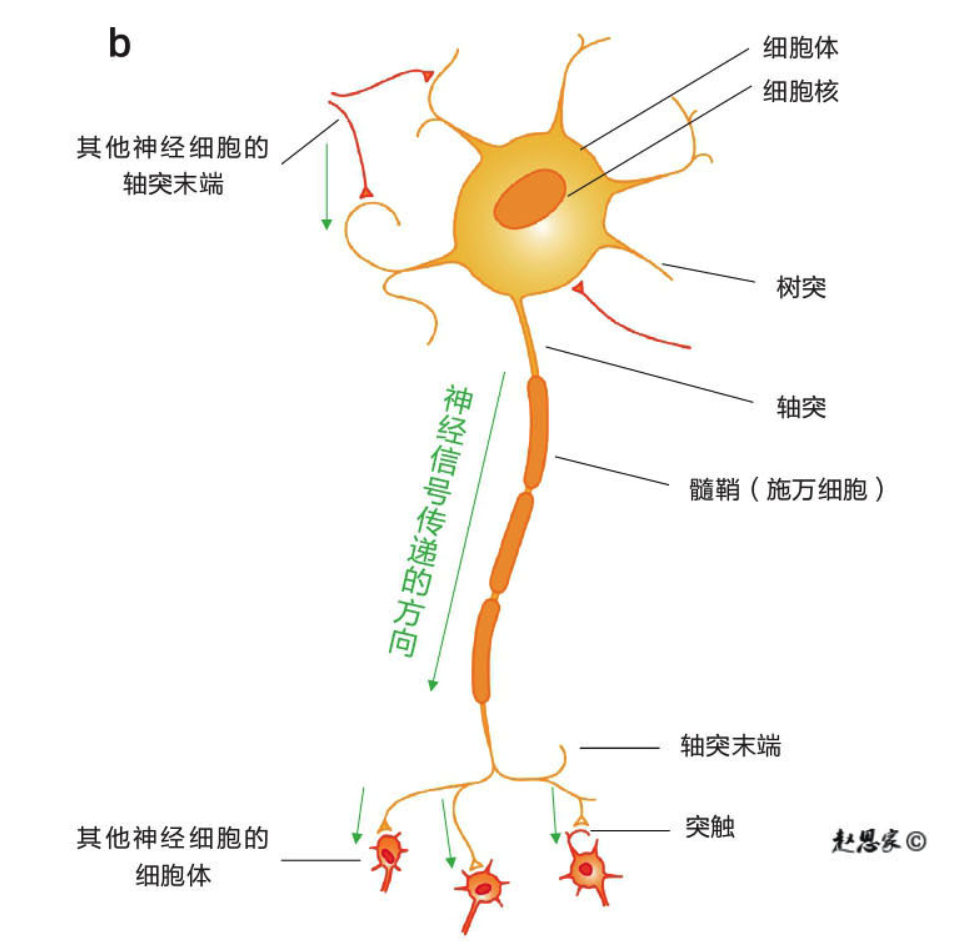

>神经细胞的示意图。神经信号沿着轴突传递到轴突末端，然后通过突触传递到其他的神经细胞。（图片版权©赵思家）

这些在细胞里发生的各式各样的化学反应，叫作`新陈代谢（metabolism）`。这个词我们所有人都在中学生物课上学过，它其实就是生物维持生命的所有化学反应的总称。因为它是一个不间断的能量与物质的交换过程，一旦这个交换过程停止，生命就结束了，所以新陈代谢的英语名来自希腊语里的“改变”。

## “神经细胞被激活”到底是指什么？
每一个神经细胞都是由一层`细胞膜`包裹住的。在正常情况下，神经细胞体内的负离子更多，使得细胞内外形成一个电压差，这个电压差叫作`膜电位（membrane potential）`。一般情况下，这个膜电位在-50毫伏到-70毫伏之间。如果突然之间一大堆正离子涌入了细胞内，膜电位就会迅速变小，进而形成一个神经脉冲，如下页图所示。这个脉冲常被称为`动作电位（action potential）`。这个动作电位从发生到结束，前后不超过几毫秒（一毫秒即千分之一秒）。

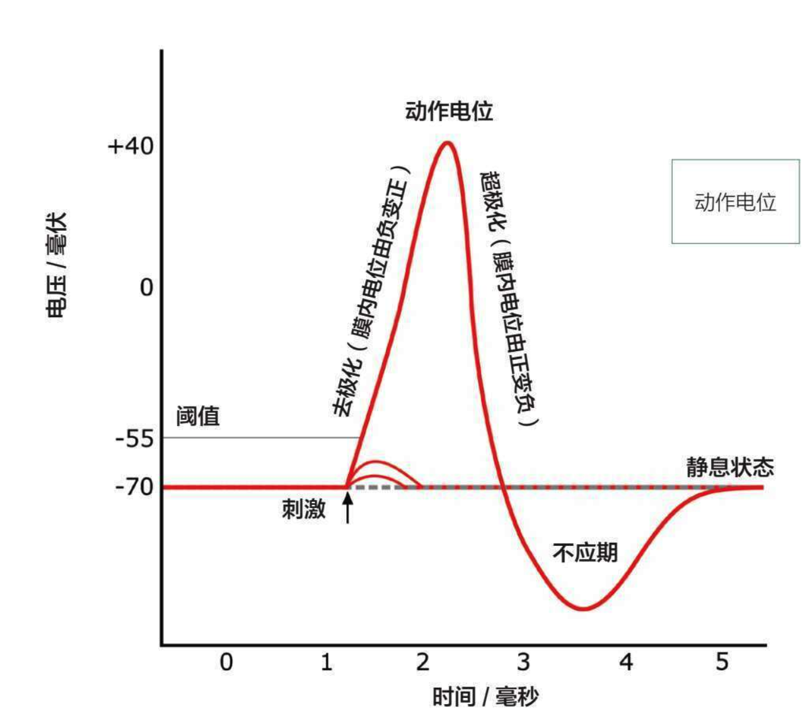

>一个标准的动作电位的示意图。当细胞膜内外的电压差超过-55毫伏时，电压会继续变得更正，直到到达顶点。然后再逐渐变得更负，并且超过-70毫伏，进入一段不应期。不应期过程中，无论是怎样的刺激都不会引起新的动作电位。

## 神经细胞之间是如何传递信息的？
德国科学家奥托·勒维（Otto Loewi）和英国科学家亨利·戴尔（Henry Dale）发现，有一些突触并非通过电，而是通过化学物质传递神经信号的，他们因此在1936年获得了诺贝尔生理学或医学奖。而这个担任神经细胞与神经细胞之间的信使的化学物质，就是神经递质。

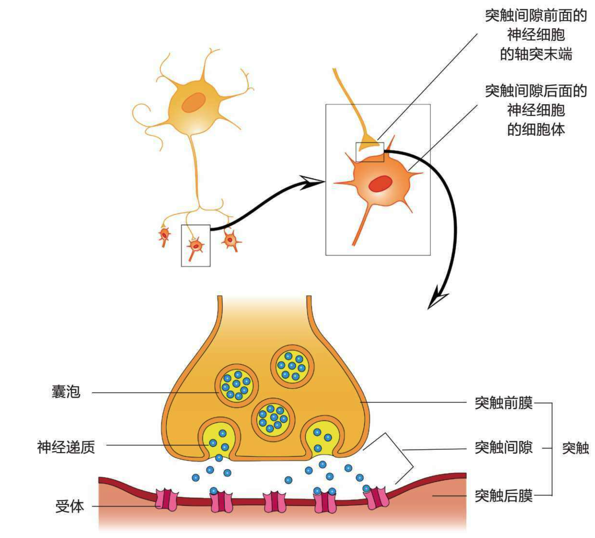

>化学突触的结构示意图。大多数的神经细胞之间的信息是靠化学物质传递的，这种化学物质被统一称为`神经递质`。请仔细识别这张图上的每一个名词，后面的内容中我们会不断提及它们。（图片版权©赵思家）

并不是所有神经细胞之间的沟通都靠神经递质。突触分两种：一种是上面提到的化学突触——宽度大概有20到40纳米，靠神经递质来传递信息；还有一种是电突触——宽度只有2到4纳米，可以直接用电来传递信息。

这两种突触各有各的优点。电突触最大的优点是传播信号的速度更快，所以电突触一般会在特别需要急速反应的功能上出现，比如说反射反应。如果你一脚踩上一颗图钉，你的脚会快速离地来自动防卫。从脚到脊髓，全程就靠电突触，所经过的突触数量不会超过五个。

但不能让神经系统全都用电突触，因为它有个致命的缺点，那就是“缺乏增益”。就是经过电突触的信号强度要么不变，要么变小。一个信号从这头送到那头，往往要经过成千上万个突触，要是大部分强度都在路上被损耗，那这沟通效果也太糟糕了。

而化学突触在人类大脑里更加常见，也更加灵活，可以增益，也可以减益，它们的类型丰富，搭配起来能够有奇效。

神经递质到底对每个神经细胞起到什么作用，是由`受体（receptor）`决定的。如上页图所示，受体一般位于突触后膜。其实受体就是一个位于细胞膜上的窗户。这个窗户是半自动的，一般是锁上的，只有在特定的情况下才会打开。当它打开时，它会选择性地让细胞外的一些离子（比如说带负电荷的氯离子或是带正电荷的钙离子、钾离子）通过它进入细胞内，使得细胞内外的电压差发生变化。

举个例子，谷氨酸的某一种受体碰上一个谷氨酸的时候，这种受体会瞬间被激活，它的结构会产生变化，使其形成一个通道，让带正电荷的钙离子迅速涌入细胞里。想象一小块细胞膜上，同时有成千上万个这样的受体被激活，那就会有成千上万个钙离子涌入，瞬间让膜电位变得更正。这样就会在神经细胞里产生一个动作电位。这种被激活就会产生动作电位的受体，被称为`兴奋性的受体（excitatory receptors）`，其对应的神经递质也是兴奋性的。

因为每种受体的结构不同，它不仅可以选择特定的离子使用它穿过细胞膜，还可以指定特定的方向。比如，GABA的受体就不会允许钙离子进入细胞，相对地，它让带负电荷的氯离子流入细胞内，同时让带正电荷的钾离子离开细胞。当大量的GABA受体被激活时，膜电位瞬间就会变得更负，这样细胞就不会被激活了，动作电位也不会出现。这种受体就是`抑制性的受体（inhibitory receptors）`，也使得其对应的神经递质是抑制性的。

>如果一个神经细胞同时释放兴奋性的和抑制性的两种神经递质，那会怎么样呢，场面岂不是很混乱？关于神经递质，有一个很重要的信息——“一个神经细胞只生产一种神经递质”，这叫作`戴尔原理（Dale's principle）`。不过，近些年来，已经发现了不少种神经细胞都违反了这条规则，但绝大多数神经细胞还是符合的。

## 并非谁都能成为神经递质
所谓`神经递质`，就是在神经突触信号传递中担当“信使”的一组特定化学物质。它们本身仅具有抑制和兴奋的作用，但是考虑到效应机制（受体和靶器官）的差异，最终展现出的宏观效果大相径庭。

各方大神在寻找神经递质的时候，都遵循了以下三个条件：
- 条件一：神经递质必须是在突触前膜中合成的，并在前膜中集中保存在一个个小袋子里。
- 条件二：当神经细胞受到刺激后，神经递质会从突触前膜释放到突触间隙里。
- 条件三：在神经递质被突触前膜释放后，能够作用于突触后膜，并引起突触后膜的变化。而且，在发挥作用后，作用会自动并迅速地终止（而不是赖在那儿不走）。

>条件一可以细分为“合成”和“存储”两个条件，条件三可以分为“作用”和“终止”两个条件。

现在已知的神经递质至少有三十种，最有名、研究最多的是这七种：`多巴胺`、`血清素`、`去甲肾上腺素`、`乙酰胆碱`、`谷氨酸`、`GABA`和`内啡肽`。

# 多巴胺
- 英文名：dopamine，科学家们一般缩写为DA。
- 籍贯：大脑里有两个主要的多巴胺生产基地，两个都位于`基底核（basal ganglia）`。
  - `黑质（substantia nigra）`
  - `腹侧被盖区（ventral tegmental area）`
- 常居地：不同的生产基地生产的多巴胺，会被输送到大脑的不同的区域工作。
  - 黑质　->　`纹状体（striatum）`
  - 腹侧被盖区　->　`前额皮层（prefrontal cortex）`
- 弱点
  - 上瘾
  - 精神分裂
  - 帕金森病
- 技能
  - 运动控制(75%)
  - 行为选择(90%)
  - 强化学习(95%)

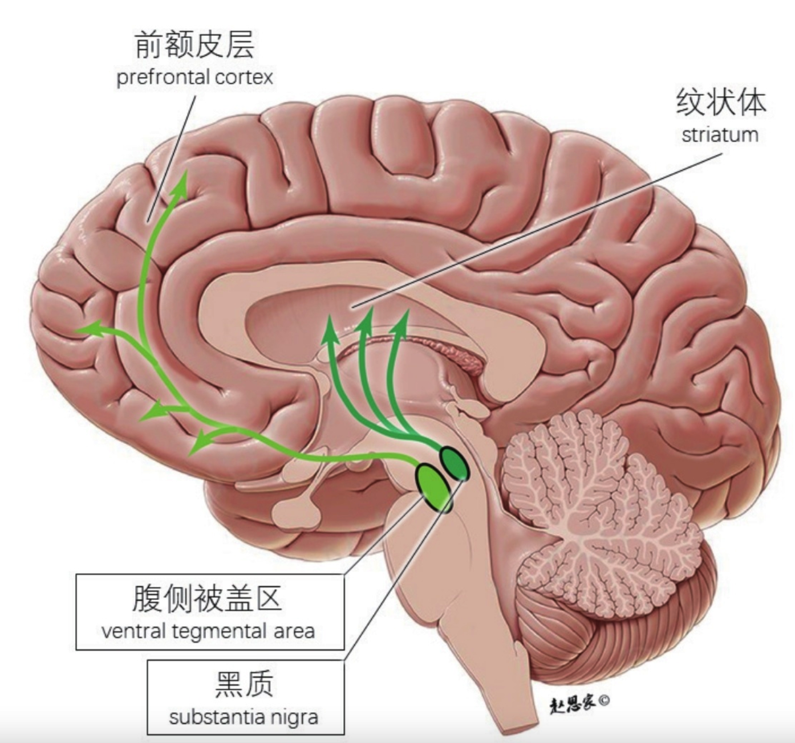

>多巴胺在人类大脑中的分布图。黑框里的标记为产地，箭柄为通路方向，箭头则为常居地。多巴胺在大脑里有两个主要的产地，它们相对应的通路已用不同的绿色标识出来了。（图片版权©赵思家）

## 多巴胺的三大功能
多巴胺从何而来？大脑里的绝大多数多巴胺产于一个叫基底核的中脑区域。

其中，又有两大产地：黑质和腹侧被盖区。它们俩挨得特别近，但我们一定要将它们分开讲，因为产地决定了多巴胺的最终去处，也在很大程度上决定了它们的功能。

来自黑质的多巴胺走不远，出城后全体都去同省的另一个城市，叫纹状体。去得多了，就形成了通路，这个通路被称为`“黑质纹状体通路（nigrostriatal pathway）”`。这群多巴胺主要负责自主运动的调节和控制，比如维持一个姿势或执行一个动作。

黑质这个城市啊，有个问题，因为一些未知原因，城里的建筑物（也就是负责生产多巴胺的神经细胞）特别容易一片一片地受损甚至彻底坍塌（也就是细胞死亡）。这些细胞一死，人就会出现无法控制自主运动的现象，比如手抖、走不了路，严重的就会出现帕金森病。

从另一个城市——腹侧被盖区——出来的多巴胺，就走得比较远，都要出省了。绝大多数会走得特别远，去前额皮层（prefrontal cortex），途经前扣带回（anterior cingulate cortex）和眼窝前额皮质（orbitofrontal cortex），这形成了`“中脑皮层通路（mesocortical pathway）”`。走这个路子的多巴胺主要和做决策有关。

`决策（decision-making）`是个覆盖面很广、内容复杂的认知功能。这里说的决策，主要是指`行动选择（action selection）`，也就是“下一步做什么”。在某个环境下，人或动物可以采取多种行动（比如往左走或往右走），而基底核里的神经细胞活动决定了到底采取哪一种行动。更具体一点，在做决定前，所有的行动都被基底核抑制着（控制着自己不去做），而当基底核对一个行为的抑制减少时，这个行为就会自动启动。这个行为如何实施，不关基底核的事，但基底核控制了所有行为的启动开关。换言之，基底核是行动的发起者，但不是实施者。多巴胺在整个行动发起的过程中，至少起到了两个关键作用：

1. 多巴胺设定了门槛的高低。大脑中的多巴胺水平越高，发起行动所需要的动力就越低。往往多巴胺水平越高，人的冲动性行为就越多；多巴胺水平越低，人就显得越麻木，反应就越慢。以吸毒这个行为为例，多巴胺水平越高，“摄入毒品”这一举动所需要的动力门槛就越低，大脑就更难抑制住吸毒行为。
2. 多巴胺还给行动选择带来了“学习”这个技能。比如说，如果基底核发起了一个行动A，并且行动之后多巴胺水平升高了，中脑皮层通路就会做出相应改变，使得下一次遇到类似的环境或场景时，更倾向于选择行动A。

还有一小部分从腹侧被盖区出来的多巴胺，出来之后，没走多远，到了伏隔核（nucleus accumbens），而这条通路叫作`“中脑边缘通路（mesolimbic pathway）”`。这条通路特别有名，也叫作`“奖励通路（reward pathway）”`。在这条通路上，多巴胺水平越高，“想要”的这份欲望就会越强烈。

正因为这条通路负责控制激励显著性，所以这条通路上的多巴胺有个特别重要的任务，就是`强化学习（reinforcement learning）`。举个例子，你在夜市上乱逛（探索未知环境），试了一家麻辣小龙虾，特别好吃（奖励），吃了还想吃（激励），从此以后，你每晚都去这家店吃麻小（遵从行为）。从探索到遵从，这个养成习惯性行为的过程，就叫强化学习。

## 多巴胺过多有什么不好？
如果习惯了错误的行为，就成了瘾。准确地说，瘾是指一种重复性的强迫行为，即使知道这种行为会有不好的影响，也难以停止，就像是产生了一种依赖，而被依赖的“某种东西”可能是物质性的——`物质成瘾（substance addiction）`——譬如烟、酒、药物，也有可能是非物质性的——`行为成瘾（behaviour addiction）`——譬如性、网络、游戏、赌博等等。瘾上来的时候，人简直像是变了一个人，心情烦躁，注意力不集中，非常想去把这个小小的但很强烈的愿望给完成了。

以毒品为例，毒品可以间接地增加大脑中多巴胺的释放，其中最容易被影响的就是与腹侧被盖区相关的两个通路。摄入毒品后大脑分泌大量多巴胺，让这两个通路上的区域逐渐适应高水平激活状态。当停止摄入毒品后，这些区域的神经细胞难以适应新的低水平激活状态，人就会出现“想要”的感觉，进而自动生成对毒品的渴求，导致物质成瘾。

除了成瘾，从腹侧被盖区出来的这些多巴胺还和`精神分裂症（schizophrenia）`有关系。中脑皮层通路被阻断，人会出现精神分裂症的阴性症状，比如在该有情绪的时候没法表达情绪，不愿与人交流接触。中脑边缘通路被阻断，人就会产生精神分裂症的阳性症状，比如幻觉和妄想。注意，幻觉和妄想是有区别的，看到我家堆了一个亿的现金是幻觉，坚信我自己是亿万富翁那就是妄想。

## 巧克力是怎么和爱情扯上关系的？
除了“多巴胺=快乐”这个误解，另一个常在科普文中看到的说法是：“无论是一见钟情还是日久生情，爱情=苯乙胺+多巴胺。”

`安非他命`和`苯乙胺`是同系物，它们俩的结构非常类似。安非他命是一种用来治疗`注意缺陷多动障碍（attention deficit hyperactivity disorder，简称ADHD，俗称多动症）`的药物，长期过量使用会导致上瘾，但还是有人会在没有疾病的状态下使用它，因为它有非医疗用途的助兴作用，换句话说，它可以被当作春药使用。

苯乙胺是种很有意思的神经递质，和多巴胺强相关。它的溶液闻起来有股鱼腥味。它有类似摇头丸的作用，会令人兴奋、产生幻觉、食欲降低。20世纪80年代，曾有种叫作“爱情的巧克力”的理论。因为巧克力里含有苯乙胺，所以很多人认为吃巧克力就会让人感受到爱情。但其实这个理论站不住脚，因为巧克力里的苯乙胺被吃下肚后很快就被消化，变成其他物质了，无法进入大脑产生“爱”这样强烈的情感。

## 多巴胺不是真正的快乐
奖励是一种事物的特性。这个特性有三个关键的组成部分。
1. 愉悦感：奖励能够带来愉悦感。
2. 为得到满足而行动：奖励能够产生趋向性行为并带来满足感。
3. 学习：进而导致强化学习。

后面两个特点特别好理解，其实就是对应前文提到的“行为选择”和“强化学习”这两个功能。

“愉悦感”为奖励提供了一种定义，让奖励能够使人产生渴望进而采取行动。但奖励不等同于愉悦感，更不等同于快乐。

虽然两者常常被混为一谈，但其实“渴望”和“喜欢”是两码事。毒品上瘾就是最好的例子，瘾君子渴望毒品，但他们并不会喜欢毒品。而且随着吸食毒品次数的增加，它所带来的愉悦感会越来越少。

多巴胺本身其实不直接产生主观的愉悦感，它可能参与了愉悦感产生的过程。比如说2019年1月，西班牙巴塞罗那大学的科学家就发现，要是大脑中多巴胺的水平低，听音乐时产生的愉悦感就会变低，这说明多巴胺对产生与音乐相关的愉悦感是必不可少的——但这不是多巴胺的主要作用，愉悦感不是完全由多巴胺产生的。

## 多巴胺究竟是什么？
说多巴胺是奖励，其实还是不准确的。

因为多巴胺不是奖励的绝对值，而是`奖励预测误差（reward prediction error）`。

简单来讲，你第一次主动帮助妈妈做了家务事，妈妈奖励你一颗巧克力。你本来没期待会收到巧克力的（即预测中会得到巧克力的可能性为0），所以巧克力的出现是一个意外之喜（即预测误差）。当你收到巧克力的那一刻，这个奖励预测误差就会引起多巴胺短暂但强烈的释放。

有意思的是，等你学习到“做家务事”和“得到巧克力”两者的必然联系后，下次多巴胺释放的时间点，就会提前到“做家务事”的时刻。

可以把多巴胺想成奖励的意外性。

100分的奖励不一定就好于1分的奖励，因为如果你的期待是100分，最后得到的是100分，那真正能感受到的奖励为0分。但对于这个知识点，还有另一种理解：那最好不要努力，这样就不会有期待，让期待的奖励值恒定为0分，那任何奖励都会带来愉悦感。

但如果这样认为，那就是对人的奖励系统没搞明白。奖励作用有一个必要条件，那就是`行为参与（behavioural engagement）`。

原本为0分的期待值，如果完全随机地等待天降奖励，奖励的不确定性会一定程度地提高，这种不确定性会将基线提高，比如把0分变成0.5分。不仅如此，人会对小概率事件产生“它很常见”的错觉，这就更导致基线不成比例地提高，比如变成0.6分。

这时，你的奖励基线从0分变成了0.6分，但出现的1分奖励还是完全随机的，这时你能得到的奖励预测误差会随着得到的更多奖励而逐渐归零。类似`警报疲劳（alarm fatigue）`——相当于“狼来了”的故事。

也就是说，即使你是宇宙第一“锦鲤女孩”，也会慢慢感觉不到奖励。你可能会令别人羡慕，但自己有没有体验到满足感，那是另一个问题了。

那如何能够确保一直有更多的奖励预测误差呢？很简单，只有不断地做出努力去寻找奖励，让奖励从偶然事件变成必然事件。`期望（expectation）`会在不断成功之后有所提高，但通过`努力（effort）`可以让奖励事件发生的概率提高并高于期望。如果你不愿意努力，那就要调整期望值。常言道，知足者常乐。

# 血清素
- 英文名：serotonin。按照化学的规则书写为5-hydroxytryptamine，所以又有中文翻译为“5-羟色胺”。但本书统一使用“血清素”这个翻译。
- 籍贯：脑干的中缝核（raphe nuclei）
- 常居地:大脑里到处都是，甚至小脑里都有，主要集中在基底核和前额。其实，身体里超过90%的血清素在肠道里，但在肠道里的和在大脑里的血清素属于两个独立的系统。这里主要讲大脑里的血清素。
- 弱点
  - 抑郁
  - 失眠
- 技能
  - 调节心情(95%)
  - 控制睡意(85%)
  - 控制食欲(45%)

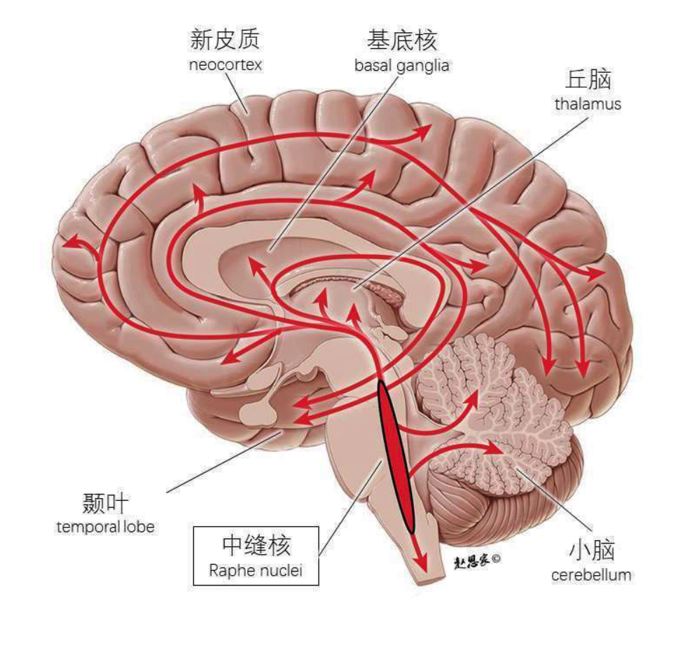

>血清素在人类大脑中的分布图。黑框里的标记为产地，箭柄为通路方向，箭头则为常居地。 

## 解忧杂货铺
血清素就是“调节心情”的关键。虽然血清素不生产快乐感本身，但它控制了能不能感受到快乐的那个闸门。

市面上最常见的抗抑郁药，大多是作用于血清素的，目标都是维持和提高大脑中的血清素含量。

如果只是因为血清素的含量不足以产生快乐的状态，那就太好解决了。上面提到的抗抑郁药，在提高血清素这个问题上，是一吃就能见效的，但并不能实际根治抑郁症。而且，要真的在认知层面起到一些抗抑郁的效果，往往需要连续吃好几周，与此同时伴随各种各样的副作用。所以现在针对抑郁症并没有大家想象中那样的灵丹妙药，说到底，这种情况其实和我们并没有搞清楚大脑的基本机制有关。

## 睡意正浓
`中缝核（rapheal nuclei）`这个脑干区域。“raphe”在拉丁语里是“接缝”的意思，叫它中缝核是因为它恰好位于脑干背后正中央的接缝处。中缝核是大脑中唯一的血清素产地，换言之，大脑里所有血清素的籍贯都是中缝核。牵一发而动全身，只要能观察到中缝核中神经细胞的活动，就等于观察到了血清素的生产状况。

醒着的时候，中缝核的神经细胞是激活的，这并不是说血清素和睡意无关。恰恰相反，正是因为血清素管的是睡意的产生，所以它起作用的时间点应该是在睡前而不是睡眠中。

大脑里有两个控制睡眠的系统。一个是昼夜节律（也就是生物钟）：当有光照时，身体会苏醒；当天黑时，身体知道该睡觉了。另一个是睡眠压力：早晨起床后，因为你已经得到了休息，所以会觉得充满干劲；但如果一直没睡，睡眠压力就会随着缺少睡眠的时间而累积，你会变得疲惫和困倦，如果你一晚上没睡，那睡眠压力会特别高，即使外面天亮了，生物钟告诉你该醒了，你还是会觉得特别累。这两者协调一致，才能保证良好的睡眠。

血清素可能就是睡眠压力的指标。你醒着的时候，血清素就像是时间沙漏一样，开始逐渐堆起来，堆得越多，睡眠压力越高，你就越想睡觉——无论是白天还是黑夜。当生产血清素的中缝核被关掉，你就不会有睡眠压力，只有生物钟，自然就睡得少了。

## 减肥不成功，你是不是“杜绝碳水化合物”了？
减肥餐从开始的“低油，高碳水化合物”变成了现在的“高蛋白，低碳水化合物”。低碳水化合物甚至是无碳水化合物，可能确实对减少热量摄入有显著帮助，但从对大脑的影响的角度来讲，不一定是好事。这个关键就在于血清素。

血清素在大脑里的生产速度是几乎完全被一个叫作`色氨酸（tryptophan）`的东西控制的。这里我用了“完全”这么危险的词，在神经科学里很少见，但确实如此。大脑中的色氨酸越多，血清素就会越多；色氨酸越少，血清素越少。

而色氨酸是一种必需氨基酸，换言之，它是一种人体无法自己合成的物质，必须从食物里取得。我们日常食物中色氨酸含量最高的是猪肉、鸡肉、豆制品和一些海鱼。比如100克三文鱼含有250毫克色氨酸，100克猪里脊或鸡胸肉含有280毫克色氨酸，100克豆腐含有100毫克左右色氨酸。这些都属于高蛋白食物。

虽然刚吃完高蛋白食物时，血液里的色氨酸含量确实会迅速升高，但接下来好几个小时里，大脑中的血清素含量却会降低。因为饭后身体血液中的色氨酸含量高，不等于大脑里的色氨酸含量高。决定大脑里的色氨酸含量的不仅是身体血液中的色氨酸含量，还有其他氨基酸的含量。从身体进入大脑，氨基酸需要通过血脑屏障。而血脑屏障不是一个你想过就能过的地方，氨基酸会相互竞争，这种竞争导致能进入大脑的色氨酸反而减少了。

>血脑屏障是什么？它是血液和脑组织之间的一道屏障。我们的身体各处都需要血液，血液为细胞带来氧气和养分，而氧气对（我们身体里的）细胞来说是必不可少的。虽然神经细胞也需要氧气，而且需求量最大，但神经细胞是不可直接接触血液的。（中风就是大脑中血管破裂，血液和神经细胞直接接触，导致了神经细胞的损伤和死亡。）所以，虽然大脑里的血管密密麻麻，但血管和神经细胞是不会直接接触的。这个屏障就像是一个非常细的筛子，只让特定的物质，譬如说氧气、二氧化碳、血糖通过。大部分的药物或病菌因体积太大，都是不能通过的。

那到底要怎么吃才能提高大脑里的血清素含量呢？答案是，在吃高蛋白食物的同时也要吃高碳水化合物食物。胰腺注意到血液中碳水化合物含量高时，会立即生产胰岛素（就是糖尿病患者缺的那个东西）。而胰岛素就能作用在氨基酸上，减少其他氨基酸，而不影响色氨酸，这样“色氨酸：氨基酸”的比例就变大了，色氨酸自然能够有效地进入大脑，提高血清素的生产量。这可能是为什么当大脑里的色氨酸含量过低时（也就是忧伤时），可能出现“特别想吃高碳水化合物食物”的冲动。

# 去甲肾上腺素
- 美国的常用名是norepinephrine（简称NE），在英国则常被称为noradrenaline（简称NA）。我跟多巴胺关系也很密切。别看我们功能似乎差很远，其实我就是多巴胺变装而来的。
- 籍贯：脑干的`蓝斑核（locus coeruleus）`。每个蓝斑核有大概一万两千个神经细胞。如果说，“条条大路通罗马”，蓝斑核大概就是人类大脑中的“罗马”，它坐拥全脑中最四通八达的网络，人类脑干中的蓝斑核的两万四千个神经细胞，每一个都连接了两万五千个以上的其他神经细胞，而且每个都连着大脑和小脑。基本等于黑白双吃的那种神秘组织了。
- 常居地：大脑的全部脑区几乎都有，甚至小脑也有！
- 弱点
  - 状态不佳，没劲
  - 注意缺陷多动障碍（俗称多动症）
- 技能
  - 维持警觉性(95%)
  - 战斗或逃跑(85%)

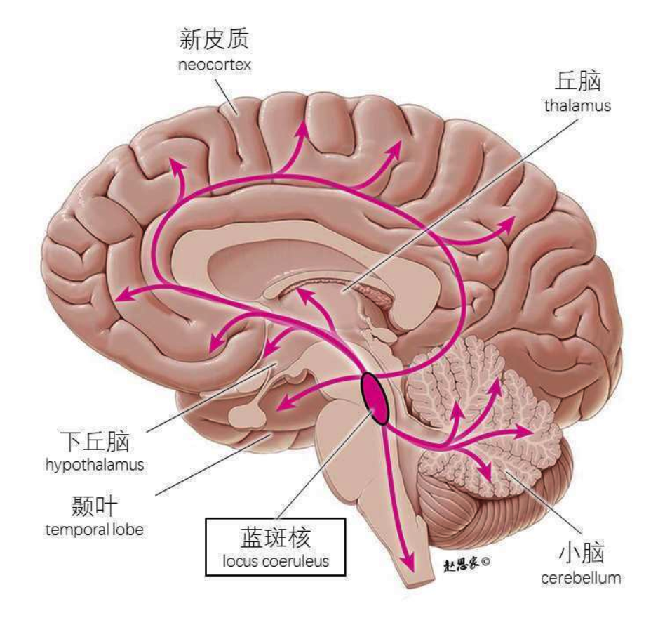

>去甲肾上腺素在人类大脑中的分布图。黑框里的标记为产地，箭柄为通路方向，箭头则为常居地。（图片版权©赵思家）

## 和肾上腺素不得不说的关系
如果多巴胺是最有名的大脑里的激素，那肾上腺素就是最有名的身体里的激素了。在日常对话里，肾上腺素等于“燃”。

肾上腺素含量升高时会有以下几个效果：
1. 血液流速加快，在短时间内让更多血液涌入肌肉（方便发力做出反应）；
2. 瞳孔放大（一种说法是，瞳孔放大理论上可以让更多光线和视觉信息进入眼睛）；
3. 呼吸加速；
4. 血糖值提高。

## 状态不好，撤退！
去甲肾上腺素负责的是优化任务表现。什么是`任务表现（task performance）`？它是指任何需要你集中注意力去努力完成的工作，比如弹钢琴、演讲、算数学题、写文章等等，都算任务，而这些任务的表现有好坏之分。

其实从1969年起，去甲肾上腺素的功能一直被认为是控制`“觉醒（arousal）”`。觉醒是个非常宽泛的概念，最好是通过对比低觉醒和高觉醒之间的区别来理解它。什么是低觉醒呢？就是你感到困倦、没劲的时候。而高觉醒则是你保持清醒且有高警觉性的状态。

去甲肾上腺素的含量和觉醒程度成正相关：前者越多，觉醒程度越高。但觉醒程度越高并不等于任务表现越好，两者的关系呈钟形曲线。这个理论在心理学上很经典，早在1908年就被提出，被称为`耶基斯–多德森定律（Yerkes Dodson law）`。

当处于低觉醒（曲线的左侧）的时候，人处于无意识或者说对外界和自身没有掌控能力的状态；随着觉醒程度的升高，人越来越警醒，越来越有精神，任务表现也越好，到达最优状态（曲线的最高点）。但一旦觉醒程度超过这个点，人就会变得焦虑，容易被分散注意力，导致当下所做的任务的表现变差（曲线的右侧）。

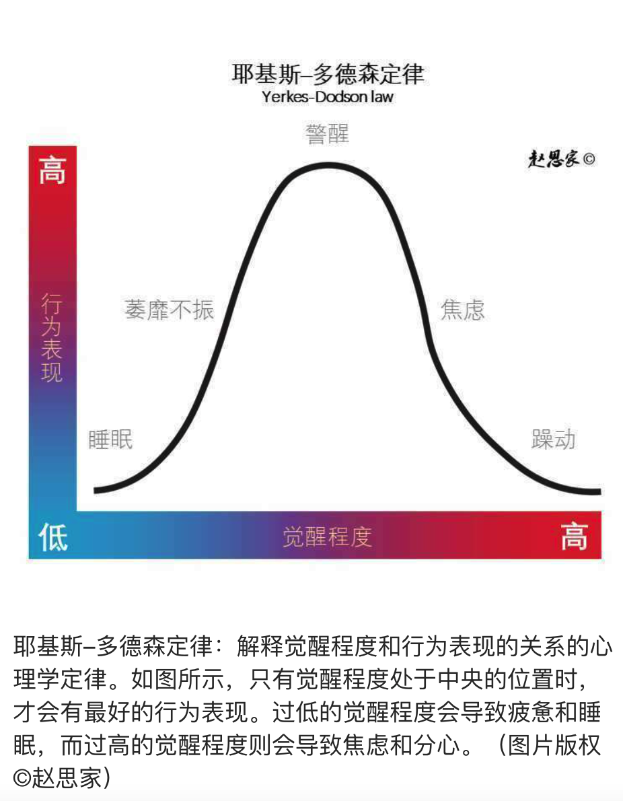

>耶基斯-多德森定律：解释觉醒程度和行为表现的关系的心理学定律。如图所示，只有觉醒程度处于中央的位置时，才会有最好的行为表现。过低的觉醒程度会导致疲惫和睡眠，而过高的觉醒程度则会导致焦虑和分心。（图片版权©赵思家）

## “聪明药”真的能让人变聪明吗？
最为有名的“聪明药”可能是安非他命。服用安非他命可以提高去甲肾上腺素和多巴胺在大脑中的浓度，它原本是用来治疗儿童多动症的。多动症患者特别难维持注意力，而且在明知不可以乱动的情况下，依然特别想动来动去，还很难控制自己的情绪，这些症状会影响到患者的生活和学习，往往从他们童年时开始出现，一般情况下，在6岁到12岁之间变得明显。多动症患者的大脑中多巴胺的作用较弱。当我们仔细检查他们的基因时，就会发现某些与多巴胺相关的基因出现了异常，使得他们的大脑似乎对多巴胺没有那么敏感，进而导致大脑习惯性地生产更多的多巴胺，换言之，多巴胺的工作效率变低了。除了多巴胺，在多动症患者的大脑里，去甲肾上腺素也出现了一些问题。所以当下针对多动症治疗的药物往往与提高多巴胺和去甲肾上腺素的工作效率有关，而安非他命就是个很好的例子。

如果把安非他命用在健康人身上，会有什么效果呢？换言之，如果我的大脑里多巴胺和去甲肾上腺素含量都是正常的，再增加它们，会不会提高与这两种神经递质相关的认知功能呢？答案是肯定的。健康的人服用安非他命确实可以提高警醒程度，获得更好的认知控制能力，甚至还会产生更强的性欲。在体能上，安非他命还能提高人的反应敏捷度，增加肌肉强度以及推迟疲惫感。

这些药效导致安非他命不仅被人用作认知增强剂，还被运动员作为兴奋剂使用，甚至还被当成春药使用。

除了治疗多动症，安非他命还有提高去甲肾上腺素含量的作用，所以它可以让人保持觉醒状态。因此，安非他命可以作为觉醒剂，用于治疗某些睡眠疾病，如发作性睡病（narcolepsy）。

## 去甲肾上腺素是怎么控制觉醒状态的呢？
负责生产去甲肾上腺素的神经细胞位于脑干里的蓝斑核。和上面提到的血清素和其产地中缝核类似，蓝斑核是大脑中去甲肾上腺素的唯一产地。

在蓝斑核里的这些神经细胞，日常的工作活动（firing rate，又叫激活率）有两个模式，“tonic”和“phasic”。全国科学技术名词审定委员会将这两个词翻译为“紧张性”和“位相性”，本书也会遵循官方翻译。

当我们说一个神经细胞的激活频率长期呈现一种持续不断的状态时，就被认为是位相性，其实就是在一段时间内一直保持着一个比较稳定的基线（baseline）的状态（上图中黄色部分）；相反，当神经细胞的激活频率突然出现暂时远超出基线的状态，就叫紧张性（上图中紫色部分），这种紧张性激活模式就如同小小地爆发了一下。

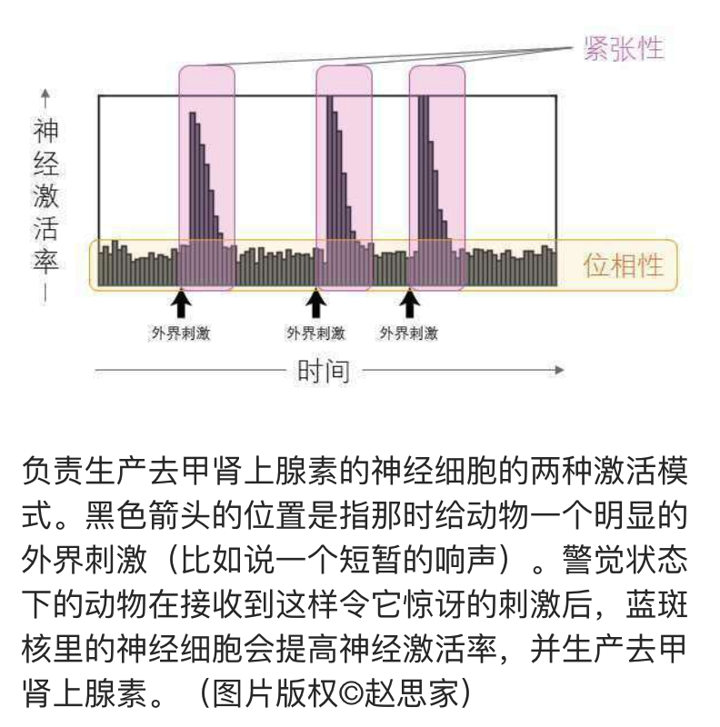

>负责生产去甲肾上腺素的神经细胞的两种激活模式。黑色箭头的位置是指那时给动物一个明显的外界刺激（比如说一个短暂的响声）。警觉状态下的动物在接收到这样令它惊呀的刺激后，蓝斑核里的神经细胞会提高神经激活率，并生产去甲肾上腺素。（图片版权©赵思家）

在理想状态下，外界给大脑一个明显的刺激，生产去甲肾上腺素的神经细胞就会自动地切换到紧张性模式。但这种紧张性模式是否出现，和神经细胞处于怎样的位相性状态有关。当细胞长期处于低位相性的状态时，人会处于低觉醒状态，趋近睡眠、无力，对周围发生的变化没有警觉性（想象一下你在很困的时候去玩手机游戏）。当细胞处于极高位相性的状态时，人会过于亢奋甚至焦虑，或是一感受到风吹草动就感到紧张、容易走神。在这两种极端情况之下，神经细胞都不会对刺激产生紧张性反应。而只有当紧张性反应达到其最高值的时候，人的警觉性才是最高的，任务表现也最优。

>位相性和紧张性两者并不是完全独立的。与上面那张图一样，这张图里黑色箭头的位置是指短暂的响声）。同样的神经细胞，在不同状态下会有不同的激活模式。从上至下，位相性水平越来越高，这也决定了紧张性模式是否会出现。我们可以看到，位相性过低或是过高的时候，紧张性那样小小的爆发反应都不会出现这代表看当动物的蓝斑核的神经细胞处于位相性过低或过高的状态下，给它播放声音，它都会无动于裹，毫无警觉性。（图片版权©赵思家）

我们可以结合前文中提到的耶基斯–多德森定律，来理解两种神经激活模式、觉醒程度和行为表现四者的关系（见下页）。位相性水平与觉醒程度成正相关，位相性越高，觉醒程度越高；紧张性水平和行为表现成正相关，能够产生的紧张性越高，表现越好、警觉性越高；而位相性与紧张性成钟形曲线关系，位相性过低或过高，紧张性都低，类似地，觉醒程度过低或过高，行为表现都不会很好。这个理论叫作自适应增益理论（adaptive gain theory），由阿斯顿-琼斯（Aston-Jones）和科恩（Cohen）在2005年提出。

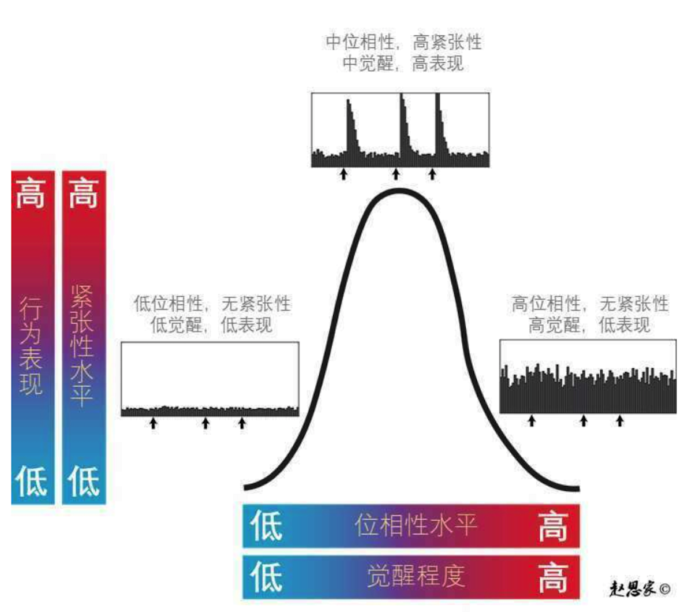

>我们将神经细胞的激活模式与觉醒程度（x轴）以及行为表现与紧张水平（y轴）结合来看。（图片版权©赵思家）

说到这里，这样的一套理论确实很好地解释了去甲肾上腺素是如何调控人的“警觉性”的。那之前提到的“探索和开发的利弊权衡”又和去甲肾上腺素有什么关系呢？说到这个，又要说回上图中的耶基斯–多德森定律钟形曲线。当人处于紧张性最高的状态时，恰为注意力集中的时候，大脑会选择开发（exploit）模式——其实就是专心致志地做手头的工作；而当位相性变得更高的时候，会开启探索（exploration）模式——其实就是容易分心、想东想西的状态。

## 去甲肾上腺素究竟是什么？
之前在讲多巴胺和血清素的章节里都提到过彼得·达扬，他提出了多巴胺是奖励预测误差，而血清素是惩罚预测误差。他其实也研究了去甲肾上腺素，还提出了一个很精练的理论：去甲肾上腺素是“意料之外的不确定事件（unexpected uncertainty）”，或者说是一种surprise。

当大脑某一个区域发现周围环境中有意料之外的事件发生了（比如安静的森林里突然传来群鸟飞走的声音），蓝斑核的神经细胞就会立刻被激活，快速释放去甲肾上腺素，去甲肾上腺素沿着四通八达的通路，从脑干迅速地扩散到全脑所有区域，将全脑所有区域都唤醒，做好新的准备。

多巴胺是奖励的意外性，血清素是惩罚的意外性，而去甲肾上腺素是信息的意外性。这里“信息”一词的含义非常宽泛——从感知信息到认知信息。

# 乙酰胆碱
- 籍贯：脑里主要有三个，按它们的地理位置和所生产的乙酰胆碱最后作用的位置，可以分为两组：
  - 基底前脑：迈纳特基底核（basal nucleus of Meynert）和内侧隔核（medial septal nuclei）
  - 脑干：脑桥-中脑被盖复合体（Pontomesencephalo tegmental complex）
- 常居地：大脑的几乎全部脑区都有
- 弱点
  - 失去学习的能力
  - 阿尔茨海默病
- 技能
  - 形成新记忆(95%)
  - 能量感(85%)

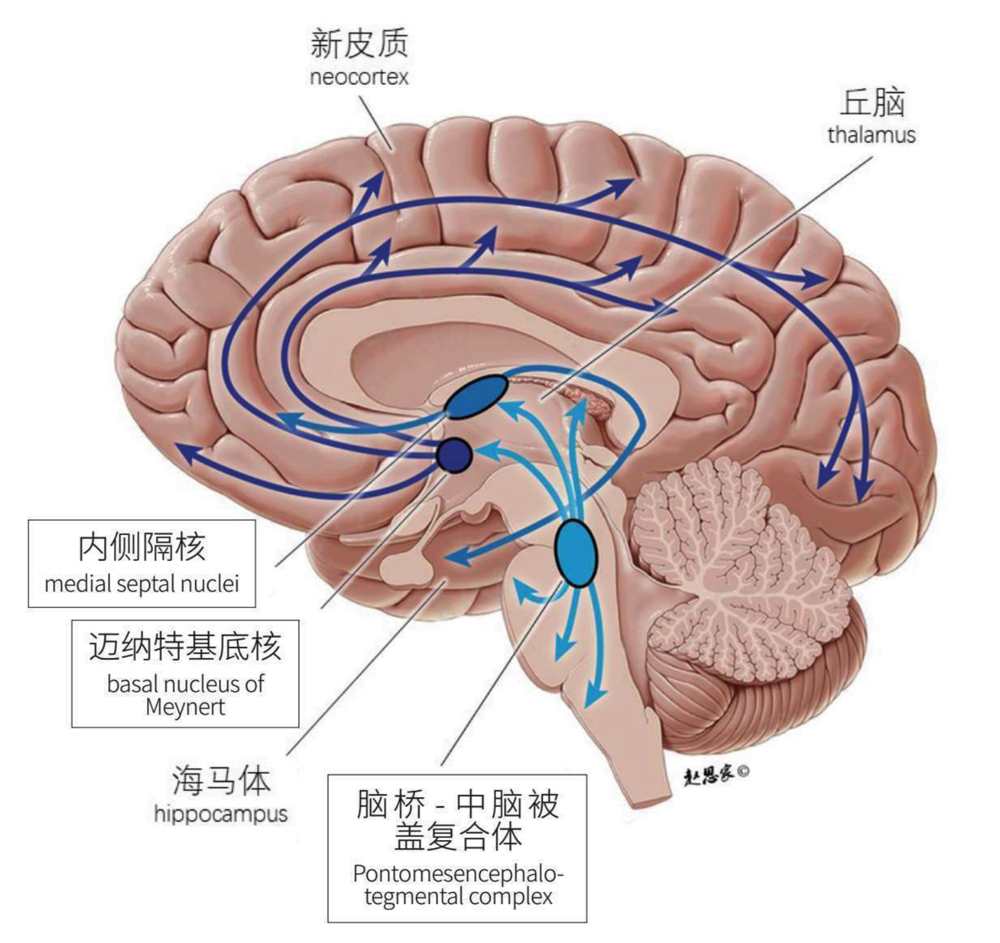

>乙酰胆碱在人类大脑中的分布图。黑框里的标记为产地，箭柄为通路方向，箭头则为常居地。乙酰胆碱在大脑里有三个主要的产地，它们相对应的通路已用不同的蓝色标识出来了。（图片版权©赵思家）

## 不能不说的尼古丁
香烟里的主要化学成分尼古丁长得和乙酰胆碱特别像，所以吸入尼古丁的反应约等于吸入大量的乙酰胆碱。

从本质上讲，尼古丁是一种乙酰胆碱受体的激动剂。受体是一种位于神经细胞的外壳上的接收器，这个我们在第二章以及第四章血清素那里都简单介绍过。当乙酰胆碱靠近受体的时候，就会像把一片面包放进烤面包机，将受体激活。受体一被激活，就会在神经细胞里产生一系列反应，这样信息就从一个神经细胞传递到了另一个神经细胞。说“尼古丁是一种乙酰胆碱受体的激动剂”，就是指尼古丁和乙酰胆碱长得很像，它会模仿乙酰胆碱的活动，激活乙酰胆碱受体。

不仅如此，相比乙酰胆碱，尼古丁和乙酰胆碱受体结合的效果太好了，比乙酰胆碱更好、更强、更紧密。为了避免持续激活神经细胞，乙酰胆碱和乙酰胆碱受体的结合非常简单和短暂，而且被释放后很快就会被其他高活性酶给分解掉。但尼古丁和乙酰胆碱受体一碰上，就很难分开。这两者差多远呢？从它们的半衰期就能看出来，乙酰胆碱在大脑里的半衰期为1分钟，而尼古丁的半衰期长达2小时。尼古丁和乙酰胆碱受体的结合时间大大加长，等于大脑里乙酰胆碱的量被人为地大大增高了。

人为地在大脑里加入大量的尼古丁，就像是在一个原本健康的经济体里注入大量的假钞，而且这个假钞不仅比普通纸币经用，从实际价值上还是1元假钞兑换100元真钞的神奇物件。

面对这样的情况，大脑试图适应。在吸烟者的神经细胞上，乙酰胆碱受体的数量要比一般人多得多，大部分与尼古丁相结合，剩下的与乙酰胆碱结合的受体的数量才和一般人的差不多。因为大脑已有的调控系统无法调节外来的尼古丁，只好通过增加乙酰胆碱的产量来与尼古丁竞争。

因为乙酰胆碱有着唤醒大脑和身体的功能，吸烟之后人会体会到“能量感”，甚至能短时间内反应速度提高，同时还能感到平静和舒缓。因此很多人在工作之余会通过抽烟来缓解疲劳。但要注意的是，这样的正面效果是非常短暂的。一旦上瘾后，这样的能量感会消失，取而代之的是疲惫感。

那为什么尼古丁会令人上瘾呢？抽过烟的人应该有所体会，抽烟后会有种莫名其妙的愉悦感。这是因为尼古丁能间接地刺激负责管理奖励系统的神经细胞，让它们分泌多巴胺。但正如在第二章提到过的，大脑会逐渐适应这样的信号，其实有烟瘾的人不是真的每次都体会到了吸入尼古丁的愉悦感，而是为了避免戒断所带来的不适才持续吸烟的。

## 用“恶魔的呼吸”来控制他人
乙酰胆碱是怎么帮助记忆形成的呢？有一个理论是，高浓度的乙酰胆碱可以加强存储记忆的海马体和传递感知信号之间的大脑回路，同时抑制大脑提取无关的内容。打个比方，若是想要记住刘看山（知乎网站官方萌物）的长相，你得睁大眼多瞅瞅它的样子，让更多关于它的感知信息涌入储存记忆的海马体，而不是让一些奇怪的东西乱入。换句话说，乙酰胆碱控制了信息流，从而直接影响相关记忆的形成。

与此相关的一个现象是，在人进入快速眼动睡眠期的时候，大脑会产生很多乙酰胆碱。这些乙酰胆碱是用来干吗的呢？有一种合理推断是，它和睡眠时的记忆巩固有关。

当你醒着的时候，高浓度的乙酰胆碱帮助感知信号转化为记忆；当你刚入睡，进入慢波睡眠的时候，乙酰胆碱浓度变低；当你进入快速眼动睡眠期的时候，开始巩固今天一天的记忆，所以乙酰胆碱浓度又升高了。

## 乙酰胆碱究竟是什么？
与去甲肾上腺素相对，乙酰胆碱被认为是“意料之内的不确定性”。当然，这也只是一个推测，也是彼得·达扬提出的。

不确定性怎么能在意料之内呢？在上一章的结尾我们提到，去甲肾上腺素是“意料之外的不确定性”。

“意料之内的不确定性”指的是一个长期的状态，而“意料之外的不确定性”往往指的是单一事件。

你可能已经注意到了，“意料之内的不确定性”和“意料之外的不确定性”并不是完全独立的，它们在某些时刻有一定关联。比如，英国脱欧后很长一段时间内，汇率都极不稳定，换言之，一个意料之外的不确定事件后往往会伴随着较高的意料之内的不确定性。当我们同时观察去甲肾上腺素和乙酰胆碱时，也会发现这一关联。

但相比去甲肾上腺素，乙酰胆碱是不是真的负责监控信息中的“意料之内的不确定性”，我们对此的了解还不算充足。而且这一理论，就现在看来，似乎也不能很完美地解释乙酰胆碱其他的相关功能。

# 谷氨酸
- 缩写：Glu（咕噜），不过科学家还是一般直接称我为“Glutamate”。我是大脑中数量最多、覆盖面最广的兴奋性神经递质。如果把兴奋性和抑制性比作“阴阳”的话，那我就是大脑中的“阳”。而下一章出场的GABA就是“阴”。而且我可以在特定情况下转变成GABA哟。
- 籍贯：谷氨酸可以直接从日常饮食中摄取，也可以在很多神经细胞里直接合成。在大脑中。它是直接在突触前膜中通过改造谷氨酰胺（一种可以通过血脑屏障的氨基酸）直接生成的。而且是要用的时候再立马生成，这样大脑就不会因为有太多谷氨酸而过度兴奋。
- 常居地：只有在需要的时候才会在突触前膜被生产出来，所以可以说是无处不在，没有常居地。
- 弱点
  - 太多就会让大脑过度兴奋：癫痫
- 技能
  - 没有特定的认知功能，而是种通用的兴奋性神经递质。
  - 简单直接激活神经细胞，让细胞产生动作电位。

## 神经递质也讲究“阴阳两仪”
谷氨酸对神经细胞的作用太强，也太单一了。当它被突触后膜上的受体接收后，神经细胞会被激活，进而产生动作电位。

而且它的这一效果，对大脑里的所有神经细胞来说都一样，就像是通用钞票，完全没有针对性。

说回“兴奋性神经递质”这个概念。正如上面所说，当这类神经递质被释放进入突触，并激活突触后膜上的受体后，会让神经细胞产生动作电位。但要注意的是，并不是单一一个神经递质分子就能够激活一整个神经细胞，它实际做的工作是和特定的受体结合。

谷氨酸对应的有两种受体，一种叫AMPA，一种叫NMDA。很多神经细胞上都有这两种受体，而且这两种受体同时存在。它们长得很像，像是坐落在神经细胞膜上的一个个带了阀的水泵。NMDA的特点是，一旦激活，便会让钙离子（$Ca^{2+}$）和钠离子（$Na^{+}$）从细胞外进入神经细胞里，同时又让一个钾离子（$K^{+}$）到细胞外面去。而AMPA的特点是，一旦激活，便会让一个钾离子从细胞内到细胞外，同时让一个钠离子从细胞外进入细胞内。

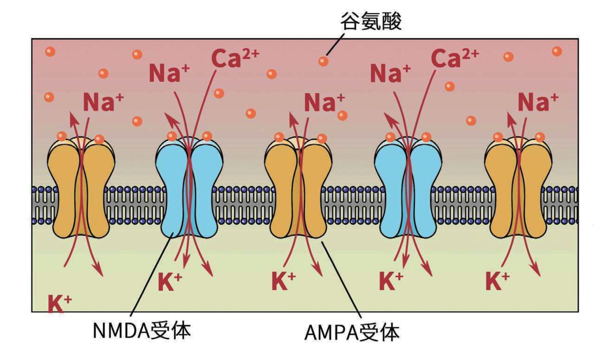

在第二章中，我们已经强调过细胞内钙离子的重要性。在突触后膜中，钙离子可以激活各种各样的酶，进而产生一系列的生化反应，甚至改变基因的表现。当神经细胞内部钙离子过量，一方面神经细胞可能会因为吸水过多而肿大，另一方面钙离子可能会引起细胞内的酶的过度活动，这两方面都会杀死神经细胞，神经细胞要么爆开，要么自己把自己给消化了。所以钙离子，或者说激活NMDA受体，可以让许多神经细胞一下子产生永久性或是长期性的变化。其中一种变化，就是产生长期记忆。

当它们同时被激活，细胞内外的钠离子和钾离子会保持平衡，但细胞内部就会有更多的钙离子。但想要在细胞里搞点事情，要做到产生动作电位这种大工程，就需要团队的力量。当许多谷氨酸同时激活受体，产生足够大的正离子流涌入细胞内，细胞便会产生动作电位。这便是激活了神经细胞，让这个神经细胞“兴奋”了起来。

NMDA的另一个特点：NMDA遇到谷氨酸时，便会打开阀门，让钙离子进入细胞，但这一点并不是在所有的时候都有效。

神经细胞的细胞内和细胞外的电压差一般维持在-65毫伏（当然这个只是标准值），这个电压差就叫静息电位。当一个神经细胞处于静息电位的时候，即使有谷氨酸，NMDA也不会开门放钙离子，因为通道是被一个镁离子（Mg^{2+}）从外面给堵住的。只有当神经细胞的电压差（或叫膜电位）已经开始变得没有那么负了，譬如说到-30毫伏了，开始去极化了（翻回35页看动作电位是怎么产生的），镁离子才会从NMDA的通道中让开，让钙离子从外面进入。简单地添加一个这样的性质，和神经细胞的其他活动一起配合，就会让本来非常简单粗暴且单一的功能复杂化。

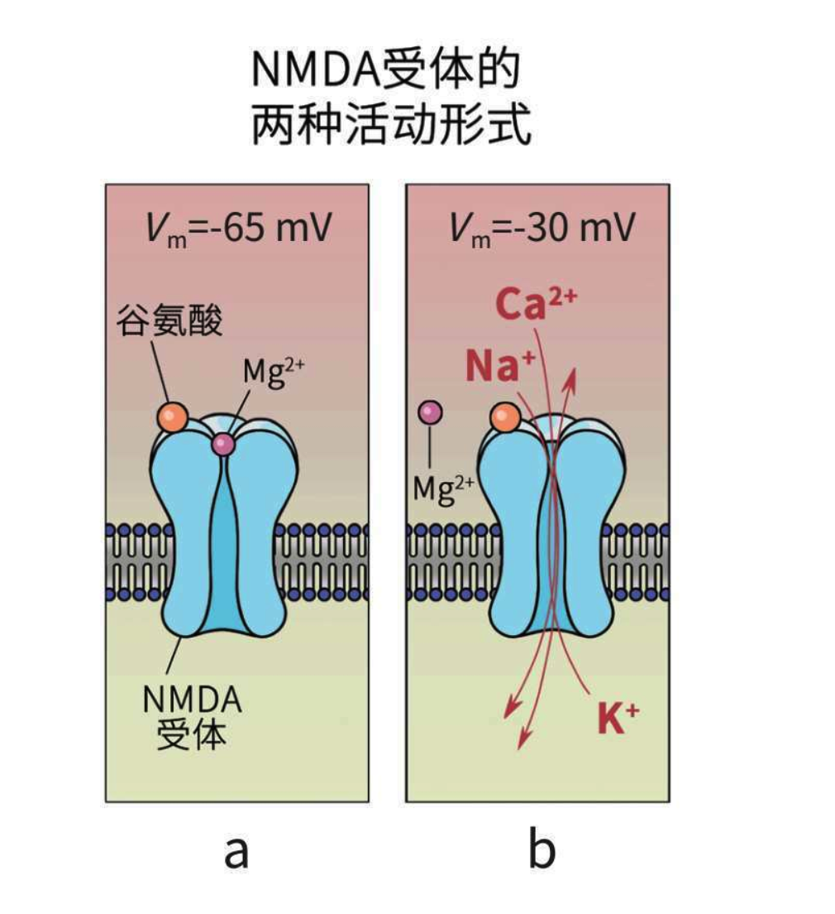

>NMDA受体的两种活动形式：a.在静息电位下，被镁离子堵住，其无法让钙离子通过；b.在膜电位高于-65毫伏（比如图中的-30毫伏状态下），谷氨酸激活NMDA受体，让钙离子和钠离子涌入神经细胞内，并让钾离子离开。

简而言之，兴奋性神经递质的存在会让神经细胞更容易产生动作电位。换言之，当神经细胞被要求产生动作电位的时候，兴奋性神经递质会来推动动作电位的发生，它会加大动作电位完成的可能性。一旦动作电位产生，信息便会沿着神经细胞发送出去。可以想象到它的重要性，大脑中至少一半的突触可以释放谷氨酸，所以谷氨酸被认为是数量最多的神经递质。

既然有神经递质能让神经细胞“兴奋”起来，那有没有起反作用的呢？有的，那种叫作抑制性神经递质。简而言之，抑制性神经递质会减少一个神经细胞产生动作电位的机会。抑制性神经递质的代表叫GABA，是我们大脑中最主要的抑制性神经递质，我们会在下一章专门讲它。有趣的是，谷氨酸是GABA的前体，也就是说，在特定情况下，谷氨酸这种兴奋性神经递质会变化成与自身作用相反的抑制性神经递质。

## 记忆：我很忙
说到记忆，最好把它看成两个步骤：第一步是获得记忆，通过改变神经细胞之间的连接（也就是突触）来解码刚刚获得的感知体验；第二步是巩固记忆，巩固刚刚在突触上产生的变化，让它从短期的变成永久的，这样记忆就被长期记录下来。

记忆，不是通过长出新的神经细胞，而是通过加强或减弱已有的神经细胞之间的连接来记录的。而改变突触的这个过程叫作`长时程增强（long-term potentiation，简称LTP）`。这是挪威科学家泰耶·勒莫1966年在兔子的海马体里发现的。如果给突触前膜一点刺激，突触后膜会有反应，那如果给突触前膜来一段很强、很多的刺激，突触后膜会怎么样呢？勒莫发现突触后膜会长时间维持一个很“嗨”的状态，而且如果你再给同一突触前膜来点刺激，后膜这种反应还会继续延长。

就有点像，突触前膜得到一个消息，后膜表示“知道了”，但如果突触前膜一下子给后膜发了几十条消息，后膜就会一连串地发各种表情包，并将长时间维持在这种状态。这时候前膜再发一个消息，后膜会“嗨”得更久。当我们说“长”，是有多长呢？就现在能看到的直接证据，这种状态能维持一年，甚至更长。

而LTP就是由谷氨酸调控的，更准确地说，LTP和NMDA受体被谷氨酸激活后引起钙离子涌入细胞这一现象有关。

那钙离子是如何让突触后膜的反应产生变化的呢？在突触后膜中，钙离子浓度升高时，会激活细胞里的一种叫作蛋白激酶的酶。这种酶有两个作用：一个作用是直接作用于AMPA受体，让其工作更高效，让它能够更流畅地让钠离子进入细胞里；另一个作用是直接给膜上添加更多新的AMPA受体。后者也会让细胞的树突变得更粗大，这都可以在显微镜下观察到。

你姑且可以认为，谷氨酸可以引起LTP，而LTP可以长期强化神经细胞之间的连接。这是我们所知的，针对大脑是如何解码记忆这一功能的最主要的细胞机制之一。

`长时程抑制（long-term depression，简称LTD）`，在小脑和海马体里都被观察到，小脑中的LTD被认为和运动学习有关，而海马体中的LTD被认为和清除记忆有关。LTD也是由谷氨酸控制的。

为什么谷氨酸能够引起两个完全相反的效果呢？关键区别就在于谷氨酸的NMDA受体。在上一节我们提到了NMDA受体不是只听谷氨酸的，它还会受到周围电压差的影响。如果细胞内的电压差很负，NMDA就会被镁离子给堵住。虽然被堵住了，其实NMDA还是能够让一点点钙离子进入细胞的。而这一点点钙离子，因为量小（小于5微摩尔每升），会在细胞内引起其他完全不一样的酶的注意。这群酶叫作磷酸酶（phosphatase），恰好和激酶的功能相反。

你可以把谷氨酸受体想成鸡蛋，把突触后膜想成装鸡蛋的盒子。那LTP就是用激酶多加鸡蛋和增大盒子的容量；而LTD就是用磷酸酶去把一些鸡蛋打碎，并把盒子给剪了。

## “金发姑娘原则”
>大脑里不仅有神经细胞，还有`胶质细胞（glial cell，或glia）`。其实胶质细胞比神经细胞的数量多得多。胶质细胞是神经细胞的好伴侣，已知功能是为其他神经细胞提供支持、营养供给、维持稳定的环境以及绝缘。

在神经科学上，`“金发姑娘原则”`主要指的就是当一种神经递质（或是药物）同时拥有兴奋性和抑制性两种截然不同的特性时，太多兴奋性不好，太多抑制性也不好，最重要的是找到两者的平衡，通常这个平衡不是一个绝对的点，而是一个区间。只有在这个区间内，才会有最优的表现。而谷氨酸就是“金发姑娘原则”的绝佳例子。正常情况下，我们需要的是谷氨酸有恰到好处的浓度，被释放进正确的位置，并且维持恰到好处的时间。太少的谷氨酸会导致人失去意识，而太多的谷氨酸则会损伤神经细胞。

谷氨酸可以从食物中获取，但它不能直接通过血脑屏障，被大脑直接使用。虽然在一些特定情况下，它可以在其他化学物质的帮助下通过血脑屏障，但这不是主要的途径。一般情况下，谷氨酸是直接在突触前膜中合成的。在大脑中合成谷氨酸需要谷氨酰胺（glutamine），它是人体内最多的非必需氨基酸，也是唯一一种可以直接通过血脑屏障的氨基酸。谷类、牛奶、牛肉、鸡蛋、鸡肉、菠菜、味精里都含有谷氨酰胺。谷氨酸和谷氨酰胺之间可以循环变化，这个过程叫作谷氨酸-谷氨酰胺循环（glutamate-glutamine cycle）。当需要谷氨酸的时候，就把谷氨酰胺加工来使用，用多少变多少。

这样，大脑就能将谷氨酸的浓度控制在一个恰到好处的量。

# GABA
- 中文全名：γ-氨基丁酸。这个GABA不读“ga ba”，而应该是“gan be”。正如我的双胞胎兄弟谷氨酸所说，他是阳，我便是阴，是抑制性神经递质。酒精会让人放松就是因为酒精可以辅助我，让我更大更强。抗焦虑药也起着类似的作用。
- 籍贯
  - 和谷氨酸类似，哪里需要我，我就在哪里出现。
  - 几乎所有神经细胞都可以生产我，而且我是从谷氨酸变来的。
- 常居地
  - 和谷氨酸类似，哪里需要我，我就在哪里出现。
- 弱点
  - 太多会导致昏迷
  - 太少会导致癫痫
- 技能
  - 作为抑制性神经递质，抗焦虑和抗癫痫都和我相关。
  - 适量的酒精能让人感到放松也是因为我啦！

## 大脑的“阴”
GABA是我们的大脑中最主要、最普遍的抑制性神经递质，它的存在能够抑制突触。抑制突触的意思就是让突触两头的神经细胞不能够被激活去传递神经脉冲，换言之，突触被强制沉默了。

>当GABA出现在突触里时，它会和突触前后膜上的某些特定的受体结合，导致细胞膜上的离子通道打开，让带负电荷的氯离子流入细胞里，并让带正电荷的钾离子离开细胞，让细胞处于“细胞膜内负外正”的状态。细胞膜内外的电压差，叫作膜电位，一般情况下，这个膜电位在-50毫伏到-70毫伏之间。如果这个值低于-70毫伏——这个过程叫作“超极化”——会使神经细胞处于暂时的抑制状态。如果GABA消失了，过一会儿膜电位就会慢慢往0靠近，这个过程叫作“去极化”。

太多的GABA导致过度的神经抑制，进而导致昏迷；而太少的GABA则会导致癫痫。癫痫发作的时候，患者会明显不受自己控制地晃动、严重抽搐。其实这就是大脑皮层不受控制地放电导致的，患者会失去意识并失去对身体的控制。

## 借酒消愁：为什么微醺时人感到放松？
为什么酒精能让人放松呢？答案很简单粗暴：它和常见的抗焦虑药一样，能够提高GABA在大脑里的工作效率，是GABA的助攻。

现在市场上卖的很多抗焦虑的药都和GABA有关。提高GABA的工作效率，就会给人一种放松的效果，这是因为它作为抑制性神经递质，对大脑有镇定的作用。

之前在血清素那一章，我们聊到了抗抑郁的药物，其中最常见的一种叫作选择性血清素再摄取抑制剂，通过提高血清素的浓度来达到调节心情的效果。这种药物也会被用来抗焦虑，但见效比较慢。如果需要立马见效，消除急性焦虑，那就需要针对GABA的抗焦虑药物。

它们也有损害认知和记忆力的副作用，所以要慎用。另外，因为大脑的奖赏系统的神经细胞上也有GABA受体，服用这类药物会间接导致其释放多巴胺。虽然这也让它们的药效更好，但长期服用会让人上瘾。一旦停止，就会出现戒断症状（withdrawal）。同理，酒精也特别容易让人上瘾。酗酒之人，突然停止喝酒也会出现戒断症状。也是因为它们和GABA的关系，焦虑和酗酒这两大问题往往同时出现。

# 内啡肽
- 我们是三胞胎！α、β和γ！我们的结构有些不同，但作用差不多啦！GABA不是自称大脑的阴，是最主要的抑制性神经递质吗？我们更“阴”，能够抑制GABA!
- 籍贯
  - 脑下垂体（pituitary gland）
- 常居地
  - 和控制疼痛相关的大脑区域：
    - 杏仁核
    - 脑干网状结构（reticular formation）
    - 脊髓丘硒束（spinothalamic tract）
- 弱点
  - 大脑自产自销的吗啡，又不用担心上瘾，简直无敌。
  - 多运动你就能产生更多内啡肽啦！
- 技能
  - 通过解除GABA对多巴胺的抑制来止痛
  - 还会让人产生很爽的感觉

## 大脑自产自销的止疼药
内啡肽就是一种身体内自产的、类似吗啡的物质，即“内生吗啡”。又因为从化学结构来讲，它是一种肽，所以它的中文名字就是内啡肽。

>`肽（peptide）`指由两个或两个以上氨基酸通过肽键连接组成的一种物质。`肽键`是什么呢？是指两个氨基酸（的氨基和羧基）通过脱水连接在一起，而连接在一起的那个位置，就叫肽键。详细地讲，就是两个氨基酸通过肽键合成一个二肽，在这个过程中，一个氨基酸会失去—OH，另一个氨基酸会失去一个—H，两个被抛弃的合成为一个水分子（H2O）。因此，整个过程也被称为脱水缩合反应。

虽然内啡肽可以细分为三种：α、β及γ。但它们的主要效果是抑制疼痛信号在大脑中的传递，简言之，就是止痛。当身体感受到疼痛的时候，大脑的脑下垂体会分泌内啡肽。这些内啡肽会兵分两路，一路进入大脑，一路进入身体，双管齐下来抑制疼痛。但有趣的是，在大脑和身体中，虽然内啡肽的止痛功能是一样的，但它们使用的方式完全不同。在身体里，内啡肽通过阻止神经细胞生产一种名叫P物质（Substance P）的痛觉传递物质，P物质少了，痛感就减弱了。而在大脑中，内啡肽则是通过阻止GABA——没错，就是上章的GABA——来止痛的。因为GABA是最主要的抑制性神经递质，它会无差别攻击，能够抑制多巴胺的产生。GABA少了，对多巴胺的抑制也就少了，间接地达到了止疼的作用。

## 为什么运动后会感到很爽？
在做了大量运动后，虽然身体大汗淋漓，但心里却会有一种欣喜、爽快的感觉。这是为什么呢？

这种现象被称为`“跑步者的愉悦感（runner's high）”`，特指当连续做高强度运动一段时间后——当然，运动强度和时间因人而异——虽然身体疲惫，但你会感受到一种愉悦感。会引起这种现象的运动包括跑步、游泳、滑雪、长距离划船、骑单车、举重、运动舞或球类运动（比如篮球、足球等）。

那为什么运动会让大脑分泌内啡肽呢？是因为当你开始运动的时候，大脑将其看成一种小小的压力。面对压力时，大脑会自动生成内啡肽。而运动能够在短时间内促进内啡肽的产生，是因为高运动量会将你身体的肌肉里的`糖原（glycogen）`耗尽，这会使你感受到肌肉疼痛，为了让你的身体能够继续运动下去，大脑会释放内啡肽进入身体，给身体止疼。简言之，高运动量会减少糖原，而糖原减少会导致内啡肽升高，进而给人带来快乐。

除了内啡肽以外，运动后的大脑还会分泌一种名叫脑源性神经营养因子（BDNF）的蛋白质。这种蛋白质也是大脑在面对压力，进入“备战”状态下采取的保护措施，特别是保护负责记忆的神经细胞，有时还会起到“重启开关”的作用。这可能也解释了为什么运动之后，你不仅会感到快乐，还会觉得轻松和头脑清晰。

类似的感觉我们在吃辣椒后也会有。红辣椒之类的香辛料中含有辣椒素，摄入辣椒素能刺激内啡肽分泌，辣椒越辣分泌量越高。这些辣椒素同时也是治疗慢性疼痛的药物。这也是为什么有些人吃很辣的火锅会感觉很爽。

内啡肽其实和各种愉悦感都有关系。小到吃糖时的愉悦感，听欢快的音乐时的愉悦感，甚至性爱高潮时的愉悦感，都和内啡肽有关。如果一定要找到一个快乐物质，大概内啡肽才是真正的快乐物质。

# 一花独放不是春——睡眠
## “醒着”可没你想得那么简单
觉醒是指睡眠结束或是还没有入睡的状态，这个状态有两个特点：

1. `行为觉醒（behavioral arousal）`，也就是你能对外界做出反应。学术上检查一个人是否有行为觉醒的最简单的办法，就是看他的姿势肌有没有肌张力。什么是姿势肌？其实就是用来维持姿势的肌肉。最简单的测试方式，就是看颈脖上肌肉的肌电图（electromyogram，简称EMG），观测肌肉里是否有神经传导。如果有行为觉醒，往往会不自主地控制颈脖的肌肉维持姿势，所以这可以作为一个间接的指标。
1. `脑电觉醒（electroencephalographic arousal）`，也就是皮层活动（cortical activation），特别是有高频脑波（γ波，30赫兹以上）。（不熟悉脑电波的先别急，我们接下来会专门讲到。）

## 原来睡眠那么“复杂”
我们可以把睡眠分为两大阶段，即`非快速眼动睡眠期（NREM）`和`快速眼动睡眠期（REM）`。前者又可以细分为三个阶段，即`非快速眼动睡眠一期（N1）`、`非快速眼动睡眠二期（N2）`、`非快速眼动睡眠三期（N3）`。所以睡眠又可以被细分为四个小阶段：N1、N2、N3和REM。

在你准备入睡时，全身放松，脑电波从超过12赫兹的β波，变成了8赫兹的α波。再过几分钟，你的呼吸渐渐变慢，眼球开始左右转动，脑电波会变得更慢，大概只有4到7赫兹，叫θ波。这时你已经进入了睡眠的第一阶段，如果此时醒过来，你会觉得自己没有真正入睡。这个阶段中，你可能还会出现“睡前肌肉阵挛性抽搐”，开始时，你会感觉自己在下落，紧接着身体突然一阵抽搐，把自己惊醒。这一现象可能与过度劳累或睡眠姿势不佳有关。

2-5分钟之后，你进入睡眠的第二阶段，你的心率变慢，体温也会降低。这个阶段会出现一种特别的电流爆发的活动，叫“纺锤波”，在缓慢较平的脑电波上看起来像是一个横放的纺锤。纺锤波的出现，对抵抗外部（比如听到的噪声）和内部（比如身体略感饥饿）那些可能将你唤醒的刺激因素起着重要作用。在这个阶段，你全身的肌肉放松，可能会出现打鼾的情况。

20分钟后，大脑开始进入深度睡眠状态。这个时候大脑活动降到最低，产生非常缓慢的δ波，只有1赫兹。这个阶段叫作慢波睡眠，又被称为非快速眼动睡眠期。在这个阶段，你和外界几乎完全隔绝，除非闻到烧焦的气味，或是听到非常大声的噪声，否则很难醒过来。如果这时候有人把你唤醒，好长一段时间你都会觉得昏昏沉沉的。直到这个阶段，你都不会出现做梦时的快速眼球运动的现象。这时候把你唤醒，你可能会描述出一些零碎的想法，但不会有像梦境一般完整的故事情节。

再过30分钟，你进入了第四阶段，即快速眼动睡眠期。这时候，大脑和身体都快速活跃起来，心跳开始变快，呼吸变粗，眼球也开始做快速运动。此时，你的脑干会彻底阻止任何的躯体运动，避免你从梦中醒来。而这期间你就在做梦，如果这时候被唤醒，你能够非常生动地描绘出梦境所有的内容。这期间，脑电波基本上和清醒时无异，但是你的肌肉会非常放松。

做完第一个梦之后，你又会开始重复睡眠的这四个阶段，周而复始。每个周期大概需要一个半小时，每晚大概会经历五个周期。在每两个周期之间，你可能还会经历非常短暂的微醒的状态，这个时候你是清醒的，但由于只有10秒左右，你可能根本没有注意到，醒来也不会记得。

到2020年为止，我们对调控“睡眠-觉醒周期”的神经递质的研究主要围绕以下五种神经递质——去甲肾上腺素、血清素、组胺（histamine）、GABA和腺苷（adenosine）展开。

而在这五种神经递质中，前三种——去甲肾上腺素、血清素、组胺——主要和觉醒有关，它们有相似的放电模式（discharge pattern）。这里的“放电模式”其实是指这些神经递质的“工作时间”，是上白班——即在觉醒时活跃（wake-on），还是上夜班——即在睡眠时活跃。在睡眠时活跃又分为两种，是在非快速眼动睡眠期活跃（NREM on），还是在快速眼动睡眠期活跃（REM-on）。这三种神经递质都是觉醒时活跃，快速眼动睡眠期时“休息（REM-off）”。

## “坐白班”的神经递质
控制“醒”的神经递质主要有三种：去甲肾上腺素、血清素和组胺。

科学家观察到这三个神经递质都是“坐白班”。这是什么意思呢？就是说分泌它们的神经细胞都是在觉醒的状态下最为活跃，在非快速眼动睡眠期变弱，且在快速眼动睡眠期最弱。换言之，大脑中的神经递质的浓度在觉醒时最高，非快速眼动睡眠期次之，最后是快速眼动睡眠期，即“觉醒>非快速眼动睡眠期>快速眼动睡眠”的模式。

去甲肾上腺素的功能最为清晰明确，它和觉醒有因果关系。简单来讲，抑制分泌去甲肾上腺素的神经细胞，动物就会昏昏沉沉、无精打采，而且很容易入睡（进入非快速眼动睡眠状态）。即使是醒着的时候，大脑皮层产生的脑电波也会变得比平常更缓慢，而且会进入一个同步的状态。相反，当动物熟睡时——无论是在非快速眼动睡眠期还是快速眼动睡眠期——只要激活相应的神经细胞让它们产生去甲肾上腺素，动物就会立刻醒来，前后不超过两秒。这个现象非常清晰地显示了去甲肾上腺素和动物觉醒之间的关系：去甲肾上腺素是因，动物觉醒是果。有了去甲肾上腺素，动物才保持觉醒，而且去甲肾上腺素越多，动物就越活跃。

分泌组胺的神经细胞，只有在动物醒了之后才会被激活。这和去甲肾上腺素有明显区别——是分泌去甲肾上腺素的神经细胞先被激活，动物才会苏醒，所以它有唤醒大脑的功能。而组胺则是维持醒的状态。

虽然和去甲肾上腺素类似，血清素也是在动物醒着的时候浓度最高，但如果仔细观察分泌血清素的神经细胞，就会发现两者的激活率截然不同：分泌去甲肾上腺素的神经细胞是随机激活的，没有固定节奏，而且动物越警醒，激活率越高，这和去甲肾上腺素那一章的内容一致；而分泌血清素的神经细胞则不同，只要醒着，它们就会稳定地、有规律地、有节奏地激活。血清素和睡眠相关的作用其实我之前仔细描述过，它有让人产生睡意的作用。如果大脑不产生血清素，你就会失眠，一直保持醒着的状态。简单来讲，血清素像是一个时间沙漏，你醒着的时候，沙会慢慢堆积起来，沙堆得越高（睡眠压力越高），你就越想睡觉。而你一入睡，大脑就会减少新的血清素的生产，血清素会逐渐从大脑中消失，等你睡足醒来时，沙漏再反转过来，重新开始计时。这样周而复始，平衡了人觉醒和睡觉的时间，让你即使知道是白天，也会顶不住睡意去补眠。

## 得丘脑者，得睡眠
基底前脑有一撮分泌GABA的神经细胞，专门在非快速眼动睡眠期活跃。因为GABA是抑制性的神经递质，基底前脑又有激活皮层的功能，抑制住这个区域，则让人进入睡眠。

和GABA类似，腺苷也是一种抑制性的神经递质。如果往大脑里的脑室（cerebral ventricle）里直接注入腺苷，动物的清醒度会立马下降，迅速进入非快速眼动睡眠期。腺苷和血清素有点类似，醒的时间越长，腺苷越多，你越想睡觉。腺苷的一个主要的功能是抑制（负责清醒下认知活动的）乙酰胆碱。当大脑处于清醒状态下时，乙酰胆碱对很多认知活动都起到关键作用。我们醒的时间越长，腺苷浓度越高，乙酰胆碱越被抑制得翻不了身，自然而然地就记不住东西，没法好好工作。

咖啡里的咖啡因可以抑制腺苷，就是因为这样，喝咖啡才有令人清醒的功效，要记住腺苷的功能极为简单，记住咖啡就好了。

牛顿发现白光是由红、橙、黄、绿、青、蓝、紫七个颜色的光线组成的。当白色的自然光照到物体上，物体会反射某种颜色的光线，这种光线进入人的眼睛，落到视网膜上，通过视网膜上的视锥细胞和视杆细胞，物理光线被转化为神经信号。

你可以把这整个流程当成一个快递公司的送货系统。光线所含有的信息就是一个个包裹，从外界的不同位置，送入眼球。而视网膜上视锥细胞的工作就是分收快递，然后按类别打包，带有视觉信号的包裹会被眼球背后的视神经送往大脑。

其中10%的信号，会先被送到一个中脑上丘去。之所以叫上丘，其实就是因为它像一个鼓出来的小山包。这部分信息帮大脑控制眼球运动，或是辅助我们做一些无意识、下意识的反射行为，例如有强光时，人会下意识做出举起手或转头这种能保护眼睛的动作。

而剩下90%信号的包裹会继续往后脑勺走，经过几个中转站，其中一个叫作丘脑，这基本上就是个各种感知信号的集合中转站，然后再由丘脑送到后脑勺的视觉皮层。视觉皮层收到视觉信号后再进一步把信号分类，让我们能真正地看到，比如光线的颜色、强弱、形状、方向、运动轨迹等等，再进一步实现阅读、识别人脸、看电视等等这些复杂的任务。

梦境往往是有不少视觉信息的。那这些信息从何而来呢？或者换一个问法，梦是从哪里得到素材的？现在的理论认为，梦境的本质是脑干所产生的随机神经信号。脑干是脑和脊椎连接的部分，它负责调节、维持我们的各种身体生理状态。

睡眠状态下，脑干还处于活跃状态。没事干的脑干会发出一些随机信号，空闲的视觉皮层在接收到这些随机信号后，也不管这些信号从何而来，就把它们当成普通的视觉信号来处理，进而产生了无意义的图像。

当我们做梦时，丘脑不再对来自眼睛的信号做出反应，当然，这时候的眼睛没有开张，压根没信号，但你即使透过眼皮看到一些光，丘脑也会帮忙抑制这种视觉信息，让你好好睡觉。与此同时，丘脑接受了脑干的控制。但丘脑也什么都不知道，也不管它收到的信息是来自眼球还是脑干，只是一股脑地将它们转送给视觉皮层。

让我们想象一下，正闲着没事干的视觉皮层会做什么。大半夜的，丘脑送一堆文件过来，数量多，而且还杂乱无章。视觉皮层并不知道这是从哪儿来的，它以为这就是眼球送来的。

于是，它会像在我们白天看到现实世界一样，从这些无意义的文件中理出个思路。为了看懂这是什么，大脑会竭尽全力，还会帮助视觉皮层从主管记忆的大脑区域那里获得记忆和知识。利用这些，视觉皮层把残缺的视觉信号补全成能看的图像，而这些图像又交织了我们的记忆、情绪，变成了各种各样有些怪异但似乎有些象征性的故事。这就是梦了。
