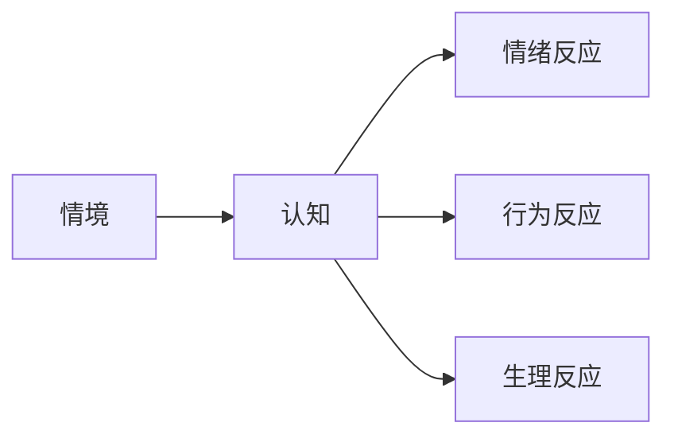
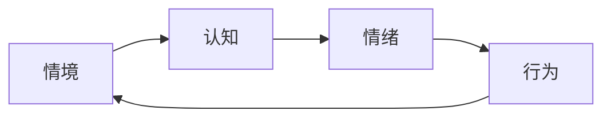
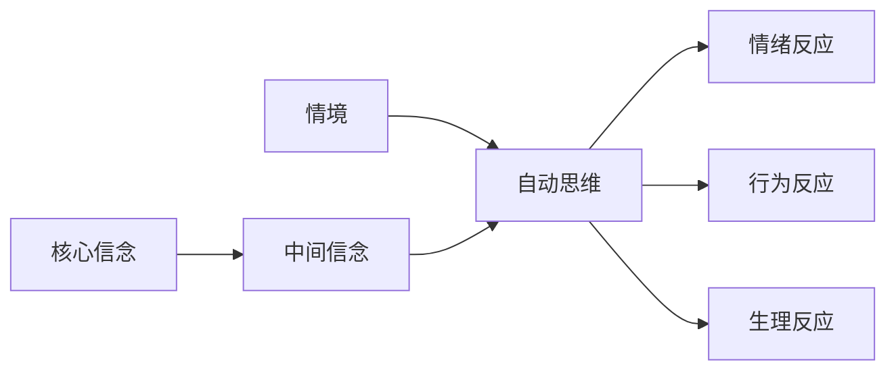
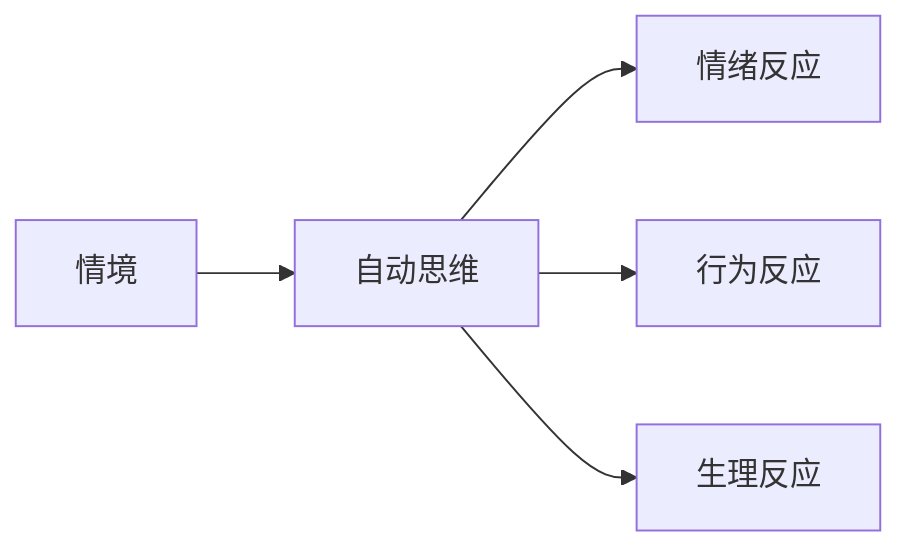
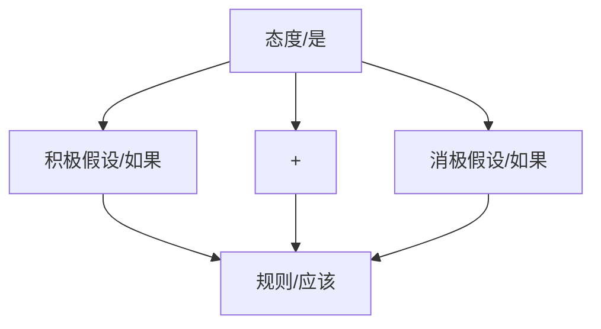
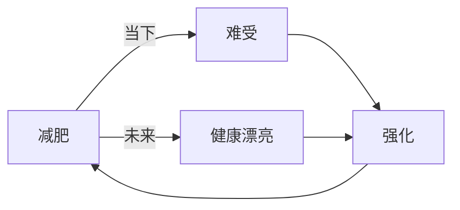
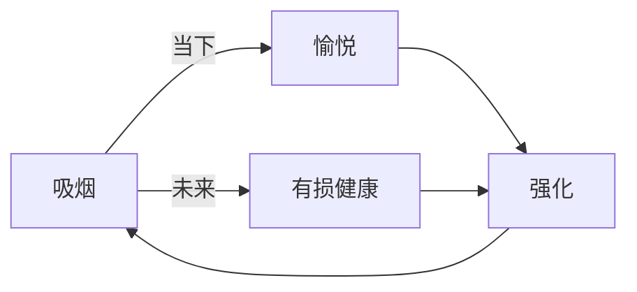
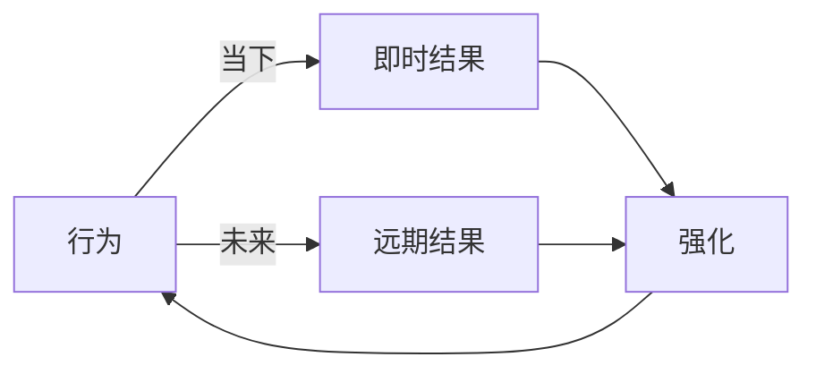

    作者: 郭召良
    出版社: 人民邮电出版社
    出版年: 2020-4
    页数: 299
    定价: 79.00元
    装帧: 平装
    ISBN: 9787115534675

[豆瓣链接](https://book.douban.com/subject/35043958/)

- [心理学基础](#心理学基础)
  - [心理现象](#心理现象)
    - [心理过程](#心理过程)
    - [心理动力](#心理动力)
    - [心理特征](#心理特征)
  - [心理现象间的关系](#心理现象间的关系)
    - [心理过程内部关系](#心理过程内部关系)
    - [情意过程与心理动力的关系](#情意过程与心理动力的关系)
    - [心理过程与心理特征的关系](#心理过程与心理特征的关系)
  - [情绪及情绪认知理论](#情绪及情绪认知理论)
    - [情绪的概述](#情绪的概述)
    - [情绪的认知理论](#情绪的认知理论)
- [认知行为疗法基础](#认知行为疗法基础)
  - [基本理念](#基本理念)
    - [观念决定情绪](#观念决定情绪)
    - [经验决定观念](#经验决定观念)
    - [经验需要比较才有意义](#经验需要比较才有意义)
  - [认知行为疗法模型](#认知行为疗法模型)
    - [流程图模型](#流程图模型)
    - [环路模型](#环路模型)
    - [T字模型](#t字模型)
- [自动思维](#自动思维)
  - [自动思维的基础知识](#自动思维的基础知识)
    - [自动思维的含义](#自动思维的含义)
    - [自动思维的特点](#自动思维的特点)
    - [应对自动思维的任务](#应对自动思维的任务)
    - [自动思维的评价标准](#自动思维的评价标准)
    - [自动思维歪曲的类别](#自动思维歪曲的类别)
    - [自动思维模型](#自动思维模型)
  - [自动思维阶段的工作流程](#自动思维阶段的工作流程)
    - [自动思维干预流程](#自动思维干预流程)
  - [识别自动思维和情绪](#识别自动思维和情绪)
    - [识别情绪](#识别情绪)
    - [识别自动思维](#识别自动思维)
  - [评价自动思维技术](#评价自动思维技术)
    - [控辩方证据技术](#控辩方证据技术)
    - [发散思维技术](#发散思维技术)
    - [可能性区域技术](#可能性区域技术)
    - [行为试验技术](#行为试验技术)
    - [代价–收益分析技术](#代价收益分析技术)
  - [学习识别和评价自动思维](#学习识别和评价自动思维)
    - [自动思维监控表](#自动思维监控表)
    - [思维记录表](#思维记录表)
  - [应付卡与咨询笔记](#应付卡与咨询笔记)
    - [应付卡](#应付卡)
    - [咨询笔记](#咨询笔记)
  - [家庭作业](#家庭作业)
    - [常见的家庭作业项目](#常见的家庭作业项目)
- [中间信念](#中间信念)
  - [中间信念的含义和结构](#中间信念的含义和结构)
    - [中间信念的含义](#中间信念的含义)
    - [中间信念的结构](#中间信念的结构)
  - [补偿策略](#补偿策略)
    - [补偿策略的类别](#补偿策略的类别)
      - [努力策略](#努力策略)
      - [回避策略](#回避策略)
      - [顺从策略](#顺从策略)
      - [归因策略](#归因策略)
      - [警惕策略](#警惕策略)
      - [自弃策略](#自弃策略)
      - [自恋策略](#自恋策略)
    - [补偿策略与诱因事件](#补偿策略与诱因事件)
    - [补偿策略与中间信念](#补偿策略与中间信念)
  - [中间信念流程](#中间信念流程)
    - [识别与提出](#识别与提出)
      - [识别中间信念](#识别中间信念)
      - [心理教育](#心理教育)
      - [激发改变动机](#激发改变动机)
    - [评估](#评估)
    - [评价](#评价)
  - [中间信念的技术](#中间信念的技术)
    - [评估零点技术](#评估零点技术)
    - [认知连续体技术](#认知连续体技术)
    - [饼图技术](#饼图技术)
    - [多重环节技术](#多重环节技术)
    - [照见未来技术](#照见未来技术)
- [核心信念](#核心信念)

# 心理学基础
## 心理现象
### 心理过程
认识过程
- `认识过程`是指个体对外部世界和自身世界的了解和觉察的心理现象，包括感知觉，思维、想象和记忆等心理现象。
- `感知觉`是指个体通过感觉器官对外界事物的直接认识。例如，眼前有一朵花，你睁开眼睛看到了它，并且意识到这就是一朵花的时候，这就是感知觉。又例如，通过身体上的感觉器官，觉察到自己心跳加快、呼吸急促、手心出汗的时候，你意识到自己处于焦虑紧张中，这同样也是感知觉。
- `思维`是透过事物表面现象深入思考这些现象背后本质的心理过程。例如，看到太阳每天都是从东边升起来西边落下，你去思考这个现象背后的原因的时候就是思维。又例如，当你竭尽全力学习，考试分数却不高时，你想知道为什么会这样的时候也是思维。
- `想象`是借助于对现实世界的认知，创造出一个新形象的过程。神话传说和文学作品中就包含非常多这一类的想象，当然有些想象后来成了现实。
- `记忆`是把我们认识到的世界、经历的事情、体验过的情感等内容，储存在大脑中保留下来，必要时候提取出来的过程。例如，你学过的各个学科的知识、背过的唐诗宋词是记忆；你能回忆起来的童年的快乐时光、和父母一起外出旅游的情形，这些也是记忆。

情意过程
- `情意过程`包括情绪情感过程和意志过程。我们把它放在一起，是因为这两个过程都和人类的需要（或欲望）有关系。有些心理学家把这两个过程分开来表述，这样一来，心理过程就可以分为三个过程：认识过程、情绪情感过程和意志过程。
- `情绪情感过程`是个体对客观事物与个体需要之间关系的态度体验。当外部发生的事情如你所愿时，你体会到的就是积极情绪，如快乐、兴奋、高兴、愉悦；当外部发生的事情与你的愿望背道而驰时，你体会到的就是伤心、悲哀、恐惧、愤怒、抑郁、焦虑等情绪；而当外部发生的事情与你的愿望并无关联时，你就没有情绪。
- `意志过程`也与需要有关，当客观世界不符合你的需要时，你发现自己可以做一些事情，使得它更符合你的愿望，你采取某种行动去改变外部世界的过程就是意志。当我们照镜子发现自己身体发胖，腰上的肉太多时，这往往不是我们期望的状况，我们希望自己身材好些，更健康些，于是我们下定决心去锻炼，去减肥，这就是意志。当我们意识到拖延并不是一个好习惯的时候，我们立即行动起来，挑战拖延症也是意志行为。

注意与意识
- 心理过程中还有一种叫作“注意”的心理现象，`注意`是对我们的心理能量或资源的一种分配或控制。我们注意什么，就是我们把自己的心理能量或资源指向什么。老师上课的时候要求学生注意听讲，就是要求学生把自己的心理能量朝向老师所讲的内容，不要去关注无关的事情；过人行横道时，我们要注意往来的车辆，防止行驶不当的车辆伤害自己。
- 和注意相关的一个词叫`“意识”`，当我们注意到某个东西的时候，我们也可以说自己意识到某个东西。例如，我注意到自己心跳加快了，也可以说，我意识到自己心跳加快。有心理学家把意识区分为“意识”和“下意识”两个水平。所谓`意识水平`，就是你知道你当时正在做的事情，例如，你意识到自己正在读书，或正在听课，或正在看电视，或正在听人讲话等。
- 所谓`下意识`就是你当下在做的事情没有被你注意到。例如，你一边走路一边和人说话，你能意识到自己在说话，也能意识到自己在前行，可你并没有意识到你是怎么抬腿，怎么走路的，前者就是意识，后者就是下意识。其实“下意识”这个词并不是一个专业术语，有些心理学家喜欢用“前意识”或“无意识”来称呼它。
- 精神分析学派的心理学家西格蒙德·弗洛伊德（Sigmund Freud）把意识分为`意识`、`前意识`和`潜意识`三个层次。所谓`潜意识`，就是那些埋藏在意识底层的东西，其不可能被人直接了解和认识，但却影响我们的情感和行为。例如，在人际交往中，你可能会发现自己莫名其妙地喜欢某些人而不喜欢另一些人；尽管你周围有很多人都很优秀，但你却发现自己只喜欢某些类型的人，这些都是潜意识起作用的结果。

我们之所以把`认识`、`情绪情感`和`意志`称为`心理过程`，是因为这些心理现象它都有一个发生、发展和结束的历程，它是动态的，也是变化的。

### 心理动力
推动人去认识世界和改变世界的是人的心理动力。心理动力是人一切活动的源泉。人的心理动力有需要、动机、兴趣、理想、价值观等内容。

`需要`是一切心理动力的根源，是其他心理动力的基础。人本主义心理学家亚伯拉罕·马斯洛（Abraham Maslow）提出了需要层次理论，他把人的需要分成`生理需要`、`安全需要`、`归属`和`爱的需要`、`尊重的需要`和自我实现的需要五个层次。

除了这五种需要外，马斯洛还提及另外两种需要：`求知需要`和`审美需要`。这两种需要未被列入到他的需求层次排列中，他认为这二者应居于尊重需要与自我实现需要之间。

在外部诱因的条件下，个体采取行为满足自身需要时，需要就变成`动机`。例如，在数小时未进食的情况下，个体这时就存在进食需要。如果这时外部存在可供食用的食材和餐具，个体就可能去煮饭、做菜、填饱肚子。这个时候进食的需要就变成个体上述行为的动机，即进食的动机。

个体的动机可以分为`生物性动机`和`社会性动机`。生物性动机包括进食动机、饮水动机、睡眠与觉醒动机、性动机等；社会性动机包括成就动机、交往动机和权力动机等内容。

`兴趣`是人认识需要的心理表现。它使人对某些事物优先给予注意，并愿意把更多时间用在这样的事情上。例如，对音乐感兴趣的人，总是对乐器以及有关音乐的书籍、刊物优先关注，无论歌剧、广播，还是报纸上有关于音乐的报道，他都愿意了解。对他来说，自己愿意把闲暇的时间用在有关音乐的事情上面。

`理想`、`信念`、`世界观`和`价值观`等也是心理动力的表现形式。它表现为个体会为了自己的理想、信念及世界观和价值观而努力奋斗，追求自己理想、信念、世界观和价值观的实现。革命年代，许多仁人志士为了自己的信念和崇高的理想而抛头颅洒热血，牺牲自己、奉献自己就是其具体表现。现代人为了社会的公平正义、民族复兴、国家富强而努力也是其具体表现。

### 心理特征
`能力`就是指人在做事情或者完成任务的过程中，所表现出来的活动方式、活动效率和完成质量等方面的差异。有些人擅长观察，有些人擅长记忆，有些人擅长推理，有些人擅长想象，这些是能力结构方面的差异；有些人活动质量完成得高，有些人活动质量完成得差，这是能力水平方面的差异。

能力分为`一般能力`和`特殊能力`，一般能力就是我们通常所说的智力，有些人智力超常，有些人智力落后，多数人则智力正常，心理学家为了测量人的智力水平，还发明了智力测验。特殊能力是指人从事某些特殊活动所表现出来的能力水平，例如，音乐能力、运动能力、绘画能力、人际关系能力等。有些人擅长音乐，则音乐能力强；有些人擅长绘画，则是绘画能力强；而有些人则擅长处理各种人际关系，这就是人际关系能力强。

`人格`是指一个人在为人处事过程中所表现出来的稳定心理特点和行事风格，它以个体对自我、他人和世界的态度为核心，以稳定的行为方式为表现形式。例如，有人对未来乐观，有人则对未来悲观；乐观者容易超前消费，预支未来的收益，悲观者则愿意积蓄，以便应对不时之需。有人喜欢新奇、意外和刺激，盼望来一场说走就走的旅行；有人则讨厌意外，喜欢一切都是熟悉的、有秩序的和规律的，愿意在熟悉的地方久待。有人外向乐群，喜欢与人交朋友，愿意在闲暇时间呼朋引伴，乐在人际中；有人则性格内向，不喜欢与人交往，愿意独处，闲暇时间与书为伴，与自然为友。

人格就其形成原因的不同，可以区分气质和性格。气质一词往往是先天的、与遗传相关的心理特征，日常生活中人们往往会用“脾气”“秉性”来描述气质。“江山易改本性难移”这句话就是用来说明一个人的气质通常难以改变，气质之所以难以改变是因为它是遗传决定并且受个体生理特征所决定的。

美国心理学往往把个体二岁以前所表现出来的特征称为`气质`。玛丽·罗斯巴特（Mary Rosebart）和约翰·贝特斯（John Bates）把气质定义为情绪、动机、注意反应以及自我调节方面的先天差异。A.托马斯（A.Thomas）和S.切斯（S.Chess）在他们的纽约追踪研究中，发现141名婴儿中的大多数可以被归为下面三种气质类型。
- `容易型气质`：容易相处的儿童脾气好，通常会表现出积极心境，具有求新性和适应性，他们的行为有规律，而且可预测。
- `困难型气质`：困难型儿童表现活跃、暴躁，行为习惯不规律，常常对日常生活中的变化反应过度，对陌生人和环境适应得很慢。
- `慢热型气质`：这些儿童不太活跃，略显忧虑，对陌生人和环境适应得较慢。但是与困难型儿童不同，他们对新奇事物反应适度，而不是报以激烈、消极的反应，例如，他们可能用转头来拒绝拥抱，而不是踢打或大叫。

`性格`通常用来描述在后天环境和教育过程中形成的心理特点，这些特征是在气质（也就是先天特征）基础之上形成的。例如，有人谦逊顺从，容易通融，而有人则好强固执，不容易沟通；有人严肃审慎，冷静寡言，而有人则轻松兴奋，随遇而安；有人有恒负责，而有人则苟且敷衍；有人冒险敢为，而有人则畏怯退缩；有人理智现实，有人理智现实，而有人则感情用事；有人固执己见，而有人则信赖随和；有人自由激进，而有人则固守传统……

关于人格或性格类型，心理学家有很多分类方法，比较简单的分类是内向性格或外向性格的划分。心理学家卡尓·荣格（Carl Jung）依据个人心理能量是指向外部还是内心而将人区分为`外向型`和`内向型`。把心理能量指向外部的性格类型称为外向型或者外倾型；心理能量指向内部或者内心世界的类型，称为内向型或内倾型。

`外向型`的人，喜欢参与外部活动和与人交往，喜欢与陌生人打交道；情绪外露，喜怒哀乐溢于言表，容易动感情；做事往往凭直觉，缺乏深思熟虑，经常是做了再说，富有创造性。`内向型`的人，喜欢独处，偏好安静。不太喜欢主动和陌生人交往，但愿意与熟人往来，情感深藏，不喜欢表露自己的情绪，沉默寡言，喜欢做白日梦，常和现实脱节。

科斯塔提出的五个人格特质如下：
1. `外倾性（extroversion）`：具有热情、社交、果断、活跃、冒险、乐观等特质；
2. `神经质（neuroticism）`：具有焦虑、敌对、压抑、自我意识、冲动、脆弱等特质；
3. `适意性（agreeableness）`：具有信任、直率、利他、依从、谦虚、移情等性质；
4. `认真性（conscientiousness）`：具有胜任、调理、尽职、成就、慎重、自律等特质；
5. `开放性（openness）`：具有想象、审美、感受、行动、观念、价值等特质。

## 心理现象间的关系
### 心理过程内部关系
**认识过程是情绪和意志过程的基础**。个体对外界事物进行心理活动，首先发生的是认识活动，然后再出现情绪和意志行为。例如。当你站在镜子面前，发现自己有些胖了（认识），对于自己的胖感到有些沮丧（情绪），然后下定决心要减肥，并少吃多锻炼（行为）。又例如，在考试成绩出来后，你发现考试分数超出自己的期望（认识），感到非常兴奋（情绪），然后下定决心努力学习，争取在下次考试中取得更好的成绩（行为）。

**情绪反过来也会影响认识**。例如，我们常说的“情人眼里出西施”就是一个典型的例子，当你喜欢一个人的时候，你会觉得他/她的一切都是好的；当你讨厌一个人的时候，他的一切都是不好的。

**行为或者意志行为也会影响认知**。有位来访者担心闹钟不能叫醒自己，于是在闹钟响铃之前醒来后，便不再入睡了。当咨询师邀请他做一个行为试验，看看闹钟是否真的不能叫醒自己时，这位来访者同意了。他回去进行试验，在闹钟响铃之前醒来后继续入睡，直到闹钟响铃。经过多次试验后，来访者发现闹钟响铃时，自己能够醒来。这就是一个行为影响认识的例子。在这里来访者改变了行为，继续入睡，结果他发现自己能够醒来了，原来的“闹钟不能叫醒自己”的想法被改变了。其他如爱锻炼的人和不爱锻炼的人对锻炼的看法是不一样的，有吸烟习惯和不吸烟的人对吸烟的看法也是不同的。这些列子都说明了行为对认识的影响。

**情绪与行为也是相互影响的**。在这里我们以强迫洗涤为例进行说明。有强迫洗涤行为的来访者对于脏东西会感到非常焦虑，这会激发出其洗涤欲望并进行洗涤行为，洗涤后其焦虑就减轻了。过了一会儿他可能会再次感到焦虑，于是进行又一轮的洗涤。焦虑与洗涤行为之间相互影响，焦虑激发洗涤行为，洗涤行为降低焦虑。

### 情意过程与心理动力的关系
**情绪与个体愿望是否得到满足相关**。凡是心想事成、得偿所愿的事情就会引发积极情绪，如喜悦、惊喜、惊奇、愉快等。例如，久旱逢甘霖、他乡遇故知、金榜题名时和洞房花烛夜等人生四大喜事就是具体例子。而与愿望相反的事情则会引发消极情绪，如沮丧、失望、哀伤、愤怒、焦虑和抑郁等。例如，失业、失恋、离婚、身患重病、遭遇抢劫等与人愿望相悖的事情就会引发消极情绪。但外界事物并不总是和人的愿望有关系，那些与人愿望无关的事物就不会引发情绪体验。

**意志行为或行为也与愿望有关**。人之所以采取某种行动，是为了达成某个目标，实现自己的愿望。例如，学生努力学习是为了考个好分数，工人认真工作是为了更好的业绩，有个好分数或好的工作业绩就能得到自己想要的东西，满足自己内心的愿望和欲求。

### 心理过程与心理特征的关系
如果说`心理过程`是动态的，描述的是个体在与外界互动过程中的心理现象，那么`心理特征`就是静态的，描述的是个体具有的稳定的心理特征，表现的是人与人的共性和差异。

心理过程与心理特征二者之间的关系可以这样表述：在先天遗传基因的基础上，婴幼儿个体凭借心理过程与外界互动，逐渐形成了稳定的心理特征；而已经形成的心理特征又对心理过程产生影响。

例如，个体在与外界互动的过程中，发现自己的表现总是达不到老师和家长的期望或要求，进而形成“自己是无能的”的认知，做事时就会形成退缩回避、自卑等性格特征。而这些已经形成的退缩回避、自卑等性格特征和无能的认知又会反过来影响到他对待生活中问题的态度和行为倾向。他们往往会高估学习或生活中遇到的问题和困难，把这些问题看作是威胁，进而采取退缩回避的行为方式加以应对。

相反，如果个体在学习或生活中，发现自己与他人相比显得更优秀更讨人喜欢，就会形成“自己是有能力的和受人欢迎的”的认知，形成自信、敢于面对挑战、外向乐观等性格特征；这些性格特征又会反过来影响他面临生活问题的心理活动。他会更倾向于把问题和困难看作是挑战，愿意采取积极措施去应对和解决。

## 情绪及情绪认知理论
### 情绪的概述
`情绪体验`就是情绪发生时候的主观感受。我们通常所表达的快乐、悲哀、愤怒、恐惧、焦虑、抑郁、沮丧等就是所谓的情绪体验。

`情绪表现`（或称`情绪表达`）就是我们通常所说的表情。情绪的具体表达主要体现在面部、言语和身体姿态上。因此我们把表情分为面部表情、语调表情和身段表情。

情绪有着身心一体的性质。一方面，情绪是主观感受和体验，有着心理性质，另一方面，情绪有着具体的生理变化和相应的生理基础，有着生理的性质。正是因为情绪有身心一体的性质，像大家熟悉的焦虑抑郁等情绪问题，既可以通过心理治疗的方式应对，也可以通过药物的方式进行治疗。

情绪心理学家发现，大脑中的下丘脑、边缘系统和大脑皮质等部位与情绪有着密切的关系。研究者用微弱电刺激的方式对动物下丘脑进行刺激，可以引发动物的战斗/逃跑反应；刺激边缘系统等不同部位可以引发快乐和愤怒的情绪反应，刺激中隔区和下丘脑可产生奖赏的感觉，刺激其他邻近部位时，可产生惩罚的感觉。也就是说，边缘系统和下丘脑的某些部位可以分别产生快乐和痛苦，我们把它称为`“快乐中枢”`或`“痛苦中枢”`。

### 情绪的认知理论
认知评价的情绪理论，由美国心理学家阿诺德·拉扎勒斯（Arnold Lazarus）提出，后又为美国应激理论现代代表人物之一的理查德·拉扎勒斯（Richard Lazanus）进一步扩展。该理论被称为`认知评价理论`或者`情绪评估——兴奋学说`，它强调认知评价在情绪中的作用。

阿诺德认为，我们总是直接地、自动地、不由自主地评价遇到的任何事物，情绪就是一种朝向评价为好或者评价为坏的东西而产生的感受倾向。他认为，刺激或情境并不直接决定情绪的性质，从刺激出现到情绪的产生，要经过对刺激的估量和评价，情绪产生的基本过程是：**刺激/情境——评估——情绪**。同一刺激/情境，由于对它的评估不同，就会产生不同的情绪反应。

美国心理学家S.沙赫特（S.Schachter）和J.E.辛格（J.E.Singer）提出的`情绪激活归因理论`认为，情绪不仅来自人们对情境的认知评价，也有来自对生理反应的认知评价。情绪所引发的生理唤醒可以因为对其认知评价不同，而产生不同的情绪体验。沙赫特认为生理唤醒本身是一种未分化的模式，认知过程对这种生理唤醒做出不同的解释或者归因，就会产生不同情绪。

例如，当你觉察到自己心跳加快、呼吸急促的时候，你是什么情绪呢？其实你也无法知道自己是什么情绪，如果你的面前正好有着迷人的帅哥或美女，你可能会把这种生理唤醒解释为自己深深地喜欢上了对方，此时的生理反应/唤醒是一见钟情的情绪体验；但如果你面前站着的是一个恶狠狠的劫匪，你则会把这种生理唤醒解释为紧张和恐惧；或者，如果这时是你所在的球队即将取得胜利，你又会把这种生理唤醒解释为激动和兴奋。

# 认知行为疗法基础
## 基本理念
### 观念决定情绪
认知疗法的基本模型为：情境→认知→情绪。在这个模型中，情境是产生某种情绪体验的背景或者前提。而决定个体产生何种情绪体验主要取决于认知（即观念）。这么说的意思并不是表示情境在情绪产生中不重要，而是想说明：（1）在相同的情境之下，认知不同，情绪体验就不同；（2）对个体来说，很多时候情境是不可避免的，在不可回避、不可改变的情境下，你的情绪体验是什么取决于你的认知。

### 经验决定观念
既然观念决定情绪，那观念又是由什么决定的呢？实际上，观念是由经验决定的，就是个体的经历所决定的。

在心理咨询过程中，如果我们要改变来访者的观念，我们就需要从经验入手，通过改变他的经验结构，来改变他的观念。例如，一个高考生，因为3月的第一次模拟考试没有考好，便觉得自己的高考会失败，出现了抑郁情绪。这个学生认为自己高考会失败的原因是“一模没考好”的经验决定的，如果我们能让学生意识到其在过去的考试中（进入高三以来的考试，或者进入高中以来的考试）那许许多多的成功的考试经历，以及正常发挥的考试经历，他的经验结构就会发生改变：过去想到的仅仅是一次失败的“一模考试”，而现在除了失败的“一模考试”，还有许多正常发挥和成功的考试经历。在这样的经验结构的基础上，他的认知就会发生改变：高考时自己是能够正常发挥的。认知变化了，情绪也就发生了变化，抑郁不见了，对考试也充满了希望。

在上面这个例子中，我们改变观念是通过让来访者意识到过去经历中存在的相反经验，当来访者意识到这些经验后，他的观念自然而然地就发生了改变。如果来访者并没有支持相反想法的经历或经验，我们又该怎么办呢？我们可以用行为试验。

所谓`行为试验`，就是让来访者尝试用行为来验证其的想法是否是正确的。尝试过，就有了经验，这些经验就能证明或者否定原来的观念。我们举一个咨询的例子，有位来访者换了新的工作单位，每天上班前她都担心，过去在原单位中不开心的事情会在新单位重演。这个担心是否是对的，或者说是否有必要呢？为此，我建议她寻找经验来证明或者否定它，邀请她做个试验：每天晚上写下自己担心第二天上班时可能发生的事情，然后在第二天晚上核对自己所担心的这些事情是否发生，如果发生了就画一个勾，如果没发生就画个叉。坚持一个星期后，她发现：自己担心的事情并没有发生。就这样，她的想法被纠正了，她的忧虑也就缓解了。

我们从上面的叙述可以知道，改变观念的经验有两个来源：一是过去的经验，二是未来的经验，也就是行为试验。如果过去经验不足以改变观念，我们就需要进行行为试验。

### 经验需要比较才有意义
在心理咨询中，我们把空杯叫作`零点`，把满杯叫作`完美点`。人的许多的心理上的问题和糟糕的情绪体验，其实和比较标准有关。我们往往习惯于把自己的表现与完美标准（完美点）进行比较，这个完美标准（完美点）常见的就是自己的愿望或期望。

一旦将自己的实际表现与期望相比，你就会发现不如人意因而会感到沮丧、失望等消极情绪。心理咨询，所需要做的事情，就是要改变来访者的比较标准，或者说参照的点。把来访者与完美点相比的习惯，调整为与零点相比，这样一来，心情就会好转。

## 认知行为疗法模型
### 流程图模型
认知疗法模型，即情境→认知→反应（情绪、行为、生理反应）模型。这个模型重点强调的是认知中介因素，也就是说认知是情绪和行为产生的基础。

认知疗法模型基础上，把行为因素考虑进去后就变成`认知行为疗法模型`。这时这个模型就变成如图2-2的样子：

和认知疗法模型相比，这个模型里多了一个概念“后果”，就是**情绪和行为的后果**。在这个模型中最终的后果由先后两个因素决定：首先是认知，其次是行为（含情绪）。

### 环路模型
情境→认知→情绪→行为→情境（见图2-3）。这个模型想表达什么意思呢？其实有这么几点：第一，认知引发情绪，流程图模型其实也有这个意思；第二，情绪引发行为，这一点是这个模型最重要的方面；第三，行为作用于环境。

流程图模型中的“行为影响后果”这部分，在这里就变成了“行为作用于情境”，结果就是情境改变，于是又引发新一轮的认识行为活动循环。

假如他改变自己的认知：尽管自己不会，但我可以向别人求助。在这样认知的基础上，他会产生希望感，这种希望感会促使他采取向别人求助的行为。而求助的结果很可能就是问题得以解决。

### T字模型
贝克认知疗法所创造的T字CBT模型。这个模型是在原有认知模型的基础之上的一个叠加。这个模型的最重要的地方是T字形的一竖，这一竖解释了表层的认知（即自动思维）的来源，它说明为什么对于相同的情景，不同的人却可以有不同的认知的原因。

T字模型中，人的认知可以分为三个层次：自动思维、中间信念与核心信念。自动思维是具体情境中的具体认知，中间信念是具体某个心理领域（或侧面）的一些心理策略，核心信念则是有关自我、他人和世界的最一般、最概括性的认识，后者比前者更为抽象，这三个信念是由具体到抽象的关系。核心信念决定中间信念，中间信念决定自动思维，自动思维归根结底是由核心信念决定的，这三个信念又是决定与被决定的关系。

在T字型的模型中，纠正表层的自动思维就是治标。这是因为具体情境中的认知改变了，来访者的情绪问题解决了，来访者的行为也就改变了。而行为的改变也就促使问题情境得以解决。

在认知行为疗法看来，造成来访者心理问题的直接原因是自动思维，而决定自动思维的则是核心信念。如果只解决自动思维而不解决决定它的核心信念，心理咨询当然只做到治标而没有治本。

但如果我们去解决来访者所存在的负性核心信念，把负性的核心信念转变为正性的核心信念，就是在根本解决问题。

# 自动思维
## 自动思维的基础知识
### 自动思维的含义
`自动思维（automatic thoughts）`是亚伦·贝克提出来的一个术语，它用于描述人在特定情境中所产生的想法，而这个想法导致了情绪、行为或者生理反应。由于这样的想法是自动产生的，并不是人刻意思考的结果，故此，贝克把它称之为自动思维。

通常情况下，在认知行为疗法的咨询实践中，我们主要关注引发个体消极情绪和不良行为反应的想法，因此把这样的想法称为自动思维，如果扩展一些，我们可以把所有引起情绪和行为生理反应的想法都包含在自动思维的概念中。一般而言，我们讨论自动思维时不包括那些不产生上述反应的想法。

### 自动思维的特点
亚伦·贝克认为作为具体情境中的自动思维有两个特点：一是`自动涌现`，二是`完全接受`。

- 自动思维的名称就暗含了这些想法是自己冒出来的而不是刻意思考的结果。尽管这种思维是自动涌现的，但许多时候我们并不会意识到自己有自动思维。例如，触景生情，被人贬低而愤怒，被人肯定而欣喜，回忆童年而感到快乐，等等。
- 很多的时候，当我们冒出一个想法的时候，我们就相信了这个想法，其实这个想法并不是正确的。例如，在一个心理咨询中，咨询师建议一个抑郁来访者每天坚持散步两次，每次30分钟。听到这个建议，来访者显得不情愿，并不打算去做。咨询师问他的想法，他说：“我没有精力，做不到。”“没有精力，做不到”是他的自动思维。当这个想法出现的时候，他就会真的相信自己是没有精力做不到的。

### 应对自动思维的任务
与自动思维的两个特点相对应的是，自动思维阶段有两个任务：一个是与自动涌现相对应的`识别自动思维`的任务；二是与完全接受特点相对应的`评价自动思维`的任务。
- 例如，你在坐出租车去机场的路上，准备乘坐飞机出差或旅游，结果半道遇到堵车，这时候你感到非常焦虑，你可以问自己：“我在想什么呢？”或许你在想：“如果继续堵车的话，我可能就无法及时到达机场了，也就赶不上飞机了。”又例如，你邀请朋友吃饭结果忘了买单，走出餐厅时服务员追出来让你买单，你感到很尴尬，这时你可以问自己在想什么，也许你在想：“请客吃饭没付钱，在众人面前太丢人了。”
- `评价自动思维`时需要学会区分想法和事实。例如，在我们前面举到的一个例子中，咨询师建议抑郁来访者每天散步两次、每次30分钟的时候，来访者的反应是“我没有精力，做不到”。“没有精力，做不到”是想法还是事实？这就是他的想法而已，那什么是事实呢？事实就是那些客观发生的事情。例如，他曾经试图去散步，结果却没能坚持30分钟的时间，或者他按照咨询师的建议尝试去散步，结果做到了散步30分钟以上。

### 自动思维的评价标准
来访者认为生活是不美好的，咨询师只需要让他认识到实际上生活是美好的，心情就能得到好转；但是，如果来访者的生活事实上就是不美好的，那么我们又要怎么想才能让来访者的心情好转呢？

对此，认知行为疗法提出了评价自动思维的两个指标：`有效性（Validity）`和`有用性（Utility）`。有了这两个指标就能解决上述的问题。
- `有效性`是指个体的想法是否符合客观事实。正如我们前面所说，许多的来访者心情负面，主要原因是由于他的看法是悲观的，但事实上并不是如此。我们先讨论想法的有效性，通过寻找多方面的证据（特别是相反的证据），向来访者证明他的想法是不符合客观事实的。当他看到想法与事实相反时候，想法就能得到修正。
- `有用性`是指想法是否有助于预期目标的实现。有用性是非常有意义的评价标准。它能帮助我们解决这种情形：来访者的看法是悲观的，同时他的看法还是有效的（即看法是对的）。当来访者的看法是悲观的且正确的时候，咨询师需要和患者探讨有用性，也就是探讨这样悲观的看法对他的预期目标是否有帮助？是否能够有助于他实现目标？有助于实现目标的想法才是有用的。

自动思维的评价，其实是从两个维度来思考的：

1. 这个想法是否符合事实，也就是`有效性`；
2. 这个想法是否与最终的咨询期望或目标吻合，也就是`有用性`。

这里还要补充一句。有些疗法安慰我们说，“生活是完美的！生活是美好的！”但认知行为疗法不这样看。认知行为疗法认为，“生活是不完美的，有时甚至是残酷的。”尽管残酷的现实就是摆在人们面前，但最重要的是我们要如何面对不完美的现实？如何从不完美中甚至残酷的现实中走出来？因此有用性的评价指标就有着非常重要的意义，它指引我们走出不完美甚至残酷的现实，向着美好生活的目标前行。

### 自动思维歪曲的类别
根据评价自动思维的有效性和有用性两个指标，我们可以把自动思维歪曲分为三个类别：`无效`、`部分有效`和`有效但无用`。
- 我们讨论先第一类自动思维歪曲——`无效`。这是最常见的一种歪曲类别。它是一种基于想象或臆测的观念或想法，这种观念或想法并没有事实根据或者仅有个别事实根据。
- 我们讨论第二类自动思维歪曲——`部分有效`。所谓部分有效就是自动思维有相当部分证据支持，但也有其他证据否定这样的想法。下面的两个例子说明在这种思维当中，部分想法有证据支持，或者另外一部分想法有证据反驳。这样的自动思维其实就是部分有效的。
- 最后我们说第三种自动思维歪曲的类型——`有效但无用`。这是一种个体的看法是正确的，但这种看法对于走出困境达到预期的目标并没有助益的认识歪曲。

### 自动思维模型
亚伦·贝克提出的自动思维模型，如图5-1所示。

这个模型和一般的认知行为疗法的模型有些差异：
- 一方面，这里用来描述引发自动思维的外部现实的概念是“情境”，而不是一般行为疗法模型里的“事件”。情境和事件有什么区别呢？事件是从整体的角度来说明的，在心理健康领域里，生活事件被看成是引发心理问题的外部条件。生活事件和认知行为疗法中的“事件”是一个意思。情境其实是事件的具体化，或者说心理问题的临床表现，是特定时间地点中的一个具体呈现。例如，考试焦虑，如果按照一般的认知行为疗法的模型，考试就是一个引发焦虑的事件。但如果在自动思维的模型中，考试焦虑就要具体化为若干情境中的具体表现。例如，学生在昨天参加数学考试时因最后有道难题做不出来而感到心烦，这里的情境就是在数学考试中有难题做不出来，其实考试焦虑还有其他情境。
- 另一方面，自动思维的结果部分。埃利斯的理性情绪行为疗法的理论基础是情绪ABC理论，情绪是受认知直接影响的，也就是说，认知是影响情绪的。但是在贝克的这个自动思维模型中，认知（即自动思维）不仅影响情绪，还影响行为和生理反应。从这个意义上讲，自动思维模型拓展了认知疗法的适用范围，它不仅可以通过认知改变来影响情绪，还可以通过认知改变来影响行为和生理反应。

自动思维才是造成问题的直接原因。这是因为在相同的外部情境中，人们的情绪、行为等生理反应存在着个体差异，有些人焦虑抑郁，有些人则不。究其原因是，相同外部情境所引发的自动思维不同，正是不同的自动思维产生了不同的情绪反应、行为反应和生理反应。

简而言之，自动思维模型告诉我们：**情境引发自动思维，自动思维导致情绪、行为和生理反应**。

## 自动思维阶段的工作流程
### 自动思维干预流程
自动思维的干预有`识别`、`评估`、`评价`和`巩固应用`四个环节。

- `识别`，在具体案例讨论中，通过具体化找出自动思维模型中的各个要素来，即情境是什么，自动思维是什么，情绪体验是什么，行为反应是什么。这里需要说明，在一般情况下我们不搜集生理反应内容，这是因为在通常情况下个体生理反应都不太明显。如果某些情形下个体的生理反应显著而且需要解决，我们就会关注生理反应部分。
- `评估`就是要求来访者用数量化的方式来判断对其想法的相信程度和情绪体验的程度。评估的目的主要是用来量化心理咨询改变的效果。例如，一个抑郁来访者，对咨询师让他每天散步两次、每次30分钟的建议，产生了“没有精力，做不到”的想法，咨询师要求他评估对这个想法的相信程度，他给出了100%的相信程度。接下来，咨询师对他的想法进行干预，干预结束后，咨询师再次邀请他对这个想法的相信程度进行评估，这时他给出了60%的相信程度。这说明我们刚才的会谈是有效的，因为他的相信程度从100%下降到了60%。
- `评价`就是对自动思维进行判断，应用前面提到的有效性和有用性两个标准对自动思维进行判断。评价的结果就是来访者认知的改变，原来的自动思维变成了更有效更有用的新思维（我们把它称之为`替代思维`）。思维改变了，情绪也就改变了，行为相应地也会发生改变。
- `巩固`应用表现在两个方面。
  - 一方面，对于咨询会谈得到的新思维（即`替代思维`）和新行为（`替代行为`），来访者需要把它们记住，在必要的时候才能应用，这就是巩固。为了让来访者能记住它们，认知行为治疗师通常要求来访者把这些内容记下来，记在一个本子上，这就被称为咨询笔记。如果为了便于携带，可以记在卡片上，这个卡片就成为应付卡或应对卡。会谈中通常会有改变方面的要求，咨询师要求来访者在生活中实际上去改变：按照新想法（替代思维）去想，按照新行为（替代行为）去做。这就是应用。
  - 另一方面，巩固应用表现在对识别和评价自动思维技能的学习上。在咨询会谈中，咨询师帮助来访者去识别自动思维和评价自动思维，这是来访者的学习过程。回到生活中，来访者需要尝试去识别生活中的自动思维和情绪，同时还要尝试运用评价自动思维，来处理这些自动思维，从而调整自己的情绪。上述过程实际上也是巩固和应用过程。

## 识别自动思维和情绪
在识别自动思维和识别情绪这两个任务中，咨询师通常会先识别情绪而后再识别自动思维，这是因为情绪体验明显并且容易觉察，明确情绪后再挖掘自动思维容易得多。另外，情绪是我们的干预目标之一，找出与情绪对应的自动思维加以干预就能达到期望的结果。因此，先识别情绪再识别自动思维，就是非常明智的策略。

### 识别情绪
个体可以通过体验自己的情绪感受和觉察生理变化，对情绪进行识别，他人可以根据对方的表情（面部表情、体态表情和言语表情）进行情绪识别。

### 识别自动思维
识别自动思维主要有三个方面：第一，什么情况下识别自动思维；第二，识别自动思维的提问方式；第三，如果来访者不能报告自动思维怎么办。

识别自动思维，通常是在产生某种情绪体验的情况下进行的。

## 评价自动思维技术
### 控辩方证据技术
认知行为疗法中借用控辩方这个概念，主要强调无论是控方还是辩方都需要提出主张并提供证据，法官会根据双方的主张和证据得出一个更为合理的判决的过程。

人的观念或想法的产生往往是基于一定的客观事实或情况。如果一个人的观念和想法是基于某个或某类事实，而忽略其他事实，那么就会产生歪曲的观念或想法。这些歪曲的想法会导致消极情绪（或者盲目乐观情绪）产生。控方辩方证据技术（简称控辩方技术）就是让当事人同时注意到支持观念的事实和否定观念的事实，让当事人得到更为合理的观念，通过同时关注正反两个类别证据来矫正观念的技术就是控方辩方证据技术。

简而言之，`控辩方证据技术`是指从相互对立的两个思维出发，分别寻找支持各自思维的证据，并综合双方结果得出替代思维的技术。

控辩方技术的应用由下面四个典型问题组成。

1. 支持自动思维的证据是什么？
2. 还有呢？
3. 支持相反想法（即……）的证据是什么？
4. 还有呢？

### 发散思维技术
`发散思维技术`就是这样的一种技术，对于已经出现的状况或情形，咨询师帮助来访者尝试从多个角度分析可能的解释（或原因），并且寻找证据支持这些解释，得到可能性高的解释，并验证其猜想。

发散思维技术的应用有三个典型问题。
1. 其他可能的不同解释有哪些？
2. 支持每个解释的证据是什么呢？
3. 对于每个解释，你的相信程度是多少？

发散性思维技术应用有五个步骤：

1. 确定客观事实或现象；
1. 寻找更多可能原因解释；
1. 为每个解释寻找支持证据，当然不会每个解释都有证据支持；
1. 评估各种可能性发生的概率（用百分比%来表示）；
1. 采取行动来验证可能性，寻找相应证据和做出某个行为来验证这种可能性的真实性。

### 可能性区域技术
焦虑是担心消极结果，而抑郁则是预期消极结果。

焦虑与抑郁情绪的处理，是认知行为疗法最擅长的。处理这样的情绪问题用得最多的是可能性区域技术。

`可能性区域技术`（简称可能区域技术）就是对于还没发生或即将发生的事情，咨询师需要让当事人认识到不会只存在一种可能性（特别是最糟糕的可能性），而且可能性可以被描述为一个从最糟糕到最好的可能性区域。当事人评估这种可能性区域范围，并确定最可能的结果，这个过程可以矫正当事人对未来的消极预期认知，改善当事人焦虑和抑郁的心情。简而言之，可能区域技术就是让来访者面对未来可能发生的事情时，学会全面思考各种可能的结果（从最糟糕到最好可能性结果）的技术。

应用可能区域技术，有如下几个典型的问题。

1. 最糟糕的情况是什么？最理想的情况是什么？最可能的情况是什么？
2. 支持糟糕可能的证据是什么？支持理想可能的证据是什么？
3. 如果最糟糕的事情发生了，你怎么办？
4. 有没有可能做些什么，争取到更好的结果？

可能区域技术的行为层面可以概括为八个字：**面对糟糕，争取最好**。在咨询会谈中，咨询师需要引导来访者去坦然面对最糟糕的可能，思考应对的办法。而且，既然事情尚未发生，咨询师要鼓励来访者采取各种措施去争取更好的可能和结果。

### 行为试验技术
前面提到的三个技术（控辩方技术、发散思维技术和可能区域技术）都是认知改变的技术。在心理咨询过程中，咨询师可以运用这三个技术改变来访者的认知，然后带动来访者去改变其行为。大家需要知道应用这三个技术有一个前提——证据。如果来访者的生活中不存在相应的证据（无论是支持性证据，还是反驳性证据），那么认知的改变就无从谈起了。

这个时候咨询师要怎么办呢？

认知行为疗法提供了另外一个途径：**先改变行为，再带动认知改变，最后巩固行为的改变**。

行为改变之一是行为试验，让来访者尝试做出一些与以往不同的行为，通过这样的行为，来访者可以看到实际的结果（可能和预想的不一样），这样的试验结果就构成了认知改变所需要的证据，随着证据的增多，来访者的认知也就发生了改变。

### 代价–收益分析技术
`代价–收益分析`原本是经济学术语，它是用来衡量一项经济活动的投入与产出的方法。所谓收益就是从一项活动中所能得到的好处（它可能是金钱上的，也可能是其他方面的），而代价就是为了获得这样的好处所付出的成本（和收益一样，成本也可能是金钱上的，也可能是其他方面的）。我们衡量一项活动所能得到的收益与其需要付出的代价相比较，从而决定是否需要从事这项活动，这就是代价–收益分析。

在认知行为行为疗法中，代价–收益分析主要用来分析认知观念（自动思维或信念），分析相信某种认知观念所能带来的好处（收益）和需要付出的代价。通过对某个观念进行代价–收益分析，激发来访者选择或放弃某个观念。

相信新想法（`替代思维`）比相信旧想法（`自动思维`）要更有利，所以他愿意选择相信新的想法。完整执行代价–收益技术时，一旦来访者愿意选择相信新想法，咨询师就需要敦促他采取行为改变的举动，就是采取与过去不同的新行为。

## 学习识别和评价自动思维
### 自动思维监控表
表5-7 自动思维监控表示例

日期 时间 | 情境 什么现实中的事情导致了不愉快的情绪 | 自动思维 ·有什么思维/意象 ·对思维的相信程度 | 情绪 ·体验到的情绪 ·情绪强度
---------|-------------------------|--------------------------------|-----------------------
2月23日 15:25 | 表哥发短信来，问我的身边是否有座机，想跟我通话 | 我无法跟他的通话，更别说和他见面了/100% | 紧张/80%
2月25日 9:00 | 一个客户来访，并询问我：“你是新来的吗？” | 他的意思是说我业务不熟练/90% | 尴尬/70%

### 思维记录表
表5-8 思维记录表

日期 时间 | 情境 | 自动思维 | 情绪 | 适合的反应 | 结论
---------|----|------|----|-------|---
x月x日 x:00 | 什么现实的事情导致了不愉快的情绪 | ·有什么思维/意象 ·对自动思维的相信程度是多少 | ·体验到的情绪 ·情绪强度 | ·对自动思维进行评价，列出各种想法 ·评估对这些想法的相信程度 | ·对自动思维的相信程度是多少 ·情绪程度是多少 ·准备做什么

“适合的反应”这栏里，咨询需要回答标准化、系统化的6个问题：
1. 支持自动思维的证据是什么，支持相反想法的证据是什么？
2. 有其他解释吗？分别都是哪些可能的解释呢？
3. 最糟糕的结果是什么？最好的结局是什么？最现实、最可能的结果是什么？
4. 相信自动思维会有什么影响？改变想法的话会有什么影响？
5. 如果生活中的某人遇到相同情况，有这样的自动思维，我会怎么告诉他？
6. 我该怎么做？

表5-9 思维记录表（示例）

日期 时间 | 情境 | 自动思维 | 情绪 | 适合的反应 | 结论
---------|----|------|----|-------|---
x月x日 x:00 | 什么现实的事情导致了不愉快的情绪 | ·有什么思维/意象 ·对自动思维的相信程度是多少 | ·体验到的情绪 ·情绪强度 | ·对自动思维进行评价，列出各种想法 ·评估对这些想法的相信程度 | ·对自动思维的相信程度是多少 ·情绪程度是多少 ·准备做什么
2月25日 9:00 | 一个客户来访，并询问我：“你是新来的吗？” | 他的意思是说我业务不熟练/90% | 尴尬70% | ·客户提出的业务问题，有些回答不出来/80% ·我能较好地处理业务问题/70% ·我在单位工作8年了，是单位的老员工/90% ·也许他觉得我还挺年轻的，猜测自已是新人/60% ·如果我相信他说我业务不熟练，我就会心情不好，也就不能很好地接待客户/60% ·如果我相信自己业务能力还好，心情就不会受影响，就能干好工作/80% ·要是单位同事×××碰到同样的情况且有相同的想法，我会对她说：“对方没有恶意，也不是说你能力不行，你只需要做好自己，努力做好工作就行。”/90% ·我应热情接待客户，询问对方有什么需要帮助的/80% | 自动思维为50% 情绪为30% 我应该热情接待客户

## 应付卡与咨询笔记
### 应付卡
在认知行为治疗中，求助者对于替代不合理思维观念或行为的合理观念或行为不一定能够立刻完全接受，也不会马上熟练地加以应用。在学会这些信念并做出相应行为之前，为了求助者较好地应对出现消极情绪和其他反应的情境，咨询师和求助者要一同先在咨询室制作一种应对情境的提示卡，即`应付卡`。应付卡上面要记录应付这种情形的思考和行为的指示。

应付卡示例1

    每当看书没有进展，又发现其他同学学习很认真时
    （应付卡正面）

    每个人都有状态好和不好的时候，现在只是碰巧我的状态不好而他们的状态
    好而已。说不定他们也是在装样子，其实也没有进入状态。我现在应该做的
    是把注意力放在当下任务上。
    （应付卡反面）

应付卡示例2

    每当我对自己的健康感到担忧的时候
    （应付卡正面）

    我只是对自己的健康过分关心，其实我并没有病。即使将来查出有病，也还
    是能够医治的。让自己健康的最佳办法是保持良好的生活方式和积极乐观的
    情绪。让自己开心一些，和家人说说话，不要想这些事情
    （应付卡反面）

### 咨询笔记
咨询笔记的撰写，就像记日记一样，写下日期和相应的内容，把每个内容的要点都分割出来。

例如，咨询师与来访者讨论完成工作这件事的时候，来访者产生自动思维“我永远都完不成我的所有工作”，讨论过程中咨询师利用认知技术改变了来访者的认知，并且给了一些行为改变的建议。这时可以建议来访者记录下来（见图5-6）。

咨询笔记示例1（图5-6）

    2018年10月2日（第三次咨询）
    ------------------------
    ★当我想到“我永远都完不成我的所有工作”时，我要提醒我自己：
    1.我只需要专注我当下需要做的事情上。
    2.我不需要把每件事都做得完美。
    3.我可以向别人求助，这不是软弱的表现。

对于这个自动思维咨询，咨询师对来访者应用了认知技术，同时也给出了行为改变方面的建议。在这个议程讨论结束后，来访者把有关内容记录了下来（见图5-7）。

咨询笔记示例2（图5-7）

    2018年10月2日（第三次咨询）
    ------------------------
    ★当我想到“我永远都完不成我的所有工作”时候，我要提醒我自己已：
    1.我只需要专注我当下需要做的事情上。
    2.我不需要把每件事都做得完美。
    3.我可以向别人求助，这不是软弱的表现。
    ★当我想尚教授求助的时候：
    1.提醒我自已，这没有什么大不了。此时会发生的最糟糕的情况就是他态度粗暴。
    2.如果他态度粗暴，也可能与我没什么关系。这可能是因为他太忙，或者他正被其他什么事情烦扰。
    3.即使他不帮我又能怎么样呢？那是他作为教授的失败，这意味着他没有恰当地完成他的工作。我可以向其他人求助。
    4.记住，这是一个试验。即使这次它并不奏效，对我来说也是一次很好的练习。
    5.所以，我应该行动，去敲教授办公室的门。在最坏的情况下，这也是一次好的练习。

有些时候，咨询笔记的内容都是行为方面的建议，如下面这个笔记（见图5-8）。

咨询笔记示例3（图5-8）

    2018年10月9日（第四次咨询）
    ------------------------
    ★当我焦虑时的应对策略：
    1.填写一份“思维记录表”。
    2.阅读应付卡。
    3.给朋友打电话。
    4.出去散步或跑步。
    5.忍受焦虑。焦虑是一种令人不快的感觉，但是不至于致命。并且一旦我把注意力转向其他东西，焦虑就会下降。

## 家庭作业
### 常见的家庭作业项目
根据认知行为疗法的特点，常见的家庭作业，有如下这些项目。
- 阅读咨询笔记（应付卡）：复习咨询笔记中撰写的内容。
- 行为激活：激发患者恢复正常活动，采取某种具体行动。
- 行为试验：采取某个行为，验证新旧思维或信念的正确性。
- 行为技巧：学习某些解决当下问题的行为策略，如放松、拒绝的方法。
- 问题解决：尝试解决具体问题的做法（针对问题情境）。
- 监控自动思维：填写自动思维监控表（三栏表）。
- 评价自动思维：填写思维记录表。
- 阅读材料：阅读与心理问题相关的书籍或者专门材料。

关于第一项作业，我们在前面讲应付卡和咨询笔记的时候就已经提及。来访者记录了咨询笔记，就需要花时间去阅读它。如果只是撰写而不去复习与巩固，来访者的收获会非常小；如果去复习与巩固，咨询的效果就会增加。

第二、第三、第四这三项作业都是行为改变方面的作业，他们可以被视为一类。认知行为疗法不仅要求来访者改变认知，还要改变行为。每个议程讨论的结果都有认知改变和行为改变的内容。行为改变依据其性质可以是行为激活（从事自己能完成的行为），可以是行为试验（采取行为验证某个想法是否正确），也可以是学习某个行为策略（学习某个解决问题的行为技巧）。

第五项作业是问题解决，如果我们能想办法消除问题情境，来访者的情绪就能好转。虽然通常情况下问题情境不在我们的掌控之中，但某些时候我们还是可以想办法去处理这样的情形的。例如，外面的噪声让你很心烦，这时如果你能关闭窗户，或者离开有噪声的环境，这个问题也就解决了。或者说，你能采取某种沟通方式，让对方停止制造噪声，噪声问题也就解决了。

第六项和第七项作业是关于学习识别和评价自动思维的内容。我们在前面已经介绍了认知行为疗法要教会来访者识别和评价自动思维。一旦他掌握了这些技能，不仅可以解决当下面临的问题，而且也能应对未来生活中可能出现的问题，以维持心理健康的状态。

至于第八项作业阅读相关材料，这是因为来访者罹患某些心理疾病，如焦虑症、强迫症或抑郁症等，他们都希望知道自己为什么会得这样的病，咨询师将如何去治疗他，以及为什么要这样治疗。为了帮助来访者增强对自己所患心理疾病的认知并增强其对认知行为疗法处治心理疾病的了解，认知行为治疗师通常会准备相关心理疾病的阅读材料或书籍。

家庭作业示例1

    2016年7月9日（第二次咨询）
    ------------------------
    1.每天阅读咨询笔记和应对卡。
    2.当领导走过来的时候，主动和领导打招呼。自的是看看领导的反应如何，检验自已的预测是否正确。
    3.当妻子要做家务时，自已主动配合，并在事后询问妻子的想法，检验妻子是否有贬低我。
    4.每次行为试验后，评估自已对于自动思维和替代思维的相信程度。
    5.监控自动思维：在与领导、同事和妻子等人的互动中出现情绪变化时，问自已“我脑子在想什么”，记录下自己已的自动思维，填写三栏表。如果不能察觉自动思维，就记录下情绪和情境。
    6.提示自己：监控自动思维是一项技能，需要一定练习才能掌握，自动思维可能不是真的，在深人讨论之前不要信以为真。

家庭作业示例2

    2017年6月3日（第四次咨询）
    ------------------------
    1.每天阅读咨询笔记。
    2.每当我的情绪发生变化时，先拿出笔填写“思维记录表”。
    3.做活动图表上安排好的活动。
    4.每天填写自我表扬清单。
    5.这周至少有三天要去散步或跑步。
    6.和朋友一起制订计划。
    7.和室友讨论深夜噪声问题。

# 中间信念
## 中间信念的含义和结构
个案是一位46岁的母亲，女儿15岁，正在上高一，与同班男生谈恋爱，夫妻二人阻止无果。因为女儿恋爱的事情，母亲感到非常担忧和焦虑。她说：

>这段时间我老想着女儿这件事情。要是到放学回家的时候，女儿还没有回家，我就会想女儿会不会和那个男生约会去了，担心她和那个男生做出蠢事。女儿在房间看书，有时自己从外面经过的时候，心里会忍不住想，恋爱会影响学习，孩子的大好前程就这样被恋爱毁了，将来怎么办呀。另外，我躺在床上睡觉的时候也经常东想西想：自己不能眼看着女儿的未来被毁了，一定要做点什么才好，可自己的女儿不听自己的呀，于是心里感到十分着急。

这位母亲的自动思维主要有：
- 女儿和男生约会，可能做出蠢事；
- 恋爱影响女儿学习，大好前程被毁掉了；
- 想做点什么，可女儿不听自己的。

贝克认为，`自动思维`是由`核心信念`决定的。来访者的核心信念决定了其自动思维。也就是说，来访者的自动思维是被其核心信念决定的。那么这位母亲的核心信念是什么呢？

“我是无能的”是这个母亲的核心信念。按照贝克的观点，核心信念是童年时形成的，父母等重要他人在其核心信念形成过程中会起非常重要的作用。这位母亲自述成长经历。

>我在家中排行老大，有一弟一妹。父亲任某煤矿书记，母亲为小学教师。我从小规矩懂事。上学后，父亲要求严格，觉得自己的女儿必须优秀，必须考第一。
>
>我小时候自尊心强，追求完美，做事谨慎小心。学习上一直名列前茅，成绩很少掉下过前三名。恢复高考后，我通过自己的努力以优异的成绩考入省内的一所高校。
>
>毕业后分配到现在的工作单位，由于毕业自名牌大学，能力又强，一开始就受到领导重视，加之自己工作努力，业绩突出，35岁就被提拔为单位的中层干部，成为单位最年轻的中层领导。

在这段叙述中，我们可以看到在“父亲要求严格，女儿必须优秀”等过高要求面前，女儿发现自己无论如何表现都达不到父亲的要求，从而产生了“无能的”核心信念。在形成“无能的”核心信念的同时，她也形成了“追求完美和谨慎小心”的策略。这些策略使她取得了学习上和工作上的成功。

在做母亲和教育女儿这个问题上，她希望女儿听话，认为在自己的监督和安排下，女儿就有美好的未来，这样自己作为一个母亲才是称职的和有能力的。

>我的女儿以前很听话、很乖，不知道现在怎么变成了这个样子。她的成绩一直不错，我们都相信她一定能考上重点大学，有个美好的未来，可现在出了这样的事情，我觉得一切都完了。

其实通过分析，我们发现母亲教育女儿的想法或信念可以归纳为以下几点：
- 女儿不听话是很糟糕的；
- 我必须让女儿听我的；
- 如果女儿听我的，她就有美好的未来；
- 如果女儿不听我的，她就完了。

这四个母亲教育女儿的观念或策略，指导着母亲教育女儿的态度和行为，也是她解决自己与女儿关系的指南。在认知行为疗法中，这个部分我们把它称为`中间信念`。

贝克的认知行为疗法最重大的贡献在于把认知分为三个层级：`自动思维`、`中间信念`和`核心信念`，并且描述了这三个层级的信念之间的关系。我们下面把这位母亲的三个信念的逻辑关系呈现出来，然后简单分析自动思维是如何被核心信念决定的。

这位母亲的三层信念（自动思维、中间信念和核心信念），关系如下（见表7-1）。

信念层次 | 内容
-----|---
自动思维 | 1.女儿和男生约会。可能做出蠢事 2.恋爱影响女儿学习，大好前程被毁掉了 3.想做点什么，可女儿不听自己的
中间信念 | 1.女儿不听话是很糟糕的 2.我必须让女儿听我的 3.如果女儿听我的，她就有美好的未来 4.如果女儿不听我的，她就完了
核心信念 | 我是无能的

### 中间信念的含义
中间信念是介于自动思维和核心信念之间的认知观念层级。它是核心信念在具体心理领域（或者生活侧面）的表现，是自动思维产生的心理基础。这个定义中包含如下几个方面：

1. 承上启下
   1. 中间信念是位于中间的信念层级，在三层信念中起着承上启下的作用。它下接核心信念，是核心信念的具体表现；它又上承自动思维，决定着自动思维所产生的内容。
   2. 我们以这位母亲的个案为例介绍三层信念的关系，这位母亲的核心信念是“我是无能的”，在教育女儿或者亲子教育这个心理领域，它的中间信念之一“女儿不听话是糟糕的”，这就是核心信念在这个亲子教育领域的具体表现。这是因为，在这位母亲看来，女儿不听话，她的学习成绩就会下降，她的前途就会被毁。而如果是这样就意味着自己教育的失败，也就意味着自己是无能的。
   3. 在中间信念与自动思维的关系上，这位母亲的中间信念“女儿不听话是糟糕的”和“如果女儿不听我的，她就完了”，决定着这位母亲的自动思维。在她平时的教育观念中，她总是希望女儿听从她的安排，如果是这样，一切才在正轨上，自己也会很放心和满意。可现在的问题是，在女儿恋爱这个问题上，女儿并没有听从安排，终止恋爱关系，而是继续恋爱下去。这样的局面出现，就触动了这位母亲的中间信念“不听话是糟糕的”，因为“如果不听话就意味着女儿完了”。所以这位母亲的自动思维中有女儿不听话就完了的内容，例如，女儿去约会可能会做出蠢事，女儿恋爱会影响学习，前程被毁。
2. 发展于成长过程中：中间信念是成长过程中发展起来的，也就是说，不同的个体由于成长经历不同，其中间信念是不一样的。
3. 应对生活的心理策略
   1. 中间信念的本质，是应对某个生活侧面的一套心理策略，或者被称为心理机制。从前面给大家介绍的不同家长在教育孩子的不同做法上，大家其实就理解了中间信念其实是一套心理策略。例如，有人希望女儿听自己的，有人希望为孩子创造更好的受教育条件，而有人则希望为孩子付出更多的时间和精力，也有人希望让孩子自主发展而不予干涉。
   2. 这套心理策略实际上包含来访者对待生活某个领域问题的认知观念和行为方式。对上面这位母亲来说，正是因为她有“如果女儿不听我的，她就完了”这样一种认知观念，才决定了她“我必须让女儿听我的”，并且在生活中极力让女儿听从自己的这样的一种行为方式。

### 中间信念的结构
根据贝克的观点，中间信念分为三个部分，分别是态度、假设和规则（见图7-1）。

`态度`是指对某个对象的消极情绪，是个体在某个心理领域最为担忧的状况。通常情况下会被个体表示为“……是糟糕的/可怕的/危险的”。像前面这位母亲“女儿不听话是很糟糕的”观念就是中间信念的态度部分。

`假设`分为`积极假设`和`消极假设`两种。它是个体认为出现某种状况就会导致某种结果的一种预期。积极假设是如果个体采取某种措施就可以避免消极结果的一种预期，消极假设是出现某种状况就会导致担忧结果的一种预期。假设通常以“如果……那么……”句型呈现。

在这里，积极假设并不意味着它是正面的、向上的，它只是用来表示这种情况下避免了担心的结果。在这位母亲的中间信念中，“如果女儿听我的，她就有美好的未来”就是积极假设，因为女儿未来好是她所期望的结果，而“如果女儿不听我的，她就完了”就属于消极假设，因为女儿的未来失败了是她极力想避免的结果。

`规则`是对自己行为方式的具体要求，同时它是基于态度和假设的一个逻辑结果。通常以包含“应该/必须”的句型呈现。这位母亲的中间信念“我必须让女儿听我的”就属于规则。而这个规则也是基于“女儿不听话是很糟糕的”，以及“如果女儿听我的，她就有美好的未来”“如果女儿不听我的，她就完了”而得到的必然结论——“我必须让女儿听我的”。

## 补偿策略
贝克认为，个体在形成负性核心信念以后，为了遮掩其负性的核心信念，会发展出一套心理策略，并且通过这套策略使自己看起来（不是别人看来）是正面的形象。这套心理策略被称为`补偿策略（CompensatoryStrategy）`。

对多数个体而言，比较常见的负性核心信念是“无能的”和“不可爱的”两类。具有“无能的”负性核心信念的个体，会通过一定的策略让自己看起来是有能力的或全能的；而具有“不可爱的”负性核心信念的个体，则会通过一定的策略让自己看起来是可爱的、受人欢迎的。

### 补偿策略的类别
常见的补偿策略有以下七个类别：
- 努力策略；
- 回避策略；
- 顺从策略；
- 归因策略；
- 警惕策略；
- 自弃策略；
- 自恋策略。

#### 努力策略
`努力策略`是最常见的补偿策略之一，它指个体不甘于无能和不可爱，试图通过积极进取的方式，让自己变得有能力和受人欢迎。

有“无能的”负性核心信念的个体往往会通过过度的努力、过度的准备，遵循最高的标准，苛求自己的缺点，追求着超越他人、取得杰出成绩和全方位优势等目标。平时我们说“笨鸟先飞早入林”和“勤能补拙”，其实都是典型的努力策略的表述方式，因为这两句话中包含着“笨”和“拙”的负性核心信念的内容。

有“不可爱的”负性核心信念的个体往往会通过讨好他人、全心付出、表现自己、牺牲自己等方式，去试图得到所有人的喜欢和认可。“物以类聚，人以群分”，我们知道有人会喜欢你，就一定有人不喜欢你。采用努力策略的个体用各种各样的办法让更多的人来喜欢他、接受他。例如，经常给大家带礼物，带吃的东西与大家分享，尽力帮助周围的人，说一些让大家高兴和开心的话。一旦有人不喜欢和不认可他，他就感到很难受。

#### 回避策略
`回避策略`是最常见的补偿策略之一，它是个体为避免暴露自己“无能的”和“不可爱的”负性核心信念而有意识或无意识地避免某些不利情境的策略。

具有“无能的”负性核心信念的个体会避免高难度任务，避免可能失败的任务，不求上进维持现状，以便回避求助、回避批评否定，避免自己遭遇失败可能导致的无能的局面。

例如，这类学生不会去尝试老师布置的附加题或高难度的题目，因为不尝试、不面对，就不会失败，一旦尝试却没有解决问题，这可能就会暴露自己的无能。许多人都不愿意去参加自己并不擅长的体育活动项目，也有许多人并不愿意参加文艺活动，也是同样的道理。因为他们自己知道参加这些活动并无胜算，参加了也不能取得成绩和获得别人的赞许。

具有“不可爱的”负性核心信念的个体往往会采取避免被他人拒绝、避免他人责难、回避社会交往、回避友谊等方式，以避免与他人发生冲突，回避他人不喜欢自己的情形。采取回避策略的个体特别担心被人拒绝、被他人责难，以及不被他人喜欢。不会像采取努力策略的人那样去争取更多的友谊和更多的朋友，他们维持更少的人际关系，有几个朋友就可以了。这样一来，他们就可以避免与多数人交往，也就回避了有人表示不喜欢自己、批评指责自己的情形出现。

#### 顺从策略
`顺从策略`是一种采取按照重要他人旨意去行事来维持自己“可爱”或者避免暴露“无能”的心理策略。个体使用顺从策略的时候不可避免地会压抑自己的需要或愿望，埋没自己的能力。这是一种牺牲自己以成全关系来保持形象的策略。

具有“无能的”负性核心信念的个体为了避免按照自己的意志去做事而遭遇可能的失败结果，特别是失败之后被他人批评和指责的情况，他们往往会放弃自己的思想，按照他人的想法行事。

例如，学生完全按照老师的要求去学习，却不结合自己的实际情况，增加相应的学习和复习的工作。又例如，员工机械地执行上级的指示，却不会根据实际情况去加以调整。再例如，有人对某个问题有建议和看法也不公开表达，担心这样做会被上司拒绝或否定，也担心如果真按照自己的观点实施，结果却没有达到预期的目标。

具有“不可爱的”负性核心信念的个体为了避免表达自己的需求和愿望导致他人的不喜欢和否定，他们往往会采取听从他人意见和建议的方式，按照他人的意愿行事，避免双方的矛盾和冲突来维持人际关系。

这类人的口头禅就是“随便”“都可以”“你决定就是”“听你的”。总体来说，顺从的个体会过多地考虑他人的感受，希望他人来做决定，用牺牲自己和放弃自己愿望的方式，来维持一种关系的和谐，确保自己在他人眼里是受欢迎的和可爱的。

#### 归因策略
`归因`就是对一件事情原因的分析。作为一种补偿策略，归因策略主要应用在个体对失败事件原因的分析，具有负性核心信念的个体为了避免暴露自己是“无能的”或“不可爱的”而对事件的原因做出避免“无能的”和“不可爱的”归因的其他解释，这类解释通常表现为自责或指责两种归因形式。

具有“无能的”负性核心信念的个体对于自己的不成功或者失败，往往会寻找外部的原因，例如，运气不好、缺乏机会、时机不对、任务太难等，也有个体会从自身努力的角度归因，认为是自己不够努力。这样的归因避免了自己陷于“无能的”归因。

例如，学生考试成绩不好，他可能将此归咎于任务太难、老师没教过相关的内容、自己运气不好等外部原因，也可能将此归咎于自己不够努力、贪玩没好好复习等内部原因。而许多成年人没有取得成功就把原因归咎为没有得到合适的机会来展现自己的能力，缺少像别人那样的有实力、有背景的家庭等外部原因。许多恃才傲物者使用的就是归因策略，为了遮掩自己的负性核心信念，自诩本事大。现实面前他们用了外部归因的方式来解释，认为是外界并没有给予他们成功的机会和合适的条件。其实真正有能力的人不会抱怨而是会试图去解决问题，创造条件让自己取得成功。

具有“不可爱的”负性核心信念的个体将自己不被别人喜欢、不被重视、赏识及提拔的境遇，归因于他人不公平、溜须拍马、走捷径、凭关系，或者别人偏心、任人唯亲，等等，也有人会从自身找原因，认为是自己做事不周全，考虑不到位。

例如，老师喜欢某些同学，但老师没表现出喜欢自己，有的学生就会认为这是老师偏心，或者指责某些同学溜须拍马逢迎老师。单位领导提拔了某个人而没有提拔自己，同样有人可能会认为领导偏心、任人唯亲，也可能认为被提拔的人善于钻营、投机取巧，逢迎上司。

#### 警惕策略
事情发展下去有可能会暴露自己是“无能的”和“不可爱的”，如果能够提前加以警惕并予以应对，就能避免这些情况出现，这就是`警惕策略`。警惕策略就是一种防患于未然，把问题消灭在萌芽状态之中的方式。

具有“无能的”负性核心信念的个体对于自己的学习工作状态特别敏感，对别人的表现过于关注，担心自己被人超越。例如，采取警惕策略的学生往往对自己的学习状态特别敏感，一旦学习状态不好，就有可能导致学不好，学不好就可能考不好，也就会面对失败这样的结局。他也有可能去关注别人的学习状态，看到别人的学习状态很好，他会焦虑，他认为别人就会考好，就会超过他；看到别人有一本自己没见过的复习资料，他也会很焦虑，他认为别人看了这本书，就会知道自己所不知道的知识，就会考好，也会超过自己。

具有“不可爱的”负性核心信念的个体过于关注别人言行表现，担心被人拒绝或者抛弃，他们可能会提前终止关系，以使自己处于有利地位，或者拒绝关系升级以免关系升级后先被他人抛弃。

具有警惕策略的个体，在人际交往中往往特别在意他人，察言观色，了解自己是否被别人喜欢和接纳，也容易过度解释言语中的意涵，这常会造成“说者无意而听者有心”的局面。

在心理咨询实践中，我们经常会发现有人在与别人关系尚好的时候突然提出分手，也有人一直维持恋爱关系但就是不敢结婚，有人结婚很多年但是不敢要孩子。这些人使用的就是警惕策略，他们担心如果往前走自己就无法应对。提出分手者，是因为他们觉得自己其实不如对方想象的那么好，一旦对方了解自己的真实情况就会离开自己，不如自己先下手为强断绝关系；维持恋爱关系但不敢结婚者，有可能是担心自己无法应对婚姻生活；结婚不敢要孩子者，往往是因为担心自己无法教育好孩子，或无法应对有孩子以后的生活。

#### 自弃策略
它是通过表现差劲或不可爱，用反向方式证明自己是有能力的和可爱的，这是一种逆向思维的补偿策略方式。

具有“无能的”负性核心信念的个体通常的做法是让自己看起来是有能力的，但使用自弃策略的人不这样，他的表现就是失败的、糟糕的。但这个失败和糟糕的局面，他并不会用“无能的”来解释，而是用缺乏动力和追求的方式来加以诠释，这样一来就维护了他是有能力的形象。他之所以这样选择，是因为他过去曾经努力过，但并没取得成功。如果他继续努力，还不能取得成功的话，就只能说明他是“无能的”。因此，他选择了放弃努力，维持失败的局面。

有些学生沉迷游戏娱乐，但从不把时间花在学习上，他们给人的印象往往是“这孩子其实很聪明，只是不努力”，如果努力的话，成绩就能上去。也有不少成年人觉得自己本事挺大，但已看淡人生、看破红尘，凡事无欲无求，在墙上写一幅字“岁月静好”或者是“难得糊涂”来安慰自己。其实他们并不是没有努力过，只是努力过并没有取得成功，所以选择了放弃努力，来维持自己是有能力的形象。

具有“不可爱的”负性核心信念的个体通常的做法是得到他人的喜欢，避免别人的反感，但使用自弃策略的人不这样，他往往会做出一些让对方讨厌反感的举动迫使对方抛弃自己，但对方基于某些原因而无法抛弃自己。他用这种方式证明自己是可爱的。

使用自弃策略的人会用自伤、自杀、自残、自我贬损的方式威胁（或控制）他人，对方基于血缘亲情、人伦道德等制约无法脱离这种关系。当然，用这样的自弃策略维系关系的方式往往并不长久，当对方忍无可忍的时候这个关系也就终结了。但对使用自弃策略的人来说，他往往会寻找下一个对象，建立关系然后重复这样的一种维持关系的模式。

#### 自恋策略
多数个体是通过他人的认可和赞扬，进而对自我认可和接纳的，但自恋者不这样，他是通过自我的肯定和认可，进而要求他人的认可和赞扬。自恋策略就是，即使缺乏外部事实基础，也要通过自我肯定、自我夸耀等方式确认自己是有能力的和可爱的，以此来遮掩自己是“无能的”和“不可爱的”负性核心信念。

具有“无能的”负性核心信念的个体认为自己是独特的、特殊的，他们只能与其他有特殊才能和更高成就的人交往。使用自恋策略的个体，他的能力和成就往往是平凡的或者普通的，并没有惊人之处或者突出之处，但他往往会夸耀自己具有特殊的才能，并认为周围的人无法与他对话，只有更高层次的人才能与他交流。有相当一部分“民间科学家”用的就是自恋策略。

具有“不可爱的”负性核心信念的个体要求过度的赞扬，对他人有一种优越感，剥削他人、嫉妒他人，或者认为他人嫉妒自己，表现出傲慢的行为和态度。一个人认为自己不可爱，但要自我催眠认为自己是很可爱的。

与周围人打交道时，这类人会觉得自己是受人欢迎和喜欢的，常凸显自己的心理的优势，自觉高人一等，需要他人的赞扬。他不断去寻找顺从者、赞扬者，一旦有人不买账，他便不再理会这人，而继续寻找下一个顺从者去了。若你是自恋者的朋友，你会发现他并不真正关心和理解你。他要的只是你恭维他、肯定他、赞扬他和顺从他而已。

### 补偿策略与诱因事件
`补偿策略`是个体在成长过程中发展出来的，是一种适应当时成长环境的心理策略，在原来的成长过程中，它是适应的、有效的，解决了自身面临的问题。但随着生活环境扩大或者生活环境变化，原来的补偿策略可能就变得不再有效了。

`诱因事件`就是补偿策略不再有效的标志，它表明原有的补偿策略不能适用于当前的环境。诱因事件（心理咨询中通常称之为生活事件）就是诱发心理问题的标志性事件，在这件事情之前，个体的生活是平静的、舒适的，这件事情之后，生活改变了，个体开始体验到焦虑、抑郁、恐惧等情绪，出现心理健康问题。

- 努力到无能为力：一个具有“无能的”核心信念的学生选择了努力策略，在学习上不断努力，由于天赋尚可，表现为小学时总是考第一，初中时总是考第一，高中阶段也总是考第一，考上了名牌大学，但此时不幸出现了，他无法再考第一。在名校里牛人太多，自己争取到一个中等偏上的成绩都要竭尽全力。当原来的努力策略不能奏效，自己不能再考第一的时候，这个学生就出现了心理问题：开始怀疑人生，怀疑生活的意义，怀疑自己努力的目标，出现抑郁情绪，等等。有人发明了“空心病”这个词来描述这种现象。
- 回避到无处可去：有人觉得自己是不可爱的，他们认为“被人拒绝”就是不可爱的标志，因此选择了回避策略，尽量不与人打交道，不与人交往，这样做就不会出现被人拒绝的情况。在生活中，这样的人往往朋友少，性格内向，行为孤僻。但青春期性心理的发育，使这种局面难以为继。他们开始对异性有好感，对异性有兴趣，想与异性有更多亲密的接触和来往。他们的回避策略就失效了，想与异性接触，但又担心被异性拒绝，处于左右为难的境地，严重者出现了社交恐惧症。
- 顺从到无所适从：有人在成长过程中学会了顺从，总是按别人的意思去做事。小时候听妈妈的话，学校里听老师的话，单位中听领导的话。这一切都发展得非常顺利，他按照顺从策略行事，工作顺利，人际关系和谐。但有一天一切都改变了，部门人事变动，来了一个新上司。他发现这位新上司与其他上司意见不一致，两个上司的意见总是相反的。自己听了一个上司的意见，另一个上司就会责备自己。顺从策略已经让他无所适从，于是他可能会出现心理问题。

### 补偿策略与中间信念
`补偿策略`这个概念是为了说明`中间信念`和`核心信念`之间的逻辑关系而提出来的。中间信念和补偿策略是一体两面的关系，补偿策略实际上体现在中间信念之中。补偿策略体现在中间信念的积极假设和规则之中。

例如，上面那个母亲的中间信念是：
- 女儿不听话是很糟糕的（态度）；
- 我必须让女儿听我的（规则）；
- 如果女儿听我的，她就有美好的未来（积极假设）；
- 如果女儿不听我的，她就完了（消极假设）。

在这里，规则和积极假设中都包含“让女儿听我的”，这实际上是努力策略的一种表现，为了让自己成为合格和称职的母亲而所做的努力——控制自己的女儿，让女儿听自己的话。

又例如，有人的中间信念是这样的：
- 求助是不好的（态度）；
- 我要独立解决问题（规则）；
- 如果独立思考，就说明我是有能力的（积极假设）；
- 如果求助，就说明我是无能的（消极假设）。
在这里，规则和假设中都包含独立思考、回避求助的内容，这实际上是回避策略的一种表现。在他看来，一旦求助就意味着自己无能，所以他选择了避免暴露自己无能的方式——避免求助。

## 中间信念流程
### 识别与提出
#### 识别中间信念
识别中间信念，有以下几个步骤：
1. 确定问题领域或生活侧面；
2. 确定核心信念；
3. 确定态度和规则；
4. 确定积极假设和消极假设。

第一步，确定问题领域或生活侧面。

中间信念是关于某个问题领域和生活侧面的心理策略，确定中间信念首先要弄清楚个体诱因事件，或者问题情境是关于哪个问题领域或生活侧面的。个体的生活侧面，可以按照其个人在社会中的角色进行简单的划分，如学习、工作、家庭、社交、健康等领域。

在每一个领域可能都会涉及能力和关系两个部分的内容，例如，学习领域中既包含学习能力、学习成绩问题，也包含学习中的人际关系如同学关系、师生关系等方面内容。又例如，工作领域中既有工作能力、工作绩效、业绩压力等问题，也有职场关系如与上司、同事与客户关系的问题。再例如，家庭领域中既有能力问题，同样也有关系问题，由于家庭中角色不同，能力和关系的内容就不一样。对丈夫而言，能否挣钱养家属于能力问题，能否处理好夫妻关系和子女的关系，就属于关系层面的问题；对妻子而言，能否承担家务和教育好孩子属于能力问题，能否处理好夫妻关系和亲子关系就属于关系问题。

对问题领域的界定，我们可以根据其所涉及的范围给出一个问题类别层级。例如，夫妻关系中其他方面尚好仅仅是没有性生活，这个问题可以归为夫妻性关系的问题。如果同时存在其他矛盾冲突，如在教育子女和承担家务方面有分歧，这之后把它界定为夫妻关系问题就更为恰当一些。

例如，有人和领导关系不和睦，可以界定为与上司的关系问题。如果其与同事也有矛盾，这时界定为职场关系问题就更合适一些。如果其还有与朋友相处的问题，这时候界定为人际关系问题就更合适一些。

第二步，确定核心信念。

确定有问题的领域之后，接下来我们要确定其核心信念。确定核心信念要从自动思维开始，通过箭头向下技术，发掘其核心信念的内容。（关于如何识别核心信念，我们将在“核心信念”一章为大家介绍，在此就不作介绍了。）

确定核心信念之后，我们才能够判断所识别的中间信念是否准确。因为中间信念是核心信念在特定领域的具体体现，同时中间信念（补偿策略）也是用来遮掩负性核心信念的。

第三步，确定态度和规则。

了解核心信念后，我们就可以针对中间信念的内容进行识别。中间信念的识别，通常是从态度和规则识别入手。而态度和规则的识别，往往是从自动思维入手的。

咨询师可以根据自动思维的内容确定先识别态度还是规则，在其中一个被识别出来后，再确定另一个部分就比较容易。

这里的态度是指对某个对象的消极情绪，是个体在某个心理领域最为担忧的状况。通常情况下可以表示为“……是糟糕的/可怕的/危险的”。

>一位来访者表示，“妻子总让我帮忙做点家务什么的，我常会感到妻子瞧不起我，让我干这些女人的活儿，是在贬低我，我因此常常对妻子发火。”

从这里，咨询师就可以发现来访者不能忍受的情况是“瞧不起我、贬低我”。咨询师可以这样提问：“在你们夫妻之间，“瞧不起我是怎样的呢？”或者“有比被妻子瞧不起更糟的事情吗？”如果来访者不能发现有比“瞧不起我、贬低我”更糟糕的事情，或者他认为“瞧不起我、贬低我”就是很糟糕的事情，从这里我们就知道他的态度是：“瞧不起我是糟糕的。”

态度确定后，咨询师就可以找到规则。规则是对自己行为方式的具体要求，通常以包含“应该/必须”的方式呈现。

一旦确定“瞧不起我是很糟糕的”以后，咨询师就可以问他：“你怎么来避免被人瞧不起呢？”“既然被人瞧不起是件糟糕的事情，所以你做事的原则或准则是什么呢？”这时，来访者也许会回答：“我要取得成功。”从这里，我们就知道了他的规则是“我必须取得成功。”

第四步，确定积极假设和消极假设。

介于态度和规则之间有两种假设，一种是积极假设，另一种是消极假设。积极假设避免糟糕事情发生，是患者补偿策略的具体体现，也是规则逻辑前提。消极假设成立，糟糕的事情就会出现，直接激活负性核心信念。积极假设是如果个体采取某种措施就可以避免消极结果的一种预期，消极假设是出现某种状况就会导致担忧结果的一种预期。假设通常以“如果……那么……”的句型呈现。

识别积极假设和消极假设时，咨询师通常会和来访者讨论一些假设的情形，例如，一旦按规则行事会有什么结果？怎么做会出现态度中所担心的事情？

我们以前面“确定态度和规则”中提到的三个案例为例，说明如何提问来识别积极假设和消极假设。

第一个案例的态度是“瞧不起我、贬低我是很糟糕的”，规则是“我应该取得成功”，对话如下。

>咨询师：你刚才说你应该取得成功，要是你取得了成功，会怎么样呢？
>
>来访者：他们就会瞧得起我呀，尊重我呀，佩服我呀。
>
>咨询师：这可不可以概括为“如果我取得成功，他人就会瞧得起我，尊重我”？
>
>来访者：这样可以。
>
>咨询师：你觉得怎么样会出现你担心的情况——瞧不起我、贬低我？
>
>来访者：我想要是我表现平平、普普通通的，别人就会看不起我。
>
>咨询师：这又可不可以概括为“如果我表现平凡，他人就会瞧不起我”？
>
>来访者：对的。

从这段对话中，我们可以得到来访者的积极假设是“如果我取得成功，他人就会瞧得起我，尊重我”，消极假设是“如果我表现平凡，他人就会瞧不起我”。

第二个案例的态度是“被人责难是糟糕的”，规则是“我应该做事考虑周全，不留瑕疵”。第一个案例的对话是从规则导入的，第二个案例的对话我们从态度导入。

>咨询师：你说被人责难是糟糕的，是吧？
>
>来访者：是的。
>
>咨询师：你做了或者出现了什么样的情形，就会导致你所说的被人责难的后果呢？
>来访者：要是考虑不周到，就会有人鸡蛋里挑骨头，找我的茬。
>
>咨询师：我们这样归纳“如果我考虑不周到，就会被人责难”，可以吗？
>
>来访者：嗯。
>
>咨询师：你怎么做可以避免这种别人鸡蛋里挑骨头的情况呢？
>
>来访者：要是我考虑周全，做事细致的话。
>
>咨询师：那我们这样总结“如果我考虑周全，就可以避免被人责难”，可以吗？
>
>来访者：好的。

从上面的对话，我们得知这位医生的积极假设是“如果我考虑周全，就可以避免被人责难”，消极假设是“如果我考虑不周到，就会被人责难”。

第三个案例的态度是“脸红是糟糕的事情”，规则是“我应该回避或者多花时间充分准备”。我们再多呈现假设的识别例子，帮助大家揣摩提问的技巧。

>咨询师：对于演讲，出现脸红是件糟糕的事情，你刚才说到了，脸红会让你觉得自己没有能力。对吧？
>
>来访者：是的。
>
>咨询师：什么情况会让你在演讲中脸红，并且被认为是能力不足的呢？
>
>来访者：要是准备不充分的话。
>
>咨询师：你的意思是，“如果准备不充分，自己就会脸红，并且被认为是能力不足的”？
>
>来访者：我会担心自己准备得不好，准备不好时我就会紧张心虚，紧张心虚就会让我脸红。
>
>咨询师：所以，你的假设就是“如果准备不充分，我就会脸红，并且被认为是能力不足的”，是吗？
>
>来访者：是。
>
>咨询师：那你要如何避免演讲中出现脸红的局面呢？
>
>来访者：不演讲就可以。
>
>咨询师：你用回避演讲的办法。
>
>来访者：是的，我经常用这种办法。
>
>咨询师：那要是你推不掉，不得不去演讲呢？
>
>来访者：那我就只好硬着头皮上了，多花些时间准备。
>
>咨询师：要是你这样做了，会怎么样呢？
>
>来访者：自己的心情就会好很多，并且结果也还不错，没有什么人说我讲得不好。
>
>咨询师：我们概括一下，你觉得你可以通过回避演讲或者多花些时间准备，就可以避免脸红和被人认为是能力不行，是吗？
>
>来访者：是的。

从上面的对话中，我们可以发现，个案的积极假设是“如果回避演讲或者多花些时间准备，就可以避免脸红和被认为是能力不行”，消极假设是“如果准备不充分，我就会脸红，并且被认为是能力不足的”。

#### 心理教育
咨询师完成对中间信念的识别后，接下来就要向来访者进行中间信念的心理教育。对来访者进行中间信念心理教育主要涉及如下几个方面的内容：
- 说明中间信念的结构及其逻辑关系；
- 说明补偿策略失效导致现在的问题；
- 说明补偿策略（或者假设）是否正确可以得到验证；
- 说明补偿策略（中间信念）是成长过程中习得的，也可以修正和发展。

第一步，咨询师要向来访者介绍中间信念的结构：态度、积极假设、消极假设和规则四个方面的具体内容，同时，向来访者说明态度、假设和规则的逻辑关系。就中间信念的逻辑关系而言：态度是核心信念的具体化，而态度又是中间信念的逻辑起点，两个假设（积极假设和消极假设）是对不同行为及其结果的预期，基于态度和假设产生规则。规则既是认知结论，同时又是具体行为的指南。

对上面公众演讲焦虑的个案来说，他的态度是“脸红是糟糕的事情”，在他看来，脸红被认为是没有能力的，而没有能力正是核心信念“无能”的体现。这是他要极力避免和要遮掩的事情。对此，他有两个不同结果的预期（假设），“如果回避演讲或者多花些时间准备，就可以避免脸红和被认为是能力不行”“如果准备不充分，我就会脸红，并被认为是能力不足”。既然脸红是件糟糕的事情，回避演讲和多花些时间准备就可以避免它，在这种情况下，他只能得出这样的结论“我应该回避或者多花时间准备”，这个结论就是规则。而规则就成了他面对演讲时的行为指南。

第二步，咨询师要给来访者介绍补偿策略失效的问题。补偿策略在过去是有效的，但随着生活环境的改变，这个策略就变得不再有效。咨询师要结合诱因事件对此进行分析说明。

对于这位来访者来说，他面对公众演讲的策略是补偿策略（就是规则），是回避和过度准备。这个策略在过去是行之有效的，因为他并不是大人物，需要演讲的任务并不多，即使他不愿意去演讲，上司还是可以指派其他人完成，偶尔有一些推脱不掉的演讲，他还可以利用业余时间来准备。

但现在情况变得不一样了，因为他升职了，他需要管理许多员工，每周他都需要在多个不同场合演讲。这些演讲就没法推给其他人去完成，而且自己任务这么繁重，也不可能像过去那样用业余时间去准备了。换句话说，因为职务的升迁，他以前的补偿策略就变得不再有效，公众演讲焦虑的问题就出现了。

第三步，咨询师需要和来访者分享：中间信念并不是事实，只是一种观念。它是否正确，我们可以进行验证。一旦他发现担心的事情并不存在，他的问题也就解决了。面对那位对公众演讲有焦虑的来访者，我们能够通过行为试验或者其他方式证明，即使不过度准备也不会被人认为是能力不足，问题就可以解决了。

心理教育的最后一步，咨询师可以适当跟来访者解释补偿策略是如何形成和习得的。这个部分可以结合他的成长经历来进行分析。当然也还要说明，既然补偿策略是习得的，所以随着环境的改变，它也是可以得到修正和发展的。

#### 激发改变动机
为什么要改变旧有的补偿策略或中间信念呢？这是因为在外部情境改变的情况下，继续坚持原有中间信念的结果是弊大于利。在过去，坚守原来信念或许利大于弊，起着积极的作用。

为了激发来访者改变旧信念的动力，心理咨询师通常会使用检验信念利弊的方式。检验信念的利弊，就是分析相信旧信念的好处和不好的地方。检验信念的利弊，可以分别放在过去和现在两个时间点上来分析。

贝克的认知行为疗法主要讨论假设，不太关注态度和规则。在假设的讨论中，重点是消极假设。因此讨论信念利弊的时候，也主要讨论消极假设，当然也不排除在某些情况下会涉及态度和积极假设。

>咨询师：相信“如果准备不充分，我就会脸红，并且被认为是能力不足的”这个想法，它对你有什么好处？
>
>来访者：让我准备得更充分，表现更好一些。
>
>咨询师：坏处或者后果是什么呢？
>
>来访者：耗费比较多的时间，没有时间陪家人了。
>
>咨询师：在过去你演讲不多的情况下，是好处多些，还是坏处多些呢？
>
>来访者：好处多些。
>
>咨询师：那现在呢？你不得不面临许多大大小小的演讲，在这种情况下，是好处多些，还是坏处多些？
>
>来访者：自然是坏处多了。
>
>咨询师：可以多说一些吗？
>
>来访者：我已经把自己的所有业余时间都用来准备演讲了，但还是没达到我所期望的水平。我把所有业余时间都用在这上面了，就没有陪妻子和孩子的时间，也没有时间锻炼。我的妻子、孩子对我的不满已经非常大了，抱怨很多，我的身体状况也有所下降。
>
>咨询师：看起来，如果你继续这样的想法，对你而言是弊大于利，如果能够改变你对这个问题的想法，就能扭转局面，平衡工作和生活，你的家庭就会重回和睦温馨，也有时间去锻炼身体了。
>
>来访者：要是那样的话，就太好了。

### 评估
与自动思维阶段需要对自动思维和情绪进行评估一样，中间信念阶段也需要对中间信念进行评估。对中间信念进行评估，是为了监测来访者中间信念的改变状况。对改变状况的了解，有助于咨询师对咨询效果进行判断及对咨询进程进行安排。

中间信念的评估方法，与自动思维一样，都是采取百分数标尺法，用0~100%百分数表示对信念的相信程度。0表示对信念完全不相信，100%表示完全相信。对信念的相信程度越低，百分数就越接近于0，对信念的相信程度越高，百分数就越接近100%。

表7-2 每日中间信念相信程度记录表

    日期    旧信念的相信程度（%）       新信念的相信程度（%）

表7-3 每日中间信念相信程度记录表示例

日期 | 如果准备不充分，就会脸红，并且被认为是能力不足的（%） | 适度准备，结果也是不错的（%）
---|-----------------------------|----------------
6月7日 | 100
6月7日 | 60 | 70
6月8日 | 60 | 75
6月9日 | 50 | 80
6月10日 | 40 | 80

### 评价
新假设的表述通常是由咨询师来完成的。为了帮助大家更好地概括并表述新假设（新信念），我们给大家总结一个新假设的模式：正面词汇+限制条件模式（某种条件下、某种程度）。

例如，“如果寻找帮助，我就不胜任这份工作”，可以修改为“在有理由的情况下寻找帮助，我就是胜任这份工作的”。

又例如，“如果别人批评了我，就说明我是没有能力的”，可以修改“接受他人的批评，有则改之，我就是有能力的”。

再例如，“如果没有陪孩子，我就是不负责任的母亲”，可以修改为“即使因工作或学习的原因没有陪孩子，我也是负责任的母亲”。

## 中间信念的技术
### 评估零点技术
完美主义者或持最高标准的人，他们总是将自己的现状与最高标准进行比较，从而让自己感到压力和挫败。如果我们能够让他们与低一些的标准进行比较，他们就会产生积极的情绪体验。

`评估零点技术`，就是选取一个更低的点，作为评估参照点，这个参照点就是评估零点（而不是完美点），把当事人的现状和零点相比（而不是和完美点相比），当事人就能即刻体会到满意和快乐的情绪，这样也能让他认知到自己对自己过于严苛，比较标准是不恰当的，从而产生改变评估标准——最高标准的心理动力。

评估零点技术主要是针对来访者的最高标准型认知歪曲，因而咨询师先要让来访者意识到自己存在最高标准型认知歪曲，然后和来访者讨论与设置不同的评估零点，让其把自己的现状与零点比较，再询问来访者的情绪体验。最后，从比较标准变化所带来的积极情绪体验中，引导来访者觉察自己的问题在于比较标准问题，从而促使来访者改变单一的评价标准。

例如，一个学生希望在全市第一次模拟考试中考650分，结果只考了628分，因为分数没有达到预期，心情十分低落。在这里，我们让她认知到自己之所以对考628分感到不满意，是因为她把分数和最高标准（理想标准650分，这里不是满分750分）比较而产生的。接下来，咨询师引导她把500分设为评估零点，询问她，628分有什么感觉，她说还不错；然后咨询师把评估零点设置为450分、400分、352分（全年级最低分），并询问她有什么感觉，她说感觉越来越好。最后，咨询师和她讨论自己目前的分数和不同零点相比自己的感觉所发生的变化，她意识到了是比较标准给自己带来了困扰。

### 认知连续体技术
`黑白思维`是常见的认知歪曲。有时人们对事情的评价往往容易走极端，不是成功就是失败，不很好就是很糟，不是充满希望就是完全绝望。但实际上，很多的时候不是黑也不是白，而是某种程度的灰。

`认知连续体技术`就是引导来访者思考更极端的情况，将当前状况与极端情况相比，从而让评价更为客观和合乎理性一些，从黑或白两个极端回到中间的灰上来。

认知连续体技术的步骤
1. 咨询师要画一个带刻度的坐标轴，坐标轴刻度范围0~100%。告诉来访者100%表示最糟糕的情况，0表示一点糟糕的情况也没有，中间的数值表示糟糕的程度。
2. 要求来访者应用前面所述分数含义，对自己面临的糟糕情况估计一个分数，然后咨询师在坐标轴的相应位置上做一个标识。
3. 咨询师假设比来访者所面临的情况更为糟糕的情况，让他对更糟糕情况进行评分，然后要求当事人对其原有评分进行调整，这时来访者会发现，自己原来对事情的糟糕情况的评分偏高，需要调低一些。
4. 咨询师重复第三步操作，不断给出比刚才糟糕情况更糟糕的情形，然后评分，并要求来访者调整对自己的评分。经过很多次重复，最终患者可以给自己一个合适的定位。

>这里我们还是用之前母亲的个案，在咨询过程中，昭良心理上海中心的咨询师告诉这位母亲，生活中不如意的事情有很多，有些事情就是比其他事情更为糟糕一些。如果我们用一个0到100%的坐标轴来表示的话，最左端是0，表示一点也不糟糕，最右端是100%，表示糟糕至极、糟透了，就是你所能想象的最糟糕的情况。中间就是不同程度的糟糕情形，在坐标轴上我们划出20%、40%、60%、80%刻度的标志来（边说边划一条线段）。分值越小表示越不糟糕，分值越大表示越糟糕。
>
>然后，咨询师问她，“你女儿不听你的劝告执意早恋这件事情，有多糟糕，如果你给它评分的话会是多少分？”她想了想，觉得100%不合适，她说：“90%吧。”
>
>接下来的对话很关键。咨询师说：“你希望你的女儿有一个美好的未来，看起来早恋这件事情影响到了她的未来，你给这件事情90%的分值，我们来假设一下，如果在女儿身上同时出现两种情况，她的成绩很差还早恋，面对这种糟糕情况你给多少分合适？”她说：“95%吧。”
>
>咨询师接着说：“你看，如果我们以成绩差和早恋评分为95%为标准，你觉得早恋但成绩还好这种情况评多少分合适呢？”她回应说：“要是这样的话，75%比较合适一点。”
>
>咨询师重复前面步骤。
>
>咨询师：如果我们想象一个比我刚才所说的情况更糟糕的情形，你来看看该给多少分？刚才是“成绩差+早恋”，现在我们再叠加一项健康，变成这样“成绩差+早恋+精神病史”（就是得过精神病），这种情况该多少分呢？
>
>来访者：100%。
>
>咨询师：这样的话，“成绩差+早恋”该调整为多少分呢？
>
>来访者：75%。
>
>咨询师：你女儿身体健康没有精神病史、学习成绩还好，就只有早恋这一项，你觉得评多少分比较恰当一点？
>
>来访者：55%吧。
>
>咨询师：考虑到女儿早恋这件事情的糟糕程度是55%，你现在的心情怎么样？
>
>来访者：轻松多了，也不那么焦虑了。

### 饼图技术
在众多认知歪曲中，有两种认知歪曲“内归因”和“外归因”。这两种归因方向不同，但它们都犯了同一个错误，就是把问题原因归为某个因素或方面。`内归因`是把原因归咎于自己，`外归因`是把原因归咎于外部。

饼图技术包括三个步骤：
1. 确定需要分析的事件；
2. 讨论导致这个事件发生的各个方面的因素：自己的原因、他人原因、客观原因等；
3. 确定各方面的因素在其中的权重（即百分比）。

>有位求助者在咨询室讲了一件事情，她说自己为这件事感到非常内疚。她说，前天早上去上班，在楼梯间她看到一只受伤的壁虎，当时她觉得这只壁虎有危险，可能会被人踩死。但由于上班时间快到了，自己没有顾得上把壁虎弄到安全的地方去，就匆匆上楼去了。
>
>等中午下楼经过楼梯间时，她发现那只壁虎果然被人踩死了。她立马感到伤心和自责：要是自己当时救了它的话，壁虎就不会死了，壁虎是自己害死的。这些天她经常回想起那只壁虎，一想到这她就会感到后悔和自责。
>
>对于求助者认为“壁虎是自己害死的”这个歪曲观念，咨询师应用饼图技术来加以矫正。
>
>第一步，确定需要客观分析的事件。求助者认为“壁虎是自己害死的”，这是求助者的不合理信念。这是需要矫正的信念，因此咨询师要把这个信念变成一个问题来分析，把这句话变成“壁虎是谁害死的，壁虎的死谁应该负责任”的问题。
>
>第二步，讨论导致壁虎死亡的各方面因素。咨询双方一起分析了这些原因：见伤不救的人，直接踩死的人，让壁虎受伤的人或物，壁虎自己到危险区四个方面因素。
>
>第三步，讨论四个方面的责任比例。经过讨论后求助者觉得，直接踩死壁虎的人负50%的责任，而让壁虎受伤的人或物负25%的责任，见伤不救的人负20%的责任，而壁虎自己负担5%的责任。

### 多重环节技术
许多时候，我们把事情的发展过程想得过于简单，就会产生一些不合理的预期，这种预期会给当事人带来消极的情绪（有时是过于乐观的情绪）。

多重环节技术的步骤
1. 需要把事情发展过程区分为若干环节或阶段，需要列出具体时间点；
2. 讨论每个阶段可能的发展方向，和需要具备的条件；
3. 讨论如何把每个阶段的机会导向自己所期望的结果。

### 照见未来技术
你为什么减肥不成功？从心理学的角度来解释，先看图7-2。

戒烟又为什么不成功，心理学对此有何解释？我们还是先看一张图（见图7-3）。

`即时强化短路模型`，模拟物理学电路图来解释其中强化原理。该模型认为，人的一种行为有两种结果，即时结果和远期结果。即时结果是行为之后立刻发生的结果，远期结果是未来才会出现的情形。人们的行为往往受当下结果的影响而没有受到远期结果的影响，是因为即时结果短路所致，远期结果并没有起到相应的强化作用。

这个模型用一个很简单的话来表述就是，**人们的行为往往会受当下结果的影响，而不太受未来结果的影响**。

解决问题的办法很简单，就是我们把未来的结果呈现在眼前，让当事人清楚地意识到未来的结果，让未来的结果来提醒自己，让未来的结果影响当前的行为（见图7-5）。

`照见未来技术`就是这样的一种方法，它通过某种技术形式让来访者能看到远期未来，并把远期未来结果与当下行为联系起来，影响当下行为选择的方法。这个技术最重要的部分，就是让来访者能看到当下行为与未来结果之间的关联，把未来的结果呈现在眼前，这样一来，未来的结果就能影响当下的行为。

关于戒烟。如果我们能在吸烟感到愉悦的同时，意识到戒烟正在损害自己的健康，戒烟就容易多了。国外同行的做法就是在烟盒上印上形象的、具体的吸烟损害健康的图片（让人触目惊心的同时，还感到恶心），而国内烟草公司为了自己的利益，仅仅是印刷“吸烟有害健康”的文字提示。文字提示就不如图片来得真切，这样做就没有多大效果。

如果你想减肥，就可以把自己过去身材最好时的服装挂在卧室里，每天都看着它，想着自己减肥成功后就能穿上它，并想象自己减肥成功样子。这样一来，减肥时的难受和减肥成功的样子就在同时影响你的行为。但你只要考虑到减肥成功的样子，你就能战胜减肥时的难受了。

# 核心信念

