    作者: 周国元
    出版社: 人民邮电出版社
    出品方: 智元微库 OPEN MIND
    副标题: 如何想清楚、说明白、做到位
    出版年: 2021-1-1
    页数: 240
    定价: 69.8元
    装帧: 平装
    ISBN: 9787115552365

[豆瓣链接](https://book.douban.com/subject/35252834/)

- [认识结构化战略思维](#认识结构化战略思维)
  - [结构化战略思维是什么](#结构化战略思维是什么)
  - [维度：结构化战略思维的核心概念](#维度结构化战略思维的核心概念)
    - [重塑“问题观”](#重塑问题观)
      - [专业思维](#专业思维)
      - [战略思维](#战略思维)
    - [跨界的“简单按钮”](#跨界的简单按钮)
    - [MECE原则为核心](#mece原则为核心)
      - [公式法和子目录列举法](#公式法和子目录列举法)
      - [流程法和逻辑框架法](#流程法和逻辑框架法)
      - [从单一维度到多维度的飞跃](#从单一维度到多维度的飞跃)
  - [结构化战略思维四大原则](#结构化战略思维四大原则)
    - [PEST模型](#pest模型)
    - [波特五力模型](#波特五力模型)
    - [SWOT分析](#swot分析)
    - [麦肯锡7S模型](#麦肯锡7s模型)
    - [BCG矩阵](#bcg矩阵)
    - [消费者感知图](#消费者感知图)
- [结构化战略思维的应用](#结构化战略思维的应用)
  - [新麦肯锡五步法：结构化战略思维的综合运用](#新麦肯锡五步法结构化战略思维的综合运用)
  - [第一步：定义问题](#第一步定义问题)
    - [对问题本身的推敲是思辨者的行为特色](#对问题本身的推敲是思辨者的行为特色)
    - [定义正确问题的衡量标准](#定义正确问题的衡量标准)
  - [第二步：结构化分析](#第二步结构化分析)

# 认识结构化战略思维
## 结构化战略思维是什么
麦肯锡结构化战略思维是一种学习如何学习的认知方法，是批判性思维（Critical Thinking）的一种存在形态，也是一套以数字和逻辑为基础的理性科学方法论和实用技巧。

`战略`是为长期维持可持续竞争优势设定的重要方针和计划，而不是短期制胜的商战技巧。在公司或个人发展的初始期和关键拐点，往往“选择比努力更重要”。`战略思维`是相对于`专家思维`的一种思考方法，它强迫我们放下过往的经验，从大局和“盒外”思考中长期的发展方向。

## 维度：结构化战略思维的核心概念
### 重塑“问题观”
#### 专业思维
`专业思维`是人们最熟悉的一种思维方式，这种自下而上的方法在主流教育体系中随处可见。自下而上是指学习知识的过程是厚积薄发的线性过程，把所有底层（“下”）细节知识点都掌握了再提炼对整体（“上”）的理解，只有在这时才能做出专业的判断。这种学习方法也催生了“专业思维”这种思维模式：只有学全学透后才能表达观点。

但自下而上的专业思维方式的局限性也十分明显。首先是学习周期长。随着学科细分和知识积累的指数倍增加，单个个体已经很难成为多领域的专家。VUCA时代已经不可能再见到文艺复兴时期达·芬奇般的传奇人物——可以在绘画、生物学、植物学和建筑学多个领域成为泰斗。

专业思维还有一个局限，如果专业和经验运用不当会严重限制创新。自下而上线性发展本身就排斥盒外思维的冲击。代代相传的经典不容置疑，就算已经脱离了社会现实和需求也无法自我修正。专家习惯从过往的方案出发考虑所有新问题。“手里有锤子，什么看着都像钉子”。

#### 战略思维
战略思维这种自上而下的方法从认知方向、顺序上颠覆了厚积薄发的传统专业思维。战略思维是“结构化战略思维”的简称。这种思维方式不会因缺乏相关的专业知识和经验而纠结，往往直接从问题本身（“上”）着手，仔细推敲问题本身的定义和准确性，用结构化战略思维“切”的方法分解问题，并用严谨的逻辑全面地提出假设，而后或通过对数据的采集与分析证实假设，或推翻已有假设并建立新的假设（“下”），如此循环而深入地验证假设。不断探究深“挖”问题核心，以获取问题的最终解决方案。

### 跨界的“简单按钮”
下面我们看几个常见的企业战略问题及标准回答，体会自上而下战略思维的初级“套路”。

    例1：企业转型问题
    问：一家企业如何转型？
    答：从3个层面来看这个问题——人、系统和流程。

    例2：成功要素问题
    问：如何才能把一个项目做成功？
    答：需要具备3个因素——团队的能力、动力和可调配的资源。

    例3：盈利能力问题
    问：企业如何提高净利？
    答：内部运营上注意2个方面——开源和节流。

    例4：新零售问题
    问：到底什么是新零售？
    马云回答：人、货、场。

### MECE原则为核心
MECE是英文“Mutually Exclusive，Collectively Exhaustive”的简写。

1. 子分类相互独立无重叠；
1. 子分类加起来穷尽全部可能。

在符合MECE原则的基础上，“切”问题主要有4种方法：公式法、子目录列举法、流程法和逻辑框架法（见图2-4）。

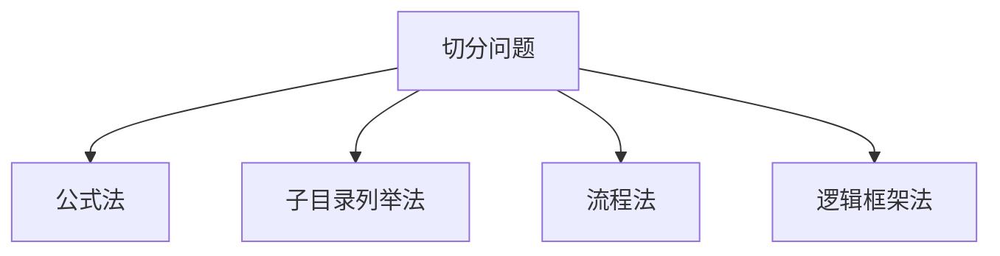

#### 公式法和子目录列举法
先看看`公式法`的应用。

“解决净利问题，无非是从两个层面入手，一是开源，二是节流！”“开源节流”是解决净利问题的公理，因为它源于经典工商管理领域利润的计算公式：

    利润=收入-成本

如图2-5所示，提高净利的问题被分为两个符合MECE原则的支脉：增加销售收入和降低成本。这构成了第一层的问题分解。

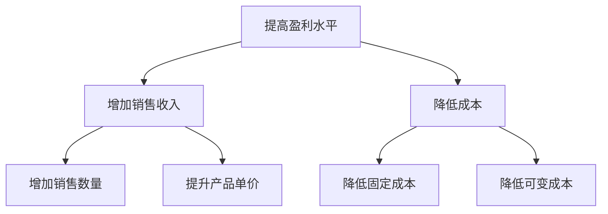

先看“增加销售收入”这个支脉，销售收入的计算又可借用以下公式：

    销售收入=单价×销售数量

销售数量的提升有哪几个核心贡献因素？根据经典`4P营销理论`，销售数量的提升因素除了价格之外还有产品、渠道和推广三大因素。4P营销理论也符合MECE原则，产品、价格、渠道和推广加起来是营销的穷尽组成部分，且相互独立不重叠。这样就套用了经典理论完成了“增加销售数量”支脉在第三层深度的分解（见图2-6）。

按照4P营销理论的逻辑，可以体系化地询问公司运作相关的细节问题。由于是基于高质量逻辑框架的输入，大多会赢得企业高管的信任，因此会得到高质量的一手信息，比如询问以下问题。

- 对比竞品，我们产品本身差异性如何？哪些是消费者感知到且愿意溢价购买的？
- 公司现在的渠道采用的是直营还是代理？如果是代理，有几级代理？销售状况如何？
- 公司现在的促销手段有哪些？跟竞争对手有何不同？
- 本行业在产品、渠道和促销等方面有何趋势？目前效果如何？

管理理论对感知价值也有相应的阐述：影响感知价值的因素包括品牌、原材料、包装和科技等。此时，同样在第三层细节，沿着“提升产品单价”的思路可以跟对方企业高管再进行一轮关于产品单价的探讨。

- 公司主流产品的品牌力如何？跟竞争对手有何区别？是否容易提升？
- 产品的原材料是否有特色？跟竞争对手的相对位置如何？
- 产品包装跟竞品的区别大吗？消费者是否会为更好的包装买单？
- 产品的科技含量高吗？技术是不是本类产品的一个壁垒？趋势如何？

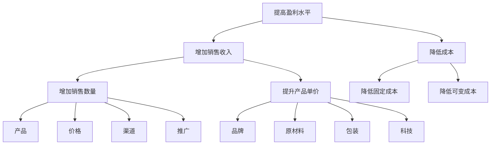

按照管理理论，成本无非分为固定成本和可变成本，这是第二层的分解。固定成本是已经不可逆或不可收回的沉没成本，比如已经建成的厂房和生产线。在讨论成本节约时，往往更聚焦可变成本的优化提升空间。

按此逻辑，“节流”支脉的第三层聚焦在“切”可变成本。用子目录列举法可将可变成本切分为人力成本、原材料成本、研发成本、市场成本等（见图2-7）。接下来，按照此结构继续进行切分。

- 公司主要生产成本集中在人工、原材料还是其他方面？
- 生产规模化和自动化会不会大幅度降低生产成本？
- 人工成本占整体成本的比例，有无改进空间？

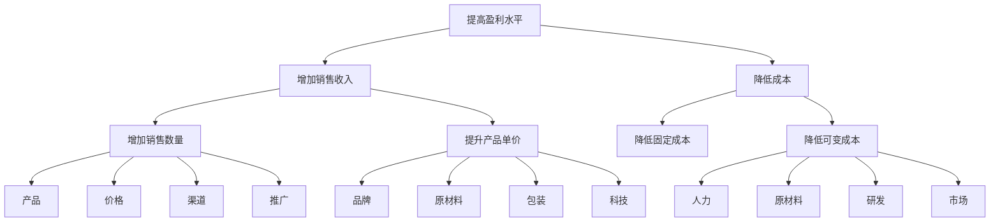

#### 流程法和逻辑框架法
`流程法`和`逻辑框架法`也是在实战中经常用到的“切”的方法。流程法，顾名思义就是把问题按照某种流程步骤串起来。逻辑框架法是按照逻辑叙述常见的粗线条判断框架，比如内部vs外部、主观vs客观、优点vs缺点等对问题进行初步切分。

“提高净利的侧重点根据公司所处发展阶段不同而略有变化。比如初创企业通过单点的营销策划和渠道拓展往往可以快速提升收入，而成熟企业的解决方案则复杂得多，成熟企业更注重长期的产品差异和成本控制的系统化解法。”

再用流程法MECE地列出企业成长的S曲线的4个阶段，对号入座。

- 您公司现在处于什么阶段，是初创期、高速发展期、高峰瓶颈期，还是已经有下滑态势的夕阳或转型期？

分析得到明确回答之后（比如高峰瓶颈期的大企业），再回归到“提高企业净利”问题本身。这时可以以产品发展阶段为讨论主线，这也是一种广义的流程。制造业的产品基本都会经过研发、生产、市场和销售以及售后服务这4个流程阶段。“提高企业净利”的问题可以用这4个阶段来做第一步切分（见图2-8）。可细致地探讨以下问题。

- 公司研发的投入占收入的比例是多少？相对竞品，投入比例和收效如何？
- 生产总体是什么状况，有无优化空间（机械化、自动化和规模化）？
- 目前销售状况如何？销售投入和成本控制做得怎么样？
- 售后服务投入有多少？复购率怎么样？相对竞品，有无优势？

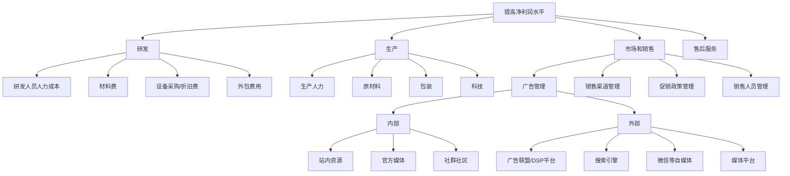

结构化“切”的高要求是遵循`“3-3原则”`，即面对任何问题，都能用维度准确“切”分，然后再纵向深入“挖”到至少第三层的细节。完成一次完整分解之后，能跳出已有的逻辑框架从全新的维度再做两次或以上类似的“切”和“挖”的练习，总共建造3个或以上不同的逻辑树，每个逻辑树都有至少三层细节。

#### 从单一维度到多维度的飞跃
直接看项目优先级分析图谱的一种二维度画法。如图2-10所示，该项目优先级关键图谱由两个坐标轴切分组成（几乎所有关键图谱都是从两个坐标轴开始）：X轴代表“战略重要性”，越向右数值越大，表明战略性越强；Y轴代表“执行难度”，越向上数值越大，表明执行难度越高。在每个轴的中部画一条逻辑上的分隔线，这样就出现了四个小区域，又称为象限。每个象限都是两个核心维度不同值域的组合，用来归纳项目特色。

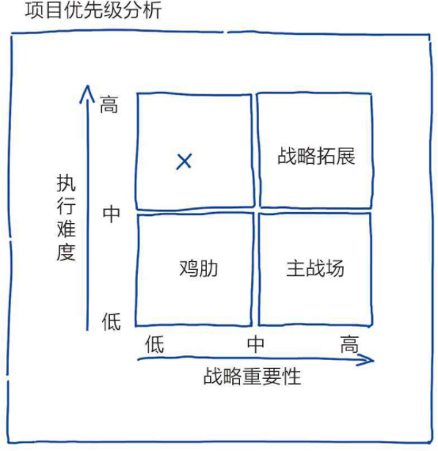

以上项目优先级的战略图谱可以分为四个象限。

- 主战场：战略重要性高而执行难度低。这些项目往往与公司现有战略的核心一致，而且公司多年累积的各种竞争优势，比如研发、生产和销售等，都可以直接应用，是公司的核心业务。执行难度较低是相对本公司其他项目而言的，竞品公司很可能有不同的判断。如果项目落在这个象限，意味着项目是公司立足之本，要保证资源确保项目成功完成。
- 战略拓展：战略重要性高且执行难度高。这些项目常常代表公司未来发展方向，要进行战略布局。项目很可能跟公司本身的核心能力有偏差而导致执行难度偏高。比如一家一直对消费者（to C）服务的公司，在转战云服务等对公（to B）服务的时候，内部要相应做很多调整。如果项目落在这个象限，意味着公司管理层要做个判断，是否要破釜沉舟布局甚至允许初期的亏损。要衡量拓展项目与主战场的关系，尤其是在资源有限的情况下，平衡长期战略和短期获利。
- 鸡肋：战略重要性低且执行难度低。这些项目跟公司战略布局完全不一致，但由于执行难度低，如果利润空间还比较大，是值得重点讨论的。比如，大型家电制造业的企业有机会做房地产开发项目。鸡肋项目构成比较复杂，“食之无味，弃之可惜”，需要讨论和权衡。对于大型成熟企业来说，为一次性的非主营业务短期利润而投入相当大的资源，很有可能会分散精力甚至影响主营业务的发展。
- 必须砍掉的项目（X）：战略重要性低而执行难度高。这些项目被砍的原因毋庸置疑。但工作中经常会碰到类似“吃力不讨好”的项目，苟延残喘的原因也多种多样，有时是历史遗留的问题项目，项目前景堪忧但往往由于前期投入大而难以割舍；有时是公司战略方向变化导致项目适用性降低；有时甚至是需求端已经改变导致项目的意义不复存在。总之，如果项目落在这个象限，原则上，没开始的项目坚决不能开始，已经开始的项目要认真考虑如何止损。

如何把潜在净利加入到图谱？我们可以尝试用图形展示这个数值。如图2-11所示：

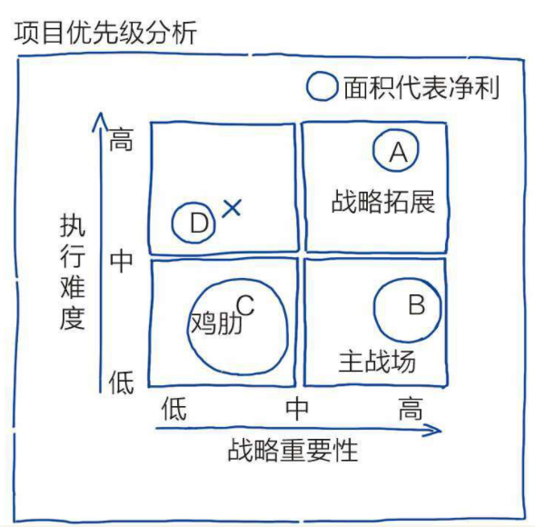

## 结构化战略思维四大原则
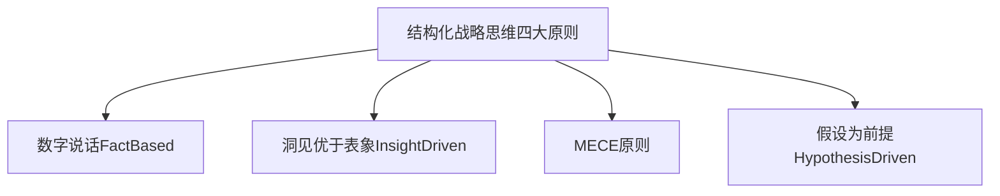

其中`数字说话`和`洞见优于表象`是偏重数字分析和高效交流的科学方法和行为准则，而`MECE原则`和`假设为前提`更多是指导思路的方法论。

利用维度切分和MECE原则创造出多个用于解决实际问题的全新理论框架，按照从宏观到微观、从外部到内部的顺序，审视一下最常见的几个经典管理学理论：从`宏观PEST模型`开始，到行业赛道吸引力的`波特五力模型`，然后是公司能力`SWOT分析`，再到内部公司管理的`麦肯锡7S模型`，最后看看多维度理论如`BCG矩阵`和`消费者细分市场感知分析`。

### PEST模型
`PEST模型`由哈佛经济学教授弗朗西斯·阿吉拉尔（Francis J.Aguilar）最早在1967年提出，是用来评判企业外部宏观经济大环境的理论框架。

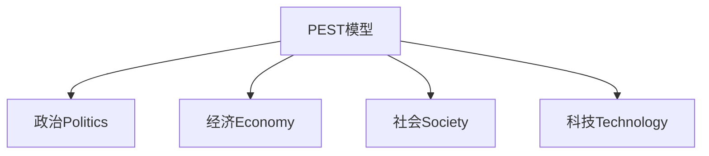

头脑风暴的第一步是，要求团队把所有能想到的具体因素先罗列出来，然后再逐一排查、提炼和归类。如果大家踊跃参与讨论，白板慢慢地就会被头脑风暴产生的相关决策因素填满。

政局稳定、边境稳定、宗教信仰、人口数量、消费能力、军事能力、投资政策、法治程度、货币流动性、人口增长速度、人口素质、科技水平、发明创造、对外国资本的保护、医疗卫生、基础建设（如公路）、自然资源、政府科技投入、港口数量、互联网发展程度、工业现代化程度……

头脑风暴的第二步是提炼归类。作为主持人，你的主要任务是把以上的因素去除冗余，归纳成几个大的类别，并有意地引导大家用统一的MECE视角看待这些因素。梳理一下头脑风暴得出的因素，大概率会得到以下分类结果。

- 政治：政局稳定、边境稳定、对外国资本的保护、法治程度
- 经济：人口数量、人口增长速度、消费能力、投资政策、货币流动性、医疗卫生、基础建设（如公路）、自然资源、港口数量、互联网发展程度、工业现代化程度
- 军事：军事能力
- 文化：宗教信仰、人口素质
- 科技：科技水平、发明创造、政府科技投入

### 波特五力模型
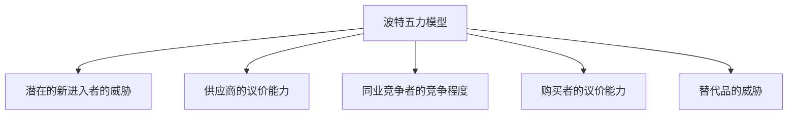

假设公司是专做早餐的餐饮业实体，是一家卖烧饼的店铺，并起了个非常有历史感的名字，叫“大郎烧饼”。

- 同品类竞争者：其他卖烧饼的，如“太郎烧饼”和“老狼烧饼”，直送网店
- 上游供应商：卖面的、卖炭的
- 下游消费者：顾客
- 替代品：街上的其他饭店、卖面包的、卖面条的、卖西方糕点的、卖包子的
- 潜在进入者：正在买设备的邻居、BAT互联网巨头的AI烘焙

### SWOT分析
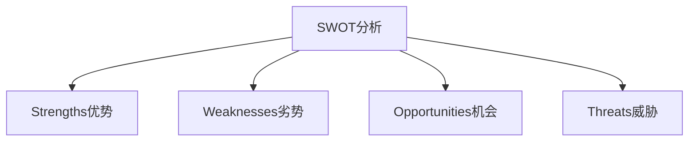

整个模型只重点用了“内部vs外部”一刀来“切”公司管理问题，然后在内外部基础上，用“好vs坏”拼凑成4个象限。

- 优势：公司管理相关的有利的内部因素。
- 劣势：公司管理相关的不利的内部因素。
- 机会：公司管理相关的有利的外部因素。
- 威胁：公司管理相关的不利的外部因素。

### 麦肯锡7S模型
麦肯锡7S模型。这个模型是麦肯锡的两位咨询师小罗伯特·H.沃特曼（Robert H.Waterman，Jr.）和托马斯·彼得斯（Thomas Peters）在20世纪80年代初首次提出的，主要用来诠释公司各内部模块是如何相互作用的。

- Strategy战略：公司要建立相对竞争对手的可持续的竞争优势的计划。
- Structure结构：公司的组织架构，如汇报的链条。
- Systems系统：员工完成任务所用的系统和流程。
- Shared values共同价值观：公司的核心使命和文化。
- Style风格：公司决策和管理风格。
- Staff员工：组织成员。
- Skills能力：组织综合能力。

### BCG矩阵
BCG矩阵（又称“市场增长率–相对市场份额矩阵”）是由波士顿咨询公司（The Boston Consulting Group，BCG）创始人布鲁斯·亨德森（Bruce Henderson）于1970年首创的，是一种关于企业产品战略的评判框架。最初版本的BCG矩阵以“市场吸引力”与“企业实力”两个维度分别为X轴、Y轴。市场吸引力主要以市场销售总额的增长率来评判；企业实力包括市场占有率、技术、设备、资金利用能力等，往往以产品市场占有率作为评判标准。

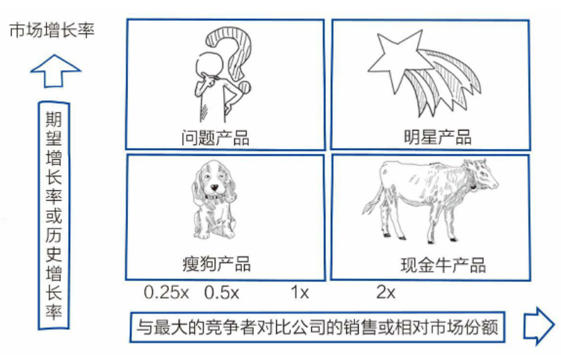

- 现金牛产品：在饱和或略萎缩的成熟市场，该产品市场占有率高。比如，中国碳酸饮料市场逐渐饱和，可口可乐占有的市场份额较大，是一个现金牛产品。现金牛产品的战略方向是保证基本补给，争取在短时间内获取更多利润，为创新产品提供资金保障。
- 明星产品：在高速发展的增长市场，市场占有率高。比如，在电动汽车赛道，特斯拉就属于明星产品。明星产品的战略方向是抓住市场机会，倾尽投入，积极扩大经济规模，在提升本产品市场占有率的同时提高市场进入的壁垒。
- 问题产品：在高速发展的增长市场，市场占有率低。问题产品处于一个高增长的赛道，资本和潜在玩家都会涌入。在这样的市场中不进则退。针对这类产品的产品战略要么加大投入，把产品向明星产品品类推进，要么就止损放弃。
- 瘦狗产品：在饱和或略萎缩的成熟市场，市场占有率低。针对瘦狗产品，建议采用撤退战略，应减少产能，逐渐撤退；对那些销售增长率和市场占有率均极低的产品，应适时淘汰。

### 消费者感知图
消费者感知图的主要功能是细分消费者或购买者，并根据每个细分客户群体制定公司的产品战略。X轴是消费者对价值的追求，也称为“价值感知”。价值感知数值越大意味着产品的质量、原材料、技术和包装等因素越优秀。Y轴是消费者对品牌的追求，也称为“形象感知”。形象感知的数值越大表明产品品牌在消费者的思维空间中占比越大。

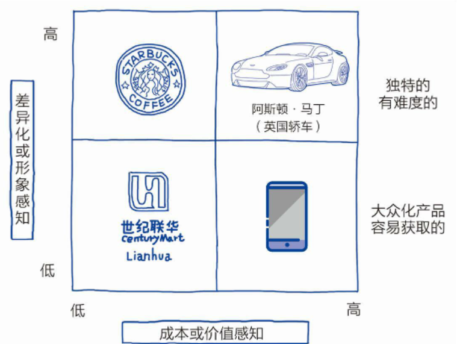

- 价格敏感型：对产品价值要求相对低，对品牌要求也相对低，最主要的决策因素往往是价格。对于这类消费者，企业要想方设法用规模化和自动化等降低成本的手段形成相对可持续的价格优势。
- 追求极致型：对产品价值要求高，对品牌要求也高，付费意愿偏强烈。对于这种消费者，产品一定要占据市场中价值感和品牌组合的制高点。比如苹果手机，一旦稳定成为市场上价值感和品牌的综合龙头，就能拥有让人嫉妒羡慕恨的品类最高定价权。
- 实用型：对产品价值要求高，对品牌要求低，是一群懂行并追求超强性价比的消费者。这些消费者对于广告等营销方法相对不敏感，总是在寻找价值感高且价格合理的产品。消费者更看重价廉物美的产品，比如一些非名牌手机，只用苹果手机一半的价格就能满足消费者对手机功能的全部需求。
- 虚荣型：对产品价值要求相对不敏感，但对品牌要求高，往往是一群追赶潮流并愿意为品牌溢价买单的消费者。比如对于某些特定消费者来说，星巴克咖啡本身并不是刚需，购买星巴克主要是为了体验品牌形象所映射的小资生活方式。

# 结构化战略思维的应用
## 新麦肯锡五步法：结构化战略思维的综合运用
面对大多数战略项目，麦肯锡通常会派遣一支3-5人组成的咨询师小组，用8~10周的时间完成。在团队构成上，这3-5人的团队由一个核心的项目组长EM（EngagementManager）负责带领2-3名组员；同时会有1名合伙人级别的咨询师指导，把控项目方向和进展，并引领与客户高层互动。在大多数情况下，团队成员对项目所涉及的具体业务并无可复制的专业经验，如果有需要，公司会指派内部或外部专家为项目做专业知识上的支持。

新麦肯锡五步法从项目管理的角度，串起战略项目解决从开始到交付的5个关键步骤：

    定义问题->结构化分析->提出假设->验证假设->交付

## 第一步：定义问题
### 对问题本身的推敲是思辨者的行为特色
示例：敲钉子的故事

>假设一位客户想外包一个简单的任务——将一根钉子敲入木板中。客户找来了D公司和M公司，想了解各自的解决方案。
>
>D公司是行业中有名的专业咨询公司，公司里有很多敲钉子的专家。D公司的方案一般是这样展示，在仔细观察了钉子和板子之后，D公司的销售代表直奔主题，不无夸张地说：
>
>“这个项目我们不光能做，D公司简直就是为这类项目而生的！”
>
>销售代表从“为什么是我们”开始并以此为中心展开陈述：“我们D公司采取世界领先的X技术敲钉子，拥有世界最大且材质最坚硬的锤子。我们人员的手臂最有力，锤子按照符合力学原理的完美运动轨迹落下，保证多快好省地一锤定音（钉子）。”在展示的最后，D公司销售代表会提供以前100次成功敲钉子的案例，然后低声说：“老客户有折扣。”
>
>客户听得频频点头：D公司的方案有历史数据支持，能够直接解决问题而且经济实惠。
>
>轮到M公司了，这是一家战略咨询公司，公司并没有派销售代表，只派了一位年轻合伙人。M公司的合伙人连钉子都没看，开口就问了一个问题：
>
>“我们为什么要敲这个钉子？”
>
>语惊四座！毕竟“甲方为王”的时代，谁敢对客户的想法产生疑问？
>
>但毕竟M公司合伙人背景光鲜亮丽，在行业里具有一定的威信，因此问题还是要回答的。
>
>客户回答：“我们要把板子A和板子B连接起来。”
>
>M公司合伙人追问：“为什么要连接起来？”
>
>客户回答：“我们要做一把椅子。”
>
>合伙人接着发问：“什么要做一把椅子？”
>
>客户有点不耐烦，回答：“我们要用椅子在新建的会议室里接待客人。”
>
>询问至此，M公司合伙人停止发问，陷入片刻的思考。经过三个连续“为什么”，他已经更多地了解到客户敲钉子的真正原因和诉求。客户敲钉子要解决的问题并不是连接木板，也不只是做椅子，而是要解决“在会议室待客用什么服务硬件”的问题。
>
>M公司合伙人和客户接下来的对话都围绕着用户群体画像和主要诉求、刚需进行。有多少因素能使宾客在会议室感觉舒适？是文化、舒适度、仪式感或便捷等显性诉求，还是更为隐晦的奢华感等心理满足？宾客对会议室硬件的要求是什么？
>
>初步与客户讨论需求之后，M公司合伙人会站在全球视野看待问题，与客户分享自己涉猎的具有国际视野的相关方案。会议室的坐具除了椅子之外，还有很多可选方案，比如日本的榻榻米、韩国的坐垫、因纽特人铺在地上的兽皮、欧美复古家具或现代简约沙发等，当然肯定离不开富含中国元素的庄重典雅的木制座椅，还有带有浓重地方特色的解决方案，如东北火炕等。如果时间允许，M公司合伙人还会谈谈未来的趋势。
>
>当然，这些都还只是假设，要想真正了解客户特定的需求，M公司合伙人还会建议客户做一个战略项目。
>
>本来信心满满的客户在听完M公司合伙人的讲解之后，有点焦虑。他开始认识到隐藏在“敲钉子”后面的真正的核心问题，陷入了沉思。

`战略思维`从全局高度把握问题的准确性，重点在于“为什么——解决什么问题”，并不聚焦“怎么做——实施的细节”。`专家思维`则往往把“为什么——解决什么的问题”当成已知，而侧重“怎么做——实施的细节”以及成果输出，比如“用什么方法、以什么速度和价格，在限定时间内敲钉子”。因此，在项目初期，战略思维更注重需求端的逻辑，而专家思维十分注重过往经验、专业和最佳解决方案。

### 定义正确问题的衡量标准
如何衡量是否“定义了正确的问题”？最直接的衡量标准就是，当这个正确的问题被解决后，相关的所有问题也会得到完全解决而没有后遗症。定义了正确的问题后，着手解决这个问题时就会发现问题表象发生了根本性的改变。被影响的人会在深层行为上发生变化，从而使问题完全得到解决，而不是“拆了东墙补西墙”的暂时缓解。

“问题定义工具箱”（见图5-2），在确认问题方向后，该工具可用于指导团队在细节层面精准把握问题定义的框架。

最基础需要解决的问题，定义不要太窄。`SMART原则`：`具体(specific)`,`可衡量(measurable)`,`能落地(action-oriented)`,`相关(relevant)`,`时间性强(time-bound)`

1. `背景(Perspective/context)`：背景的具体相关信息，如业界趋势、在行业中相对位置；
2. `成功标准(Criteria for success)`：明确项目的成功KPI,包括财务和非财务，必须与主要负责人达成一致；
3. `边界(Scope of solution space)`：划定项目边界，项目里面包括什么，不包括什么；
4. `限制条件(Constraints within solution space)`：明确解决方案的限制条件，如是否考虑并购等；
5. `责任人/相关人(Stakeholders)`：利用RACI等工具来明确谁是支持资源，谁是最终拍板的决策者；
6. `资源(Key sources of insight)`：主要资源，包括专家、数据库等。

注：`责任矩阵RACI`将相关人员分为四类：

1. 谁执行（R = Responsible），负责执行任务的角色，具体负责操控项目、解决问题。
2. 谁负责（A = Accountable），对任务负全责的角色，只有经其同意或签署之后，项目才能得以进行。
3. 咨询谁（C = Consulted），在任务实施前、中 提供指定性意见的人员。
4. 告知谁（I = Informed），及时被通知结果的人员，不必向其咨询、征求意见。
5. 有时又成为RASCI矩阵，即多了一个S：S(Support)支持者：有钱出钱，有力出力

## 第二步：结构化分析

