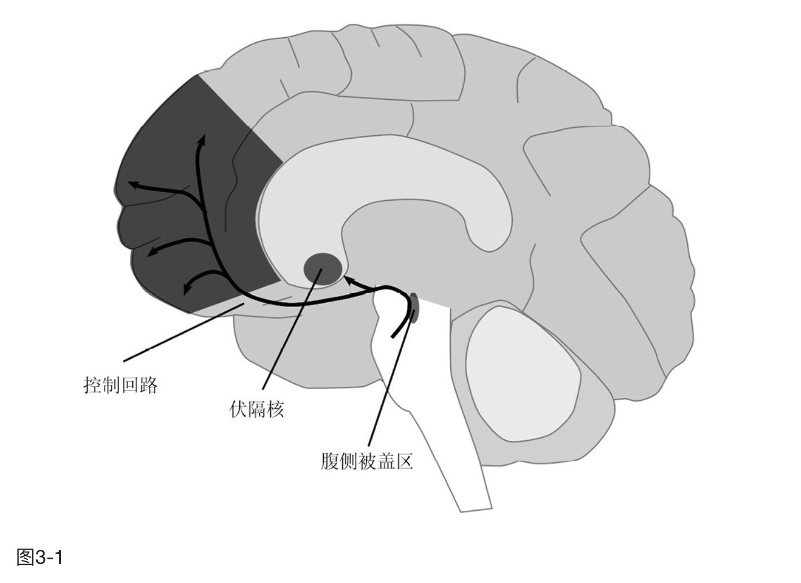

    作者: (美) 丹尼尔·利伯曼 / (美) 迈克 尔·E.朗
    出版社: 中信出版社
    出品方: 鹦鹉螺
    原作名: The Molecule of More: How a Single Chemical in Your Brain Drives Love, Sex, and Creativity―and Will Determine the Fate of the Human Race
    译者: 郑李垚
    出版年: 2021-8
    页数: 300
    定价: 59
    装帧: 平装
    ISBN: 9787521731583

[豆瓣链接](https://book.douban.com/subject/35545272/)

- [爱情](#爱情)
  - [为什么爱情会消逝](#为什么爱情会消逝)
  - [一个大脑，两个世界](#一个大脑两个世界)
  - [持久爱情的化学钥匙](#持久爱情的化学钥匙)
  - [多巴胺阻碍你寻欢](#多巴胺阻碍你寻欢)
- [毒品](#毒品)
  - [如何活着](#如何活着)
  - [为什么我们生活在一个虚幻的世界里？](#为什么我们生活在一个虚幻的世界里)
  - [劫持欲望回路](#劫持欲望回路)
  - [永不停止的渴望](#永不停止的渴望)
  - [持久的欲望，短暂的幸福](#持久的欲望短暂的幸福)
  - [冲动与恶性循环](#冲动与恶性循环)
  - [便捷性是成瘾的关键](#便捷性是成瘾的关键)
  - [自我抑制的回路](#自我抑制的回路)
- [掌控的力量](#掌控的力量)
  - [规划与计算](#规划与计算)
  - [自我效能的提升](#自我效能的提升)
  - [外太空的挑战与内心世界的斗争](#外太空的挑战与内心世界的斗争)
  - [多动症的秘密](#多动症的秘密)
  - [欺诈的胜利](#欺诈的胜利)
  - [赢是为了不输](#赢是为了不输)
  - [什么是多巴胺能人格？](#什么是多巴胺能人格)
  - [如何脱险生还](#如何脱险生还)
  - [远离使杀戮更容易](#远离使杀戮更容易)
  - [多巴胺对抗多巴胺](#多巴胺对抗多巴胺)
  - [动机增强疗法：用欲望多巴胺对抗欲望多巴胺](#动机增强疗法用欲望多巴胺对抗欲望多巴胺)
  - [认知行为疗法：用控制多巴胺对抗欲望多巴胺](#认知行为疗法用控制多巴胺对抗欲望多巴胺)
- [自由与保守](#自由与保守)
  - [与保守主义者结婚](#与保守主义者结婚)
  - [得而复失的伤害更大](#得而复失的伤害更大)
- [和谐](#和谐)
  - [多巴胺和当下分子之间微妙的平衡](#多巴胺和当下分子之间微妙的平衡)
  - [擅长一件事的乐趣](#擅长一件事的乐趣)
  - [现实的回报](#现实的回报)

# 爱情
## 为什么爱情会消逝
多巴胺不是快乐的制造者，而是对意外的反应，即**对可能性和预期的反应**。

我们人类的多巴胺冲动也来自类似的让人期待的惊喜：收到恋人的甜蜜留言（上面会说什么？），或是一封来自多年未见的老友的电子邮件（会有什么新鲜事？），或是在老酒吧的破旧桌子边遇见迷人的新伴侣（会有怎样的浪漫？）。但当这些事情都习以为常时，新奇感就消逝了，多巴胺冲动也随之消退。

我们的大脑生来渴求意外之喜，也因此期盼未来，每个激动人心的梦想都在那里萌生。但当任何事情，包括爱情变得习以为常时，那种兴奋感就悄然溜走，而我们的注意力又被其他新奇的事物吸引了。

研究这个现象的科学家把这种从新奇事物中得到的快感命名为“奖赏预测误差”。我们每时每刻都在预测将要发生的事，从什么时候可以下班，到在自动取款机上看到卡里有多少余额。实际发生的事好于我们的预期，就表明我们对未来的预言存在误差：可能我们可以提前下班了，或者查看余额时发现比预期多了100元。正是这种让人快乐的误差触发多巴胺行动起来。这种快乐不是源于额外的时间或钱本身，而是预期之外的好消息带来的兴奋感。

然而，有时候在我们得到了想要的东西之后，它看起来就没有那么好了。多巴胺能的兴奋（即预期带来的兴奋）并不持久，因为最终未来都会变成现在。当未知事物令人激动的神秘感变成乏味的熟悉日常时，多巴胺的工作就完成了，失望乘虚而入。

## 一个大脑，两个世界
约翰·道格拉斯·佩蒂格鲁（John Douglas Pettigrew）是澳大利亚昆士兰大学的心理学荣休教授。佩蒂格鲁发现，大脑将外部世界分为两个独立的区域来管理，即`“近体的”`和`“远体的”`——简单来说就是远近两个区域。近体空间包括手臂可及之处，在此范围内的事物你可以马上用手控制，这是一个真实的世界。远体空间是指你的手臂无法触及的地方，不管是3英尺（约1米）远还是300万英里（约500万千米）外，这个领域代表着可能性。

基于这套对位置的定义，你将得出一个显而易见但实用的结论：由于从一个地方移动到另一个地方需要时间，任何与远体空间的互动肯定发生在未来。或者换一种说法，距离与时间有关。举个例子，如果你想吃桃子，但离你最近的桃子位于街角市场的水果摊，那你现在就没法享用它，只能在未来你购买之后才能享用它。得到一臂之外的东西需要做计划，这种计划可能是站起来开灯这样简单的事，可能是走去市场买桃子，也可能是弄清楚如何向月球发射火箭。远体空间中的事物的定义就是如此：得到它们需要努力、需要花时间，且大多数情况下需要做计划。相反，近体空间的事物是可以在当下体验的。这种体验是即时的，当我们触摸、品尝、把持、紧握某物时，我们会即刻感到幸福、悲伤、愤怒和愉悦。

我们也因此得出了一个神经化学的结论：大脑在近体空间的工作方式，与远体空间截然不同。人类心智如此设计，让大脑以这种方式区分事物是有一定道理的：它用一个体系来处理你拥有的，用另一个体系来处理你没有的。

从进化的角度来看，你得不到的食物和你实实在在拥有的食物是完全不一样的，对于水、避难所和工具也同样如此。这个分类非常基础，于是大脑进化出了不同的信号通路和化学物质来处理近体空间和远体空间。当你向下看时，你就看向了近体空间，此时大脑被处理当下体验的化学物质支配着。但当大脑处理远体空间时，有一种化学物质的影响比其他所有物质都大，即与预期和可能性相关的多巴胺。那些远处的东西，即我们没有的东西，不能被使用和消耗，你只能去渴望。多巴胺有一个非常特殊的职责：最大化利用未来的资源，追求更好的事物。

生活中的每个部分都被划分成这两种方式：一种方式决定我们想要什么，另一种方式决定我们拥有什么。你想要一套房子，感受到为了买房必须努力工作的欲望，这时候你就在使用控制远体空间的大脑回路；当你拥有这套房之后，享受它时你使用的则是另一组不同的大脑回路。预期涨工资能刺激未来导向的多巴胺，这种感觉与第二或第三次收到涨后工资的当下体验是不同的。找寻爱情和维持爱情使用的也是两套不同的技能。爱情必须从远体经验转向近体经验——从追求到拥有，从翘首期盼到精心呵护。这些技能差别很大，这就是为什么爱情的本质在经过一段时间之后会变化，也是为什么对很多人来说，爱情在多巴胺兴奋或所谓浪漫之后会消逝。

## 持久爱情的化学钥匙
从多巴胺的角度来说，拥有是无趣的，只有获得才有趣。如果你生活在桥下，多巴胺会让你想获得一顶帐篷。如果你生活在帐篷里，多巴胺就会让你想获得一栋房子。如果你住在世界上最贵的豪宅中，多巴胺会让你想获得月球上的城堡。多巴胺不会满足于某一个标准，追求也永无止境。大脑中的多巴胺回路只能被光鲜之物的可能性所刺激，而不管现在的事物已有多完美。多巴胺的座右铭是“想要更多”。

多巴胺不是快乐分子，它是预期分子。为了享受我们拥有的东西，而不是仅仅可能得到的东西，我们的大脑必须从面向未来的多巴胺过渡到面向现在的某种化学物质，这是一系列神经递质，我们称之为“当下分子”。大多数人都对它们的名字略有耳闻，包括`血清素`、`催产素`、`内啡肽（相当于大脑自产的吗啡）`和`内源性大麻素（相当于大脑自产的大麻）`。与通过多巴胺得到的来自预期的愉悦相反，这些化学物质会给我们带来由感觉和情感引发的愉悦。

根据人类学家海伦·费希尔的说法，早期爱情或者说“激情之爱”只会持续12~18个月。在那之后，一对情侣要保持对彼此的依恋就需要发展出一种不同的爱，这被称为“陪伴之爱”。陪伴之爱是由当下分子调节的，因为它涉及发生在此时此地的经历——既然你和你爱的人在一起，就好好享受吧。

在爱情的第二阶段，当下分子掌握了主导权，多巴胺会被抑制。大脑必须这么做，因为多巴胺在我们脑海中描绘了一幅色彩斑斓的未来图景，鞭策我们不断努力使之成为现实。对当前形势的不满是导致变化的一个重要因素，这就是一段新感情的全部意义所在。另外，当下的陪伴之爱表示你对当前现实十分满足，厌恶改变，至少在伴侣关系方面如此。事实上，尽管多巴胺和当下分子的回路能一起工作，但在大多数情况下它们是相互对抗的。在当下分子回路被激活时，我们更喜欢体验周围的真实世界，多巴胺就会被抑制；而当多巴胺回路被激活时，我们则进入一个充满可能性的未来，当下分子会被抑制。

实验室的测试证明了这个结论。科学家们观察了从处于热恋中的人身上提取的血细胞，发现血清素受体的水平比“健康人”要低，这表明当下分子受到了抑制。

告别让人另寻新欢和渴求激情的多巴胺并不容易，但拥有这方面的能力是成熟的标志，也是迈向持久幸福的一步。假设一个人计划去罗马度假，他花了几个星期安排每日行程，以确保走遍他所熟知的每一个博物馆和地标。但在他置身于这些最绚丽的艺术品中时，他却在想着如何去已经预订了晚餐的餐厅。他并不是对米开朗琪罗的杰作不感兴趣，只是他的性格是由多巴胺主导的：他热衷于期待和计划，而不是实施。情侣们也在期待和体验之间经历着同样的脱节。早期的爱情，也就是激情之爱是多巴胺主导的——使人兴奋、理想化、好奇，并关注未来。后一阶段的陪伴之爱则是由当下分子主导的——使人满足、心平气和，并通过身体的感官和情感去体验。

建立在多巴胺基础上的浪漫关系是一段令人兴奋但短暂的过山车之旅，然而我们大脑中的化学过程也为我们铺平了通往陪伴之爱的道路。多巴胺代表着痴迷与渴望，而与长期关系最相关的化学物质则是催产素和血管升压素。催产素在女性中更活跃，而血管升压素在男性中更活跃。

科学家们在实验室里对各种动物的神经递质进行了研究。例如，科学家将催产素注射到雌性草原田鼠的大脑中以后，它们会立刻与周围的某只雄性田鼠形成长期关系。类似地，研究人员通过基因编辑制造出了具有滥交倾向的雄性田鼠，又给它们增加了一个增强血管升压素的基因时，发现它们在有多个雌性田鼠可供交配时，也只与某一只雌性田鼠交配。血管升压素就像一种“好丈夫激素”，而多巴胺则相反。具有能产生高水平多巴胺的基因的人拥有的性伴侣数更多，首次性交年龄也更低。

随着多巴胺驱动的热烈爱情演变成当下分子主导的陪伴之爱，大多数情侣或夫妇的性生活频率会降低。这是合理的，因为催产素和血管升压素会抑制睾酮的释放。反过来，睾酮也抑制催产素和血管升压素的释放，这也解释了为什么血液中睾酮含量高的男性结婚的可能性较小。同样，单身男性比已婚男性睾酮含量更高。如果一个男人的婚姻变得不稳定，他的血管升压素会下降，睾酮会上升。

## 多巴胺阻碍你寻欢
从热切的期待到亲密接触的快感，性爱的各阶段定义了爱情的各阶段：性就是爱情的快进。性始于欲望，是由睾酮这种激素驱动的一种多巴胺能的现象。接下来是性兴奋，这也是一种期待性的多巴胺能的体验。当身体接触开始时，大脑就将控制权转移到当下分子以便提供感官体验的愉悦，这个过程主要涉及内啡肽的释放。这一行为的顶峰，即性高潮，几乎完全是一种此时此地的体验，内啡肽和其他当下神经递质一起工作，将多巴胺彻底关闭。

在一项在荷兰进行的实验中，人们扫描了一组男人和女人的大脑，当他们受到刺激达到性高潮时，摄像机捕捉到了其中发生的变化。扫描显示性高潮与整个前额皮质的激活程度的降低有关，前额皮质是大脑中多巴胺能的部分，它负责限制人的行为。松开控制可以激活性高潮所需的当下分子回路，不管被试者是男人还是女人。除了少数例外，大脑对性高潮的反应是相同的：多巴胺被关闭，当下分子通行。

# 毒品
## 如何活着
>安德鲁是个20多岁的年轻人，在一家售卖企业软件的公司工作。他自信、性格外向，是公司里最优秀的销售员之一。他总是全神贯注地工作，几乎没有时间放松或从事其他活动，除了一件事：跟女人睡觉。他说自己大概与100多个女人有过性关系，但从未建立过正式的关系。他内心其实很渴望稳定的亲密关系，他知道这对他的长期幸福很重要，他也意识到，继续那种一夜情模式是不可能给他带来幸福的。然而，这一模式仍在继续。

欲望始于大脑中一个在进化上早就存在的区域，位于头骨深处，被称为`腹侧被盖区`。这一区域富含多巴胺，事实上，它是多巴胺两个主要的产生区域之一。像大多数脑细胞一样，生长在那里的细胞长着长长的尾巴，穿过大脑到达伏隔核。这些长尾巴的细胞被激活时，会将多巴胺释放到伏隔核中，让我们产生做某事的动力。这个回路叫作中脑边缘通路，但我们通常更直白地称之为`“多巴胺欲望回路”`。

这种多巴胺回路在进化中学会了促进让你生存下来和繁衍下去的行为，或者更明确地说，它帮助我们获得食物和性行为，并赢得竞争。你看到桌上放着甜甜圈的盘子时，欲望回路就会被激活，这不是因为你需要吃甜甜圈，而是因为从进化或维持生命的角度来看，吃这个东西对你有利。也就是说，在这种情况下，不管你饿不饿，这个回路都会被激活。这就是多巴胺的本质。它总是专注于获取更多的东西，着眼于为未来提供帮助。饥饿是此时此刻会发生的事情。但多巴胺说：“去吃甜甜圈吧，即使你不饿。它会保证你在将来也活得下去。谁知道什么时候还能有食物呢？”这对我们的祖先来说意义重大，因为他们大多生活在饥饿的边缘。

## 为什么我们生活在一个虚幻的世界里？
>每当安德鲁看到一个妩媚的女子时，跟她上床就成了他一生中最有趣的事，其他一切都变得索然无味。他通常在酒吧里猎艳，当他不工作的时候，酒吧就是他想去的地方。有时他告诉自己就是去放松一下，喝点儿啤酒。他喜欢这种氛围，有些时候他也会控制自己不去勾搭别人。他知道一旦性行为结束，他就会对这个年轻女子失去兴趣，而他不喜欢这种感觉。尽管知道事情会怎样发展，他通常还是屈从于诱惑。
>
>过了一段时间，情况变得更糟了。只要女人同意和他一起回家，他就对她失去了兴趣。追逐结束了，一切都变了。在他的眼里，她甚至看起来都不一样了，瞬间就发生了转变。当他们到达他的公寓时，他已经不想和她发生关系了。

从广义上讲，说一件事物是“重要的”，差不多就等于说它与多巴胺有关。为什么？因为多巴胺的一项重要任务就是作为一个预警系统，提醒我们留意任何能帮助我们生存的事物。当一件有利于我们持久生存的东西出现时，不必去多想，多巴胺会让我们现在就得到它，不管我们喜不喜欢，或者现在是否需要它。多巴胺并不在乎这些。它就像一个总是买卫生纸的老太太，哪怕储藏室里已经堆了一千卷纸也无关紧要，她的态度是“卫生纸永远不嫌多”。多巴胺就是这样，它促使你拥有并不断积累任何可能帮助你维持生命的东西，而不仅仅是卫生纸。

在更日常的情景下，一旦欲望回路中的多巴胺被激活，它就会激发能量、热情和希望。这种感觉很好，**事实上，有些人一生的大部分时间都在追求这种感觉——一种期待的感觉，一种生活即将变得更好的感觉**。你将要享用一顿美味的晚餐，见到一位老朋友，碰上一场大促销，获得一个知名的奖项，等等。多巴胺激发了人们的想象力，创造了美好的未来图景。

而当未来变成了现在，当晚餐已经下肚，或者爱人已被你拥入怀中，会发生什么？兴奋、热情和充满精力的感觉消散了，多巴胺停止工作了。多巴胺回路不会处理现实世界中的经验，只处理想象中未来的可能性。这让很多人感到很失望。他们过于依附多巴胺能的刺激，让自己逃离了现在，躲在自己想象的舒适世界里。“明天我们做什么？”他们一边咀嚼食物一边问自己，忘记了这样一个事实——他们也曾热切期待着这顿饭，但现在却对它视而不见。满怀希望的旅途要比到达目的地更快乐，这是多巴胺爱好者的座右铭。

## 劫持欲望回路
美国国家药物滥用研究所前所长艾伦·莱什纳（Alan Leshner）说，毒品会“劫持”欲望回路。它们与食物或性等自然奖赏一样会刺激大脑激励系统，但它们刺激大脑的强度远甚于自然奖赏。这就是为什么食物和性上瘾与毒品上瘾有如此多的共同点。以维持生命为目标而进化来的大脑回路被一种让人上瘾的化学物质所掌控，奴役那些被它的无形之网困住的上瘾者。

毒品从根本上不同于天然的多巴胺触发器。当我们饿的时候，没有什么比吃东西更能激励我们的了。但是在我们吃饱了之后，我们获得食物的动机就会下降，因为饱足感回路被激活，欲望回路被关闭。人体有适当的检查和平衡机制来保持一切稳定。但对于吸毒来说，饱足感回路是不存在的。吸毒者会一直吸毒，直到他们昏倒、生病或身无分文。如果你问一个瘾君子他想要多少毒品，他只有一个答案：“更多”。

## 永不停止的渴望
当你期望的奖赏没有实现时，多巴胺系统就会关闭。用科学术语来讲，当多巴胺系统处于静止状态时，它会以每秒3到5次的速度被激发。但当它兴奋时，它的激发速率会激增到每秒20到30次。当预期的奖赏没有实现时，多巴胺的激发速率会下降到零，而这种感觉很糟糕。

## 持久的欲望，短暂的幸福
“喜欢”涉及的大脑回路与欲望回路不同，并使用当下化学物质来发送信息，而不是多巴胺。特别是，“喜欢”依赖的化学物质与促进陪伴式爱情的长期满足相同，它们是内啡肽和内源性大麻素。海洛因和奥施康定等阿片类药物是目前最容易上瘾的药物之一，正是因为它们同时扰乱了欲望回路和喜欢回路（多巴胺和内啡肽分别在其中起作用）。大麻也同样如此，它与两个回路相互作用，刺激多巴胺和内源性大麻素系统。这种双重效应导致了不寻常的结果。

## 冲动与恶性循环
过度且长时间地刺激多巴胺，它的能量就会喷薄而出。一旦你被它掌控了，你就要跟随它的步伐。

## 便捷性是成瘾的关键
一个东西是否容易获取，是它是否容易成瘾的关键因素。对香烟和酒精上瘾的人比对海洛因上瘾的人多，虽然海洛因对大脑的刺激更容易引发上瘾。香烟和酒精造成的公共健康问题更严重，因为它们更容易获得。事实上，为了减少这些物质引起的问题，**最有效的方法就是使获得它们变得更困难**。

## 自我抑制的回路
多巴胺欲望回路很强大，它将注意力、激励和刺激集中起来，对我们做出的选择有着深远的影响。然而，它并不是万能的。上瘾者也会去戒烟、戒酒、戒毒，暴饮暴食者也会去节食减肥，有时我们会关掉电视，离开沙发去跑步。**什么样的大脑回路强大到足以对抗多巴胺呢？答案是多巴胺，多巴胺可以对抗多巴胺**。与欲望回路相反的回路可以被称为“多巴胺控制回路”。

前文说过，在许多情况下，聚焦于未来的多巴胺会阻碍当下分子回路的活动，反之亦然。如果你在想去哪里吃晚餐，你可能就不喜欢午餐吃的三明治的色香味了。但是在面向未来的多巴胺系统内部，也存在相左的意见。

# 掌控的力量
## 规划与计算
经过中脑边缘回路的多巴胺会产生冲动，我们称该回路为`多巴胺欲望回路`。计算和规划（控制各种情况的手段）来自中脑皮层回路，我们称之为`多巴胺控制回路`（图3–1）。为什么称之为控制回路？因为它的目的是管理欲望多巴胺不可控的冲动，将这种原始能量引向对我们有利的终点。此外，通过使用抽象的概念和前瞻性的策略，它使我们能够控制周围的世界，并支配我们的环境。

这两个回路从同一个地方开始，但欲望回路结束于大脑中激发兴奋和热情的部分，而控制回路则走向额叶这个大脑中专门负责逻辑思维的部分。

控制多巴胺让我们超越了原始多巴胺的“想要”。它为我们提供了理解、分析和给周围世界建立模型的工具，因此我们可以推断可能出现的情况，把它们进行比较和对比，然后精心制订实现目标的方案。这是一种深入而深刻地执行进化命令——尽量保护更多资源的方式。

## 自我效能的提升
我们要成功，首先必须相信我们能成功。而这会影响韧性。如果早早地取得一些成效，我们就更容易坚持下去。一些减肥计划可以帮助你在头几周减掉六七磅（约3千克）。这样安排是因为他们知道，如果开始的这段时间只减掉不超过一两斤，你很可能就会放弃。他们知道，看到自己有能力把体重减下去，你就更有可能坚持下去。科学家把“相信自己能做到”的心态称为`“自我效能”`。

可卡因和苯丙胺等药物会促进多巴胺的分泌，其结果之一是自我效能的提高，通常会达到病理水平。滥用这些药物的人可能会自信地承担很多任务，甚至超出自己的能力。重度使用者甚至可能产生浮夸的妄想。他们会坚信自己能写出世界上最杰出的论著，或者发明一种能解决世界性问题的装置，即使没有任何证据表明这一点。

## 外太空的挑战与内心世界的斗争
欲望多巴胺会促进毒瘾，让人追求快感，但收获的多巴胺刺激越来越少，同样，有些人的控制多巴胺如此之多，这使他们对成就上瘾，因而无法体验当下的满足。想想你是不是认识一些人，他们为自己的目标不懈地努力，但从来不去享受他们的成果。他们甚至不会吹嘘自己的成就，就继续去做下一件事了。一位女士描述说，她在一家公司担任部门领导，这个部门当时简直是一团糟。多年来，她夜以继日艰苦奋斗，终于让部门走上正轨，而她立刻变得百无聊赖。几个月来，她试图享受她创造的轻松的新环境，但她忍不下去了，她要求调到另一个混乱的部门。

这些人身上表现出一种失衡效应，这是聚焦未来的多巴胺和聚焦现在的当下神经递质之间的失衡。他们想要逃避当下的情感和感官体验。对他们来说，生活关乎未来，关乎进步，关乎创新。尽管他们的努力带来了金钱甚至名声，但他们总是不开心。不管做了多少，他们都觉得不够。

## 多动症的秘密
处在另一个极端的控制多巴胺回路很弱的人，他们会怎么样呢？他们的内部斗争最终显现为行事冲动和难以集中精力完成复杂的任务。这个问题会导致一种我们熟悉的情况——注意缺陷多动障碍（ADHD）。注意力难以集中和缺乏控制冲动的能力会严重干扰他们的生活，也使他们很难相处。有时他们不注意细节，也不能坚持完成任务。他们可能一开始想要付账单，然后中间又去洗衣服，之后又想换个灯泡，最后只是坐下来看电视，什么都没干，所有东西都扔在那里。他们在谈话中很容易分心，而不会注意到别人对他们说了什么。有时他们没法按时做事，因此经常迟到。他们可能会丢东西，如车钥匙和手机，甚至护照。

ADHD最常见于儿童，这是有原因的。额叶负责控制多巴胺的活动，它是发育得最晚的脑区，直到一个人结束青春期进入成年期之后，它才与大脑的其他部分完成连接。控制回路的工作之一是限制欲望回路，因此冲动控制与ADHD相关。当控制多巴胺很弱时，人们会去追求他们想要的东西而不考虑长期的后果。患有ADHD的孩子会抢玩具和插队，患有ADHD的成年人会冲动购物，也经常打断别人说话。

## 欺诈的胜利
多巴胺的生成不受良心的约束。相反，在欲望的滋养下，它是狡猾的源泉。它被激发时，会抑制内疚感这种当下的情绪。它能够激励人们做出不懈的努力，但在追求的过程中不能避免使用欺骗甚至暴力手段。

多巴胺追求更多，而不是追求道德；对多巴胺来说，武力和欺诈只不过是达成目的的工具。

## 赢是为了不输
胜利者作弊的原因与吸毒者吸毒的原因相同。兴奋的感觉很好，而戒毒的感觉很糟糕。他们都知道自己的行为有可能毁掉自己的一生，但欲望回路并不关心这个问题。它只想要更多——更多的毒品，更多的成功。但真正的成功不关心这个问题。它只想要更多——更多的毒品，更多的成功。但真正的成功不可能来自欺骗。如果你犯了一个错误，人们会原谅你，但是如果你不诚实的话，这个污点会一直伴随着你。这就是为什么控制回路如此重要。它是理性的，能够做出冷静、合理的决定，这些决定能使你的利益最大化，不仅是今天的利益，也包括将来的利益。然而，对许多人来说，在追求胜利时，欺诈是一种强大的诱惑，有时会压倒一切。至少在短期内，欺诈是有效的。

## 什么是多巴胺能人格？
有些人的多巴胺能回路比其他人更活跃。研究人员已经确定了一些有助于这种人格发育的基因。值得注意的是，多巴胺活性的提高可能会以不同的方式表达出来。欲望回路高度活跃的人可能会冲动或难以满足，不断寻求更多的刺激。与之相反的另一面是容易满足的人。一个多巴胺能较低的人可能宁愿花一天时间在园艺上，然后早点儿睡觉，而不是在吵闹的夜店里闲逛。

而一个控制回路高度活跃的人可能冷酷而精打细算，甚至是残忍和铁面无情的。与之相反的另一面会是一个热情慷慨的人，比起赢得比赛，他更关心培养友谊。大脑很复杂，一个回路中的活动转化为行为的方式取决于许多其他回路中的活动，所有这些回路一起工作。除了这些例子外，多巴胺能人格也可能体现为我们稍后将要描述的其他方面。不过，这些人都有一个共同点：他们沉迷于让未来更有价值，而牺牲了现在能够体验到的快乐。

## 如何脱险生还
>我带着一名船员驾驶着自己那艘40英尺长的船，朝着广阔的海洋航行。很快我们遇到了每小时35英里的大风和10英尺高的海浪。我们俩都不担心，这种天气我们以前见过很多次。
>
>我使舵掉转船头。就在我转弯时，我听到一声巨响，舵轮开始自顾自地旋转，它已不受控制了，这让我感到前所未有的害怕。
>
>我们被困在一个L形的暗礁里。珊瑚从水面上露出，我们随着波浪离它越来越近。我的第一个想法是弃船逃跑，我想也许穿上救生衣能够逃离危险。但我很快意识到那是不可能的，海浪会把我的身体撞到暗礁上，水下暗流也可能把我推到更远的海面上。我感觉到令人窒息的恐慌正在来临，我知道如果它控制住我，我将失去思考的能力。而这一切发生在大约10秒钟内。
>
>为了自救，我逼自己开始思考。我用无线电发送了求救信号，然后和我的船员尝试用帆来驾驶，试着逃离暗礁。我们随后找到了一种用脚控制船舵的方法，并最终成功把船头调向了岸边。当我开始计划和行动后，恐慌随即消失，我便可以理性地思考。
>
>到了岸边以后，我走回房间，忍不住开始抽泣。

这个真实的故事是一个很好的例子，可以说明多巴胺和决定“战斗或逃跑”反应的当下化学物质（去甲肾上腺素）之间的相互作用。当船舵坏掉时，去甲肾上腺素开始起作用，当下的恐惧情绪压倒了船上的人。他只想赶紧摆脱眼前的困境。起初，泛滥的当下神经化学物质影响了他的多巴胺能的计划能力。尽管他感觉到了恐慌正在降临，但他成功压制住了恐慌，这表明他的多巴胺系统没有完全关闭。

几秒钟后，控制多巴胺被完全激活，他开始做出理性的计划。当下分子去甲肾上腺素被关闭，恐惧随之消退，他转而用一种理性、理智的方式来找到生存的办法。危机结束后，他安全地待在岸上，多巴胺消退了，当下分子有了喘息的空间，引发了抽泣。

传统观点将他的脱险归因于“肾上腺素爆发”，事实则恰恰相反。他不是靠肾上腺素爆发，而是靠多巴胺爆发。在他拯救船只的紧张时刻，多巴胺开始掌控局面，肾上腺素（当它在大脑中时被称为去甲肾上腺素）被抑制。

## 远离使杀戮更容易
有些人天生比其他人更善于抑制情绪。事实上，这是与生俱来的，部分原因是他们的多巴胺受体的数量和性质异于常人。多巴胺受体是大脑中的分子，它们在多巴胺释放时会做出响应。遗传特征不同，多巴胺受体的情况也会有所差异。研究人员测量了不同人大脑中多巴胺受体的密度（受体的数量，以及它们之间距离的远近），并将其与这些人的“情绪分离”测量结果进行了比较。

情绪分离测试测量了一个人避免分享个人信息、避免与他人交往的倾向等特征。科学家们发现受体密度和与他人接触的倾向有直接关系，高密度的多巴胺受体与高水平的情绪分离有关。在另一项研究中，情绪分离得分最高的人将自己描述为“在人际关系中冷漠、社交冷淡、有报复心”。相比之下，情绪分离度最低的人则将自己描述为“过于热情、易被人利用”。

大多数人的情绪分离程度介于最高和最低之间。我们既不冷漠也不会热情过度，我们的反应取决于具体情况。如果我们与周围的人在近体空间接触——靠得很近，直接接触，专注于此刻——当下分子回路会被激活，我们性格中温暖、热情的一面就会显现出来。而如果我们在远体空间跟人打交道——保持距离，抽象思考，专注于未来——我们性格中理性、克制的部分就更容易被看到。

## 多巴胺对抗多巴胺
多巴胺欲望回路的一部分在药物成瘾中变成恶性，迫使上瘾者强迫性地、无法控制地使用药物。因此，我们只能用同样强大的力量反抗。我们知道只靠意志力是不够的。为了赢得这场战斗，还有什么其他资源可以利用，还有什么其他力量可以召唤？

心理学家已经广泛研究了这一问题，并将其转化为各种不同的心理治疗。其中被研究得最深入的包括“动机增强疗法”“认知行为疗法”“十二步促进疗法”。每一种疗法都采用了一种独特的方法，利用人脑中的资源来抵制失灵的欲望多巴胺回路的破坏性冲动。

## 动机增强疗法：用欲望多巴胺对抗欲望多巴胺
吸毒者渴望毒品，即使毒品不断摧毁他们的生命，他们也不会放弃。但大多数人都知道他们在伤害自己，他们并没有被这些化学物质完全欺骗。他们很矛盾：他们大脑中的一部分想使用毒品，但也有其他较弱的欲望，而这些欲望可以得到强化。他们可能想成为更好的配偶、更好的父母，或者在工作中表现得更好。吸毒者可能会看到他们银行账户中的钱在流失，并希望经济上的保障能给他们带来心灵上的平静。他们也可能每天醒来都感觉不舒服，希望能回到自己强壮和健康的时候。

这些欲望都不能像毒品那样刺激多巴胺的释放，但欲望不仅能给我们行动的动力，而且也能给我们坚持不懈的耐心。在`动机增强疗法（MET）`中，患者尽量容忍怨恨和被剥夺的感觉，也即失望的多巴胺的惩罚，因为他们知道这会带来更好的结果。治疗的目的是激发人们对美好生活的渴望。

动机增强疗法的治疗师通过鼓励患者谈论他们对健康的愿望来建立动机。老话说：“我们不相信所听到的，但我们相信自己所说的。”例如，如果你先给某人讲诚实的重要性，然后让他们玩一个通过作弊能得到奖励的游戏，你可能会发现讲课没有什么效果。但是，如果你让某人给你讲讲诚实的重要性，再让他们坐下来玩游戏，他们就不太可能作弊了。

## 认知行为疗法：用控制多巴胺对抗欲望多巴胺
认知行为疗法（CBT）不是通过意志力攻击上瘾的大脑，而是利用控制多巴胺的计划能力来击败欲望多巴胺的原始力量。为保持洁身自好而挣扎的瘾君子在无法抗拒欲望时往往会被打败。认知行为疗法的治疗师教导患者，欲望是由暗示触发的：毒品、酒精，以及让吸毒者想起毒品和酒精的事物（人、地方和东西）。有一些暗示会突然地、意想不到地提醒吸毒者，让他们产生奖赏预测误差，就像吸毒者看到一瓶衣物漂白剂时，对海洛因突然产生强烈的欲望。随后欲望多巴胺启动，刺激上瘾者使用毒品，并威胁说，如果得不到它想要的，它将完全关闭。

接受认知行为疗法治疗的酗酒者会学会用多种不同的方式来对抗暗示引发的欲望。例如，他们可能会招募一个不嗜酒的伙伴，与他们一起参加招待酒精的活动。他们还会努力消除日常生活中的一切暗示。患者和朋友还会被派去执行一项“搜索并摧毁任务”，在这个任务中，所有能让患者想起酒精的东西都会从他的家中被移除：鸡尾酒杯、摇酒器、小扁酒瓶、马提尼橄榄，等等。任何与酗酒有关的东西都会触发欲望，它们必须被清理掉，否则就可能导致复饮，终结一段来之不易的戒酒期。

# 自由与保守
## 与保守主义者结婚
如果你的多巴胺能较高（作家、艺术家和音乐家往往属于这一群体），性生活最重要的一部分可能发生在前戏中。它是一种征服。但当一个想象中的欲望对象变成一个真实的人，当希望被占有取代时，多巴胺的作用就结束了。刺激随之消失，而性高潮还未开始就已结束。

## 得而复失的伤害更大
科学家在下注实验中对参与者进行了脑部扫描，他们顺理成章地先观察了多巴胺。他们发现欲望回路中的神经活动在获胜后增加，在失败后则减少，这一如预期。但变化是不对称的，输钱后的下降幅度大于赢钱后的上升幅度。多巴胺回路反映了主观经验：损失效应大于收益效应。

控制这种不平衡的是什么神经通路？是什么放大了损失反应？研究人员将研究重心转移到杏仁核，这是一个与当下分子相关的结构，负责处理恐惧和其他负面情绪。每当参与者输掉一次赌注，他们的杏仁核就会兴奋起来，加剧痛苦的感觉。正是当下的情绪导致了对损失的厌恶。当下系统不关心未来，也不关心我们可能得到什么。它只关心我们现在拥有的东西，而当这些东西受到威胁时，就会产生恐惧和痛苦的体验。

在某种程度上，损失厌恶就相当于一个简单的算术题。获得会带来一个更好的未来，所以只有多巴胺参与其中。可能有收益的未来从多巴胺中得到了+1。它从当下系统中得到0，因为当下系统只关心现在。损失也与未来有关，因此有多巴胺的参与，并得到–1。损失也与当下系统有关，因为它影响到我们现在拥有的东西。所以当下系统给出了–1。把它们放在一起就是，收益等于+1，损失等于–2，这正是我们通过大脑扫描和赌注实验看到的结果。

# 和谐
## 多巴胺和当下分子之间微妙的平衡
多巴胺和当下神经递质在进化中学会了通力合作。它们常常相互对立，但这有助于保持不断激活的脑细胞的稳定性。然而，在许多情况下，多巴胺和当下神经递质会失去平衡，尤其是往多巴胺这一边倾斜。现代世界驱使我们向着每时每刻全是多巴胺的状态发展。过多的多巴胺会导致精力旺盛的痛苦（如工作狂式的主管），而过多的当下神经递质则会导致快乐的懒惰（如躺在地下室抽大麻的人）。两种人都没有过上真正幸福的生活，也没法真正像人一样成长。为了过上好日子，我们需要让两种分子恢复平衡。

## 擅长一件事的乐趣
精通是从特定环境中取得最大回报的能力。一个人可以精通吃豆人游戏、壁球、法式烹饪，也可以精通调试复杂的计算机程序。从多巴胺的角度来看，精通是一件值得期待和追求的好事，但它不同于其他好事。它不仅仅是寻找食物和新的合作伙伴，或者击败竞争对手，它比这些更宏大、更普遍。它是我们成功提取奖励的过程：多巴胺达到了多巴胺的目标。实现了精通，多巴胺到达了它渴望的顶峰——挤压了所有可用资源的最后一滴。这就是多巴胺的目标。这是一个享受当下的时刻。这一刻，多巴胺听从了当下分子。在尽其所能之后，多巴胺会暂停下来，允许当下分子在我们的快乐回路中发挥作用。在这一刻，多巴胺不再对抗满足感，它让它通行——即使只持续很短的一段时间。最好的享受就是沉浸在一份干得好的工作中。

精通也创造了一种心理学家称之为“内部控制点”的感觉。它指的是一种认为自己的选择和经历在自己的掌控之下，而不是被命运、运气或其他人决定的倾向。这是一种挺好的感觉。大多数人不喜欢被他们无法控制的力量摆布。飞行员说，当他们在恶劣的天气中飞行时，坐在驾驶室比在座舱里压力小。在暴风雪中开车也一样，大多数人宁愿坐在驾驶座位也不愿坐在乘客座位上。除了让人感觉良好，内部控制点也让人行动更高效。内部控制点意识强的人更有可能在学业上取得成功和获得高薪工作。

相比之下，有外部控制点的人，对生活的看法则更消极。有些人是快乐、放松、随和的，但同时他们也常常因为自己的失败而责怪别人，可能不会始终如一地尽最大努力。医生经常对这种人感到沮丧，因为他们往往忽视医生的建议，也不愿意为自己的健康负责，比如每天吃药和选择健康的生活方式。

在一件事上做到精通，有助于内部控制核心的发展，也能产生满足感（即使仅有一小会儿）。但这需要花费大量的时间和精力，还需要持续磨炼精神。掌握一项技能需要学生不断地走出自己的舒适区。一旦一个钢琴演奏者能把一首简单的曲子弹好，他就会学一首更难的。这是一趟艰难的跋涉，但也能带来巨大的喜悦。不放弃的人通常会觉得这是值得的，它会让人感觉到找到了激情，发现了如此有吸引力的事情，并完全沉浸在其中。

## 现实的回报
前面说过，多巴胺最喜欢的是奖赏预测误差，也就是发现比我们的预期还要好的东西。矛盾的是，多巴胺会尽其所能地避免这种不正确的预测。奖赏预测误差感觉很好，因为你的多巴胺回路会因为一些新的、意想不到的事情把你的生活变得更好而兴奋。但是，对意外的新资源感到惊讶就意味着资源没有得到充分利用。所以多巴胺会确保感觉如此好的惊喜不再是惊喜。多巴胺会熄灭自己的快乐之火。这真令人沮丧，但这是让我们活下去的最好方法。我们能做些什么来让惊喜不断到来呢？

现实是意外最丰富的来源，而我们脑海中的幻想是可以预见的。在反复检查同一份材料的过程中，我们偶尔会想出一个独创的想法，但这是很少见的，并且它通常发生在我们关注其他事情的时候，而不是当我们试图强行逼迫创造力行动的时候。

关注现实，关注你此刻所做的事情，可以使进入你大脑的信息流最大化。它能最大限度地提高多巴胺制订新计划的能力，因为为了建立模型以准确地预测未来，多巴胺需要数据，以及来自感官的数据流。这时，多巴胺和当下分子就联手工作了。

当一些有趣的东西激活多巴胺系统时，我们就会转移注意力。如果我们能够通过向外转移关注焦点来激活我们的当下神经系统，注意力的增加就会使感觉体验更加强烈。想象一下在异国他乡的街道上行走，一切都令人兴奋，即使是看普通的建筑物、树木和商店。因为我们处在一个新的环境中，感觉输入更加生动，这正是旅行的部分乐趣来源。反过来也是成立的：经历当下的感觉刺激，特别是在复杂环境（有时被称为“丰富环境”）中，能使我们大脑中的多巴胺能认知功能更好地工作。而最复杂、最丰富的环境，通常是自然环境。

