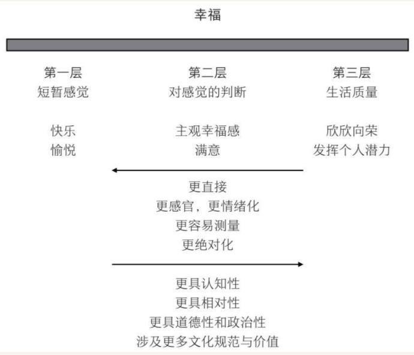
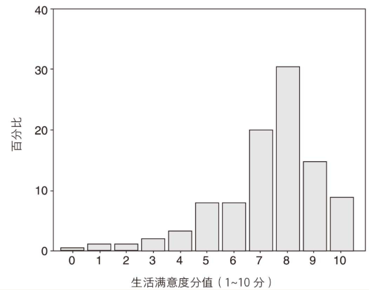
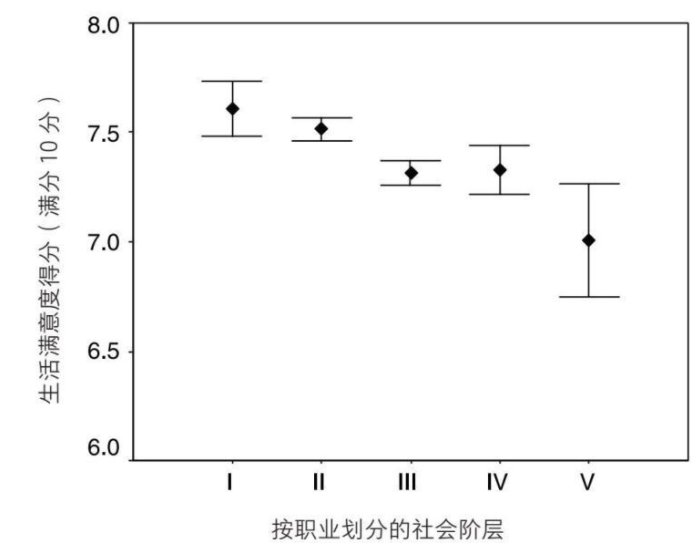

    作者: ［英］丹尼尔•内特尔
    出版社: 中信出版社
    副标题: 追求比得到更快乐
    原作名: Happiness: The Science behind Your Smile
    译者: 秦尊璐
    出版年: 2020-3
    定价: 42.00元
    装帧: 精装
    ISBN: 9787521712667

[豆瓣链接](https://book.douban.com/subject/34982672/)

- [第一章 舒适与喜悦](#第一章-舒适与喜悦)
- [第二章 生存与享乐](#第二章-生存与享乐)
- [第三章 爱与工作](#第三章-爱与工作)
- [第四章 焦虑之人与乐观之人](#第四章-焦虑之人与乐观之人)

# 第一章 舒适与喜悦
幸福这个词的多数用法可以被归入三层范畴不断扩大的含义中（图1-2）。幸福最即时和直接的含义指的是一种有些类似快乐（joy）或愉悦（pleasure）的情绪或感觉。这些感觉通常比较短暂，感受明显，容易识别。我们在下文中将幸福的这种含义称为`“第一层幸福”`。

人们在说自己生活幸福时，通常并不总是意味着他们一直在体验真正的快乐或者愉悦感。他们的意思是，在审视愉悦和痛苦的资产负债表时，他们觉得从长期来看结果是比较乐观的。幸福的这层含义通常是心理学家研究的内容。这层含义的幸福不太关注情绪，它关注的是对情绪平衡的判断。因此它是情绪和对情绪的判断的结合体，与“满足”（contentment）和“生活满意”（life satisfaction）这类词同义。这就是`“第二层幸福”`。

亚里士多德的美好生活的理想状态——eudaimonia，有时候也翻译成“幸福”。不过，eudaimonia指的是个人富足或者个体发挥出其真正潜能的生活。虽然这种生活也包含众多积极的情绪体验，但并非其定义的必要部分。当代心理学家和哲学家有时候在谈论“幸福”时，实际指的就是“美好生活”或者eudaimonia，这便是第三层含义的幸福。值得注意的是，`“第三层幸福”`并非一种情绪状态，因此也没有典型特征。每个人所具有的潜能不尽相同，所以我们无法依靠某一种事物来实现eudaimonia。

杰里米·边沁和古典经济学家们假设，人们在生活中做出选择的依据就是将幸福最大化，即所谓的`“效用”（utility）`。他们这里使用的“效用”一词等同于幸福的第二层含义。也就是说，他们认为，假如存在一个测量快乐的工具，那么这个工具就可以显示出，人们所做的选择就是将快乐和痛苦平衡后的结果最大化。然而，现实中并不存在测量幸福或效用的实用方法，久而久之，经济学家们也只是将结果的效用用于表示人们选择的倾向性。例如，假如跟买船比起来，人们更倾向于买车，那么经济学家就说，买车比买船提供了更大的效用。这可称不上心理学假设，甚至都算不上有说服力的说法。既然车的效用大的意思是说人们有选择买车的倾向性，那么它就解释不了人们选择买车的原因。因此，在预测人在稀缺资源分配中的行为时，效用概念仅仅是一个简化的工具。

在过去几年中，`积极心理学`主要在北美地区兴起，是一种对强调失序、失败和弱点的心理学传统研究（抑郁、焦虑、成瘾，等等）的自发矫正。为什么不能有一个研究优势（例如幸福、勇气、目标、兴奋）的系统框架呢？积极心理学是一门很有意思的交叉学科，它试图将学术心理学在方法论上的严谨性与开药方的意愿结合起来，而后者在过去通常仅出现在书店的自助类图书区域。

例如，在积极心理学领域，一种被称为`“心流”（flow）`的状态是研究的热门。这种状态的特征是，个体完全沉浸到自己擅长的挑战性活动中达至极限。相对而言，攀岩爱好者、音乐家和运动员经常会进入心流状态。不过，进入心流状态的方式有很多种，我们完全可以在生活中找到增加心流体验的方法。积极心理学还有其他的处方，比如在生活中寻找意义、精神性和更高的目标。或许，积极心理学的最高目标是培养`“自带目的性人格”（autotelic personality）`。拥有自带目的性人格的人具备以下特征：

>他（她）对物质财富、娱乐、舒适度、权力、名望等方面的需求很少，因为他（她）所做的许多事情本身已经是奖赏了……他们很少依赖外部奖赏，而外部奖赏则是其他人维持枯燥而又无意义的日常生活的动力。他们更加独立自主，因为他们轻易不受外部威胁或奖赏的操纵。与此同时，他们更关心周围的一切，因为他们完全沉浸在生活之流中。

我们完全有理由相信，心流、目标和自带目的性人格都是值得追求的好东西（虽然这种自带目的性的人生听起来像极了一个不信奉国教的新教徒，而且碰巧他还是个独立的富人）。但有意思的是，这些似乎都与我们通常意义上的幸福没有太大关系。经常在生活中感受到心流的人会比其他人更加热爱生活，但在回答自己有多幸福时，他们打出的分数绝对不会比其他人更高。实际上，他们一定很不快乐，否则他们就可能会对周围人“枯燥而又无意义的日常生活”感到满意。研究表明，音乐家、艺术家、作家等从事高心流职业的人更容易有深刻的不满足感，正是这种不满足感才驱使他们不断向前探索，因此经历受挫和成瘾的频率也更高。相比较而言，对在第二层含义上非常幸福的人群的研究显示，他们远没有那么“独立和自主”，而是具有强迫性的社交外向型人格。

追求自带目的性的生活的药方，究竟是一条追求幸福生活的建议，还是一个道德立场？这其中存在一个模糊不清的地方。米哈里·契克森米哈赖（Mihaly Csikszentmihalyi）有一部关于该主题的著作堪称经典，他在书中似乎对它进行了道德化：

>在同等条件下，充满复杂心流体验的生活要比将时间花费在消极娱乐上的生活更值得过。

每一种情绪程序的功能都高度专一，彼此之间完全不同。只要一出现消极情绪，我们就知道是因为“发生了不好的事”，但究竟如何解决，我们则要针对不同的消极情绪采取不同的方式。这就是为什么我们有几种不同的消极情绪——我们可以看到，艾克曼列出的六种基本情绪中有四种是消极情绪，只有一种是积极情绪——对它们的感受却千差万别。

表1-1 四种主要的消极情绪、产生这些情绪的情境类型以及它们各自呈现的解决方案

情绪 | 模式 | 解决方案
---|----|-----
恐惧 | 持续危险源 | 发现并逃离
愤怒 | 他人对规则或协议的破坏 | 终止未来的暴力，例如反击或给《泰晤士报》写信
悲伤 | 失去有价值的支持 | 节省精力，谨慎行事，直到境况改善
厌恶 | 潜在的污染物 | 吐出来，避开

快乐的来源多种多样。最近的一项研究发现，我们的主要快乐源泉有：与朋友的交往、食物、饮料、性交以及在某一领域取得成功的经历。从进化心理学的角度看，以上事物可以让人类在古代更好地适应环境，因此值得我们暂时抛开眼前顾虑，专注在这些事物中。

当然，如果将醒着的所有时间都花在享乐上，整个人一定会筋疲力尽。而且，真要这样做的话，我们可能就不仅得进化学实验室，还得有很多钱才行。我们大多数人都明白，生活的大问题不是一直保持快乐，这种快乐充其量不过是生活中偶尔出现的调味剂。生活的大问题是在总体满意的意义上的幸福。多数心理学研究和几乎所有市面上的心理学书籍主要关注的是第二层幸福，即心理学家们常说的`主观幸福感`，而主观幸福感的主要组成部分便是“生活满意度”（life satisfaction）。

幸福的法则就是，我们或许会经常禁不住诱惑爱上提供足够多的巅峰时刻的快乐或让快乐保持到末尾的事物，而实际上，我们如果选择强度较低但是持续时间更长的事物，就可以将生活中的愉悦感最大化。前一种类型的事物（比如出去疯玩一晚）或许可以对巅峰时刻和末尾的平均心理状态产生更大的影响，但是后者（比如读一本很有分量的小说，或者学习一项新技能）可以提供更加持久的幸福，如果将所有时刻的心理状态都算进来的话。

卡内曼根据这些研究的结果，对`客观幸福（objective happiness）`和`主观幸福（subjective happiness）`做了区分。乍一看，这是个奇怪的区分，因为所有幸福本质上都是主观体验。不过，卡内曼的意思是，第一层幸福提供原始的幸福数据，也就是我们每时每刻的好坏感受。如果我们想对我们的幸福感做第二层判断，我们就需要将第一层数据进行汇总。一般而言，要做到这一点，我们可以随身携带一个仪表，随时记录好情绪持续多久，坏情绪又持续多久。（这不正是我们想要的快乐测量仪吗！）这个仪表可以为我们的主观感受提供客观的总结。

然而，相比于对第一层幸福的客观总结，我们在对自身当下、过去或者将来的幸福进行评估时，做法实际上要粗糙得多。我们做最佳推测，或者主观估计我们的主观感受。而推测会受到`峰终定律（peak-end rule）`、当下情绪、比较标准等各类因素影响，并且我们也无法预测自身的适应能力。因此，最后我们可能对我们的行为对幸福产生的实际影响做出不准确的判断，选择实际并不能让我们更幸福的事物。

# 第二章 生存与享乐
英国会定期针对不同人群展开大规模调查。例如，“全国儿童发展调查”（National Child Development Study，缩写为NCDS）对1958年3月3日至3月9日出生的儿童进行了广泛调查，详细记录下他们的出生、家庭背景、入学情况以及从1958年至今（他们现在已经40多岁了）的健康状况。调查人员每隔几年便会对他们进行回访，了解他们生活的方方面面。如今，NCDS的数据库中保存着每一位受访者的大量准确信息，为我们了解所有受访者的发展、思想和行为提供了十分有价值的信息。除了回答关于对英国特定时期看法的问题外，数据的广度和详细程度意味着我们可以通过它调查健康、婚姻、幸福等主题。这些数据得出的结论进一步证实和扩展了我们从世界不同地区的许多小规模调查中得出的结论。

NCDS的受访者常会被问到与幸福有关的问题。例如，在2000年，42岁的这组人正处于中年危机的高峰时期。研究人员让他们按照10分制评估自己对目前生活状态的满意度。结果（图2-2）出人意料，11269位受访者中，超过90%的人选择了5分以上，超过半数的人选择了8~10分，最常见的选择是8分。

24个在20世纪90年代早期被调查的国家没有一个平均分低于5分（表2-1）。还有一点值得注意的是，平均分低于6分的国家都刚刚经历了快速转型，社会形势不稳定必然会给人们带来短期的忧虑。而在相对稳定的国家，即使很不富裕，生活满意度的平均分也密集地集中在6~8分的区间（印度6.21分，尼日利亚6.4分，中国7.05分）。

表2-1 选定国家的个体大样本平均生活满意度（10分制）

自我幸福感的评价如此高的一个原因就是，人们在意自己给人留下的印象，进而进行了`印象管理（impression manage）`。有迹象显示，这种影响是显著的。调查表明，人们在面对面采访中给出的幸福感分数要比邮件问卷分数高。假如采访者是异性，这种影响会尤其显著。人们产生这种行为的诱因很容易理解。因此，当你心情不好，感觉周围人都比自己幸福时，不妨想想看，他们只是表面上看起来幸福而已。

我们提出了两个问题：

1. 为什么有证据证明多数人都是幸福的，我们却依然相信以生活不幸作为假设的哲学呢？
2. 为什么我们总是认为别人的生活会比我们自己的生活更幸福呢？

关于第一个问题，我们已经知道，人们对于幸福的判断会受到当下环境的影响。我们可能会认为总体而言我们是幸福的，但最近生活不太如意就可能会彻底影响我们关于幸福的回答。还记得我们前面提到的那个实验吗？给受试者看漂亮的陌生人的照片，或者让他们回忆不好的事情，就很可能会影响受试者对幸福的判断。

假如幸福系统的存在就是为了帮助我们找到对我们最好的事物，那么我们可以认为，它完全匹配这种可能性：其他地方有更好的东西存在。我们的幸福系统应当时刻保持工作状态，寻觅更好的环境、更好的社交网络、更好的行为模式。

# 第三章 爱与工作
在NCDS中是否有证据证明金钱能带来快乐呢？社会阶层可以作为社会经济地位的一种衡量工具。在英国，社会阶层通常按职业排名被分成五个等级，反映他们的社会地位：从专业性强的第Ⅰ级到从事不需任何技能的日常工作的第Ⅴ级。调查数据显示，从事不同等级职业的人对生活的满意度也不同。从事第Ⅰ级工作的人平均得分比从事第Ⅴ级工作的人高0.5分（见图3-1）。

收入与生活满意度之间的相关性甚至不相关性，或许可以用来解释一项惊人但却一致的发现。近半个世纪以来，发达国家的人均收入增加了数倍，而大众幸福感却几乎未见增长。例如，1970年到1990年，扣除物价因素，美国人均收入实际上涨了300%，但平均的幸福度却没有出现相应的增长。这就形成了一个悖论。很多研究表明，收入与幸福之间在任何给定的情况之下都存在微弱但却稳定的关系，但是随着时间的推移，所有人的收入都有了增长，幸福感却并没有跟进。

关于这一点可能有两个原因：

- 处在更高社会阶层的人的幸福感与收入并没有什么关系，而是与其他因素有关。尽管所有人的收入都有了极大增长，但这里的增长只代表物质购买力增强，并没有实际转化成人们对安全感、有意义的目标以及自由的体验。尽管如今门卫的实际收入比30年前的医生高，但他仍然是个门卫，和以前一样没有选择在何时何地做什么的自由。
- 另一个可能的原因就是，在满意度的评判中最重要的是，与其他人的所得相比较，自己拥有什么。

对生活是否有掌控感也可以用于为“个人掌控感”（personal control）打分。第Ⅰ级的人在这方面得分最高，第Ⅴ级的人得分最低，不过在同一等级内不同个体之间也存在许多变异。个人掌控感对幸福的指示效果要比收入好得多（从统计角度上看，个人掌控感在变异中的占比是收入的20倍以上）。当我们将处于国民收入分配最底层但个人掌控感高的人的生活满意度得分与处在收入最顶层但掌控感低的人的生活满意度得分进行比较的时候，个人掌控感的重要性就变得尤为突出了。贫穷但是掌控感高的人群的生活满意度得分达到7.85分，而富有却掌控感低的人群的生活满意度得分只有5.82分。因此，似乎处在社会顶层的你，只有在你有机会掌控自己的生活的时候，才会感到快乐。所以，即使收入低，你也不必沮丧，只要能找到掌控生活的方式，你同样可以收获幸福。

布里克曼和坎贝尔用“享乐跑步机”（hedonic treadmill）这一生动形象的术语来形容幸福感的水平难以改变。我们每次朝着渴望的状态前进，都会迅速适应新的领域，因此与在之前的位置时相比，我们并没有体验到更大的满足感。结果，我们努力奔跑，却从来都到不了任何地方。洛杉矶经济学家理查德·伊斯特林（Richard Easterlin）对“享乐跑步机”的机制给出了最清晰的说明。在一项持续进行的针对美国各行各业的社会调查中，受访者拿到一份人们投入金钱的主要消费品的清单（房子、汽车、电视机、出国游、泳池、第二套房等）。首先，他们要勾选出理想中的美好生活（他们想要的生活）的必需品，接着再勾选出自己实际已拥有的物品。这项调查在16年后重复进行了一次。在这段成年生活的早期阶段，人们从很少拥有这些大件消费品，到拥有了其中几件物品。问题在于，他们对美好生活所需之物的看法，随着他们的进步，也在以同样的速度前进。当他们年轻的时候，房子、汽车和电视对他们来说就足够了。后来，度假别墅开始变成必需品。在过去的16年中，人们从拥有1.7样东西到拥有3.1样东西，与此同时，美好生活也从包含4.4样东西到包含5.6样东西。他们一直比理想生活差两样东西，就像他们一开始的状态一样。

这种膨胀贯穿人的一生，尽管人们会不断获得新物品，并且像塘鹅一样前进的欲望会在老年时趋于缓和。结果就是，在生活物品上，进步根本不可能靠积累实现，至少一般情况如此。

`幸福的内隐理论（implicit theory）`认为，幸福与我们的生活环境密切相关。如果我们觉得，我们只是在将沙子灌进愚蠢的人类自远古时期以来都没有灌满的无底瓶子，我们也不会去努力追求加薪，购买新车，赢得枕边人。然而，至少有一些心理学家从数据中得出了结论：生活环境并不会对幸福产生多大的影响。幸福度仿佛存在一个固定的水平，我们无论做了什么，最终都会回到那里。

尽管这个观点包含了许多真相，但实际情况可能更为有趣，也更加复杂。我们能适应生活方方面面的情况。但是对于威胁个体基本安全的因素，比如持续的寒冷、食物短缺或者过度的环境噪音，我们永远都无法适应。严重的健康问题会留下持久影响。缺乏生活自主性是一种持续的消极状态，最终不仅会带来不幸感，还会损害健康。而另一方面，我们又会迅速适应收入的增加和物质的改善。虽然经济持续增长，人们并不必然会变得更幸福，结果如何取决于经济增长提高生活质量的方式。处于噪音和金钱之间的则是婚姻。婚姻在短期和中期会让幸福感产生偏离，但最终仍然会被人们适应。

# 第四章 焦虑之人与乐观之人

