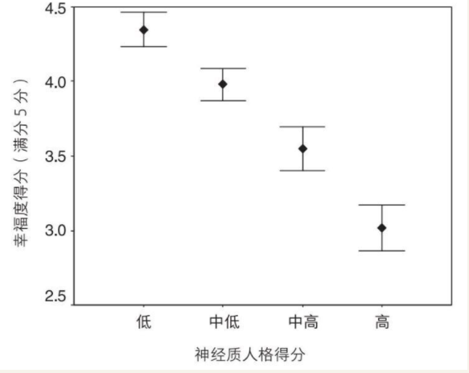
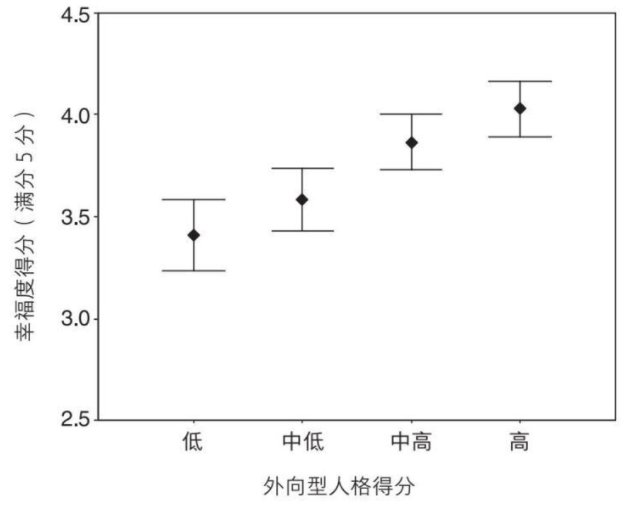

    作者: ［英］丹尼尔•内特尔
    出版社: 中信出版社
    副标题: 追求比得到更快乐
    原作名: Happiness: The Science behind Your Smile
    译者: 秦尊璐
    出版年: 2020-3
    定价: 42.00元
    装帧: 精装
    ISBN: 9787521712667

[豆瓣链接](https://book.douban.com/subject/34982672/)

- [第一章 舒适与喜悦](#第一章-舒适与喜悦)
- [第二章 生存与享乐](#第二章-生存与享乐)
- [第三章 爱与工作](#第三章-爱与工作)
- [第四章 焦虑之人与乐观之人](#第四章-焦虑之人与乐观之人)
- [第五章 欲求与喜好](#第五章-欲求与喜好)
- [第六章 灵丹妙药与安慰剂](#第六章-灵丹妙药与安慰剂)

# 第一章 舒适与喜悦
幸福这个词的多数用法可以被归入三层范畴不断扩大的含义中（图1-2）。幸福最即时和直接的含义指的是一种有些类似快乐（joy）或愉悦（pleasure）的情绪或感觉。这些感觉通常比较短暂，感受明显，容易识别。我们在下文中将幸福的这种含义称为`“第一层幸福”`。

人们在说自己生活幸福时，通常并不总是意味着他们一直在体验真正的快乐或者愉悦感。他们的意思是，在审视愉悦和痛苦的资产负债表时，他们觉得从长期来看结果是比较乐观的。幸福的这层含义通常是心理学家研究的内容。这层含义的幸福不太关注情绪，它关注的是对情绪平衡的判断。因此它是情绪和对情绪的判断的结合体，与“满足”（contentment）和“生活满意”（life satisfaction）这类词同义。这就是`“第二层幸福”`。

亚里士多德的美好生活的理想状态——eudaimonia，有时候也翻译成“幸福”。不过，eudaimonia指的是个人富足或者个体发挥出其真正潜能的生活。虽然这种生活也包含众多积极的情绪体验，但并非其定义的必要部分。当代心理学家和哲学家有时候在谈论“幸福”时，实际指的就是“美好生活”或者eudaimonia，这便是第三层含义的幸福。值得注意的是，`“第三层幸福”`并非一种情绪状态，因此也没有典型特征。每个人所具有的潜能不尽相同，所以我们无法依靠某一种事物来实现eudaimonia。

杰里米·边沁和古典经济学家们假设，人们在生活中做出选择的依据就是将幸福最大化，即所谓的`“效用”（utility）`。他们这里使用的“效用”一词等同于幸福的第二层含义。也就是说，他们认为，假如存在一个测量快乐的工具，那么这个工具就可以显示出，人们所做的选择就是将快乐和痛苦平衡后的结果最大化。然而，现实中并不存在测量幸福或效用的实用方法，久而久之，经济学家们也只是将结果的效用用于表示人们选择的倾向性。例如，假如跟买船比起来，人们更倾向于买车，那么经济学家就说，买车比买船提供了更大的效用。这可称不上心理学假设，甚至都算不上有说服力的说法。既然车的效用大的意思是说人们有选择买车的倾向性，那么它就解释不了人们选择买车的原因。因此，在预测人在稀缺资源分配中的行为时，效用概念仅仅是一个简化的工具。

在过去几年中，`积极心理学`主要在北美地区兴起，是一种对强调失序、失败和弱点的心理学传统研究（抑郁、焦虑、成瘾，等等）的自发矫正。为什么不能有一个研究优势（例如幸福、勇气、目标、兴奋）的系统框架呢？积极心理学是一门很有意思的交叉学科，它试图将学术心理学在方法论上的严谨性与开药方的意愿结合起来，而后者在过去通常仅出现在书店的自助类图书区域。

例如，在积极心理学领域，一种被称为`“心流”（flow）`的状态是研究的热门。这种状态的特征是，个体完全沉浸到自己擅长的挑战性活动中达至极限。相对而言，攀岩爱好者、音乐家和运动员经常会进入心流状态。不过，进入心流状态的方式有很多种，我们完全可以在生活中找到增加心流体验的方法。积极心理学还有其他的处方，比如在生活中寻找意义、精神性和更高的目标。或许，积极心理学的最高目标是培养`“自带目的性人格”（autotelic personality）`。拥有自带目的性人格的人具备以下特征：

>他（她）对物质财富、娱乐、舒适度、权力、名望等方面的需求很少，因为他（她）所做的许多事情本身已经是奖赏了……他们很少依赖外部奖赏，而外部奖赏则是其他人维持枯燥而又无意义的日常生活的动力。他们更加独立自主，因为他们轻易不受外部威胁或奖赏的操纵。与此同时，他们更关心周围的一切，因为他们完全沉浸在生活之流中。

我们完全有理由相信，心流、目标和自带目的性人格都是值得追求的好东西（虽然这种自带目的性的人生听起来像极了一个不信奉国教的新教徒，而且碰巧他还是个独立的富人）。但有意思的是，这些似乎都与我们通常意义上的幸福没有太大关系。经常在生活中感受到心流的人会比其他人更加热爱生活，但在回答自己有多幸福时，他们打出的分数绝对不会比其他人更高。实际上，他们一定很不快乐，否则他们就可能会对周围人“枯燥而又无意义的日常生活”感到满意。研究表明，音乐家、艺术家、作家等从事高心流职业的人更容易有深刻的不满足感，正是这种不满足感才驱使他们不断向前探索，因此经历受挫和成瘾的频率也更高。相比较而言，对在第二层含义上非常幸福的人群的研究显示，他们远没有那么“独立和自主”，而是具有强迫性的社交外向型人格。

追求自带目的性的生活的药方，究竟是一条追求幸福生活的建议，还是一个道德立场？这其中存在一个模糊不清的地方。米哈里·契克森米哈赖（Mihaly Csikszentmihalyi）有一部关于该主题的著作堪称经典，他在书中似乎对它进行了道德化：

>在同等条件下，充满复杂心流体验的生活要比将时间花费在消极娱乐上的生活更值得过。

每一种情绪程序的功能都高度专一，彼此之间完全不同。只要一出现消极情绪，我们就知道是因为“发生了不好的事”，但究竟如何解决，我们则要针对不同的消极情绪采取不同的方式。这就是为什么我们有几种不同的消极情绪——我们可以看到，艾克曼列出的六种基本情绪中有四种是消极情绪，只有一种是积极情绪——对它们的感受却千差万别。

表1-1 四种主要的消极情绪、产生这些情绪的情境类型以及它们各自呈现的解决方案

情绪 | 模式 | 解决方案
---|----|-----
恐惧 | 持续危险源 | 发现并逃离
愤怒 | 他人对规则或协议的破坏 | 终止未来的暴力，例如反击或给《泰晤士报》写信
悲伤 | 失去有价值的支持 | 节省精力，谨慎行事，直到境况改善
厌恶 | 潜在的污染物 | 吐出来，避开

快乐的来源多种多样。最近的一项研究发现，我们的主要快乐源泉有：与朋友的交往、食物、饮料、性交以及在某一领域取得成功的经历。从进化心理学的角度看，以上事物可以让人类在古代更好地适应环境，因此值得我们暂时抛开眼前顾虑，专注在这些事物中。

当然，如果将醒着的所有时间都花在享乐上，整个人一定会筋疲力尽。而且，真要这样做的话，我们可能就不仅得进化学实验室，还得有很多钱才行。我们大多数人都明白，生活的大问题不是一直保持快乐，这种快乐充其量不过是生活中偶尔出现的调味剂。生活的大问题是在总体满意的意义上的幸福。多数心理学研究和几乎所有市面上的心理学书籍主要关注的是第二层幸福，即心理学家们常说的`主观幸福感`，而主观幸福感的主要组成部分便是`“生活满意度”（life satisfaction）`。

幸福的法则就是，我们或许会经常禁不住诱惑爱上提供足够多的巅峰时刻的快乐或让快乐保持到末尾的事物，而实际上，我们如果选择强度较低但是持续时间更长的事物，就可以将生活中的愉悦感最大化。前一种类型的事物（比如出去疯玩一晚）或许可以对巅峰时刻和末尾的平均心理状态产生更大的影响，但是后者（比如读一本很有分量的小说，或者学习一项新技能）可以提供更加持久的幸福，如果将所有时刻的心理状态都算进来的话。

卡内曼根据这些研究的结果，对`客观幸福（objective happiness）`和`主观幸福（subjective happiness）`做了区分。乍一看，这是个奇怪的区分，因为所有幸福本质上都是主观体验。不过，卡内曼的意思是，第一层幸福提供原始的幸福数据，也就是我们每时每刻的好坏感受。如果我们想对我们的幸福感做第二层判断，我们就需要将第一层数据进行汇总。一般而言，要做到这一点，我们可以随身携带一个仪表，随时记录好情绪持续多久，坏情绪又持续多久。（这不正是我们想要的快乐测量仪吗！）这个仪表可以为我们的主观感受提供客观的总结。

然而，相比于对第一层幸福的客观总结，我们在对自身当下、过去或者将来的幸福进行评估时，做法实际上要粗糙得多。我们做最佳推测，或者主观估计我们的主观感受。而推测会受到`峰终定律（peak-end rule）`、当下情绪、比较标准等各类因素影响，并且我们也无法预测自身的适应能力。因此，最后我们可能对我们的行为对幸福产生的实际影响做出不准确的判断，选择实际并不能让我们更幸福的事物。

# 第二章 生存与享乐
英国会定期针对不同人群展开大规模调查。例如，“全国儿童发展调查”（National Child Development Study，缩写为NCDS）对1958年3月3日至3月9日出生的儿童进行了广泛调查，详细记录下他们的出生、家庭背景、入学情况以及从1958年至今（他们现在已经40多岁了）的健康状况。调查人员每隔几年便会对他们进行回访，了解他们生活的方方面面。如今，NCDS的数据库中保存着每一位受访者的大量准确信息，为我们了解所有受访者的发展、思想和行为提供了十分有价值的信息。除了回答关于对英国特定时期看法的问题外，数据的广度和详细程度意味着我们可以通过它调查健康、婚姻、幸福等主题。这些数据得出的结论进一步证实和扩展了我们从世界不同地区的许多小规模调查中得出的结论。

NCDS的受访者常会被问到与幸福有关的问题。例如，在2000年，42岁的这组人正处于中年危机的高峰时期。研究人员让他们按照10分制评估自己对目前生活状态的满意度。结果（图2-2）出人意料，11269位受访者中，超过90%的人选择了5分以上，超过半数的人选择了8~10分，最常见的选择是8分。

24个在20世纪90年代早期被调查的国家没有一个平均分低于5分（表2-1）。还有一点值得注意的是，平均分低于6分的国家都刚刚经历了快速转型，社会形势不稳定必然会给人们带来短期的忧虑。而在相对稳定的国家，即使很不富裕，生活满意度的平均分也密集地集中在6~8分的区间（印度6.21分，尼日利亚6.4分，中国7.05分）。

表2-1 选定国家的个体大样本平均生活满意度（10分制）

自我幸福感的评价如此高的一个原因就是，人们在意自己给人留下的印象，进而进行了`印象管理（impression manage）`。有迹象显示，这种影响是显著的。调查表明，人们在面对面采访中给出的幸福感分数要比邮件问卷分数高。假如采访者是异性，这种影响会尤其显著。人们产生这种行为的诱因很容易理解。因此，当你心情不好，感觉周围人都比自己幸福时，不妨想想看，他们只是表面上看起来幸福而已。

我们提出了两个问题：

1. 为什么有证据证明多数人都是幸福的，我们却依然相信以生活不幸作为假设的哲学呢？
2. 为什么我们总是认为别人的生活会比我们自己的生活更幸福呢？

关于第一个问题，我们已经知道，人们对于幸福的判断会受到当下环境的影响。我们可能会认为总体而言我们是幸福的，但最近生活不太如意就可能会彻底影响我们关于幸福的回答。还记得我们前面提到的那个实验吗？给受试者看漂亮的陌生人的照片，或者让他们回忆不好的事情，就很可能会影响受试者对幸福的判断。

假如幸福系统的存在就是为了帮助我们找到对我们最好的事物，那么我们可以认为，它完全匹配这种可能性：其他地方有更好的东西存在。我们的幸福系统应当时刻保持工作状态，寻觅更好的环境、更好的社交网络、更好的行为模式。

# 第三章 爱与工作
在NCDS中是否有证据证明金钱能带来快乐呢？社会阶层可以作为社会经济地位的一种衡量工具。在英国，社会阶层通常按职业排名被分成五个等级，反映他们的社会地位：从专业性强的第Ⅰ级到从事不需任何技能的日常工作的第Ⅴ级。调查数据显示，从事不同等级职业的人对生活的满意度也不同。从事第Ⅰ级工作的人平均得分比从事第Ⅴ级工作的人高0.5分（见图3-1）。

收入与生活满意度之间的相关性甚至不相关性，或许可以用来解释一项惊人但却一致的发现。近半个世纪以来，发达国家的人均收入增加了数倍，而大众幸福感却几乎未见增长。例如，1970年到1990年，扣除物价因素，美国人均收入实际上涨了300%，但平均的幸福度却没有出现相应的增长。这就形成了一个悖论。很多研究表明，收入与幸福之间在任何给定的情况之下都存在微弱但却稳定的关系，但是随着时间的推移，所有人的收入都有了增长，幸福感却并没有跟进。

关于这一点可能有两个原因：

- 处在更高社会阶层的人的幸福感与收入并没有什么关系，而是与其他因素有关。尽管所有人的收入都有了极大增长，但这里的增长只代表物质购买力增强，并没有实际转化成人们对安全感、有意义的目标以及自由的体验。尽管如今门卫的实际收入比30年前的医生高，但他仍然是个门卫，和以前一样没有选择在何时何地做什么的自由。
- 另一个可能的原因就是，在满意度的评判中最重要的是，与其他人的所得相比较，自己拥有什么。

对生活是否有掌控感也可以用于为`“个人掌控感”（personal control）`打分。第Ⅰ级的人在这方面得分最高，第Ⅴ级的人得分最低，不过在同一等级内不同个体之间也存在许多变异。个人掌控感对幸福的指示效果要比收入好得多（从统计角度上看，个人掌控感在变异中的占比是收入的20倍以上）。当我们将处于国民收入分配最底层但个人掌控感高的人的生活满意度得分与处在收入最顶层但掌控感低的人的生活满意度得分进行比较的时候，个人掌控感的重要性就变得尤为突出了。贫穷但是掌控感高的人群的生活满意度得分达到7.85分，而富有却掌控感低的人群的生活满意度得分只有5.82分。因此，似乎处在社会顶层的你，只有在你有机会掌控自己的生活的时候，才会感到快乐。所以，即使收入低，你也不必沮丧，只要能找到掌控生活的方式，你同样可以收获幸福。

布里克曼和坎贝尔用`“享乐跑步机”（hedonic treadmill）`这一生动形象的术语来形容幸福感的水平难以改变。我们每次朝着渴望的状态前进，都会迅速适应新的领域，因此与在之前的位置时相比，我们并没有体验到更大的满足感。结果，我们努力奔跑，却从来都到不了任何地方。洛杉矶经济学家理查德·伊斯特林（Richard Easterlin）对“享乐跑步机”的机制给出了最清晰的说明。在一项持续进行的针对美国各行各业的社会调查中，受访者拿到一份人们投入金钱的主要消费品的清单（房子、汽车、电视机、出国游、泳池、第二套房等）。首先，他们要勾选出理想中的美好生活（他们想要的生活）的必需品，接着再勾选出自己实际已拥有的物品。这项调查在16年后重复进行了一次。在这段成年生活的早期阶段，人们从很少拥有这些大件消费品，到拥有了其中几件物品。问题在于，他们对美好生活所需之物的看法，随着他们的进步，也在以同样的速度前进。当他们年轻的时候，房子、汽车和电视对他们来说就足够了。后来，度假别墅开始变成必需品。在过去的16年中，人们从拥有1.7样东西到拥有3.1样东西，与此同时，美好生活也从包含4.4样东西到包含5.6样东西。他们一直比理想生活差两样东西，就像他们一开始的状态一样。

这种膨胀贯穿人的一生，尽管人们会不断获得新物品，并且像塘鹅一样前进的欲望会在老年时趋于缓和。结果就是，在生活物品上，进步根本不可能靠积累实现，至少一般情况如此。

`幸福的内隐理论（implicit theory）`认为，幸福与我们的生活环境密切相关。如果我们觉得，我们只是在将沙子灌进愚蠢的人类自远古时期以来都没有灌满的无底瓶子，我们也不会去努力追求加薪，购买新车，赢得枕边人。然而，至少有一些心理学家从数据中得出了结论：生活环境并不会对幸福产生多大的影响。幸福度仿佛存在一个固定的水平，我们无论做了什么，最终都会回到那里。

尽管这个观点包含了许多真相，但实际情况可能更为有趣，也更加复杂。我们能适应生活方方面面的情况。但是对于威胁个体基本安全的因素，比如持续的寒冷、食物短缺或者过度的环境噪音，我们永远都无法适应。严重的健康问题会留下持久影响。缺乏生活自主性是一种持续的消极状态，最终不仅会带来不幸感，还会损害健康。而另一方面，我们又会迅速适应收入的增加和物质的改善。虽然经济持续增长，人们并不必然会变得更幸福，结果如何取决于经济增长提高生活质量的方式。处于噪音和金钱之间的则是婚姻。婚姻在短期和中期会让幸福感产生偏离，但最终仍然会被人们适应。

# 第四章 焦虑之人与乐观之人
许多研究将生活在稳定环境中的人群与经历了重大生活变故的人群进行对比（或者将收入上升的人群与收入下降的人群放在一起对比），他们依然发现，最能预测研究结束的时候人们的幸福度的指标，就是这些人在最开始时的幸福度。可以说，幸福与否在很大程度上取决于我们看待事物的方式，而非实际发生了什么事情。

进一步的证据来自一个事实：工作快乐的人在业余爱好中也会感觉到快乐。假如幸福主要取决于客观环境，那么你或许会认为，讨厌工作的人会培养业余爱好，并且乐在其中，而热爱工作的人会渴望周一回到工作中去。而实际上，更享受工作日的人，也更享受夜晚和周末时光。有些人就是比其他人能获得更多的快乐。

`神经质`指的是体验到担忧、恐惧等不愉快感觉的倾向，这些感觉（至少暂时）与幸福是矛盾的。因此，人们在神经质维度上得分越高，就越感觉不到幸福。

最近，我们通过线上心理实验室对近600名英国民众进行了人格清单问卷调查。我们让受访者用1~5分对自己的总体幸福度打分。受访者的样本涉及各个年龄段和社会阶层。可以看出，神经质的得分对受访者的自我幸福感评估结果有很强的指示性（图4-1）。从图中我们会发现，神经质得分在最低的四分位点的人顾虑少，以5分制计算，幸福度得分在4分上下。而神经质得分在最高的四分位点的人，几乎没人幸福度达到中间值。幸福度有17%的变化是神经质造成，因此它成为已知最强的幸福指示物。

实际上，外向的人的确更为快乐。图4-2展示了线上调查得出的外向型人格与幸福度得分的关系。其他研究也得出了相似结果，显示出这个模式与神经质的模式的镜像关系。也就是说，外向的人有更多的积极情绪，但是也会有和其他人一样多的消极情绪。即使是左右逢源的社会名流也会和其他人一样有消极痛苦的时刻，这或许是对我们的一种宽慰了。

外向的人往往更快乐，最可能的原因是，他们更可能做带有强烈的情感回报的事情。任何时候，外向的人都比内向的人更可能结婚，参加聚会，参加体育运动，与朋友交谈，性生活也更频繁。拥有外向型人格的人会从环境中吸取各种奖赏。因此，面对我们的提问时，外向的人很有可能处在积极的状态下。对自己的幸福度打高分的人，通常是神经质得分低的外向者，他们很少会独处。因此，在接受提问时，他们很可能刚参加完社交活动回来。

与幸福相关的还有其他人格维度。`宜人性（agreeableness）`和`尽责性（conscientiousness）`得分高的人往往也会更幸福。

表4-1 对不同因素（一次考虑一种）在个体间的幸福度差异中所占的比例的估算。需要指出的是，间接途径（比如神经质通过婚姻状况对幸福的影响）并未被纳入其中，因此一些情境因素的重要性肯定被高估了。

因素 | 差异占比
---|-----
性别 | 1%
年龄 | 1%
收入 | 3%
社会阶层 | 4%
婚姻状况 | 6%
神经质 | 6%~28%
外向性 | 2%~16%
其他人格因素 | 8%~14%

# 第五章 欲求与喜好
人们很早就了解到杏仁核对情绪反应的作用。人在感到焦虑和忧郁时，`杏仁核`活动极为活跃。一旦将动物或人脑中的杏仁核摘除，情绪产生过程受损，奇怪的症状就会出现。被摘除了杏仁核的实验猴和实验鼠都丧失了辨别情绪价值的能力，不再害怕它们应该害怕的事物，同时还会吃不能吃的东西，试图与不适当的目标交配。杏仁核受到刺激的猴子和老鼠则会表现出过度的恐惧。因疾病或脑部手术导致杏仁核受损的人会丧失辨别恐惧的情绪表达的能力，例如面部表情或语调。不过，杏仁核也不只是与消极情绪有关。猴子舌头尝到果汁的甜味或者看到有人拿果汁靠近的时候，杏仁核也会活跃起来。因此，对杏仁核的角色的最佳解释是，它就像一个“情绪枢纽”，对输入的感知信息给出适当的情绪反应。

`伏隔核`距杏仁核很近，而且两者关系密切。伏隔核是延伸至大脑深处的一束重要神经元（也就是脑细胞）的接收端，神经元之间通过化学物质`多巴胺（dopamine）`传递信息。假如用吗啡等刺激物渗入实验鼠的伏隔核，老鼠会很想吃东西。反之，如果通向伏隔核的多巴胺束中的神经元受到不同药物的抑制，那么即使在笼子另一边放上美味的食物，实验鼠也会无动于衷。

普遍观点认为，这个多巴胺系统的作用是控制快乐。也就是说，当我们在活动中感受到快乐或预期会感受到快乐的时候，伏隔核-多巴胺系统中的细胞会变得活跃。有几条证据似乎能证明这一点。实验猴吃到美味食物时，伏隔核细胞异常活跃，而在意识到很快就能进食时，伏隔核的细胞也会同样活跃起来。而且，可卡因、安非他命、海洛因、鸦片、烟草等几乎所有的成瘾性药物都对使用多巴胺的细胞有影响。例如，可卡因会抑制一种分解多巴胺的酶，造成多巴胺在神经元间过度累积。安非他命造成多巴胺过度分泌。海洛因、吗啡、烟草的作用方式则相对间接，通过作用于其他化学物质系统从而影响到`多巴胺能神经元（dopaminergic neurons）`，不过效果也十分明显。当男性看到印有美丽女性的图片时，伏隔核内的细胞活跃程度也会迅速增加。

或许最令人吃惊的就是`“脑刺激奖励”（brain stimulation reward）`现象了。在受试动物大脑的特定区域植入微电极后，动物就会对电刺激上瘾。微电流通过大脑的某一区域会激发（或扩大）该区域的影响，在正常脑功能中变得非常活跃。尤其是外侧下丘脑区域受到的影响最为明显，老鼠和猴子会想尽一切办法让电流开启。如果间歇性地提供微电流，进食、性交等其他享乐行为就会增加。如果电流的出现依赖于按下某个控制杆，实验中的动物会把大部分时间和精力都花在按控制杆上。实际上，它们会按下3000次控制杆来获得一连串的脑部刺激。为了获得这个奖励，它们会忽视性交、进食甚至饮水等生理需求，一心只求得到刺激。

`阿片样物质`与多巴胺系统之间相互联系。同样，欲求和喜好之间也有密切联系。最近一项对海洛因成瘾患者的研究揭示了两者间相互作用的方式。受试者可通过努力来获得一次药物注射，不过实际上他们得到的有时候是吗啡，有时候只是盐溶液。为了得到药剂，他们必须在45分钟内按压3000次控制杆。实验者还根据受试者表现的愉悦程度以及他们是否认为注射物中包含了药物等情况来安排特定剂量的注射。在注射中等剂量的吗啡时，受试者认为这个剂量是令人愉悦的，便努力按压控制杆来获得它们。得到盐水的人认为注射没有价值和好处，就不会去按压控制杆。得到低剂量吗啡的人也认为注射没有价值和用处，但还是会和得到高剂量吗啡的人一样努力按压控制杆争取得到注射。也就是说，低剂量就足以激活欲求系统，但还不足以激活喜好系统。

性、美食、水以及对危险的躲避等都是演化过程中对我们有益的事物，而这些药物都模仿甚至放大了我们对这些事物的自然反应。研究表明，在自然系统中，欲求与愉悦感之间也存在有趣的分离现象。有些可以显著而直接地增强适合度的事物，比如与喜欢的人做爱，可能足以将欲求和喜好都激发出来。因此，我们处在这样的状态的时候会觉得美好，而且想再来一次（由于阿片样物质的镇痛作用，会莫名其妙地忘记膝盖还受着伤）。有些事物增强适合度的能力弱，比如工资小幅度增加或社会地位稍微提升，可能足以刺激到我们的欲求系统，但并不足以带来愉悦感。这就能解释为什么我们在生活中常常努力追求某些东西，却发现它们并不能让我们变得更快乐或幸福。就像瘾君子一样，我们只是觉得有必要这样做而已。

我们已经知道，通过d-芬氟拉明的刺激在大脑中直接增加`血清素`活跃度，可以减少与焦虑和恐惧这类消极情绪相伴的想法。增强血清素活跃度的药物不仅有利于缓解抑郁，还可以减少焦虑、恐惧和羞怯等感觉。它们甚至还被用于治疗强迫症。

血清素系统的作用具体有哪些呢？目前答案尚不明确，有可能血清素是某些脑回路中的递质，起到调节积极情绪与消极情绪平衡的作用。生活中，我们常常要对积极与消极动机进行权衡，根据实际情况获得最佳的平衡状态。猴子寻找水果时也会遇到进退两难的困境：放多少精力在享受美食上，多少精力在警惕捕食者上？在不同的情况下，最佳的平衡点也不同。在空旷的地方，无论食物多么诱人，消极系统可能还是占支配地位。安全地待在树上，它就可以尽情享受美食了。不过更重要的是，消极和积极情绪的正确平衡还要看猴子本身的情况。新加入的低等级成员处处都得小心，吃太多也可能遭到其他高等级成员的惩罚。而猴群中地位最高的母猴则可以肆无忌惮地到处漫步，毫不害怕女生联谊会，也不用很担心捕食者，因为她无疑处于族群最中心、最安全的位置。

如果提高血清素活跃度的药物正在改变积极和消极情绪系统的权重，它们就会恰好按照你所期望的方式影响行为。它们减缓担忧、恐惧、惊慌、失眠等症状，提升社交和合作意愿以及各种积极情绪。有意思的是，在野生猴群中，血清素水平还与个体的社会地位有关。社会等级低的猴子`应激激素（stress hormones）`水平高，而血清素水平相对较低。社会等级高的猴子则会花更多的时间梳毛，应激激素水平低，血清素水平相对较高。在一个没有雄性领袖的猴群中，服用了百忧解的低等级猴子会成长为猴群领袖。

这为我们了解血清素系统的功能提供了一个新视角。我们喜欢将低血清素综合征当成一种病症，是大脑出了问题。但实际上，对猴群的研究表明，血清素水平高低也是一种适应现象。低等级的猴子将平衡点调整至偏向消极的一端，这样才是对它最有利的生存方式。它们必须保持警惕，疏忽大意可能会丧命或遭到驱逐。因此，应激激素水平高对它们而言也并非病症。它们需要将应对长期问题（比如社交关系培养和组织修复）的资源调用到眼前的生存问题上，而应激激素就是用这种方式来动用身体资源的。

血清素降到极低水平时便会出现临床负性情绪障碍，也就是抑郁症和焦虑症。这些症状仅仅是适应范围内的极端现象，还是某些机制真出了问题，目前尚存争议。我本人倾向于第二种看法，因为临床抑郁症带来的长期绝望感、毁灭感和消极态度不可能对我们有什么益处。可能的情况是，这种机制偶尔也会在我们的祖先身上出现（呆坐着什么也不干），但是有些人却长期出现这种情况，最后变成了一种病态。

如果上述有关血清素系统的功能的观点正确的话，我们就可以对模仿血清素作用的成瘾药物做出一些推论。首先，与可卡因、海洛因等兴奋药相比，这些药物更多的是让人产生放松的、镇定的幸福感觉。其次，它们并不会像多巴胺类药物那样直接让人上瘾，因为它们主要不是影响人的欲求系统，而是影响将消极情绪变成积极情绪的系统。当然，成瘾性仍然存在，但它是间接的——也就是，通过积极感觉进行引诱——而非直接的化学作用。

现实生活中这类药物的确存在，它有个非常贴切的名字——`“摇头丸”（Ecstasy）`。摇头丸的有效化学成分是MDMA（亚甲基二氧甲基苯丙胺），它有一段非常光明的历史。MDMA可释放大量血清素。几十年前，MDMA就已被成功合成，但当时人们并没有发现它的价值。在迷幻的20世纪60年代和70年代，作为心理治疗辅助品，MDMA的使用得到了认真提倡。这是因为它产生了强烈的幸福感、洞察力和同情感。到20世纪80年代，随着舞厅文化的流行，摇头丸开始作为娱乐性药物广泛传播。

后果开始在20世纪90年代显现。MDMA对实验动物的脑细胞造成了损伤，很快证据就开始汇集——服用摇头丸的人表现出了记忆力损伤的症状。虽然这种药物可在短时间内迅速刺激血清素的传导作用，但药效消失后，血清素水平反而会下降。不到半周时间，长期服药者就会出现情绪低落、抑郁、易怒、倦怠等症状，这些症状可能只有靠下周末的药物才能消除。

积极和消极情绪系统的调整在某种程度上似乎也是一种左右脑的调整。还记得我们在前文提到过，包含杏仁核在内的脑回路似乎负责对经历过的事件进行标记。杏仁核还与大脑前庭相连。看到搞笑电影片段发笑时，受试者的左脑区域活跃度增强，右脑活跃度减弱。参与PET研究的志愿者在看到电影悲伤情节或回忆痛苦往事时，右额叶皮质变得活跃。对抑郁症患者和普通志愿者在休息时进行比较，也能得出同样的结论。

类似的，在实验开始前受试者左右大脑额叶活动的相对强弱可以很好地预测他对情绪实验的反应方式。左脑过度活跃的人对积极的电影片段会有强烈的积极反应，右脑过度活跃的人则对消极的电影片段会有强烈的消极反应。因此，人在平静的时候脑部活动的平衡状态一定反映了这个人的情绪“预设”，而这个预设很有可能受到血清素活动的控制。

梅利莎·罗森克兰茨（Melissa Rosenkrantz）及其团队最近的研究进一步证明了左右脑这种不平衡活跃度的重要作用。研究者确定了平静状态下脑额叶活跃度的侧偏，然后给受试者注射流感疫苗。疫苗其实是已经失活的致病菌，但人体免疫系统并不知道这些致病菌是失活的，将它们当成真正的致病菌进行攻击。这就是疫苗发挥作用的原理。罗森克兰茨发现，平静状态下右前脑越活跃，根据抗体数目判断，人体对疫苗的免疫反应就越弱。

这个有趣的发现帮助我们找到了快乐与健康之间缺失的某些联系。日常情绪状态是长期健康和预期寿命的指示器，神经质和抑郁则与糟糕的身体和心理健康状况有关。不过，身体与心理究竟如何互相影响，我们还不是特别清楚。目前已知的是，脑额叶活动的不对称性在一定程度上决定了人的一般情绪状态，一般情绪状态控制人们的应激反应水平。应激是一个受激素控制的系统，本质上就是将身体资源在长期目标和短期目标间进行调控。在压力环境下，血液从心脏流向全身，释放糖分和肾上腺素，非急需的功能被弱化。这其实是非常有用的，比如在遭到食肉动物追赶时的短时爆发冲刺。但假如应激系统长期运转，身体必然会产生健康问题。悲伤、焦虑、抑郁都会病理性地刺激应激系统运转，抑制免疫系统，这一定是它们带来消极长期后果的关键。

我们可以得出关于人格的另一个推测：血清素和多巴胺系统的功能与个体人格特征之间存在某种联系。假如血清素系统调节积极情绪和消极情绪间的平衡，那么我们就可以推测，神经质程度高（往往产生消极情绪）与血清素系统功能的变化有关。也有证据可以支持这一推测。有一种名为5-HTT的基因参与构建了人体的血清素系统（它实际上是调节一种蛋白质的生产，这种蛋白质负责将血清素从触突转移出去，就像它过去被用于在神经元之间传递信息一样）。5-HTT基因有两种常见形式，一种长，一种短。携带至少一份5-HTT长基因拷贝的人平均而言神经质得分比携带两份5-HTT短基因拷贝的人更低。

我们在上一章中也提到过，外向型人格可以被理解成对生活中的美好事物的欲求的增加。既然如此，多巴胺水平也会有所改变。尽管客观地说，这一点尚未得到证实，但我们还是找到了一些证据。生成脑部多巴胺受体的基因有多种形式，一些研究表明，个体携带的这类基因越长，外向性这类人格维度的得分就越高。

以上发现振奋人心。我们至少已经开始认识到基因如何通过影响某些脑部活动来对我们的感受和行为产生影响。不过，这些结论似乎也让我们有些失落。如果幸福由化学反应决定，甚至在一定程度上由基因决定，那么除了借酒消愁或借助基因工程之外，我们变得更幸福的希望在哪里呢？

# 第六章 灵丹妙药与安慰剂
生活中无论发生多大的喜事，几周或几个月后我们就会适应。人格因素在人的一生中大致是固定的，它们在很大程度上决定了我们的基础幸福值。最终，我们开始明白，大脑的运作直接控制了我们的幸福感。

造成不幸的罪魁祸首之一就是过多的恐惧、担忧、悲伤、愤怒、内疚、羞怯等消极情绪。这些消极情绪都比较霸道，会凌驾于其他积极情绪之上。被喜欢的人拒绝时，我们很容易就会觉得自己对谁都没有吸引力了；没法照顾好某位亲人时，对过去种种事迹的愧疚感便开始乘虚而入；如果工作上的错误让我们心烦意乱，我们很容易就会觉得错误再难弥补，而且自己做的所有事情都会出错。

积极情绪则完全不同。即使赢了一场飞镖比赛，我们通常也不会因此开始觉得我们今后做什么事情都会赢。即使遇到一个对自己很好的人，我们也不会觉得所有人都会对自己好。这种差异的根源在于积极情绪和消极情绪在功能上的不同。消极情绪的功能是在身体处于不利情况时做出必要的应急响应，而且这种情况不能经常出现。而积极情绪只是标记一些对我们有好处的事物，然后告诉我们暂时继续这样做下去。相比之下，消极情绪更为紧迫，值得引起我们全身心的注意。

这个原则在动物行为中的例证就是所谓的`“保命/晚餐问题”（life/dinner problem）`。猎豹追逐羚羊时，哪个会跑得更久呢？羚羊奔跑是出于保命的需要，应该会一直跑到身体开始受到不可逆的损害为止。实际上，它会跑到快要累死，因为即便如此也比在这之前停下来要好。而猎豹奔跑只是为了一顿晚餐，它会停得更早，因为用不了几个小时它还能找到其他猎物。

假定猎豹发起攻击时，羚羊感到了恐惧。从羚羊的角度看，它需要恐惧机制推动自己跑到最后，无论有多累，都要调动体内一切资源奔跑，将这种情况当成灾难，因为如果它停下来，灾难就会变成现实。猎豹的奔跑大概由欲望推动。从猎豹的视角看，欲望机制驱使它跑上一阵，但是只要觉得身体出现一点不适，它就可能停下，因为它没必要为了一顿羚羊肉让自己受伤变瘸。

这种不对称的演化的遗产就是，消极情绪系统可以在积极情绪退去很久后有效占据我们的全部意识，侵入我们的所有思想。

在现代生活中引起我们恐惧、羞愧、悲伤的情形其实（大体而言）远没有古人面对大型食肉动物时那么严峻。没有人（至少在西方社会）因饥荒死去，凶杀率也很低。我们处于高流动性、高灵活性的社会群体中。所以，我们如果与某个社交圈中的人不和，大可以换个社交圈。因此，在旧石器时代用来应对真实、邪恶的紧急事件的消极情绪机制，现在多数时候都是无用的对恐惧与担忧的反刍。这就成了一种自我实现的预言，因为持续的恐惧与担忧会使我们心怀更多的敌意，变得更加偏执，更少具有吸引力，也很可能将未来的好事拒之门外。

`认知行为疗法（CBT）`就是从这一点着手来减少消极想法和感受的。心理治疗师和患者一同找出消极的思考模式，然后分析它们的非理性之处。比如，抑郁的人脑中常常不自觉出现消极的想法，反复出现没有事实根据的念头。通过找出这些想法，然后分析其没有根据之处，患者就能在这些想法出现的时候对抗它们对情绪的影响。

无论运用得多么成功，认知行为疗法也只能做到降低不幸感，无法真正提升幸福度。它所做的是消除消极情绪的过度影响，将我们从不幸提升到没有不幸的水平，但并不能将我们带到积极的一端。

提升积极情绪的方法通常是进行愉悦性活动训练。这项极为复杂的技术包括找出能够带来快乐的活动并多多参与。你可以凭直觉判断你喜欢什么，然后下决心经常去做这些事情。你也可以更科学一点，花上几周时间记录下每天的所有事情和心情。然后，你可以对记录进行统计分析，找出哪些活动可以可靠地给自己带来好心情。从这些分析中我们通常会发现，这类事情会包括看望朋友、做运动、参加文艺活动、外出以及去新鲜的地方。

人的决策是否真由幸福（或者至少由愉悦感）驱动？这时，欲求和喜好的区别又可以派上用场了。多巴胺作用下的欲求系统驱使我们不断竞争来实现各种目标：升职加薪、住进大房子、拥有更好的物质条件、结婚生子，等等。我们追求这些事物并不是因为可以得到快乐，也不一定是出于喜欢（尽管的确有些我们喜欢的东西），而是因为我们的祖先在石器时代做了类似的事情才得以存活下来，其他没有这样做的都灭绝了。我们理所当然地认为，在生活中想得到的东西会给我们带来幸福，或许我们演化后的大脑就是用一种尤为残酷的技巧让我们保持竞争力。我们在生活中想得到的东西就是演化后的大脑让我们想得到的东西，它毫不在意我们的幸福。有无数研究可以证明，假如我们不再在乎职位晋升，而是去建造船只或者做志愿工作，我们可能会更快乐。而那些越想在经济方面获得成功的人，实际上对工作和家庭生活越不满。

令人吃惊的是，这一点很可能会让人们将所有时间都花在想要得到的东西上，却忘记去做真正能给自己带来快乐的事情。这样一来，即使在别人眼中他们已经算得上标准的成功人士了，他们却还是感到不满。我们的行为常常受到欲望以及关于什么才能让我们幸福的内隐理论的驱使。而这种内隐理论可能与事实存在矛盾。

愉悦性活动训练等技术至少可以帮助我们绕开（通常作为行为的驱动力的）欲求系统设下的陷阱。愉悦性活动训练和认知行为疗法带来的影响也很有趣。我们常常假定我们的不幸是他人的敌意、资本（对社会主义者而言）、政府（对保守主义者而言）、上帝（对无神论者而言）、财富（对有信仰者而言）等因素造成。但实际上真正导致长期不幸的更可能是我们的内在机制：关注欲求而非喜好，或者消极情绪过多。但并不能因此就说我们的内在机制出现了问题。我们假定欲求系统能激励我们不断成功，而活跃的消极情绪系统则起到预警作用，毕竟一百次错误预警也好过一次疏忽大意铸成大错。因此，在追求幸福的道路上，我们最大的敌人就是我们的心理。

除了认知行为疗法和愉悦性活动训练两种方式以外，改变幸福的第三种（也可能是最有效的一种）方法就是改变关注对象。前两种方法主要通过想法和行动来改变生活的享乐质量。但对自身的享乐体验的关注并不是唯一可行的方法，而且过于关注自身的享乐体验可能会出现我们常说的“快乐悖论”（hedonic paradox）——越追求快乐，反而离快乐越远；一旦转变目标，快乐可能会出其不意地到来。约翰·斯图尔特·密尔（John Stuart Mill）对这个悖论有过清楚明白的表达：

>那些真正幸福的人，关注的实际并不是自身幸福。他们往往在追求其他事物的道路上意外地找到了幸福。

古往今来，人们都努力通过放宽视野来降低消极情绪的影响。很多人从大自然的壮丽美景中找到解药。有人认为，我们向往辽阔大自然中的绿水青山，实际上是我们寻找祖先当年生活的环境的机制在我们体内的遗存。我们也通过别人的故事与自身之外的事物联系在一起，这些故事既有朋友的真实故事，也有文学艺术作品中的虚构故事。通过别人的故事，我们可以清楚认识到面临同样复杂问题的不仅仅是自己一个人。还有人会通过在物质世界中进行组织和介入，比如集邮、制作风筝，找到内在的满足感。

宗教信仰也能让人与超越自身的事物联系起来。有许多证据表明，有宗教信仰的人身心会很健康。原因可能有以下几点。首先，宗教组织提供了社会支持和关联。其次，人格友善的人往往会信奉宗教。第三，宗教倡导健康的生活方式。另一个可能的原因是认知方面的：宗教的元叙事可以缓解我们对存在的痛苦的焦虑，用一个更大的背景抚慰个体的思想和感觉。

关注对象多样化并不必然会真正减少痛苦，但它的确可以将我们的自身感受置于更大的背景中。另一种具体方式就是进行冥想。已有证据证明，冥想对主观幸福感的影响令人印象深刻。经常进行冥想可降低消极情绪水平。研究表明，参与正念冥想（mindfulness meditation）课程的志愿者压力减少，满足感提升，免疫应答也有所增强。正念冥想教人关注意识的内容，并学会从意识中抽离出来。这样一来，我们便可以从旁观者的角度看清消极情绪的本质：令人讨厌但稍纵即逝，不值得成为影响我们的因素。最新出现的`正念认知疗法（mindfulness-based cognitive therapy）`也运用了这一原理。认知行为疗法主要教人与消极情绪斗争，而正念认知疗法则教人关注意识的内容，客观看待消极情绪，进而摆脱消极思想的影响。

过去20年中有大量研究表明，经常写作记录自己经历的人身心状态会更好，甚至连免疫系统都有明显的不同。不论记录下的经历是消极的还是积极的，写作似乎都有疗愈效果。因此，写作可以作为消极思想的发泄口这个理由不足以解释问题。在我看来，写作可以让我们更关注自己的想法，从想法中抽离出来，起到的效果与正念疗法或正念冥想一致。

将自己从痛苦中抽离出来，与之相伴而生的就是将自己从欲望中抽离。从第五章我们可以得知，人类受到强大的欲求系统的驱使，执迷于追求物质条件和社会地位。而欲望与现实之间的差距又是挫折的持续来源。众所周知，人越渴望金钱，就越不会对收入感到满意。改变关注对象的一个重要方式或许就是放弃那些得不到或者即使持续得到满足也依旧贪得无厌的东西。威廉·詹姆斯指出，这种放弃是一剂补药：

>放下欲望与满足欲望一样无比轻松。当一个人在某个领域的虚无状态被诚心诚意地接受，心中就会亮起一道奇异的光。当我们不再追求容颜不老和纤细的身材，那一天该是多么愉快啊。我们会说：“谢天谢地，那些幻想终于走开了！”
