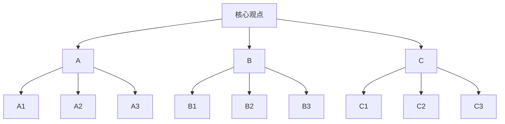
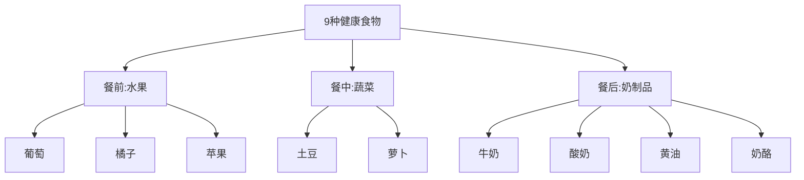
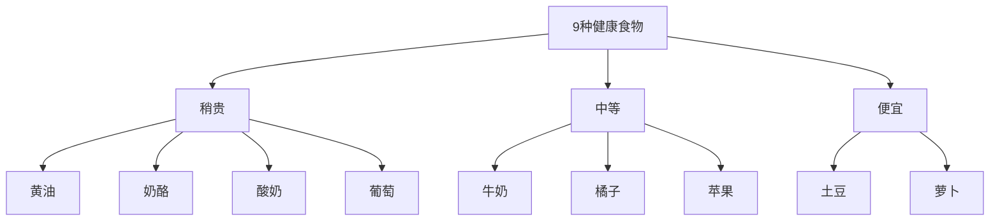
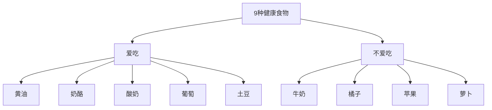
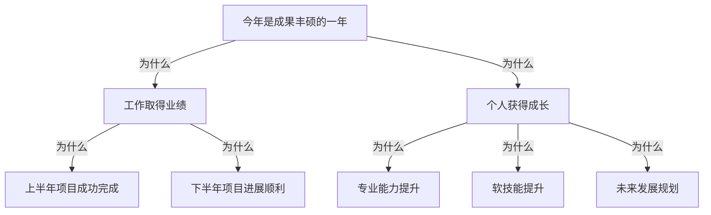
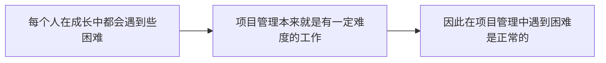
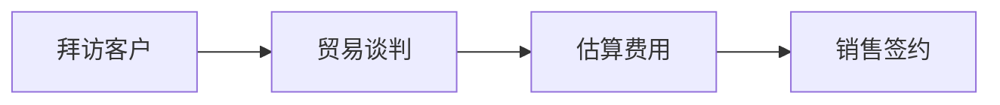
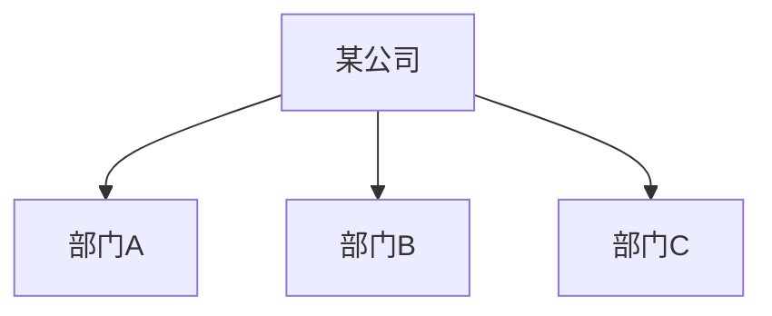

    作者: 张巍
    出版社: 浙江大学出版社
    出版年: 2020-1
    页数: 191
    定价: 52.00元
    装帧: 精装
    ISBN: 9787308196796

[豆瓣链接](https://book.douban.com/subject/34933227/)

- [WHY：为什么要掌握金字塔原理](#why为什么要掌握金字塔原理)
  - [赋能表达的三大优势](#赋能表达的三大优势)
- [WHAT：揭开金字塔结构的面纱](#what揭开金字塔结构的面纱)
  - [四项基本原则：构建逻辑清晰的表达](#四项基本原则构建逻辑清晰的表达)
  - [纵向关系：巧用设问引导受众](#纵向关系巧用设问引导受众)
  - [横向关系：活用演绎逻辑与归纳逻辑](#横向关系活用演绎逻辑与归纳逻辑)
  - [MECE原则：实现不重叠、无遗漏的分类](#mece原则实现不重叠无遗漏的分类)
- [HOW：灵活构建金字塔结构](#how灵活构建金字塔结构)

# WHY：为什么要掌握金字塔原理
`金字塔原理`是一种思考方法和沟通方法，包括归类概括、逻辑设计、结构构建等方面的方法或技巧，可以广泛地应用在思考分析、口头表达和书面表达之中。

## 赋能表达的三大优势
对于受众而言，金字塔结构赋予表达三大优势。

1. 易于受众理解
2. 易于受众记忆
3. 易被受众认同

```
提高沟通的效果             如何高效地       提高沟通的效率

观点明确，         |        思考        | 让受众  
按照受众的思维习惯  |        说话       | 准确、快速地
和容易理解的顺序    |  ——>   协作   ——> | 理解和记忆
来表达             |        讲课
```

# WHAT：揭开金字塔结构的面纱
## 四项基本原则：构建逻辑清晰的表达
1. `结论先行`，即先从结论说起，把中心思想或关键论点放在口头或书面表达的开头，从而突出呈现。在一般的口头表达或书面表达中，如果采取结论先行的方式，建议遵循如下的逻辑顺序来进行表达：
   1. 先重要后次要
   2. 先全局后细节
   3. 先结论后原因
   4. 先总结后具体
   5. 先结果后过程
   6. 先论点后论据

糟糕的典型案例：

    老板，我最近在留意原材料的价格，发现很多都涨价了；
    刚才物流公司打电话来说提价，我还比较了其他家的价格，但还没办法说服它不涨价；
    还有，竞争品牌XX最近也涨价了；
    对了，广告费最近花销也比较快，如果...可能...

如果遵循结论先行的原则，这个汇报可以是这样表达的：

    老板，我认为我们的产品应该涨价20%。我按影响的大小，从大到小跟您汇报一下。
    第一，原材料最近涨了30%，物流成本也上涨了；
    第二，竞争品牌XX调涨了20%左右；
    第三，广告费开支变大，我们需要增加利润以持续在广告方面的投入。

2. `以上统下`，即运用金字塔原理进行表达时，上一层级的内容必须是下一层级内容的抽象概括。以上统下，实际上是金字塔结构中纵向关系的具体体现。



3. `归类分组`，即利用分类的方法处理素材，每一组的思想观点必须在逻辑上属于同一范畴，且在逻辑上具有共同点，能够用单一名词概括该组的所有思想。

按照从属关系，分类9种健康食物：



按照食品价格，分类9种健康食物：



按照个人喜好，分类9种健康食物：



`逻辑递进`，即每组中的内容思想必须按照一定的逻辑顺序来组织。逻辑递进关系一般分为`归纳关系`和`演绎关系`两类，对应金字塔结构中的横向关系。你所选择的逻辑顺序，其实也展现了你在组织思想时的分析过程。

## 纵向关系：巧用设问引导受众
`纵向关系`是指主题（上层）和子题（下层）之间的关系。具体而言，主题必须是子题的总结与概括，而子题必须为主题提供解释和支持。因此在纵向关系中，各层级的重要性是由上而下逐渐递减的，即最上层的中心思想最为重要，下一层级的思想次之，再下一级的思想再次之，以此类推。

在实际应用中，运用纵向关系建立`疑问/回答式的对话`，能够很好地吸引受众的注意力，从而引导受众按照你所设计的方向去思考，将受众的注意力从上一层级引导到下一层级。

具体而言，可以先`设问“为什么”`，引起受众的短暂思考，如果有听众互动来回答“为什么”自然最好；如果没有人回答，自己也可以根据下一层级要点**顺藤摸瓜**，针对这个“为什么”进行自问自答。



## 横向关系：活用演绎逻辑与归纳逻辑
`横向关系`是指同一层级上各项要点之间的关系，或者同一组内的各项要点之间的关系。无论在同一层级中，还是在同一组中，各项要点必须同属于一个范畴，且排列顺序必须符合一定的逻辑顺序。

横向关系一般分为`演绎逻辑`和`归纳逻辑`两类。

所谓`演绎逻辑`，即利用逻辑推理的方式来组织材料和观点，也被称为必然性推理。常见的演绎逻辑有：

    【大前提→小前提→结论】
    【问题→原因→解决方法】


例如，上级鼓励下属在项目管理工作中迎难而上时，就可以运用【大前提→小前提→结论】这一演绎逻辑：



所谓`归纳逻辑`，即通过时间顺序、空间（结构）顺序、重要性顺序来组织材料和观点。

常见的时间顺序主要分为两种：

1. 按照绝对时间来设计逻辑顺序。比如：上旬、中旬、下旬或者上午、中午、下午等。
2. 根据相关业务流程，列出流程步骤中的关键点，继而梳理出逻辑顺序。比如：餐前、餐中、餐后或者电话预约、客户访问、方案介绍等。

卖方流程：



常见的空间顺序可以分为两种：

1. 按照现实的空间来进行设计的逻辑顺序。比如：华北、华中和华南或者部门A、部门B和部门C。
2. 按照虚拟的空间或结构来设计的逻辑顺序。比如：线上、线下或人员、机器、物料、方法、环境、测量等。



`重要性顺序`，也称程度顺序，是按照不同程度的重要性来进行设计的逻辑顺序。

## MECE原则：实现不重叠、无遗漏的分类
`MECE原则`，全称mutually exclusive collectively exhaustive，意思是“相互独立，完全穷尽”。

- 各部分之间相互独立（mutually exclusive）
- 所有部分完全穷尽（collectively exhaustive）

常见的符合MECE原则的分解法有以下五种切入点：

1. 按照A与非A进行分解。例如：国内与非国内（国外）；大企业与非大企业（中小企业）。
2. 按照公式进行分解。我们可以将已知的公式作为分解依据，从而分解出各项要素。例如，当我们要做提升销售额的提案时，可以参考公式：总销售额=员工人均销售额×员工数。
3. 按照流程进行分解。我们可以将已知的业务流程作为分解依据，继而进行各要素的分解。例如，当我们要做改善销售流程的提案时，可以参考销售流程：拜访→商谈→报价→签约。
4. 按照常用要素进行分解。常用要素有3C、4P、QCD、5W2H
   1. 按`3C`要素分解。3C即`customer（客户）`、`competitor（竞争对手）`和`company（公司）`三个维度，以此来进行骨架结构的分解。
      1. Customer（客户）——对于一项新技术或新产品，目标客户的接受度和活跃度如何？
      2. Competitor（竞争对手）——竞争对手的项目与所考察的项目相比，谁更有技术优势？
      3. Company（公司）——该项目所属公司的团队能力和未来的产能如何？
   2. 按`4P`要素分解。4P即`product（产品）`、`price（价格）`、`place（渠道）`、`promotion（促销）`四个要素，以此来进行逻辑结构的划分。4P理论（The Marketing Theory of 4Ps）是产生于20世纪60年代的美国营销理论，常用于营销领域。比如，某国内著名电子产品集团，就是利用4P要素进行营销战略的分解，从而构建起全方位的营销体系。具体如下：
      1. 在产品方面，公司针对各地域消费者的不同需求，有针对性地研制开发了多种、多规格的电子产品，以满足不同层次消费者的需要，凭借其新技术、易用性、个性化的设计及多元化的解决方案而广受用户欢迎。
      2. 在价格方面，公司更愿牺牲短期利益来占领长远的市场，继而提升公司的美誉度和知名度，创立自己“低价高质”的口碑。
      3. 在渠道方面，公司采取了三项措施：一是在香港设置研发和市场销售团队，利用香港这一世界转口中心的区位优势，及时把握国际潮流和最新动态，促进集团的国际化发展；二是将生产基地设置在劳动力成本低的内陆地区，并建立委托加工的合作关系，这不仅避免了大量的基建投资，也能在订货量增大时保证供应；三是自建营销网络，在全国设置48个销售公司，实行逐级控制，采取特许经营，并建立了5万多个品牌专卖店。
      4. 在促销方面，公司将品牌与自身的企业形象宣传、产品推广、促销相结合，强调“科技进步对人类社会的积极影响”，这个品牌概念不仅带来了良好的经济效益，也产生了极好的社会效益。
   3. 按`QCD`要素分解。QCD是`quality（质量）`、`cost（成本）`和`delivery（交付）`三个要素，以此来作为分类的逻辑。QCD分解法常用于企业运营方面的方案呈现，或者客户对于产品或供应商的评估选择。
   4. 按`5W2H`要素分解。5W2H是指5个以W开头的英语单词和2个以H开头的英语单词。5W，即why（为什么）、what（做什么）、who（何人做）、when（何时做）、where（何地做）；2H，即how（如何做）、how much/many（多少）。5W2H分解适用的场景非常多。比如，汇报工作计划时就可以采取如下的结构：
      1. Why（为什么）——说明制订工作计划的理由；
      2. What（做什么）——说明工作计划的范围；
      3. Who（何人做）——说明各个工作模块的负责人；
      4. When（何时做）——说明各个工作包的起始时间，在确定的情况下可以加结束时间；
      5. Where（何地做）——说明各个工作模块的执行所在地；
      6. How（如何做）——说明工作计划中的具体方法；
      7. How much/many（多少）——说明工作计划的花费或需要哪些资源。

# HOW：灵活构建金字塔结构


