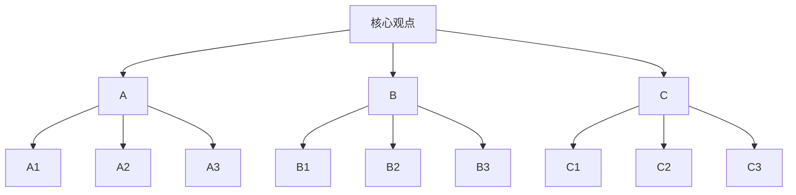
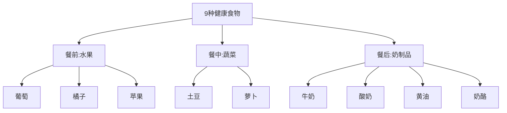
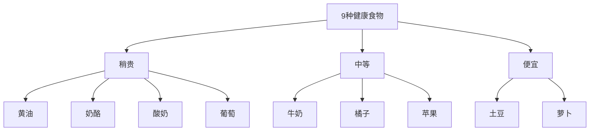
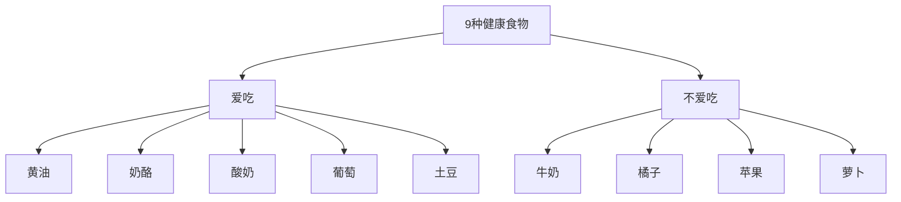

    作者: 张巍
    出版社: 浙江大学出版社
    出版年: 2020-1
    页数: 191
    定价: 52.00元
    装帧: 精装
    ISBN: 9787308196796

[豆瓣链接](https://book.douban.com/subject/34933227/)

- [WHY：为什么要掌握金字塔原理](#why为什么要掌握金字塔原理)
  - [赋能表达的三大优势](#赋能表达的三大优势)
- [WHAT：揭开金字塔结构的面纱](#what揭开金字塔结构的面纱)
  - [四项基本原则：构建逻辑清晰的表达](#四项基本原则构建逻辑清晰的表达)
  - [纵向关系：巧用设问引导受众](#纵向关系巧用设问引导受众)

# WHY：为什么要掌握金字塔原理
`金字塔原理`是一种思考方法和沟通方法，包括归类概括、逻辑设计、结构构建等方面的方法或技巧，可以广泛地应用在思考分析、口头表达和书面表达之中。

## 赋能表达的三大优势
对于受众而言，金字塔结构赋予表达三大优势。

1. 易于受众理解
2. 易于受众记忆
3. 易被受众认同

```
提高沟通的效果             如何高效地       提高沟通的效率

观点明确，         |        思考        | 让受众  
按照受众的思维习惯  |        说话       | 准确、快速地
和容易理解的顺序    |  ——>   协作   ——> | 理解和记忆
来表达             |        讲课
```

# WHAT：揭开金字塔结构的面纱
## 四项基本原则：构建逻辑清晰的表达
1. `结论先行`，即先从结论说起，把中心思想或关键论点放在口头或书面表达的开头，从而突出呈现。在一般的口头表达或书面表达中，如果采取结论先行的方式，建议遵循如下的逻辑顺序来进行表达：
   1. 先重要后次要
   2. 先全局后细节
   3. 先结论后原因
   4. 先总结后具体
   5. 先结果后过程
   6. 先论点后论据

糟糕的典型案例：

    老板，我最近在留意原材料的价格，发现很多都涨价了；
    刚才物流公司打电话来说提价，我还比较了其他家的价格，但还没办法说服它不涨价；
    还有，竞争品牌XX最近也涨价了；
    对了，广告费最近花销也比较快，如果...可能...

如果遵循结论先行的原则，这个汇报可以是这样表达的：

    老板，我认为我们的产品应该涨价20%。我按影响的大小，从大到小跟您汇报一下。
    第一，原材料最近涨了30%，物流成本也上涨了；
    第二，竞争品牌XX调涨了20%左右；
    第三，广告费开支变大，我们需要增加利润以持续在广告方面的投入。

2. `以上统下`，即运用金字塔原理进行表达时，上一层级的内容必须是下一层级内容的抽象概括。以上统下，实际上是金字塔结构中纵向关系的具体体现。



3. `归类分组`，即利用分类的方法处理素材，每一组的思想观点必须在逻辑上属于同一范畴，且在逻辑上具有共同点，能够用单一名词概括该组的所有思想。

按照从属关系，分类9种健康食物：



按照食品价格，分类9种健康食物：



按照个人喜好，分类9种健康食物：



`逻辑递进`，即每组中的内容思想必须按照一定的逻辑顺序来组织。逻辑递进关系一般分为`归纳关系`和`演绎关系`两类，对应金字塔结构中的横向关系。你所选择的逻辑顺序，其实也展现了你在组织思想时的分析过程。

## 纵向关系：巧用设问引导受众


