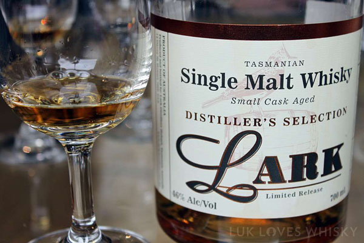
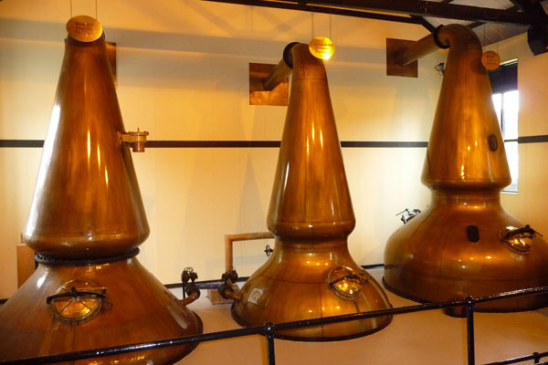
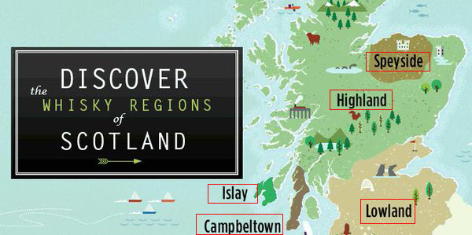
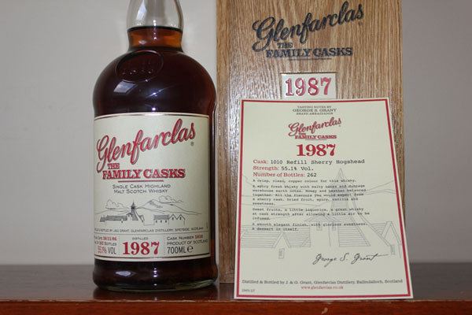
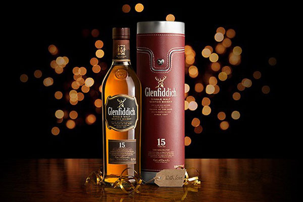
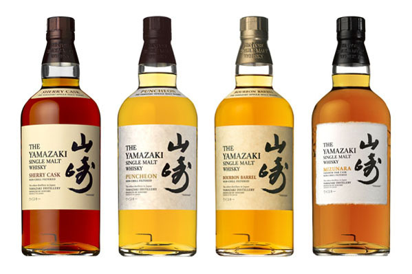
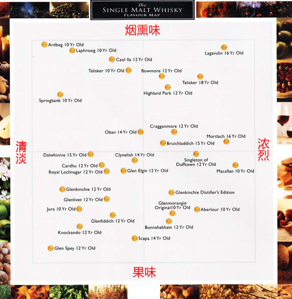
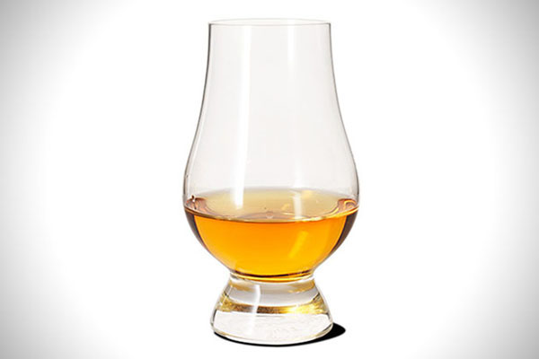

## 什么是单一麦芽威士忌？

单一麦芽威士忌是指酒液完全来自于同一家蒸馏厂（这也是 single 的含义所在），以 100% 发芽大麦为原料酿造，在该厂自有仓库设施的橡木桶中陈酿超过 3 年以上的威士忌。

单一麦芽威士忌并没有限制同一瓶单一麦芽威士忌里的酒必须来自同一个橡木桶。实际上，酿酒厂常会根据需要来调酒，以自己酒厂所产的不同桶威士忌（乃至于不同装桶年份的威士忌）来进行混合调制以达到风格的均一性和代表性。单一麦芽威士忌能极大地表现酒厂和产区风土特色，一般有独特的泥煤香。

单一麦芽威士忌是用纯麦酿造而成，香气上非常纯正浓郁，更为突出的是，口感上非常饱满醇厚细腻，这是其他威士忌所无法比拟的。

## 单一麦芽威士忌与其它威士忌的区别
威士忌中，除了单一麦芽威士忌外，还有调和威士忌（Blended Whisky）、调和麦芽威士忌（Blended Malt Whisky）、调和谷物威士忌（Blended Grain Whisky）、单一桶威士忌（Single Barrel Whisky）和纯麦威士忌（Malt Whisky）等。

1. **调和威士忌**：混合一种以上的单一麦芽威士忌和单一谷物威士忌的威士忌酒，其基酒来自不同蒸馏厂。刚开始，英国为了满足国内麦子的供应，对麦子酿酒商征收高额税率，从而导致酿酒商用谷物来替代麦子进行酿酒，但酿出的酒口感不如麦芽威士忌，于是将麦芽威士忌掺入到谷物威士忌中，这样就形成了今天的调和威士忌。调和威士忌相比麦芽威士忌而言，口味比较温和，消费者易于接受，同时弥补了麦芽威士忌酿酒技术和产量不稳定的问题。
2. **调和麦芽威士忌**：用不同蒸馏厂的单一麦芽威士忌调和而成的威士忌。这种威士忌风味浓郁，泥煤味十足。
3. **调和谷物威士忌**：用不同蒸馏厂的单一谷物威士忌调和而成的威士忌。相对来说，这种威士忌的风味比较清淡温和。
4. **单一桶威士忌**：这种单一桶威士忌是指瓶内威士忌的来源完全出自同一个陈年酒桶，强调的是每个桶的原味表现。因为每个桶内酒的香气、风味和颜色都不尽相同，所以每款单一桶威士忌威士忌都是独一无二的。
5. **纯麦威士忌**：以 100% 发芽大麦为原料酿造，不添加任何其他谷物。但纯麦威士忌通常用不同酒厂的麦芽威士忌调配而成，如果用同一酒厂麦芽威士忌调配而成，那就称为了单一麦芽威士忌。所以，单一麦芽威士忌也是纯麦威士忌的一种。

## 单一麦芽威士忌的生产过程
不同产区的单一麦芽威士忌生产过程也微有不同，但其中苏格兰单一麦芽威士忌无疑是所有单一麦芽威士忌中知名度最高的。以苏格兰单一麦芽威士忌举例，讲解单一麦芽威士忌的生产过程。

### 制麦芽
将去除杂质后的麦类浸泡在热水中使其发芽，浸泡后，将谷物摊放在地板上，充分透气。为了保证发芽的一致性，需要不断翻转大麦，有助于散发萌芽过程中产生的热量。萌芽所需的时间视麦类品种的不同而有所差异，但一般需要 1-2 周的时间。

麦类发芽后再将其烘干或以`泥煤`（peat）熏干，等冷却后再储放大约一个月的时间，发芽的过程即算完成。干燥会使麦芽失去谷物的淀粉味，增加香甜味。如果在这个过程中使用泥煤来熏干处理麦芽，就引入了包括沥青、炭灰、篝火、碳酸肥皂和海洋特性的烟熏味。

### 糖化
糖化是从发芽麦类中提取可溶解性糖份的过程。发芽的麦类首先在磨房碾碎，制成麦芽粉。麦芽粉与温水混合，然后被灌输到糖化缸中，任糖化反应自然地发生。典型的糖化缸是一个金属圆桶，带有横杆的搅拌器不停旋转，将麦芽粉与水混合。糖化的过程中的温度及时间控制非常重要，过高的温度或过长的时间都将会影响到麦芽汁的品质。

### 发酵
往冷却后的麦芽汁中加入酵母菌进行发酵，酵母将麦芽汁中的糖转化成酒精，因此在完成发酵过程后会产生酒精浓度约 7%-10% 的液体，整个发酵过程大概在 48 小时内。

不同威士忌品牌会用不同的酵母来进行发酵，一般酒厂会用 2 种及以上酵母进行发酵，有的甚至用 10 多种酵母进行发酵。为发酵过程中，除了产生酒精，还会产生其他一些风味物质，这些物质对威士忌口味、特性和品质有着非常重要的影响。

### 蒸馏

蒸馏具有浓缩的作用，麦芽威士忌主要用壶形铜质蒸馏器来生产，壶形蒸馏器由三部分组成：罐体（加热发酵麦芽汁的部位）、鹅颈和导管（被蒸发的酒精的上升管道）和冷凝器（回形管或套管，酒精蒸汽冷凝回到液体的部位）。铜质蒸馏器在蒸馏过程中，与酒液能发生反应，去除酒液中的不良物质和风味，使酒体变得更加纯净。

蒸馏分 2 次蒸馏。第一次蒸馏主要是将酒精与水分离开来，蒸馏出来的酒酒精度较低，酒精含量约为 21%-28%，其杂质含量高。第二次蒸馏主要是将可饮性酒精与不需要酒精分离开来，蒸馏出来的酒主要分为酒头（不需要的味道和醇类组成）、酒心（纯净的酒精，后面酿成威士忌）和酒味（不纯的酒精）。最后酿造成威士忌的酒精主要是酒心，也被称之为新酒。酒心大概占整个蒸馏酒精成分的20%-30%，酒精度大约为 70%。

### 陈年
蒸馏过后的新酒必须在橡木桶中陈酿 3 年以上，增加复杂的风味，同时产生漂亮的琥珀色，橡木桶的陈年决定了威士忌 60% 的味道。

陈酿威士忌的橡木桶都为旧桶，通常为西班牙`雪利桶`，后来雪利桶供不应求，很多威士忌酒商采用美国`波本威士忌白橡木桶`。白橡木桶相比雪利桶价格便宜，但赋予威士忌的风味不如雪利桶。威士忌采用旧桶陈酿，而非新橡木桶，主要是因为新橡木桶的强烈气味会掩盖麦芽的香气，同时浓郁的单宁也会掩盖威士忌的口感。

在威士忌陈酿过程中，有些酒厂还会经常换桶，让威士忌经历不同风味的橡木桶，此举主要是为了增加威士忌的香气和口感的复杂性，使品质更加上乘。

### 调配
每个品牌威士忌酿酒厂都有自己的风味，因此在陈酿完后，各个酒厂的调酒大师会根据本品牌酒质的要求，按照一定的比例将不同桶中的麦芽威士忌调配出自己与众不同的口感。调配过程及比例都被每个酒厂视为绝对的机密。

### 装瓶
调配的程序结束后，最后的环节就是装瓶了。在装瓶之前先要将调配好的威士忌再过滤一次，将其杂质去除掉，按固定的容量分装至每一瓶中，然后再贴上卷标后即可装箱出售。

装瓶也分为 2 种：“独立装瓶”和“官方装瓶”。独立装瓶主要是大型威士忌独立酒商购买原酒后自己装瓶销售，这种装瓶称为“独立装瓶”。这种方式也褒贬不一，有的人非常推崇，而有些人却嗤之以鼻。“官方装瓶”主要是指在酒厂内的装瓶，这种装瓶方式也更受到威士忌爱好者的喜欢。

## 单一麦芽威士忌的主要产区
威士忌的主要产区为苏格兰、爱尔兰和日本等。其中苏格兰更是威士忌的圣地，品质也更加出众，几乎就是单一麦芽威士忌的代名词。

1. 苏格兰斯佩塞德（Speyside）：苏格兰最受欢迎的威士忌产区，这里出产的威士忌以极其复杂和丰富而知名，其口感温和，总是有一种雅致的烟熏味道。世界上品牌知名度高的几大威士忌：格兰利威（Glenlivet）、格兰菲迪（Glenfiddich）及格兰花格（Glenfarclas）均出自该产区。
2. 苏格兰高地（The Highlands）：高地是苏格兰地理面积最大的威士忌产区，其威士忌风格也多样。一般来说，高地产区的威士忌最为粗犷，带有辛辣和烟熏的味道，口感丰富。主要品牌为格兰杰（Glenmorangie）和达尔摩（Dalmore）等。
3. 苏格兰低地（The Lowlands）：低地产区出产的单一麦芽威士忌最平淡无奇，主要以平滑柔和的口感以及自然的麦芽味道而知名。著名品牌：格兰金奇（Glenkinchie）等。
4. 苏格兰艾莱岛（Islay）：艾莱岛是苏格兰第四大威士忌产区，尽管面积小，只有 240 平方英里左右，但出产的威士忌品质却独具特色。由于当地煤较多，在麦芽制作过程中都会用泥煤熏干，因此，艾莱岛威士忌常带有显著泥煤味道，还带有苔癣、烟熏、海草及盐的香味。知名品牌：阿贝（Ardbeg）和拉弗格（Laphroaig）等。
5. 苏格兰坎贝尔镇（Campbeltown）：坎贝尔镇虽然只有寥寥无几几家威士忌酒厂，但品质绝对不会让你失望。但名气上相比其他几个产区，已经弱势一些。知名品牌：云顶（Springbank）。

虽然苏格兰是单一麦芽威士忌的代名词，但同样拥有清澈水源、优质大麦、泥炭和清爽适度气候的爱尔兰和日本也是制作单一麦芽威士忌的代表产区。这 2 个产区酿造的威士忌也各有千秋，香气和口感均较好，品质上乘。爱尔兰目前只有少数几家威士忌酒厂，知名品牌为：尊美醇（Jameson）；日本威士忌知名品牌有：山崎和白州等。

## 单一麦芽威士忌的知名品牌
### 格兰花格

格兰花格酒厂位于苏格兰威士忌之乡、最核心的斯佩塞德产区，创建于1865年，是百年老字号的金牌酒厂。格兰花格是苏格兰威士忌界的一颗珍宝，通常他们的价格不会特别贵，加上品质优秀，尤其是单一麦芽威士忌，更是不少粉丝最喜爱的苏格兰单一麦芽威士忌之一。

格兰花格单一麦芽威士忌多次获得国际威士忌的大奖，曾获得 2016 年《威士忌圣经》（Whisky Bible）评选的“全球年度最佳单桶威士忌”，同时也是“苏格兰年度最佳威士忌”和“苏格兰年度最佳单一麦芽威士忌（单桶）”的得主。目前，格兰花格已经是苏格兰单一麦芽威士忌的顶级品质代表。

### 格兰菲迪

格兰菲迪来源于古老的盖尔语，完整的涵义是“鹿之谷”。这个名字注定被时间赋予了生命，象征着单一纯麦威士忌的创新精神。1886 年，创始人威廉·格兰（William Grant）在苏格兰高地斯佩塞（Speyside）地区开始了他的梦想：创造最好的威士忌。

格兰菲迪，作为世界上获得最多奖项的单一纯麦威士忌领导品牌，是为数不多且自始自终由家族独立经营的酒厂，经历格兰家族五代的传承，秉承着“创造最好威士忌”的精神，延续传统、大胆创新，格兰菲迪逐渐成为苏格兰单一纯麦威士忌的领导者。每一种格兰菲迪都是众多口味完美和谐的综合，是单一纯麦威士忌独特个性和易于饮用性之间的完美体现。如今，格兰菲迪凭借优秀的品质，成为获奖最多的单一纯麦威士忌品牌，多次在国际葡萄酒与烈酒大赛中获得金奖，行销全球 180 个国家，全球销量数一数二。

### 日本山崎

山崎（Yamazaki）威士忌生产商为日本知名的三得利控股公司（Suntory Holdings Ltd），是日本威士忌生产商中屈指可数的翘楚。其中 50 年的山崎单一麦芽威士忌时日本最老也是最贵的单一麦芽威士忌，全球只有 150 瓶，是日本威士忌爱好者顶礼膜拜的佳酿。

山崎酒厂的 2013 年山崎单一麦芽雪利桶威士忌（Yamazaki Single Malt Sherry Cask 2013）被评为“全球年度最佳威士忌”。同时，山崎酒厂单一麦芽威士忌在 2016 年《威士忌圣经》中获得“全球第五佳威士忌”的称号，也是“日本年度最佳威士忌”和“日本年度最佳单一麦芽威士忌（混合桶）”的获得者。山崎酒厂单一麦芽威士忌无疑已经是世界顶级单一麦芽威士忌的代表，更是亚洲单一麦芽威士忌的标杆。

## 如何挑选购买单一麦芽威士忌
生产威士忌的厂家少则有几百家，其生产的单一麦芽威士忌更是数不胜数，那如何挑选出自己喜欢的单一麦芽威士忌呢？著名威士忌酒评家迈克杰克逊的“威士忌天书”《纯麦威士忌全书》（Malt Whisky Companion）一文中，将单一麦芽威士忌按照（烟熏味、果味、口感淡和浓烈）4 方面进行定位。因此，各位酒友可以通过自己的口感爱好，寻找最适合自己的单一麦芽威士忌。

## 单一麦芽威士忌的喝法
在苏格兰有一种说法：饮用单一麦芽威士忌时加冰块，那简直比“打老婆”还要严重。虽然有些酒友会觉得，喝酒就是随意，怎么喝开心就怎么喝。萝卜白菜各有所爱，但是加冰块会稀释单一麦芽威士忌的醇厚香气和口感。因此，一般喝单一麦芽威士忌都要纯饮。

喝单一麦芽威士忌，可以选用格兰凯恩闻香杯（Glencairn Glass）和郁金香杯（Copita Nosing Glass），能完美释放威士忌的香气，这样才能感受单一麦芽威士忌的精妙所在。
