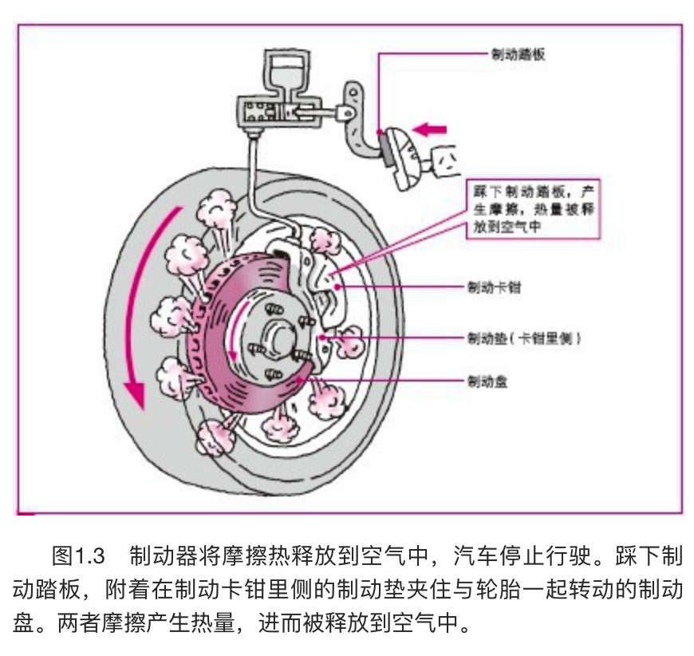
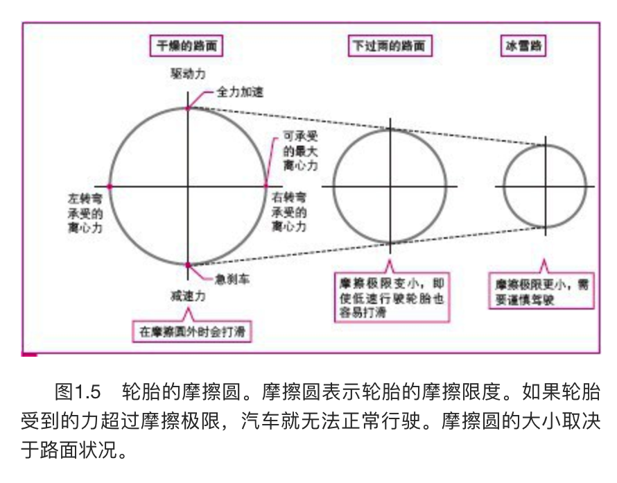

    作者: ［日］ 御堀直嗣 
    出版社: 人民邮电出版社
    原作名: クルマはなぜ走るのか
    译者: 卢扬 
    出版年: 2013-12
    页数: 296
    定价: 39.00
    装帧: 平装
    丛书: 图灵新知
    ISBN: 9787115330321

[豆瓣链接](https://book.douban.com/subject/25761310/)

- [第1章 汽车的五大要素](#%E7%AC%AC1%E7%AB%A0-%E6%B1%BD%E8%BD%A6%E7%9A%84%E4%BA%94%E5%A4%A7%E8%A6%81%E7%B4%A0)
  - [1.1 汽车的五大要素](#11-%E6%B1%BD%E8%BD%A6%E7%9A%84%E4%BA%94%E5%A4%A7%E8%A6%81%E7%B4%A0)
  - [1.2 使汽车发动的物理原理](#12-%E4%BD%BF%E6%B1%BD%E8%BD%A6%E5%8F%91%E5%8A%A8%E7%9A%84%E7%89%A9%E7%90%86%E5%8E%9F%E7%90%86)
  - [1.3 汽车行驶、转向直至停车的过程](#13-%E6%B1%BD%E8%BD%A6%E8%A1%8C%E9%A9%B6%E8%BD%AC%E5%90%91%E7%9B%B4%E8%87%B3%E5%81%9C%E8%BD%A6%E7%9A%84%E8%BF%87%E7%A8%8B)
    - [1.3.1 动力传动系驱动汽车](#131-%E5%8A%A8%E5%8A%9B%E4%BC%A0%E5%8A%A8%E7%B3%BB%E9%A9%B1%E5%8A%A8%E6%B1%BD%E8%BD%A6)
    - [1.3.2 转向系统实现汽车转向](#132-%E8%BD%AC%E5%90%91%E7%B3%BB%E7%BB%9F%E5%AE%9E%E7%8E%B0%E6%B1%BD%E8%BD%A6%E8%BD%AC%E5%90%91)
    - [1.3.3 制动液传递制动压力，使轮胎停止转动](#133-%E5%88%B6%E5%8A%A8%E6%B6%B2%E4%BC%A0%E9%80%92%E5%88%B6%E5%8A%A8%E5%8E%8B%E5%8A%9B%E4%BD%BF%E8%BD%AE%E8%83%8E%E5%81%9C%E6%AD%A2%E8%BD%AC%E5%8A%A8)
- [第2章 行驶——发动机是汽车的心脏](#%E7%AC%AC2%E7%AB%A0-%E8%A1%8C%E9%A9%B6%E5%8F%91%E5%8A%A8%E6%9C%BA%E6%98%AF%E6%B1%BD%E8%BD%A6%E7%9A%84%E5%BF%83%E8%84%8F)

## 第1章 汽车的五大要素
### 1.1 汽车的五大要素
`行驶`、`转向`和`停车`这三大要素，加上`舒适性`和`安全性`，构成了汽车的五大要素。

### 1.2 使汽车发动的物理原理

发动机中有汽缸和活塞，汽油在汽缸中的燃烧室内进行燃烧。由汽油和空气混合而成的混合气体被送入燃烧室内，燃烧发热后膨胀。

气体（混合气体）膨胀下压活塞，从而带动活塞下的轴转动。发动机输出的旋转力传递到轮胎，使轮胎转动。这样一来，汽车便“因热而动”了。

那么停车时又是怎样的呢？是用制动器使轮胎停止转动的。制动时，制动垫夹住与轮胎一起转动的制动盘。接着，盘和垫之间就会产生摩擦，摩擦产生热量（图1.3）。

这与天冷的时候摩擦双手就会暖和是一样的道理，因为双手摩擦会产生热量。制动盘与制动垫相互摩擦，生成的热量被释放到空气中。

这样一来，通过将旋转轮胎转化成的热量释放到空气中，使汽车减速直至停止。不只是汽车，自行车等的制动原理也是一样，即“因热而停”。

轮胎与路面间的摩擦，实际上是有限度的（图1.5），表示这一限度的图形叫做摩擦圆。汽车处于摩擦极限以下，即以摩擦圆内侧的速度行驶是安全的。但如果加速至超过摩擦极限，转向时汽车就会飞离路面。

### 1.3 汽车行驶、转向直至停车的过程
#### 1.3.1 动力传动系驱动汽车
请看图1.6。这是发动机前置、后轮驱动的后轮驱动车（FR，Front Engine Rear Drive）的透视图。此外，根据发动机和驱动轮所在的不同位置，还有前轮驱动车（FF，Front Engine Front Drive）、后置后驱车（RR，Rear Engine Rear Drive）和中置后驱车（MR，Midship Engine Rear Drive）等类型。

从发动机到后轮，`动力传动系`依次包括离合器、变速器、万向节、差速器和传动轴。你可以与图1.6中的着色部分一一对应。

离合器负责切断发动机输出的旋转力。当驾驶员踩下离合器踏板时，旋转力被切断，位于离合器后面的变速器的齿轮也会分离。

由于齿轮的分离，旋转力完成变速，并通过万向节传递至差速器。在差速器中，由多个齿轮组合而成的装置，其旋转力将从发动机径直传向差速器并左右分散，通过传动轴传至后轮。由此，后轮轮胎转动，汽车才能行驶。

#### 1.3.2 转向系统实现汽车转向
所谓`转向系统`，是指通过转动方向盘改变前进方向的装置，由方向盘、转向轴、转向齿轮箱和横拉杆组成。

转向轴的前方连着的小箱子就是转向齿轮箱。方向盘的转动经过转向轴传递至转向齿轮箱。

在转向齿轮箱中装有一个齿轮组，转动方向盘后是通过齿轮组来调整汽车行驶的方向的。

横向传递径直传来的旋转力，在某种意义上它与动力传动系中差速器的传递路径相似，都是通过齿轮组结构，将纵向传递来的力横向传递出去。

在转向齿轮箱中，将左右方向的移动转变为横向移动，并通过一种被称为横拉杆的连接棒传递至刹住前轮的车轴，从而改变前轮方向。由此，汽车改变了前进方向，完成了转向。

#### 1.3.3 制动液传递制动压力，使轮胎停止转动
在驾驶室的方向盘下，有一个制动踏板（实际上是有三个踏板，中间的是制动踏板）。根据杠杆原理，当驾驶员踩下制动踏板时，位于驾驶室和发动机室之间的制动器主汽缸的活塞就开始运动。活塞的下压会给制动器主汽缸内的制动液施加压力，压力通过制动管道传递至4个轮胎。

在轮胎内侧，可以看到有圆盘状的制动盘和夹住制动盘的制动卡钳。受到压力的制动液将压力传递至制动卡钳，下压汽缸中的活塞。活塞受力，制动垫就会从两边夹住制动盘。受到制动垫左右夹击的制动盘因摩擦生热，热量随即被释放到空气中。这样一来，汽车降低了速度，不久就会停止行驶。

## 第2章 行驶——发动机是汽车的心脏

