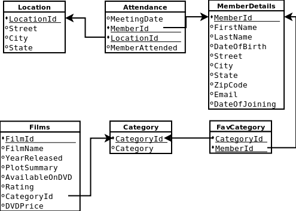
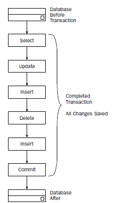
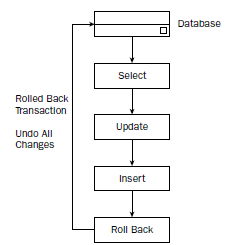
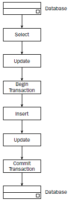
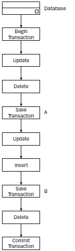
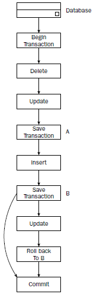
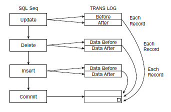
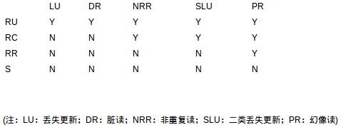

    作者: [美]Paul Wilton / [美]John Colby
    出版社: 清华大学出版社
    原作名: Beginning SQL
    译者: 敖富江
    出版年: 2006-1
    页数: 408
    定价: 48.00元
    装帧: 平装
    丛书: wrox红皮书
    ISBN: 9787302128335

[豆瓣链接](https://book.douban.com/subject/1842622/)

- [1 数据库与表的建立，更新及删除](#1-%e6%95%b0%e6%8d%ae%e5%ba%93%e4%b8%8e%e8%a1%a8%e7%9a%84%e5%bb%ba%e7%ab%8b%e6%9b%b4%e6%96%b0%e5%8f%8a%e5%88%a0%e9%99%a4)
  - [1.1 创建和删除数据库](#11-%e5%88%9b%e5%bb%ba%e5%92%8c%e5%88%a0%e9%99%a4%e6%95%b0%e6%8d%ae%e5%ba%93)
  - [1.2 创建、更改和删除表](#12-%e5%88%9b%e5%bb%ba%e6%9b%b4%e6%94%b9%e5%92%8c%e5%88%a0%e9%99%a4%e8%a1%a8)
  - [1.3 主键与外键](#13-%e4%b8%bb%e9%94%ae%e4%b8%8e%e5%a4%96%e9%94%ae)
  - [1.4 创建示例数据库(use mysql)](#14-%e5%88%9b%e5%bb%ba%e7%a4%ba%e4%be%8b%e6%95%b0%e6%8d%ae%e5%ba%93use-mysql)
- [2 输入与提取数据](#2-%e8%be%93%e5%85%a5%e4%b8%8e%e6%8f%90%e5%8f%96%e6%95%b0%e6%8d%ae)
  - [2.1 插入数据](#21-%e6%8f%92%e5%85%a5%e6%95%b0%e6%8d%ae)
  - [2.2 更新数据](#22-%e6%9b%b4%e6%96%b0%e6%95%b0%e6%8d%ae)
  - [2.3 删除数据](#23-%e5%88%a0%e9%99%a4%e6%95%b0%e6%8d%ae)
  - [2.4 SELECT语句](#24-select%e8%af%ad%e5%8f%a5)
    - [2.4.1 仅返回不同的行(DISTINCT)](#241-%e4%bb%85%e8%bf%94%e5%9b%9e%e4%b8%8d%e5%90%8c%e7%9a%84%e8%a1%8cdistinct)
    - [2.4.2使用别名(AS)](#242%e4%bd%bf%e7%94%a8%e5%88%ab%e5%90%8das)
    - [2.4.3使用逻辑运算符(NOT,BETWEEN,LIKE，IN)](#243%e4%bd%bf%e7%94%a8%e9%80%bb%e8%be%91%e8%bf%90%e7%ae%97%e7%ac%a6notbetweenlikein)
    - [2.4.4 使用ORDER BY排序结果](#244-%e4%bd%bf%e7%94%a8order-by%e6%8e%92%e5%ba%8f%e7%bb%93%e6%9e%9c)
  - [2.5 从多个表中选择数据](#25-%e4%bb%8e%e5%a4%9a%e4%b8%aa%e8%a1%a8%e4%b8%ad%e9%80%89%e6%8b%a9%e6%95%b0%e6%8d%ae)
    - [2.5.1内联合](#251%e5%86%85%e8%81%94%e5%90%88)
    - [2.5.2 SQL是基于集合的](#252-sql%e6%98%af%e5%9f%ba%e4%ba%8e%e9%9b%86%e5%90%88%e7%9a%84)
- [3 数据库设计](#3-%e6%95%b0%e6%8d%ae%e5%ba%93%e8%ae%be%e8%ae%a1)
  - [3.1 数据库设计的3个范式](#31-%e6%95%b0%e6%8d%ae%e5%ba%93%e8%ae%be%e8%ae%a1%e7%9a%843%e4%b8%aa%e8%8c%83%e5%bc%8f)
    - [3.1.1 第一范式](#311-%e7%ac%ac%e4%b8%80%e8%8c%83%e5%bc%8f)
    - [3.1.2 第二范式](#312-%e7%ac%ac%e4%ba%8c%e8%8c%83%e5%bc%8f)
    - [3.1.3 第三范式](#313-%e7%ac%ac%e4%b8%89%e8%8c%83%e5%bc%8f)
  - [3.2 利用约束确保数据有效性](#32-%e5%88%a9%e7%94%a8%e7%ba%a6%e6%9d%9f%e7%a1%ae%e4%bf%9d%e6%95%b0%e6%8d%ae%e6%9c%89%e6%95%88%e6%80%a7)
    - [3.2.1 NOT NULL约束](#321-not-null%e7%ba%a6%e6%9d%9f)
    - [3.2.2 UNIQUE约束](#322-unique%e7%ba%a6%e6%9d%9f)
    - [3.2.3 CHECK约束](#323-check%e7%ba%a6%e6%9d%9f)
    - [3.2.4 主键约束](#324-%e4%b8%bb%e9%94%ae%e7%ba%a6%e6%9d%9f)
    - [3.2.5 外键约束](#325-%e5%a4%96%e9%94%ae%e7%ba%a6%e6%9d%9f)
  - [3.3 利用索引加速结果查询](#33-%e5%88%a9%e7%94%a8%e7%b4%a2%e5%bc%95%e5%8a%a0%e9%80%9f%e7%bb%93%e6%9e%9c%e6%9f%a5%e8%af%a2)
- [4 分组和聚合数据](#4-%e5%88%86%e7%bb%84%e5%92%8c%e8%81%9a%e5%90%88%e6%95%b0%e6%8d%ae)
  - [4.1 分组数据](#41-%e5%88%86%e7%bb%84%e6%95%b0%e6%8d%ae)
  - [4.2 汇总和聚合数据](#42-%e6%b1%87%e6%80%bb%e5%92%8c%e8%81%9a%e5%90%88%e6%95%b0%e6%8d%ae)
    - [4.2.1 统计结果的数目](#421-%e7%bb%9f%e8%ae%a1%e7%bb%93%e6%9e%9c%e7%9a%84%e6%95%b0%e7%9b%ae)
    - [4.2.2 累加结果](#422-%e7%b4%af%e5%8a%a0%e7%bb%93%e6%9e%9c)
    - [4.2.3 求平均值](#423-%e6%b1%82%e5%b9%b3%e5%9d%87%e5%80%bc)
  - [4.3 在GROUP BY语句中使用HAVING子句](#43-%e5%9c%a8group-by%e8%af%ad%e5%8f%a5%e4%b8%ad%e4%bd%bf%e7%94%a8having%e5%ad%90%e5%8f%a5)
- [5 从不同的表中选择数据](#5-%e4%bb%8e%e4%b8%8d%e5%90%8c%e7%9a%84%e8%a1%a8%e4%b8%ad%e9%80%89%e6%8b%a9%e6%95%b0%e6%8d%ae)
  - [5.1 内部联合](#51-%e5%86%85%e9%83%a8%e8%81%94%e5%90%88)
    - [5.1.1 等值联合与不等值联合](#511-%e7%ad%89%e5%80%bc%e8%81%94%e5%90%88%e4%b8%8e%e4%b8%8d%e7%ad%89%e5%80%bc%e8%81%94%e5%90%88)
    - [5.1.2 多个联合与多个条件](#512-%e5%a4%9a%e4%b8%aa%e8%81%94%e5%90%88%e4%b8%8e%e5%a4%9a%e4%b8%aa%e6%9d%a1%e4%bb%b6)
    - [5.1.3 交叉联合](#513-%e4%ba%a4%e5%8f%89%e8%81%94%e5%90%88)
    - [5.1.4 自联合](#514-%e8%87%aa%e8%81%94%e5%90%88)
  - [5.2 外部联合](#52-%e5%a4%96%e9%83%a8%e8%81%94%e5%90%88)
    - [5.2.1 左外部联合](#521-%e5%b7%a6%e5%a4%96%e9%83%a8%e8%81%94%e5%90%88)
    - [5.2.2 右外部联合](#522-%e5%8f%b3%e5%a4%96%e9%83%a8%e8%81%94%e5%90%88)
    - [5.2.3 全外联合](#523-%e5%85%a8%e5%a4%96%e8%81%94%e5%90%88)
  - [5.3 利用UNION组合结果集](#53-%e5%88%a9%e7%94%a8union%e7%bb%84%e5%90%88%e7%bb%93%e6%9e%9c%e9%9b%86)
- [6 子查询](#6-%e5%ad%90%e6%9f%a5%e8%af%a2)
  - [6.1 SELECT列表中的子查询](#61-select%e5%88%97%e8%a1%a8%e4%b8%ad%e7%9a%84%e5%ad%90%e6%9f%a5%e8%af%a2)
  - [6.2 WHERE子句中的子查询](#62-where%e5%ad%90%e5%8f%a5%e4%b8%ad%e7%9a%84%e5%ad%90%e6%9f%a5%e8%af%a2)
  - [6.3子查询中的运算符](#63%e5%ad%90%e6%9f%a5%e8%af%a2%e4%b8%ad%e7%9a%84%e8%bf%90%e7%ae%97%e7%ac%a6)
    - [6.3.1 IN运算符](#631-in%e8%bf%90%e7%ae%97%e7%ac%a6)
    - [6.3.2 ANY，SOME和ALL运算符](#632-anysome%e5%92%8call%e8%bf%90%e7%ae%97%e7%ac%a6)
    - [6.3.3 EXISTS运算符](#633-exists%e8%bf%90%e7%ae%97%e7%ac%a6)
    - [6.3.4 在HAVING子句中使用子查询](#634-%e5%9c%a8having%e5%ad%90%e5%8f%a5%e4%b8%ad%e4%bd%bf%e7%94%a8%e5%ad%90%e6%9f%a5%e8%af%a2)
- [7 视图](#7-%e8%a7%86%e5%9b%be)
  - [7.1 视图概述](#71-%e8%a7%86%e5%9b%be%e6%a6%82%e8%bf%b0)
  - [7.2 创建视图](#72-%e5%88%9b%e5%bb%ba%e8%a7%86%e5%9b%be)
  - [7.3 视图的类型](#73-%e8%a7%86%e5%9b%be%e7%9a%84%e7%b1%bb%e5%9e%8b)
    - [7.3.1表联合视图](#731%e8%a1%a8%e8%81%94%e5%90%88%e8%a7%86%e5%9b%be)
    - [7.3.2行视图](#732%e8%a1%8c%e8%a7%86%e5%9b%be)
    - [7.3.3字段视图](#733%e5%ad%97%e6%ae%b5%e8%a7%86%e5%9b%be)
    - [7.3.4汇总视图](#734%e6%b1%87%e6%80%bb%e8%a7%86%e5%9b%be)
  - [7.4 更新视图](#74-%e6%9b%b4%e6%96%b0%e8%a7%86%e5%9b%be)
  - [7.5 删除视图](#75-%e5%88%a0%e9%99%a4%e8%a7%86%e5%9b%be)
- [8 事务](#8-%e4%ba%8b%e5%8a%a1)
  - [8.1 ACID](#81-acid)
  - [8.2 ANSI事务模型](#82-ansi%e4%ba%8b%e5%8a%a1%e6%a8%a1%e5%9e%8b)
  - [8.3 Transact-SQL](#83-transact-sql)
  - [8.4 事务日志](#84-%e4%ba%8b%e5%8a%a1%e6%97%a5%e5%bf%97)
  - [8.5 锁](#85-%e9%94%81)
  - [8.6 为什么需要对事务并发控制](#86-%e4%b8%ba%e4%bb%80%e4%b9%88%e9%9c%80%e8%a6%81%e5%af%b9%e4%ba%8b%e5%8a%a1%e5%b9%b6%e5%8f%91%e6%8e%a7%e5%88%b6)
  - [8.7 数据库的隔离级别](#87-%e6%95%b0%e6%8d%ae%e5%ba%93%e7%9a%84%e9%9a%94%e7%a6%bb%e7%ba%a7%e5%88%ab)

## 1 数据库与表的建立，更新及删除
### 1.1 创建和删除数据库
```sql
CREATE DATABASE name_of_database;
DROP DATABASE name_of_database;
```

### 1.2 创建、更改和删除表
```sql
CREATE TABLE name_of_table
(
    name_of_column column_datatype
)

ALTER TABLE name_of_table ADD name_of_column column_datatype
ALTER TABLE name_of_table DROP COLUMN name_of_column
DROP TABLE name_of_table
```

### 1.3 主键与外键
主键(primary key)是一个字段或者多个字段，它们能够唯一标识数据库中的每个记录。外键(foreign key)包含另一个表中的主键值，它允许第二个表引用第一个表中的数据。

### 1.4 创建示例数据库(use mysql)


```sql
create database filmClub;

use filmClub

create table MemberDetails
    -> (
    -> MemberId int,
    -> FirstName varchar(50),
    -> LastName varchar(50),
    -> DateOfBirth date,
    -> Street varchar(100),
    -> City varchar(75),
    -> State varchar(75),
    -> ZipCode varchar(12),
    -> Email varchar(200),
    -> DateOfJoining date,
    -> primary key(MemberId)
    -> );

create table Attendance
    -> (
    -> MeetingDate date,
    -> Location varchar(200),
    -> MemberAttended char(1),
    -> MemberId int references memberDetails(MemberId)
    -> );

create table Location
    -> (
    -> LocationId int,
    -> Street varchar(100),
    -> City varchar(75),
    -> State varchar(75)，
    -> primary key(LOcationId)
    -> );

alter table Attendance drop Location;
alter table Attendance add LocationId int references Location(LocationId);
alter table Attendance add primary key(MemberId, LocationId);

create table Category
    -> (
    -> CategoryId int,
    -> Category varchar(100),
    -> primary key(CategoryId)
    -> );

create table Films
    -> (
    -> FilmId int,
    -> FilmName varchar(100),
    -> YearReleased int,
    -> PlotSummary text,
    -> AvailableOnDVD char(1),
    -> Rating int,
    -> CategoryId int references FilmCategory(CategoryId)
    -> );

create table FavCategory
    -> (
    -> CategoryId int references FilmCategory(CategoryId),
    -> MemberId int references MemberDetails(MemberId)
    -> );
```

## 2 输入与提取数据
### 2.1 插入数据
```sql
INSERT INTO table_name (column_names) VALUES (data_values)

insert into Category(CategoryId, Category) values (1, 'Thriller');
nsert into Category(CategoryId, Category) values (2, 'Romance');
insert into Category(CategoryId, Category) values (3, 'Horror');
insert into Category(CategoryId, Category) values (4, 'War');
insert into Category(CategoryId, Category) values (5, 'Sci-fi');
insert into Category(CategoryId, Category) values (6, 'Historical');

insert into MemberDetails values (1,'Katie','Smith','1977-01-09','Main Road','Townsville','Stateside','123456','Katie@mail.com','2004-02-23');
insert into MemberDetails values (2,'Bob','Robson','1987-01-09','Little Street','Big City','Small State','34565','rob@mail.com','2004-03-13');
insert into MemberDetails values (3,'Sandra','Jakes','1957-05-15','The Avenue','Windy Village','Golden State', '65423', 'sandra@her_mail.com', '2004-04-13');
insert into MemberDetails values (4,'Steve','Gee','1967-10-05','The Road','Windy Village','Golden State', '65424', 'steve@gee.com', '2004-02-22');
insert into MemberDetails values (5,'John','Jones','1952-10-05','New Lane','Big Apple City','New State', '88776', 'jj@jonesmail.org', '2005-01-02');
insert into MemberDetails values (6,'Jenny','Jones','1953-08-25','New Lane','Big Apple City','New State', '88776', 'jj@jonesmail.org', '2005-01-02');

insert into Location values (1, 'Main Street', 'Big Apple City', 'New State');
insert into Location values (2, 'Winding Road', 'Windy Village', 'Golden State');
insert into Location values (3, 'Tiny Terrace', 'Big City', 'Small State');

insert into FavCategory values (1,3);
insert into FavCategory values (1,5);
insert into FavCategory values (1,2);
insert into FavCategory values (1,3);
insert into FavCategory values (2,1);
insert into FavCategory values (2,3);
insert into FavCategory values (3,3);
insert into FavCategory values (4,6);
insert into FavCategory values (4,1);
insert into FavCategory values (5,2);
insert into FavCategory values (5,3);
insert into FavCategory values (5,4);

insert into Films values (1,'The Dirty Half Dozen',1987,'Six men go to war wearing unwashed uniforms. The horror!','N',2,4);
insert into Films values (2,'On Golden Puddle',1967,'A couple find love while wading through a puddle','Y',4,2);
insert into Films values (3,'The Lion, The Witch, and the Chest of Drawers',1977,'A fun film for all those interested in zoo/magic/furniture drama','N',1,3);
insert into Films values (4,'Nightmare on Oak Street,Part 23',1997,'The murderous Terry stalks Oak Street','Y',2,3);
insert into Films values (5,'The Wide Brimmed Hat',2005,'Fascinating life story of a wide brimmed hat','N',1,5);
insert into Films values (6,'Sense and Insensitivity',2001,'She longs for a new life with Mr Arcy, he longs for a small cottage in theHamtons','Y',3,6);
insert into Films values (7,'Planet of the Japes',1967,'Earth has been destoryed, to be taken over by a species of comedians','Y',5,4);
insert into Films values (8,'The Maltese Poodle',1947,'A mysterious bite mark, a guilty looking poodle, 1st class thriller','Y',1,1);
insert into Films values (9,'15th Late Afternoon',1989,'One of Shakespare''s lesser known plays','N',5,6);
insert into Films values (10,'Soylent Yellow',1967,'Detective Billy Brambles discovers Soylent Yellow is made of Soya Bean. Ewwww!','Y',5,5);

insert into Attendance values ('2004-01-01',1,2,'Y');
insert into Attendance values ('2004-01-01',2,2,'N');
insert into Attendance values ('2004-01-01',3,2,'Y');
insert into Attendance values ('2004-01-01',4,2,'N');
insert into Attendance values ('2004-01-01',5,2,'Y');
insert into Attendance values ('2004-01-01',6,2,'Y');
insert into Attendance values ('2004-03-01',1,1,'Y');
insert into Attendance values ('2004-03-01',2,1,'N');
insert into Attendance values ('2004-03-01',3,1,'Y');
insert into Attendance values ('2004-03-01',4,1,'Y');
insert into Attendance values ('2004-03-01',5,1,'N');
insert into Attendance values ('2004-03-01',6,1,'N');
```

### 2.2 更新数据
```sql
UPDATE table_name SET column_name = value WHERE condition

update MemberDetails set
    -> Street = '45 Upper Road',
    -> City = 'New Town',
    -> State = 'New State',
    -> ZipCode = '99112'
    -> where MemberId = 4;

update MemberDetails set
    -> City = 'Orange Town'
    -> where City = 'Big Apple City';
update Location set
    -> City = 'Orange Town'
    -> where City = 'Big Apple City';

update MemberDetails set
    -> State = 'Mega State'
    -> where State = 'Small State' or State = 'Stateside';
update Location set
    -> State = 'Mega State'
    -> where State = 'Small State' or State = 'Stateside';
```

### 2.3 删除数据
```sql
DELETE FROM table_name WHERE condition
```

下面删除Bob Robson(MemberId =2)的所有信息

```sql
delete from MemberDetails where MemberId = 2;
delete from Attendance where MemberId = 2;
delete from FavCategory where MemberId = 2;
```

### 2.4 SELECT语句
```sql
SELECT column1,column2,...,columnx FROM table_name
```

#### 2.4.1 仅返回不同的行(DISTINCT)
```sql
select City from MemberDetails;
select distinct City from MemberDetails;
```

下面是返回City和MemberId组合的唯一，但MemberId本身就是惟一的，所以distinct没有意义。

```sql
select distinct City,MemberId from MemberDetails;
```

#### 2.4.2使用别名(AS)
```sql
select LastName as Surname from MemberDetails;
```

在mysql中使用CONCAT()可以连接列以及字符串字面量。
```sql
select concat(FirstName,' ',LastName) as 'Member Name' from MemberDetails;
```

或者使用CONCAT_WS()，该函数在所串连的每一列或字面量之间添加一个分隔符。

```sql
select concat_ws(' ',FirstName,LastName) as 'Member Name' from MemberDetails;
```

#### 2.4.3使用逻辑运算符(NOT,BETWEEN,LIKE，IN)
```sql
select FirstName from MemberDetails where not state = 'Golden State';

select FilmName, YearReleased, Rating, AvailableOnDVD from Films where YearReleased between 1980 and 1989;
```

%表示匹配一个或多个字符
_表示匹配一个字符

```sql
select LastName from MemberDetails where LastName like 'J%';
select LastName from MemberDetails where LastName like 'G_e';

select FilmName, YearReleased, Rating, AvailableOnDVD from Films where YearReleased in (1967,1977,1987);
```

#### 2.4.4 使用ORDER BY排序结果
默认情况下，ORDER BY按照升序排序，使用DESC表示降序。可以基于多个列进行排序。

```sql
select YearReleased from Films order by YearReleased;
select YearReleased from Films order by YearReleased desc;
select FilmName,Rating,YearReleased from Films order by Rating,YearReleased,FilmName;
```

### 2.5 从多个表中选择数据
#### 2.5.1内联合
```sql
table1 INNER JOIN table2 ON column_from_table1 = column_from_table2

select FilmName,YearReleased,Rating
    -> from Films inner join Category
    -> on Films.CategoryId = Category.CategoryId
    -> where Category.CategoryId = 6;
```

创建内部联合的另一种方式是，简单地在WHERE子句中指定链接。

```sql
select FilmName,YearReleased,Rating
    -> from Films,Category
    -> where Films.CategoryId = Category.CategoryId
    -> and Category.CategoryId = 6;
```

假设需要产生电影俱乐部每个成员的名字和他们喜欢的所有电影的列表，其中他们所喜欢的所有电影基于他们的喜好电影类型获得。在结果中，需要显示成员的名和姓、每部电影的名字、每部电影的发行年份，以及每部电影所从属的类型。

```sql
select MemberDetails.FirstName,MemberDetails.LastName,Category.Category,Films.FilmName,Films.YearReleased
   -> from (( FavCategory inner join Category on FavCategory.CategoryId = Category.CategoryId)
   -> inner join MemberDetails
   -> on FavCategory.MemberId = MemberDetails.MemberId)
   -> inner join Films
   -> on Films.CategoryId = Category.CategoryId
   -> order by MemberDetails.LastName,MemberDetails.FirstName;
```

#### 2.5.2 SQL是基于集合的
每一次内联合相当于两个集合做笛卡尔积(是比较一个集合中的每条记录与另一个集合中的每条记录)，把满足条件的所有记录保留下来。即JOIN语句定义了两个集合，ON语句定义了重叠部分。

## 3 数据库设计
### 3.1 数据库设计的3个范式
#### 3.1.1 第一范式
- 定义所需要的数据项，因为它们将成为表中的列。将相关的数据项放置在一个表中。
- 确保没有重复的数据项。
- 确保存在一个主键。

#### 3.1.2 第二范式
符合第一范式，并且要求主键中的任意列必须没有局部相关性。

例如存在一张表：

```
FilmId      int             PK
FilmName    varchar(100)
ActorId     int            PK
ActorName   varchar(100)
DateOfBirth date
```

这里存在局部相关，FilmName依赖于FilmId，而ActorName和DateOfBirth依赖于ActorId，所以应该拆分成3张表：

```
table1
FilmId      int             PK
FilmName    varchar(100)

table2
ActorId     int            PK
ActorName   varchar(100)
DateOfBirth date

table3：
FilmId      int             PK
ActorId     int            PK
```

表3记录影片和演员的关联。

#### 3.1.3 第三范式
符合第二范式，并且要求非主键字段不存在传递相关性(即所有的非主键字段都依赖于主键，而不是通过其中某个非主键字段，传递依赖于主键)。

例如一张表：

```
MemberId    int             PK
FirstName   varchar(30)
LastName    varchar(30)
Zipcode     char(6)
Street      varchar(50)
City        varchar(50)
State       varchar(50)
```

这里Street,City,State3个字段存在传递相关性，其实它们依赖于Zipcode。所以应该拆分成2张表：

```
table1
MemberId    int             PK
FirstName   varchar(30)
LastName    varchar(30)

table2
Zipcode     char(6)         PK
Street      varchar(50)
City        varchar(50)
State       varchar(50)
```

消除传递相关性的好处是，数据重复量降低，不存在数据冗余的情况。坏处是增加了复杂性并降低了效率，数据库将花费更长的时间检索数据。

### 3.2 利用约束确保数据有效性
#### 3.2.1 NOT NULL约束
NOT NULL可以确保列必须具有一个值，否则记录就不能插入到数据库中。

```sql
create table tmp
   -> (
   -> column1 int not null,
   -> column2 varchar(20),
   -> column3 varchar(12) not null
   -> );

alter table tmp modify column2 varchar(20) not null;
```

#### 3.2.2 UNIQUE约束
UNIQUE约束防止一个特定的列中的两个记录具有相同的值。

```sql
create table myuniquetable
    -> (
    -> column1 int,
    -> column2 varchar(20) unique,
    -> column3 varchar(30) unique
    -> );

insert into myuniquetable values (1,'abc', 'xyz');
Query OK, 1 row affected (0.00 sec)

insert into myuniquetable values (1,'efg', 'xyz');
ERROR 1062 (23000): Duplicate entry 'xyz' for key 'column3'
```

设定组合UNIQUE：

```sql
create table myuniquetable2
    -> (
    -> column1 int,
    -> column2 varchar(20),
    -> column3 varchar(20),
    -> constraint myuniqueconstraint unique (column2,column3)
    -> );

insert into myuniquetable2 values (1,'abc', 'xyz');
Query OK, 1 row affected (0.00 sec)

insert into myuniquetable2 values (1,'efg', 'xyz');
Query OK, 1 row affected (0.00 sec)

insert into myuniquetable2 values (1,'abc', 'uvw');
Query OK, 1 row affected (0.00 sec)

insert into myuniquetable2 values (1,'abc', 'xyz');
ERROR 1062 (23000): Duplicate entry 'abc-xyz' for key 'myuniqueconstriant'
```

可以设置多个约束：

```sql
create table myuniquetable2
    -> (
    -> column1 int,
    -> column2 varchar(20),
    -> column3 varchar(20),
    -> constraint myuniqueconstraint1 unique (column2,column3)，
    -> constraint myuniqueconstraint2 unique (column1,column3)
    -> );
```

更改和删除约束：

```sql
alter table myuniquetable2 add constraint myuniqueconstraint3 unique (column2,column3);
alter table myuniquetable2 drop index myuniqueconstraint3;
```

#### 3.2.3 CHECK约束
CHECK约束检查输入的记录的值是否满足一个条件。如果条件为假，则该记录不被输入到表中。

```sql
create table nameage
    -> (
    -> name varchar(30),
    -> age int check (age>=0)
    -> );
```

注，在mysql中check约束不起作用。

#### 3.2.4 主键约束
每个表都需要主键，主键提供了表之间的链接。主键 = UNIQUE + NOT NULL

```sql
create table booking
    -> (
    -> customerId int primary key,
    -> bookingId int,
    -> destination varchar(30)
    -> );
```

#### 3.2.5 外键约束
外键是访问另外一个表中的主键的列。主键和外键创建了不同表中数据的相互关系。

在mysql中，需要体现外键约束，必须使用InnoDB，而模式如果是MyISAM。需要更改引擎。

```sql
create table record
    -> (
    -> bookingId int primary key,
    -> checkin date
    -> );

alter table booking type =InnoDB;
alter table record type =InnoDB;

alter table booking add constraint booking_pk foreign key (bookingId) references record(bookingId);

insert into booking values (1,1,'beijing');
ERROR 1452 (23000): Cannot add or update a child row: a foreign key constraint fails (`filmClub`.`booking`, CONSTRAINT `booking_pk` FOREIGN KEY (`bookingId`) REFERENCES `record` (`bookingId`))
```

由于在record表中没有主键值为1的记录，所以在booking表中无法插入这条记录。这就是外键约束。

### 3.3 利用索引加速结果查询
添加与删除索引

```sql
CREATE INDEX index_name ON table_name column_names
ALTER TABLE table_name DROP INDEX index_name

use filmClub;
select FirstName,LastName from MemberDetails;
+-----------+----------+
| FirstName | LastName |
+-----------+----------+
| Katie     | Smith    |
| Sandra    | Jakes    |
| Steve     | Gee      |
| John      | Jones    |
| Jenny     | Jones    |
+-----------+----------+

create index member_name_index on MemberDetails(FirstName,LastName);
```

此时再进行查询，发现记录已经排序(默认升序)。

```sql
select FirstName,LastName from MemberDetails;
+-----------+----------+
| FirstName | LastName |
+-----------+----------+
| Jenny     | Jones    |
| John      | Jones    |
| Katie     | Smith    |
| Sandra    | Jakes    |
| Steve     | Gee      |
+-----------+----------+

alter table MemberDetails drop index member_name_index;
```

下面的语句创建一个唯一索引，它先根据姓的降序排序，再根据名排序。

```sql
create unique index member_name_index on MemberDetails (LastName desc, FirstName);

select FirstName,LastName from MemberDetails;
+-----------+----------+
| FirstName | LastName |
+-----------+----------+
| Steve     | Gee      |
| Sandra    | Jakes    |
| Jenny     | Jones    |
| John      | Jones    |
| Katie     | Smith    |
+-----------+----------+
```

unique确保LastName + FirstName组合唯一。

## 4 分组和聚合数据
### 4.1 分组数据
GROUP BY将一致的数据分组到一个子集中。GROUP BY子句必须位于SELECT子句中的FROM子句或WHERE子句之后，需要分组的所有列必须都位于GROUP BY的列列表中。

```sql
select State from MemberDetails group by State;
+--------------+
| State        |
+--------------+
| Golden State |
| Mega State   |
| New State    |
+--------------+
```

GROUP BY子句可以基于多列进行分组。

```sql
select City,State from MemberDetails
    -> where State in ('Mega State', 'Golden State', 'New State')
    -> group by City,State;
+---------------+--------------+
| City          | State        |
+---------------+--------------+
| New Town      | New State    |
| Orange Town   | New State    |
| Townsville    | Mega State   |
| Windy Village | Golden State |
+---------------+--------------+
```

### 4.2 汇总和聚合数据
#### 4.2.1 统计结果的数目
COUNT()函数可以用于统计结果中记录的数目。COUNT(*)将包括所有的记录(包括NULL)。如果指定列名，则不包括NULL记录。

```sql
select * from MemberDetails;
+----------+-----------+----------+-------------+---------------+---------------+--------------+---------+---------------------+---------------+
| MemberId | FirstName | LastName | DataOfBirth | Street        | City          | State        | ZipCode | Email               | DataOfJoining |
+----------+-----------+----------+-------------+---------------+---------------+--------------+---------+---------------------+---------------+
|        1 | Katie     | Smith    | 1977-01-09  | Main Road     | Townsville    | Mega State   | 123456  | Katie@mail.com      | 2004-02-23    |
|        3 | Sandra    | Jakes    | 1957-05-15  | The Avenue    | Windy Village | Golden State | 65423   | sandra@her_mail.com | 2004-04-13    |
|        4 | Steve     | Gee      | 1967-10-05  | 45 Upper Road | New Town      | New State    | 99112   | steve@gee.com       | 2004-02-22    |
|        5 | John      | Jones    | 1952-10-05  | New Lane      | Orange Town   | New State    | 88776   | jj@jonesmail.org    | 2005-01-02    |
|        6 | Jenny     | Jones    | 1953-08-25  | New Lane      | Orange Town   | New State    | 88776   | jj@jonesmail.org    | 2005-01-02    |
+----------+-----------+----------+-------------+---------------+---------------+--------------+---------+---------------------+---------------+

select count(*) from MemberDetails;
+----------+
| count(*) |
+----------+
|        5 |
+----------+

insert into MemberDetails values (7,null,null,null,null,null,null,null,null,null);

select count(*) from MemberDetails;
+----------+
| count(*) |
+----------+
|        6 |
+----------+

select count(Street) from MemberDetails;
+---------------+
| count(Street) |
+---------------+
|             5 |
+---------------+
```

在SELECT语句中可以包含多个聚合函数。

```sql
select count(City),count(LastName) from MemberDetails;
+-------------+-----------------+
| count(City) | count(LastName) |
+-------------+-----------------+
|           5 |               5 |
+-------------+-----------------+
```

将组合聚合函数和非聚合的列放在同一个查询语句中是没有意义的(对于非聚合的列)。

```sql
select State,count(LastName) from MemberDetails;
```

但是可以使用GROUP BY子句使其变得有意义，如上面的语句改造一下。基于MemberDetails表显示每个州有多少成员。

```sql
select State,count(LastName) from MemberDetails group by State;
```

DISTINCT关键字表示仅统计唯一记录的数目，任何重复的记录只被计数一次。

```sql
select count(state) from MemberDetails;
+--------------+
| count(state) |
+--------------+
|            5 |
+--------------+

select count(distinct state) from MemberDetails;
+-----------------------+
| count(distinct state) |
+-----------------------+
|                     3 |
+-----------------------+
```

下面的SQL语句展示了哪些类型的电影最受成员欢迎。列表的顺序必须从最受欢迎的类型到受较少欢迎的类型。

```sql
select Category, count(FavCategory.CategoryId) as Popularity
    -> from FavCategory inner join Category
    -> on FavCategory.CategoryId = Category.CategoryId
    -> group by Category
    -> order by Popularity desc;
+----------+------------+
| Category | Popularity |
+----------+------------+
| Thriller |          3 |
| War      |          2 |
| Romance  |          2 |
| Sci-fi   |          2 |
| Horror   |          1 |
+----------+------------+
```

#### 4.2.2 累加结果
使用SUM()函数可累加当前列的值。仅可以对数值字段使用SUM()函数。SUM()函数仅统计实际的值，NULL值将被忽略。

使用下面的SQL语句将计算能够通过DVD播放的所有电影的副本，包括10%的销售税。

先在Films表中增加列DVDPrice，并赋值。

```sql
alter table Films add DVDPrice float;
update Films set DVDPrice = rand()*30 where DVDPrice is null;
```

执行查询语句。

```sql
select sum(DVDPrice * 1.1) from Films where AvailableOnDVD = 'Y';
+---------------------+
| sum(DVDPrice * 1.1) |
+---------------------+
|     105.22270898819 |
+---------------------+
```

#### 4.2.3 求平均值
AVG()函数与SUM()函数使用方法相同。

上面的SQL语句例子是求总价格，我们现在求平均价格。

```sql
select avg(DVDPrice * 1.1) from Films where AvailableOnDVD = 'Y';
+---------------------+
| avg(DVDPrice * 1.1) |
+---------------------+
|    17.5371181646983 |
+---------------------+
```

现在需要基于电影类型，求出每种类型的且通过DVD播放的所有电影的平均价格。

```sql
select Category,avg(DVDPrice)
    -> from Films inner join Category
    -> on Films.CategoryId = Category.CategoryId
    -> where AvailableOnDVD = 'Y'
    -> group by Category;
+------------+------------------+
| Category   | avg(DVDPrice)    |
+------------+------------------+
| Historical | 13.9817724227905 |
| Horror     | 1.45240497589111 |
| Romance    |  21.512659072876 |
| Sci-fi     | 23.2226696014404 |
| Thriller   | 12.5820322036743 |
| War        | 22.9054698944092 |
+------------+------------------+
```

### 4.3 在GROUP BY语句中使用HAVING子句
HAVING子句允许指定条件来过滤最终结果中的分组。HAVING子句是针对每个分组的，过滤掉了不匹配条件的分组，而WHERE子句是针对每个记录的，因此过滤了不匹配条件的记录。

下面的语句列出了俱乐部成员多于1人的所有城市。

```sql
select City from MemberDetails
    -> group by City
    -> having count(MemberId)>1;
+-------------+
| City        |
+-------------+
| Orange Town |
+-------------+
```

下面的语句验证上面的结果。

```sql
select City,count(MemberId)
    -> from MemberDetails
    -> group by City;
+---------------+-----------------+
| City          | count(MemberId) |
+---------------+-----------------+
| NULL          |               1 |
| New Town      |               1 |
| Orange Town   |               2 |
| Townsville    |               1 |
| Windy Village |               1 |
+---------------+-----------------+
```

下面SQL语句列出每一种电影类型有多少成员喜爱。结果按从最受欢迎到较少受欢迎排序。且仅列举了3个或更多成员喜爱的电影类型。

```sql
select Category,count(FavCategory.CategoryId) as Popularity
    -> from FavCategory inner join Category
    -> on FavCategory.CategoryId = Category.CategoryId
    -> group by Category.Category
    -> having count(FavCategory.CategoryId) > 2
    -> order by Popularity desc;
+----------+------------+
| Category | Popularity |
+----------+------------+
| Thriller |          3 |
+----------+------------+
```

## 5 从不同的表中选择数据
### 5.1 内部联合
内部联合，需要一个表中的每个结果匹配另一个表中的每一个结果。基本语法：

```sql
name_of_table_on_left INNER JOIN name_of_table_on_right ON condition
```

#### 5.1.1 等值联合与不等值联合
等值联合是一种内部联合的术语，其中这种联合的ON子句的条件包含一个等号运算符。等值联合只是一种内部联合，其中联合的子句的条件指定一个表中的某个字段必须等于另一个表中的某个字段。基本语法：

```sql
one_table INNER JOIN another_table
ON one_table.some_field = another_table.another_field
```

不等值联合是这样一种联合：联合的子句的条件包含不相等计算，即条件使用诸如小于、大于、小于等于和大于等于等运算符。

#### 5.1.2 多个联合与多个条件
一个查询可以具有多个联合，那是一次联合两个以上表时的需要。例如，如果需要一个关于成员和他们喜爱的电影类型的名字的列表，则需要联合MemberDetails表、Category表和FavCategory表。

```sql
select FirstName,LastName,Category.Category
    -> from MemberDetails inner join FavCategory
    -> on MemberDetails.MemberId = FavCategory.MemberId
    -> inner join Category
    -> on FavCategory.CategoryId = Category.CategoryId
    -> order by LastName,FirstName;
+-----------+----------+----------+
| FirstName | LastName | Category |
+-----------+----------+----------+
| Steve     | Gee      | Sci-fi   |
| Sandra    | Jakes    | Thriller |
| Sandra    | Jakes    | Horror   |
| Sandra    | Jakes    | Romance  |
| Sandra    | Jakes    | Sci-fi   |
| Sandra    | Jakes    | Thriller |
| Jenny     | Jones    | War      |
| John      | Jones    | Thriller |
| Katie     | Smith    | Romance  |
| Katie     | Smith    | War      |
+-----------+----------+----------+
```

值得注意的是，ON子句中的条件没有被限制为只能具有一个，它可以包含两个或更多个条件。

```sql
select MemberDetails.City,MemberDetails.State
    -> from Location inner join MemberDetails
    -> on Location.State = MemberDetails.State and Location.City = MemberDetails.City;
+---------------+--------------+
| City          | State        |
+---------------+--------------+
| Windy Village | Golden State |
| Orange Town   | New State    |
| Orange Town   | New State    |
+---------------+--------------+
```

#### 5.1.3 交叉联合
交叉联合不存在联合表的ON子句，可以使用CROSS JOIN语句创建交叉联合。结果集是两个表的笛卡儿积。

```sql
select Category, Street
    -> from Category cross join Location
    -> order by Street;
+------------+--------------+
| Category   | Street       |
+------------+--------------+
| Historical | Main Street  |
| Thriller   | Main Street  |
| War        | Main Street  |
| Romance    | Main Street  |
| Sci-fi     | Main Street  |
| Horror     | Main Street  |
| Romance    | Tiny Terrace |
| Sci-fi     | Tiny Terrace |
| Horror     | Tiny Terrace |
| Historical | Tiny Terrace |
| Thriller   | Tiny Terrace |
| War        | Tiny Terrace |
| War        | Winding Road |
| Romance    | Winding Road |
| Sci-fi     | Winding Road |
| Horror     | Winding Road |
| Historical | Winding Road |
| Thriller   | Winding Road |
+------------+--------------+
```

#### 5.1.4 自联合
一个表联合到它自己，即产生自联合。此时必须赋予表一个别名。当需要比较不同记录的相同字段时，则需要使用自联合。例如，需要产生与另一个成员居住在同一个房子中的所有成员的一个列表。

```sql
select md1.MemberId,md1.FirstName,md1.LastName,md2.FirstName,md2.LastName,md1.ZipCode,md2.ZipCode,md1.Street,md2.Street
    -> from MemberDetails as md1 inner join MemberDetails as md2
    -> on md1.Street = md2.Street and
    -> md1.ZipCode = md2.ZipCode and
    -> md1.MemberId < md2.MemberId;
md1.MemberId < md2.MemberId确保一个成员仅出现在最终结果中一次。
```

### 5.2 外部联合
内部联合要求包含在联合中的两个表必须具有匹配的记录。事实上，ON子句的条件为真。而外部联合不需要两个表具有匹配记录。这样可以指定某个表总是返回结 果，无论ON子句的条件是否为真，尽管结果仍然服从WHERE子句和GROUP BY子句的过滤效果。存在3种类型的外部联合，右外部联合、左外部联合和全外部联合。

#### 5.2.1 左外部联合
```sql
SELECT column_list
FROM left_table LEFT OUTER JOIN right_table
ON condition
```

此时左边表指定列的记录将全部显示。如果右边表指定列没有记录与其匹配，则右边表指定列显示NULL记录。

```sql
select Location.Street, MemberDetails.Street
    -> from Location left outer join MemberDetails
    -> on Location.Street = MemberDetails.Street;
+--------------+--------+
| Street       | Street |
+--------------+--------+
| Main Street  | NULL   |
| Winding Road | NULL   |
| Tiny Terrace | NULL   |
+--------------+--------+
```

对比验证：

```sql
select Location.Street from Location;
+--------------+
| Street       |
+--------------+
| Main Street  |
| Winding Road |
| Tiny Terrace |
+--------------+

select MemberDetails.Street from MemberDetails;
+---------------+
| Street        |
+---------------+
| Main Road     |
| The Avenue    |
| 45 Upper Road |
| New Lane      |
| New Lane      |
| NULL          |
+---------------+
```

#### 5.2.2 右外部联合
```sql
SELECT column_list
FROM left_table RIGHT OUTER JOIN right_table
ON condition
```

此时右边表指定列的记录将全部显示。如果左边表指定列没有记录与其匹配，则左边表指定列显示NULL记录。

```sql
select Location.Street,MemberDetails.Street
    -> from Location right outer join MemberDetails
    -> on Location.Street = MemberDetails.Street;
+--------+---------------+
| Street | Street        |
+--------+---------------+
| NULL   | Main Road     |
| NULL   | The Avenue    |
| NULL   | 45 Upper Road |
| NULL   | New Lane      |
| NULL   | New Lane      |
| NULL   | NULL          |
+--------+---------------+
```

#### 5.2.3 全外联合
全外联合实际上是左外联合和右外联合的组合。此时，如果右边表中不存在匹配记录，左边表中的所以记录都将被包含在结果中，同时如果左边表中不存在匹配记录，右边表中的所有记录也都将被包含在结果中。

```sql
SELECT column_list
FROM left_table FULL OUTER JOIN right_table
ON condition
```

在MYSQL中不支持上面的全外联合语句，可以用UNION+左外联合，右外联合一起使用来起到相同的作用(UNION具体介绍见下面3介绍)。

```sql
select Location.Street,MemberDetails.Street    -> from Location left outer join MemberDetails
    -> on Location.Street = MemberDetails.Street
    -> union
    -> select Location.Street,MemberDetails.Street
    -> from Location right outer join MemberDetails    -> on Location.Street = MemberDetails.Street;
+--------------+---------------+
| Street       | Street        |
+--------------+---------------+
| Main Street  | NULL          |
| Winding Road | NULL          |
| Tiny Terrace | NULL          |
| NULL         | Main Road     |
| NULL         | The Avenue    |
| NULL         | 45 Upper Road |
| NULL         | New Lane      |
| NULL         | NULL          |
+--------------+---------------+
```

### 5.3 利用UNION组合结果集
有时候可能需要组合两个完全不同查询的结果。两个查询结果之间不存在链接。可以通过UNION将两个或多个SELECT查询的结果联合到一个结果集中。必须遵守两个规则，

- 每个查询必须产生相同数据的列；
- 列的数据类型必须相同，或者至少数据库系统必须能够将它们转换为相同的数据类型；

```sql
SELECT myColumn, myOtherColumn, someColumn FROM MyTable
UNION
SELECT anotherColumn, yetAnotherColumn, moreCloumn FROM MyOtherTable

select FilmName,FilmId from Films
    -> union
   -> select LastName,MemberId from MemberDetails;
+-----------------------------------------------+--------+
| FilmName                                      | FilmId |
+-----------------------------------------------+--------+
| The Dirty Half Dozen                          |      1 |
| On Golden Puddle                              |      2 |
| The Lion, The Witch, and the Chest of Drawers |      3 |
| Nightmare on Oak Street,Part 23               |      4 |
| The Wide Brimmed Hat                          |      5 |
| Sense and Insensitivity                       |      6 |
| Planet of the Japes                           |      7 |
| The Maltese Poodle                            |      8 |
| 15th Late Afternoon                           |      9 |
| Soylent Yellow                                |     10 |
| Smith                                         |      1 |
| Jakes                                         |      3 |
| Gee                                           |      4 |
| Jones                                         |      5 |
| Jones                                         |      6 |
| NULL                                          |      7 |
+-----------------------------------------------+--------+
```

UNION合并两个查询，但是仅包含唯一的记录。如果需要在结果集中返回所有的记录，不管它们是否唯一，则需要使用UNION ALL。

```sql
select FilmId from Films
    -> union
    -> select MemberId from MemberDetails;
+--------+
| FilmId |
+--------+
|      1 |
|      2 |
|      3 |
|      4 |
|      5 |
|      6 |
|      7 |
|      8 |
|      9 |
|     10 |
+--------+

select FilmId from Films
    -> union all
    -> select MemberId from MemberDetails;
+--------+
| FilmId |
+--------+
|      1 |
|      2 |
|      3 |
|      4 |
|      5 |
|      6 |
|      7 |
|      8 |
|      9 |
|     10 |
|      1 |
|      3 |
|      4 |
|      5 |
|      6 |
|      7 |
+--------+
```

可以通过ORDER BY子句来排序结果。但是，仅可以添加一个ORDER BY子句，并且它必须位于SELECT语句的最后面。在ORDER BY子句中仅可以使用第一个SELECT语句中的列名。

```sql
select FilmName,YearReleased from Films
    -> union all
    -> select LastName,year(DateOfBirth) from MemberDetails
    -> union all
    -> select City,NULL from Location
    -> order by FilmName;
+-----------------------------------------------+--------------+
| FilmName                                      | YearReleased |
+-----------------------------------------------+--------------+
| NULL                                          |         NULL |
| 15th Late Afternoon                           |         1989 |
| Big City                                      |         NULL |
| Gee                                           |         1967 |
| Jakes                                         |         1957 |
| Jones                                         |         1953 |
| Jones                                         |         1952 |
| Nightmare on Oak Street,Part 23               |         1997 |
| On Golden Puddle                              |         1967 |
| Orange Town                                   |         NULL |
| Planet of the Japes                           |         1967 |
| Sense and Insensitivity                       |         2001 |
| Smith                                         |         1977 |
| Soylent Yellow                                |         1967 |
| The Dirty Half Dozen                          |         1987 |
| The Lion, The Witch, and the Chest of Drawers |         1977 |
| The Maltese Poodle                            |         1947 |
| The Wide Brimmed Hat                          |         2005 |
| Windy Village                                 |         NULL |
+-----------------------------------------------+--------------+
```

## 6 子查询
### 6.1 SELECT列表中的子查询
可以将子查询作为SELECT查询内的返回一个值的表达式。此时子查询必须只返回一个记录。这种在一个表达式中子查询必须只返回一个记录，这样的子查询被称为标量子查询(scalar subquery)。

```sql
select Category,
    -> (select max(DVDPrice) from Films where Films.CategoryId = Category.CategoryId) as MaxDVDPrice,
    -> CategoryId
    -> from Category;
+------------+------------------+------------+
| Category   | MaxDVDPrice      | CategoryId |
+------------+------------------+------------+
| Thriller   | 12.5820322036743 |          1 |
| Romance    |  21.512659072876 |          2 |
| Horror     | 7.19807624816895 |          3 |
| War        | 22.9054698944092 |          4 |
| Sci-fi     | 23.2226696014404 |          5 |
| Historical | 24.1937522888184 |          6 |
+------------+------------------+------------+
```

上面SQL语句中的子查询位于主查询内部，它返回一种DVD影片的最高价格。聚合函数仅返回一个值，这满足SELECT语句中的子查询必须是标量子查询的 条件。通过WHERE子句，这个子查询也被链接到外部的SELECT查询。因为这个链接，MAX(DVDPrice)返回Category表中每种电影类 型的最高价格。如果没有这个WHERE子句，则查询只会显示Films表中所有记录的最大DVDPrice。

```sql
select Category,
    -> (select max(DVDPrice) from Films) as MaxDVDPrice,
    -> CategoryId
    -> from Category;
+------------+------------------+------------+
| Category   | MaxDVDPrice      | CategoryId |
+------------+------------------+------------+
| Thriller   | 24.1937522888184 |          1 |
| Romance    | 24.1937522888184 |          2 |
| Horror     | 24.1937522888184 |          3 |
| War        | 24.1937522888184 |          4 |
| Sci-fi     | 24.1937522888184 |          5 |
| Historical | 24.1937522888184 |          6 |
+------------+------------------+------------+
```

### 6.2 WHERE子句中的子查询
子查询在WHERE子句中能够发挥它们最大的作用。假设需要寻找每一种电影类型的最便宜DVD的名字，如果两部或者多部DVD具有相同的最便宜价格，则均显示出它们的名字。要求结果中显示出类型的名字、DVD的名字和它的价格。

```sql
select Category, FilmName, min(DVDPrice)
    -> from Category inner join Films
    -> on Category.CategoryId = Films.CategoryId
    -> group by Category;
+------------+-----------------------------------------------+---------------+
| Category   | FilmName                                      | min(DVDPrice) |
+------------+-----------------------------------------------+---------------+
| Historical | Sense and Insensitivity                       |       13.9818 |
| Horror     | The Lion, The Witch, and the Chest of Drawers |        1.4524 |
| Romance    | On Golden Puddle                              |       21.5127 |
| Sci-fi     | The Wide Brimmed Hat                          |       15.6678 |
| Thriller   | The Maltese Poodle                            |        12.582 |
| War        | The Dirty Half Dozen                          |       13.4551 |
+------------+-----------------------------------------------+---------------+
```

上面的语句在MySQL中可以执行，但是在别的数据库中可能产生错误，因为FilmName缺失关联信息。如果使用子查询，

```sql
select Category, FilmName, DVDPrice
    -> from Category inner join Films
    -> on Category.CategoryId = Films.CategoryId
    -> where Films.DVDPrice =
    -> (select min(DVDPrice) from Films where Films.CategoryId = Category.CategoryId);
+------------+---------------------------------+----------+
| Category   | FilmName                        | DVDPrice |
+------------+---------------------------------+----------+
| War        | The Dirty Half Dozen            |  13.4551 |
| Romance    | On Golden Puddle                |  21.5127 |
| Horror     | Nightmare on Oak Street,Part 23 |   1.4524 |
| Sci-fi     | The Wide Brimmed Hat            |  15.6678 |
| Historical | Sense and Insensitivity         |  13.9818 |
| Thriller   | The Maltese Poodle              |   12.582 |
+------------+---------------------------------+----------+
```

### 6.3子查询中的运算符
#### 6.3.1 IN运算符
如果希望知道哪些成员的出生年份与Films表中的一部电影的发行年份相同，

```sql
select FirstName, LastName, year(DateOfBirth)
    -> from MemberDetails
    -> where year(DateOfBirth) in (select YearReleased from Films);
+-----------+----------+-------------------+
| FirstName | LastName | year(DateOfBirth) |
+-----------+----------+-------------------+
| Katie     | Smith    |              1977 |
| Steve     | Gee      |              1967 |
+-----------+----------+-------------------+
```

也可以利用联合的方式，

```sql
select FirstName, LastName, year(DateOfBirth)
    -> from MemberDetails inner join Films
    -> on year(DateOfBirth) = YearReleased
    -> group by FirstName, LastName, year(DateOfBirth);
+-----------+----------+-------------------+
| FirstName | LastName | year(DateOfBirth) |
+-----------+----------+-------------------+
| Katie     | Smith    |              1977 |
| Steve     | Gee      |              1967 |
+-----------+----------+-------------------+
```

如果不使用GROUP BY子句，则会出现重复记录，

```sql
select FirstName, LastName, year(DateOfBirth)
    -> from MemberDetails inner join Films
    -> on year(DateOfBirth) = YearReleased;
+-----------+----------+-------------------+
| FirstName | LastName | year(DateOfBirth) |
+-----------+----------+-------------------+
| Steve     | Gee      |              1967 |
| Katie     | Smith    |              1977 |
| Steve     | Gee      |              1967 |
| Steve     | Gee      |              1967 |
+-----------+----------+-------------------+
```

当然，可以考虑使用DISTINCT关键字过滤之，

```sql
select distinct FirstName, LastName, year(DateOfBirth)
    -> from MemberDetails inner join Films
    -> on year(DateOfBirth) = YearReleased;
+-----------+----------+-------------------+
| FirstName | LastName | year(DateOfBirth) |
+-----------+----------+-------------------+
| Steve     | Gee      |              1967 |
| Katie     | Smith    |              1977 |
+-----------+----------+-------------------+
```

当需要寻找不在一个列表中的事物时，利用联合是比较困难的。例如，如果需要知道哪些成员的出生年份与Films表中任何电影的发行年份不同，则可以简单地改写前面的子查询，
```sql
select FirstName, LastName, year(DateOfBirth)
    -> from MemberDetails
    -> where year(DateOfBirth) not in (select YearReleased from Films);
+-----------+----------+-------------------+
| FirstName | LastName | year(DateOfBirth) |
+-----------+----------+-------------------+
| Sandra    | Jakes    |              1957 |
| John      | Jones    |              1952 |
| Jenny     | Jones    |              1953 |
+-----------+----------+-------------------+
```

如果使用联合的方式，则需要使用一个外联合，

```sql
select FirstName, LastName, year(DateOfBirth)
    -> from MemberDetails
    -> left outer join Films
    -> on Films.YearReleased = year(DateOfBirth)
    -> where YearReleased is null;
+-----------+----------+-------------------+
| FirstName | LastName | year(DateOfBirth) |
+-----------+----------+-------------------+
| Sandra    | Jakes    |              1957 |
| John      | Jones    |              1952 |
| Jenny     | Jones    |              1953 |
| NULL      | NULL     |              NULL |
+-----------+----------+-------------------+
```

#### 6.3.2 ANY，SOME和ALL运算符
ANY和SOME运算符是一致的，它们完成相同的工作，只是具有不同的名称而已。ANY(SOME)运算符要求列表中只需要一项符合ANY(SOME)的比较运算符所设置的条件，而ALL运算符则要求列表中的每一项符合符合ALL的比较运算符设置的条件。

```sql
where 2 < any (3,9,15) // true
where 7 < any (3,9,15) // true
where 2 < all (3,9,15) // true
where 7 < all (3,9,15) // false
```

下面的语句查询哪些成员的出生年份与Films表中的电影的发行年份相同，这个和前面使用IN运算符产生相同的效果。

```sql
select FirstName, LastName, year(DateOfBirth)
    -> from MemberDetails
    -> where year(DateOfBirth) = any (select YearReleased from Films);
+-----------+----------+-------------------+
| FirstName | LastName | year(DateOfBirth) |
+-----------+----------+-------------------+
| Katie     | Smith    |              1977 |
| Steve     | Gee      |              1967 |
+-----------+----------+-------------------+
```

为了和前面的NOT IN运算符产生相同的效果，可使用\<> ALL运算符

```sql
select FirstName, LastName, year(DateOfBirth)
    -> from MemberDetails
    -> where year(DateOfBirth) <> all (select YearReleased from Films);
+-----------+----------+-------------------+
| FirstName | LastName | year(DateOfBirth) |
+-----------+----------+-------------------+
| Sandra    | Jakes    |              1957 |
| John      | Jones    |              1952 |
| Jenny     | Jones    |              1953 |
+-----------+----------+-------------------+
```

#### 6.3.3 EXISTS运算符
EXISTS运算符简单地检查一个子查询是否返回一个或多个记录行。下面的语句找出哪些电影类型已经被2个或更多的成员选择为他们的最喜爱电影类型，但是这些最喜爱的电影类型必须至少包含一部具有等级高于3的电影。

```sql
select Category from Category
    -> where exists (select * from Films
    -> where Category.CategoryId = Films.CategoryId
    -> and Rating > 3
    -> and (select count(CategoryId) from FavCategory
    -> where FavCategory.CategoryId = Category.CategoryId) >= 2);
+----------+
| Category |
+----------+
| Romance  |
| War      |
| Sci-fi   |
+----------+
```

#### 6.3.4 在HAVING子句中使用子查询
创建关于城市中的成员的平均出生年份晚于所有成员的平均出生年份的城市列表。

```sql
select City from MemberDetails
    -> group by City
    -> having avg(year(DateOfBirth)) >
    -> (select avg(year(DateOfBirth)) from MemberDetails);
+------------+
| City       |
+------------+
| New Town   |
| Townsville |
+------------+
```

## 7 视图
### 7.1 视图概述
视图是为用户提供数据库中数据的一个特定图的查询。

视图带来的好处有，

- 视图常常用于提供安全，将结果集限制为特定用户所需要的字段或记录。
- 视图可以为其他视图或查询提供基础。一旦定义了一个结果集，则可以使用列函数操作该基础数据集，例如SUM(),AVG(),COUNT()等。也可以在另一个查询或视图中排序或过滤基础数据。这样可以逐层构建视图，每一层完成某个特定的功能，以某种方式变换基础数据。
- 视图可以提供个人化的数据，将令人迷惑的多个标准表调整为一个或多个用户熟悉的数据组成的视图。
- 视图可以重新命名字段，使得具有不同背景的用户可以用熟悉的术语看到数据。
- 因为视图只是一个已保存的查询，所以它们可以被用作查询。

视图带来的坏处是，
- 视图只不过是具有查询名称的已保存查询。因此，如果查询基于一个视图，则首先必须基于视图名查找视图，然后获取SQL语句，再执行查询。基于视图创建视图最终将导致性能问题。
- 每个视图可以造成它自己的对数据更新的限制。由于可能基于视图而创建视图，所以结果可能重复更新数据。
- 如果使用不当，视图可能也允许用户添加或删除不是视图范围内的记录，这样会造成数据完整性和安全性问题。

### 7.2 创建视图
```sql
create view MemberNameEmail as
    -> select lastName, FirstName, Email, DateOfJoining
    -> from MemberDetails;

select * from MemberNameEmail;
+----------+-----------+---------------------+---------------+
| lastName | FirstName | Email               | DateOfJoining |
+----------+-----------+---------------------+---------------+
| Smith    | Katie     | Katie@mail.com      | 2004-02-23    |
| Jakes    | Sandra    | sandra@her_mail.com | 2004-04-13    |
| Gee      | Steve     | steve@gee.com       | 2004-02-22    |
| Jones    | John      | jj@jonesmail.org    | 2005-01-02    |
| Jones    | Jenny     | jj@jonesmail.org    | 2005-01-02    |
| NULL     | NULL      | NULL                | NULL          |
+----------+-----------+---------------------+---------------+
```

### 7.3 视图的类型
#### 7.3.1表联合视图
表联合视图(table join view)的作用是，将相关的表联合在一起，以从相关表中提取出特定字段，并显示为由多个表组成的一个视图。

```sql
create view MemberAttendance as
    -> select MemberDetails.LastName, MemberDetails.FirstName,
    -> Attendance.MeetingDate, Attendance.MemberAttended,
    -> Location.Street, Location.City, Location.State
    -> from MemberDetails inner join Attendance
    -> on MemberDetails.MemberId = Attendance.MemberId
   -> inner join Location
    -> on Attendance.LocationId = Location.LocationId;

select * from MemberAttendance;
+----------+-----------+-------------+----------------+--------------+---------------+--------------+
| LastName | FirstName | MeetingDate | MemberAttended | Street       | City          | State        |
+----------+-----------+-------------+----------------+--------------+---------------+--------------+
| Smith    | Katie     | 2004-03-01  | Y              | Main Street  | Orange Town   | New State    |
| Jakes    | Sandra    | 2004-03-01  | Y              | Main Street  | Orange Town   | New State    |
| Gee      | Steve     | 2004-03-01  | Y              | Main Street  | Orange Town   | New State    |
| Jones    | John      | 2004-03-01  | N              | Main Street  | Orange Town   | New State    |
| Jones    | Jenny     | 2004-03-01  | N              | Main Street  | Orange Town   | New State    |
| Smith    | Katie     | 2004-01-01  | Y              | Winding Road | Windy Village | Golden State |
| Jakes    | Sandra    | 2004-01-01  | Y              | Winding Road | Windy Village | Golden State |
| Gee      | Steve     | 2004-01-01  | N              | Winding Road | Windy Village | Golden State |
| Jones    | John      | 2004-01-01  | Y              | Winding Road | Windy Village | Golden State |
| Jones    | Jenny     | 2004-01-01  | Y              | Winding Road | Windy Village | Golden State |
+----------+-----------+-------------+----------------+--------------+---------------+--------------+
```

#### 7.3.2行视图
行视图(row view)是那些用于从一个较大数据集中的所有记录中选择一个子集的视图。我们在上面的视图基础上，构建

```sql
create view ActiveMemberAttendance as
    -> select * from MemberAttendance
    -> where MemberAttended = 'Y'
    -> order by LastName, FirstName, MeetingDate;

select * from ActiveMemberAttendance;
+----------+-----------+-------------+----------------+--------------+---------------+--------------+
| LastName | FirstName | MeetingDate | MemberAttended | Street       | City          | State        |
+----------+-----------+-------------+----------------+--------------+---------------+--------------+
| Gee      | Steve     | 2004-03-01  | Y              | Main Street  | Orange Town   | New State    |
| Jakes    | Sandra    | 2004-01-01  | Y              | Winding Road | Windy Village | Golden State |
| Jakes    | Sandra    | 2004-03-01  | Y              | Main Street  | Orange Town   | New State    |
| Jones    | Jenny     | 2004-01-01  | Y              | Winding Road | Windy Village | Golden State |
| Jones    | John      | 2004-01-01  | Y              | Winding Road | Windy Village | Golden State |
| Smith    | Katie     | 2004-01-01  | Y              | Winding Road | Windy Village | Golden State |
| Smith    | Katie     | 2004-03-01  | Y              | Main Street  | Orange Town   | New State    |
+----------+-----------+-------------+----------------+--------------+---------------+--------------+
```

可以在这个视图中增加WHERE子句查询条件，

```sql
select * from ActiveMemberAttendance where State = 'Golden State';
+----------+-----------+-------------+----------------+--------------+---------------+--------------+
| LastName | FirstName | MeetingDate | MemberAttended | Street       | City          | State        |
+----------+-----------+-------------+----------------+--------------+---------------+--------------+
| Jakes    | Sandra    | 2004-01-01  | Y              | Winding Road | Windy Village | Golden State |
| Jones    | Jenny     | 2004-01-01  | Y              | Winding Road | Windy Village | Golden State |
| Jones    | John      | 2004-01-01  | Y              | Winding Road | Windy Village | Golden State |
| Smith    | Katie     | 2004-01-01  | Y              | Winding Road | Windy Village | Golden State |
+----------+-----------+-------------+----------------+--------------+---------------+--------------+
```

#### 7.3.3字段视图
字段视图(field view)，它选择所有的记录，但仅选择其中的某些字段。

```sql
create view MemberName as
    -> select lastName, FirstName from MemberDetails;

select * from MemberName;
+----------+-----------+
| lastName | FirstName |
+----------+-----------+
| Smith    | Katie     |
| Jakes    | Sandra    |
| Gee      | Steve     |
| Jones    | John      |
| Jones    | Jenny     |
| NULL     | NULL      |
+----------+-----------+
```

#### 7.3.4汇总视图
汇总视图(summary view)实际上是对所有记录进行某种计算。

```sql
create view CountAttendance as
    -> select count(MemberAttended), LastName, FirstName
    -> from Attendance inner join MemberDetails
    -> on Attendance.MemberId = MemberDetails.MemberId
    -> where MemberAttended = 'Y'
    -> group by LastName, FirstName;

select * from CountAttendance;
+-----------------------+----------+-----------+
| count(MemberAttended) | LastName | FirstName |
+-----------------------+----------+-----------+
|                     1 | Gee      | Steve     |
|                     2 | Jakes    | Sandra    |
|                     1 | Jones    | Jenny     |
|                     1 | Jones    | John      |
|                     2 | Smith    | Katie     |
+-----------------------+----------+-----------+
```

### 7.4 更新视图
通常，你可以通过大多数视图更新一个表，无论是表中的整个记录行还是一些字段。这些视图总是能够跟踪真实表中的特定记录行或者列。但是对于表联合视图(MemberAttendance)和汇总视图(CountAttendance)在某些数据库中是无法更新的。

CHECK OPTION关键字。当在CREATE VIEW语句中指定CHECK OPTION关键字时，DBMS存储了视图与CHECK OPTION。当用户对视图进行UPDATE、INSERT或DELETE操作时，DBMS会检查每个操作，以确保它满足WHERE子句的条件，任何不满 足条件的操作将不被执行。

```sql
create view GoldenStateCheckOption as
    -> select MemberId, FirstName, LastName, State
    -> from MemberDetails
    -> where State = 'Golden State'
    -> with check option;

insert into GoldenStateCheckOption values (10, 'Lee', 'Santo', 'Ako');
ERROR 1369 (HY000): CHECK OPTION failed 'filmClub.GoldenStateCheckOption'
```

### 7.5 删除视图
```sql
drop view GoldenStateCheckOption;
```

CASCADE和RESTRICT关键字。删除一个视图可能存在危险。因为其他视图可能是基于这个被删除的视图创建的。如上面的视图 ActiveMemberAttendance是基于视图MemberAttendance创建的。此时可以使用两个关键字CASCADE和 RESTRICT。CASCADE关键字告诉DBMS，如果企图删除一个视图，并且存在其他依赖于该视图的视图，则应当也删除依赖视图。RESTRICT 关键字告诉DBMS，如果存在任何其他的视图依赖于被删除的视图，则删除应当被放弃。(在MySQL中这两个关键字不起作用，如果给定了RESTRICT 和CASCADE，将解析并忽略它们。)

## 8 事务
### 8.1 ACID
为了将一组语句作为一个事务考虑，它必须通过ACID测试。ACID是Atomic（原子性）、Consistency（一致性）、Isolation（隔离性）和Durability（持久性）的英文缩写。

- 原子性：指整个数据库事务是不可分割的工作单位。只有使据库中所有的操作执行成功，才算整个事务成功；事务中任何一个SQL语句执行失败，那么已经执行成功的SQL语句也必须撤销，数据库状态应该退回到执行事务前的状态。
- 一致性：指数据库事务不能破坏关系数据的完成性以及业务逻辑上的一致性。例如对银行转帐事务，不管事务成功还是失败，应该保证事务结束后ACCOUNTS表中存款总额保持不变。
- 隔离性：指的是在并发环境中，当不同的事务同时操纵相同的数据时，每个事务都有各自的完整数据空间。
- 持久性：指的是只要事务成功结束，它对数据库所做的更新就必须永久保存下来。即使发生系统崩溃，重新启动数据库系统后，数据库还能恢复到事务成功结束时的状态。

### 8.2 ANSI事务模型
事务的思想是利用事务关键字将SQL语句括在一起，使得事务关键字之间的所有语句作为一个单元进行处理。在ANSI模型中，定义了COMMIT和ROLLBACK。

一旦执行了COMMIT语句，改变将被写到磁盘上，此时将无法撤销前面的语句。



ROLLBACK告诉DBMS自上一个COMMIT语句之后的所有SQL语句对数据库所做的改变必须被撤销。



### 8.3 Transact-SQL
Transact-SQL是对SQL的一种扩展。实际上ANSI标准假设在第一个SQL语句之前和COMMIT或ROLLBACK语句之后具有一个 BEGIN TRANSACTION语句，而Transact-SQL需要一个BEGIN TRANSACTION语句以初始化一个事务。

BEGIN TRANSACTION语句告诉DBMS，它后面的SQL语句将组成一个事务分组，并且必须作为一个原子单元处理，这些语句或者都被处理，或者都不被处 理。COMMIT TRANSACTION语句在功能上与ANSI模型的COMMIT语句一致。它使得自BEGIN TRANSACTION语句之后的所有SQL语句对数据库的改变被作为一个原子单元写到数据库中。



SAVE TRANSACTION语句允许创建保存点(save point)，保存点标识了一个大型事务中的某一点。这使得ROLLBACK TRANSACTION能够执行局部回滚，其方式是为ROLLBACK语句提供一个保存点名称。



ROLLBACK TRANSACTION语句使得DBMS回滚会撤销对数据库所做的某些或者所有改变。如果执行了一些SAVE TRANSACTION语句，则在执行ROLLBACK TRANSACTION语句后可以回滚到其中一个保存点，或者回滚到BEGIN TRANSACTION语句处。



### 8.4 事务日志
事务日志基本上是一种记录，它保存了操作之前数据的内容和操作之后数据的内容，所有的记录内容都写到一个独立的文件中。执行每个SQL语句时，初始数据被复制到一个日志中，然后修改后的数据也被复制到日志文件中。当执行每个SQL语句时，执行前和执行后的状态信息都被复制到事务日志中。因为知道修改前数据的内容，所以如果需要，可以撤销修改。



### 8.5 锁
锁是实现事务的关键。数据库锁的意义是，使得某些数据或数据结构的其他有效用户在某段时间内无法利用这些数据或数据结构。锁的“粒度”是指应用锁的结构的级别或者大小。基本上存在数据库粒度，表粒度，页粒度(表数据划分为多个块，这些块的大小适合硬盘的一个扇区。这些块成为页)，行粒度和列粒度。

### 8.6 为什么需要对事务并发控制
如果不对事务进行并发控制，我们看看数据库并发操作是会有那些异常情形:

- Lost update：两个事务都同时更新一行数据，但是第二个事务却中途失败退出，导致对数据的两个修改都失效了。
- Dirty Reads：一个事务开始读取了某行数据，但是另外一个事务已经更新了此数据但没有能够及时提交。这是相当危险的，因为很可能所有的操作都被回滚。
- Non-repeatable Reads：一个事务对同一行数据重复读取两次，但是却得到了不同的结果。
- Second lost updates problem：无法重复读取的特例。有两个并发事务同时读取同一行数据，然后其中一个对它进行修改提交，而另一个也进行了修改提交。这就会造成第一次写操作失效。
- Phantom Reads：事务在操作过程中进行两次查询，第二次查询的结果包含了第一次查询中未出现的数据（这里并不要求两次查询的SQL语句相同）。这是因为在两次查询过程中有另外一个事务插入数据造成的。

### 8.7 数据库的隔离级别
为了兼顾并发效率和异常控制，在标准SQL规范中，定义了4个事务隔离级别，

- Read Uncommitted：直译就是"读未提交",意思就是即使一个更新语句没有提交,但是别的事务可以读到这个改变。这是很不安全的。
- Read Committed：直译就是"读提交",意思就是语句提交以后即执行了COMMIT以后别的事务就能读到这个改变。
- Repeatable Read：直译就是"可以重复读",这是说在同一个事务里面先后执行同一个查询语句的时候,得到的结果是一样的。
- Serializable:直译就是"序列化",意思是说这个事务执行的时候不允许别的事务并发执行。

下表是各隔离级别对各种异常的控制能力。

