    作者: 荫蒙
    出版社: 机械工业出版社
    副标题: （原书第4版）
    原作名: Building the Data Warehouse
    译者: 王志海
    出版年: 2006-8-1
    页数: 311
    定价: 39.00元
    装帧: 平装
    丛书: 计算机科学丛书
    ISBN: 9787111191940

[豆瓣链接](https://book.douban.com/subject/1881631/)

- [第1章 决策支持系统的发展](#%e7%ac%ac1%e7%ab%a0-%e5%86%b3%e7%ad%96%e6%94%af%e6%8c%81%e7%b3%bb%e7%bb%9f%e7%9a%84%e5%8f%91%e5%b1%95)
- [第2章 数据仓库环境](#%e7%ac%ac2%e7%ab%a0-%e6%95%b0%e6%8d%ae%e4%bb%93%e5%ba%93%e7%8e%af%e5%a2%83)
  - [2.1 数据仓库的结构](#21-%e6%95%b0%e6%8d%ae%e4%bb%93%e5%ba%93%e7%9a%84%e7%bb%93%e6%9e%84)
  - [2.2 面向主题](#22-%e9%9d%a2%e5%90%91%e4%b8%bb%e9%a2%98)
  - [2.3 第1天到第n天的现象](#23-%e7%ac%ac1%e5%a4%a9%e5%88%b0%e7%ac%acn%e5%a4%a9%e7%9a%84%e7%8e%b0%e8%b1%a1)
  - [2.4 粒度](#24-%e7%b2%92%e5%ba%a6)
  - [2.5 探查与数据挖掘](#25-%e6%8e%a2%e6%9f%a5%e4%b8%8e%e6%95%b0%e6%8d%ae%e6%8c%96%e6%8e%98)
  - [2.6 活样本数据库](#26-%e6%b4%bb%e6%a0%b7%e6%9c%ac%e6%95%b0%e6%8d%ae%e5%ba%93)
  - [2.7 分区设计方法](#27-%e5%88%86%e5%8c%ba%e8%ae%be%e8%ae%a1%e6%96%b9%e6%b3%95)
  - [2.8 数据仓库中的数据组织](#28-%e6%95%b0%e6%8d%ae%e4%bb%93%e5%ba%93%e4%b8%ad%e7%9a%84%e6%95%b0%e6%8d%ae%e7%bb%84%e7%bb%87)
  - [2.9 审计与数据仓库](#29-%e5%ae%a1%e8%ae%a1%e4%b8%8e%e6%95%b0%e6%8d%ae%e4%bb%93%e5%ba%93)
  - [2.10 数据的同构/异构](#210-%e6%95%b0%e6%8d%ae%e7%9a%84%e5%90%8c%e6%9e%84%e5%bc%82%e6%9e%84)
  - [2.11 数据仓库中的数据清理](#211-%e6%95%b0%e6%8d%ae%e4%bb%93%e5%ba%93%e4%b8%ad%e7%9a%84%e6%95%b0%e6%8d%ae%e6%b8%85%e7%90%86)
  - [2.12 报表与体系结构化环境](#212-%e6%8a%a5%e8%a1%a8%e4%b8%8e%e4%bd%93%e7%b3%bb%e7%bb%93%e6%9e%84%e5%8c%96%e7%8e%af%e5%a2%83)
  - [2.13 各种环境中的操作型窗口](#213-%e5%90%84%e7%a7%8d%e7%8e%af%e5%a2%83%e4%b8%ad%e7%9a%84%e6%93%8d%e4%bd%9c%e5%9e%8b%e7%aa%97%e5%8f%a3)
  - [2.14 数据仓库中的错误数据](#214-%e6%95%b0%e6%8d%ae%e4%bb%93%e5%ba%93%e4%b8%ad%e7%9a%84%e9%94%99%e8%af%af%e6%95%b0%e6%8d%ae)
- [第3章 设计数据仓库](#%e7%ac%ac3%e7%ab%a0-%e8%ae%be%e8%ae%a1%e6%95%b0%e6%8d%ae%e4%bb%93%e5%ba%93)
  - [3.1 从操作型数据开始](#31-%e4%bb%8e%e6%93%8d%e4%bd%9c%e5%9e%8b%e6%95%b0%e6%8d%ae%e5%bc%80%e5%a7%8b)
  - [3.2 数据/过程模型与体系结构化环境](#32-%e6%95%b0%e6%8d%ae%e8%bf%87%e7%a8%8b%e6%a8%a1%e5%9e%8b%e4%b8%8e%e4%bd%93%e7%b3%bb%e7%bb%93%e6%9e%84%e5%8c%96%e7%8e%af%e5%a2%83)
  - [3.3 数据仓库与数据模型](#33-%e6%95%b0%e6%8d%ae%e4%bb%93%e5%ba%93%e4%b8%8e%e6%95%b0%e6%8d%ae%e6%a8%a1%e5%9e%8b)
  - [3.4 数据模型和反复开发](#34-%e6%95%b0%e6%8d%ae%e6%a8%a1%e5%9e%8b%e5%92%8c%e5%8f%8d%e5%a4%8d%e5%bc%80%e5%8f%91)
  - [3.5 规范化/反规范化](#35-%e8%a7%84%e8%8c%83%e5%8c%96%e5%8f%8d%e8%a7%84%e8%8c%83%e5%8c%96)
  - [3.6 元数据](#36-%e5%85%83%e6%95%b0%e6%8d%ae)
  - [3.7 数据周期-时间间隔](#37-%e6%95%b0%e6%8d%ae%e5%91%a8%e6%9c%9f-%e6%97%b6%e9%97%b4%e9%97%b4%e9%9a%94)
  - [3.8 转换和集成的复杂性](#38-%e8%bd%ac%e6%8d%a2%e5%92%8c%e9%9b%86%e6%88%90%e7%9a%84%e5%a4%8d%e6%9d%82%e6%80%a7)
  - [3.9 数据仓库记录的触发](#39-%e6%95%b0%e6%8d%ae%e4%bb%93%e5%ba%93%e8%ae%b0%e5%bd%95%e7%9a%84%e8%a7%a6%e5%8f%91)
  - [3.10 概要记录](#310-%e6%a6%82%e8%a6%81%e8%ae%b0%e5%bd%95)
  - [3.11 管理大量数据](#311-%e7%ae%a1%e7%90%86%e5%a4%a7%e9%87%8f%e6%95%b0%e6%8d%ae)
  - [3.12 创建多个概要记录](#312-%e5%88%9b%e5%bb%ba%e5%a4%9a%e4%b8%aa%e6%a6%82%e8%a6%81%e8%ae%b0%e5%bd%95)
  - [3.13 从数据仓库环境到操作型环境](#313-%e4%bb%8e%e6%95%b0%e6%8d%ae%e4%bb%93%e5%ba%93%e7%8e%af%e5%a2%83%e5%88%b0%e6%93%8d%e4%bd%9c%e5%9e%8b%e7%8e%af%e5%a2%83)
  - [3.14 数据仓库数据的直接操作型访问](#314-%e6%95%b0%e6%8d%ae%e4%bb%93%e5%ba%93%e6%95%b0%e6%8d%ae%e7%9a%84%e7%9b%b4%e6%8e%a5%e6%93%8d%e4%bd%9c%e5%9e%8b%e8%ae%bf%e9%97%ae)
  - [3.15 数据仓库数据的间接访问](#315-%e6%95%b0%e6%8d%ae%e4%bb%93%e5%ba%93%e6%95%b0%e6%8d%ae%e7%9a%84%e9%97%b4%e6%8e%a5%e8%ae%bf%e9%97%ae)
  - [3.16 数据仓库数据的间接使用](#316-%e6%95%b0%e6%8d%ae%e4%bb%93%e5%ba%93%e6%95%b0%e6%8d%ae%e7%9a%84%e9%97%b4%e6%8e%a5%e4%bd%bf%e7%94%a8)
  - [3.17 星形连接](#317-%e6%98%9f%e5%bd%a2%e8%bf%9e%e6%8e%a5)
  - [3.18 支持操作型数据存储](#318-%e6%94%af%e6%8c%81%e6%93%8d%e4%bd%9c%e5%9e%8b%e6%95%b0%e6%8d%ae%e5%ad%98%e5%82%a8)
  - [3.19 需求和Zachman框架](#319-%e9%9c%80%e6%b1%82%e5%92%8czachman%e6%a1%86%e6%9e%b6)
- [第4章 数据仓库中的粒度](#%e7%ac%ac4%e7%ab%a0-%e6%95%b0%e6%8d%ae%e4%bb%93%e5%ba%93%e4%b8%ad%e7%9a%84%e7%b2%92%e5%ba%a6)
  - [4.1 粗略估算](#41-%e7%b2%97%e7%95%a5%e4%bc%b0%e7%ae%97)
  - [4.2 规则过程的输入](#42-%e8%a7%84%e5%88%99%e8%bf%87%e7%a8%8b%e7%9a%84%e8%be%93%e5%85%a5)
  - [4.3 溢出存储器中的数据](#43-%e6%ba%a2%e5%87%ba%e5%ad%98%e5%82%a8%e5%99%a8%e4%b8%ad%e7%9a%84%e6%95%b0%e6%8d%ae)
  - [4.4 确定粒度级别](#44-%e7%a1%ae%e5%ae%9a%e7%b2%92%e5%ba%a6%e7%ba%a7%e5%88%ab)
  - [4.5 一些反馈循环技巧](#45-%e4%b8%80%e4%ba%9b%e5%8f%8d%e9%a6%88%e5%be%aa%e7%8e%af%e6%8a%80%e5%b7%a7)
  - [4.7 填充数据集市](#47-%e5%a1%ab%e5%85%85%e6%95%b0%e6%8d%ae%e9%9b%86%e5%b8%82)
- [第5章 数据仓库和技术](#%e7%ac%ac5%e7%ab%a0-%e6%95%b0%e6%8d%ae%e4%bb%93%e5%ba%93%e5%92%8c%e6%8a%80%e6%9c%af)
  - [5.1 管理大量数据](#51-%e7%ae%a1%e7%90%86%e5%a4%a7%e9%87%8f%e6%95%b0%e6%8d%ae)
  - [5.2 管理多种介质](#52-%e7%ae%a1%e7%90%86%e5%a4%9a%e7%a7%8d%e4%bb%8b%e8%b4%a8)
  - [5.3 索引与监控数据 p104](#53-%e7%b4%a2%e5%bc%95%e4%b8%8e%e7%9b%91%e6%8e%a7%e6%95%b0%e6%8d%ae-p104)
  - [5.4 多种技术的接口 p105](#54-%e5%a4%9a%e7%a7%8d%e6%8a%80%e6%9c%af%e7%9a%84%e6%8e%a5%e5%8f%a3-p105)
  - [5.5 程序员/设计者对数据存放位置的控制](#55-%e7%a8%8b%e5%ba%8f%e5%91%98%e8%ae%be%e8%ae%a1%e8%80%85%e5%af%b9%e6%95%b0%e6%8d%ae%e5%ad%98%e6%94%be%e4%bd%8d%e7%bd%ae%e7%9a%84%e6%8e%a7%e5%88%b6)
  - [5.6 数据的并行存储和管理](#56-%e6%95%b0%e6%8d%ae%e7%9a%84%e5%b9%b6%e8%a1%8c%e5%ad%98%e5%82%a8%e5%92%8c%e7%ae%a1%e7%90%86)
  - [5.7 语言接口](#57-%e8%af%ad%e8%a8%80%e6%8e%a5%e5%8f%a3)
  - [5.8 数据的有效装载](#58-%e6%95%b0%e6%8d%ae%e7%9a%84%e6%9c%89%e6%95%88%e8%a3%85%e8%bd%bd)
  - [5.9 有效利用索引](#59-%e6%9c%89%e6%95%88%e5%88%a9%e7%94%a8%e7%b4%a2%e5%bc%95)
  - [5.10 数据压缩](#510-%e6%95%b0%e6%8d%ae%e5%8e%8b%e7%bc%a9)
  - [5.11 复合主键](#511-%e5%a4%8d%e5%90%88%e4%b8%bb%e9%94%ae)
  - [5.12 变长数据](#512-%e5%8f%98%e9%95%bf%e6%95%b0%e6%8d%ae)
  - [5.13 加锁管理](#513-%e5%8a%a0%e9%94%81%e7%ae%a1%e7%90%86)
  - [5.14 只涉及索引的处理](#514-%e5%8f%aa%e6%b6%89%e5%8f%8a%e7%b4%a2%e5%bc%95%e7%9a%84%e5%a4%84%e7%90%86)
  - [5.15 快速恢复](#515-%e5%bf%ab%e9%80%9f%e6%81%a2%e5%a4%8d)
  - [5.16 其他的技术特征 p110](#516-%e5%85%b6%e4%bb%96%e7%9a%84%e6%8a%80%e6%9c%af%e7%89%b9%e5%be%81-p110)
  - [5.17 DBMS类型和数据仓库 p111](#517-dbms%e7%b1%bb%e5%9e%8b%e5%92%8c%e6%95%b0%e6%8d%ae%e4%bb%93%e5%ba%93-p111)
  - [5.18 改变DBMS技术](#518-%e6%94%b9%e5%8f%98dbms%e6%8a%80%e6%9c%af)
  - [5.19 多维DBMS和数据仓库](#519-%e5%a4%9a%e7%bb%b4dbms%e5%92%8c%e6%95%b0%e6%8d%ae%e4%bb%93%e5%ba%93)
  - [5.20 在多种存储介质上构建数据仓库](#520-%e5%9c%a8%e5%a4%9a%e7%a7%8d%e5%ad%98%e5%82%a8%e4%bb%8b%e8%b4%a8%e4%b8%8a%e6%9e%84%e5%bb%ba%e6%95%b0%e6%8d%ae%e4%bb%93%e5%ba%93)
  - [5.21 数据仓库环境中元数据的角色](#521-%e6%95%b0%e6%8d%ae%e4%bb%93%e5%ba%93%e7%8e%af%e5%a2%83%e4%b8%ad%e5%85%83%e6%95%b0%e6%8d%ae%e7%9a%84%e8%a7%92%e8%89%b2)
  - [5.22 上下文和内容](#522-%e4%b8%8a%e4%b8%8b%e6%96%87%e5%92%8c%e5%86%85%e5%ae%b9)
  - [5.23 刷新数据仓库](#523-%e5%88%b7%e6%96%b0%e6%95%b0%e6%8d%ae%e4%bb%93%e5%ba%93)
  - [5.24 测试问题](#524-%e6%b5%8b%e8%af%95%e9%97%ae%e9%a2%98)
- [第7章 主管信息系统和数据仓库](#%e7%ac%ac7%e7%ab%a0-%e4%b8%bb%e7%ae%a1%e4%bf%a1%e6%81%af%e7%b3%bb%e7%bb%9f%e5%92%8c%e6%95%b0%e6%8d%ae%e4%bb%93%e5%ba%93)
- [第8章 外部数据与数据仓库](#%e7%ac%ac8%e7%ab%a0-%e5%a4%96%e9%83%a8%e6%95%b0%e6%8d%ae%e4%b8%8e%e6%95%b0%e6%8d%ae%e4%bb%93%e5%ba%93)
- [第9章 迁移到体系结构化环境](#%e7%ac%ac9%e7%ab%a0-%e8%bf%81%e7%a7%bb%e5%88%b0%e4%bd%93%e7%b3%bb%e7%bb%93%e6%9e%84%e5%8c%96%e7%8e%af%e5%a2%83)
  - [9.1 一种迁移方案](#91-%e4%b8%80%e7%a7%8d%e8%bf%81%e7%a7%bb%e6%96%b9%e6%a1%88)
  - [9.2 反馈循环](#92-%e5%8f%8d%e9%a6%88%e5%be%aa%e7%8e%af)
  - [9.4 方法和迁移](#94-%e6%96%b9%e6%b3%95%e5%92%8c%e8%bf%81%e7%a7%bb)
  - [9.5 数据驱动的开发方法](#95-%e6%95%b0%e6%8d%ae%e9%a9%b1%e5%8a%a8%e7%9a%84%e5%bc%80%e5%8f%91%e6%96%b9%e6%b3%95)

# 第1章 决策支持系统的发展
1. 决策支持系统(Decision Support System,DSS) p1
2. 信息管理系统(Information Management System,IMS) p6
3. 集成数据库管理系统(Integrated Database Management System, IDMS) p6

# 第2章 数据仓库环境
数据仓库的特点 p20

1. 面向主题性
1. 集成（多个数据源）
1. 非易失性
1. 随时间变化

## 2.1 数据仓库的结构
数据仓库环境中存在着不同的细节级 p23

- 早期细节级
- 当前细节级
- 轻度综合数据级（数据集市级）
- 高度综合数据级

## 2.2 面向主题
- 数据仓库面向在高层企业数据模型中已定义好的企业主题域。p23
- 访问概率高且存储空间小的数据存放在快速且相对昂贵的存储介质上;访问概率低且存 储空间大的数据存放在廉价、慢速的存储介质上。 p24
- “粒度转换”，综合级，细节级 p25

## 2.3 第1天到第n天的现象
建立数据仓库是进化的，而非革命性的 p26

## 2.4 粒度
粒度 p28

双重粒度级别 p32

## 2.5 探查与数据挖掘
数据仓库中粒度化的数据不但可以支持数据集市还可以支持探查与数据挖掘过程。 p34

## 2.6 活样本数据库
- 周期刷新，真实档案或轻度综合数据的一个子集 p34
- 判断样本（记录的选中标准）p35

## 2.7 分区设计方法
数据分区是指把数据分散到可独立处理的物理单元中 p35

## 2.8 数据仓库中的数据组织
- 简单堆积数据与轮转综合数据存储 p38
- 其他数据组织形式 p40
  - 简单堆积
  - 轮转综合
  - 简单直接
  - 连续

## 2.9 审计与数据仓库
即使能对数据仓库进行审计,也不应该从中进行审计。不进行这种审计的主要原因如下: p41

- 原先在数据仓库中没有的数据会突然出现。
- 当需要审计能力时,数据进入数据仓库的定时会发生急剧变化。
- 当需要审计能力时,数据仓库的备份和恢复限制会发生急剧变化。
- 在仓库中审计数据,会使仓库中数据的粒度处在一个非常的级别上。

## 2.10 数据的同构/异构
- 主题域 p41
- 对每一个主题域还有更细的划分 p41
- 数据仓库中数据的标准划分 p42
  - 主题域
  - 表
  - 数据在表中的出现

## 2.11 数据仓库中的数据清理
数据清理或数据细节转化主要有以下几种方式: p42

- 数据加入到失去原有细节的一个轮转综合文件中。
- 数据从高性能的介质 (如DASD) 转移到大容量介质上。
- 数据从系统中实际清除。
- 数据从体系结构的一个层次转到另一个层次,比如从操作型层次转到数据仓库层次。

## 2.12 报表与体系结构化环境
p43

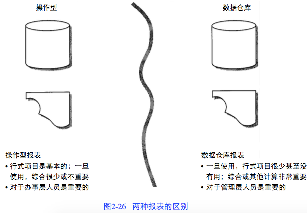

## 2.13 各种环境中的操作型窗口
- 在数据仓库中,发现5~10年这样漫长的档案数据是很常见的。p44
- 在操作型环境中发现的档案数据的时间范围称之为数据的“操作型窗口”,它一般不很长,只能从一个星期到两年。p44

## 2.14 数据仓库中的错误数据
- 更新错误条目 p45
- 加入修正条目
- 重新设置正确值

# 第3章 设计数据仓库
## 3.1 从操作型数据开始
- 一致性处理 p48
- 编码不一致 p48
- 原有数据在不同的DBMS下可能以多种不同格式存储 p49
- 从操作型环境到数据仓库有三种装载工作要做：p49
  - 装载档案数据
  - 装载在操作型系统中的现有数据
  - 将上次数据仓库刷新以来在操作型环境中不断发生的变化（更新）从操作型环境中装载到数据仓库中

## 3.2 数据/过程模型与体系结构化环境
- 过程模型：仅仅适用于操作型环境 p51
- 数据模型：既可用于操作型环境，又可用于数据仓库环境 p51
- 过程模型一般（整个或部分地）包括一下内容：p51
  - 功能分解
  - 第零层上下文图
  - 数据流图
  - 结构图
  - 状态转换图
  - HIPO图
  - 伪代码

## 3.3 数据仓库与数据模型
- 稳定性分析 p52
- 有三个层次的数据建模:高层建模(ERD,实体关系层),中间层建模(DIS,数据项集),底层建模(物理层)。 p54

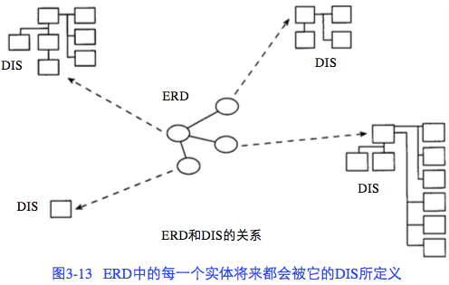

- 图3-14显示了中间层数据模型的构造。这里有四个基本的构造:
  - 初始数据组。
  - 二次数据组。
  - 连接件,表示主要主题域间的数据关系。
  - 数据“类型”。
  - 物理数据模型：关系表 p59

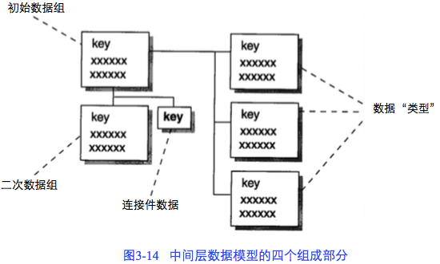

## 3.4 数据模型和反复开发
迭代开发方式 p60

## 3.5 规范化/反规范化
- 将这些表物理合并，使得I/O代价最小化 p62
- 创建数据数组 p62
- 有意引入冗余数据 p63
- 当访问概率有很大悬殊时,要对数据做进一步分离 p64
- 在物理数据库的设计中引入导出(即计算出的)数据可以减少I/O p64
- 创造性索引或创造性概要文件 p65
- 参照完整性 p65

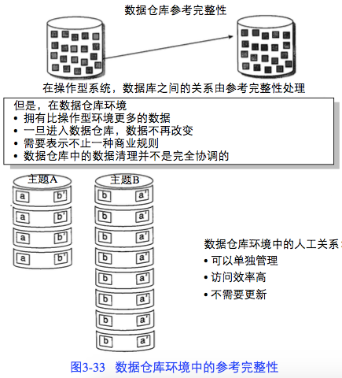

- 数据仓库中的快照 p65

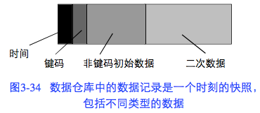

- 由事件触发的快照有四个基本组成部分：
  - 关键字
  - 时间单元
  - 只与关键字相关的主要数据
  - 作为快照过程的一部分而被捕获但与主要数据和关键字都无直接关系的二级数据
- 人工关系 p67

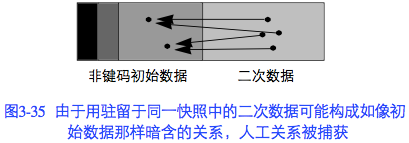

## 3.6 元数据
典型地,元数据记录: p67

- 程序员所知的数据结构。
- DSS分析员所知的数据结构。
- 数据仓库的源数据。
- 数据加入数据仓库时的转换。
- 数据模型。
- 数据模型和数据仓库的关系。
- 抽取数据的历史记录。

参照数据 p68

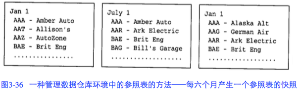

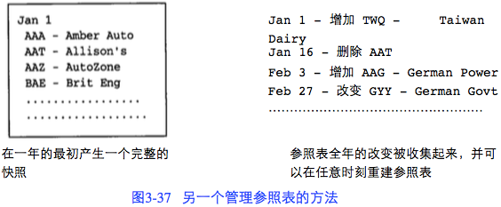

## 3.7 数据周期-时间间隔
数据周期：所谓数据周期是指从操作型环境数据发生改变起,到这个变化反映到数据仓库中所用的时间。p69

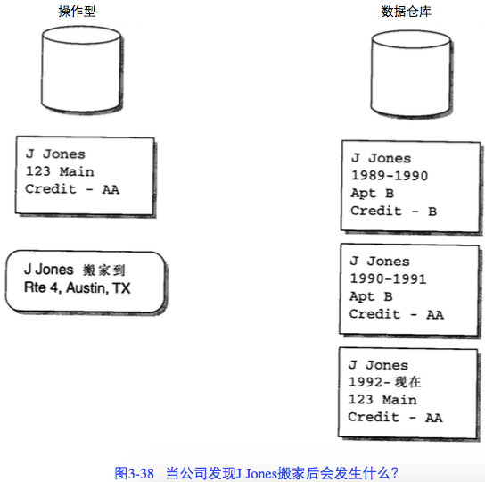

## 3.8 转换和集成的复杂性
下面就是所要 完成的某些功能。 p71

- 从原始操作型环境到数据仓库环境的数据抽取需要实现技术上的变化。
- 从操作型环境中选择数据是非常复杂的。为了判定一个记录是否可进行抽取处理,往 往需要完成对多个文件中其他记录的多种协调查询,需要进行键码读取,连接逻辑等。
- 操作型环境中的输入键码在输出到数据仓库之前往往需要重新建立。
- 数据被重新格式化。举一个简单例子:有关日期的输入数据格式是YY/MM/DD,当它被写入输出文件时,需要转化为DD/MM/YY的格式。
- 数据将被清理。在某些情况下,为了保证输入数据的正确性,需要一个简单的算法。 在复杂情况下,需要调用人工智能的一些子程序把输入数据清理为可接受的输出形式。
- 存在多个输入数据源。
- 当存在多个输入文件时,进行文件合并之前要首先进行键码解析。这意味着如果不同 的输入文件使用不同的键码结构。那么,完成文件合并的程序必须提供键码解析功能。
- 当存在多个输入文件时,这些文件的顺序可能不相同甚至互不相容。
- 可能会产生多个输出结果。同一个数据仓库的创建程序会产生不同概括层次之上的结果。
- 需要提供缺省值。
- 对抽取选择输入的数据,其效率通常是一个问题。
- 经常需要进行数据的汇总。
- 在数据元素从操作型环境到数据仓库的数据转移过程中,对数据元素的重命名应该进行跟踪。
- 必须被读的输入的记录有着不常见的或不标准的格式。下面列出了必须读的各种输入类型:
  - 固定长度的记录
  - 不定长记录
  - 出现不定
  - 重复出现
  - 必须进行转换。
- 这一点也许是最糟糕的:建立在旧的传统程序逻辑中的数据之间的关系必须被理解、被解开,这样,这些文件才能被用来作为输入。而这些关系常常是深奥难懂的,没有可供参考的文档资料。
- 必须进行数据格式的转换。EBCDIC到ASCII的转换(或反过来)必须进行。
- 必须考虑到进行大容量输入的问题。
- 数据仓库的设计必须符合企业数据模型。
- 数据仓库反映的是对信息的历史需求,而操作型环境是体现对信息目前的需求。
- 数据仓库着眼于企业的信息化需求,而操作型环境则着眼于精确到秒的企业日常事务需求。
- 必须考虑到新创建的将要传入数据仓库的输出文件的传输。有些情况下这是很容易做到的;在另一些情况下就不那么容易了,尤其是跨操作系统的情况。

## 3.9 数据仓库记录的触发
p73

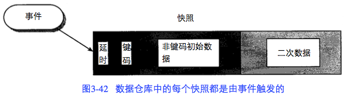

## 3.10 概要记录
p74

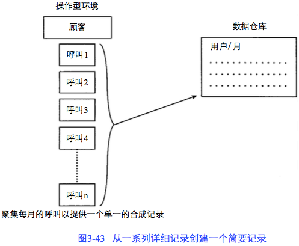

## 3.11 管理大量数据
p75

- 首先，只要进行了数据聚集，就会丢失一些细节数据。有时，丢失细节数据并不一定是件坏事。
- 在建立概要记录的同时建立历史细节的备用层。

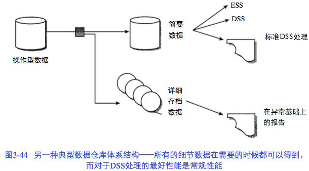

## 3.12 创建多个概要记录
当概要记录放在操作型数据存储区（Operational Data Store，ODS），可以以OLTP的方式存取。p76

## 3.13 从数据仓库环境到操作型环境
p76

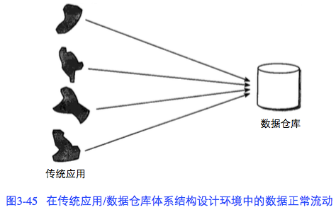

也可以存在数据“回流”。

## 3.14 数据仓库数据的直接操作型访问
p77

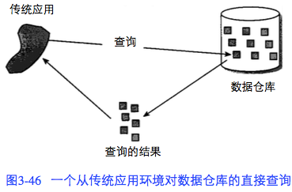

有一些严格的、不能让步的限制：
- 从响应时间的角度来讲,这个请求必须能够忍受冗长的响应时间。它可能在经过24个小时后才被响应,这意味着请求数据仓库数据的操作处理并不具有在线特性。
- 所请求的数据量必须是最小量的。数据的传输是以字节计的,而不是兆字节或千兆字节。
- 管理数据仓库所用到的技术必须与管理操作型环境所用到的技术一致,如容量、协议等。
- 从数据仓库取得的准备传输到操作型环境的数据必须不做或做最小的格式化。

## 3.15 数据仓库数据的间接访问
航班公司的佣金计算系统 p78

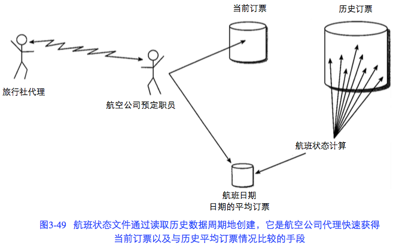

零售个性化系统 p79

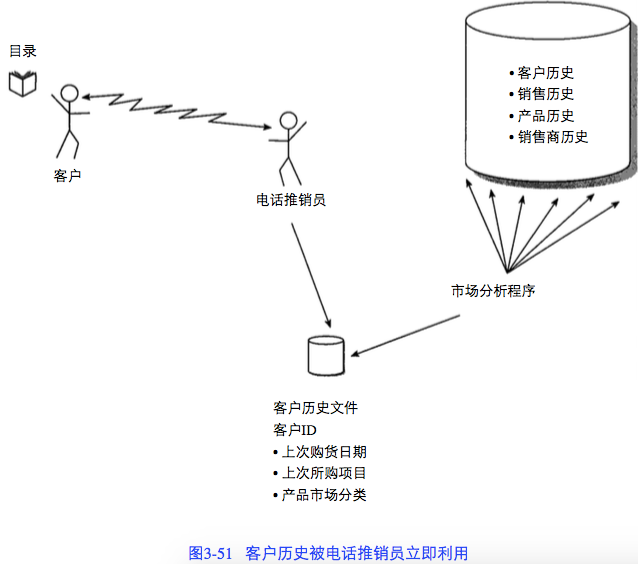

信用审核 p81

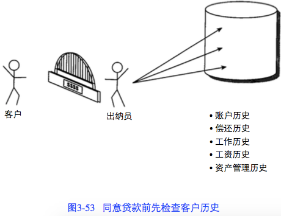

## 3.16 数据仓库数据的间接使用
下面是间接使用数据仓库数据时应考虑的因素。p82

- 分析程序:
  - 拥有许多人工智能的特征。
  - 可以运行在任何可用的数据仓库中。
  - 在后台运行,这样处理时间就不是一个问题(至少不是一个大问题)。
  - 程序的运行与数据仓库发生变化的速度一致。
- 周期性刷新
  - 不是经常进行。
  - 采用一种替代模式操作。
  - 从支持数据仓库的技术传送数据到支持操作型环境的技术。
- 联机预分析数据文件
  - 每个数据单元仅仅包括少量的数据。
  - 总体上可以包含大量的数据(因为可以有很多的数据单元)。
  - 准确地包含了联机处理人员所需要的东西。
  - 不被修改,但是定期全部刷新。
  - 是联机高性能环境的一部分。
  - 访问效率高。
  - 可以访问单个数据单元,而不是以块的形式访问数据。

## 3.17 星形连接
数据集市 p83
- 数据集市很大程度上是根据需求来形成的，这与数据仓库不同。
- 首先要对自数据集市上进行的处理的需求有很多了解。

数据仓库 p83
- 数据仓库是为一个非常大的群体服务的，正因为如此，数据仓库对于任何一个需求集合而言，性能和便捷性都不是最优的。

星形连接 p83
- 用来管理载入数据集市中某个实体的大量数据的设计结构。
- 行星连接中央的“订单”称作“事实表”。
- 周围的其他实体（“零件”、“日期”、“供应商”和“发货”）称作“维表”。

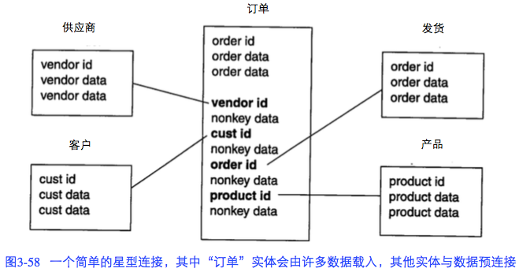

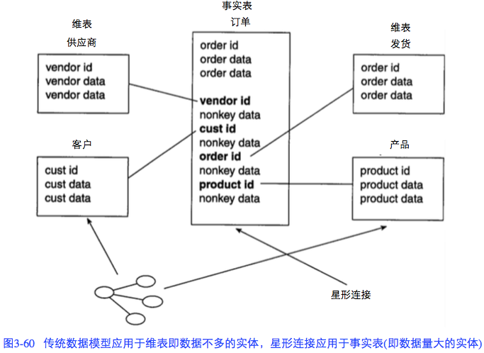

- 文本数据常常出现在维表中，数值数据常出现在事实表中。p84
- 通过预连接数据和建立有选择的数据冗余，设计者大大简化和调整访问和分析的数据，这正是数据集市所需要的。p84
- 数据仓库中的数据是粒度化的数据集市中的数据是紧凑和综合的。数据必须周期性地从数据仓库移到数据集市。p85

## 3.18 支持操作型数据存储
操作型数据存储（ODS）有四类：

1. 从操作型环境到ODS的数据更新是同步进行的。
2. 操作型环境与ODS的数据更新之间有2-3个小时的间隔。
3. 操作型环境与ODS的数据更新的同步是在夜间完成的。
4. 从数据仓库到这类ODS的更新是不预先规化的。

## 3.19 需求和Zachman框架
p87

1. 数据仓库不是由处理需求建造成的，而是根据企业需求而设计的。
1. 聚集和组织企业需求的最好的办法之一是叫做Zachman框架的方法。

# 第4章 数据仓库中的粒度
## 4.1 粗略估算
p90

确定合适的粒度级的起点,是粗略估算数据仓库中将来的数据行数和所需DASD(直接存取存储设备)数。

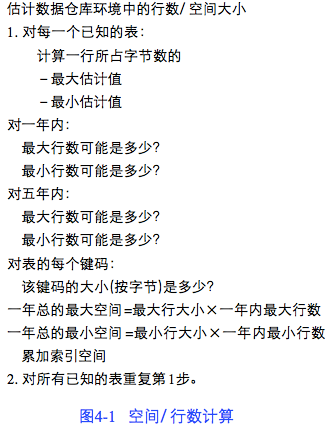

- 接下来,估计一年内表中的最少行数和最多行数。
- 估计完一年内数据仓库中数据单位的数量(用上下限推测的方法),就用同样的方法对五年内的数据进行估计。
- 粗略数据估计完后,就要计算一下索引数据所占的空间。
- 计算完索引之后，考虑备份和恢复需要多少空间。

## 4.2 规则过程的输入
p91

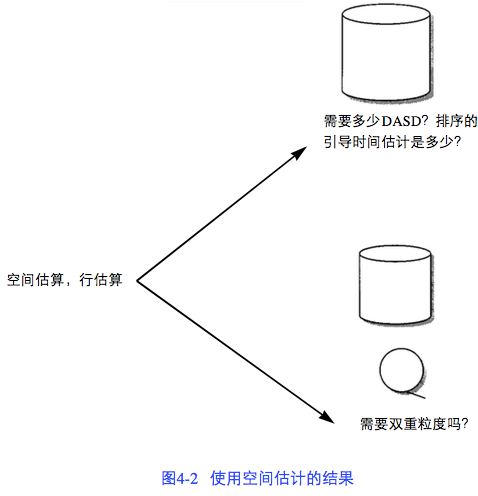

## 4.3 溢出存储器中的数据 
p92

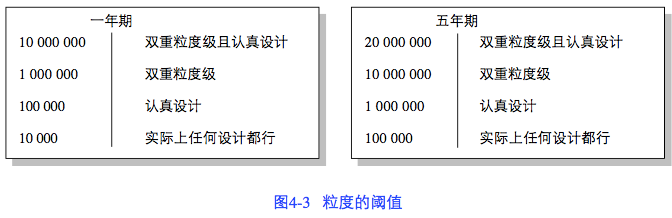

溢出存储器 p93
- 睡眠数据或不活跃数据
- 将数据存储在海量备用存储器或近线存储器中比存储在磁盘存储器中要便宜得多
- 磁盘存储器和近线存储器之间的数据移动是通过一种称为跨介质存储管理器（CMSM）的软件来控制的。
- 在许多情况下，海量备用存储器/近线存储器是作为数据仓库的溢出存储器来使用的。
- 存放不常用数据的溢出存储器是数据仓库的一个重要组成部分。
- 溢出存储器可以建立在任意多种的存储介质上。一些常见的介质有光存储器、磁带（“近线存储器”）和廉价磁盘。

## 4.4 确定粒度级别
p95

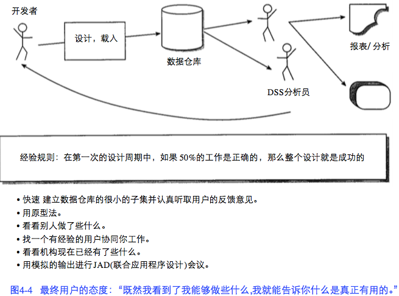

## 4.5 一些反馈循环技巧
p96

我们可以用以下的一些技巧来使反馈循环成为一个和谐的循环:

- 用很小而很快的步伐建立数据仓库最初的几个部分,仔细聆听最终用户的意见。随时 准备做快速的调整。
- 如果可以使用原型工具的话应用原型法,并使用从原型中收集的观察结果而使反馈循 环起作用。
- 看看别人是怎样确定他们的粒度级别,学习一下他们的经验。
- 与一个对整个过程了解的有经验的用户一起进行反馈的处理。不论什么时候都让你的 用户在暗中作为反馈循环的动力。
- 看看本机构现在有什么系统正在运转。
- 进行联合应用程序设计(JAD)会议并模拟其输出以得到想要的反馈。

有好多方法用来提高数据的粒度,如以下所列:

- 当源数据置入数据仓库时,对它进行汇总。
- 当源数据置入数据仓库时,对它求平均或进行计算。
- 把最大/最小的设定值置入数据仓库。
- 只把显然需要的数据置入数据仓库。
- 用条件逻辑选取记录的一个子集置入数据仓库。

## 4.7 填充数据集市
p102

选择数据仓库中的数据粒度的另一个重要的考虑因素是理解数据集市将会需要的数据粒度。填充数据集市是数据仓库的工作。不同的数据集市需要不同地看待数据。数据集市看待数据的方式之一是通过粒度的形式。

存在于数据仓库中的数据粒度必须是任何数据集市所需要的数据中的最小粒度。

# 第5章 数据仓库和技术
## 5.1 管理大量数据
p103

## 5.2 管理多种介质 
p104

应用在数据仓库中的基本技术应该能够解决多种存储介质的问题：

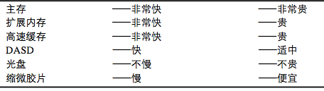

## 5.3 索引与监控数据 p104
数据仓库的灵魂就在于灵活性和对数据的不可预测的访问。有很多理由要监视数据仓库中的数据,包括:

- 决定是否应数据重组。
- 决定索引是否建立得不恰当。
- 决定是否有太多数据溢出。
- 决定数据的统计成份。
- 决定剩余的可用空间。

## 5.4 多种技术的接口 p105
不同技术的接口要求考虑如下几个因素：

- 数据能否很容易地从一个DBMS传送到另一个DBMS？
- 数据能否很容易地从一个操作系统传送到另一个操作系统？
- 在传送过程中数据是否需要改变它的基本格式（EBCDIC，ASCII等）？
- 数据多维空间的处理通道能否很容易地实现？
- 能否选择增量数据传送，比如变化数据捕获（CDC），而不是传送整个表？
- 数据在传送到其他的环境中时是否有内容丢失？

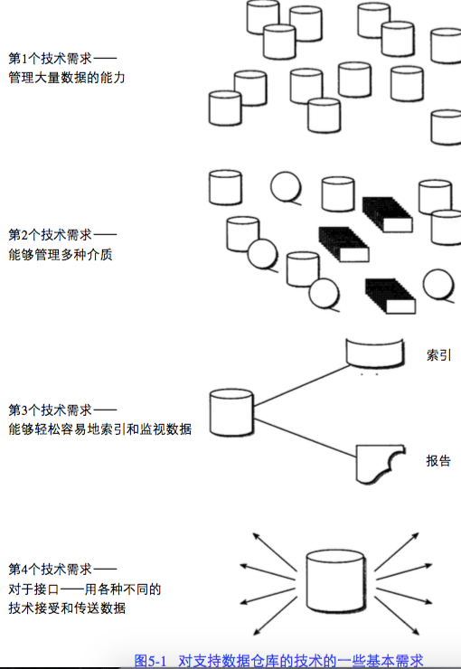

## 5.5 程序员/设计者对数据存放位置的控制
p105

## 5.6 数据的并行存储和管理
p105

数据仓库的语言接口应该包括以下几个方面：

- 数据仓库的表结构
- 数据仓库的表属性
- 数据仓库的元数据（记录系统）
- 从记录系统到数据仓库的映射
- 数据模型的说明
- 抽取日志
- 访问数据的公用例行程序
- 数据的定义/描述
- 数据单元之间的关系

## 5.7 语言接口
p107

典型的数据仓库语言接口需要:

- 能够一次访问一组数据。
- 能够一次访问一条记录。
- 特别要保证,为了满足某个访问要求能够支持一个或多个索引。
- 有SQL接口。
- 能够插入、删除、更新数据。

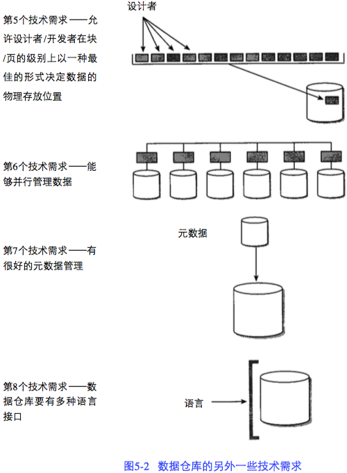

## 5.8 数据的有效装载
p107

通过一个语言接口一次一条记录或者一起使用一个程序一次全都装入。

## 5.9 有效利用索引
p108

有多种方法能够高效地访问索引:

- 用位映像的方法。
- 用多级索引。
- 将部分或全部索引装入内存。
- 当被索引的数据的次序允许压缩时对索引项进行压缩。
- 创建选择索引或范围索引。

## 5.10 数据压缩
p108

## 5.11 复合主键
p109

## 5.12 变长数据
p109

## 5.13 加锁管理
p110

## 5.14 只涉及索引的处理
p110

## 5.15 快速恢复
p110

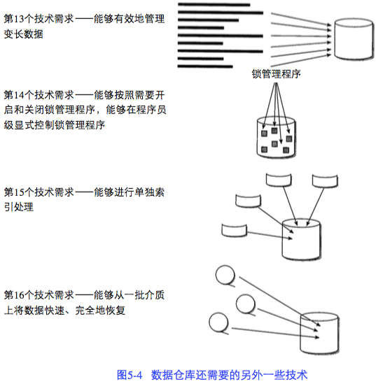

## 5.16 其他的技术特征 p110
一些特征包括:

- 事务集成性。
- 高速缓存。
- 行/页级的锁定。
- 参照完整性。
- 数据视图。

## 5.17 DBMS类型和数据仓库 p111
- 传统数据库环境和数据仓库环境的另一个重要的区别在于,数据仓库中有更多的数据量,比一般的操作型环境中要多得多。
- 数据仓库要管理大量的数据,是因为它们:
  - 包括粒状的、原子的细节。
  - 包括历史信息。
  - 包括细节和汇总数据。
- 传统的通用数据库管理系统和数据仓库专用数据库管理系统的第一个也是最重要的区别 在于数据的更新。前者必须适合于记录级的更新,并将其作为操作的一个标准部分。由于记录级的数据更新是一通用DBMS的常规特征,所以它必须提供以下功能:
  - 锁定
  - 提交
  - 检测点
  - 日志处理
  - 死锁处理
  - 回退
- 通用DBMS和数据仓库专用DBMS之间的第二个主要区别是基本的数据管理。对于通用的DBMS来说,对数据在块级上的管理要包括一些附加的空间,这些空间用于以后更新和插入数据时块的扩张。典型情况下,这些空间是些自由空间。对于通用DBMS,自由空间可能要占到50%。对于数据仓库专用的DBMS,根本就不需要自由空间,因为数据一旦装入到数据仓库后是不需要更新的,也就没有扩展物理块的需要。
- 索引的区别：通用DBMS环境限制在有限数量的索引,有这个限制是因为当有数据的更新和插入时,索引本身需要数据管理。然而,在数据仓库环境中,没有数据的更新,却有必要对数据的访问进行优化,也有多种索引的必要(和机会)。事实上,数据仓库相对于操作型的、面向更新的数据库来说,能够应用更健壮和更完善的索引结构。
- 数据能够在物理上进行优化以便于事务访问和DSS访问。通用的DBMS优化数据是为了事务的访问,而数据仓库专用的DBMS物理上优化数据是为了便于决策支持系统的访问和分析。

## 5.18 改变DBMS技术
p112

## 5.19 多维DBMS和数据仓库
p112

- 多维数据库管理系统处理（OLAP处理）
- 数据仓库中的细节数据为多维DBMS提供了非常稳健和方便的数据源。
- 数据仓库和多维DBMS的区别：
  - 数据仓库有大量的数据；多维DBMS中的数据至少要少一个数量级
数据仓库只适于少量的灵活访问；而多维DBMS适合大量的不可预知的数据访问和分析
  - 数据仓库内存储了很长时间范围内的数据（从5年到10年）；而多维DBMS中只存储较短时间范围内的数据
  - 数据仓库只允许分析人员以受限的形式访问数据，而多维DBMS允许自由的访问
  - 多维DBMS和数据仓库有着互补关系，而并不是数据仓库建立在多维DBMS之上的关系

多维DBMS有不同的特色。一些多维DBMS建立在关系模型上,而另一些多维DBMS建立在能优化“切片和分块”数据的基础上,在这里数据可以被认为存储在多维立方体内。后者的技术基础可以称为“立方体基础”。

两种技术基础都支持多维DBMS数据集市,但这两种技术基础之间存在着一些差异:

多维DBMS数据集市的关系型基础

- 优点: 
  - 能支持大量数据。
  - 能支持数据的动态连接。
  - 己被证实是有效的技术。
  - 能够支持通用的数据更新处理。
  - 如果对数据的使用模型不清楚的话,关系型结构与其他任何结构一样好
- 弱点:
  - 性能上不是最佳的。
  - 不能够单纯对访问处理进行优化。

多维DBMS数据集市的“立方体”基础

- 优点:
  - 对于DSS处理性能上是优化的。
  - 能够对数据的非常快访问进行优化。
  - 如果已知数据访问的模式,则数据的结构可以优化。
  - 能够很轻松地进行“切片和分块”。
  - 可以用多种方法检测。
- 弱点:
  - 几乎不能处理像标准的关系模型那么多的数据。
  - 不支持通用的更新处理。
  - 装入的时间很长。
  - 如果对路径的访问不被数据设计所支持的话,这种结构就显得不灵活。
  - 对数据的动态连接的支持是有问题的。

多维DBMS(OLAP)是一种技术,而数据仓库是一种体系结构的基础。这两者之间存在着互补的和共生的关系。

## 5.20 在多种存储介质上构建数据仓库
p117

当大量数据分布在多种存储介质上时，经常会创建双重环境。一个处理环境是可以进行在线的、交互式处理的DASD环境。另一个处理环境通常是本质上具有不同特征的磁带或其他的大容量存储环境。在逻辑上，两种环境结合在一起行程了一个数据仓库。

## 5.21 数据仓库环境中元数据的角色
p117

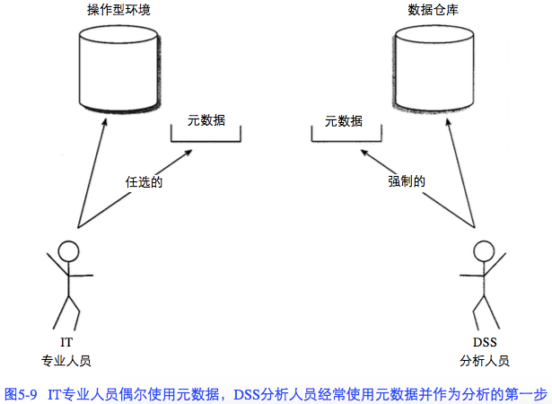

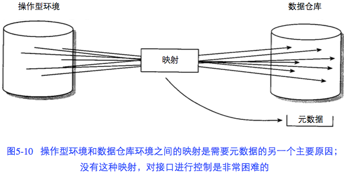

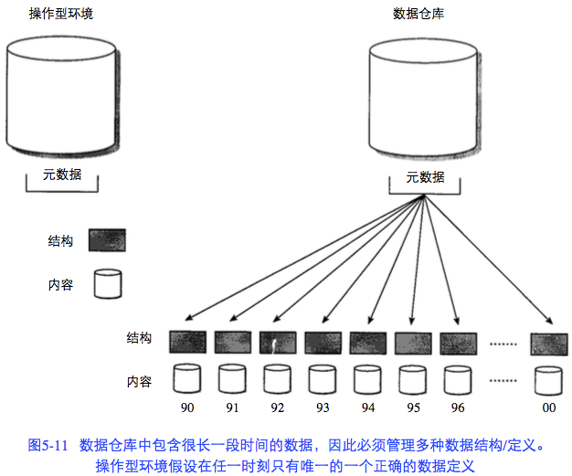

## 5.22 上下文和内容
p119

我们需要管理三个级别的上下文信息:

- 简单上下文信息。
- 复杂上下文信息。
- 外部上下文信息。

简单上下文信息与数据本身的基本结构有关,包括如下一些内容:

- 数据的结构。
- 数据的编码。
- 数据的命名约定。
- 描述数据的度量,如:
  - 数据的多少。
  - 数据增长速度。
  - 数据的哪一部分增长。
  - 数据是怎样被使用的。

复杂上下文信息强调了数据的下面几点:

- 产品定义。
- 市场领域。
- 定价。
- 包装。
- 组织结构。
- 分发。

## 5.23 刷新数据仓库
p121

## 5.24 测试问题
p122

在经典的操作型环境中，设置两个并行环境——一个用于生产，一个用于测试。

在数据仓库领域，很难找到相似的测试环境：

- 数据仓库都是如此之大，公司测试其中的一个就很困难
- 数据仓库的开发生命周期的特征是反复式的

# 第7章 主管信息系统和数据仓库
- 主管信息系统(EIS)对主管开放，提供信息，但不需要真正理解创建这些信息的基本结构。p152
- 主管信息系统(EIS)的典型用途 p152
  - 趋势分析和发现。
  - 关键比例指示器度量和跟踪。
  - 向下探察分析。
  - 问题监控。
  - 竞争分析。
- 到哪里取数据 p158

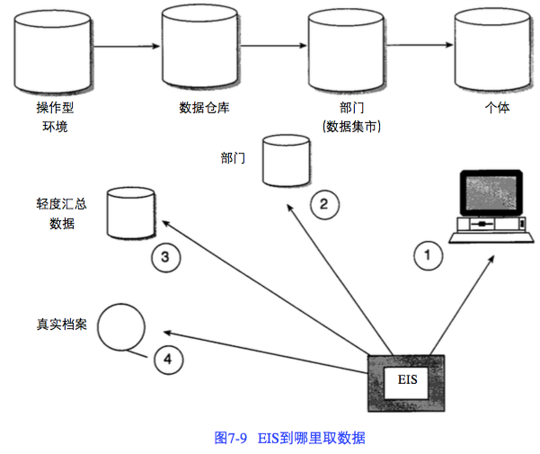

# 第8章 外部数据与数据仓库
- 外部数据：产生于企业外部系统的数据。p163
- 数据仓库中的外部数据 p164
  - 外部数据所存在的一个问题是可用频率。
  - 外部数据的第二个问题是外部数据的形式是完全没有规则的。
  - 导致外部数据难以获得的第三个因素是其不可预测性。
  - 最佳的一个途径是将其存储在大容量存储介质如近线存储设备上。使用近线设备，仍然可以访问外部数据而且花费不高。可以对外部数据做扩展索引。
  - 另一种时常有效的处理外部数据的技术是创建两种外部数据的存储形式。一种存储包括所有的外部数据，另一种小得多的存储只包含外部数据的一个子集。
- 元数据和外部数据 p165
  - 元数据是至关重要的，因为在数据仓库环境中正是通过元数据来对外部数据进行注册、访问和控制的。元数据的典型内容是元数据重要性的最好解释：
    - 文件标识符（ID）
    - 进入数据仓库的日期
    - 文件描述
    - 文件来源
    - 文件来源的日期
    - 文件的分类
    - 索引字
    - 清理日期
    - 物理地址引用
    - 文件长度
    - 相关引用
  - 在许多情况下，管理者甚至不看源文件，只看元数据。
  - 与元数据有关的另一种数据类型是通知数据。当数据进入数据仓库和元数据时，要检查谁对该数据感兴趣。一旦发现获得的数据是某人感兴趣的，就向那个人发出通知。
- 存储外部数据 p167

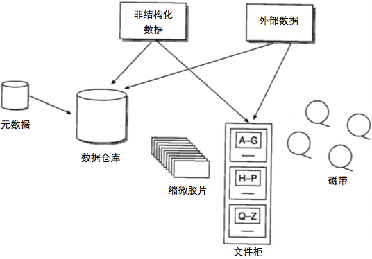

# 第9章 迁移到体系结构化环境
## 9.1 一种迁移方案
- 迁移方案的起点是一个企业数据模型。该数据模型描述了企业的信息需求。企业数据模型（至少）要能标识出如下的内容：p171
  - 企业的主要主题
  - 企业的各个主要主题的定义
  - 各个主要主题之间的关系
  - 更全面地描述各个主要主题的各个关键字和属性分组，包括：
    - 主要主题的属性集
    - 主要主题的关键字集
    - 关键字集和属性集的重复组
    - 各个主要主题域之间的连接
    - 子类关系
- 企业数据模型在高的层面上对企业的信息进行标识。从企业数据模型可以建立较低层次的模型。底层模型对企业数据模型概略描述的信息进行详细地描述。这个中间层模型是根据企业数据模型所描述的各个主题域建立起来的，每次只建立一个主题域，而不是一次将所有的主题域都建立起来，否则将会耗费大量的时间。p172
- 企业数据模型和中间层模型建立好以后，下一步工作就是定义记录系统，记录系统是由企业现有系统来定义的。定义记录系统只不过是要找出企业所具有的“最好的”数据，这些数据存储在传统操作型环境中，或者在基于Web的电子商务环境中。p173

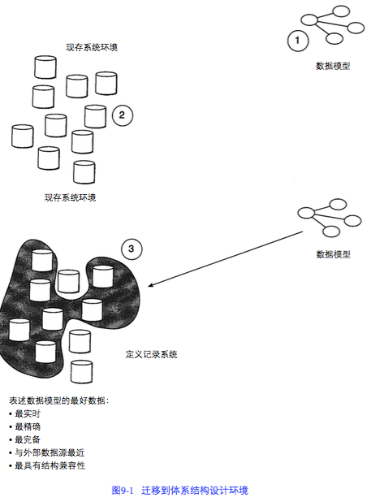

- 在定义好记录系统并找出了将数据迁移到数据仓库所涉及的技术挑战之后，下一步就是设计数据仓库。要做的主要工作：p173
  - 必须清除所有的纯操作型数据
  - 将参照完整性关系转换成人工关系
  - 将经常需要用到的导出数据加入到设计中
  - 为了适应以下各项要求，需要对数据的结构进行调整：
    - 增加数据阵列
    - 增加数据冗余
    - 在合适的情况下进一步分离数据
    - 在合适的时候合并数据表
- 需要做数据的稳定性分析。在稳定性分析过程中，将时常变动的数据和十分稳定的数据分开。
- 一旦设计数据仓库，就必须按主题域进行组织。p174
  - 典型的主题域有：
    - 顾客
    - 产品
    - 销售
    - 账目
    - 活动
    - 运货
  - 在主题域内，有许多独立的数据表，每张表都通过一个公用关键字连接。例如，所有的客户表都有CUSTOMER属性作为关键字。
- 数据仓库设计好以后，下一步就是设计和建立（操作型环境中的）记录系统和数据仓库之间的接口，这些接口有规律地将数据装载到数据仓库。p175
  - 初看起来，这些接口似乎仅仅是一个数据抽取的过程。数据抽取过程确实是在此进行的，但是，在接口中还包括了许多其他工作：
    - 来自操作型的、面向应用的环境的数据的集成
    - 数据时间基准的变更
    - 数据压缩
    - 对现有系统环境的有效扫描
  - 建立一个数据仓库所需要的大多数开发资源都花费在这点上了。将建立数据仓库所需的80%的精力都花费在这个地方，是正常的。

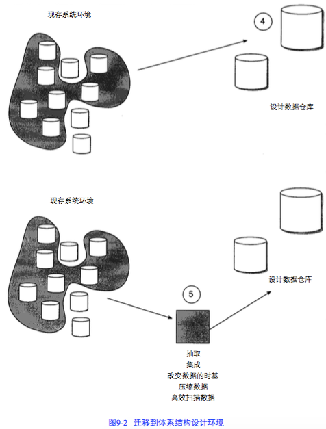

- 一旦设计并建立了接口程序，下一步工作就是开始载入第一个主题域。p175
  - 最终用户的操作模式可以称为“发现模式”。最初，最终用户不知道他们的需求是什么，直到他们看到系统所能提供的各种可能性之后，才会提出相应的要求。一开始就将大量的数据载入到数据仓库中很危险，数据载入以后一般都需要对数据进行调整。
  - 载入和反馈过程会持续一段很长的时间（没有期限）。
  - 通常数据仓库中数据的刷新频率不应超过每24小时一次。在装载数据的时候，确保数据起码有24小时的时延，数据仓库的开发者就能将数据仓库蜕变为操作型环境的可能性降低到最小程度。通过严格地执行这个延时操作，数据仓库服务于企业的DSS需要，而不是日常业务运作型需求。

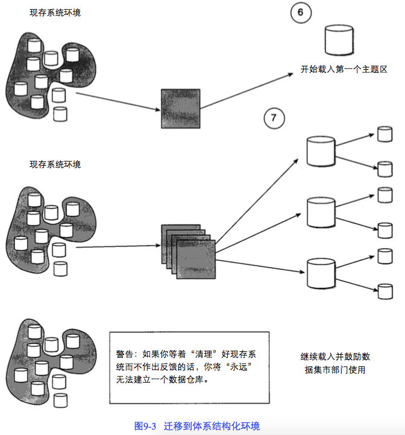

## 9.2 反馈循环
数据仓库长期开发成功的关键是数据体系结构设计人员和DSS分析人员之间的反馈循环。p176

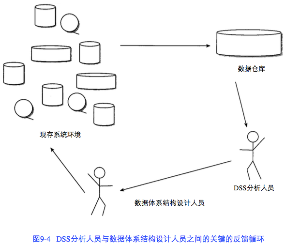

关于这个反馈循环，有几个问题对于数据仓库环境的成功来说是至关重要的：

- DSS分析人员要遵循：“给我想要的东西，然后我就能告诉你我真正想要的东西”的工作模式。在DSS分析人员知道数据仓库所能提供的东西以前，试图从他们那里获取需求信息是不可能的。
- 反馈循环的周期越短，越有可能成功。DSS分析人员一旦提出需求要对数据仓库做出修改以后，这些更改需要尽快地加以实现。
- 需要调整的数据量越大，反馈循环所需要的周期就越长。

## 9.4 方法和迁移
构造数据仓库的方法称为螺旋式开发方法。p179

## 9.5 数据驱动的开发方法
数据仓库环境是按照反复开发方法建立起来的。在这种方法中，先建立系统的一小部分，然后再建另一小部分，这样一直下去。开发过程按照相同的路径反复进行，使得这种方法看上去总是在重复自身似的。这种不变的反复过程称为螺旋式开发。p181

螺旋式开发过程不同于传统的、可以称为瀑布式的方法。

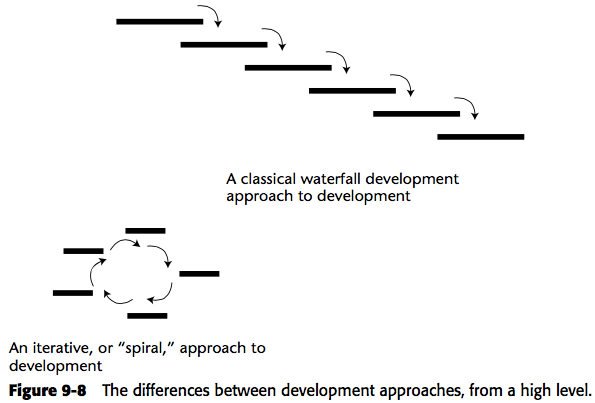

