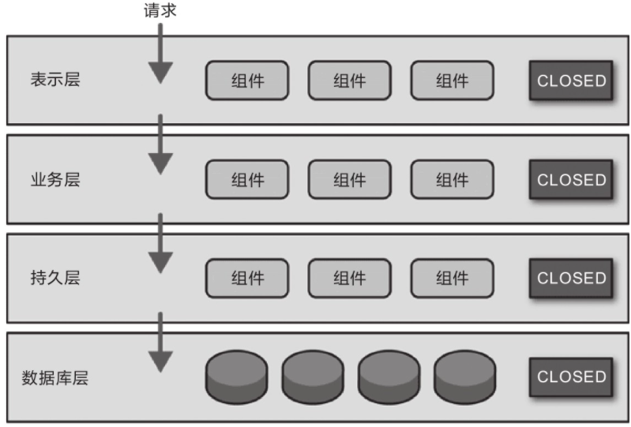
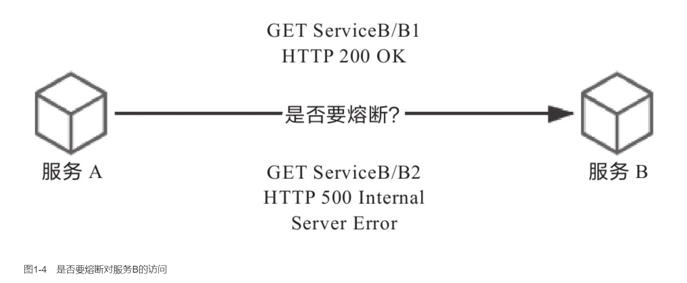
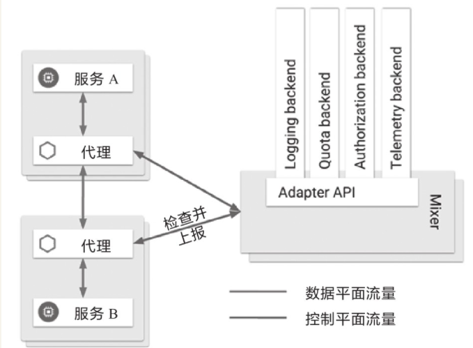
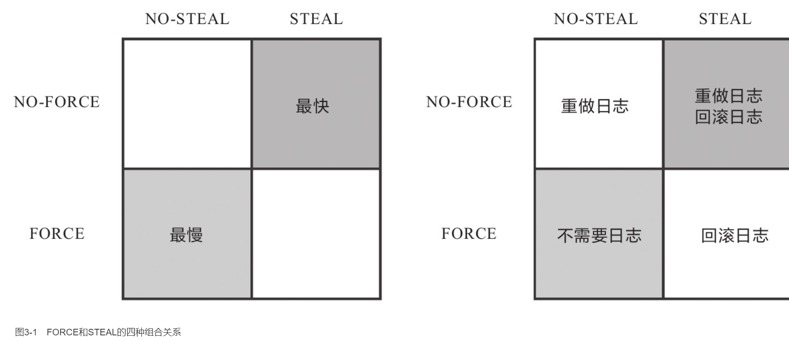
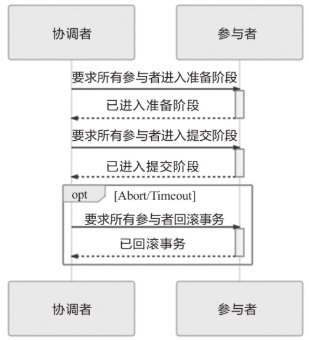
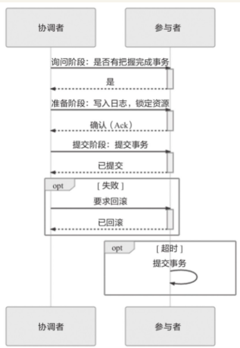

    作者: 周志明
    出版社: 机械工业出版社
    出品方: 机械工业出版社
    副标题: 构建可靠的大型分布式系统
    出版年: 2021-6-30
    页数: 413
    定价: 99.00
    装帧: 平装
    ISBN: 9787111683919

[豆瓣链接](https://book.douban.com/subject/35492898/)

- [第一部分 演进中的架构](#第一部分-演进中的架构)
- [第1章 服务架构演进史](#第1章-服务架构演进史)
  - [1.1 原始分布式时代](#11-原始分布式时代)
  - [1.2 单体系统时代](#12-单体系统时代)
  - [1.3 SOA时代](#13-soa时代)
  - [1.4 微服务时代](#14-微服务时代)
  - [1.5 后微服务时代](#15-后微服务时代)
  - [1.6 无服务时代](#16-无服务时代)
- [第二部分 架构师的视角](#第二部分-架构师的视角)
- [第2章 访问远程服务](#第2章-访问远程服务)
  - [2.1 远程服务调用](#21-远程服务调用)
    - [2.1.1 进程间通信](#211-进程间通信)
    - [2.1.2 通信的成本](#212-通信的成本)
    - [2.1.3 三个基本问题](#213-三个基本问题)
    - [2.1.4 统一的RPC](#214-统一的rpc)
    - [2.1.5 分裂的RPC](#215-分裂的rpc)
  - [2.2 REST设计风格](#22-rest设计风格)
    - [2.2.1 理解REST](#221-理解rest)
    - [2.2.2 RESTful的系统](#222-restful的系统)
    - [2.2.3 RMM](#223-rmm)
    - [2.2.4 不足与争议](#224-不足与争议)
- [第3章 事务处理](#第3章-事务处理)
  - [3.1 本地事务](#31-本地事务)
    - [3.1.1 实现原子性和持久性](#311-实现原子性和持久性)
    - [3.1.2 实现隔离性](#312-实现隔离性)
  - [3.2 全局事务](#32-全局事务)
  - [3.3 共享事务](#33-共享事务)
  - [3.4 分布式事务](#34-分布式事务)
    - [3.4.1 CAP与ACID](#341-cap与acid)

# 第一部分 演进中的架构
# 第1章 服务架构演进史
## 1.1 原始分布式时代
为了避免UNIX系统的版本战争在分布式领域中重演，负责制定UNIX系统技术标准的“开放软件基金会”（Open Software Foundation，OSF，也即后来的“国际开放标准组织”）邀请了当时业界主流的计算机厂商一起参与，共同制订了名为“分布式运算环境”（Distributed Computing Environment，DCE）的分布式技术体系。DCE包含一套相对完整的分布式服务组件规范与参考实现，譬如源自NCA的远程服务调用规范（Remote Procedure Call，RPC），当时被称为DCE/RPC，它与后来Sun公司向互联网工程任务组（Internet Engineering Task Force，IETF）提交的基于通用TCP/IP协议的远程服务标准ONC RPC被认为是现代RPC的共同鼻祖；源自AFS的分布式文件系统（Distributed File System，DFS）规范，当时被称为DCE/DFS；源自Kerberos的服务认证规范；还有时间服务、命名与目录服务，甚至现在程序中很常用的`通用唯一识别符（Universally Unique Identifier，UUID）`也是在DCE中发明出来的。

且不说远程方法不能再依靠本地方法那些以内联为代表的传统编译优化来提升速度，光是“远程”二字带来的网络环境下的新问题，譬如，远程的服务在哪里（服务发现），有多少个（负载均衡），网络出现分区、超时或者服务出错了怎么办（熔断、隔离、降级），方法的参数与返回结果如何表示（序列化协议），信息如何传输（传输协议），服务权限如何管理（认证、授权），如何保证通信安全（网络安全层），如何令调用不同机器的服务返回相同的结果（分布式数据一致性）等一系列问题，全都需要设计者耗费大量精力。

对DCE的研究是计算机科学第一次对分布式有组织领导、有标准可循、有巨大投入的尝试，但无论是DCE还是稍后出现的CORBA，从结果来看，都不能称得上成功，因为将一个系统拆分到不同的机器中运行，为解决这样做带来的服务发现、跟踪、通信、容错、隔离、配置、传输、数据一致性和编码复杂度等方面的问题所付出的代价已远远超过了分布式所取得的收益。

## 1.2 单体系统时代
对于小型系统，单台机器就足以支撑其良好运行的系统，不仅易于开发、测试、部署，且由于系统中各个功能、模块、方法的调用过程都是进程内调用，不会发生`进程间通信（Inter-Process Communication，IPC）`，因此连运行效率也是最高的。单体系统的不足，必须在软件的性能需求超过了单机、软件的开发人员规模明显超过了`“2 Pizza Team”`范畴的前提下才有讨论的价值。

从纵向角度来看，`分层架构（Layered Architecture）`已是现在所有信息系统建设中普遍认可、采用的软件设计方法，无论是单体还是微服务，抑或是其他架构风格，都会对代码进行纵向层次划分，收到的外部请求在各层之间以不同形式的数据结构进行流转传递，触及最末端的数据库后按相反的顺序回馈响应。



从横向角度来看，单体架构也支持按照技术、功能、职责等维度，将软件拆分为各种模块，以便重用和管理代码。单体系统并不意味着只能有一个整体的程序封装形式，如果需要，它完全可以由多个JAR、WAR、DLL、Assembly或者其他模块格式来构成。即使是从横向扩展（Scale Horizontally）的角度来衡量，在负载均衡器之后同时部署若干个相同的单体系统副本，以达到分摊流量压力的效果，也是非常常见的需求。

如果说共享同一进程获得简单、高效的代价是同时损失了各个功能模块的自治与隔离能力，那这两者孰轻孰重呢？这个问题的潜台词似乎是在比较微服务、单体架构哪种更好用、更优秀。

今天以微服务取代单体系统成为潮流趋势的根本原因，单体系统很难兼容“Phoenix”的特性。这种架构风格潜在的要求是希望系统的每一个部件、每一处代码都尽量可靠，尽量不出或少出缺陷。然而战术层面再优秀，也很难弥补战略层面的不足。单体系统靠高质量来保证高可靠性的思路，在小规模软件上还能运作良好，但当系统规模越来越大时，交付一个可靠的单体系统就变得越来越具有挑战性。如本书前言所说，正是随着软件架构演进，构建可靠系统的观念从“追求尽量不出错”到正视“出错是必然”的转变，才是微服务架构得以挑战并逐步取代单体架构的底气所在。

为了允许程序出错，获得自治与隔离的能力，以及实现可以技术异构等目标，是继性能与算力之后，让程序再次选择分布式的理由。

## 1.3 SOA时代
为了对大型的单体系统进行拆分，让每一个子系统都能独立地部署、运行、更新，开发者们尝试过很多种方案，这里列举三种较有代表性的架构模式，具体如下。

- `烟囱式架构（Information Silo Architecture）`：信息烟囱又名信息孤岛（Information Island），使用这种架构的系统也被称为孤岛式信息系统或者烟囱式信息系统。它指的是一种与其他相关信息系统完全没有互操作或者协调工作的设计模式。这样的系统其实并没有什么“架构设计”可言。接着上一节中企业与部门的例子来说，如果两个部门真的完全没有任何交互，就没有什么理由强迫它们必须在同一栋楼里办公。两个不发生交互的信息系统，让它们使用独立的数据库和服务器即可实现拆分，而唯一的问题，也是致命的问题是，企业中真的存在完全没有交互的部门吗？对于两个信息系统来说，哪怕真的毫无业务往来关系，但系统的人员、组织、权限等主数据会是完全独立、没有任何重叠的吗？这样“独立拆分”“老死不相往来”的系统，显然不可能是企业所希望见到的。
- `微内核架构（Microkernel Architecture）`：微内核架构也被称为插件式架构（Plug-in Architecture）。既然在烟囱式架构中，没有业务往来关系的系统也可能需要共享人员、组织、权限等一些公共的主数据，那不妨就将这些主数据，连同其他可能被各子系统用到的公共服务、数据、资源集中到一块，组成一个被所有业务系统共同依赖的核心（Kernel，也称为Core System），具体的业务系统以插件模块（Plug-in Module）的形式存在，这样也可提供可扩展的、灵活的、天然隔离的功能特性，即微内核架构。
  - 微内核架构也有局限性，它假设系统中各个插件模块之间互不认识，且不可预知系统将安装哪些模块，因此这些插件可以访问内核中一些公共的资源，但不会直接交互。可是，无论是企业信息系统还是互联网应用，这一假设在许多场景中并不成立，所以我们必须找到办法，既能拆分出独立的系统，也能让拆分后的子系统之间顺畅地相互通信。
- `事件驱动架构（Event-Driven Architecture）`：为了能让子系统互相通信，一种可行的方案是在子系统之间建立一套事件队列管道（Event Queue），来自系统外部的消息将以事件的形式发送至管道中，各个子系统可以从管道里获取自己感兴趣、能够处理的事件消息，也可以为事件新增或者修改其中的附加信息，甚至可以自己发布一些新的事件到管道队列中去。如此，每一条消息的处理者都是独立的、高度解耦的，但又能与其他处理者（如果存在其他消息处理者的话）通过事件管道进行交互。

SOA的概念最早由Gartner公司在1994年提出，当时的SOA还不具备发展的条件，直至2006年IBM、Oracle、SAP等公司共同成立了OSOA（Open Service Oriented Architecture）联盟，用于联合制定和推进SOA相关行业标准之后，情况才有所变化。2007年，在结构化资讯标准促进组织（Organization for the Advancement of Structured Information Standard，OASIS）的倡议与支持下，OSOA由一个软件厂商组成的松散联盟，转变为一个制定行业标准的国际组织，并联合OASIS共同新成立了Open CSA（Open Composite Service Architecture）组织，这便是SOA的官方管理机构。

软件架构来到SOA时代，其包含的许多概念、思想都已经能在今天的微服务中找到对应的身影了，譬如服务之间的松散耦合、注册、发现、治理，隔离、编排等。这些在微服务中耳熟能详的概念，大多数也是在分布式服务刚被提出时就已经可以预见的困难点。

- “更具体”体现在尽管SOA本身还属于抽象概念，而不是特指某一种具体的技术，但它比单体架构和前面所列举的三种架构模式的操作性更强，已经不能简单视为一种架构风格，而是一套软件设计的基础平台。它拥有领导制定技术标准的组织Open CSA；有清晰的软件设计的指导原则，譬如服务的封装性、自治、松耦合、可重用、可组合、无状态，等等；明确了采用SOAP作为远程调用协议，依靠SOAP协议族（WSDL、UDDI和WS-*协议）来完成服务的发布、发现和治理；利用企业服务总线（Enterprise Service Bus，ESB）的消息管道来实现各个子系统之间的交互，令各服务在ESB的调度下无须相互依赖就能相互通信，实现了服务松耦合，也为以后进一步实施业务流程编排（Business Process Management，BPM）提供了基础；使用服务数据对象（Service Data Object，SDO）来访问和表示数据，使用服务组件架构（Service Component Architecture，SCA）来定义服务封装的形式和服务运行的容器，等等。
- “更系统”指的是SOA的宏大理想，它的终极目标是希望总结出一套自上而下的软件研发方法论，做到企业只需要跟着SOA的思路，就能够一揽子解决掉软件开发过程中的全部问题，譬如该如何挖掘需求、如何将需求分解为业务能力、如何编排已有服务、如何开发/测试/部署新的功能，等等。这些技术问题确实是重点和难点，但也仅仅是其中的一个方面，SOA不仅关注技术，还关注研发过程中涉及的需求、管理、流程和组织。

`SOAP`协议被逐渐边缘化的本质原因：过于严格的规范定义带来过度的复杂性，而构建在SOAP基础之上的ESB、BPM、SCA、SDO等诸多上层建筑，进一步加剧了这种复杂性。

## 1.4 微服务时代
`“微服务”`这个技术名词最早在2005年就已经被提出，由Peter Rodgers博士在2005年的云计算博览会（Web Services Edge 2005）上首次使用，当时的说法是“Micro-Web-Service”，指的是一种专注于单一职责的、与语言无关的细粒度Web服务（Granular Web Service）。

>微服务是一种软件开发技术，是SOA的一种变体。

Thoughtworks首席咨询师James Lewis做了题为“Microservices-Java,the UNIX Way”的主题演讲，其中提到了单一服务职责、康威定律、自动扩展、领域驱动设计等原则，却只字未提SOA，反而号召应该重拾UNIX的设计哲学（As Well Behaved UNIX Service），这点仿佛与笔者在1.3节所说的“初心与自省”遥相呼应。

微服务真正崛起是在2014年，从Martin Fowler与James Lewis合写的文章[“Microservices：A Definition of This New Architectural Term”](https://martinfowler.com/articles/microservices.html)中首次了解微服务的。文中列举了微服务的九个核心的业务与技术特征：

- 围绕业务能力构建（Organized around Business Capability）。这里再次强调了康威定律的重要性，有怎样结构、规模、能力的团队，就会产生对应结构、规模、能力的产品。这个结论不是某个团队、某个公司遇到的巧合，而是必然的演化结果。如果本应该归属同一个产品内的功能被划分在不同团队中，必然会产生大量的跨团队沟通协作，而跨越团队边界无论在管理、沟通、工作安排上都有更高昂的成本，因此高效的团队自然会针对其进行改进，当团队、产品磨合稳定之后，团队与产品就会拥有一致的结构。
- 分散治理（Decentralized Governance）。这里是指服务对应的开发团队有直接对服务运行质量负责的责任，也有不受外界干预地掌控服务各个方面的权力，譬如选择与其他服务异构的技术来实现自己的服务。这一点在真正实践时多少存有宽松的处理余地，大多数公司都不会在某一个服务使用Java，另一个服务用Python，再下一个服务用Go，而是通常会用统一的主流语言，乃至统一的技术栈或专有的技术平台。微服务不提倡也并不反对这种“统一”，只要负责提供和维护基础技术栈的团队有被各方依赖的觉悟，有“经常被凌晨3点的闹钟吵醒”的心理准备就好。微服务更加强调的是在确实需要技术异构时，应能够有选择“不统一”的权利，譬如不应该强迫Node.js去开发报表页面，要做人工智能训练模型时可以选择Python，等等。
- 通过服务来实现独立自治的组件（Componentization via Service）。之所以强调通过“服务”（Service）而不是“类库”（Library）来构建组件，是因为类库在编译期静态链接到程序中，通过本地调用来提供功能，而服务是进程外组件，通过远程调用来提供功能。前文我们也已经分析过，尽管远程服务有更高昂的调用成本，但这是为组件带来自治与隔离能力的必要代价。
- 产品化思维（Product not Project）。避免把软件研发视作要去完成某种功能，而是视作一种持续改进、提升的过程。譬如，不应该把运维只看作运维团队的事，把开发只看作开发团队的事，团队应该为软件产品的整个生命周期负责，开发者不仅应该知道软件如何开发，还应该知道它如何运作，用户如何反馈，乃至售后支持工作是怎样进行的。注意，这里服务的用户不一定是最终用户，也可能是消费这个服务的另外一个服务。以前在单体架构下，程序的规模决定了无法让全部成员都关注完整的产品，如开发、运维、支持等不同职责的成员只关注自己的工作，但在微服务下，要求开发团队中每个人都具有产品化思维，关心整个产品的全部方面是具有可行性的。
- 数据去中心化（Decentralized Data Management）。微服务明确提倡数据应该按领域分散管理、更新、维护、存储。在单体服务中，一个系统的各个功能模块通常会使用同一个数据库。诚然，中心化的存储天生就更容易避免一致性问题，但是，同一个数据实体在不同服务的视角里，它的抽象形态往往是不同的。譬如，Bookstore应用中的书本，在销售领域中关注的是价格，在仓储领域中关注的是库存数量，在商品展示领域中关注的是书的介绍信息，如果使用中心化存储，所有领域都必须修改和映射到同一个实体之中，这很可能使不同服务相互影响而丧失独立性。尽管在分布式中处理好一致性问题也相当困难，很多时候都没办法使用传统的事务处理来保证，但是两害相权取其轻，即使有一些必要的代价，但仍是值得使用的。
- 强终端弱管道（Smart Endpoint and Dumb Pipe）。弱管道（Dumb Pipe）几乎是直接反对SOAP和ESB的通信机制。ESB可以处理消息的编码加工、业务规则转换等；BPM可以集中编排企业业务服务；SOAP有几十个WS-*协议族在处理事务、一致性、认证授权等一系列工作，这些构建在通信管道上的功能也许对某个系统中的某一部分服务是有必要的，但对于另外更多的服务则是强加进来的负担。如果服务需要上面的额外通信能力，就应该在服务自己的Endpoint上解决，而不是在通信管道上一揽子处理。微服务提倡使用类似于经典UNIX过滤器那样简单直接的通信方式，所以RESTful风格的通信在微服务中会是更合适的选择。
- 容错性设计（Design for Failure）。不再虚幻地追求服务永远稳定，而是接受服务总会出错的现实，要求在微服务的设计中，能够有自动的机制对其依赖的服务进行快速故障检测，在持续出错的时候进行隔离，在服务恢复的时候重新联通。所以“断路器”这类设施，对实际生产环境中的微服务来说并不是可选的外围组件，而是一个必需的支撑点，如果没有容错性设计，系统很容易被一两个服务崩溃所带来的雪崩效应淹没。可靠系统完全可能由会出错的服务组成，这是微服务最大的价值所在，也是本书前言中所说的“凤凰架构”的含义。
- 演进式设计（Evolutionary Design）。容错性设计承认服务会出错，演进式设计则承认服务会被报废淘汰。一个设计良好的服务，应该是能够报废的，而不是期望得到长存永生。假如系统中出现不可更改、无可替代的服务，这并不能说明这个服务多么优秀、多么重要，反而是一种系统设计上脆弱的表现，微服务所追求的自治、隔离，也是反对这种脆弱性的表现。
- 基础设施自动化（Infrastructure Automation）。基础设施自动化，如CI/CD的长足发展，显著减少了构建、发布、运维工作的复杂性。由于微服务架构下运维对象数量是单体架构运维对象数量的数量级倍，使用微服务的团队更加依赖于基础设施的自动化，人工是很难支撑成百上千乃至上万级别的服务的。

## 1.5 后微服务时代
2017年是容器生态发展历史中具有里程碑意义的一年。在这一年，长期作为Docker竞争对手的RKT容器一派的领导者CoreOS宣布放弃自己的容器管理系统Fleet，并将会在未来把所有容器管理的功能移至Kubernetes之上去实现。在这一年，容器管理领域的独角兽Rancher Labs宣布放弃其内置了数年的容器管理系统Cattle，提出“All-in-Kubernetes”战略，把1.x版本就能够支持多种容器编排系统的管理工具Rancher，从2.0版本开始“反向升级”为完全绑定于Kubernetes这一系统。在这一年，Kubernetes的主要竞争者Apache Mesos在9月正式宣布了“Kubernetes on Mesos”集成计划，由竞争关系转为对Kubernetes提供支持，使其能够与Mesos的其他一级框架（如HDFS、Spark和Chronos等）进行集群资源动态共享、分配与隔离。在这一年，Kubernetes的最大竞争者Docker Swarm的母公司Docker，终于在10月被迫宣布Docker要同时支持Swarm与Kubernetes两套容器管理系统，也即在事实上承认了Kubernetes的统治地位。这场已经持续了三年时间，以Docker Swarm、Apache Mesos与Kubernetes为主要竞争者的“容器编排战争”终于有了明确的结果。Kubernetes登基加冕是容器发展中一个时代的终章，也将是软件架构发展下一个纪元的开端。

表1-1　Kubernetes与传统Spring Cloud提供的解决方案对比

能力 | Kubernetes | Spring Cloud
---|------------|-------------
弹性伸缩 | Autoscaling | N/A
服务发现 | KubeDNS/CoreDNS | Spring Cloud Eureka
配置中心 | ConfigMap/Secret | Spring Cloud Config
服务网关 | Ingress Controller | Spring Cloud Zuul
负载均衡 | Load Balancer | Spring Cloud Ribbon
服务安全 | RBAC API | Spring Cloud Security
跟踪服务 | Metrics API/Dashboard | Spring Cloud Turbine
降级熔断 | N/A | Spring Cloud Hystrix

Kubernetes成为容器战争胜利者标志着后微服务时代的开启，但Kubernetes仍然没能完美解决全部的分布式问题——“不完美”的意思是，仅从功能上看，单纯的Kubernetes反而不如之前的Spring Cloud方案。这是因为有一些问题处于应用系统与基础设施的边缘，使得很难完全在基础设施层面中精细化地处理。举个例子，如图1-4所示，微服务A调用了微服务B的两个服务，称为B1和B2，假设B1表现正常但B2出现了持续的500错，那在达到一定阈值之后就应该对B2进行熔断，以避免产生雪崩效应。如果仅在基础设施层面来处理，这会遇到一个两难问题，切断A到B的网络通路会影响B1的正常调用，不切断则会持续受B2的错误影响。



以上问题在通过Spring Cloud这类应用代码实现的微服务中并不难处理，既然是使用程序代码来解决问题，只要合乎逻辑，想要实现什么功能，只受限于开发人员的想象力与技术能力，但基础设施是针对整个容器来管理的，粒度相对粗犷，只能到容器层面，对单个远程服务则很难有效管控。类似的，在服务的监控、认证、授权、安全、负载均衡等方面都有可能面临细化管理的需求，譬如服务调用时的负载均衡，往往需要根据流量特征，调整负载均衡的层次、算法等，而DNS虽然能实现一定程度的负载均衡，但通常并不能满足这些额外的需求。

为了解决这一类问题，虚拟化的基础设施很快完成了第二次进化，引入了今天被称为`“服务网格”（Service Mesh）`的`“边车代理模式”（Sidecar Proxy）`，如图1-5所示。所谓“边车”是一种带垮斗的三轮摩托车，笔者小时候还算常见，现在基本就只在影视剧中才会看到了。在虚拟化场景中的边车指的是由系统自动在服务容器（通常是指Kubernetes的Pod）中注入一个通信代理服务器，相当于那个挎斗，以类似网络安全里中间人攻击的方式进行流量劫持，在应用毫无感知的情况下，悄然接管应用所有对外通信。这个代理除了实现正常的服务间通信外（称为数据平面通信），还接收来自控制器的指令（称为控制平面通信），根据控制平面中的配置，对数据平面通信的内容进行分析处理，以实现熔断、认证、度量、监控、负载均衡等各种附加功能。通过边车代理模式，便实现了既不需要在应用层面加入额外的处理代码，也提供了几乎不亚于程序代码的精细管理能力。



## 1.6 无服务时代
无服务现在还没有一个特别权威的“官方”定义，但它的概念并没有前面提到的各种架构那么复杂，本来无服务也是以“简单”为主要卖点的，它只涉及两块内容：后端设施（Backend）和函数（Function）。

- `后端设施`是指数据库、消息队列、日志、存储等这类用于支撑业务逻辑运行，但本身无业务含义的技术组件，这些后端设施都运行在云中，在无服务中将它们称为“后端即服务”（Backend as a Service，BaaS）。
- `函数`是指业务逻辑代码，这里函数的概念与粒度都已经很接近于程序编码角度的函数了，其区别是无服务中的函数运行在云端，不必考虑算力问题，也不必考虑容量规划（从技术角度可以不考虑，从计费的角度还是要掂量一下的），在无服务中将其称为“函数即服务”（Function as a Service，FaaS）。

与单体架构、微服务架构不同，无服务架构有一些天生的特点决定了它现在不是，以后如果没有重大变革的话，估计也很难成为一种普适性的架构模式。无服务架构确实能够降低一些应用的开发和运维环节的成本，譬如不需要交互的离线大规模计算，又譬如多数Web资讯类网站、小程序、公共API服务、移动应用服务端等都契合于无服务架构所擅长的短链接、无状态、适合事件驱动的交互形式。但另一方面，对于那些信息管理系统、网络游戏等应用，或者说对于具有业务逻辑复杂、依赖服务端状态、响应速度要求较高、需要长链接等特征的应用，至少目前是相对不那么适合的。这是因为无服务天生“无限算力”的假设决定了它必须要按使用量（函数运算的时间和占用的内存）计费以控制消耗的算力的规模，因而函数不会一直以活动状态常驻服务器，请求到了才会开始运行，这就导致了函数不便依赖服务端状态，也导致了函数会有冷启动时间，响应的性能可能不太好。目前无服务的冷启动过程大概是在数十到百毫秒级别，对于Java这类启动性能差的应用，甚至是接近秒的级别。

# 第二部分 架构师的视角
# 第2章 访问远程服务
## 2.1 远程服务调用
### 2.1.1 进程间通信
尽管今天的大多数RPC（远程服务调用,Remote Procedure Call，RPC）技术已经不再追求这个目标了，但不可否认，RPC出现的最初目的，就是为了让计算机能够与调用本地方法一样去调用远程方法。所以，我们先来看一下调用本地方法时，计算机是如何处理的。笔者通过以下这段Java风格的伪代码来定义几个稍后要用到的概念：

```java
// Caller    :  调用者，代码里的main()
// Callee    ： 被调用者，代码里的println()
// Call Site ： 调用点，即发生方法调用的指令流位置
// Parameter ： 参数，由Caller传递给Callee的数据，即“hello world”
// Retval    ： 返回值，由Callee传递给Caller的数据，如果方法能够正常结束，它是void，如果方法异常完成，它是对应的异常
public static void main(String[] args) {
    System.out.println("hello world");
}
```

在完全不考虑编译器优化的前提下，程序运行至调用println()方法输出hello world这行时，计算机（物理机或者虚拟机）要完成以下几项工作。

1. 传递方法参数：将字符串hello world的引用地址压栈。
2. 确定方法版本：根据println()方法的签名，确定其执行版本。这其实并不是一个简单的过程，无论是编译时静态解析，还是运行时动态分派，都必须根据某些语言规范中明确定义的原则，找到明确的Callee，“明确”是指唯一的一个Callee，或者有严格优先级的多个Callee，譬如不同的重载版本。
3. 执行被调方法：从栈中弹出Parameter的值或引用，并以此为输入，执行Callee内部的逻辑。这里我们只关心方法是如何调用的，而不关心方法内部具体是如何执行的。
4. 返回执行结果：将Callee的执行结果压栈，并将程序的指令流恢复到Call Site的下一条指令，继续向下执行。

假设Caller与Callee是使用同一种语言实现的，先来解决两个进程之间如何交换数据的问题，这件事情在计算机科学中被称为`“进程间通信”（Inter-Process Communication，IPC）`。可以考虑的解决办法有以下几种。

- `管道（Pipe）`或者具名管道（Named Pipe）：管道类似于两个进程间的桥梁，可通过管道在进程间传递少量的字符流或字节流。普通管道只用于有亲缘关系的进程（由一个进程启动的另外一个进程）间的通信，具名管道摆脱了普通管道没有名字的限制，除具有管道的所有功能外，它还允许无亲缘关系的进程间的通信。管道典型的应用就是命令行中的“|”操作符，譬如：```ps -ef | grep java```
- `信号（Signal）`：信号用于通知目标进程有某种事件发生。除了进程间通信外，进程还可以给进程自身发送信号。信号的典型应用是kill命令，譬如：```kill -9 pid```
- `信号量（Semaphore）`：信号量用于在两个进程之间同步协作手段，它相当于操作系统提供的一个特殊变量，程序可以在上面进行wait()和notify()操作。
- `消息队列（Message Queue）`：以上三种方式只适合传递少量消息，POSIX标准中定义了可用于进程间数据量较多的通信的消息队列。进程可以向队列添加消息，被赋予读权限的进程还可以从队列消费消息。消息队列克服了信号承载信息量少、管道只能用于无格式字节流以及缓冲区大小受限等缺点，但实时性相对受限。
- `共享内存（Shared Memory）`：允许多个进程访问同一块公共内存空间，这是效率最高的进程间通信形式。原本每个进程的内存地址空间都是相互隔离的，但操作系统提供了让进程主动创建、映射、分离、控制某一块内存的程序接口。当一块内存被多进程共享时，各个进程往往会与其他通信机制，譬如与信号量结合使用，来达到进程间同步及互斥的协调操作。
- `本地套接字接口（IPC Socket）`：消息队列与共享内存只适合单机多进程间的通信，套接字接口则是更普适的进程间通信机制，可用于不同机器之间的进程通信。套接字（Socket）起初是由UNIX系统的BSD分支开发出来的，现在已经移植到所有主流的操作系统上。出于效率考虑，当仅限于本机进程间通信时，套接字接口是被优化过的，不会经过网络协议栈，不需要打包拆包、计算校验和、维护序号和应答等操作，只是简单地将应用层数据从一个进程复制到另一个进程，这种进程间通信方式即本地套接字接口（UNIX Domain Socket），又叫作IPC Socket。

### 2.1.2 通信的成本
1987年，在“透明的RPC调用”一度成为主流范式的时候，Andrew Tanenbaum教授曾发表论文[“A Critique of The Remote Procedure Call Paradigm”](https://www.cs.vu.nl/~ast/Publications/Papers/euteco-1988.pdf)，对这种透明的RPC范式提出一系列质问。


- 两个进程通信，谁作为服务端，谁作为客户端？
- 怎样进行异常处理？异常该如何让调用者获知？
- 服务端出现多线程竞争之后怎么办？
- 如何提高网络利用的效率？连接是否可被多个请求复用以减少开销？是否支持多播？
- 参数、返回值如何表示？应该有怎样的字节序？
- 如何保证网络的可靠性？调用期间某个链接忽然断开了怎么办？
- 发送的请求服务端收不到回复怎么办？

论文的中心观点是：把本地调用与远程调用当作同样的调用来处理，这是犯了方向性的错误，把系统间的调用透明化，反而会增加程序员工作的复杂度。

到1994年至1997年间，由ACM和Sun院士Peter Deutsch、套接字接口发明者Bill Joy、Java之父James Gosling等一众在Sun公司工作的专家们共同总结了通过网络进行分布式运算的八宗罪（[8 Fallacies of Distributed Computing](https://en.wikipedia.org/wiki/Fallacies_of_distributed_computing)）。

1. The network is reliable.——网络是可靠的。
2. Latency is zero.——延迟是不存在的。
3. Bandwidth is infinite.——带宽是无限的。
4. The network is secure.——网络是安全的。
5. Topology doesn’t change.——拓扑结构是一成不变的。
6. There is one administrator.——总会有一个管理员。
7. Transport cost is zero.——不必考虑传输成本。
8. The network is homogeneous.——网络都是同质化的。

以上这八条反话被认为是程序员在网络编程中经常忽略的八大问题，潜台词就是如果远程服务调用要透明化，就必须为这些罪过埋单，这算是给RPC能否等同于IPC来暂时定下了一个具有公信力的结论。

### 2.1.3 三个基本问题
接下来这几十年所有流行过的RPC协议，都不外乎变着花样使用各种手段来解决以下三个基本问题。

1.如何表示数据

这里的数据包括传递给方法的参数以及方法执行后的返回值。无论是将参数传递给另外一个进程，还是从另外一个进程中取回执行结果，都涉及数据表示问题。对于进程内的方法调用，使用程序语言预置和程序员自定义的数据类型，就很容易解决数据表示问题；对于远程方法调用，则完全可能面临交互双方各自使用不同程序语言的情况，即使只支持一种程序语言的RPC协议，在不同硬件指令集、不同操作系统下，同样的数据类型也完全可能有不一样的表现细节，譬如数据宽度、字节序的差异等。有效的做法是将交互双方所涉及的数据转换为某种事先约定好的中立数据流格式来进行传输，将数据流转换回不同语言中对应的数据类型来使用。这个过程说起来拗口，但相信大家一定很熟悉，就是序列化与反序列化。每种RPC协议都应该要有对应的序列化协议，譬如：

- ONC RPC的外部数据表示（External Data Representation，XDR）
- CORBA的通用数据表示（Common Data Representation，CDR）
- Java RMI的Java对象序列化流协议（Java Object Serialization Stream Protocol）
- gRPC的Protocol Buffers
- Web Service的XML序列化
- 众多轻量级RPC支持的JSON序列化

2.如何传递数据

如何传递数据，准确地说，是指如何通过网络，在两个服务的Endpoint之间相互操作、交换数据。这里“交换数据”通常指的是应用层协议，实际传输一般是基于TCP、UDP等标准的传输层协议来完成的。两个服务交互不是只扔个序列化数据流来表示参数和结果就行，许多在此之外的信息，譬如异常、超时、安全、认证、授权、事务等，都可能产生双方需要交换信息的需求。在计算机科学中，专门有一个名词“Wire Protocol”来表示这种两个Endpoint之间交换这类数据的行为，常见的Wire Protocol如下。

- Java RMI的Java远程消息交换协议（Java Remote Message Protocol，JRMP，也支持RMI-IIOP）
- CORBA的互联网ORB间协议（Internet Inter ORB Protocol，IIOP，是GIOP协议在IP协议上的实现版本）
- DDS的实时发布订阅协议（Real Time Publish Subscribe Protocol，RTPS）
- Web Service的简单对象访问协议（Simple Object Access Protocol，SOAP）
- 如果要求足够简单，双方都是HTTP Endpoint，直接使用HTTP协议也是可以的（如JSON-RPC）

3.如何表示方法

确定表示方法在本地方法调用中并不是太大的问题，编译器或者解释器会根据语言规范，将调用的方法签名转换为进程空间中子过程入口位置的指针。不过一旦要考虑不同语言，事情又立刻麻烦起来，每种语言的方法签名都可能有差别，所以“如何表示同一个方法”“如何找到对应的方法”还是需要一个统一的跨语言的标准才行。这个标准可以非常简单，譬如直接给程序的每个方法都规定一个唯一的、在任何机器上都绝不重复的编号，调用时压根不管它是什么方法、签名是如何定义的，直接传这个编号就能找到对应的方法。这种听起既粗鲁又寒碜的办法，还真的就是DCE/RPC当初准备的解决方案。虽然最终DCE还是弄出了一套与语言无关的接口描述语言（Interface Description Language，IDL），成为此后许多RPC参考或依赖的基础（如CORBA的OMG IDL），但那个唯一的绝不重复的编码方案UUID（Universally Unique Identifier）也被保留且广为流传开来，并被广泛应用于程序开发的方方面面。类似地，用于表示方法的协议还有：

- Android的Android接口定义语言（Android Interface Definition Language，AIDL）
- CORBA的OMG接口定义语言（OMG Interface Definition Language，OMG IDL）
- Web Service的Web服务描述语言（Web Service Description Language，WSDL）
- JSON-RPC的JSON Web服务协议（JSON Web Service Protocol，JSON-WSP）

### 2.1.4 统一的RPC
CORBA本身设计得实在太过于烦琐，甚至有些规定简直到了荒谬的程度——写一个对象请求代理（ORB，这是CORBA中的核心概念）大概要200行代码，其中大概有170行都是纯粹无用的废话——这句话是CORBA的首席科学家Michi Henning在文章“The Rise and Fall of CORBA”中提出的愤怒批评。另一方面，为CORBA制定规范的专家逐渐脱离实际，使得CORBA规范晦涩难懂，各家语言的厂商都有自己的解读，导致CORBA实现互不兼容，实在是对CORBA号称支持众多异构语言的莫大讽刺。CORBA的最终归宿是与DCOM一同被扫进计算机历史的博物馆中。

对于开发者而言，Web Service的一大缺点是它过于严格的数据和接口定义所带来的性能问题，尽管Web Service吸取了CORBA失败的教训，不需要程序员手工编写对象的描述和服务代理，可是，XML作为一门描述性语言本身信息密度就相对低下，（都不用与二进制协议比，与今天的JSON或YAML比一下就知道了。）Web Service又是跨语言的RPC协议，这使得一个简单的字段，为了在不同语言中不会产生歧义，要以XML严谨描述的话，往往需要比原本存储这个字段值多出十几倍、几十倍乃至上百倍的空间。这个特点一方面导致了使用Web Service必须要专门的客户端去调用和解析SOAP内容，也需要专门的服务去部署（如Java中的Apache Axis/CXF），更关键的是导致了每一次数据交互都包含大量的冗余信息，性能奇差。

如果只是需要客户端，传输性能差也就算了，又不是不能用。既然选择了XML，获得自描述能力，本来就没有打算把性能放到第一位，但Web Service还有另外一个缺点：贪婪。“贪婪”是指它希望在一套协议上一揽子解决分布式计算中可能遇到的所有问题，这促使Web Service生出了整个家族的协议——去网上搜索一下就知道这句话不是拟人修辞。Web Service协议家族中，除它本身包括的SOAP、WSDL、UDDI协议外，还有一堆数不清的，以WS-*命名的，用于解决事务、一致性、事件、通知、业务描述、安全、防重放等子功能的协议，让开发者学习负担沉重。

### 2.1.5 分裂的RPC
今时今日，任何一款具有生命力的RPC框架，都不再去追求大而全的“完美”，而是以某个具有针对性的特点作为主要的发展方向，举例分析如下。

- 朝着面向对象发展，不满足于RPC将面向过程的编码方式带到分布式，希望在分布式系统中也能够进行跨进程的面向对象编程，代表为RMI、.NET Remoting，之前的CORBA和DCOM也可以归入这类。这种方式有一个别名叫作分布式对象（Distributed Object）。
- 朝着性能发展，代表为gRPC和Thrift。决定RPC性能的主要因素有两个：序列化效率和信息密度。序列化效率很好理解，序列化输出结果的容量越小，速度越快，效率自然越高；信息密度则取决于协议中有效负载（Payload）所占总传输数据的比例大小，使用传输协议的层次越高，信息密度就越低，SOAP使用XML拙劣的性能表现就是前车之鉴。gRPC和Thrift都有自己优秀的专有序列化器，而传输协议方面，gRPC是基于HTTP/2的，支持多路复用和Header压缩，Thrift则直接基于传输层的TCP协议来实现，省去了应用层协议的额外开销。
- 朝着简化发展，代表为JSON-RPC，说要选功能最强、速度最快的RPC可能会很有争议，但选功能弱的、速度慢的，JSON-RPC肯定会是候选人之一。牺牲了功能和效率，换来的是协议的简单轻便，接口与格式都更为通用，尤其适合用于Web浏览器这类一般不会有额外协议支持、额外客户端支持的应用场合。

## 2.2 REST设计风格
### 2.2.1 理解REST
REST源于Roy Thomas Fielding在2000年发表的博士论文[“Architectural Styles and the Design of Network-based Software Architectures”](https://www.ics.uci.edu/~fielding/pubs/dissertation/top.htm)：

- 资源（Resource）：譬如你现在正在阅读一篇名为《REST设计风格》的文章，这篇文章的内容本身（你可以将其理解为蕴含的信息、数据）称之为“资源”。无论你是通过阅读购买的图书、浏览器上的网页还是打印出来的文稿，无论是在电脑屏幕上阅读还是在手机上阅读，尽管呈现的样子各不相同，但其中的信息是不变的，你所阅读的仍是同一份“资源”。
- 表征（Representation）：当你通过浏览器阅读此文章时，浏览器会向服务端发出“我需要这个资源的HTML格式”的请求，服务端向浏览器返回的这个HTML就被称为“表征”，你也可以通过其他方式拿到本文的PDF、Markdown、RSS等其他形式的版本，它们同样是一个资源的多种表征。可见“表征”是指信息与用户交互时的表示形式，这与我们软件分层架构中常说的“表示层”（Presentation Layer）的语义其实是一致的。
- 状态（State）：当你读完了这篇文章，想看后面是什么内容时，你向服务端发出“给我下一篇文章”的请求。但是“下一篇”是个相对概念，必须依赖“当前你正在阅读的文章是哪一篇”才能正确回应，这类在特定语境中才能产生的上下文信息被称为“状态”。我们所说的有状态（Stateful）抑或是无状态（Stateless），都是只相对于服务端来说的，服务端要完成“取下一篇”的请求，要么自己记住用户的状态，如这个用户现在阅读的是哪一篇文章，这称为有状态；要么由客户端来记住状态，在请求的时候明确告诉服务端，如我正在阅读某某文章，现在要读它的下一篇，这称为无状态。
- 转移（Transfer）：无论状态是由服务端还是由客户端来提供，“取下一篇文章”这个行为逻辑只能由服务端来提供，因为只有服务端拥有该资源及其表征形式。服务端通过某种方式，把“用户当前阅读的文章”转变成“下一篇文章”，这就被称为“表征状态转移”。

再继续介绍几个现在不涉及但稍后要用到的概念：

- 统一接口（Uniform Interface）：上面说的服务端“通过某种方式”让表征状态转移，那具体是什么方式呢？如果你真的是用浏览器阅读本文电子版的话，请把本文滚动到结尾处，右下角有下一篇文章的URI超链接地址，这是服务端渲染这篇文章时就预置好的，点击它让页面跳转到下一篇，就是所谓“某种方式”的其中一种方式。任何人都不会对点击超链接网页出现跳转感到奇怪，但你细想一下，URI的含义是统一资源标识符，是一个名词，如何能表达出“转移”动作的含义呢？答案是HTTP协议中已经提前约定好了一套“统一接口”，它包括GET、HEAD、POST、PUT、DELETE、TRACE、OPTIONS七种基本操作，任何一个支持HTTP协议的服务器都会遵守这套规定，对特定的URI采取这些操作，服务器就会触发相应的表征状态转移。
- 超文本驱动（Hypertext Driven）：尽管表征状态转移是由浏览器主动向服务器发出请求所引发的，该请求导致了“在浏览器屏幕上显示出了下一篇文章的内容”的结果。但是，我们都清楚这不可能真的是浏览器的主动意图，浏览器是根据用户输入的URI地址来找到网站首页，读取服务器给予的首页超文本内容后，浏览器再通过超文本内部的链接来导航到这篇文章，阅读结束时，也是通过超文本内部的链接再导航到下一篇。浏览器作为所有网站的通用的客户端，任何网站的导航（状态转移）行为都不可能是预置于浏览器代码之中，而是由服务器发出的请求响应信息（超文本）来驱动的。这点与其他带有客户端的软件有十分本质的区别，在那些软件中，业务逻辑往往是预置于程序代码之中的，有专门的页面控制器（无论在服务端还是在客户端中）来驱动页面的状态转移。
- 自描述消息（Self-Descriptive Message）：由于资源的表征可能存在多种不同形态，在消息中应当有明确的信息来告知客户端该消息的类型以及应如何处理这条消息。一种被广泛采用的自描述方法是在名为“Content-Type”的HTTP Header中标识出互联网媒体类型（MIME type），譬如“Content-Type:application/json;charset=utf-8”说明该资源会以JSON的格式来返回，请使用UTF-8字符集进行处理。

### 2.2.2 RESTful的系统
Fielding认为，一套理想的、完全满足REST风格的系统应该满足以下六大原则。

1. 客户端与服务端分离（Client-Server）。将用户界面所关注的逻辑和数据存储所关注的逻辑分离开来，有助于提高用户界面的跨平台的可移植性，也越来越受到广大开发者所认可，以前完全基于服务端控制和渲染（如JSF这类）框架的实际用户已甚少，而在服务端进行界面控制（Controller），通过服务端或者客户端的模板渲染引擎来进行界面渲染的框架（如Struts、SpringMVC这类）也受到了颇大冲击。这一点与REST可能关系并不大，前端技术（从ES规范，到语言实现，再到前端框架等）在近年来的高速发展，使得前端表达能力大幅度加强才是真正的幕后推手。由于前端的日渐强势，现在还流行起由前端代码反过来驱动服务端进行渲染的SSR（Server-Side Rendering）技术，在Serverless、SEO等场景中已经占领了一席之地。
2. 无状态（Stateless）。无状态是REST的一条核心原则，部分开发者在做服务接口规划时，觉得REST风格的服务怎么设计都感觉别扭，很可能的一个原因是服务端持有比较重的状态。REST希望服务端不用负责维护状态，每一次从客户端发送的请求中，应包括所有必要的上下文信息，会话信息也由客户端负责保存维护，服务端只依据客户端传递的状态来执行业务处理逻辑，驱动整个应用的状态变迁。客户端承担状态维护职责以后，会产生一些新的问题，譬如身份认证、授权等可信问题，它们都应有针对性的解决方案。
3. 可缓存（Cacheability）。无状态服务虽然提升了系统的可见性、可靠性和可伸缩性，但降低了系统的网络性。“降低网络性”的通俗解释是某个功能使用有状态的设计时只需要一次（或少量）请求就能完成，使用无状态的设计时则可能会需要多次请求，或者在请求中带有额外冗余的信息。为了缓解这个矛盾，REST希望软件系统能够如同万维网一样，允许客户端和中间的通信传递者（譬如代理）将部分服务端的应答缓存起来。当然，为了缓存能够正确地运作，服务端的应答中必须直接或者间接地表明本身是否可以进行缓存、可以缓存多长时间，以避免客户端在将来进行请求的时候得到过时的数据。运作良好的缓存机制可以减少客户端、服务端之间的交互，甚至有些场景中可以完全避免交互，这就进一步提高了性能。
4. 分层系统（Layered System）。这里所指的分层并不是表示层、服务层、持久层这种意义上的分层，而是指客户端一般不需要知道是否直接连接到了最终的服务器，抑或连接到路径上的中间服务器。中间服务器可以通过负载均衡和共享缓存的机制提高系统的可扩展性，这样也便于缓存、伸缩和安全策略的部署。该原则的典型应用是内容分发网络（Content Distribution Network，CDN）。如果你是通过网站浏览到这篇文章的话，你所发出的请求一般（假设你在中国境内的话）并不是直接访问位于GitHub Pages的源服务器，而是访问了位于国内的CDN服务器，但作为用户，你完全不需要感知到这一点。我们将在第4章讨论如何构建自动、可缓存的分层系统。
5. 统一接口（Uniform Interface）。这是REST的另一条核心原则，REST希望开发者面向资源编程，希望软件系统设计的重点放在抽象系统该有哪些资源，而不是抽象系统该有哪些行为（服务）上。这条原则你可以类比计算机中对文件管理的操作来理解，管理文件可能会涉及创建、修改、删除、移动等操作，这些操作数量是可数的，而且对所有文件都是固定、统一的。如果面向资源来设计系统，同样会具有类似的操作特征，由于REST并没有设计新的协议，所以这些操作都借用了HTTP协议中固有的操作命令来完成。
   1. 统一接口也是REST最容易陷入争论的地方，基于网络的软件系统，到底是面向资源合适，还是面向服务更合适，这个问题恐怕在很长时间里都不会有定论，也许永远都没有。但是，已经有一个基本清晰的结论是：面向资源编程的抽象程度通常更高。抽象程度高带来的坏处是距离人类的思维方式往往会更远，而好处是通用程度往往会更好。用这样的语言去诠释REST，还是有些抽象，下面以一个例子来说明：譬如，对于几乎每个系统都有的登录和注销功能，如果你理解成登录对应于login()服务，注销对应于logout()服务这样两个独立服务，这是“符合人类思维”的；如果你理解成登录是PUT Session，注销是DELETE Session，这样你只需要设计一种“Session资源”即可满足需求，甚至以后对Session的其他需求，如查询登录用户的信息，就是GET Session而已，其他操作如修改用户信息等也都可以被这同一套设计囊括在内，这便是“抽象程度更高”带来的好处。
6. 按需代码（Code-On-Demand）。按需代码被Fielding列为一条可选原则。它是指任何按照客户端（譬如浏览器）的请求，将可执行的软件程序从服务端发送到客户端的技术。按需代码赋予了客户端无须事先知道所有来自服务端的信息应该如何处理、如何运行的宽容度。举个具体例子，以前的Java Applet技术，今天的WebAssembly等都属于典型的按需代码，蕴含着具体执行逻辑的代码是存放在服务端，只有当客户端请求了某个Java Applet之后，代码才会被传输并在客户端机器中运行，结束后通常也会随即在客户端中被销毁。将按需代码列为可选原则的原因并非是它特别难以达到，更多是出于必要性和性价比的实际考虑。

### 2.2.3 RMM
RESTful Web APIs和RESTful Web Services的作者Leonard Richardson曾提出一个衡量“服务有多么REST”的Richardson成熟度模型（Richardson Maturity Model，RMM），以便让那些原本不使用REST的系统，能够逐步地导入REST。Richardson将服务接口“REST的程度”从低到高，分为0至3级。

- 第0级（The Swamp of Plain Old XML）：完全不REST。
- 第1级（Resources）：开始引入资源的概念。
- 第2级（HTTP Verbs）：引入统一接口，映射到HTTP协议的方法上。
- 第3级（Hypermedia Controls）：超媒体控制，在本文里面的说法是“超文本驱动”，在Fielding论文里的说法是“Hypertext As The Engine Of Application State，HATEOAS”，其实都是指同一件事情。

假设你是一名软件工程师，接到的需求（原文中的需求复杂一些，这里简化了）描述是这样的：

>医生预约系统：作为一名病人，我想要从系统中得知指定日期内我熟悉的医生是否具有空闲时间，以便于我向该医生预约就诊。

第0级

医院开放了一个/appointmentService的Web API，传入日期、医生姓名等参数，可以得到该时间段内该名医生的空闲时间，该API的一次HTTP调用如下所示：

```
POST /appointmentService?action=query HTTP/1.1

{date: "2020-03-04", doctor: "mjones"}
```

然后服务器会传回一个包含了所需信息的回应：

```
HTTP/1.1 200 OK

[
    {start:"14:00", end: "14:50", doctor: "mjones"},
    {start:"16:00", end: "16:50", doctor: "mjones"}
]
```

得到了医生空闲的结果后，笔者觉得14:00比较合适，于是进行预约确认，并提交了个人基本信息：

```
POST /appointmentService?action=confirm HTTP/1.1

{
    appointment: {date: "2020-03-04", start:"14:00", doctor: "mjones"},
    patient: {name: icyfenix, age: 30, ……}
}
```

如果预约成功，那我能够收到一个预约成功的响应：

```
HTTP/1.1 200 OK

{
    code: 0,
    message: "Successful confirmation of appointment"
}
```

如果出现问题，譬如有人在我前面抢先预约了，那么我会在响应中收到某种错误消息：

```
HTTP/1.1 200 OK

{
    code: 1
    message: "doctor not available"
}
```

第1级

通往REST的第一步是引入资源的概念，在API中的基本体现是围绕资源而不是过程来设计服务，说得直白一点，可以理解为服务的Endpoint应该是一个名词而不是动词。此外，每次请求中都应包含资源的ID，所有操作均通过资源ID来进行，譬如，获取医生指定时间的空闲档期：

```
POST /doctors/mjones HTTP/1.1

{date: "2020-03-04"}
```

然后服务器传回一组包含了ID信息的档期清单，注意，ID是资源的唯一编号，有ID即代表“医生的档期”被视为一种资源：

```
HTTP/1.1 200 OK

[
    {id: 1234, start:"14:00", end: "14:50", doctor: "mjones"},
    {id: 5678, start:"16:00", end: "16:50", doctor: "mjones"}
]
```

笔者还是觉得14:00的时间比较合适，于是又进行预约确认，并提交了个人基本信息：

```
POST /schedules/1234 HTTP/1.1

{name: icyfenix, age: 30, ……}
```

后面预约成功或者失败的响应消息在这个级别里面与之前一致，就不重复了。比起第0级，第1级的特征是引入了资源，通过资源ID作为主要线索与服务交互，但第1级至少还有三个问题没有解决：一是只处理了查询和预约，如果临时想换个时间，要调整预约，或者病忽然好了，想删除预约，这都需要提供新的服务接口；二是处理结果响应时，只能依靠结果中的code、message这些字段做分支判断，每一套服务都要设计可能发生错误的code，这很难考虑全面，而且也不利于对某些通用的错误做统一处理；三是没有考虑认证授权等安全方面的内容，譬如要求只有登录用户才允许查询医生档期时间，某些医生可能只对VIP开放，需要特定级别的病人才能预约，等等。

第2级

REST的具体做法是：把不同业务需求抽象为对资源的增加、修改、删除等操作来解决第一个问题；使用HTTP协议的Status Code，它可以涵盖大多数资源操作可能出现的异常，也可以自定义扩展，以此解决第二个问题；依靠HTTP Header中携带的额外认证、授权信息来解决第三个问题，这个在实战中并没有体现，后文会在5.3节中介绍相关内容。

按这个思路，获取医生档期，应采用具有查询语义的GET操作进行：

```
GET /doctors/mjones/schedule?date=2020-03-04&status=open HTTP/1.1
```

然后服务器会传回一个包含了所需信息的回应：

```
HTTP/1.1 200 OK

[
    {id: 1234, start:"14:00", end: "14:50", doctor: "mjones"},
    {id: 5678, start:"16:00", end: "16:50", doctor: "mjones"}
]
```

笔者仍然觉得14:00的时间比较合适，于是进行预约确认，并提交了个人基本信息，用以创建预约，这是符合POST的语义的：

```
POST /schedules/1234 HTTP/1.1

{name: icyfenix, age: 30, ......}
```

如果预约成功，那笔者能够收到一个预约成功的响应：

```
HTTP/1.1 201 Created

Successful confirmation of appointment
```

如果出现问题，譬如有人抢先预约了，那么笔者会在响应中收到某种错误消息：

```
HTTP/1.1 409 Conflict

doctor not available
```

第3级

第2级是目前绝大多数系统所到达的REST级别，但仍不是完美的，至少还存在一个问题：你是如何知道预约mjones医生的档期是需要访问“/schedules/1234”这个服务Endpoint的？也许你第一时间甚至无法理解为何我会有这样的疑问，这当然是程序代码写的呀！但REST并不认同这种已烙在程序员脑海中许久的想法。RMM中的超文本控制、Fielding论文中的HATEOAS和现在提的比较多的“超文本驱动”，所希望的是除了第一个请求是由你在浏览器地址栏输入驱动之外，其他的请求都应该能够自己描述清楚后续可能发生的状态转移，由超文本自身来驱动。所以，当你输入了查询的指令之后：

```
GET /doctors/mjones/schedule?date=2020-03-04&status=open HTTP/1.1
```

服务器传回的响应信息应该包括诸如如何预约档期、如何了解医生信息等可能的后续操作：

```
HTTP/1.1 200 OK

{
    schedules：[
        {
            id: 1234, start:"14:00", end: "14:50", doctor: "mjones",
            links: [
                {rel: "comfirm schedule", href: "/schedules/1234"}
            ]
        },
        {
            id: 5678, start:"16:00", end: "16:50", doctor: "mjones",
            links: [
                {rel: "comfirm schedule", href: "/schedules/5678"}
            ]
        }
    ],
    links: [
        {rel: "doctor info", href: "/doctors/mjones/info"}
    ]
}
```

如果做到了第3级REST，那服务端的API和客户端也是完全解耦的，此时如果你要调整服务数量，或者对同一个服务做API升级时将会变得非常简单。

### 2.2.4 不足与争议
1）面向资源的编程思想只适合做CRUD，面向过程、面向对象编程才能处理真正复杂的业务逻辑。

这是遇到最多的一个问题。HTTP的四个最基础的命令POST、GET、PUT和DELETE很容易让人直接联想到CRUD操作，以至于在脑海中自然产生了直接的对应。REST所能涵盖的范围当然远不止于此，不过要说POST、GET、PUT和DELETE对应于CRUD其实也没什么不对，只是这个CRUD必须泛化去理解。这些命令涵盖了信息在客户端与服务端之间流动的几种主要方式，所有基于网络的操作逻辑，都可以对应到信息在服务端与客户端之间如何流动来理解，有的场景比较直观，而有的场景则可能比较抽象。

针对那些比较抽象的场景，如果真不能把HTTP方法映射为资源的所需操作，REST也并非刻板的教条，用户是可以使用自定义方法的，按Google推荐的REST API风格，自定义方法应该放在资源路径末尾，嵌入冒号加自定义动词的后缀。譬如，可以把删除操作映射到标准DELETE方法上，如果还要提供一个恢复删除的API，那它可能会被设计为：

```
POST /user/user_id/cart/book_id:undelete
```

如果你不想使用自定义方法，那就设计一个回收站的资源，在那里保留还能被恢复的商品，将恢复删除视为对该资源某个状态值的修改，映射到PUT或者PATCH方法上，这也是一种完全可行的设计。

- 面向过程编程时，为什么要以算法和处理过程为中心，输入数据，输出结果？当然是为了符合计算机世界中主流的交互方式。
- 面向对象编程时，为什么要将数据和行为统一起来、封装成对象？当然是为了符合现实世界的主流的交互方式。
- 面向资源编程时，为什么要将数据（资源）作为抽象的主体，把行为看作统一的接口？当然是为了符合网络世界的主流的交互方式。

2）REST与HTTP完全绑定，不适合应用于要求高性能传输的场景中。
笔者很大程度上赞同此观点，但并不认为这是REST的缺陷，正如锤子不能当扳手用并不是锤子的质量有问题。面向资源编程与协议无关，但是REST（特指Fielding论文中所定义的REST，而不是泛指面向资源的思想）的确依赖着HTTP协议的标准方法、状态码、协议头等各个方面。HTTP并不是传输层协议，它是应用层协议，如果仅将HTTP用于传输是不恰当的。对于需要直接控制传输，如二进制细节、编码形式、报文格式、连接方式等细节的场景，REST确实不合适，这些场景往往存在于服务集群的内部节点之间，这也是之前笔者曾提及的，REST和RPC尽管应用确有所重合，但重合范围的大小就是见仁见智的事情。

3）REST不利于事务支持。

这个问题首先要看你怎么看待“事务（Transaction）”这个概念。如果“事务”指的是数据库那种狭义的刚性ACID事务，那除非完全不持有状态，否则分布式系统本身与此就是有矛盾的（CAP不可兼得），这是分布式的问题而不是REST的问题。如果“事务”是指通过服务协议或架构，在分布式服务中，获得对多个数据同时提交的统一协调能力（2PC/3PC），譬如WS-AtomicTransaction、WS-Coordination这样的功能性协议，REST是不支持的，假如你理解了这样做的代价，仍坚持要这样做的话，Web Service是比较好的选择。如果“事务”只是指希望保障数据的最终一致性，说明你已经放弃刚性事务了，这才是分布式系统中的正常交互方式，使用REST肯定不会有什么阻碍，更谈不上“不利于”。

4）REST没有传输可靠性支持。

是的，并没有。在HTTP中发送一个请求，你通常会收到一个与之相对的响应，譬如HTTP/1.1 200 OK或者HTTP/1.1 404 Not Found等。但如果你没有收到任何响应，那就无法确定消息是没有发送出去，抑或是没有从服务端返回，这其中的关键差别是服务端是否被触发了某些处理？应对传输可靠性最简单粗暴的做法是把消息再重发一遍。这种简单处理能够成立的前提是服务应具有幂等性（Idempotency），即服务被重复执行多次的效果与执行一次是相等的。HTTP协议要求GET、PUT和DELETE应具有幂等性，我们把REST服务映射到这些方法时，也应当保证幂等性。对于POST方法，曾经有过一些专门的提案，如POE（POST Once Exactly），但并未得到IETF的认可。对于POST的重复提交，浏览器会出现相应警告，如Chrome中“确认重新提交表单”的提示，对于服务端，就应该做预校验，如果发现可能重复，则返回HTTP/1.1 425 Too Early。另外，Web Service中有WS-ReliableMessaging功能协议用于支持消息可靠投递。类似的，由于REST没有采用额外的Wire Protocol，所以除了事务、可靠传输这些功能以外，一定还可以在WS-*协议中找到很多REST不支持的特性。

5）REST缺乏对资源进行“部分”和“批量”处理的能力。

这个观点笔者是认同的，这很可能是未来面向资源的思想和API设计风格的发展方向。REST开创了面向资源的服务风格，但它并不完美。以HTTP协议为基础给REST带来了极大的便捷（不需要额外协议，不需要重复解决一堆基础网络问题，等等），但也使HTTP本身成了束缚REST的无形牢笼。这里仍通过具体例子来解释REST这方面的局限性。譬如你仅仅想获得某个用户的姓名，如果是RPC风格，可以设计一个“getUsernameById”的服务，返回一个字符串，尽管这种服务的通用性实在称不上“设计”二字，但确实可以工作；而如果是REST风格，你将向服务端请求整个用户对象，然后丢弃掉返回结果中该用户除用户名外的其他属性，这便是一种过度获取（Overfetching）。REST的应对手段是通过位于中间节点或客户端的缓存来解决这种问题，但此缺陷的本质是由于HTTP协议完全没有对请求资源的结构化描述能力（但有非结构化的部分内容获取能力，即今天多用于断点续传的Range Header），所以返回资源的哪些内容、以什么数据类型返回等，都不可能得到协议层面的支持，要做就只能自己在GET方法的Endpoint上设计各种参数来实现。另外一方面，与此相对的缺陷是对资源的批量操作的支持，有时候我们不得不为此而专门设计一些抽象的资源才能应对。譬如你准备给某个用户的名字增加一个“VIP”前缀，提交一个PUT请求修改这个用户的名称即可，而你要给1000个用户加VIP前缀时，如果真的去调用1000次PUT，浏览器会回应HTTP/1.1 429 Too Many Requests。此时，你就不得不先创建一个任务资源（如名为“VIP-Modify-Task”），把1000个用户的ID交给这个任务，然后驱动任务进入执行状态。又譬如你去网店买东西，下单、冻结库存、支付、加积分、扣减库存这一系列步骤会涉及多个资源的变化，你可能面临不得不创建一种“事务”的抽象资源，或者用某种具体的资源（譬如“结算单”）贯穿这个过程的始终，每次操作其他资源时都带着事务或者结算单的ID。HTTP协议由于本身的无状态性，会相对不适合（并非不能够）处理这类业务场景。

目前，一种理论上较优秀的可以解决以上这几类问题的方案是GraphQL，它是由Facebook提出并开源的一种面向资源API的数据查询语言，如同SQL一样，挂了个“查询语言”的名字，但其实CRUD都做。比起依赖HTTP无协议的REST，GraphQL可以说是另一种有协议的、更彻底地面向资源的服务方式。然而凡事都有两面性，离开了HTTP，它又面临几乎所有RPC框架所遇到的那个如何推广交互接口的问题。

# 第3章 事务处理
- 原子性（Atomic）：在同一项业务处理过程中，事务保证了对多个数据的修改，要么同时成功，要么同时被撤销。
- 隔离性（Isolation）：在不同的业务处理过程中，事务保证了各业务正在读、写的数据相互独立，不会彼此影响。
- 持久性（Durability）：事务应当保证所有成功被提交的数据修改都能够正确地被持久化，不丢失数据。

以上四种属性即事务的“ACID”特性，但笔者对这种说法其实不太认同，因为这四种特性并不正交，A、I、D是手段，C是目的，前者是因，后者是果，弄到一块去完全是为了拼凑个单词缩写。

所有需要保证数据一致性的应用场景，包括但不限于数据库、事务内存、缓存、消息队列、分布式存储，等等，都有可能用到事务，后文里笔者会使用“数据源”来泛指所有这些场景中提供与存储数据的逻辑设备，但是上述场景所说的事务和一致性含义可能并不完全一致，说明如下。

- 当一个服务只使用一个数据源时，通过A、I、D来获得一致性是最经典的做法，也是相对容易的。此时，多个并发事务所读写的数据能够被数据源感知是否存在冲突，并发事务的读写在时间线上的最终顺序是由数据源来确定的，这种事务间一致性被称为“内部一致性”。
- 当一个服务使用到多个不同的数据源，甚至多个不同服务同时涉及多个不同的数据源时，问题就变得困难了许多。此时，并发执行甚至是先后执行的多个事务，在时间线上的顺序并不由任何一个数据源来决定，这种涉及多个数据源的事务间一致性被称为“外部一致性”。

## 3.1 本地事务
`本地事务（Local Transaction）`其实应该翻译成“局部事务”才好与稍后的“全局事务”相对应，不过现在“本地事务”的译法似乎已经成为主流，本地事务是指仅操作单一事务资源的、不需要全局事务管理器进行协调的事务。

本地事务是一种最基础的事务解决方案，只适用于单个服务使用单个数据源的场景。从应用角度看，它是直接依赖于数据源本身提供的事务能力来工作的，在程序代码层面，最多只能对事务接口做一层标准化的包装（如JDBC接口），并不能深入参与到事务的运作过程中，事务的开启、终止、提交、回滚、嵌套、设置隔离级别，乃至与应用代码贴近的事务传播方式，全部都要依赖底层数据源的支持才能工作，这一点与后续介绍的XA、TCC、SAGA等主要靠应用程序代码来实现的事务有着十分明显的区别。举个例子，假设你的代码调用了JDBC中的Transaction::rollback()方法，方法的成功执行也并不一定代表事务就已经被成功回滚，如果数据表采用的引擎是MyISAM，那rollback()方法便是一项没有意义的空操作。因此，我们要想深入讨论本地事务，便不得不越过应用代码的层次，去了解一些数据库本身的事务实现原理，弄明白传统数据库管理系统是如何通过ACID来实现事务的。

`ARIES理论（Algorithms for Recovery and Isolation Exploiting Semantic，ARIES）`，直接翻译过来是“基于语义的恢复与隔离算法”。

ARIES是现代数据库的基础理论，就算不能称所有的数据库都实现了ARIES，至少可以称现代的主流关系型数据库（Oracle、MS SQLServer、MySQL/InnoDB、IBM DB2、PostgreSQL，等等）在事务实现上都深受该理论的影响。在20世纪90年代，IBM Almaden研究院总结了研发原型数据库系统“IBM System R”的经验，发表了ARIES理论中最主要的三篇论文，其中“ARIES:A Transaction Recovery Method Supporting Fine-Granularity Locking and Partial Rollbacks Using Write-Ahead Logging”着重解决了ACID的两个属性——原子性（A）和持久性（D）在算法层面上的实现问题。而另一篇“ARIES/KVL:A Key-Value Locking Method for Concurrency Control of Multiaction Transactions Operating on B-Tree Indexes”则是现代数据库隔离性（I）奠基式的文章。

### 3.1.1 实现原子性和持久性
原子性和持久性在事务里是密切相关的两个属性：原子性保证了事务的多个操作要么都生效要么都不生效，不会存在中间状态；持久性保证了一旦事务生效，就不会再因为任何原因而导致其修改的内容被撤销或丢失。

按照前面预设的场景事例，从Fenix’s Bookstore购买一本书需要修改三个数据：在用户账户中减去货款、在商家账户中增加货款、在商品仓库中标记一本书为配送状态。由于写入存在中间状态，所以可能出现以下情形。

- 未提交事务，写入后崩溃：程序还没修改完三个数据，但数据库已经将其中一个或两个数据的变动写入磁盘，若此时出现崩溃，一旦重启之后，数据库必须要有办法得知崩溃前发生过一次不完整的购物操作，将已经修改过的数据从磁盘中恢复成没有改过的样子，以保证原子性。
- 已提交事务，写入前崩溃：程序已经修改完三个数据，但数据库还未将全部三个数据的变动都写入磁盘，若此时出现崩溃，一旦重启之后，数据库必须要有办法得知崩溃前发生过一次完整的购物操作，将还没来得及写入磁盘的那部分数据重新写入，以保证持久性。

由于写入中间状态与崩溃都是无法避免的，为了保证原子性和持久性，就只能在崩溃后采取恢复的补救措施，这种数据恢复操作被称为“崩溃恢复”（Crash Recovery，也有资料称作`Failure Recovery`或Transaction Recovery）。

为了能够顺利地完成崩溃恢复，在磁盘中写入数据就不能像程序修改内存中的变量值那样，直接改变某表某行某列的某个值，而是必须将修改数据这个操作所需的全部信息，包括修改什么数据、数据物理上位于哪个内存页和磁盘块中、从什么值改成什么值，等等，以日志的形式——即以仅进行顺序追加的文件写入的形式（这是最高效的写入方式）先记录到磁盘中。只有在日志记录全部安全落盘，数据库在日志中看到代表事务成功提交的“提交记录”（Commit Record）后，才会根据日志上的信息对真正的数据进行修改，修改完成后，再在日志中加入一条“结束记录”（End Record）表示事务已完成持久化，这种事务实现方法被称为`“提交日志”（Commit Logging）`。

通过日志实现事务的原子性和持久性是当今的主流方案，但并不是唯一的选择。除日志外，还有另外一种称为“Shadow Paging”（有中文资料翻译为“影子分页”）的事务实现机制，常用的轻量级数据库SQLite Version 3采用的事务机制就是`Shadow Paging`。

Shadow Paging的大体思路是对数据的变动会写到硬盘的数据中，但不是直接就地修改原先的数据，而是先复制一份副本，保留原数据，修改副本数据。在事务处理过程中，被修改的数据会同时存在两份，一份是修改前的数据，一份是修改后的数据，这也是“影子”（Shadow）这个名字的由来。当事务成功提交，所有数据的修改都成功持久化之后，最后一步是修改数据的引用指针，将引用从原数据改为新复制并修改后的副本，最后的“修改指针”这个操作将被认为是原子操作，现代磁盘的写操作的作用可以认为是保证了在硬件上不会出现“改了半个值”的现象。所以Shadow Paging也可以保证原子性和持久性。Shadow Paging实现事务要比Commit Logging更加简单，但涉及隔离性与并发锁时，Shadow Paging实现的事务并发能力就相对有限，因此在高性能的数据库中应用不多。

`Commit Logging`的原理很清晰，也确实有一些数据库就是直接采用Commit Logging机制来实现事务的，譬如较具代表性的是阿里的OceanBase。但是，Commit Logging存在一个巨大的先天缺陷：所有对数据的真实修改都必须发生在事务提交以后，即日志写入了Commit Record之后。在此之前，即使磁盘I/O有足够空闲，即使某个事务修改的数据量非常庞大，占用了大量的内存缓冲区，无论何种理由，都决不允许在事务提交之前就修改磁盘上的数据，这一点是Commit Logging成立的前提，却对提升数据库的性能十分不利。为此，ARIES提出了“提前写入日志”（Write-Ahead Logging）的日志改进方案，所谓“提前写入”（Write-Ahead），就是允许在事务提交之前写入变动数据的意思。

`Write-Ahead Logging`按照事务提交时点，将何时写入变动数据划分为FORCE和STEAL两类情况。

- FORCE：当事务提交后，要求变动数据必须同时完成写入则称为FORCE，如果不强制变动数据必须同时完成写入则称为NO-FORCE。现实中绝大多数数据库采用的都是NO-FORCE策略，因为只要有了日志，变动数据随时可以持久化，从优化磁盘I/O性能考虑，没有必要强制数据写入时立即进行。
- STEAL：在事务提交前，允许变动数据提前写入则称为STEAL，不允许则称为NO-STEAL。从优化磁盘I/O性能考虑，允许数据提前写入，有利于利用空闲I/O资源，也有利于节省数据库缓存区的内存。

Commit Logging允许NO-FORCE，但不允许STEAL。因为假如事务提交前就有部分变动数据写入磁盘，那一旦事务要回滚，或者发生了崩溃，这些提前写入的变动数据就都成了错误。

Write-Ahead Logging允许NO-FORCE，也允许STEAL，它给出的解决办法是增加了另一种被称为Undo Log的日志类型，当变动数据写入磁盘前，必须先记录Undo Log，注明修改了哪个位置的数据、从什么值改成什么值等，以便在事务回滚或者崩溃恢复时根据Undo Log对提前写入的数据变动进行擦除。Undo Log现在一般被翻译为“回滚日志”，此前记录的用于崩溃恢复时重演数据变动的日志就相应被命名为Redo Log，一般翻译为“重做日志”。由于Undo Log的加入，Write-Ahead Logging在崩溃恢复时会经历以下三个阶段。

- 分析阶段（Analysis）：该阶段从最后一次检查点（Checkpoint，可理解为在这个点之前所有应该持久化的变动都已安全落盘）开始扫描日志，找出所有没有End Record的事务，组成待恢复的事务集合，这个集合至少会包括事务表（Transaction Table）和脏页表（Dirty Page Table）两个组成部分。
- 重做阶段（Redo）：该阶段依据分析阶段中产生的待恢复的事务集合来重演历史（Repeat History），具体操作是找出所有包含Commit Record的日志，将这些日志修改的数据写入磁盘，写入完成后在日志中增加一条End Record，然后移出待恢复事务集合。
- 回滚阶段（Undo）：该阶段处理经过分析、重做阶段后剩余的恢复事务集合，此时剩下的都是需要回滚的事务，它们被称为Loser，根据Undo Log中的信息，将已经提前写入磁盘的信息重新改写回去，以达到回滚这些Loser事务的目的。

重做阶段和回滚阶段的操作都应该设计为幂等的。为了追求高I/O性能，以上三个阶段无可避免地会涉及非常烦琐的概念和细节（如Redo Log、Undo Log的具体数据结构等）。这四种组合与Undo Log、Redo Log之间的具体关系如图3-1所示。



### 3.1.2 实现隔离性
现代数据库均提供了以下三种锁。

- 写锁（Write Lock，也叫作排他锁，eXclusive Lock，简写为X-Lock）：如果数据有加写锁，就只有持有写锁的事务才能对数据进行写入操作，数据加持着写锁时，其他事务不能写入数据，也不能施加读锁。
- 读锁（Read Lock，也叫作共享锁，Shared Lock，简写为S-Lock）：多个事务可以对同一个数据添加多个读锁，数据被加上读锁后就不能再被加上写锁，所以其他事务不能对该数据进行写入，但仍然可以读取。对于持有读锁的事务，如果该数据只有它自己一个事务加了读锁，则允许直接将其升级为写锁，然后写入数据。
- 范围锁（Range Lock）：对于某个范围直接加排他锁，在这个范围内的数据不能被写入。如下语句是典型的加范围锁的例子：

```sql
SELECT * FROM books WHERE price < 100 FOR UPDATE;
```

串行化访问提供了最高强度的隔离性，ANSI/ISO SQL-92中定义的最高等级的隔离级别便是可串行化（Serializable）。可串行化完全符合普通程序员对数据竞争加锁的理解，如果不考虑性能优化的话，对事务所有读、写的数据全都加上读锁、写锁和范围锁即可做到可串行化，“即可”是简化理解，实际还是很复杂的，要分成加锁（Expanding）和解锁（Shrinking）两阶段去处理读锁、写锁与数据间的关系，称为两阶段锁（Two-Phase Lock，2PL）。但数据库不考虑性能肯定是不行的，并发控制（Concurrency Control）理论决定了隔离程度与并发能力是相互抵触的，隔离程度越高，并发访问时的吞吐量就越低。

可串行化的下一个隔离级别是可重复读（Repeatable Read），可重复读对事务所涉及的数据加读锁和写锁，且一直持有至事务结束，但不再加范围锁。可重复读比可串行化弱化的地方在于幻读问题（Phantom Read），它是指在事务执行过程中，两个完全相同的范围查询得到了不同的结果集。譬如现在要准备统计一下Fenix’s Bookstore中售价小于100元的书的本数，可以执行以下第一条SQL语句：

```sql
SELECT count(1) FROM books WHERE price < 100 /* 时间顺序：1，事务： T1 */
INSERT INTO books(name,price) VALUES ('深入理解Java虚拟机',90)/* 时间顺序：2，事务： T2 */
SELECT count(1) FROM books WHERE price < 100 /* 时间顺序：3，事务： T1 */
```

根据前面对范围锁、读锁和写锁的定义可知，假如这条SQL语句在同一个事务中重复执行了两次，且这两次执行之间恰好有另外一个事务在数据库插入了一本小于100元的书，这是会被允许的，那这两次相同的SQL查询就会得到不一样的结果，原因是可重复读没有范围锁来禁止在该范围内插入新的数据，这是一个事务受到其他事务影响，隔离性被破坏的表现。

可重复读的下一个隔离级别是读已提交（Read Committed），读已提交对事务涉及的数据加的写锁会一直持续到事务结束，但加的读锁在查询操作完成后会马上释放。读已提交比可重复读弱化的地方在于不可重复读问题（Non-Repeatable Read），它是指在事务执行过程中，对同一行数据的两次查询得到了不同的结果。譬如笔者要获取Fenix’s Bookstore中《深入理解Java虚拟机》这本书的售价，同样执行了两条SQL语句，在此两条语句执行之间，恰好有另外一个事务修改了这本书的价格，将书的价格从90元调整到了110元，如下SQL所示：

```sql
SELECT * FROM books WHERE id = 1; /* 时间顺序：1，事务： T1 */
UPDATE books SET price = 110 WHERE id = 1; COMMIT; /* 时间顺序：2，事务： T2 */
SELECT * FROM books WHERE id = 1; COMMIT; /* 时间顺序：3，事务： T1 */
```

如果隔离级别是读已提交，这两次重复执行的查询结果就会不一样，原因是读已提交的隔离级别缺乏贯穿整个事务周期的读锁，无法禁止读取过的数据发生变化，此时事务T2中的更新语句可以马上提交成功，这也是一个事务受到其他事务影响，隔离性被破坏的表现。假如隔离级别是可重复读，由于数据已被事务T1施加了读锁且读取后不会马上释放，所以事务T2无法获取到写锁，更新就会被阻塞，直至事务T1被提交或回滚后才能提交。

读已提交的下一个级别是读未提交（Read Uncommitted），它只会对事务涉及的数据加写锁，且一直持续到事务结束，但完全不加读锁。读未提交比读已提交弱化的地方在于脏读问题（Dirty Read），它是指在事务执行过程中，一个事务读取到了另一个事务未提交的数据。譬如笔者觉得《深入理解Java虚拟机》从90元涨价到110元是损害消费者利益的行为，又执行了一条更新语句把价格改回了90元，在提交事务之前，同事说这并不是随便涨价，而是印刷成本上升导致的，按90元卖要亏本，于是笔者随即回滚了事务，如下SQL所示：

```sql
SELECT * FROM books WHERE id = 1; /* 时间顺序：1，事务： T1 */
/* 注意没有COMMIT */
UPDATE books SET price = 90 WHERE id = 1; /* 时间顺序：2，事务： T2 */
/* 这条SELECT模拟购书的操作的逻辑 */
SELECT * FROM books WHERE id = 1; /* 时间顺序：3，事务： T1 */
ROLLBACK;/* 时间顺序：4，事务： T2 */
```

不过，在之前修改价格后，事务T1已经按90元的价格卖出了几本。原因是读未提交在数据上完全不加读锁，这反而令它能读到其他事务加了写锁的数据，即上述事务T1中两条查询语句得到的结果并不相同。如果你不能理解这句话中的“反而”二字，请再读一次写锁的定义：写锁禁止其他事务施加读锁，而不是禁止事务读取数据，如果事务T1读取数据前并不需要加读锁的话，就会导致事务T2未提交的数据也马上能被事务T1所读到。这同样是一个事务受到其他事务影响，隔离性被破坏的表现。假如隔离级别是读已提交的话，由于事务T2持有数据的写锁，所以事务T1的第二次查询就无法获得读锁，而读已提交级别是要求先加读锁后读数据的，因此T1中的查询就会被阻塞，直至事务T2被提交或者回滚后才能得到结果。

近年来有一种名为`“多版本并发控制”（Multi-Version Concurrency Control，MVCC）`的无锁优化方案被主流的商业数据库广泛采用。MVCC是一种读取优化策略，它的“无锁”特指读取时不需要加锁。MVCC的基本思路是对数据库的任何修改都不会直接覆盖之前的数据，而是产生一个新版本与老版本共存，以此达到读取时可以完全不加锁的目的。在这句话中，“版本”是个关键词，你不妨将版本理解为数据库中每一行记录都存在两个看不见的字段：CREATE_VERSION和DELETE_VERSION，这两个字段记录的值都是事务ID，事务ID是一个全局严格递增的数值，然后根据以下规则写入数据。

- 插入数据时：CREATE_VERSION记录插入数据的事务ID，DELETE_VERSION为空。
- 删除数据时：DELETE_VERSION记录删除数据的事务ID，CREATE_VERSION为空。
- 修改数据时：将修改数据视为“删除旧数据，插入新数据”的组合，即先将原有数据复制一份，原有数据的DELETE_VERSION记录修改数据的事务ID，CREATE_VERSION为空。复制后的新数据的CREATE_VERSION记录修改数据的事务ID，DELETE_VERSION为空。

此时，如有另外一个事务要读取这些发生了变化的数据，将根据隔离级别来决定到底应该读取哪个版本的数据。

- 隔离级别是可重复读：总是读取CREATE_VERSION小于或等于当前事务ID的记录，在这个前提下，如果数据仍有多个版本，则取最新（事务ID最大）的。
- 隔离级别是读已提交：总是取最新的版本即可，即最近被提交的那个版本的数据记录。

加锁策略是选`“乐观加锁”（Optimistic Locking）`还是选`“悲观加锁”（Pessimistic Locking）`。前面笔者介绍的加锁都属于悲观加锁策略，即认为如果不先加锁再访问数据，就肯定会出现问题。相对地，乐观加锁策略认为事务之间数据存在竞争是偶然情况，没有竞争才是普遍情况，这样就不应该在一开始就加锁，而是应当在出现竞争时再找补救措施。这种思路也被称为“乐观并发控制”（Optimistic Concurrency Control，OCC）。

## 3.2 全局事务
与本地事务相对的是`全局事务（Global Transaction）`，在一些资料中也将其称为外部事务（External Transaction），在本节里，全局事务被限定为一种适用于单个服务使用多个数据源场景的事务解决方案。请注意，理论上真正的全局事务并没有“单个服务”的约束，它本来就是DTP（Distributed Transaction Processing，分布式事务处理）模型中的概念。

1991年，为了解决分布式事务的一致性问题，X/Open组织（后来并入了The Open Group）提出了一套名为X/Open XA（XA是eXtended Architecture 的缩写）的处理事务架构，其核心内容是定义了全局的事务管理器（Transaction Manager，用于协调全局事务）和局部的资源管理器（Resource Manager，用于驱动本地事务）之间的通信接口。XA接口是双向的，能在一个事务管理器和多个资源管理器（Resource Manager）之间形成通信桥梁，通过协调多个数据源的一致动作，实现全局事务的统一提交或者统一回滚。

Java中专门定义了JSR 907 Java Transaction API，基于XA模式在Java语言中实现了全局事务处理的标准，这也是我们现在所熟知的JTA。JTA最主要的两个接口如下。

- 事务管理器的接口：javax.transaction.TransactionManager。这套接口用于为Java EE服务器提供容器事务（由容器自动负责事务管理）。JTA还提供了另外一套javax.transaction.UserTransaction接口，用于通过程序代码手动开启、提交和回滚事务。
- 满足XA规范的资源定义接口：javax.transaction.xa.XAResource。任何资源（JDBC、JMS等）如果想要支持JTA，只要实现XAResource接口中的方法即可。

如果书店的用户、商家、仓库分别处于不同的数据库中，其他条件仍与之前相同，那情况会发生什么变化呢？假如你平时以声明式事务来编码，那它与本地事务看起来可能没什么区别，都是标一个@Transactional注解而已，但如果以编程式事务来实现的话，就能在写法上看出差异，伪代码如下所示：

```java
public void buyBook(PaymentBill bill) {
    userTransaction.begin();
    warehouseTransaction.begin();
    businessTransaction.begin();
    try {
        userAccountService.pay(bill.getMoney());
        warehouseService.deliver(bill.getItems());
        businessAccountService.receipt(bill.getMoney());
        userTransaction.commit();
        warehouseTransaction.commit();
        businessTransaction.commit();
    } catch(Exception e) {
        userTransaction.rollback();
        warehouseTransaction.rollback();
        businessTransaction.rollback();
    }
}
```

从代码可以看出，程序的目的是做三次事务提交，但实际上代码并不能这样写，试想一下，如果在businessTransaction.commit()中出现错误，代码转到catch块中执行，此时userTransaction和warehouseTransaction已经完成提交，再去调用rollback()方法已经无济于事，这将导致一部分数据被提交，另一部分被回滚，整个事务的一致性也就无法保证了。为了解决这个问题，XA将事务提交拆分成两阶段。

- 准备阶段：又叫作投票阶段，在这一阶段，协调者询问事务的所有参与者是否准备好提交，参与者如果已经准备好提交则回复Prepared，否则回复Non-Prepared。这里所说的准备操作跟人类语言中通常理解的准备不同，对于数据库来说，准备操作是在重做日志中记录全部事务提交操作所要做的内容，它与本地事务中真正提交的区别只是暂不写入最后一条Commit Record而已，这意味着在做完数据持久化后并不立即释放隔离性，即仍继续持有锁，维持数据对其他非事务内观察者的隔离状态。
- 提交阶段：又叫作执行阶段，协调者如果在上一阶段收到所有事务参与者回复的Prepared消息，则先自己在本地持久化事务状态为Commit，然后向所有参与者发送Commit指令，让所有参与者立即执行提交操作；否则，任意一个参与者回复了Non-Prepared消息，或任意一个参与者超时未回复时，协调者将在自己完成事务状态为Abort持久化后，向所有参与者发送Abort指令，让参与者立即执行回滚操作。对于数据库来说，这个阶段的提交操作应是很轻量的，仅仅是持久化一条Commit Record而已，通常能够快速完成，只有收到Abort指令时，才需要根据回滚日志清理已提交的数据，这可能是相对重负载操作。

以上这两个过程被称为`“两段式提交”（2 Phase Commit，2PC）`协议，而它能够成功保证一致性还需要一些其他前提条件。

- 必须假设网络在提交阶段的短时间内是可靠的，即提交阶段不会丢失消息。同时也假设网络通信在全过程都不会出现误差，即可以丢失消息，但不会传递错误的消息，XA的设计目标并不是解决诸如拜占庭将军一类的问题。在两段式提交中，投票阶段失败了可以补救（回滚），提交阶段失败了则无法补救（不再改变提交或回滚的结果，只能等崩溃的节点重新恢复），因而此阶段耗时应尽可能短，这也是为了尽量控制网络风险。
- 必须假设因为网络分区、机器崩溃或者其他原因而导致失联的节点最终能够恢复，不会永久性地处于失联状态。由于在准备阶段已经写入了完整的重做日志，所以当失联机器一旦恢复，就能够从日志中找出已准备妥当但并未提交的事务数据，进而向协调者查询该事务的状态，确定下一步应该进行提交还是回滚操作。

两段式提交的交互时序示意图如图所示。



两段式提交有几个非常显著的缺点。

- 单点问题：协调者在两段式提交中具有举足轻重的作用，协调者等待参与者回复时可以有超时机制，允许参与者宕机，但参与者等待协调者指令时无法做超时处理。一旦宕机的不是其中某个参与者，而是协调者的话，所有参与者都会受到影响。如果协调者一直没有恢复，没有正常发送Commit或者Rollback的指令，那所有参与者都必须一直等待。
- 性能问题：在两段式提交过程中，所有参与者相当于被绑定为一个统一调度的整体，期间要经过两次远程服务调用，三次数据持久化（准备阶段写重做日志，协调者做状态持久化，提交阶段在日志写入提交记录），整个过程将持续到参与者集群中最慢的那一个处理操作结束为止，这决定了两段式提交的性能通常都较差。
- 一致性风险：前面已经提到，两段式提交的成立是有前提条件的，当网络稳定性和宕机恢复能力的假设不成立时，仍可能出现一致性问题。宕机恢复能力这一点不必多谈，1985年Fischer、Lynch、Paterson提出了“FLP不可能原理”，证明了如果宕机最后不能恢复，那就不存在任何一种分布式协议可以正确地达成一致性结果。该原理在分布式中是与CAP不可兼得原理齐名的理论。而网络稳定性带来的一致性风险是指：尽管提交阶段时间很短，但这仍是一段明确存在的危险期，如果协调者在发出准备指令后，根据收到各个参与者发回的信息确定事务状态是可以提交的，协调者会先持久化事务状态，并提交自己的事务，如果这时候网络忽然断开，无法再通过网络向所有参与者发出Commit指令的话，就会导致部分数据（协调者的）已提交，但部分数据（参与者的）未提交，且没有办法回滚，产生数据不一致的问题。

为了缓解两段式提交协议的一部分缺陷，具体地说是协调者的单点问题和准备阶段的性能问题，后续又发展出了`“三段式提交”（3 Phase Commit，3PC）协议`。三段式提交把原本的两段式提交的准备阶段再细分为两个阶段，分别称为CanCommit、PreCommit，把提交阶段改称为DoCommit阶段。其中，新增的CanCommit是一个询问阶段，即协调者让每个参与的数据库根据自身状态，评估该事务是否有可能顺利完成。将准备阶段一分为二的理由是这个阶段是重负载的操作，一旦协调者发出开始准备的消息，每个参与者都将马上开始写重做日志，它们所涉及的数据资源即被锁住，如果此时某一个参与者宣告无法完成提交，相当于大家都做了一轮无用功。所以，增加一轮询问阶段，如果都得到了正面的响应，那事务能够成功提交的把握就比较大了，这也意味着因某个参与者提交时发生崩溃而导致大家全部回滚的风险相对变小。因此，在事务需要回滚的场景中，三段式提交的性能通常要比两段式提交好很多，但在事务能够正常提交的场景中，两者的性能都很差，甚至三段式因为多了一次询问，还要稍微更差一些。

三段式提交的操作时序如图所示。



## 3.3 共享事务
与全局事务里讨论的单个服务使用多个数据源正好相反，`共享事务（Share Transaction）`是指多个服务共用同一个数据源。

## 3.4 分布式事务
### 3.4.1 CAP与ACID


