    作者: Jonathan Baier
    出版社: Packt Publishing
    副标题: Orchestrate and manage large-scale Docker deployments with Kubernetes to unlock greater control over your infrastructure and extend your containerization strategy
    出版年: 2016-1-6
    页数: 137
    定价: USD 34.99
    装帧: Paperback
    ISBN: 9781784394035

[豆瓣链接](https://book.douban.com/subject/26704707/)

- [Kubernetes and Container Operations](#kubernetes-and-container-operations)
  - [What is a container?](#what-is-a-container)
  - [Microservices and orchestration](#microservices-and-orchestration)
- [Core Concepts and Constructs](#core-concepts-and-constructs)
  - [The architecture](#the-architecture)
  - [Master](#master)
  - [Node (formerly minions)](#node-formerly-minions)
  - [Core constructs](#core-constructs)
    - [Pods](#pods)
    - [Labels](#labels)
    - [Services](#services)
    - [Replication controllers](#replication-controllers)
  - [Health checks](#health-checks)
  - [Application scheduling](#application-scheduling)
- [Core Concepts – Networking, Storage, and Advanced Services](#core-concepts-%e2%80%93-networking-storage-and-advanced-services)
  - [Kubernetes networking](#kubernetes-networking)
    - [Networking comparisons](#networking-comparisons)
      - [Docker](#docker)
      - [Docker plugins (libnetwork)](#docker-plugins-libnetwork)
      - [Weave](#weave)
      - [Flannel](#flannel)
      - [Project Calico](#project-calico)
    - [Balanced design](#balanced-design)
  - [Advanced services](#advanced-services)
    - [External services](#external-services)
    - [Internal services](#internal-services)
    - [Custom load balancing](#custom-load-balancing)
    - [Cross-node proxy](#cross-node-proxy)
    - [Custom ports](#custom-ports)
    - [Multiple ports](#multiple-ports)
    - [Migrations, multicluster, and more](#migrations-multicluster-and-more)
    - [Custom addressing](#custom-addressing)
  - [Service discovery](#service-discovery)
  - [DNS](#dns)
  - [Persistent storage](#persistent-storage)
    - [Temporary disks](#temporary-disks)
  - [Multitenancy](#multitenancy)
    - [Limits](#limits)
- [Updates and Gradual Rollouts](#updates-and-gradual-rollouts)
  - [Example set up](#example-set-up)
  - [Scaling up](#scaling-up)
  - [Smooth updates](#smooth-updates)
  - [Testing, releases, and cutovers](#testing-releases-and-cutovers)
  - [Growing your cluster](#growing-your-cluster)
    - [Scaling manually](#scaling-manually)
- [Monitoring and Logging](#monitoring-and-logging)
  - [Built-in monitoring](#built-in-monitoring)
    - [Google's open source projects](#googles-open-source-projects)
    - [Exploring Heapster](#exploring-heapster)
    - [Customizing our dashboards](#customizing-our-dashboards)
  - [FluentD and Google Cloud Logging](#fluentd-and-google-cloud-logging)
    - [FluentD](#fluentd)
  - [Maturing our monitoring operations](#maturing-our-monitoring-operations)
    - [Beyond system monitoring with Sysdig](#beyond-system-monitoring-with-sysdig)

# Kubernetes and Container Operations
## What is a container?
`Control groups (cGroups)` work by allowing the host to share and also limit the resources each process or container can consume.

`Namespaces` offer another form of isolation in the way of processes. Processes are limited to see only the process ID in the same namespace. 

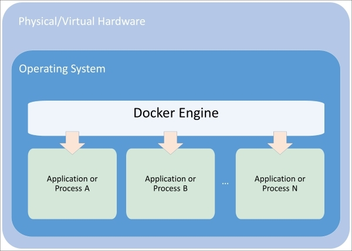

Figure 1.1. Composition of a container

`Union file systems` are also a key advantage to using Docker containers. The easiest way to understand union file systems is to think of them like a layer cake with each layer baked independently. `The Linux kernel` is our `base layer`; then, we might add an OS like Red Hat Linux or Ubuntu. Next, we might add an application like Nginx or Apache. Every change creates a new layer. Finally, as you make changes and new layers are added, you'll always have a top layer (think frosting) that is a `writable layer`.

## Microservices and orchestration
The definition for `microservices` can be a bit nebulous, but a definition from `Martin Fowler`, a respected author and speaker on software development, says:

>"In short, the microservice architectural style is an approach to developing a single application as a suite of small services, each running in its own process and communicating with lightweight mechanisms, often an HTTP resource API. These services are built around business capabilities and independently deployable by fully automated deployment machinery. There is a bare minimum of centralized management of these services, which may be written in different programming languages and use different data storage technologies."

# Core Concepts and Constructs
## The architecture
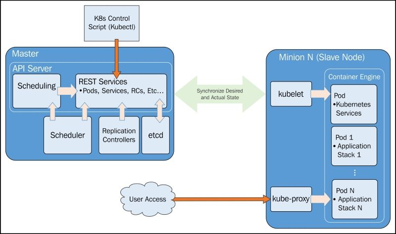

## Master
Essentially, `master` is the brain of our cluster. It's important to note that the control pane only accesses the master to initiate changes and not the nodes directly.

Additionally, the master includes the `scheduler`, which works with the API server to schedule workloads in the form of `pods` on the actual minion nodes.

The `replication controller` works with the API server to ensure that the correct number of pod replicas are running at any given time. This is exemplary of the desired state concept. If our replication controller is defining three replicas and our **actual state** is two copies of the pod running, then the scheduler will be invoked to add a third pod somewhere on our cluster. The same is true if there are too many pods running in the cluster at any given time. In this way, K8s is always pushing towards that **desired state**.

Finally, we have `etcd` running as a distributed configuration store. Think of this as the brain's shared memory.

## Node (formerly minions)
The `kublet` interacts with the API server to update state and to start new workloads that have been invoked by the scheduler.

`Kube-proxy` provides basic load balancing and directs traffic destined for specific services to the proper pod on the backend.

Finally, we have some default pods, the pods include services for Domain Name System (DNS), logging, and pod health checks. The default pod will run alongside our scheduled pods on every node.

## Core constructs
### Pods
Pods allow you to keep related containers close in terms of the network and hardware infrastructure. Pods give us **a logical group** of containers that we can then replicate, schedule, and balance service endpoints across.

### Labels
Labels are just simple key-value pairs. You will see them on pods, replication controllers, services, and so on. The label acts as a selector and tells Kubernetes which resources to work with for a variety of operations. Think of it as a **filtering** option.

### Services
`Services` allow us to abstract access away from the consumers of our applications.

As the name suggests, `kube-proxy`'s job is to proxy communication from a service endpoint back to the corresponding pod that is running the actual application.

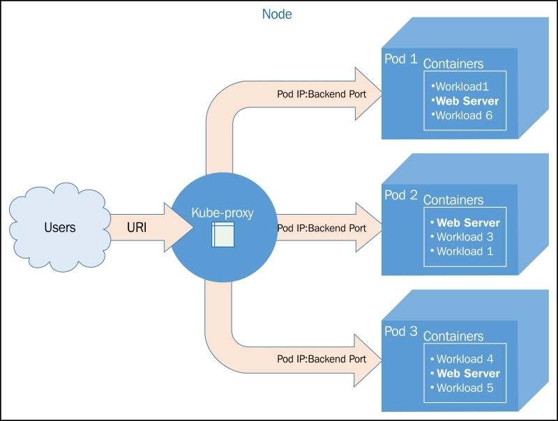

Figure 2.2. The kube-proxy architecture

Updates to service definitions are monitored and coordinated from the K8s cluster master and propagated to the `kube-proxy daemons` running on each node.

### Replication controllers
`Replication controllers (RCs)`, as the name suggests, manage the number of nodes that a pod and included container images run on.

RCs are simply charged with ensuring that you have the desired scale for your application.

## Health checks
Kubernetes provides two layers of health checking. First, in the form of `HTTP or TCP checks`, K8s can attempt to connect to a particular endpoint and give a status of healthy on a successful connection. Second, `application-specific health` checks can be performed using command line scripts.

## Application scheduling
The scheduler provides the ability to add constraints based on resources available to the node. Today, that includes minimum CPU and memory allocations.

# Core Concepts – Networking, Storage, and Advanced Services
## Kubernetes networking
Networking in Kubernetes requires that `each pod have its own IP address`. Implementation details may vary based on the underlying infrastructure provider. However, all implementations must adhere to some basic rules. First and second, Kubernetes `does not allow the use of Network Address Translation (NAT)` for container-to-container or for container-to-node (minion) traffic. Further, `the internal container IP address must match the IP address that is used to communicate with it.`

### Networking comparisons
#### Docker
- a bridged networking mode
- a host mode
- a container mode

In all these scenarios, we are still on a single machine, and outside of a host mode, the container IP space is not available outside that machine. Connecting containers across two machines then requires Network Address Translation (NAT) and port mapping for communication.

#### Docker plugins (libnetwork)
The first of these is the overlay driver.The overlay driver uses a distributed key-value store to synchronize the network creation across multiple hosts.

#### Weave
Weave provides an overlay network for Docker containers.

#### Flannel
Flannel comes from CoreOS and is an etcd-backed overlay.

#### Project Calico
Project Calico is a layer 3-based networking model that uses the built-in routing functions of the Linux kernel. Routes are propagated to virtual routers on each host via `Border Gateway Protocol (BGP)`.

### Balanced design
It's important to point out the balance Kubernetes is trying to achieve by placing the IP at the pod level. Using unique IP addresses at the host level is problematic as the number of containers grow. Ports must be used to expose services on specific containers and allow external communication. In addition to this, the complexity of running multiple services that may or may not know about each other (and their custom ports), and managing the port space becomes a big issue.

However, assigning an IP address to each container can be overkill. In cases of sizable scale, overlay networks and NATs are needed in order to address each container. Overlay networks add latency, and IP addresses would be taken up by backend services as well since they need to communicate with their frontend counterparts.

Here, we really see an advantage in the abstractions that Kubernetes provides at the application and service level.

This is also very helpful in the context of scheduling the workloads.

There are also implications for service discovery.

## Advanced services
Kubernetes is using kube-proxy to determine the proper pod IP address and port serving each request. Behind the scenes, kube-proxy is actually using virtual IPs and `iptables` to make all this magic work.

Now that we have a hook created in iptables, we still need to get the traffic to the servicing pods. Once kube-proxy receives the traffic for a particular service, it must then forward it to a pod in the service's pool of candidates.


Figure 3.1. Kube-proxy communication

### External services
We wanted all the services to be externally accessible. This was configured by the type: `LoadBalancer` element in our service definition.

```sh
$ kubectl describe service/node-js-labels
```

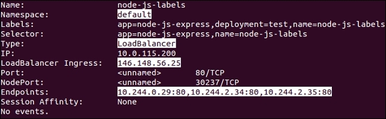

Figure 3.2. Service description

Our `namespace` is set to default, `Type`: is LoadBalancer, and we have the external IP listed under `LoadBalancer Ingress`:. Further, we see `Endpoints`:, which shows us the IPs of the pods available to answer service requests.

### Internal services
Services are internally facing only. You can specify a type of `clusterIP` to achieve this, but if no type is defined, clusterIP is the assumed type. Let's take a look at an example, note the lack of the type element:

```yaml
apiVersion: v1
kind: Service
metadata:
  name: node-js-internal
  labels:
    name: node-js-internal
spec:
  ports:
  - port: 80
  selector:
    name: node-js
```

Listing 3-1: nodejs-service-internal.yaml

```sh
$ kubectl create -f nodejs-service-internal.yaml
$ kubectl get services -l name=node-js-internal
```


Figure 3.3. Internal service listing

As you can see, we have a new service, but only one IP. Further, the IP address is not externally accessible.

### Custom load balancing
A third type of service K8s allows is the NodePort type. This type allows us to expose a service through the host or minion on a specific port. In this way, we can use the IP address of any node (minion) and access our service on the assigned node port. In the example in Listing 3-2: nodejs-service-nodeport.yaml, we choose port 30001 as follows:

```yaml
apiVersion: v1
kind: Service
metadata:
  name: node-js-nodeport
  labels:
    name: node-js-nodeport
spec:
  ports:
  - port: 80
    nodeport: 30001
  selector:
    name: node-js
  type: NodePort
```

Listing 3-2: nodejs-service-nodeport.yaml

```sh
$ kubectl create -f nodejs-service-nodeport.yaml
```


Figure 3.4. New GCP firewall rule

You'll note a message about opening firewall ports. Similar to the external load balancer type, NodePort is exposing your service externally using ports on the nodes.

### Cross-node proxy
A user makes a request to an external IP or URL. The request is serviced by Node 1 in this case. However, the pod does not happen to run on this node. This is not a problem because the pod IP addresses are routable. So, Kube-proxy simply passes traffic on to the pod IP for this service. The network routing then completes on Node 2, where the requested application lives.

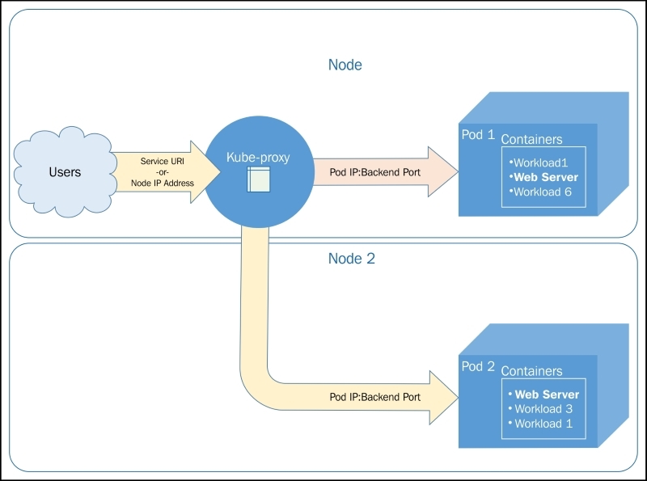

Figure 3.6. Cross-node traffic

### Custom ports
We will create a service that exposes port 90 and forwards traffic to port 80 on the pods.

```yaml
apiVersion: v1
kind: ReplicationController
metadata:
  name: node-js-90
  labels:
    name: node-js-90
spec:
  replicas: 3
  selector:
    name: node-js-90
  template:
    metadata:
      labels:
        name: node-js-90
    spec:
      containers:
      - name: node-js-90
        image: jonbaier/node-express-info:latest
        ports:
        - containerPort: 80
```

Listing 3-3: nodejs-customPort-controller.yaml

```yaml
apiVersion: v1
kind: Service
metadata:
  name: node-js-90
  labels:
    name: node-js-90
spec:
  type: LoadBalancer
  ports:
  - port: 90
    targetPort: 80
  selector:
    name: node-js-90
```

Listing 3-4: nodejs-customPort-service.yaml

We have a `targetPort` element. This element tells the service the port to use for pods/containers in the pool.

### Multiple ports
Many applications expose multiple ports, such as HTTP on port 80 and port 8888 for web servers.

```yaml
apiVersion: v1
kind: ReplicationController
metadata:
  name: node-js-multi
  labels:
    name: node-js-multi
spec:
  replicas: 3
  selector:
    name: node-js-multi
  template:
    metadata:
      labels:
        name: node-js-multi
    spec:
      containers:
      - name: node-js-multi
        image: jonbaier/node-express-multi:latest
        ports:
        - containerPort: 80
        - containerPort: 8888
```

Listing 3-5: nodejs-multicontroller.yaml

```yaml
apiVersion: v1
kind: Service
metadata:
  name: node-js-multi
  labels:
    name: node-js-multi
spec:
  type: LoadBalancer
  ports:
  - name: http
    protocol: TCP
    port: 80
  - name: fake-admin-http
    protocol: TCP
    port: 8888
  selector:
    name: node-js-multi
```

Listing 3-6: nodejs-multiservice.yaml

### Migrations, multicluster, and more
Kubernetes is actually creating an endpoint resource every time you create a service that uses selectors. The endpoints object keeps track of the pod IPs in the load balancing pool.

```sh
$ kubectl get endpoints

NAME               ENDPOINTS
http-pd            10.244.2.29:80,10.244.2.30:80,10.244.3.16:80
kubernetes         10.240.0.2:443
node-js            10.244.0.12:80,10.244.2.24:80,10.244.3.13:80
```

If we want to create a service for something that is not a pod and therefore has no labels to select, we can easily do this with both a service and endpoint definition as follows:

```yaml
apiVersion: v1
kind: Service
metadata:
  name: custom-service
spec:
  type: LoadBalancer
  ports:
  - name: http
    protocol: TCP
    port: 80
```

Listing 3-7: nodejs-custom-service.yaml

```yaml
apiVersion: v1
kind: Endpoints
metadata:
  name: custom-service
subsets:
- addresses:
  - IP: <X.X.X.X>
  ports:
    - name: http
      port: 80
      protocol: TCP
```

Listing 3-8: nodejs-custom-endpoint.yaml

In the preceding example, you'll need to replace the <X.X.X.X> with a real IP address where the new service can point.

Further, if we look at the service details, we will see the IP listed in the Endpoints section.

```sh
$ kubectl describe service/custom-service
```

### Custom addressing
There may be times when you don't want to load balance and would rather have DNS with A records for each pod.

In this case, we can use an example like the following one and set clusterip to None. Kubernetes will not assign an IP address and instead only assign A records in DNS for each of the pods. If you are using DNS, the service should be available at node-js-none or node-js-none.default.cluster.local from within the cluster.

```yaml
apiVersion: v1
kind: Service
metadata:
  name: node-js-none
  labels:
    name: node-js-none
spec:
  clusterip: None
  ports:
  - port: 80
  selector:
    name: node-js
```

Listing 3-9: nodejs-headless-service.yaml

```sh
$ kubectl exec node-js-pod -- curl node-js-none
```

## Service discovery
Discovery can occur in one of three ways. Here is an example of what our node-js service example might look like using K8s environment variables (note IPs will vary):

```
NODE_JS_PORT_80_TCP=tcp://10.0.103.215:80
NODE_JS_PORT=tcp://10.0.103.215:80
NODE_JS_PORT_80_TCP_PROTO=tcp
NODE_JS_PORT_80_TCP_PORT=80
NODE_JS_SERVICE_HOST=10.0.103.215
NODE_JS_PORT_80_TCP_ADDR=10.0.103.215
NODE_JS_SERVICE_PORT=80
```

Listing 3-10: Service environment variables

Another option for discovery is through DNS.

## DNS
You can configure the following variables in your default provider config when you create your Kubernetes cluster:

```
ENABLE_CLUSTER_DNS="${KUBE_ENABLE_CLUSTER_DNS:-true}"
DNS_SERVER_IP="10.0.0.10"
DNS_DOMAIN="cluster.local"
DNS_REPLICAS=1
```

## Persistent storage
This is where `persistent disks (PDs)`, or volumes, come into play. A persistent volume that exists outside the container allows us to save our important data across containers outages. Further, if we have a volume at the pod level, data can be shared between containers in the same application stack and within the same pod.

The volumes are tied to pods and live and die with those pods. Additionally, a pod can have multiple volumes from a variety of sources.

### Temporary disks
```yaml
apiVersion: v1
kind: Pod
metadata:
  name: memory-pd
spec:
  containers:
  - image: nginx:latest
    ports:
    - containerPort: 80
    name: memory-pd
    volumeMounts:
    - mountPath: /memory-pd
      name: memory-volume
  volumes:
  - name: memory-volume
    emptydir:
      medium: Memory
```

Listing 3-11: storage-memory.yaml

```sh
$ kubectl create -f storage-memory.yaml
$ kubectl exec memory-pd -- ls -lh | grep memory-pd
```


Figure 3.7. Temporary storage inside a container

## Multitenancy
Kubernetes has two namespaces: `default` and `kube-system`. kube-system is used for all the system-level containers.The UI, logging, DNS, and so on are all run under kube-system. Everything else the user creates runs in the default namespace. However, our resource definition files can optionally specify a custom namespace.

### Limits
Kubernetes allows you to both limit the resources used by individual pods or containers and the resources used by the overall namespace using quotas.

# Updates and Gradual Rollouts
## Example set up
```yaml
apiVersion: v1
kind: ReplicationController
metadata:
  name: node-js-scale
  labels:
    name: node-js-scale
spec:
  replicas: 1
  selector:
    name: node-js-scale
  template:
    metadata:
      labels:
        name: node-js-scale
    spec:
      containers:
      - name: node-js-scale
        image: jonbaier/pod-scaling:0.1
        ports:
        - containerPort: 80
```

Listing 4-1: pod-scaling-controller.yaml

```yaml
apiVersion: v1
kind: Service
metadata:
  name: node-js-scale
  labels:
    name: node-js-scale
spec:
  type: LoadBalancer
  sessionAffinity: ClientIP
  ports:
  - port: 80
  selector:
    name: node-js-scale
```

Listing 4-2: pod-scaling-service.yaml

Create these services with the following commands:

```sh
$ kubectl create –f pod-scaling-controller.yaml
$ kubectl create –f pod-scaling-service.yaml
```

## Scaling up
In our new example, we have only one replica running. You can check this with a `get pods` command.

```sh
$ kubectl get pods -l name=node-js-scale
```

Let's try scaling that up to three with the following command:

```sh
$ kubectl scale --replicas=3 rc/node-js-scale
```

## Smooth updates
The `rolling-update` command allows us to update entire RCs or just the underlying Docker image used by each replica. We can also specify an update interval, which will allow us to update one pod at a time and wait until proceeding to the next.

Let's take our scaling example and perform a rolling update to the 0.2 version of our container image. We will use an update interval of 2 minutes:

```sh
$ kubectl rolling-update node-js-scale --image=jonbaier/pod-scaling:0.2 --update-period="2m"
```

Use the `get pods` command, along with a label filter, to see what's happening.

```sh
$ kubectl get pods -l name=node-js-scale
```

The full output of the previous rolling-update command should look something like Figure 4.1, as follows:

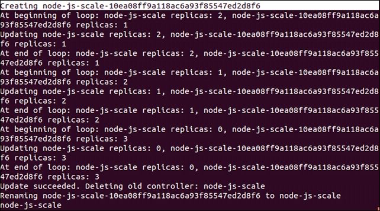

Figure 4.1. The scaling output

As we can see here, Kubernetes is first creating a new RC named node-js-scale-10ea08ff9a118ac6a93f85547ed28f6. K8s then loops through one by one. Creating a new pod in the new controller and removing one from the old. This continues until the new controller has the full replica count and the old one is at zero. After this, the old controller is deleted and the new one is renamed to the original controller name.

 I recommend specifying a new name for the updated controller to avoid confusion in your pod naming down the line. The same `update` command with this method would look like this:

```sh
$ kubectl rolling-update node-js-scale node-js-scale-v2.0 --image=jonbaier/pod-scaling:0.2 --update-period="2m"
```

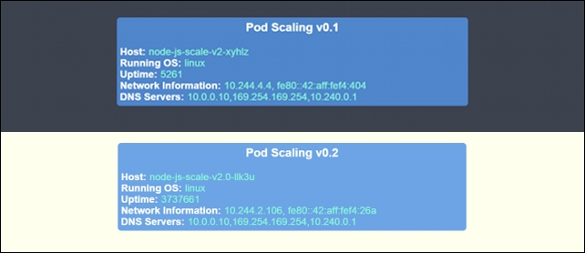

Figure 4.2. v0.1 and v0.2 (side by side)

## Testing, releases, and cutovers
Let's take a look at an `A/B testing` example. For this example, we will need to create a new service that uses `sessionAffinity`. We will set the affinity to `ClientIP`, which will allow us to forward clients to the same backend pod. This is a key if we want a portion of our users to see one version while others see another:

```yaml
apiVersion: v1
kind: Service
metadata:
  name: node-js-scale-ab
  labels:
    service: node-js-scale-ab
spec:
  type: LoadBalancer
  ports:
  - port: 80
  sessionAffinity: ClientIP
  selector:
    service: node-js-scale-ab
```

Listing 4-3: pod-AB-service.yaml

Create this service as usual with the `create` command as follows:

```sh
$ kubectl create -f pod-AB-service.yaml
```

This will create a service that will point to our pods running both version 0.2 and 0.3 of the application. Next, we will create the two RCs which create two replicas of the application. One set will have version 0.2 of the application, and the other will have version 0.3, as shown here:

```yaml
apiVersion: v1
kind: ReplicationController
metadata:
  name: node-js-scale-a
  labels:
    name: node-js-scale-a
    version: "0.2"
    service: node-js-scale-ab
spec:
  replicas: 2
  selector:
    name: node-js-scale-a
    version: "0.2"
    service: node-js-scale-ab
  template:
    metadata:
      labels:
        name: node-js-scale-a
        version: "0.2"
        service: node-js-scale-ab
    spec:
      containers:
      - name: node-js-scale
        image: jonbaier/pod-scaling:0.2
        ports:
        - containerPort: 80
        livenessProbe:
          # An HTTP health check
          httpGet:
            path: /
            port: 80
          initialDelaySeconds: 30
          timeoutSeconds: 5
        readinessProbe:
          # An HTTP health check
          httpGet:
            path: /
            port: 80
          initialDelaySeconds: 30
          timeoutSeconds: 1
```

Listing 4-4: pod-A-controller.yaml

```yaml
apiVersion: v1
kind: ReplicationController
metadata:
  name: node-js-scale-b
  labels:
    name: node-js-scale-b
    version: "0.3"
    service: node-js-scale-ab
spec:
  replicas: 2
  selector:
    name: node-js-scale-b
    version: "0.3"
    service: node-js-scale-ab
  template:
    metadata:
      labels:
        name: node-js-scale-b
        version: "0.3"
        service: node-js-scale-ab
    spec:
      containers:
      - name: node-js-scale
        image: jonbaier/pod-scaling:0.3
        ports:
        - containerPort: 80
        livenessProbe:
          # An HTTP health check
          httpGet:
            path: /
            port: 80
          initialDelaySeconds: 30
          timeoutSeconds: 5
        readinessProbe:
          # An HTTP health check
          httpGet:
            path: /
            port: 80
          initialDelaySeconds: 30
          timeoutSeconds: 1
```

Listing 4-5: pod-B-controller.yaml

Again, use the create `command` to spin up the controller:

```sh
$ kubectl create -f pod-A-controller.yaml
$ kubectl create -f pod-B-controller.yaml
```

Because we have `sessionAffinity` turned on, your test will likely show the same version every time. This is expected, and you would need to attempt a connection from multiple IP addresses to see both user experiences with each version.

Let's look at a basic transition quickly. It's really as simple as a few `scale` commands, which are as follows:

```sh
$ kubectl scale --replicas=3 rc/node-js-scale-b
$ kubectl scale --replicas=1 rc/node-js-scale-a
$ kubectl scale --replicas=4 rc/node-js-scale-b
$ kubectl scale --replicas=0 rc/node-js-scale-a
```

Now we have fully transitioned over to version 0.3 (node-js-scale-b). All users will now see the version 0.3 of the site.

```sh
$ kubectl delete rc/node-js-scale-a
```

## Growing your cluster
When you create your cluster, you can customize the starting number of (minions) nodes with the `NUM_MINIONS` environment variable. By default, it is set to 4. The following example shows how to set it to 5 before running kube-up.sh:

```
$ export NUM_MINIONS = 5
```

Bear in mind that changing this after the cluster is started will have no effect. You would need to tear down the cluster and create it once again.

### Scaling manually
Depending on your provider, you'll need to perform various manual steps. It can be helpful to look at the provider-specific scripts under the `cluster` directory.

# Monitoring and Logging
## Built-in monitoring
### Google's open source projects
- `Contrib` is a catch-all for a variety of components that are not part of core Kubernetes. It is found at https://github.com/kubernetes/contrib.
- `LevelDB` is a key store library that was used in the creation of InfluxDB. It is found at https://github.com/google/leveldb.
- `Heapster` runs in a container on one of the minion nodes and aggregates the data from kublet. A simple REST interface is provided to query the data.
- `InfluxDB` is an open-source distributed time series database with no external dependencies.
- `Grafana`, which provides a dashboard and graphing interface for the data stored in InfluxDB.

### Exploring Heapster
First, we can list the pods to find the one running Heapster as follows:

```sh
$ kubectl get pods --namespace=kube-system
```

Run a describe command to see which node it is running on as follows:

```sh
$ kubectl describe pods/<Heapster monitoring Pod> --namespace=kube-system
```

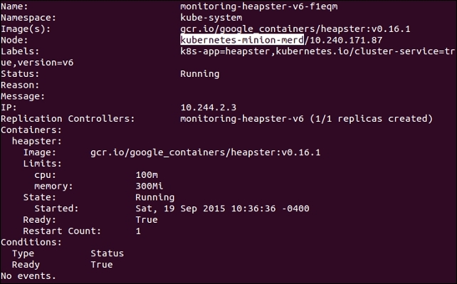

Figure 6.2. Heapster pod details

Next, we can SSH to this box with the familiar gcloud ssh command as follows:

```sh
$ gcloud compute --project "<Your project ID>" ssh --zone "<your gce zone>" "<kubernetes minion from describe>"
```

Let's see the list now by issuing a curl command to the pod IP address we saved from the describe command as follows:

```sh
$ curl -G <Heapster IP from describe>:8082/api/v1/metric-export-schema/
```

### Customizing our dashboards
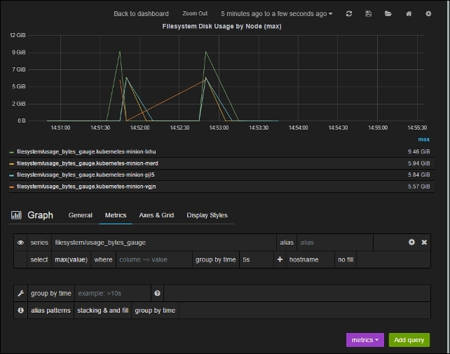

Figure 6.3. Heapster pod details

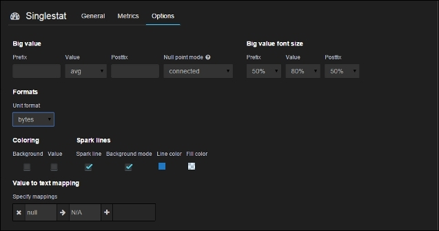

Figure 6.4. Singlestat options

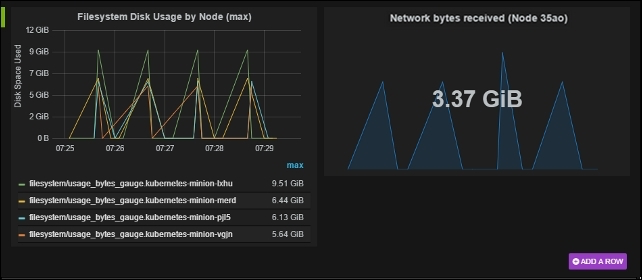

Figure 6.5. Custom dashboard panels

## FluentD and Google Cloud Logging
### FluentD
`FluentD` is a collector. It can be configured to have multiple sources to collect and tag logs, which are then sent to various output points for analysis, alerting, or archiving.

The AWS Kubernetes setup also uses FluentD, but instead forwards events to `Elasticsearch`.

## Maturing our monitoring operations
### Beyond system monitoring with Sysdig
Sysdig stands out for its ability to dive deep not only into system operations but specifically containers.

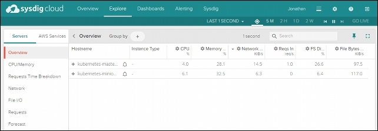

Figure 6.9. Sysdig Cloud Explore page

- Detailed views
- Topology views
- Metrics
- Alerting


Figure 6.10. Sysdig Cloud network topology view


Figure 6.11. The Sysdig Cloud network topology detailed view

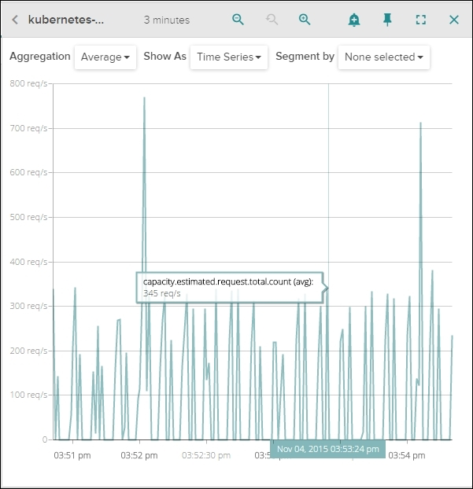

Figure 6.12. Sysdig Cloud capacity estimate view

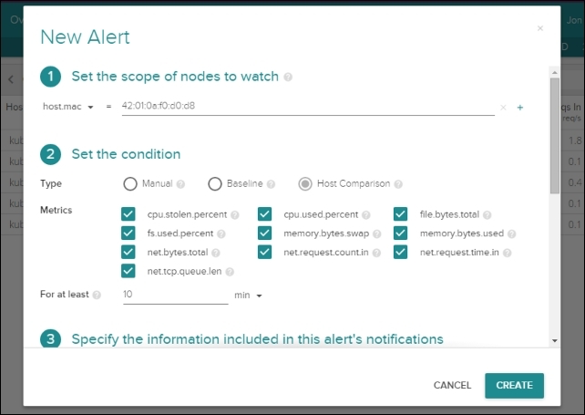

Figure 6.13. Sysdig Cloud new alert
