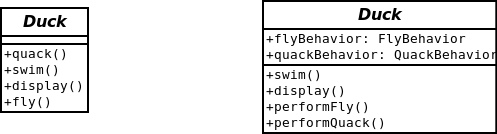
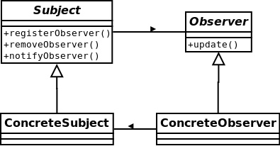
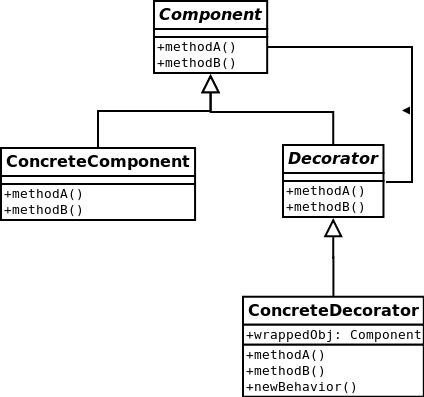
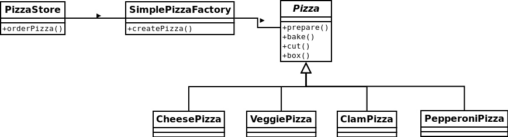

    作者:  [美] 弗里曼
    出版社: 中国电力出版社
    译者: O'Reilly Taiwan公司
    出版年: 2007-9
    页数: 637
    定价: 98.00元
    装帧: 平装
    丛书: O'Reilly深入浅出系列
    ISBN: 9787508353937

[豆瓣链接](https://book.douban.com/subject/2243615/)

- [1.策略模式](#1%e7%ad%96%e7%95%a5%e6%a8%a1%e5%bc%8f)
- [2.观察者模式](#2%e8%a7%82%e5%af%9f%e8%80%85%e6%a8%a1%e5%bc%8f)
- [3.装饰者模式](#3%e8%a3%85%e9%a5%b0%e8%80%85%e6%a8%a1%e5%bc%8f)
- [4. 工厂模式](#4-%e5%b7%a5%e5%8e%82%e6%a8%a1%e5%bc%8f)
  - [4.1 简单工厂模式](#41-%e7%ae%80%e5%8d%95%e5%b7%a5%e5%8e%82%e6%a8%a1%e5%bc%8f)
  - [4.2 工厂方法模式](#42-%e5%b7%a5%e5%8e%82%e6%96%b9%e6%b3%95%e6%a8%a1%e5%bc%8f)

## 1.策略模式
设计原则-**找出应用中可能需要变化之处，把它们独立出来，不要和那些不需要变化的代码混在一起**。换句话说，如果每次新的需求一来，都会使某方面的代码发生变化，那么你就可以确定，这部分代码需要被抽出来，和其他稳定的代码有所区分。这个原则的另一种思考方式：“把会变化的部分取出并封装起来，以便以后可以轻易地改动或扩充此部分，而不影响不需要变化的其他部分”。

设计原则-**针对接口编程，而不是针对实现编程**。“针对接口编程”，关键就在`多态`。利用多态，程序可以针对超类型编程，执行时会根据实际状况执行真正的行为，不会被绑死在超类型的行为上。“针对超类型编程”这句话，可以更明确地说成“变量的声明类型应该是超类型，通常是一个抽象类或者是一个接口，如此，只要是具体实现此超类型的类所产生的对象，都可以指定给这个变量。这也意味着，声明类时不用理会以后执行时的真正对象类型”。

`策略模式`-定义了算法簇，分别封装起来，让它们之间可以互相替换，此模式让算法的变化独立于使用算法的客户。

在“鸭子”这个例子中，变化的是fly()和quack()。这里把这两种行为抽出来，委托(delegate)给别人来处理。



示例代码：

```java
Duck.java

package net.dp.strategy;

import net.dp.strategy.fly.FlyBehavior;
import net.dp.strategy.quack.QuackBehavior;

public abstract class Duck {
     protected FlyBehavior flyBehavior;
     protected QuackBehavior quackBehavior;
    
     public abstract void display();
    
     public void performFly(){
          flyBehavior.fly();
     }

     public void performQuack(){
          quackBehavior.quack();
     }
    
     public void swim(){
          System.out.println("All ducks float, even decoys!");
     }

     public void setFlyBehavior(FlyBehavior flyBehavior) {
          this.flyBehavior = flyBehavior;
     }

     public void setQuackBehavior(QuackBehavior quackBehavior) {
          this.quackBehavior = quackBehavior;
     }
}
```

FlyBehavior.java

```java
package net.dp.strategy.fly;

public interface FlyBehavior {
     void fly();
}
```

QuackBehavior.java

```java
package net.dp.strategy.quack;

public interface QuackBehavior {
     void quack();
}
```

FlyNoWay.java

```java
package net.dp.strategy.fly;

public class FlyNoWay implements FlyBehavior{
     public void fly(){
          System.out.println("I can't fly.");
     }
}
```

FlyWithWings.java

```java
package net.dp.strategy.fly;

public class FlyWithWings implements FlyBehavior {
     public void fly() {
          System.out.println("I'm flying!");
     }
}
```

Quack.java

```java
package net.dp.strategy.quack;

public class Quack implements QuackBehavior{
     public void quack(){
          System.out.println("quack");
     }
}
```

MuteQuack.java

```java
package net.dp.strategy.quack;

public class MuteQuack implements QuackBehavior{
     public void quack(){
          System.out.println("<<Silence>>");
     }
}
```

Squeak.java

```java
package net.dp.strategy.quack;

public class Squeak implements QuackBehavior{
     public void quack(){
          System.out.println("Squeak");
     }
}
```

ADuck.java

```java
package net.dp.strategy;

import net.dp.strategy.fly.FlyNoWay;
import net.dp.strategy.fly.FlyWithWings;
import net.dp.strategy.quack.MuteQuack;
import net.dp.strategy.quack.Squeak;

public class ADuck extends Duck {
     public ADuck() {
          flyBehavior = new FlyWithWings();
          quackBehavior = new Squeak();
     }

     public void display() {
          System.out.println("I'm a duck model.");
     }

     public void changeBehavior() {
          setFlyBehavior(new FlyNoWay());
          setQuackBehavior(new MuteQuack());
     }

     public static void main(String[] args) {
          ADuck aDuck = new ADuck();
          aDuck.display();
          aDuck.swim();
          aDuck.performFly();
          aDuck.performQuack();
          aDuck.changeBehavior();
          aDuck.performFly();
          aDuck.performQuack();
     }
}
```

方法changeBehavior()显示了运行时改变策略的威力。

设计原则-**多用组合，少用继承**。使用组合建立系统具有很大的弹性，不仅可将算法封装成类，更可以“在运行时动态地改变行为”，只要组合的行为对象符合正确的接口标准即可。

## 2.观察者模式
`观察者模式`-定义了对象之间的一对多依赖，这样一来，当一个对象改变状态时，它的所有依赖者都会收到通知并自动更新。



设计原则-**为了交互对象之间的松耦合设计而努力**。对于观察者模式而言，改变主题或观察者其中一方，并不会影响另一方。因为两者是松耦合的，所以只要他们之间的接口仍被遵守，我们就可以自由地改变他们。

天气预报主题(WeatherData)需要监控temperature，humidity和pressure三个数据，如果发生变化，需要通知相应的观察者。

示例代码:
Subject.java

```java
package net.dp.observer;
 
public interface Subject {
    void registerObserver(Observer o);
    
    void removeObserver(Observer o);
    
    void notifyObservers();
}
```

Observer.java

```java
package net.dp.observer;
 
public interface Observer {
    void update(float temp,float humidity, float pressure);
}
```

DisplayElement.java

```java
package net.dp.observer;
 
public interface DisplayElement {
    void display();
}
```

WeatherData.java

```java
package net.dp.observer;
 
import java.util.ArrayList;
 
public class WeatherData implements Subject {
    private ArrayList<Observer> observers;
    private float temperature;
    private float humidity;
    private float pressure;
 
    public WeatherData() {
        observers = new ArrayList<Observer>();
    }
 
    public void registerObserver(Observer o) {
        observers.add(o);
    }
 
    public void removeObserver(Observer o) {
        int i = observers.indexOf(o);
        if (i >= 0) {
            observers.remove(i);
        }
    }
 
    public void notifyObservers() {
        for (int i = 0; i < observers.size(); i++) {
            Observer observer = (Observer) observers.get(i);
            observer.update(temperature, humidity, pressure);
        }
    }
 
    public void measurementsChanged() {
        notifyObservers();
    }
 
    public void setMeasurements(float temperature, float humidity,
            float pressure) {
        this.temperature = temperature;
        this.humidity = humidity;
        this.pressure = pressure;
        measurementsChanged();
    }
 
    // other WeatherData methods here
 
    public float getTemperature() {
        return temperature;
    }
 
    public float getHumidity() {
        return humidity;
    }
 
    public float getPressure() {
        return pressure;
    }
}
```

CurrentConditionsDisplay.java

```java
package net.dp.observer;
 
public class CurrentConditionsDisplay implements Observer, DisplayElement {
    private float temperature;
    private float humidity;
 
    public CurrentConditionsDisplay(Subject weatherData) {
        weatherData.registerObserver(this);
    }
 
    public void update(float temperature, float humidity, float pressure) {
        this.temperature = temperature;
        this.humidity = humidity;
        display();
    }
 
    public void display() {
        System.out.println("Current conditions: " + temperature
                + "F degrees and " + humidity + "% humidity");
    }
}
```

ForecastDisplay.java

```java
package net.dp.observer;
 
public class ForecastDisplay implements Observer, DisplayElement {
    private float currentPressure = 29.92f;
    private float lastPressure;
 
    public ForecastDisplay(WeatherData weatherData) {
        weatherData.registerObserver(this);
    }
 
    public void update(float temp, float humidity, float pressure) {
        lastPressure = currentPressure;
        currentPressure = pressure;
 
        display();
    }
 
    public void display() {
        System.out.print("Forecast: ");
        if (currentPressure > lastPressure) {
            System.out.println("Improving weather on the way!");
        } else if (currentPressure == lastPressure) {
            System.out.println("More of the same");
        } else if (currentPressure < lastPressure) {
            System.out.println("Watch out for cooler, rainy weather");
        }
    }
}
```

StatisticsDisplay.java

```java
package net.dp.observer;
 
public class StatisticsDisplay implements Observer, DisplayElement {
    private float maxTemp = 0.0f;
    private float minTemp = 200;
    private float tempSum = 0.0f;
    private int numReadings;
 
    public StatisticsDisplay(WeatherData weatherData) {
        weatherData.registerObserver(this);
    }
 
    public void update(float temp, float humidity, float pressure) {
        tempSum += temp;
        numReadings++;
 
        if (temp > maxTemp) {
            maxTemp = temp;
        }
 
        if (temp < minTemp) {
            minTemp = temp;
        }
 
        display();
    }
 
    public void display() {
        System.out.println("Avg/Max/Min temperature = "
                + (tempSum / numReadings) + "/" + maxTemp + "/" + minTemp);
    }
}
```

HeatIndexDisplay.java

```java
package net.dp.observer;
 
public class HeatIndexDisplay implements Observer, DisplayElement {
    float heatIndex = 0.0f;
 
    public HeatIndexDisplay(WeatherData weatherData) {
        weatherData.registerObserver(this);
    }
 
    public void update(float t, float rh, float pressure) {
        heatIndex = computeHeatIndex(t, rh);
        display();
    }
 
    private float computeHeatIndex(float t, float rh) {
        float index = (float) ((16.923 + (0.185212 * t) + (5.37941 * rh)
                - (0.100254 * t * rh) + (0.00941695 * (t * t))
                + (0.00728898 * (rh * rh)) + (0.000345372 * (t * t * rh))
                - (0.000814971 * (t * rh * rh))
                + (0.0000102102 * (t * t * rh * rh))
                - (0.000038646 * (t * t * t)) + (0.0000291583 * (rh * rh * rh))
                + (0.00000142721 * (t * t * t * rh))
                + (0.000000197483 * (t * rh * rh * rh))
                - (0.0000000218429 * (t * t * t * rh * rh)) + 0.000000000843296 * (t
                * t * rh * rh * rh)) - (0.0000000000481975 * (t * t * t * rh
                * rh * rh)));
        return index;
    }
 
    public void display() {
        System.out.println("Heat index is " + heatIndex);
    }
}
```

WeatherStation.java

```java
package net.dp.observer;
 
public class WeatherStation {
 
    public static void main(String[] args) {
        WeatherData weatherData = new WeatherData();
 
        new CurrentConditionsDisplay(weatherData);
        new StatisticsDisplay(weatherData);
        new ForecastDisplay(weatherData);
        new HeatIndexDisplay(weatherData);
 
        weatherData.setMeasurements(80, 65, 30.4f);
        System.out.println("======================");
        weatherData.setMeasurements(82, 70, 29.2f);
        System.out.println("======================");
        weatherData.setMeasurements(78, 90, 29.2f);
    }
}
```

## 3.装饰者模式
设计原则-**类应该对扩展开放，对修改关闭(开闭原则)**。目标是允许类容易扩展，在不修改现有代码的情况下，就可搭配新的行为。

`装饰者模式`-动态地将责任附加到对象上。若要扩展功能，装饰者提供了比继承更有弹性的替代方案。



下面的例子中，Beverage是Component基类。CondimentDecorator是Decorator基类。DarkRoast，Espresso，HouseBlend是ConcreteComponent。Mocha，Soy，Whip是ConcreteDecorator。

代码示例：
Beverage.java

```java
package net.dp.decorator;
 
public abstract class Beverage {
    protected String description = "Unknown Beverage";
 
    public String getDescription() {
        return description;
    }
 
    public abstract double cost();
}
```

CondimentDecorator.java

```java
package net.dp.decorator;
 
public abstract class CondimentDecorator extends Beverage {
    public abstract String getDescription();
}
```

DarkRoast.java

```java
package net.dp.decorator.coffee;
 
import net.dp.decorator.Beverage;
 
public class DarkRoast extends Beverage {
 
    public DarkRoast() {
        description = "DarkRoast";
    }
 
    public double cost() {
        return .99;
    }
}
```

Espresso.java

```java
package net.dp.decorator.coffee;
 
import net.dp.decorator.Beverage;
 
public class Espresso extends Beverage {
 
    public Espresso() {
        description = "Espresso";
    }
 
    public double cost() {
        return 1.99;
    }
}
```

HouseBlend.java

```java
package net.dp.decorator.coffee;
 
import net.dp.decorator.Beverage;
 
public class HouseBlend extends Beverage {
 
    public HouseBlend() {
        description = "House Blend Coffee";
    }
 
    public double cost() {
        return .89;
    }
}
```

Mocha.java

```java
package net.dp.decorator.flovoring;
 
import net.dp.decorator.Beverage;
import net.dp.decorator.CondimentDecorator;
 
public class Mocha extends CondimentDecorator {
    Beverage beverage;
 
    public Mocha(Beverage beverage) {
        this.beverage = beverage;
    }
 
    public String getDescription() {
        return beverage.getDescription() + ", Mocha";
    }
 
    public double cost() {
        return .20 + beverage.cost();
    }
}
```

Soy.java

```java
package net.dp.decorator.flovoring;
 
import net.dp.decorator.Beverage;
import net.dp.decorator.CondimentDecorator;
 
public class Soy extends CondimentDecorator {
    Beverage beverage;
 
    public Soy(Beverage beverage) {
        this.beverage = beverage;
    }
 
    public String getDescription() {
        return beverage.getDescription() + ", Soy";
    }
 
    public double cost() {
        return .15 + beverage.cost();
    }
}
```

Whip.java

```java
package net.dp.decorator.flovoring;
 
import net.dp.decorator.Beverage;
import net.dp.decorator.CondimentDecorator;
 
public class Whip extends CondimentDecorator {
    Beverage beverage;
 
    public Whip(Beverage beverage) {
        this.beverage = beverage;
    }
 
    public String getDescription() {
        return beverage.getDescription() + ", Whip";
    }
 
    public double cost() {
        return .10 + beverage.cost();
    }
}
```

StarbuzzCoffee.java

```java
package net.dp.decorator;
 
import net.dp.decorator.coffee.DarkRoast;
import net.dp.decorator.coffee.Espresso;
import net.dp.decorator.coffee.HouseBlend;
import net.dp.decorator.flovoring.Mocha;
import net.dp.decorator.flovoring.Soy;
import net.dp.decorator.flovoring.Whip;
 
public class StarbuzzCoffee {
 
    public static void main(String[] args) {
        Beverage beverage = new Espresso();
        System.out.println(beverage.getDescription() + " $" + beverage.cost());
 
        Beverage beverage2 = new DarkRoast();
        beverage2 = new Mocha(beverage2);
        beverage2 = new Mocha(beverage2);
        beverage2 = new Whip(beverage2);
        System.out.println(beverage2.getDescription() + " $" + beverage2.cost());
 
        Beverage beverage3 = new HouseBlend();
        beverage3 = new Whip(new Mocha(new Soy(beverage3)));
        System.out.println(beverage3.getDescription() + " $" + beverage3.cost());
    }
}
```

在StarbuzzCoffee中，首先展示不使用装饰者的情形。紧接着是一种装饰者模式的使用，用两个Mocha和一个Whip对象来包装DarkRoast对象。最后一种是更为常见的调用方式，最里层的是ConcreteComponent,外层的都是ConcreteDecorator,可以一直这样包装下去。

## 4. 工厂模式
### 4.1 简单工厂模式
工厂处理创建对象的细节。定义简单工厂。



在PizzaStore中把创建Pizza对象的代码逻辑抽出，使用简单工厂来创建相应对象。

```java
package net.dp.factory.simpleFactory;
 
public class PizzaStore {
    SimplePizzaFactory factory;
 
    public PizzaStore(SimplePizzaFactory factory) {
        this.factory = factory;
    }
 
    public Pizza orderPizza(String type) {
        Pizza pizza;
 
        pizza = factory.createPizza(type);
 
        pizza.prepare();
        pizza.bake();
        pizza.cut();
        pizza.box();
 
        return pizza;
    }
}
```

简单工厂通过参数确定需要创建的Pizza对象类型。

```java
package net.dp.factory.simpleFactory;
 
public class SimplePizzaFactory {
 
    public Pizza createPizza(String type) {
        Pizza pizza = null;
 
        if (type.equals("cheese")) {
            pizza = new CheesePizza();
        } else if (type.equals("pepperoni")) {
            pizza = new PepperoniPizza();
        } else if (type.equals("clam")) {
            pizza = new ClamPizza();
        } else if (type.equals("veggie")) {
            pizza = new VeggiePizza();
        }
        return pizza;
    }
}
```

Pizza基类。

```java
package net.dp.factory.simpleFactory;
 
import java.util.ArrayList;
 
abstract public class Pizza {
    String name;
    String dough;
    String sauce;
    ArrayList<String> toppings = new ArrayList<String>();
 
    public String getName() {
        return name;
    }
 
    public void prepare() {
        System.out.println("Preparing " + name);
    }
 
    public void bake() {
        System.out.println("Baking " + name);
    }
 
    public void cut() {
        System.out.println("Cutting " + name);
    }
 
    public void box() {
        System.out.println("Boxing " + name);
    }
 
    public String toString() {
        // code to display pizza name and ingredients
        StringBuffer display = new StringBuffer();
        display.append("---- " + name + " ----\n");
        display.append(dough + "\n");
        display.append(sauce + "\n");
        for (int i = 0; i < toppings.size(); i++) {
            display.append(toppings.get(i) + "\n");
        }
        return display.toString();
    }
}
```

Pizza子类。

```java
CheesePizza.java

package net.dp.factory.simpleFactory;
 
public class CheesePizza extends Pizza {
    public CheesePizza() {
        name = "Cheese Pizza";
        dough = "Regular Crust";
        sauce = "Marinara Pizza Sauce";
        toppings.add("Fresh Mozzarella");
        toppings.add("Parmesan");
    }
}
```

VeggiePizza.java

```java
package net.dp.factory.simpleFactory;
 
public class VeggiePizza extends Pizza {
    public VeggiePizza() {
        name = "Veggie Pizza";
        dough = "Crust";
        sauce = "Marinara sauce";
        toppings.add("Shredded mozzarella");
        toppings.add("Grated parmesan");
        toppings.add("Diced onion");
        toppings.add("Sliced mushrooms");
        toppings.add("Sliced red pepper");
        toppings.add("Sliced black olives");
    }
}
```

PepperoniPizza.java

```java
package net.dp.factory.simpleFactory;
 
public class PepperoniPizza extends Pizza {
    public PepperoniPizza() {
        name = "Pepperoni Pizza";
        dough = "Crust";
        sauce = "Marinara sauce";
        toppings.add("Sliced Pepperoni");
        toppings.add("Sliced Onion");
        toppings.add("Grated parmesan cheese");
    }
}
```

ClamPizza.java

```java
package net.dp.factory.simpleFactory;
 
public class ClamPizza extends Pizza {
    public ClamPizza() {
        name = "Clam Pizza";
        dough = "Thin crust";
        sauce = "White garlic sauce";
        toppings.add("Clams");
        toppings.add("Grated parmesan cheese");
    }
}
```

调用时，通过给简单工厂对象传递需要的Pizza参数名，完成子类Pizza对象的创建。

PizzaTestDrive.java

```java
package net.dp.factory.simpleFactory;
 
public class PizzaTestDrive {
 
    public static void main(String[] args) {
        SimplePizzaFactory factory = new SimplePizzaFactory();
        PizzaStore store = new PizzaStore(factory);
 
        Pizza pizza = store.orderPizza("cheese");
        System.out.println("We ordered a " + pizza.getName() + "\n");
 
        pizza = store.orderPizza("veggie");
        System.out.println("We ordered a " + pizza.getName() + "\n");
    }
}
```

简单工厂有个明显的问题，制作pizza的过程代码绑在PizzaStore里。

### 4.2 工厂方法模式
简单工厂有个明显的问题，制作pizza的过程代码绑在PizzaStore里。工厂方法模式可以解决这个问题。它将如何制作Pizza的过程交给子类做决定。在基类中提供抽象接口。

`工厂方法模式`-定义了创建对象的接口，但由子类决定要实例化的类是哪一个。工厂方法让类把实例化推迟到子类。


转换成PizzaStore的例子。


设计原则-要依赖抽象，不要依赖具体类(依赖倒置原则)。不能让高层组件依赖低层组件，而且，不管高层或低层组件，“两者”都应该依赖于抽象。所谓“高层”组件，是由其他低层组件定义其行为的类。例如，PizzaStore是个高层组件，因为它的行为是由Pizza定义的：PizzaStore创建所有不同的Pizza对象，准备、烘烤、切片、装盒；而Pizza本身属于低层组件。

几个原则可以避免在OO设计中违反依赖倒置原则：
-变量不可以持有具体类的引用。
-不要让类派生自具体类。
-不要覆盖基类中已实现的方法。

代码示例：
PizzaStore通过方法createPizza()将产生对象推迟到子类中进行。

package net.dp.factory.factoryMethod;
 
public abstract class PizzaStore {
 
    abstract Pizza createPizza(String item);
 
    public Pizza orderPizza(String type) {
        Pizza pizza = createPizza(type);
        System.out.println("--- Making a " + pizza.getName() + " ---");
        pizza.prepare();
        pizza.bake();
        pizza.cut();
        pizza.box();
        return pizza;
    }
}


两个子类工厂NYPizzaStore和ChicagoPizzaStore。

package net.dp.factory.factoryMethod;
 
public class NYPizzaStore extends PizzaStore {
 
    Pizza createPizza(String item) {
        if (item.equals("cheese")) {
            return new NYStyleCheesePizza();
        } else if (item.equals("veggie")) {
            return new NYStyleVeggiePizza();
        } else if (item.equals("clam")) {
            return new NYStyleClamPizza();
        } else if (item.equals("pepperoni")) {
            return new NYStylePepperoniPizza();
        } else return null;
    }

 

package net.dp.factory.factoryMethod;
 
public class ChicagoPizzaStore extends PizzaStore {
 
    Pizza createPizza(String item) {
            if (item.equals("cheese")) {
                    return new ChicagoStyleCheesePizza();
            } else if (item.equals("veggie")) {
                    return new ChicagoStyleVeggiePizza();
            } else if (item.equals("clam")) {
                    return new ChicagoStyleClamPizza();
            } else if (item.equals("pepperoni")) {
                    return new ChicagoStylePepperoniPizza();
            } else return null;
    }
}


产品类的基类Pizza。

package net.dp.factory.factoryMethod;
 
import java.util.ArrayList;
 
public abstract class Pizza {
    String name;
    String dough;
    String sauce;
    ArrayList<String> toppings = new ArrayList<String>();
 
    void prepare() {
        System.out.println("Preparing " + name);
        System.out.println("Tossing dough...");
        System.out.println("Adding sauce...");
        System.out.println("Adding toppings: ");
        for (int i = 0; i < toppings.size(); i++) {
            System.out.println("   " + toppings.get(i));
        }
    }
 
    void bake() {
        System.out.println("Bake for 25 minutes at 350");
    }
 
    void cut() {
        System.out.println("Cutting the pizza into diagonal slices");
    }
 
    void box() {
        System.out.println("Place pizza in official PizzaStore box");
    }
 
    public String getName() {
        return name;
    }
 
    public String toString() {
        StringBuffer display = new StringBuffer();
        display.append("---- " + name + " ----\n");
        display.append(dough + "\n");
        display.append(sauce + "\n");
        for (int i = 0; i < toppings.size(); i++) {
            display.append((String) toppings.get(i) + "\n");
        }
        return display.toString();
    }


NYPizzaStore下的四种产品。

package net.dp.factory.factoryMethod;

public class NYStyleClamPizza extends Pizza {
 
    public NYStyleClamPizza() {
        name = "NY Style Clam Pizza";
        dough = "Thin Crust Dough";
        sauce = "Marinara Sauce";
 
        toppings.add("Grated Reggiano Cheese");
        toppings.add("Fresh Clams from Long Island Sound");
    }
}

 

package net.dp.factory.factoryMethod;
 
public class NYStyleVeggiePizza extends Pizza {
 
    public NYStyleVeggiePizza() {
        name = "NY Style Veggie Pizza";
        dough = "Thin Crust Dough";
        sauce = "Marinara Sauce";
 
        toppings.add("Grated Reggiano Cheese");
        toppings.add("Garlic");
        toppings.add("Onion");
        toppings.add("Mushrooms");
        toppings.add("Red Pepper");
    }

 

package net.dp.factory.factoryMethod;
 
public class NYStylePepperoniPizza extends Pizza {
 
    public NYStylePepperoniPizza() {
        name = "NY Style Pepperoni Pizza";
        dough = "Thin Crust Dough";
        sauce = "Marinara Sauce";
 
        toppings.add("Grated Reggiano Cheese");
        toppings.add("Sliced Pepperoni");
        toppings.add("Garlic");
        toppings.add("Onion");
        toppings.add("Mushrooms");
        toppings.add("Red Pepper");
    }
}

 

package net.dp.factory.factoryMethod;
 
public class NYStyleCheesePizza extends Pizza {
 
    public NYStyleCheesePizza() {
        name = "NY Style Sauce and Cheese Pizza";
        dough = "Thin Crust Dough";
        sauce = "Marinara Sauce";
 
        toppings.add("Grated Reggiano Cheese");
    }


ChicagoPizzaStorePizzaStore下的四种产品。

package net.dp.factory.factoryMethod;
 
public class ChicagoStyleVeggiePizza extends Pizza {
    public ChicagoStyleVeggiePizza() {
        name = "Chicago Deep Dish Veggie Pizza";
        dough = "Extra Thick Crust Dough";
        sauce = "Plum Tomato Sauce";
 
        toppings.add("Shredded Mozzarella Cheese");
        toppings.add("Black Olives");
        toppings.add("Spinach");
        toppings.add("Eggplant");
    }
 
    void cut() {
        System.out.println("Cutting the pizza into square slices");
    }
}

 

package net.dp.factory.factoryMethod;
 
public class ChicagoStylePepperoniPizza extends Pizza {
    public ChicagoStylePepperoniPizza() {
        name = "Chicago Style Pepperoni Pizza";
        dough = "Extra Thick Crust Dough";
        sauce = "Plum Tomato Sauce";
 
        toppings.add("Shredded Mozzarella Cheese");
        toppings.add("Black Olives");
        toppings.add("Spinach");
        toppings.add("Eggplant");
        toppings.add("Sliced Pepperoni");
    }
 
    void cut() {
        System.out.println("Cutting the pizza into square slices");
    }

 

package net.dp.factory.factoryMethod;
 
public class ChicagoStyleClamPizza extends Pizza {
    public ChicagoStyleClamPizza() {
        name = "Chicago Style Clam Pizza";
        dough = "Extra Thick Crust Dough";
        sauce = "Plum Tomato Sauce";
 
        toppings.add("Shredded Mozzarella Cheese");
        toppings.add("Frozen Clams from Chesapeake Bay");
    }
 
    void cut() {
        System.out.println("Cutting the pizza into square slices");
    }
}

 

package net.dp.factory.factoryMethod;
 
public class ChicagoStyleCheesePizza extends Pizza {
 
    public ChicagoStyleCheesePizza() {
        name = "Chicago Style Deep Dish Cheese Pizza";
        dough = "Extra Thick Crust Dough";
        sauce = "Plum Tomato Sauce";
 
        toppings.add("Shredded Mozzarella Cheese");
    }
 
    void cut() {
        System.out.println("Cutting the pizza into square slices");
    }


创建两个子类工厂示例，并指定相应的产品参数，可以实例化所需要的产品。
 

package net.dp.factory.factoryMethod;
 
public class PizzaTestDrive {
 
    public static void main(String[] args) {
        PizzaStore nyStore = new NYPizzaStore();
        PizzaStore chicagoStore = new ChicagoPizzaStore();
 
        Pizza pizza = nyStore.orderPizza("cheese");
        System.out.println("Ethan ordered a " + pizza.getName() + "\n");
 
        pizza = chicagoStore.orderPizza("cheese");
        System.out.println("Joel ordered a " + pizza.getName() + "\n");
 
        pizza = nyStore.orderPizza("clam");
        System.out.println("Ethan ordered a " + pizza.getName() + "\n");
 
        pizza = chicagoStore.orderPizza("clam");
        System.out.println("Joel ordered a " + pizza.getName() + "\n");
 
        pizza = nyStore.orderPizza("pepperoni");
        System.out.println("Ethan ordered a " + pizza.getName() + "\n");
 
        pizza = chicagoStore.orderPizza("pepperoni");
        System.out.println("Joel ordered a " + pizza.getName() + "\n");
 
        pizza = nyStore.orderPizza("veggie");
        System.out.println("Ethan ordered a " + pizza.getName() + "\n");
 
        pizza = chicagoStore.orderPizza("veggie");
        System.out.println("Joel ordered a " + pizza.getName() + "\n");
    }
} 


4.3 抽象工厂模式
抽象工厂模式-提供一个接口，用于创建相关或依赖对象的家族，而不需要明确指定具体类。


比较工厂方法模式和抽象工厂模式。工厂方法模式是通过子类来创建对象。用这种做法，客户只需要知道他们所使用的抽象类型就可以了，而由子类来负责决定具体类型。抽象工厂提供一个用来创建一个产品家族的抽象类型，这个类型的子类定义了产品被生产的方法。要想使用这个工厂，必须先实例化它，然后将它传入一些针对抽象类型所写的代码中。

代码示例：
原料工厂基类PizzaIngredientFactory(相当于AbstractFactory)

package net.dp.factory.abstractFactory;
 
public interface PizzaIngredientFactory {
 
    public Dough createDough();
    public Sauce createSauce();
    public Cheese createCheese();
    public Veggies[] createVeggies();
    public Pepperoni createPepperoni();
    public Clams createClam();
 
}


两个原料工厂子类NYPizzaIngredientFactory和ChicagoPizzaIngredientFactory(相当于ConcreteFactory)

package net.dp.factory.abstractFactory;
 
public class NYPizzaIngredientFactory implements PizzaIngredientFactory {
 
    public Dough createDough() {
        return new ThinCrustDough();
    }
 
    public Sauce createSauce() {
        return new MarinaraSauce();
    }
 
    public Cheese createCheese() {
        return new ReggianoCheese();
    }
 
    public Veggies[] createVeggies() {
        Veggies veggies[] = { new Garlic(), new Onion(), new Mushroom(), new RedPepper() };
        return veggies;
    }
 
    public Pepperoni createPepperoni() {
        return new SlicedPepperoni();
    }
 
    public Clams createClam() {
        return new FreshClams();
    }

 

package net.dp.factory.abstractFactory;
 
public class NYPizzaIngredientFactory implements PizzaIngredientFactory {
 
    public Dough createDough() {
        return new ThinCrustDough();
    }
 
    public Sauce createSauce() {
        return new MarinaraSauce();
    }
 
    public Cheese createCheese() {
        return new ReggianoCheese();
    }
 
    public Veggies[] createVeggies() {
        Veggies veggies[] = { new Garlic(), new Onion(), new Mushroom(), new RedPepper() };
        return veggies;
    }
 
    public Pepperoni createPepperoni() {
        return new SlicedPepperoni();
    }
 
    public Clams createClam() {
        return new FreshClams();
    }
}


六种原料产品基类Dough、Sauce、Cheese、Clams、Veggies、Pepperoni

package net.dp.factory.abstractFactory;
 
public interface Dough {
    public String toString();

 

package net.dp.factory.abstractFactory;
 
public interface Sauce {
    public String toString();
}

 

package net.dp.factory.abstractFactory;
 
public interface Cheese {
    public String toString();

 

package net.dp.factory.abstractFactory;
 
public interface Clams {
    public String toString();
}

 

package net.dp.factory.abstractFactory;
 
public interface Veggies {
    public String toString();

 

package net.dp.factory.abstractFactory;
 
public interface Pepperoni {
    public String toString();
}


与上面六种产品基类对应的两组具体原料产品簇
ThickCrustDough和ThinCrustDough对应Dough
PlumTomatoSauce和MarinaraSauce对应Sauce
MozzarellaCheese和ReggianoCheese对应Cheese
FreshClams和FrozenClams对应Clams
Garlic, Onion, Mushroom, RedPepper和BlackOlives, Spinach, Eggplant对应Veggies
SlicedPepperoni对应Pepperoni

产品工厂基类PizzaStore，把产品的生产延迟到子类进行(工厂方法)

package net.dp.factory.abstractFactory;
 
public abstract class PizzaStore {
 
    protected abstract Pizza createPizza(String item);
 
    public Pizza orderPizza(String type) {
        Pizza pizza = createPizza(type);
        System.out.println("--- Making a " + pizza.getName() + " ---");
        pizza.prepare();
        pizza.bake();
        pizza.cut();
        pizza.box();
        return pizza;
    }


产品工厂子类NYPizzaStore和ChicagoPizzaStore

package net.dp.factory.abstractFactory;
 
public class NYPizzaStore extends PizzaStore {
 
    protected Pizza createPizza(String item) {
        Pizza pizza = null;
        PizzaIngredientFactory ingredientFactory =
            new NYPizzaIngredientFactory();
 
        if (item.equals("cheese")) {
 
            pizza = new CheesePizza(ingredientFactory);
            pizza.setName("New York Style Cheese Pizza");
 
        } else if (item.equals("veggie")) {
 
            pizza = new VeggiePizza(ingredientFactory);
            pizza.setName("New York Style Veggie Pizza");
 
        } else if (item.equals("clam")) {
 
            pizza = new ClamPizza(ingredientFactory);
            pizza.setName("New York Style Clam Pizza");
 
        } else if (item.equals("pepperoni")) {
 
            pizza = new PepperoniPizza(ingredientFactory);
            pizza.setName("New York Style Pepperoni Pizza");
 
        }
        return pizza;
    }
}

 

package net.dp.factory.abstractFactory;
 
public class ChicagoPizzaStore extends PizzaStore {
 
    protected Pizza createPizza(String item) {
        Pizza pizza = null;
        PizzaIngredientFactory ingredientFactory =
        new ChicagoPizzaIngredientFactory();
 
        if (item.equals("cheese")) {
 
            pizza = new CheesePizza(ingredientFactory);
            pizza.setName("Chicago Style Cheese Pizza");
 
        } else if (item.equals("veggie")) {
 
            pizza = new VeggiePizza(ingredientFactory);
            pizza.setName("Chicago Style Veggie Pizza");
 
        } else if (item.equals("clam")) {
 
            pizza = new ClamPizza(ingredientFactory);
            pizza.setName("Chicago Style Clam Pizza");
 
        } else if (item.equals("pepperoni")) {
 
            pizza = new PepperoniPizza(ingredientFactory);
            pizza.setName("Chicago Style Pepperoni Pizza");
 
        }
        return pizza;
    }


产品基类

package net.dp.factory.abstractFactory;
 
public abstract class Pizza {
    String name;
 
    Dough dough;
    Sauce sauce;
    Veggies veggies[];
    Cheese cheese;
    Pepperoni pepperoni;
    Clams clam;
 
    abstract void prepare();
 
    void bake() {
        System.out.println("Bake for 25 minutes at 350");
    }
 
    void cut() {
        System.out.println("Cutting the pizza into diagonal slices");
    }
 
    void box() {
        System.out.println("Place pizza in official PizzaStore box");
    }
 
    void setName(String name) {
        this.name = name;
    }
 
    String getName() {
        return name;
    }
 
    public String toString() {
        StringBuffer result = new StringBuffer();
        result.append("---- " + name + " ----\n");
        if (dough != null) {
            result.append(dough);
            result.append("\n");
        }
        if (sauce != null) {
            result.append(sauce);
            result.append("\n");
        }
        if (cheese != null) {
            result.append(cheese);
            result.append("\n");
        }
        if (veggies != null) {
            for (int i = 0; i < veggies.length; i++) {
                result.append(veggies[i]);
                if (i < veggies.length-1) {
                    result.append(", ");
                }
            }
            result.append("\n");
        }
        if (clam != null) {
            result.append(clam);
            result.append("\n");
        }
        if (pepperoni != null) {
            result.append(pepperoni);
            result.append("\n");
        }
        return result.toString();
    }
}


四种产品子类，这里相当于把原料产品的生产延迟到子类(使用的是工厂方法模式)

package net.dp.factory.abstractFactory;
 
public class CheesePizza extends Pizza {
    PizzaIngredientFactory ingredientFactory;
 
    public CheesePizza(PizzaIngredientFactory ingredientFactory) {
        this.ingredientFactory = ingredientFactory;
    }
 
    void prepare() {
        System.out.println("Preparing " + name);
        dough = ingredientFactory.createDough();
        sauce = ingredientFactory.createSauce();
        cheese = ingredientFactory.createCheese();
    }

 

package net.dp.factory.abstractFactory;
 
public class ClamPizza extends Pizza {
    PizzaIngredientFactory ingredientFactory;
 
    public ClamPizza(PizzaIngredientFactory ingredientFactory) {
        this.ingredientFactory = ingredientFactory;
    }
 
    void prepare() {
        System.out.println("Preparing " + name);
        dough = ingredientFactory.createDough();
        sauce = ingredientFactory.createSauce();
        cheese = ingredientFactory.createCheese();
        clam = ingredientFactory.createClam();
    }
}

 

package net.dp.factory.abstractFactory;
 
public class VeggiePizza extends Pizza {
    PizzaIngredientFactory ingredientFactory;
 
    public VeggiePizza(PizzaIngredientFactory ingredientFactory) {
        this.ingredientFactory = ingredientFactory;
    }
 
    void prepare() {
        System.out.println("Preparing " + name);
        dough = ingredientFactory.createDough();
        sauce = ingredientFactory.createSauce();
        cheese = ingredientFactory.createCheese();
        veggies = ingredientFactory.createVeggies();
    }

 

package net.dp.factory.abstractFactory;
 
public class PepperoniPizza extends Pizza {
    PizzaIngredientFactory ingredientFactory;
 
    public PepperoniPizza(PizzaIngredientFactory ingredientFactory) {
        this.ingredientFactory = ingredientFactory;
    }
 
    void prepare() {
        System.out.println("Preparing " + name);
        dough = ingredientFactory.createDough();
        sauce = ingredientFactory.createSauce();
        cheese = ingredientFactory.createCheese();
        veggies = ingredientFactory.createVeggies();
        pepperoni = ingredientFactory.createPepperoni();
    }
}


最终的调用方式

package net.dp.factory.abstractFactory;
 
public class PizzaTestDrive {
 
    public static void main(String[] args) {
        PizzaStore nyStore = new NYPizzaStore();
        PizzaStore chicagoStore = new ChicagoPizzaStore();
 
        Pizza pizza = nyStore.orderPizza("cheese");
        System.out.println("Ethan ordered a " + pizza + "\n");
 
        pizza = chicagoStore.orderPizza("cheese");
        System.out.println("Joel ordered a " + pizza + "\n");
 
        pizza = nyStore.orderPizza("clam");
        System.out.println("Ethan ordered a " + pizza + "\n");
 
        pizza = chicagoStore.orderPizza("clam");
        System.out.println("Joel ordered a " + pizza + "\n");
 
        pizza = nyStore.orderPizza("pepperoni");
        System.out.println("Ethan ordered a " + pizza + "\n");
 
        pizza = chicagoStore.orderPizza("pepperoni");
        System.out.println("Joel ordered a " + pizza + "\n");
 
        pizza = nyStore.orderPizza("veggie");
        System.out.println("Ethan ordered a " + pizza + "\n");
 
        pizza = chicagoStore.orderPizza("veggie");
        System.out.println("Joel ordered a " + pizza + "\n");
    }
} 


5.单例模式(单件模式)
单例模式-确保一个类只有一个实例，并提供一个全局访问点。


经典单例模式，采用“延迟初始化(lazy instantiaze)”,只在第一次申请对象时，才初始化对象。

package net.dp.singleton.classic;
 
//NOTE: This is not thread safe!
 
public class Singleton {
    private static Singleton uniqueInstance;
 
    // other useful instance variables here
 
    private Singleton() {
    }
 
    public static Singleton getInstance() {
        if (uniqueInstance == null) {
            uniqueInstance = new Singleton();
        }
        return uniqueInstance;
    }
 
    // other useful methods here


上面的例子，在多线程环境下会出现问题，简单的决绝方法是使用"急切初始化(eager instantiaze)"

package net.dp.singleton.threadsafe.eager;
 
public class Singleton {
    private static Singleton uniqueInstance = new Singleton();
 
    private Singleton() {
    }
 
    public static Singleton getInstance() {
        return uniqueInstance;
    }
}


但是如果创建一个实例是需要消耗大量资源，并且它并不是每次都被使用，或者会在程序的后期才被使用到，则上面的方法效率不高。可以利用“双重检查加锁(double-checked locking)”，在第一次检查没有创建实例时，才进行同步，此时再次检查是否有创建对象，如果还是没有，则创建之。这样的做法在JDK5及其后续版本中是有效的。

package net.dp.singleton.threadsafe.dcl;
 
//double-checked locking
//Danger!  This implementation of Singleton not
//guaranteed to work prior to Java 5
 
public class Singleton {
    private volatile static Singleton uniqueInstance;
 
    private Singleton() {
    }
 
    public static Singleton getInstance() {
        if (uniqueInstance == null) {
            synchronized (Singleton.class) {
                if (uniqueInstance == null) {
                    uniqueInstance = new Singleton();
                }
            }
        }
        return uniqueInstance;
    }


6.命令模式
命令模式-将“请求”封装成对象，以便使用不同的请求、队列或日志来参数化其他对象。命令模式也支持可撤销的操作。


命令模式代码示例：
Command接口

package net.dp.command.simpleremote;
 
public interface Command {
    public void execute();
}


所要封装的两个事物GarageDoor和Light(Receiver)

package net.dp.command.simpleremote;

public class GarageDoor {
 
    public GarageDoor() {
    }
 
    public void up() {
        System.out.println("Garage Door is Open");
    }
 
    public void down() {
        System.out.println("Garage Door is Closed");
    }
 
    public void stop() {
        System.out.println("Garage Door is Stopped");
    }
 
    public void lightOn() {
        System.out.println("Garage light is on");
    }
 
    public void lightOff() {
        System.out.println("Garage light is off");
    }
}

 

package net.dp.command.simpleremote;
 
public class Light {
 
    public Light() {
    }
 
    public void on() {
        System.out.println("Light is on");
    }
 
    public void off() {
        System.out.println("Light is off");
    }


封装的具体命令(ConcreteCommand)

package net.dp.command.simpleremote;
 
public class GarageDoorOpenCommand implements Command {
    GarageDoor garageDoor;
 
    public GarageDoorOpenCommand(GarageDoor garageDoor) {
        this.garageDoor = garageDoor;
    }
 
    public void execute() {
        garageDoor.up();
    }
}


package net.dp.command.simpleremote;
 
public class LightOnCommand implements Command {
    Light light;
 
    public LightOnCommand(Light light) {
        this.light = light;
    }
 
    public void execute() {
        light.on();
    }
}

 

package net.dp.command.simpleremote;
 
public class LightOffCommand implements Command {
    Light light;
 
    public LightOffCommand(Light light) {
        this.light = light;
    }
 
    public void execute() {
        light.off();
    }
}


下面是Invoker

package net.dp.command.simpleremote;
 
//
// This is the invoker
//
public class SimpleRemoteControl {
    Command slot;
 
    public SimpleRemoteControl() {}
 
    public void setCommand(Command command) {
        slot = command;
    }
 
    public void buttonWasPressed() {
        slot.execute();
    }


调用关系

package net.dp.command.simpleremote;
 
public class RemoteControlTest {
    public static void main(String[] args) {
        SimpleRemoteControl remote = new SimpleRemoteControl();
        Light light = new Light();
        GarageDoor garageDoor = new GarageDoor();
        LightOnCommand lightOn = new LightOnCommand(light);
        GarageDoorOpenCommand garageOpen = new GarageDoorOpenCommand(garageDoor);
 
        remote.setCommand(lightOn);
        remote.buttonWasPressed();
        remote.setCommand(garageOpen);
        remote.buttonWasPressed();
    }
}


下面是带有undo功能的命令模式示例
Command接口

package net.dp.command.undo;
 
public interface Command {
    public void execute();
    public void undo();


所要封装的两个事物CeilingFan和Light(Receiver)

package net.dp.command.undo;
 
public class CeilingFan {
    public static final int HIGH = 3;
    public static final int MEDIUM = 2;
    public static final int LOW = 1;
    public static final int OFF = 0;
    String location;
    int speed;
 
    public CeilingFan(String location) {
        this.location = location;
        speed = OFF;
    }
 
    public void high() {
        speed = HIGH;
        System.out.println(location + " ceiling fan is on high");
    }
 
    public void medium() {
        speed = MEDIUM;
        System.out.println(location + " ceiling fan is on medium");
    }
 
    public void low() {
        speed = LOW;
        System.out.println(location + " ceiling fan is on low");
    }
 
    public void off() {
        speed = OFF;
        System.out.println(location + " ceiling fan is off");
    }
 
    public int getSpeed() {
        return speed;
    }
}


package net.dp.command.undo;
 
public class Light {
    String location;
    int level;
 
    public Light(String location) {
        this.location = location;
    }
 
    public void on() {
        level = 100;
        System.out.println("Light is on");
    }
 
    public void off() {
        level = 0;
        System.out.println("Light is off");
    }
 
    public void dim(int level) {
        this.level = level;
        if (level == 0) {
            off();
        }
        else {
            System.out.println("Light is dimmed to " + level + "%");
        }
    }
 
    public int getLevel() {
        return level;
    }
}


封装的具体命令(ConcreteCommand)
这里为了实现undo()，在execute()执行之前，会保存之前的对象状态。

package net.dp.command.undo;
 
public class CeilingFanHighCommand implements Command {
    CeilingFan ceilingFan;
    int prevSpeed;
 
    public CeilingFanHighCommand(CeilingFan ceilingFan) {
        this.ceilingFan = ceilingFan;
    }
 
    public void execute() {
        prevSpeed = ceilingFan.getSpeed();
        ceilingFan.high();
    }
 
    public void undo() {
        if (prevSpeed == CeilingFan.HIGH) {
            ceilingFan.high();
        } else if (prevSpeed == CeilingFan.MEDIUM) {
            ceilingFan.medium();
        } else if (prevSpeed == CeilingFan.LOW) {
            ceilingFan.low();
        } else if (prevSpeed == CeilingFan.OFF) {
            ceilingFan.off();
        }
    }
}


package net.dp.command.undo;
 
public class CeilingFanMediumCommand implements Command {
    CeilingFan ceilingFan;
    int prevSpeed;
 
    public CeilingFanMediumCommand(CeilingFan ceilingFan) {
        this.ceilingFan = ceilingFan;
    }
 
    public void execute() {
        prevSpeed = ceilingFan.getSpeed();
        ceilingFan.medium();
    }
 
    public void undo() {
        if (prevSpeed == CeilingFan.HIGH) {
            ceilingFan.high();
        } else if (prevSpeed == CeilingFan.MEDIUM) {
            ceilingFan.medium();
        } else if (prevSpeed == CeilingFan.LOW) {
            ceilingFan.low();
        } else if (prevSpeed == CeilingFan.OFF) {
            ceilingFan.off();
        }
    }
}

 

package net.dp.command.undo;
 
public class CeilingFanLowCommand implements Command {
    CeilingFan ceilingFan;
    int prevSpeed;
 
    public CeilingFanLowCommand(CeilingFan ceilingFan) {
        this.ceilingFan = ceilingFan;
    }
 
    public void execute() {
        prevSpeed = ceilingFan.getSpeed();
        ceilingFan.low();
    }
 
    public void undo() {
        if (prevSpeed == CeilingFan.HIGH) {
            ceilingFan.high();
        } else if (prevSpeed == CeilingFan.MEDIUM) {
            ceilingFan.medium();
        } else if (prevSpeed == CeilingFan.LOW) {
            ceilingFan.low();
        } else if (prevSpeed == CeilingFan.OFF) {
            ceilingFan.off();
        }
    }
}


package net.dp.command.undo;
 
public class CeilingFanOnCommand implements Command {
    CeilingFan ceilingFan;
 
    public CeilingFanOnCommand(CeilingFan ceilingFan) {
        this.ceilingFan = ceilingFan;
    }
    public void execute() {
        ceilingFan.high();
    }
    public void undo() {
        ceilingFan.off();
    }

 

package net.dp.command.undo;
 
public class CeilingFanOffCommand implements Command {
    CeilingFan ceilingFan;
    int prevSpeed;
 
    public CeilingFanOffCommand(CeilingFan ceilingFan) {
        this.ceilingFan = ceilingFan;
    }
 
    public void execute() {
        prevSpeed = ceilingFan.getSpeed();
        ceilingFan.off();
    }
 
    public void undo() {
        if (prevSpeed == CeilingFan.HIGH) {
            ceilingFan.high();
        } else if (prevSpeed == CeilingFan.MEDIUM) {
            ceilingFan.medium();
        } else if (prevSpeed == CeilingFan.LOW) {
            ceilingFan.low();
        } else if (prevSpeed == CeilingFan.OFF) {
            ceilingFan.off();
        }
    }
}


package net.dp.command.undo;
 
public class DimmerLightOnCommand implements Command {
    Light light;
    int prevLevel;
 
    public DimmerLightOnCommand(Light light) {
        this.light = light;
    }
 
    public void execute() {
        prevLevel = light.getLevel();
        light.dim(75);
    }
 
    public void undo() {
        light.dim(prevLevel);
    }
}

 

package net.dp.command.undo;
 
public class DimmerLightOffCommand implements Command {
    Light light;
    int prevLevel;
 
    public DimmerLightOffCommand(Light light) {
        this.light = light;
        prevLevel = 100;
    }
 
    public void execute() {
        prevLevel = light.getLevel();
        light.off();
    }
 
    public void undo() {
        light.dim(prevLevel);
    }
}

package net.dp.command.undo;
 
public class LightOnCommand implements Command {
    Light light;
 
    public LightOnCommand(Light light) {
        this.light = light;
    }
 
    public void execute() {
        light.on();
    }
 
    public void undo() {
        light.off();
    }
}


package net.dp.command.undo;
 
public class LightOffCommand implements Command {
    Light light;
 
    public LightOffCommand(Light light) {
        this.light = light;
    }
 
    public void execute() {
        light.off();
    }
 
    public void undo() {
        light.on();
    }
}


下面是一个空对象(null object)。可以将处理null的责任转移给空对象。举例来说，遥控器不可能一出厂就设置了有意义的命令对象，所以提供了NoCommand对象作为代用品，当调用它的execute()时，它不会做任何事情。

package net.dp.command.undo;
 
public class NoCommand implements Command {
    public void execute() { }
    public void undo() { }


下面是Invoker

package net.dp.command.undo;
 
//
// This is the invoker
//
public class RemoteControlWithUndo {
    Command[] onCommands;
    Command[] offCommands;
    Command undoCommand;
 
    public RemoteControlWithUndo() {
        onCommands = new Command[7];
        offCommands = new Command[7];
 
        Command noCommand = new NoCommand();
        for(int i=0;i<7;i++) {
            onCommands[i] = noCommand;
            offCommands[i] = noCommand;
        }
        undoCommand = noCommand;
    }
 
    public void setCommand(int slot, Command onCommand, Command offCommand) {
        onCommands[slot] = onCommand;
        offCommands[slot] = offCommand;
    }
 
    public void onButtonWasPushed(int slot) {
        onCommands[slot].execute();
        undoCommand = onCommands[slot];
    }
 
    public void offButtonWasPushed(int slot) {
        offCommands[slot].execute();
        undoCommand = offCommands[slot];
    }
 
    public void undoButtonWasPushed() {
        undoCommand.undo();
    }
 
    public String toString() {
        StringBuffer stringBuff = new StringBuffer();
        stringBuff.append("\n------ Remote Control -------\n");
        for (int i = 0; i < onCommands.length; i++) {
            stringBuff.append("[slot " + i + "] " + onCommands[i].getClass().getName()
                + "    " + offCommands[i].getClass().getName() + "\n");
        }
        stringBuff.append("[undo] " + undoCommand.getClass().getName() + "\n");
        return stringBuff.toString();
    }
}


调用关系

package net.dp.command.undo;
 
public class RemoteLoader {
 
    public static void main(String[] args) {
        RemoteControlWithUndo remoteControl = new RemoteControlWithUndo();
 
        Light livingRoomLight = new Light("Living Room");
 
        LightOnCommand livingRoomLightOn =
                new LightOnCommand(livingRoomLight);
        LightOffCommand livingRoomLightOff =
                new LightOffCommand(livingRoomLight);
 
        remoteControl.setCommand(0, livingRoomLightOn, livingRoomLightOff);
 
        remoteControl.onButtonWasPushed(0);
        remoteControl.offButtonWasPushed(0);
        System.out.println(remoteControl);
        remoteControl.undoButtonWasPushed();
        remoteControl.offButtonWasPushed(0);
        remoteControl.onButtonWasPushed(0);
        System.out.println(remoteControl);
        remoteControl.undoButtonWasPushed();
 
        CeilingFan ceilingFan = new CeilingFan("Living Room");
  
        CeilingFanMediumCommand ceilingFanMedium =
                new CeilingFanMediumCommand(ceilingFan);
        CeilingFanHighCommand ceilingFanHigh =
                new CeilingFanHighCommand(ceilingFan);
        CeilingFanOffCommand ceilingFanOff =
                new CeilingFanOffCommand(ceilingFan);
 
        remoteControl.setCommand(0, ceilingFanMedium, ceilingFanOff);
        remoteControl.setCommand(1, ceilingFanHigh, ceilingFanOff);
  
        remoteControl.onButtonWasPushed(0);
        remoteControl.offButtonWasPushed(0);
        System.out.println(remoteControl);
        remoteControl.undoButtonWasPushed();
 
        remoteControl.onButtonWasPushed(1);
        System.out.println(remoteControl);
        remoteControl.undoButtonWasPushed();
    }
}


设置宏命令，可以将部分命令组合在一起依次连续触发或关闭

package net.dp.command.party;
 
public class MacroCommand implements Command {
    Command[] commands;
 
    public MacroCommand(Command[] commands) {
        this.commands = commands;
    }
 
    public void execute() {
        for (int i = 0; i < commands.length; i++) {
            commands[i].execute();
        }
    }
 
    public void undo() {
        for (int i = 0; i < commands.length; i++) {
            commands[i].undo();
        }
    }
}


调用关系

package net.dp.command.party;
 
public class RemoteLoader {
 
    public static void main(String[] args) {
 
        RemoteControl remoteControl = new RemoteControl();
 
        Light light = new Light("Living Room");
        TV tv = new TV("Living Room");
        Stereo stereo = new Stereo("Living Room");
        Hottub hottub = new Hottub();
 
        LightOnCommand lightOn = new LightOnCommand(light);
        StereoOnCommand stereoOn = new StereoOnCommand(stereo);
        TVOnCommand tvOn = new TVOnCommand(tv);
        HottubOnCommand hottubOn = new HottubOnCommand(hottub);
        LightOffCommand lightOff = new LightOffCommand(light);
        StereoOffCommand stereoOff = new StereoOffCommand(stereo);
        TVOffCommand tvOff = new TVOffCommand(tv);
        HottubOffCommand hottubOff = new HottubOffCommand(hottub);
 
        Command[] partyOn = { lightOn, stereoOn, tvOn, hottubOn};
        Command[] partyOff = { lightOff, stereoOff, tvOff, hottubOff};
 
        MacroCommand partyOnMacro = new MacroCommand(partyOn);
        MacroCommand partyOffMacro = new MacroCommand(partyOff);
 
        remoteControl.setCommand(0, partyOnMacro, partyOffMacro);
 
        System.out.println(remoteControl);
        System.out.println("--- Pushing Macro On---");
        remoteControl.onButtonWasPushed(0);
        System.out.println("--- Pushing Macro Off---");
        remoteControl.offButtonWasPushed(0);
    }
} 


7.1 适配器模式
适配器模式-将一个类的接口，转换成客户期望的另一个接口。适配器让原本不兼容的类可以合作无间。

“对象”适配器


"类"适配器


下面展示对象适配器的简单用法。

有两个基类Duck和Turkey

package net.dp.adapter.ducks;
 
public interface Duck {
    public void quack();
 
    public void fly();

 

package net.dp.adapter.ducks;
 
public interface Turkey {
    public void gobble();
 
    public void fly();
}


它们各自有一个子类MallardDuck和WildTurkey

package net.dp.adapter.ducks;
 
public class MallardDuck implements Duck {
    public void quack() {
        System.out.println("Quack");
    }
 
    public void fly() {
        System.out.println("I'm flying");
    }

 

package net.dp.adapter.ducks;
 
public class WildTurkey implements Turkey {
    public void gobble() {
        System.out.println("Gobble gobble");
    }
 
    public void fly() {
        System.out.println("I'm flying a short distance");
    }
}


现在需要互相适配对方，两个适配器类DuckAdapter和TurkeyAdapter

package net.dp.adapter.ducks;
 
import java.util.Random;
 
public class DuckAdapter implements Turkey {
    Duck duck;
    Random rand;
 
    public DuckAdapter(Duck duck) {
        this.duck = duck;
        rand = new Random();
    }
 
    public void gobble() {
        duck.quack();
    }
 
    public void fly() {
        if (rand.nextInt(5) == 0) {
            duck.fly();
        }
    }
}

 

package net.dp.adapter.ducks;
 
public class TurkeyAdapter implements Duck {
    Turkey turkey;
 
    public TurkeyAdapter(Turkey turkey) {
        this.turkey = turkey;
    }
 
    public void quack() {
        turkey.gobble();
    }
 
    public void fly() {
        for (int i = 0; i < 5; i++) {
            turkey.fly();
        }
    }


调用关系

package net.dp.adapter.ducks;
 
public class DuckTestDrive {
    public static void main(String[] args) {
        MallardDuck duck = new MallardDuck();
        WildTurkey turkey = new WildTurkey();
        Duck turkeyAdapter = new TurkeyAdapter(turkey);
 
        System.out.println("The Turkey says...");
        turkey.gobble();
        turkey.fly();
 
        System.out.println("\nThe Duck says...");
        testDuck(duck);
 
        System.out.println("\nThe TurkeyAdapter says...");
        testDuck(turkeyAdapter);
    }
 
    static void testDuck(Duck duck) {
        duck.quack();
        duck.fly();
    }
}

 

package net.dp.adapter.ducks;
 
public class TurkeyTestDrive {
    public static void main(String[] args) {
        MallardDuck duck = new MallardDuck();
        Turkey duckAdapter = new DuckAdapter(duck);
 
        for (int i = 0; i < 10; i++) {
            System.out.println("The DuckAdapter says...");
            duckAdapter.gobble();
            duckAdapter.fly();
        }
    }


7.2 外观模式
外观模式-提供了一个统一的接口，用来访问子系统中的一群接口。外观定义了一个高层接口，让子系统更容易使用。这个定义清楚地告诉我们，外观的意图是要提供一个简单的接口，好让一个子系统更易于使用。


设计原则-最少知识原则：只和你的密友谈话。这个原则希望我们在设计中，不要让太多的类耦合在一起，免得修改系统中的一部分，会影响到其他部分。

代码示例：


子系统中包含的类有Amplifier,CdPlayer,DvdPlayer,Tuner,Screen,Projector,TheaterLights,PopcomPopper

package net.dp.facade.hometheater;
 
public class Amplifier {
    String description;
    Tuner tuner;
    DvdPlayer dvd;
    CdPlayer cd;
   
    public Amplifier(String description) {
        this.description = description;
    }
 
    public void on() {
        System.out.println(description + " on");
    }
 
    public void off() {
        System.out.println(description + " off");
    }
 
    public void setStereoSound() {
        System.out.println(description + " stereo mode on");
    }
 
    public void setSurroundSound() {
        System.out.println(description + " surround sound on (5 speakers, 1 subwoofer)");
    }
 
    public void setVolume(int level) {
        System.out.println(description + " setting volume to " + level);
    }
 
    public void setTuner(Tuner tuner) {
        System.out.println(description + " setting tuner to " + dvd);
        this.tuner = tuner;
    }
 
    public void setDvd(DvdPlayer dvd) {
        System.out.println(description + " setting DVD player to " + dvd);
        this.dvd = dvd;
    }
 
    public void setCd(CdPlayer cd) {
        System.out.println(description + " setting CD player to " + cd);
        this.cd = cd;
    }
 
    public String toString() {
        return description;
    }
}

 

package net.dp.facade.hometheater;
 
public class CdPlayer {
    String description;
    int currentTrack;
    Amplifier amplifier;
    String title;
   
    public CdPlayer(String description, Amplifier amplifier) {
        this.description = description;
        this.amplifier = amplifier;
    }
 
    public void on() {
        System.out.println(description + " on");
    }
 
    public void off() {
        System.out.println(description + " off");
    }
 
    public void eject() {
        title = null;
        System.out.println(description + " eject");
    }
 
    public void play(String title) {
        this.title = title;
        currentTrack = 0;
        System.out.println(description + " playing \"" + title + "\"");
    }
 
    public void play(int track) {
        if (title == null) {
            System.out.println(description + " can't play track " + currentTrack +
                    ", no cd inserted");
        } else {
            currentTrack = track;
            System.out.println(description + " playing track " + currentTrack);
        }
    }
 
    public void stop() {
        currentTrack = 0;
        System.out.println(description + " stopped");
    }
 
    public void pause() {
        System.out.println(description + " paused \"" + title + "\"");
    }
 
    public String toString() {
        return description;
    }

 

package net.dp.facade.hometheater;
 
public class DvdPlayer {
    String description;
    int currentTrack;
    Amplifier amplifier;
    String movie;
   
    public DvdPlayer(String description, Amplifier amplifier) {
        this.description = description;
        this.amplifier = amplifier;
    }
 
    public void on() {
        System.out.println(description + " on");
    }
 
    public void off() {
        System.out.println(description + " off");
    }
 
        public void eject() {
        movie = null;
                System.out.println(description + " eject");
        }
 
    public void play(String movie) {
        this.movie = movie;
        currentTrack = 0;
        System.out.println(description + " playing \"" + movie + "\"");
    }
 
    public void play(int track) {
        if (movie == null) {
            System.out.println(description + " can't play track " + track + " no dvd inserted");
        } else {
            currentTrack = track;
            System.out.println(description + " playing track " + currentTrack + " of \"" + movie + "\"");
        }
    }
 
    public void stop() {
        currentTrack = 0;
        System.out.println(description + " stopped \"" + movie + "\"");
    }
 
    public void pause() {
        System.out.println(description + " paused \"" + movie + "\"");
    }
 
    public void setTwoChannelAudio() {
        System.out.println(description + " set two channel audio");
    }
 
    public void setSurroundAudio() {
        System.out.println(description + " set surround audio");
    }
 
    public String toString() {
        return description;
    }
}

 

package net.dp.facade.hometheater;
 
public class Tuner {
    String description;
    Amplifier amplifier;
    double frequency;
   
    public Tuner(String description, Amplifier amplifier) {
        this.description = description;
    }
 
    public void on() {
        System.out.println(description + " on");
    }
 
    public void off() {
        System.out.println(description + " off");
    }
 
    public void setFrequency(double frequency) {
        System.out.println(description + " setting frequency to " + frequency);
        this.frequency = frequency;
    }
 
    public void setAm() {
        System.out.println(description + " setting AM mode");
    }
 
    public void setFm() {
        System.out.println(description + " setting FM mode");
    }
 
        public String toString() {
                return description;
        }

 

package net.dp.facade.hometheater;
 
public class Screen {
    String description;
   
    public Screen(String description) {
        this.description = description;
    }
 
    public void up() {
        System.out.println(description + " going up");
    }
 
    public void down() {
        System.out.println(description + " going down");
    }
 
    public String toString() {
         return description;
    }
}

 

package net.dp.facade.hometheater;
 
public class Projector {
    String description;
    DvdPlayer dvdPlayer;
   
    public Projector(String description, DvdPlayer dvdPlayer) {
        this.description = description;
        this.dvdPlayer = dvdPlayer;
    }
 
    public void on() {
        System.out.println(description + " on");
    }
 
    public void off() {
        System.out.println(description + " off");
    }
 
    public void wideScreenMode() {
        System.out.println(description + " in widescreen mode (16x9 aspect ratio)");
    }
 
    public void tvMode() {
        System.out.println(description + " in tv mode (4x3 aspect ratio)");
    }
 
        public String toString() {
                return description;
        }

 

package net.dp.facade.hometheater;
 
public class TheaterLights {
    String description;
   
    public TheaterLights(String description) {
        this.description = description;
    }
 
    public void on() {
        System.out.println(description + " on");
    }
 
    public void off() {
        System.out.println(description + " off");
    }
 
    public void dim(int level) {
        System.out.println(description + " dimming to " + level  + "%");
    }
  
        public String toString() {
                return description;
        }
}

 

package net.dp.facade.hometheater;
 
public class PopcornPopper {
    String description;
   
    public PopcornPopper(String description) {
        this.description = description;
    }
 
    public void on() {
        System.out.println(description + " on");
    }
 
    public void off() {
        System.out.println(description + " off");
    }
 
    public void pop() {
        System.out.println(description + " popping popcorn!");
    }
 
    public String toString() {
          return description;
    }


提供一个控制子系统的外观类HomeTheaterFacade

package net.dp.facade.hometheater;
 
public class HomeTheaterFacade {
    Amplifier amp;
    Tuner tuner;
    DvdPlayer dvd;
    CdPlayer cd;
    Projector projector;
    TheaterLights lights;
    Screen screen;
    PopcornPopper popper;
 
    public HomeTheaterFacade(Amplifier amp,
                 Tuner tuner,
                 DvdPlayer dvd,
                 CdPlayer cd,
                 Projector projector,
                 Screen screen,
                 TheaterLights lights,
                 PopcornPopper popper) {
 
        this.amp = amp;
        this.tuner = tuner;
        this.dvd = dvd;
        this.cd = cd;
        this.projector = projector;
        this.screen = screen;
        this.lights = lights;
        this.popper = popper;
    }
 
    public void watchMovie(String movie) {
        System.out.println("Get ready to watch a movie...");
        popper.on();
        popper.pop();
        lights.dim(10);
        screen.down();
        projector.on();
        projector.wideScreenMode();
        amp.on();
        amp.setDvd(dvd);
        amp.setSurroundSound();
        amp.setVolume(5);
        dvd.on();
        dvd.play(movie);
    }
 
    public void endMovie() {
        System.out.println("Shutting movie theater down...");
        popper.off();
        lights.on();
        screen.up();
        projector.off();
        amp.off();
        dvd.stop();
        dvd.eject();
        dvd.off();
    }
 
    public void listenToCd(String cdTitle) {
        System.out.println("Get ready for an audiopile experence...");
        lights.on();
        amp.on();
        amp.setVolume(5);
        amp.setCd(cd);
        amp.setStereoSound();
        cd.on();
        cd.play(cdTitle);
    }
 
    public void endCd() {
        System.out.println("Shutting down CD...");
        amp.off();
        amp.setCd(cd);
        cd.eject();
        cd.off();
    }
 
    public void listenToRadio(double frequency) {
        System.out.println("Tuning in the airwaves...");
        tuner.on();
        tuner.setFrequency(frequency);
        amp.on();
        amp.setVolume(5);
        amp.setTuner(tuner);
    }
 
    public void endRadio() {
        System.out.println("Shutting down the tuner...");
        tuner.off();
        amp.off();
    }
}


客户端通过外观类来控制子系统

package net.dp.facade.hometheater;
 
public class HomeTheaterTestDrive {
    public static void main(String[] args) {
        Amplifier amp = new Amplifier("Top-O-Line Amplifier");
        Tuner tuner = new Tuner("Top-O-Line AM/FM Tuner", amp);
        DvdPlayer dvd = new DvdPlayer("Top-O-Line DVD Player", amp);
        CdPlayer cd = new CdPlayer("Top-O-Line CD Player", amp);
        Projector projector = new Projector("Top-O-Line Projector", dvd);
        TheaterLights lights = new TheaterLights("Theater Ceiling Lights");
        Screen screen = new Screen("Theater Screen");
        PopcornPopper popper = new PopcornPopper("Popcorn Popper");
 
        HomeTheaterFacade homeTheater =
                new HomeTheaterFacade(amp, tuner, dvd, cd,
                        projector, screen, lights, popper);
 
        homeTheater.watchMovie("Raiders of the Lost Ark");
        homeTheater.endMovie();
    }


8.模板方法模式
模板方法模式-在一个方法中定义了一个算法的骨架，而将一些步骤延迟到子类中。模板方法使得子类可以在不改变算法结构的情况下，重新定义算法中的某些步骤。


代码示例：
最初的Coffee和Tea两个类设计如下，

package net.dp.templatemethod.simplebarista;
 
public class Coffee {
 
    void prepareRecipe() {
        boilWater();
        brewCoffeeGrinds();
        pourInCup();
        addSugarAndMilk();
    }
 
    public void boilWater() {
        System.out.println("Boiling water");
    }
 
    public void brewCoffeeGrinds() {
        System.out.println("Dripping Coffee through filter");
    }
 
    public void pourInCup() {
        System.out.println("Pouring into cup");
    }
 
    public void addSugarAndMilk() {
        System.out.println("Adding Sugar and Milk");
    }
}

 

package net.dp.templatemethod.simplebarista;
 
public class Tea {
 
    void prepareRecipe() {
        boilWater();
        steepTeaBag();
        pourInCup();
        addLemon();
    }
 
    public void boilWater() {
        System.out.println("Boiling water");
    }
 
    public void steepTeaBag() {
        System.out.println("Steeping the tea");
    }
 
    public void addLemon() {
        System.out.println("Adding Lemon");
    }
 
    public void pourInCup() {
        System.out.println("Pouring into cup");
    }


调用关系

package net.dp.templatemethod.simplebarista;
 
public class Barista {
 
    public static void main(String[] args) {
        Tea tea = new Tea();
        Coffee coffee = new Coffee();
        System.out.println("Making tea...");
        tea.prepareRecipe();
        System.out.println("Making coffee...");
        coffee.prepareRecipe();
    }
}


这里已经观察到Coffee和Tea两个类中存在相同的冲泡逻辑。对其抽象为四个步骤：
-把水煮沸
-用热水泡咖啡或茶
-把饮料倒进杯子
-在饮料中加入适当的调料
因此，我们把这一算法步骤抽象出来，把共通的部分实现调，不一些不同的步骤定义成抽象方法，使其延迟到子类中去实现。

定义模板方法基类CaffeineBeverage如下，其中共通的部分是boilWater()和pourInCup()。而一些存在变化的方法brew()和addCondiments()则定义成抽象方法。

package net.dp.templatemethod.barista;
 
public abstract class CaffeineBeverage {
 
    final void prepareRecipe() {
        boilWater();
        brew();
        pourInCup();
        addCondiments();
    }
 
    abstract void brew();
 
    abstract void addCondiments();
 
    void boilWater() {
        System.out.println("Boiling water");
    }
 
    void pourInCup() {
        System.out.println("Pouring into cup");
    }
}


Coffee和Tea两个子类分别继承CaffeineBeverage，实现自己独有的两个步骤。

package net.dp.templatemethod.barista;
 
public class Coffee extends CaffeineBeverage {
    public void brew() {
        System.out.println("Dripping Coffee through filter");
    }
    public void addCondiments() {
        System.out.println("Adding Sugar and Milk");
    }

 

package net.dp.templatemethod.barista;
 
public class Tea extends CaffeineBeverage {
    public void brew() {
        System.out.println("Steeping the tea");
    }
    public void addCondiments() {
        System.out.println("Adding Lemon");
    }
}


我们也可以有“默认不做事的方法”，称这些方法为hook(钩子)。当你的子类“必须”提供算法中的某个方法或步骤的实现时，就使用抽象方法。如果算法的这个部分是可选的，就用钩子。下面的模板方法基类CaffeineBeverage定义了一个钩子。

package net.dp.templatemethod.barista;
 
public abstract class CaffeineBeverageWithHook {
 
    void prepareRecipe() {
        boilWater();
        brew();
        pourInCup();
        if (customerWantsCondiments()) {
            addCondiments();
        }
    }
 
    abstract void brew();
 
    abstract void addCondiments();
 
    void boilWater() {
        System.out.println("Boiling water");
    }
 
    void pourInCup() {
        System.out.println("Pouring into cup");
    }
 
    boolean customerWantsCondiments() {
        return true;
    }


带有钩子的Coffee和Tea。

package net.dp.templatemethod.barista;
 
import java.io.*;
 
public class CoffeeWithHook extends CaffeineBeverageWithHook {
 
    public void brew() {
        System.out.println("Dripping Coffee through filter");
    }
 
    public void addCondiments() {
        System.out.println("Adding Sugar and Milk");
    }
 
    public boolean customerWantsCondiments() {
 
        String answer = getUserInput();
 
        if (answer.toLowerCase().startsWith("y")) {
            return true;
        } else {
            return false;
        }
    }
 
    private String getUserInput() {
        String answer = null;
 
        System.out.print("Would you like milk and sugar with your coffee (y/n)? ");
 
        BufferedReader in = new BufferedReader(new InputStreamReader(System.in));
        try {
            answer = in.readLine();
        } catch (IOException ioe) {
            System.err.println("IO error trying to read your answer");
        }
        if (answer == null) {
            return "no";
        }
        return answer;
    }
}

 

package net.dp.templatemethod.barista;
 
import java.io.*;
 
public class TeaWithHook extends CaffeineBeverageWithHook {
 
    public void brew() {
        System.out.println("Steeping the tea");
    }
 
    public void addCondiments() {
        System.out.println("Adding Lemon");
    }
 
    public boolean customerWantsCondiments() {
 
        String answer = getUserInput();
 
        if (answer.toLowerCase().startsWith("y")) {
            return true;
        } else {
            return false;
        }
    }
 
    private String getUserInput() {
        // get the user's response
        String answer = null;
 
        System.out.print("Would you like milk and sugar with your coffee (y/n)? ");
 
        BufferedReader in = new BufferedReader(new InputStreamReader(System.in));
        try {
            answer = in.readLine();
        } catch (IOException ioe) {
            System.err.println("IO error trying to read your answer");
        }
        if (answer == null) {
            return "no";
        }
        return answer;
    }


调用关系。

package net.dp.templatemethod.barista;
 
public class BeverageTestDrive {
    public static void main(String[] args) {
 
        Tea tea = new Tea();
        Coffee coffee = new Coffee();
 
        System.out.println("\nMaking tea...");
        tea.prepareRecipe();
 
        System.out.println("\nMaking coffee...");
        coffee.prepareRecipe();
 
 
        TeaWithHook teaHook = new TeaWithHook();
        CoffeeWithHook coffeeHook = new CoffeeWithHook();
 
        System.out.println("\nMaking tea...");
        teaHook.prepareRecipe();
 
        System.out.println("\nMaking coffee...");
        coffeeHook.prepareRecipe();
    }
}


设计原则-好莱坞原则：别调用(打电话给)我们，我们会调用(打电话给)你。在好莱坞原则之下，我们允许低层组件将自己挂钩到系统上，但是高层组件会决定什么时候和怎样使用这些低层组件。


9.1 迭代器模式
迭代器模式-提供一种方法顺序访问一个聚合对象中的各个元素，而又不暴露其内部的表示。迭代器模式让我们能游走于聚合内的每一个元素，而又不暴露其内部的表示。把游走的任务放在迭代器上，而不是聚合上。这样简化了聚合的接口和实现，也让责任各得其所。

设计原则-单一责任。一个类应该只有一个引起变化的原因。类的每个责任都有改变的潜在区域。超过一个责任，意味着超过一个改变的区域。

代码示例:


所有的菜单元素，

package net.dp.iterator.dinermerger;
 
public class MenuItem {
    String name;
    String description;
    boolean vegetarian;
    double price;
 
    public MenuItem(String name, String description, boolean vegetarian,
            double price) {
        this.name = name;
        this.description = description;
        this.vegetarian = vegetarian;
        this.price = price;
    }
 
    public String getName() {
        return name;
    }
 
    public String getDescription() {
        return description;
    }
 
    public double getPrice() {
        return price;
    }
 
    public boolean isVegetarian() {
        return vegetarian;
    }
 
    public String toString() {
        return (name + ", $" + price + "\n   " + description);
    }


定义迭代器接口，

package net.dp.iterator.dinermerger;
 
public interface Iterator {
    boolean hasNext();
 
    Object next();
}


分别有两组菜单，其中PancakeHouseMenu内部数据结构是ArrayList，DinerMenu内部数据结构是数组。它们实现了Menu接口，该接口限定需要创建迭代器实例。

package net.dp.iterator.dinermerger;
 
public interface Menu {
    public Iterator createIterator();
}

 

package net.dp.iterator.dinermerger;
 
import java.util.ArrayList;
 
public class PancakeHouseMenu implements Menu {
    ArrayList<MenuItem> menuItems;
 
    public PancakeHouseMenu() {
        menuItems = new ArrayList<MenuItem>();
   
        addItem("K&B's Pancake Breakfast",
            "Pancakes with scrambled eggs, and toast",
            true,
            2.99);
 
        addItem("Regular Pancake Breakfast",
            "Pancakes with fried eggs, sausage",
            false,
            2.99);
 
        addItem("Blueberry Pancakes",
            "Pancakes made with fresh blueberries",
            true,
            3.49);
 
        addItem("Waffles",
            "Waffles, with your choice of blueberries or strawberries",
            true,
            3.59);
    }
 
    public void addItem(String name, String description,
                        boolean vegetarian, double price)
    {
        MenuItem menuItem = new MenuItem(name, description, vegetarian, price);
        menuItems.add(menuItem);
    }
 
    public ArrayList<MenuItem> getMenuItems() {
        return menuItems;
    }
 
    public Iterator createIterator() {
        return new PancakeHouseMenuIterator(menuItems);
    }
 
    public String toString() {
        return "Objectville Pancake House Menu";
    }
 
    // other menu methods here

 

package net.dp.iterator.dinermerger;
 
public class DinerMenu implements Menu {
    static final int MAX_ITEMS = 6;
    int numberOfItems = 0;
    MenuItem[] menuItems;
 
    public DinerMenu() {
        menuItems = new MenuItem[MAX_ITEMS];
 
        addItem("Vegetarian BLT",
            "(Fakin') Bacon with lettuce & tomato on whole wheat", true, 2.99);
        addItem("BLT",
            "Bacon with lettuce & tomato on whole wheat", false, 2.99);
        addItem("Soup of the day",
            "Soup of the day, with a side of potato salad", false, 3.29);
        addItem("Hotdog",
            "A hot dog, with saurkraut, relish, onions, topped with cheese",
            false, 3.05);
        addItem("Steamed Veggies and Brown Rice",
            "Steamed vegetables over brown rice", true, 3.99);
        addItem("Pasta",
            "Spaghetti with Marinara Sauce, and a slice of sourdough bread",
            true, 3.89);
    }
 
    public void addItem(String name, String description,
                         boolean vegetarian, double price)
    {
        MenuItem menuItem = new MenuItem(name, description, vegetarian, price);
        if (numberOfItems >= MAX_ITEMS) {
            System.err.println("Sorry, menu is full!  Can't add item to menu");
        } else {
            menuItems[numberOfItems] = menuItem;
            numberOfItems = numberOfItems + 1;
        }
    }
 
    public MenuItem[] getMenuItems() {
        return menuItems;
    }
 
    public Iterator createIterator() {
        return new DinerMenuIterator(menuItems);
    }
 
    // other menu methods here
}


这两组菜单对应的迭代器，PancakeHouseMenuIterator和DinerMenuIterator，分别对应ArrayList和数据两种内部数据结构。

package net.dp.iterator.dinermerger;
 
import java.util.ArrayList;
 
public class PancakeHouseMenuIterator implements Iterator {
    ArrayList<MenuItem> items;
    int position = 0;
 
    public PancakeHouseMenuIterator(ArrayList<MenuItem> items) {
        this.items = items;
    }
 
    public Object next() {
        Object object = items.get(position);
        position = position + 1;
        return object;
    }
 
    public boolean hasNext() {
        if (position >= items.size()) {
            return false;
        } else {
            return true;
        }
    }

 

package net.dp.iterator.dinermerger;
 
public class DinerMenuIterator implements Iterator {
    MenuItem[] items;
    int position = 0;
 
    public DinerMenuIterator(MenuItem[] items) {
        this.items = items;
    }
 
    public Object next() {
        MenuItem menuItem = items[position];
        position = position + 1;
        return menuItem;
    }
 
    public boolean hasNext() {
        if (position >= items.length || items[position] == null) {
            return false;
        } else {
            return true;
        }
    }
}


对于Waitress来说，她是通过Iterator来操作这两组菜单中的MenuItem，而对于其内部数据结构是ArrayList还是数组并不知晓。

package net.dp.iterator.dinermerger;
 
public class Waitress {
    PancakeHouseMenu pancakeHouseMenu;
    DinerMenu dinerMenu;
 
    public Waitress(PancakeHouseMenu pancakeHouseMenu, DinerMenu dinerMenu) {
        this.pancakeHouseMenu = pancakeHouseMenu;
        this.dinerMenu = dinerMenu;
    }
 
    public void printMenu() {
        Iterator pancakeIterator = pancakeHouseMenu.createIterator();
        Iterator dinerIterator = dinerMenu.createIterator();
 
        System.out.println("MENU\n----\nBREAKFAST");
        printMenu(pancakeIterator);
        System.out.println("\nLUNCH");
        printMenu(dinerIterator);
    }
 
    private void printMenu(Iterator iterator) {
        while (iterator.hasNext()) {
            MenuItem menuItem = (MenuItem)iterator.next();
            System.out.print(menuItem.getName() + ", ");
            System.out.print(menuItem.getPrice() + " -- ");
            System.out.println(menuItem.getDescription());
        }
    }
 
    public void printVegetarianMenu() {
        printVegetarianMenu(pancakeHouseMenu.createIterator());
        printVegetarianMenu(dinerMenu.createIterator());
    }
 
    public boolean isItemVegetarian(String name) {
        Iterator breakfastIterator = pancakeHouseMenu.createIterator();
        if (isVegetarian(name, breakfastIterator)) {
            return true;
        }
        Iterator dinnerIterator = dinerMenu.createIterator();
        if (isVegetarian(name, dinnerIterator)) {
            return true;
        }
        return false;
    }
 
 
    private void printVegetarianMenu(Iterator iterator) {
        while (iterator.hasNext()) {
            MenuItem menuItem = (MenuItem)iterator.next();
            if (menuItem.isVegetarian()) {
                System.out.print(menuItem.getName());
                System.out.println("\t\t" + menuItem.getPrice());
                System.out.println("\t" + menuItem.getDescription());
            }
        }
    }
 
    private boolean isVegetarian(String name, Iterator iterator) {
        while (iterator.hasNext()) {
            MenuItem menuItem = (MenuItem)iterator.next();
            if (menuItem.getName().equals(name)) {
                if (menuItem.isVegetarian()) {
                    return true;
                }
            }
        }
        return false;
    }


9.2 组合模式
组合模式-允许你将对象组合成树形结构来表现“整体/部分”层次结构。组合能让客户以一致的方式处理个别对象以及对象组合。使用组合结构，我们能把相同的操作应用在组合和个别对象上，换句话说，在大多数情况下，我们可以忽略对象组合和个别对象之间的差别。

利用组合设计菜单，

MenuComponent是基类，

package net.dp.composite.menu;
 
public abstract class MenuComponent {
 
    public void add(MenuComponent menuComponent) {
        throw new UnsupportedOperationException();
    }
 
    public void remove(MenuComponent menuComponent) {
        throw new UnsupportedOperationException();
    }
 
    public MenuComponent getChild(int i) {
        throw new UnsupportedOperationException();
    }
 
    public String getName() {
        throw new UnsupportedOperationException();
    }
 
    public String getDescription() {
        throw new UnsupportedOperationException();
    }
 
    public double getPrice() {
        throw new UnsupportedOperationException();
    }
 
    public boolean isVegetarian() {
        throw new UnsupportedOperationException();
    }
 
    public void print() {
        throw new UnsupportedOperationException();
    }
}


Menu是枝干节点，

package net.dp.composite.menu;
 
import java.util.Iterator;
import java.util.ArrayList;
 
public class Menu extends MenuComponent {
    ArrayList<MenuComponent> menuComponents = new ArrayList<MenuComponent>();
    String name;
    String description;
 
    public Menu(String name, String description) {
        this.name = name;
        this.description = description;
    }
 
    public void add(MenuComponent menuComponent) {
        menuComponents.add(menuComponent);
    }
 
    public void remove(MenuComponent menuComponent) {
        menuComponents.remove(menuComponent);
    }
 
    public MenuComponent getChild(int i) {
        return (MenuComponent) menuComponents.get(i);
    }
 
    public String getName() {
        return name;
    }
 
    public String getDescription() {
        return description;
    }
 
    public void print() {
        System.out.print("\n" + getName());
        System.out.println(", " + getDescription());
        System.out.println("---------------------");
 
        Iterator<MenuComponent> iterator = menuComponents.iterator();
        while (iterator.hasNext()) {
            MenuComponent menuComponent = iterator.next();
            menuComponent.print();
        }
    }


MenuItem是叶子节点，

package net.dp.composite.menu;
 
public class MenuItem extends MenuComponent {
    String name;
    String description;
    boolean vegetarian;
    double price;
 
    public MenuItem(String name, String description, boolean vegetarian,
            double price) {
        this.name = name;
        this.description = description;
        this.vegetarian = vegetarian;
        this.price = price;
    }
 
    public String getName() {
        return name;
    }
 
    public String getDescription() {
        return description;
    }
 
    public double getPrice() {
        return price;
    }
 
    public boolean isVegetarian() {
        return vegetarian;
    }
 
    public void print() {
        System.out.print("  " + getName());
        if (isVegetarian()) {
            System.out.print("(v)");
        }
        System.out.println(", " + getPrice());
        System.out.println("     -- " + getDescription());
    }
}


Waitress作为Client，不需要区分枝干和叶子节点，这个区别对它是透明的。

package net.dp.composite.menu;
 
public class Waitress {
    MenuComponent allMenus;
 
    public Waitress(MenuComponent allMenus) {
        this.allMenus = allMenus;
    }
 
    public void printMenu() {
        allMenus.print();
    }


测试程序，

package net.dp.composite.menu;
 
public class MenuTestDrive {
    public static void main(String args[]) {
        MenuComponent pancakeHouseMenu = new Menu("PANCAKE HOUSE MENU",    "Breakfast");
        MenuComponent dinerMenu = new Menu("DINER MENU", "Lunch");
        MenuComponent cafeMenu = new Menu("CAFE MENU", "Dinner");
        MenuComponent dessertMenu = new Menu("DESSERT MENU", "Dessert of course!");
        MenuComponent coffeeMenu = new Menu("COFFEE MENU", "Stuff to go with your afternoon coffee");
        MenuComponent allMenus = new Menu("ALL MENUS", "All menus combined");
 
        allMenus.add(pancakeHouseMenu);
        allMenus.add(dinerMenu);
        allMenus.add(cafeMenu);
 
        pancakeHouseMenu.add(new MenuItem("K&B's Pancake Breakfast", "Pancakes with scrambled eggs, and toast", true, 2.99));
        pancakeHouseMenu.add(new MenuItem("Regular Pancake Breakfast",    "Pancakes with fried eggs, sausage", false, 2.99));
        pancakeHouseMenu.add(new MenuItem("Blueberry Pancakes",    "Pancakes made with fresh blueberries, and blueberry syrup", true, 3.49));
        pancakeHouseMenu.add(new MenuItem("Waffles", "Waffles, with your choice of blueberries or strawberries", true, 3.59));
 
        dinerMenu.add(new MenuItem("Vegetarian BLT", "(Fakin') Bacon with lettuce & tomato on whole wheat", true, 2.99));
        dinerMenu.add(new MenuItem("BLT", "Bacon with lettuce & tomato on whole wheat", false, 2.99));
        dinerMenu.add(new MenuItem("Soup of the day", "A bowl of the soup of the day, with a side of potato salad",    false, 3.29));
        dinerMenu.add(new MenuItem("Hotdog", "A hot dog, with saurkraut, relish, onions, topped with cheese", false, 3.05));
        dinerMenu.add(new MenuItem("Steamed Veggies and Brown Rice", "Steamed vegetables over brown rice", true, 3.99));
        dinerMenu.add(new MenuItem("Pasta",    "Spaghetti with Marinara Sauce, and a slice of sourdough bread", true, 3.89));
        dinerMenu.add(dessertMenu);
 
        dessertMenu.add(new MenuItem("Apple Pie", "Apple pie with a flakey crust, topped with vanilla icecream", true, 1.59));
        dessertMenu.add(new MenuItem("Cheesecake", "Creamy New York cheesecake, with a chocolate graham crust",    true, 1.99));
        dessertMenu.add(new MenuItem("Sorbet", "A scoop of raspberry and a scoop of lime", true, 1.89));
 
        cafeMenu.add(new MenuItem("Veggie Burger and Air Fries", "Veggie burger on a whole wheat bun, lettuce, tomato, and fries",    true, 3.99));
        cafeMenu.add(new MenuItem("Soup of the day", "A cup of the soup of the day, with a side salad",    false, 3.69));
        cafeMenu.add(new MenuItem("Burrito", "A large burrito, with whole pinto beans, salsa, guacamole", true, 4.29));
        cafeMenu.add(coffeeMenu);
 
        coffeeMenu.add(new MenuItem("Coffee Cake", "Crumbly cake topped with cinnamon and walnuts", true, 1.59));
        coffeeMenu.add(new MenuItem("Bagel", "Flavors include sesame, poppyseed, cinnamon raisin, pumpkin",    false, 0.69));
        coffeeMenu.add(new MenuItem("Biscotti",    "Three almond or hazelnut biscotti cookies", true, 0.89));
 
        Waitress waitress = new Waitress(allMenus);
        waitress.printMenu();
    }
}


组合模式违反了“单一责任”的设计原则。组合模式不但要管理层次结构，还要执行菜单的操作。组合模式是以单一责任设计原则换取透明性。通过让组件的接口同时包含一些管理子节点和叶节点的操作，客户就可以将组合和叶节点一视同仁。也就是说，一个元素究竟是组合还是叶节点，对客户是透明的。

为基类MenuComponent增加一个createIterator()方法，实现组合迭代器。

package net.dp.composite.menuiterator;
 
import java.util.Iterator;
 
public abstract class MenuComponent {
 
    public void add(MenuComponent menuComponent) {
        throw new UnsupportedOperationException();
    }
 
    public void remove(MenuComponent menuComponent) {
        throw new UnsupportedOperationException();
    }
 
    public MenuComponent getChild(int i) {
        throw new UnsupportedOperationException();
    }
 
    public String getName() {
        throw new UnsupportedOperationException();
    }
 
    public String getDescription() {
        throw new UnsupportedOperationException();
    }
 
    public double getPrice() {
        throw new UnsupportedOperationException();
    }
 
    public boolean isVegetarian() {
        throw new UnsupportedOperationException();
    }
 
    public abstract Iterator<MenuComponent> createIterator();
 
    public void print() {
        throw new UnsupportedOperationException();
    }


对于叶子节点MenuItem，它不需要迭代出更多的节点，此时使用一个空迭代器NullIterator作为对象返回。

package net.dp.composite.menuiterator;
 
import java.util.Iterator;
 
public class NullIterator implements Iterator<MenuComponent> {
  
    public MenuComponent next() {
        return null;
    }
 
    public boolean hasNext() {
        return false;
    }
  
    public void remove() {
        throw new UnsupportedOperationException();
    }
}

 

package net.dp.composite.menuiterator;
 
import java.util.Iterator;
 
public class MenuItem extends MenuComponent {
 
    String name;
    String description;
    boolean vegetarian;
    double price;
 
    public MenuItem(String name, String description, boolean vegetarian,
            double price) {
        this.name = name;
        this.description = description;
        this.vegetarian = vegetarian;
        this.price = price;
    }
 
    public String getName() {
        return name;
    }
 
    public String getDescription() {
        return description;
    }
 
    public double getPrice() {
        return price;
    }
 
    public boolean isVegetarian() {
        return vegetarian;
    }
 
    public Iterator<MenuComponent> createIterator() {
        return new NullIterator();
    }
 
    public void print() {
        System.out.print("  " + getName());
        if (isVegetarian()) {
            System.out.print("(v)");
        }
        System.out.println(", " + getPrice());
        System.out.println("     -- " + getDescription());
    }


作为枝干节点Menu，返回一个组合迭代器对象CompositeIterator，它的内部数据结构使用一个堆栈，利用它深度遍历树的所有节点。

package net.dp.composite.menuiterator;
 
import java.util.Iterator;
import java.util.Stack;
 
public class CompositeIterator implements Iterator<MenuComponent> {
    Stack<Iterator<MenuComponent>> stack = new Stack<Iterator<MenuComponent>>();
 
    public CompositeIterator(Iterator<MenuComponent> iterator) {
        stack.push(iterator);
    }
 
    public MenuComponent next() {
        if (hasNext()) {
            Iterator<MenuComponent> iterator = stack.peek();
            MenuComponent component = iterator.next();
            if (component instanceof Menu) {
                stack.push(component.createIterator());
            }
            return component;
        } else {
            return null;
        }
    }
 
    public boolean hasNext() {
        if (stack.empty()) {
            return false;
        } else {
            Iterator<MenuComponent> iterator = stack.peek();
            if (!iterator.hasNext()) {
                stack.pop();
                return hasNext();//递归调用，跳过所有叶子
            } else {
                return true;
            }
        }
    }
 
    public void remove() {
        throw new UnsupportedOperationException();
    }
}

 

package net.dp.composite.menuiterator;
 
import java.util.Iterator;
import java.util.ArrayList;
 
public class Menu extends MenuComponent {
 
    ArrayList<MenuComponent> menuComponents = new ArrayList<MenuComponent>();
    String name;
    String description;
 
    public Menu(String name, String description) {
        this.name = name;
        this.description = description;
    }
 
    public void add(MenuComponent menuComponent) {
        menuComponents.add(menuComponent);
    }
 
    public void remove(MenuComponent menuComponent) {
        menuComponents.remove(menuComponent);
    }
 
    public MenuComponent getChild(int i) {
        return (MenuComponent)menuComponents.get(i);
    }
 
    public String getName() {
        return name;
    }
 
    public String getDescription() {
        return description;
    }
 
 
    public Iterator<MenuComponent> createIterator() {
        return new CompositeIterator(menuComponents.iterator());
    }
 
    public void print() {
        System.out.print("\n" + getName());
        System.out.println(", " + getDescription());
        System.out.println("---------------------");
 
        Iterator<MenuComponent> iterator = menuComponents.iterator();
        while (iterator.hasNext()) {
            MenuComponent menuComponent =
                iterator.next();
            menuComponent.print();
        }
    }


利用组合迭代器，Waitress可以遍历所有的节点，当前它会打印所有符合Vegetarian要求的节点。

package net.dp.composite.menuiterator;
 
import java.util.Iterator;
 
public class Waitress {
    MenuComponent allMenus;
 
    public Waitress(MenuComponent allMenus) {
        this.allMenus = allMenus;
    }
 
    public void printMenu() {
        allMenus.print();
    }
 
    public void printVegetarianMenu() {
        Iterator<MenuComponent> iterator = allMenus.createIterator();
 
        System.out.println("\nVEGETARIAN MENU\n----");
        while (iterator.hasNext()) {
            MenuComponent menuComponent = iterator.next();
            try {
                if (menuComponent.isVegetarian()) {
                    menuComponent.print();
                }
            } catch (UnsupportedOperationException e) {
            }
        }
    }
}


测试程序，

package net.dp.composite.menuiterator;
 
public class MenuTestDrive {
    public static void main(String args[]) {
 
        MenuComponent pancakeHouseMenu =
            new Menu("PANCAKE HOUSE MENU", "Breakfast");
        MenuComponent dinerMenu =
            new Menu("DINER MENU", "Lunch");
        MenuComponent cafeMenu =
            new Menu("CAFE MENU", "Dinner");
        MenuComponent dessertMenu =
            new Menu("DESSERT MENU", "Dessert of course!");
 
        MenuComponent allMenus = new Menu("ALL MENUS", "All menus combined");
 
        allMenus.add(pancakeHouseMenu);
        allMenus.add(dinerMenu);
        allMenus.add(cafeMenu);
 
        pancakeHouseMenu.add(new MenuItem(
            "K&B's Pancake Breakfast",
            "Pancakes with scrambled eggs, and toast",
            true,
            2.99));
        pancakeHouseMenu.add(new MenuItem(
            "Regular Pancake Breakfast",
            "Pancakes with fried eggs, sausage",
            false,
            2.99));
        pancakeHouseMenu.add(new MenuItem(
            "Blueberry Pancakes",
            "Pancakes made with fresh blueberries, and blueberry syrup",
            true,
            3.49));
        pancakeHouseMenu.add(new MenuItem(
            "Waffles",
            "Waffles, with your choice of blueberries or strawberries",
            true,
            3.59));
 
        dinerMenu.add(new MenuItem(
            "Vegetarian BLT",
            "(Fakin') Bacon with lettuce & tomato on whole wheat",
            true,
            2.99));
        dinerMenu.add(new MenuItem(
            "BLT",
            "Bacon with lettuce & tomato on whole wheat",
            false,
            2.99));
        dinerMenu.add(new MenuItem(
            "Soup of the day",
            "A bowl of the soup of the day, with a side of potato salad",
            false,
            3.29));
        dinerMenu.add(new MenuItem(
            "Hotdog",
            "A hot dog, with saurkraut, relish, onions, topped with cheese",
            false,
            3.05));
        dinerMenu.add(new MenuItem(
            "Steamed Veggies and Brown Rice",
            "A medly of steamed vegetables over brown rice",
            true,
            3.99));
 
        dinerMenu.add(new MenuItem(
            "Pasta",
            "Spaghetti with Marinara Sauce, and a slice of sourdough bread",
            true,
            3.89));
  
        dinerMenu.add(dessertMenu);
 
        dessertMenu.add(new MenuItem(
            "Apple Pie",
            "Apple pie with a flakey crust, topped with vanilla icecream",
            true,
            1.59));
        dessertMenu.add(new MenuItem(
            "Cheesecake",
            "Creamy New York cheesecake, with a chocolate graham crust",
            true,
            1.99));
        dessertMenu.add(new MenuItem(
            "Sorbet",
            "A scoop of raspberry and a scoop of lime",
            true,
            1.89));
 
        cafeMenu.add(new MenuItem(
            "Veggie Burger and Air Fries",
            "Veggie burger on a whole wheat bun, lettuce, tomato, and fries",
            true,
            3.99));
        cafeMenu.add(new MenuItem(
            "Soup of the day",
            "A cup of the soup of the day, with a side salad",
            false,
            3.69));
        cafeMenu.add(new MenuItem(
            "Burrito",
            "A large burrito, with whole pinto beans, salsa, guacamole",
            true,
            4.29));
 
        Waitress waitress = new Waitress(allMenus);
        waitress.printVegetarianMenu();
 
    }


10 状态模式
状态模式-允许对象在内部状态改变时改变它的行为，对象看起来修改了它的类。这个模式将状态封装成为独立的类，并将动作委托到代表当前状态的对象。使用组合通过简单引用不同的状态对象来造成类改变状态的假象。


策略模式与状态模式-一般来说，我们把策略模式想成是除了继承之外的一种弹性替代方案。如果你使用继承定义了一个类的行为，你将被这个行为困住，甚至要修改它都很难。有了策略模式，你可以通过组合不同的对象来改变行为。我们把状态模式想成是不用在context中放置许多条件判断的替代方案。通过将行为包装进状态对象中，你可以通过在context内简单地改变状态对象来改变context的行为。

糖果机例子，它的状态图如下，


从图中我们可以分析出系统存在四种状态：没有25分钱(NO_QUARTER)，有25分钱(HAS_QUARTER)，糖果售罄(SOLD_OUT)，出售糖果(SOLD)。将系统中可以发成的动作归纳为：投入25分钱(insertQuarter)，退回25分钱(ejectQuarter)，转动曲柄(turnCrank)，发放糖果(dispense)。每种动作的发生，都会导致系统中状态的转换。

不使用状态模式，

package net.dp.state.gumball;
 
public class GumballMachine {
 
    final static int SOLD_OUT = 0;
    final static int NO_QUARTER = 1;
    final static int HAS_QUARTER = 2;
    final static int SOLD = 3;
 
    int state = SOLD_OUT;
    int count = 0;
 
    public GumballMachine(int count) {
        this.count = count;
        if (count > 0) {
            state = NO_QUARTER;
        }
    }
 
    public void insertQuarter() {
        if (state == HAS_QUARTER) {
            System.out.println("You can't insert another quarter");
        } else if (state == NO_QUARTER) {
            state = HAS_QUARTER;
            System.out.println("You inserted a quarter");
        } else if (state == SOLD_OUT) {
            System.out.println("You can't insert a quarter, the machine is sold out");
        } else if (state == SOLD) {
            System.out.println("Please wait, we're already giving you a gumball");
        }
    }
 
    public void ejectQuarter() {
        if (state == HAS_QUARTER) {
            System.out.println("Quarter returned");
            state = NO_QUARTER;
        } else if (state == NO_QUARTER) {
            System.out.println("You haven't inserted a quarter");
        } else if (state == SOLD) {
            System.out.println("Sorry, you already turned the crank");
        } else if (state == SOLD_OUT) {
            System.out.println("You can't eject, you haven't inserted a quarter yet");
        }
    }
 
    public void turnCrank() {
        if (state == SOLD) {
            System.out.println("Turning twice doesn't get you another gumball!");
        } else if (state == NO_QUARTER) {
            System.out.println("You turned but there's no quarter");
        } else if (state == SOLD_OUT) {
            System.out.println("You turned, but there are no gumballs");
        } else if (state == HAS_QUARTER) {
            System.out.println("You turned...");
            state = SOLD;
            dispense();
        }
    }
 
    public void dispense() {
        if (state == SOLD) {
            System.out.println("A gumball comes rolling out the slot");
            count = count - 1;
            if (count == 0) {
                System.out.println("Oops, out of gumballs!");
                state = SOLD_OUT;
            } else {
                state = NO_QUARTER;
            }
        } else if (state == NO_QUARTER) {
            System.out.println("You need to pay first");
        } else if (state == SOLD_OUT) {
            System.out.println("No gumball dispensed");
        } else if (state == HAS_QUARTER) {
            System.out.println("No gumball dispensed");
        }
    }
 
    public void refill(int numGumBalls) {
        this.count = numGumBalls;
        state = NO_QUARTER;
    }
 
    public String toString() {
        StringBuffer result = new StringBuffer();
        result.append("\nMighty Gumball, Inc.");
        result.append("\nJava-enabled Standing Gumball Model #2004\n");
        result.append("Inventory: " + count + " gumball");
        if (count != 1) {
            result.append("s");
        }
        result.append("\nMachine is ");
        if (state == SOLD_OUT) {
            result.append("sold out");
        } else if (state == NO_QUARTER) {
            result.append("waiting for quarter");
        } else if (state == HAS_QUARTER) {
            result.append("waiting for turn of crank");
        } else if (state == SOLD) {
            result.append("delivering a gumball");
        }
        result.append("\n");
        return result.toString();
    }
}


测试程序，

package net.dp.state.gumball;
 
public class GumballMachineTestDrive {
 
    public static void main(String[] args) {
        GumballMachine gumballMachine = new GumballMachine(5);
 
        System.out.println(gumballMachine);
 
        gumballMachine.insertQuarter();
        gumballMachine.turnCrank();
 
        System.out.println(gumballMachine);
 
        gumballMachine.insertQuarter();
        gumballMachine.ejectQuarter();
        gumballMachine.turnCrank();
 
        System.out.println(gumballMachine);
 
        gumballMachine.insertQuarter();
        gumballMachine.turnCrank();
        gumballMachine.insertQuarter();
        gumballMachine.turnCrank();
        gumballMachine.ejectQuarter();
 
        System.out.println(gumballMachine);
 
        gumballMachine.insertQuarter();
        gumballMachine.insertQuarter();
        gumballMachine.turnCrank();
        gumballMachine.insertQuarter();
        gumballMachine.turnCrank();
        gumballMachine.insertQuarter();
        gumballMachine.turnCrank();
 
        System.out.println(gumballMachine);
    }


现在我们使用状态模式，将四种状态抽象成类，

Jun20130110：以状态为对象，抽象所有的action，当施以这种action的时候，状态会transfer。
状态接口，

package net.dp.state.gumballstate;
 
public interface State {
 
    public void insertQuarter();
 
    public void ejectQuarter();
 
    public void turnCrank();
 
    public void dispense();
}


四种状态，我们可以发现，所有的动作实现其实就是当前状态至其他几种状态的转变过程。这一过程很好的融入在各个状态子类中。

package net.dp.state.gumballstate;
 
public class HasQuarterState implements State {
    GumballMachine gumballMachine;
 
    public HasQuarterState(GumballMachine gumballMachine) {
        this.gumballMachine = gumballMachine;
    }
 
    public void insertQuarter() {
        System.out.println("You can't insert another quarter");
    }
 
    public void ejectQuarter() {
        System.out.println("Quarter returned");
        gumballMachine.setState(gumballMachine.getNoQuarterState());
    }
 
    public void turnCrank() {
        System.out.println("You turned...");
        gumballMachine.setState(gumballMachine.getSoldState());
    }
 
    public void dispense() {
        System.out.println("No gumball dispensed");
    }
 
    public String toString() {
        return "waiting for turn of crank";
    }
}

 

package net.dp.state.gumballstate;
 
public class NoQuarterState implements State {
    GumballMachine gumballMachine;
 
    public NoQuarterState(GumballMachine gumballMachine) {
        this.gumballMachine = gumballMachine;
    }
 
    public void insertQuarter() {
        System.out.println("You inserted a quarter");
        gumballMachine.setState(gumballMachine.getHasQuarterState());
    }
 
    public void ejectQuarter() {
        System.out.println("You haven't inserted a quarter");
    }
 
    public void turnCrank() {
        System.out.println("You turned, but there's no quarter");
    }
 
    public void dispense() {
        System.out.println("You need to pay first");
    }
 
    public String toString() {
        return "waiting for quarter";
    }

 

package net.dp.state.gumballstate;
 
public class SoldOutState implements State {
    GumballMachine gumballMachine;
 
    public SoldOutState(GumballMachine gumballMachine) {
        this.gumballMachine = gumballMachine;
    }
 
    public void insertQuarter() {
        System.out
                .println("You can't insert a quarter, the machine is sold out");
    }
 
    public void ejectQuarter() {
        System.out
                .println("You can't eject, you haven't inserted a quarter yet");
    }
 
    public void turnCrank() {
        System.out.println("You turned, but there are no gumballs");
    }
 
    public void dispense() {
        System.out.println("No gumball dispensed");
    }
 
    public String toString() {
        return "sold out";
    }
}

 

package net.dp.state.gumballstate;
 
public class SoldState implements State {
 
    GumballMachine gumballMachine;
 
    public SoldState(GumballMachine gumballMachine) {
        this.gumballMachine = gumballMachine;
    }
 
    public void insertQuarter() {
        System.out.println("Please wait, we're already giving you a gumball");
    }
 
    public void ejectQuarter() {
        System.out.println("Sorry, you already turned the crank");
    }
 
    public void turnCrank() {
        System.out.println("Turning twice doesn't get you another gumball!");
    }
 
    public void dispense() {
        gumballMachine.releaseBall();
        if (gumballMachine.getCount() > 0) {
            gumballMachine.setState(gumballMachine.getNoQuarterState());
        } else {
            System.out.println("Oops, out of gumballs!");
            gumballMachine.setState(gumballMachine.getSoldOutState());
        }
    }
 
    public String toString() {
        return "dispensing a gumball";
    }


糖果机中没有了各种状态互相之间转换的繁杂逻辑，

package net.dp.state.gumballstate;
 
public class GumballMachine {
 
    State soldOutState;
    State noQuarterState;
    State hasQuarterState;
    State soldState;
 
    State state = soldOutState;
    int count = 0;
 
    public GumballMachine(int numberGumballs) {
        soldOutState = new SoldOutState(this);
        noQuarterState = new NoQuarterState(this);
        hasQuarterState = new HasQuarterState(this);
        soldState = new SoldState(this);
 
        this.count = numberGumballs;
        if (numberGumballs > 0) {
            state = noQuarterState;
        }
    }
 
    public void insertQuarter() {
        state.insertQuarter();
    }
 
    public void ejectQuarter() {
        state.ejectQuarter();
    }
 
    public void turnCrank() {
        state.turnCrank();
        state.dispense();
    }
 
    void setState(State state) {
        this.state = state;
    }
 
    void releaseBall() {
        System.out.println("A gumball comes rolling out the slot...");
        if (count != 0) {
            count = count - 1;
        }
    }
 
    int getCount() {
        return count;
    }
 
    void refill(int count) {
        this.count = count;
        state = noQuarterState;
    }
 
    public State getState() {
        return state;
    }
 
    public State getSoldOutState() {
        return soldOutState;
    }
 
    public State getNoQuarterState() {
        return noQuarterState;
    }
 
    public State getHasQuarterState() {
        return hasQuarterState;
    }
 
    public State getSoldState() {
        return soldState;
    }
 
    public String toString() {
        StringBuffer result = new StringBuffer();
        result.append("\nMighty Gumball, Inc.");
        result.append("\nJava-enabled Standing Gumball Model #2004");
        result.append("\nInventory: " + count + " gumball");
        if (count != 1) {
            result.append("s");
        }
        result.append("\n");
        result.append("Machine is " + state + "\n");
        return result.toString();
    }
}


测试程序，

package net.dp.state.gumballstate;
 
public class GumballMachineTestDrive {
 
    public static void main(String[] args) {
        GumballMachine gumballMachine = new GumballMachine(5);
 
        System.out.println(gumballMachine);
 
        gumballMachine.insertQuarter();
        gumballMachine.turnCrank();
 
        System.out.println(gumballMachine);
 
        gumballMachine.insertQuarter();
        gumballMachine.turnCrank();
        gumballMachine.insertQuarter();
        gumballMachine.turnCrank();
 
        System.out.println(gumballMachine);
    }


使用状态模式，对于系统新增状态也会变得非常简单，现在增加一种情况，“当曲柄被转动时，有10%机率掉下来的是两颗糖果”

package net.dp.state.gumballstatewinner;
 
public class WinnerState implements State {
    GumballMachine gumballMachine;
 
    public WinnerState(GumballMachine gumballMachine) {
        this.gumballMachine = gumballMachine;
    }
 
    public void insertQuarter() {
        System.out.println("Please wait, we're already giving you a Gumball");
    }
 
    public void ejectQuarter() {
        System.out.println("Please wait, we're already giving you a Gumball");
    }
 
    public void turnCrank() {
        System.out.println("Turning again doesn't get you another gumball!");
    }
 
    public void dispense() {
        System.out.println("YOU'RE A WINNER! You get two gumballs for your quarter");
        gumballMachine.releaseBall();
        if (gumballMachine.getCount() == 0) {
            gumballMachine.setState(gumballMachine.getSoldOutState());
        } else {
            gumballMachine.releaseBall();
            if (gumballMachine.getCount() > 0) {
                gumballMachine.setState(gumballMachine.getNoQuarterState());
            } else {
                System.out.println("Oops, out of gumballs!");
                gumballMachine.setState(gumballMachine.getSoldOutState());
            }
        }
    }
 
    public String toString() {
        return "despensing two gumballs for your quarter, because YOU'RE A WINNER!";
    }
}


修改有25分钱状态，增加其触发至“10%机率获得两颗糖果”的状态

package net.dp.state.gumballstatewinner;
 
import java.util.Random;
 
public class HasQuarterState implements State {
    Random randomWinner = new Random(System.currentTimeMillis());
    GumballMachine gumballMachine;
 
    public HasQuarterState(GumballMachine gumballMachine) {
        this.gumballMachine = gumballMachine;
    }
 
    public void insertQuarter() {
        System.out.println("You can't insert another quarter");
    }
 
    public void ejectQuarter() {
        System.out.println("Quarter returned");
        gumballMachine.setState(gumballMachine.getNoQuarterState());
    }
 
    public void turnCrank() {
        System.out.println("You turned...");
        int winner = randomWinner.nextInt(10);
        if ((winner == 0) && (gumballMachine.getCount() > 1)) {
            gumballMachine.setState(gumballMachine.getWinnerState());
        } else {
            gumballMachine.setState(gumballMachine.getSoldState());
        }
    }
 
    public void dispense() {
        System.out.println("No gumball dispensed");
    }
 
    public String toString() {
        return "waiting for turn of crank";
    }


糖果机中新增一种状态

package net.dp.state.gumballstatewinner;
 
public class GumballMachine {
 
    State soldOutState;
    State noQuarterState;
    State hasQuarterState;
    State soldState;
    State winnerState;
 
    State state = soldOutState;
    int count = 0;
 
    public GumballMachine(int numberGumballs) {
        soldOutState = new SoldOutState(this);
        noQuarterState = new NoQuarterState(this);
        hasQuarterState = new HasQuarterState(this);
        soldState = new SoldState(this);
        winnerState = new WinnerState(this);
 
        this.count = numberGumballs;
         if (numberGumballs > 0) {
            state = noQuarterState;
        }
    }
 
    public void insertQuarter() {
        state.insertQuarter();
    }
 
    public void ejectQuarter() {
        state.ejectQuarter();
    }
 
    public void turnCrank() {
        state.turnCrank();
        state.dispense();
    }
 
    void setState(State state) {
        this.state = state;
    }
 
    void releaseBall() {
        System.out.println("A gumball comes rolling out the slot...");
        if (count != 0) {
            count = count - 1;
        }
    }
 
    int getCount() {
        return count;
    }
 
    void refill(int count) {
        this.count = count;
        state = noQuarterState;
    }
 
    public State getState() {
        return state;
    }
 
    public State getSoldOutState() {
        return soldOutState;
    }
 
    public State getNoQuarterState() {
        return noQuarterState;
    }
 
    public State getHasQuarterState() {
        return hasQuarterState;
    }
 
    public State getSoldState() {
        return soldState;
    }
 
    public State getWinnerState() {
        return winnerState;
    }
 
    public String toString() {
        StringBuffer result = new StringBuffer();
        result.append("\nMighty Gumball, Inc.");
        result.append("\nJava-enabled Standing Gumball Model #2004");
        result.append("\nInventory: " + count + " gumball");
        if (count != 1) {
            result.append("s");
        }
        result.append("\n");
        result.append("Machine is " + state + "\n");
        return result.toString();
    }
}


测试程序，

package net.dp.state.gumballstatewinner;
 
public class GumballMachineTestDrive {
 
    public static void main(String[] args) {
        GumballMachine gumballMachine =
            new GumballMachine(10);
 
        System.out.println(gumballMachine);
 
        gumballMachine.insertQuarter();
        gumballMachine.turnCrank();
        gumballMachine.insertQuarter();
        gumballMachine.turnCrank();
 
        System.out.println(gumballMachine);
 
        gumballMachine.insertQuarter();
        gumballMachine.turnCrank();
        gumballMachine.insertQuarter();
        gumballMachine.turnCrank();
 
        System.out.println(gumballMachine);
 
        gumballMachine.insertQuarter();
        gumballMachine.turnCrank();
        gumballMachine.insertQuarter();
        gumballMachine.turnCrank();
 
        System.out.println(gumballMachine);
 
        gumballMachine.insertQuarter();
        gumballMachine.turnCrank();
        gumballMachine.insertQuarter();
        gumballMachine.turnCrank();
 
        System.out.println(gumballMachine);
 
        gumballMachine.insertQuarter();
        gumballMachine.turnCrank();
        gumballMachine.insertQuarter();
        gumballMachine.turnCrank();
 
        System.out.println(gumballMachine);
    }


11.代理模式
代理模式-为另一个对象提供一个替身或占位符以控制对这个对象的访问。使用代理模式创建代表对象，让代表对象控制某对象的访问，被代理的对象可以是远程的对象、创建开销大的对象或需要安全控制的对象。


下面演示一种创建开销大的对象的代理的用法，ImageProxy首先创建一个ImageIcon，然后开始从网络URL上加载图片。在加载过程中，ImageProxy显示“CD封面加载中，请稍候......”。当图片加载完毕，ImageProxy把所有方法调用委托给真正的ImageIcon，这些方法包括了paintIcon(),getWidth()和getHeight()。如果用户请求新的图像，我们就创建新的代理，重复这样的过程。

Image组件，

package net.dp.proxy.virtualproxy;
 
import java.awt.Graphics;
 
import javax.swing.Icon;
import javax.swing.JComponent;
 
class ImageComponent extends JComponent {
    /**
     *
     */
    private static final long serialVersionUID = -4028999850832876573L;
    private Icon icon;
 
    public ImageComponent(Icon icon) {
        this.icon = icon;
    }
 
    public void setIcon(Icon icon) {
        this.icon = icon;
    }
 
    public void paintComponent(Graphics g) {
        super.paintComponent(g);
        int w = icon.getIconWidth();
        int h = icon.getIconHeight();
        int x = (800 - w)/2;
        int y = (600 - h)/2;
        icon.paintIcon(this, g, x, y);
    }
}


其中对于ImageIcon，使用了代理，

package net.dp.proxy.virtualproxy;
 
import java.awt.Component;
import java.awt.Graphics;
import java.net.URL;
 
import javax.swing.Icon;
import javax.swing.ImageIcon;
 
class ImageProxy implements Icon {
    ImageIcon imageIcon;
    URL imageURL;
    Thread retrievalThread;
    boolean retrieving = false;
    
    public ImageProxy(URL url) { imageURL = url; }
    
    public int getIconWidth() {
        if (imageIcon != null) {
            return imageIcon.getIconWidth();
        } else {
            return 800;
        }
    }
 
    public int getIconHeight() {
        if (imageIcon != null) {
            return imageIcon.getIconHeight();
        } else {
            return 600;
        }
    }
    
    public void paintIcon(final Component c, Graphics  g, int x,  int y) {
        if (imageIcon != null) {
            imageIcon.paintIcon(c, g, x, y);
        } else {
            g.drawString("Loading CD cover, please wait...", x+300, y+190);
            if (!retrieving) {
                retrieving = true;
 
                retrievalThread = new Thread(new Runnable() {
                    public void run() {
                        try {
                            imageIcon = new ImageIcon(imageURL, "CD Cover");
                            c.repaint();
                        } catch (Exception e) {
                            e.printStackTrace();
                        }
                    }
                });
                retrievalThread.start();
            }
        }
    }


最终在Image组件中组装Icon时，创建了Icon的代理对象，

package net.dp.proxy.virtualproxy;
 
import java.awt.event.ActionEvent;
import java.awt.event.ActionListener;
import java.net.MalformedURLException;
import java.net.URL;
import java.util.Enumeration;
import java.util.Hashtable;
 
import javax.swing.Icon;
import javax.swing.JFrame;
import javax.swing.JMenu;
import javax.swing.JMenuBar;
import javax.swing.JMenuItem;
 
public class ImageProxyTestDrive {
    ImageComponent imageComponent;
    JFrame frame = new JFrame("CD Cover Viewer");
    JMenuBar menuBar;
    JMenu menu;
    Hashtable<String, String> cds = new Hashtable<String, String>();
 
    public static void main(String[] args) throws Exception {
        @SuppressWarnings("unused")
        ImageProxyTestDrive testDrive = new ImageProxyTestDrive();
    }
 
    public ImageProxyTestDrive() throws Exception {
        cds.put("Ambient: Music for Airports",
                "http://images.amazon.com/images/P/B000003S2K.01.LZZZZZZZ.jpg");
        cds.put("Buddha Bar",
                "http://images.amazon.com/images/P/B00009XBYK.01.LZZZZZZZ.jpg");
        cds.put("Ima",
                "http://images.amazon.com/images/P/B000005IRM.01.LZZZZZZZ.jpg");
        cds.put("Karma",
                "http://images.amazon.com/images/P/B000005DCB.01.LZZZZZZZ.gif");
        cds.put("MCMXC A.D.",
                "http://images.amazon.com/images/P/B000002URV.01.LZZZZZZZ.jpg");
        cds.put("Northern Exposure",
                "http://images.amazon.com/images/P/B000003SFN.01.LZZZZZZZ.jpg");
        cds.put("Selected Ambient Works, Vol. 2",
                "http://images.amazon.com/images/P/B000002MNZ.01.LZZZZZZZ.jpg");
 
        URL initialURL = new URL((String) cds
                .get("Selected Ambient Works, Vol. 2"));
        menuBar = new JMenuBar();
        menu = new JMenu("Favorite CDs");
        menuBar.add(menu);
        frame.setJMenuBar(menuBar);
 
        for (Enumeration<String> e = cds.keys(); e.hasMoreElements();) {
            String name = (String) e.nextElement();
            JMenuItem menuItem = new JMenuItem(name);
            menu.add(menuItem);
            menuItem.addActionListener(new ActionListener() {
                public void actionPerformed(ActionEvent event) {
                    imageComponent.setIcon(new ImageProxy(getCDUrl(event
                            .getActionCommand())));
                    frame.repaint();
                }
            });
        }
 
        // set up frame and menus
 
        Icon icon = new ImageProxy(initialURL);
        imageComponent = new ImageComponent(icon);
        frame.getContentPane().add(imageComponent);
        frame.setDefaultCloseOperation(JFrame.EXIT_ON_CLOSE);
        frame.setSize(800, 600);
        frame.setVisible(true);
 
    }
 
    URL getCDUrl(String name) {
        try {
            return new URL((String) cds.get(name));
        } catch (MalformedURLException e) {
            e.printStackTrace();
            return null;
        }
    }
} 


