    作者:  [美] Andrew S·Tanenbaum
    出版社: Prentice Hall
    出版年: 2001-2-21
    页数: 976
    定价: USD 118.00
    装帧: Hardcover
    ISBN: 9780130313584

[豆瓣链接](https://book.douban.com/subject/1476168/)

- [2 PROCESSES AND THREADS](#2-processes-and-threads)
  - [2.1 PROCESSES](#21-processes)
    - [2.1.1 The Process Model](#211-the-process-model)
    - [2.1.2 Process Creation](#212-process-creation)
    - [2.1.3 Process Termination](#213-process-termination)
    - [2.1.4 Process Hierarchies](#214-process-hierarchies)
    - [2.1.5 Process States](#215-process-states)
    - [2.1.6 Implementation of Processes](#216-implementation-of-processes)
  - [2.2 THREADS](#22-threads)
    - [2.2.1 The Thread Model](#221-the-thread-model)
    - [2.2.2 Thread Usage](#222-thread-usage)
    - [2.2.3 Implementing Threads in User Space](#223-implementing-threads-in-user-space)
    - [2.2.4 Implementing Threads in the Kernel](#224-implementing-threads-in-the-kernel)
    - [2.2.5 Hybrid Implementations](#225-hybrid-implementations)
    - [2.2.6 Scheduler Activations](#226-scheduler-activations)
    - [2.2.7 Pop-Up Threads](#227-pop-up-threads)
  - [2.3 INTERPROCESS COMMUNICATION](#23-interprocess-communication)
    - [2.3.1 Race Conditions](#231-race-conditions)
    - [2.3.2 Critical Regions](#232-critical-regions)
    - [2.3.4 Sleep and Wakeup](#234-sleep-and-wakeup)
    - [2.3.5 Semaphores](#235-semaphores)
    - [2.3.6 Mutexes](#236-mutexes)
    - [2.3.7 Monitors](#237-monitors)
    - [2.3.8 Message Passing](#238-message-passing)
    - [2.3.9 Barriers](#239-barriers)
  - [2.4 CLASSICAL IPC PROBLEMS](#24-classical-ipc-problems)
    - [2.4.1 The Dining Philosophers Problem](#241-the-dining-philosophers-problem)
    - [2.4.2 The Readers and Writers Problem](#242-the-readers-and-writers-problem)
    - [2.4.3 The Sleeping Barber Problem](#243-the-sleeping-barber-problem)
  - [2.5 SCHEDULING](#25-scheduling)

# 2 PROCESSES AND THREADS
The most central concept in any operating system is the process: an abstraction of a running program.

## 2.1 PROCESSES
While, strictly speaking, at any instant of time, the CPU is running only one program, in the course of 1 second, it may work on several programs, thus giving the users the illusion of parallelism. Sometimes people speak of pseudoparallelism in this context, to contrast it with the true hardware parallelism of multiprocessor systems(which have two or more CPUs sharing the same physical memory).

### 2.1.1 The Process Model
In this model, all the runnable software on the computer, sometimes including the operating system, is organized into a number of sequential processes, or just processes for short. In reality, of course, the real CPU switches back and forth from process to process, but to understand the system, it is much easier to think about a collection of processes running in (pseudo) parallel, than to try to keep track of how the CPU switches from program to program. This rapid switching back and forth is called multiprogramming.

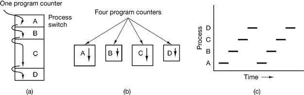

Figure 2-1. (a) Multiprogramming of four programs. (b) Conceptual model of four independent, sequential processes. (c) Only one program is active at once.

### 2.1.2 Process Creation
There are four principal events that cause processes to be created:
1. System initialization.
2. Execution of a process creation system call by a running process.
3. A user request to create a new process.
4. Initiation of a batch job.

Processes that stay in the background to handle some activity such as email, Web pages, news, printing, and so on are called daemons.

### 2.1.3 Process Termination
Sooner or later the new process will terminate, usually due to one of the following conditions:
1. Normal exit (voluntary).
2. Error exit (voluntary).
3. Fatal error (involuntary).
4. Killed by another process (involuntary).

### 2.1.4 Process Hierarchies
In UNIX, a process and all of its children and further descendants together form a process group.

In contrast, Windows does not have any concept of a process hierarchy. All processes are equal. The only place where there is something like a process hierarchy is that when a process is created, the parent is given a special token (called a handle) that it can use to control the child. However, it is free to pass this token to some other process, thus invalidating the hierarchy. Processes in UNIX cannot disinherit their children.

### 2.1.5 Process States
In Fig. 2-2 we see a state diagram showing the three states a process may be in:
1. Running (actually using the CPU at that instant).
2. Ready (runnable; temporarily stopped to let another process run).
3. Blocked (unable to run until some external event happens).

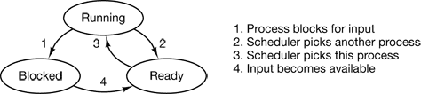

Figure 2-2. A process can be in running, blocked, or ready state. Transitions between these states are as shown.

### 2.1.6 Implementation of Processes
To implement the process model, the operating system maintains a table (an array of structures), called the process table, with one entry per process. (Some authors call these entries process control blocks.)

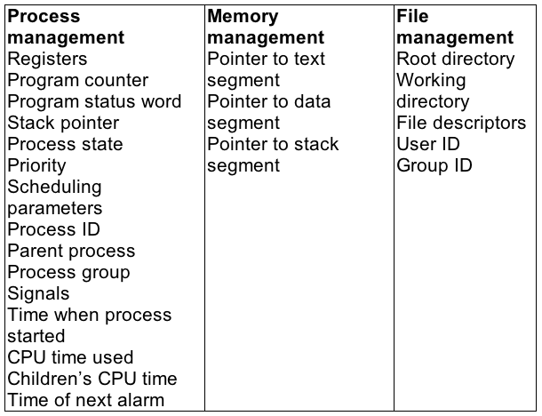

Figure 2-4. Some of the fields of a typical process table entry.

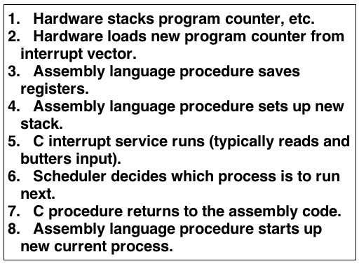

Figure 2-5. Skeleton of what the lowest level of the operating system does when an interrupt occurs.

## 2.2 THREADS
### 2.2.1 The Thread Model
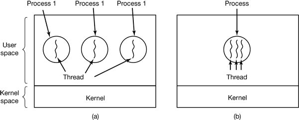

Figure 2-6. (a) Three processes each with one thread. (b) One process with tree threads.

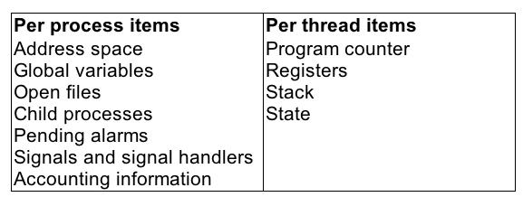

Figure 2-7. The first column lists some items shared by all threads in a process. The second one lists some items private to each thread.

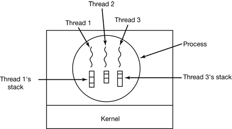

Figure 2-8. Each thread has its own stack.

### 2.2.2 Thread Usage
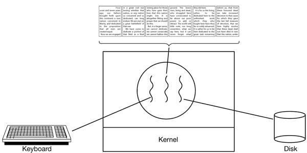

Figure 2-9. A word processor with three threads.

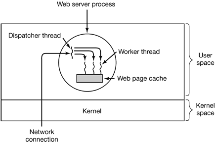

Figure 2-10. A multithreaded Web server.

### 2.2.3 Implementing Threads in User Space
The procedure that saves the thread’s state and the scheduler are just local procedures, so invoking them is much more efficient than making a kernel call. Among other issues, no trap is needed, no context switch is needed, the memory cache need not be flushed, and so on. This makes thread scheduling very fast.

User-level threads also have other advantages. They allow each process to have its own customized scheduling algorithm.

Despite their better performance, user-level threads packages have some major problems. First among these is the problem of how blocking system calls are implemented.  If a thread causes a page fault, the kernel, not even knowing about the existence of threads, naturally blocks the entire process until the disk I/O is complete, even though other threads might be runnable.

Another problem with user-level thread packages is that if a thread starts running, no other thread in that process will ever run unless the first thread voluntarily gives up the CPU.

Another, and probably the most devastating argument against user-level threads, is that programmers generally want threads precisely in applications where the threads block often, as, for example, in a multithreaded Web server. These threads are constantly making system calls. Once a trap has occurred to the kernel to carry out the system call, it is hardly any more work for the kernel to switch threads if the old one has blocked, and having the kernel do this eliminates the need for constantly making select system calls that check to see if read system calls are safe.

### 2.2.4 Implementing Threads in the Kernel
Kernel threads do not require any new, nonblocking system calls. In addition, if one thread in a process causes a page fault, the kernel can easily check to see if the process has any other runnable threads, and if so, run one of them while waiting for the required page to be brought in from the disk. Their main disadvantage is that the cost of a system call is substantial, so if thread operations (creation, termination, etc.) are common, much more overhead will be incurred.

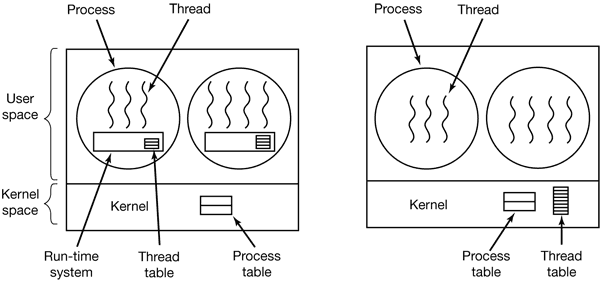

Figure 2-13. (a) A user-level threads package. (b) A threads package managed by the kernel.

### 2.2.5 Hybrid Implementations
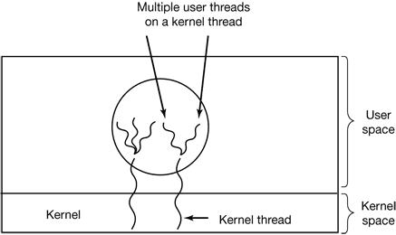

Figure 2-14. Multiplexing user-level threads onto kernel-level threads.

### 2.2.6 Scheduler Activations
Various researchers have attempted to combine the advantage of user threads (good performance) with the advantage of kernel threads (not having to use a lot of tricks to make things work). Below we will describe one such approach devised by Anderson et al. (1992), called scheduler activations.

The goals of the scheduler activation work are to mimic the functionality of kernel threads, but with the better performance and greater flexibility usually associated with threads packages implemented in user space. In particular, user threads should not have to make special nonblocking system calls or check in advance if it is safe to make certain system calls. Nevertheless, when a thread blocks on a system call or on a page fault, it should be possible to run other threads within the same process, if any are ready.

When scheduler activations are used, the kernel assigns a certain number of virtual processors to each process and lets the (user-space) run-time system allocate threads to processors. This mechanism can also be used on a multiprocessor where the virtual processors may be real CPUs.

The basic idea that makes this scheme work is that when the kernel knows that a thread has blocked (e.g., by its having executed a blocking system call or caused a page fault), the kernel notifies the process’ run-time system, passing as parameters on the stack the number of the thread in question and a description of the event that occurred. The notification happens by having the kernel activate the run-time system at a known starting address, roughly analogous to a signal in UNIX. This mechanism is called an upcall.

Once activated like this, the run-time system can reschedule its threads, typically by marking the current thread as blocked and taking another thread from the ready list, setting up its registers, and restarting it. Later, when the kernel learns that the original thread can run again (e.g., the pipe it was trying to read from now contains data, or the page it faulted over bus been brought in from disk), it makes another upcall to the run-time system to inform it of this event. The run-time system, at its own discretion, can either restart the blocked thread immediately, or put it on the ready list to be run later.

### 2.2.7 Pop-Up Threads
The arrival of a message causes the system to create a new thread to handle the message. Such a thread is called a pop-up thread and is illustrated in Fig. 2-15.

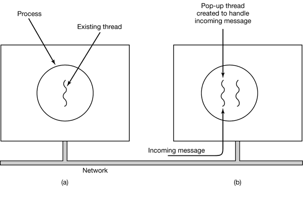

Figure 2-15. Creation of a new thread when a message arrives. (a) Before the message arrives. (b) After the message arrives.

## 2.3 INTERPROCESS COMMUNICATION
In the following sections we will look at some of the issues related to this Interprocess Communication or IPC

Very briefly, there are three issues here. The first was alluded to above: how one process can pass information to another. The second has to do with making sure two or more processes do not get into each other’s way when engaging in critical activities (suppose two processes each try to grab the last 1 MB of memory). The third concerns proper sequencing when dependencies are present: if process A produces data and process B prints them, B has to wait until A has produced some data before starting to print.

### 2.3.1 Race Conditions
Situations like this, where two or more processes are reading or writing some shared data and the final result depends on who runs precisely when, are called race conditions.

### 2.3.2 Critical Regions
What we need is mutual exclusion, that is, some way of making sure that if one process is using a shared variable or file, the other processes will be excluded from doing the same thing.

That part of the program where the shared memory is accessed is called the critical region or critical section. If we could arrange matters such that no two processes were ever in their critical regions at the same time, we could avoid races.

Although this requirement avoids race conditions, this is not sufficient for having parallel processes cooperate correctly and efficiently using shared data. We need four conditions to hold to have a good solution:
1. No two processes may be simultaneously inside their critical regions.
2. No assumptions may be made about speeds or the number of CPUs.
3. No process running outside its critical region may block other processes.
4. No process should have to wait forever to enter its critical region.

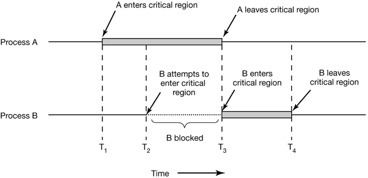

Figure 2-19. Mutual exclusion using critical regions.

2.3.3 Mutual Exclusion with Busy Waiting
Disabling Interrupts The simplest solution is to have each process disable all interrupts just after entering its critical region and re-enable them just before leaving it. With interrupts disabled, no clock interrupts can occur. The CPU is only switched from process to process as a result of clock or other interrupts, after all, and with interrupts turned off the CPU will not be switched to another process. Thus, once a process has disabled interrupts, it can examine and update the shared memory without fear that any other process will intervene.
 
The conclusion is: disabling interrupts is often a useful technique within the operating system itself but is not appropriate as a general mutual exclusion mechanism for user processes.

Lock Variables  Consider having a single, shared (lock) variable, initially 0. When a process wants to enter its critical region, it first tests the lock. If the lock is 0, the process sets it to 1 and enters the critical region. If the lock is already 1, the process just waits until it becomes 0. Thus, a 0 means that no process is in its critical region, and a 1 means that some process is in its critical region.

Unfortunately, this idea contains exactly the same fatal flaw that we saw in the spooler directory. Suppose that one process reads the lock and sees that it is 0. Before it can set the lock to 1, another process is scheduled, runs, and sets the lock to 1. When the first process runs again, it will also set the lock to 1, and two processes will be in their critical regions at the same time.

Strict Alternation Continuously testing a variable until some value appears is called busy waiting. It should usually be avoided, since it wastes CPU time. Only when there is a reasonable expectation that the wait will be short is busy waiting used. A lock that uses busy waiting is called a spin lock.

(a)

```c
while (TRUE) {
    while (turn != 0)   /* loop */ ;
    critical_region();
    turn = 1;
    noncritical_region();
}
```

(b)

```c
while (TRUE) {
    while (turn != 1);  /* loop */ ;
    critical_region();
    turn = 0;
    noncritical_region();
}
```

Figure 2-20. A proposed solution to the critical region problem. (a) Process 0. (b) Process 1. In both cases, be sure to note the semicolons terminating the while statements.

Peterson’s Solution

```c
#define FALSE 0 
#define TRUE  1 
#define N     2      /* number of processes */

int turn;             /* whose turn is it? */ 
int interested[N];    /* all values initially 0 (FALSE) */

void enter_region(int process) /* process is 0 or 1 */ 
{
    int other;                 /* number of the other process */     
    other = 1 − process;       /* the opposite of process */
    interested[process] = TRUE;/* show that you are interested */     
    turn = process;            /* set flag */     
    while (turn == process && interested[other] == TRUE) /* null statement */;
} 

void leave_region (int process) /* process, who is leaving */
{    
    interested[process] = FALSE;/* indicate departure from critical region */
}
```

Figure 2-21. Peterson’s solution for achieving mutual exclusion.

The TSL Instruction Many computers, especially those designed with multiple processors in mind, have an instruction

```
TSL RX,LOCK
```

(Test and Set Lock) that works as follows. It reads the contents of the memory wordlock into register RX and then stores a nonzero value at the memory address lock.The operations of reading the word and storing into it are guaranteed to be indivisible.

```
enter_region:     
    TSL REGISTER,LOCK | copy lock to register and set lock to 1     
    CMP REGISTER,#0   | was lock zero?
    JNE enter_region  | if it was non zero, lock was set, so loop     
    RET               | return to caller; critical region entered
leave_region:    
    MOVE LOCK,#0      | store a 0 in lock    
    RET               | return to caller
```

Figure 2-22. Entering and leaving a critical region using the TSL instruction.

### 2.3.4 Sleep and Wakeup
Consider a computer with two processes, H, with high priority and L, with low priority. The scheduling rules are such that H is run whenever it is in ready state. At a certain moment, with L in its critical region, H becomes ready to run (e.g., an I/O operation completes). H now begins busy waiting, but since L is never scheduled while H is running, L never gets the chance to leave its critical region, soH loops forever. This situation is sometimes referred to as the priority inversion problem.

The Producer-Consumer Problem Two processes share a common, fixed-size buffer. One of them, the producer, puts information into the buffer, and the other one, the consumer, takes it out.

### 2.3.5 Semaphores
Dijkstra proposed having two operations, down and up (generalizations of sleep andwakeup, respectively). The down operation on a semaphore checks to see if the value is greater than 0. If so, it decrements the value (i.e., uses up one stored wakeup) and just continues. If the value is 0, the process is put to sleep without completing the down for the moment. Checking the value, changing it and possibly going to sleep, is all done as a single, indivisible atomic action.

The up operation increments the value of the semaphore addressed. If one or more processes were sleeping on that semaphore, unable to complete an earlier downoperation, one of them is chosen by the system (e.g., at random) and is allowed to complete its down. Thus, after an up on a semaphore with processes sleeping on it, the semaphore will still be 0, but there will be one fewer process sleeping on it. The operation of incrementing the semaphore and waking up one process is also indivisible.

Solving the Producer-Consumer Problem using Semaphores

```c
#define N 100          /* number of slots in the buffer */ 

typedef int semaphore; /* semaphores are a special kind of int */
semaphore mutex = 1;   /* controls access to critical region */ 
semaphore empty = N;   /* counts empty buffer slots */ 
semaphore full = 0;    /* counts full buffer slots */

void producer(void) 
{
    int item; 
    while (TRUE)       /* TRUE is the constant 1 */
    {   
        item = produce_item();/* generate something to put in buffer */            
        down(&empty);         /* decrement empty count */        
        down(&mutex);         /* enter critical region */
        insert_item(item);    /* put new item in buffer */         
        up(&mutex);           /* leave critical region */         
        up(&full);            /* increment count of full slots */
    } 
}

void consumer(void) 
{     
    int item;
    while (TRUE)              /* infinite loop */
    {                      
        down(&full);          /* decrement full count */
        down(&mutex);         /* enter critical region */         
        item a= remove_item(); /* take item from buffer */         
        up(&mutex);            /* leave critical region */
        up(&empty);            /* increment count of empty slots */         
        consume_item(item);    /* do something with the item */     
    }
}
```

Figure 2-24. The producer-consumer problem using semaphores.

### 2.3.6 Mutexes
When the semaphore’s ability to count is not needed, a simplified version of the semaphore, called a mutex, is sometimes used. A mutex is a variable that can be in one of two states: unlocked or locked.

```
mutex_lock:     
    TSL REGISTER,MUTEX   | copy mutex to register and set mutex to 1     
    CMP REGISTERS,#0     | was mutex zero?
    JZE ok               | if it was zero, mutex was unlocked, so return     
    CALL thread_yield    | mutex is busy; schedule another thread     
    JMP mutex_lock       | try again later
ok:   RET                | return to caller; critical region entered  
mutex_unlock:
    MOVE MUTEX,#0        | store a 0 in mutex
    RET                  | return to caller
```

Figure 2-25. Implementation of mutex_lock and mutex_unlock

### 2.3.7 Monitors
To make it easier to write correct programs, Hoare (1974) and Brinch Hansen (1975) proposed a higher-level synchronization primitive called a monitor. Processes may call the procedures in a monitor whenever they want to, but they cannot directly access the monitor’s internal data structures from procedures declared outside the monitor.

Monitors have an important property that makes them useful for achieving mutual exclusion: only one process can be active in a monitor at any instant. Monitors are a programming language construct, so the compiler knows they are special and can handle calls to monitor procedures differently from other procedure calls. Typically, when a process calls a monitor procedure, the first few instructions of the procedure will check to see, if any other process is currently active within the monitor. If so, the calling process will be suspended until the other process has left the monitor. If no other process is using the monitor, the calling process may enter.

Although monitors provide an easy way to achieve mutual exclusion, as we have seen above, that is not enough. We also need a way for processes to block when they cannot proceed. The solution lies in the introduction of condition variables, along with two operations on them, wait and signal. When a monitor procedure discovers that it cannot continue (e.g., the producer finds the buffer full), it does a wait on some condition variable, say, full. This action causes the calling process to block. It also allows another process that had been previously prohibited from entering the monitor to enter now.

```java
public class ProducerConsumer {     
    static final int N = 100;            // constant giving the buffer size
    static producer p = new producer();  // instantiate a new producer thread     
    static consumer c = new consumer();  // instantiate a new consumer thread     
    static our_monitor mon = new our_monitor(); // instantiate a new monitor
    
    public static void main(String args[ ]) {         
        p.start();      // start the producer thread
        c.start();      // start the consumer thread    
    }

static class producer extends Thread {         
    public void run( ) {   // run method contains the thread code              
        int item;
        while(true) {       // producer loop                  
            item = produce_item();                  
            mon.insert(item);
        }         
    }         

    private int produce_item ( ){ … }  // actually produce
}     

static class consumer extends Thread {
    public void run() {    // run method contains the thread code              
        int item;              
        while(true) {      // consumer loop
            item = mon.remove();                  
            consume_item (item);              
        }
    }         

    private void consume_item (int item) { … }     // actually consume     }
    
static class our_monitor {                 // this is a monitor         
    private int buffer[ ] = new int[N];
    private int count = 0, lo = 0, hi = 0; // counters and indices         
    
    public synchronized void insert (int val) {
        if(count == N)
            go_to_sleep();  //if the buffer is full, go to sleep             
        buffer [hi] = val;  // insert an item into the buffer             
        hi = (hi + 1) % N;  // slot to place next item in
        count = count + 1;  // one more item in the buffer now              
        if(count == 1) 
            notify( );      // if consumer was sleeping, wake it up         
    }
        
    public synchronized int remove( ) {              
        int val;
        if(count == 0) 
            go_to_sleep( );   // if the buffer is empty, go to sleep              
        val = buffer [lo];    // fetch an item from the buffer              
        lo = (lo + 1) % N;    // slot to fetch next item from
        count = count − 1;    // one few items in the buffer              
        if(count == N − 1) 
            notify();         // if producer was sleeping, wake it up              
        return val;
    }         

    private void go_to_sleep() { 
        try{wait( );} catch{ InterruptedException exc) {};}     
    }
}
```

Figure 2-28. A solution to the producer-consumer problem in Java.

### 2.3.8 Message Passing
That something else is message passing. This method of interprocess communication uses two primitives, send and receive, which, like semaphores and unlike monitors, are system calls rather than language constructs.

```
send(destination, &message);
receive(source, &message);
```

Message passing is commonly used in parallel programming systems. One well-known message-passing system, for example, is MPI (Message-Passing Interface).

### 2.3.9 Barriers
When a process reaches the barrier, it is blocked until all processes have reached the barrier. The operation of a barrier is illustrated in Fig. 2-30.

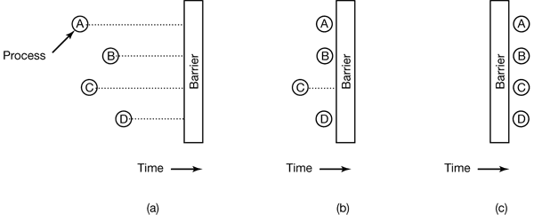

Figure 2-30. Use of a barrier. (a) Processes approaching a barrier. (b) All processes but one blocked at the barrier. (c) When the last process arrives at the barrier, all of them are let through.

## 2.4 CLASSICAL IPC PROBLEMS
### 2.4.1 The Dining Philosophers Problem
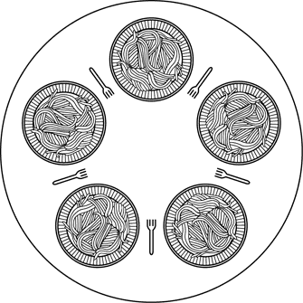

Figure 2-31. Lunch time in the Philosophy Department.

Figure 2-32 shows the obvious solution. The procedure take_fork waits until the specified fork is available and then seizes it. Unfortunately, the obvious solution is wrong. Suppose that all five philosophers take their left forks simultaneously. None will be able to take their right forks, and there will be a deadlock.

```c
#define N 5                /* number of philosophers */
void philosopher(int i)    /* i: philosopher number, from 0 to 4 */
{     
    while (TRUE) 
    {         
        think( );              /* philosopher is thinking */
        take_fork(i);          /* take left fork */         
        take_fork((i+1) % N);  /* take right fork; % is modulo operator */         
        eat();                 /* yum-yum, spaghetti */
        put_fork(i);           /* Put left fork back on the table */         
        put_fork((i+1) % N);   /* put right fork back on the table */     
    }
}
```

Figure 2-32. A nonsolution to the dining philosophers problem.

A situation like this, in which all the programs continue to run indefinitely but fail to make any progress is called starvation

The solution presented in Fig. 2-33 is deadlock-free and allows the maximum parallelism for an arbitrary number of philosophers. It uses an array, state, to keep track of whether a philosopher is eating, thinking, or hungry (trying to acquire forks). A philosopher may move only into eating state if neither neighbor is eating. Philosopher i’s neighbors are defined by the macros LEFT and RICHT. In other words, if i is 2, LEFT is 1 and RIGHT is 3.

The program uses an array of semaphores, one per philosopher, so hungry philosophers can block if the needed forks are busy. Note that each process runs the procedure philosopher as its main code, but the other procedures, take_forks,put_forks, and test are ordinary procedures and not separate processes.

```c
#define N  5             /* number of philosophers */
#define LEFT  (i+N−1)%N  /* number of i's left neighbor */
#define RIGHT (i+1)%N    /* number of i's right neighbor */
#define THINKING 0       /* philosopher is thinking */ 
#define HUNGRY   1       /* philosopher is trying to get forks */ 
#define EATING     2     /* philosopher is eating */

typedef int semaphore;   /* semaphores are a special kind of int */ 
int state[N];            /* array to keep track of everyone's state */ 
semaphore mutex = 1;     /* mutual exclusion for critical regions */
semaphore s[N];          /* one semaphore per philosopher */ 

void philosopher (int i) /* i: philosopher number, from 0 to N−1 */
{     
    while (TRUE)         /* repeat forever */
    {                 
        think();         /* philosopher is thinking */
        take_forks(i);   /* acquire two forks or block */         
        eat();           /* yum-yum, spaghetti */         
        put_forks(i);    /* put both forks back on table */
    } 
}
void take_forks(int i)  /* i: philosopher number, from 0 to N−1 */
{    
    down(&mutex);       /* enter critical region */
    state[i] = HUNGRY;  /* record fact that philosopher i is hungry */     
    test(i);            /* try to acquire 2 forks */     
    up(&mutex);         /* exit critical region */
    down(&s[i]);        /* block if forks were not acquired */ 
}

void put_forks(i)       /* i: philosopher number, from 0 to N−1 */ 
{     
    down(&mutex);       /* enter critical region */
    state[i] = THINKING;/* philosopher has finished eating */     
    test(LEFT);         /* see if left neighbor can now eat */     
    test(RIGHT);        /* see if right neighbor can now eat */
    up(&mutex);         /* exit critical region */ 
}

void test(i)            /* i: philosopher number, from 0 to N−1 */ 
{   
    if (state[i] == HUNGRY && state[LEFT] != EATING && state[RIGHT] != EATING) 
    {
        state[i] = EATING;     
        up(&s[i]);   
    }
}
```

Figure 2-33. A solution to the dining philosophers problem.

### 2.4.2 The Readers and Writers Problem
Imagine, for example, an airline reservation system, with many competing processes wishing to read and write it. It is acceptable to have multiple processes reading the database at the same time, but if one process is updating (writing) the database, no other processes may have access to the database, not even readers. The question is how do you program the readers and the writers? One solution is shown in Fig. 2-34.

```c
typedef int semaphore;         /* use your imagination */ 
semaphore mutex = 1;           /* controls access to 'rc' */ 
semaphore db = 1;              /* controls access to the database */
int rc = 0;                    /* # of processes reading or wanting to */ 

void reader(void)
{     
    while (TRUE)               /* repeat forever */
    {                     
        down(&mutex);          /* get exclusive access to 'rc' */
        rc = rc + 1;           /* one reader more now */         
        if (re == 1) 
            down(&db);         /* if this is the first reader… */         
        up{&mutex);            /* release exclusive access to 'rc' */
        read_data_base();      /* access the data */        
        down(&mutex);          /* get exclusive access to 'rc' */        
        rc = rc − 1;           /* one reader fewer now */

        if (rc == 0) up(&db);  /* if this is the last reader… */         
            up(&mutex);        /* release exclusive access to 'rc' */         
        use_data_read();       /* noncritical region */
    } 
}

void writer(void) 
{     
    while (TRUE)               /* repeat forever */
    {             
        think_up_data();       /* noncritical region */         
        down(&db);             /* get exclusive access */         
        write_data_base();     /* update the data */
        up(&db);               /* release exclusive access */    
    }
}
```
### 2.4.3 The Sleeping Barber Problem
Another classical IPC problem takes place in a barber shop. The barber shop has one barber, one barber chair, and n chairs for waiting customers, if any, to sit on. If there are no customers present, the barber sits down in the barber chair and falls asleep, as illustrated in Fig. 2-35. When a customer arrives, he has to wake up the sleeping barber. If additional customers arrive while the barber is cutting a customer’s hair, they either sit down (if there are empty chairs) or leave the shop (if all chairs are full).

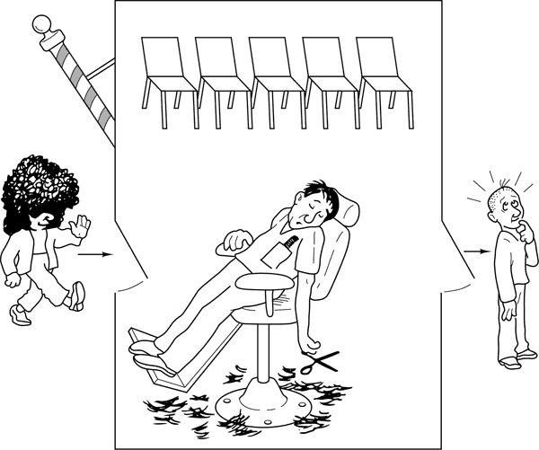

```c
#define CHAIRS 5               /* # chairs for waiting customers */ 
typedef int semaphore;         /* use your imagination */ 
semaphore customers = 0;       /* # of customers waiting for service */
semaphore barbers = 0;         /* # of barbers waiting for customers */ 
semaphore mutex = 1;           /* for mutual exclusion */ 
int waiting = 0;               /* customers are waiting (not being cut) */

void barber(void) 
{
    white (TRUE)
    {        
        down(&customers);      /* go to sleep if # of customers is 0 */        
        down(&mutex);          /* acquire access to 'waiting' */
        waiting = waiting − 1; /* decrement count of waiting customers */            
        up(&barbers);          /* one barber is now ready to cut hair */         
        up(&mutex);            /* release 'waiting' */
        cut_hair();            /* cut hair (outside critical region) */     
    } 
} 

void customer(void) 
{
    down(&mutex);              /* enter critical region */     
    if (waiting < CHAIRS)      /* if there are no free chairs, leave */
    {             
        waiting = waiting + 1; /* increment count of waiting customers */
        up(&customers);        /* wake up barber if necessary */         
        up(&mutex);            /* release access to 'waiting' */         
        down(&barbers);        /* go to sleep if # of free barbers is 0 */
        get_haircut();         /* be seated and be serviced */     
    } 
    else 
    {         
        up(&mutex);            /* shop is full; do not wait */
    }
}
```

Figure 2-36. A solution to the sleeping barber problem.

## 2.5 SCHEDULING
When a computer is multiprogrammed, it frequently has multiple processes competing for the CPU at the same time. This situation occurs whenever two or more processes are simultaneously in the ready state. If only one CPU is available, a choice has to be made which process to run next. The part of the operating system that makes the choice is called the scheduler and the algorithm it uses is called the scheduling algorithm.

Process Behavior


