    作者:  [美] Andrew S·Tanenbaum
    出版社: Prentice Hall
    出版年: 2001-2-21
    页数: 976
    定价: USD 118.00
    装帧: Hardcover
    ISBN: 9780130313584

[豆瓣链接](https://book.douban.com/subject/1476168/)

- [2 PROCESSES AND THREADS](#2-processes-and-threads)
  - [2.1 PROCESSES](#21-processes)
    - [2.1.1 The Process Model](#211-the-process-model)
    - [2.1.2 Process Creation](#212-process-creation)
    - [2.1.3 Process Termination](#213-process-termination)
    - [2.1.4 Process Hierarchies](#214-process-hierarchies)
    - [2.1.5 Process States](#215-process-states)
    - [2.1.6 Implementation of Processes](#216-implementation-of-processes)
  - [2.2 THREADS](#22-threads)
    - [2.2.1 The Thread Model](#221-the-thread-model)
    - [2.2.2 Thread Usage](#222-thread-usage)
    - [2.2.3 Implementing Threads in User Space](#223-implementing-threads-in-user-space)
    - [2.2.4 Implementing Threads in the Kernel](#224-implementing-threads-in-the-kernel)
    - [2.2.5 Hybrid Implementations](#225-hybrid-implementations)
    - [2.2.6 Scheduler Activations](#226-scheduler-activations)
    - [2.2.7 Pop-Up Threads](#227-pop-up-threads)
  - [2.3 INTERPROCESS COMMUNICATION](#23-interprocess-communication)
    - [2.3.1 Race Conditions](#231-race-conditions)
    - [2.3.2 Critical Regions](#232-critical-regions)
    - [2.3.3 Mutual Exclusion with Busy Waiting](#233-mutual-exclusion-with-busy-waiting)
    - [2.3.4 Sleep and Wakeup](#234-sleep-and-wakeup)
    - [2.3.5 Semaphores](#235-semaphores)
    - [2.3.6 Mutexes](#236-mutexes)
    - [2.3.7 Monitors](#237-monitors)
    - [2.3.8 Message Passing](#238-message-passing)
    - [2.3.9 Barriers](#239-barriers)
  - [2.4 CLASSICAL IPC PROBLEMS](#24-classical-ipc-problems)
    - [2.4.1 The Dining Philosophers Problem](#241-the-dining-philosophers-problem)
    - [2.4.2 The Readers and Writers Problem](#242-the-readers-and-writers-problem)
    - [2.4.3 The Sleeping Barber Problem](#243-the-sleeping-barber-problem)
  - [2.5 SCHEDULING](#25-scheduling)
- [3 DEADLOCKS](#3-deadlocks)
  - [3.1 RESOURCES](#31-resources)
  - [3.2 INTRODUCTION TO DEADLOCKS](#32-introduction-to-deadlocks)
  - [3.3 THE OSTRICH ALGORITHM](#33-the-ostrich-algorithm)
  - [3.4 DEADLOCK DETECTION AND RECOVERY](#34-deadlock-detection-and-recovery)
    - [3.4.1 Deadlock Detection with One Resource of Each Type](#341-deadlock-detection-with-one-resource-of-each-type)
    - [3.4.2 Deadlock Detection with Multiple Resource of Each Type](#342-deadlock-detection-with-multiple-resource-of-each-type)
    - [3.4.3 Recovery from Deadlock](#343-recovery-from-deadlock)
  - [3.5 DEADLOCK AVOIDANCE](#35-deadlock-avoidance)
    - [3.5.1 Resource Trajectories](#351-resource-trajectories)
    - [3.5.3 The Banker’s Algorithm for a Single Resource](#353-the-bankers-algorithm-for-a-single-resource)
    - [3.5.4 The Banker’s Algorithm for Multiple Resources](#354-the-bankers-algorithm-for-multiple-resources)
  - [3.6 DEADLOCK PREVENTION](#36-deadlock-prevention)
  - [3.7 OTHER ISSUES](#37-other-issues)
    - [Two-Phase Locking](#two-phase-locking)
- [4 MEMORY MANAGEMENT](#4-memory-management)
  - [4.1 BASIC MEMORY MANAGEMENT](#41-basic-memory-management)
    - [4.1.1 Monoprogramming without Swapping or Paging](#411-monoprogramming-without-swapping-or-paging)
    - [4.1.2 Multiprogramming with Fixed Partitions](#412-multiprogramming-with-fixed-partitions)
    - [4.1.3 Modeling Multiprogramming](#413-modeling-multiprogramming)
    - [4.1.4 Analysis of Multiprogramming System Performance](#414-analysis-of-multiprogramming-system-performance)
    - [4.1.5 Relocation and Protection](#415-relocation-and-protection)
  - [4.2 SWAPPING](#42-swapping)
    - [4.2.1 Memory Management with Bitmaps](#421-memory-management-with-bitmaps)
    - [4.2.2 Memory Management with Linked Lists](#422-memory-management-with-linked-lists)
  - [4.3 VIRTUAL MEMORY](#43-virtual-memory)
    - [4.3.1 Paging](#431-paging)
    - [4.3.2 Page Tables](#432-page-tables)
    - [4.3.3 TLBs—Translation Lookaside Buffers](#433-tlbstranslation-lookaside-buffers)
    - [4.3.4 Inverted Page Tables](#434-inverted-page-tables)
  - [4.4 PAGE REPLACEMENT ALGORITHMS](#44-page-replacement-algorithms)
  - [4.5 MODELING PAGE REPLACEMENT ALGORITHMS](#45-modeling-page-replacement-algorithms)
    - [4.5.1 Belady’s Anomaly](#451-beladys-anomaly)
    - [4.5.2 Stack Algorithms](#452-stack-algorithms)
    - [4.5.3 The Distance String](#453-the-distance-string)
    - [4.5.4 Predicting Page Fault Rates](#454-predicting-page-fault-rates)
  - [4.6 DESIGN ISSUES FOR PAGING SYSTEMS](#46-design-issues-for-paging-systems)
    - [4.6.1 Local versus Global Allocation Policies](#461-local-versus-global-allocation-policies)
    - [4.6.2 Load Control](#462-load-control)
    - [4.6.3 Page Size](#463-page-size)
    - [4.6.4 Separate Instruction and Data Spaces](#464-separate-instruction-and-data-spaces)
    - [4.6.5 Shared Pages](#465-shared-pages)
    - [4.6.6 Cleaning Policy](#466-cleaning-policy)
    - [4.6.7 Virtual Memory Interface](#467-virtual-memory-interface)
  - [4.7 IMPLEMENTATION ISSUES](#47-implementation-issues)
    - [4.7.1 Operating System Involvement with Paging](#471-operating-system-involvement-with-paging)
    - [4.7.2 Page Fault Handling](#472-page-fault-handling)
    - [4.7.3 Instruction Backup](#473-instruction-backup)
    - [4.7.4 Locking Pages in Memory](#474-locking-pages-in-memory)
    - [4.7.5 Backing Store](#475-backing-store)
    - [4.7.6 Separation of Policy and Mechanism](#476-separation-of-policy-and-mechanism)
  - [4.8 SEGMENTATION](#48-segmentation)
    - [4.8.1 Implementation of Pure Segmentation](#481-implementation-of-pure-segmentation)
    - [4.8.2 Segmentation with Paging: MULTICS](#482-segmentation-with-paging-multics)
    - [4.8.3 Segmentation with Paging: The Intel Pentium](#483-segmentation-with-paging-the-intel-pentium)
- [5 INPUT/OUTPUT](#5-inputoutput)
  - [5.1 PRINCIPLES OF I/O HARDWARE](#51-principles-of-io-hardware)
    - [5.1.1 I/O Devices](#511-io-devices)
    - [5.1.2 Device Controllers](#512-device-controllers)
    - [5.1.3 Memory-Mapped I/O](#513-memory-mapped-io)
    - [5.1.4 Direct Memory Access (DMA)](#514-direct-memory-access-dma)
    - [5.1.5 Interrupts Revisited](#515-interrupts-revisited)
  - [5.2 PRINCIPLES OF I/O SOFTWARE](#52-principles-of-io-software)
    - [5.2.1 Goals of the I/O Software](#521-goals-of-the-io-software)
    - [5.2.2 Programmed I/O](#522-programmed-io)
    - [5.2.3 Interrupt-Driven I/O](#523-interrupt-driven-io)
    - [5.2.4 I/O Using DMA](#524-io-using-dma)
  - [5.3 I/O SOFTWARE LAYERS](#53-io-software-layers)
    - [5.3.1 Interrupt Handlers](#531-interrupt-handlers)
    - [5.3.2 Device Drivers](#532-device-drivers)
    - [5.3.3 Device-Independent I/O Software](#533-device-independent-io-software)
    - [5.3.4 User-Space I/O Software](#534-user-space-io-software)
  - [5.4 DISKS](#54-disks)
    - [5.4.1 Disk Hardware](#541-disk-hardware)
    - [5.4.2 Disk Formatting](#542-disk-formatting)
    - [5.4.3 Disk Arm Scheduling Algorithms](#543-disk-arm-scheduling-algorithms)
    - [5.4.4 Error Handling](#544-error-handling)
    - [5.4.5 Stable Storage](#545-stable-storage)
  - [5.5 CLOCKS](#55-clocks)
    - [5.5.1 Clock Hardware](#551-clock-hardware)
    - [5.5.3 Soft Timers](#553-soft-timers)
  - [5.6 CHARACTER-ORIENTED TERMINALS](#56-character-oriented-terminals)
    - [5.6.1 RS-232 Terminal Hardware](#561-rs-232-terminal-hardware)
    - [5.6.2 Input Software](#562-input-software)
    - [5.6.3 Output Software](#563-output-software)
- [6 FILE SYSTEMS](#6-file-systems)
  - [6.1 FILES](#61-files)
    - [6.1.1 File Naming](#611-file-naming)
    - [6.1.2 File Structure](#612-file-structure)
    - [6.1.3 File Types](#613-file-types)
    - [6.1.4 File Access](#614-file-access)
    - [6.1.5 File Attributes](#615-file-attributes)
    - [6.1.6 File Operations](#616-file-operations)
    - [6.1.8 Memory-Mapped Files](#618-memory-mapped-files)
  - [6.2 DIRECTORIES](#62-directories)
    - [6.2.1 Single-Level Directory Systems](#621-single-level-directory-systems)
    - [6.2.2 Two-level Directory Systems](#622-two-level-directory-systems)
    - [6.2.3 Hierarchical Directory Systems](#623-hierarchical-directory-systems)
    - [6.2.4 Path Names](#624-path-names)
    - [6.2.5 Directory Operations](#625-directory-operations)
  - [6.3 FILE SYSTEM IMPLEMENTATION](#63-file-system-implementation)
    - [6.3.1 File System Layout](#631-file-system-layout)
    - [6.3.2 Implementing Files](#632-implementing-files)
    - [6.3.3 Implementing Directories](#633-implementing-directories)
    - [6.3.4 Shared Files](#634-shared-files)
    - [6.3.5 Disk Space Management](#635-disk-space-management)
    - [6.3.6 File System Reliability](#636-file-system-reliability)
    - [6.3.7 File System Performance](#637-file-system-performance)
    - [6.3.8 Log-Structured File Systems](#638-log-structured-file-systems)
- [8 MULTIPLE PROCESSOR SYSTEMS](#8-multiple-processor-systems)
  - [8.1 MULTIPROCESSORS](#81-multiprocessors)
    - [8.1.1 Multiprocessor Hardware](#811-multiprocessor-hardware)
    - [8.1.2 Multiprocessor Operating System Types](#812-multiprocessor-operating-system-types)
    - [8.1.3 Multiprocessor Synchronization](#813-multiprocessor-synchronization)
    - [8.1.4 Multiprocessor Scheduling](#814-multiprocessor-scheduling)
  - [8.2 MULTICOMPUTERS](#82-multicomputers)
    - [8.2.1 Multicomputer Hardware](#821-multicomputer-hardware)
    - [8.2.2 Low-Level Communication Software](#822-low-level-communication-software)
    - [8.2.3 User-Level Communication Software](#823-user-level-communication-software)
    - [8.2.4 Remote Procedure Call](#824-remote-procedure-call)
    - [8.2.5 Distributed Shared Memory](#825-distributed-shared-memory)
    - [8.2.6 Multicomputer Scheduling](#826-multicomputer-scheduling)
    - [8.2.7 Load Balancing](#827-load-balancing)
  - [8.3 DISTRIBUTED SYSTEMS](#83-distributed-systems)
- [9 SECURITY](#9-security)
  - [9.2 BASICS OF CRYPTOGRAPHY](#92-basics-of-cryptography)
    - [9.2.1 Secret-Key Cryptography](#921-secret-key-cryptography)
    - [9.2.2 Public-Key Cryptography](#922-public-key-cryptography)
    - [9.2.3 One-Way Functions](#923-one-way-functions)
    - [9.2.4 Digital Signatures](#924-digital-signatures)

# 2 PROCESSES AND THREADS
The most central concept in any operating system is the `process`: an abstraction of a running program.

## 2.1 PROCESSES
While, strictly speaking, at any instant of time, the CPU is running only one program, in the course of 1 second, it may work on several programs, thus giving the users the illusion of parallelism. Sometimes people speak of pseudoparallelism in this context, to contrast it with the true hardware parallelism of multiprocessor systems(which have two or more CPUs sharing the same physical memory).

### 2.1.1 The Process Model
In this model, all the runnable software on the computer, sometimes including the operating system, is organized into a number of sequential processes, or just processes for short. In reality, of course, the real CPU switches back and forth from process to process, but to understand the system, it is much easier to think about a collection of processes running in (pseudo) parallel, than to try to keep track of how the CPU switches from program to program. This rapid switching back and forth is called `multiprogramming`.


Figure 2-1. (a) Multiprogramming of four programs. (b) Conceptual model of four independent, sequential processes. (c) Only one program is active at once.

### 2.1.2 Process Creation
There are four principal events that cause processes to be created:
1. System initialization.
2. Execution of a process creation system call by a running process.
3. A user request to create a new process.
4. Initiation of a batch job.

Processes that stay in the background to handle some activity such as email, Web pages, news, printing, and so on are called daemons.

### 2.1.3 Process Termination
Sooner or later the new process will terminate, usually due to one of the following conditions:
1. Normal exit (voluntary).
2. Error exit (voluntary).
3. Fatal error (involuntary).
4. Killed by another process (involuntary).

### 2.1.4 Process Hierarchies
In UNIX, a process and all of its children and further descendants together form a process group.

In contrast, Windows does not have any concept of a process hierarchy. All processes are equal. The only place where there is something like a process hierarchy is that when a process is created, the parent is given a special token (called a handle) that it can use to control the child. However, it is free to pass this token to some other process, thus invalidating the hierarchy. Processes in UNIX cannot disinherit their children.

### 2.1.5 Process States
In Fig. 2-2 we see a state diagram showing the three states a process may be in:
1. Running (actually using the CPU at that instant).
2. Ready (runnable; temporarily stopped to let another process run).
3. Blocked (unable to run until some external event happens).


Figure 2-2. A process can be in running, blocked, or ready state. Transitions between these states are as shown.

### 2.1.6 Implementation of Processes
To implement the process model, the operating system maintains a table (an array of structures), called the `process table`, with one entry per process. (Some authors call these entries process control blocks.)


Figure 2-4. Some of the fields of a typical process table entry.


Figure 2-5. Skeleton of what the lowest level of the operating system does when an interrupt occurs.

## 2.2 THREADS
### 2.2.1 The Thread Model


Figure 2-6. (a) Three processes each with one thread. (b) One process with tree threads.


Figure 2-7. The first column lists some items shared by all threads in a process. The second one lists some items private to each thread.


Figure 2-8. Each thread has its own stack.

### 2.2.2 Thread Usage


Figure 2-9. A word processor with three threads.


Figure 2-10. A multithreaded Web server.

### 2.2.3 Implementing Threads in User Space
The procedure that saves the thread’s state and the scheduler are just local procedures, so invoking them is much more efficient than making a kernel call. Among other issues, no trap is needed, no context switch is needed, the memory cache need not be flushed, and so on. This makes thread scheduling very fast.

User-level threads also have other advantages. They allow each process to have its own customized scheduling algorithm.

Despite their better performance, user-level threads packages have some major problems. First among these is the problem of how blocking system calls are implemented.  If a thread causes a page fault, the kernel, not even knowing about the existence of threads, naturally blocks the entire process until the disk I/O is complete, even though other threads might be runnable.

Another problem with user-level thread packages is that if a thread starts running, no other thread in that process will ever run unless the first thread voluntarily gives up the CPU.

Another, and probably the most devastating argument against user-level threads, is that programmers generally want threads precisely in applications where the threads block often, as, for example, in a multithreaded Web server. These threads are constantly making system calls. Once a trap has occurred to the kernel to carry out the system call, it is hardly any more work for the kernel to switch threads if the old one has blocked, and having the kernel do this eliminates the need for constantly making select system calls that check to see if read system calls are safe.

### 2.2.4 Implementing Threads in the Kernel
Kernel threads do not require any new, nonblocking system calls. In addition, if one thread in a process causes a page fault, the kernel can easily check to see if the process has any other runnable threads, and if so, run one of them while waiting for the required page to be brought in from the disk. Their main disadvantage is that the cost of a system call is substantial, so if thread operations (creation, termination, etc.) are common, much more overhead will be incurred.


Figure 2-13. (a) A user-level threads package. (b) A threads package managed by the kernel.

### 2.2.5 Hybrid Implementations


Figure 2-14. Multiplexing user-level threads onto kernel-level threads.

### 2.2.6 Scheduler Activations
Various researchers have attempted to combine the advantage of user threads (good performance) with the advantage of kernel threads (not having to use a lot of tricks to make things work). Below we will describe one such approach devised by Anderson et al. (1992), called scheduler activations.

The goals of the scheduler activation work are to mimic the functionality of kernel threads, but with the better performance and greater flexibility usually associated with threads packages implemented in user space. In particular, user threads should not have to make special nonblocking system calls or check in advance if it is safe to make certain system calls. Nevertheless, when a thread blocks on a system call or on a page fault, it should be possible to run other threads within the same process, if any are ready.

When scheduler activations are used, the kernel assigns a certain number of virtual processors to each process and lets the (user-space) run-time system allocate threads to processors. This mechanism can also be used on a multiprocessor where the virtual processors may be real CPUs.

The basic idea that makes this scheme work is that when the kernel knows that a thread has blocked (e.g., by its having executed a blocking system call or caused a page fault), the kernel notifies the process’ run-time system, passing as parameters on the stack the number of the thread in question and a description of the event that occurred. The notification happens by having the kernel activate the run-time system at a known starting address, roughly analogous to a signal in UNIX. This mechanism is called an upcall.

Once activated like this, the run-time system can reschedule its threads, typically by marking the current thread as blocked and taking another thread from the ready list, setting up its registers, and restarting it. Later, when the kernel learns that the original thread can run again (e.g., the pipe it was trying to read from now contains data, or the page it faulted over bus been brought in from disk), it makes another upcall to the run-time system to inform it of this event. The run-time system, at its own discretion, can either restart the blocked thread immediately, or put it on the ready list to be run later.

### 2.2.7 Pop-Up Threads
The arrival of a message causes the system to create a new thread to handle the message. Such a thread is called a pop-up thread and is illustrated in Fig. 2-15.


Figure 2-15. Creation of a new thread when a message arrives. (a) Before the message arrives. (b) After the message arrives.

## 2.3 INTERPROCESS COMMUNICATION
In the following sections we will look at some of the issues related to this `Interprocess Communication` or `IPC`.

Very briefly, there are three issues here. The first was alluded to above: how one process can pass information to another. The second has to do with making sure two or more processes do not get into each other’s way when engaging in critical activities (suppose two processes each try to grab the last 1 MB of memory). The third concerns proper sequencing when dependencies are present: if process A produces data and process B prints them, B has to wait until A has produced some data before starting to print.

### 2.3.1 Race Conditions
Situations like this, where two or more processes are reading or writing some shared data and the final result depends on who runs precisely when, are called `race conditions`.

### 2.3.2 Critical Regions
What we need is mutual exclusion, that is, some way of making sure that if one process is using a shared variable or file, the other processes will be excluded from doing the same thing.

That part of the program where the shared memory is accessed is called the `critical region` or critical section. If we could arrange matters such that no two processes were ever in their critical regions at the same time, we could avoid races.

Although this requirement avoids race conditions, this is not sufficient for having parallel processes cooperate correctly and efficiently using shared data. We need four conditions to hold to have a good solution:
1. No two processes may be simultaneously inside their critical regions.
2. No assumptions may be made about speeds or the number of CPUs.
3. No process running outside its critical region may block other processes.
4. No process should have to wait forever to enter its critical region.


Figure 2-19. Mutual exclusion using critical regions.

### 2.3.3 Mutual Exclusion with Busy Waiting
Disabling Interrupts The simplest solution is to have each process disable all interrupts just after entering its critical region and re-enable them just before leaving it. With interrupts disabled, no clock interrupts can occur. The CPU is only switched from process to process as a result of clock or other interrupts, after all, and with interrupts turned off the CPU will not be switched to another process. Thus, once a process has disabled interrupts, it can examine and update the shared memory without fear that any other process will intervene.
 
The conclusion is: disabling interrupts is often a useful technique within the operating system itself but is not appropriate as a general mutual exclusion mechanism for user processes.

Lock Variables  Consider having a single, shared (lock) variable, initially 0. When a process wants to enter its critical region, it first tests the lock. If the lock is 0, the process sets it to 1 and enters the critical region. If the lock is already 1, the process just waits until it becomes 0. Thus, a 0 means that no process is in its critical region, and a 1 means that some process is in its critical region.

Unfortunately, this idea contains exactly the same fatal flaw that we saw in the spooler directory. Suppose that one process reads the lock and sees that it is 0. Before it can set the lock to 1, another process is scheduled, runs, and sets the lock to 1. When the first process runs again, it will also set the lock to 1, and two processes will be in their critical regions at the same time.

Strict Alternation Continuously testing a variable until some value appears is called busy waiting. It should usually be avoided, since it wastes CPU time. Only when there is a reasonable expectation that the wait will be short is busy waiting used. A lock that uses busy waiting is called a spin lock.

(a)

```c
while (TRUE) {
    while (turn != 0)   /* loop */ ;
    critical_region();
    turn = 1;
    noncritical_region();
}
```

(b)

```c
while (TRUE) {
    while (turn != 1);  /* loop */ ;
    critical_region();
    turn = 0;
    noncritical_region();
}
```

Figure 2-20. A proposed solution to the critical region problem. (a) Process 0. (b) Process 1. In both cases, be sure to note the semicolons terminating the while statements.

Peterson’s Solution

```c
#define FALSE 0 
#define TRUE  1 
#define N     2      /* number of processes */

int turn;             /* whose turn is it? */ 
int interested[N];    /* all values initially 0 (FALSE) */

void enter_region(int process) /* process is 0 or 1 */ 
{
    int other;                 /* number of the other process */     
    other = 1 − process;       /* the opposite of process */
    interested[process] = TRUE;/* show that you are interested */     
    turn = process;            /* set flag */     
    while (turn == process && interested[other] == TRUE) /* null statement */;
} 

void leave_region (int process) /* process, who is leaving */
{    
    interested[process] = FALSE;/* indicate departure from critical region */
}
```

Figure 2-21. Peterson’s solution for achieving mutual exclusion.

The TSL Instruction Many computers, especially those designed with multiple processors in mind, have an instruction

```
TSL RX,LOCK
```

(Test and Set Lock) that works as follows. It reads the contents of the memory wordlock into register RX and then stores a nonzero value at the memory address lock.The operations of reading the word and storing into it are guaranteed to be indivisible.

```
enter_region:     
    TSL REGISTER,LOCK | copy lock to register and set lock to 1     
    CMP REGISTER,#0   | was lock zero?
    JNE enter_region  | if it was non zero, lock was set, so loop     
    RET               | return to caller; critical region entered
leave_region:    
    MOVE LOCK,#0      | store a 0 in lock    
    RET               | return to caller
```

Figure 2-22. Entering and leaving a critical region using the TSL instruction.

### 2.3.4 Sleep and Wakeup
Consider a computer with two processes, H, with high priority and L, with low priority. The scheduling rules are such that H is run whenever it is in ready state. At a certain moment, with L in its critical region, H becomes ready to run (e.g., an I/O operation completes). H now begins busy waiting, but since L is never scheduled while H is running, L never gets the chance to leave its critical region, soH loops forever. This situation is sometimes referred to as the priority inversion problem.

The Producer-Consumer Problem Two processes share a common, fixed-size buffer. One of them, the producer, puts information into the buffer, and the other one, the consumer, takes it out.

### 2.3.5 Semaphores
Dijkstra proposed having two operations, down and up (generalizations of sleep andwakeup, respectively). The down operation on a semaphore checks to see if the value is greater than 0. If so, it decrements the value (i.e., uses up one stored wakeup) and just continues. If the value is 0, the process is put to sleep without completing the down for the moment. Checking the value, changing it and possibly going to sleep, is all done as a single, indivisible atomic action.

The up operation increments the value of the semaphore addressed. If one or more processes were sleeping on that semaphore, unable to complete an earlier downoperation, one of them is chosen by the system (e.g., at random) and is allowed to complete its down. Thus, after an up on a semaphore with processes sleeping on it, the semaphore will still be 0, but there will be one fewer process sleeping on it. The operation of incrementing the semaphore and waking up one process is also indivisible.

Solving the Producer-Consumer Problem using Semaphores

```c
#define N 100          /* number of slots in the buffer */ 

typedef int semaphore; /* semaphores are a special kind of int */
semaphore mutex = 1;   /* controls access to critical region */ 
semaphore empty = N;   /* counts empty buffer slots */ 
semaphore full = 0;    /* counts full buffer slots */

void producer(void) 
{
    int item; 
    while (TRUE)       /* TRUE is the constant 1 */
    {   
        item = produce_item();/* generate something to put in buffer */            
        down(&empty);         /* decrement empty count */        
        down(&mutex);         /* enter critical region */
        insert_item(item);    /* put new item in buffer */         
        up(&mutex);           /* leave critical region */         
        up(&full);            /* increment count of full slots */
    } 
}

void consumer(void) 
{     
    int item;
    while (TRUE)              /* infinite loop */
    {                      
        down(&full);          /* decrement full count */
        down(&mutex);         /* enter critical region */         
        item a= remove_item(); /* take item from buffer */         
        up(&mutex);            /* leave critical region */
        up(&empty);            /* increment count of empty slots */         
        consume_item(item);    /* do something with the item */     
    }
}
```

Figure 2-24. The producer-consumer problem using semaphores.

### 2.3.6 Mutexes
When the semaphore’s ability to count is not needed, a simplified version of the semaphore, called a mutex, is sometimes used. A mutex is a variable that can be in one of two states: unlocked or locked.

```
mutex_lock:     
    TSL REGISTER,MUTEX   | copy mutex to register and set mutex to 1     
    CMP REGISTERS,#0     | was mutex zero?
    JZE ok               | if it was zero, mutex was unlocked, so return     
    CALL thread_yield    | mutex is busy; schedule another thread     
    JMP mutex_lock       | try again later
ok:   RET                | return to caller; critical region entered  
mutex_unlock:
    MOVE MUTEX,#0        | store a 0 in mutex
    RET                  | return to caller
```

Figure 2-25. Implementation of mutex_lock and mutex_unlock

### 2.3.7 Monitors
To make it easier to write correct programs, Hoare (1974) and Brinch Hansen (1975) proposed a higher-level synchronization primitive called a monitor. Processes may call the procedures in a monitor whenever they want to, but they cannot directly access the monitor’s internal data structures from procedures declared outside the monitor.

Monitors have an important property that makes them useful for achieving mutual exclusion: only one process can be active in a monitor at any instant. Monitors are a programming language construct, so the compiler knows they are special and can handle calls to monitor procedures differently from other procedure calls. Typically, when a process calls a monitor procedure, the first few instructions of the procedure will check to see, if any other process is currently active within the monitor. If so, the calling process will be suspended until the other process has left the monitor. If no other process is using the monitor, the calling process may enter.

Although monitors provide an easy way to achieve mutual exclusion, as we have seen above, that is not enough. We also need a way for processes to block when they cannot proceed. The solution lies in the introduction of condition variables, along with two operations on them, wait and signal. When a monitor procedure discovers that it cannot continue (e.g., the producer finds the buffer full), it does a wait on some condition variable, say, full. This action causes the calling process to block. It also allows another process that had been previously prohibited from entering the monitor to enter now.

```java
public class ProducerConsumer {     
    static final int N = 100;            // constant giving the buffer size
    static producer p = new producer();  // instantiate a new producer thread     
    static consumer c = new consumer();  // instantiate a new consumer thread     
    static our_monitor mon = new our_monitor(); // instantiate a new monitor
    
    public static void main(String args[ ]) {         
        p.start();      // start the producer thread
        c.start();      // start the consumer thread    
    }

static class producer extends Thread {         
    public void run( ) {   // run method contains the thread code              
        int item;
        while(true) {       // producer loop                  
            item = produce_item();                  
            mon.insert(item);
        }         
    }         

    private int produce_item ( ){ … }  // actually produce
}     

static class consumer extends Thread {
    public void run() {    // run method contains the thread code              
        int item;              
        while(true) {      // consumer loop
            item = mon.remove();                  
            consume_item (item);              
        }
    }         

    private void consume_item (int item) { … }     // actually consume     }
    
static class our_monitor {                 // this is a monitor         
    private int buffer[ ] = new int[N];
    private int count = 0, lo = 0, hi = 0; // counters and indices         
    
    public synchronized void insert (int val) {
        if(count == N)
            go_to_sleep();  //if the buffer is full, go to sleep             
        buffer [hi] = val;  // insert an item into the buffer             
        hi = (hi + 1) % N;  // slot to place next item in
        count = count + 1;  // one more item in the buffer now              
        if(count == 1) 
            notify( );      // if consumer was sleeping, wake it up         
    }
        
    public synchronized int remove( ) {              
        int val;
        if(count == 0) 
            go_to_sleep( );   // if the buffer is empty, go to sleep              
        val = buffer [lo];    // fetch an item from the buffer              
        lo = (lo + 1) % N;    // slot to fetch next item from
        count = count − 1;    // one few items in the buffer              
        if(count == N − 1) 
            notify();         // if producer was sleeping, wake it up              
        return val;
    }         

    private void go_to_sleep() { 
        try{wait( );} catch{ InterruptedException exc) {};}     
    }
}
```

Figure 2-28. A solution to the producer-consumer problem in Java.

### 2.3.8 Message Passing
That something else is message passing. This method of interprocess communication uses two primitives, send and receive, which, like semaphores and unlike monitors, are system calls rather than language constructs.

```
send(destination, &message);
receive(source, &message);
```

Message passing is commonly used in parallel programming systems. One well-known message-passing system, for example, is MPI (Message-Passing Interface).

### 2.3.9 Barriers
When a process reaches the barrier, it is blocked until all processes have reached the barrier. The operation of a barrier is illustrated in Fig. 2-30.


Figure 2-30. Use of a barrier. (a) Processes approaching a barrier. (b) All processes but one blocked at the barrier. (c) When the last process arrives at the barrier, all of them are let through.

## 2.4 CLASSICAL IPC PROBLEMS
### 2.4.1 The Dining Philosophers Problem


Figure 2-31. Lunch time in the Philosophy Department.

Figure 2-32 shows the obvious solution. The procedure take_fork waits until the specified fork is available and then seizes it. Unfortunately, the obvious solution is wrong. Suppose that all five philosophers take their left forks simultaneously. None will be able to take their right forks, and there will be a deadlock.

```c
#define N 5                /* number of philosophers */
void philosopher(int i)    /* i: philosopher number, from 0 to 4 */
{     
    while (TRUE) 
    {         
        think( );              /* philosopher is thinking */
        take_fork(i);          /* take left fork */         
        take_fork((i+1) % N);  /* take right fork; % is modulo operator */         
        eat();                 /* yum-yum, spaghetti */
        put_fork(i);           /* Put left fork back on the table */         
        put_fork((i+1) % N);   /* put right fork back on the table */     
    }
}
```

Figure 2-32. A nonsolution to the dining philosophers problem.

A situation like this, in which all the programs continue to run indefinitely but fail to make any progress is called starvation

The solution presented in Fig. 2-33 is deadlock-free and allows the maximum parallelism for an arbitrary number of philosophers. It uses an array, state, to keep track of whether a philosopher is eating, thinking, or hungry (trying to acquire forks). A philosopher may move only into eating state if neither neighbor is eating. Philosopher i’s neighbors are defined by the macros LEFT and RICHT. In other words, if i is 2, LEFT is 1 and RIGHT is 3.

The program uses an array of semaphores, one per philosopher, so hungry philosophers can block if the needed forks are busy. Note that each process runs the procedure philosopher as its main code, but the other procedures, take_forks,put_forks, and test are ordinary procedures and not separate processes.

```c
#define N  5             /* number of philosophers */
#define LEFT  (i+N−1)%N  /* number of i's left neighbor */
#define RIGHT (i+1)%N    /* number of i's right neighbor */
#define THINKING 0       /* philosopher is thinking */ 
#define HUNGRY   1       /* philosopher is trying to get forks */ 
#define EATING     2     /* philosopher is eating */

typedef int semaphore;   /* semaphores are a special kind of int */ 
int state[N];            /* array to keep track of everyone's state */ 
semaphore mutex = 1;     /* mutual exclusion for critical regions */
semaphore s[N];          /* one semaphore per philosopher */ 

void philosopher (int i) /* i: philosopher number, from 0 to N−1 */
{     
    while (TRUE)         /* repeat forever */
    {                 
        think();         /* philosopher is thinking */
        take_forks(i);   /* acquire two forks or block */         
        eat();           /* yum-yum, spaghetti */         
        put_forks(i);    /* put both forks back on table */
    } 
}
void take_forks(int i)  /* i: philosopher number, from 0 to N−1 */
{    
    down(&mutex);       /* enter critical region */
    state[i] = HUNGRY;  /* record fact that philosopher i is hungry */     
    test(i);            /* try to acquire 2 forks */     
    up(&mutex);         /* exit critical region */
    down(&s[i]);        /* block if forks were not acquired */ 
}

void put_forks(i)       /* i: philosopher number, from 0 to N−1 */ 
{     
    down(&mutex);       /* enter critical region */
    state[i] = THINKING;/* philosopher has finished eating */     
    test(LEFT);         /* see if left neighbor can now eat */     
    test(RIGHT);        /* see if right neighbor can now eat */
    up(&mutex);         /* exit critical region */ 
}

void test(i)            /* i: philosopher number, from 0 to N−1 */ 
{   
    if (state[i] == HUNGRY && state[LEFT] != EATING && state[RIGHT] != EATING) 
    {
        state[i] = EATING;     
        up(&s[i]);   
    }
}
```

Figure 2-33. A solution to the dining philosophers problem.

### 2.4.2 The Readers and Writers Problem
Imagine, for example, an airline reservation system, with many competing processes wishing to read and write it. It is acceptable to have multiple processes reading the database at the same time, but if one process is updating (writing) the database, no other processes may have access to the database, not even readers. The question is how do you program the readers and the writers? One solution is shown in Fig. 2-34.

```c
typedef int semaphore;         /* use your imagination */ 
semaphore mutex = 1;           /* controls access to 'rc' */ 
semaphore db = 1;              /* controls access to the database */
int rc = 0;                    /* # of processes reading or wanting to */ 

void reader(void)
{     
    while (TRUE)               /* repeat forever */
    {                     
        down(&mutex);          /* get exclusive access to 'rc' */
        rc = rc + 1;           /* one reader more now */         
        if (re == 1) 
            down(&db);         /* if this is the first reader… */         
        up{&mutex);            /* release exclusive access to 'rc' */
        read_data_base();      /* access the data */        
        down(&mutex);          /* get exclusive access to 'rc' */        
        rc = rc − 1;           /* one reader fewer now */

        if (rc == 0) up(&db);  /* if this is the last reader… */         
            up(&mutex);        /* release exclusive access to 'rc' */         
        use_data_read();       /* noncritical region */
    } 
}

void writer(void) 
{     
    while (TRUE)               /* repeat forever */
    {             
        think_up_data();       /* noncritical region */         
        down(&db);             /* get exclusive access */         
        write_data_base();     /* update the data */
        up(&db);               /* release exclusive access */    
    }
}
```
### 2.4.3 The Sleeping Barber Problem
Another classical IPC problem takes place in a barber shop. The barber shop has one barber, one barber chair, and n chairs for waiting customers, if any, to sit on. If there are no customers present, the barber sits down in the barber chair and falls asleep, as illustrated in Fig. 2-35. When a customer arrives, he has to wake up the sleeping barber. If additional customers arrive while the barber is cutting a customer’s hair, they either sit down (if there are empty chairs) or leave the shop (if all chairs are full).


```c
#define CHAIRS 5               /* # chairs for waiting customers */ 
typedef int semaphore;         /* use your imagination */ 
semaphore customers = 0;       /* # of customers waiting for service */
semaphore barbers = 0;         /* # of barbers waiting for customers */ 
semaphore mutex = 1;           /* for mutual exclusion */ 
int waiting = 0;               /* customers are waiting (not being cut) */

void barber(void) 
{
    white (TRUE)
    {        
        down(&customers);      /* go to sleep if # of customers is 0 */        
        down(&mutex);          /* acquire access to 'waiting' */
        waiting = waiting − 1; /* decrement count of waiting customers */            
        up(&barbers);          /* one barber is now ready to cut hair */         
        up(&mutex);            /* release 'waiting' */
        cut_hair();            /* cut hair (outside critical region) */     
    } 
} 

void customer(void) 
{
    down(&mutex);              /* enter critical region */     
    if (waiting < CHAIRS)      /* if there are no free chairs, leave */
    {             
        waiting = waiting + 1; /* increment count of waiting customers */
        up(&customers);        /* wake up barber if necessary */         
        up(&mutex);            /* release access to 'waiting' */         
        down(&barbers);        /* go to sleep if # of free barbers is 0 */
        get_haircut();         /* be seated and be serviced */     
    } 
    else 
    {         
        up(&mutex);            /* shop is full; do not wait */
    }
}
```

Figure 2-36. A solution to the sleeping barber problem.

## 2.5 SCHEDULING
When a computer is multiprogrammed, it frequently has multiple processes competing for the CPU at the same time. This situation occurs whenever two or more processes are simultaneously in the ready state. If only one CPU is available, a choice has to be made which process to run next. The part of the operating system that makes the choice is called the scheduler and the algorithm it uses is called the scheduling algorithm.

Process Behavior

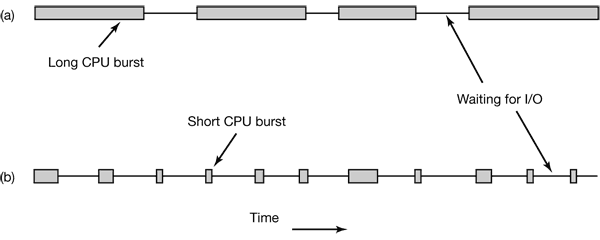

Figure 2-37. Bursts of CPU usage alternate with periods of waiting for I/O. (a) A CPU-bound process. (b) An I/O-bound process.

The important thing to notice about Fig. 2-37 is that some processes, such as the one in Fig. 2-37(a), spend most of their time computing, while others, such as the one in Fig. 2-37(b), spend most of their time waiting for I/O. The former are called compute-bound; the latter are called I/O-bound.

When to Schedule 

A nonpreemptive scheduling algorithm picks a process to run and then just lets it run until it blocks (either on I/O or waiting for another process) or until it voluntarily releases the CPU. In contrast, a preemptive scheduling algorithm picks a process and lets it run for a maximum of some fixed time.

Categories of Scheduling Algorithms
1. Batch.
2. Interactive.
3. Real time.

Scheduling Algorithm Goals
* All systems
    * Fairness - giving each process a fair share of the CPU
    * Policy enforcement - seeing that stated policy is carried out
    * Balance - keeping all parts of the system busy
* Batch systems
    * Throughput - maximize jobs per hour
    * Turnaround time - minimize time between submission and termination
    * CPU utilization - keep the CPU busy all the time
* Interactive systems
    * Response time - respond to requests quickly
    * Proportionality - meet users’ expectations
* Real-time systems
    * Meeting deadlines - avoid losing data
    * Predictability - avoid quality degradation in multimedia systems

Scheduling in Batch Systems
* First-Come First-Served
* Shortest Job First
* Shortest Remaining Time Next
    * A preemptive version of shortest job first is shortest remaining time next.
* Three-Level Scheduling

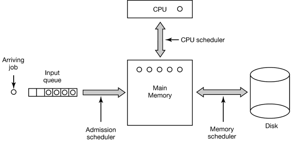

As jobs arrive at the system, they are initially placed in an input queue stored on the disk. The admission scheduler decides which jobs to admit to the system. The others are kept in the input queue until they are selected. A typical algorithm for admission control might be to look for a mix of compute-bound jobs and I/O-bound jobs. Alternatively, short jobs could be admitted quickly whereas longer jobs would have to wait. The admission scheduler is free to hold some jobs in the input queue and admit jobs that arrive later if it so chooses.

Once a job has been admitted to the system, a process can be created for it and it can contend for the CPU. However, it might well happen that the number of processes is so large that there is not enough room for all of them in memory. In that case, some of the processes have to be swapped out to disk. The second level of scheduling is deciding which processes should be kept in memory and which ones kept on disk. We will call this scheduler the memory scheduler, since it determines which processes are kept in memory and which on the disk.

The third level of scheduling is actually picking one of the ready processes in main memory to run next. Often this is called the CPU scheduler and is the one people usually mean when they talk about the “scheduler.” Any suitable algorithm can be used here, either preemptive or nonpreemptive.

Scheduling in Interactive Systems
* Round-Robin Scheduling
* Priority Scheduling
* Shortest Process Next
* Guaranteed Scheduling
* Lottery Scheduling
* Fair-Share Scheduling

# 3 DEADLOCKS
## 3.1 RESOURCES
Deadlocks can occur when processes have been granted exclusive access to devices, files, and so forth. To make the discussion of deadlocks as general as possible, we will refer to the objects granted as resources.

## 3.2 INTRODUCTION TO DEADLOCKS
Deadlock can be defined formally as follows:A set of processes is deadlocked if each process in the set is waiting for an event that only another process in the set can cause.

Coffman et al. (1971) showed that four conditions must hold for there to be a deadlock:
1. Mutual exclusion condition. Each resource is either currently assigned to exactly one process or is available.
2. Hold and wait condition. Processes currently holding resources granted earlier can request new resources.
3. No preemption condition. Resources previously granted cannot be forcibly taken away from a process. They must be explicitly released by the process holding them.
4. Circular wait condition. There must be a circular chain of two or more processes, each of which is waiting for a resource held by the next member of the chain.

In general, four strategies are used for dealing with deadlocks.
1. Just ignore the problem altogether. Maybe if you ignore it, it will ignore you.
2. Detection and recovery. Let deadlocks occur, detect them, and take action.
3. Dynamic avoidance by careful resource allocation.
4. Prevention, by structurally negating one of the four conditions necessary to cause a deadlock.

## 3.3 THE OSTRICH ALGORITHM
The simplest approach is the ostrich algorithm: stick your head in the sand and pretend there is no problem at all.

## 3.4 DEADLOCK DETECTION AND RECOVERY
### 3.4.1 Deadlock Detection with One Resource of Each Type
The state of which resources are currently owned and which ones are currently being requested is as follows:
1. Process A holds R and wants S.
2. Process B holds nothing but wants T.
3. Process C holds nothing but wants S.
4. Process D holds U and wants S and T.
5. Process E holds T and wants V.
6. Process F holds W and wants S.
7. Process G holds V and wants U.

The question is: “Is this system deadlocked, and if so, which processes are involved?”

To answer this question, we can construct the resource graph of Fig. 3-5(a). This graph contains one cycle, which can be seen by visual inspection. The cycle is shown in Fig. 3-5(b). From this cycle, we can see that processes D, E, and G are all deadlocked.

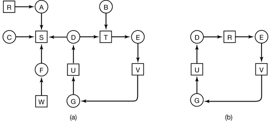

Figure 3-5. (a) A resource graph. (b) A cycle extracted from (a).

The algorithm operates by carrying out the following steps as specified:
1. For each node, N in the graph, perform the following 5 steps with N as the starting node.
2. Initialize L to the empty list, and designate all the arcs as unmarked.
3. Add the current node to the end of L and check to see if the node now appears in L two times. If it does, the graph contains a cycle (listed in L) and the algorithm terminates.
4. From the given node, see if there are any unmarked outgoing arcs. If so, go to step 5; if not, go to step 6.
5. Pick an unmarked outgoing arc at random and mark it. Then follow it to the new current node and go to step 3.
6. We have now reached a dead end. Remove it and go back to the previous node, that is, the one that was current just before this one, make that one the current node, and go to step 3. If this node is the initial node, the graph does not contain any cycles and the algorithm terminates.

### 3.4.2 Deadlock Detection with Multiple Resource of Each Type
E is the existing resource vector. It gives the total number of instances of each resource in existence. Let A be the available resource vector, with Ai giving the number of instances of resource i that are currently available (i.e., unassigned). Now we need two arrays, C, the current allocation matrix, and R, the request matrix.

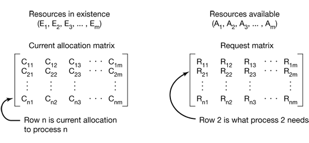

Figure 3-6. The four data structures needed by the deadlock detection algorithm.

In particular, every resource is either allocated or is available. This observation means that

$\sum_{i=1}^n C_{ij}+A_j=E_j$

The deadlock detection algorithm can now be given, as follows.
1. Look for an unmarked process, Pi, for which the i-th row of R is less than or equal to A.
2. If such a process is found, add the i-th row of C to A, mark the process, and go back to step 1.
3. If no such process exists, the algorithm terminates.

### 3.4.3 Recovery from Deadlock
* Recovery through Preemption
* Recovery through Rollback
* Recovery through Killing Processes

## 3.5 DEADLOCK AVOIDANCE
### 3.5.1 Resource Trajectories
In Fig. 3-8 we see a model for dealing with two processes and two resources, for example, a printer and a plotter. The horizontal axis represents the number of instructions executed by process A. The vertical axis represents the number of instructions executed by process B. At I1 A requests a printer; at I2 it needs a plotter. The printer and plotter are released at I3 and I4, respectively. Process B needs the plotter from I5 to I7 and the printer from I6 to I8.

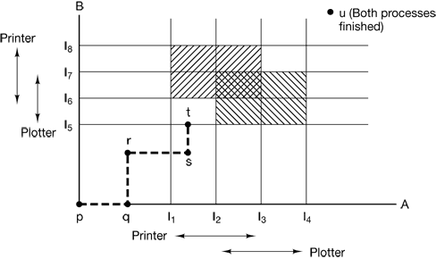

Figure 3-8. Two process resource trajectories.

### 3.5.3 The Banker’s Algorithm for a Single Resource
A scheduling algorithm that can avoid deadlocks is due to Dijkstra (1965) and is known as the banker’s algorithm and is an extension of the deadlock detection algorithm given in Sec. 3.4.1. It is modeled on the way a small-town banker might deal with a group of customers to whom he has granted lines of credit. What the algorithm does is check to see if granting the request leads to an unsafe state. If it does, the request is denied. If granting the request leads to a safe state, it is carried out.

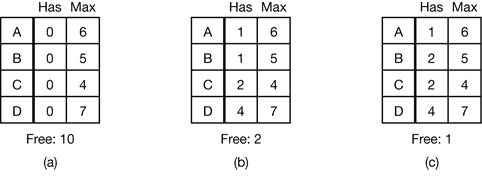

Figure 3-11. Three resource allocation states: (a) Safe. (b) Safe (c) Unsafe.

### 3.5.4 The Banker’s Algorithm for Multiple Resources
The banker’s algorithm can be generalized to handle multiple resources.

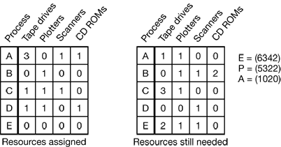

Figure 3-12. The banker’s algorithm with multiple resources.

The algorithm for checking to see if a state is safe can now be stated.
1. Look for a row, R, whose unmet resource needs are all smaller than or equal to A. If no such row exists, the system will eventually deadlock since no process can run to completion.
2. Assume the process of the row chosen requests all the resources it needs (which is guaranteed to be possible) and finishes. Mark that process as terminated and add all its resources to the A vector.
3. Repeat steps 1 and 2 until either all processes are marked terminated, in which case the initial state was safe, or until a deadlock occurs, in which case it was not.

## 3.6 DEADLOCK PREVENTION
* Attacking the Mutual Exclusion Condition
* Attacking the Hold and Wait Condition
* Attacking the No Preemption Condition
* Attacking the Circular Wait Condition

## 3.7 OTHER ISSUES
### Two-Phase Locking
As an example, in many database systems, an operation that occurs frequently is requesting locks on several records and then updating all the locked records. When multiple processes are running at the same time, there is a real danger of deadlock.

The approach often used is called two-phase locking. In the first phase the process tries to lock all the records it needs, one at a time. If it succeeds, it begins the second phase, performing its updates and releasing the locks. No real work is done in the first phase.

# 4 MEMORY MANAGEMENT
## 4.1 BASIC MEMORY MANAGEMENT
### 4.1.1 Monoprogramming without Swapping or Paging
Three variations on this theme are shown in Fig. 4-1. The operating system may be at the bottom of memory in RAM (Random Access Memory), as shown in Fig. 4-1(a), or it may be in ROM (Read-Only Memory) at the top of memory, as shown in Fig. 4-1(b), or the device drivers may be at the top of memory in a ROM and the rest of the system in RAM down below, as shown in Fig. 4-1(c). The first model was formerly used on mainframes and minicomputers but is rarely used any more. The second model is used on some palmtop computers and embedded systems. The third model was used by early personal computers (e.g., running MS-DOS), where the portion of the system in the ROM is called the BIOS (Basic Input Output System).

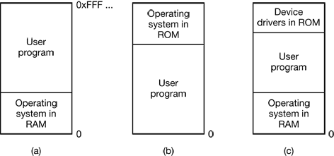

Figure 4-1. Three simple ways of organizing memory with an operating system and one user process. Other possibilities also exist.

### 4.1.2 Multiprogramming with Fixed Partitions
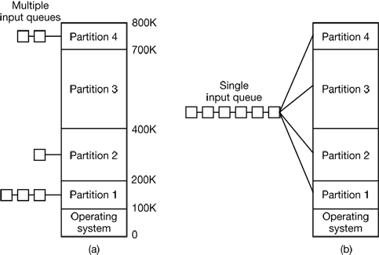

Figure 4-2. (a) Fixed memory partitions with separate input queues for each partition. (b) Fixed memory partitions with a single input queue.

### 4.1.3 Modeling Multiprogramming
A better model is to look at CPU usage from a probabilistic viewpoint. Suppose that a process spends a fraction p of its time waiting for I/O to complete. With nprocesses in memory at once, the probability that all n processes are waiting for I/O (in which case the CPU will be idle) is pⁿ. The CPU utilization is then given by the formula

    CPU utilization = 1 – pⁿ

Figure 4-3 shows the CPU utilization as a function of n which is called the degree of multiprogramming.

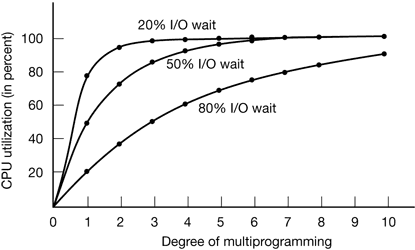

Figure 4-3. CPU utilization as a function of the number of processes in memory.

### 4.1.4 Analysis of Multiprogramming System Performance


Figure 4-4. (a) Arrival and work requirements of four jobs. (b) CPU utilization for 1 to 4 jobs with 80 percent I/O wait. (c) Sequence of events as jobs arrive and finish. The numbers above the horizontal lines show how much CPU time, in minutes, each job gets in each interval.

### 4.1.5 Relocation and Protection
For example, suppose that the first instruction is a call to a procedure at absolute address 100 within the binary file produced by the linker. If this program is loaded in partition 1 (at address 100K), that instruction will jump to absolute address 100, which is inside the operating system. What is needed is a call to 100K + 100. If the program is loaded into partition 2, it must be carried out as a call to 200K + 100, and so on. This problem is known as the relocation problem.

The solution that IBM chose for protecting the 360 was to divide memory into blocks of 2-KB bytes and assign a 4-bit protection code to each block. The PSW (Program Status Word) contained a 4-bit key. The 360 hardware trapped any attempt by a running process to access memory whose protection code differed from the PSW key. Since only the operating system could change the protection codes and key, user processes were prevented from interfering with one another and with the operating system itself.

An alternative solution to both the relocation and protection problems is to equip the machine with two special hardware registers, called the base and limit registers. When a process is scheduled, the base register is loaded with the address of the start of its partition, and the limit register is loaded with the length of the partition. Every memory address generated automatically has the base register contents added to it before being sent to memory.

## 4.2 SWAPPING
Two general approaches to memory management can be used, depending (in part) on the available hardware. The simplest strategy, called swapping, consists of bringing in each process in its entirety, running it for a while, then putting it back on the disk. The other strategy, called virtual memory, allows programs to run even when they are only partially in main memory.

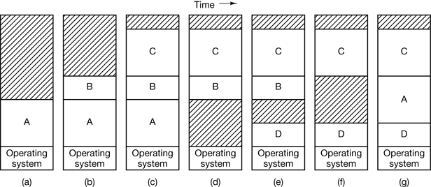

Figure 4-5. Memory allocation changes as processes come into memory and leave it. The shaded regions are unused memory.

When swapping creates multiple holes in memory, it is possible to combine them all into one big one by moving all the processes downward as far as possible. This technique is known as memory compaction.

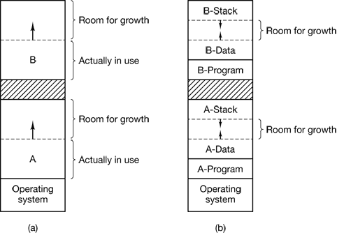

Figure 4-6. (a) Allocating space for a growing data segment. (b) Allocating space for a growing stack and a growing data segment.

### 4.2.1 Memory Management with Bitmaps
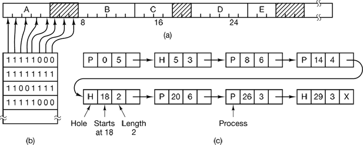

Figure 4-7. (a) A part of memory with five processes and three holes. The tick marks show the memory allocation units. The shaded regions (0 in the bitmap) are free. (b) The corresponding bitmap. (c) The same information as a list.

### 4.2.2 Memory Management with Linked Lists
* first fit
* next fit
* best fit
* worst fit
* quick fit, which maintains separate lists for some of the more common sizes requested.

## 4.3 VIRTUAL MEMORY
Many years ago people were first confronted with programs that were too big to fit in the available memory. The solution usually adopted was to split the program into pieces, called overlays. Overlay 0 would start running first. When it was done, it would call another overlay.

The method that was devised (Fotheringham, 1961) has come to be known as virtual memory .The basic idea behind virtual memory is that the combined size of the program, data, and stack may exceed the amount of physical memory available for it. The operating system keeps those parts of the program currently in use in main memory, and the rest on the disk.

### 4.3.1 Paging
Most virtual memory systems use a technique called paging, which we will now describe.

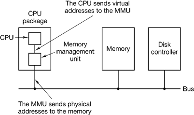

Figure 4-9. The position and function of the MMU. Here the MMU is shown as being a part of the CPU chip because it commonly is nowadays. However, logically it could be a separate chip and was in years gone by.

These program-generated addresses are called virtual addresses and form the virtual address space. On computers without virtual memory, the virtual address is put directly onto the memory bus and causes the physical memory word with the same address to be read or written. When virtual memory is used, the virtual addresses do not go directly to the memory bus. Instead, they go to an MMU (Memory Management Unit) that maps the virtual addresses onto the physical memory addresses as illustrated in Fig. 4-9.

A very simple example of how this mapping works is shown in Fig. 4-10. In this example, we have a computer that can generate 16-bit addresses, from 0 up to 64K. These are the virtual addresses. This computer, however, has only 32 KB of physical memory, so although 64-KB programs can be written, they cannot be loaded into memory in their entirety and run. A complete copy of a program’s core image, up to 64 KB, must be present on the disk, however, so that pieces can be brought in as needed.

The virtual address space is divided up into units called pages. The corresponding units in the physical memory are called page frames. The pages and page frames are always the same size. In this example they are 4 KB, but page sizes from 512 bytes to 64 KB have been used in real systems. With 64 KB of virtual address space and 32 KB of physical memory, we get 16 virtual pages and 8 page frames. Transfers between RAM and disk are always in units of a page.

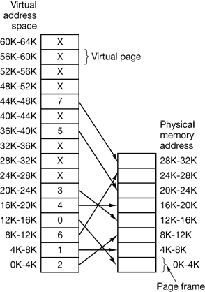

Figure 4-10. The relation between virtual addresses and physical memory addresses is given by the page table.

 In the actual hardware, a Present/absent bit keeps track of which pages are physically present in memory.

 The MMU notices that the page is unmapped (indicated by a cross in the figure) and causes the CPU to trap to the operating system. This trap is called a page fault. The operating system picks a little-used page frame and writes its contents back to the disk. It then fetches the page just referenced into the page frame just freed, changes the map, and restarts the trapped instruction.

The page number is used as an index into the page table, yielding the number of the page frame corresponding to that virtual page.

### 4.3.2 Page Tables
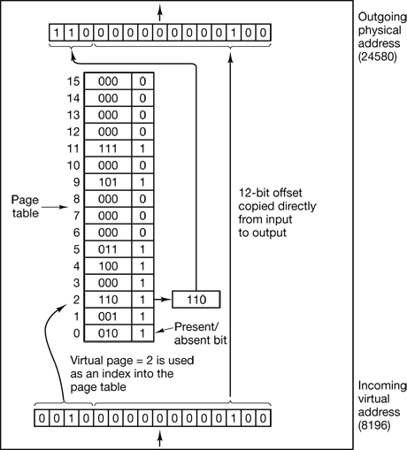

Figure 4-11. The internal operation of the MMU with 16 4-KB pages.

Multilevel Page Tables


Figure 4-12. (a) A 32-bit address with two page table fields. (b) Two-level page tables.

Structure of a Page Table Entry

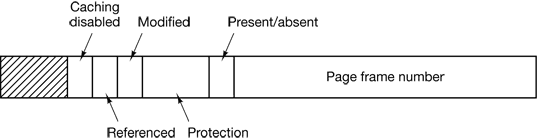

Figure 4-13. A typical page table entry

### 4.3.3 TLBs—Translation Lookaside Buffers
In most paging schemes, the page tables are kept in memory, due to their large size. Potentially, this design has an enormous impact on performance. The solution that has been devised is to equip computers with a small hardware device for mapping virtual addresses to physical addresses without going through the page table. The device, called a TLB (Translation Lookaside Buffer) or sometimes an associative memory, is illustrated in Fig. 4-14.

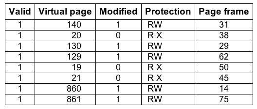

Figure 4-14. A TLB to speed up paging.

### 4.3.4 Inverted Page Tables
Traditional page tables of the type described so far require one entry per virtual page, since they are indexed by virtual page number. If the address space consists of 232 bytes, with 4096 bytes per page, then over 1 million page table entries are needed.

However, as 64-bit computers become more common, the situation changes drastically. If the address space is now 2⁶⁴ bytes, with 4-KB pages, we need a page table with 2⁵² entries. If each entry is 8 bytes, the table is over 30 million gigabytes.

One such solution is the inverted page table. In this design, there is one entry per page frame in real memory, rather than one entry per page of virtual address space. For example, with 64-bit virtual addresses, a 4-KB page, and 256 MB of RAM, an inverted page table only requires 65,536 entries. The entry keeps track of which (process, virtual page) is located in the page frame.

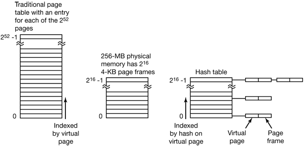

Figure 4-15. Comparison of a traditional page table with an inverted page table.

## 4.4 PAGE REPLACEMENT ALGORITHMS
* The Optimal Page Replacement Algorithm
* The Not Recently Used Page Replacement Algorithm
    * R is set whenever the page is referenced (read or written). M is set when the page is written to (i.e., modified).
    * When a page fault occurs, the operating system inspects all the pages and divides them into four categories based on the current values of their R and M bits:
      * Class 0: not referenced, not modified.
      * Class 1: not referenced, modified.
      * Class 2: referenced, not modified.
      * Class 3: referenced, modified.
    * Although class 1 pages seem, at first glance, impossible, they occur when a class 3 page has its R bit cleared by a clock interrupt. Clock interrupts do not clear the M bit because this information is needed to know whether the page has to be rewritten to disk or not. Clearing R but not M leads to a class 1 page.
    * The NRU (Not Recently Used) algorithm removes a page at random from the lowest numbered nonempty class. Implicit in this algorithm is that it is better to remove a modified page that has not been referenced in at least one dock tick (typically 20 msec) than a clean page that is in heavy use.
* The First-In, First-Out (FIFO) Page Replacement Algorithm
* The Second Chance Page Replacement Algorithm
* The Clock Page Replacement Algorithm
* The Least Recently Used (LRU) Page Replacement Algorithm
    * For a machine with n page frames, the LRU hardware can maintain a matrix of n × n bits, initially all zero. Whenever page frame k is referenced, the hardware first sets all the bits of row k to 1, then sets all the bits of column k to 0. At any instant, the row whose binary value is lowest is the least recently used, the row whose value is next lowest is next least recently used, and so forth.

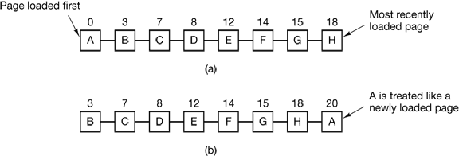

Figure 4-16. Operation of second chance. (a) Pages sorted in FIFO order. (b) Page list if a page fault occurs at time 20 and A has its R bit set. The numbers above the pages are their loading times.

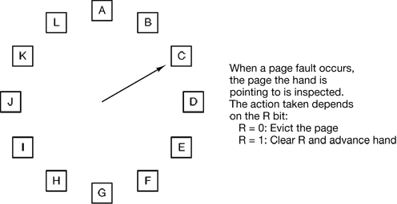

Figure 4-17. The clock page replacement algorithm.

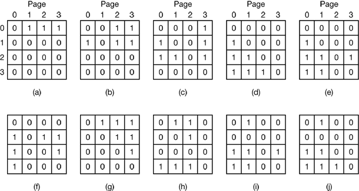

Figure 4-18. LRU using a matrix when pages are referenced in the order 0, 1, 2, 3, 2, 1, 0, 3, 2, 3.

* Simulating LRU in Software
    * One possibility is called the NFU (Not Frequently Used) algorithm. It requires a software counter associated with each page, initially zero. At each clock interrupt, the operating system scans all the pages in memory. For each page, the R bit, which is 0 or 1, is added to the counter. In effect, the counters are an attempt to keep track of how often each page has been referenced. When a page fault occurs, the page with the lowest counter is chosen for replacement.
    * The main problem with NFU is that it never forgets anything.
    * Fortunately, a small modification to NFU makes it able to simulate LRU quite well. The modification has two parts. First, the counters are each shifted right 1 bit before the R bit is added in. Second, the R bit is added to the leftmost, rather than the rightmost bit.
    * Figure 4-19 illustrates how the modified algorithm, known as aging, works. Suppose that after the first clock tick the R bits for pages 0 to 5 have the values 1, 0, 1, 0, 1, and 1, respectively (page 0 is 1, page 1 is 0, page 2 is 1, etc.). In other words, between tick 0 and tick 1, pages 0, 2, 4, and 5 were referenced, setting their R bits to 1, while the other ones remain 0. After the six corresponding counters have been shifted and the R bit inserted at the left, they have the values shown in Fig. 4-19(a). The four remaining columns show the six counters after the next four clock ticks.

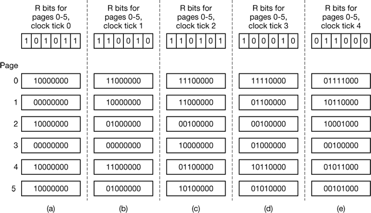

Figure 4-19. The aging algorithm simulates LRU in software. Shown are six pages for five clock ticks. The five clock ticks are represented by (a) to (e).

* The Working Set Page Replacement Algorithm
    * In the purest form of paging, processes are started up with none of their pages in memory. As soon as the CPU tries to fetch the first instruction, it gets a page fault, causing the operating system to bring in the page containing the first instruction. Other page faults for global variables and the stack usually follow quickly. After a while, the process has most of the pages it needs and settles down to run with relatively few page faults. This strategy is called demand paging because pages are loaded only on demand, not in advance.
    * Of course, it is easy enough to write a test program that systematically reads all the pages in a large address space, causing so many page faults that there is not enough memory to hold them all. Fortunately, most processes do not work this way. They exhibit a locality of reference, meaning that during any phase of execution, the process references only a relatively small fraction of its pages.
    * The set of pages that a process is currently using is called its working set (Denning, 1968a; Denning, 1980). If the entire working set is in memory, the process will run without causing many faults until it moves into another execution phase (e.g., the next pass of the compiler). If the available memory is too small to hold the entire working set, the process will cause many page faults and run slowly since executing an instruction takes a few nanoseconds and reading in a page from the disk typically takes 10 milliseconds. At a rate of one or two instructions per 10 milliseconds, it will take ages to finish. A program causing page faults every few instructions is said to be thrashing (Denning, 1968b).
    * Therefore, many paging systems try to keep track of each process‘ working set and make sure that it is in memory before letting the process run. This approach is called the working set model (Denning, 1970). It is designed to greatly reduce the page fault rate. Loading the pages before letting processes run is also called prepaging. Note that the working set changes over time.
    * If a process starts running at time T and has had 40 msec of CPU time at real time T + 100 msec, for working set purposes, its time is 40 msec. The amount of CPU time a process has actually used has since it started is often called its current virtual time. With this approximation, the working set of a process is the set of pages it has referenced during the past τ seconds of virtual time.

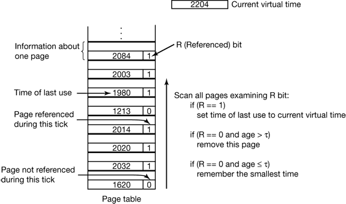

Figure 4-21. The working set algorithm.

* The WSClock Page Replacement Algorithm
    * The basic working set algorithm is cumbersome since the entire page table has to be scanned at each page fault until a suitable candidate is located. An improved algorithm, that is based on the clock algorithm but also uses the working set information is called WSClock.
    * In principle, all pages might be scheduled for disk I/O on one cycle around the clock. To reduce disk traffic, a limit might be set, allowing a maximum of n pages to be written back. Once this limit has been reached, no new writes are scheduled.
        * What happens if the hand comes all the way around to its starting point? There are two cases to distinguish:
            * At least one write has been scheduled.
            * No writes have been scheduled.
        * In the former case, the hand just keeps moving, looking for a clean page. Since one or more writes have been scheduled, eventually some write will complete and its page will be marked as clean. The first clean page encountered is evicted. This page is not necessarily the first write scheduled because the disk driver may reorder writes in order to optimize disk performance.
        * In the latter case, all pages are in the working set, otherwise at least one write would have been scheduled. Lacking additional information, the simplest thing to do is claim any clean page and use it. The location of a clean page could be kept track of during the sweep. If no clean pages exist, then the current page is chosen and written back to disk.

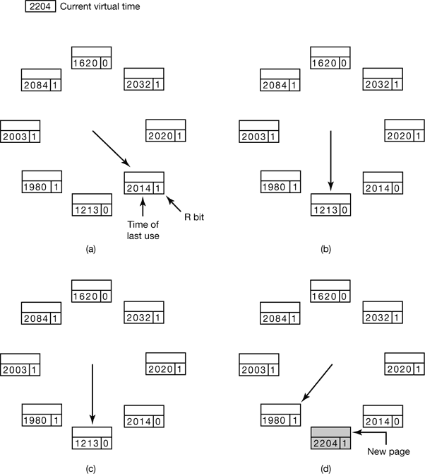

Figure 4-22. Operation of the WSClock algorithm. (a) and (b) give an example of what happens when R = 1. (c) and (d) give an example of R = 0.

Summary of Page Replacement Algorithms

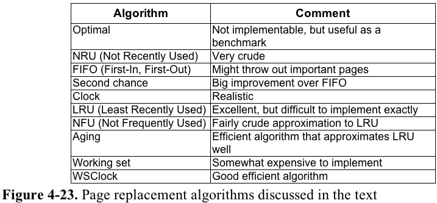

## 4.5 MODELING PAGE REPLACEMENT ALGORITHMS
### 4.5.1 Belady’s Anomaly
Intuitively, it might seem that the more page frames the memory has, the fewer page faults a program will get. Surprisingly enough, this is not always the case. Belady et al. (1969) discovered a counterexample, in which FIFO caused more page faults with four page frames than with three. This strange situation has become known as Belady’s anomaly. It is illustrated in Fig. 4-24 for a program with five virtual pages, numbered from 0 to 4. The pages are referenced in the order

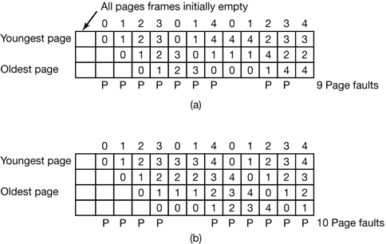

Figure 4-24. Belady’s anomaly. (a) FIFO with three page frames. (b) FIFO with four page frames. The P’s show which page references cause page faults.

### 4.5.2 Stack Algorithms
All of this work begins with the observation that every process generates a sequence of memory references as it runs. Each memory reference corresponds to a specific virtual page. Thus conceptually, a process’ memory access can be characterized by an (ordered) list of page numbers. This list is called the reference string, and plays a central role in the theory.

A paging system can be characterized by three items:
1. The reference string of the executing process.
2. The page replacement algorithm.
3. The number of page frames available in memory, m.

 At the top of Fig. 4-25 we have a reference string consisting of the 24 pages:

    0 2 1 3 5 4 6 3 7 4 7 3 3 5 5 3 1 1 1 7 2 3 4 1

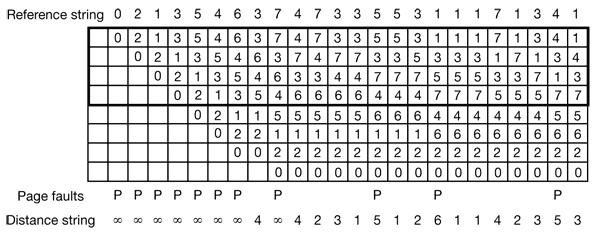

Figure 4-25. The state of the memory array, M, after each item in the reference string is processed. The distance string will be discussed in the next section.

Although this example uses LRU, the model works equally well with other algorithms. In particular, there is one class of algorithms that is especially interesting: algorithms that have the property

    M (m, r ) ⊆ M (m + l, r )

From examination of Fig. 4-25 and a little thought about how it works, it should be clear that LRU has this property. Some other algorithms (e.g. optimal page replacement) also have it, but FIFO does not. Algorithms that have this property are called stack algorithms. These algorithms do not suffer from Belady‘s anomaly and are thus much loved by virtual memory theorists.

### 4.5.3 The Distance String
For stack algorithms, it is often convenient to represent the reference string in a more abstract way than the actual page numbers. A page reference will be henceforth denoted by the distance from the top of the stack where the referenced page was located.

The statistical properties of the distance string have a big impact on the performance of the algorithm. In Fig. 4-26(a) we see the probability density function for the entries in a (ficticious) distance string, d. Most of the entries in the string are between 1 and k. With a memory of k page frames, few page faults occur.

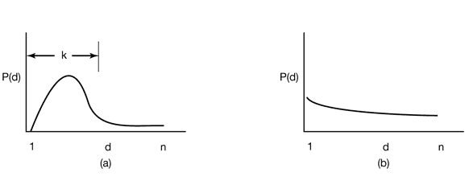

Figure 4-26. Probability density functions for two hypothetical distance strings.

In contrast, in Fig. 4-26(b), the references are so spread out that the only way to avoid a large number of page faults is to give the program us many page frames as it has virtual pages. Having a program like this is just bad luck.

### 4.5.4 Predicting Page Fault Rates
One of the nice properties of the distance string is that it can be used to predict the number of page faults that will occur with memories of different sizes.

The algorithm starts by scanning the distance string, page by page. It keeps track of the number of times 1 occurs, the number of times 2 occurs, and so on. Let Ci be the number of occurrences of i. For the distance string of Fig. 4-25, the C vector is illustrated in Fig. 4-27(a). In this example, it happens four times that the page referenced is already on top of the stack. Three times the reference is to the next-to-the-top page, and so forth. Let C ∞ be the number of times ∞ occurs in the distance string.

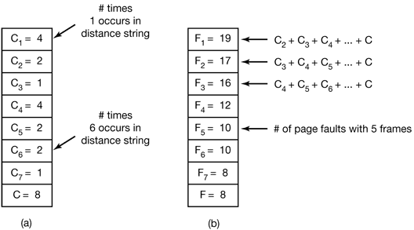

Figure 4-27. Computation of the page fault rate from the distance string. (a) The C vector. (b) F vector.

Now compute the F vector according to the formula

$F_m=\sum_{k=m+1}^n C_k + C_{\infty}$

The value of Fm is the number of page faults that will occur with the given distance string and m page frames. For the distance string of Fig. 4-25, Fig. 4-27(b) gives theF vector. For example, F1 is 20, meaning that with a memory holding only 1 page frame, out of the 24 references in the string, all get page faults except the four that are the same as the previous page reference.

## 4.6 DESIGN ISSUES FOR PAGING SYSTEMS
### 4.6.1 Local versus Global Allocation Policies
The algorithm of Fig. 4-28(b) is said to be a local page replacement algorithm, whereas that of Fig. 4-28(c) is said to be a global algorithm. Local algorithms effectively correspond to allocating every process a fixed fraction of the memory. Global algorithms dynamically allocate page frames among the runnable processes. Thus the number of page frames assigned to each process varies in time.

In general, global algorithms work better, especially when the working set size can vary over the lifetime of a process. If a local algorithm is used and the working set grows, thrashing will result even if there are plenty of free page frames. If the working set shrinks, local algorithms waste memory. If a global algorithm is used, the system must continually decide how many page frames to assign to each process. One way is to monitor the working set size as indicated by the aging bits, but this approach does not necessarily prevent thrashing. The working set may change size in microseconds, whereas the aging bits are a crude measure spread over a number of clock ticks.

If a global algorithm is used, it may be possible to start each process up with some number of pages proportional to the process’ size, but the allocation has to be updated dynamically as the processes run. One way to manage the allocation is to use the PFF (Page Fault Frequency) algorithm. It tells when to increase or decrease a process’ page allocation but says nothing about which page to replace on a fault. It just controls the size of the allocation set.

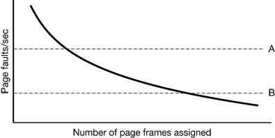

Figure 4-29. Page fault rate as a function of the number of page frames assigned

### 4.6.2 Load Control
The way to reduce the number of processes competing for memory is to swap some of them to the disk and free up all the pages they are holding.

As we saw in Fig. 4-4, when the number of processes in main memory is too low, the CPU may be idle for substantial periods of time. This consideration argues for considering not only process size and paging rate when deciding which process to swap out, but also its characteristics, such as whether it is CPU bound or I/O bound, and what characteristics the remaining processes have as well.

### 4.6.3 Page Size
Determining the best page size requires balancing several competing factors. As a result, there is no overall optimum. To start with, there are two factors that argue for a small page size. A randomly chosen text, data, or stack segment will not fill an integral number of pages. On the average, half of the final page will be empty. The extra space in that page is wasted. This wastage is called internal fragmentation. With n segments in memory and a page size of p bytes, np/2 bytes will be wasted on internal fragmentation. This reasoning argues for a small page size.

Another argument for a small page size becomes apparent if we think about a program consisting of eight sequential phases of 4 KB each. With a 32-KB page size, the program must be allocated 32 KB all the time. With a 16-KB page size, it needs only 16 KB. With a page size of 4 KB or smaller it requires only 4 KB at any instant. In general, a large page size will cause more unused program to be in memory than a small page size.

On the other hand, small pages mean that programs will need many pages, hence a large page table.

This last point can be analyzed mathematically. Let the average process size be sbytes and the page size be p bytes. Furthermore, assume that each page entry requires e bytes. The approximate number of pages needed per process is then s/p,occupying se/p bytes of page table space. The wasted memory in the last page of the process due to internal fragmentation is p/2. Thus, the total overhead due to the page table and the internal fragmentation loss is given by the sum of these two terms:

    overhead = se/p + p/2

The first term (page table size) is large when the page size is small. The second term (internal fragmentation) is large when the page size is large. The optimum must lie somewhere in between. By taking the first derivative with respect to p and equating it to zero, we get the equation

    –se/p2 + 1/2 = 0

From this equation we can derive a formula that gives the optimum page size (considering only memory wasted in fragmentation and page table size). The result is:

$p=\sqrt{2se}$

### 4.6.4 Separate Instruction and Data Spaces
Most computers have a single address space that holds both programs and data, as shown in Fig. 4-30(a). If this address space is large enough, everything works fine. However, it is often too small, forcing programmers to stand on their heads to fit everything into the address space.

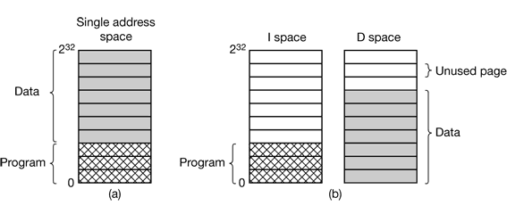

Figure 4-30. (a) One address space (b) Separate I and D spaces.

One solution, pioneered on the (16-bit) PDP-11, is to have separate address spaces for instructions (program text) and data. These are called I-space and D-space, respectively. Each address space runs from 0 to some maximum.

In a computer with this design, both address spaces can be paged, independently from one another. Each one has its own page table, with its own mapping of virtual pages to physical page frames.

### 4.6.5 Shared Pages
In particular, pages that are read-only, such as program text, can be shared, but data pages cannot.

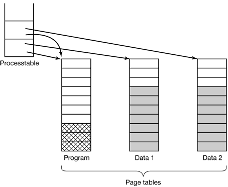

Figure 4-31. Two processes sharing the same program sharing its page table.

As long as both processes just read their data, without modifying it, this situation can continue. As soon as either process updates a memory word, the violation of the read-only protection causes a trap to the operating system. A copy is then made of the page so that each process now has its own private copy. Both copies are now set to READ-WRITE so subsequent writes to either copy proceed without trapping. This strategy means that those pages that are never written (including all the program pages) need not be copied. Only the data pages that are actually written need be copied. This approach, called copy on write, improves performance by reducing copying.

### 4.6.6 Cleaning Policy
If every page frame is full, and furthermore modified, before a new page can be brought in, an old page must first be written to disk. To insure a plentiful supply of free page frames, many paging systems have a background process, called the paging daemon, that sleeps most of the time but is awakened periodically to inspect the state of memory. If too few page frames are free, the paging daemon begins selecting pages to evict using the chosen page replacement algorithm, if these pages have been modified since being loaded, they are written to disk.

One way to implement this cleaning policy is with a two-handed clock. The front hand is controlled by the paging daemon. When it points to a dirty page, that page it written back to disk and the front hand advanced. When it points to a clean page, it is just advanced. The back hand is used for page replacement, as in the standard clock algorithm. Only now, the probability of the back hand hitting a clean page is increased due to the work of the paging daemon.

### 4.6.7 Virtual Memory Interface
One reason for giving programmers control over their memory map is to allow two or more processes to share the same memory.Sharing of pages can also be used to implement a high-performance message-passing system.

## 4.7 IMPLEMENTATION ISSUES
### 4.7.1 Operating System Involvement with Paging
There are four times when the operating system has work to do relating to paging: process creation time, process execution time, page fault time, and process termination time.

### 4.7.2 Page Fault Handling
1. The hardware traps to the kernel, saving the program counter on the stack.
2. An assembly code routine is started to save the general registers and other volatile information, to keep the operating system from destroying it.
3. The operating system discovers that a page fault has occurred, and tries to discover which virtual page is needed.
4. Once the virtual address that caused the fault is known, the system checks to see if this address is valid and the protection consistent with the access. If not, the process is sent a signal or killed. If the address is valid and no protection fault has occurred, the system checks to see if a page frame is free. It no frames are free, the page replacement algorithm is run to select a victim.
5. If the page frame selected is dirty, the page is scheduled for transfer to the disk, and a context switch takes place, suspending the faulting process and letting another one run until the disk transfer has completed. In any event, the frame is marked as busy to prevent it from being used for another purpose.
6. As soon as the page frame is clean (either immediately or after it is written to disk), the operating system looks up the disk address where the needed page is, and schedules a disk operation to bring it in. While the page is being loaded, the faulting process is still suspended and another user process is run, if one is available.
7. When the disk interrupt indicates that the page has arrived, the page tables are updated to reflect its position, and the frame is marked as being in normal state.
8. The faulting instruction is backed up to the state it had when it began and the program counter is reset to point to that instruction.
9. The faulting process is scheduled, and the operating system returns to the assembly language routine that called it.
10. This routine reloads the registers and other state information and returns to user space to continue execution, as if no fault had occurred.

### 4.7.3 Instruction Backup
When a program references a page that is not in memory, the instruction causing the fault is stopped part way through and a trap to the operating system occurs. After the operating system has fetched the page needed, it must restart the instruction causing the trap.

### 4.7.4 Locking Pages in Memory
If an I/O device is currently in the process of doing a DMA transfer to that page, removing it will cause part of the data to be written in the buffer where they belong and part of the data to be written over the newly loaded page. One solution to this problem is to lock pages engaged in I/O in memory so that they will not be removed.Locking a page is often called pinning it in memory. Another solution is to do all I/O to kernel buffers and then copy the data to user pages later.

### 4.7.5 Backing Store
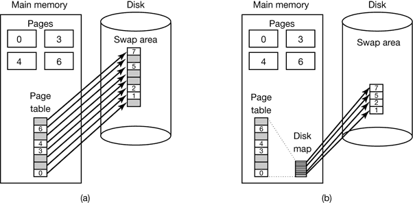

Figure 4-33. (a) Paging to a static swap area. (b) Backing up pages dynamically.

### 4.7.6 Separation of Policy and Mechanism
A simple example of how policy and mechanism can be separated is shown in Fig. 4-34. Here the memory management system is divided into three parts:
1. A low-level MMU handler.
2. A page fault handler that is part of the kernel.
3. An external pager running in user space.

All the details of how the MMU works are encapsulated in the MMU handler, which is machine-dependent code and has to be rewritten for each new platform the operating system is ported to. The page-fault handler is machine independent code and contains most of the mechanism for paging. The policy is largely determined by the external pager, which runs as a user process.

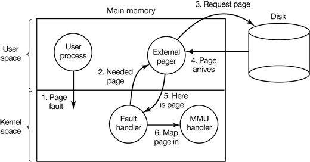

Figure 4-34. Page fault handling with an external pager.

The main advantage of this implementation is more modular code and greater flexibility. The main disadvantage is the extra overhead of crossing the user-kernel boundary several times and the overhead of the various messages being sent between the pieces of the system. At the moment, the subject is highly controversial, but as computers get faster and faster, and the software gets more and more complex, in the long run sacrificing some performance for more reliable software will probably be acceptable to most implementers.

## 4.8 SEGMENTATION
For example, a compiler has many tables that are built up as compilation proceeds, possibly including
1. The source text being saved for the printed listing (on batch systems).
2. The symbol table, containing the names and attributes of variables.
3. The table containing all the integer and floating-point constants used.
4. The parse tree, containing the syntactic analysis of the program.
5. The stack used for procedure calls within the compiler.

Each of the first four tables grows continuously as compilation proceeds. The last one grows and shrinks in unpredictable ways during compilation. In a one-dimensional memory, these five tables would have to be allocated contiguous chunks of virtual address space, as in Fig. 4-35.

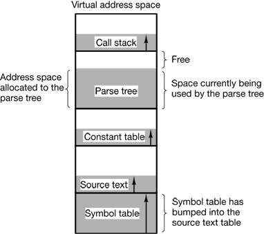

Figure 4-35. In a one-dimensional address space with growing tables, one table may bump into another.

Figure 4-36 illustrates a segmented memory being used for the compiler tables discussed earlier. Five independent segments are shown here.

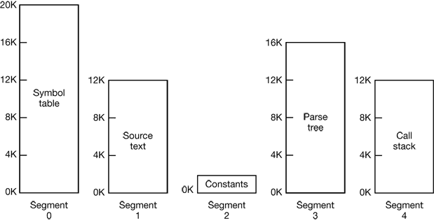

Figure 4-36. A segmented memory allows each table to grow or shrink independently of the other tables.

Segmentation also facilitates sharing procedures or data between several processes. A common example is the shared library.

### 4.8.1 Implementation of Pure Segmentation
This phenomenon, called checker boarding or external fragmentation, wastes memory in the holes. It can be dealt with by compaction, as shown in Fig. 4-38(e).

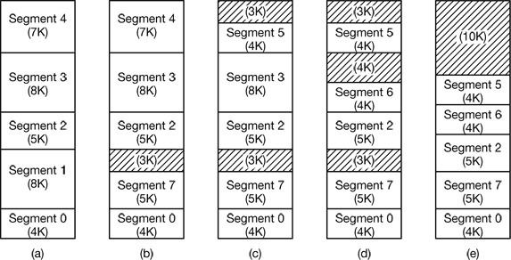

Figure 4-38. (a)-(d) Development of checkerboarding. (e) Removal of the checkerboarding by compaction.

### 4.8.2 Segmentation with Paging: MULTICS
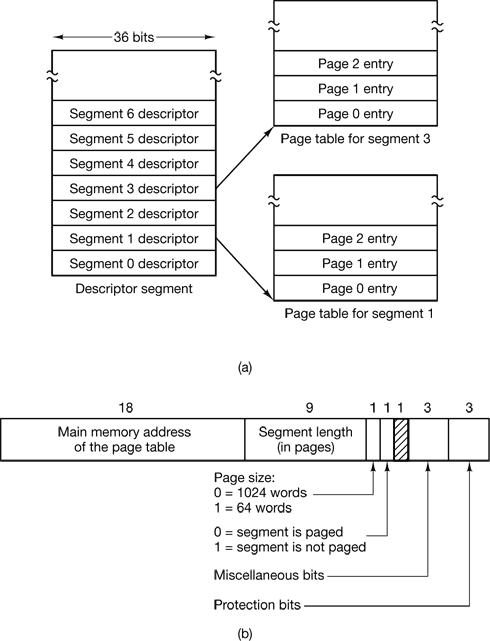

Figure 4-39. The MULTICS virtual memory. (a) The descriptor segment points to the page tables. (b) A segment descriptor. The numbers are the field lengths.

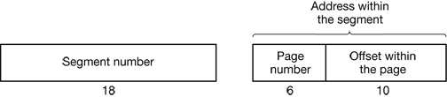

Figure 4-40. A 34-bit MULTICS virtual address.

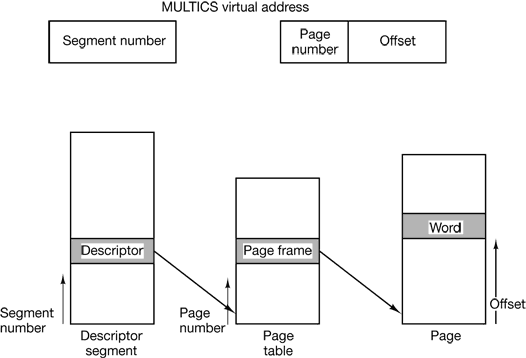

Figure 4-41. Conversion of a two-part MULTICS address into a main memory address.

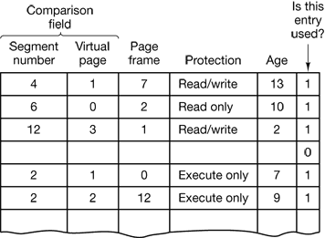

Figure 4-42. A simplified version of the MULTICS TLB. The existence of two page sizes makes the actual TLB more complicated.

### 4.8.3 Segmentation with Paging: The Intel Pentium
The heart of the Pentium virtual memory consists of two tables, the LDT (Local Descriptor Table) and the GDT (Global Descriptor Table).Each program has its own LDT, but there is a single GDT, shared by all the programs on the computer. The LDT describes segments local to each program, including its code, data, stack, and so on, whereas the GDT describes system segments, including the operating system itself.

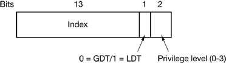

Figure 4-43. A Pentium selector.

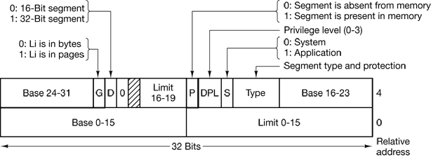

Figure 4-44. Pentium code segment descriptor. Data segments differ slightly.

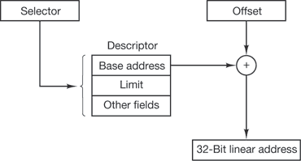

Figure 4-45. Conversion of a (selector, offset) pair to a linear address.

Each running program has a page directory consisting of 1024 32-bit entries. It is located at an address pointed to by a global register. Each entry in this directory points to a page table also containing 1024 32-bit entries. The page table entries point to page frames. The scheme is shown in Fig. 4-46.

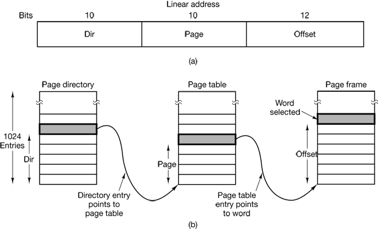

Figure 4-46. Mapping of a linear address onto a physical address.

# 5 INPUT/OUTPUT
## 5.1 PRINCIPLES OF I/O HARDWARE
### 5.1.1 I/O Devices
I/O devices can be roughly divided into two categories: block devices and character devices. 

A block device is one that stores information in fixed-size blocks, each one with its own address. Common block sizes range from 512 bytes to 32,768 bytes. The essential property of a block device is that it is possible to read or write each block independently of all the other ones. Disks are the most common block devices.

The other type of I/O device is the character device. A character device delivers or accepts a stream of characters, without regard to any block structure. It is not addressable and does not have any seek operation. Printers, network interfaces, mice (for pointing), rats (for psychology lab experiments), and most other devices that are not disk-like can be seen as character devices.

### 5.1.2 Device Controllers
I/O units typically consist of a mechanical component and an electronic component.The electronic component is called the device controller or adapter.

### 5.1.3 Memory-Mapped I/O
Each controller has a few registers that are used for communicating with the CPU. The issue thus arises of how the CPU communicates with the control registers and the device data buffers. Two alternatives exist. In the first approach, each control register is assigned an I/O port number, an 8- or 16-bit integer. The second approach, introduced with the PDP-11, is to map all the control registers into the memory space, as shown in Fig. 5-2(b). Each control register is assigned a unique memory address to which no memory is assigned. This system is called memory-mapped I/O.

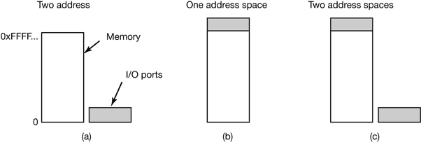

Figure 5-2. (a) Separate I/O and memory space. (b) Memory mapped I/O. (c) Hybrid.

### 5.1.4 Direct Memory Access (DMA)
No matter whether a CPU does or does not have memory-mapped I/O, it needs to address the device controllers to exchange data with them. The CPU can request data from an I/O controller one byte at a time but doing so wastes the CPU’s time, so a different scheme, called DMA (Direct Memory Access) is often used.

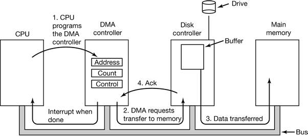

Figure 5-4. Operation of a DMA transfer.

Many buses can operate in two modes: word-at-a-time mode and block mode. Some DMA controllers can also operate in either mode. In the former mode, the operation is as described above: the DMA controller requests for the transfer of one word and gets it. If the CPU also wants the bus, it has to wait. The mechanism is called cycle stealing because the device controller sneaks in and steals an occasional bus cycle from the CPU once in a while, delaying it slightly. In block mode, the DMA controller tells the device to acquire the bus, issue a series of transfers, then release the bus. This form of operation is called burst mode.

### 5.1.5 Interrupts Revisited
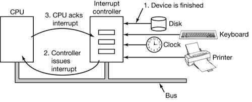

Figure 5-5. How an interrupt happens. The connections between the devices and the interrupt controller actually use interrupt lines on the bus rather than dedicated wires.

An interrupt that leaves the machine in a well-defined state is called a precise interrupt (Walker and Cragon, 1995). Such an interrupt has four properties:
1. The PC (Program Counter) is saved in a known place.
2. All instructions before the one pointed to by the PC have fully executed.
3. No instruction beyond the one pointed to by the PC has been executed.
4. The execution state of the instruction pointed to by the PC is known.

An interrupt that does not meet these requirements is called an imprecise interrupt and makes life extremely unpleasant for the operating system writer, who now has to figure out what has happened and what still has to happen.

## 5.2 PRINCIPLES OF I/O SOFTWARE
### 5.2.1 Goals of the I/O Software
A key concept in the design of I/O software is known as device independence. What it means is that it should be possible to write programs that can access any I/O device without having to specify the device in advance.

Closely related to device independence is the goal of uniform naming. The name of a file or a device should simply be a string or an integer and not depend on the device in any way.

Another important issue for I/O software is error handling. In general, errors should be handled as close to the hardware as possible. If the controller discovers a read error, it should try to correct the error itself if it can. If it cannot, then the device driver should handle it, perhaps by just trying to read the block again. Many errors are transient, such as read errors caused by specks of dust on the read head, and will go away if the operation is repeated. Only if the lower layers are not able to deal with the problem should the upper layers be told about it. In many cases, error recovery can be done transparently at a low level without the upper levels even knowing about the error.

Still another key issue is synchronous (blocking) versus asynchronous (interrupt-driven) transfers. Most physical I/O is asynchronous—the CPU starts the transfer and goes off to do something else until the interrupt arrives. User programs are much easier to write if the I/O operations are blocking—after a read system call the program is automatically suspended until the data are available in the buffer. It is up to the operating system to make operations that are actually interrupt-driven look blocking to the user programs.

Another issue for the I/O software is buffering. Often data that come off a device cannot be stored directly in its final destination. For example, when a packet comes in off the network, the operating system does not know where to put it until it has stored the packet somewhere and examined it. Also, some devices have severe real-time constraints (for example, digital audio devices), so the data must be put into an output buffer in advance to decouple the rate at which the buffer is filled from the rate at which it is emptied, in order to avoid buffer underruns. Buffering involves considerable copying and often has a major impact on I/O performance.

The final concept that we will mention here is sharable versus dedicated devices. Some I/O devices, such as disks, can be used by many users at the same time. No problems are caused by multiple users having open files on the same disk at the same time. Other devices, such as tape drives, have to be dedicated to a single user until that user is finished. Then another user can have the tape drive. Having two or more users writing blocks intermixed at random to the same tape will definitely not work. Introducing dedicated (unshared) devices also introduces a variety of problems, such as deadlocks. Again, the operating system must be able to handle both shared and dedicated devices in a way that avoids problems.

### 5.2.2 Programmed I/O
There are three fundamentally different ways that I/O can be performed. In this section we will look at the first one (programmed I/O). In the next two sections we will examine the others (interrupt-driven I/O and I/O using DMA). The simplest form of I/O is to have the CPU do all the work. This method is called programmed I/O.

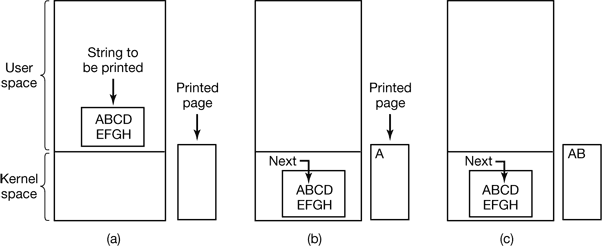

Figure 5-6. Steps in printing a string.

This behavior is often called polling or busy waiting.

```c
copy_from_user(buffer, p, count);      /* p is the kernel buffer */ 
for (i = 0; i < count; i++) {          /* loop on every character */     
    while (*printer_status_reg != READY) ;  /* loop until ready */
    *printer_data_register = p[i];          /* output one character */
}
return_to_user();
```

Figure 5-7. Writing a string to the printer using programmed I/O.

### 5.2.3 Interrupt-Driven I/O
(a)

```c
copy_from_user(buffer, p, count);
enable_interrupts();
while(*printer_status_reg != READY) ;
*printer_data_register = p[0];
scheduler();
```

(b)

```c
if(count == 0) {
    unblock_user();
} else {
    *printer_data_register = p[i];
    count = count – 1;
    i = i + 1;
}
acknowledge_interrupt();
return_from_interrupt();
```

Figure 5-8. Writing a string to the printer using interrupt-driven I/O. (a) Code executed when the print system call is made. (b) Interrupt service procedure.

### 5.2.4 I/O Using DMA
(a)

```c
copy_from_user(buffer, p, count);
set_up_DMA_controller();
scheduler();
```

(b)

```c
acknowledge_interrupt();
unblock_user();
return_from_interrupt();
```

Figure 5-9. Printing a string using DMA. (a) Code executed when the print system call is made. (b) Interrupt service procedure.

## 5.3 I/O SOFTWARE LAYERS
### 5.3.1 Interrupt Handlers


Figure 5-10. Layers of the I/O software system.

1. Save any registers (including the PSW) that have not already been saved by the interrupt hardware.
2. Set up a context for the interrupt service procedure. Doing this may involve setting up the TLB, MMU and a page table.
3. Set up a stack for the interrupt service procedure.
4. Acknowledge the interrupt controller. If there is no centralized interrupt controller, reenable interrupts.
5. Copy the registers from where they were saved (possibly some stack) to the process table.
6. Run the interrupt service procedure. It will extract information from the interrupting device controller’s registers.
7. Choose which process to run next. If the interrupt has caused some high-priority process that was blocked to become ready, it may be chosen to run now.
8. Set up the MMU context for the process to run next. Some TLB set up may also be needed.
9. Load the new process’ registers, including its PSW.
10. Start running the new process.

### 5.3.2 Device Drivers
Each I/O device attached to a computer needs some device-specific code for controlling it. This code, called the device driver, is generally written by the device’s manufacturer and delivered along with the device.

Device drivers are normally positioned below the rest of the operating system, as illustrated in Fig. 5-11.


Figure 5-11.

Operating systems usually classify drivers into one of a small number of categories. The most common categories are the block devices, such as disks, which contain multiple data blocks that can be addressed independently, and the character devices, such as keyboards and printers, which generate or accept a stream of characters.

### 5.3.3 Device-Independent I/O Software


Figure 5-12. Functions of the device-independent I/O software.

Uniform Interfacing for Device Drivers


Figure 5-13. (a) Without a standard driver interlace. (b) With a standard driver interface.

Buffering


Figure 5-14. (a) Unbuffered input. (b) Buffering in user space. (c) Buffering in the kernel followed by copying to user space. (d) Double buffering in the kernel.


Figure 5-15. Networking may involve many copies of a packet.

Error Reporting

Allocating and Releasing Dedicated Devices

Device-Independent Block Size

### 5.3.4 User-Space I/O Software
```c
count = write(fd, buffer, nbytes);
printf("The square of %3d is %6d\n", i, i*i);
```

Not all user-level I/O software consists of library procedures. Another important category is the spooling system. Spooling is a way of dealing with dedicated I/O devices in a multiprogramming system. Consider a typical spooled device: a printer.

Instead what is done is to create a special process, called a daemon, and a special directory, called a spooling directory. To print a file, a process first generates the entire file to be printed and puts it in the spooling directory.


Figure 5-16. Layers of the I/O system and the main functions of each layer.

## 5.4 DISKS
### 5.4.1 Disk Hardware
Magnetic disks are organized into cylinders, each one containing as many-tracks as there are heads stacked vertically. The tracks are divided into sectors, with the number of sectors around the circumference typically being 8 to 32 on floppy disks, and up to several hundred on hard disks. The number of heads varies from 1 to about 16.

A device feature that has important implications for the disk driver is the possibility of a controller doing seeks on two or more drives at the same time. These are known as overlapped seeks.


Figure 5-18. (a) Physical geometry of a disk with two zones. (b) A possible virtual geometry for this disk.

To get around this limit, many disks now support a system called logical block addressing, in which disk sectors are just numbered consecutively starting at 0, without regard to the disk geometry.

In their 1988 paper, Patterson et al. suggested six specific disk organizations that could be used to improve disk performance, reliability, or both (Patterson et al., 1988). These ideas were quickly adopted by industry and have led to a new class of I/O device called a RAID. Patterson et al. defined RAID as Redundant Array of Inexpensive Disks, but industry redefined the I to be “Independent” rather than “Inexpensive” (maybe so they could use expensive disks?).

RAID level 0 is illustrated in Fig. 5-19(a). It consists of viewing the virtual single disk simulated by the RAID as being divided up into strips of k sectors each, with sectors 0 to k – 1 being strip 0, sectors k to 2k – 1 as strip 1, and so on. Distributing data over multiple drives like this is called striping.

RAID level 1, shown in Fig. 5-19(b), is a true RAID. It duplicates all the disks, so there are four primary disks and four backup disks. On a write, every strip is written twice. On a read, either copy can be used, distributing the load over more drives.

Unlike levels 0 and 1, which work with strips of sectors, RAID level 2 works on a word basis, possibly even a byte basis. Imagine splitting each byte of the single virtual disk into a pair of 4-bit nibbles, then adding a Hamming code to each one to form a 7-bit word, of which bits 1, 2, and 4 were parity bits. Further imagine that the seven drives of Fig. 5-19(c) were synchronized in terms of arm position and rotational position. Then it would be possible to write the 7-bit Hamming coded word over the seven drives, one bit per drive.

RAID level 3 is a simplified version of RAID level 2. It is illustrated in Fig. 5-19(d). Here a single parity bit is computed for each data word and written to a parity drive. At first thought, it might appear that a single parity bit gives only error detection, not error correction.

RAID level 4 [see Fig. 5-19(e)] is like RAID level 0, with a strip-for-strip parity written onto an extra drive.

As a consequence of the heavy load on the parity drive, it may become a bottleneck. This bottleneck is eliminated in RAID level 5 by distributing the parity bits uniformly over all the drives, round robin fashion, as shown in Fig. 5-19(f).


Figure 5-19. RAID levels 0 through 5. Backup and parity drives are shown shaded.

### 5.4.2 Disk Formatting
A hard disk consists of a stack of aluminum, alloy, or glass platters 5.25 inch or 3.5 inch in diameter (or even smaller on notebook computers). On each platter is deposited a thin magnetizable metal oxide.

Before the disk can be used, each platter must receive a low-level format done by software. The format consists of a series of concentric tracks, each containing some number of sectors, with short gaps between the sectors. The format of a sector is shown in Fig. 5-24.


Figure 5-24. A disk sector.

After reading the first sector from the disk and doing the ECC calculation, the data must be transferred to main memory. While this transfer is taking place, the next sector will fly by the head. When the copy to memory is complete, the controller will have to wait almost an entire rotation time for the second sector to come around again.

This problem can be eliminated by numbering the sectors in an interleaved fashion when formatting the disk. In Fig. 5-26(a), we see the usual numbering pattern (ignoring cylinder skew here). In Fig. 5-26(b), we see single interleaving, which gives the controller some breathing space between consecutive sectors in order to copy the buffer to main memory. If the copying process is very slow, the double interleaving of Fig. 5-27(c) may be needed.


Figure 5-26. (a) No interleaving. (b) Single interleaving. (c) Double interleaving.

After low-level formatting is completed, the disk is partitioned. Logically, each partition is like a separate disk. On the Pentium and most other computers, sector 0 contains the master boot record, which contains some boot code plus the partition table at the end. The partition table gives the starting sector and size of each partition.

The final step in preparing a disk for use is to perform a high-level format of each partition (separately). This operation lays down a boot block, the free storage administration (free list or bitmap), root directory, and an empty file system. It also puts a code in the partition table entry telling which file system is used in the partition because many operating systems support multiple incompatible file systems (for historical reasons). At this point the system can be booted.

When the power is turned on, the BIOS runs initially and then reads in the master boot record and jumps to it. This boot program then checks to see which partition is active. Then it reads in the boot sector from that partition and runs it. The boot sector contains a small program that searches the root directory for a certain program (either the operating system or a larger bootstrap loader). That program is loaded into memory and executed.

### 5.4.3 Disk Arm Scheduling Algorithms
First, consider how long it takes to read or write a disk block. The time required is determined by three factors:
1. Seek time (the time to move the arm to the proper cylinder).
2. Rotational delay (the time for the proper sector to rotate under the head).
3. Actual data transfer time.

For most disks, the seek time dominates the other two times, so reducing the mean seek time can improve system performance substantially.


Figure 5-27. Shortest Seek First (SSF) disk scheduling algorithm.


Figure 5-28. The elevator algorithm for scheduling disk requests.

### 5.4.4 Error Handling


Figure 5-29. (a) A disk track with a bad sector. (b) Substituting a spare for the bad sector. (c) Shifting all the sectors to bypass the bad one.

### 5.4.5 Stable Storage
What is achievable is a disk subsystem that has the following property: when a write is issued to it, the disk either correctly writes the data or it does nothing, leaving the existing data intact. Such as system is called stable storage and is implemented in software (Lampson and Sturgis, 1979).

Stable storage uses a pair of identical disks with the corresponding blocks working together to form one error-free block. In the absence of errors, the corresponding blocks on both drives are the same. Either one can be read to get the same result. To achieve this goal, the following three operations are defined:
1. Stable writes. A stable write consists of first writing the block on drive 1, then reading it back to verify that it was written correctly. If it was not written correctly, the write and reread are done again up to n times until they work. After n consecutive failures, the block is remapped onto a spare and the operation repeated until it succeeds, no matter how many spares have to be tried. After the write to drive 1 has succeeded, the corresponding block on drive 2 is written and reread, repeatedly if need be, until it, too, finally succeeds. In the absence of CPU crashes, when a stable write completes, the block has correctly been written onto both drives and verified on both of them.
2. Stable reads. A stable read first reads the block from drive 1. If this yields an incorrect ECC, the read is tried again, up to n times. If all of these give bad ECCs, the corresponding block is read from drive 2. Given the fact that a successful stable write leaves two good copies of the block behind, and our assumption that the probability of the same block spontaneously going bad on both drives in a reasonable time interval is negligible, a stable read always succeeds.
3. Crash recovery. After a crash, a recovery program scans both disks comparing corresponding blocks. If a pair of blocks are both good and the same, nothing is done. If one of them has an ECC error, the bad block is overwritten with the corresponding good block. It a pair of blocks are both good but different, the block from drive 1 is written onto drive 2.

## 5.5 CLOCKS
### 5.5.1 Clock Hardware
Clock is built out of three components: a crystal oscillator, a counter, and a holding register, as shown in Fig. 5-31. When a piece of quartz crystal is properly cut and mounted under tension, it can be made to generate a periodic signal of very high accuracy, typically in the range of several hundred megahertz, depending on the crystal chosen. Using electronics, this base signal can be multiplied by a small integer to get frequencies up to 1000 MHz or even more. At least one such circuit is usually found in any computer, providing a synchronizing signal to the computer’s various circuits. This signal is fed into the counter to make it count down to zero. When the counter gets to zero, it causes a CPU interrupt.


Figure 5-31. A programmable clock.

Programmable clocks typically have several modes of operation. In one-shot mode, when the clock is started, it copies the value of the holding register into the counter and then decrements the counter at each pulse from the crystal. When the counter gets to zero, it causes an interrupt and stops until it is explicitly started again by the software. In square-wave mode, after getting to zero and causing the interrupt, the holding register is automatically copied into the counter, and the whole process is repeated again indefinitely. These periodic interrupts are called clock ticks.


Figure 5-32. Three ways to maintain the time of day.

If many signals are expected, it is more efficient to simulate multiple clocks by chaining all the pending clock requests together, sorted on time, in a linked list, as shown in Fig. 5-33. Each entry on the list tells how many clock ticks following the previous one to wait before causing a signal. In this example, signals are pending for 4203, 4207, 4213, 4215, and 4216.


### 5.5.3 Soft Timers
Soft timers avoid interrupts. Instead, whenever the kernel is running for some other reason, just before it returns to user mode it checks the real time clock to see if a soft timer has expired. If the timer has expired, the scheduled event (e.g., packet transmission or checking for an incoming packet) is performed, with no need to switch into kernel mode since the system is already there. After the work has been performed, the soft timer is reset to go off again. All that has to be done is copy the current clock value to the timer and add the timeout interval to it. Soft timers stand or fall with the rate at which kernel entries are made for other reasons. These reasons include
1. System calls.
2. TLB misses.
3. Page faults.
4. I/O interrupts.
5. The CPU going idle.

## 5.6 CHARACTER-ORIENTED TERMINALS
### 5.6.1 RS-232 Terminal Hardware
RS-232 terminals are hardware devices containing both a keyboard and a display and which communicate using a serial interface, one bit at a time (see Fig. 5-34). These terminals use a 9-pin or 25-pin connector, of which one pin is used for transmitting data, one pin is for receiving data, and one pin is ground. The other pins are for various control functions, most of which are not used. Lines in which characters are sent one bit at a time (as opposed to 8 bits in parallel the way printers are interfaced to PCs) are called serial lines.


Figure 5-34. An RS-232 terminal communicates with a computer over a communication line, one bit at a time.

### 5.6.2 Input Software
### 5.6.3 Output Software

# 6 FILE SYSTEMS
## 6.1 FILES
### 6.1.1 File Naming
Many operating systems support two-part file names, with the two parts separated by a period, as in prog.c. The part following the period is called the file extension and usually indicates something about the file.

### 6.1.2 File Structure


Figure 6-2. Three kinds of files. (a) Byte sequence. (b) Record sequence. (c) Tree.

### 6.1.3 File Types
Regular files are the ones that contain user information. All the files of Fig. 6-2 are regular files. Directories are system files for maintaining the structure of the file system. We will study directories below. Character special files are related to input/output and used to model serial I/O devices such as terminals, printers, and networks. Block special files are used to model disks.

Although technically the file is just a sequence of bytes, the operating system will only execute a file if it has the proper format. It has five sections: header, text, data, relocation bits, and symbol table. The header starts with a so-called magic number, identifying the file as an executable file (to prevent the accidental execution of a file not in this format). Then come the sizes of the various pieces of the file, the address at which execution starts, and some flag bits. Following the header are the text and data of the program itself. These are loaded into memory and relocated using the relocation bits. The symbol table is used for debugging.


Figure 6-3. (a) An executable file. (b) An archive.

### 6.1.4 File Access
Early operating systems provided only one kind of file access: sequential access. Files whose bytes or records can be read in any order are called random access files.

### 6.1.5 File Attributes


Figure 6-4. Some possible file attributes.

### 6.1.6 File Operations
1. Create. The file is created with no data. The purpose of the call is to announce that the file is coming and to set some of the attributes.
2. Delete. When the file is no longer needed, it has to be deleted to free up disk space. There is always a system call for this purpose.
3. Open. Before using a file, a process must open it. The purpose of theopen call is to allow the system to fetch the attributes and list of disk addresses into main memory for rapid access on later calls.
4. Close. When all the accesses are finished, the attributes and disk addresses are no longer needed, so the file should be closed to free up internal table space. Many systems encourage this by imposing a maximum number of open files on processes. A disk is written in blocks, and closing a file forces writing of the file’s last block, even though that block may not be entirely full yet.
5. Read. Data are read from file. Usually, the bytes come from the current position. The caller must specify how much data are needed and must also provide a buffer to put them in.
6. Write. Data are written to the file, again, usually at the current position. If the current position is the end of the file, the file’s size increases. If the current position is in the middle of the file, existing data are overwritten and lost forever.
7. Append. This call is a restricted form of write. It can only add data to the end of the file. Systems that provide a minimal set of system calls do not generally have append, but many systems provide multiple ways of doing the same thing, and these systems sometimes have append.
8. Seek. For random access files, a method is needed to specify from where to take the data. One common approach is a system call, seek, that repositions the file pointer to a specific place in the file. After this call has completed, data can be read from, or written to, that position,
9. Get attributes. Processes often need to read file attributes to do their work. For example, the UNIX make program is commonly used to manage software development projects consisting of many source files. When make is called, it examines the modification times of all the source and object files and arranges for the minimum number of compilations required to bring everything up to date. To do its job, it must look at the attributes, namely, the modification times.
10. Set attributes. Some of the attributes are user settable and can be changed after the file has been created. This system call makes that possible. The protection mode information is an obvious example. Most of the flags also fall in this category.
11. Rename. It frequently happens that a user needs to change the name of an existing file. This system call makes that possible. It is not always strictly necessary, because the file can usually be copied to a new file with the new name, and the old file then deleted.

### 6.1.8 Memory-Mapped Files
Some operating systems, starting with MULTICS, have provided a way to map files into the address space of a running process. Conceptually, we can imagine the existence of two new system calls, map and unmap. The former gives a file name and a virtual address, which causes the operating system to map the file into the address space at the virtual address.

## 6.2 DIRECTORIES
### 6.2.1 Single-Level Directory Systems
The simplest form of directory system is having one directory containing all the files. Sometimes it is called the root directory, but since it is the only one, the name does not matter much.


Figure 6-7. A single-level directory system containing four files, owned by three different people, A, B, and C.

### 6.2.2 Two-level Directory Systems


Figure 6-8. A two-level directory system. The letters indicate the owners of the directories and files.

### 6.2.3 Hierarchical Directory Systems


Figure 6-9. A hierarchical directory system.

### 6.2.4 Path Names
When the file system is organized as a directory tree, some way is needed for specifying file names. Two different methods are commonly used. In the first method, each file is given an absolute path name consisting of the path from the root directory to the file. The other kind of name is the relative path name. This is used in conjunction with the concept of the working directory (also called the current directory).

### 6.2.5 Directory Operations
1. Create. A directory is created. It is empty except for dot and dotdot, which are put there automatically by the system (or in a few cases, by the mkdir program).
2. Delete. A directory is deleted. Only an empty directory can be deleted. A directory containing only dot and dotdot is considered empty as these cannot usually be deleted.
3. Opendir. Directories can be read. For example, to list all the files in a directory, a listing program opens the directory to read out the names of all the files it contains. Before a directory can be read, it must be opened, analogous to opening and reading a file.
4. Closedir. When a directory has been read, it should be closed to free up internal table space.
5. Readdir. This call returns the next entry in an open directory. Formerly, it was possible to read directories using the usual read system call, but that approach has the disadvantage of forcing the programmer to know and deal with the internal structure of directories. In contrast, readdiralways returns one entry in a standard format, no matter which of the possible directory structures is being used.
6. Rename. In many respects, directories are just like files and can be renamed the same way files can be.
7. Link. Linking is a technique that allows a file to appear in more than one directory. This system call specifies an existing file and a path name, and creates a link from the existing file to the name specified by the path. In this way, the same file may appear in multiple directories. A link of this kind, which increments the counter in the file’s i-node (to keep track of the number of directory entries containing the file), is sometimes called a hard link.
8. Unlink. A directory entry is removed. If the file being unlinked is only present in one directory (the normal case), it is removed from the file system. If it is present in multiple directories, only the path name specified is removed. The others remain. In UNIX, the system call for deleting files (discussed earlier) is, in fact, unlink.

## 6.3 FILE SYSTEM IMPLEMENTATION
### 6.3.1 File System Layout
File systems are stored on disks. Most disks can be divided up into one or more partitions, with independent file systems on each partition. Sector 0 of the disk is called the MBR (Master Boot Record) and is used to boot the computer. The end of the MBR contains the partition table. This table gives the starting and ending addresses of each partition. One of the partitions in the table is marked as active. When the computer is booted, the BIOS reads in and executes the MBR. The first thing the MBR program does is locate the active partition, read in its first block, called the boot block, and execute it. The program in the boot block loads the operating system contained in that partition. For uniformity, every partition starts with a boot block, even if it does not contain a bootable operating system.

Other than starting with a boot block, the layout of a disk partition varies strongly from file system to file system. Often the file system will contain some of the items shown in Fig. 6-11. The first one is the superblock. It contains all the key parameters about the file system and is read into memory when the computer is booted or the file system is first touched. Typical information in the superblock includes a magic number to identify the file system type, the number of blocks in the file system, and other key administrative information.

Next might come information about free blocks in the file system, for example in the form of a bitmap or a list of pointers. This might be followed by the i-nodes, an array of data structures, one per file, telling all about the file. After that might come the root directory, which contains the top of the file system tree. Finally, the remainder of the disk typically contains all the other directories and files.


Figure 6-11. A possible file system layout.

### 6.3.2 Implementing Files
Contiguous Allocation


Figure 6-12. (a) Contiguous allocation of disk space for seven files. (b) The state of the disk after files D and F have been removed.

Linked List Allocation


Figure 6-13. Storing a file as a linked list of disk blocks.

Linked List Allocation Using a Table in Memory

Figure 6-14 shows what the table looks like for the example of Fig. 6-13.Such a table in main memory is called a FAT (File Allocation Table).


Figure 6-14. Linked list allocation using a file allocation table in main memory.

I-nodes

Our last method for keeping track of which blocks belong to which file is to associate with each file a data structure called an i-node (index-node), which lists the attributes and disk addresses of the files blocks. A simple example is depicted in Fig. 6-15.


Figure 6-15. An example i-node.

### 6.3.3 Implementing Directories


Figure 6-16. (a) A simple directory containing fixed-size entries with the disk addresses and attributes in the directory entry. (b) A directory in which each entry just refers to an i-node.


Figure 6-17. Two ways of handling long file names in a directory. (a) In-line. (b) In a heap.

### 6.3.4 Shared Files
Figure 6-18 shows the file system of Fig. 6-9 again, only with one of C’s files now present in one of B’s directories as well. The connection between B’s directory and the shared file is called a link. The file system itself is now a Directed Acyclic Graph, or DAG, rather than a tree.


Figure 6-18. File system combining a shared file.

When B reads from the linked file, the operating system sees that the file being read from is of type LINK, looks up the name of the file, and reads that file. This approach is called symbolic linking.

Creating a link does not change the ownership (see Fig. 6-19), but it does increase the link count in the i-node, so the system knows how many directory entries currently point to the file.


Figure 6-19. (a) Situation prior to linking. (b) After the link is created. (c) After the original owner removes the file.

### 6.3.5 Disk Space Management
Block Size

Once it has been decided to store files in fixed-size blocks, the question arises of how big the block should be.


Figure 6-20. The solid curve (left-hand scale) gives the data rate of a disk. The dashed curve (right-hand scale) gives the disk space efficiency. All files are 2 KB.

Keeping Track of Free Blocks


Figure 6-21. (a) Storing the free list on a linked list. (b) A bitmap.

Disk Quotas


Figure 6-23. Quotas are kept track of on a per-user basis in a quota table.

### 6.3.6 File System Reliability
Backups

Backups to tape are generally made to handle one of two potential problems:
1. Recover from disaster.
2. Recover from stupidity.
* First, should the entire file system be backed up or only part of it?
* Second, it is wasteful to back up files that have not changed since the last backup, which leads to the idea of incremental dumps.
* Third, since immense amounts of data are typically dumped, it may be desirable to compress the data before writing them to tape.
* Fourth, it is difficult to perform a backup on an active file system. If files and directories are being added, deleted, and modified during the dumping process, the resulting dump may be inconsistent.
* Fifth and last, making backups introduces many nontechnical problems into an organization. The best online security system in the world may be useless if the system administrator keeps all the backup tapes in his office and leaves it open and unguarded whenever he walks down the hall to get output from the printer.

Two strategies can be used for dumping a disk to tape: a physical dump or a logical dump. A physical dump starts at block 0 of the disk, writes all the disk blocks onto the output tape in order, and stops when it has copied the last one. A logical dump starts at one or more specified directories and recursively dumps all files and directories found there that have changed since some given base date.

File System Consistency


Figure 6-26. The system states. (a) Consistent. (b) Missing block. (c) Duplicate block in free list. (d) Duplicate data block.

### 6.3.7 File System Performance
Caching

The most common technique used to reduce disk accesses is the block cache or buffer cache.

Block Read Ahead

A second technique for improving perceived file system performance is to try to get blocks into the cache before they are needed to increase the hit rate. In particular, many files are read sequentially.

Reducing Disk Arm Motion

Another important technique is to reduce the amount of disk arm motion by putting blocks that are likely to be accessed in sequence close to each other, preferably in the same cylinder. When an output file is written, the file system has to allocate the blocks one at a time, as they are needed. If the free blocks are recorded in a bitmap, and the whole bitmap is in main memory, it is easy enough to choose a free block as close as possible to the previous block. With a free list, part of which is on disk, it is much harder to allocate blocks close together.

Another performance bottleneck in systems that use i-nodes or anything equivalent to i-nodes is that reading even a short file requires two disk accesses: one for the i-node and one for the block. The usual i-node placement is shown in Fig. 6-28(a). Here all the i-nodes are near the beginning of the disk, so the average distance between an i-node and its blocks will be about half the number of cylinders, requiring long seeks.

One easy performance improvement is to put the i-nodes in the middle of the disk, rather than at the start, thus reducing the average seek between the i-node and the first block by a factor of two. Another idea, shown in Fig. 6-28(b), is to divide the disk into cylinder groups, each with its own i-nodes, blocks, and free list (McKusick et. al., 1984).


Figure 6-28. (a) I-nodes placed at the start of the disk. (b) Disk divided into cylinder groups, each with its own blocks und i-nodes.

### 6.3.8 Log-Structured File Systems
Changes in technology are putting pressure on current file systems. In particular, CPUs keep getting faster, disks are becoming much bigger and cheaper (but not much faster), and memories are growing exponentially in size. The one parameter that is not improving by leaps and bounds is disk seek time. The combination of these factors means that a performance bottleneck is arising in many file systems. Research done at Berkeley attempted to alleviate this problem by designing a completely new kind of file system. LFS (the Log-structured File System).

The basic idea is to structure the entire disk as a log. Periodically, and when there is a special need for it, all the pending writes being buffered in memory are collected into a single segment and written to the disk as a single contiguous segment at the end of the log. A single segment may thus contain i-nodes, directory blocks, and data blocks, all mixed together. At the start of each segment is a segment summary, telling what can be found in the segment. If the average segment can be made to be about 1 MB, almost the full bandwidth of the disk can be utilized.

In this design, i-nodes still exist and have the same structure as in UNIX, but they are now scattered all over the log, instead of being at a fixed position on the disk. Nevertheless, when an i-node is located, locating the blocks is done in the usual way. Of course, finding an i-node is now much harder, since its address cannot simply be calculated from its i-number, as in UNIX. To make it possible to find i-nodes, an i-node map, indexed by i-number, is maintained.

To summarize what we have said so far, all writes are initially buffered in memory, and periodically all the buffered writes are written to the disk in a single segment, at the end of the log. Opening a file now consists of using the map to locate the i-node for the file. Once the i-node has been located, the addresses of the blocks can be found from it. All of the blocks will themselves be in segments, somewhere in the log.

# 8 MULTIPLE PROCESSOR SYSTEMS
## 8.1 MULTIPROCESSORS
A shared-memory multiprocessor (or just multiprocessor henceforth) is a computer system in which two or more CPUs share full access to a common RAM.

### 8.1.1 Multiprocessor Hardware
Although all multiprocessors have the property that every CPU can address all of memory, some multiprocessors have the additional property that every memory word can be read as fast as every other memory word. These machines are called UMA(Uniform Memory Access) multiprocessors. In contrast, NUMA (Nonuniform Memory Access) multiprocessors do not have this property.

UMA Bus-Based SMP Architectures


Figure 8-2. Three bus-based multiprocessors. (a) Without caching. (b) With caching. (c) With caching and private memories.

UMA Multiprocessors Using Crossbar Switches

Even with the best caching, the use of a single bus limits the size of a UMA multiprocessor to about 16 or 32 CPUs. To go beyond that, a different kind of interconnection network is needed. The simplest circuit for connecting n CPUs to kmemories is the crossbar switch, shown in Fig. 8-3. Crossbar switches have been used for decades within telephone switching exchanges to connect a group of incoming lines to a set of outgoing lines in an arbitrary way.

At each intersection of a horizontal (incoming) and vertical (outgoing) line is a crosspoint. A crosspoint is a small switch that can be electrically opened or closed, depending on whether the horizontal and vertical lines are to be connected or not.


Figure 8-3. (a) An 8 × 8 crossbar switch. (b) An open crosspoint. (c) A closed crosspoint.

UMA Multiprocessors Using Multistage Switching Networks


Figure 8-4. (a) A 2 × 2 switch. (b) A message format.

NUMA Multiprocessors

NUMA machines have three key characteristics that all of them possess and which together distinguish them from other multiprocessors:
1. There is a single address space visible to all CPUs.
2. Access to remote memory is via LOAD and STORE instructions.
3. Access to remote memory is slower than access to local memory.

When the access time to remote memory is not hidden (because there is no caching), the system is called NC-NUMA. When coherent caches are present, the system is called CC-NUMA (Cache-Coherent NUMA).

The most popular approach for building large CC-NUMA multiprocessors currently is the directory-based multiprocessor. The idea is to maintain a database telling where each cache line is and what its status is. When a cache line is referenced, the database is queried to find out where it is and whether it is clean or dirty (modified).


Figure 8-6. (a) A 256-node directory-based multiprocessor. (b) Division of a 32-bit memory address into fields. (c) The directory at node 36.

### 8.1.2 Multiprocessor Operating System Types
Each CPU Has Its Own Operating System


Figure 8-7. Partitioning multiprocessor memory among four CPUs, but sharing a single copy of the operating system code. The boxes marked Data are the operating system’s private data for each CPU.

Master-Slave Multiprocessors


Figure 8-8. A master-slave multiprocessor model.

Symmetric Multiprocessors


Figure 8-9. The SMP multiprocessor model.

### 8.1.3 Multiprocessor Synchronization


Figure 8-10. The TSL instruction can fail if the bus cannot be locked. These four steps show a sequence of events where the failure is demonstrated.


Figure 8-11. Use of multiple locks to avoid cache thrashing.

### 8.1.4 Multiprocessor Scheduling
Timesharing


Figure 8-12. Using a single data structure for scheduling a multiprocessor.

Suppose that the process holds a spin lock, not unusual on multiprocessors, as discussed above. Other CPUs waiting on the spin lock just waste their time spinning until that process is scheduled again and releases the lock. On a uniprocessor, spin locks are rarely used so if a process is suspended while it holds a mutex, and another process starts and tries to acquire the mutex, it will be immediately blocked, so little time is wasted.

To get around this anomaly, some systems use smart scheduling, in which a process acquiring a spin lock sets a process-wide flag to show that it currently has a spin lock (Zahorjan et al., 1991). When it releases the lock, it clears the flag. The scheduler then does not stop a process holding a spin lock, but instead gives it a little more time to complete its critical region and release the lock.

Another issue that plays a role in scheduling is the fact that while all CPUs are equal, some CPUs are more equal. In particular, when process A has run for a long time on CPU k, CPU k’s cache will be full of A’s blocks. If A gets to run again soon, it may perform better if it is run on CPU k, because k’s cache may still contain some of A’s blocks. Having cache blocks preloaded will increase the cache hit rate and thus the process’ speed. In addition, the TLB may also contain the right pages, reducing TLB faults.

Some multiprocessors take this effect into account and use what is called affinity scheduling (Vaswani and Zahorjan, 1991). The basic idea here is to make a serious effort to have a process run on the same CPU it ran on last time. One way to create this affinity is to use a two-level scheduling algorithm. When a process is created, it is assigned to a CPU, for example based on which one has the smallest load at that moment. This assignment of processes to CPUs is the top level of the algorithm. As a result, each CPU acquires its own collection of processes.

Space Sharing

Scheduling multiple threads at the same time across multiple CPUs is called space sharing.

The simplest space sharing algorithm works like this. Assume that an entire group of related threads is created at once. At the time it is created, the scheduler checks to see if there are as many free CPUs as there are threads. If there are, each thread is given its own dedicated (i.e., nonmultiprogrammed) CPU and they all start. If there are not enough CPUs, none of the threads are started until enough CPUs are available. Each thread holds onto its CPU until it terminates, at which time the CPU is put back into the pool of available CPUs. If a thread blocks on I/O, it continues to hold the CPU, which is simply idle until the thread wakes up. When the next batch of threads appears, the same algorithm is applied.


Figure 8-13. A set of 32 CPUs split into four partitions, with two CPUs available.

Gang Scheduling

A clear advantage of space sharing is the elimination of multiprogramming, which eliminates the context switching overhead. However, an equally clear disadvantage is the time wasted when a CPU blocks and has nothing at all to do until it becomes ready again.

The solution to this problem is gang scheduling, which is an outgrowth of co-scheduling(Ousterhout, 1982). Gang scheduling has three parts:
1. Groups of related threads are scheduled as a unit, a gang.
2. All members of a gang run simultaneously, on different timeshared CPUs.
3. All gang members start and end their time slices together.

## 8.2 MULTICOMPUTERS
### 8.2.1 Multicomputer Hardware
Interconnection Technology

Two kinds of switching schemes are used in multicomputers. In the first one, each message is first broken up (either by the user software or the network interface) into a chunk of some maximum length called a packet. The switching scheme, called store-and-forward packet switching, consists of the packet being injected into the first switch by the source node’s network interface board, as shown in Fig. 8-17(a). The bits come in one at a time, and when the whole packet has arrived, it is copied to the next switch along the path, as shown in Fig. 8-17(b). When the packet arrives at the switch attached to the destination node, as shown in Fig. 8-17(c), the packet is copied to that node’s network interface board and eventually to its RAM.


Figure 8-17. Store-and-forward packet switching.

The other switching regime, circuit switching, consists of the first switch first establishing a path through all the switches to the destination switch. Once that path has been set up, the bits are pumped all the way from the source to the destination nonstop. There is no intermediate buffering at the intervening switches. Circuit switching requires a setup phase, which takes some time, but is faster once the setup has been completed. After the packet has been sent, the path must be torn down again. A variation on circuit switching, called wormhole routing, breaks each packet up into subpackets and allows the first subpacket to start flowing even before the full path has been built.

Network Interfaces


Figure 8-18. Position of the network interface boards in a multicomputer.

### 8.2.2 Low-Level Communication Software


Figure 8-19. Use of send and receive rings to coordinate the main CPU with the on-board CPU.

### 8.2.3 User-Level Communication Software
Send and Receive

Blocking versus Nonblocking Calls

Thus the choices on the sending side are
1. Blocking send (CPU idle during message transmission).
2. Nonblocking send with copy (CPU time wasted for the extra copy).
3. Nonblocking send with interrupt (makes programming difficult),
4. Copy on write (extra copy probably needed eventually).

### 8.2.4 Remote Procedure Call


Figure 8-21. Steps in making a remote procedure call. The stubs are shaded gray.

### 8.2.5 Distributed Shared Memory


Figure 8-22. Various layers where shared memory can be implemented. (a) The hardware. (b) The operating system. (c) User-level software.

Replication

False Sharing

Achieving Sequential Consistency

### 8.2.6 Multicomputer Scheduling
### 8.2.7 Load Balancing

A Graph-Theoretic Deterministic Algorithm


Figure 8-25. Two ways of allocating nine processes to three nodes.

In Fig. 8-25(a), we have partitioned the graph with processes A, E, and G on node 1, processes B, F, and H on node 2, and processes C, D, and I on node 3. The total network traffic is the sum of the arcs intersected by the cuts (the dashed lines), or 30 units. In Fig. 8-25(b) we have a different partitioning that has only 28 units of network traffic. Assuming that it meets all the memory and CPU constraints, this is a better choice because it requires less communication.

Intuitively, what we are doing is looking for clusters that are tightly coupled (high intracluster traffic flow) but which interact little with other clusters (low intercluster traffic flow). Some of the earliest papers discussing the problem are (Chow and Abraham, 1982; Lo, 1984; and Stone and Bokhari, 1978).

A Sender-Initiated Distributed Heuristic Algorithm

Now let us look at some distributed algorithms. One algorithm says that when a process is created, it runs on the node that created it unless that node is overloaded. The metric for overloaded might involve too many processes, too big a total working set, or some other metric. If it is overloaded, the node selects another node at random and asks it what its load is (using the same metric). If the probed node’s load is below some threshold value, the new process is sent there (Eager et al., 1986). If not, another machine is chosen for probing. Probing does not go on forever. If no suitable host is found within N probes, the algorithm terminates and the process runs on the originating machine. The idea is for heavily loaded nodes to try to get rid of excess work, as shown in Fig. 8-26(a).


Figure 8-26. (a) An overloaded node looking for a lightly loaded node to hand off processes to. (b) An empty node looking for work to do.

Eager et al. (1986) constructed an analytical queueing model of this algorithm. Using this model, it was established that the algorithm behaves well and is stable under a wide range of parameters, including different threshold values, transfer costs, and probe limits.

A Receiver-Initialed Distributed Heuristic Algorithm
A complementary algorithm to the one given above, which is initiated by an overloaded sender, is one initiated by an underloaded receiver, as shown in Fig. 8-26(b). With this algorithm, whenever a process finishes, the system checks to see if it has enough work. If not, it picks some machine at random and asks it for work. If that machine has nothing to offer, a second, and then a third machine is asked. If no work is found with N probes, the node temporarily stops asking, does any work it has queued up, and tries again when the next process finishes. If no work is available, the machine goes idle. After some fixed time interval, it begins probing again.

A Bidding Algorithm

Another class of algorithms tries to turn the computer system into a miniature economy, with buyers and sellers of services and prices set by supply and demand (Ferguson et al. 1988). The key players in the economy are the processes, which must buy CPU time to get their work done, and nodes, which auction their cycles off to the highest bidder.

## 8.3 DISTRIBUTED SYSTEMS

# 9 SECURITY
## 9.2 BASICS OF CRYPTOGRAPHY
The purpose of cryptography is to take a message or file, called the plaintext, and encrypt it into the ciphertext in such a way that only authorized people know how to convert it back to the plaintext.

The secrecy depends on parameters to the algorithms called keys. If P is the plaintext file, KE is the encryption key, C is the ciphertext, and E is the encryption algorithm (i.e., function), then C = E(P, KE). This is the definition of encryption. It says that the ciphertext is obtained by using the (known) encryption algorithm, E, with the plaintext, P, and the (secret) encryption key, KE, as parameters.

Similarly, P = D(C, KD) where D is the decryption algorithm and KD is the decryption key. This says that to get the plaintext, P, back from the ciphertext, C and the decryption key,KD, one runs the algorithm D with C and KD as parameters. The relation between the various pieces is shown in Fig. 9-2.


Figure 9-2. Relationship between the plaintext and the ciphertext.

### 9.2.1 Secret-Key Cryptography
To make this clearer, consider an encryption algorithm in which each letter is replaced by a different letter, for example, all As are replaced by Qs, all Bs are replaced by Ws, all Cs are replaced by Es, and so on like this:

```
plaintext:      ABCDEFGHIJKLMNOPQRSTUVWXYZ 
ciphertext:     QWERTYUIOPASDFGHJKLZXCVBNM
```

Many cryptographic systems, like this one, have the property that given the encryption key it is easy to find the decryption key, and vice versa. Such systems are called secret-key cryptography or symmetric-key cryptography.

### 9.2.2 Public-Key Cryptography
Secret key systems are efficient because the amount of computation required to encrypt or decrypt a message is manageable, but have a big drawback: the sender and receiver must both be in possession of the shared secret key. They may even have to get together physically for one to give it to the other. To get around this problem, public-key cryptography is used (Diffie and Hellman, 1976).

A public key system called RSA exploits the fact that multiplying big numbers is much easier for a computer to do than factoring big numbers, especially when all arithmetic is done using modulo arithmetic and all the numbers involved have hundreds of digits (Rivest et al., 1978).

The way public-key cryptography works is that everyone picks a (public key, private key) pair and publishes the public key. The public key is the encryption key; the private key is the decryption key.

### 9.2.3 One-Way Functions
There are various situations that we will see later in which it is desirable to have some function, f, which has the property that given f and its parameter x, computing y = f(x) is easy to do, but given only f(x), finding x is computationally infeasible.

### 9.2.4 Digital Signatures
Digital signatures make it possible to sign email messages and other digital documents in such a way that they cannot be repudiated by the sender later. One common way is to first run the document through a one-way hashing algorithm that is very hard to invert. The hashing function typically produces a fixed-length result independent of the original document size. The most popular hashing functions used are MD5 (Message Digest), which produces a 16-byte result (Rivest, 1992) and SHA (Secure Hash Algorithm), which produces a 20-byte result (NIST, 1995).


Figure 9-3. (a) Computing a signature block. (b) What the receiver gets.
