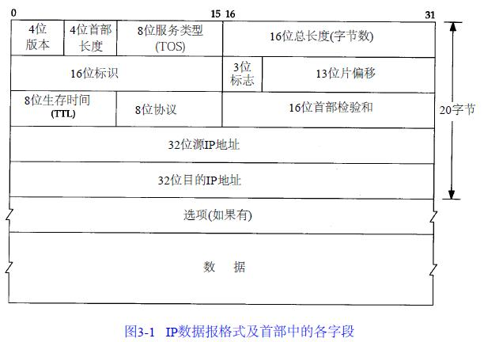
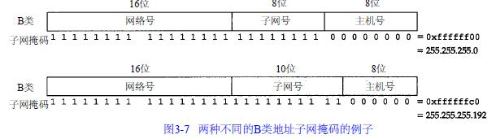
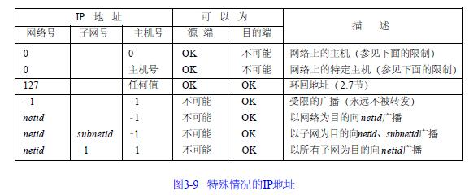
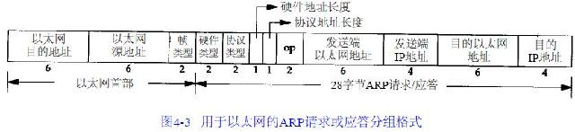
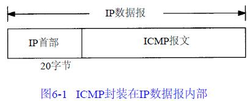
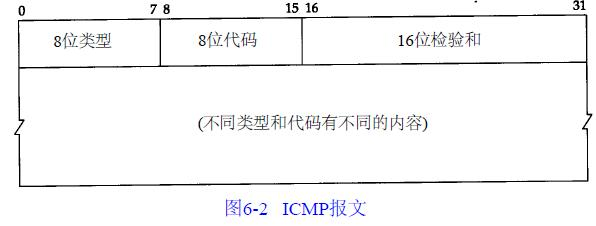
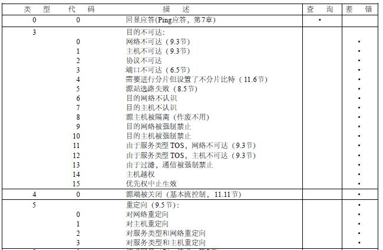

    作者:  [美] W·Richard Stevens
    出版社: 机械工业出版社
    原作名: TCP/IP ILLustrated Volume 1: The Protocols
    译者: 范建华
    出版年: 2000-4-1
    页数: 423
    定价: 45.00元
    装帧: 平装
    丛书: TCP/IP详解（中文版）
    ISBN: 9787111075660

[豆瓣链接](https://book.douban.com/subject/1088054/)

- [第一章 概述](#%e7%ac%ac%e4%b8%80%e7%ab%a0-%e6%a6%82%e8%bf%b0)
  - [1.1 分层](#11-%e5%88%86%e5%b1%82)
  - [1.2 TCP/IP的分层](#12-tcpip%e7%9a%84%e5%88%86%e5%b1%82)
  - [1.3 互联网地址](#13-%e4%ba%92%e8%81%94%e7%bd%91%e5%9c%b0%e5%9d%80)
  - [1.4 封装](#14-%e5%b0%81%e8%a3%85)
  - [1.5 分用](#15-%e5%88%86%e7%94%a8)
- [第二章 链路层](#%e7%ac%ac%e4%ba%8c%e7%ab%a0-%e9%93%be%e8%b7%af%e5%b1%82)
  - [2.1 以太网和IEEE 802封装](#21-%e4%bb%a5%e5%a4%aa%e7%bd%91%e5%92%8cieee-802%e5%b0%81%e8%a3%85)
  - [2.2 SLIP：串行线路IP](#22-slip%e4%b8%b2%e8%a1%8c%e7%ba%bf%e8%b7%afip)
  - [2.3 压缩的SLIP](#23-%e5%8e%8b%e7%bc%a9%e7%9a%84slip)
  - [2.4 PPP：点对点协议](#24-ppp%e7%82%b9%e5%af%b9%e7%82%b9%e5%8d%8f%e8%ae%ae)
  - [2.5 环回接口](#25-%e7%8e%af%e5%9b%9e%e6%8e%a5%e5%8f%a3)
  - [2.6 最大传输单元MTU](#26-%e6%9c%80%e5%a4%a7%e4%bc%a0%e8%be%93%e5%8d%95%e5%85%83mtu)
  - [2.7 路径MTU](#27-%e8%b7%af%e5%be%84mtu)
- [第三章 IP：网际协议](#%e7%ac%ac%e4%b8%89%e7%ab%a0-ip%e7%bd%91%e9%99%85%e5%8d%8f%e8%ae%ae)
  - [3.1 IP首部](#31-ip%e9%a6%96%e9%83%a8)
  - [3.2 子网掩码](#32-%e5%ad%90%e7%bd%91%e6%8e%a9%e7%a0%81)
  - [3.3 特殊情况的IP地址](#33-%e7%89%b9%e6%ae%8a%e6%83%85%e5%86%b5%e7%9a%84ip%e5%9c%b0%e5%9d%80)
- [第4章ARP：地址解析协议](#%e7%ac%ac4%e7%ab%a0arp%e5%9c%b0%e5%9d%80%e8%a7%a3%e6%9e%90%e5%8d%8f%e8%ae%ae)
  - [4.1 ARP高速缓存](#41-arp%e9%ab%98%e9%80%9f%e7%bc%93%e5%ad%98)
  - [4.2 ARP的分组格式](#42-arp%e7%9a%84%e5%88%86%e7%bb%84%e6%a0%bc%e5%bc%8f)
  - [4.3 ARP代理](#43-arp%e4%bb%a3%e7%90%86)
  - [4.4 免费ARP](#44-%e5%85%8d%e8%b4%b9arp)
- [第5章RARP：逆地址解析协议](#%e7%ac%ac5%e7%ab%a0rarp%e9%80%86%e5%9c%b0%e5%9d%80%e8%a7%a3%e6%9e%90%e5%8d%8f%e8%ae%ae)
- [第6章ICMP：Internet控制报文协议](#%e7%ac%ac6%e7%ab%a0icmpinternet%e6%8e%a7%e5%88%b6%e6%8a%a5%e6%96%87%e5%8d%8f%e8%ae%ae)
- [第7章Ping程序](#%e7%ac%ac7%e7%ab%a0ping%e7%a8%8b%e5%ba%8f)

## 第一章 概述
### 1.1 分层


### 1.2 TCP/IP的分层


### 1.3 互联网地址


### 1.4 封装
TCP传给IP的数据单元称作TCP报文段或简称为TCP段(TCP segment)。IP传给网络接口层的数据单元称作IP数据报(IP datagram)。通过以太网传输的比特流称作帧(Frame)。


### 1.5 分用
当目的主机收到一个以太网数据帧时，数据就开始从协议栈中由底向上升，同时去掉各层协议加上的报文首部。每层协议盒都要去检查报文首部中的协议标识，以确定接收数据的上层协议。这个过程称作分用(Demultiplexing)，图1-8显示了该过程是如何发生的。


## 第二章 链路层
### 2.1 以太网和IEEE 802封装
最常使用的封装格式是RFC 894定义的格式。图2 - 1显示了两种不同形式的封装格式。图中每个方框下面的数字是它们的字节长度。

两种帧格式都采用48 bit（6字节）的目的地址和源地址。这就是我们在本书中所称的硬件地址。ARP和RARP协议对32 bit的IP地址和48 bit的硬件地址进行映射。


接下来的2个字节在两种帧格式中互不相同。在802标准定义的帧格式中，长度字段是指它后续数据的字节长度，但不包括CRC检验码。以太网的类型字段定义了后续数据的类型。在802标准定义的帧格式中，类型字段则由后续的子网接入协议（Sub-network Access Protocol，SNAP）的首部给出。幸运的是， 802定义的有效长度值与以太网的有效类型值无一相同，这样，就可以对两种帧格式进行区分。

在以太网帧格式中，类型字段之后就是数据；而在802帧格式中，跟随在后面的是3字节的802.2 LLC和5字节的802.2 SNAP。目的服务访问点（ Destination Service Access Point,DSAP）和源服务访问点（Source Service Access Point, SSAP）的值都设为0xaa。Ctrl字段的值设为3。随后的3个字节org code都置为0。再接下来的2个字节类型字段和以太网帧格式一样。

CRC字段用于帧内后续字节差错的循环冗余码检验（检验和）。

802.3标准定义的帧和以太网的帧都有最小长度要求。802.3规定数据部分必须至少为38字节，而对于以太网，则要求最少要有46字节。为了保证这一点，必须在不足的空间插入填充（pad）字节。

### 2.2 SLIP：串行线路IP
SLIP的全称是Serial Line IP。它是一种在串行线路上对IP数据报进行封装的简单形式，在RFC 1055中有详细描述。下面的规则描述了SLIP协议定义的帧格式：

1. IP数据报以一个称作END（0xc0）的特殊字符结束。同时，为了防止数据报到来之前的线路噪声被当成数据报内容，大多数实现在数据报的开始处也传一个END字符（如果有线路噪声，那么END字符将结束这份错误的报文。这样当前的报文得以正确地传输，而前一个错误报文交给上层后，会发现其内容毫无意义而被丢弃）。
2. 如果IP报文中某个字符为END，那么就要连续传输两个字节0xdb和0xdc来取代它。0xdb这个特殊字符被称作SLIP的ESC字符，但是它的值与AS CII码的ESC字符（0x1b）不同。
3. 如果IP报文中某个字符为SLIP的ESC字符，那么就要连续传输两个字节0xdb和0xdd来取代它。

图2-2中的例子就是含有一个END字符和一个ESC字符的IP报文。在这个例子中，在串行线路上传输的总字节数是原IP报文长度再加4个字节。


SLIP是一种简单的帧封装方法，还有一些值得一提的缺陷：
1. 每一端必须知道对方的IP地址。没有办法把本端的IP地址通知给另一端。
2. 数据帧中没有类型字段（类似于以太网中的类型字段）。如果一条串行线路用于SLIP，那么它不能同时使用其他协议。
3. SLIP没有在数据帧中加上检验和（类似于以太网中的CRC字段）。如果SLIP传输的报文被线路噪声影响而发生错误，只能通过上层协议来发现。

### 2.3 压缩的SLIP
由于串行线路的速率通常较低（19200 b/s或更低），而且通信经常是交互式的（如Telnet和Rlogin，二者都使用TCP），因此在SLIP线路上有许多小的TCP分组进行交换。为了传送1个字节的数据需要20个字节的IP首部和20个字节的TCP首部。于是人们提出一个被称作CSLIP（即压缩SLIP）的新协议，它在RFC 1144中被详细描述。CSLIP一般能把上面的40个字节压缩到3或5个字节。它能在CSLIP的每一端维持多达16个TCP连接，并且知道其中每个连接的首部中的某些字段一般不会发生变化。对于那些发生变化的字段，大多数只是一些小的数字和的改变。这些被压缩的首部大大地缩短了交互响应时间。

### 2.4 PPP：点对点协议
PPP包括以下三个部分：

1. 在串行链路上封装IP数据报的方法。PPP既支持数据为8位和无奇偶检验的异步模式（如大多数计算机上都普遍存在的串行接口），还支持面向比特的同步链接。
2. 建立、配置及测试数据链路的链路控制协议（LCP：Link Control Protocol）。它允许通信双方进行协商，以确定不同的选项。
3. 针对不同网络层协议的网络控制协议（NCP：Network Control Protocol）体系。当前RFC定义的网络层有IP、OSI网络层、DECnet以及Apple Talk。

图2-3是PPP数据帧的格式。每一帧都以标志字符0x7e开始和结束。紧接着是一个地址字节，值始终是0xff，然后是一个值为0x03的控制字节。


接下来是协议字段，类似于以太网中类型字段的功能。当它的值为0x0021时，表示信息字段是一个IP数据报；值为0xc021时，表示信息字段是链路控制数据；值为0x8021时，表示信息字段是网络控制数据。

CRC字段是一个循环冗余检验码，以检测数据帧中的错误。

由于标志字符的值是0x7e，因此当该字符出现在信息字段中时，PPP需要对它进行转义。在同步链路中，该过程是通过一种称作比特填充(bit stuffing)的硬件技术来完成的。在异步链路中，特殊字符0x7d用作转义字符。当它出现在PPP数据帧中时，那么紧接着的字符的第6个比特要取其补码，具体实现过程如下：

1. 当遇到字符0x7e时，需连续传送两个字符： 0x7d和0x5e，以实现标志字符的转义。
2. 当遇到转义字符0x7d时，需连续传送两个字符：0x7d和0x5d，以实现转义字符的转义。
3. 默认情况下，如果字符的值小于0x20（比如，一个ASCII控制字符），一般都要进行转义。

利用链路控制协议，大多数的产品通过协商可以省略标志符和地址字段。

总的来说，PPP比SLIP具有下面这些优点：

1. PPP支持在单根串行线路上运行多种协议，不只是IP协议；
2. 每一帧都有循环冗余检验； 
3. 通信双方可以进行IP地址的动态协商(使用IP网络控制协议)；
4. 与CSLIP类似，对TCP和IP报文首部进行压缩；
5. 链路控制协议可以对多个数据链路选项进行设置。为这些优点付出的代价是在每一帧的首部增加3个字节，当建立链路时要发送几帧协商数据，以及更为复杂的实现。

### 2.5 环回接口
大多数的产品都支持环回接口（Loopback Interface），以允许运行在同一台主机上的客户程序和服务器程序通过TCP/IP进行通信。A类网络号127就是为环回接口预留的。根据惯例，大多数系统把IP地址127.0.0.1分配给这个接口，并命名为localhost。一个传给环回接口的IP数据报不能在任何网络上出现。


图中需要指出的关键点是：

1. 传给环回地址（一般是127.0.0.1）的任何数据均作为IP输入。
2. 传给广播地址或多播地址的数据报复制一份传给环回接口，然后送到以太网上。这是因为广播传送和多播传送的定义包含主机本身。
3. 任何传给该主机IP地址的数据均送到环回接口。

### 2.6 最大传输单元MTU
以太网和802.3对数据帧的长度都有一个限制，其最大值分别是1500和1492字节。链路层的这个特性称作MTU，最大传输单元。


如果IP层有一个数据报要传，而且数据的长度比链路层的MTU还大，那么IP层就需要进行分片（fragmentation）。

### 2.7 路径MTU
当在同一个网络上的两台主机互相进行通信时，该网络的MTU是非常重要的。但是如果两台主机之间的通信要通过多个网络，那么每个网络的链路层就可能有不同的MTU。重要的不是两台主机所在网络的MTU的值，重要的是两台通信主机路径中的最小MTU。它被称作路径MTU。

## 第三章 IP：网际协议
### 3.1 IP首部
IP数据报的格式如图3-1所示。普通的IP首部长为20个字节，除非含有选项字段。



4个字节的32 bit值以下面的次序传输：首先是0～7 bit，其次8～15 bit，然后16～23 bit，最后是24~31 bit。这种传输次序称作`big endian`字节序。

目前的协议版本号是4，因此IP有时也称作IPv4。首部长度指的是首部占32 bit字的数目，包括任何选项。由于它是一个4比特字段，因此首部最长为60个字节。服务类型（TOS）字段包括一个3 bit的优先权子字段（现在已被忽略），4 bit的TOS子字段和1 bit未用位但必须置0。4 bit的TOS分别代表：最小时延、最大吞吐量、最高可靠性和最小费用。4 bit中只能置其中1 bit。如果所有4 bit均为0，那么就意味着是一般服务。

总长度字段是指整个IP数据报的长度，以字节为单位。利用首部长度字段和总长度字段，就可以知道IP数据报中数据内容的起始位置和长度。由于该字段长16比特，所以IP数据报最长可达65535字节（回忆图2-5，超级通道的MTU为65535。它的意思其实不是一个真正的MTU—它使用了最长的IP数据报）。当数据报被分片时，该字段的值也随着变化。

标识字段唯一地标识主机发送的每一份数据报。通常每发送一份报文它的值就会加1。

`TTL(time-to-live)`生存时间字段设置了数据报可以经过的最多路由器数。它指定了数据报的生存时间。TTL的初始值由源主机设置(通常为32或64)，一旦经过一个处理它的路由器，它的值就减去1。当该字段的值为0时，数据报就被丢弃，并发送ICMP报文通知源主机。

经在第1章讨论了协议字段，并在图1-8中示出了它如何被IP用来对数据报进行分用。根据它可以识别是哪个协议向IP传送数据。

首部检验和字段是根据IP首部计算的检验和码。它不对首部后面的数据进行计算。ICMP、IGMP、UDP和TCP在它们各自的首部中均含有同时覆盖首部和数据检验和码。

- 每一份IP数据报都包含源IP地址和目的IP地址。它们都是32 bit的值。
- 最后一个字段是任选项，是数据报中的一个可变长的可选信息。
- 选项字段一直都是以32 bit作为界限，在必要的时候插入值为0的填充字节。这样就保证IP首部始终是32 bit的整数倍。

### 3.2 子网掩码
掩码是一个32 bit的值，其中值为1的比特留给网络号和子网号，为0的比特留给主机号。图3-7是一个B类地址的两种不同的子网掩码格式。第一个例子,子网号和主机号都是8 bit宽。第二个例子是一个B类地址划分成10 bit的子网号和6 bit的主机号。



给定IP地址和子网掩码以后，主机就可以确定IP数据报的目的是：(1)本子网上的主机；(2)本网络中其他子网中的主机；(3)其他网络上的主机。如果知道本机的IP地址，那么就知道它是否为A类、B类或C类地址(从IP地址的高位可以得知)，也就知道网络号和子网号之间的分界线。而根据子网掩码就可知道子网号与主机号之间的分界线。

### 3.3 特殊情况的IP地址
介绍7个特殊的IP地址，如图3-9所示。在这个图中，0表示所有的比特位全为0；-1表示所有的比特位全为1；netid、subnetid和hostid分别表示不为全0或全1的对应字段。子网号栏为空表示该地址没有进行子网划分。



## 第4章ARP：地址解析协议
在ARP背后有一个基本概念，那就是网络接口有一个硬件地址（一个48 bit的值，标识不同的以太网或令牌环网络接口）。在硬件层次上进行的数据帧交换必须有正确的接口地址。但是，TCP/IP有自己的地址：32 bit的IP地址。知道主机的IP地址并不能让内核发送一帧数据给主机。内核（如以太网驱动程序）必须知道目的端的硬件地址才能发送数据。ARP的功能是在32 bit的IP地址和采用不同网络技术的硬件地址之间提供动态映射。

### 4.1 ARP高速缓存
ARP高效运行的关键是由于每个主机上都有一个ARP高速缓存。这个高速缓存存放了最近Internet地址到硬件地址之间的映射记录。高速缓存中每一项的生存时间一般为20分钟，起始时间从被创建时开始算起。我们可以用arp(8)命令来检查ARP高速缓存。参数-a的意思是显示高速缓存中所有的内容。

```
bsdi % arp -a
sun (140.252.13.33) at 8:0:20:3:f6:42
svr4 (140.252.13.34) at 0:0:c0:c2:9b:26
```

### 4.2 ARP的分组格式
在以太网上解析IP地址时，ARP请求和应答分组的格式如图4-3所示:



- 以太网报头中的前两个字段是以太网的源地址和目的地址。目的地址为全1的特殊地址是广播地址。
- 两个字节长的以太网帧类型表示后面数据的类型。对于ARP请求或应答来说，该字段的值为0x0806。
- 硬件类型字段表示硬件地址的类型。它的值为1即表示以太网地址。协议类型字段表示要映射的协议地址类型。它的值为0x0800即表示IP地址。
- 接下来的两个1字节的字段，硬件地址长度和协议地址长度分别指出硬件地址和协议地址的长度，以字节为单位。
- 操作字段指出四种操作类型，它们是ARP请求(值为1)、A R P应答(值为2)、RARP请求(值为3)和RARP应答(值为4)。
- 接下来的四个字段是发送端的硬件地址(在本例中是以太网地址)、发送端的协议地址(IP地址)、目的端的硬件地址和目的端的协议地址。注意，这里有一些重复信息：在以太网的数据帧报头中和ARP请求数据帧中都有发送端的硬件地址。

### 4.3 ARP代理
如果ARP请求是从一个网络的主机发往另一个网络上的主机，那么连接这两个网络的路由器就可以回答该请求，这个过程称作委托ARP或ARP代理(Proxy ARP)。这样可以欺骗发起ARP请求的发送端，使它误以为路由器就是目的主机，而事实上目的主机是在路由器的“另一边”。路由器的功能相当于目的主机的代理，把分组从其他主机转发给它。

### 4.4 免费ARP
我们可以看到的另一个ARP特性称作免费ARP(gratuitous ARP)。它是指主机发送ARP查找自己的IP地址。通常，它发生在系统引导期间进行接口配置的时候。

免费ARP可以有两个方面的作用：

1. 一个主机可以通过它来确定另一个主机是否设置了相同的IP地址。
2. 如果发送免费ARP的主机正好改变了硬件地址（很可能是主机关机了，并换了一块接口卡，然后重新启动），那么这个分组就可以使其他主机高速缓存中旧的硬件地址进行相应的更新。

## 第5章RARP：逆地址解析协议
具有本地磁盘的系统引导时，一般是从磁盘上的配置文件中读取IP地址。但是无盘机，则需要采用其他方法来获得IP地址。网络上的每个系统都具有唯一的硬件地址，它是由网络接口生产厂家配置的。无盘系统的RARP实现过程是从接口卡上读取唯一的硬件地址，然后发送一份RARP请求(一帧在网络上广播的数据)，请求某个主机响应该无盘系统的IP地址(在RARP应答中)。

RARP分组的格式与ARP分组基本一致(见图4-3)。它们之间主要的差别是RARP请求或应答的帧类型代码为0x8035，而且RARP请求的操作代码为3，应答操作代码为4。

## 第6章ICMP：Internet控制报文协议
ICMP经常被认为是IP层的一个组成部分。它传递差错报文以及其他需要注意的信息。ICMP报文是在IP数据报内部被传输的，如图6-1所示。



ICMP报文的格式如图6-2所示。所有报文的前4个字节都是一样的，但是剩下的其他字节则互不相同。类型字段可以有15个不同的值，以描述特定类型的ICMP报文。某些ICMP报文还使用代码字段的值来进一步描述不同的条件。检验和字段覆盖整个ICMP报文。



各种类型的ICMP报文如图6-3所示，不同类型由报文中的类型字段和代码字段来共同决定。



图中的最后两列表明ICMP报文是一份查询报文还是一份差错报文。因为对ICMP差错报文有时需要作特殊处理，因此我们需要对它们进行区分。例如，在对ICMP差错报文进行响应时，永远不会生成另一份ICMP差错报文(如果没有这个限制规则，可能会遇到一个差错产生另一个差错的情况，而差错再产生差错，这样会无休止地循环下去)。

当发送一份ICMP差错报文时，报文始终包含IP的首部和产生ICMP差错报文的IP数据报的前8个字节。这样，接收ICMP差错报文的模块就会把它与某个特定的协议(根据IP数据报首部中的协议字段来判断)和用户进程(根据包含在IP数据报前8个字节中的TCP或UDP报文首部中的TCP或UDP端口号来判断)联系起来。

下面各种情况都不会导致产生ICMP差错报文：

1. ICMP差错报文(但是，ICMP查询报文可能会产生ICMP差错报文)。
2. 目的地址是广播地址或多播地址的IP数据报。
3. 作为链路层广播的数据报。
4. 不是IP分片的第一片。
5. 源地址不是单个主机的数据报。这就是说，源地址不能为零地址、环回地址、广播地址或多播地址。

这些规则是为了防止过去允许ICMP差错报文对广播分组响应所带来的广播风暴。

## 第7章Ping程序


