    作者:  [美] W·Richard Stevens
    出版社: 机械工业出版社
    原作名: TCP/IP ILLustrated Volume 1: The Protocols
    译者: 范建华
    出版年: 2000-4-1
    页数: 423
    定价: 45.00元
    装帧: 平装
    丛书: TCP/IP详解（中文版）
    ISBN: 9787111075660

[豆瓣链接](https://book.douban.com/subject/1088054/)

- [第一章 概述](#%e7%ac%ac%e4%b8%80%e7%ab%a0-%e6%a6%82%e8%bf%b0)
  - [1.1 分层](#11-%e5%88%86%e5%b1%82)
  - [1.2 TCP/IP的分层](#12-tcpip%e7%9a%84%e5%88%86%e5%b1%82)
  - [1.3 互联网地址](#13-%e4%ba%92%e8%81%94%e7%bd%91%e5%9c%b0%e5%9d%80)
  - [1.4 封装](#14-%e5%b0%81%e8%a3%85)
  - [1.5 分用](#15-%e5%88%86%e7%94%a8)
- [第二章 链路层](#%e7%ac%ac%e4%ba%8c%e7%ab%a0-%e9%93%be%e8%b7%af%e5%b1%82)
  - [2.1 以太网和IEEE 802封装](#21-%e4%bb%a5%e5%a4%aa%e7%bd%91%e5%92%8cieee-802%e5%b0%81%e8%a3%85)
  - [2.2 SLIP：串行线路IP](#22-slip%e4%b8%b2%e8%a1%8c%e7%ba%bf%e8%b7%afip)
  - [2.3 压缩的SLIP](#23-%e5%8e%8b%e7%bc%a9%e7%9a%84slip)
  - [2.4 PPP：点对点协议](#24-ppp%e7%82%b9%e5%af%b9%e7%82%b9%e5%8d%8f%e8%ae%ae)
  - [2.5 环回接口](#25-%e7%8e%af%e5%9b%9e%e6%8e%a5%e5%8f%a3)
  - [2.6 最大传输单元MTU](#26-%e6%9c%80%e5%a4%a7%e4%bc%a0%e8%be%93%e5%8d%95%e5%85%83mtu)
  - [2.7 路径MTU](#27-%e8%b7%af%e5%be%84mtu)

## 第一章 概述
### 1.1 分层
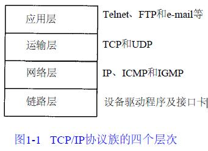

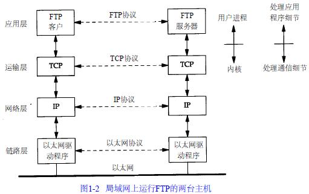

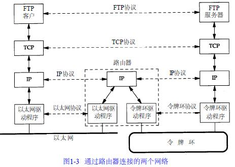

### 1.2 TCP/IP的分层

### 1.3 互联网地址
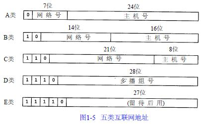

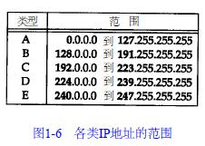

### 1.4 封装
TCP传给IP的数据单元称作TCP报文段或简称为TCP段(TCP segment)。IP传给网络接口层的数据单元称作IP数据报(IP datagram)。通过以太网传输的比特流称作帧(Frame)。

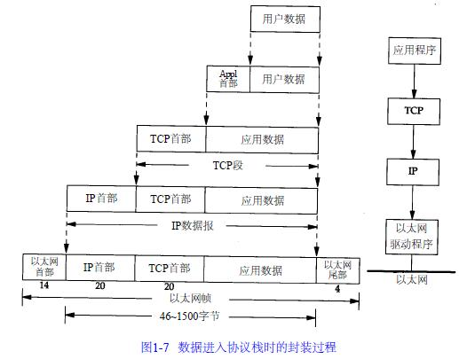

### 1.5 分用
当目的主机收到一个以太网数据帧时，数据就开始从协议栈中由底向上升，同时去掉各层协议加上的报文首部。每层协议盒都要去检查报文首部中的协议标识，以确定接收数据的上层协议。这个过程称作分用(Demultiplexing)，图1-8显示了该过程是如何发生的。

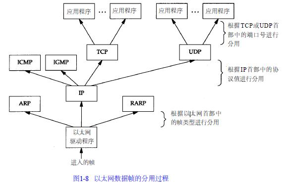

## 第二章 链路层
### 2.1 以太网和IEEE 802封装
最常使用的封装格式是RFC 894定义的格式。图2 - 1显示了两种不同形式的封装格式。图中每个方框下面的数字是它们的字节长度。

两种帧格式都采用48 bit（6字节）的目的地址和源地址。这就是我们在本书中所称的硬件地址。ARP和RARP协议对32 bit的IP地址和48 bit的硬件地址进行映射。

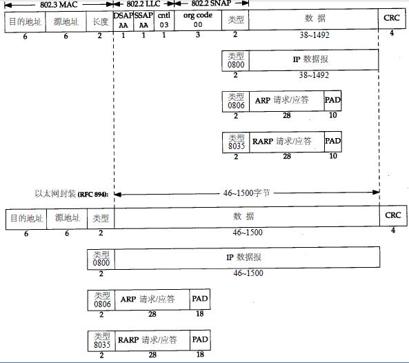

接下来的2个字节在两种帧格式中互不相同。在802标准定义的帧格式中，长度字段是指它后续数据的字节长度，但不包括CRC检验码。以太网的类型字段定义了后续数据的类型。在802标准定义的帧格式中，类型字段则由后续的子网接入协议（Sub-network Access Protocol，SNAP）的首部给出。幸运的是， 802定义的有效长度值与以太网的有效类型值无一相同，这样，就可以对两种帧格式进行区分。

在以太网帧格式中，类型字段之后就是数据；而在802帧格式中，跟随在后面的是3字节的802.2 LLC和5字节的802.2 SNAP。目的服务访问点（ Destination Service Access Point,DSAP）和源服务访问点（Source Service Access Point, SSAP）的值都设为0xaa。Ctrl字段的值设为3。随后的3个字节org code都置为0。再接下来的2个字节类型字段和以太网帧格式一样。

CRC字段用于帧内后续字节差错的循环冗余码检验（检验和）。

802.3标准定义的帧和以太网的帧都有最小长度要求。802.3规定数据部分必须至少为38字节，而对于以太网，则要求最少要有46字节。为了保证这一点，必须在不足的空间插入填充（pad）字节。

### 2.2 SLIP：串行线路IP
SLIP的全称是Serial Line IP。它是一种在串行线路上对IP数据报进行封装的简单形式，在RFC 1055中有详细描述。下面的规则描述了SLIP协议定义的帧格式：

1. IP数据报以一个称作END（0xc0）的特殊字符结束。同时，为了防止数据报到来之前的线路噪声被当成数据报内容，大多数实现在数据报的开始处也传一个END字符（如果有线路噪声，那么END字符将结束这份错误的报文。这样当前的报文得以正确地传输，而前一个错误报文交给上层后，会发现其内容毫无意义而被丢弃）。
2. 如果IP报文中某个字符为END，那么就要连续传输两个字节0xdb和0xdc来取代它。0xdb这个特殊字符被称作SLIP的ESC字符，但是它的值与AS CII码的ESC字符（0x1b）不同。
3. 如果IP报文中某个字符为SLIP的ESC字符，那么就要连续传输两个字节0xdb和0xdd来取代它。

图2-2中的例子就是含有一个END字符和一个ESC字符的IP报文。在这个例子中，在串行线路上传输的总字节数是原IP报文长度再加4个字节。

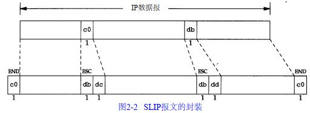

SLIP是一种简单的帧封装方法，还有一些值得一提的缺陷：
1. 每一端必须知道对方的IP地址。没有办法把本端的IP地址通知给另一端。
2. 数据帧中没有类型字段（类似于以太网中的类型字段）。如果一条串行线路用于SLIP，那么它不能同时使用其他协议。
3. SLIP没有在数据帧中加上检验和（类似于以太网中的CRC字段）。如果SLIP传输的报文被线路噪声影响而发生错误，只能通过上层协议来发现。

### 2.3 压缩的SLIP
由于串行线路的速率通常较低（19200 b/s或更低），而且通信经常是交互式的（如Telnet和Rlogin，二者都使用TCP），因此在SLIP线路上有许多小的TCP分组进行交换。为了传送1个字节的数据需要20个字节的IP首部和20个字节的TCP首部。于是人们提出一个被称作CSLIP（即压缩SLIP）的新协议，它在RFC 1144中被详细描述。CSLIP一般能把上面的40个字节压缩到3或5个字节。它能在CSLIP的每一端维持多达16个TCP连接，并且知道其中每个连接的首部中的某些字段一般不会发生变化。对于那些发生变化的字段，大多数只是一些小的数字和的改变。这些被压缩的首部大大地缩短了交互响应时间。

### 2.4 PPP：点对点协议
PPP包括以下三个部分：

1. 在串行链路上封装IP数据报的方法。PPP既支持数据为8位和无奇偶检验的异步模式（如大多数计算机上都普遍存在的串行接口），还支持面向比特的同步链接。
2. 建立、配置及测试数据链路的链路控制协议（LCP：Link Control Protocol）。它允许通信双方进行协商，以确定不同的选项。
3. 针对不同网络层协议的网络控制协议（NCP：Network Control Protocol）体系。当前RFC定义的网络层有IP、OSI网络层、DECnet以及Apple Talk。

图2-3是PPP数据帧的格式。每一帧都以标志字符0x7e开始和结束。紧接着是一个地址字节，值始终是0xff，然后是一个值为0x03的控制字节。

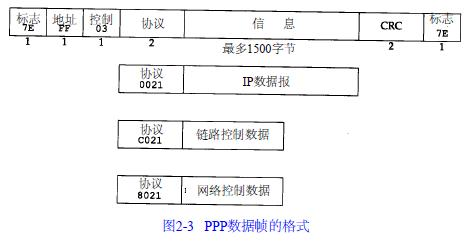

接下来是协议字段，类似于以太网中类型字段的功能。当它的值为0x0021时，表示信息字段是一个IP数据报；值为0xc021时，表示信息字段是链路控制数据；值为0x8021时，表示信息字段是网络控制数据。

CRC字段是一个循环冗余检验码，以检测数据帧中的错误。

由于标志字符的值是0x7e，因此当该字符出现在信息字段中时，PPP需要对它进行转义。在同步链路中，该过程是通过一种称作比特填充(bit stuffing)的硬件技术来完成的。在异步链路中，特殊字符0x7d用作转义字符。当它出现在PPP数据帧中时，那么紧接着的字符的第6个比特要取其补码，具体实现过程如下：

1. 当遇到字符0x7e时，需连续传送两个字符： 0x7d和0x5e，以实现标志字符的转义。
2. 当遇到转义字符0x7d时，需连续传送两个字符：0x7d和0x5d，以实现转义字符的转义。
3. 默认情况下，如果字符的值小于0x20（比如，一个ASCII控制字符），一般都要进行转义。

利用链路控制协议，大多数的产品通过协商可以省略标志符和地址字段。

总的来说，PPP比SLIP具有下面这些优点：

1. PPP支持在单根串行线路上运行多种协议，不只是IP协议；
2. 每一帧都有循环冗余检验； 
3. 通信双方可以进行IP地址的动态协商(使用IP网络控制协议)；
4. 与CSLIP类似，对TCP和IP报文首部进行压缩；
5. 链路控制协议可以对多个数据链路选项进行设置。为这些优点付出的代价是在每一帧的首部增加3个字节，当建立链路时要发送几帧协商数据，以及更为复杂的实现。

### 2.5 环回接口
大多数的产品都支持环回接口（Loopback Interface），以允许运行在同一台主机上的客户程序和服务器程序通过TCP/IP进行通信。A类网络号127就是为环回接口预留的。根据惯例，大多数系统把IP地址127.0.0.1分配给这个接口，并命名为localhost。一个传给环回接口的IP数据报不能在任何网络上出现。

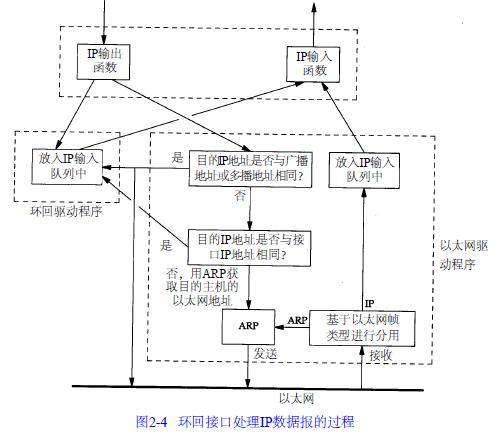

图中需要指出的关键点是：

1. 传给环回地址（一般是127.0.0.1）的任何数据均作为IP输入。
2. 传给广播地址或多播地址的数据报复制一份传给环回接口，然后送到以太网上。这是因为广播传送和多播传送的定义包含主机本身。
3. 任何传给该主机IP地址的数据均送到环回接口。

### 2.6 最大传输单元MTU
以太网和802.3对数据帧的长度都有一个限制，其最大值分别是1500和1492字节。链路层的这个特性称作MTU，最大传输单元。

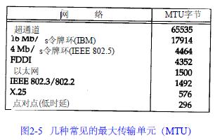

如果IP层有一个数据报要传，而且数据的长度比链路层的MTU还大，那么IP层就需要进行分片（fragmentation）。

### 2.7 路径MTU
当在同一个网络上的两台主机互相进行通信时，该网络的MTU是非常重要的。但是如果两台主机之间的通信要通过多个网络，那么每个网络的链路层就可能有不同的MTU。重要的不是两台主机所在网络的MTU的值，重要的是两台通信主机路径中的最小MTU。它被称作路径MTU。

