    作者:  [美] W·Richard Stevens
    出版社: 机械工业出版社
    原作名: TCP/IP ILLustrated Volume 1: The Protocols
    译者: 范建华
    出版年: 2000-4-1
    页数: 423
    定价: 45.00元
    装帧: 平装
    丛书: TCP/IP详解（中文版）
    ISBN: 9787111075660

[豆瓣链接](https://book.douban.com/subject/1088054/)

- [第一章 概述](#%e7%ac%ac%e4%b8%80%e7%ab%a0-%e6%a6%82%e8%bf%b0)
  - [1.1 分层](#11-%e5%88%86%e5%b1%82)
  - [1.2 TCP/IP的分层](#12-tcpip%e7%9a%84%e5%88%86%e5%b1%82)
  - [1.3 互联网地址](#13-%e4%ba%92%e8%81%94%e7%bd%91%e5%9c%b0%e5%9d%80)
  - [1.4 封装](#14-%e5%b0%81%e8%a3%85)
  - [1.5 分用](#15-%e5%88%86%e7%94%a8)
- [第二章 链路层](#%e7%ac%ac%e4%ba%8c%e7%ab%a0-%e9%93%be%e8%b7%af%e5%b1%82)
  - [2.1 以太网和IEEE 802封装](#21-%e4%bb%a5%e5%a4%aa%e7%bd%91%e5%92%8cieee-802%e5%b0%81%e8%a3%85)
  - [2.2 SLIP：串行线路IP](#22-slip%e4%b8%b2%e8%a1%8c%e7%ba%bf%e8%b7%afip)
  - [2.3 压缩的SLIP](#23-%e5%8e%8b%e7%bc%a9%e7%9a%84slip)
  - [2.4 PPP：点对点协议](#24-ppp%e7%82%b9%e5%af%b9%e7%82%b9%e5%8d%8f%e8%ae%ae)
  - [2.5 环回接口](#25-%e7%8e%af%e5%9b%9e%e6%8e%a5%e5%8f%a3)
  - [2.6 最大传输单元MTU](#26-%e6%9c%80%e5%a4%a7%e4%bc%a0%e8%be%93%e5%8d%95%e5%85%83mtu)
  - [2.7 路径MTU](#27-%e8%b7%af%e5%be%84mtu)
- [第三章 IP：网际协议](#%e7%ac%ac%e4%b8%89%e7%ab%a0-ip%e7%bd%91%e9%99%85%e5%8d%8f%e8%ae%ae)
  - [3.1 IP首部](#31-ip%e9%a6%96%e9%83%a8)
  - [3.2 子网掩码](#32-%e5%ad%90%e7%bd%91%e6%8e%a9%e7%a0%81)
  - [3.3 特殊情况的IP地址](#33-%e7%89%b9%e6%ae%8a%e6%83%85%e5%86%b5%e7%9a%84ip%e5%9c%b0%e5%9d%80)
- [第4章ARP：地址解析协议](#%e7%ac%ac4%e7%ab%a0arp%e5%9c%b0%e5%9d%80%e8%a7%a3%e6%9e%90%e5%8d%8f%e8%ae%ae)
  - [4.1 ARP高速缓存](#41-arp%e9%ab%98%e9%80%9f%e7%bc%93%e5%ad%98)
  - [4.2 ARP的分组格式](#42-arp%e7%9a%84%e5%88%86%e7%bb%84%e6%a0%bc%e5%bc%8f)
  - [4.3 ARP代理](#43-arp%e4%bb%a3%e7%90%86)
  - [4.4 免费ARP](#44-%e5%85%8d%e8%b4%b9arp)
- [第5章RARP：逆地址解析协议](#%e7%ac%ac5%e7%ab%a0rarp%e9%80%86%e5%9c%b0%e5%9d%80%e8%a7%a3%e6%9e%90%e5%8d%8f%e8%ae%ae)
- [第6章ICMP：Internet控制报文协议](#%e7%ac%ac6%e7%ab%a0icmpinternet%e6%8e%a7%e5%88%b6%e6%8a%a5%e6%96%87%e5%8d%8f%e8%ae%ae)
- [第7章Ping程序](#%e7%ac%ac7%e7%ab%a0ping%e7%a8%8b%e5%ba%8f)
- [第8章Traceroute程序](#%e7%ac%ac8%e7%ab%a0traceroute%e7%a8%8b%e5%ba%8f)
- [第9章IP选路](#%e7%ac%ac9%e7%ab%a0ip%e9%80%89%e8%b7%af)
  - [9.1 选路的原理](#91-%e9%80%89%e8%b7%af%e7%9a%84%e5%8e%9f%e7%90%86)
    - [9.1.1 简单路由表](#911-%e7%ae%80%e5%8d%95%e8%b7%af%e7%94%b1%e8%a1%a8)
    - [9.1.2 初始化路由表](#912-%e5%88%9d%e5%a7%8b%e5%8c%96%e8%b7%af%e7%94%b1%e8%a1%a8)
  - [9.2 ICMP主机与网络不可达差错](#92-icmp%e4%b8%bb%e6%9c%ba%e4%b8%8e%e7%bd%91%e7%bb%9c%e4%b8%8d%e5%8f%af%e8%be%be%e5%b7%ae%e9%94%99)
  - [9.3 ICMP重定向差错](#93-icmp%e9%87%8d%e5%ae%9a%e5%90%91%e5%b7%ae%e9%94%99)
    - [9.3.1 ICMP重定向报文](#931-icmp%e9%87%8d%e5%ae%9a%e5%90%91%e6%8a%a5%e6%96%87)
  - [9.4 ICMP路由器发现报文](#94-icmp%e8%b7%af%e7%94%b1%e5%99%a8%e5%8f%91%e7%8e%b0%e6%8a%a5%e6%96%87)
    - [9.4.1 路由器操作](#941-%e8%b7%af%e7%94%b1%e5%99%a8%e6%93%8d%e4%bd%9c)
    - [9.4.2 主机操作](#942-%e4%b8%bb%e6%9c%ba%e6%93%8d%e4%bd%9c)
- [第10章 动态选路协议](#%e7%ac%ac10%e7%ab%a0-%e5%8a%a8%e6%80%81%e9%80%89%e8%b7%af%e5%8d%8f%e8%ae%ae)
  - [10.1 动态选路](#101-%e5%8a%a8%e6%80%81%e9%80%89%e8%b7%af)
  - [10.2 Unix选路守护程序](#102-unix%e9%80%89%e8%b7%af%e5%ae%88%e6%8a%a4%e7%a8%8b%e5%ba%8f)
  - [10.3 RIP：选路信息协议](#103-rip%e9%80%89%e8%b7%af%e4%bf%a1%e6%81%af%e5%8d%8f%e8%ae%ae)
    - [10.3.1 报文格式](#1031-%e6%8a%a5%e6%96%87%e6%a0%bc%e5%bc%8f)
    - [10.3.2 正常运行](#1032-%e6%ad%a3%e5%b8%b8%e8%bf%90%e8%a1%8c)
    - [10.3.3 度量](#1033-%e5%ba%a6%e9%87%8f)
    - [10.3.4 问题](#1034-%e9%97%ae%e9%a2%98)
  - [10.4 RIP版本2](#104-rip%e7%89%88%e6%9c%ac2)
  - [10.5 OSPF：开放最短路径优先](#105-ospf%e5%bc%80%e6%94%be%e6%9c%80%e7%9f%ad%e8%b7%af%e5%be%84%e4%bc%98%e5%85%88)
  - [10.6 BGP：边界网关协议](#106-bgp%e8%be%b9%e7%95%8c%e7%bd%91%e5%85%b3%e5%8d%8f%e8%ae%ae)
  - [10.7 CIDR：无类型域间选路](#107-cidr%e6%97%a0%e7%b1%bb%e5%9e%8b%e5%9f%9f%e9%97%b4%e9%80%89%e8%b7%af)
- [第11章 UDP：用户数据报协议](#%e7%ac%ac11%e7%ab%a0-udp%e7%94%a8%e6%88%b7%e6%95%b0%e6%8d%ae%e6%8a%a5%e5%8d%8f%e8%ae%ae)
  - [11.1 UDP封装与UDP首部](#111-udp%e5%b0%81%e8%a3%85%e4%b8%8eudp%e9%a6%96%e9%83%a8)
  - [11.2 UDP检验和](#112-udp%e6%a3%80%e9%aa%8c%e5%92%8c)
  - [11.3 IP分片](#113-ip%e5%88%86%e7%89%87)
  - [11.4 ICMP不可达差错（需要分片）](#114-icmp%e4%b8%8d%e5%8f%af%e8%be%be%e5%b7%ae%e9%94%99%e9%9c%80%e8%a6%81%e5%88%86%e7%89%87)
  - [11.5 UDP和ARP之间的交互作用](#115-udp%e5%92%8carp%e4%b9%8b%e9%97%b4%e7%9a%84%e4%ba%a4%e4%ba%92%e4%bd%9c%e7%94%a8)
  - [11.6 UDP服务器的设计](#116-udp%e6%9c%8d%e5%8a%a1%e5%99%a8%e7%9a%84%e8%ae%be%e8%ae%a1)
    - [11.6.1 客户IP地址及端口号](#1161-%e5%ae%a2%e6%88%b7ip%e5%9c%b0%e5%9d%80%e5%8f%8a%e7%ab%af%e5%8f%a3%e5%8f%b7)
    - [11.6.2 目的IP地址](#1162-%e7%9b%ae%e7%9a%84ip%e5%9c%b0%e5%9d%80)
    - [11.6.3 UDP输入队列](#1163-udp%e8%be%93%e5%85%a5%e9%98%9f%e5%88%97)
    - [11.6.4 限制本地IP地址](#1164-%e9%99%90%e5%88%b6%e6%9c%ac%e5%9c%b0ip%e5%9c%b0%e5%9d%80)
    - [11.6.5 限制远端IP地址](#1165-%e9%99%90%e5%88%b6%e8%bf%9c%e7%ab%afip%e5%9c%b0%e5%9d%80)
- [第12章 广播和多播](#%e7%ac%ac12%e7%ab%a0-%e5%b9%bf%e6%92%ad%e5%92%8c%e5%a4%9a%e6%92%ad)
  - [12.1 广播](#121-%e5%b9%bf%e6%92%ad)
    - [12.1.1 受限的广播](#1211-%e5%8f%97%e9%99%90%e7%9a%84%e5%b9%bf%e6%92%ad)
    - [12.1.2 指向网络的广播](#1212-%e6%8c%87%e5%90%91%e7%bd%91%e7%bb%9c%e7%9a%84%e5%b9%bf%e6%92%ad)
    - [12.1.3 指向子网的广播](#1213-%e6%8c%87%e5%90%91%e5%ad%90%e7%bd%91%e7%9a%84%e5%b9%bf%e6%92%ad)
    - [12.1.4 指向所有子网的广播](#1214-%e6%8c%87%e5%90%91%e6%89%80%e6%9c%89%e5%ad%90%e7%bd%91%e7%9a%84%e5%b9%bf%e6%92%ad)
  - [12.2 组播](#122-%e7%bb%84%e6%92%ad)
- [第13章 IGMP：Internet组管理协议](#%e7%ac%ac13%e7%ab%a0-igmpinternet%e7%bb%84%e7%ae%a1%e7%90%86%e5%8d%8f%e8%ae%ae)
  - [13.1 IGMP报文](#131-igmp%e6%8a%a5%e6%96%87)
  - [13.2 IGMP协议](#132-igmp%e5%8d%8f%e8%ae%ae)
    - [13.2.1 加入一个多播组](#1321-%e5%8a%a0%e5%85%a5%e4%b8%80%e4%b8%aa%e5%a4%9a%e6%92%ad%e7%bb%84)
    - [13.2.2 IGMP报告和查询](#1322-igmp%e6%8a%a5%e5%91%8a%e5%92%8c%e6%9f%a5%e8%af%a2)
    - [13.2.3 TTL](#1323-ttl)
    - [13.2.4 所有主机组](#1324-%e6%89%80%e6%9c%89%e4%b8%bb%e6%9c%ba%e7%bb%84)
- [第14章 DNS：域名系统](#%e7%ac%ac14%e7%ab%a0-dns%e5%9f%9f%e5%90%8d%e7%b3%bb%e7%bb%9f)
  - [14.1 DNS基础](#141-dns%e5%9f%ba%e7%a1%80)
  - [14.2 DNS的报文格式](#142-dns%e7%9a%84%e6%8a%a5%e6%96%87%e6%a0%bc%e5%bc%8f)
    - [14.2.1 DNS查询报文中的问题部分](#1421-dns%e6%9f%a5%e8%af%a2%e6%8a%a5%e6%96%87%e4%b8%ad%e7%9a%84%e9%97%ae%e9%a2%98%e9%83%a8%e5%88%86)
    - [14.2.2 DNS响应报文中的资源记录部分](#1422-dns%e5%93%8d%e5%ba%94%e6%8a%a5%e6%96%87%e4%b8%ad%e7%9a%84%e8%b5%84%e6%ba%90%e8%ae%b0%e5%bd%95%e9%83%a8%e5%88%86)
- [第15章 TFTP:简单文件传送协议](#%e7%ac%ac15%e7%ab%a0-tftp%e7%ae%80%e5%8d%95%e6%96%87%e4%bb%b6%e4%bc%a0%e9%80%81%e5%8d%8f%e8%ae%ae)
- [第16章 BOOTP:引导程序协议](#%e7%ac%ac16%e7%ab%a0-bootp%e5%bc%95%e5%af%bc%e7%a8%8b%e5%ba%8f%e5%8d%8f%e8%ae%ae)
  - [16.1 BOOTP的分组格式](#161-bootp%e7%9a%84%e5%88%86%e7%bb%84%e6%a0%bc%e5%bc%8f)
  - [16.2 端口号](#162-%e7%ab%af%e5%8f%a3%e5%8f%b7)
  - [16.3 BOOTP服务器的设计](#163-bootp%e6%9c%8d%e5%8a%a1%e5%99%a8%e7%9a%84%e8%ae%be%e8%ae%a1)
  - [16.4 BOOTP穿越路由器](#164-bootp%e7%a9%bf%e8%b6%8a%e8%b7%af%e7%94%b1%e5%99%a8)
  - [16.5 特定厂商信息](#165-%e7%89%b9%e5%ae%9a%e5%8e%82%e5%95%86%e4%bf%a1%e6%81%af)
- [第17章 TCP:传输控制协议](#%e7%ac%ac17%e7%ab%a0-tcp%e4%bc%a0%e8%be%93%e6%8e%a7%e5%88%b6%e5%8d%8f%e8%ae%ae)
- [第18章 TCP连接的建立与终止](#%e7%ac%ac18%e7%ab%a0-tcp%e8%bf%9e%e6%8e%a5%e7%9a%84%e5%bb%ba%e7%ab%8b%e4%b8%8e%e7%bb%88%e6%ad%a2)
  - [18.1 建立连接协议与连接终止协议](#181-%e5%bb%ba%e7%ab%8b%e8%bf%9e%e6%8e%a5%e5%8d%8f%e8%ae%ae%e4%b8%8e%e8%bf%9e%e6%8e%a5%e7%bb%88%e6%ad%a2%e5%8d%8f%e8%ae%ae)
  - [18.2 最大报文段长度](#182-%e6%9c%80%e5%a4%a7%e6%8a%a5%e6%96%87%e6%ae%b5%e9%95%bf%e5%ba%a6)
  - [18.3 TCP的半关闭](#183-tcp%e7%9a%84%e5%8d%8a%e5%85%b3%e9%97%ad)
  - [18.4 TCP的状态变迁图](#184-tcp%e7%9a%84%e7%8a%b6%e6%80%81%e5%8f%98%e8%bf%81%e5%9b%be)
    - [18.4.1 2MSL等待状态](#1841-2msl%e7%ad%89%e5%be%85%e7%8a%b6%e6%80%81)
    - [18.4.2 平静时间的概念](#1842-%e5%b9%b3%e9%9d%99%e6%97%b6%e9%97%b4%e7%9a%84%e6%a6%82%e5%bf%b5)
    - [18.4.3 FIN_WAIT_2状态](#1843-finwait2%e7%8a%b6%e6%80%81)
  - [18.5 复位报文段](#185-%e5%a4%8d%e4%bd%8d%e6%8a%a5%e6%96%87%e6%ae%b5)
    - [18.5.1 到不存在的端口的连接请求](#1851-%e5%88%b0%e4%b8%8d%e5%ad%98%e5%9c%a8%e7%9a%84%e7%ab%af%e5%8f%a3%e7%9a%84%e8%bf%9e%e6%8e%a5%e8%af%b7%e6%b1%82)
    - [18.5.2 异常终止一个连接](#1852-%e5%bc%82%e5%b8%b8%e7%bb%88%e6%ad%a2%e4%b8%80%e4%b8%aa%e8%bf%9e%e6%8e%a5)
    - [18.5.3 检测半打开连接](#1853-%e6%a3%80%e6%b5%8b%e5%8d%8a%e6%89%93%e5%bc%80%e8%bf%9e%e6%8e%a5)
  - [18.6 同时打开](#186-%e5%90%8c%e6%97%b6%e6%89%93%e5%bc%80)
  - [18.7 同时关闭](#187-%e5%90%8c%e6%97%b6%e5%85%b3%e9%97%ad)
  - [18.8 backlog](#188-backlog)
- [第19章 TCP的交互数据流](#%e7%ac%ac19%e7%ab%a0-tcp%e7%9a%84%e4%ba%a4%e4%ba%92%e6%95%b0%e6%8d%ae%e6%b5%81)
  - [19.1 交互式输入](#191-%e4%ba%a4%e4%ba%92%e5%bc%8f%e8%be%93%e5%85%a5)
  - [19.2 经受时延的确认](#192-%e7%bb%8f%e5%8f%97%e6%97%b6%e5%bb%b6%e7%9a%84%e7%a1%ae%e8%ae%a4)
  - [19.3 Nagle算法](#193-nagle%e7%ae%97%e6%b3%95)
- [第20章 TCP的成块数据流](#%e7%ac%ac20%e7%ab%a0-tcp%e7%9a%84%e6%88%90%e5%9d%97%e6%95%b0%e6%8d%ae%e6%b5%81)
  - [20.1 正常数据流](#201-%e6%ad%a3%e5%b8%b8%e6%95%b0%e6%8d%ae%e6%b5%81)
  - [20.2 滑动窗口](#202-%e6%bb%91%e5%8a%a8%e7%aa%97%e5%8f%a3)
  - [20.3 PUSH标志](#203-push%e6%a0%87%e5%bf%97)
  - [20.4 慢启动](#204-%e6%85%a2%e5%90%af%e5%8a%a8)
  - [20.5 成块数据的吞吐量](#205-%e6%88%90%e5%9d%97%e6%95%b0%e6%8d%ae%e7%9a%84%e5%90%9e%e5%90%90%e9%87%8f)
  - [20.6 紧急方式](#206-%e7%b4%a7%e6%80%a5%e6%96%b9%e5%bc%8f)
- [第21章 TCP的超时与重传](#%e7%ac%ac21%e7%ab%a0-tcp%e7%9a%84%e8%b6%85%e6%97%b6%e4%b8%8e%e9%87%8d%e4%bc%a0)
  - [21.1 超时与重传的简单例子](#211-%e8%b6%85%e6%97%b6%e4%b8%8e%e9%87%8d%e4%bc%a0%e7%9a%84%e7%ae%80%e5%8d%95%e4%be%8b%e5%ad%90)
  - [21.2 RTT测量](#212-rtt%e6%b5%8b%e9%87%8f)
    - [Karn算法](#karn%e7%ae%97%e6%b3%95)
  - [21.3 拥塞举例](#213-%e6%8b%a5%e5%a1%9e%e4%b8%be%e4%be%8b)
  - [21.4 拥塞避免算法](#214-%e6%8b%a5%e5%a1%9e%e9%81%bf%e5%85%8d%e7%ae%97%e6%b3%95)
  - [21.5 快速重传与快速恢复算法](#215-%e5%bf%ab%e9%80%9f%e9%87%8d%e4%bc%a0%e4%b8%8e%e5%bf%ab%e9%80%9f%e6%81%a2%e5%a4%8d%e7%ae%97%e6%b3%95)
- [第22章 TCP的坚持定时器](#%e7%ac%ac22%e7%ab%a0-tcp%e7%9a%84%e5%9d%9a%e6%8c%81%e5%ae%9a%e6%97%b6%e5%99%a8)
  - [22.1 坚持定时器的触发](#221-%e5%9d%9a%e6%8c%81%e5%ae%9a%e6%97%b6%e5%99%a8%e7%9a%84%e8%a7%a6%e5%8f%91)
- [第23章 TCP的保活定时器](#%e7%ac%ac23%e7%ab%a0-tcp%e7%9a%84%e4%bf%9d%e6%b4%bb%e5%ae%9a%e6%97%b6%e5%99%a8)
- [第24章 TCP的未来和性能](#%e7%ac%ac24%e7%ab%a0-tcp%e7%9a%84%e6%9c%aa%e6%9d%a5%e5%92%8c%e6%80%a7%e8%83%bd)
  - [24.1 路径MTU发现](#241-%e8%b7%af%e5%be%84mtu%e5%8f%91%e7%8e%b0)
  - [24.2 长肥管道](#242-%e9%95%bf%e8%82%a5%e7%ae%a1%e9%81%93)
  - [24.3 窗口扩大选项](#243-%e7%aa%97%e5%8f%a3%e6%89%a9%e5%a4%a7%e9%80%89%e9%a1%b9)
  - [24.4 时间戳选项](#244-%e6%97%b6%e9%97%b4%e6%88%b3%e9%80%89%e9%a1%b9)
  - [24.5 PAWS:防止回绕的序号](#245-paws%e9%98%b2%e6%ad%a2%e5%9b%9e%e7%bb%95%e7%9a%84%e5%ba%8f%e5%8f%b7)
  - [24.6 T/TCP:为事务用的TCP扩展](#246-ttcp%e4%b8%ba%e4%ba%8b%e5%8a%a1%e7%94%a8%e7%9a%84tcp%e6%89%a9%e5%b1%95)
- [第25章 SNMP:简单网络管理协议](#%e7%ac%ac25%e7%ab%a0-snmp%e7%ae%80%e5%8d%95%e7%bd%91%e7%bb%9c%e7%ae%a1%e7%90%86%e5%8d%8f%e8%ae%ae)

## 第一章 概述
### 1.1 分层


### 1.2 TCP/IP的分层


### 1.3 互联网地址


### 1.4 封装
TCP传给IP的数据单元称作TCP报文段或简称为TCP段(TCP segment)。IP传给网络接口层的数据单元称作IP数据报(IP datagram)。通过以太网传输的比特流称作帧(Frame)。


### 1.5 分用
当目的主机收到一个以太网数据帧时，数据就开始从协议栈中由底向上升，同时去掉各层协议加上的报文首部。每层协议盒都要去检查报文首部中的协议标识，以确定接收数据的上层协议。这个过程称作分用(Demultiplexing)，图1-8显示了该过程是如何发生的。


## 第二章 链路层
### 2.1 以太网和IEEE 802封装
最常使用的封装格式是RFC 894定义的格式。图2 - 1显示了两种不同形式的封装格式。图中每个方框下面的数字是它们的字节长度。

两种帧格式都采用48 bit（6字节）的目的地址和源地址。这就是我们在本书中所称的硬件地址。ARP和RARP协议对32 bit的IP地址和48 bit的硬件地址进行映射。


接下来的2个字节在两种帧格式中互不相同。在802标准定义的帧格式中，长度字段是指它后续数据的字节长度，但不包括CRC检验码。以太网的类型字段定义了后续数据的类型。在802标准定义的帧格式中，类型字段则由后续的子网接入协议（Sub-network Access Protocol，SNAP）的首部给出。幸运的是， 802定义的有效长度值与以太网的有效类型值无一相同，这样，就可以对两种帧格式进行区分。

在以太网帧格式中，类型字段之后就是数据；而在802帧格式中，跟随在后面的是3字节的802.2 LLC和5字节的802.2 SNAP。目的服务访问点（ Destination Service Access Point,DSAP）和源服务访问点（Source Service Access Point, SSAP）的值都设为0xaa。Ctrl字段的值设为3。随后的3个字节org code都置为0。再接下来的2个字节类型字段和以太网帧格式一样。

CRC字段用于帧内后续字节差错的循环冗余码检验（检验和）。

802.3标准定义的帧和以太网的帧都有最小长度要求。802.3规定数据部分必须至少为38字节，而对于以太网，则要求最少要有46字节。为了保证这一点，必须在不足的空间插入填充（pad）字节。

### 2.2 SLIP：串行线路IP
SLIP的全称是Serial Line IP。它是一种在串行线路上对IP数据报进行封装的简单形式，在RFC 1055中有详细描述。下面的规则描述了SLIP协议定义的帧格式：

1. IP数据报以一个称作END（0xc0）的特殊字符结束。同时，为了防止数据报到来之前的线路噪声被当成数据报内容，大多数实现在数据报的开始处也传一个END字符（如果有线路噪声，那么END字符将结束这份错误的报文。这样当前的报文得以正确地传输，而前一个错误报文交给上层后，会发现其内容毫无意义而被丢弃）。
2. 如果IP报文中某个字符为END，那么就要连续传输两个字节0xdb和0xdc来取代它。0xdb这个特殊字符被称作SLIP的ESC字符，但是它的值与AS CII码的ESC字符（0x1b）不同。
3. 如果IP报文中某个字符为SLIP的ESC字符，那么就要连续传输两个字节0xdb和0xdd来取代它。

图2-2中的例子就是含有一个END字符和一个ESC字符的IP报文。在这个例子中，在串行线路上传输的总字节数是原IP报文长度再加4个字节。


SLIP是一种简单的帧封装方法，还有一些值得一提的缺陷：
1. 每一端必须知道对方的IP地址。没有办法把本端的IP地址通知给另一端。
2. 数据帧中没有类型字段（类似于以太网中的类型字段）。如果一条串行线路用于SLIP，那么它不能同时使用其他协议。
3. SLIP没有在数据帧中加上检验和（类似于以太网中的CRC字段）。如果SLIP传输的报文被线路噪声影响而发生错误，只能通过上层协议来发现。

### 2.3 压缩的SLIP
由于串行线路的速率通常较低（19200 b/s或更低），而且通信经常是交互式的（如Telnet和Rlogin，二者都使用TCP），因此在SLIP线路上有许多小的TCP分组进行交换。为了传送1个字节的数据需要20个字节的IP首部和20个字节的TCP首部。于是人们提出一个被称作CSLIP（即压缩SLIP）的新协议，它在RFC 1144中被详细描述。CSLIP一般能把上面的40个字节压缩到3或5个字节。它能在CSLIP的每一端维持多达16个TCP连接，并且知道其中每个连接的首部中的某些字段一般不会发生变化。对于那些发生变化的字段，大多数只是一些小的数字和的改变。这些被压缩的首部大大地缩短了交互响应时间。

### 2.4 PPP：点对点协议
PPP包括以下三个部分：

1. 在串行链路上封装IP数据报的方法。PPP既支持数据为8位和无奇偶检验的异步模式（如大多数计算机上都普遍存在的串行接口），还支持面向比特的同步链接。
2. 建立、配置及测试数据链路的链路控制协议（LCP：Link Control Protocol）。它允许通信双方进行协商，以确定不同的选项。
3. 针对不同网络层协议的网络控制协议（NCP：Network Control Protocol）体系。当前RFC定义的网络层有IP、OSI网络层、DECnet以及Apple Talk。

图2-3是PPP数据帧的格式。每一帧都以标志字符0x7e开始和结束。紧接着是一个地址字节，值始终是0xff，然后是一个值为0x03的控制字节。


接下来是协议字段，类似于以太网中类型字段的功能。当它的值为0x0021时，表示信息字段是一个IP数据报；值为0xc021时，表示信息字段是链路控制数据；值为0x8021时，表示信息字段是网络控制数据。

CRC字段是一个循环冗余检验码，以检测数据帧中的错误。

由于标志字符的值是0x7e，因此当该字符出现在信息字段中时，PPP需要对它进行转义。在同步链路中，该过程是通过一种称作比特填充(bit stuffing)的硬件技术来完成的。在异步链路中，特殊字符0x7d用作转义字符。当它出现在PPP数据帧中时，那么紧接着的字符的第6个比特要取其补码，具体实现过程如下：

1. 当遇到字符0x7e时，需连续传送两个字符： 0x7d和0x5e，以实现标志字符的转义。
2. 当遇到转义字符0x7d时，需连续传送两个字符：0x7d和0x5d，以实现转义字符的转义。
3. 默认情况下，如果字符的值小于0x20（比如，一个ASCII控制字符），一般都要进行转义。

利用链路控制协议，大多数的产品通过协商可以省略标志符和地址字段。

总的来说，PPP比SLIP具有下面这些优点：

1. PPP支持在单根串行线路上运行多种协议，不只是IP协议；
2. 每一帧都有循环冗余检验； 
3. 通信双方可以进行IP地址的动态协商(使用IP网络控制协议)；
4. 与CSLIP类似，对TCP和IP报文首部进行压缩；
5. 链路控制协议可以对多个数据链路选项进行设置。为这些优点付出的代价是在每一帧的首部增加3个字节，当建立链路时要发送几帧协商数据，以及更为复杂的实现。

### 2.5 环回接口
大多数的产品都支持环回接口（Loopback Interface），以允许运行在同一台主机上的客户程序和服务器程序通过TCP/IP进行通信。A类网络号127就是为环回接口预留的。根据惯例，大多数系统把IP地址127.0.0.1分配给这个接口，并命名为localhost。一个传给环回接口的IP数据报不能在任何网络上出现。


图中需要指出的关键点是：

1. 传给环回地址（一般是127.0.0.1）的任何数据均作为IP输入。
2. 传给广播地址或多播地址的数据报复制一份传给环回接口，然后送到以太网上。这是因为广播传送和多播传送的定义包含主机本身。
3. 任何传给该主机IP地址的数据均送到环回接口。

### 2.6 最大传输单元MTU
以太网和802.3对数据帧的长度都有一个限制，其最大值分别是1500和1492字节。链路层的这个特性称作MTU，最大传输单元。


如果IP层有一个数据报要传，而且数据的长度比链路层的MTU还大，那么IP层就需要进行分片（fragmentation）。

### 2.7 路径MTU
当在同一个网络上的两台主机互相进行通信时，该网络的MTU是非常重要的。但是如果两台主机之间的通信要通过多个网络，那么每个网络的链路层就可能有不同的MTU。重要的不是两台主机所在网络的MTU的值，重要的是两台通信主机路径中的最小MTU。它被称作路径MTU。

## 第三章 IP：网际协议
### 3.1 IP首部
IP数据报的格式如图3-1所示。普通的IP首部长为20个字节，除非含有选项字段。


4个字节的32 bit值以下面的次序传输：首先是0～7 bit，其次8～15 bit，然后16～23 bit，最后是24~31 bit。这种传输次序称作`big endian`字节序。

目前的协议版本号是4，因此IP有时也称作IPv4。首部长度指的是首部占32 bit字的数目，包括任何选项。由于它是一个4比特字段，因此首部最长为60个字节。服务类型（TOS）字段包括一个3 bit的优先权子字段（现在已被忽略），4 bit的TOS子字段和1 bit未用位但必须置0。4 bit的TOS分别代表：最小时延、最大吞吐量、最高可靠性和最小费用。4 bit中只能置其中1 bit。如果所有4 bit均为0，那么就意味着是一般服务。

总长度字段是指整个IP数据报的长度，以字节为单位。利用首部长度字段和总长度字段，就可以知道IP数据报中数据内容的起始位置和长度。由于该字段长16比特，所以IP数据报最长可达65535字节（回忆图2-5，超级通道的MTU为65535。它的意思其实不是一个真正的MTU—它使用了最长的IP数据报）。当数据报被分片时，该字段的值也随着变化。

标识字段唯一地标识主机发送的每一份数据报。通常每发送一份报文它的值就会加1。

`TTL(time-to-live)`生存时间字段设置了数据报可以经过的最多路由器数。它指定了数据报的生存时间。TTL的初始值由源主机设置(通常为32或64)，一旦经过一个处理它的路由器，它的值就减去1。当该字段的值为0时，数据报就被丢弃，并发送ICMP报文通知源主机。

经在第1章讨论了协议字段，并在图1-8中示出了它如何被IP用来对数据报进行分用。根据它可以识别是哪个协议向IP传送数据。

首部检验和字段是根据IP首部计算的检验和码。它不对首部后面的数据进行计算。ICMP、IGMP、UDP和TCP在它们各自的首部中均含有同时覆盖首部和数据检验和码。

- 每一份IP数据报都包含源IP地址和目的IP地址。它们都是32 bit的值。
- 最后一个字段是任选项，是数据报中的一个可变长的可选信息。
- 选项字段一直都是以32 bit作为界限，在必要的时候插入值为0的填充字节。这样就保证IP首部始终是32 bit的整数倍。

### 3.2 子网掩码
掩码是一个32 bit的值，其中值为1的比特留给网络号和子网号，为0的比特留给主机号。图3-7是一个B类地址的两种不同的子网掩码格式。第一个例子,子网号和主机号都是8 bit宽。第二个例子是一个B类地址划分成10 bit的子网号和6 bit的主机号。


给定IP地址和子网掩码以后，主机就可以确定IP数据报的目的是：(1)本子网上的主机；(2)本网络中其他子网中的主机；(3)其他网络上的主机。如果知道本机的IP地址，那么就知道它是否为A类、B类或C类地址(从IP地址的高位可以得知)，也就知道网络号和子网号之间的分界线。而根据子网掩码就可知道子网号与主机号之间的分界线。

### 3.3 特殊情况的IP地址
介绍7个特殊的IP地址，如图3-9所示。在这个图中，0表示所有的比特位全为0；-1表示所有的比特位全为1；netid、subnetid和hostid分别表示不为全0或全1的对应字段。子网号栏为空表示该地址没有进行子网划分。


## 第4章ARP：地址解析协议
在ARP背后有一个基本概念，那就是网络接口有一个硬件地址（一个48 bit的值，标识不同的以太网或令牌环网络接口）。在硬件层次上进行的数据帧交换必须有正确的接口地址。但是，TCP/IP有自己的地址：32 bit的IP地址。知道主机的IP地址并不能让内核发送一帧数据给主机。内核（如以太网驱动程序）必须知道目的端的硬件地址才能发送数据。ARP的功能是在32 bit的IP地址和采用不同网络技术的硬件地址之间提供动态映射。

### 4.1 ARP高速缓存
ARP高效运行的关键是由于每个主机上都有一个ARP高速缓存。这个高速缓存存放了最近Internet地址到硬件地址之间的映射记录。高速缓存中每一项的生存时间一般为20分钟，起始时间从被创建时开始算起。我们可以用arp(8)命令来检查ARP高速缓存。参数-a的意思是显示高速缓存中所有的内容。

```
bsdi % arp -a
sun (140.252.13.33) at 8:0:20:3:f6:42
svr4 (140.252.13.34) at 0:0:c0:c2:9b:26
```

### 4.2 ARP的分组格式
在以太网上解析IP地址时，ARP请求和应答分组的格式如图4-3所示:


- 以太网报头中的前两个字段是以太网的源地址和目的地址。目的地址为全1的特殊地址是广播地址。
- 两个字节长的以太网帧类型表示后面数据的类型。对于ARP请求或应答来说，该字段的值为0x0806。
- 硬件类型字段表示硬件地址的类型。它的值为1即表示以太网地址。协议类型字段表示要映射的协议地址类型。它的值为0x0800即表示IP地址。
- 接下来的两个1字节的字段，硬件地址长度和协议地址长度分别指出硬件地址和协议地址的长度，以字节为单位。
- 操作字段指出四种操作类型，它们是ARP请求(值为1)、A R P应答(值为2)、RARP请求(值为3)和RARP应答(值为4)。
- 接下来的四个字段是发送端的硬件地址(在本例中是以太网地址)、发送端的协议地址(IP地址)、目的端的硬件地址和目的端的协议地址。注意，这里有一些重复信息：在以太网的数据帧报头中和ARP请求数据帧中都有发送端的硬件地址。

### 4.3 ARP代理
如果ARP请求是从一个网络的主机发往另一个网络上的主机，那么连接这两个网络的路由器就可以回答该请求，这个过程称作委托ARP或ARP代理(Proxy ARP)。这样可以欺骗发起ARP请求的发送端，使它误以为路由器就是目的主机，而事实上目的主机是在路由器的“另一边”。路由器的功能相当于目的主机的代理，把分组从其他主机转发给它。

### 4.4 免费ARP
我们可以看到的另一个ARP特性称作免费ARP(gratuitous ARP)。它是指主机发送ARP查找自己的IP地址。通常，它发生在系统引导期间进行接口配置的时候。

免费ARP可以有两个方面的作用：

1. 一个主机可以通过它来确定另一个主机是否设置了相同的IP地址。
2. 如果发送免费ARP的主机正好改变了硬件地址（很可能是主机关机了，并换了一块接口卡，然后重新启动），那么这个分组就可以使其他主机高速缓存中旧的硬件地址进行相应的更新。

## 第5章RARP：逆地址解析协议
具有本地磁盘的系统引导时，一般是从磁盘上的配置文件中读取IP地址。但是无盘机，则需要采用其他方法来获得IP地址。网络上的每个系统都具有唯一的硬件地址，它是由网络接口生产厂家配置的。无盘系统的RARP实现过程是从接口卡上读取唯一的硬件地址，然后发送一份RARP请求(一帧在网络上广播的数据)，请求某个主机响应该无盘系统的IP地址(在RARP应答中)。

RARP分组的格式与ARP分组基本一致(见图4-3)。它们之间主要的差别是RARP请求或应答的帧类型代码为0x8035，而且RARP请求的操作代码为3，应答操作代码为4。

## 第6章ICMP：Internet控制报文协议
ICMP经常被认为是IP层的一个组成部分。它传递差错报文以及其他需要注意的信息。ICMP报文是在IP数据报内部被传输的，如图6-1所示。


ICMP报文的格式如图6-2所示。所有报文的前4个字节都是一样的，但是剩下的其他字节则互不相同。类型字段可以有15个不同的值，以描述特定类型的ICMP报文。某些ICMP报文还使用代码字段的值来进一步描述不同的条件。检验和字段覆盖整个ICMP报文。


各种类型的ICMP报文如图6-3所示，不同类型由报文中的类型字段和代码字段来共同决定。


图中的最后两列表明ICMP报文是一份查询报文还是一份差错报文。因为对ICMP差错报文有时需要作特殊处理，因此我们需要对它们进行区分。例如，在对ICMP差错报文进行响应时，永远不会生成另一份ICMP差错报文(如果没有这个限制规则，可能会遇到一个差错产生另一个差错的情况，而差错再产生差错，这样会无休止地循环下去)。

当发送一份ICMP差错报文时，报文始终包含IP的首部和产生ICMP差错报文的IP数据报的前8个字节。这样，接收ICMP差错报文的模块就会把它与某个特定的协议(根据IP数据报首部中的协议字段来判断)和用户进程(根据包含在IP数据报前8个字节中的TCP或UDP报文首部中的TCP或UDP端口号来判断)联系起来。

下面各种情况都不会导致产生ICMP差错报文：

1. ICMP差错报文(但是，ICMP查询报文可能会产生ICMP差错报文)。
2. 目的地址是广播地址或多播地址的IP数据报。
3. 作为链路层广播的数据报。
4. 不是IP分片的第一片。
5. 源地址不是单个主机的数据报。这就是说，源地址不能为零地址、环回地址、广播地址或多播地址。

这些规则是为了防止过去允许ICMP差错报文对广播分组响应所带来的广播风暴。

## 第7章Ping程序
Ping程序目的是为了测试另一台主机是否可达。该程序发送一份ICMP回显请求报文给主机，并等待返回ICMP回显应答。ICMP回显请求和回显应答报文如图7-1所示。


Unix系统在实现ping程序时是把ICMP报文中的标识符字段置成发送进程的ID号。这样即使在同一台主机上同时运行了多个ping程序实例， ping程序也可以识别出返回的信息。序列号从0开始，每发送一次新的回显请求就加1。ping程序打印出返回的每个分组的序列号，允许我们查看是否有分组丢失、失序或重复。

ping程序通过在ICMP报文数据中存放发送请求的时间值来计算往返时间。当应答返回时，用当前时间减去存放在ICMP报文中的时间值，即是往返时间。

## 第8章Traceroute程序
Traceroute程序使用ICMP报文和IP首部中的TTL字段。TTL字段是由发送端初始设置一个8 bit字段。推荐的初始值由分配数字RFC指定，当前值为64。每个处理数据报的路由器都需要把TTL的值减1或减去数据报在路由器中停留的秒数。由于大多数的路由器转发数据报的时延都小于1秒钟，因此TTL最终成为一个跳站的计数器，所经过的每个路由器都将其值减1。

Traceroute程序的操作过程。它发送一份TTL字段为1的IP数据报给目的主机。处理这份数据报的第一个路由器将TTL值减1，丢弃该数据报，并发回一份超时ICMP报文。这样就得到了该路径中的第一个路由器的地址。然后Traceroute程序发送一份TTL值为2的数据报，这样我们就可以得到第二个路由器的地址。继续这个过程直至该数据报到达目的主机。但是目的主机哪怕接收到TTL值为1的IP数据报，也不会丢弃该数据报并产生一份超时ICMP报文，这是因为数据报已经到达其最终目的地。那么我们该如何判断是否已经到达目的主机了呢？

Traceroute程序发送一份UDP数据报给目的主机，但它选择一个不可能的值作为UDP端口号(大于30 000)，使目的主机的任何一个应用程序都不可能使用该端口。因为，当该数据报到达时，将使目的主机的UDP模块产生一份“端口不可达”错误的ICMP报文。这样，Traceroute程序所要做的就是区分接收到的ICMP报文是超时还是端口不可达，以判断什么时候结束。

## 第9章IP选路


### 9.1 选路的原理
IP搜索路由表的几个步骤：

1. 搜索匹配的主机地址；
2. 搜索匹配的网络地址；
3. 搜索默认表项（默认表项一般在路由表中被指定为一个网络表项，其网络号为0）。

#### 9.1.1 简单路由表
带-r选项的netstat命令列出路由表,-n选项以数字格式打印出IP地址:


第1行说明，如果目的地是140.252.13.65，那么网关(路由器)将把分组转发给140.252.13.35。对于一个给定的路由器，可以打印出五种不同的标志(flag)：
* U 该路由可以使用。
* G 该路由是到一个网关(路由器)。如果没有设置该标志，说明目的地是直接相连的。
* H 该路由是到一个主机，也就是说，目的地址是一个完整的主机地址。如果没有设置该标志，说明该路由是到一个网络，而目的地址是一个网络地址：一个网络号，或者网络号与子网号的组合。
* D 该路由是由重定向报文创建的。
* M 该路由已被重定向报文修改。

标志G是非常重要的，因为由它区分了间接路由和直接路由(对于直接路由来说是不设置标志G的)。其区别在于，发往直接路由的分组中不但具有指明目的端的IP地址，还具有其链路层地址。当分组被发往一个间接路由时，IP地址指明的是最终的目的地，但是链路层地址指明的是网关(即下一站路由器)。

理解G和H标志之间的区别是很重要的。G标志区分了直接路由和间接路由，如上所述。但是H标志表明，目的地址(netstat命令输出第一行)是一个完整的主机地址。没有设置H标志说明目的地址是一个网络地址(主机号部分为0)。当为某个目的IP地址搜索路由表时，主机地址项必须与目的地址完全匹配，而网络地址项只需要匹配目的地址的网络号和子网号就可以了。

参考记数Refcnt(Reference count)列给出的是正在使用路由的活动进程个数。下一列("use")显示的是通过该路由发送的分组数。最后一列(interface)是本地接口的名字。

#### 9.1.2 初始化路由表
一个常用的方法是在系统引导时显式地在初始化文件中运行route命令。在主机svr4上，我们运行下面两个命令来添加路由表中的表项：

```
route add default sun 1
route add slip bsdi 1
```

第3个参数(default和slip)代表目的端，第4个参数代表网关(路由器)，最后一个参数代表路由的度量(metric)。route命令在度量值大于0时要为该路由设置G标志，否则，当耗费值为0时就不设置G标志。

### 9.2 ICMP主机与网络不可达差错
当路由器收到一份IP数据报但又不能转发时，就要发送一份ICMP“主机不可达”差错报文(ICMP主机不可达报文的格式如图6-10所示)。

### 9.3 ICMP重定向差错
当IP数据报应该被发送到另一个路由器时，收到数据报的路由器就要发送ICMP重定向差错报文给IP数据报的发送端。只有当主机可以选择路由器发送分组的情况下，我们才可能看到ICMP重定向报文。
1. 我们假定主机发送一份IP数据报给R1。这种选路决策经常发生，因为R1是该主机的默认路由。
2. R1收到数据报并且检查它的路由表，发现R2是发送该数据报的下一站。当它把数据报发送给R2时，R1检测到它正在发送的接口与数据报到达接口是相同的(即主机和两个路由器所在的LA N)。这样就给路由器发送重定向报文给原始发送端提供了线索。
3. R1发送一份ICMP重定向报文给主机，告诉它以后把数据报发送给R2而不是R1。


#### 9.3.1 ICMP重定向报文
ICMP重定向报文的格式如图9-4所示。


有四种不同类型的重定向报文，有不同的代码值，如图9-5所示。


ICMP重定向报文的接收者必须查看三个IP地址：(1)导致重定向的IP地址(即ICMP重定向报文的数据位于IP数据报的首部)；(2)发送重定向报文的路由器的IP地址(包含重定向信息的IP数据报中的源地址)；(3)应该采用的路由器IP地址(在ICMP报文中的4~7字节)。

关于ICMP重定向报文有很多规则。首先，重定向报文只能由路由器生成，而不能由主机生成。另外，重定向报文是为主机而不是为路由器使用的。假定路由器和其他一些路由器共同参与某一种选路协议，则该协议就能消除重定向的需要。

### 9.4 ICMP路由器发现报文
在本章前面已提到过一种初始化路由表的方法，即在配置文件中指定静态路由。这种方法经常用来设置默认路由。另一种新的方法是利用ICMP路由器通告和请求报文。

一般认为，主机在引导以后要广播或多播传送一份路由器请求报文。一台或更多台路由器响应一份路由器通告报文。另外，路由器定期地广播或多播传送它们的路由器通告报文，允许每个正在监听的主机相应地更新它们的路由表。

ICMP路由器请求报文的格式如图9-6所示。ICMP路由器通告报文的格式如图9-7所示。


路由器在一份报文中可以通告多个地址。地址数指的是报文中所含的地址数。地址项大小指的是每个路由器地址32 bit字的数目，始终为2。生存期指的是通告地址有效的时间(秒数)。


接下来是一对或多对IP地址和优先级。IP地址必须是发送路由器的某个地址。优先级是一个有符号的32 bit整数，指出该IP地址作为默认路由器地址的优先等级，这是与子网上的其他路由器相比较而言的。值越大说明优先级越高。优先级为0x80000000说明对应的地址不能作为默认路由器地址使用，尽管它也包含中通告报文中。优先级的默认值一般为0。

#### 9.4.1 路由器操作
当路由器启动时，它定期在所有广播或多播传送接口上发送通告报文。准确地说，这些通告报文不是定期发送的，而是随机传送的，以减小与子网上其他路由器发生冲突的概率。一般每两次通告间隔450秒和600秒。一份给定的通告报文默认生命周期是30分钟。

使用生命周期域的另一个时机是当路由器上的某个接口被关闭时。在这种情况下，路由器可以在该接口上发送最后一份通告报文，并把生命周期值设为0。

除了定期发送主动提供的通告报文以外，路由器还要监听来自主机的请求报文，并发送路由器通告报文以响应这些请求报文。

#### 9.4.2 主机操作
主机在引导期间一般发送三份路由器请求报文，每三秒钟发送一次。一旦接收到一个有效的通告报文，就停止发送请求报文。

主机也监听来自相邻路由器的请求报文。这些通告报文可以改变主机的默认路由器。另外，如果没有接收到来自当前默认路由器的通告报文，那么默认路由器会超时。

## 第10章 动态选路协议
### 10.1 动态选路
当相邻路由器之间进行通信，以告知对方每个路由器当前所连接的网络，这时就出现了动态选路。路由器之间必须采用选路协议进行通信，这样的选路协议有很多种。路由器上有一个进程称为路由守护程序(routing daemon)，它运行选路协议，并与其相邻的一些路由器进行通信。正如图9-1所示，路由守护程序根据它从相邻路由器接收到的信息，更新内核中的路由表。

动态选路并不改变我们在9.2节中所描述的内核在IP层的选路方式。这种选路方式称为选路机制(routing mechanism)。内核搜索路由表，查找主机路由、网络路由以及默认路由的方式并没有改变。仅仅是放置到路由表中的信息改变了—当路由随时间变化时，路由是由路由守护程序动态地增加或删除，而不是来自于自引导程序文件中的route命令。

路由守护程序将选路策略(routing policy)加入到系统中，选择路由并加入到内核的路由表中。如果守护程序发现前往同一信宿存在多条路由，那么它(以某种方法)将选择最佳路由并加入内核路由表中。如果路由守护程序发现一条链路已经断开(可能是路由器崩溃或电话线路不好)，它可以删除受影响的路由或增加另一条路由以绕过该问题。

Internet是以一组自治系统(AS，Autonomous System)的方式组织的，每个自治系统通常由单个实体管理。常常将一个公司或大学校园定义为一个自治系统。

每个自治系统可以选择该自治系统中各个路由器之间的选路协议。这种协议我们称之为内部网关协议IGP(Interior Gateway Protocol)或域内选路协议(intradomain routing protocol)。最常用的IGP是选路信息协议RIP。一种新的IGP是开放最短路径优先OSPF(Open Shortest Path First)协议。它意在取代RIP。另一种1986年在原来NSFNET骨干网上使用的较早的IGP协议—HELLO，现在已经不用了。

外部网关协议EGP(Exterier Gateway Protocol)或域内选路协议的分隔选路协议用于不同自治系统之间的路由器。在历史上，(令人容易混淆)改进的EGP有着一个与它名称相同的协议：EGP。新EGP是当前在NSFNET骨干网和一些连接到骨干网的区域性网络上使用的是边界网关协议BGP(Border Gateway Protocol)。BGP意在取代EGP。

### 10.2 Unix选路守护程序
Unix系统上常常运行名为routed路由守护程序。几乎在所有的TCP/IP实现中都提供该程序。该程序只使用RIP进行通信。这是一种用于小型到中型网络中的协议。另一个程序是gated。IGP和EGP都支持它。


### 10.3 RIP：选路信息协议
#### 10.3.1 报文格式
RIP报文包含中在UDP数据报中，如图10-2所示。


图10-3给出了使用IP地址时的RIP报文格式。


命令字段为1表示请求，2表示应答。还有两个舍弃不用的命令(3和4)，两个非正式的命令：轮询(5)和轮询表项(6)。请求表示要求其他系统发送其全部或部分路由表。应答则包含发送者全部或部分路由表。

版本字段通常为1，而第2版RIP将此字段设置为2。

紧跟在后面的20字节指定地址系列(address family)(对于IP地址来说，其值是2)、IP地址以及相应的度量。在本节的后面可以看出， RIP的度量是以跳计数的。

采用这种20字节格式的RIP报文可以通告多达25条路由。上限25是用来保证RIP报文的总长度为20×25+4=504，小于512字节。由于每个报文最多携带25个路由，因此为了发送整个路由表，经常需要多个报文。

#### 10.3.2 正常运行
采用RIP协议的routed程序正常运行的结果。
* 初始化：在启动一个路由守护程序时，它先判断启动了哪些接口，并在每个接口上发送一个请求报文，要求其他路由器发送完整路由表。在点对点链路中，该请求是发送给其他终点的。如果网络支持广播的话，这种请求是以广播形式发送的。目的UDP端口号是520(这是其他路由器的路由守护程序端口号)。这种请求报文的命令字段为1，但地址系列字段设置为0，而度量字段设置为16。这是一种要求另一端完整路由表的特殊请求报文。
* 接收到请求。如果这个请求是刚才提到的特殊请求，那么路由器就将完整的路由表发送给请求者。否则，就处理请求中的每一个表项：如果有连接到指明地址的路由，则将度量设置成我们的值，否则将度量置为16(度量为16是一种称为“无穷大”的特殊值，它意味着没有到达目的的路由)。然后发回响应。
* 接收到响应。使响应生效，可能会更新路由表。可能会增加新表项，对已有的表项进行修改，或是将已有表项删除。
* 定期选路更新。每过30秒，所有或部分路由器会将其完整路由表发送给相邻路由器。
* 触发更新。每当一条路由的度量发生变化时，就对它进行更新。不需要发送完整路由表，而只需要发送那些发生变化的表项。

每条路由都有与之相关的定时器。如果运行RIP的系统发现一条路由在3分钟内未更新，就将该路由的度量设置成无穷大(16)，并标注为删除。这意味着已经在6个30秒更新时间里没收到通告该路由的路由器的更新了。再过60秒，将从本地路由表中删除该路由，以保证该路由的失效已被传播开。

#### 10.3.3 度量
RIP所使用的度量是以跳(hop)计算的。所有直接连接接口的跳数为1。考虑图10-4所示的路由器和网络。画出的4条虚线是广播RIP报文。


如果相邻路由器通告它与其他网络路由的跳数为1，那么我们与那个网络的度量就是2，这是因为为了发送报文到该网络，我们必须经过那个路由器。在我们的例子中， R2到N1的度量是2，与R1到N3的度量一样。

跳数的最大值是15，这意味着RIP只能用在主机间最大跳数值为15的AS内。度量为16表示到无路由到达该IP地址。

#### 10.3.4 问题
首先， RIP没有子网地址的概念。例如，如果标准的B类地址中16 bit的主机号不为0，那么RIP无法区分非零部分是一个子网号，或者是一个主机地址。其次，在路由器或链路发生故障后，需要很长的一段时间才能稳定下来。这段时间通常需要几分钟。在这段建立时间里，可能会发生路由环路。同时，度量最大值为15则限制了可以使用RIP的网络的大小。

### 10.4 RIP版本2
RFC 1388中对RIP定义进行了扩充，通常称其结果为RIP-2。这些扩充并不改变协议本身，而是利用图10-3中的一些标注为“必须为0”的字段来传递一些额外的信息。如果RIP忽略这些必须为0的字段，那么，RIP和RIP-2可以互操作。图10-10重新给出了由RIP-2定义的图。对于RIP-2来说，其版本字段为2。


选路域(routing domain)是一个选路守护程序的标识符，它指出了这个数据报的所有者。在一个Unix实现中，它可以是选路守护程序的进程号。该域允许管理者在单个路由器上运行多个RIP实例，每个实例在一个选路域内运行。

选路标记(routing tag)是为了支持外部网关协议而存在的。它携带着一个EGP和BGP的自治系统号。

每个表项的子网掩码应用于相应的IP地址上。下一站IP地址指明发往目的IP地址的报文该发往哪里。该字段为0意味着发往目的地址的报文应该发给发送R I P报文的系统。

RIP-2提供了一种简单的鉴别机制。可以指定RIP报文的前20字节表项地址系列为0xffff，路由标记为2。表项中的其余16字节包含一个明文口令。

最后，RIP-2除了广播外，还支持多播。这可以减少不收听RIP-2报文的主机的负载。

### 10.5 OSPF：开放最短路径优先
在一个链路状态协议中，路由器并不与其邻站交换距离信息。它采用的是每个路由器主动地测试与其邻站相连链路的状态，将这些信息发送给它的其他邻站，而邻站将这些信息在自治系统中传播出去。每个路由器接收这些链路状态信息，并建立起完整的路由表。

从实际角度来看，二者的不同点是链路状态协议总是比距离向量协议收敛更快。收敛的意思是在路由发生变化后，例如在路由器关闭或链路出故障后，可以稳定下来。

OSPF与RIP(以及其他选路协议)的不同点在于，OSPF直接使用IP。也就是说，它并不使用UDP或TCP。对于IP首部的protcol字段，OSPF有其自己的值(图3-1)。

作为一种链路状态协议而不是距离向量协议，OSPF还有着一些优于RIP的特点。

1. OSPF可以对每个IP服务类型(图3-2)计算各自的路由集。这意味着对于任何目的，可以有多个路由表表项，每个表项对应着一个IP服务类型。
2. 给每个接口指派一个无维数的费用。可以通过吞吐率、往返时间、可靠性或其他性能来进行指派。可以给每个IP服务类型指派一个单独的费用。
3. 当对同一个目的地址存在着多个相同费用的路由时，OSPF在这些路由上平均分配流量。我们称之为流量平衡。
4. OSPF支持子网：子网掩码与每个通告路由相连。这样就允许将一个任何类型的IP地址分割成多个不同大小的子网(称之为变长度子网)。到一个主机的路由是通过全1子网掩码进行通告的。默认路由是以IP地址为0.0.0.0、网络掩码为全0进行通告的。
5. 路由器之间的点对点链路不需要每端都有一个IP地址，我们称之为无编号网络。这样可以节省I P地址—现在非常紧缺的一种资源。
6. 采用了一种简单鉴别机制。可以采用类似于RIP-2机制的方法指定一个明文口令。
7. OSPF采用多播，而不是广播形式，以减少不参与OSPF的系统负载。

### 10.6 BGP：边界网关协议
BGP是一种不同自治系统的路由器之间进行通信的外部网关协议。首先，我们将一个自治系统中的IP数据报分成本地流量和通过流量。在自治系统中，本地流量是起始或终止于该自治系统的流量。其他的流量则称为通过流量。在Internet中使用BGP的一个目的就是减少通过流量。可以将自治系统分为以下几种类型：

1. 残桩自治系统(stub AS)，它与其他自治系统只有单个连接。
2. 多接口自治系统(multihomed AS)，它与其他自治系统有多个连接，但拒绝传送通过流量。
3. 转送自治系统(transit AS)，它与其他自治系统有多个连接，在一些策略准则之下，它可以传送本地流量和通过流量。

可以将Internet的总拓扑结构看成是由一些残桩自治系统、多接口自治系统以及转送自治系统的任意互连。残桩自治系统和多接口自治系统不需要使用BGP。它们通过运行EGP在自治系统之间交换可到达信息。

BGP使用TCP作为其传输层协议。两个运行BGP的系统之间建立一条TCP连接，然后交换整个BGP路由表。BGP是一个距离向量协议，BGP通过定期发送keepalive报文给其邻站来检测TCP连接对端的链路或主机失败。两个报文之间的时间间隔建议值为30秒。

### 10.7 CIDR：无类型域间选路
无类型域间选路(CIDR)是一个防止Internet路由表膨胀的方法，它也称为超网(supernetting)。CIDR的基本观点是采用一种分配多个IP地址的方式，使其能够将路由表中的许多表项总和(summarization)成更少的数目。例如，如果给单个站点分配16个C类地址，以一种可以用总和的方式来分配这16个地址，这样，所有这16个地址可以参照Internet的单个路由表表项。同时，如果有8个不同的站点是通过同一个Internet服务提供商的同一个连接点接入Internet的，且这8个站点分配的8个不同IP地址可以进行总和，那么，对于这8个站点，在Internet上，只需
要单个路由表表项。

## 第11章 UDP：用户数据报协议
### 11.1 UDP封装与UDP首部
UDP数据报封装成一份IP数据报的格式如图11 - 1所示。


UDP首部的各字段如图11 - 2所示。


UDP长度字段指的是UDP首部和UDP数据的字节长度。该字段的最小值为8字节（发送一份0字节的UDP数据报是OK）。IP数据报长度指的是数据报全长，因此UDP数据报长度是全长减去I P首部的长度。

### 11.2 UDP检验和
UDP检验和覆盖UDP首部和UDP数据。回想IP首部的检验和，它只覆盖IP的首部—并不覆盖IP数据报中的任何数据。UDP和TCP在首部中都有覆盖它们首部和数据的检验和。UDP的检验和是可选的，而TCP的检验和是必需的。

UDP数据报的长度可以为奇数字节，但是检验和算法是把若干个16 bit字相加。解决方法是必要时在最后增加填充字节0，这只是为了检验和的计算。UDP数据报和T C P段都包含一个12字节长的伪首部，它是为了计算检验和而设置的。伪首部包含IP首部一些字段。其目的是让UDP两次检查数据是否已经正确到达目的地。UDP数据报中的伪首部格式如图11 - 3所示。


如果发送端没有计算检验和而接收端检测到检验和有差错，那么UDP数据报就要被悄悄地丢弃。不产生任何差错报文（当IP层检测到IP首部检验和有差错时也这样做）。

### 11.3 IP分片
物理网络层一般要限制每次发送数据帧的最大长度。任何时候IP层接收到一份要发送的IP数据报时，它要判断向本地哪个接口发送数据（选路），并查询该接口获得其MTU。IP把MTU与数据报长度进行比较，如果需要则进行分片。分片可以发生在原始发送端主机上，也可以发生在中间路由器上。

把一份IP数据报分片以后，只有到达目的地才进行重新组装。重新组装由目的端的IP层来完成，其目的是使分片和重新组装过程对运输层（TCP和UDP）是透明的。已经分片过的数据报有可能会再次进行分片（可能不止一次）。

回忆IP首部（图3-1），下面这些字段用于分片过程。对于发送端发送的每份IP数据报来说，其标识字段都包含一个唯一值。该值在数据报分片时被复制到每个片中。标志字段用其中一个比特来表示“更多的片”。除了最后一片外，其他每个组成数据报的片都要把该比特置1。片偏移字段指的是该片偏移原始数据报开始处的位置。另外，当数据报被分片后，每个片的总长度值要改为该片的长度值。

最后，标志字段中有一个比特称作“不分片”位。如果将这一比特置1，IP将不对数据报进行分片。相反把数据报丢弃并发送一个ICMP差错报文给起始端。

当IP数据报被分片后，每一片都成为一个分组，具有自己的IP首部，并在选择路由时与其他分组独立。这样，当数据报的这些片到达目的端时有可能会失序，但是在IP首部中有足够的信息让接收端能正确组装这些数据报片。

尽管IP分片过程看起来是透明的，但有一点让人不想使用它：即使只丢失一片数据也要重传整个数据报。为什么会发生这种情况呢？因为IP层本身没有超时重传的机制—由更高层来负责超时和重传（TCP有超时和重传机制，但UDP没有。一些UDP应用程序本身也执行超时和重传）。当来自TCP报文段的某一片丢失后，TCP在超时后会重发整个TCP报文段，该报文段对应于一份IP数据报。没有办法只重传数据报中的一个数据报片。事实上，如果对数据报分片的是中间路由器，而不是起始端系统，那么起始端系统就无法知道数据报是如何被分片的。就这个原因，经常要避免分片。

分片情况如图11 - 8所示。需要重申的是，任何运输层首部只出现在第1片数据中。另外需要解释几个术语： IP数据报是指IP层端到端的传输单元（在分片之前和重新组装之后），分组是指在IP层和链路层之间传送的数据单元。一个分组可以是一个完整的IP数据报，也可以是IP数据报的一个分片。


### 11.4 ICMP不可达差错（需要分片）
发生ICMP不可达差错的另一种情况是，当路由器收到一份需要分片的数据报，而在IP首部又设置了不分片（DF）的标志比特。如果某个程序需要判断到达目的端的路途中最小MTU是多少—称作路径MTU发现机制，那么这个差错就可以被该程序使用。这种情况下的ICMP不可达差错报文格式如图11 - 9所示。这里的格式与图6 - 1 0不同，因为在第2个32 bit字中，16~31 bit可以提供下一站的MTU，而不再是0。


### 11.5 UDP和ARP之间的交互作用
使用UDP，可以看到UDP与ARP典型实现之间的有趣的交互作用。

我们用sock程序来产生一个包含8192字节数据的UDP数据报。预测这将会在以太网上产生6个数据报片。同时也确保在运行该程序前， ARP缓存是清空的，这样，在发送第一个数据报片前必须交换ARP请求和应答。

预计在发送第一个数据报片前会先发送一个ARP请求。IP还会产生5个数据报片，这样就提出了我们必须用tcpdump来回答的两个问题：在接收到ARP回答前，其余数据报片是否已经做好了发送准备？如果是这样，那么在ARP等待应答时，它会如何处理发往给定目的的多个报文？图11 - 17给出了tcpdump的输出结果。


在这个输出结果中有一些令人吃惊的结果。首先，在第一个ARP应答返回以前，总共产生了6个ARP请求。我们认为其原因是IP很快地产生了6个数据报片，而每个数据报片都引发了一个ARP请求。

第二，在接收到第一个ARP应答时（第7行），只发送最后一个数据报片（第9行）！看来似乎将前5个数据报片全都丢弃了。实际上，这是ARP的正常操作。在大多数的实现中，在等待一个ARP应答时，只将最后一个报文发送给特定目的主机。

另一个无法解释的不正常的现象是，svr4发回7个，而不是6个ARP应答。

最后要指出的是，在最后一个ARP应答返回后，继续运行tcpdump程序5分钟，以看看svr4是否会返回ICMP“组装超时”差错。并没有发送ICMP差错消息的格式。

在第一个数据报片出现时，IP层必须启动一个定时器。这里“第一个”表示给定数据报的第一个到达数据报片，而不是第一个数据报片（数据报片偏移为0）。正常的定时器值为30或60秒。如果定时器超时而该数据报的所有数据报片未能全部到达，那么将这些数据报片丢弃。如果不这么做，那些永远不会到达的数据报片（正如我们在本例中所看到的那样）迟早会引起接收端缓存满。

这里我们没看到ICMP消息的原因有两个。首先，大多数从Berkeley派生的实现从不产生该差错！这些实现会设置定时器，也会在定时器溢出时将数据报片丢弃，但是不生成ICMP差错。第二，并未接收到包含UDP首部的偏移量为0的第一个数据报片（这是被ARP所丢弃的5个报文的第1个）。除非接收到第一个数据报片，否则并不要求任何实现产生ICMP差错。其原因是因为没有运输层首部，ICMP差错的接收者无法区分出是哪个进程所发送的数据报被丢弃。这里假设上层（TCP或使用UDP的应用程序）最终会超时并重传。

### 11.6 UDP服务器的设计
#### 11.6.1 客户IP地址及端口号
来自客户的是UDP数据报。IP首部包含源端和目的端IP地址，UDP首部包含了源端和目的端的UDP端口号。当一个应用程序接收到UDP数据报时，操作系统必须告诉它是谁发送了这份消息，即源IP地址和端口号。

#### 11.6.2 目的IP地址
一些应用程序需要知道数据报是发送给谁的，即目的IP地址。这要求操作系统从接收到的UDP数据报中将目的IP地址交给应用程序。

#### 11.6.3 UDP输入队列
通常程序所使用的每个UDP端口都与一个有限大小的输入队列相联系。这意味着，来自不同客户的差不多同时到达的请求将由UDP自动排队。排队溢出造成内核中的UDP模块丢弃数据报的可能性是存在的。

首先，应用程序并不知道其输入队列何时溢出。只是由UDP对超出数据报进行丢弃处理。同时，没有发回任何信息告诉客户其数据报被丢弃。

#### 11.6.4 限制本地IP地址
大多数UDP服务器在创建UDP端点时都使其本地IP地址具有通配符的特点。这就表明进入的UDP数据报如果其目的地为服务器端口，那么在任何本地接口均可接收到它。我们以端口号7777启动一个UDP服务器：

```
sun % sock -u -s 7777
```

然后，用netstat命令观察端点的状态：

```
sun % netstat -a -n -f inet
```


-a选项表示报告所有网络端点的状态。-n选项表示以点数格式打印IP地址而不用DNS把地址转换成名字，打印数字端口号而不是服务名称。-f inet选项表示只报告TCP和UDP端点。本地地址以*.7777格式打印，星号表示任何本地IP地址。如果在端口号之前指定一个IP地址，那么该IP地址就成为该端点的本地IP地址。例如：

```
sun % sock -u -s 140.252.1.29 7777
```

就限制服务器在SLIP接口(140.252.1.29)处接收数据报。netstat输出结果显示如下：


如果我们试图在以太网上的主机bsdi以地址140.252.13.35向该服务器发送一份数据报，那么将返回一个ICMP端口不可达差错。服务器永远看不到这份数据报。这种情形如图11-21所示。


有可能在相同的端口上启动不同的服务器，每个服务器具有不同的本地IP地址。在主机sun上，可以在同一个端口号（8888）上启动5个不同的服务器：


5个服务器的netstat输出结果如下所示：


如果存在一个含星号的IP地址，那么就隐含了一种优先级关系。如果为端点指定了特定IP地址，那么在匹配目的地址时始终优先匹配该IP地址。只有在匹配不成功时才使用含星号的端点。

#### 11.6.5 限制远端IP地址
大多数系统允许UDP端点对远端地址进行限制。这说明端点将只能接收特定IP地址和端口号的UDP数据报。

```
sun % sock -u -s -f 140.252.13.35.4444 5555
```

这样就设置了远端IP地址140.252.13.35（即主机bsdi）和远端端口号4444 。服务器的有名端口号为5555。如果运行netstat命令，我们发现本地IP地址也被设置了，尽管我们没有指定。


图11-22总结了UDP服务器本身可以创建的三类地址绑定。


## 第12章 广播和多播
### 12.1 广播
#### 12.1.1 受限的广播
受限的广播地址是255.255.255.255。该地址用于主机配置过程中IP数据报的目的地址，此时，主机可能还不知道它所在网络的网络掩码，甚至连它的I P地址也不知道。在任何情况下，路由器都不转发目的地址为受限的广播地址的数据报，这样的数据报仅出现在本地网络中。

一个未解的问题是：如果一个主机是多接口的，当一个进程向本网广播地址发送数据报时，为实现广播，是否应该将数据报发送到每个相连的接口上？大多数BSD系统将255.255.255.255看作是配置后第一个接口的广播地址，并且不提供向所属具备广播能力的接口传送数据报的功能。不过，routed和rwhod（BSD rwho客户的服务器）是向每个接口发送UDP数据报的两个应用程序。这两个应用程序均用相似的启动过程来确定主机中的所有接口，并了解哪些接口具备广播能力。同时，将对应于那种接口的指向网络的广播地址作为发往该接口的数据报的目的地址。

#### 12.1.2 指向网络的广播
指向网络的广播地址是主机号为全1的地址。A类网络广播地址为netid.255.255.255，其中netid为A类网络的网络号。

#### 12.1.3 指向子网的广播
指向子网的广播地址为主机号为全1且有特定子网号的地址。作为子网直接广播地址的IP地址需要了解子网的掩码。例如，如果路由器收到发往128.1.2.255的数据报，当B类网络128.1的子网掩码为255.255.255.0时，该地址就是指向子网的广播地址。

#### 12.1.4 指向所有子网的广播
指向所有子网的广播也需要了解目的网络的子网掩码，以便与指向网络的广播地址区分开。指向所有子网的广播地址的子网号及主机号为全1。例如，如果目的子网掩码为255.255.255.0，那么IP地址128.1.255.255是一个指向所有子网的广播地址。然而，如果网络没有划分子网，这就是一个指向网络的广播。

### 12.2 组播
图12-2显示了D类IP地址的格式。

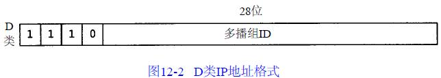

不像图1-5所示的其他三类IP地址（A、B和C），分配的28 bit均用作多播组号而不再表示其他。多播组地址包括为1110的最高4 bit和多播组号。它们通常可表示为点分十进制数，范围从224.0 .0.0到239.255.255.255。能够接收发往一个特定多播组地址数据的主机集合称为主机组(host group)。一个主机组可跨越多个网络。主机组中成员可随时加入或离开主机组。主机组中对主机的数量没有限制，同时不属于某一主机组的主机可以向该组发送信息。

## 第13章 IGMP：Internet组管理协议
### 13.1 IGMP报文
用于支持主机和路由器进行多播的Internet组管理协议（IGMP）,它让一个物理网络上的所有系统知道主机当前所在的多播组。多播路由器需要这些信息以便知道多播数据报应该向哪些接口转发。

正如ICMP一样，IGMP也被当作IP层的一部分。IGMP报文通过IP数据报进行传输。不像我们已经见到的其他协议，IGMP有固定的报文长度，没有可选数据。图13 - 1显示了IGMP报文如何封装在IP数据报中。


图13 - 2显示了长度为8字节的IGMP报文格式。

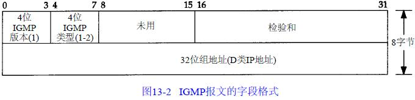

IGMP类型为1说明是由多播路由器发出的查询报文，为2说明是主机发出的报告报文。检验和的计算和ICMP协议相同。组地址为D类IP地址。在查询报文中组地址设置为0，在报告报文中组地址为要参加的组地址。

### 13.2 IGMP协议
#### 13.2.1 加入一个多播组
多播的基础就是一个进程的概念，该进程在一个主机的给定接口上加入了一个多播组。在一个给定接口上的多播组中的成员是动态的，它随时因进程加入和离开多播组而变化。这里所指的进程必须以某种方式在给定的接口上加入某个多播组。进程也能离开先前加入的多播组。这些是一个支持多播主机中任何API所必需的部分。使用限定词“接口”是因为多播组中的成员是与接口相关联的。一个进程可以在多个接口上加入同一多播组。

这里暗示一个主机通过组地址和接口来识别一个多播组。主机必须保留一个表，此表中包含所有至少含有一个进程的多播组以及多播组中的进程数量。

#### 13.2.2 IGMP报告和查询
多播路由器使用IGMP报文来记录与该路由器相连网络中组成员的变化情况。使用规则如下：

1. 当第一个进程加入一个组时，主机就发送一个IGMP报告。如果一个主机的多个进程加入同一组，只发送一个IGMP报告。这个报告被发送到进程加入组所在的同一接口上。
2. 进程离开一个组时，主机不发送IGMP报告，即便是组中的最后一个进程离开。主机知道在确定的组中已不再有组成员后，在随后收到的IGMP查询中就不再发送报告报文。
3. 多播路由器定时发送IGMP查询来了解是否还有任何主机包含有属于多播组的进程。多播路由器必须向每个接口发送一个IGMP查询。因为路由器希望主机对它加入的每个多播组均发回一个报告，因此IGMP查询报文中的组地址被设置为0。
4. 主机通过发送IGMP报告来响应一个IGMP查询，对每个至少还包含一个进程的组均要发回IGMP报告。

使用这些查询和报告报文，多播路由器对每个接口保持一个表，表中记录接口上至少还包含一个主机的多播组。当路由器收到要转发的多播数据报时，它只将该数据报转发到（使用相应的多播链路层地址）还拥有属于那个组主机的接口上。
图13-3显示了两个IGMP报文，一个是主机发送的报告，另一个是路由器发送的查询。该路由器正在要求那个接口上的每个主机说明它加入的每个多播组。

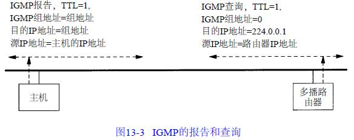

#### 13.2.3 TTL
在图13-3中，我们注意到IGMP报告和查询的TTL均设置为1，这涉及到IP首部中的TTL字段。一个初始TTL为0的多播数据报将被限制在同一主机。在默认情况下，待传多播数据报的TTL被设置为1，这将使多播数据报仅局限在同一子网内传送。更大的TTL值能被多播路由器转发。

对发往一个多播地址的数据报从不会产生ICMP差错。当TTL值为0时，多播路由器也不产生ICMP“超时”差错。

从224.0.0.0到224.0.0.255的特殊地址空间是打算用于多播范围不超过1跳的应用。不管TTL值是多少，多播路由器均不转发目的地址为这些地址中的任何一个地址的数据报。

#### 13.2.4 所有主机组
在图13 - 3中，我们看到了路由器的IGMP查询被送到目的IP地址224.0.0.1。该地址被称为所有主机组地址。它涉及在一个物理网络中的所有具备多播能力的主机和路由器。当接口初始化后，所有具备多播能力接口上的主机均自动加入这个多播组。这个组的成员无需发送IGMP报告。

## 第14章 DNS：域名系统
### 14.1 DNS基础
每个结点(图14-1中的圆圈)有一个至多63个字符长的标识。这颗树的树根是没有任何标识的特殊结点。命名标识中一律不区分大写和小写。命名树上任何一个结点的域名就是将从该结点到最高层的域名串连起来，中间使用一个点“.”分隔这些域名。以点“.”结尾的域名称为绝对域名或完全合格的域名FQDN(Full Qualified Domain Name)，例如sun.tuc.noao.edu.。如果一个域名不以点结尾，则认为该域名是不完全的。

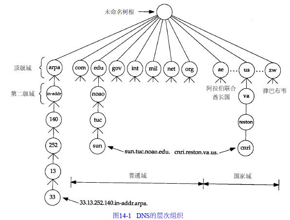

顶级域名被分为三个部分：

1. arpa是一个用作地址到名字转换的特殊域。
2. 7个3字符长的普通域。有些书也将这些域称为组织域。
3. 所有2字符长的域均是基于ISO3166中定义的国家代码，这些域被称为国家域，或地理域。

图14-2列出了7个普通域的正式划分。

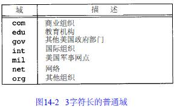

### 14.2 DNS的报文格式
DNS定义了一个用于查询和响应的报文格式。图14-3显示这个报文的总体格式。

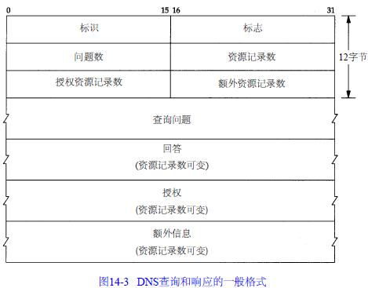

这个报文由12字节长的首部和4个长度可变的字段组成。标识字段由客户程序设置并由服务器返回结果。客户程序通过它来确定响应与查询是否匹配。16 bit的标志字段被划分为若干子字段，如图14-4所示。

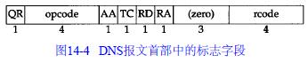

* QR是1bit字段：0表示查询报文，1表示响应报文。
* opcode是一个4bit字段：通常值为0(标准查询)，其他值为1(反向查询)和2(服务器状态请求)。
* AA是1bit标志，表示“授权回答(authoritative answer)”。该名字服务器是授权于该域的。
* TC是1bit字段，表示“可截断的(truncated)”。使用UDP时，它表示当应答的总长度超过512字节时，只返回前512个字节。
* RD是1bit字段表示“期望递归(recursion desired)”。该比特能在一个查询中设置，并在响应中返回。这个标志告诉名字服务器必须处理这个查询，也称为一个递归查询。如果该位为0，且被请求的名字服务器没有一个授权回答，它就返回一个能解答该查询的其他名字服务器列表，这称为迭代查询。
* RA是1bit字段，表示“可用递归”。如果名字服务器支持递归查询，则在响应中将该比特设置为1。
* 随后的3bit字段必须为0。
* rcode是一个4bit的返回码字段。通常的值为0(没有差错)和3(名字差错)。名字差错只有从一个授权名字服务器上返回，它表示在查询中制定的域名不存在。
* 随后的4个16bit字段说明最后4个变长字段中包含的条目数。对于查询报文，问题(question)数通常是1，而其他3项则均为0。类似地，对于应答报文，回答数至少是1，剩下的两项可以是0或非0。

#### 14.2.1 DNS查询报文中的问题部分
问题部分中每个问题的格式如图14-5所示，通常只有一个问题。

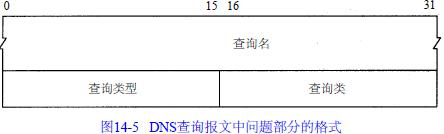

查询名是要查找的名字，它是一个或多个标识符的序列。每个标识符以首字节的计数值来说明随后标识符的字节长度，每个名字以最后字节为0结束，长度为0的标识符是根标识符。图14-6显示了如何存储域名gemini.tuc.noao.edu。


每个问题有一个查询类型，而每个响应(也称一个资源记录)也有一个类型。图14-7显示了其中的一些值。最常用的查询类型是A类型，表示期望获得查询名的IP地址。一个PTR查询则请求获得一个IP地址对应的域名。查询类通常是1，指互联网地址。

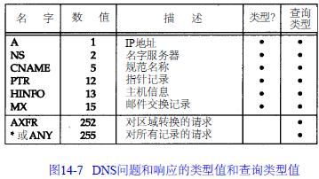

#### 14.2.2 DNS响应报文中的资源记录部分
DNS报文中最后的三个字段，回答字段、授权字段和附加信息字段，均采用一种称为资源记录RR(Resource Record)的相同格式。图14-8显示了资源记录的格式。

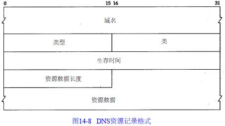

域名是记录中资源数据对应的名字。它的格式和前面介绍的查询名字段格式(图14-6)相同。类型说明RR的类型码。它的值和前面介绍的查询类型值是一样的。类通常为1，指Internet数据。生存时间字段是客户程序保留该资源记录的秒数。资源记录通常的生存时间值为2天。资源数据长度说明资源数据的数量。该数据的格式依赖于类型字段的值。对于类型1(A记录)资源数据是4字节的IP地址。

## 第15章 TFTP:简单文件传送协议
TFTP报文的头两个字节表示操作码。对于读请求(RRQ)和写请求(WRQ),文件名字段说明客户要读或写的位于服务器上的文件。模式字段是一个ASCII码串netascii或octet(可大小写任意组合)。netascii表示数据是以成行的ASCII码字符组成,以两个字节—回车字符后跟换行字符(称为CR/LF)作为行结束符。这两个行结束字符在这种格式和本地主机使用的行定界符之间进行转化。octet则将 数据看作8bit一组的字节流而不作任何解释。

每个数据分组包含一个块编号字段,它以后要在确认分组中使用。以读一个文件作为例子,TFTP客户需要发送一个读请求说明要读的文件名和文件模式(mode) 。如果这个文件能被这个客户读取,TFTP服务器就返回一个块编号为1的数据分组。TFTP客户又发送一个块编号为1的ACK。TFTP服务器随后发送块编号为2的数据。TFTP客户发回块编号为2的ACK。重复这个过程直到这个文件传送完。除了最后一个数据分组可含有不足512字节的数据,其他每个数据分组均含有512字节的数据。当TFTP客户收到一个不足512字节的数据分组,就知道它收到最后一个数据分组。在写请求的情况下,TFTP客户发送WRQ指明文件名和模式。如果该文件能被该客户写,TFTP服务器就返回块编号为0的ACK包。该客户就将文件的头512字节以块编号为1发出。服务器则返回块编号为1的ACK。这种类型的数据传输称为停止等待协议。它只用在一些简单的协议如TFTP中。


最后一种TFTP报文类型是差错报文,它的操作码为5。它用于服务器不能处理读请求或写请求的情况。

## 第16章 BOOTP:引导程序协议
### 16.1 BOOTP的分组格式
BOOTP请求和应答均被封装在UDP数据报中,如图16-1所示。

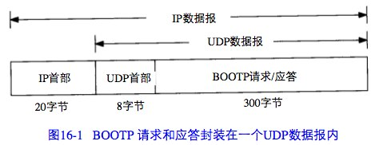

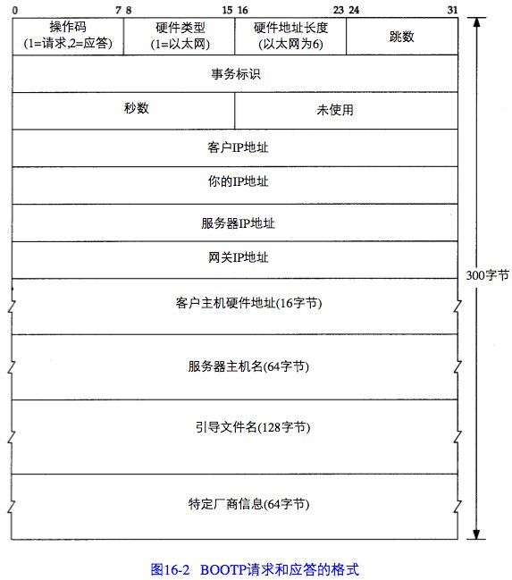

* “操作码”字段为1表示请求,为2表示应答。硬件类型字段为1表示10Mb/s的以太网,对于以太网,硬件地址长度字段为6字节。
* “跳数”字段由客户设置为0,但也能被一个代理服务器设置。
* “事务标识”字段是一个由客户设置并由服务器返回的32bit整数。客户用它对请求和应 答进行匹配。对每个请求,客户应该将该字段设置为一个随机数。
* 客户开始进行引导时,将“秒数”字段设置为一个时间值。服务器能够看到这个时间值, 备用服务器在等待时间超过这个时间值后才会响应客户的请求,这意味着主服务器没有启动。
* 如果该客户已经知道自身的IP地址,它将写入“客户IP地址”字段。否则,它将该字段设置为0对于后面这种情况,服务器用该客户的IP地址写入“你的IP地址”字段。“服务器IP地址”字段则由服务器填写。如果使用了某个代理服务器,则该代理服务器就填写“网关IP地址”字段。
* 客户必须设置它的“客户硬件地址”字段。
* “服务器主机名”字段是一个空值终止串,由服务器填写。服务器还将在“引导文件名字段”填入包括用于系统引导的文件名及其所在位置的路径全名。
* “特定厂商区域”字段用于对BOOTP进行不同的扩展。

### 16.2 端口号
BOOTP有两个熟知端口:BOOTP服务器为67,BOOTP客户为68。这意味着BOOTP客户不会选择未用的临时端口,而只用端口68。选择两个端口而不是仅选择一个端口为BOOTP服务器用的原因是:服务器的应答可以进行广播(但通常是不用广播的)。

### 16.3 BOOTP服务器的设计
这里出现了一个有趣的问题:TFTP服务器如何能将一个响应直接送回BOOTP客户?这个响应是一个UDP数据报,而服务器知道该客户的IP地址(可能通过读取服务器上的配置文件)。但如果这个客户向那个IP地 址发送一个UDP数据报(正常情况下会处理UDP的输出),BOOTP服务器的主机就可能向那个IP地址发送一个ARP请求。但这个客户不能响应这个ARP请求,因为它还不知道它自己的IP地址!(这就是在RFC 951中被称作“鸡和蛋”的问题)

有两种解决办法:第一种,通常被Unix服务器采用,是服务器发一个ioctl(2)请求给内核,为该客户在ARP高速缓存中设置一个条目(这就是命令arp -s所做的工作)。服务器能一直这么做直到它知道客户的硬件地址和IP地址。这意味着当服务器发送UDP数据报(即BOOTP应答)时,服务器的ARP将在ARP高速缓存中找到该客户的IP地址。

另一种可选的解决办法是服务器广播这个BOOTP应答而不直接将应答发回该客户。

### 16.4 BOOTP穿越路由器
收到一个BOOTP请求时,中继代理将它的IP地址填入收到BOOTP请求中的“网关IP地址字段”,然后将该请求发送到真正的BOOTP服务器。该代理中继还将跳数字段值加1。既然发出的请求是一个单播的数据报,它能按照一定的路由通过其他的路由器到达真正的BOOTP服务器。真正的BOOTP服务器收到这个请求后,产生BOOTP应答,并将它发回中继代理,而不是请求的客户。既然请求网关字段不为零,真正的BOOTP服务器知道这个请求是经过转发的。中继代理收到应答后将它发给请求的客户。

### 16.5 特定厂商信息
如果有信息要提供,这个区域的前4个字节被设置为IP地址99.130.83.99。这可称作魔术甜饼(magic cookie),表示该区域内包含信息。

我们从未看到客户广播一个ICMP地址掩码请求来获取它的子网掩码。我们可认为客户所在网络的子网掩码在返回的BOOTP应答的厂商说明区域内。Host Requirements RFC文档推荐一个系统使用BOOTP来获悉它的子网掩码,而不是采用ICMP。

## 第17章 TCP:传输控制协议
TCP通过下列方式来提供可靠性:
* 应用数据被分割成TCP认为最适合发送的数据块。这和UDP完全不同,应用程序产生的数据报长度将保持不变。由TCP传递给IP的信息单位称为报文段或段(segment)。
* 当TCP发出一个段后,它启动一个定时器,等待目的端确认收到这个报文段。如果不能及时收到一个确认,将重发这个报文段。
* 当TCP收到发自TCP连接另一端的数据,它将发送一个确认。这个确认不是立即发送,通常将推迟几分之一秒。
* TCP将保持它首部和数据的检验和。这是一个端到端的检验和,目的是检测数据在传输过程中的任何变化。如果收到段的检验和有差错,TCP将丢弃这个报文段和不确认收到此报文段(希望发端超时并重发)。
* 既然TCP报文段作为IP数据报来传输,而IP数据报的到达可能会失序,因此TCP报文段的到达也可能会失序。如果必要,TCP将对收到的数据进行重新排序,将收到的数据以正确的顺序交给应用层。
* 既然IP数据报会发生重复,TCP的接收端必须丢弃重复的数据。
* TCP还能提供流量控制。TCP连接的每一方都有固定大小的缓冲空间。TCP的接收端只允许另一端发送接收端缓冲区所能接纳的数据。这将防止较快主机致使较慢主机的缓冲区溢出。

TCP数据被封装在一个IP数据报中,如图17-1所示。

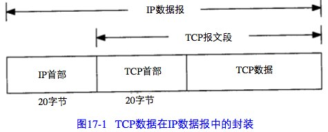

图17-2显示TCP首部的数据格式。如果不计任选字段,它通常是20个字节。


每个TCP段都包含源端和目的端的端口号,用于寻找发端和收端应用进程。

序号用来标识从TCP发端向TCP收端发送的数据字节流,TCP用序号对每个字节进行计数。

当建立一个新的连接时, SYN标志变1。序号字段包含由这个主机选择的该连接的初始序号ISN(Initial Sequence Number)。该主机要发送数据的第一个字节序号为这个ISN加1 ,因为SYN标志消耗了一个序号。

既然每个传输的字节都被计数,确认序号包含发送确认的一端所期望收到的下一个序号。因此,确认序号应当是上次已成功收到数据字节序号加1。只有ACK标志为1时确认序号字段才有效。

TCP为应用层提供全双工服务。这意味数据能在两个方向上独立地进行传输。因此,连接的每一端必须保持每个方向上的传输数据序号。

TCP可以表述为一个没有选择确认或否认的滑动窗口协议。我们说TCP缺少选择确认是因为TCP首部中的确认序号表示发方已成功收到字节,但还不包含确认序号所指的字节。当前还无法对数据流中选定的部分进行确认。例如,如果1~1024字节已经成功收到,下一报文段中包含序号从2049~3072的字节,收端并不能确认这个新的报文段。它所能做的就是发回一个确认序号为1025的ACK。它也无法对一个报文段进行否认。例如,如果收到包含1025~2048字节的报文段,但它的检验和错,TCP接收端所能做的就是发回一个确认序号为1025的ACK。

在TCP首部中有6个标志比特。

- URG 紧急指针(urgent pointer)有效。
- ACK 确认序号有效。
- PSH 接收方应该尽快将这个报文段交给应用层。
- RST 重建连接。
- SYN 同步序号用来发起一个连接。
- FIN 发端完成发送任务。

TCP的流量控制由连接的每一端通过声明的窗口大小来提供。窗口大小为字节数, 起始于确认序号字段指明的值,这个值是接收端正期望接收的字节。窗口大小是一个16 bit字段, 因而窗口大小最大为65535字节。

检验和覆盖了整个的TCP报文段:TCP首部和TCP数据。这是一个强制性的字段,一定是由发端计算和存储,并由收端进行验证。

## 第18章 TCP连接的建立与终止
### 18.1 建立连接协议与连接终止协议
为了建立一条TCP连接:
1. 请求端(通常称为客户)发送一个SYN段指明客户打算连接的服务器的端口,以及初始序号(ISN,在这个例子中为1415531521)。这个SYN段为报文段1。
2. 服务器发回包含服务器的初始序号的SYN报文段(报文段2)作为应答。同时,将确认序号设置为客户的ISN加1以对客户的SYN报文段进行确认。一个SYN将占用一个序号。
3. 客户必须将确认序号设置为服务器的ISN加1以对服务器的SYN报文段进行确认(报文段3)。

这三个报文段完成连接的建立。这个过程也称为三次握手( three-way handshake)。

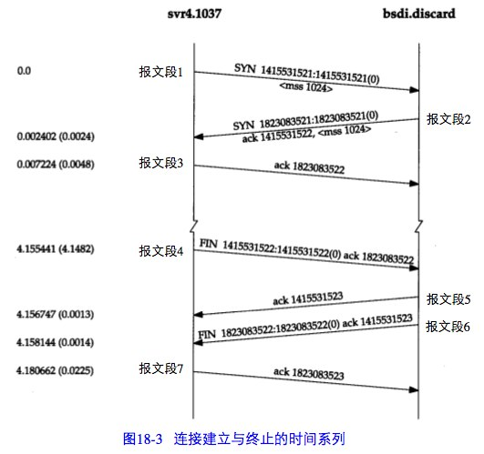

终止一个连接要经过4次握手：

当服务器收到这个FIN,它发回一个ACK,确认序号为收到的序号加1(报文段5)。和SYN一样,一个FIN将占用一个序号。同时TCP服务器还向应用程序传送一个文件结束符。接着这个服务器程序就关闭它的连接,导致它的TCP端发送一个FIN(报文段6), 客户必须发回一个确认,并将确认序号设置为收到序号加1(报文段7)。

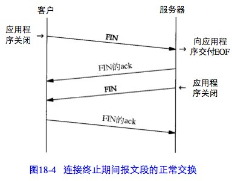

图18-4显示了终止一个连接的典型握手顺序。在这个图中,发送FIN将导致应用程序关闭它们的连接,这些FIN的ACK是由TCP软件自动产生的 。

### 18.2 最大报文段长度
最大报文段长度(MSS)表示TCP传往另一端的最大块数据的长度。当一个连接建立时,连接的双方都要通告各自的MSS。MSS选项只能出现在SYN报文段中。如果一方不接收来自另一方的MSS值,则MSS就定为默认值536字节(这个默认值允许20字节的IP首部和20字节的TCP首部以适合576字节IP数据报)。

当TCP发送一个SYN时,或者是因为一个本地应用进程想发起一个连接,或者是因为另一端的主机收到了一个连接请求,它能将MSS值设置为外出接口上的MTU长度减去固定的IP首部和TCP首部长度。

MSS让主机限制另一端发送数据报的长度。加上主机也能控制它发送数据报的长度,这将使以较小MTU连接到一个网络上的主机避免分段。

考虑我们的主机slip,通过MTU为296的SLIP链路连接到路由器bsdi上。图18-8显示这些系统和主机sun。

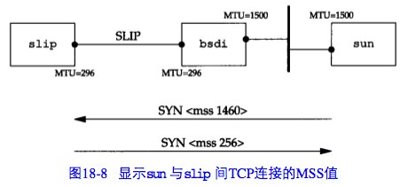

从sun向slip发起一个TCP连接,并使用tcpdump来观察报文段。图18-9显示这个连接的建立。

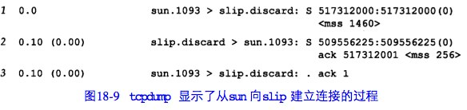

在这个例子中,sun发送的报文段不能超过256字节的数据,因为它收到的MSS选项值为256(第2行)。此外,由于slip知道它外出接口的MTU长度为296,即使sun已经通告它的MSS为1460,但为避免将数据分段,它不会发送超过256字节数据的报文段。

### 18.3 TCP的半关闭
TCP提供了连接的一端在结束它的发送后还能接收来自另一端数据的能力。这就是所谓的半关闭。

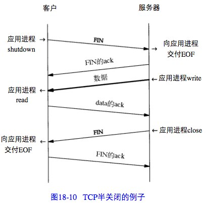

图18-10显示了一个半关闭的典型例子。让左方的客户端开始半关闭,开始的两个报文段和图18-4是相同的:初始端发出的FIN,接着是另一端对这个FIN的ACK报文段。但后面就和图18-4不同,因为接收半关闭的一方仍能发送数据。我们只显示一个数据报文段和一个ACK报文段,但可能发送了许多数据报文段。当收到半关闭的一端在完成它的数据传送后,将发送一个FIN关闭这个方向的连接,这将传送一个文件结束符给发起这个半关闭的应用进程。当对第二个FIN进行确认后,这个连接便彻底关闭了。

### 18.4 TCP的状态变迁图
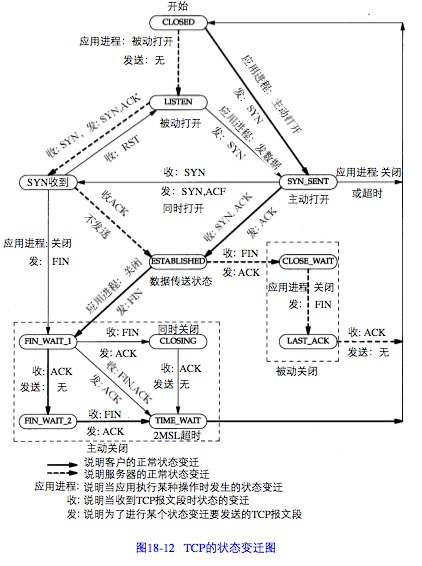

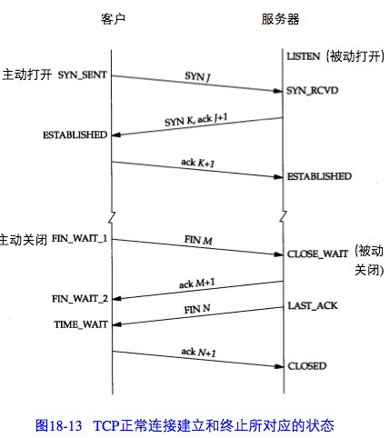

#### 18.4.1 2MSL等待状态
TIME_WAIT状态也称为2MSL等待状态。每个具体TCP实现必须选择一个报文段最大生存时间MSL(MaximumSegmentLifetime)。它是任何报文段被丢弃前在网络内的最长时间。

对一个具体实现所给定的MSL值,处理的原则是:当TCP执行一个主动关闭,并发回最后一个ACK,该连接必须在TIME_WAIT状态停留的时间为2倍的MSL。这样可让TCP再次发送最后的ACK以防这个ACK丢失(另一端超时并重发最后的FIN)。

#### 18.4.2 平静时间的概念
对于来自某个连接的较早替身的迟到报文段,2MSL等待可防止将它解释成使用相同插口对的新连接的一部分。但这只有在处于2MSL等待连接中的主机处于正常工作状态时才有效。

如果使用处于2MSL等待端口的主机出现故障,它会在MSL秒内重新启动,并立即使用故障前仍处于2MSL的插口对来建立一个新的连接吗?如果是这样,在故障前从这个连接发出而迟到的报文段会被错误地当作属于重启后新连接的报文段。

为了防止这种情况,RFC793指出TCP在重启动后的MSL秒内不能建立任何连接。这就称为平静时间(quiettime)。

#### 18.4.3 FIN_WAIT_2状态
在FIN_WAIT_2状态我们已经发出了FIN,并且另一端也已对它进行确认。除非我们在实行半关闭,否则将等待另一端的应用层意识到它已收到一个文件结束符说明,并向我们发一个FIN来关闭另一方向的连接。只有当另一端的进程完成这个关闭,我们这端才会从FIN_WAIT_2状态进入TIME_WAIT状态。

这意味着我们这端可能永远保持这个状态。另一端也将处于CLOSE_WAIT状态,并一直保持这个状态直到应用层决定进行关闭。

许多伯克利实现采用如下方式来防止这种在FIN_WAIT_2状态的无限等待。设置一个定时器。如果这个连接空闲10分钟75秒,TCP将进入CLOSED状态。

### 18.5 复位报文段
TCP首部中的RST比特是用于“复位”的。一般说来,无论何时一个报文段发往基准的连接(referencedconnection)出现错误,TCP都会发出一个复位报文段(这里提到的“基准的连接”是指由目的IP地址和目的端口号以及源IP地址和源端口号指明的连接。

#### 18.5.1 到不存在的端口的连接请求
产生复位的一种常见情况是当连接请求到达时,目的端口没有进程正在听。

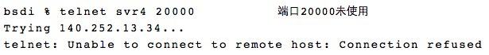

#### 18.5.2 异常终止一个连接
终止一个连接的正常方式是一方发送FIN。有时这也称为有序释放(orderlyrelease),因为在所有排队数据都已发送之后才发送FIN,正常情况下没有任何数据丢失。但也有可能发送一个复位报文段而不是FIN来中途释放一个连接。有时称这为异常释放(abortiverelease)。

异常终止一个连接对应用程序来说有两个优点:(1)丢弃任何待发数据并立即发送复位报文段;(2)RST的接收方会区分另一端执行的是异常关闭还是正常关闭。应用程序使用的API必须提供产生异常关闭而不是正常关闭的手段。

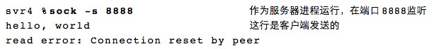

#### 18.5.3 检测半打开连接
如果一方已经关闭或异常终止连接而另一方却还不知道,我们将这样的TCP连接称为半打开(Half-Open)的。任何一端的主机异常都可能导致发生这种情况。只要不打算在半打开连接上传输数据,仍处于连接状态的一方就不会检测另一方已经出现异常。

半打开连接的另一个常见原因是当客户主机突然掉电而不是正常的结束客户应用程序后再关机。这可能发生在使用PC机作为Telnet的客户主机上,例如,用户在一天工作结束时关闭PC机的电源。当关闭PC机电源时,如果已不再有要向服务器发送的数据,服务器将永远不知道客户程序已经消失了。当用户在第二天到来时,打开PC机,并启动新的Telnet客户程序,在服务器主机上会启动一个新的服务器程序。这样会导致服务器主机中产生许多半打开的TCP连接。

能很容易地建立半打开连接。在bsdi上运行Telnet客户程序,通过它和svr4上的丢弃服务器建立连接。我们键入一行字符,然后通过tcpdump进行观察,接着断开服务器主机与以太网的电缆,并重启服务器主机。这可以模拟服务器主机出现异常(在重启服务器之前断开以太网电缆是为了防止它向打开的连接发送FIN,某些TCP在关机时会这么做)。服务器主机重启后,我们重新接上电缆,并从客户向服务器发送另一行字符。由于服务器的TCP已经重新启动,它将丢失复位前连接的所有信息,因此它不知道数据报文段中提到的连接。TCP的处理原则是接收方以复位作为应答。

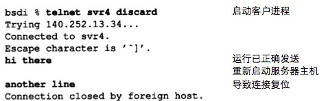

### 18.6 同时打开
两个应用程序同时彼此执行主动打开的情况是可能的,尽管发生的可能性极小。每一方必须发送一个SYN,且这些SYN必须传递给对方。这需要每一方使用一个对方熟知的端口作为本地端口。这又称为同时打开(simultaneousopen)。

当出现同时打开的情况时,状态变迁与图18-13所示的不同。两端几乎在同时发送SYN,并进入SYN_SENT状态。当每一端收到SYN时,状态变为SYN_RCVD(如图18-12),同时它们都再发SYN并对收到的SYN进行确认。当双方都收到SYN及相应的ACK时,状态都变迁为ESTABLISHED。图18-17显示了这些状态变迁过程。

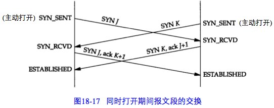

一个同时打开的连接需要交换4个报文段,比正常的三次握手多一个。

### 18.7 同时关闭
双方都执行主动关闭也是可能的,TCP协议也允许这样的同时关闭(simultaneousclose)。在图18-12中,当应用层发出关闭命令时,两端均从ESTABLISHED变为FIN_WAIT_1。这将导致双方各发送一个FIN,两个FIN经过网络传送后分别到达另一端。收到FIN后,状态由FIN_WAIT_1变迁到CLOSING,并发送最后的ACK。当收到最后的ACK时,状态变化为TIME_WAIT。图18-19总结了这些状态的变化。

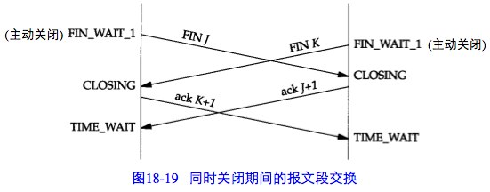

同时关闭与正常关闭使用的段交换数目相同。

### 18.8  backlog
1. 正等待连接请求的一端有一个固定长度的连接队列,该队列中的连接已被TCP接受(即三次握手已经完成),但还没有被应用层所接受。注意区分TCP接受一个连接是将其放入这个队列,而应用层接受连接是将其从该队列中移出。
2. 应用层将指明该队列的最大长度,这个值通常称为积压值(backlog)。
3. 当一个连接请求(即SYN)到达时,TCP使用一个算法,根据当前连接队列中的连接数来确定是否接收这个连接。积压值说明的是TCP监听的端点已被TCP接受而等待应用层接受的最大连接数。
4. 如果对于新的连接请求,该TCP监听的端点的连接队列中还有空间,TCP模块将对SYN进行确认并完成连接的建立。但应用层只有在三次握手中的第三个报文段收到后才会知道这个新连接时。另外,当客户进程的主动打开成功但服务器的应用层还不知道这个新的连接时,它可能会认为服务器进程已经准备好接收数据了(如果发生这种情况,服务器的TCP仅将接收的数据放入缓冲队列)。
5. 如果对于新的连接请求,连接队列中已没有空间,TCP将不理会收到的SYN。也不发回任何报文段(即不发回RST)。如果应用层不能及时接受已被TCP接受的连接,这些连接可能占满整个连接队列,客户的主动打开最终将超时。

## 第19章 TCP的交互数据流
### 19.1 交互式输入
如果按照分组数量计算,约有一半的TCP报文段包含成块数据(如FTP、电子邮件和Usenet新闻),另一半则包含交互数据(如Telnet和Rlogin)。

产生4个报文段:(1)来自客户的交互按键;(2)来自服务器的按键确认;(3)来自服务器的按键回显;(4)来自客户的按键回显确认。图19-1表示了这个数据流。

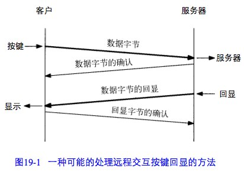

### 19.2 经受时延的确认
通常TCP在接收到数据时并不立即发送ACK;相反,它推迟发送,以便将ACK与需要沿该方向发送的数据一起发送(有时称这种现象为数据捎带ACK)。绝大多数实现采用的时延为200ms,也就是说,TCP将以最大200ms的时延等待是否有数据一起发送。

### 19.3 Nagle算法
该算法要求一个TCP连接上最多只能有一个未被确认的未完成的小分组,在该分组的确认到达之前不能发送其他的小分组。相反,TCP收集这些少量的分组,并在确认到来时以一个分组的方式发出去。该算法的优越之处在于它是自适应的:确认到达得越快,数据也就发送得越快。而在希望减少微小分组数目的低速广域网上,则会发送更少的分组。

有时我们也需要关闭Nagle算法。插口API用户可以使用TCP_NODELAY选项来关闭Nagle算法。

例子—在一个交互注册过程中键入终端的一个特殊功能键。这个功能键通常可以产生多个字符序列,经常从ASCII码的转义(escape)字符开始。如果TCP每次得到一个字符,它很可能会发送序列中的第一个字符(ASCII码的ESC),然后缓存其他字符并等待对该字符的确认。但当服务器接收到该字符后,它并不发送确认,而是继续等待接收序列中的其他字符。这就会经常触发服务器的经受时延的确认算法,表示剩下的字符没有在200ms内发送。对交互用户而言,这将产生明显的时延。

一个对比例子

打开Nagle算法：

可以在Nagle算法和产生多个字符的按键之间看到这种交互的情况。在主机slip和主机vangogh.cs.berkeley.edu之间建立一个Rlogin连接,然后按下F1功能键,这将产生3个字节:一个escape、一个左括号和一个M。然后再按下F2功能键,这将产生另外3个字节。图19-5表示的是tcpdump的输出结果(我们去掉了其中的服务类型和窗口通告)。

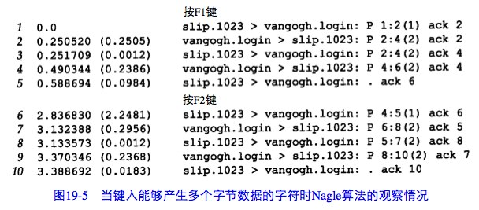

图19-6表示了这个交互过程的时间系列。在该图的下面部分我们给出了从客户发送到服务器的6个字节和它们的序号以及将要返回的8个字节的回显。

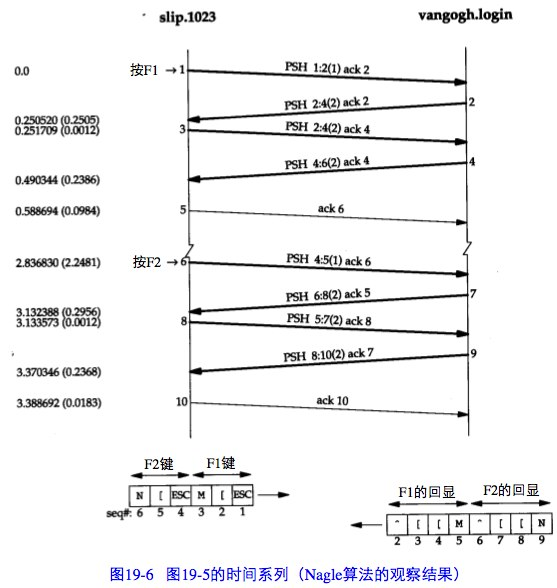

关闭Nagle算法：

现在我们使用一个修改后关闭了Nagle算法的rlogin版本重复同样的实验。图19-7显示了tcpdump的输出结果(同样去掉了其中的服务类型和窗口通告)。

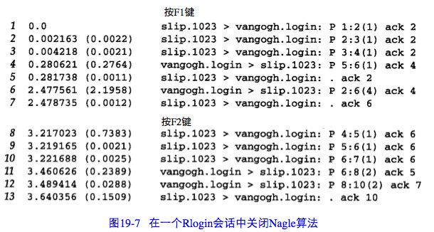

我们注意到的第1个变化是当3个字节准备好时它们全部被发送(报文段1、2和3)。没有时延发生—Nagle算法被禁止。

在tcpdump输出中的下一个分组(报文段4)中带有来自服务器的第5个字节及一个确认序号为4的ACK。这是不正确的,因为客户并不希望接收到第5个字节,因此它立即发送一个确认序号为2而不是6的响应(没有被延迟)。看起来一个报文段丢失了,在图19-8中我们用虚线表示。

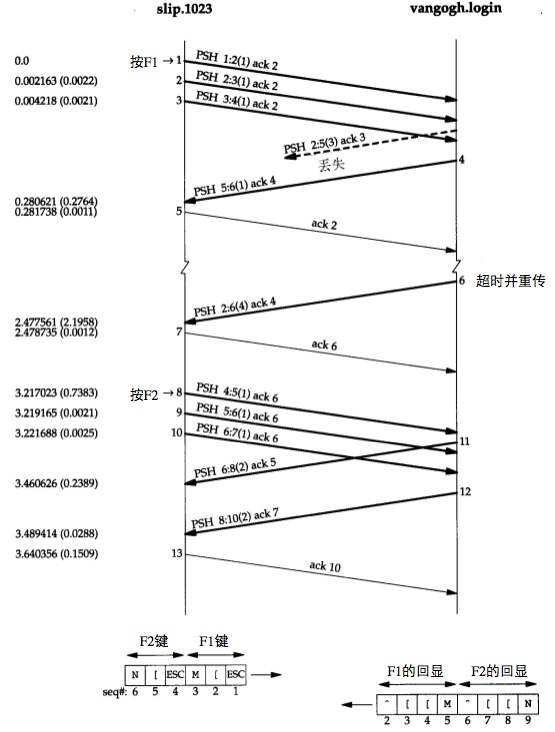

可以观察到键入的下一个特殊功能键所产生的3个字节分别作为单独的报文段(报文段8、9和10)被发送。这一次服务器首先回显了报文段8中的字节(报文段11),然后回显了报文段9和10中的字节(报文段12)。

## 第20章 TCP的成块数据流
### 20.1 正常数据流
客户向网络发送8个1024字节的数据。图20-1显示了这个过程的时间系列。我们在输出的前3个报文段中显示了每一端MSS的值。

发送方首先传送3个数据报文段(4~6)。下一个报文段(7)仅确认了前两个数据报文段,这可以从其确认序号为2049而不是3073看出来。

报文段7的ACK的序号之所以是2049而不是3073是由以下原因造成的:当一个分组到达时,它首先被设备中断例程进行处理,然后放置到IP的输入队列中。三个报文段4、5和6依次到达并按接收顺序放到IP的输入队列。IP将按同样顺序将它们交给TCP。当TCP处理报文段4时,该连接被标记为产生一个经受时延的确认。TCP处理下一报文段(5),由于TCP现在有两个未完成的报文段需要确认,因此产生一个序号为2049的ACK(报文段7),并清除该连接产生经受时延的确认标志。TCP处理下一个报文段(6),而连接又被标志为产生一个经受时延的确认。在报文段9到来之前,由于时延定时器溢出,因此产生一个序号为3073的ACK(报文段8)。报文段8中的窗口大小为3072,表明在TCP的接收缓存中还有1024个字节的数据等待被应用程序读取。

报文段11~16说明了通常使用的“隔一个报文段确认”的策略。报文段11、12和13到达并被放入IP的接收队列。当报文段11被处理时,连接被标记为产生一个经受时延的确认。当报文段12被处理时,它们的ACK(报文段14)被产生且连接的经受时延的确认标志被清除。报文段13使得连接再次被标记为产生经受时延。但在时延定时器溢出之前,报文段15处理完毕,因此该确认立刻被发送。

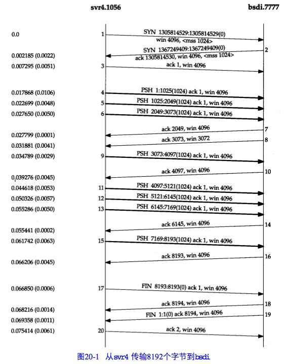

意到报文段7、14和16中的ACK确认了两个收到的报文段是很重要的。使用TCP的滑动窗口协议时,接收方不必确认每一个收到的分组。在TCP中,ACK是累积的-它们表示接收方已经正确收到了一直到确认序号减1的所有字节。

另外一种可能的收发状况

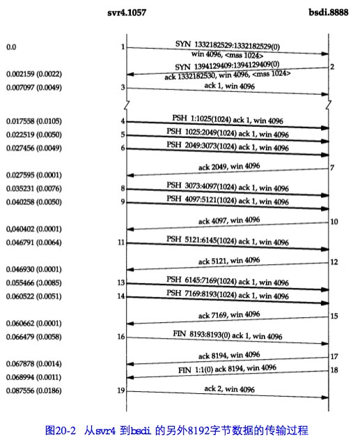

快的发送方和慢的接收方

发送方发送4个背靠背(back-to-back)的数据报文段去填充接收方的窗口,然后停下来等待一个ACK。接收方发送ACK(报文段8),但通告其窗口大小为0,这说明接收方已收到所有数据,但这些数据都在接收方的TCP缓冲区,因为应用程序还没有机会读取这些数据。另一个ACK(称为窗口更新)在17.4ms后发送,表明接收方现在可以接收另外的4096个字节的数据。虽然这看起来像一个ACK,但由于它并不确认任何新数据,只是用来增加窗口的右边沿,因此被称为窗口更新。

发送方发送最后4个报文段(10~13),再次填充了接收方的窗口。注意到报文段13中包括两个比特标志:PUSH和FIN。随后从接收方传来另外两个ACK,它们确认了最后的4096字节的数据(从4097到8192字节)和FIN(标号为8192)。


### 20.2 滑动窗口
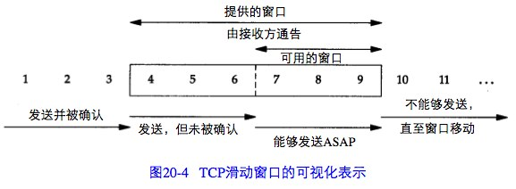

在这个图中,我们将字节从1至11进行标号。接收方通告的窗口称为提出的窗口(offeredwindow),它覆盖了从第4字节到第9字节的区域,表明接收方已经确认了包括第3字节在内的数据,且通告窗口大小为6。

我们使用三个术语来描述窗口左右边沿的运动:

1. 称窗口左边沿向右边沿靠近为窗口合拢。这种现象发生在数据被发送和确认时。
2. 当窗口右边沿向右移动时将允许发送更多的数据,我们称之为窗口张开。这种现象发生在另一端的接收进程读取已经确认的数据并释放了TCP的接收缓存时。
3. 当右边沿向左移动时,我们称之为窗口收缩。HostRequirementsRFC强烈建议不要使用这种方式。

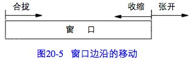

### 20.3 PUSH标志
发送方使用该标志通知接收方将所收到的数据全部提交给接收进程。

通过允许客户应用程序通知其TCP设置PUSH标志,客户进程通知TCP在向服务器发送一个报文段时不要因等待额外数据而使已提交数据在缓存中滞留。类似地,当服务器的TCP接收到一个设置了PUSH标志的报文段时,它需要立即将这些数据递交给服务器进程而不能等待判断是否还会有额外的数据到达。

然而,目前大多数的API没有向应用程序提供通知其TCP设置PUSH标志的方法。一个好的TCP实现能够自行决定何时设置这个标志。如果待发送数据将清空发送缓存,则大多数的源于伯克利的实现能够自动设置PUSH标志。

### 20.4 慢启动
TCP需要支持一种被称为“慢启动(slow start)”的算法。该算法通过观察到新分组进入网络的速率应该与另一端返回确认的速率相同而进行工作。

慢启动为发送方的TCP增加了另一个窗口:拥塞窗口(congestion window),记为cwnd。当与另一个网络的主机建立TCP连接时,拥塞窗口被初始化为1个报文段(即另一端通告的报文段大小)。每收到一个ACK,拥塞窗口就增加一个报文段(cwnd以字节为单位,但是慢启动以报文段大小为单位进行增加)。发送方取拥塞窗口与通告窗口中的最小值作为发送上限。拥塞窗口是发送方使用的流量控制,而通告窗口则是接收方使用的流量控制。

发送方开始时发送一个报文段,然后等待ACK。当收到该ACK时,拥塞窗口从1增加为2,即可以发送两个报文段。当收到这两个报文段的ACK时,拥塞窗口就增加为4。这是一种指数增加的关系。

### 20.5 成块数据的吞吐量
图20-9显示了左边的发送方和右边的接收方之间的一个TCP连接上的时间系列,共显示了16个时间单元。为简单起见,本图只显示离散的时间单元。每个粗箭头线的上半部分显示的是从左到右的携带数据的报文段,标记为1,2,3,等等。在粗线箭头下面表示的是反向传输的ACK。我们把ACK用细箭头线表示,并标注了被确认的报文段号。

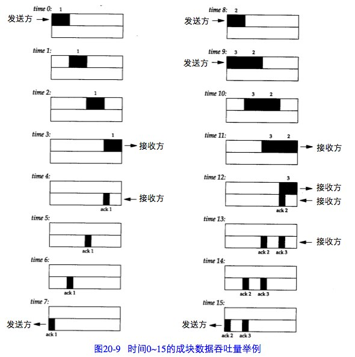

在时间0,发送方发送了一个报文段。由于发送方处于慢启动中(其拥塞窗口为1个报文段),因此在继续发送以前它必须等待该数据段的确认。在时间1,2和3,报文段从左向右移动一个时间单元。在时间4接收方读取这个报文段并产生确认。经过时间5、6和7,ACK移动到左边的发送方。我们有了一个8个时间单元的往返时间RTT(Round-Trip Time)。

当发送方收到ACK后,在时间8和9发送两个报文段(我们标记为2和3)。此时它的拥塞窗口为2个报文段。这两个报文段向右传送到接收方,在时间12和13接收方产生两个ACK。这两个返回到发送方的ACK之间的间隔与报文段之间的间隔一致,被称为TCP的自计时(self-clocking)行为。

图20-10表示的是后面16个时间单位。2个ACK的到达使得拥塞窗口从2个报文段增加为4个,而这4个报文段在时间16~19时被发送。第1个ACK在时间23到达。4个ACK的到达使得拥塞窗口从4个报文段增加为8个,并在时间24~31发送8个报文段。

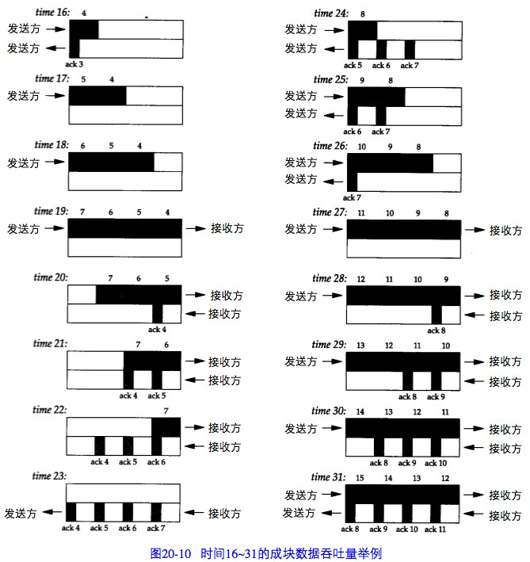

在时间31及其后续时间,发送方和接收方之间的管道(pipe)被填满。此时不论拥塞窗口和通告窗口是多少,它都不能再容纳更多的数据。每当接收方在某一个时间单位从网络上移去一个报文段,发送方就再发送一个报文段到网络上。但是不管有多少报文段填充了这个管道,返回路径上总是具有相同数目的ACK。这就是连接的理想稳定状态。

带宽时延乘积

在我们的例子中,作为最大的吞吐量,发送方在任何时候有8个已发送的报文段未被确认。接收方的通告窗口必须不小于这个数目,因为通告窗口限制了发送方能够发送的段的数目。可以计算通道的容量为:

    capacity(bit)=bandwidth(b/s) × round-trip time(s)

一般称之为带宽时延乘积。这个值依赖于网络速度和两端的RTT,可以有很大的变动。

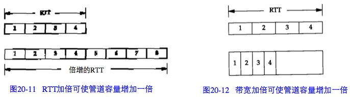

### 20.6 紧急方式
TCP提供了“紧急方式(urgentmode)”,它使一端可以告诉另一端有些具有某种方式的“紧急数据”已经放置在普通的数据流中。另一端被通知这个紧急数据已被放置在普通数据流
中,由接收方决定如何处理。

可以通过设置TCP首部中的两个字段来发出这种从一端到另一端的紧急数据已经被放置在数据流中的通知。URG比特被置1,并且一个16bit的紧急指针被置为一个正的偏移量,该偏移量必须与TCP首部中的序号字段相加,以便得出紧急数据的最后一个字节的序号。

TCP本身对紧急数据知之甚少。没有办法指明紧急数据从数据流的何处开始。TCP通过连接传送的唯一信息就是紧急方式已经开始(TCP首部中的URG比特)和指向紧急数据最后一个字节的指针。其他的事情留给应用程序去处理。

如果在接收方处理第一个紧急指针之前,发送方多次进入紧急方式会发生什么情况呢? 在数据流中的紧急指针会向前移动,而其在接收方的前一个位置将丢失。接收方只有一个紧 急指针,每当对方有新的值到达时它将被覆盖。这意味着如果发送方进入紧急方式时所写的 内容对接收方非常重要,那么这些字节数据必须被发送方用某种方式特别标记。

一个例子

我们设置发送缓存为8192个字节,以便让发送应用程序能够立即写所有的数据。图20-14显示了tcpdump输出的这个交换过程的结果(删去了连接建立的过程)。

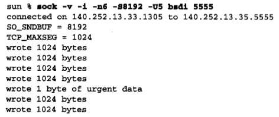

第1~5行表示发送方用4个1024字节的报文段去填充接收方的窗口。然后由于接收方的窗口被填满(第4行的ACK确认了数据,但并没有移动窗口的右边沿),所以发送方停止发送。

在写了第4个正常数据之后,应用进程写了1个字节并进入紧急方式。第6行是该应用进程写的结果,紧急指针被设置为4098。尽管发送方不能发送任何数据,但紧急指针和URG标志一起被发送。

5个这样的ACK在13ms内被发送(第6~10行)。第1个ACK在应用进程写1个字节并进入紧急方式时被发送,后面两个在应用进程写最后两个1024字节的数据时被发送(尽管TCP不能发送这2048个字节的数据,可每次当应用程序执行写操作的时候,TCP的输出功能被调用。当TCP看到正处于紧急方式时,它会发送其他的紧急通知)。第4个ACK在应用进程关闭其TCP连接时被发送(TCP的输出功能再次被调用)。发送应用程序在启动几毫秒后终止—在接收方应用进程已经发出其第一个写操作之前。TCP将所有的数据进行排队,并在可能时发送出去(这就是为何指明发送缓存为8192字节的原因,因此只有这样才能够把所有的数据都放置在缓存中)。第5个ACK很可能是在接收第4行的ACK时产生的。发送TCP很可能在这个ACK到达前便已将其第4个报文段放入队列以便输出(第5行)。另一端接收到这个ACK也会引起TCP输出例程被调用。

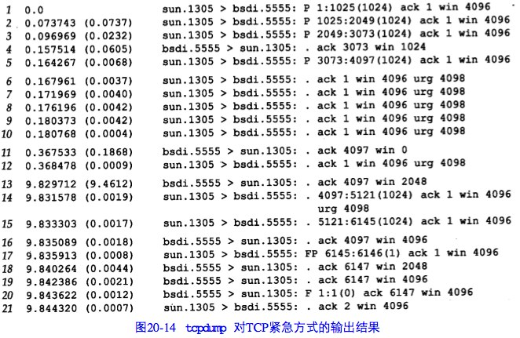

接着,接收方确认最后的1024字节的数据(第11行),但同时通告窗口为0。发送方用一个包含紧急通知的报文段进行了响应。

在第13行,当应用进程被唤醒、并从接收缓存读取一些数据时,接收方通告窗口为2048字节。于是后面又发送了两个1024字节的报文段(第14和15行)。其中,由于紧急指针在第1个报文段的范围内,因此这个报文段被设置了紧急通知标志,而第2个报文段则关闭了该标志。

当接收方再次打开窗口(第16行)时,发送方传输最后的数据(序号为6145)并发起正常的连接关闭。

图20-15显示了发送的6145个字节数据的序号。

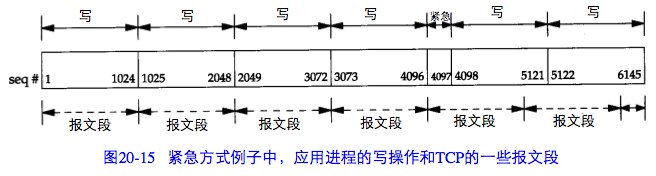

## 第21章 TCP的超时与重传
### 21.1 超时与重传的简单例子
建立一个连接,发送一些分组来证明一切正常,然后拔掉电缆,发送更多的数据,再观察TCP的行为。

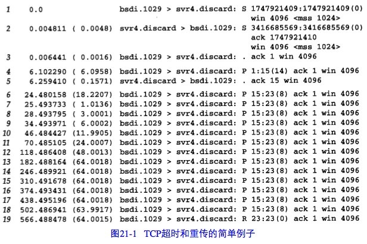

第1、2和3行表示正常的TCP连接建立的过程,第4行是“hello,world”(12个字符加上回车和换行)的传输过程,第5行是其确认。接着我们从svr4拔掉了以太网电缆,第6行表示“andhi”将被发送。第7~18行是这个报文段的12次重传过程,而第19行则是发送方的TCP最终放弃并发送一个复位信号的过程。

现在检查连续重传之间不同的时间差,它们取整后分别为1、3、6、12、24、48和多个64秒。这个倍乘关系被称为“指数退避(exponential backoff)”。

首次分组传输(第6行,24.480秒)与复位信号传输(第19行,566.488秒)之间的时间差约为9分钟,该时间在目前的TCP实现中是不可变的。对于大多数实现而言,这个总时间是不可调整的。Solaris2.2允许管理者改变这个时间(tcp_ip_abort_interval变量),且其默认值为2分钟,而不是最常用的9分钟。

### 21.2 RTT测量
最初的TCP规范使TCP使用低通过滤器来更新一个被平滑的RTT估计器(记为O)。

$R \gets \alpha R + (1-\alpha)M$

这里的是一个推荐值为0.9的平滑因子。每次进行新测量的时候,这个被平滑的RTT将得到更新。每个新估计的90%来自前一个估计,而10%则取自新的测量。

该算法在给定这个随RTT的变化而变化的平滑因子的条件下,RFC793推荐的重传超时时间RTO(Retransmission TimeOut)的值应该设置为

$RTO=R\beta$

这里的beta是一个推荐值为2的时延离散因子。

除了被平滑的RTT估计器,所需要做的还有跟踪RTT的方差。在往返时间变化起伏很大时,基于均值和方差来计算RTO,将比作为均值的常数倍数来计算RTO能提供更好的响应。

```
Err = M - A
A <- A + gErr
D <- D + h(|Err| - D)
RTO = A + 4D
```

这里的A是被平滑的RTT(均值的估计器)而D则是被平滑的均值偏差。Err是刚得到的测量结果与当前的RTT估计器之差。A和D均被用于计算下一个重传时间(RTO)。增量g起平均作用,取为1/8(0.125)。偏差的增益是h,取值为0.25。当RTT变化时,较大的偏差增益将使RTO快速上升。

#### Karn算法
在一个分组重传时会产生这样一个问题:假定一个分组被发送。当超时发生时,RTO进行退避,分组以更长的RTO进行重传,然后收到一个确认。那么这个ACK是针对第一个分组的还是针对第二个分组呢?这就是所谓的重传多义性问题。

[Karn and Partridge 1987]规定,当一个超时和重传发生时,在重传数据的确认最后到达之前,不能更新RTT估计器,因为我们并不知道ACK对应哪次传输(也许第一次传输被延迟而并没有被丢弃,也有可能第一次传输的ACK被延迟)。

并且,由于数据被重传, RTO已经得到了一个指数退避,我们在下一次传输时使用这个退避后的 RTO 。对一个没有被重传的报文段而言,除非收到了一个确认,否则不要计算新的RTO。

### 21.3 拥塞举例
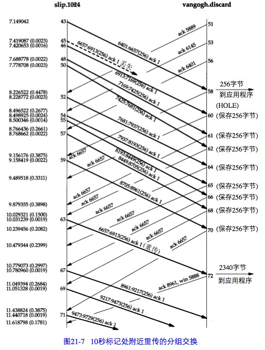

看来报文段45丢失或损坏了,这一点无法从该输出上进行辨认。能够在主机slip上看到的是对第6657字节(报文段58)以前数据的确认(不包括字节6657在内)。紧接着的是带有相同序号的8个ACK。正是接收到报文段62,也就是第3个重复ACK,才引起自序号6657开始的数据报文段(报文段63)进行重传。的确,源于伯克利的TCP实现对收到的重复ACK进行计数,当收到第3个时,就假定一个报文段已经丢失并重传自那个序号起的一个报文段。这就是Jacobson的快速重传算法,该算法通常与他的快速恢复算法一起配合使用。

注意到在重传后(报文段63),发送方继续正常的数据传输(报文段67、69和71)。TCP不需要等待对方确认重传。

现在检查一下在接收端发生了什么。当按序收到正常数据(报文段43)后,接收TCP将255个字节的数据交给用户进程。但下一个收到的报文段(报文段46)是失序的:数据的开始序号(6913)并不是下一个期望的序号(6657)。TCP保存256字节的数据,并返回一个已成功接收数据的最大序号加1(6657)的ACK。被vangogh接收到的后面7个报文段(48,50,52,54,55,57和59)也是失序的,接收方TCP保存这些数据并产生重复ACK。

目前TCP尚无办法告诉对方缺少一个报文段,也无法确认失序数据。此时主机vangogh所能够做的就是继续发送确认序号为6657的ACK。

当缺少的报文段(报文段63)到达时,接收方TCP在其缓存中保存第6657~8960字节的数据,并将这2304字节的数据交给用户进程。所有这些数据在报文段72中进行确认。请注意此时该ACK通告窗口大小为5888(8192-2304),这是因为用户进程没有机会读取这些已准备好的2304字节的数据。

### 21.4 拥塞避免算法
拥塞避免算法和慢启动算法是两个目的不同、独立的算法。但是当拥塞发生时,我们希望降低分组进入网络的传输速率,于是可以调用慢启动来作到这一点。在实际中这两个算法通常在一起实现。

拥塞避免算法和慢启动算法需要对每个连接维持两个变量:一个拥塞窗口cwnd和一个慢启动门限ssthresh。这样得到的算法的工作过程如下:
* 对一个给定的连接,初始化cwnd为1个报文段,ssthresh为65535个字节。
* TCP输出例程的输出不能超过cwnd和接收方通告窗口的大小。拥塞避免是发送方使用的流量控制,而通告窗口则是接收方进行的流量控制。前者是发送方感受到的网络拥塞的估计,而后者则与接收方在该连接上的可用缓存大小有关。
* 当拥塞发生时(超时或收到重复确认),ssthresh被设置为当前窗口大小的一半(cwnd和接收方通告窗口大小的最小值,但最少为2个报文段)。此外,如果是超时引起了拥塞,则cwnd被设置为1个报文段(这就是慢启动)。
* 当新的数据被对方确认时,就增加cwnd,但增加的方法依赖于我们是否正在进行慢启动或拥塞避免。如果cwnd小于或等于ssthresh,则正在进行慢启动,否则正在进行拥塞避免。慢启动一直持续到我们回到当拥塞发生时所处位置的半时候才停止(因为我们记录了在步骤2中给我们制造麻烦的窗口大小的一半),然后转为执行拥塞避免。
慢启动算法初始设置cwnd为1个报文段,此后每收到一个确认就加1。这会使窗口按指数方式增长:发送1个报文段,然后是2个,接着是4个⋯⋯。拥塞避免算法要求每次收到一个确认时将cwnd增加1/cwnd。与慢启动的指数增加比起来,这是一种加性增长(additive increase)。

图21-8是慢启动和拥塞避免的一个可视化描述。我们以段为单位来显示cwnd和ssthresh,但它们实际上都是以字节为单位进行维护的。

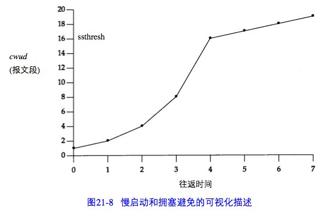

在该图中,假定当cwnd为32个报文段时就会发生拥塞。于是设置ssthresh为16个报文段,而cwnd为1个报文段。在时刻0发送了一个报文段,并假定在时刻1接收到它的ACK,此时cwnd增加为2。接着发送了2个报文段,并假定在时刻2接收到它们的ACK,于是cwnd增加为4(对每个ACK增加1次)。这种指数增加算法一直进行到在时刻3和4之间收到8个ACK后cwnd等于ssthresh时才停止,从该时刻起,cwnd以线性方式增加,在每个往返时间内最多增加1个报文段。

### 21.5 快速重传与快速恢复算法
拥塞避免算法的修改建议1990年提出[Jacobson1990b]。

在介绍修改之前,我们认识到在收到一个失序的报文段时,TCP立即需要产生一个ACK(一个重复的ACK)。这个重复的ACK不应该被迟延。该重复的ACK的目的在于让对方知道收到一个失序的报文段,并告诉对方自己希望收到的序号。

由于我们不知道一个重复的ACK是由一个丢失的报文段引起的,还是由于仅仅出现了几个报文段的重新排序,因此我们等待少量重复的ACK到来。假如这只是一些报文段的重新排序，则在重新排序的报文段被处理并产生一个新的ACK之前,只可能产生1~2个重复的ACK。如果一连串收到3个或3个以上的重复ACK,就非常可能是一个报文段丢失了。于是我们就重传丢失的数据报文段,而无需等待超时定时器溢出。这就是快速重传算法。接下来执行的不是慢启动算法而是拥塞避免算法。这就是快速恢复算法。

在图21-7中可以看到在收到3个重复的ACK之后没有执行慢启动。相反,发送方进行重传,接着在收到重传的ACK以前,发送了3个新的数据的报文段(报文段67,69和71)。

在这种情况下没有执行慢启动的原因是由于收到重复的ACK不仅仅告诉我们一个分组丢失了。由于接收方只有在收到另一个报文段时才会产生重复的ACK,而该报文段已经离开了网络并进入了接收方的缓存。也就是说,在收发两端之间仍然有流动的数据,而我们不想执行慢启动来突然减少数据流。

这个算法通常按如下过程进行实现:
1. 当收到第3个重复的ACK时,将ssthresh设置为当前拥塞窗口cwnd的一半。重传丢失的报文段。设置cwnd为ssthresh加上3倍的报文段大小。
2. 每次收到另一个重复的ACK时,cwnd增加1个报文段大小并发送1个分组(如果新的cwnd允许发送)。
3. 当下一个确认新数据的ACK到达时,设置cwnd为ssthresh(在第1步中设置的值)。这个ACK应该是在进行重传后的一个往返时间内对步骤1中重传的确认。另外,这个ACK也应该是对丢失的分组和收到的第1个重复的ACK之间的所有中间报文段的确认。这一步采用的是拥塞避免,因为当分组丢失时我们将当前的速率减半。

## 第22章 TCP的坚持定时器
### 22.1 坚持定时器的触发
TCP不对ACK报文段进行确认,TCP只确认那些包含有数据的ACK报文段。如果一个确认丢失了,则双方就有可能因为等待对方而使连接终止:接收方等待接收数据(因为它已经向发送方通告了一个非0的窗口),而发送方在等待允许它继续发送数据的窗口更新。为防止这种死锁情况的发生,发送方使用一个坚持定时器(persist timer)来周期性地向接收方查询,以便发现窗口是否已增大。这些从发送方发出的报文段称为窗口探查(window probe)。

服务器确认了前面4个数据报文段,然后通告窗口为0,从而使客户停止发送任何其他的数据。这就引起客户设置其坚持定时器。如果在该定时器时间到时客户还没有接收到一个窗口更新,它就探查这个空的窗口以决定窗口更新是否丢失。

坚持状态与重传超时之间一个不同的特点就是TCP从不放弃发送窗口探查。这些探查每隔60秒发送一次,这个过程将持续到或者窗口被打开,或者应用进程使用的连接被终止。

## 第23章 TCP的保活定时器
保活并不是TCP规范中的一部分。Host Requirements RFC提供了3个不使用保活定时器的理由:(1)在出现短暂差错的情况下,这可能会使一个非常好的连接释放掉;(2)它们耗费不必要的带宽;(3)在按分组计费的情况下会在互联网上花掉更多的钱。然而,许多实现提供了保活定时器。

保活功能主要是为服务器应用程序提供的。服务器应用程序希望知道客户主机是否崩溃, 从而可以代表客户使用资源。

如果一个给定的连接在两个小时之内没有任何动作,则服务器就向客户发送一个探查报文段。客户主机必须处于以下4个状态之一。

1. 客户主机依然正常运行,并从服务器可达。客户的TCP响应正常,而服务器也知道对方是正常工作的。服务器在两小时以后将保活定时器复位。如果在两个小时定时器到时间之前有应用程序的通信量通过此连接,则定时器在交换数据后的未来2小时再复位。
1. 客户主机已经崩溃,并且关闭或者正在重新启动。在任何一种情况下,客户的TCP都没有响应。服务器将不能够收到对探查的响应,并在75秒后超时。服务器总共发送10个这样的探查,每个间隔75秒。如果服务器没有收到一个响应,它就认为客户主机已经关闭并终止连接。
1. 客户主机崩溃并已经重新启动。这时服务器将收到一个对其保活探查的响应,但是这个响应是一个复位,使得服务器终止这个连接。
1. 客户主机正常运行,但是从服务器不可达。这与状态2相同,因为TCP不能够区分状态4与状态2之间的区别,它所能发现的就是没有收到探查的响应。

在第1种情况下,服务器的应用程序没有感觉到保活探查的发生。TCP层负责一切。这个过程对应用程序都是透明的,直至第2、3或4种情况发生。在这三种情况下,服务器应用程序将收到来自它的TCP的差错报告(通常服务器已经向网络发出了读操作请求,然后等待来自客户的数据。如果保活功能返回一个差错,则该差错将作为读操作的返回值返回给服务器)。在第2种情况下,差错是诸如“连接超时”之类的信息,而在第3种情况则为“连接被对方复位”。第4种情况看起来像是连接超时,也可根据是否收到与连接有关的ICMP差错来返回其他的差错。在下一节中我们将观察这4种情况。

服务器不用关注客户主机被关闭和重新启动的情况(这指的是一个操作员的关闭,而不是主机崩溃)。当系统被操作员关闭时,所有的应用进程也被终止(也就是客户进程),这会使客户的TCP在连接上发出一个FIN。接收到FIN将使服务器的TCP向服务器进程报告文件结束,使服务器可以检测到这个情况。

## 第24章 TCP的未来和性能
### 24.1 路径MTU发现
TCP的路径MTU发现按如下方式进行:在连接建立时,TCP使用输出接口或对端声明的MSS中的最小MTU作为起始的报文段大小。路径MTU发现不允许TCP超过对端声明的MSS。如果对端没有指定一个MSS,则默认为536。

一旦选定了起始的报文段大小,在该连接上的所有被TCP发送的IP数据报都将被设置DF比特。如果某个中间路由器需要对一个设置了DF标志的数据报进行分片,它就丢弃这个数据报,并产生一个我们在11章节介绍的ICMP的“不能分片”差错。

如果收到这个ICMP差错,TCP就减少段大小并进行重传。如果路由器产生的是一个较新(新版)的该类ICMP差错,则报文段大小被设置为下一跳的MTU减去IP和TCP的首部长度。如果是一个较旧(旧版)的该类ICMP差错,则必须尝试下一个可能的最小MTU。当由这个ICMP差错引起的重传发生时,拥塞窗口不需要变化,但要启动慢启动。

由于路由可以动态变化,因此在最后一次减少路径MTU的一段时间以后,可以尝试使用一个较大的值(直到等于对端声明的MSS或输出接口MTU的最小值)。RFC1191推荐这个时间间隔为10分钟。

在对非本地目的地,默认的MSS通常为536字节,路径MTU发现可以避免在通过MTU小于576(这非常罕见)的中间链路时进行分片。对于本地目的主机,也可以避免在中间链路(如以太网)的MTU小于端点网络(如令牌环网)的情况下进行分片。但为了能使路径MTU更加有用和充分利用MTU大于576的广域网,一个实现必须停止使用为非本地目的制定的536的MTU默认值。MSS的一个较好的选择是输出接口的MTU(当然要减去IP和TCP的首部大小)。

### 24.2 长肥管道
我们把一个连接的容量表示为

    capacity(b)=bandwidth(b/s)×round-triptime(s)

并称之为带宽时延乘积。也可称它为两端的管道大小。

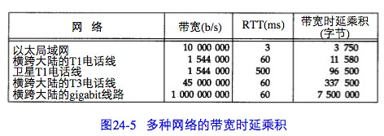

具有大的带宽时延乘积的网络被称为长肥网络(Long Fat Network,即LFN,发音为“elefan(t)s”),而一个运行在LFN上的TCP连接被称为长肥管道。使用长肥管道会遇到多种问题。

1. TCP首部中窗口大小为16bit,从而将窗口限制在65535个字节内。但是从图24-5的最后一列可以看到,现有的网络需要一个更大的窗口来提供最大的吞吐量。在24.4节介绍的窗口扩大选项可以解决这个问题。
1. 在一个长肥网络LFN内的分组丢失会使吞吐量急剧减少。如果只有一个报文段丢失,我们需要利用21.7节介绍的快速重传和快速恢复算法来使管道避免耗尽。但是即使使用这些算法,在一个窗口内发生的多个分组丢失也会典型地使管道耗尽(如果管道耗尽了,慢启动会使它渐渐填满,但这个过程将需要经过多个RTT)。
1. 我们在第21.4节看到许多TCP实现对每个窗口的RTT仅进行一次测量。它们并不对每个报文段进行RTT测量。在一个长肥网络LFN上需要更好的RTT测量机制。我们将在24.5节介绍时间戳选项,它允许更多的报文段被计时,包括重传。
1. TCP对每个字节数据使用一个32bit无符号的序号来进行标识。如果在网络中有一个被延迟一段时间的报文段,它所在的连接已被释放,而一个新的连接在这两个主机之间又建立了,怎样才能防止这样的报文段再次出现呢?首先回想起IP首部中的TTL为每个IP段规定了一个生存时间的上限—255跳或255秒,看哪一个上限先达到。在18.6节我们定义了最大的报文段生存时间(MSL)作为一个实现的参数来阻止这种情况的发生。推荐的MSL的值为2分钟(给出一个240秒的2MSL),但是我们在18.6节看到许多实现使用的MSL为30秒。在长肥网络LFN上,TCP的序号会碰到一个不同的问题。由于序号空间是有限的,在已经传输了4294967296个字节以后序号会被重用。如果一个包含序号N字节数据的报文段在网络上被迟延并在连接仍然有效时又出现,会发生什么情况呢?这仅仅是一个相同序号N在MSL期间是否被重用的问题,也就是说,网络是否足够快以至于在不到一个MSL的时候序号就发生了回绕。在一个以太网上要发送如此多的数据通常需要60分钟左右,因此不会发生这种情况。但是在带宽增加时,这个时间将会减少:一个T3的电话线(45Mb/s)在12分钟内会发生回绕,FDDI(100Mb/s)为5分钟,而一个千兆比网络(1000Mb/s)则为34秒。这时问题不再是带宽时延乘积,而在于带宽本身。在24.6节,我们将介绍一种对付这种情况的办法:使用TCP的时间戳选项的PAWS(Protection Against Wrapped Sequence numbers)算法(保护回绕的序号)。

千兆比网络

在千兆比速率下,时延限制占据了主要地位,而带宽不再成为限制。时延主要是由光速引起的,而且不能够被减小(除非爱因斯坦是错误的)。当我们考虑到分组需要建立和终止一个连接时,这个固定时延起的作用就更糟糕了。

### 24.3 窗口扩大选项
窗口扩大选项使TCP的窗口定义从16bit增加为32bit。是通过定义一个选项实现对16bit的扩大操作(scalingoperation)来完成的。

一个字节的移位记数器取值为0(没有扩大窗口的操作)和14。这个最大值14表示窗口大小为1073725440字节(65535×2^14)。

这个选项只能够出现在一个SYN报文段中,因此当连接建立起来后,在每个方向的扩大因子是固定的。为了使用窗口扩大,两端必须在它们的SYN报文段中发送这个选项。主动建立连接的一方在其SYN中发送这个选项,但是被动建立连接的一方只能够在收到带有这个选项的SYN之后才可以发送这个选项。每个方向上的扩大因子可以不同。

如果主动连接的一方发送一个非零的扩大因子,但是没有从另一端收到一个窗口扩大选项,它就将发送和接收的移位记数器置为0。这就允许较新的系统能够与较旧的、不理解新选项的系统进行互操作。

假定我们正在使用窗口扩大选项,发送移位记数为S,而接收移位记数则为R。于是我们从另一端收到的每一个16bit的通告窗口将被左移R位以获得实际的通告窗口大小。每次当我们向对方发送一个窗口通告的时候,我们将实际的32bit窗口大小右移S比特,然后用它来替换TCP首部中的16bit的值。

### 24.4 时间戳选项
时间戳选项使发送方在每个报文段中放置一个时间戳值。接收方在确认中返回这个数值,从而允许发送方为每一个收到的ACK计算RTT(我们必须说“每一个收到的ACK”而不是“每一个报文段”,是因为TCP通常用一个ACK来确认多个报文段)。

发送方在第1个字段中放置一个32bit的值,接收方在应答字段中回显这个数值。包含这个选项的TCP首部长度将从正常的20字节增加为32字节。

时间戳是一个单调递增的值。

在连接建立阶段,对这个选项的规定与前一节讲的窗口扩大选项类似。主动发起连接的一方在它的SYN中指定选项。只有在它从另一方的SYN中收到了这个选项之后,该选项才会在以后的报文段中进行设置。

这个算法能够处理下面两种情况:

1. 如果ACK被接收方迟延,则作为回显值的时间戳值应该对应于最早被确认的报文段。例如,如果两个包含1~1024和1025~2048字节的报文段到达,每一个都带有一个时间戳选项,接收方产生一个ACK2049来对它们进行确认。此时,ACK中的时间戳应该是包含字节1~1024的第1个报文段中的时间戳。这种处理是正确的,因为发送方在进行重传超时时间的计算时,必须将迟延的ACK也考虑在内。
1. 如果一个收到的报文段虽然在窗口范围内但同时又是失序,这就表明前面的报文段已经丢失。当那个丢失的报文段到达时,它的时间戳(而不是失序的报文段的时间戳)将被回显。例如,假定有3个各包含1024字节数据的报文段,按如下顺序接收:包含字节1~1024的报文段1,包含字节2049~4072的报文段3和包含字节1025~2048的报文段2。返回的ACK应该是带有报文段1的时间戳的ACK1025(一个正常的所期望的对数据的ACK)、带有报文段1的时间戳的ACK1025(一个重复的、响应位于窗口内但却是失序的报文段的ACK),然后是带有报文段2的时间戳的ACK3073(不是报文段3中的较后的时间戳)。这与当报文段丢失时的对RTT估计过高具有同样的效果,但这比估计过低要好些。而且,如果最后的ACK含有来自报文段3的时间戳,它可以包括重复的ACK返回和报文段2被重传所需要的时间,或者可以包括发送方的报文段2的重传超时定时器到期的时间。无论在哪一种情况下,回显报文段3的时间戳将引起发送方的RTT计算出现偏差。

### 24.5 PAWS:防止回绕的序号
PAWS算法不需要在发送方和接收方之间进行任何形式的时间同步。接收方所需要的就是时间戳的值应该单调递增,并且每个窗口至少增加1。

### 24.6 T/TCP:为事务用的TCP扩展
一个事务(transaction)就是符合下面这些特征的一个客户请求及其随后的服务器响应。

1. 应该避免连接建立和连接终止的开销,在可能的时候,发送一个请求分组并接收一个应答分组。
1. 等待时间应当减少到等于RTT与SPT之和。其中RTT(Round-TripTime)为往返时间,而SPT(ServerProcessingTime)则是服务器处理请求的时间。
1. 服务器应当能够检测出重复的请求,并且当收到一个重复的请求时不重新处理事务(避免重新处理意味着服务器不必再次处理请求,而是返回保存的、与该请求对应的应答)。

TCP为处理事务而需要进行的两个改动是避免三次握手和缩短WAIT_TIME状态。T/TCP通过使用加速打开来避免三次握手:

1. 它为打开的连接指定一个32bit的连接计数CC(ConnectionCount),无论主动打开还是被动打开。一个主机的CC值从一个全局计数器中获得,该计数器每次被使用时加1。
1. 在两个使用T/TCP的主机之间的每一个报文段都包括一个新的TCP选项CC。这个选项的长度为6个字节,包含发送方在该连接上的32bit的CC值。
1. 一个主机维持一个缓存,该缓存保留每个主机上一次的CC值,这些值从来自这个主机的一个可接受的SYN报文段中获得。
1. 当在一个开始的SYN中收到一个CC选项的时候,接收方比较收到的值与为该发送方缓存的CC值。如果接收到的CC比缓存的大,则该SYN是新的,报文段中的任何数据被传递给接收应用进程(服务器)。这个连接被称为半同步。如果接收的CC比缓存的小,或者接收主机上没有对应这个客户的缓存CC,则执行正常的TCP三次握手过程。
1. 为响应一个开始的SYN,带有SYN和ACK的报文段在另一个被称为CCECHO的选项中回显所接收到的CC值。
1. 在一个非SYN报文段中的CC值检测和拒绝来自同一个连接的前一个替身的任何重复的报文段。

这种“加速打开”避免了使用三次握手的要求,除非客户或者服务器已经崩溃并重新启动。这样做的代价是服务器必须记住从每个客户接收的最近的CC值。

基于在两个主机之间测量RTT来动态计算TIME_WAIT的延时,可以缩短TIME_WAIT状态。TIME_WAIT时延被设置为8倍的重传超时值RTO(见21.3节)。

## 第25章 SNMP:简单网络管理协议
基于TCP/IP的网络管理包含两个部分:网络管理站(也叫管理进程,manager)和被管的网络单元(也叫被管设备)。被管设备种类繁多,例如:路由器、X终端、终端服务器和打印机等。

基于TCP/IP的网络管理包含3个组成部分:

1. 一个管理信息库MIB(Management Information Base)。管理信息库包含所有代理进程的所有可被查询和修改的参数。RFC1213[McCloghrie and Rose1991]定义了第二版的MIB,叫做MIB-II。
1. 关于MIB的一套公用的结构和表示符号。叫做管理信息结构SMI(Structure of Management Information)。这个在RFC1155[Rose and McCloghrie1990]中定义。例如:SMI定义计数器是一个非负整数,它的计数范围是0~4294967295,当达到最大值时,又从0开始计数。
1. 管理进程和代理进程之间的通信协议,叫做简单网络管理协议SNMP(Simple Network Management Protocol)。在RFC1157[Caseetal.1990]中定义。SNMP包括数据报交换的格式等。尽管可以在运输层采用各种各样的协议,但是在SNMP中,用得最多的协议还是UDP。

关于管理进程和代理进程之间的交互信息,SNMP定义了5种报文:

1. get-request操作:从代理进程处提取一个或多个参数值。
1. get-next-request操作:从代理进程处提取一个或多个参数的下一个参数值(关于“下一个(next)”的含义将在后面的章节中介绍)。
1. set-request操作:设置代理进程的一个或多个参数值。
1. get-response操作:返回的一个或多个参数值。这个操作是由代理进程发出的。它是前面3中操作的响应操作。
1. trap操作:代理进程主动发出的报文,通知管理进程有某些事情发生。

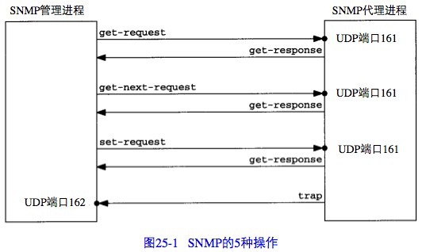