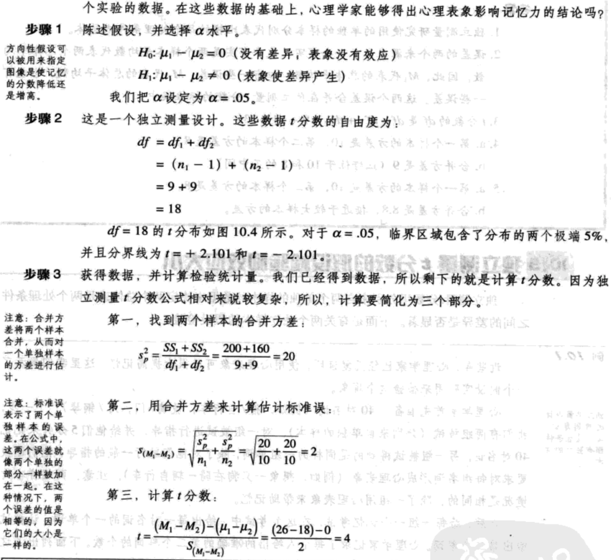
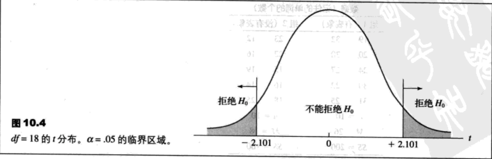

- [两个独立样本的t检验](#%e4%b8%a4%e4%b8%aa%e7%8b%ac%e7%ab%8b%e6%a0%b7%e6%9c%ac%e7%9a%84t%e6%a3%80%e9%aa%8c)
  - [概述（独立测量研究与重复测量研究）](#%e6%a6%82%e8%bf%b0%e7%8b%ac%e7%ab%8b%e6%b5%8b%e9%87%8f%e7%a0%94%e7%a9%b6%e4%b8%8e%e9%87%8d%e5%a4%8d%e6%b5%8b%e9%87%8f%e7%a0%94%e7%a9%b6)
  - [独立测量研究设计的t分数](#%e7%8b%ac%e7%ab%8b%e6%b5%8b%e9%87%8f%e7%a0%94%e7%a9%b6%e8%ae%be%e8%ae%a1%e7%9a%84t%e5%88%86%e6%95%b0)
    - [独立测量假设检验的假设](#%e7%8b%ac%e7%ab%8b%e6%b5%8b%e9%87%8f%e5%81%87%e8%ae%be%e6%a3%80%e9%aa%8c%e7%9a%84%e5%81%87%e8%ae%be)
    - [独立测量假设检验的公式](#%e7%8b%ac%e7%ab%8b%e6%b5%8b%e9%87%8f%e5%81%87%e8%ae%be%e6%a3%80%e9%aa%8c%e7%9a%84%e5%85%ac%e5%bc%8f)
    - [合并方差](#%e5%90%88%e5%b9%b6%e6%96%b9%e5%b7%ae)
    - [估计标准误](#%e4%bc%b0%e8%ae%a1%e6%a0%87%e5%87%86%e8%af%af)
    - [最后的公式与自由度](#%e6%9c%80%e5%90%8e%e7%9a%84%e5%85%ac%e5%bc%8f%e4%b8%8e%e8%87%aa%e7%94%b1%e5%ba%a6)
  - [独立测量t分数的假设检验与效应大小](#%e7%8b%ac%e7%ab%8b%e6%b5%8b%e9%87%8ft%e5%88%86%e6%95%b0%e7%9a%84%e5%81%87%e8%ae%be%e6%a3%80%e9%aa%8c%e4%b8%8e%e6%95%88%e5%ba%94%e5%a4%a7%e5%b0%8f)
    - [t检验例子](#t%e6%a3%80%e9%aa%8c%e4%be%8b%e5%ad%90)
    - [效应大小](#%e6%95%88%e5%ba%94%e5%a4%a7%e5%b0%8f)
    - [方向性假设和单尾检验](#%e6%96%b9%e5%90%91%e6%80%a7%e5%81%87%e8%ae%be%e5%92%8c%e5%8d%95%e5%b0%be%e6%a3%80%e9%aa%8c)
  - [独立测量t分数公式的根本假设](#%e7%8b%ac%e7%ab%8b%e6%b5%8b%e9%87%8ft%e5%88%86%e6%95%b0%e5%85%ac%e5%bc%8f%e7%9a%84%e6%a0%b9%e6%9c%ac%e5%81%87%e8%ae%be)
    - [Hartley检验](#hartley%e6%a3%80%e9%aa%8c)

## 两个独立样本的t检验
### 概述（独立测量研究与重复测量研究）
两种方法来比较两组数据：
1. 这两组数据可能来源于两个完全不同的样本。例如，一个研究可以比较一组男性样本与一组女性样本。或者这个研究可以比较两组学生，用方法A教其中一组，用方法B教另外一组。
2. 两组数据可以都来源于同一个样本。例如，研究者可以通过在一组患者接受治疗之前，测量他们的消沉分数得到第一组数据，然后在同一组患者接受治疗6个星期之后，再进行测量从而得到另外一组数据。

第一种研究方法应用了完全不同的样本，被称作独立测量研究设计或`被试间设计`。第二种研究方法，两组数据来源于同一个样本，所以这种方法被称为重复测量研究设计或`被试内设计`。

每个处理条件（或每个总体）都应用单独样本的研究设计被称为`独立测量研究设计`或`被试间设计`。

### 独立测量研究设计的t分数
#### 独立测量假设检验的假设
$H_0:\mu_1-\mu_2=0$（总体平均数间没有差别）

你应该注意到，虚无假设也可以陈述为$\mu_1=\mu_2$。但是$H_0$的第一种表示方法可以得到一个特殊的数值（零），这个值将用作t分数的计算中。因此，我们更喜欢用两总体的平均数差来表示虚无假设。

备择假设应陈述为两总体间不存在平均数差：

$H_1:\mu_1-\mu_2 \neq 0$（总体间不存在平均数差）

#### 独立测量假设检验的公式
1. 独立测量和单样本假设检验的t分数公式的基本结构是相同的。在两种情况下，t = 样本统计量 - 假设的总体参数 / 估计标准误
2. 独立测量的t基本上是两个样本的t，也就是单样本t分数公式中的所有元素都加倍。

**全面的t分数公式**：单样本t分数用一个样本的平均数来检验一个有关总体平均数的假设。样本平均数和总体平均数出现在t分数公式的分子部分，这样就测量了样本数据与总体假设之间的差异。

$t=\frac{M-\mu}{s_M}$=(样本平均数-总体平均数)/估计标准误

独立测量t分数用两个样本平均数之间的差异来评估两个总体平均数之间的差异。因此，独立测量t分数的公式是

$t=\frac{(M_1-M_2)-(\mu_1-\mu_2)}{s_{(M_1-M_2)}}$=(样本平均数差异-总体平均数差异)/估计标准误

在这个公式里，$M_1-M_2$的值从样本数据中得来，$\mu_1-\mu_2$的值从虚无假设中得来。最后，注意虚无假设规定总体平均数的差等于零，因此，独立测量t分数可以简化为：

t=样本平均数差异/估计标准误

在这个形式中，t分数是一个简单的比率，即比较了真实的平均数差异（分子）与偶然引起的差异（分母）。

有关$s_{(M_1-M_2)}$公式的由来，我们需要考虑以下三点：
1. 两个样本平均数都分别表示了相对应的总体平均数，但是，在每种情况下都存在一些误差。
    1. $M_1$近似于$\mu_1$，但存在一些误差。
    2. $M_2$近似于$\mu_2$，但存在一些误差。
    3. 因此，误差的来源有两个。
2. 与每个样本平均数相联系的误差量可以通过计算M的标准误来测量。在公式9.1，我们计算了单样本平均数的标准误：$s_M=\sqrt{\frac{s^2}{n}}$
3. 对于独立测量t分数，我们想要知道由两个样本平均数来表示两个总体平均数的误差总量。因此，我们需要分别找到每个样本的误差，然后把两个误差相加。得到的标准误的公式是：$s_{M_1-M_2}=\sqrt{\frac{s_1^2}{n_1}+\frac{s_2^2}{n_2}}\ (10.1)$

#### 合并方差
尽管公式10.1准确地陈述了独立测量t分数标准误的概念，但是，这个公式仅限于在两个样本大小相等的情况下（也就是，n1=n2）使用。在两个样本的大小不等的情况下，上述公式就存在偏误了，所以就不合适。偏误的产生是由于公式10.1同等地对待了两个样本方差。但是，当样本大小不同时，两个样本方差不能被同等对待。在第7章，介绍过个数多的法则：从大样本中得出的统计量要比从小样本中得出的统计量能更好地（更准确地）估计总体参数。这个法则也适用于样本方差：从大样本中得到的方差要比从小样本中得到的方差能更准确地估计$\sigma^2$。

为了纠正样本方差中的偏误，独立测量t分数将把两个样本方差合并成一个值，叫做`合并方差`。合并方差可以通过一种方法来平均或“合并”两样本方差，这种方法是，在决定最终的合并方差数值时允许较大的样本承担较多的分量。

当只有一个样本时，样本方差的计算为：$s^2=\frac{SS}{df}$

对于独立测量t分数来说，有两个SS值和两个df值（分别来自每个样本）。两个样本的值合并起来计算所谓的合并方差。合并方差的符号是$s_p^2$，应这样计算：$s_p^2=\frac{SS_1+SS_2}{df_1+df_2}$

#### 估计标准误
用合并方差来代替个体方差，我们现在就能得到无偏误测量一个样本平均数差的标准误的方法。得到的独立测量的估计标准误的公式是：

$M_1-M_2$的估计标准误=$s_{(M_1-M_2)}=\sqrt{\frac{s_p^2}{n_1}+\frac{s_p^2}{n_2}}\ (10.3)$

#### 最后的公式与自由度
独立测量t分数的完整公式为：

$t=\frac{(M_1-M_2)-(\mu_1-\mu_2)}{s_{(M_1-M_2)}}$=(样本平均数差-总体平均数差)/估计标准误 (10.4)

在这个公式中，分母上的估计标准误需要用公式10.3来计算，并要求用公式10.2来计算合并标准误。

独立测量的t分数自由度由两个单独样本的df值来决定：

t分数的df=第一个样本的df+第二个样本的df=$df_1+df_2=(n_1-1)+(n_2-1)\ (10.5)$

表10.1 单样本t分数与独立测量t分数的基本要素

/ | 样本数据 | 假设的总体参数 | 估计标准误 | 样本方差
--|------|---------|-------|-----
单样本t分数 | M | $\mu$ | $\sqrt\frac{s^2}{n}$ | $s^2=\frac{SS}{df}$
独立测量t分数 | $(M_1-M_2)$ | $(\mu_1-\mu_2)$ | $\sqrt{\frac{s_p^2}{n_1}+\frac{s_p^2}{n_2}}$ | $s_p^2=\frac{SS_1+SS_2}{df_1+df_2}$

### 独立测量t分数的假设检验与效应大小
#### t检验例子

#### 效应大小
估计$d=\frac{M_1-M_2}{\sqrt{s_p^2}}\ (10.6)$

对于例10.1中的数据，两个样本的平均数分别为26和18，合并方差为20。这些数据的估计d值为：

$d=\frac{M_1-M_2}{\sqrt{s_p^2}}=\frac{26-18}{\sqrt{20}}=1.79$

用已经建立的标准来测量科恩d值（见表8.2），这个值表示了一个非常大的处理效应。

$r^2=\frac{t^2}{t^2+df}\ (10.7)$

对于例10.1中的数据（图像研究），我们得到t=4.00，df=18。这些数值产生的$r^2$为

$r^2=\frac{4^2}{4^2+18}=0.47$

根据评价$r^2$的标准（表9.3），这个数值同样表示了一个非常大的处理效应。

#### 方向性假设和单尾检验

### 独立测量t分数公式的根本假设
在假设检验中应用独立测量t分数前，应该首先满足三个假设：
1. 每个样本中的观察必须是独立的
2. 与两个样本相对应的两个总体都必须是正态分布
3. 与两个样本相对应的两个总体都必须有相等的方差（方差齐性）

#### Hartley检验
Hartley检验建立在一个理论基础上。这个理论是一个样本方差没有偏误地估计了总体方差。因而，如果总体方差是相等的，那么样本方差就应该近似。应用Hartley检验的步骤是：
1. 为每个样本单独计算样本方差，$s^2=\frac{SS}{df}$
2. 选择这些样本方差中的最大和最小值，然后计算：$F_{max}=\frac{s_{max}^2}{s_{min}^2}$
    1. 一个相对来说较大的$F_{max}$值表明了样本方差之间的较大差异。在这种情况下，一方面，数据表明总体方差是不等的，并且违背了齐性假设；另一方面，一个小的$F_{min}$值（大约1.00）表明了样本方差是近似的，并且齐性假设是合理的。
3. 样本数据的$F_{max}$值用来与A.3中的临界值做比较。如果样本数值比表中的数值大，那么，你就可以下结论：方差是不同的，并且齐性假设是无根据的。在表中确定临界数值，你需要知道：
    1. k=单独的样本的个数（对于独立测量t检验来说，k=2）。
    2. 对于每个样本方差来说，df=n-1。Hartley检验假设所有的样本大小相同。
    3. $\alpha$水平。此表提供了$\alpha=.05$和$\alpha=.01$的临界数值。通常情况下，齐性检验需要较大的$\alpha$水平。
    4. 例如：两个独立的样本，大小相等n=10.样本方差为12.34和9.15。对于这些数据，$F_{max}=\frac{s_{max}^2}{s_{min}^2}=\frac{12.34}{9.15}=1.35$
    5. $\alpha=.05,k=2,df=n-1=9$时，从表中得出的临界值为4.03。因为得到的$F_{max}$值比这个临界值小，所以就可以得出结论：数据不能证明违反了方差齐性的假设。
