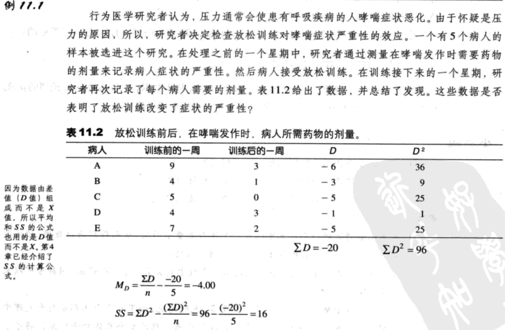
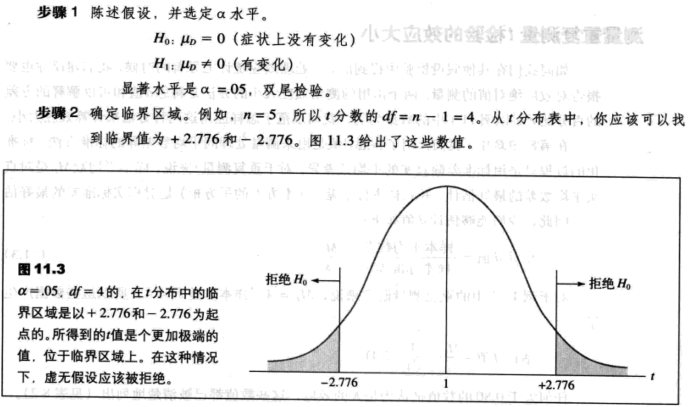

- [两个相关样本的t检验](#%e4%b8%a4%e4%b8%aa%e7%9b%b8%e5%85%b3%e6%a0%b7%e6%9c%ac%e7%9a%84t%e6%a3%80%e9%aa%8c)
  - [概述（重复测量与匹配被试）](#%e6%a6%82%e8%bf%b0%e9%87%8d%e5%a4%8d%e6%b5%8b%e9%87%8f%e4%b8%8e%e5%8c%b9%e9%85%8d%e8%a2%ab%e8%af%95)
  - [相关样本t检验](#%e7%9b%b8%e5%85%b3%e6%a0%b7%e6%9c%act%e6%a3%80%e9%aa%8c)
    - [差值：相关样本研究的数据](#%e5%b7%ae%e5%80%bc%e7%9b%b8%e5%85%b3%e6%a0%b7%e6%9c%ac%e7%a0%94%e7%a9%b6%e7%9a%84%e6%95%b0%e6%8d%ae)
    - [相关样本检验的假设](#%e7%9b%b8%e5%85%b3%e6%a0%b7%e6%9c%ac%e6%a3%80%e9%aa%8c%e7%9a%84%e5%81%87%e8%ae%be)
    - [相关样本t检验](#%e7%9b%b8%e5%85%b3%e6%a0%b7%e6%9c%act%e6%a3%80%e9%aa%8c-1)
  - [重复测量设计的假设检验和效应大小](#%e9%87%8d%e5%a4%8d%e6%b5%8b%e9%87%8f%e8%ae%be%e8%ae%a1%e7%9a%84%e5%81%87%e8%ae%be%e6%a3%80%e9%aa%8c%e5%92%8c%e6%95%88%e5%ba%94%e5%a4%a7%e5%b0%8f)
    - [重复测量t检验例子](#%e9%87%8d%e5%a4%8d%e6%b5%8b%e9%87%8ft%e6%a3%80%e9%aa%8c%e4%be%8b%e5%ad%90)
    - [重复测量t检验的效应大小](#%e9%87%8d%e5%a4%8d%e6%b5%8b%e9%87%8ft%e6%a3%80%e9%aa%8c%e7%9a%84%e6%95%88%e5%ba%94%e5%a4%a7%e5%b0%8f)
    - [方向性假设与单尾检验](#%e6%96%b9%e5%90%91%e6%80%a7%e5%81%87%e8%ae%be%e4%b8%8e%e5%8d%95%e5%b0%be%e6%a3%80%e9%aa%8c)
  - [相关样本t检验的应用与假设](#%e7%9b%b8%e5%85%b3%e6%a0%b7%e6%9c%act%e6%a3%80%e9%aa%8c%e7%9a%84%e5%ba%94%e7%94%a8%e4%b8%8e%e5%81%87%e8%ae%be)

## 两个相关样本的t检验
### 概述（重复测量与匹配被试）
在`重复测量`研究中，样本中的个体要在同一个因变量下被测量多于一次，所有的处理条件都使用相同的被试。

在`匹配被试`研究中，一个样本中的每个个体是与另一个样本中的被试相匹配的。这个匹配使得两个个体在一个特定的，研究者想控制的变量上是相当的（或近似于相当）。

### 相关样本t检验
#### 差值：相关样本研究的数据
表11.1给出了一个研究的假设数据，这个研究检验了反应时间是怎样受普通、非处方感冒药影响的。每个人的第一个数X1是治疗前的反应时。第二个数X2测量了吃完药一个半小时后的反应时。因为我们感兴趣的是药物如何影响反应时，已经计算出了每个个体的第一个与第二个数之间的差异。表的最后一列给出了差值或D值。具体来说，差值是由每个人的第二个数（处理后）减去第一个数（处理后）而得到的：

差值=$D=X_2-X_1\ (11.1)$

注意，每个D值的符号表明了变化的方向。例如，人物A表明了吃完药物后反应时减少了，人物B则表现了增加的趋势。

#### 相关样本检验的假设
如同往常，虚无假设陈述一般总体没有效应、没有变化或没有差异。对于重复测量研究，虚无假设陈述了一般总体的平均数差异是零。用符号表示为

$H_0:\mu_D=0$

备择假设陈述了处理效应引起一个处理条件中的数值比另一个条件中的数值普遍要高（或低）。用符号表示为：

$H_1:\mu_D \neq 0$

#### 相关样本t检验
对于重复测量设计，样本数据是差值，并且用字母D来表示，而不是用X来表示。因此，在公式中，我们用D来强调我们分析的是差值，而不是X值。同样，对于总体平均数我们感兴趣的是总体平均数差（整体总体变化的平均数），并且将这个参数用符号$\mu_D$来表示。对于这些简单的变化，重复测量设计的t分数公式就变成了：

$t=\frac{M_D-\mu_D}{s_{M_D}}\ (11.2)$

在这个公式中，估计标准误$s_{M_D}$与单样本t分数的计算方法一模一样。为了计算估计标准误，第一步是计算D值样本的方差。

$s^2=\frac{SS}{n-1}=\frac{SS}{df}$ 或 $s=\sqrt{\frac{SS}{df}}$

然后，用样本方差（或样本标准差）和样本大小n，来计算估计标准误。

$s_{M_D}=\sqrt{\frac{s^2}{n}}$ 或 $s_{M_D}=\frac{s}{\sqrt{n}}$

注意，用差值（D值）就已经完成了所有的计算，并且每个被试只有一个D值。一个有n个被试的样本就会恰好有n个D值，t分数的df=n-1.记住，n指的是D值的个数，不是原始数据中X值的个数。

你也应该注意到重复测量t分数的概念上是与我们前面检验过的t分数相类似的：

t=(样本统计量-总体参数)/估计标准误

在这个例子中，差值的样本平均数($M_D$)代表了样本数据，总体参数是$H_0$预测的$\mu_D$的数值，取样误差的大小可以由样本平均数($s_{M_D}$)的标准误来测量。

### 重复测量设计的假设检验和效应大小
#### 重复测量t检验例子

#### 重复测量t检验的效应大小
我们能够估计d值如下：

估计d值=样本平均数差/样本标准差=$\frac{M_D}{s}\ (11.3)$

对于例11.1中的重复测量研究来说，$M_D=4$，样本方差$s^2=4$，所以这些数据产生了：

估计d值=$\frac{M_D}{s}=\frac{4}{\sqrt{4}}=2.00$

任何大于0.80的数值被认为最大的效应，这些数值都已被清楚地列出（见表8.2）。

方差百分比是用从假设检验中得到的t值和df值来计算的。与独立测量t检验中的一样。以例11.1中的数据为例，我们可以得到：

$r^2=\frac{t^2}{t^2+df}=\frac{(4.47)^2}{(4.47)^2+4}=0.833$或83.3%

对于这些数据，差值的方差83.3%是由放松训练的效应解释的。

#### 方向性假设与单尾检验

### 相关样本t检验的应用与假设
相关样本的t检验要求两个假设：
1. 每个处理条件内的观察必须是独立的。注意，独立的假设指处理内的数据。在每个处理内，数据是从不同的个体得到，所以应该是彼此独立的。
2. 差值（D值）的总体分布必须是正态的。
