- [平均数差异推论-方差分析](#%e5%b9%b3%e5%9d%87%e6%95%b0%e5%b7%ae%e5%bc%82%e6%8e%a8%e8%ae%ba-%e6%96%b9%e5%b7%ae%e5%88%86%e6%9e%90)
  - [概述](#%e6%a6%82%e8%bf%b0)
    - [ANOVA的统计假设](#anova%e7%9a%84%e7%bb%9f%e8%ae%a1%e5%81%87%e8%ae%be)
    - [ANOVA的检验统计量](#anova%e7%9a%84%e6%a3%80%e9%aa%8c%e7%bb%9f%e8%ae%a1%e9%87%8f)
    - [第一类误差和多假设检验](#%e7%ac%ac%e4%b8%80%e7%b1%bb%e8%af%af%e5%b7%ae%e5%92%8c%e5%a4%9a%e5%81%87%e8%ae%be%e6%a3%80%e9%aa%8c)
  - [方差分析的逻辑](#%e6%96%b9%e5%b7%ae%e5%88%86%e6%9e%90%e7%9a%84%e9%80%bb%e8%be%91)
    - [处理间方差](#%e5%a4%84%e7%90%86%e9%97%b4%e6%96%b9%e5%b7%ae)
    - [处理内方差](#%e5%a4%84%e7%90%86%e5%86%85%e6%96%b9%e5%b7%ae)
    - [F分数](#f%e5%88%86%e6%95%b0)
  - [ANOVA的符号与公式](#anova%e7%9a%84%e7%ac%a6%e5%8f%b7%e4%b8%8e%e5%85%ac%e5%bc%8f)
    - [ANOVA公式](#anova%e5%85%ac%e5%bc%8f)
    - [平方和的计算](#%e5%b9%b3%e6%96%b9%e5%92%8c%e7%9a%84%e8%ae%a1%e7%ae%97)
      - [总的平方和，$SS_{total}$](#%e6%80%bb%e7%9a%84%e5%b9%b3%e6%96%b9%e5%92%8csstotal)
      - [处理内平方和，$SS_{error}$](#%e5%a4%84%e7%90%86%e5%86%85%e5%b9%b3%e6%96%b9%e5%92%8csserror)
      - [处理间平方和，$SS_{between}$](#%e5%a4%84%e7%90%86%e9%97%b4%e5%b9%b3%e6%96%b9%e5%92%8cssbetween)
    - [自由度分析](#%e8%87%aa%e7%94%b1%e5%ba%a6%e5%88%86%e6%9e%90)
      - [总的自由度，$df_{total}$。](#%e6%80%bb%e7%9a%84%e8%87%aa%e7%94%b1%e5%ba%a6dftotal)
      - [处理内自由度，$df_{error}$。](#%e5%a4%84%e7%90%86%e5%86%85%e8%87%aa%e7%94%b1%e5%ba%a6dferror)
      - [处理间自由度，$df_{between}$。](#%e5%a4%84%e7%90%86%e9%97%b4%e8%87%aa%e7%94%b1%e5%ba%a6dfbetween)
    - [方差（MS）和F分数](#%e6%96%b9%e5%b7%aems%e5%92%8cf%e5%88%86%e6%95%b0)
  - [F分布](#f%e5%88%86%e5%b8%83)
  - [ANOVA中假设检验和效应大小的例子](#anova%e4%b8%ad%e5%81%87%e8%ae%be%e6%a3%80%e9%aa%8c%e5%92%8c%e6%95%88%e5%ba%94%e5%a4%a7%e5%b0%8f%e7%9a%84%e4%be%8b%e5%ad%90)
    - [效应大小](#%e6%95%88%e5%ba%94%e5%a4%a7%e5%b0%8f)
    - [合并方差](#%e5%90%88%e5%b9%b6%e6%96%b9%e5%b7%ae)
    - [样本大小不相等例子](#%e6%a0%b7%e6%9c%ac%e5%a4%a7%e5%b0%8f%e4%b8%8d%e7%9b%b8%e7%ad%89%e4%be%8b%e5%ad%90)
  - [事后比较](#%e4%ba%8b%e5%90%8e%e6%af%94%e8%be%83)
    - [Tukey真实显著差异检验](#tukey%e7%9c%9f%e5%ae%9e%e6%98%be%e8%91%97%e5%b7%ae%e5%bc%82%e6%a3%80%e9%aa%8c)
    - [Scheffe检验](#scheffe%e6%a3%80%e9%aa%8c)
  - [ANOVA与t检验之间的关系](#anova%e4%b8%8et%e6%a3%80%e9%aa%8c%e4%b9%8b%e9%97%b4%e7%9a%84%e5%85%b3%e7%b3%bb)
    - [独立测量ANOVA的假设](#%e7%8b%ac%e7%ab%8b%e6%b5%8b%e9%87%8fanova%e7%9a%84%e5%81%87%e8%ae%be)

## 平均数差异推论-方差分析
### 概述
在方差分析中，用来表示作比较组的变量（自变量或准自变量）被称为`因素`。

组成一个因素的各个条件或是数值被称为这个因素的`水平`。

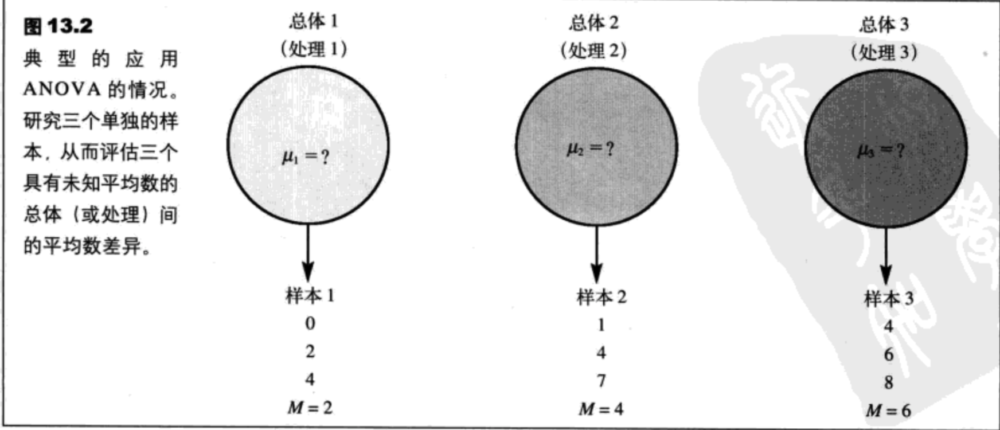

#### ANOVA的统计假设
下面的例子将用来介绍ANOVA的统计假设。假定，一个心理学家在三种温度条件（10、20、30）下检验了学习的效果。三组被试参加了这个试验。这三个样本分别作用在三个处理条件下。这个研究的目的是确定屋子的温度是否影响学习效果。用统计术语来说，我们要在两个假设中选择一个：虚无假设（H0）表示温度没有作用，备择假设（H1）则表示温度确实影响学习。

$H_0:\mu_1=\mu_2=\mu_3$

虚无假设陈述温度对学习效果没有影响。也就是说，三个温度条件的总体平均数是相等的。总的来说，H0陈述处理没有效果。再一次，注意：即使样本数据被用来检验假设，假设也总是以总体参数来表示。

对于备择假设，我们可以这样陈述：

H1：至少一个样本平均数与其他平均数是不等的。

总的来说，H1陈述了并不是所有处理条件的效应都相同。也就是说，确实存在处理效应。

#### ANOVA的检验统计量
ANOVA的检验统计量与前几章中的t分数很相似。对于t分数来说，我们曾用下面的结构计算一个比值：

    t = 样本平均数间的差异 / 偶然（误差）引起的期望差异

对于方差分析，检验统计量被称作F分数，其结构如下：

    F = 样本间的方差（差异） / 偶然（误差）引起的期望方差

#### 第一类误差和多假设检验
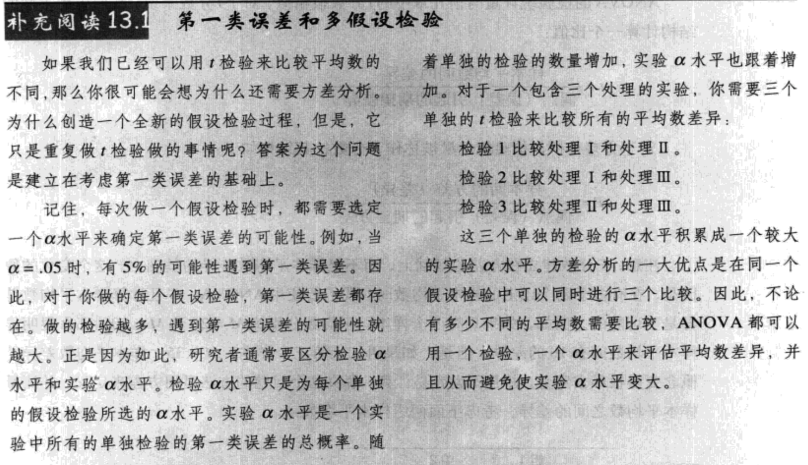

### 方差分析的逻辑


第一步是确定整组数据的总的变异性。为了计算总的变异性，我们将合并所有单独样本的数据，从而得到一个总的变异量来使实验完整。一旦我们测量了总的变异性，就可以把它们分成单独的部分。分析这个词的意思是分成更小的部分。因为我们要分析变异性，因此这个过程被称作方差分析。这个分析过程把总的变异性分成两个基本的部分。

1. `处理间方差`。观察表13.1中的数据，我们可以清楚地得出，这些数据的比较大的变异性是由处理条件间的总的差异引起的。例如，20C条件下的数据（M=4）趋向于高出10C条件下的数据（M=1）。我们将计算处理间方差来测量处理条件间的总的差异。注意，处理间的差异真正测量了样本平均数间的差异。
2. `处理内方差`。除了处理条件的总的差异，在每个样本内还存在变异性。再一次观察表13.1，我们得到并不是20C条件下的所有数据都相等；它们是变化的。处理内方差测量了每个处理条件内的变异性。

#### 处理间方差
除了测量处理间的差异，ANOVA的总的目的是评估处理间的差异。特别是，这个分析的目的是区分两个选择性的解释：

1. 处理间的差异只是由偶然引起的。也就是说，差异不是由任何处理效应引起的，而只是在一个样本和另一个样本间自然存在的差异。
2. 处理间的差异比只是由偶然引起的差异要大得多。也就是说，这些差异是由处理效应引起的。

因此，通常情况下，处理间的差异可能有两种解释：

1. `处理效应`。差异是由处理引起的。对于表13.1中的数据，样本1中的数据是10C房间内的数据，样本2中的数据是20C房间内的数据。很可能样本间的差异是由不同的温度引起的。
2. `偶然`。差异只是由偶然引起的。如果处理效应根本不存在，那么样本间仍被期望存在一些差异。样本包含不同的个体、不同的数据。样本间的差异只是由偶然引起的也并不奇怪。总的来说，“偶然差异”可以定义为不可计划的，不能预测的差异，并且这些差异不是由研究者的任何行为引起，也无法解释这些行为。
    1. 个体差异：因为每个样本都有不同的被试，所以一个处理中个体的数据都应与其他处理中个体的数据不同。尽管期望不同的样本有不同的分数是合理的，但是不可能预测差异到底有多大。
    2. 实验误差：只要有测量，在一定程度上就有误差。即使测量相同条件下的相同个体，也有可能得到两个不同的测量。因为这些差异是不可解释和预测的，所以，被认为是由偶然引起的。

因此，当我们计算处理间方差时，要计算由处理效应或只是由偶然引起的差异。为了证明处理效应的真正存在，我们必须确定处理间的差异比只是由偶然引起的差异要大。为了完成这个目标，我们需要确定差异为多大时可以证明不存在处理效应。也就是说，我们将测量只是由偶然引起的差异（或方差）。

#### 处理内方差
在每个处理条件的内部，有一组个体要接受一模一样的处理。也就是说，研究者将不会做任何事情来使个体有不同的分数。例如，在表13.1中数据表示的是20C（处理2）下的5个个体。尽管这5个个体作用在完全相同的处理条件下，但是，他们的分数是不同的。为什么分数会不同？答案是处理内的差异只是由偶然引起的。

因此，处理内方差测量了有多少差异只是由偶然引起的是合理的。特别是，当处理没有效果时，处理内方差测量了差异的大小。也就是说，当H0正确时，差异是多大。

#### F分数
对于独立测量ANOVA来说，F分数有如下的结果：

    F = 处理间方差/处理内方差=包括任何处理效应的差异/不存在处理效应的差异（13.1）

当用每个组成部分的来源表示它们的变异性时（图13.4），F分数的结构是：

    F=处理效应+偶然引起的差异/偶然引起的差异 （13.2）

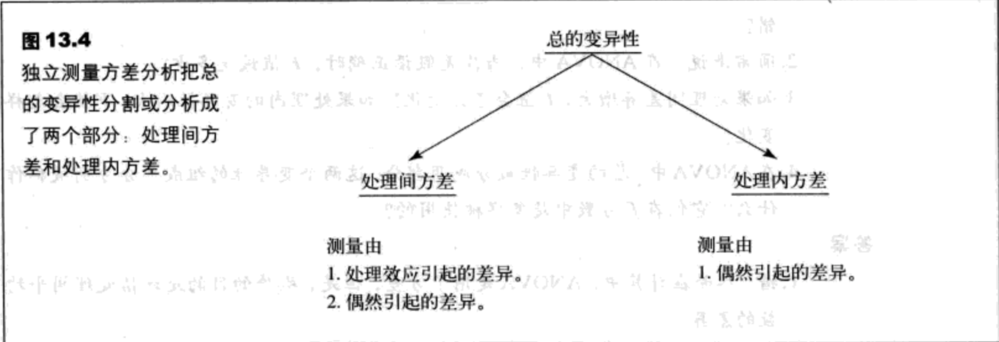

得到的F分数的数值可以帮助确定由哪些处理效应的存在。考虑下列两种可能性：

1. 当处理没有效应时，处理间的差异（分子）全部是由偶然引起的。在这种情况下，F分数的分子和分母都测量了偶然差异，并且两者测量的结果是大致相等的。当分子和分母大致相等时，F分数的值应该接近1.00。就公式来说，当处理效应为零时，我们可以得到：
    1. `F=偶然引起的方差/偶然引起的方差`
    2. 因此，F值接近1.00时，就表示处理间的差异（分子）与偶然引起的差异（分母）大致相等。
2. 当处理效应存在时，就引起了样本间的差异，那么处理间的差异（分子）就应该比偶然引起的差异（分母）要大。在这种情况下，F分数的分子就应该显著地大于分母，并且得到的F值显著地大于1.00。因此，大的F值表示处理间的差异大于偶然引起的差异，也就是说，处理有显著的效应。

F分数的分母只是测量了不被控制和不能解释的（通常称为无系统的）变异性。正是因为如此，F分数的分母被称作`误差项`。F分数的分子通常包括了作为误差项的无系统的变异性，但是也同时包括由处理效应引起的系统的差异。ANOVA的目的是确定处理效应是否存在。

对于ANOVA来说，F分数的分母被称为`误差项`。误差项是测量由偶然引起的方差的一种方法。当处理效应为零时（H0正确），误差项测量的方差与F分数的分子的方差来源相同，所以，F值就接近于1.00。

### ANOVA的符号与公式
1. 字母k被用来表示处理条件的个数，也就是因素水平的个数。
2. 每个处理中数据的个数由小写字母n来表示。
3. 整个研究中，数据的总个数可以用大写字母N来表示。
4. 每个处理条件的总和($\sum_X$)可以用大写字母T来表示。
5. 一个研究的总数据之和可以表示为G。
6. 尽管没有新的符号出现，我们还是计算了每个样本的SS和M，整体数据N=15个数据的$\sum_X^2$。表13.2给出了这些数据，它们在ANOVA的公式和计算中会很重要。


#### ANOVA公式
1. ANOVA的最终计算是F分数，这个分数由两个方差组成：`F=处理间方差/处理内方差`
2. 样本数据的方差可以定义为：样本方差=$s^2=\frac{SS}{df}$

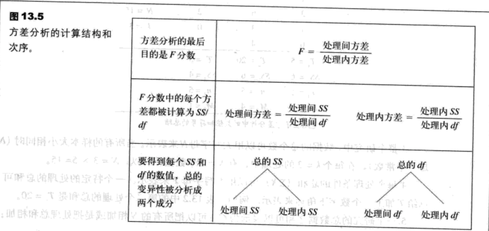

#### 平方和的计算
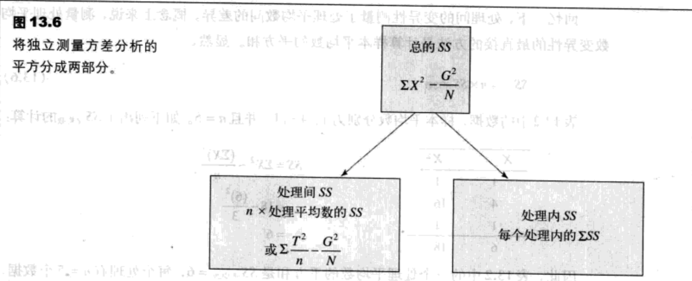

##### 总的平方和，$SS_{total}$
1. $SS_{total}$是整体N个数据的平方和。我们将用SS的计算公式来计算这个值：$SS=\sum_X^2-\frac{(\sum_X)^2}{N}$
2. 为了使这个公式和ANOVA的符号相一致，我们要用字母G来代替$\sum_X$并得到：$SS_{total}=\sum_X^2-\frac{G^2}{N}\ (13.3)$
3. 把这个公式应用到表13.2中的数据，我们得到$SS_{total}=106-\frac{30^2}{15}=46$

##### 处理内平方和，$SS_{error}$
1. 现在我们需要考虑每个处理条件内的变异性。我们已经分别计算了三个处理条件的处理内SS（表13.2）：$SS_1=6,SS_2=6,SS_3=4$。为了得到总的处理内平方和，只要将这些数值简单地相加就可以了：$SS_{error}=\sum{SS_{every error}}\ (13.4)$
2. 对于表13.2中的数据，这个公式给出了：$SS_{error}=6+6+4=16$

##### 处理间平方和，$SS_{between}$
1. 在我们介绍任何一个有关$SS_{between}$之前，需要考虑到目前为止我们所做的计算。表13.2中的数据的总的变异性是$SS_{between}=46$。我们打算把这个总值分成两部分（见图13.6）。一部分是，$SS_{error}$等于16。这意味着$SS_{between}$必须等于30，从而构成等于总和（46）的两部分（16和30）。因此，$SS_{between}$的值就可以简单地如下的减法得到：$SS_{between}=SS_{total}-SS_{error}\ (13.5)$
2. 回忆一下，处理间的变异性测量了处理平均数间的差异。概念上来说，测量处理平均数变异性的最直接的方法是计算样本平均数的平方和。显然，$SS_{between}=n \times SS_{average}\ (13.6)$
3. 表13.2中的数据，样本平均数分别为1、4和1，并且n=5.如下列出了$SS_{between}$的计算：

```
X   X2
1   1
4   16
1   1
------
6   18
```

$SS=\sum X^2-\frac{(\sum X)^2}{n}=18-\frac{(6)^2}{3}=6$

4. 因此，表13.2中的三个处理平均数的平方和是$SS_{average}=6$，每个处理有n=5个数据。因此，$SS_{between}=n \times SS_{average}=5 \times 6=30$
5. 公式13.6是为了强调$SS_{between}$测量了平均数差异。在这种情况下，我们测量了三个处理平均数的差异。但是，公式13.6只能被用在当所有的样本大小都完全相等（相等的n）的情况下，并且这个公式也有难以使用的时候，特别是当处理平均数不是整数的情况下。因此，我们有一个$SS_{between}$的计算公式。这个公式用处理总数代替了处理平均数：$SS_{between}=\sum_{\frac{T^2}{n}}-\frac{G^2}{N}\ (13.7)$
6. 在这个公式中，每个处理总和（T）被平方后，再除以处理中的数据个数。这些数值被加起来而产生公式中的第一项。下面，总数之和（G）被平方，然后再除以整个研究中的数据个数从而产生公式中的第二项。最后，用第一项减去第二项。用表13.2中的数据，这个公式可以表示如下：$SS_{between}=\frac{5^2}{5}+\frac{20^2}{5}+\frac{5^2}{5}-\frac{30^2}{15}=30$
7. 注意，这三个方法可以得到相同的结果，$SS_{between}=30$。还要注意那两个部分（处理间和处理内）要加起来等于总和。对于表13.2中的数据：$SS_{between}=SS_{total}-SS_{error}$即46=16+30

#### 自由度分析
自由度（df）的分析与SS的分析有相同的模式。首先，我们将找到整体的N个数据的df，然后将这个数值分成两部分：处理间自由度和处理内自由度。在计算自由度时，下面两点很重要：

1. 每个df都与特定的SS联系在一起。
2. 通常，通过计数有多少项用在计算SS中，并用这个数减去1就可以得到df的值。例如，如果计算一组n个数据的SS，那么df=n-1。

记住这些，我们就要检验分析的每一部分的自由度。

##### 总的自由度，$df_{total}$。
1. 要知道与$SS_{total}$相联系的df值，就必须首先注意到这个SS值测量的是整组N个数据的变异性。因此，df的值是：$df_{totla}=N-1\ (13.8)$
2. 对于表13.2中的数据，数据的总个数是N=15，所以总的自由度是$df_{totla}=15-1=14$

##### 处理内自由度，$df_{error}$。
1.  要知道与$SS_{error}$相联系的df值，就必须考虑这个SS是怎样计算的。记住，首先我们应先得出每个处理内的SS，然后再将这些值相加。每个处理SS值测量了那个处理中n个数据的变异性，所以，每个SS的df应该为df=n-1。把这些单个处理数值相加就可以得到：$df_{error}=\sum(n-1)=\sum{df_{every error}}\ (13.9)$
2. 对于之前我们考虑的实验，每个处理都有n=5个数据。这就表明，每个处理内有n-1=4个自由度。因为有三个不同的处理条件，所以总的处理内自由度是12。注意，这个df的公式只是简单地将每个处理的数据个数（n这个数值）相加，然后再在每个N里减去1。如果分别做这两个步骤，那么可以得到：$df_{error}=N-k\ (13.10)$
3. 将所有的n值相加，就可以得到N。如果在每个n里减去1，并且有k个处理，那么一共就减去了k。以表13.2中的数值为例，N=15，k=3，那么：$df_{error}=15-3=12$

##### 处理间自由度，$df_{between}$。
1. 处理的个数是由特定的字母k来表示，那么df的公式是：$df_{between}=k-1\ (13.11)$
2. 以表13.2中的数值为例，有三个不同的处理条件（三个T值），所以，处理间自由度可以这样计算：$df_{between}=3-1=2$
3. 注意，从这个自由度的分析中，我们可以得出相加等于总的自由度的两部分：$df_{total}=de_{error}+df_{between}$即14=12+2。图13.7给出了完整的自由度分析。

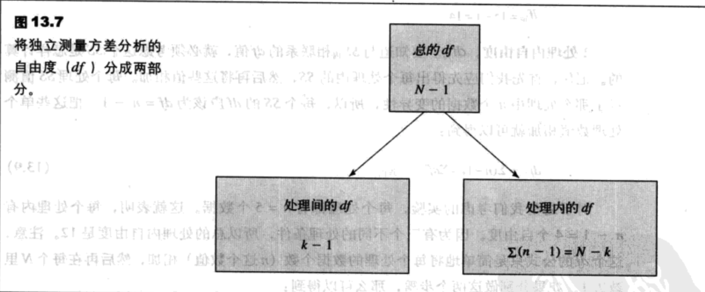

#### 方差（MS）和F分数
对于最后的F分数，我们需要分母上的处理间MS(方差)，分子上的处理内MS(方差)。在这种情况下：

MS(方差)=$s^2=\frac{SS}{df}\ (13.12)$

以我们前面用过的数据为例：

$MS_{between}=s_{between}^2=\frac{SS_{between}}{df_{between}}=\frac{30}{2}=15$

和

$MS_{error}=s_{error}^2=\frac{SS_{error}}{df_{error}}=\frac{16}{12}=1.33$

现在我们测量了处理间方差（或差异）和处理内方差。F分数只是简单地将两个方差相比：

$F=\frac{MS_{between}}{MS_{error}}\ (13.13)$

以我们检验过的实例为例，从数据中可以得出F分数为：$F=\frac{15}{1.33}=11.28$

下表表示了变异性的来源（处理间、处理内和总的变异性）SS、df、MS和F。

来源 | SS | df | MS | F
---|----|----|----|--
处理间 | 30 | 2 | 15 | F=11.28
处理内 | 16 | 12 | 1.33 | -
总和 | 46 | 14 | - | -

得出的数值F=11.28，表示F分数的分子要比分母大得多。如果你还记得公式13.1和13.2中的F分数的概念结构，那么，我们得到的F值就表明处理间差异要比偶然引起的差异大11倍多。以前面的实验中的变量为例，温度确实对学习效果有影响。但是，为了恰当地评估F分数，我们就必须检验F分布。

### F分布
在我们具体地检验这个分布之前，以下两个明显的特征值得注意：

1. 因为F分数是由两个方差计算而来，F值通常会是正值。
2. 当H0为真时，F分数的分子和分母测量的是相同的方差。在这种情况下，两个样本方差大小应该基本相等，所以，比值应该接近1.换句话说，F分布应该集中在1.00左右。

记住：有这两个因素，就可以画出F分布。分布切断在零点（都是正值），集中在1.00左右，然后向右侧逐渐变细（图13.8）。F分布的准确形状决定于F分数中两个方差的自由度。总的来说，一个大的样本（大的df）的方差提供了对总体方差更加准确的测量。因为MS数值决定于df的确切性，F分布也将决定于F分数中分子和分母上的自由度的数值。对于非常大的df值，所有的F值将集中在1.00左右。对于小一些的df值，F分布会更加分散。

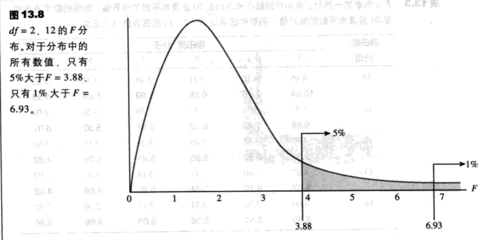

### ANOVA中假设检验和效应大小的例子
例13.1 表13.4描述的是一个测量三种止痛药（A、B和C）功效的独立测量实验的数据。第四组用的是安慰剂，同时也接受了检验。

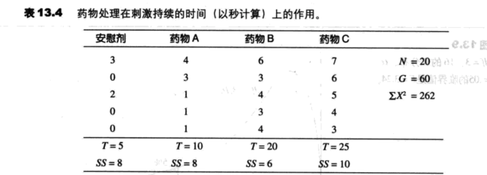

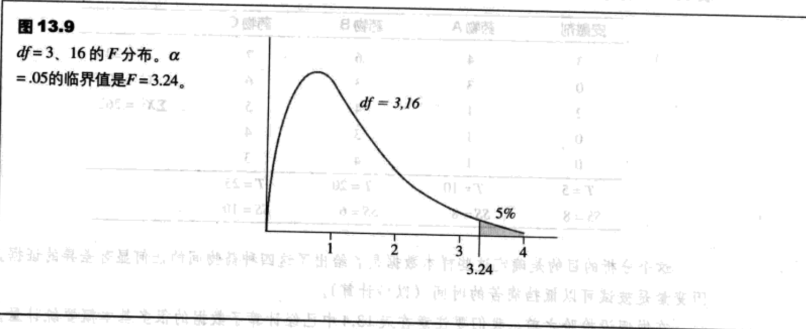

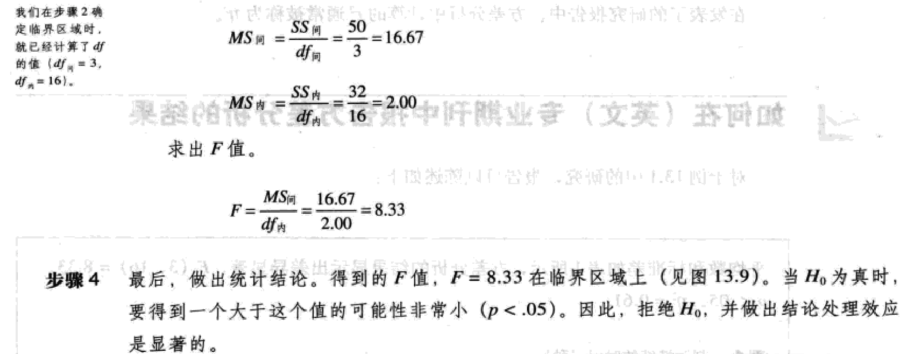

#### 效应大小
对于方差分析，最简单和最直接的测量效应大小的方法是计算$r^2$，它是能够被解释的方差的百分比。简单地说，$r^2$测量了可以由处理间差异解释的分数间的差异是多大。对于方差分析，$r^2$的计算和概念是非常简单的。

$SS_{between}$测量的是由处理间差异解释的变异性，$SS_{total}$测量的是总的变异性。因此：$r^2=\frac{SS_{between}}{SS_{total}}\ (13.14)$

对于例13.1中的数据，可以得到：$r^2=\frac{50}{82}=0.61$或61%

方差分析中计算的$r^2$通常被称为$\eta^2$。

#### 合并方差
对于第10章中的独立测量t分数，样本方差有直接作用找t分数公式底部的标准误。现在，样本方差直接作用在F分数的分母MS内的值。在t分数和F分数中，单独样本的方差合并在一起从而产生样本方差的一个平均数。对于独立测量t分数，我们将两个样本合并来计算：

合并方差=$s_p^2=\frac{SS_1+SS_2}{df_1+df_2}$

现在，在方差分析中，我们合并两个或多个样本来计算：

$MS_{error}=\frac{SS_{error}}{df_{error}}=\frac{\sum{SS}}{\sum{df}}=\frac{SS_1+SS_2+SS_3+......}{df_1+df_2+df_3+......}$

#### 样本大小不相等例子
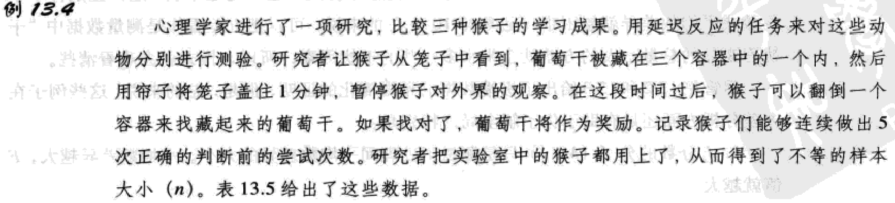
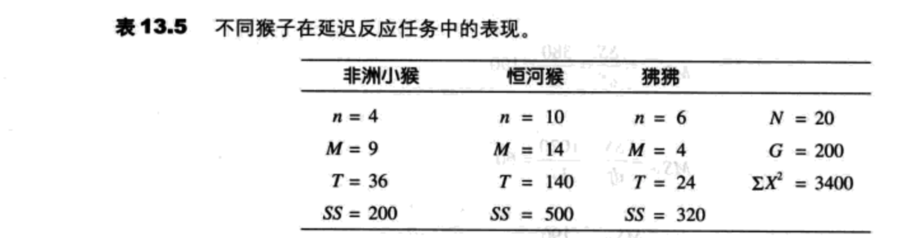


### 事后比较
如同前面提到的，ANOVA的最大优势（与t检验相比）是：在有多于两个处理条件的时候，允许研究者检验平均数差异。方差分析通过在一个检验中同时比较所有的单独平均数差异来达到这一优势。不幸的是，把多个平均数差异合并成一个统计检验的过程使得解释检验结果变得困难。特别是，当得到一个显著的F值（拒绝H0）时，只表明在所有的平均数差异中至少有一个是比由偶然引起的差异大。换句话说，总的F值只是表明了显著差异的存在，并没有表明到底是哪些平均数是显著不同的，哪些平均数不是显著不同的。

`事后比较`是附加的假设检验，在方差分析后使用，从而准确地确定哪些平均数差异是显著的，哪些不是。

#### Tukey真实显著差异检验
检验的公式：$HSD=q\sqrt{\frac{MS_{error}}{n}}\ (13.15)$


#### Scheffe检验
Scheffe检验是降低第一类误差的一种谨慎的方法，它可能是最安全的事后比较。Scheffe检验用F值来检验任意两个处理条件间的显著差异。F分数的分子是处理间的MS，是通过计算你只想比较的两个处理而得来的。分母是处理内的同一个MS，它被用来计算总的ANOVA。Scheffe检验的“安全因素”是从下面两点考虑得来的：

1. 尽管只是比较了两个处理，Scheffe检验用原始实验的k值来计算处理间的df。因此，F分数分子上的df是k-1。
2. Scheffe F分数的临界值与用来评估总的ANOVA中F分数的临界值是一样的。因此，Scheffe要求每个事后比较都要满足与用来完成方差分析的标准相同。下面的例子用表13.6中的数据，展示了Scheffe检验的过程。

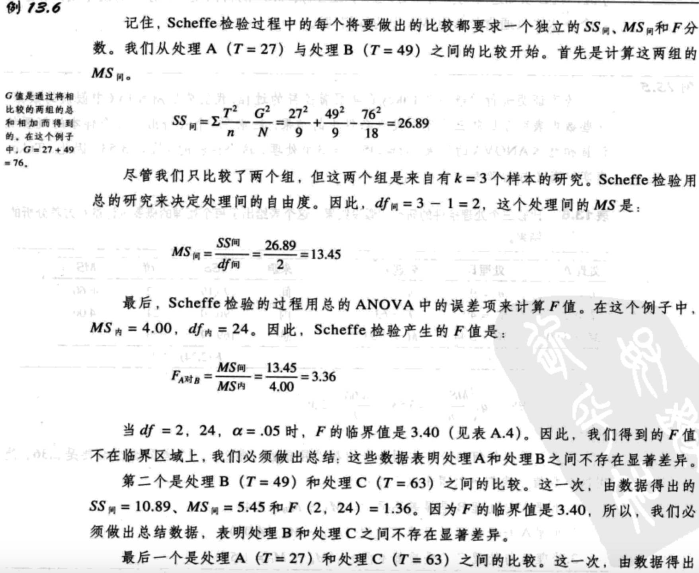


### ANOVA与t检验之间的关系
$F=t^2$

这个关系可以首先用观察F和t的公式的结构来解释。

t分数的结构把样本（分子）间的真实差异与由偶然引起的期望标准差（分母）进行了比较。

t=样本平均数间的差异/由偶然（误差）引起的期望差异

F分数的解构也把样本间的平均数差异与由偶然或误差引起的差异进行了比较。但是，F分数的分子和分母测量的是方差。因此，我们将F分数表达如下：

F=样本间的差异^2/偶然引起的期望差异^2

t分数是建立在差异的基础上以及F分数是建立在差异的平方上的这两个事实，导致了t分数和F分数之间最基本的关系$F=t^2$。

#### 独立测量ANOVA的假设
独立测量ANOVA要求同样的三个假设，这些假设对于独立测量t检验是必要的：

1. 每个样本内的观察必须是独立的。
2. 样本源自的总体必须是正态的。
3. 样本源自的总体的方差必须相等（方差齐性）。
